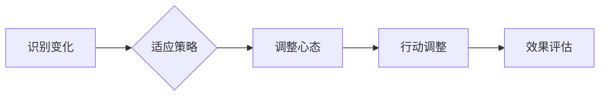
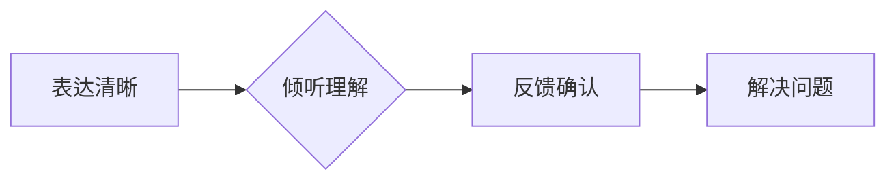
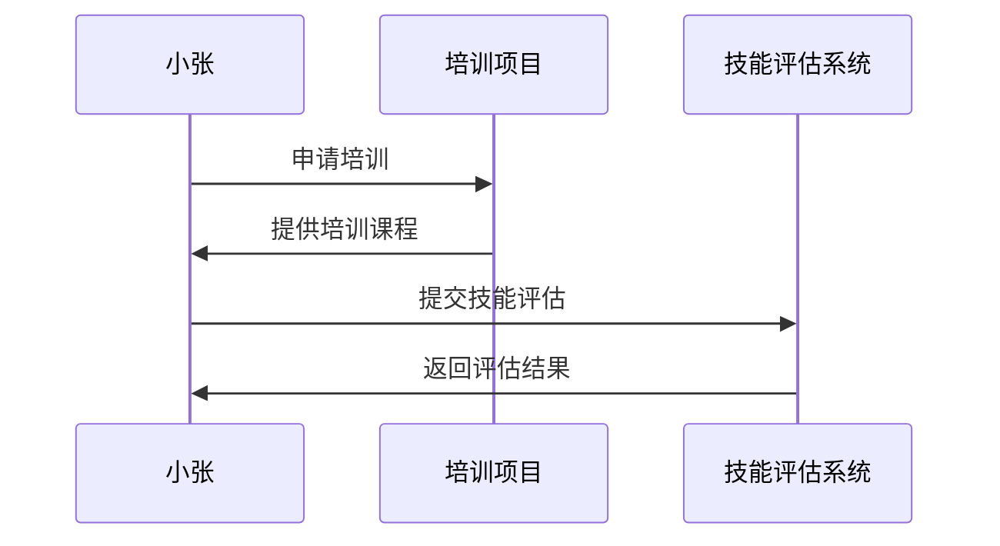
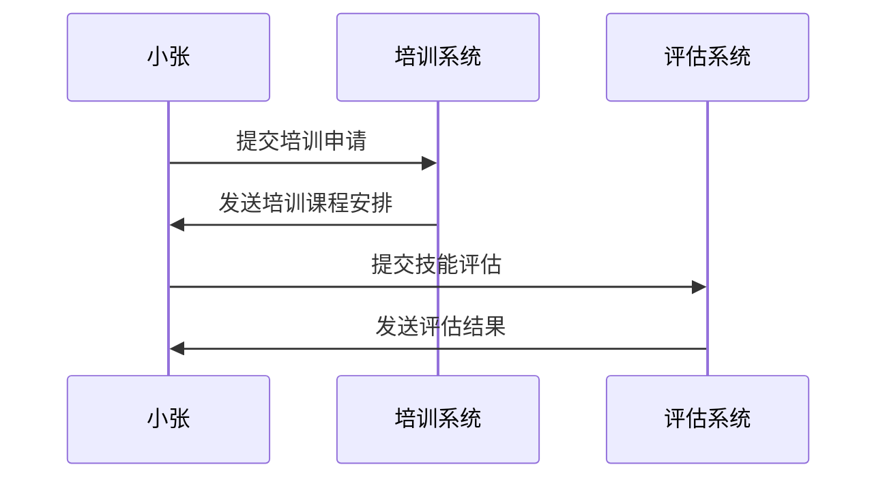

                 


# 在大背景中定位自我：编织个人与集体的故事

> 关键词：自我认知、集体意识、适应策略、沟通技巧、个人发展、集体互动

> 摘要：本文旨在探讨如何在快速变化的时代背景下找到个人的定位，理解个人与集体之间的联系，并提供实用的工具和策略，帮助读者实现个人与集体的和谐共存。

### 第1章： 引言与背景

#### 1.1 问题的提出

在当今这个信息爆炸、技术飞速发展的时代，人们面临着一个前所未有的挑战：如何在复杂多变的环境中找到自我。随着全球化、数字化和智能化进程的加速，社会的流动性增强，人们的角色和身份变得多样且模糊。这种变化不仅影响了职业发展，也深刻地影响了人们的自我认知。许多人感到自己的位置和方向变得不确定，无法找到清晰的生活目标。

#### 1.2 问题的解决

本书将围绕这一核心问题，通过心理学、社会学和哲学等多个领域的探讨，提供一系列实用的工具和策略。我们希望通过这些探讨，帮助读者深入了解自己，找到个人的定位，并理解我们与集体之间的联系。本书将分为以下几个部分：

1. **自我认知**：帮助读者认识自己的兴趣、价值观和目标。
2. **集体意识**：理解集体文化、价值观和期望。
3. **适应策略**：学习如何在变化的环境中保持平衡和适应。
4. **沟通技巧**：提高个人与集体之间的沟通效率。
5. **案例分析**：通过实际案例，深入剖析个人定位的策略和技巧。

#### 1.3 边界与外延

本书不仅关注个人的成长和发展，也关注个人与集体的互动关系。我们将探讨如何处理个人与家庭、组织和社会之间的复杂关系，以实现个人与集体的双赢。此外，本书还将讨论如何平衡个人追求与集体期望，如何在多元文化背景下找到自我。

#### 1.4 概念结构与核心要素

为了更好地理解本书的内容，我们可以将其核心概念和要素进行结构化：

1. **自我认知**：了解自己的兴趣、价值观和目标。
2. **集体意识**：理解集体文化、价值观和期望。
3. **适应策略**：学习如何在变化的环境中保持平衡和适应。
4. **沟通技巧**：提高个人与集体之间的沟通效率。

### 第2章：个人定位的核心概念

#### 2.1 自我认知

**概念原理**：自我认知是指对自己的理解，包括自己的性格、能力、需求等。这是个人定位的基础，也是实现个人成长的关键。

**属性特征对比表格**

| 特征         | 自我认知       | 自我评价       |
|--------------|----------------|----------------|
| 内容         | 内在理解       | 外在表现       |
| 动机         | 探索自我       | 自我肯定       |
| 结果         | 自我成长       | 自我实现       |

**ER实体关系图架构的Mermaid流程图**

```mermaid
erDiagram
    自我认知 ||--|{ 自我评价 }
```

#### 2.2 集体意识

**概念原理**：集体意识是指对集体文化、价值观和期望的理解。这是个人在社会中定位的重要依据，也是实现个人与集体和谐共存的必要条件。

**属性特征对比表格**

| 特征         | 集体意识       | 集体期望       |
|--------------|----------------|----------------|
| 内容         | 集体认同       | 集体标准       |
| 形式         | 内隐文化       | 明文规定       |
| 动向         | 自我调整       | 外在表现       |

**ER实体关系图架构的Mermaid流程图**

```mermaid
erDiagram
    集体意识 ||--|{ 集体期望 }
```

### 第3章：个人定位的方法与策略

#### 3.1 适应策略

**概念原理**：适应策略是指在面对环境变化时，采取相应的措施以保持平衡。适应策略是个人定位的核心之一，它帮助个人在变化的环境中找到自己的位置。

**算法原理讲解**



**数学模型和公式**

$$
\text{适应策略} = f(\text{变化程度}, \text{个人能力}, \text{环境因素})
$$

**详细讲解和举例说明**

在面对一个新工作环境时，小明需要调整自己的工作方式。他首先识别出变化，然后根据自身能力和环境因素，制定了适应策略，包括调整工作时间、学习新技能和与同事建立良好关系。

#### 3.2 沟通技巧

**概念原理**：沟通技巧是指提高个人与集体之间沟通效率的方法。有效的沟通是个人定位的重要保障，它帮助个人更好地融入集体，实现个人与集体的共赢。

**算法原理讲解**



**数学模型和公式**

$$
\text{沟通效率} = f(\text{表达清晰度}, \text{倾听理解度}, \text{反馈及时性})
$$

**详细讲解和举例说明**

在一个团队项目中，张三通过清晰表达自己的想法，积极倾听同事的意见，并及时给予反馈，成功提高了团队沟通效率，确保项目顺利进行。

### 第4章：个人定位的案例分析

#### 4.1 案例一：小张的职业转型

**案例背景**：小张在一家大公司工作多年，感到自己的职业发展遇到了瓶颈。他意识到需要改变，但不知道如何开始。

**系统分析与架构设计方案**

**问题场景介绍**：小张想要转型，但不知道如何开始。

**项目介绍**：小张决定参加一个职业培训项目，提升自己的技能。

**系统功能设计(领域模型Mermaid类图)**

```mermaid
classDiagram
    类域 <<Note>> "职业转型：需求分析、培训、实践"
    类小张
    类职业培训
    类技能评估
    小张 --|>{ 获取培训信息
    小张 --|>{ 完成培训
    小张 --|>{ 进行技能评估
```

**系统架构设计mermaid架构图**



**系统接口设计和系统交互mermaid序列图**



**系统核心实现源代码**

```python
# 培训系统核心代码
class TrainingSystem:
    def apply_training(self, user):
        # 处理培训申请
        pass

    def send_training_plan(self, user):
        # 发送培训课程安排
        pass

# 技能评估系统核心代码
class AssessmentSystem:
    def submit_assessment(self, user):
        # 处理技能评估提交
        pass

    def send_assessment_result(self, user):
        # 发送评估结果
        pass
```

**代码应用解读与分析**

小张通过培训系统提交培训申请，系统将根据申请信息为小张提供相应的培训课程。小张完成培训后，通过评估系统提交技能评估，系统将根据评估结果反馈给小张。

**实际案例分析和详细讲解剖析**

小张在参加职业培训后，成功转型为了一名数据分析师。通过培训和学习，他掌握了数据分析的核心技能，并在工作中得到了领导和同事的认可。小张的成功转型，不仅实现了个人职业发展的突破，也为公司带来了新的价值。

**项目小结**

小张的职业转型案例展示了个人定位的重要性和可行性。通过自我认知和适应策略，小张找到了自己的定位，并在集体中找到了自己的位置。这一案例为我们提供了宝贵的经验和启示。

### 最佳实践 Tips

1. **定期反思**：定期对自己的职业和生活进行反思，了解自己的兴趣、价值观和目标。
2. **持续学习**：不断学习新知识、新技能，提升自己的竞争力。
3. **积极沟通**：与同事、领导和家人保持良好的沟通，理解他们的需求和期望。
4. **灵活适应**：面对变化，保持灵活的态度，采取适应策略，找到自己的位置。

### 小结

在大背景中定位自我是一个复杂而重要的过程。通过自我认知、集体意识、适应策略和沟通技巧，我们可以找到自己的位置，实现个人与集体的和谐共存。希望本书的内容能够帮助您在个人与集体的故事中，编织出属于自己的精彩篇章。

### 注意事项

1. **自我认知**：自我认知是一个持续的过程，需要不断反思和调整。
2. **适应策略**：适应策略需要根据个人能力和环境因素灵活调整。
3. **沟通技巧**：沟通技巧需要通过实践不断磨练和提升。

### 拓展阅读

1. 《心理学与生活》 - 理查德·吉尔伯特（Richard J. Gerrig）
2. 《人类简史》 - 尤瓦尔·赫拉利（Yuval Noah Harari）
3. 《智慧投资》 - 彼得·林奇（Peter Lynch）

### 作者信息

*作者：AI天才研究院/AI Genius Institute & 禅与计算机程序设计艺术 /Zen And The Art of Computer Programming*

