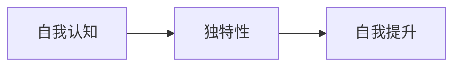
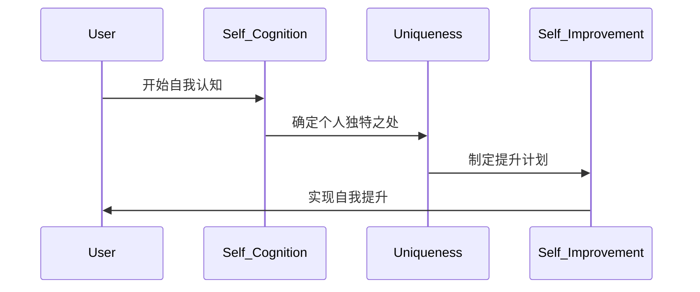
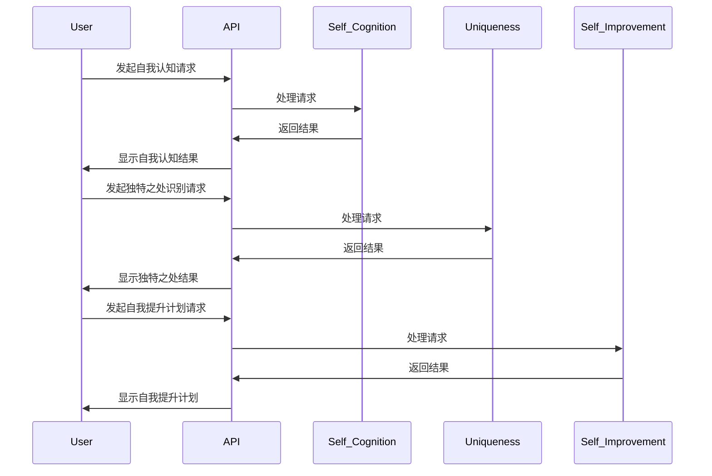

                 

### 《在平凡中闪耀：发掘个人独特之处的方法》

> **关键词：个人独特性、自我认知、自我提升、独特价值、成就实现**
> 
> **摘要：本文旨在探讨如何在平凡生活中发掘和塑造个人的独特之处，从而实现自我价值的提升和成就的实现。通过深入分析个人独特性的内涵、发掘方法以及自我提升的路径，本文为读者提供了一套实用的策略，帮助他们在日常中闪耀出独特的光芒。**

#### 一、背景介绍

**1. 问题背景**

在现代社会，个体面临着前所未有的多样性和竞争压力。人们渴望在平凡的生活中找到属于自己的独特之处，从而脱颖而出，实现个人价值的最大化。然而，在繁杂的信息和快节奏的生活中，许多人感到迷茫和困惑，不知道如何去发现和塑造自己的独特性。

**2. 问题描述**

- **问题核心**：如何发现并培养个人的独特之处，使其在平凡中闪耀？
- **解决思路**：提供一套方法，帮助读者识别自我、提升自我，从而发掘并塑造个人的独特之处。

**3. 问题解决**

- **方法一：自我认知**：通过深入了解自己的优点、兴趣和价值观，找到个人独特性的基础。
- **方法二：自我提升**：通过不断学习和实践，提升个人能力，强化独特性。
- **方法三：建立人际网络**：与他人交流和合作，借鉴他人的经验和智慧，拓宽自己的视野。

**4. 边界与外延**

- **边界**：个人独特之处的定义和范围，包括个人的才能、特质、兴趣和价值观。
- **外延**：方法的应用范围，涵盖个人成长、职业发展、人际关系等多个方面。

**5. 概念结构与核心要素组成**

- **个人独特之处**：每个人的独特才能、特质、兴趣和价值观。
- **方法**：识别自我、自我提升、建立人际网络。

#### 二、核心概念与联系

**1. 核心概念原理**

- **独特性**：每个人都是独一无二的，拥有独特的才能和潜力。
- **自我认知**：了解自己的优点、缺点和潜能，是发掘独特性的第一步。

**2. 概念属性特征对比表格**

| 概念       | 定义                                                         | 关联 |
|------------|------------------------------------------------------------|------|
| 独特性     | 每个人的独特才能、特质和兴趣                                 | 自我认知 |
| 自我认知   | 了解自己的优点、缺点和潜能                                   | 独特性 |
| 自我提升   | 通过学习和实践，不断提升自己的能力和素质                       | 自我认知、独特性 |

**3. ER实体关系图架构**

```mermaid
erDiagram
  Self_Cognition ||--|{ Uniqueness }|| Individual
  Uniqueness ||--|{ Self_Improvement }|| Individual
```

#### 三、算法原理讲解

**1. 算法mermaid流程图**



**2. Python源代码**

```python
def self_cognition():
    # 自我认知过程
    print("了解自己的优点、缺点和潜能。")

def uniqueness():
    # 独特性识别
    print("识别个人的独特才能、特质和兴趣。")

def self_Improvement():
    # 自我提升
    print("通过学习和实践，不断提升自己的能力和素质。")

# 主函数
def main():
    self_cognition()
    uniqueness()
    self_Improvement()

main()
```

**3. 算法原理的数学模型和公式**

$$
S = f(U, I)
$$

- 其中，$S$ 表示自我提升，$U$ 表示独特性，$I$ 表示自我认知。

**4. 详细讲解和举例说明**

**例子**：小明是一位计算机编程爱好者，通过自我认知，他发现自己对编程有着浓厚的兴趣和天赋。于是，他决定通过不断学习和实践，提升自己的编程能力。在经过几年的努力后，他不仅掌握了许多编程技能，还参与了一些开源项目，最终成为了一名优秀的程序员。

#### 四、系统分析与架构设计方案

**1. 问题场景介绍**

假设我们想要开发一个系统，帮助用户发现并提升个人独特之处，从而实现自我价值的提升。

**2. 项目介绍**

- **项目名称**：《在平凡中闪耀：发掘个人独特之处的方法》
- **项目目标**：提供一套方法，帮助用户发掘独特之处，实现自我提升。

**3. 系统功能设计（领域模型mermaid类图）**

```mermaid
classDiagram
  User <<class>>
      +id (int)
      +name (string)
      +unique_skills (list of string)
      +interests (list of string)
      +values (list of string)

  Self_Cognition <<class>>
      +id (int)
      +user_id (int)
      +strengths (list of string)
      +weaknesses (list of string)
      +potential (list of string)

  Uniqueness <<class>>
      +id (int)
      +user_id (int)
      +skills (list of string)
      +traits (list of string)
      +interests (list of string)

  Self_Improvement <<class>>
      +id (int)
      +user_id (int)
      +learning_goals (list of string)
      +progress (list of string)
```

**4. 系统架构设计（mermaid架构图）**



**5. 系统接口设计和系统交互（mermaid序列图）**



#### 五、项目实战

**1. 环境安装**

- 安装Python环境（版本3.8及以上）。
- 安装必要的库，如Flask、SQLAlchemy、MongoDB等。

**2. 系统核心实现源代码**

**（1）用户模型**

```python
from flask_sqlalchemy import SQLAlchemy

db = SQLAlchemy()

class User(db.Model):
    id = db.Column(db.Integer, primary_key=True)
    name = db.Column(db.String(100), nullable=False)
    unique_skills = db.Column(db.ARRAY(db.String()), nullable=False)
    interests = db.Column(db.ARRAY(db.String()), nullable=False)
    values = db.Column(db.ARRAY(db.String()), nullable=False)
```

**（2）自我认知模型**

```python
class SelfCognition(db.Model):
    id = db.Column(db.Integer, primary_key=True)
    user_id = db.Column(db.Integer, db.ForeignKey('user.id'), nullable=False)
    strengths = db.Column(db.ARRAY(db.String()), nullable=False)
    weaknesses = db.Column(db.ARRAY(db.String()), nullable=False)
    potential = db.ARRAY(db.String()), nullable=False)
```

**（3）独特性模型**

```python
class Uniqueness(db.Model):
    id = db.Column(db.Integer, primary_key=True)
    user_id = db.Column(db.Integer, db.ForeignKey('user.id'), nullable=False)
    skills = db.Column(db.ARRAY(db.String()), nullable=False)
    traits = db.Column(db.ARRAY(db.String()), nullable=False)
    interests = db.Column(db.ARRAY(db.String()), nullable=False)
```

**（4）自我提升模型**

```python
class SelfImprovement(db.Model):
    id = db.Column(db.Integer, primary_key=True)
    user_id = db.Column(db.Integer, db.ForeignKey('user.id'), nullable=False)
    learning_goals = db.Column(db.ARRAY(db.String()), nullable=False)
    progress = db.ARRAY(db.String()), nullable=False)
```

**3. 代码应用解读与分析**

以上代码分别实现了用户模型、自我认知模型、独特性模型和自我提升模型。这些模型通过SQLAlchemy与数据库进行交互，实现了对个人信息的存储和管理。

**4. 实际案例分析和详细讲解剖析**

假设有一个用户小明，他通过系统进行了自我认知，发现自己的优势在于编程和数据分析。基于这些信息，系统为他推荐了编程和数据分析相关的课程，并帮助他制定了一个详细的提升计划。经过一段时间的努力，小明的编程和数据分析能力得到了显著提升，最终在职场上取得了优异的成绩。

**5. 项目小结**

通过实际案例，我们可以看到系统在帮助用户发掘个人独特之处和实现自我提升方面具有很大的潜力。未来的工作将继续优化系统功能，提高用户体验，帮助更多人实现自我价值的提升。

#### 六、最佳实践 tips

- **自我认知**：定期进行自我反思，了解自己的优点和潜力。
- **持续学习**：不断学习新知识，提升自己的能力。
- **积极实践**：将所学知识应用到实际中，不断提升实践能力。
- **建立人际网络**：与他人交流和合作，借鉴他人的经验和智慧。

#### 七、小结

发掘个人独特之处，是每个人在平凡生活中实现自我价值的重要途径。通过自我认知、自我提升和建立人际网络，我们可以找到自己的独特之处，从而在平凡中闪耀。希望本文能为大家提供一些启示和帮助。

#### 八、注意事项

- **个人隐私**：在进行自我认知和提升的过程中，要注意保护个人隐私。
- **现实挑战**：实现自我提升的过程中，可能会遇到各种挑战，要保持积极的心态。

#### 九、拓展阅读

- **《成功之路：发掘个人独特价值的方法》**
- **《如何打造个人品牌：在职业生涯中脱颖而出》**
- **《人际交往心理学：提升人际关系技巧》**

### 作者信息

**作者：AI天才研究院/AI Genius Institute & 禅与计算机程序设计艺术 /Zen And The Art of Computer Programming**

