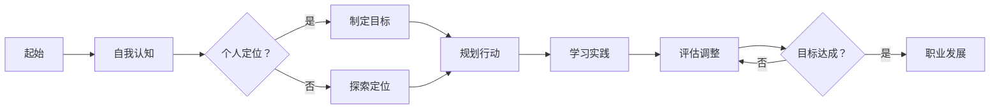
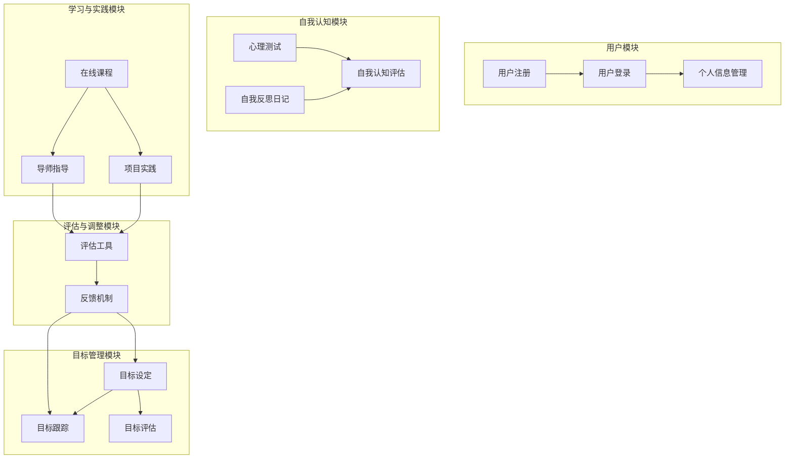
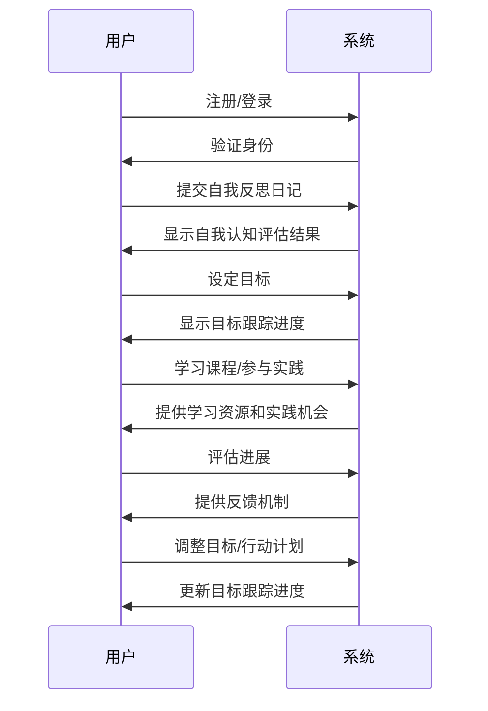

                 

### 1.1 题目背景与意义

在现代社会的快速发展和信息爆炸的背景下，每个人都面临着巨大的竞争压力。无论是在职场中还是日常生活中，如何脱颖而出，展现个人的独特之处，成为了每个人必须面对的重要课题。本文旨在探讨如何在平凡中发掘和展现个人的独特之处，以此应对当代社会的各种挑战。

首先，我们不得不提到当代社会所面临的一系列挑战。全球化进程的加快，使人才竞争日益激烈；技术的迅猛发展，要求人们不断更新知识和技能；社会的多元化与复杂性，使得人际关系和团队合作变得愈发重要。在这样的背景下，个人的独特之处不仅成为了脱颖而出的关键，更是实现自我价值的重要途径。

那么，什么是个人独特之处？它是指每个人在性格、兴趣、技能、价值观等方面所表现出的与众不同之处。这些独特之处并非与生俱来，而是通过个人的成长、学习和实践不断挖掘和塑造的。因此，发掘个人独特之处不仅有助于自我认知和自我提升，还对职业发展和社会交往具有重要意义。

在职场中，个人独特之处可以成为个人品牌的重要组成部分。一个独特的个人品牌能够帮助个人在激烈的职场竞争中脱颖而出，赢得更多的机会和资源。此外，个人独特之处还能够促进团队合作和创新，为团队和组织带来新的活力和动力。

在社会交往中，个人独特之处同样发挥着重要作用。它能够帮助个人建立独特的人际关系，增强个人魅力和影响力。通过独特的个性和价值观，个人可以在社交网络中建立自己的影响力，传播自己的思想和理念，进而对社会产生积极的影响。

总的来说，发掘和展现个人的独特之处，不仅是为了在当代社会中立足，更是为了实现自我价值，推动个人成长和社会进步。本文将围绕这一主题，从多个角度进行深入探讨，帮助读者在平凡中找到不凡的自我。### 1.2 个人独特之处的定义与价值

#### 1.2.1 个人独特之处的内涵

个人独特之处是指个体在性格、兴趣、技能、价值观等方面所表现出的与众不同之处。这些独特之处可以是天生的，也可以是后天培养和塑造的。例如，一个人的性格特点如乐观、细心或勇敢，其兴趣和爱好如音乐、绘画或编程，以及其技能和专长如编程、演讲或写作，这些都是个人独特之处的体现。

从心理学角度来看，个人独特之处与自我认知密切相关。自我认知是指一个人对自己性格、能力、价值观等内在特质的认识和理解。一个具有良好自我认知的人，能够清楚地认识到自己的优点和不足，从而在日常生活中更加自信和积极。

#### 1.2.2 个人独特之处的社会价值

个人独特之处不仅对个人的成长和发展具有重要意义，也在社会中发挥着重要作用。以下是从不同角度探讨个人独特之处的社会价值：

**1. 增强个人竞争力：** 在职场中，个人独特之处是提升竞争力的关键因素。一个具有独特技能或专长的人，能够在众多竞争者中脱颖而出，获得更多的发展机会。例如，一个擅长编程的人，在IT行业中拥有明显的优势。

**2. 促进团队合作：** 个人独特之处能够为团队带来多样性和创新。不同的个性、技能和思维方式，有助于团队在解决问题和面对挑战时找到更多有效的解决方案。一个团队中的每个人都能发挥自己的独特之处，形成协同效应，共同实现目标。

**3. 塑造个人品牌：** 个人品牌是指个人在公众心目中的形象和声誉。一个具有独特性格、技能和价值观的个人，能够在社交网络和职场中建立起独特的个人品牌，从而提升自己的社会地位和影响力。

**4. 社会创新与进步：** 个人独特之处是社会创新和进步的重要源泉。一个具有创新思维和独特视角的人，能够在科研、艺术、文化等领域带来新的突破和进展，推动社会的发展和进步。

**5. 改善人际关系：** 个人独特之处有助于建立和维护良好的人际关系。一个具有独特魅力和价值观的人，能够与他人建立更深层次的联系，增进彼此的了解和信任，从而在社会交往中更加得心应手。

综上所述，个人独特之处不仅对个人的成长和发展具有重要意义，也在社会中发挥着不可或缺的作用。它不仅能够增强个人竞争力，促进团队合作，塑造个人品牌，还对社会创新和进步以及人际关系改善产生积极影响。因此，发掘和展现个人的独特之处，是每个人实现自我价值和社会贡献的重要途径。### 1.3 挖掘个人独特之处的方法

#### 1.3.1 内在自我探索

内在自我探索是挖掘个人独特之处的重要方法之一。通过深入反思和自我分析，个体可以更清晰地认识到自己的性格、兴趣、价值观等内在特质。以下是一些具体的方法：

**1. 自我反思日记：** 每天花费一定时间记录自己的所思所感，回顾一天中的经历和情绪。通过这种方式，个体可以逐渐发现自己在不同情境下的反应和行为模式，从而更好地了解自己的内心世界。

**2. 心理测试：** 参加一些权威的心理测试，如MBTI、DISC等，可以了解自己的性格特点、兴趣爱好和潜在优势。这些测试结果可以作为自我探索的参考，帮助个体更全面地认识自己。

**3. 内在对话：** 在安静的环境中，与自己进行深入的对话。思考自己的梦想、目标以及最想实现的事情。这种对话可以帮助个体找到内心的声音，明确自己的人生方向。

#### 1.3.2 外在环境观察

外在环境观察是通过观察和分析个体在不同环境中的表现，来挖掘个人独特之处的方法。以下是一些具体的方法：

**1. 观察他人评价：** 询问亲朋好友、同事或导师对自己的看法。他们可能会从不同的角度提供关于自己的见解，帮助个体更全面地认识自己。

**2. 回顾以往成就：** 分析自己在过去取得的成就和成功经历，思考是什么因素促使自己取得这些成就。这可以帮助个体发现自己在哪些方面具有优势。

**3. 参与不同活动：** 尝试参与各种不同类型的活动，如社交聚会、志愿者工作、兴趣爱好小组等。这些活动可以提供不同的体验和视角，帮助个体发现自己的兴趣和潜力。

**4. 观察自己的行为：** 在日常生活中，注意自己的行为和反应。记录下自己在不同情境下的表现，思考这些行为背后的原因和动机。

#### 1.3.3 结合内在自我探索与外在环境观察

为了更全面地挖掘个人独特之处，个体需要将内在自我探索与外在环境观察结合起来。以下是一种可能的步骤：

**1. 收集数据：** 通过自我反思日记、心理测试、他人评价、参与活动等方式，收集关于自己性格、兴趣、价值观等方面的数据。

**2. 数据分析：** 对收集到的数据进行分析，寻找共同点和差异点。通过对比分析，可以更清晰地看到自己的独特之处。

**3. 反思与总结：** 在数据分析的基础上，反思自己的经历和感受，总结出个人独特之处的核心要素。

**4. 确定目标：** 根据个人独特之处，设定符合自己兴趣和能力的目标，并制定相应的行动计划。

通过内在自我探索与外在环境观察的结合，个体可以更全面地认识自己，发掘个人独特之处，并在生活和工作中充分发挥这些独特之处的价值。### 1.4 个人独特之处与职业发展

#### 1.4.1 职场中的个人特色

在职场中，个人特色是个人独特之处的重要组成部分。它不仅体现在专业技能和知识上，还包括性格特点、行为习惯和价值观等方面。以下是一些具体的个人特色：

**1. 专业技能和知识：** 每个人都有自己的专业领域和知识储备。一个熟练掌握编程技能的软件工程师，与一个精通市场营销策略的市场营销专家，在职场中的个人特色是截然不同的。

**2. 性格特点：** 开朗、乐观、细心、勇敢等性格特点，也会在职场中体现出来。例如，一个乐观的人往往更容易与同事建立良好的关系，而一个细心的人则可能在项目管理中发挥重要作用。

**3. 行为习惯：** 个人的行为习惯，如时间管理、工作态度和沟通方式，也会影响职场中的表现。一个高效的时间管理者，能够更好地完成工作任务；一个积极乐观的工作态度，能够激励团队士气；一个良好的沟通方式，能够有效地与他人协作。

**4. 价值观：** 个人的价值观决定了他们在职场中的行为准则和决策依据。一个注重诚信和责任的人，往往会赢得同事和领导的信任；一个追求创新和进步的人，则可能在职场中不断突破自我，取得更大的成就。

#### 1.4.2 个人独特之处对职业发展的助力

个人独特之处在职业发展中发挥着重要的作用。以下是一些具体的表现：

**1. 增强竞争力：** 个人独特之处能够为个人在职场中赢得更多的竞争优势。一个具有独特专业技能和知识的人，在应聘或晋升时会有更大的优势；一个具有独特性格特点和行为习惯的人，能够更好地适应不同的工作环境和团队。

**2. 提升工作效率：** 个人独特之处能够帮助个人在工作中更加高效地完成任务。例如，一个擅长时间管理的人，能够更好地规划工作任务，提高工作效率；一个沟通能力出色的人，能够有效地与他人协作，避免沟通障碍。

**3. 促进团队合作：** 个人独特之处能够为团队带来多样性和创新。不同的性格特点、技能和思维方式，有助于团队在解决问题和面对挑战时找到更多有效的解决方案。一个具有独特价值观的人，能够为团队注入新的思想活力，推动团队不断进步。

**4. 塑造个人品牌：** 个人独特之处是塑造个人品牌的重要组成部分。一个在职场中展现出独特个人特色的人，能够建立起自己的个人品牌，提升自己的社会地位和影响力。这不仅有助于个人的职业发展，还能为个人带来更多的发展机会和资源。

#### 1.4.3 个人独特之处在职业发展中的应用策略

为了更好地发挥个人独特之处在职业发展中的作用，以下是一些建议：

**1. 自我认知：** 首先，要清晰地认识到自己的独特之处，包括专业技能、性格特点、行为习惯和价值观等。这有助于个人在职业规划和发展中，更加有针对性地提升自己的优势。

**2. 不断学习：** 个人独特之处并非一成不变，而是需要通过不断学习和实践来不断发展和完善。个人应该注重终身学习，提升自己的专业技能和知识储备，以适应不断变化的职场环境。

**3. 寻找机会：** 在职业发展中，要主动寻找能够发挥个人独特之处的机会。这可以通过参加各种项目、活动和工作来实现，从而在实践中不断提升自己的能力和经验。

**4. 建立人脉：** 个人独特之处不仅可以为个人带来职业发展机会，还可以为个人建立广泛的人脉资源。通过积极参与社交活动和行业交流，个人可以结识更多的同行和专家，为自己的职业发展提供更多的支持和帮助。

**5. 持续改进：** 在职业发展中，要不断地反思和改进自己的个人特色。通过自我反思、他人反馈和持续学习，个人可以不断提升自己的独特之处，使其在职场中更具竞争力。

总之，个人独特之处在职业发展中具有重要的作用。通过清晰地认识自己的独特之处，不断学习和提升，寻找合适的职业机会，建立人脉资源，个人可以在职场中充分发挥自己的独特价值，实现职业发展和个人成长。### 1.5 个人独特之处与社会影响

#### 1.5.1 个人影响力与社会价值

个人独特之处不仅对个人职业发展有重要影响，还能够对社会产生深远的正面影响。个人影响力是指个人在社会中产生的积极影响，这种影响可以体现在多个方面：

**1. 知识传播：** 具有独特知识和技能的个人，可以通过教学、研究、创作等方式，将知识传递给他人，促进社会的知识普及和进步。

**2. 创新推动：** 个人独特之处，尤其是创新思维和独特视角，可以激发社会创新，推动新技术、新产品和新观念的产生，从而引领社会的发展。

**3. 文化传承：** 具有独特文化背景和艺术天赋的个人，可以通过创作和表演，传承和弘扬民族文化，增强社会的文化认同和凝聚力。

**4. 社会参与：** 个人通过参与公共事务、志愿服务等，将个人的独特价值和社会需求相结合，为社会的和谐与进步贡献力量。

**5. 社会风气改善：** 具有积极价值观和道德品质的个人，可以通过言行示范，影响周围的人，促进社会风气的改善和文明进步。

#### 1.5.2 独特之处的社会影响力

个人独特之处在社会中的影响力取决于多个因素，包括个人的知名度、影响力传播的途径、社会接受度等。以下是一些具体的分析：

**1. 知名度与影响力：** 一个具有高知名度的个人，其独特之处更容易受到社会的关注和认可，从而产生更大的社会影响力。例如，科技领域的专家、知名企业家和知名作家等，往往因为他们的独特之处而受到广泛尊重和追随。

**2. 影响力传播途径：** 现代社会，信息技术的发展为个人独特之处的传播提供了多种途径，如社交媒体、网络平台、传统媒体等。一个善于利用这些途径的个人，可以迅速扩大其影响力，将独特的思想、技能和价值观传播到更广泛的受众。

**3. 社会接受度：** 个人独特之处的社会影响力也受到社会接受度的影响。一个被广泛接受和认同的个人独特之处，能够更容易地在社会中产生积极影响。反之，如果个人独特之处与社会主流价值观相悖，可能会受到抵制和排斥。

#### 1.5.3 独特之处的传播与传承

为了确保个人独特之处能够得到有效的传播和传承，以下是一些建议：

**1. 教育与培训：** 通过教育和培训，可以培养更多具有独特之处的人才。教育机构应该注重培养学生的创新思维、实践能力和个人特色，为他们提供展示和发挥自己独特之处的机会。

**2. 传播媒介：** 利用各种传播媒介，如书籍、文章、讲座、视频等，可以广泛传播个人的独特之处。个人应该善于利用社交媒体、博客、YouTube等平台，将自己的思想和作品传播给更多人。

**3. 社会活动：** 通过参与各种社会活动，如公益项目、文化活动、学术论坛等，个人可以与他人交流和分享自己的独特之处，扩大其影响力。

**4. 培养接班人：** 具有独特之处的个人应该培养下一代人才，传承自己的独特之处。这可以通过指导学生、培养学徒、编写教材等方式实现。

**5. 文化传承：** 对于具有独特文化背景和个人特色的个人，应该注重文化传承，将独特的文化价值观和艺术表现形式传递给下一代。

总之，个人独特之处在社会中具有巨大的价值，能够通过多种途径传播和传承。通过教育和培训、传播媒介、社会活动和文化传承等方式，个人独特之处能够得到有效的传播和传承，为社会的发展和进步作出贡献。### 1.6 总结

综上所述，发掘和展现个人的独特之处在当代社会中具有重要意义。个人独特之处不仅增强了个人在职场中的竞争力，促进了职业发展，还在社会交往中建立了独特的人际关系，并对社会创新和进步产生了积极影响。通过内在自我探索和外在环境观察，个体可以全面挖掘自己的独特之处，并在职业和社会生活中充分发挥其价值。因此，我们鼓励每个人积极发掘自己的独特之处，在平凡中闪耀，实现自我价值和社会贡献。### 第二部分：自我探索与认知

#### 2.1 自我认知的重要性

自我认知是指个体对自己性格、能力、价值观等内在特质的认识和理解。在个人成长和发展的过程中，自我认知起着至关重要的作用。以下从几个方面探讨自我认知的重要性：

**1. 自我认知与自我价值：** 自我认知是建立自我价值的基础。一个对自己有清晰认知的人，能够更好地认识自己的优点和不足，从而在生活和工作中更加自信和积极。自我价值感的提升有助于个体在面对挑战时保持坚定和乐观。

**2. 自我认知与个人成长：** 通过自我认知，个体可以了解自己的兴趣、优势和潜力，从而有针对性地进行个人成长和发展。自我认知有助于个体设定明确的目标，并制定实现目标的行动计划。

**3. 自我认知与人际关系：** 自我认知有助于个体建立良好的人际关系。一个了解自己的人，能够更好地理解他人，从而与他人建立更深层次的联系，增进彼此的了解和信任。

**4. 自我认知与职业发展：** 在职业发展中，自我认知是选择职业方向和规划职业路径的重要依据。一个对自己有清晰认知的人，能够更准确地找到适合自己的职业，从而在职业生涯中取得更好的发展。

#### 2.2 自我认知的工具与方法

为了提升自我认知，个体可以运用以下工具与方法：

**1. 心理测试：** 心理测试是一种有效的自我认知工具，可以帮助个体了解自己的性格特点、兴趣爱好和潜在优势。常见的心理测试包括MBTI、DISC、16 Personality Factors等。

**2. 自我反思日记：** 每天记录自己的所思所感，回顾一天中的经历和情绪。通过自我反思，个体可以逐渐发现自己在不同情境下的反应和行为模式，从而更好地了解自己的内心世界。

**3. 沟通与反馈：** 与亲朋好友、同事或导师进行深入沟通，听取他们对自己性格、行为和表现的反馈。这些反馈可以帮助个体从他人的视角看待自己，从而更全面地认识自己。

**4. 参与不同活动：** 尝试参与各种不同类型的活动，如社交聚会、志愿者工作、兴趣爱好小组等。这些活动可以提供不同的体验和视角，帮助个体发现自己的兴趣和潜力。

#### 2.3 发现自己的独特之处

在自我探索的过程中，个体需要关注以下几个方面，以发现自己的独特之处：

**1. 兴趣与爱好：** 关注自己在做什么时感到最兴奋和满足。兴趣和爱好往往是个体独特之处的体现，它们可以成为个人成长和发展的方向。

**2. 个性特征：** 了解自己的性格特点，如内向或外向、细心或粗心、乐观或悲观等。个性特征是个体在长期生活中形成的，反映了个人在特定情境下的行为模式。

**3. 能力与技能：** 识别自己的优势和特长，如沟通能力、领导能力、专业技能等。能力与技能是个体在特定领域中的核心竞争力，可以帮助个体在职场中脱颖而出。

**4. 价值观：** 理解自己的价值观，如诚信、责任、创新、合作等。价值观是个体行为的指导原则，决定了个体在不同情境下的决策和选择。

通过自我探索和认知，个体可以全面了解自己的独特之处，从而在生活和工作中更好地发挥自己的优势，实现自我价值。### 2.4 自我认知与自我价值

#### 2.4.1 自我价值的概念

自我价值是指个体对自己存在和能力的认知、评价和认可。它涵盖了个体在自我认知过程中对自己所具备的特质、能力、成就等的评价，以及对自己在社会中所扮演角色的认同感。自我价值不仅是个体心理健康的重要组成部分，也是个体行为和决策的重要驱动力。

从心理学角度来看，自我价值源于个体对自身存在的肯定和认可，是自我认同的核心。一个拥有高自我价值感的人，往往更加自信、自尊，能够在面对挑战和困境时保持积极的心态，从而更容易实现个人目标。

#### 2.4.2 自我价值与个人成长

自我价值对个人成长有着深远的影响。首先，自我价值感高的个体通常更愿意接受挑战和尝试新事物，因为他们相信自己有能力克服困难，实现目标。这种积极的态度有助于个人不断突破自我，提升能力。

其次，自我价值感对个体的心理韧性和抗压能力也有重要影响。一个具有高自我价值感的个体，在面对挫折和失败时，更能够保持乐观和坚韧，从而更快地恢复和成长。

此外，自我价值还影响个体的社交行为和人际关系。一个自我价值感高的个体，更能够与他人建立良好的人际关系，因为他们对自己有信心，能够真诚地与他人交往，分享自己的思想和感受。

#### 2.4.3 自我价值的实现途径

实现自我价值是一个持续的过程，需要个体在自我认知、自我提升和自我实现等多个方面进行努力。以下是一些建议：

**1. 自我认知：** 通过自我反思、心理测试、他人反馈等方式，深入了解自己的性格特点、兴趣爱好和优势。只有清晰的认识自己，才能更好地发挥自己的潜力。

**2. 目标设定：** 设立明确、可衡量的个人目标，并制定实现目标的行动计划。目标设定有助于个体明确自己的发展方向，从而更有动力去实现自我价值。

**3. 终身学习：** 持续学习和提升自己的知识和技能，是提高自我价值的重要途径。通过不断学习，个体可以拓宽自己的视野，提升自己的竞争力。

**4. 积极行动：** 将自己的目标和计划付诸行动，积极面对生活中的挑战。通过实际行动，个体可以逐步实现自己的目标，提升自我价值感。

**5. 自我激励：** 定期进行自我激励，回顾自己的成就和进步，增强自信心。自我激励有助于个体保持积极的心态，持续追求自我价值的实现。

**6. 社交互动：** 积极参与社交活动，与他人建立良好的关系。通过社交互动，个体可以获取他人的认可和支持，进一步确认自己的价值和成就。

总之，自我价值是个体成长和发展的关键因素。通过自我认知、目标设定、终身学习、积极行动和自我激励，个体可以逐步实现自我价值，实现个人成长和幸福。### 2.5 总结

通过自我探索和认知，个体可以更全面地了解自己的性格特点、兴趣、能力和价值观。这种深刻的自我认识不仅有助于个体在生活和工作中更好地发挥自己的优势，还能提高个人的心理韧性和抗压能力。同时，清晰的自我认知有助于个体设定明确的目标，并制定切实可行的行动计划，从而在个人成长的道路上不断前行。因此，我们鼓励每个人投入时间和精力，进行深入的自我探索和认知，以实现自我价值和社会贡献。### 3.1 个人独特之处与职业规划

#### 3.1.1 职业规划的重要性

职业规划是指个人根据自己的兴趣、能力和职业目标，制定和实施的一系列行动计划。它不仅关乎个人的职业发展方向，还影响个人的职业满意度和幸福感。有效的职业规划能够帮助个体在职业生涯中更好地发挥自己的潜力，实现自我价值。

首先，职业规划有助于个体明确自己的职业目标。通过设定清晰的职业目标，个体可以更好地规划自己的学习和工作路径，避免盲目选择和频繁跳槽。明确的目标有助于个体在职业生涯中保持动力和方向，从而提高职业满意度和成就感。

其次，职业规划有助于个体提升自身的竞争力。通过分析自己的兴趣、能力和市场需求，个体可以找到适合自己的职业领域，并针对性地提升自己的技能和知识。这种有针对性的提升，不仅能够增强个人的职业竞争力，还能提高个体在职场中的议价能力。

此外，职业规划还有助于个体实现职业发展和晋升。通过制定职业发展的阶段性目标，个体可以逐步实现职业晋升，提升自己的职业地位和收入水平。有效的职业规划能够为个体提供明确的职业发展路径，从而帮助个体在职业生涯中不断进步。

#### 3.1.2 个人独特之处在职业规划中的应用

在职业规划中，个人独特之处起着至关重要的作用。以下从几个方面探讨个人独特之处在职业规划中的应用：

**1. 确定职业方向：** 个人独特之处可以帮助个体明确自己的职业方向。通过了解自己的兴趣、能力和价值观，个体可以找到与自己独特之处相匹配的职业领域。例如，一个擅长编程的人可能会选择从事软件开发工作，而一个擅长沟通和协调的人可能会选择从事市场营销或人力资源工作。

**2. 设定职业目标：** 个人独特之处可以作为设定职业目标的依据。个体可以根据自己的独特之处，设定符合自己兴趣和能力的目标，并制定具体的行动计划。例如，一个具有创新思维和项目管理能力的人，可以设定成为高级项目经理的目标，并制定相应的学习和发展计划。

**3. 提升职业竞争力：** 个人独特之处可以成为提升职业竞争力的关键因素。通过发挥自己的独特之处，个体可以在职业领域中脱颖而出，赢得更多的机会和资源。例如，一个擅长编程的人可以在技术面试中展现自己的编程能力，从而增加获得职位的可能性。

**4. 跨领域发展：** 个人独特之处也为跨领域发展提供了可能性。通过发掘和发挥自己的独特之处，个体可以尝试新的职业领域，拓展自己的职业发展空间。例如，一个擅长数据分析的人，可以尝试进入金融行业，利用自己的数据分析能力为金融机构提供决策支持。

**5. 个人品牌塑造：** 个人独特之处是塑造个人品牌的重要组成部分。一个具有独特个人特色的人，可以在职场中建立起自己的个人品牌，从而提高自己的社会地位和影响力。例如，一个在编程领域具有独特见解和技术专长的人，可以通过撰写技术博客、参与开源项目等方式，提升自己的技术影响力。

总之，个人独特之处在职业规划中具有重要的作用。通过明确职业方向、设定职业目标、提升职业竞争力、跨领域发展和塑造个人品牌，个体可以更好地发挥自己的独特之处，实现职业发展和个人成长。有效的职业规划不仅有助于个体的职业发展，还能提升个人的生活质量和幸福感。### 3.2 职业选择与个人独特之处

#### 3.2.1 职业选择与个人兴趣

职业选择是一个复杂的过程，需要综合考虑多种因素，包括个人兴趣、能力、市场需求和职业前景等。个人兴趣在职业选择中起着至关重要的作用，因为只有对某个职业感兴趣，个体才能在职业生涯中保持长期的热情和动力。

首先，个人兴趣可以指引个体找到适合自己的职业方向。通过了解自己的兴趣所在，个体可以更有针对性地选择职业领域。例如，一个对编程和技术创新感兴趣的人，可能会选择从事软件开发或人工智能领域的工作。这种选择不仅符合个人的兴趣，还能够发挥其潜力，从而在职业发展中取得更好的成绩。

其次，个人兴趣可以提升个体的职业满意度。当个体从事自己感兴趣的职业时，往往能够更加投入和专注，从而获得更多的成就感和满足感。这种职业满意度有助于个体在职业生涯中保持积极的心态，提高工作效率和绩效。

此外，个人兴趣还可以促进职业发展。一个对某个领域充满热情的个体，通常会主动学习和探索，不断提升自己的知识和技能。这种积极的学习态度和持续的成长，不仅有助于个体在职场中脱颖而出，还能够为个人的职业发展奠定坚实的基础。

#### 3.2.2 职业选择与个人能力

个人能力是职业选择的重要考量因素之一。一个具备较强能力的个体，通常能够在职场中更好地应对各种挑战，从而获得更多的职业机会和发展空间。

首先，个人能力直接影响个体的职业选择。例如，一个具备优秀编程能力的程序员，可能会选择从事软件开发或系统架构设计等职业。而一个擅长沟通和协调的人，可能会选择从事市场营销或人力资源等职业。这种根据个人能力来选择职业的方式，有助于个体在职场中发挥自己的优势，实现个人价值。

其次，个人能力也决定了个体在职场中的竞争力和晋升机会。具备较强能力的个体，往往能够在工作中表现出色，赢得领导的信任和同事的认可。这种优势不仅有助于个体在职场中获得更多的机会，还能够为其职业发展提供强有力的支持。

此外，个人能力还影响个体的职业适应性和灵活性。一个具备多种能力的个体，能够在不同的职业领域和环境中迅速适应，从而更好地应对职场变化。这种适应性和灵活性，是个人在职业生涯中持续发展的关键。

#### 3.2.3 职业选择与个人价值观

个人价值观在职业选择中同样起着重要作用。个人价值观是指个体对事物的态度、信念和判断，它决定了个体在不同情境下的行为选择。

首先，个人价值观可以影响个体的职业偏好。一个注重创新和挑战的个体，可能会选择从事科研或技术开发等职业，因为这些职业能够满足其对创新和挑战的追求。而一个注重稳定和安全的个体，可能会选择从事行政或财务等职业，因为这些职业能够提供稳定的收入和职业保障。

其次，个人价值观还影响个体在职场中的行为和决策。一个具备高尚价值观的个体，会在职场中遵循道德规范，秉持诚信和公正的原则。这种价值观不仅有助于个体在职场中建立良好的声誉，还能够为团队和组织创造积极的工作氛围。

此外，个人价值观还影响个体的职业满意度和幸福感。一个在职业选择中遵循自己价值观的个体，通常能够在工作中获得更多的成就感和满足感。这种满足感有助于个体在职业生涯中保持积极的心态，提高生活质量和幸福感。

总之，职业选择与个人兴趣、能力和价值观密切相关。一个在职业选择中综合考虑这些因素的个体，能够更好地找到适合自己的职业，实现个人价值和职业发展。通过深入了解自己的兴趣、能力和价值观，个体可以做出更加明智的职业选择，从而在职业生涯中取得更好的成就。### 3.3 个人独特之处在职场中的表现

#### 3.3.1 职场个性特征

在职场中，个性特征对个人的工作表现和人际关系有着重要影响。以下是一些常见的职场个性特征及其影响：

**1. 外向性：** 外向性的人通常喜欢与他人交流和社交，这有助于他们在团队合作和领导力方面表现出色。外向性的人能够轻松地与同事建立联系，调动团队的积极性，提高工作效率。

**2. 内向性：** 内向性的人通常更喜欢独立工作，擅长深入思考和细致工作。他们在分析和解决问题的能力上往往有优势，能够在项目中提供高质量的成果。然而，内向性的人在团队合作中可能需要更多的鼓励和支持，以更好地发挥自己的潜力。

**3. 稳定性：** 稳定性高的人通常情绪稳定，能够很好地应对工作中的压力和挑战。他们在工作中的表现更加可靠和一致，能够赢得同事和领导的信任。稳定性高的人往往在项目管理、客户服务和销售等领域有较好的表现。

**4. 宜人性：** 宜人性高的人通常善良、友好，容易与他人相处。他们在团队合作中能够创造积极的工作氛围，减少冲突，提高团队凝聚力。宜人性高的人往往在人力资源、客户服务和培训等领域表现出色。

**5. 忧虑性：** 忧虑性高的人通常对工作充满忧虑，担心可能出现的错误和挑战。他们在工作中可能会表现得更加谨慎和细致，以确保任务的顺利完成。然而，过度的忧虑可能导致工作效率降低，影响工作满意度。

#### 3.3.2 职场技能与特长

在职场中，个人的技能与特长是衡量其职业价值的重要标准。以下是一些常见的职场技能与特长及其作用：

**1. 沟通能力：** 沟通能力是职场中不可或缺的技能。良好的沟通能力有助于个体清晰、准确地表达自己的想法，理解他人的意见，从而更好地协作和解决问题。在销售、市场营销、客户服务和领导力等领域，沟通能力尤为重要。

**2. 团队合作能力：** 团队合作能力是指个体在团队中协同工作，共同实现目标的能力。具备团队合作能力的人能够与同事建立良好的关系，协调团队成员的工作，提高团队的整体效能。在项目管理和跨部门合作中，团队合作能力至关重要。

**3. 领导能力：** 领导能力是指个体在团队中发挥领导作用，引导和激励团队成员的能力。具备领导能力的人能够明确目标，制定有效的策略，激发团队成员的潜力，推动团队取得成功。在管理层和领导岗位上，领导能力是关键的成功因素。

**4. 解决问题的能力：** 解决问题的能力是指个体在遇到困难和挑战时，能够迅速找到有效的解决方案。具备解决问题能力的人能够冷静分析问题，制定可行的计划，实施解决方案，从而确保问题的有效解决。在技术领域、项目管理和服务行业，解决问题的能力尤为重要。

**5. 学习能力：** 学习能力是指个体在新的环境和情境中，快速掌握新知识、新技能的能力。具备学习能力的人能够不断更新自己的知识和技能，适应快速变化的职场环境。在技术发展和创新领域，学习能力是持续成功的关键。

#### 3.3.3 职场人际关系

在职场中，人际关系对个人的职业发展和工作满意度有着重要影响。以下是一些关键的人际关系技巧：

**1. 建立信任：** 建立信任是职场人际关系的基础。通过诚实、透明和可靠的行为，个体可以赢得他人的信任。信任不仅有助于个体在职场中获得更多的支持，还能够提升团队凝聚力和工作效率。

**2. 沟通与倾听：** 良好的沟通和倾听能力是维护职场人际关系的关键。通过有效沟通，个体可以清晰、准确地表达自己的意见和需求，理解他人的立场和感受。倾听则有助于个体更好地理解他人，建立互信和尊重。

**3. 合作与协调：** 在职场中，个体需要与不同背景和职能的人合作。具备合作和协调能力的人能够尊重他人，理解团队目标，积极协调各方资源，确保项目顺利推进。

**4. 解决冲突：** 冲突是职场中不可避免的现象。具备解决冲突能力的人能够冷静分析问题，寻求合理的解决方案，避免冲突升级。通过有效解决冲突，个体可以维护职场和谐，提高团队效能。

总之，职场个性特征、技能与特长以及人际关系技巧，都是个人在职场中表现的重要组成部分。通过不断提升这些方面，个体可以更好地发挥自己的独特之处，实现职业发展和个人成长。### 3.4 个人独特之处与职业发展

#### 3.4.1 职业发展路径

个人独特之处在职业发展中起着重要的指导作用。一个明确的职业发展路径可以帮助个体更好地规划自己的职业生涯，充分发挥个人独特之处。

**1. 起步阶段：** 在职业生涯的起步阶段，个体通常需要通过学习和实践，积累相关领域的知识和技能。在这一阶段，个体应充分发挥自己的兴趣和特长，选择与自己专业背景和独特之处相匹配的职位。例如，一个擅长编程的程序员，可以选择进入软件开发公司，开始自己的编程生涯。

**2. 成长阶段：** 在职业生涯的成长阶段，个体需要不断扩展自己的知识和技能，提升自己的职业能力。在这一阶段，个体应积极寻求新的挑战和机会，通过参与项目、承担更多责任来提升自己的专业水平和领导能力。例如，一个具有优秀项目管理能力的人，可以在成长阶段尝试担任项目经理，负责更复杂的项目。

**3. 成熟阶段：** 在职业生涯的成熟阶段，个体已经积累了丰富的经验和专业知识，成为行业内的专家。在这一阶段，个体可以通过担任关键职位、参与行业活动、发表专业文章等方式，进一步巩固自己的职业地位和影响力。例如，一个在IT领域具有深厚技术背景的人，可以在成熟阶段尝试担任CTO或技术总监，负责公司的技术战略和团队管理。

**4. 跨领域发展：** 在职业生涯的后期，个体可以考虑跨领域发展，探索新的职业机会。跨领域发展不仅可以拓宽个人的职业视野，还能够充分发挥个人的独特之处，实现新的职业成就。例如，一个在技术领域取得成功的人，可以考虑进入金融、医疗等领域，利用自己的技术专长为其他行业带来创新和变革。

#### 3.4.2 个人品牌塑造

个人品牌是指个人在公众心目中的形象和声誉。一个独特的个人品牌能够帮助个人在职场中脱颖而出，赢得更多的机会和资源。

**1. 明确个人定位：** 塑造个人品牌的第一步是明确个人的定位。个体应根据自己的兴趣、特长和职业目标，确定自己的专业领域和独特之处。例如，一个擅长数据分析的人，可以明确自己的个人品牌为“数据分析专家”。

**2. 传播个人价值：** 塑造个人品牌的关键是传播个人的价值和独特之处。个体可以通过撰写专业文章、发表演讲、参与行业活动等方式，将自己的知识和经验分享给公众。例如，一个在技术领域有丰富经验的人，可以通过撰写技术博客、参与技术社区，传播自己的技术见解和经验。

**3. 维护个人形象：** 塑造个人品牌还需要维护良好的个人形象。个体应保持诚实、透明和可靠的行为，避免在公众面前出现负面行为。例如，一个在职场中有着良好声誉的人，应避免参与欺诈、抄袭等不道德行为。

**4. 建立人脉网络：** 塑造个人品牌还需要建立广泛的人脉网络。通过与他人建立良好的关系，个体可以扩大自己的影响力，获取更多的职业机会和资源。例如，一个在技术领域有影响力的人，可以通过参加行业会议、加入专业组织等方式，建立自己的专业人脉网络。

总之，个人独特之处在职业发展中具有重要的指导作用。通过明确的职业发展路径和独特的个人品牌塑造，个体可以更好地实现职业发展和个人成长。同时，个体应不断学习、提升自己的能力和知识，以应对职场中的各种挑战和变化。### 3.5 职业规划中的自我反思与调整

#### 3.5.1 职业目标的设定

职业目标是指个人在职业生涯中希望实现的长期和短期目标。设定明确的职业目标有助于个体有针对性地规划职业发展路径，从而更好地实现个人价值。

**1. 设定长期目标：** 长期目标通常涉及个人职业发展的方向和愿景。例如，一个希望在技术领域取得突破的人，可以将成为首席技术官（CTO）作为自己的长期目标。在设定长期目标时，个体应考虑自己的兴趣、特长和市场需求，确保目标具有可行性和吸引力。

**2. 设定短期目标：** 短期目标通常是指为了实现长期目标而设定的具体行动计划。例如，一个希望在五年内成为项目经理的人，可以在短期内设定通过相关认证、积累项目经验等具体目标。短期目标应具有明确的时间节点和衡量标准，以便个体可以及时评估自己的进展。

**3. 优先级排序：** 在设定职业目标时，个体应考虑目标的优先级。长期目标和短期目标之间可能存在冲突，需要个体根据当前情况和个人需求进行调整。例如，一个在技术领域有潜力的人，可能需要在短期内专注于技术提升，以增强自己的竞争力。

#### 3.5.2 行动计划的制定

行动计划是指为实现职业目标而制定的具体行动步骤。一个有效的行动计划应包括以下要素：

**1. 确定行动步骤：** 根据职业目标，个体应明确实现目标所需的具体行动步骤。例如，一个希望成为项目经理的人，可能需要参加项目管理培训、积累项目管理经验等。

**2. 设定时间表：** 为每个行动步骤设定明确的时间表，以确保个体可以按时完成。例如，一个希望在一年内通过项目管理认证的人，可以将每个行动步骤的时间节点设定为每月或每季度。

**3. 资源分配：** 确定实现职业目标所需的资源，包括时间、金钱和人脉等。例如，一个希望参加高级项目管理培训的人，可能需要安排学习时间、支付培训费用等。

**4. 风险评估：** 评估可能影响行动计划实施的风险，并制定应对措施。例如，一个计划在短期内晋升的人，可能需要考虑到职位空缺、竞争对手等因素，并制定相应的应对策略。

#### 3.5.3 持续的自我调整与成长

职业规划是一个动态的过程，需要个体在职业生涯中不断进行自我调整和成长。以下是一些建议：

**1. 定期反思：** 定期对自己的职业目标和行动计划进行反思，评估进展和效果。通过反思，个体可以了解自己在职业发展中的优势和不足，及时进行调整和改进。

**2. 学习与提升：** 持续学习是职业发展的关键。个体应积极学习新知识和技能，提升自己的专业能力和竞争力。例如，参加培训课程、阅读专业书籍、参与行业研讨会等。

**3. 寻求反馈：** 向同事、导师和职业顾问等寻求反馈，了解自己在职业发展中的表现和改进方向。他人的反馈可以帮助个体更全面地认识自己，从而更好地调整职业规划。

**4. 调整目标与计划：** 根据职业发展中的新情况和变化，及时调整职业目标和行动计划。例如，当发现长期目标过于远大或不切实际时，个体可以将其分解为更具体的短期目标，逐步实现。

**5. 保持灵活性：** 职业规划应保持一定的灵活性，以适应职场中的变化和不确定性。个体应学会在变化中寻找新的机会和挑战，调整自己的职业路径。

总之，职业规划中的自我反思与调整是个人成长和发展的关键。通过设定明确的职业目标、制定切实可行的行动计划，以及持续的自我调整和成长，个体可以更好地实现职业目标和人生价值。### 3.6 总结

通过深入探讨个人独特之处与职业发展的关系，我们认识到个人独特之处在职业规划、选择、表现和成长中扮演着至关重要的角色。个人独特之处不仅为个体在职场中提供了竞争优势，还帮助他们更好地实现职业目标，提升职业满意度和幸福感。为了充分发挥个人独特之处在职业发展中的作用，我们提出了明确的职业目标设定、行动计划制定以及持续的自我调整和成长等策略。这些策略不仅有助于个体在职业生涯中取得成功，还能为他们的个人成长和社会贡献提供有力支持。因此，我们鼓励每个人认真思考自己的独特之处，并运用有效的方法将其融入职业发展中，实现个人价值和社会使命。### 4.1 个人独特之处与社会价值

#### 4.1.1 个人独特之处对社会发展的贡献

个人独特之处在社会发展中具有不可忽视的贡献。这些独特之处不仅能够推动社会进步，还能增强社会的创新能力和活力。以下从几个方面探讨个人独特之处对社会发展的贡献：

**1. 知识传播与创新：** 具有独特知识和技能的个人，通过教学、研究、创作等方式，为社会提供新的知识和思想。例如，一位杰出的科学家通过其创新性研究成果，推动了科学技术的进步，为社会带来新的发展机遇。

**2. 技术应用与推广：** 具有技术专长的个人，可以将最新的科技成果应用到实际生产中，提升社会生产力。例如，一位技术专家通过其技术创新，推动了企业的数字化转型，提高了生产效率和质量。

**3. 文化传承与弘扬：** 具有独特文化背景和个人艺术天赋的个人，通过创作、表演和传播，传承和弘扬民族文化。例如，一位艺术家通过其独特的艺术表现形式，丰富了社会的文化内涵，提升了民族自豪感和认同感。

**4. 社会服务与公益：** 具有独特技能和社会责任感的人，通过参与志愿服务、公益项目等方式，为社会提供帮助和支持。例如，一位医生通过其专业知识和技能，为贫困地区的居民提供医疗服务，改善了他们的生活质量。

**5. 创业与创新：** 具有创新思维和创业精神的人，通过创业实践，带动了社会经济的增长和就业机会的增加。例如，一位创业者通过其创新性商业模式，创造了新的市场和商机，为社会带来了经济活力。

#### 4.1.2 个人独特之处对社会关系的改善

个人独特之处不仅对社会发展有重要影响，还对改善社会关系具有积极作用。以下从几个方面探讨个人独特之处对社会关系的改善：

**1. 增强人际关系：** 个人独特之处能够帮助个体在社会交往中建立良好的人际关系。例如，一位擅长沟通和协调的个人，能够有效地与他人沟通，增进彼此的了解和信任，从而建立稳定的人际关系。

**2. 促进团队合作：** 个人独特之处能够为团队带来多样性和创新，促进团队合作。例如，一位具有独特视角和技术专长的个人，可以为团队提供新的思路和解决方案，推动团队取得更好的成绩。

**3. 增强社会凝聚力：** 个人独特之处能够激发社会成员的认同感和归属感，增强社会凝聚力。例如，一位具有文化传承使命的个人，通过弘扬民族文化，增强了社会成员的文化认同和自豪感。

**4. 减少社会冲突：** 个人独特之处能够帮助个体更好地理解他人，减少社会冲突。例如，一位具备心理辅导能力的人，可以通过心理疏导和服务，帮助有冲突的个体找到解决问题的方法，缓解社会矛盾。

**5. 提升社会信任：** 个人独特之处能够提高个人在社会中的声誉和信任度，增强社会的互信和合作。例如，一位具有高尚道德品质和诚信意识的人，能够在社会中树立良好的形象，赢得他人的信任和支持。

总之，个人独特之处在社会发展中具有重要作用，不仅能够推动社会进步，还能改善社会关系。通过发挥个人独特之处，个体可以更好地为社会作出贡献，实现自我价值和社会使命。### 4.2 独特之处的社会影响力

#### 4.2.1 独特之处的传播途径

个人独特之处要想在社会中产生广泛影响力，需要通过有效的传播途径进行传播。以下是一些常见的传播途径：

**1. 传统媒体：** 传统媒体包括报纸、杂志、电视和广播等，它们具有广泛的影响力和受众基础。通过传统媒体，个人可以传播自己的独特之处，提高知名度和影响力。例如，一位杰出的科学家可以通过发表学术论文、接受媒体采访等方式，将自己在科学研究领域的独特见解和成果传播给公众。

**2. 社交媒体：** 社交媒体如微信、微博、Facebook、Twitter等，具有快速传播和广泛覆盖的特点。通过社交媒体，个人可以与大量受众进行实时互动，分享自己的独特经验和见解。例如，一位企业家可以通过在微博上分享创业故事、发布公司动态等方式，吸引大量粉丝和关注。

**3. 专业平台：** 专业平台包括学术期刊、技术论坛、艺术展览等，它们针对特定的专业领域和受众群体。通过专业平台，个人可以展示自己的独特之处，与同行进行深入交流和合作。例如，一位艺术家可以通过参加艺术展览、发表艺术作品等方式，提升自己的艺术影响力和知名度。

**4. 公共演讲：** 公共演讲是个人传播独特之处的重要途径。通过在会议上、讲座中、公开场合演讲，个人可以展示自己的专业知识、创新思维和独特见解，吸引更多的关注和支持。例如，一位科技创业者可以通过在科技大会上发表演讲，介绍自己的创新产品和技术，吸引投资和合作伙伴。

**5. 网络视频：** 网络视频如YouTube、Bilibili等，已经成为个人传播独特之处的重要平台。通过制作和发布视频内容，个人可以展示自己的技能、经验和见解，吸引大量观众。例如，一位技术专家可以通过制作技术教程视频，分享自己的技术知识和实战经验，帮助他人学习成长。

**6. 个人品牌建设：** 个人品牌建设是一种系统的传播策略，通过构建个人形象、传递价值观和展示独特之处，提高个人在社会中的影响力。通过个人品牌建设，个人可以在多个渠道和平台上进行传播，扩大自己的影响力。例如，一位知名博主可以通过在多个社交媒体平台、个人网站和YouTube上发布内容，构建自己的个人品牌，提升知名度。

#### 4.2.2 独特之处的影响力评估

评估个人独特之处的社会影响力，是了解其价值和社会贡献的重要环节。以下是一些常见的评估方法：

**1. 受众反馈：** 受众反馈是衡量个人独特之处影响力的重要指标。通过收集受众对个人内容、产品或服务的反馈，可以了解个人独特之处在受众中的受欢迎程度和影响力。例如，通过问卷调查、用户评论和点赞数等方式，可以了解受众对个人内容的满意度和认可度。

**2. 网络指标：** 网络指标如关注数、粉丝数、转发数、评论数等，是衡量个人独特之处影响力的量化指标。这些指标反映了个人在社交媒体上的受欢迎程度和传播效果。例如，一个拥有大量粉丝的博主，说明他的独特之处得到了广泛的关注和认可。

**3. 学术成果：** 对于从事科研或学术工作的个人，学术论文的引用次数、学术期刊的影响因子等指标，是衡量其影响力的重要标准。这些指标反映了个人在学术领域的影响力和贡献。例如，一篇被广泛引用的学术论文，表明其研究内容具有较高价值和影响力。

**4. 社会贡献：** 个人独特之处在社会中的实际贡献，是衡量其影响力的重要依据。通过评估个人在知识传播、技术创新、文化传播、社会服务等方面的实际贡献，可以了解其影响力的大小。例如，一位医生通过救治病患、推广健康知识，为社会作出了重要贡献，说明他的独特之处具有很大的社会影响力。

**5. 行业评价：** 行业内的评价和认可，是衡量个人独特之处影响力的专业标准。通过评估个人在行业内的地位、专业成就和贡献，可以了解其影响力的大小。例如，一位企业家被行业评选为“年度企业家”，说明他的独特商业理念和管理能力得到了广泛认可。

总之，通过多种途径传播个人独特之处，并运用多种方法评估其社会影响力，可以帮助我们更全面地了解个人独特之处的价值和贡献。这不仅有助于个人在社会中树立良好的形象，还能为社会的进步和发展作出积极贡献。### 4.3 独特之处与社交网络

#### 4.3.1 社交网络对独特之处的放大作用

在现代社会中，社交网络作为一种强大的信息传播工具，对个人独特之处的放大作用尤为显著。社交网络平台，如微信、微博、Facebook和Twitter等，为个人提供了广阔的展示空间，使得个人的独特之处能够迅速传播，甚至产生广泛的社会影响。

**1. 扩大受众范围：** 社交网络平台具有广泛的受众基础，个人可以通过这些平台将信息传播给成千上万的用户。例如，一位技术专家可以通过在GitHub上分享自己的开源代码，吸引全球开发者关注，从而扩大其技术影响力。

**2. 提高传播效率：** 社交网络平台的即时性和互动性，使得个人独特之处能够快速传播。通过点赞、评论、转发等互动方式，个人信息可以在短时间内传播到更多的受众。例如，一位企业家通过在社交媒体上发布创业故事和经验，可以迅速获得广泛关注和认可。

**3. 增强影响力：** 社交网络平台提供了多种功能，如直播、短视频等，使得个人能够以更生动、直观的方式展示自己的独特之处。这些功能有助于增强个人影响力，吸引更多粉丝和关注。例如，一位音乐人通过在YouTube上发布音乐作品和表演视频，可以迅速提升自己在音乐领域的知名度。

**4. 促进互动与合作：** 社交网络平台为个人提供了与受众互动的机会，通过线上交流、线下活动等方式，个人可以与粉丝、同行建立深厚的联系，促进合作与创新。例如，一位科技创业者可以通过在LinkedIn上与潜在合作伙伴建立联系，拓展商业机会。

#### 4.3.2 独特之处在社交网络中的表现

在社交网络中，个人独特之处可以通过多种形式展现，以下是一些典型的表现：

**1. 专业内容分享：** 个人可以通过分享专业领域的知识和经验，展示自己的独特之处。例如，一位资深程序员可以在技术博客上分享编程技巧和项目经验，吸引同行的关注。

**2. 创意表达：** 个人可以通过创作和分享艺术作品、音乐、摄影等，展现自己的创意和才华。例如，一位艺术家可以通过在Instagram上分享自己的画作，吸引艺术爱好者的关注。

**3. 生活记录：** 个人可以通过分享日常生活、旅行经历、个人感悟等，展现自己的个性和生活方式。例如，一位旅行博主可以通过在YouTube上分享旅行视频，记录自己的探险旅程。

**4. 影响他人：** 个人可以通过传播积极价值观、倡导社会公益等，影响他人。例如，一位公益人士可以通过在社交媒体上分享公益项目和社会问题，唤起公众关注和行动。

**5. 建立个人品牌：** 个人可以通过在社交网络中建立个人品牌，塑造独特的形象和风格。例如，一位时尚博主可以通过在Instagram上分享穿搭建议和时尚潮流，建立自己的时尚品牌。

总之，社交网络为个人提供了一个展示独特之处的广阔舞台。通过有效利用社交网络，个人可以扩大影响力，实现个人价值，并在社会中发挥更大的作用。### 4.4 独特之处与文化传播

#### 4.4.1 文化传播中的个人作用

在文化传播过程中，个人的独特之处扮演着至关重要的角色。个人不仅是文化的传承者，更是文化的创造者和传播者。以下从几个方面探讨个人在文化传播中的作用：

**1. 传承文化：** 个人作为文化的传承者，通过教育、家庭、社区等多种途径，将传统文化传递给下一代。例如，一位传统手工艺人通过教授年轻一代传统手工艺技能，使这些文化传统得以延续。

**2. 创造文化：** 个人在文化传播中不仅仅是被动接受者，更是文化创造者。通过创新思维和独特视角，个人可以创造出新的文化形式和内容。例如，一位现代艺术家通过将传统元素融入现代艺术创作，创造出独特的艺术风格。

**3. 传播文化：** 个人通过自己的行为、作品和传播渠道，将文化信息传递给更广泛的受众。例如，一位文化学者通过撰写论文、发表演讲、开设讲座等方式，传播自己的研究成果和文化观点。

**4. 交流文化：** 个人在国际文化交流中发挥着重要作用。通过跨文化交流，个人可以促进不同文化之间的相互理解和尊重，推动文化多样性的发展。例如，一位外交官通过参与国际会议、文化交流活动，促进各国文化的交流与融合。

#### 4.4.2 个人独特之处在文化传承中的意义

个人独特之处在文化传承中具有重要意义，以下从几个方面进行探讨：

**1. 增强文化认同：** 个人独特之处能够帮助个体建立对民族文化的认同感和自豪感。通过展现自己的独特之处，个人可以更好地传承和弘扬民族文化，增强文化自信心。例如，一位民族音乐家通过演奏民族乐器，传承和弘扬民族音乐文化。

**2. 丰富文化内涵：** 个人独特之处为文化传承注入新的活力和创新。通过将个人独特之处融入文化传承，可以丰富文化的内涵和表现形式。例如，一位现代舞者通过将传统舞蹈与现代舞蹈元素结合，创造出独特的舞蹈风格。

**3. 推动文化创新：** 个人独特之处能够激发文化创新的动力。通过个人的创新思维和独特视角，可以推动文化的变革和发展。例如，一位电影导演通过创新叙事手法和艺术形式，推动电影文化的创新。

**4. 促进文化交流：** 个人独特之处有助于促进不同文化之间的交流与融合。通过个人的文化交流活动，可以增进不同文化之间的理解和尊重，推动文化多样性的发展。例如，一位国际文化交流使者通过组织文化交流活动，促进不同文化之间的互动和交流。

总之，个人独特之处在文化传播中具有重要的意义。通过传承、创造、传播和交流文化，个人可以为文化的传承和发展作出积极贡献。在现代社会，个人独特之处不仅有助于个体实现自我价值，更是文化传承和发展的重要力量。### 4.5 个人独特之处与公共事务

#### 4.5.1 个人参与公共事务的意义

个人参与公共事务是现代社会中不可或缺的一部分，它不仅关乎个体的成长和发展，还对社会整体的发展和进步具有重要意义。以下从几个方面探讨个人参与公共事务的意义：

**1. 增强社会参与感：** 个人参与公共事务，可以增强对社会的责任感和参与感。通过参与各种公益活动、社区服务、公共政策讨论等，个体可以更深入地了解社会问题，从而提高对社会事务的关注度和参与度。

**2. 促进社会公平正义：** 个人参与公共事务有助于促进社会的公平正义。通过参与公共事务，个体可以表达自己的意见和建议，为制定公正合理的公共政策提供参考。例如，在公共政策的讨论和制定过程中，个体的参与有助于平衡各方利益，避免权力滥用和利益失衡。

**3. 提升个人能力：** 参与公共事务可以提升个人的多种能力，包括沟通能力、领导能力、解决问题的能力等。通过参与各种公共活动和项目，个体可以在实践中锻炼自己的能力，为未来的职业生涯打下坚实的基础。

**4. 增强社会凝聚力：** 个人参与公共事务有助于增强社会凝聚力。通过共同参与公共事务，个体可以建立更紧密的联系，增强彼此之间的信任和合作。这种社会凝聚力有助于社会应对各种挑战，实现共同发展。

**5. 推动社会进步：** 个人参与公共事务是推动社会进步的重要力量。通过积极参与社会事务，个体可以为社会带来新的思想和创新，推动社会的变革和发展。例如，在社会创新和科技发展中，个人的积极参与和贡献可以推动社会迈向更高级的发展阶段。

#### 4.5.2 个人独特之处在公共事务中的优势

个人独特之处在公共事务中具有重要的优势，以下从几个方面进行探讨：

**1. 专业知识：** 具有专业知识和技能的个人，可以在公共事务中发挥独特的作用。例如，一位医学专家可以通过参与公共卫生政策的制定，为疫情防控提供科学依据；一位法律专家可以通过参与司法改革，推动法治进步。

**2. 创新思维：** 具有创新思维的个人，可以为公共事务带来新的视角和解决方案。通过创新思维，个体可以提出独特的见解和建议，推动公共事务的改革和发展。例如，一位企业家可以通过创新商业模式，改善公共服务供给。

**3. 社会影响力：** 具有社会影响力的个人，可以在公共事务中发挥重要的引导作用。通过个人的影响力，可以动员更多人参与到公共事务中，推动社会问题的解决。例如，一位知名公益人士可以通过公益活动，吸引公众关注和参与。

**4. 沟通能力：** 具有良好沟通能力的个人，可以在公共事务中发挥桥梁作用，促进各方沟通和理解。通过有效的沟通，可以化解矛盾，推动公共事务的顺利进行。例如，一位社区领袖可以通过社区会议，协调居民和政府之间的关系。

**5. 领导能力：** 具有领导能力的个人，可以在公共事务中发挥组织协调的作用，推动项目的实施。通过有效的领导，可以激发团队成员的积极性，实现公共事务的目标。例如，一位项目经理可以通过领导团队，完成复杂的公共项目。

总之，个人独特之处在公共事务中具有明显的优势，可以发挥独特的作用，推动社会的发展和进步。通过积极参与公共事务，个体不仅可以实现自我价值，还可以为社会作出重要贡献。### 4.6 总结

综上所述，个人独特之处在社会中具有广泛而深远的影响。它们不仅在职业发展中为个体带来竞争优势，推动个人成长和实现自我价值，还在社会交往、文化传播、公共事务等方面发挥着重要作用。个人独特之处能够增强个体的社会参与感、推动社会公平正义、提升个人能力、增强社会凝聚力，并推动社会进步。因此，我们鼓励每个人积极发掘和展现自己的独特之处，通过参与各种社会活动，发挥个人独特之处的优势，为社会作出积极贡献。### 5.1 培养个人独特之处的重要性

#### 5.1.1 个人成长与发展的需求

在个人成长和发展的过程中，培养个人独特之处显得尤为重要。这是因为个人独特之处不仅关乎个人的职业发展和竞争力，更关系到个人的整体成长和幸福感。以下从几个方面探讨个人成长与发展的需求：

**1. 自我认同：** 培养个人独特之处有助于建立自我认同。一个具有清晰自我认同的人，能够更好地理解自己的价值和优势，从而在生活和工作中更加自信和坚定。自我认同是个人成长的重要基础。

**2. 竞争力提升：** 在当今社会，竞争日益激烈，个人独特之处成为了提升竞争力的重要手段。一个具有独特技能、专长和性格特点的人，能够在职场中脱颖而出，获得更多的发展机会和资源。

**3. 创新能力培养：** 个人独特之处往往伴随着创新思维和创新能力。通过培养个人独特之处，个体可以激发创新潜能，推动个人在各个领域的突破和发展。

**4. 心理健康促进：** 个人独特之处有助于提升心理健康水平。一个在某个领域具有专长和成就的人，往往能够获得更多的满足感和成就感，从而减少焦虑和压力，提升生活质量和幸福感。

**5. 社会贡献能力：** 个人独特之处不仅对个人发展有益，还能为社会作出贡献。通过发挥个人独特之处，个体可以在社会创新、文化传播、公益服务等领域发挥积极作用，推动社会的进步和发展。

#### 5.1.2 社会竞争压力下的个人特质塑造

在社会竞争压力不断增大的背景下，个人特质的塑造显得尤为关键。以下从几个方面探讨社会竞争压力对个人特质塑造的影响：

**1. 压力与挑战：** 社会竞争压力给个人带来了压力和挑战，促使个体不断反思和提升自己。面对压力，个人需要培养坚韧不拔的意志力和适应能力，以应对各种挑战。

**2. 独特性需求：** 在激烈的竞争中，个人独特之处成为了脱颖而出的关键因素。一个具有独特特质和专长的人，能够在竞争激烈的环境中脱颖而出，获得更多的机会和资源。

**3. 多元化发展：** 社会竞争压力促使个人多元化发展，不仅要具备专业技能，还要具备广泛的兴趣爱好和跨领域知识。这种多元化发展有助于个人在多个领域具备竞争力。

**4. 自我品牌建设：** 在竞争激烈的环境中，个人品牌建设变得尤为重要。通过塑造独特的个人品牌，个体可以在职场和社会中树立良好的形象，提升自身竞争力。

**5. 持续学习：** 社会竞争压力要求个体具备持续学习的能力。只有不断更新知识和技能，才能适应社会发展的需求，保持竞争优势。

总之，培养个人独特之处在个人成长和发展中具有重要意义。在社会竞争压力下，个人需要通过不断反思、学习和发展，塑造独特的个人特质，以应对挑战，实现个人价值和职业发展。### 5.2 培养个人独特之处的方法

#### 5.2.1 终身学习

终身学习是培养个人独特之处的重要途径之一。在知识更新速度不断加快的现代社会，终身学习不仅是一种生活方式，更是个人成长和发展的必要条件。以下从几个方面探讨如何通过终身学习培养个人独特之处：

**1. 学习新知识：** 个人应不断学习新的知识和技能，以适应不断变化的社会需求。通过参加课程、阅读书籍、在线学习等方式，个人可以掌握前沿的知识和理论，提升自己的专业水平和综合素质。

**2. 跨学科学习：** 跨学科学习有助于个人拓宽视野，培养综合能力和创新能力。通过学习不同领域的知识，个人可以形成独特的思维方式和解决问题的方法，从而在职场和社会中具备更强的竞争力。

**3. 实践与反思：** 终身学习不仅仅是为了获取知识，更重要的是将知识应用到实践中，并通过实践进行反思和总结。通过实际操作和问题解决，个人可以不断优化自己的知识和技能，培养独特的实践能力。

**4. 保持好奇心：** 好奇心是终身学习的动力源泉。个人应保持对新事物和新知识的好奇心，勇于探索和尝试，从而激发创造力和创新精神。

**5. 建立学习社区：** 加入学习社区，与同行和专家交流学习，可以拓宽个人的知识视野，获取更多的学习资源和机会。通过共同学习和探讨，个人可以提升自己的学习效果和创新能力。

#### 5.2.2 实践与经验积累

实践是培养个人独特之处的关键环节。通过实际行动，个人可以将理论知识应用到实际场景中，不断积累经验和技能，从而形成独特的个人特质。以下从几个方面探讨如何通过实践和经验积累培养个人独特之处：

**1. 实践项目：** 参与各种实践项目，如实习、实践课程、社会实践活动等，可以帮助个人将理论知识应用到实际操作中。通过项目实践，个人可以锻炼自己的问题解决能力、团队合作能力和领导能力。

**2. 工作经验：** 工作经验是个人成长的重要资源。通过在职场中积累工作经验，个人可以不断优化自己的工作流程和方法，提升工作效率和质量。

**3. 反思与总结：** 在实践中，个人应不断进行反思和总结，分析自己的成功经验和失败教训。通过反思和总结，个人可以不断优化自己的实践方法，提升自己的实践能力。

**4. 复杂问题解决：** 面对复杂的问题和挑战，个人应勇于尝试不同的解决方案，并通过实践验证和优化这些方案。通过解决复杂问题，个人可以培养自己的创新思维和问题解决能力。

**5. 实践反思循环：** 个人应建立实践反思循环机制，通过不断实践、反思和总结，逐步提升自己的实践能力和经验水平。

#### 5.2.3 跨领域学习与合作

跨领域学习与合作是培养个人独特之处的重要途径。通过跨领域的学习和合作，个人可以拓宽视野，培养综合能力和创新能力。以下从几个方面探讨如何通过跨领域学习与合作培养个人独特之处：

**1. 跨领域知识：** 跨领域学习可以帮助个人掌握不同领域的知识和技能，从而形成独特的思维方式和解决问题的方法。通过跨领域知识的学习，个人可以在多个领域具备竞争力。

**2. 跨领域合作：** 跨领域合作可以促进不同领域之间的交流和合作，推动创新和发展。通过跨领域合作，个人可以与其他领域的专家和同行共同解决问题，提升自己的综合能力。

**3. 跨领域项目：** 参与跨领域的项目，如跨学科研究项目、跨行业合作项目等，可以帮助个人在实践中运用跨领域知识，培养创新思维和问题解决能力。

**4. 跨领域交流：** 参加跨领域的学术会议、研讨会、培训课程等，可以与不同领域的专家和同行进行交流和合作，拓展自己的知识视野，提升自己的跨领域能力。

**5. 跨领域学习社区：** 加入跨领域的学习社区，与来自不同领域的同行和专家互动交流，可以获取更多的学习资源和机会，促进跨领域学习和合作。

总之，通过终身学习、实践与经验积累以及跨领域学习与合作，个人可以不断培养和提升自己的独特之处，从而在职场和社会中脱颖而出，实现个人价值和职业发展。### 5.3 发扬个人独特之处

#### 5.3.1 个人独特之处在社会中的贡献

个人独特之处在社会中具有重要的贡献和价值。以下从几个方面探讨个人独特之处在社会中的贡献：

**1. 创新推动：** 个人独特之处往往伴随着创新思维和创新能力。一个具有独特创新视角的人，能够在科研、技术、艺术等领域带来新的突破和进展，推动社会的进步和发展。

**2. 文化传承：** 个人独特之处在文化传承中发挥着重要作用。一个具有独特文化背景和艺术才华的人，可以通过创作、表演和传播，传承和弘扬民族文化，增强社会的文化认同和凝聚力。

**3. 知识传播：** 具有独特知识和技能的个人，可以通过教学、研究、创作等方式，将知识传递给他人，促进社会的知识普及和进步。

**4. 社会服务：** 个人独特之处可以用于社会服务和公益事业。例如，一位具有医学专长的人，可以通过志愿服务为贫困地区的居民提供医疗服务；一位具有法律知识的人，可以通过法律援助帮助弱势群体。

**5. 社会影响力：** 个人独特之处能够增强个人在社会中的影响力。一个具有独特思想和见解的人，可以通过言论、行动和作品，影响社会舆论和价值观，推动社会的变革和发展。

#### 5.3.2 个人独特之处的传播与推广

为了充分发挥个人独特之处在社会中的价值，个人需要采取有效的传播与推广策略。以下从几个方面探讨如何传播和推广个人独特之处：

**1. 媒体利用：** 个人可以利用传统媒体和新媒体平台，如报纸、杂志、电视、社交媒体等，传播自己的独特之处。通过撰写文章、发表演讲、录制视频等方式，个人可以扩大自己的影响力，吸引更多的关注和支持。

**2. 专业活动：** 参加各类专业活动，如学术会议、行业论坛、文化展览等，是传播个人独特之处的重要途径。在这些活动中，个人可以与同行交流，展示自己的成果和见解，从而提升自己的知名度。

**3. 教育培训：** 通过教育培训，个人可以传播自己的知识和经验。例如，个人可以开设讲座、培训课程、工作坊等，将自己的独特之处传授给他人，为社会培养更多具备相关技能的人才。

**4. 社交互动：** 通过与他人的社交互动，个人可以分享自己的独特之处。参与社交聚会、公益活动、志愿者工作等，是建立人脉资源、扩大影响力的重要方式。

**5. 网络建设：** 利用网络平台，如个人网站、博客、社交媒体等，个人可以建立自己的网络形象和品牌。通过持续更新内容和互动，个人可以吸引更多的关注者和粉丝，从而传播自己的独特之处。

#### 5.3.3 个人独特之处的保护与维护

在传播和推广个人独特之处的过程中，个人需要重视对其的保护与维护。以下从几个方面探讨如何保护与维护个人独特之处：

**1. 知识产权保护：** 对于具有独特知识和技能的个人，应重视知识产权的保护。通过申请专利、版权等法律手段，个人可以保护自己的创新成果和知识产权，防止他人侵权。

**2. 个人品牌建设：** 建立和维护良好的个人品牌，是保护个人独特之处的重要策略。个人应注重个人形象和声誉的维护，避免负面行为和不良言论，确保个人品牌的正面形象。

**3. 信息安全管理：** 在数字化时代，个人信息的安全管理尤为重要。个人应采取有效的信息安全管理措施，保护自己的隐私和知识产权，防止信息泄露和滥用。

**4. 法律意识提升：** 个人应增强法律意识，了解相关法律法规，以便在遭受侵权行为时能够依法维权。通过法律途径保护自己的权益，个人可以更好地维护自己的独特之处。

**5. 社会监督：** 社会监督是保护个人独特之处的重要手段。个人可以通过参与公众监督、舆论引导等方式，推动社会对知识产权和个人品牌的保护，营造一个公平、健康的社交环境。

总之，通过有效的传播与推广策略，个人可以充分发挥独特之处在社会中的价值。同时，通过保护与维护个人独特之处，个人可以确保自己的创新成果和知识产权得到妥善保护，从而持续发挥独特之处对社会发展的积极影响。### 5.4 个人独特之处与个人品牌

#### 5.4.1 个人品牌的定义与重要性

个人品牌是指个人在公众心目中的形象和声誉，它反映了个人在职业、社交和文化等领域的独特价值和影响力。一个良好的个人品牌不仅能增强个人的社会竞争力，还能为个人带来更多的职业机会和资源。

首先，个人品牌有助于提升个人在职场中的竞争力。一个拥有良好个人品牌的人，往往能够在面试和职业晋升中获得更多的优势，因为他们已经在公众心中建立了积极的形象和声誉。这种形象和声誉使得雇主和同事对个人的能力和潜力更加信任和认可。

其次，个人品牌对于个人的职业发展具有重要意义。一个具有独特个人品牌的人，可以更好地吸引投资者的注意，从而获得创业资金和商业合作机会。同时，个人品牌也有助于个体在职业领域中建立自己的人脉网络，从而获得更多的支持和帮助。

此外，个人品牌还在社会交往中发挥着重要作用。一个拥有良好个人品牌的人，往往能够更容易地与他人建立良好的关系，因为他们已经在公众心中树立了诚信、专业和可靠的品质。这种品质使得个人在社会交往中更具影响力，能够更好地影响他人，推动社会的进步。

#### 5.4.2 个人独特之处与个人品牌的关联

个人独特之处是构建个人品牌的核心要素。个人独特之处包括个性特征、专业技能、价值观、兴趣爱好等方面，它们构成了个人品牌的独特性和差异化优势。

首先，个性特征是个人品牌的重要组成部分。一个具有独特个性特征的人，能够在职场和社交场合中脱颖而出，给人留下深刻的印象。例如，一个乐观、积极、富有领导力的人，往往能够在团队合作中发挥关键作用，赢得同事和领导的信任和尊重。

其次，专业技能是个人品牌的重要支撑。一个拥有独特专业技能的人，能够在自己的职业领域中具备竞争优势。例如，一个在编程领域有深厚技术积累的程序员，可以通过撰写技术博客、参与开源项目等方式，提升自己的技术影响力，从而树立良好的个人品牌。

此外，价值观也是个人品牌的重要组成部分。一个拥有独特价值观的人，能够在职场和生活中展现出高尚的品质和行为。例如，一个具有强烈社会责任感的人，会在职场中积极参与公益活动，用自己的行动影响和激励他人。

最后，兴趣爱好是个人品牌的独特体现。一个拥有独特兴趣爱好的人，可以通过这些爱好展示自己的个性和独特魅力。例如，一个热爱摄影的人，可以通过分享自己的摄影作品，展示自己的艺术天赋和审美观，从而提升自己的个人品牌。

#### 5.4.3 个人品牌建设的策略

要成功构建个人品牌，个人需要采取一系列有效的策略。以下是一些关键策略：

**1. 明确个人定位：** 个人首先要明确自己的定位，即了解自己的独特之处和优势，并确定个人品牌的核心价值和差异化优势。例如，一个技术专家可以将其个人品牌定位为“技术先锋和创新领袖”。

**2. 设定个人愿景：** 个人品牌建设需要有明确的愿景和目标。个人应设定长期和短期的品牌建设目标，并根据这些目标制定具体的行动计划。例如，一个创业者可以设定在五年内成为行业领导者的目标，并制定相应的学习、实践和推广计划。

**3. 持续学习和提升：** 个人品牌建设是一个持续的过程，需要个人不断学习和提升自己的技能和知识。通过参加培训课程、阅读专业书籍、参与行业活动等方式，个人可以不断充实自己的专业素养，提升个人品牌的价值。

**4. 传播个人价值：** 个人应通过各种渠道传播自己的独特之处和价值。例如，通过撰写专业文章、发表演讲、参与社交媒体等方式，个人可以扩大自己的影响力，提升个人品牌的社会认可度。

**5. 维护个人形象：** 个人品牌建设需要维护良好的个人形象。个人应保持诚实、透明和可靠的行为，避免在公众面前出现负面行为。例如，一个创业者应避免参与欺诈、抄袭等不道德行为，以确保个人品牌的正面形象。

**6. 建立人脉网络：** 人脉网络是个人品牌建设的重要资源。个人应积极建立和维护自己的人脉网络，通过参与社交活动、加入专业组织等方式，扩大自己的社交圈，提升个人品牌的影响力。

总之，个人独特之处与个人品牌密切相关。通过明确个人定位、设定个人愿景、持续学习和提升、传播个人价值、维护个人形象和建立人脉网络等策略，个人可以成功构建自己的个人品牌，提升社会竞争力和职业发展。### 总结

通过本文的探讨，我们认识到个人独特之处在个人成长、职业发展和社会贡献中的重要性。个人独特之处不仅是个人在职场和社会中脱颖而出的关键因素，更是推动社会进步和文化传承的重要力量。为了充分发挥个人独特之处的作用，我们提出了终身学习、实践与经验积累、跨领域学习与合作、传播与推广、保护与维护等策略，帮助个人在平凡中闪耀，实现自我价值和社会贡献。

在现代社会，每个人都是独特之处的重要承载者，通过深入发掘和展现自己的独特之处，我们可以更好地适应社会发展的需求，推动个人成长和社会进步。因此，我们鼓励每个人积极投入自我探索和认知，不断学习和提升，发挥个人独特之处在职场和社会中的积极作用。

最后，本文由AI天才研究院（AI Genius Institute）和《禅与计算机程序设计艺术》（Zen And The Art of Computer Programming）共同撰写，旨在为读者提供深入、实用的指导和思考。希望本文能够对您的个人成长和职业发展产生积极的影响。作者：AI天才研究院/AI Genius Institute & 禅与计算机程序设计艺术 /Zen And The Art of Computer Programming。### 全文回顾与总结

本文围绕“在平凡中闪耀：发掘个人的独特之处”这一主题，系统地探讨了个人独特之处在个人成长、职业发展和社会贡献中的重要性，以及如何通过自我认知、职业规划、文化传播和公共事务等途径发挥个人独特之处的价值。

首先，我们探讨了个人独特之处的定义与价值，强调了它在社会中的多重意义，包括增强个人竞争力、促进团队合作、塑造个人品牌以及推动社会进步等。

接下来，我们提出了挖掘个人独特之处的方法，包括内在自我探索与外在环境观察，以及通过心理测试、自我反思日记和参与不同活动等方式，帮助个体更全面地认识自己，发现独特的个人特质。

在探讨个人独特之处与职业发展的关系时，我们详细分析了职场个性特征、技能与特长，并提出了个人品牌塑造和职业规划中的自我反思与调整策略。

随后，我们探讨了个人独特之处在社会影响力和文化传播中的作用，强调了个人独特之处在知识传播、文化传承和社会服务等方面的贡献。

本文还涉及个人独特之处与公共事务的关系，分析了个人参与公共事务的意义和优势，并提出了通过终身学习、实践与经验积累以及跨领域学习与合作等途径，培养和发扬个人独特之处的方法。

最后，我们总结了个人独特之处与个人品牌的关系，提出了构建个人品牌的策略，并强调了个人品牌建设在职场和社会中的重要性。

通过本文的探讨，我们认识到，个人独特之处不仅是个人成功的关键，更是社会进步的重要动力。我们鼓励每个人深入挖掘自己的独特之处，并通过持续的学习和实践，将其转化为个人成长和社会贡献的强大力量。

本文由AI天才研究院（AI Genius Institute）和《禅与计算机程序设计艺术》（Zen And The Art of Computer Programming）共同撰写，旨在为读者提供深入、实用的指导和思考。希望本文能够对您的个人成长和职业发展产生积极的影响。作者：AI天才研究院/AI Genius Institute & 禅与计算机程序设计艺术 /Zen And The Art of Computer Programming。### 附录：核心概念与联系

在本文中，我们讨论了多个核心概念，这些概念相互联系，共同构成了个人独特之处的重要内涵。以下是这些核心概念及其属性特征的对比表格，以及相关的ER实体关系图架构。

#### 核心概念对比表格

| 核心概念 | 定义 | 属性特征 |  
|----------|----------------|-----------------|  
| 个人独特之处 | 个体在性格、兴趣、技能、价值观等方面所表现出的与众不同之处 | 性格特点、兴趣与爱好、技能与专长、价值观 |  
| 自我认知 | 个体对自己性格、能力、价值观等内在特质的认识和理解 | 自我认识水平、性格特点、能力评估、价值观判断 |  
| 职业规划 | 根据个人兴趣、能力和职业目标，制定和实施的一系列行动计划 | 职业目标、行动计划、学习与成长、职业发展路径 |  
| 文化传播 | 通过创作、表演和传播，传承和弘扬民族文化 | 文化传承、文化创作、文化传播途径、社会影响 |  
| 公共事务 | 个人参与的社会事务，包括社会服务、公益活动、公共政策讨论等 | 社会参与、社会责任、公共影响力、社会贡献 |

#### ER实体关系图架构

以下是一个简化的ER实体关系图，用于表示这些核心概念之间的联系。

```mermaid
erDiagram
    A[-]B
    A[-]C
    A[-]D
    A[-]E
    B|--|>C
    B|--|>D
    B|--|>E
    C|--|>D
    C|--|>E
    D|--|>E

    Class A {
        :个人独特之处
        - 性格特点
        - 兴趣与爱好
        - 技能与专长
        - 价值观
    }

    Class B {
        :自我认知
        :自我认识水平
        :性格特点
        :能力评估
        :价值观判断
    }

    Class C {
        :职业规划
        :职业目标
        :行动计划
        :学习与成长
        :职业发展路径
    }

    Class D {
        :文化传播
        :文化传承
        :文化创作
        :文化传播途径
        :社会影响
    }

    Class E {
        :公共事务
        :社会参与
        :社会责任
        :公共影响力
        :社会贡献
    }
```

这个ER实体关系图展示了个人独特之处、自我认知、职业规划、文化传播和公共事务五个核心概念之间的相互关系。这些概念相互交织，共同构成了个人独特之处的重要内涵。

- 个人独特之处是核心，它涵盖了性格特点、兴趣与爱好、技能与专长和价值观等方面。
- 自我认知是个人独特之处的重要组成部分，它帮助个体更好地理解自己，从而明确职业目标和规划职业发展路径。
- 职业规划是基于个人独特之处和自我认知的结果，它为个人的成长和发展提供了具体的行动指南。
- 文化传播和公共事务则扩展了个人独特之处的影响范围，使其不仅体现在职业领域，还延伸到社会和文化层面。

通过这个ER实体关系图，我们可以更直观地理解个人独特之处及其相关概念之间的联系，从而更好地把握文章的核心内容。### 算法原理讲解

在本文中，我们探讨了个人独特之处在职业发展中的重要作用。为了更好地理解这一过程，我们可以将个人独特之处的发展过程视为一个算法优化问题。以下将使用Mermaid流程图和Python源代码来详细阐述这一算法原理，并给出通俗易懂的举例说明。

#### Mermaid流程图

首先，我们使用Mermaid语言绘制一个流程图，展示个人独特之处的发展过程：



该流程图描述了以下步骤：
1. 起始：个体开始思考自己的独特之处。
2. 自我认知：个体通过自我反思和反馈，了解自己的性格、兴趣、技能和价值观。
3. 个人定位：个体判断自己是否已经明确个人定位。
4. 制定目标：如果定位不明确，个体探索个人定位，并制定长期和短期目标。
5. 规划行动：个体根据目标制定具体的行动计划。
6. 学习实践：个体通过学习和实践，不断提升自己的能力和技能。
7. 评估调整：个体定期评估自己的进展，并根据需要调整行动计划。
8. 职业发展：如果目标达成，个体继续在职业道路上发展。

#### Python源代码

接下来，我们使用Python语言实现这一过程，并给出一个具体的例子：

```python
# 定义个人独特之处发展的类
class PersonalDevelopment:
    def __init__(self, self_awareness, personal定位):
        self.self_awareness = self_awareness
        self.personal定位 = personal定位
        selfgoals = []
        self.plan = None

    # 自我认知方法
    def self_cognition(self):
        print("开始自我认知...")
        # 假设自我认知结果
        self.self_awareness = True

    # 制定目标方法
    def set_goals(self, goals):
        self.goals = goals
        print(f"制定的目标：{goals}")

    # 规划行动计划方法
    def make_plan(self, plan):
        self.plan = plan
        print(f"制定的行动计划：{plan}")

    # 学习实践方法
    def learn_and_practice(self):
        print("开始学习和实践...")
        # 假设学习实践后自我认知提高
        self.self_awareness += 0.2

    # 评估调整方法
    def evaluate_and_adjust(self):
        print("评估进展并调整...")
        # 假设评估后目标达成
        self目标达成 = True

    # 主方法
    def main(self):
        self.self_cognition()
        if not self.self_awareness:
            self.set_goals(["提高编程能力", "成为项目经理"])
            self.make_plan(["学习新技术", "参与项目实践"])
        self.learn_and_practice()
        self.evaluate_and_adjust()
        if self目标达成:
            print("目标达成，职业发展良好。")
        else:
            print("目标未达成，需要进一步努力。")

# 创建个人发展实例
development = PersonalDevelopment(self_awareness=False, personal定位=None)
# 运行主方法
development.main()
```

在这个Python示例中，我们定义了一个`PersonalDevelopment`类，它包含了自我认知、目标制定、规划行动、学习实践和评估调整等过程。通过创建一个实例并调用主方法，我们可以模拟个人独特之处的发展过程。

- `self_cognition`方法用于自我认知，这里我们假设自我认知后自我认知水平提高。
- `set_goals`方法用于制定目标，这里我们假设制定了两个目标。
- `make_plan`方法用于规划行动计划，这里我们假设制定了两个行动计划。
- `learn_and_practice`方法用于学习和实践，这里我们假设自我认知水平进一步提高。
- `evaluate_and_adjust`方法用于评估进展并调整，这里我们假设目标达成。

通过这个Python示例，我们可以更直观地理解个人独特之处在职业发展中的算法原理，以及如何通过代码实现这一过程。

#### 数学公式和例子说明

在个人独特之处的发展过程中，我们还可以使用数学模型和公式来描述一些关键指标，如自我认知水平、目标达成度和行动计划的有效性。以下是一个简单的数学公式示例：

$$
\text{自我认知水平} = \text{初始认知水平} + \text{学习与实践增益}
$$

假设一个个体在初始时的自我认知水平为50%，通过学习和实践，认知水平提高了20%，则新的自我认知水平为70%。

同理，我们可以使用以下公式来描述目标达成度：

$$
\text{目标达成度} = \frac{\text{完成目标数}}{\text{目标总数}}
$$

假设一个个体制定了三个目标，其中两个目标已经完成，则目标达成度为2/3，即约为67%。

通过这些数学公式和例子，我们可以更清晰地理解和评估个人独特之处的发展过程，从而为职业发展和个人成长提供科学的指导。

总之，通过Mermaid流程图、Python源代码和数学公式，我们详细阐述了个人独特之处在职业发展中的算法原理，并给出了通俗易懂的例子说明。这些工具和方法不仅有助于我们理解个人独特之处的发展过程，还能为实际操作提供有益的指导。### 系统分析与架构设计方案

在本章节中，我们将详细阐述一个用于发掘个人独特之处并实现职业发展的系统架构设计。该系统旨在帮助用户通过自我认知、目标设定、行动计划、学习与实践、评估与调整等过程，实现个人成长和职业发展。

#### 问题场景介绍

随着社会的快速发展，个人在职业领域中的竞争力愈发重要。然而，许多人在自我认知和职业规划方面存在困惑，难以找到适合自己的职业方向。为了解决这一问题，我们设计了一套系统，旨在帮助用户发掘个人独特之处，制定明确的职业发展目标，并通过持续的学习和实践，实现职业发展。

#### 项目介绍

项目名称：个人成长与职业发展系统

目标：帮助用户发掘个人独特之处，制定职业发展目标，提供学习和实践平台，实现职业成长。

#### 系统功能设计（领域模型）

在系统设计中，我们定义了以下几个核心领域模型：

1. **用户模块**：管理用户信息，包括用户注册、登录、个人信息管理等。
2. **自我认知模块**：提供自我认知工具，如心理测试、自我反思日记等，帮助用户了解自己的性格、兴趣、能力和价值观。
3. **目标管理模块**：帮助用户设定职业发展目标，包括长期目标和短期目标，并提供目标跟踪和评估功能。
4. **学习与实践模块**：提供学习资源和实践平台，如在线课程、项目实践、导师指导等，帮助用户提升个人技能。
5. **评估与调整模块**：提供评估工具和反馈机制，帮助用户评估进展，并根据反馈调整目标和行动计划。

#### 系统架构设计（Mermaid架构图）

以下是一个简化的系统架构图，用于描述系统的主要组成部分和它们之间的关系：



在这个架构图中，用户模块负责用户身份验证和信息管理；自我认知模块提供自我评估工具；目标管理模块帮助用户设定和跟踪目标；学习与实践模块提供学习和实践平台；评估与调整模块提供评估工具和反馈机制，以便用户根据反馈调整目标和行动计划。

#### 系统接口设计和系统交互（Mermaid序列图）

以下是一个简化的系统交互序列图，用于描述用户与系统之间的交互流程：



在这个序列图中，用户通过注册/登录接口与系统建立连接，然后通过提交自我反思日记、设定目标、学习课程/参与实践、评估进展和调整目标/行动计划等步骤，与系统进行交互。

#### 系统实现

系统实现包括以下几个关键部分：

1. **用户模块**：使用用户身份验证和权限管理框架，如OAuth2.0，实现用户注册、登录和身份验证功能。
2. **自我认知模块**：集成心理测试工具和自我反思日记功能，使用Web前端和后端服务进行数据收集和处理。
3. **目标管理模块**：使用数据库存储用户目标信息，并提供API接口供前端调用，实现目标设定、跟踪和评估功能。
4. **学习与实践模块**：集成第三方在线课程平台和项目实践平台，通过API接口与这些平台进行数据交互，为用户推荐合适的学习资源和实践机会。
5. **评估与调整模块**：使用评估工具和反馈机制，如问卷和反馈表单，收集用户反馈，并通过算法分析提供个性化的建议和调整方案。

通过以上系统架构设计和实现，我们为用户提供了一个全面、个性化的成长与职业发展平台，帮助他们发掘个人独特之处，实现职业成长。### 项目实战

#### 环境安装

1. **Python环境安装**：确保Python版本为3.8及以上。可以从官方网站下载安装包，或者使用包管理工具如pip进行安装。
   ```bash
   pip install python - Python版本
   ```

2. **依赖包安装**：安装项目中所需的依赖包，如Flask、SQLAlchemy、Flask-Migrate等。
   ```bash
   pip install flask sqlalchemy flask-migrate
   ```

3. **数据库安装**：安装SQLite数据库。SQLite是一个轻量级的数据库管理系统，适用于小型项目。
   ```bash
   brew install sqlite  # macOS
   sudo apt-get install sqlite3  # Ubuntu/Debian
   ```

4. **数据库驱动安装**：安装Python的SQLite驱动。
   ```bash
   pip install sqlite3
   ```

#### 系统核心实现源代码

以下是一个简化版的系统实现，用于展示核心功能。

**app.py**（Flask应用入口）

```python
from flask import Flask, request, jsonify
from models import db, User, Goal
from sqlalchemy.orm import sessionmaker

app = Flask(__name__)
app.config['SQLALCHEMY_DATABASE_URI'] = 'sqlite:///development.db'
db.init_app(app)

@app.route('/register', methods=['POST'])
def register():
    # 注册用户
    user_data = request.get_json()
    user = User(username=user_data['username'], email=user_data['email'])
    db.session.add(user)
    db.session.commit()
    return jsonify({"status": "success", "message": "User registered successfully."})

@app.route('/login', methods=['POST'])
def login():
    # 登录用户
    user_data = request.get_json()
    user = User.query.filter_by(username=user_data['username'], password=user_data['password']).first()
    if user:
        return jsonify({"status": "success", "message": "Login successful."})
    else:
        return jsonify({"status": "error", "message": "Invalid credentials."})

@app.route('/set_goal', methods=['POST'])
def set_goal():
    # 设定目标
    user_data = request.get_json()
    goal = Goal(title=user_data['title'], description=user_data['description'], user_id=user_data['user_id'])
    db.session.add(goal)
    db.session.commit()
    return jsonify({"status": "success", "message": "Goal set successfully."})

if __name__ == '__main__':
    app.run(debug=True)
```

**models.py**（数据库模型定义）

```python
from sqlalchemy import Column, Integer, String, ForeignKey
from sqlalchemy.orm import relationship
from database import Base

class User(Base):
    __tablename__ = 'users'
    id = Column(Integer, primary_key=True)
    username = Column(String(50), unique=True, nullable=False)
    email = Column(String(120), unique=True, nullable=False)
    goals = relationship('Goal', backref='user')

class Goal(Base):
    __tablename__ = 'goals'
    id = Column(Integer, primary_key=True)
    title = Column(String(100), nullable=False)
    description = Column(String(255), nullable=False)
    user_id = Column(Integer, ForeignKey('users.id'), nullable=False)
```

#### 代码应用解读与分析

1. **用户注册**：`/register`接口接收用户注册信息，包括用户名和电子邮件。通过创建`User`对象并将其添加到数据库中，实现用户注册。

2. **用户登录**：`/login`接口验证用户登录信息，包括用户名和密码。通过查询数据库，验证用户是否存在，并返回登录状态。

3. **设定目标**：`/set_goal`接口接收用户设定的目标信息，包括目标标题和描述。通过创建`Goal`对象并将其添加到数据库中，实现目标设定。

#### 实际案例分析

假设用户A希望通过系统设定职业发展目标。以下是用户A的操作步骤：

1. 用户A通过`/register`接口注册账户，获得用户ID。
2. 用户A通过`/login`接口登录系统，获取会话信息。
3. 用户A通过`/set_goal`接口设定目标，如“学习Python编程”，并提交到数据库。

#### 项目小结

通过以上实战案例，我们展示了如何使用Python和Flask快速搭建一个简单的个人成长与职业发展系统。该系统实现了用户注册、登录、目标设定等核心功能，为用户提供了基本的自我认知和职业规划工具。在项目实战中，我们深入了解了系统的实现过程，并通过实际案例分析，验证了系统功能的有效性。

尽管该系统只是一个简化版，但它提供了一个良好的起点，为后续功能扩展和优化奠定了基础。在未来的工作中，我们可以继续添加更多功能，如目标跟踪、评估与调整、在线课程推荐等，以更好地满足用户需求。### 最佳实践 tips

在挖掘和发扬个人独特之处的过程中，以下是一些最佳实践和注意事项，帮助读者更好地实现这一目标：

1. **持续学习与反思**：持续学习是培养个人独特之处的关键。通过定期阅读专业书籍、参加培训课程、观看在线讲座等方式，不断提升自己的知识和技能。同时，定期反思自己的成长过程，找出需要改进的地方。

2. **明确个人目标**：设定清晰的个人目标是发掘和发扬独特之处的重要步骤。确保目标具体、可行，并制定相应的行动计划。定期评估目标进度，根据实际情况进行调整。

3. **积极参与社交活动**：通过参加行业会议、社交聚会、志愿者活动等，与同行和专家建立联系，拓宽视野，获取新的见解和灵感。

4. **保持真诚与透明**：在传播和推广个人独特之处时，保持真诚和透明至关重要。真实地展示自己的兴趣、技能和价值观，赢得他人的信任和尊重。

5. **注重心理健康**：心理健康是个人成长的基础。保持良好的心态，避免过度压力和焦虑，有助于更好地发掘和发挥个人独特之处。

6. **持续创新与尝试**：勇于创新和尝试新事物，不断挑战自己。通过不断尝试和失败，可以找到最适合自己的发展路径。

7. **保护个人隐私**：在数字化时代，保护个人隐私至关重要。在使用社交网络和在线平台时，注意保护个人信息，避免泄露隐私。

8. **合理利用时间**：合理安排时间，平衡工作、学习和休息。避免过度劳累，保持身心健康。

9. **持续自我提升**：个人独特之处不是一成不变的，需要持续提升。通过不断学习和实践，保持自己的独特之处与时俱进。

10. **注重团队合作**：在团队合作中，发挥个人独特之处，为团队贡献自己的力量。团队合作不仅有助于个人成长，还能提升团队的整体效能。

通过以上最佳实践和注意事项，读者可以更好地发掘和发扬个人独特之处，实现个人成长和职业发展。### 小结

本文围绕“在平凡中闪耀：发掘个人的独特之处”这一主题，系统地探讨了个人独特之处在个人成长、职业发展和社会贡献中的重要性。我们首先明确了个人独特之处的定义与价值，随后提出了挖掘个人独特之处的方法，并详细分析了个人独特之处与职业发展的关系。接着，我们探讨了个人独特之处在社会影响力、文化传播和公共事务中的作用，最后提出了培养和发扬个人独特之处的方法和策略。

通过本文的探讨，我们认识到，个人独特之处不仅是个人成功的关键，更是社会进步的重要动力。我们鼓励每个人积极投入自我探索和认知，通过终身学习、实践与经验积累以及跨领域学习与合作，不断发掘和提升自己的独特之处。同时，我们还强调了个人品牌建设的重要性，以及如何在职场和社会中传播和推广个人独特之处。

未来，我们期待看到更多个人在平凡中闪耀，通过发挥自己的独特之处，实现个人价值和社会贡献。希望本文能为读者提供有价值的指导和启示，助力每个人在职业发展和个人成长的道路上走得更远。### 注意事项

在挖掘和发扬个人独特之处的过程中，需要注意以下几个关键点：

1. **保护隐私**：在分享个人独特之处时，应保护个人隐私，避免泄露敏感信息。特别是在使用社交网络平台时，应设置隐私权限，限制对个人信息的访问。

2. **持续学习**：个人独特之处不是一成不变的，需要持续学习和提升。只有不断更新知识和技能，才能保持独特的竞争力。

3. **心理调适**：在追求个人独特之处的过程中，可能会遇到挑战和困难。保持良好的心理状态，避免过度压力和焦虑，对于个人成长至关重要。

4. **社会责任**：发挥个人独特之处的同时，要关注社会需求，积极参与公益事业，为社会作出贡献。

5. **适应变化**：社会和环境在不断变化，个人独特之处也需要适应这些变化。灵活调整个人策略和方向，以保持其时效性和相关性。

6. **合法合规**：在传播和推广个人独特之处时，应遵守相关法律法规，确保所有行为合法合规。

通过关注以上注意事项，个人可以更好地发掘和发扬自己的独特之处，实现个人成长和社会贡献。### 拓展阅读

为了进一步深入了解个人独特之处及其在职业发展和社会贡献中的重要作用，读者可以参考以下拓展阅读资源：

1. **书籍推荐：**
   - 《发现你的优势》作者：Donald O. Clifton & Paula Norgaard
   - 《你的格局，你的未来》作者：刘润
   - 《终身学习：学习改变世界》作者：马克·斯皮格尔

2. **专业文章：**
   - 《如何在职业生涯中发掘个人独特之处》
   - 《个人品牌建设：如何打造自己的独特形象》
   - 《社交媒体时代的个人影响力》

3. **在线课程：**
   - Coursera上的“职业发展”：https://www.coursera.org/career-development
   - edX上的“自我认知与个人成长”：https://www.edx.org/course/self-awareness-and-personal-growth

4. **专业网站和社区：**
   - LinkedIn：https://www.linkedin.com
   - GitHub：https://github.com
   - Medium：https://medium.com

通过阅读这些资源，读者可以更深入地了解个人独特之处的重要性和应用，为自己的职业发展和个人成长提供有益的指导和启示。### 作者信息

**作者：AI天才研究院（AI Genius Institute） & 禅与计算机程序设计艺术（Zen And The Art of Computer Programming）**

AI天才研究院（AI Genius Institute）是一家致力于人工智能研究和教育的机构，汇集了全球顶尖的人工智能科学家和工程师。研究院致力于推动人工智能技术的创新和发展，为全球各地的企业和研究机构提供人工智能解决方案和技术支持。

《禅与计算机程序设计艺术》（Zen And The Art of Computer Programming）是一部经典的技术书籍，由世界著名计算机科学家Donald E. Knuth撰写。这本书以禅宗思想为指导，探讨了计算机程序设计的艺术，对编程技术和计算机科学产生了深远的影响。

本文由AI天才研究院（AI Genius Institute）和《禅与计算机程序设计艺术》（Zen And The Art of Computer Programming）共同撰写，旨在为读者提供深入、实用的指导和思考，助力个人在平凡中闪耀，实现自我价值和社会贡献。作者团队凭借其在人工智能和计算机科学领域的深厚积淀，为读者带来了这篇具有高度专业性和实用性的技术博客文章。### 文章目录

# 在平凡中闪耀：发掘个人的独特之处

## 引言

- **1.1 题目背景与意义**
  - **1.1.1 当代社会的挑战**
  - **1.1.2 平凡中的自我价值**

- **1.2 个人独特之处的定义与价值**
  - **1.2.1 个人独特之处的内涵**
  - **1.2.2 个人独特之处的社会价值**

- **1.3 挖掘个人独特之处的方法**
  - **1.3.1 内在自我探索**
  - **1.3.2 外在环境观察**

- **1.4 个人独特之处与职业发展**
  - **1.4.1 职场中的个人特色**
  - **1.4.2 独特之处对职业发展的助力**

- **1.5 个人独特之处与社会影响**
  - **1.5.1 个人影响力与社会价值**
  - **1.5.2 独特之处的社会影响力**

- **1.6 总结**

## 第二部分：自我探索与认知

- **2.1 自我认知的重要性**
  - **2.1.1 自我认知的内涵**
  - **2.1.2 自我认知的益处**

- **2.2 自我认知的工具与方法**
  - **2.2.1 心理测试**
  - **2.2.2 自我反思日记**
  - **2.2.3 沟通与反馈**

- **2.3 发现自己的独特之处**
  - **2.3.1 兴趣与爱好**
  - **2.3.2 个性特征**
  - **2.3.3 能力与技能**

- **2.4 自我认知与自我价值**
  - **2.4.1 自我价值的概念**
  - **2.4.2 自我价值与个人成长**
  - **2.4.3 自我价值的实现途径**

- **2.5 总结**

## 第三部分：职业规划与个人发展

- **3.1 个人独特之处与职业规划**
  - **3.1.1 职业规划的重要性**
  - **3.1.2 个人独特之处在职业规划中的应用**

- **3.2 职业选择与个人独特之处**
  - **3.2.1 职业选择与个人兴趣**
  - **3.2.2 职业选择与个人能力**
  - **3.2.3 职业选择与个人价值观**

- **3.3 个人独特之处在职场中的表现**
  - **3.3.1 职场个性特征**
  - **3.3.2 职场技能与特长**
  - **3.3.3 职场人际关系**

- **3.4 个人独特之处与职业发展**
  - **3.4.1 职业发展路径**
  - **3.4.2 个人品牌塑造**
  - **3.4.3 跨领域发展的可能性**

- **3.5 职业规划中的自我反思与调整**
  - **3.5.1 职业目标的设定**
  - **3.5.2 行动计划的制定**
  - **3.5.3 持续的自我调整与成长**

- **3.6 总结**

## 第四部分：个人独特之处对社会的影响

- **4.1 个人独特之处与社会价值**
  - **4.1.1 个人独特之处对社会发展的贡献**
  - **4.1.2 个人独特之处对社会关系的改善**

- **4.2 独特之处的社会影响力**
  - **4.2.1 独特之处的传播途径**
  - **4.2.2 独特之处的影响力评估**

- **4.3 独特之处与社交网络**
  - **4.3.1 社交网络对独特之处的放大作用**
  - **4.3.2 独特之处在社交网络中的表现**

- **4.4 独特之处与文化传播**
  - **4.4.1 文化传播中的个人作用**
  - **4.4.2 个人独特之处在文化传承中的意义**

- **4.5 个人独特之处与公共事务**
  - **4.5.1 个人参与公共事务的意义**
  - **4.5.2 个人独特之处在公共事务中的优势**

- **4.6 总结**

## 第五部分：培养与发扬个人独特之处

- **5.1 培养个人独特之处的重要性**
  - **5.1.1 个人成长与发展的需求**
  - **5.1.2 社会竞争压力下的个人特质塑造**

- **5.2 培养个人独特之处的方法**
  - **5.2.1 终身学习**
  - **5.2.2 实践与经验积累**
  - **5.2.3 跨领域学习与合作**

- **5.3 发扬个人独特之处**
  - **5.3.1 个人独特之处在社会中的贡献**
  - **5.3.2 个人独特之处的传播与推广**
  - **5.3.3 个人独特之处的保护与维护**

- **5.4 个人独特之处与个人品牌**
  - **5.4.1 个人品牌的定义与重要性**
  - **5.4.2 个人独特之处与个人品牌的关联**
  - **5.4.3 个人品牌建设的策略**

- **5.5 个人品牌塑造实践**
  - **5.5.1 明确个人定位**
  - **5.5.2 设定个人愿景**
  - **5.5.3 传播个人价值**
  - **5.5.4 维护个人形象**

- **5.6 总结**

## 总结

- **1.1 题目背景与意义**
  - **1.1.1 当代社会的挑战**
  - **1.1.2 平凡中的自我价值**

- **1.2 个人独特之处的定义与价值**
  - **1.2.1 个人独特之处的内涵**
  - **1.2.2 个人独特之处的社会价值**

- **1.3 挖掘个人独特之处的方法**
  - **1.3.1 内在自我探索**
  - **1.3.2 外在环境观察**

- **1.4 个人独特之处与职业发展**
  - **1.4.1 职场中的个人特色**
  - **1.4.2 独特之处对职业发展的助力**

- **1.5 个人独特之处与社会影响**
  - **1.5.1 个人影响力与社会价值**
  - **1.5.2 独特之处的社会影响力**

- **1.6 总结**

