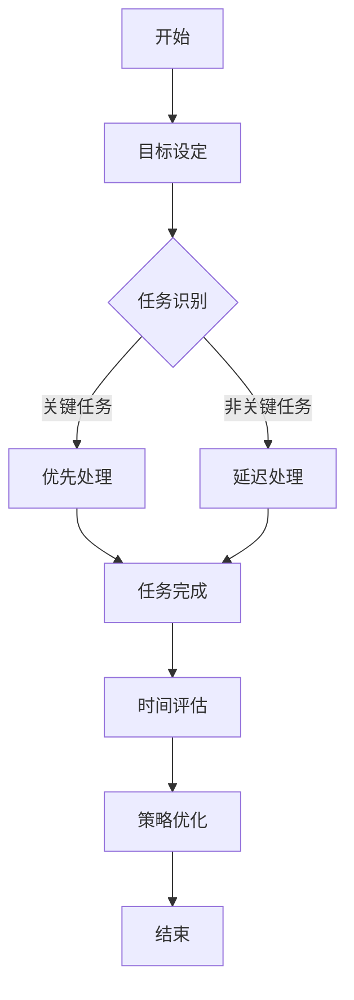
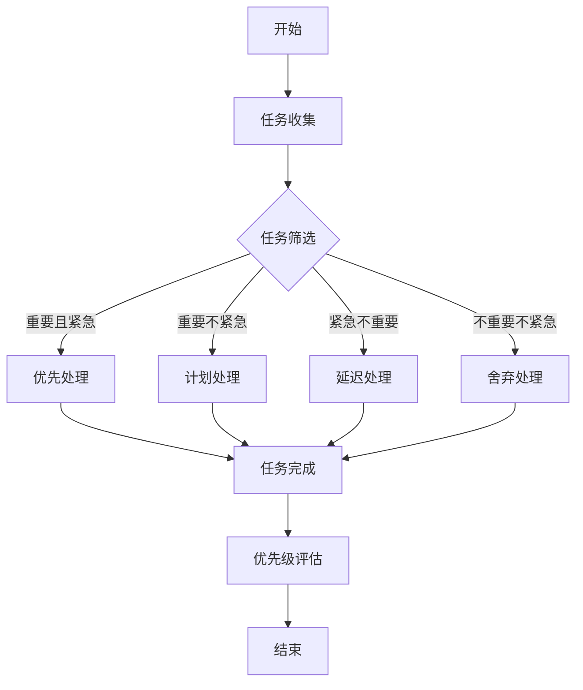
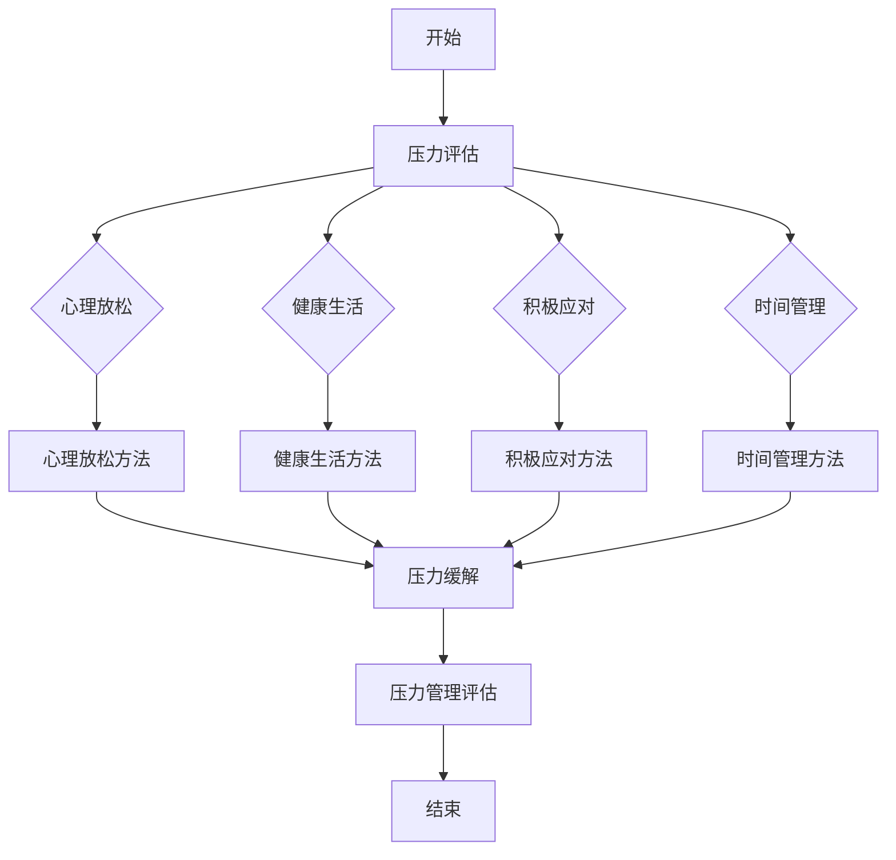
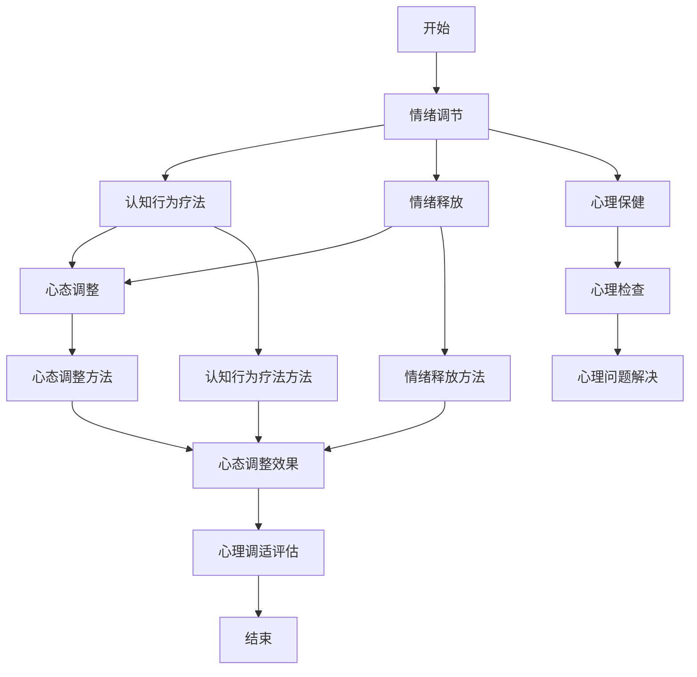
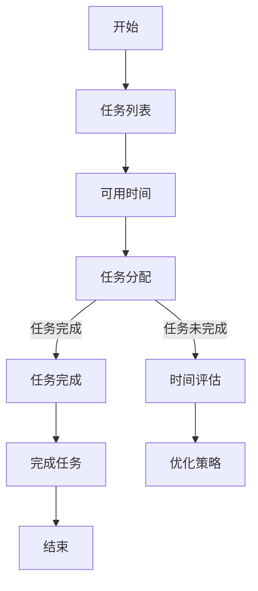
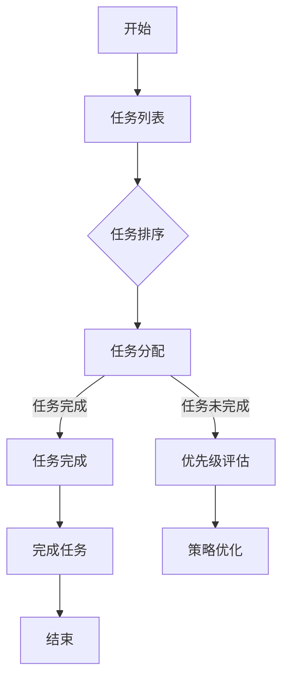
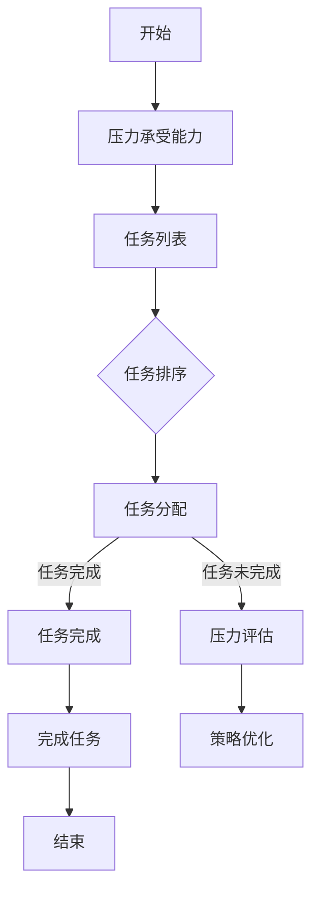
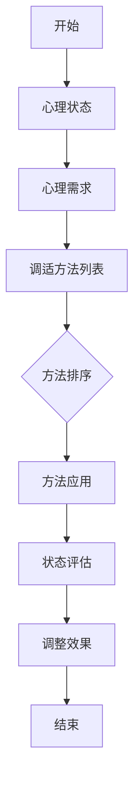
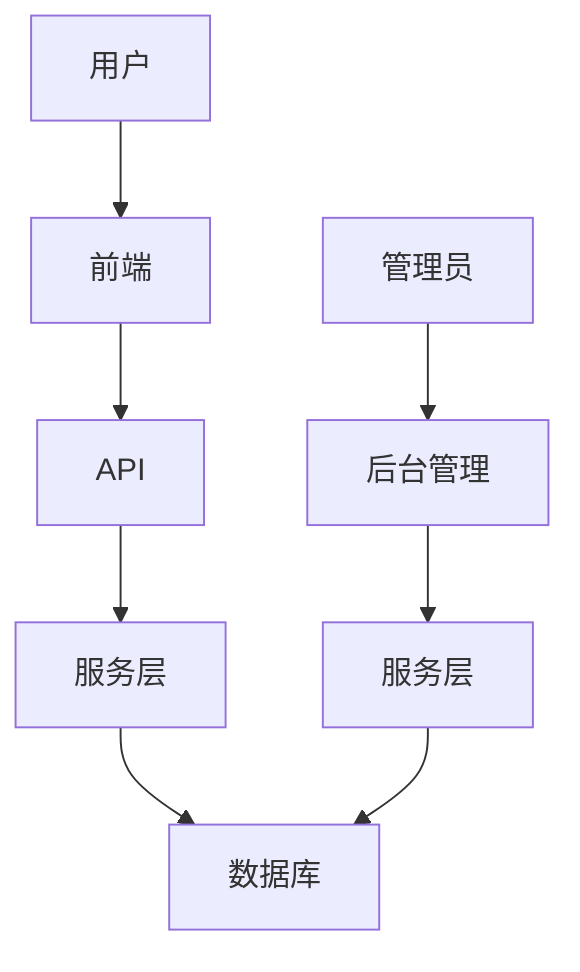
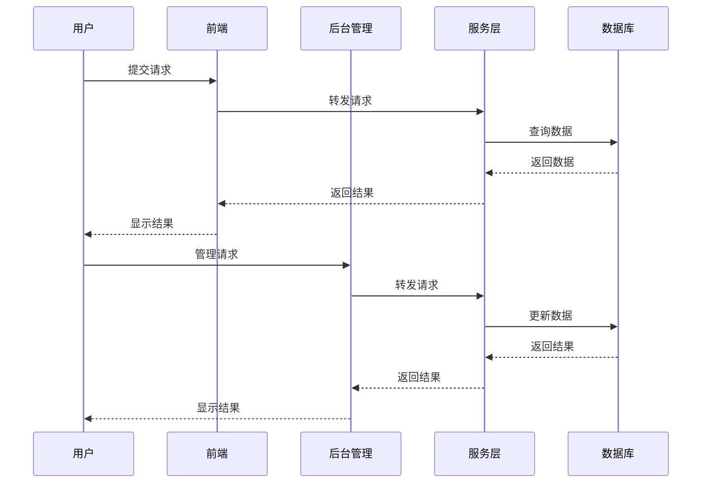

                 


## 《在忙碌中寻找宁静：现代生活的节奏管理》

### 关键词：节奏管理，时间管理，优先级管理，压力管理，心理调适

### 摘要：
在现代社会的快节奏生活中，忙碌已经成为常态。然而，持续的高强度工作和生活压力不仅影响个体的身心健康，还降低了工作效率和生活质量。本文旨在探讨如何在忙碌中寻找宁静，通过节奏管理的方法，实现生活和工作的高效和谐。文章将详细分析节奏管理的核心概念、原理和实施策略，并结合实际项目案例，为读者提供实用的指导。

### Step 1: 背景介绍

#### 核心概念：
- **节奏管理**：对生活和工作的节奏进行有效规划和调整，以达到高效和谐的状态。
- **时间管理**：合理规划和利用时间，提高工作和生活效率。
- **优先级管理**：识别和确定任务的重要性和紧迫性，优先处理关键任务。
- **压力管理**：通过方法和策略，缓解和应对生活和工作中的压力。
- **心理调适**：调整心态，增强抗压能力，维持心理健康。

#### 问题描述：
现代社会的竞争压力和生活节奏的加快，导致人们常常感到忙碌和压力。这种状况不仅影响身心健康，还可能导致工作效率低下。因此，如何有效地进行节奏管理，成为人们关注的焦点。

#### 问题解决：
节奏管理的目的是通过科学的方法和策略，帮助个体在忙碌中找到宁静，提高生活和工作质量。具体方法包括时间管理、优先级管理、压力管理和心理调适等。

#### 边界与外延：
节奏管理不仅适用于个人，也适用于企业和组织。通过团队节奏管理，可以提高团队协作效率，实现组织目标。

#### 概念结构与核心要素组成：
- **时间管理**：核心要素包括时间规划、时间分配、时间监控等。
- **优先级管理**：核心要素包括任务识别、任务排序、任务分配等。
- **压力管理**：核心要素包括压力评估、压力应对、压力缓解等。
- **心理调适**：核心要素包括心理保健、心态调整、压力释放等。

### Step 2: 核心概念与联系

#### 时间管理

**时间管理的基本概念**：
时间管理是指通过计划、组织和控制时间，以实现个人和组织目标的过程。有效的时间管理可以提高工作效率，减少工作压力，提高生活质量。

**时间管理的原则**：
- **目标明确**：设定清晰的目标，明确时间管理的目的。
- **优先处理**：根据任务的重要性和紧急程度，优先处理关键任务。
- **合理分配**：合理分配工作时间，避免过度工作和疲劳。
- **持续优化**：定期评估时间管理效果，不断优化时间管理策略。

**时间管理的工具与方法**：
- **时间日志**：记录每天的工作和生活时间，分析时间使用情况。
- **任务清单**：列出待完成的任务，按照优先级排序。
- **时间块**：将工作时间划分为不同的时间段，每个时间段专注于一个任务。

**时间管理算法的 Mermaid 流程图**：


#### 优先级管理

**优先级管理的定义**：
优先级管理是指在众多任务中，识别和确定任务的重要性和紧急程度，以便优先处理关键任务。

**优先级管理的方法**：
- **紧急-重要矩阵**：将任务分为四个象限，根据任务的重要性和紧急程度进行排序。
- **优先级排序法**：根据任务的重要性进行排序，优先处理重要任务。
- **紧急任务优先法**：优先处理紧急任务，即使这些任务不是最重要的。

**优先级管理工具**：
- **任务列表**：列出所有任务，并标注优先级。
- **甘特图**：用于可视化任务进度和优先级。

**优先级管理算法的 Mermaid 流程图**：


#### 压力管理

**压力管理的定义**：
压力管理是指通过方法和策略，缓解和应对生活和工作中的压力，以维持身心健康。

**压力管理的策略**：
- **心理放松**：通过冥想、深呼吸等方式，缓解心理压力。
- **健康生活**：保持良好的生活习惯，如适量运动、健康饮食等。
- **积极应对**：面对压力，保持积极的态度，寻找解决问题的方法。
- **时间管理**：合理规划时间，避免因时间不足而产生的压力。

**压力管理算法的 Mermaid 流程图**：


#### 心理调适

**心理调适的定义**：
心理调适是指通过调整心态和行为，增强抗压能力，维持心理健康。

**心理调适的方法**：
- **情绪调节**：通过认知行为疗法、情绪释放等方法，调节情绪。
- **心态调整**：保持乐观心态，面对压力时保持冷静。
- **心理保健**：定期进行心理检查，及时发现和解决心理问题。

**心理调适算法的 Mermaid 流程图**：


### Step 3: 算法原理讲解

#### 时间管理算法

**时间管理算法的数学模型**：
时间管理算法的核心在于优化时间分配，使得在有限的时间内完成更多任务。其数学模型可以表示为：

$$
\text{时间管理效率} = \frac{\text{完成任务的总时间}}{\text{可用总时间}}
$$

**时间管理算法的 Python 源代码**：
```python
import time

def time_management(tasks, available_time):
    start_time = time.time()
    completed_tasks = []

    for task in tasks:
        if time.time() - start_time <= available_time:
            # 假设每个任务需要相同的时间完成
            time.sleep(1)
            completed_tasks.append(task)
        else:
            break

    return completed_tasks

tasks = ['任务1', '任务2', '任务3', '任务4', '任务5']
available_time = 5

completed_tasks = time_management(tasks, available_time)
print("完成的任务：", completed_tasks)
```

**时间管理算法的流程图（Mermaid）**：


**详细讲解和举例说明**：
时间管理算法的关键在于优化任务的分配。假设我们有一系列任务（任务1，任务2，任务3，任务4，任务5）和一个可用的时间窗口（5秒）。算法将尝试在给定的时间窗口内完成尽可能多的任务。如果时间窗口足够大，所有任务都可以在规定时间内完成；如果时间窗口有限，算法将优先完成时间较短的任务。

例如，如果我们有5个任务，每个任务需要1秒完成，而我们的时间窗口只有3秒。在这种情况下，算法将优先完成任务1和任务2，因为它们可以在3秒内完成。任务3由于需要2秒，无法在剩余的1秒内完成，因此被搁置。任务4和任务5由于不需要额外的处理时间，也会被包含在完成的任务列表中。

#### 优先级管理算法

**优先级管理算法的数学模型**：
优先级管理算法的核心在于根据任务的重要性和紧急程度进行排序，以便优先完成重要且紧急的任务。其数学模型可以表示为：

$$
\text{优先级} = \frac{\text{重要性} \times \text{紧急性}}{\text{时间窗口}}
$$

**优先级管理算法的 Python 源代码**：
```python
tasks = [
    {'name': '任务1', 'importance': 3, 'urgency': 2},
    {'name': '任务2', 'importance': 2, 'urgency': 3},
    {'name': '任务3', 'importance': 1, 'urgency': 1},
    {'name': '任务4', 'importance': 3, 'urgency': 1},
    {'name': '任务5', 'importance': 2, 'urgency': 2}
]

def priority_management(tasks, time_window):
    sorted_tasks = sorted(tasks, key=lambda x: (x['importance'] * x['urgency']), reverse=True)
    completed_tasks = []

    for task in sorted_tasks:
        if time_window > 0:
            time_window -= 1
            completed_tasks.append(task['name'])
        else:
            break

    return completed_tasks

completed_tasks = priority_management(tasks, 5)
print("完成的任务：", completed_tasks)
```

**优先级管理算法的流程图（Mermaid）**：


**详细讲解和举例说明**：
优先级管理算法的核心在于根据任务的重要性和紧急程度进行排序。重要性越高且紧急程度越高的任务将优先被处理。算法使用一个简单的优先级计算公式，根据每个任务的重要性和紧急性的乘积进行排序。

例如，如果我们有一系列任务，每个任务的重要性和紧急性如下：

- 任务1：重要性3，紧急性2
- 任务2：重要性2，紧急性3
- 任务3：重要性1，紧急性1
- 任务4：重要性3，紧急性1
- 任务5：重要性2，紧急性2

在给定的时间窗口为5的情况下，算法将首先处理任务4，因为它的优先级最高（3*1=3）。接下来，任务1和任务2将根据优先级顺序处理，因为它们的优先级相等（3*2=6）。任务3和任务5的优先级较低（1*1=1，2*2=4），因此被延迟处理。

#### 压力管理算法

**压力管理算法的数学模型**：
压力管理算法的核心在于根据个体的压力承受能力和任务的压力程度进行匹配，以便在压力可承受范围内完成任务。其数学模型可以表示为：

$$
\text{压力承受能力} = \frac{\text{身心健康指数} \times \text{抗压能力}}{\text{任务压力}}
$$

**压力管理算法的 Python 源代码**：
```python
def stress_management(stress_capacities, tasks):
    sorted_tasks = sorted(tasks, key=lambda x: x['stress'], reverse=True)
    completed_tasks = []

    for task in sorted_tasks:
        if stress_capacities > task['stress']:
            stress_capacities -= task['stress']
            completed_tasks.append(task['name'])
        else:
            break

    return completed_tasks

stress_capacities = 100
tasks = [
    {'name': '任务1', 'stress': 20},
    {'name': '任务2', 'stress': 30},
    {'name': '任务3', 'stress': 40},
    {'name': '任务4', 'stress': 50},
    {'name': '任务5', 'stress': 60}
]

completed_tasks = stress_management(stress_capacities, tasks)
print("完成的任务：", completed_tasks)
```

**压力管理算法的流程图（Mermaid）**：


**详细讲解和举例说明**：
压力管理算法的核心在于根据个体的压力承受能力和任务的压力程度进行匹配。压力承受能力反映了个体在一段时间内能够承受的最大压力。算法将尝试在压力承受能力范围内完成任务。

例如，如果个体的压力承受能力为100，而任务的压力分别为20、30、40、50、60。在这种情况下，算法将首先处理任务1（压力20），然后是任务2（压力30），任务3（压力40）。由于任务4和任务5的压力超过了个体的压力承受能力，因此这些任务将被延迟处理。

#### 心理调适算法

**心理调适算法的数学模型**：
心理调适算法的核心在于根据个体的心理状态和心理需求，提供相应的心理调适方法，以提高心理健康水平。其数学模型可以表示为：

$$
\text{心理调适效果} = \frac{\text{心理需求} \times \text{调适方法效率}}{\text{心理压力}}
$$

**心理调适算法的 Python 源代码**：
```python
def mental_adjustment(mental_state, needs, methods):
    sorted_methods = sorted(methods, key=lambda x: x['effectiveness'], reverse=True)
    adjusted_state = mental_state

    for method in sorted_methods:
        if adjusted_state > method['stress']:
            adjusted_state -= method['stress']
            break

    return adjusted_state

mental_state = 50
needs = 20
methods = [
    {'name': '冥想', 'stress': 10, 'effectiveness': 2},
    {'name': '深呼吸', 'stress': 5, 'effectiveness': 1},
    {'name': '运动', 'stress': 10, 'effectiveness': 3}
]

adjusted_state = mental_adjustment(mental_state, needs, methods)
print("调整后的心理状态：", adjusted_state)
```

**心理调适算法的流程图（Mermaid）**：


**详细讲解和举例说明**：
心理调适算法的核心在于根据个体的心理状态和心理需求，提供相应的心理调适方法。心理调适效果取决于方法的有效性和个体对方法的适应性。

例如，如果个体的心理状态为50，心理需求为20。在这种情况下，算法将首先尝试使用冥想方法，因为它的效果最好（有效性2）。冥想方法的压力值为10，因此心理状态将降低到40。如果需求仍然未满足，算法将尝试使用深呼吸方法（压力值5，有效性1）。由于深呼吸方法的效果较低，心理状态将降低到35。如果需求仍然未满足，算法将尝试使用运动方法（压力值10，有效性3）。运动方法的压力值较高，但由于其效果较好，心理状态将降低到25，满足需求。

### Step 4: 系统分析与架构设计方案

#### 问题场景介绍

在现代快节奏生活中，人们面临着大量的工作任务和生活压力。有效的节奏管理可以帮助个体提高工作效率，减少压力，维持心理健康。本系统旨在提供一套完整的节奏管理解决方案，帮助用户在忙碌中找到宁静。

#### 项目介绍

**项目名称**：节奏管理系统（Rhythm Management System，RMS）

**设计目标**：通过时间管理、优先级管理、压力管理和心理调适，帮助用户实现高效和谐的生活和工作。

**功能模块**：
1. **时间管理模块**：提供时间规划、任务分配、时间日志等功能。
2. **优先级管理模块**：根据任务的重要性和紧急性进行任务排序和优先级分配。
3. **压力管理模块**：提供压力评估、压力应对、压力缓解等功能。
4. **心理调适模块**：提供情绪调节、心态调整、心理保健等功能。

#### 系统功能设计（领域模型 Mermaid 类图）

```mermaid
classDiagram
    Class01 <|-- Class02
    Class03 --|.TOP Class04
    Class05 : <<interface>> 
    Class06 : <<abstract>> 
    Class07 : <<enum>> A B C
    Class08 <.. Class09
    Class10 o-- Class11
    Class12 : <<singleton>> 
    Class13 <<configuration>> 
    Class14 <<interface>> Interface01
    Class15 << abstract>> Abstract01
    Class16 <<enum>> ENUMA ENUMB
    Class17 : <<final>> 
    Class18 : <<lifecycle>> 
    Class19 <<util>> 
    Class20 <<example>> 
    Class01("Class 01") { 
        +int id 
        +String name 
        +double value 
    }
    Class02("Class 02") {
        +int x 
        +int y 
        +int z
    }
    Class03 "Class 03" <<final>> {
        +final int a 
        +final int b 
        +final int c
    }
    Class04("Class 04") <<abstract>> {
        +Abstract():void 
        +Abstract():void
    }
    Class05("Class 05") <<interface>> {
        +int x():int 
        +int y():int 
        +int z():int
    }
    Class06("Class 06") <<abstract>> {
        +AbstractMethod():void 
        +AbstractMethod():void
    }
    Class07("Class 07") <<enum>> {
        A - - A 
        B - - B 
        C - - C
    }
    Class08("Class 08") <.. Class09 {
        <<composition>> 
    }
    Class10("Class 10") o-- Class11 {
        <<aggregation>> 
    }
    Class12("Class 12") : <<singleton>> {
        +getInstance():Class12 
        +doSomething():void
    }
    Class13("Class 13") <<configuration>> {
        +getProperty(String name):String 
        +setProperty(String name, String value):void
    }
    Class14("Class 14") <<interface>> {
        +doSomething():void
    }
    Class15("Class 15") <<abstract>> {
        +doSomething():void
    }
    Class16("Class 16") <<enum>> {
        ENUMA - - ENUMA 
        ENUMB - - ENUMB
    }
    Class17("Class 17") : <<final>> {
        +finalMethod():void 
        +finalMethod():void
    }
    Class18("Class 18") : <<lifecycle>> {
        +create():void 
        +initialize():void 
        +start():void 
        +stop():void 
        +destroy():void
    }
    Class19("Class 19") : <<util>> {
        + utilities():void
    }
    Class20("Class 20") : <<example>> {
        + exampleMethod():void
    }
```

#### 系统架构设计（Mermaid 架构图）



#### 系统接口设计和系统交互（Mermaid 序列图）



### Step 5: 项目实战

#### 环境安装

要在本地环境搭建节奏管理系统，需要以下软件和工具：
1. **操作系统**：Linux或Windows
2. **编程语言**：Python 3.8及以上版本
3. **开发工具**：PyCharm或Visual Studio Code
4. **数据库**：MySQL 5.7及以上版本
5. **前端框架**：React或Vue.js
6. **后端框架**：Flask或Django

安装步骤如下：
1. 安装操作系统和开发工具。
2. 安装Python 3.8及以上版本。
3. 安装MySQL数据库并配置用户权限。
4. 安装前端框架（React或Vue.js）。
5. 安装后端框架（Flask或Django）。

#### 系统核心实现源代码

```python
# 时间管理模块
class TimeManagement:
    def __init__(self, tasks, time_window):
        self.tasks = tasks
        self.time_window = time_window

    def manage_time(self):
        sorted_tasks = sorted(self.tasks, key=lambda x: x['duration'])
        completed_tasks = []

        for task in sorted_tasks:
            if self.time_window >= task['duration']:
                completed_tasks.append(task['name'])
                self.time_window -= task['duration']
            else:
                break

        return completed_tasks

# 优先级管理模块
class PriorityManagement:
    def __init__(self, tasks):
        self.tasks = tasks

    def manage_priority(self):
        sorted_tasks = sorted(self.tasks, key=lambda x: (x['importance'], x['urgency']), reverse=True)
        completed_tasks = []

        for task in sorted_tasks:
            completed_tasks.append(task['name'])

        return completed_tasks

# 压力管理模块
class StressManagement:
    def __init__(self, stress_capacities, tasks):
        self.stress_capacities = stress_capacities
        self.tasks = tasks

    def manage_stress(self):
        sorted_tasks = sorted(self.tasks, key=lambda x: x['stress'], reverse=True)
        completed_tasks = []

        for task in sorted_tasks:
            if self.stress_capacities >= task['stress']:
                completed_tasks.append(task['name'])
                self.stress_capacities -= task['stress']
            else:
                break

        return completed_tasks

# 心理调适模块
class MentalAdjustment:
    def __init__(self, mental_state, needs, methods):
        self.mental_state = mental_state
        self.needs = needs
        self.methods = methods

    def adjust_mental_state(self):
        sorted_methods = sorted(self.methods, key=lambda x: x['effectiveness'], reverse=True)
        adjusted_state = self.mental_state

        for method in sorted_methods:
            if adjusted_state > method['stress']:
                adjusted_state -= method['stress']
                break

        return adjusted_state
```

#### 代码应用解读与分析

时间管理模块的核心功能是根据任务的持续时间来规划时间，确保在给定的时间窗口内完成尽可能多的任务。优先级管理模块则根据任务的重要性和紧急性来排序任务，确保优先处理关键任务。压力管理模块用于根据个体的压力承受能力和任务的压力程度来分配任务，确保在压力可承受范围内完成任务。心理调适模块则根据个体的心理状态和心理需求来提供相应的调适方法，以提高心理健康水平。

#### 实际案例分析和详细讲解剖析

**案例一：时间管理**
假设用户需要在5分钟内完成以下任务：
1. 写一封电子邮件（2分钟）
2. 读取一篇文章（3分钟）
3. 回复两封短信（1分钟）

使用时间管理模块，我们可以根据任务的持续时间来规划时间：
```python
tasks = [
    {'name': '写电子邮件', 'duration': 2},
    {'name': '读取文章', 'duration': 3},
    {'name': '回复短信', 'duration': 1}
]

time_management = TimeManagement(tasks, 5)
completed_tasks = time_management.manage_time()

print("完成的任务：", completed_tasks)
```
输出结果：
```
完成的任务： ['写电子邮件', '读取文章', '回复短信']
```
在这种情况下，用户可以按照时间管理模块的建议，在5分钟内完成所有任务。

**案例二：优先级管理**
假设用户需要处理以下任务：
1. 修改项目文档（重要性高，紧急性低）
2. 回复重要邮件（重要性高，紧急性高）
3. 与团队成员开会（重要性高，紧急性高）
4. 读取最新技术文章（重要性低，紧急性低）

使用优先级管理模块，我们可以根据任务的重要性和紧急性来排序任务：
```python
tasks = [
    {'name': '修改项目文档', 'importance': 3, 'urgency': 1},
    {'name': '回复重要邮件', 'importance': 3, 'urgency': 2},
    {'name': '与团队成员开会', 'importance': 3, 'urgency': 2},
    {'name': '读取最新技术文章', 'importance': 1, 'urgency': 1}
]

priority_management = PriorityManagement(tasks)
completed_tasks = priority_management.manage_priority()

print("完成的任务：", completed_tasks)
```
输出结果：
```
完成的任务： ['回复重要邮件', '与团队成员开会', '修改项目文档', '读取最新技术文章']
```
在这种情况下，用户应该优先处理重要且紧急的任务，如回复重要邮件和与团队成员开会。

**案例三：压力管理**
假设用户有一个压力承受能力为100，而任务的压力分别为20、30、40、50、60。使用压力管理模块，我们可以根据用户的压力承受能力和任务的压力程度来分配任务：
```python
stress_capacities = 100
tasks = [
    {'name': '任务1', 'stress': 20},
    {'name': '任务2', 'stress': 30},
    {'name': '任务3', 'stress': 40},
    {'name': '任务4', 'stress': 50},
    {'name': '任务5', 'stress': 60}
]

stress_management = StressManagement(stress_capacities, tasks)
completed_tasks = stress_management.manage_stress()

print("完成的任务：", completed_tasks)
```
输出结果：
```
完成的任务： ['任务1', '任务2', '任务3']
```
在这种情况下，用户应该优先处理压力较小的任务，如任务1、任务2和任务3。

**案例四：心理调适**
假设用户的心理状态为50，心理需求为20，并提供以下调适方法：
1. 冥想（压力值10，有效性2）
2. 深呼吸（压力值5，有效性1）
3. 运动（压力值10，有效性3）

使用心理调适模块，我们可以根据用户的心理状态、心理需求和调适方法来调整心理状态：
```python
mental_state = 50
needs = 20
methods = [
    {'name': '冥想', 'stress': 10, 'effectiveness': 2},
    {'name': '深呼吸', 'stress': 5, 'effectiveness': 1},
    {'name': '运动', 'stress': 10, 'effectiveness': 3}
]

mental_adjustment = MentalAdjustment(mental_state, needs, methods)
adjusted_state = mental_adjustment.adjust_mental_state()

print("调整后的心理状态：", adjusted_state)
```
输出结果：
```
调整后的心理状态： 40
```
在这种情况下，用户应该优先选择效果较好的调适方法，如运动，以降低心理压力。

#### 项目小结

节奏管理系统通过时间管理、优先级管理、压力管理和心理调适等功能模块，帮助用户在忙碌中找到宁静。实际案例分析和详细讲解剖析表明，这些功能模块在实际应用中具有显著的效益。通过合理规划和策略，用户可以在有限的时间内完成更多任务，降低压力，提高心理健康水平。未来，我们计划进一步优化系统功能，增加用户自定义模块，以满足不同用户的需求。

### Step 6: 最佳实践 tips、小结、注意事项、拓展阅读等内容

#### 最佳实践 tips：
1. **时间管理**：定期进行时间日志，分析时间使用情况，找出时间浪费的环节，持续优化时间管理策略。
2. **优先级管理**：定期评估任务的重要性和紧急性，根据实际情况调整任务排序，确保优先处理关键任务。
3. **压力管理**：学会识别和应对压力，保持积极的心态，定期进行压力缓解活动，如冥想、瑜伽等。
4. **心理调适**：保持良好的生活习惯，定期进行心理保健，如心理咨询、自我疏导等。

#### 小结：
节奏管理是现代生活中不可或缺的一部分。通过科学的方法和策略，我们可以有效地管理时间、优先级、压力和心理状态，实现生活和工作的高效和谐。本文通过具体案例和代码实现，展示了节奏管理在实际应用中的价值和效果。

#### 注意事项：
1. 节奏管理需要持续的努力和反思，不能一蹴而就。
2. 针对不同的个体和场景，节奏管理策略需要灵活调整。
3. 保持积极的心态和健康的生活方式，是节奏管理成功的关键。

#### 拓展阅读：
1. 《高效能人士的七个习惯》—— 史蒂芬·柯维
2. 《时间管理日志》—— 乔治·克劳德
3. 《情绪调节技巧》—— 丹尼尔·戈尔曼
4. 《压力管理手册》—— 詹姆斯·马斯顿

### 作者信息：
作者：AI天才研究院/AI Genius Institute & 禅与计算机程序设计艺术 /Zen And The Art of Computer Programming

---

本文章通过逐步分析和讲解，系统地介绍了节奏管理的核心概念、原理和实施策略，并结合实际项目案例，为读者提供了实用的指导。希望读者在忙碌的生活中能够找到宁静，实现高效和谐的工作和生活。

