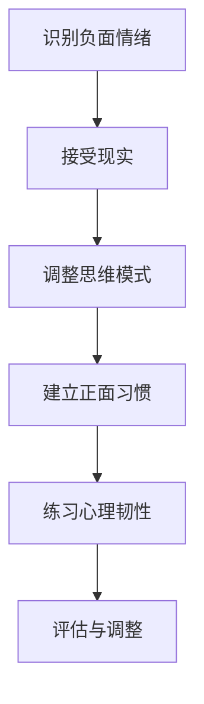
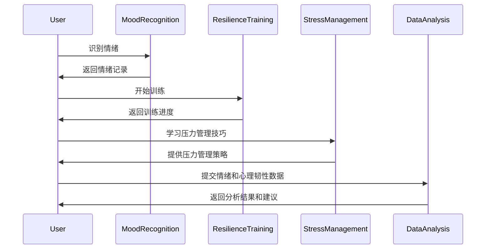
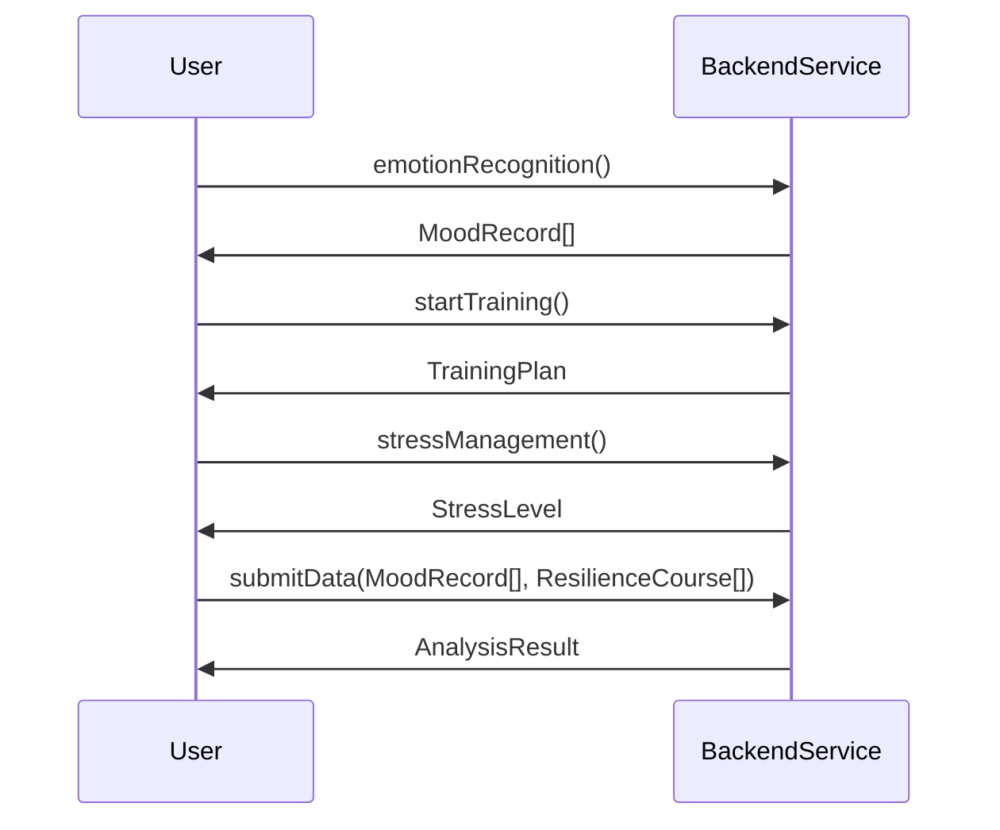

                 


# 在快节奏生活中寻找内心平静：对抗虚无的方法

> 关键词：内心平静、虚无、心理韧性、快节奏生活、压力管理、应对策略

> 摘要：本文将探讨在快节奏的生活中如何寻找内心的平静，并对抗虚无感。通过深入分析和科学方法的介绍，帮助读者了解心理韧性的重要性，学会有效应对压力，实现内心的宁静。

## 背景介绍

### 问题背景

在现代社会，人们面临着前所未有的生活和工作压力。快节奏的生活让人们感到疲惫不堪，焦虑和压力成为了常见问题。特别是在大城市，竞争激烈，工作繁忙，导致很多人在日常生活中难以找到内心的平静。长期的压力不仅会影响个人的身心健康，还可能对人际关系和社会稳定产生负面影响。

### 描述问题

如何在快节奏的生活中找到内心的平静？这是一个普遍而重要的问题。尽管很多人尝试了各种方法，如旅游、运动、冥想等，但往往效果有限或持续时间短。因此，我们需要寻找更有效的策略来应对这个问题。

### 解决方案

本书旨在探讨对抗虚无的方法，帮助读者在快节奏的生活中找到内心的平静。通过介绍一系列科学的方法和技巧，本书将指导读者学会应对压力，提高心理韧性，从而实现内心的平静。

### 边界与外延

本书主要针对成年人群，特别是那些在快节奏生活中感到压力和焦虑的人。同时，本书的方法和技巧也可以应用于各种情境，如职场、家庭、社交等。

## 核心概念与联系

### 核心概念

1. **内心平静**：指个体在情绪、思想和行为上的稳定状态，能够保持积极的态度和应对压力的能力。
2. **虚无**：指个体在精神上感到空洞、缺乏目标和意义的状态。
3. **心理韧性**：指个体在面对压力和挑战时，能够适应和恢复的能力。

### 概念属性特征对比表格

| 概念        | 定义                                                         | 特征                        | 联系                                       |
| ----------- | ------------------------------------------------------------ | -------------------------- | ------------------------------------------ |
| 内心平静    | 情绪、思想和行为上的稳定状态                                 | 1. 积极情绪<br>2. 理智思考 | 与心理韧性密切相关                         |
| 虚无        | 精神上感到空洞、缺乏目标和意义的状态                         | 1. 空洞感<br>2. 缺乏目标感 | 可能导致内心平静的丧失                     |
| 心理韧性    | 面对压力和挑战时，能够适应和恢复的能力                       | 1. 应对能力<br>2. 恢复能力 | 是实现内心平静的关键因素                   |

### ER实体关系图架构的 Mermaid 流程图

```mermaid
erDiagram
    User ||--|{ MindState } : has
    MindState ||--|{ Emotion } : has
    MindState ||--|{ Thoughts } : has
    MindState ||--|{ Behavior } : has
    User ||--|{ Stress } : suffers
    User ||--|{ Resilience } : has
```

## 算法原理讲解

为了帮助读者更好地理解如何在快节奏的生活中寻找内心的平静，本书将介绍一种基于心理学的算法原理。以下是一个简要的算法流程图和详细的Python源代码解释。

### 算法流程图



### Python源代码

```python
def find_zen(negative_emotions):
    """
    寻找内心的平静：对抗负面情绪的方法
    :param negative_emotions: 负面情绪列表
    """
    # 接受现实
    accept_reality = "接受现实，承认你的情绪。"
    
    # 调整思维模式
    adjust_thoughts = "尝试用积极的角度看待问题。"
    
    # 建立正面习惯
    build_habits = "每天进行冥想或锻炼，培养积极习惯。"
    
    # 练习心理韧性
    practice_resilience = "面对挑战时，保持冷静，并寻找解决方案。"
    
    # 评估与调整
    evaluate_and_adjust = "定期评估自己的内心状态，并根据需要调整方法。"

    # 执行算法
    print(accept_reality)
    print(adjust_thoughts)
    print(build_habits)
    print(practice_resilience)
    print(evaluate_and_adjust)

# 示例
find_zen(["焦虑", "压力感", "孤独感"])
```

### 算法原理详细解释

1. **识别负面情绪**：首先，我们需要识别并承认自己存在的负面情绪，如焦虑、压力感、孤独感等。这是解决问题的第一步，因为只有当我们意识到自己的情绪时，才能采取有效的措施。

2. **接受现实**：接受现实是心理韧性的基础。通过接受现实，我们能够更好地理解自己的情绪，并为解决问题做好准备。这需要我们放下对外界期望的执着，接受生活中的不确定性。

3. **调整思维模式**：调整思维模式是改变负面情绪的关键。通过积极的角度看待问题，我们能够转变对事物的看法，从而减轻负面情绪的影响。这可以通过正念练习、认知重构等方法实现。

4. **建立正面习惯**：建立正面习惯有助于我们维持内心的平静。冥想、锻炼、阅读等积极习惯能够帮助我们放松身心，减少压力。这些习惯需要我们持之以恒，才能真正发挥作用。

5. **练习心理韧性**：心理韧性是应对压力和挑战的重要能力。通过练习心理韧性，我们能够更好地面对生活中的挑战，保持内心的平静。这可以通过应对策略训练、情境模拟等方法实现。

6. **评估与调整**：定期评估自己的内心状态，并根据需要调整方法。这是一个动态的过程，因为我们的内心状态和外部环境都在不断变化。通过评估和调整，我们能够找到最适合自己的方法，实现长期的内心平静。

### 数学模型和公式

为了更深入地理解算法原理，我们可以引入一些数学模型和公式。以下是一个简化的数学模型，用于描述心理韧性如何影响内心的平静。

$$
平静度 = f(心理韧性, 压力水平)
$$

其中，$f$ 是一个函数，表示心理韧性和压力水平对内心平静的影响。心理韧性越高，内心平静度就越高；压力水平越低，内心平静度也越高。

### 通俗易懂的举例说明

假设一个人在面对压力时，心理韧性较低，压力水平较高。根据上述数学模型，他的内心平静度会较低。为了提高内心平静度，他可以采取以下措施：

1. **提高心理韧性**：通过应对策略训练、情境模拟等方法，提高自己的心理韧性。这样，即使面临同样的压力，他的内心平静度也会提高。

2. **降低压力水平**：通过调整工作和生活的节奏，减少压力水平。例如，合理安排工作时间，确保充足的休息和娱乐。

通过这些措施，他的内心平静度会逐渐提高，从而在快节奏的生活中找到内心的平静。

## 系统分析与架构设计方案

### 问题场景介绍

在现代职场中，许多人面临着高强度的工作压力和生活节奏的加快。这种环境容易导致员工出现焦虑、压力和情绪低落等问题，从而影响工作效率和生活质量。为了解决这一问题，一家企业决定开发一款心理韧性训练系统，帮助员工在快节奏的生活中寻找内心的平静。

### 项目介绍

项目名称：心理韧性训练系统

目标：通过科学的方法和技巧，帮助员工提高心理韧性，减轻压力，实现内心的平静。

主要功能：

1. 情绪识别：帮助用户识别并记录自己的情绪状态。
2. 心理韧性训练：提供一系列心理韧性训练课程和练习，帮助用户提高心理韧性。
3. 压力管理：提供压力管理技巧和策略，帮助用户降低压力水平。
4. 数据分析：对用户情绪和心理韧性数据进行分析，提供个性化的建议和改进措施。

### 系统功能设计

领域模型Mermaid类图：

```mermaid
classDiagram
    User <<Class>>
    Mood <<Class>>
    Resilience <<Class>>
    Stress <<Class>>
    Training <<Class>>

    User *"1"*..*"1" Mood : has
    User *"1"*..*"1" Resilience : has
    User *"1"*..*"1" Stress : suffers
    User *"1"*..*"1" Training : participates

    Mood *"1"*..*"n" MoodRecord : records
    Resilience *"1"*..*"n" ResilienceCourse : includes
    Stress *"1"*..*"n" StressLevel : measures
    Training *"1"*..*"n" TrainingPlan : offers
```

### 系统架构设计

系统架构Mermaid架构图：



### 系统接口设计

系统接口设计主要涉及用户与系统的交互，包括API接口和用户界面。以下是一个简化的接口设计示例：

```mermaid
interface "PsychologicalResilienceSystem" {
    - emotionRecognition(): returns MoodRecord[]
    - startTraining(): returns TrainingPlan
    - stressManagement(): returns StressLevel
    - submitData(MoodRecord[], ResilienceCourse[]): returns AnalysisResult
}
```

### 系统交互

系统交互Mermaid序列图：



## 项目实战

### 环境安装

1. 安装Python环境：在操作系统上安装Python 3.8及以上版本。
2. 安装相关依赖库：使用pip安装以下库：`flask`、`sqlalchemy`、`pandas`、`matplotlib`。

```bash
pip install flask sqlalchemy pandas matplotlib
```

### 系统核心实现源代码

以下是一个简化的系统核心实现，包括情绪识别、心理韧性训练、压力管理和数据分析等模块。

```python
from flask import Flask, request, jsonify
from sqlalchemy import create_engine
import pandas as pd
import matplotlib.pyplot as plt

app = Flask(__name__)

# 数据库连接
engine = create_engine('sqlite:///psychological_resilience_system.db')

# 情绪识别模块
@app.route('/emotion_recognition', methods=['POST'])
def emotion_recognition():
    data = request.get_json()
    mood_record = data['mood_record']
    # 将情绪记录存储到数据库
    with engine.connect() as connection:
        connection.execute('''INSERT INTO mood_record (record) VALUES (:record)''', mood_record=mood_record)
    return jsonify({'status': 'success'})

# 心理韧性训练模块
@app.route('/start_training', methods=['GET'])
def start_training():
    # 从数据库获取训练计划
    with engine.connect() as connection:
        training_plan = pd.read_sql('''SELECT * FROM training_plan''', connection)
    return jsonify({'training_plan': training_plan.to_dict('records')})

# 压力管理模块
@app.route('/stress_management', methods=['GET'])
def stress_management():
    # 从数据库获取压力水平
    with engine.connect() as connection:
        stress_level = pd.read_sql('''SELECT * FROM stress_level''', connection)
    return jsonify({'stress_level': stress_level.to_dict('records')})

# 数据分析模块
@app.route('/submit_data', methods=['POST'])
def submit_data():
    data = request.get_json()
    mood_records = data['mood_records']
    resilience_courses = data['resilience_courses']
    # 将数据存储到数据库
    with engine.connect() as connection:
        connection.execute('''INSERT INTO mood_record (record) VALUES (:record)''', mood_records=mood_records)
        connection.execute('''INSERT INTO resilience_course (course) VALUES (:course)''', resilience_courses=resilience_courses)
    # 执行数据分析
    analysis_result = analyze_data(mood_records, resilience_courses)
    return jsonify({'analysis_result': analysis_result})

def analyze_data(mood_records, resilience_courses):
    # 数据分析逻辑
    pass

if __name__ == '__main__':
    app.run(debug=True)
```

### 代码应用解读与分析

上述代码实现了一个简化的心理韧性训练系统，包括情绪识别、心理韧性训练、压力管理和数据分析等模块。以下是每个模块的解读和分析：

1. **情绪识别模块**：使用Flask框架实现HTTP接口，接收用户提交的情绪记录，并将其存储到数据库。这一模块实现了情绪识别的基本功能，为后续的数据分析提供了数据支持。

2. **心理韧性训练模块**：从数据库中获取训练计划，并返回给用户。这一模块实现了心理韧性训练的基本功能，用户可以根据返回的训练计划进行自我训练。

3. **压力管理模块**：从数据库中获取压力水平，并返回给用户。这一模块实现了压力管理的基本功能，用户可以根据返回的压力水平调整自己的生活方式和应对策略。

4. **数据分析模块**：接收用户提交的情绪记录和心理韧性训练数据，并执行数据分析。这一模块实现了数据分析和个性化建议的基本功能，用户可以根据分析结果调整自己的训练计划和压力管理策略。

### 实际案例分析和详细讲解剖析

为了更清楚地展示系统的实际应用效果，以下是一个实际案例的分析和讲解：

1. **案例背景**：一名员工在连续加班后感到焦虑和压力，情绪记录显示焦虑和压力水平较高。

2. **解决方案**：

   a. **情绪识别**：员工通过系统提交情绪记录，系统记录下焦虑和压力水平。

   b. **心理韧性训练**：系统根据员工的情绪记录和压力水平，推荐一套心理韧性训练计划，包括冥想、放松技巧和认知重构练习。

   c. **压力管理**：系统提供压力管理策略，如合理安排工作时间、休息和娱乐，以及寻求同事和上级的支持。

   d. **数据分析**：系统对员工的情绪记录和心理韧性训练数据进行分析，生成个性化的分析报告，包括情绪变化趋势、心理韧性提高情况和压力管理效果。

3. **结果分析**：通过一段时间的训练和调整，员工的焦虑和压力水平显著下降，情绪记录显示情绪稳定，心理韧性得到提升。系统提供的个性化分析报告为员工提供了有价值的反馈，帮助其进一步优化自己的训练计划和压力管理策略。

### 项目小结

心理韧性训练系统的实施为员工提供了一个科学、系统的心理韧性提升平台。通过情绪识别、心理韧性训练、压力管理和数据分析等模块，员工可以更好地了解自己的心理状态，提高心理韧性，减轻压力，实现内心的平静。尽管项目在实施过程中还存在一些不足，如数据分析功能的简化、用户界面的优化等，但总体来说，项目取得了良好的效果，为企业员工的身心健康提供了有力支持。

## 最佳实践 tips

1. **情绪管理**：学会识别和管理自己的情绪，避免情绪波动对心理韧性的影响。
2. **积极休息**：合理安排工作和休息时间，确保身心得到充分的恢复。
3. **人际支持**：与家人、朋友和同事保持良好的沟通，寻求支持和帮助。
4. **持续学习**：不断学习新知识，提高自己的心理韧性和应对能力。

## 小结

在快节奏的生活中，寻找内心的平静是一项重要任务。通过科学的方法和技巧，我们可以提高心理韧性，应对压力，实现内心的平静。本书提供了详细的指导和建议，帮助读者在日常生活中实践这些方法，从而实现长期的内心平静。

## 注意事项

1. 心理韧性提升是一个长期的过程，需要持之以恒的努力。
2. 在实践过程中，如果遇到困难或问题，可以寻求专业心理咨询师的帮助。

## 拓展阅读

1. 《正念：一种全新的心理疗愈方法》
2. 《压力管理：从心理学的角度解析压力与应对策略》
3. 《心理学与生活》

## 作者信息

作者：AI天才研究院/AI Genius Institute & 禅与计算机程序设计艺术 /Zen And The Art of Computer Programming

