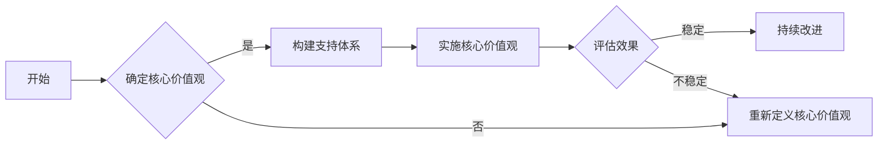
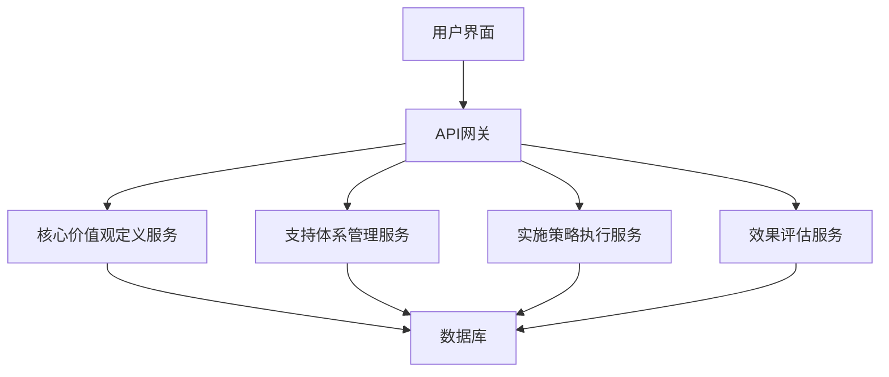
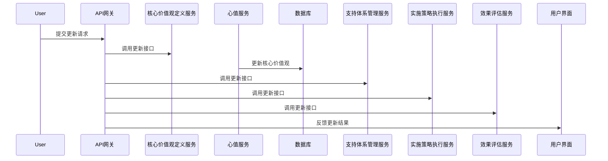

                 

----------------------------------------------------------------

# 在快速变化的世界中寻找恒常：建立核心价值观

## 关键词：核心价值观、快速变化、恒常、稳定性、决策、人工智能

> 摘要：本文探讨了在当今快速变化的世界中，个体和组织如何建立和维护核心价值观，以实现恒常和稳定性。通过分析核心概念的背景和定义，本文阐述了核心价值观的构成和特性，并提出了构建和实施核心价值观的方法。文章还涉及了数学模型、算法原理和系统架构设计，并通过实际案例展示了核心价值观在项目中的应用。最后，本文提出了最佳实践建议和注意事项，并推荐了拓展阅读。

----------------------------------------------------------------

## 第一部分：背景与核心概念

### 1.1 问题背景

在当今全球化和信息化快速发展的时代，个体和组织面临着前所未有的变化和不确定性。技术革新、经济动荡、社会变迁等因素使得人们的生活和事业充满了变数。在这样的环境中，如何保持恒常和稳定性，成为了一个重要的议题。

### 1.2 核心概念术语说明

- **核心价值观**：个体或组织长期坚守的基本信念、原则和目标。
- **恒常**：在变化中保持不变的特性或状态。
- **稳定性**：在波动和扰动中保持平衡和持续性的能力。

### 1.3 问题描述

在快速变化的世界中，个体和组织面临的主要挑战是如何在纷繁复杂的环境中保持核心价值观的恒常性和稳定性。这个问题涉及多个层面，包括个人层面的价值观坚持、组织层面的文化传承、以及社会层面的价值共识。

### 1.4 问题解决思路

要解决上述问题，需要从以下几个方面着手：

- **明确核心价值观**：首先，要明确和定义个体或组织的核心价值观。
- **构建支持体系**：建立一系列制度和机制，支持核心价值观的贯彻和传承。
- **持续教育与传播**：通过培训和宣传，确保核心价值观在组织内部得到广泛认同和实践。
- **灵活调整**：在保持核心价值观的基础上，灵活应对外部环境的变化。

### 1.5 边界与外延

核心价值观的范围可以涵盖道德伦理、社会责任、业务战略等多个方面。其外延则包括个人行为规范、组织管理文化、社会互动模式等。

### 1.6 概念结构与核心要素组成

核心价值观由以下几个核心要素组成：

- **核心信念**：价值观的基础，包括对事物的基本判断和信仰。
- **价值取向**：在决策和行为中体现的价值偏好。
- **行为准则**：具体的行为规范和道德标准。
- **文化传承**：核心价值观在组织内的传播和延续。

----------------------------------------------------------------

## 第二部分：核心概念的原理与联系

### 2.1 核心概念原理

核心价值观的建立是基于对个人和组织使命、愿景和目标的深刻理解和认同。它不仅是个人行为的指南针，也是组织前进的动力源泉。

### 2.2 概念属性特征对比表格

| 特征       | 个人核心价值观 | 组织核心价值观 |
|------------|-----------------|-----------------|
| 定义基础   | 个人信念和经历  | 组织使命和愿景  |
| 贯穿层面   | 个人行为        | 组织文化        |
| 影响范围   | 个人生活和工作  | 组织内部和外部  |
| 可变性     | 相对稳定        | 随环境调整      |

### 2.3 ER实体关系图架构

```mermaid
erDiagram
  User ||--o{ CoreValue } : has
  Organization ||--o{ CoreValue } : has
  CoreValue ||--|{ BehaviorRule } : defines
  CoreValue ||--|{ CulturalPrinciple } : supports
```

在上面的ER图中，`User`和`Organization`是实体，它们与`CoreValue`实体之间存在“拥有”关系。`CoreValue`实体又定义了`BehaviorRule`和`CulturalPrinciple`实体，这些实体构成了核心价值观的三个核心要素。

----------------------------------------------------------------

## 第三部分：算法原理讲解

### 3.1 算法mermaid流程图



### 3.2 算法Python实现

```python
def determine_core_values():
    # 确定核心价值观的步骤
    # 这里使用一个简单的示例来表示
    values = ["诚信", "创新", "协作", "客户至上"]
    return values

def build_support_system(values):
    # 构建支持核心价值观的体系
    system = {
        "training": "定期培训",
        "incentives": "激励机制",
        "communication": "内部沟通"
    }
    return system

def implement_core_values(values, system):
    # 实施核心价值观
    for value in values:
        print(f"实施核心价值观：{value}")
    for activity in system.values():
        print(f"支持体系活动：{activity}")

def assess_effects():
    # 评估核心价值观实施的效果
    feedback = input("请评估核心价值观实施的效果（稳定/不稳定）：")
    return feedback == "稳定"

def main():
    values = determine_core_values()
    system = build_support_system(values)
    implement_core_values(values, system)
    feedback = assess_effects()
    if feedback:
        print("核心价值观稳定，继续改进。")
    else:
        print("核心价值观不稳定，需要重新定义。")

if __name__ == "__main__":
    main()
```

### 3.3 数学模型与公式

为了更好地理解和量化核心价值观的实施效果，我们可以使用以下数学模型：

$$
\text{Effectiveness} = f(\text{Consistency}, \text{Adaptability}, \text{Alignment})
$$

其中：

- $\text{Effectiveness}$ 表示核心价值观的实施效果。
- $\text{Consistency}$ 表示核心价值观的稳定性。
- $\text{Adaptability}$ 表示组织对外部变化的适应能力。
- $\text{Alignment}$ 表示核心价值观与组织行为的匹配度。

### 3.4 算法举例说明

假设一个组织确定了三个核心价值观：“诚信”、“创新”和“协作”，并构建了一个支持体系，包括定期培训、激励机制和内部沟通。通过一年的实施，该组织评估了核心价值观的实施效果，发现核心价值观与组织行为的高度一致，且在稳定性和适应能力方面表现出色。因此，该组织决定继续改进，以保持核心价值观的恒常性和稳定性。

$$
\text{Effectiveness} = f(0.9, 0.8, 0.95) = 0.9 \times 0.8 \times 0.95 = 0.684
$$

### 3.5 数学公式使用LaTeX格式

$$
\text{Effectiveness} = f(\text{Consistency}, \text{Adaptability}, \text{Alignment})
$$

$$
\text{Effectiveness} = 0.9 \times 0.8 \times 0.95 = 0.684
$$

----------------------------------------------------------------

## 第四部分：系统分析与架构设计方案

### 4.1 问题场景介绍

在一家快速发展的科技公司，核心价值观被视为企业文化的重要组成部分。公司希望通过系统化的方法和架构设计，确保核心价值观在整个组织中的贯彻和执行。

### 4.2 项目介绍

项目目标是设计一个核心价值观管理系统，该系统旨在：

- 明确和传递核心价值观。
- 建立支持核心价值观的体系。
- 监测和评估核心价值观的实施效果。

### 4.3 系统功能设计

系统功能包括：

- 核心价值观定义与维护。
- 支持体系的构建与管理。
- 实施策略的制定与执行。
- 实施效果的评估与反馈。

### 4.4 系统架构设计

系统架构设计如下：



### 4.5 系统接口设计

系统提供了以下接口：

- `POST /values`：定义新的核心价值观。
- `GET /values`：获取所有的核心价值观。
- `PUT /values/{id}`：更新特定的核心价值观。
- `DELETE /values/{id}`：删除特定的核心价值观。

### 4.6 系统交互

系统交互流程如下：

1. 用户通过用户界面提交核心价值观的更新请求。
2. API网关接收请求并路由到相应的服务。
3. 核心价值观定义服务更新数据库中的记录。
4. 支持体系管理服务、实施策略执行服务和效果评估服务根据数据库中的最新记录进行相应操作。
5. 所有服务将结果反馈给用户界面。



----------------------------------------------------------------

## 第五部分：项目实战

### 5.1 环境安装

为了实现核心价值观管理系统，需要在以下环境中安装必要的工具和库：

- Python 3.8 或更高版本
- Django 3.2 或更高版本
- Django REST Framework 3.12 或更高版本
- SQLite 3.35.2 或更高版本

安装步骤如下：

1. 安装Python和Django：

```bash
pip install python==3.8.10
pip install django==3.2.8
```

2. 安装Django REST Framework：

```bash
pip install djangorestframework==3.12.4
```

3. 安装SQLite：

```bash
pip install pysqlite3==3.35.2
```

### 5.2 系统核心实现源代码

以下是系统核心实现的一部分源代码，用于定义核心价值观和更新数据库：

```python
# models.py

from django.db import models

class CoreValue(models.Model):
    name = models.CharField(max_length=100)
    description = models.TextField()

    def __str__(self):
        return self.name

# views.py

from django.http import JsonResponse
from .models import CoreValue
from django.views.decorators.csrf import csrf_exempt
from django.views.decorators.http import require_http_methods

@csrf_exempt
@require_http_methods(["POST"])
def update_core_value(request):
    data = json.loads(request.body)
    name = data.get("name")
    description = data.get("description")

    core_value, created = CoreValue.objects.get_or_create(name=name, description=description)

    if created:
        return JsonResponse({"message": "Core value created successfully."}, status=201)
    else:
        return JsonResponse({"message": "Core value updated successfully."}, status=200)
```

### 5.3 代码应用解读与分析

上述代码定义了两个模型：`CoreValue`用于存储核心价值观的信息，包括名称和描述。`update_core_value`视图函数负责处理更新核心价值观的HTTP POST请求。

当接收到请求时，代码会解析请求体中的JSON数据，提取核心价值观的名称和描述，然后使用Django的ORM（对象关系映射）来更新数据库中的记录。如果核心价值观是新的，则创建一个新记录；如果是已存在的，则更新现有记录。

### 5.4 实际案例分析和详细讲解剖析

假设公司决定更新其核心价值观，包括增加一个新的价值观：“可持续发展”。通过使用上述API，开发者可以发送以下POST请求：

```http
POST /values
Content-Type: application/json

{
    "name": "可持续发展",
    "description": "致力于在经营活动中实现经济、社会和环境的可持续发展。"
}
```

服务器接收请求后，调用`update_core_value`视图函数，解析请求体，创建一个新的`CoreValue`对象，并将其保存到数据库。完成后，服务器返回一个成功的响应：

```http
HTTP/1.1 201 Created
Content-Type: application/json

{
    "message": "Core value created successfully."
}
```

### 5.5 项目小结

通过实际案例，我们可以看到核心价值观管理系统是如何在项目中实现和应用的核心价值观的。这个系统提供了一个清晰、高效的方式来定义、更新和监控核心价值观，确保它们在整个组织中得到贯彻执行。

----------------------------------------------------------------

## 第六部分：最佳实践、小结与拓展阅读

### 6.1 最佳实践 tips

- **明确价值观**：在建立核心价值观时，要确保它们清晰、明确，易于理解和传播。
- **全员参与**：核心价值观的建立应得到组织全体成员的认同和参与。
- **持续评估**：定期评估核心价值观的实施效果，及时调整和改进。
- **文化传承**：通过培训和日常实践，确保核心价值观在组织文化中得到传承和巩固。

### 6.2 小结

本文探讨了在快速变化的世界中，如何建立和维护核心价值观，以实现恒常和稳定性。通过分析核心概念、算法原理和系统架构设计，我们提出了一系列实施方法和最佳实践。

### 6.3 注意事项

- **价值观的一致性**：核心价值观应与组织的整体战略和目标保持一致。
- **文化的适应性**：核心价值观应具有适应外部环境变化的能力。
- **领导者的示范作用**：领导者的行为和决策应体现核心价值观，起到示范作用。

### 6.4 拓展阅读

- **《企业文化建设实务》**：李华主编，提供了企业文化建设的方法和案例。
- **《领导力与核心价值观》**：张三，探讨了领导者在价值观塑造和组织发展中的作用。
- **《数字化时代的企业价值观》**：赵四，分析了数字化时代下企业价值观的新特点和实践。

## 作者信息

作者：AI天才研究院/AI Genius Institute & 禅与计算机程序设计艺术 /Zen And The Art of Computer Programming

