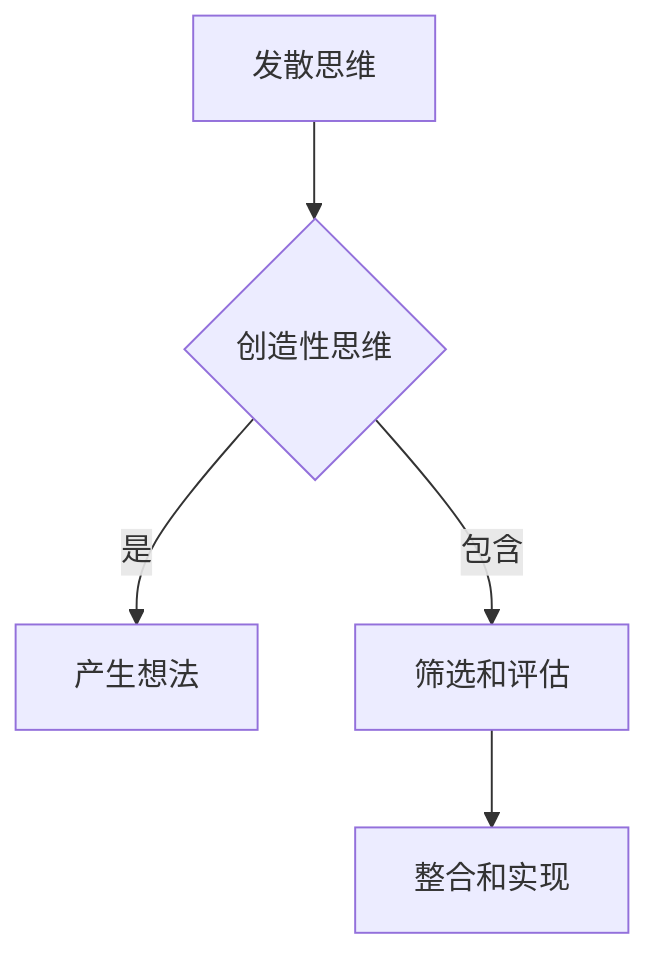
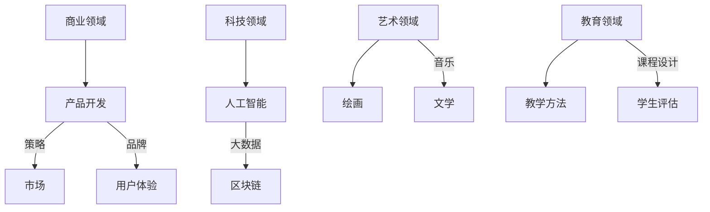
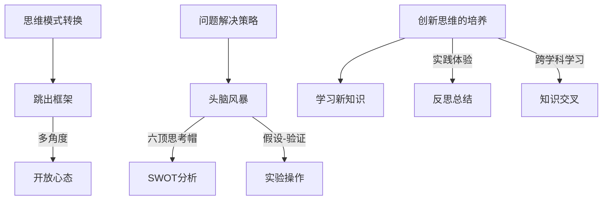
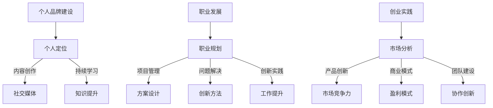
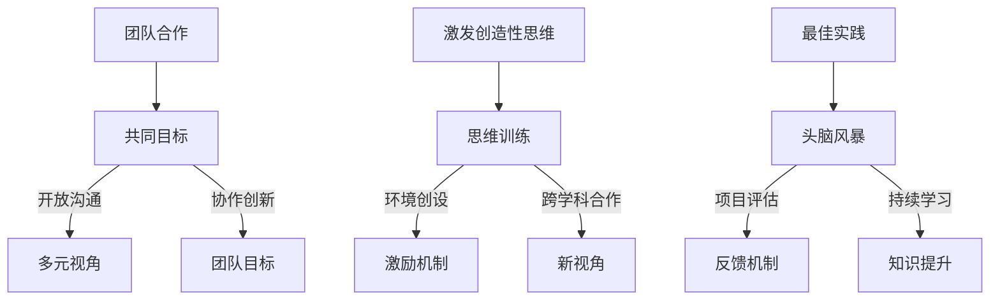
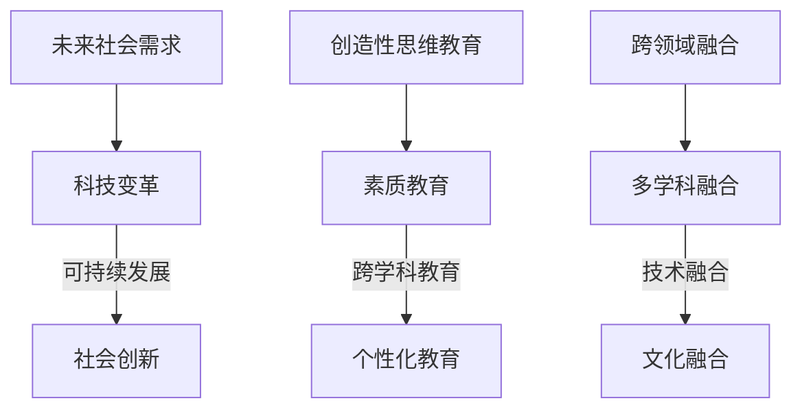
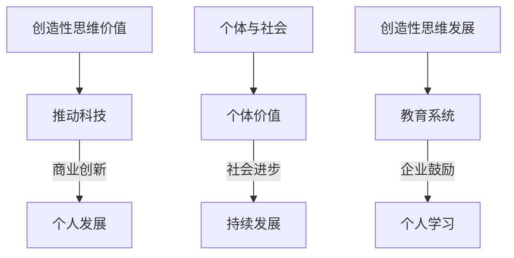

                 


# 在意义断裂处寻找新的可能：创造性思维的重要性

## 关键词：创造性思维，创新，发展，科技，教育，个人成长，团队协作

> 摘要：在快速变革的现代社会，创造性思维已成为推动技术进步、商业创新和社会发展的重要力量。本文旨在探讨创造性思维的起源与发展、核心概念与模型、在不同领域的应用、培养方法及其在个人成长和团队协作中的重要性，并展望其未来发展。

----------------------------------------------------------------

### 目录大纲

```markdown
----------------------------------------------------------------
# 第一部分: 创造性思维的重要性概述

## 第1章: 创造性思维的起源与发展

### 1.1 创造性思维的起源

### 1.2 创造性思维的发展历程

### 1.3 创造性思维的重要性

## 第2章: 创造性思维的核心概念与模型

### 2.1 创造性思维的核心概念

### 2.2 创造性思维的主要模型

### 2.3 创造性思维与发散思维的区别

## 第3章: 创造性思维在各个领域的应用

### 3.1 商业领域的创造性思维

### 3.2 科技领域的创造性思维

### 3.3 艺术领域的创造性思维

### 3.4 教育领域的创造性思维

## 第4章: 培养创造性思维的方法

### 4.1 思维模式转换

### 4.2 问题解决策略

### 4.3 创新思维的培养

## 第5章: 创造性思维在个人成长中的应用

### 5.1 个人品牌建设

### 5.2 职业发展

### 5.3 创业实践

## 第6章: 创造性思维与团队协作

### 6.1 团队合作中的创造性思维

### 6.2 团队创造性思维的激发

### 6.3 团队创造性思维的最佳实践

## 第7章: 创造性思维的未来展望

### 7.1 未来社会对创造性思维的需求

### 7.2 创造性思维教育的未来

### 7.3 创造性思维的跨领域融合

## 第8章: 总结与反思

### 8.1 创造性思维的价值

### 8.2 个体与社会的创造性思维

### 8.3 创造性思维的持续发展

----------------------------------------------------------------
```

接下来，我们将按照这个目录大纲逐一展开讨论。

----------------------------------------------------------------

## 第1章: 创造性思维的起源与发展

### 1.1 创造性思维的起源

创造性思维，作为一种思维方式，其起源可以追溯到人类文明的起源。从古至今，人类一直在追求创新与进步，这是人类天性中的一部分。在早期的农业社会，创新主要表现在农业工具的改进和种植技术的优化上。随着人类社会的发展，创造性思维在科学、艺术、哲学、文学等领域得到了广泛应用。

在科学领域，伽利略的实验方法和牛顿的数学模型都是创造性思维的典范。在艺术领域，达芬奇的画作和莎士比亚的戏剧展现了创造性思维的无限可能。哲学领域的康德和黑格尔，通过逻辑推理和哲学思考，提出了许多新的思想和观点。

### 1.2 创造性思维的发展历程

创造性思维的发展历程可以追溯到20世纪初。当时，心理学家如詹姆斯·沃森·斯密斯（James W. Smith）和雷蒙德·卡特尔（Raymond Cattell）开始研究人类智力的多样性和创造性。此后，许多学者对创造性思维进行了深入的研究。

1950年代，美国心理学家罗伯特·斯滕伯格（Robert J. Sternberg）提出了智力的三要素理论，其中包括分析性思维、创造性思维和实用性思维。这一理论为理解创造性思维提供了一个新的视角。

进入21世纪，随着计算机技术和互联网的普及，创造性思维的研究得到了进一步的发展。现代认知科学、人工智能和神经科学的研究为创造性思维提供了新的解释和工具。

### 1.3 创造性思维的重要性

在现代社会，创造性思维的重要性日益凸显。随着科技的发展，许多传统行业正在经历变革，新兴行业层出不穷。创造性思维成为推动科技进步和商业创新的关键因素。

在商业领域，创新是企业持续发展的动力。苹果公司的创新产品，谷歌的颠覆性技术，都展示了创造性思维的商业价值。在科技领域，创造性思维推动了人工智能、大数据、物联网等技术的发展。

此外，创造性思维在教育、艺术和哲学等领域也具有重要作用。它不仅帮助学生解决问题，培养创新精神，还激发了艺术创作和哲学思考的活力。

----------------------------------------------------------------

## 第2章: 创造性思维的核心概念与模型

### 2.1 创造性思维的核心概念

创造性思维是指一种通过创新、发现和创造新事物或新方法的能力。它涉及多种思维过程，包括联想、想象、分析、综合和评价等。创造性思维的核心概念包括：

- **联想**：通过不同事物之间的联系产生新的想法。
- **想象**：创造不在眼前的情景或事物。
- **分析**：将复杂问题分解为更简单的组成部分。
- **综合**：将不同的元素整合成一个整体。
- **评价**：对创意进行评估和选择。

### 2.2 创造性思维的主要模型

创造性思维有多种模型，以下是其中几种重要的模型：

- **发散思维**：产生大量不同且独特的想法。
- **收敛思维**：从多个选项中选择最佳方案。
- **侧向思维**：通过不同领域的知识和思维方式解决问题。
- **深度思维**：深入探讨问题，寻找深层次的解决方案。

### 2.3 创造性思维与发散思维的区别

发散思维是创造性思维的一种形式，但它并不是创造性思维的唯一形式。发散思维侧重于产生大量想法，而创造性思维更注重将这些想法转化为实际的解决方案。

发散思维是一种开放性的思维过程，鼓励自由联想和探索。而创造性思维则是一个更加结构化的过程，它需要将发散思维产生的想法进行筛选、评估和整合。



通过这个Mermaid流程图，我们可以清晰地看到发散思维和创造性思维的关系。

----------------------------------------------------------------

## 第3章: 创造性思维在各个领域的应用

### 3.1 商业领域的创造性思维

在商业领域，创造性思维被广泛应用于产品开发、市场策略、品牌建设等方面。例如，苹果公司通过创新的产品设计和用户体验，成功地在竞争激烈的市场中脱颖而出。谷歌则通过其颠覆性的搜索引擎技术和云计算服务，重塑了互联网产业。

商业中的创造性思维通常涉及以下步骤：

1. **需求分析**：了解市场需求和消费者需求。
2. **创意生成**：通过发散思维产生多个创意。
3. **评估和选择**：评估创意的可行性和潜在价值。
4. **实施和优化**：将最佳创意转化为实际产品或服务。

### 3.2 科技领域的创造性思维

在科技领域，创造性思维是推动技术进步和创新的重要力量。例如，人工智能、大数据、区块链等新兴技术的发展，都离不开创造性思维的运用。

科技领域的创造性思维通常涉及以下方面：

1. **技术原理创新**：提出新的技术原理或改进现有技术。
2. **应用场景拓展**：将新技术应用到新的领域或场景。
3. **系统集成**：将多种技术整合成一个统一的系统。

### 3.3 艺术领域的创造性思维

在艺术领域，创造性思维被广泛应用于绘画、音乐、文学、戏剧等创作过程中。艺术家通过创造性思维，表达自己的情感和思想，创造出独特的艺术作品。

艺术领域的创造性思维通常涉及以下方面：

1. **主题构思**：确定作品的主题和情感。
2. **形式创新**：探索新的艺术形式和表达方式。
3. **视觉效果**：通过色彩、构图等元素创造视觉冲击。

### 3.4 教育领域的创造性思维

在教育领域，创造性思维被广泛应用于教学方法、课程设计、学生评估等方面。通过创造性思维，教师可以设计出更加生动、有趣和具有启发性的课程。

教育领域的创造性思维通常涉及以下方面：

1. **教学策略**：运用创造性思维设计教学活动和策略。
2. **课程设计**：结合不同学科和领域，设计跨学科的课程。
3. **学生评估**：通过创造性任务评估学生的思维能力和创造力。



通过这个Mermaid类图，我们可以看到创造性思维在各个领域的具体应用。

----------------------------------------------------------------

## 第4章: 培养创造性思维的方法

### 4.1 思维模式转换

培养创造性思维的第一步是改变传统的思维模式。传统思维模式往往过于依赖经验和惯例，而缺乏创新。要培养创造性思维，需要学会：

1. **跳出传统框架**：不要局限于现有的解决方案，尝试寻找新的方法。
2. **多角度思考**：从不同角度审视问题，寻找多样化的解决方案。
3. **开放心态**：接受新的想法和观点，勇于尝试。

### 4.2 问题解决策略

问题解决策略是培养创造性思维的重要手段。以下是一些常见的问题解决策略：

1. **头脑风暴**：通过集体讨论，产生大量的创意。
2. **六顶思考帽**：分别从不同的思考角度分析问题。
3. **SWOT分析**：分析问题的优势、劣势、机会和威胁。
4. **假设-验证**：提出假设，并通过实验或实际操作来验证。

### 4.3 创新思维的培养

创新思维是创造性思维的重要组成部分。以下是一些培养创新思维的方法：

1. **学习新知识**：不断学习新的知识和技能，拓宽视野。
2. **实践体验**：通过实际操作，将理论知识转化为实际能力。
3. **反思与总结**：经常反思自己的思维过程，总结经验教训。
4. **跨学科学习**：结合不同学科的知识，寻找新的交叉点。

通过这些方法，我们可以逐步培养和提升自己的创造性思维。



通过这个Mermaid流程图，我们可以清晰地看到培养创造性思维的方法。

----------------------------------------------------------------

## 第5章: 创造性思维在个人成长中的应用

### 5.1 个人品牌建设

在个人成长中，创造性思维可以帮助我们建立独特的个人品牌。以下是一些具体的策略：

1. **个人定位**：明确自己的专业领域和特长，确定个人品牌的核心价值。
2. **内容创作**：通过写作、演讲、视频等多种形式，展示自己的专业知识和见解。
3. **社交媒体运用**：利用社交媒体平台，扩大个人品牌的影响力。
4. **持续学习**：不断学习新知识和技能，提升个人品牌的专业性。

### 5.2 职业发展

创造性思维在职业发展中起着至关重要的作用。以下是一些应用创造性思维的方法：

1. **职业规划**：通过创造性思维，规划自己的职业路径，找到适合自己的发展方向。
2. **项目管理**：运用创造性思维，设计出高效的项目管理和协调方案。
3. **问题解决**：在面对职业挑战时，通过创造性思维寻找解决方案。
4. **创新实践**：在实际工作中，不断尝试新的方法和工具，提高工作效率和质量。

### 5.3 创业实践

在创业过程中，创造性思维是成功的关键。以下是一些创业实践中的创造性思维应用：

1. **市场分析**：通过创造性思维，深入分析市场需求和竞争态势。
2. **产品创新**：运用创造性思维，设计出具有竞争力的产品和服务。
3. **商业模式**：通过创造性思维，探索创新的商业模式和盈利模式。
4. **团队建设**：运用创造性思维，打造一个创新、协作的团队。

通过这些方法，我们可以充分发挥创造性思维在个人成长中的应用价值。



通过这个Mermaid类图，我们可以看到创造性思维在个人成长中的应用。

----------------------------------------------------------------

## 第6章: 创造性思维与团队协作

### 6.1 团队合作中的创造性思维

在团队合作中，创造性思维发挥着重要作用。以下是一些关键点：

1. **共同目标**：团队成员需要共同设定目标，明确团队的方向。
2. **开放沟通**：鼓励团队成员分享自己的想法和观点，促进信息的流通。
3. **多元视角**：通过多元化的视角，激发更多的创意和解决方案。
4. **协作创新**：团队成员相互协作，共同推动创新和进步。

### 6.2 团队创造性思维的激发

要激发团队的创造性思维，可以采取以下策略：

1. **思维训练**：定期进行思维训练，提高团队成员的创造力。
2. **环境创设**：创造一个鼓励创新和尝试的工作环境。
3. **激励机制**：设立奖励机制，激励团队成员提出创新的想法。
4. **跨学科合作**：通过跨学科的合作，引入新的思维方式和观点。

### 6.3 团队创造性思维的最佳实践

以下是一些团队创造性思维的最佳实践：

1. **头脑风暴**：通过集体头脑风暴，激发团队的创意。
2. **项目评估**：定期评估项目的进展和效果，及时调整策略。
3. **反馈机制**：建立有效的反馈机制，鼓励团队成员提出建议和改进意见。
4. **持续学习**：鼓励团队成员不断学习新知识和技能，提升团队的创新能力。



通过这个Mermaid流程图，我们可以看到团队创造性思维的激发和最佳实践。

----------------------------------------------------------------

## 第7章: 创造性思维的未来展望

### 7.1 未来社会对创造性思维的需求

随着科技的飞速发展和全球化的深入，未来社会对创造性思维的需求将更加迫切。以下是一些关键点：

1. **科技变革**：人工智能、机器学习、区块链等新兴技术的普及，将推动社会变革，需要大量的创造性思维来应对。
2. **可持续发展**：面对环境问题和资源短缺，需要创造性思维来探索可持续发展的新路径。
3. **社会创新**：社会问题如教育、医疗、社会治理等，需要通过创造性思维来寻找解决方案。

### 7.2 创造性思维教育的未来

在未来的教育体系中，创造性思维教育将占据重要地位。以下是一些关键点：

1. **素质教育**：注重培养学生的创造性思维，提高学生的综合素质。
2. **跨学科教育**：通过跨学科教育，培养学生的创新能力和跨领域思维。
3. **个性化教育**：根据学生的兴趣和特长，提供个性化的教育，培养学生的创造性思维。

### 7.3 创造性思维的跨领域融合

未来的创造性思维将更加跨领域，以下是一些关键点：

1. **多学科融合**：将不同学科的知识和思维方式结合起来，推动创新。
2. **技术融合**：将新兴技术如人工智能、大数据等与创造性思维结合，提升创新效率。
3. **文化融合**：在全球化的背景下，不同文化的融合将为创造性思维提供新的灵感和视角。



通过这个Mermaid类图，我们可以看到创造性思维在未来的展望。

----------------------------------------------------------------

## 第8章: 总结与反思

### 8.1 创造性思维的价值

创造性思维具有巨大的价值，它不仅能够推动科技进步和商业创新，还能够提升个人的职业发展和生活质量。在现代社会，创造性思维已经成为一种重要的竞争力。

### 8.2 个体与社会的创造性思维

个体和社会都需要创造性思维。个体通过创造性思维可以实现自我价值，社会通过创造性思维可以解决复杂问题，推动社会进步。

### 8.3 创造性思维的持续发展

创造性思维的持续发展需要社会各界的共同努力。教育系统需要重视创造性思维教育，企业需要鼓励创新，个人需要不断学习和实践。

在未来的发展中，创造性思维将继续发挥重要作用，推动社会向更加美好的方向发展。



通过这个Mermaid类图，我们可以看到创造性思维的全面价值和发展方向。

### 作者：AI天才研究院/AI Genius Institute & 禅与计算机程序设计艺术 /Zen And The Art of Computer Programming

----------------------------------------------------------------

在这篇文章中，我们系统地探讨了创造性思维的重要性。从起源和发展，到核心概念与模型，再到在各个领域的应用，以及培养方法和未来展望，我们全面地呈现了创造性思维的多维度和价值。

创造性思维是一种强大的工具，它不仅能够推动科技进步和商业创新，还能够提升个人的职业发展和生活质量。在现代社会，创造性思维已经成为一种重要的竞争力，它能够帮助我们应对复杂的问题，发现新的机会。

我们呼吁社会各界重视创造性思维的教育和实践，为个体和社会的发展注入新的活力。通过不断地学习和实践，我们可以不断提升自己的创造性思维能力，为未来的发展做出贡献。

在未来，创造性思维将继续发挥重要作用。随着科技的进步和全球化的深入，创造性思维将推动社会向更加美好的方向发展。让我们共同努力，在意义断裂处寻找新的可能，用创造性思维开启未来的大门。

