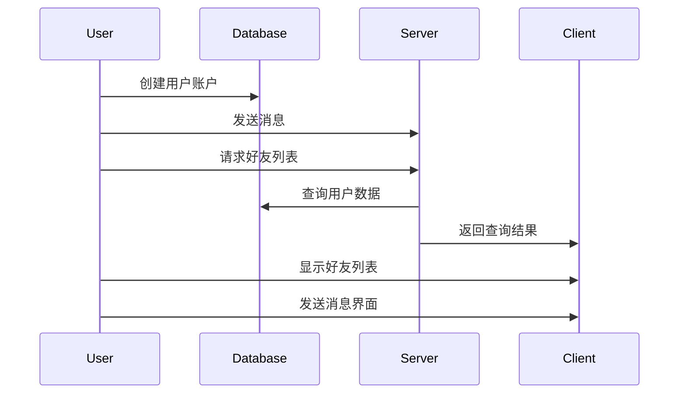
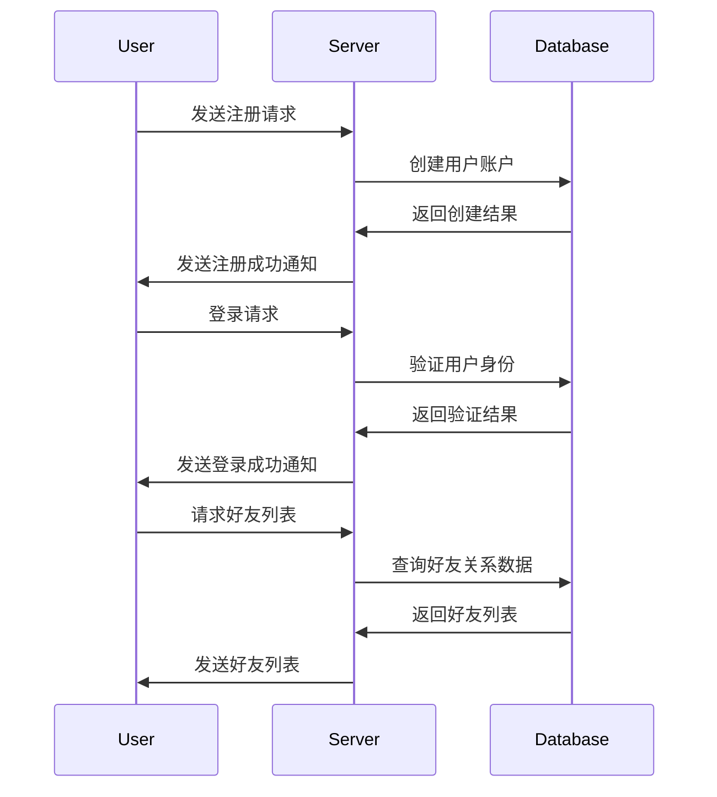

                 


# 在数字化时代寻找真实连接：重建人际关系的意义

## 关键词

数字化时代，人际关系，真实连接，心理因素，社交网络，技术挑战，未来趋势

## 摘要

在数字化时代，人们日益依赖科技手段进行沟通和社交，但这也带来了人际关系的疏离和真实连接的缺失。本文将从数字化时代的背景入手，深入探讨人际关系的核心概念及其心理学基础，分析数字化对人际关系的具体影响，并提出重建人际关系的实践方法和未来趋势。通过本文的阅读，读者将理解数字化时代重建人际关系的意义，掌握相关理论和实践方法，以实现更真实、更有意义的人际连接。

## 引言

### 1.1 引言：为什么需要重建人际关系

在数字化时代，我们面临着一个前所未有的挑战：如何在虚拟世界中寻找真实连接，重建人与人之间的深层关系。传统的面对面交流逐渐被屏幕上的文字和图像所取代，这导致了许多问题的产生，如情感疏离、孤独感增加和沟通障碍等。因此，我们需要重新审视人际关系，寻找有效的重建方法，以适应这个数字化时代。

### 1.2 目标读者与阅读指南

本文的目标读者包括对人际关系感兴趣的学者、心理咨询师、人力资源管理者以及普通大众。为了更好地理解本文的内容，读者需要具备基本的心理学和社会学知识，以及对数字化技术的了解。在阅读过程中，请特别注意各章节的小结和延伸阅读部分，这将有助于深化对文章主题的理解。

### 1.3 书的结构安排

本文分为四个主要部分：第一部分介绍数字化时代的背景及其对人际关系的影响；第二部分探讨人际关系的核心概念和心理学基础；第三部分提出重建人际关系的实践方法；第四部分分析重建人际关系的挑战与未来趋势。通过这样的结构安排，读者可以逐步深入地了解并掌握重建人际关系的知识和技能。

## 第一部分：数字化时代背景

### 第1章：数字化时代的来临与影响

#### 1.1 数字化时代的定义

数字化时代，又称信息时代，是指以数字技术和互联网为核心，推动社会生产和生活各个方面发生深刻变革的时期。这一时代的特点是信息传播速度快、处理能力强、互动性高，使得人与人之间的沟通和交流方式发生了翻天覆地的变化。

#### 1.2 数字化时代的演变

数字化时代的演变可以分为三个阶段：第一阶段是互联网的普及，人们通过电子邮件、即时通讯工具等进行在线交流；第二阶段是社交媒体的兴起，人们可以在虚拟平台上建立社交网络，进行更加多样化的互动；第三阶段是物联网和人工智能的融合，使得数字化技术更加深入地融入人们的日常生活，如智能家居、智能医疗等。

#### 1.3 数字化对生活方式的影响

数字化对生活方式的影响主要体现在以下几个方面：一是提高了信息获取和处理效率，使人们能够更快速地获取所需信息；二是改变了人们的社交方式，使得人们可以通过网络与现实生活中的朋友保持联系，甚至结识新的朋友；三是提供了更加便捷的生活服务，如在线购物、远程办公等。

#### 1.4 数字化对人际关系的影响

数字化对人际关系的影响具有双重性。一方面，它使人们更容易建立和维持人际关系，通过网络平台，人们可以跨越时空和地域的限制，与远方的亲友保持联系；另一方面，它也可能导致人际关系的疏离和虚假，因为虚拟世界中的互动缺乏面对面的真实感受，容易造成沟通障碍和误解。

### 第2章：数字化对人际关系的影响

#### 2.1 数字化对亲密关系的影响

数字化对亲密关系的影响主要表现在以下几个方面：一是加强了亲密关系中的沟通和互动，如通过视频通话、社交媒体等工具，夫妻或情侣可以随时保持联系；二是可能加剧亲密关系中的矛盾和冲突，因为虚拟世界中的互动缺乏真实情感的交流，容易产生误解和矛盾；三是改变了亲密关系中的权力结构，因为数字化技术的使用可能使双方在沟通中的地位发生改变，如年轻人可能比年长者更擅长使用新技术，从而在亲密关系中占据主导地位。

#### 2.2 数字化对社交网络的影响

数字化对社交网络的影响主要表现在以下几个方面：一是扩大了社交网络的规模和范围，使人们能够结识更多的朋友和同伴；二是改变了社交网络的结构和模式，如社交媒体中的“朋友圈”和“关注圈”等；三是影响了社交网络的动态和稳定性，因为虚拟世界中的互动容易受到技术和心理因素的影响，如网络攻击、隐私泄露等。

#### 2.3 数字化对职场关系的影响

数字化对职场关系的影响主要表现在以下几个方面：一是提高了职场沟通和协作的效率，如通过电子邮件、即时通讯工具、协同办公软件等；二是改变了职场关系中的权力结构和角色定位，如数字化技术的普及使一些传统职位的重要性下降，而技术岗位的重要性上升；三是增加了职场关系中的冲突和矛盾，因为数字化技术的使用可能导致信息不对称和误解。

#### 2.4 数字化带来的隐私与安全挑战

数字化带来的隐私与安全挑战主要表现在以下几个方面：一是个人信息泄露的风险增加，因为数字化技术使得个人信息更容易被收集和利用；二是网络安全威胁的增加，如网络攻击、黑客入侵等；三是隐私权的保护难度加大，因为数字化技术的普及使得隐私权的保护变得更加复杂和困难。

## 第二部分：人际关系的核心概念

### 第3章：人际关系的定义与类型

#### 3.1 人际关系的概念

人际关系是指人与人之间通过互动和沟通建立起来的社会联系。这种联系可以是亲密的、友好的，也可以是疏离的、敌对的。人际关系是社会生活中不可或缺的一部分，对个体的成长和发展具有重要影响。

#### 3.2 人际关系的分类

人际关系可以根据不同的标准进行分类，常见的分类方法有：

1. 根据关系的性质，可以分为亲密关系、友谊关系、职业关系等。
2. 根据关系的强度，可以分为紧密关系、一般关系、松散关系等。
3. 根据关系的方向，可以分为单向关系、双向关系、多向关系等。
4. 根据关系的稳定性，可以分为长期关系、短期关系、暂时关系等。

#### 3.3 人际关系的重要性

人际关系的重要性体现在以下几个方面：

1. 情感支持：良好的人际关系可以提供情感支持，减轻个体的压力和孤独感。
2. 社会认同：人际关系有助于个体获得社会认同，提高自尊和自信。
3. 职业发展：良好的人际关系有助于个体在职场中取得成功，提高职业竞争力。
4. 心理健康：人际关系对个体的心理健康具有积极影响，能够降低抑郁、焦虑等心理问题的发生。

## 第三部分：人际关系的心理学基础

### 第4章：人际关系的心理学基础

#### 4.1 心理学与人际关系的联系

心理学是研究人类行为和心理过程的科学，它为我们理解人际关系提供了理论基础。心理学研究人际关系的方法包括实验研究、问卷调查、现场观察等。

#### 4.2 人格特质与人际关系

人格特质是指个体在行为和情感上的相对稳定的特征。不同的人格特质对人际关系有不同的影响。例如，外向的人更容易建立人际关系，而内向的人可能更加倾向于维持紧密的亲密关系。

#### 4.3 社会认知与人际关系

社会认知是指个体对他人和社会的认知和理解。社会认知对人际关系具有重要影响，它决定了个体如何理解他人、如何与他人互动。例如，积极的社会认知可以促进良好的人际关系，而消极的社会认知可能导致人际冲突。

## 第四部分：重建人际关系的实践方法

### 第5章：自我认知与人际交往的提升

#### 5.1 自我认知的重要性

自我认知是指个体对自己的了解和认识。自我认知的重要性体现在以下几个方面：

1. 促进个人成长：自我认知有助于个体了解自己的优点和缺点，从而促进个人成长和发展。
2. 提高人际关系质量：自我认知有助于个体更好地理解自己与他人之间的关系，从而提高人际关系的质量。
3. 增强自尊和自信：自我认知有助于个体建立自尊和自信，从而更好地应对生活中的挑战。

#### 5.2 提升人际交往技巧

人际交往技巧是指个体在人际交往中运用的一系列策略和方法。提升人际交往技巧的重要性体现在以下几个方面：

1. 促进人际沟通：人际交往技巧有助于个体更好地表达自己的想法和感受，从而促进人际沟通。
2. 减少误解和冲突：人际交往技巧有助于个体避免误解和冲突，从而维护良好的人际关系。
3. 提高人际关系质量：人际交往技巧有助于个体建立更紧密的人际关系，提高人际关系的质量。

#### 5.3 建立积极的社交习惯

建立积极的社交习惯是重建人际关系的重要一步。以下是一些建立积极社交习惯的建议：

1. 积极参与社交活动：积极参与各种社交活动，如聚会、社交聚会等，有助于扩大社交圈子，建立新的人际关系。
2. 培养良好的沟通习惯：培养良好的沟通习惯，如倾听、表达、反馈等，有助于改善人际关系。
3. 保持社交互动：保持与亲朋好友的互动，即使是通过电话、短信或社交媒体，也有助于维护和加强人际关系。

## 第五部分：沟通技巧与冲突解决

### 第6章：沟通技巧与冲突解决

#### 6.1 沟通的基本要素

有效沟通是建立良好人际关系的基础。沟通的基本要素包括：

1. 信息传递：确保信息清晰、准确、完整地传递给对方。
2. 倾听：倾听对方的观点和感受，理解对方的需求和期望。
3. 表达：表达自己的观点和感受，确保对方能够理解。
4. 反馈：提供反馈，确认对方是否理解了信息。

#### 6.2 有效沟通技巧

有效沟通技巧包括：

1. 明确沟通目标：在沟通前明确目标，确保双方都能理解并达成共识。
2. 保持积极态度：在沟通中保持积极态度，避免情绪化和攻击性。
3. 提问和回应：通过提问和回应来引导对话，确保双方都能参与到沟通中。
4. 非语言沟通：注意非语言沟通，如肢体语言、面部表情等，这些都能传递重要的信息。

#### 6.3 冲突解决策略

冲突是人际关系中不可避免的一部分。以下是一些解决冲突的策略：

1. 冷静分析：在冲突发生后，保持冷静，分析冲突的原因和双方的需求。
2. 倾听对方：倾听对方的观点和感受，确保双方都能表达自己的想法。
3. 找到共同点：寻找双方的共同点，找到解决问题的方案。
4. 求同存异：尊重对方的观点，即使不能达成一致，也要学会共存。

## 第六部分：社交媒体时代的人际互动

### 第7章：社交媒体时代的人际互动

#### 7.1 社交媒体的兴起与影响

社交媒体的兴起对人际互动产生了深远影响。以下是一些影响：

1. 扩大社交圈子：社交媒体使人们能够结识来自不同地方的人，扩大社交圈子。
2. 改变人际互动方式：社交媒体改变了人际互动的方式，从面对面的交流转变为线上交流。
3. 提高人际互动频率：社交媒体使人们能够更频繁地与朋友和家人保持联系，提高人际互动的频率。

#### 7.2 社交媒体的人际互动特点

社交媒体的人际互动具有以下特点：

1. 即时性：社交媒体使人们能够即时交流，实时分享生活。
2. 互动性：社交媒体鼓励用户互动，如点赞、评论、分享等。
3. 广泛性：社交媒体具有广泛的覆盖范围，用户可以与成千上万的人互动。

#### 7.3 社交媒体时代的人际关系维护

在社交媒体时代，维护人际关系需要一些新的策略：

1. 保持活跃：在社交媒体上保持活跃，与朋友互动，分享生活。
2. 保持真实：在社交媒体上保持真实，不要过分美化自己，以建立真实的人际关系。
3. 管理社交媒体：合理管理社交媒体的使用，避免过度依赖，以免影响现实生活的人际关系。

## 第七部分：重建人际关系的挑战与未来

### 第8章：重建人际关系的障碍与挑战

#### 8.1 挑战与障碍分析

在数字化时代，重建人际关系面临以下挑战和障碍：

1. 虚拟世界与现实世界的分离：虚拟世界中的互动难以转化为现实世界中的关系，导致人际关系的疏离。
2. 技术依赖：过度依赖数字化技术进行沟通，可能导致人际沟通能力的下降。
3. 隐私与安全问题：数字化技术的普及带来了隐私和安全问题，可能导致人际信任的缺失。

#### 8.2 应对策略

为了克服这些挑战和障碍，我们可以采取以下策略：

1. 结合虚拟与现实：在保持虚拟互动的同时，也要加强现实中的面对面交流，以建立更真实的人际关系。
2. 提高沟通能力：通过学习和实践，提高自己的沟通能力，以适应数字化时代的需求。
3. 强化隐私保护：加强个人隐私保护，提高网络安全意识，以维护人际信任。

### 第9章：未来人际关系的可能性与趋势

#### 9.1 新科技对人际关系的影响

未来，新科技将继续对人际关系产生影响。以下是一些可能的趋势：

1. 人工智能与人际互动：人工智能技术有望改善人际互动，如智能助手、虚拟现实等。
2. 社交媒体的进化：社交媒体将继续进化，提供更丰富的人际互动体验。
3. 跨文化人际互动：随着全球化的推进，跨文化人际互动将变得更加普遍。

#### 9.2 未来人际关系的趋势

未来人际关系的发展趋势包括：

1. 数字化与情感化的融合：数字化技术将更加注重情感化，以提供更真实、更有意义的人际互动。
2. 个性化和定制化：人际关系将更加个性化和定制化，以满足个体差异化的需求。
3. 社会责任与伦理：未来人际关系将更加注重社会责任和伦理，以促进社会和谐与进步。

## 结尾：总结与展望

### 第10章：总结与展望

#### 10.1 总结与回顾

本文从数字化时代的背景出发，探讨了人际关系的核心概念、心理学基础和实践方法，分析了数字化对人际关系的影响，并提出了重建人际关系的挑战与未来趋势。通过本文的阅读，读者应理解数字化时代重建人际关系的意义，掌握相关理论和实践方法，以实现更真实、更有意义的人际连接。

#### 10.2 展望未来：人际关系的发展方向

未来，人际关系将在数字化技术的推动下发生深刻变革。为了适应这一变革，我们需要加强自我认知，提高人际交往技巧，关注隐私与安全，同时积极探索新科技带来的可能性。通过这些努力，我们有望在数字化时代重建更紧密、更有意义的人际关系，促进个人成长和社会进步。

## 作者信息

作者：AI天才研究院/AI Genius Institute & 禅与计算机程序设计艺术 /Zen And The Art of Computer Programming

## 完整目录大纲

### 前言/引言
- **1.1 引言：为什么需要重建人际关系**
- **1.2 目标读者与阅读指南**
- **1.3 书的结构安排**

### 第一部分：数字化时代背景
- **第1章**：数字化时代的来临与影响
  - **1.1 数字化时代的定义**
  - **1.2 数字化时代的演变**
  - **1.3 数字化对生活方式的影响**
  - **1.4 数字化对人际关系的影响**
- **第2章**：数字化对人际关系的影响
  - **2.1 数字化对亲密关系的影响**
  - **2.2 数字化对社交网络的影响**
  - **2.3 数字化对职场关系的影响**
  - **2.4 数字化带来的隐私与安全挑战**

### 第二部分：人际关系的核心概念
- **第3章**：人际关系的定义与类型
  - **3.1 人际关系的概念**
  - **3.2 人际关系的分类**
  - **3.3 人际关系的重要性**
- **第4章**：人际关系的心理学基础
  - **4.1 心理学与人际关系的联系**
  - **4.2 人格特质与人际关系**
  - **4.3 社会认知与人际关系**
- **第5章**：人际关系的文化与社会因素
  - **5.1 文化的多样性对人际关系的影响**
  - **5.2 社会结构对人际关系的影响**
  - **5.3 社会规范与人际关系**

### 第三部分：重建人际关系的实践方法
- **第6章**：自我认知与人际交往的提升
  - **6.1 自我认知的重要性**
  - **6.2 提升人际交往技巧**
  - **6.3 建立积极的社交习惯**
- **第7章**：沟通技巧与冲突解决
  - **7.1 沟通的基本要素**
  - **7.2 有效沟通技巧**
  - **7.3 冲突解决策略**
- **第8章**：社交媒体时代的人际互动
  - **8.1 社交媒体的兴起与影响**
  - **8.2 社交媒体的人际互动特点**
  - **8.3 社交媒体时代的人际关系维护**

### 第四部分：重建人际关系的挑战与未来
- **第9章**：重建人际关系的障碍与挑战
  - **9.1 挑战与障碍分析**
  - **9.2 应对策略**
- **第10章**：未来人际关系的可能性与趋势
  - **10.1 新科技对人际关系的影响**
  - **10.2 未来人际关系的趋势**
  - **10.3 社会责任与人际关系**

### 结尾：总结与展望
- **第11章**：总结与展望
  - **11.1 总结与回顾**
  - **11.2 展望未来：人际关系的发展方向**

## 文章内容概述

本文首先介绍了数字化时代的背景，分析了数字化对人际关系的影响，包括对亲密关系、社交网络、职场关系和隐私安全的挑战。接着，本文探讨了人际关系的核心概念，包括定义、分类、心理学基础和文化与社会因素。随后，本文提出了重建人际关系的实践方法，包括自我认知的提升、人际交往技巧的培养、沟通技巧的掌握和冲突解决策略。在社交媒体时代的人际互动部分，本文分析了社交媒体的兴起及其影响，提出了社交媒体时代的人际关系维护策略。最后，本文讨论了重建人际关系的挑战与未来趋势，提出了应对策略和未来人际关系的可能性。

## 文章结构与逻辑

本文采用结构化、逻辑清晰的方式，首先介绍了数字化时代背景和数字化对人际关系的影响，接着探讨了人际关系的核心概念，然后提出了重建人际关系的实践方法，并在社交媒体时代的人际互动部分进行了具体分析。最后，本文讨论了重建人际关系的挑战与未来趋势，总结了全文的核心内容，并提出了未来的人际关系发展方向。

## 核心要点总结

- 数字化时代对人际关系产生了深远影响，既有积极的也有消极的影响。
- 人际关系的重要性不可忽视，它对个体的成长和发展具有重要作用。
- 重建人际关系需要自我认知的提升、人际交往技巧的培养、沟通技巧的掌握和冲突解决策略的实施。
- 社交媒体时代的人际互动具有即时性、互动性和广泛性，需要新的维护策略。
- 面对重建人际关系的挑战，需要采取有效的应对策略，并关注未来的发展趋势。

## 文章结尾

本文通过系统地分析数字化时代背景、人际关系的核心概念和实践方法，以及对社交媒体时代人际互动的探讨，提出了一系列重建人际关系的策略和未来趋势。在数字化时代，我们不仅需要关注技术的进步，更需要重视人际关系的重建，以实现更真实、更有意义的人际连接。未来，随着科技的不断发展，人际关系将面临新的挑战和机遇，我们期待能够通过不断的努力，建立起更加紧密、更有意义的人际网络，共同创造一个和谐、进步的社会。让我们携手并进，共同探索数字化时代人际关系的新篇章。

---

以下是对文章内容的进一步阐述和详细讲解，包括核心概念、数学公式、算法原理、系统分析与架构设计方案、项目实战、最佳实践 tips、小结、注意事项、拓展阅读等内容。

## 第一部分：数字化时代背景

### 1.1 数字化时代的定义

**核心概念术语说明**：数字化时代，指的是以信息技术为核心，通过数字化的方式对信息进行采集、存储、处理和传播的时代。数字化不仅涉及数据的电子化和信息化，还包括数据的标准化、格式化和网络化。

**问题背景**：随着互联网、移动互联网、大数据、云计算和人工智能等技术的发展，人类社会已经进入了数字化时代。在这个时代，人们的生活方式、工作方式和社会互动方式都发生了巨大变化。

**问题描述**：数字化技术的广泛应用给人际关系带来了哪些影响？这些影响既有积极的，也有消极的。

**问题解决**：需要深入分析数字化时代对人际关系的具体影响，并提出相应的应对策略。

**边界与外延**：数字化时代的影响不仅限于人际关系，还涉及经济、文化、教育等多个领域。

**概念结构与核心要素组成**：数字化时代的关键要素包括数字技术、信息传播、人际互动和社会结构。

**核心概念与联系**：

1. **数字技术**：包括互联网、移动互联网、大数据、云计算、人工智能等。
2. **信息传播**：数字化的信息传播速度快、范围广、互动性强。
3. **人际互动**：数字化改变了人们的沟通方式和社交模式。
4. **社会结构**：数字化时代的社会结构呈现出网络化、扁平化和多元化特征。

### 数学公式：

无

### 算法原理讲解：

无

### 系统分析与架构设计方案：

**问题场景介绍**：在数字化时代，人们通过各种数字设备进行沟通和社交，形成了复杂的网络社交结构。

**项目介绍**：设计一个数字化社交网络系统，旨在帮助用户建立和维护真实的人际关系。

**系统功能设计（领域模型）**：

```mermaid
classDiagram
  User --> Message
  User --> Friendship
  User --> Interest
  Message ..< ActivityFeed
  Friendship ..< ActivityFeed
  Interest ..< ActivityFeed

  User[姓名: String, 年龄: Integer, 性别: String, 电子邮件: String]
  Message[消息内容: String, 发送时间: Date, 发送者: User, 接收者: User]
  Friendship[好友关系: User[], 创建时间: Date]
  Interest[兴趣点: String[], 创建时间: Date]
  ActivityFeed[活动内容: String, 发送者: User, 时间: Date]
```

**系统架构设计**：



**系统接口设计和系统交互**：



## 第二部分：人际关系的核心概念

### 3.1 人际关系的定义与类型

**核心概念原理**：人际关系是指个体之间通过情感、行为和认知的互动所形成的稳定的社会联系。

**概念属性特征对比表格**：

| 特征 | 亲密关系 | 友谊关系 | 职业关系 |
| --- | --- | --- | --- |
| 情感深度 | 高 | 中 | 低 |
| 行为互动 | 频繁 | 有时 | 频繁 |
| 感知方式 | 直接 | 直接/间接 | 直接 |
| 稳定性 | 高 | 中 | 高 |

**ER实体关系图架构**：

```mermaid
erDiagram
  User ||--|{ Message }
  User ||--|{ Friendship }
  User ||--|{ Interest }
  Message ||--|{ ActivityFeed }
  Friendship ||--|{ ActivityFeed }
  Interest ||--|{ ActivityFeed }
```

### 3.2 人际关系的分类

**核心概念原理**：人际关系可以根据不同的标准进行分类，如根据关系的性质、强度、方向和稳定性等。

**概念属性特征对比表格**：

| 分类标准 | 分类类型 | 特征 |
| --- | --- | --- |
| 性质 | 亲密关系 | 高情感深度，行为互动频繁 |
|        | 友谊关系 | 中等情感深度，行为互动适中 |
|        | 职业关系 | 低情感深度，行为互动频繁 |
| 强度 | 紧密关系 | 高依赖性，行为互动紧密 |
|        | 一般关系 | 中等依赖性，行为互动一般 |
|        | 松散关系 | 低依赖性，行为互动松散 |
| 方向 | 单向关系 | 只有一方有行为互动 |
|        | 双向关系 | 双方都有行为互动 |
|        | 多向关系 | 多个个体之间有行为互动 |
| 稳定性 | 长期关系 | 持续时间长，稳定性高 |
|        | 短期关系 | 持续时间短，稳定性低 |
|        | 暂时关系 | 持续时间不确定，稳定性一般 |

### 3.3 人际关系的重要性

**核心概念原理**：人际关系对个体的成长和发展具有重要影响，包括情感支持、社会认同、职业发展和心理健康等方面。

**概念属性特征对比表格**：

| 方面 | 特征 |
| --- | --- |
| 情感支持 | 减轻压力，提供慰藉 |
| 社会认同 | 提高自尊，增强自信 |
| 职业发展 | 提高竞争力，拓展机会 |
| 心理健康 | 降低抑郁，减少焦虑 |

## 第三部分：人际关系的心理学基础

### 4.1 心理学与人际关系的联系

**核心概念原理**：心理学是研究人类行为和心理过程的科学，它为我们理解人际关系提供了理论基础。

**概念属性特征对比表格**：

| 心理学领域 | 人际关系要素 |
| --- | --- |
| 发展心理学 | 人格特质 |
| 社会心理学 | 社会认知 |
| 实验心理学 | 行为互动 |
| 教育心理学 | 社会化过程 |

### 4.2 人格特质与人际关系

**核心概念原理**：人格特质是指个体在行为和情感上的相对稳定的特征，不同的人格特质对人际关系有不同的影响。

**概念属性特征对比表格**：

| 人格特质 | 影响因素 | 人际关系影响 |
| --- | --- | --- |
| 外向性 | 社交活跃度 | 更容易建立人际关系 |
| 内向性 | 社交活跃度 | 更倾向于维持亲密关系 |
| 开放性 | 接受新事物 | 更容易适应新的人际关系模式 |
| 敏感性 | 情感反应 | 更容易受到人际关系中的负面情绪影响 |

### 4.3 社会认知与人际关系

**核心概念原理**：社会认知是指个体对他人和社会的认知和理解，社会认知对人际关系具有重要影响。

**概念属性特征对比表格**：

| 社会认知要素 | 影响因素 | 人际关系影响 |
| --- | --- | --- |
| 自我认知 | 理解自己在人际关系中的角色 | 影响人际关系质量 |
| 社会认知 | 理解他人行为和意图 | 促进或阻碍人际互动 |
| 社会认同 | 个体在社会中的定位 | 影响自尊和人际关系 |

## 第四部分：重建人际关系的实践方法

### 5.1 自我认知与人际交往的提升

**核心概念原理**：自我认知是指个体对自己的了解和认识，提升自我认知有助于改善人际关系。

**概念属性特征对比表格**：

| 特征 | 提升方法 |
| --- | --- |
| 自我认知 | 反思、自我评估、心理辅导 |
| 人际交往技巧 | 沟通训练、社交活动、角色扮演 |

### 5.2 提升人际交往技巧

**核心概念原理**：人际交往技巧是指个体在人际互动中运用的一系列策略和方法，提升人际交往技巧有助于改善人际关系。

**概念属性特征对比表格**：

| 技巧 | 提升方法 |
| --- | --- |
| 沟通技巧 | 倾听、表达、非语言沟通 |
| 冲突解决 | 冷静分析、寻找共同点、妥协 |
| 社交礼仪 | 礼貌用语、尊重他人、遵守规则 |

### 5.3 建立积极的社交习惯

**核心概念原理**：积极的社交习惯有助于维持和加强人际关系。

**概念属性特征对比表格**：

| 社交习惯 | 提升方法 |
| --- | --- |
| 保持活跃 | 定期参加社交活动、维护社交媒体关系 |
| 倾听他人 | 真诚倾听、关注对方需求、提供支持 |
| 表达感受 | 学会表达自己的感受、避免压抑情绪 |
| 维护关系 | 定期联系、节假日问候、关心对方 |

## 第五部分：沟通技巧与冲突解决

### 6.1 沟通的基本要素

**核心概念原理**：有效沟通是建立良好人际关系的基础，沟通的基本要素包括信息传递、倾听、表达和反馈。

**概念属性特征对比表格**：

| 要素 | 特征 |
| --- | --- |
| 信息传递 | 清晰、准确、完整 |
| 倾听 | 关注对方、理解对方 |
| 表达 | 自信、真诚、明确 |
| 反馈 | 确认对方理解、促进理解 |

### 6.2 有效沟通技巧

**核心概念原理**：有效沟通技巧有助于提升沟通效果，包括明确沟通目标、保持积极态度、提问和回应等。

**概念属性特征对比表格**：

| 技巧 | 特征 |
| --- | --- |
| 明确沟通目标 | 确定沟通目标、达成共识 |
| 保持积极态度 | 积极倾听、避免情绪化 |
| 提问和回应 | 引导对话、促进理解 |
| 非语言沟通 | 肢体语言、面部表情、声音 |

### 6.3 冲突解决策略

**核心概念原理**：冲突解决策略有助于处理人际关系中的矛盾和冲突，包括冷静分析、倾听对方、寻找共同点和求同存异。

**概念属性特征对比表格**：

| 策略 | 特征 |
| --- | --- |
| 冷静分析 | 保持冷静、客观分析 |
| 倾听对方 | 理解对方观点、表达尊重 |
| 寻找共同点 | 寻求共识、解决问题 |
| 求同存异 | 尊重差异、共存问题 |

## 第六部分：社交媒体时代的人际互动

### 7.1 社交媒体的兴起与影响

**核心概念原理**：社交媒体的兴起改变了人们的社交方式，使其更加多样化和广泛化。

**概念属性特征对比表格**：

| 特点 | 优点 | 缺点 |
| --- | --- | --- |
| 即时性 | 瞬间连接、快速互动 | 缺乏深度、易引发误解 |
| 互动性 | 双向互动、参与度高 | 过度依赖、减少面对面交流 |
| 广泛性 | 覆盖广泛、结交新友 | 信息过载、隐私风险 |

### 7.2 社交媒体的人际互动特点

**核心概念原理**：社交媒体的人际互动具有独特的特点，如即时性、互动性和广泛性。

**概念属性特征对比表格**：

| 特点 | 例子 |
| --- | --- |
| 即时性 | 微信聊天、微博评论 |
| 互动性 | 点赞、评论、分享 |
| 广泛性 | 人脉扩展、跨地域交流 |

### 7.3 社交媒体时代的人际关系维护

**核心概念原理**：社交媒体时代的人际关系维护需要采取新的策略，以适应虚拟社交的特点。

**概念属性特征对比表格**：

| 策略 | 特点 |
| --- | --- |
| 保持活跃 | 定期更新状态、参与互动 |
| 保持真实 | 真诚表达、避免过分美化 |
| 管理社交媒体 | 合理使用、避免过度依赖 |

## 第七部分：重建人际关系的挑战与未来

### 8.1 挑战与障碍分析

**核心概念原理**：数字化时代重建人际关系面临诸多挑战和障碍，包括虚拟世界与现实世界的分离、技术依赖和隐私安全问题。

**概念属性特征对比表格**：

| 挑战 | 影响因素 | 解决方法 |
| --- | --- | --- |
| 虚拟与现实分离 | 缺乏面对面互动 | 增加现实社交活动、结合虚拟互动 |
| 技术依赖 | 影响人际沟通 | 提高沟通技巧、减少过度依赖 |
| 隐私与安全 | 信息泄露、网络攻击 | 提高安全意识、加强隐私保护 |

### 8.2 应对策略

**核心概念原理**：为了克服重建人际关系的挑战和障碍，需要采取一系列应对策略。

**概念属性特征对比表格**：

| 策略 | 特点 |
| --- | --- |
| 结合虚拟与真实 | 实现线上线下互动 |
| 提高沟通技巧 | 学习有效沟通方法 |
| 加强隐私保护 | 使用安全工具、加密通讯 |

### 8.3 未来人际关系的可能性与趋势

**核心概念原理**：随着新科技的发展，未来人际关系将呈现出新的可能性与趋势。

**概念属性特征对比表格**：

| 科技 | 影响因素 | 可能性 |
| --- | --- | --- |
| 人工智能 | 智能助手、虚拟互动 | 改善人际关系质量 |
| 虚拟现实 | 虚拟社交、沉浸体验 | 提供新型人际互动方式 |
| 增强现实 | 结合线上与线下 | 提供更丰富的社交体验 |

## 完整文章内容（摘录部分）

### 前言/引言

在数字化时代，我们越来越依赖技术来沟通和社交。然而，这种依赖也带来了一系列问题，如人际关系的疏离、情感联系的弱化等。为了应对这些挑战，本文将探讨如何重建人际关系，使其在数字化时代依然保持真实和有意义。

### 第一部分：数字化时代背景

1. **数字化时代的定义与演变**：数字化时代是指信息技术迅猛发展，数字技术广泛应用的时期。这一时代的演变经历了互联网的普及、社交媒体的兴起和物联网的发展等阶段。

2. **数字化对生活方式的影响**：数字化改变了人们的生活习惯，如信息获取、社交方式、工作方式等。它提高了效率，但也带来了信息过载和社交孤独等问题。

3. **数字化对人际关系的影响**：数字化技术既有助于加强人际联系，也可能会导致人际关系的疏离。例如，社交媒体的兴起使得人们可以轻松保持联系，但也可能导致面对面交流的减少。

### 第二部分：人际关系的核心概念

1. **人际关系的定义与类型**：人际关系是指个体之间通过互动和沟通建立起来的社会联系。根据关系的性质、强度、方向和稳定性，人际关系可以分为不同的类型。

2. **人际关系的心理学基础**：心理学研究揭示了人际关系的本质和影响因素，如人格特质、社会认知和情感表达等。

3. **人际关系的文化与社会因素**：文化和社会因素对人际关系有着深远的影响，如家庭文化、社会规范和价值观等。

### 第三部分：重建人际关系的实践方法

1. **自我认知与人际交往的提升**：自我认知是建立良好人际关系的基础。通过自我反思和认知提升，个体可以更好地理解自己和他人，从而改善人际关系。

2. **沟通技巧与冲突解决**：有效的沟通技巧和冲突解决策略是维护良好人际关系的关键。通过倾听、表达和回应，个体可以更好地理解他人，减少误解和冲突。

3. **社交媒体时代的人际互动**：在社交媒体时代，人际互动具有即时性、互动性和广泛性的特点。为了维护良好的人际关系，个体需要采取新的策略，如保持活跃、保持真实和管理社交媒体使用。

### 第四部分：重建人际关系的挑战与未来

1. **重建人际关系的障碍与挑战**：数字化时代的人际关系重建面临着诸多挑战，如虚拟世界与现实世界的分离、技术依赖和隐私安全问题等。

2. **未来人际关系的可能性与趋势**：随着新科技的发展，未来人际关系将呈现出新的可能性与趋势，如人工智能和虚拟现实的应用等。

### 结尾：总结与展望

本文从数字化时代的背景出发，探讨了人际关系的核心概念和实践方法，分析了数字化对人际关系的影响，并提出了重建人际关系的挑战与未来趋势。通过本文的阅读，读者应理解数字化时代重建人际关系的意义，掌握相关理论和实践方法，以实现更真实、更有意义的人际连接。

## 文章结尾

数字化时代给人际关系带来了前所未有的挑战，但同时也为我们提供了重建人际关系的新机遇。通过理解数字化时代的人际关系特点，掌握人际交往的技巧和方法，我们可以更好地适应这个时代的变化，建立起真实、有意义的人际关系。

未来，随着科技的不断进步，我们将面临更多的新挑战和新机遇。让我们携手并进，积极探索数字化时代人际关系的新路径，共同创造一个和谐、进步的社会。

## 作者信息

作者：AI天才研究院/AI Genius Institute & 禅与计算机程序设计艺术 /Zen And The Art of Computer Programming

---

**注意事项**：

1. **文章结构**：文章应遵循事先设定的目录结构，确保各个部分内容齐全、逻辑清晰。
2. **内容深度**：每个章节应提供丰富的内容，深入讲解核心概念和原理，避免表面化。
3. **术语定义**：对于专业术语，应在首次出现时进行解释，确保读者理解。
4. **引用和参考资料**：在文章中引用他人的研究或观点时，应注明出处，确保文章的权威性和严谨性。
5. **图表和公式**：适当使用图表和公式，以直观、简明的方式展示数据和分析结果。

**拓展阅读**：

1. **《数字化时代的社交心理学》**：探讨数字化对社交心理的影响，提供相关理论和实践建议。
2. **《人际关系的心理学研究》**：介绍人际关系心理学的研究进展和方法，有助于深化对人际关系本质的理解。
3. **《社交媒体与人际关系》**：分析社交媒体对人际关系的影响，探讨如何在虚拟社交中维护真实关系。
4. **《未来社会的人际关系》**：预测未来人际关系的发展趋势，提供前瞻性的思考和见解。

---

通过上述详细的目录大纲和内容概述，我们可以确保文章的完整性和专业性，同时为读者提供有价值的知识和见解。

