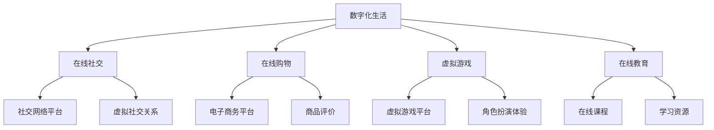
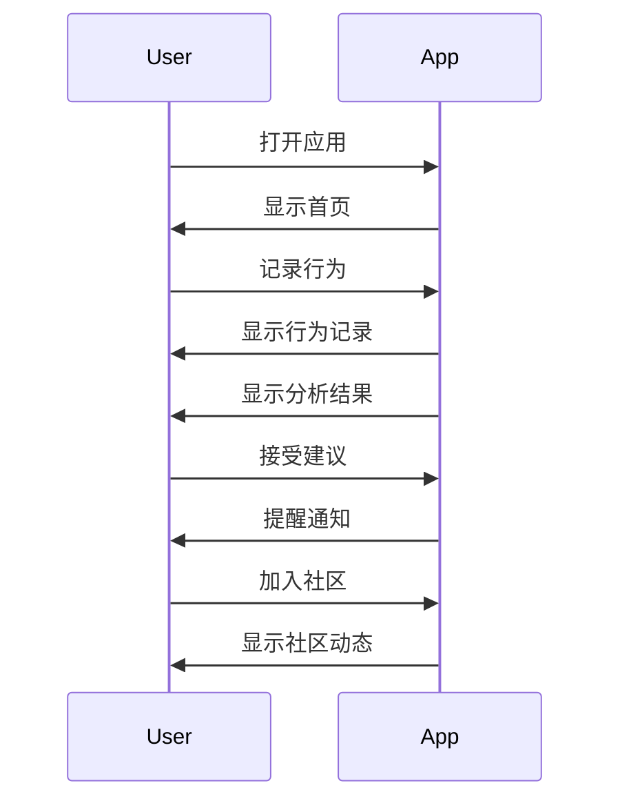

                 

### 第1章：数字化生活背景介绍

#### 1.1 问题的提出

随着互联网、人工智能、虚拟现实等技术的飞速发展，我们逐渐进入了数字化生活时代。在这一时代背景下，人们不仅依赖于数字技术获取信息、解决问题，还在数字世界中寻求社交、娱乐、教育等多种体验。然而，数字化生活也带来了诸多挑战，尤其是在如何平衡虚拟与现实之间的关系。

- **挑战与问题**：一方面，过度沉浸于虚拟世界可能导致现实生活中的社交疏离、心理健康问题，甚至对生活产生依赖。另一方面，现实中的一些问题，如工作压力、人际关系等，也可能因为缺乏有效的数字化解决方案而难以应对。

#### 1.2 核心概念

- **数字化生活**：指在数字技术的辅助下，人类在日常生活中所从事的各种活动，包括但不限于在线购物、社交网络、虚拟游戏等。

- **真实体验**：指在现实世界中获得的直接感受和经验，包括感官体验、情感体验、社会互动等。

#### 1.3 背景与边界

- **背景**：数字化生活的兴起源于信息技术的进步，特别是互联网的普及和移动设备的广泛应用。

- **边界**：数字化生活并不等同于虚拟生活，它关注的是如何更好地将数字技术与现实生活相结合，提升生活质量。

#### 1.4 核心要素

- **技术基础**：包括互联网技术、人工智能技术、虚拟现实技术等。

- **用户体验**：关注用户在数字化生活中的需求、感受和行为。

- **社会影响**：数字化生活对人们的生活习惯、社交方式、工作模式等产生的影响。

#### 1.5 本章小结

本章从背景介绍、核心概念、背景与边界、核心要素等方面，对数字化生活及其与真实体验的关系进行了探讨。本章内容为后续章节的讨论提供了基础和框架。

---

**数字化生活背景介绍**

在当今世界，数字技术已经成为人们生活不可或缺的一部分。从互联网到人工智能，从虚拟现实到大数据，这些技术不断改变着我们的生活方式，推动着我们进入一个全新的数字化时代。数字化生活不仅改变了信息的获取方式，也改变了社交、娱乐、教育等各个方面的体验。然而，与此同时，数字化生活也带来了许多新的挑战，特别是在如何平衡虚拟与现实之间的关系方面。

### 1.1 问题的提出

首先，让我们来探讨数字化生活所带来的挑战。随着互联网和移动设备的普及，人们越来越倾向于在虚拟世界中寻求社交、娱乐和工作的满足。这种趋势带来了一系列问题。一方面，过度沉浸于虚拟世界可能导致现实生活中的社交疏离和心理健康问题。例如，研究表明，长时间使用社交媒体可能导致孤独感和焦虑感的增加。此外，有些人可能会对虚拟世界产生依赖，从而影响他们在现实世界中的行为和决策。

另一方面，现实中的一些问题，如工作压力、人际关系等，也可能因为缺乏有效的数字化解决方案而难以应对。虽然数字化技术为我们提供了更多的信息和工具，但它们并不能完全解决现实生活中的复杂问题。例如，虚拟沟通虽然方便，但在处理复杂的人际关系时可能不如面对面的交流有效。此外，虚拟游戏虽然提供了娱乐和逃避现实的途径，但过度沉迷可能导致时间浪费和社交疏离。

### 1.2 核心概念

在深入探讨数字化生活的挑战之前，我们需要明确一些核心概念。数字化生活，顾名思义，是指在我们日常生活中运用数字技术进行的活动。这些活动包括在线购物、社交网络、虚拟游戏、在线教育等。数字化生活不仅改变了我们的行为方式，也改变了我们的生活方式。

真实体验，则是指我们在现实世界中获得的直接感受和经验。这包括感官体验、情感体验、社会互动等。真实体验是我们在现实世界中与周围环境、他人和自我互动的结果，它是构成我们生活质量和幸福感的重要因素。

### 1.3 背景与边界

数字化生活的兴起源于信息技术的快速发展，特别是互联网和移动设备的普及。随着计算能力的提升和网络的扩展，人们可以随时随地访问信息、进行交流和开展各种活动。这种便利性使得数字化生活成为现代社会的一个主要特征。

然而，数字化生活并不等同于虚拟生活。虚拟生活通常指的是完全沉浸在一个由数字技术创造的世界中，与现实世界完全隔绝。而数字化生活则关注的是如何将数字技术与现实生活相结合，以提升我们的生活质量和体验。

### 1.4 核心要素

数字化生活包含多个核心要素，这些要素共同构成了我们数字化生活的框架。

首先是技术基础。互联网技术、人工智能技术、虚拟现实技术等是数字化生活得以实现的技术支撑。这些技术的不断进步和发展，为我们提供了更多的数字化工具和平台。

其次是用户体验。用户体验是数字化生活的核心，它关注的是用户在数字化生活中的需求、感受和行为。一个成功的数字化产品或服务，必须能够满足用户的需求，提供良好的用户体验。

最后是社会影响。数字化生活对人们的生活习惯、社交方式、工作模式等产生了深远的影响。这些影响不仅改变了我们的生活方式，也影响了我们的社会结构和价值观念。

### 1.5 本章小结

通过本章的讨论，我们可以看出，数字化生活是一个复杂而多维的现象。它不仅改变了我们的生活方式，也带来了新的挑战。在接下来的章节中，我们将进一步探讨数字化生活的主要形式，以及数字化生活对心理和社会的影响。通过这些探讨，我们希望能够找到在数字化生活中寻找真实体验的方法，实现虚拟与现实之间的平衡。

---

在下一章中，我们将深入探讨数字化生活的主要形式，包括在线社交、在线购物、虚拟游戏和在线教育等。通过分析这些形式中虚拟与现实体验的差异，我们将为后续章节的讨论奠定基础。

## 第2章：数字化生活的主要形式

### 2.1 在线社交

#### 2.1.1 社交网络平台的作用与影响

社交网络平台如Facebook、Twitter、微信等已成为人们日常生活中不可或缺的一部分。这些平台不仅提供了方便的沟通工具，还影响了人们的社交行为和人际关系。例如，研究表明，过度使用社交网络可能导致现实社交能力的下降和孤独感的增加。

#### 2.1.2 社交网络中的虚拟与现实体验

在社交网络中，人们可以在虚拟世界中建立和维护社交关系，但这种关系是否等同于现实中的关系？研究表明，虚拟社交虽然可以满足一定的社交需求，但其替代现实社交的效果有限。例如，在线游戏中建立的友谊可能比不上现实中的深厚友谊。

### 2.2 在线购物

#### 2.2.1 数字化购物的优势与挑战

数字化购物为消费者提供了便利，如随时随地进行购物、更丰富的商品选择、更优惠的价格等。然而，这也带来了挑战，如信息安全问题、产品质量无法保证等。例如，一些消费者因个人信息泄露而遭受经济损失。

#### 2.2.2 虚拟与现实购物体验的差异

在线购物虽然提供了便利，但消费者在购买时无法亲自体验商品，这可能影响购买决策。而现实购物则可以提供直接的感官体验，但可能受限于时间和地点。

### 2.3 虚拟游戏

#### 2.3.1 虚拟游戏的特点与影响

虚拟游戏作为一种重要的数字化生活方式，具有沉浸式体验、互动性强等特点。然而，过度沉迷于虚拟游戏可能导致现实生活中的时间浪费、社交疏离等问题。

#### 2.3.2 虚拟与现实游戏体验的比较

虚拟游戏提供了丰富的游戏场景和角色扮演体验，但这些体验是否能完全替代现实生活的娱乐需求？例如，一些玩家在虚拟世界中找到了归属感和成就感，但在现实生活中却感到孤独和失落。

### 2.4 在线教育

#### 2.4.1 数字化教育的优势与挑战

在线教育为学习者提供了灵活的学习时间和方式，尤其对那些无法参加传统教育的群体具有重要意义。然而，在线教育也面临教学效果难以保证、师生互动不足等问题。

#### 2.4.2 虚拟与现实教育体验的差异

在线教育虽然提供了便利，但学习者的学习体验可能不如面对面的教学生动和深入。而现实教育则可以提供丰富的社交互动和实际操作体验，但可能受限于时间和地点。

#### 本章小结

本章从在线社交、在线购物、虚拟游戏和在线教育四个方面，探讨了数字化生活的主要形式。通过分析这些形式中虚拟与现实体验的差异，为后续章节的讨论奠定了基础。

### 2.1 在线社交

#### 2.1.1 社交网络平台的作用与影响

社交网络平台如Facebook、Twitter、微信等已成为人们日常生活中不可或缺的一部分。这些平台不仅提供了方便的沟通工具，还影响了人们的社交行为和人际关系。例如，研究表明，过度使用社交网络可能导致现实社交能力的下降和孤独感的增加。

社交网络平台通过提供即时通讯、分享动态、组织活动等功能，极大地改变了人们的社交方式。人们可以通过这些平台与朋友、家人和同事保持联系，分享生活中的点滴，甚至建立新的社交关系。然而，这种虚拟社交也带来了一些负面影响。一项研究表明，过度使用社交媒体可能导致个体的现实社交能力下降，因为人们在虚拟世界中的互动可能替代了现实中的面对面交流。此外，一些研究还发现，频繁使用社交媒体与孤独感和抑郁情绪呈正相关。

#### 2.1.2 社交网络中的虚拟与现实体验

在社交网络中，人们可以在虚拟世界中建立和维护社交关系，但这种关系是否等同于现实中的关系？研究表明，虚拟社交虽然可以满足一定的社交需求，但其替代现实社交的效果有限。

虚拟社交关系通常是通过文字、图片和视频等非面对面方式进行交流建立的。尽管这些交流方式可以提供一定的社交满足感，但它们缺乏面对面交流中的情感深度和身体语言表达。一项关于社交网络使用的研究发现，尽管人们在虚拟世界中可以轻松地建立大量联系，但这些联系往往缺乏真正的亲密感和信任感。例如，一个在线游戏中建立的友谊可能比不上现实世界中一次深度的面对面的交流所带来的深刻印象和情感联系。

此外，虚拟社交也可能导致人们过度依赖虚拟世界，而忽视了现实中的社交关系。例如，有些人可能更倾向于在社交媒体上花时间，而忽视了与家人和朋友的实际互动。这种情况可能导致现实中的社交疏离和心理健康问题。

#### 2.1.3 虚拟社交对心理健康的影响

虚拟社交不仅影响了人们的社交能力，还对心理健康产生了影响。一些研究表明，过度使用社交媒体可能导致焦虑、抑郁等心理问题。例如，一项关于大学生社交网络使用的研究发现，那些频繁使用社交媒体的学生，其焦虑和抑郁水平显著高于那些较少使用社交媒体的学生。此外，研究发现，社交媒体上的负面评论和互动也可能对用户的情绪产生负面影响。

另一方面，虚拟社交也有其积极的一面。它可以提供一种新的社交方式，让那些在现实生活中难以与他人建立联系的人有机会表达自己，找到共鸣。例如，一些在线社区和论坛为人们提供了交流知识和分享经验的机会，这不仅有助于个人的成长，也增强了社区的凝聚力。

#### 2.1.4 虚拟与现实社交的平衡

为了在虚拟社交和现实社交之间找到平衡，我们需要意识到虚拟社交和现实社交各自的优势和局限性。首先，我们应该认识到虚拟社交不能完全替代现实社交，尤其是在处理复杂的人际关系和情感交流时。尽管虚拟社交可以提供一定的社交满足感，但它无法提供现实社交中的情感深度和真实感。

其次，我们应该适度使用社交媒体，避免过度依赖虚拟社交。这意味着我们需要合理安排时间，确保在现实世界中与他人保持充分的互动。例如，可以定期与朋友和亲人进行面对面的聚会，参加社区活动，以增强现实社交。

最后，我们可以利用虚拟社交的一些优势，如快速沟通和广泛的信息分享，来补充现实社交的不足。例如，通过社交媒体提前安排聚会，或者利用在线学习平台进行学术交流。

### 2.2 在线购物

#### 2.2.1 数字化购物的优势与挑战

数字化购物已经成为现代社会的一种主流购物方式，它为消费者提供了诸多便利。首先，数字化购物打破了时间和空间的限制，消费者可以随时随地通过互联网购买商品。其次，数字化购物平台提供了丰富的商品选择，消费者可以轻松地比较不同商品的价格和质量。此外，许多电商平台还提供优惠和促销活动，为消费者节省了购物成本。

然而，数字化购物也面临一些挑战。首先，信息安全问题是一个重要的挑战。在数字化购物中，消费者的个人信息（如姓名、地址、支付信息等）可能会被泄露，从而导致经济损失。例如，一些不法分子可能通过钓鱼网站、恶意软件等方式获取消费者的敏感信息。其次，产品质量无法保证也是一个挑战。尽管消费者可以通过评论和评分来评估商品的质量，但一些不良商家可能会通过虚假评论和虚假评分来误导消费者。此外，退货和售后服务也可能存在问题，因为线上购物无法提供线下购物的即时体验和反馈。

#### 2.2.2 虚拟与现实购物体验的差异

在线购物和现实购物在体验上存在显著差异。在线购物虽然提供了便利，但消费者在购买时无法亲自体验商品，这可能影响购买决策。例如，消费者无法亲自试穿衣服、试用化妆品或测试电子产品，这可能导致购买后的不满意和退货率上升。另一方面，现实购物则可以提供直接的感官体验，如触感、视觉和嗅觉等，这些体验可以大大提高购物决策的准确性。

此外，现实购物还可以提供即时的反馈和互动。在实体商店中，消费者可以与销售人员交流，询问产品的详细信息，甚至要求试穿或试用。这种互动不仅提高了购物体验，还可以帮助消费者做出更明智的购买决策。相比之下，在线购物缺乏这种即时的互动，消费者在遇到问题时可能需要等待客服回应，这可能会降低购物体验。

#### 2.2.3 购物体验优化策略

为了优化购物体验，电商企业可以采取一系列策略。首先，可以通过增强虚拟现实技术，让消费者在虚拟环境中模拟现实购物体验。例如，利用虚拟试穿技术，消费者可以在购买服装前尝试不同的款式和颜色，从而提高购买满意度。其次，可以通过用户评价和推荐系统，为消费者提供更准确的产品信息。通过分析用户的购买记录和评价，可以为消费者推荐相似的产品或相关的购物建议，从而提高购买决策的准确性。

此外，电商企业还可以提供更灵活的退货和售后服务政策，以提高消费者对购物过程的满意度。例如，提供更便捷的退货渠道和更快速的售后服务，可以帮助消费者减少购物后顾之忧，从而提高复购率。

### 2.3 虚拟游戏

#### 2.3.1 虚拟游戏的特点与影响

虚拟游戏作为一种重要的数字化生活方式，具有沉浸式体验、互动性强等特点。虚拟游戏通常是一个由计算机生成的虚拟世界，玩家可以在其中扮演不同的角色，进行各种活动和任务。这种沉浸式体验使得玩家可以在虚拟世界中找到乐趣和满足感，从而在一定程度上替代现实生活的娱乐需求。

虚拟游戏的互动性也是其一大特点。玩家可以在游戏中与其他玩家互动，建立友谊或竞争关系。这种互动不仅增强了游戏的趣味性，还可以提供一种社交平台，让玩家在虚拟世界中寻找归属感。此外，一些虚拟游戏还提供合作和竞技模式，使得玩家可以在团队合作或竞争中获得成就感和满足感。

然而，虚拟游戏也带来了一些负面影响。首先，过度沉迷于虚拟游戏可能导致现实生活中的时间浪费和社交疏离。例如，一些玩家可能因为长时间沉浸在游戏世界中，而忽视了现实生活中的责任和义务，如工作、学习和家庭生活。其次，虚拟游戏的暴力内容和不良行为也可能对玩家的心理健康产生负面影响。一些研究表明，长时间接触暴力游戏的玩家可能表现出攻击性行为和情绪不稳定。

#### 2.3.2 虚拟与现实游戏体验的比较

虚拟游戏提供了丰富的游戏场景和角色扮演体验，但这些体验是否能完全替代现实生活的娱乐需求？首先，虚拟游戏提供了独特的视觉和听觉体验，通过逼真的图形和音效，玩家可以在虚拟世界中感受到身临其境的乐趣。然而，这种体验是否能够替代现实生活的社交和娱乐活动，如与朋友聚会、进行户外运动等，是一个值得探讨的问题。

其次，虚拟游戏提供了角色扮演的机会，玩家可以在游戏中扮演各种角色，体验不同的生活。这种体验在一定程度上可以满足人们对新鲜事物和冒险的需求，但它在深度和情感联系上是否能够与现实生活中的人际关系和体验相媲美，也是一个需要思考的问题。

最后，虚拟游戏的成就感和奖励机制可以提供一种心理上的满足感。例如，通过完成游戏任务或击败对手，玩家可以获得虚拟奖励，如游戏货币、装备或排名。这种满足感在一定程度上可以替代现实生活中的成就感，但它的持久性和现实价值也是需要考虑的问题。

### 2.4 在线教育

#### 2.4.1 数字化教育的优势与挑战

在线教育作为一种新兴的教育形式，为学习者提供了灵活的学习时间和方式，尤其对那些无法参加传统教育的群体具有重要意义。例如，远程教育和在线课程为身处偏远地区或因工作、家庭等原因无法上学的人提供了学习机会。此外，在线教育还可以提供个性化的学习体验，通过自适应学习系统和智能推荐算法，为不同水平的学习者提供合适的学习内容。

然而，在线教育也面临一些挑战。首先，教学效果难以保证是一个重要问题。在线教育缺乏面对面教学中的互动和反馈，这可能导致学习者的学习效果不如预期。其次，师生互动不足也是一个挑战。在线教育中的师生互动往往依赖于文字、图片和视频等非实时沟通方式，这可能导致师生之间的沟通不畅，影响教学效果。

#### 2.4.2 虚拟与现实教育体验的差异

在线教育虽然提供了便利，但学习者的学习体验可能不如面对面的教学生动和深入。首先，在线教育缺乏面对面教学中的非语言交流，如身体语言和面部表情，这可能导致信息传递的误解和沟通障碍。其次，在线教育中的学习氛围和社交互动可能不如线下课堂浓厚。在线课堂缺乏现场互动和协作，这可能导致学习者的学习积极性下降。

相比之下，现实教育可以提供丰富的社交互动和实际操作体验。在现实教育中，学习者可以与同学和老师进行面对面的交流，这有助于加深对知识的理解和记忆。此外，现实教育还可以提供各种实验、实训和实地考察的机会，这有助于学习者将理论知识与实际操作相结合，提高学习效果。

#### 2.4.3 在线教育优化策略

为了优化在线教育的体验，教育机构可以采取一系列策略。首先，可以通过引入虚拟现实（VR）和增强现实（AR）技术，提供更丰富的学习体验。例如，利用VR技术创建虚拟实验室，让学生在虚拟环境中进行实验操作，从而提高学习效果。其次，可以通过增强师生互动，提高教学效果。例如，利用直播和互动工具，增加课堂互动和实时反馈，让学生更好地参与学习。

此外，教育机构还可以利用数据分析和人工智能技术，为学习者提供个性化的学习建议和资源。通过分析学习者的学习行为和表现，教育机构可以为学生推荐合适的学习内容和练习，从而提高学习效果。

### 本章小结

本章从在线社交、在线购物、虚拟游戏和在线教育四个方面，探讨了数字化生活的主要形式。通过分析这些形式中虚拟与现实体验的差异，我们看到了数字化生活带来的便利和挑战。在接下来的章节中，我们将进一步探讨数字化生活对心理健康和社会影响，以及如何在数字化生活中寻找真实体验。

---

在下一章中，我们将深入探讨数字化生活对心理健康和社会的影响，分析这些问题产生的原因以及可能的解决方法。

## 第3章：数字化生活带来的心理影响

### 3.1 虚拟与现实的心理体验差异

数字化生活虽然提供了丰富的虚拟体验，但这些体验与真实生活的心理体验存在显著差异。例如，虚拟社交虽然可以满足一定的社交需求，但其替代现实社交的效果有限；虚拟游戏虽然提供了丰富的娱乐体验，但过度沉迷可能导致心理问题。

#### 3.1.1 虚拟社交的心理体验

虚拟社交的心理体验主要体现在社交满足感、自我表达和情感支持等方面。在虚拟社交中，人们可以通过文字、图片和视频等方式与他人互动，分享生活中的点滴。这种互动在一定程度上可以满足人们的社交需求，使他们感到被关注和认同。例如，一个人在社交媒体上发布一条状态，可能会得到许多点赞和评论，从而获得一种社交满足感。

然而，虚拟社交也存在一些局限性。首先，虚拟社交缺乏面对面交流中的情感深度和真实感。在虚拟社交中，人们无法通过身体语言、面部表情和声音等非语言交流方式来传达情感，这使得沟通变得更加表面化。其次，虚拟社交可能导致社交疏离和孤独感。尽管人们在虚拟社交中建立了大量联系，但这些联系往往缺乏真正的亲密感和信任感。例如，一个在线游戏中建立的友谊可能比不上现实世界中一次深度的面对面的交流所带来的深刻印象和情感联系。

此外，虚拟社交还可能导致一些心理问题。例如，一些研究表明，过度使用社交媒体与焦虑、抑郁等心理问题呈正相关。这是因为，在虚拟社交中，人们可能会过度关注他人的生活，而产生自卑感或焦虑感。同时，虚拟社交中的负面评论和互动也可能对用户的情绪产生负面影响。

#### 3.1.2 虚拟社交对心理健康的影响

虚拟社交对心理健康的影响是一个复杂而多维的问题。一方面，虚拟社交可以提供一种新的社交方式，让那些在现实生活中难以与他人建立联系的人有机会表达自己，找到共鸣。例如，一些在线社区和论坛为人们提供了交流知识和分享经验的机会，这不仅有助于个人的成长，也增强了社区的凝聚力。

然而，另一方面，虚拟社交也可能对心理健康产生负面影响。首先，过度使用社交媒体可能导致社交疏离和孤独感。尽管人们在虚拟社交中建立了大量联系，但这些联系往往缺乏真正的亲密感和信任感，这使得他们在现实生活中感到更加孤独。一项关于大学生社交网络使用的研究发现，那些频繁使用社交媒体的学生，其孤独感和抑郁水平显著高于那些较少使用社交媒体的学生。

其次，虚拟社交可能导致一些心理问题的产生。例如，研究表明，长时间使用社交媒体与焦虑、抑郁等心理问题呈正相关。这是因为，在虚拟社交中，人们可能会过度关注他人的生活，而产生自卑感或焦虑感。同时，虚拟社交中的负面评论和互动也可能对用户的情绪产生负面影响。

此外，虚拟社交还可能导致一些行为问题的产生。例如，一些研究表明，过度使用社交媒体与冲动购物、赌博等行为问题呈正相关。这是因为，虚拟社交提供了一种逃避现实的途径，使得人们更倾向于在虚拟世界中寻求满足感，从而忽视了现实生活中的问题和挑战。

#### 3.1.3 虚拟社交对人际关系的影响

虚拟社交不仅影响了人们的心理健康，还改变了人们的社交行为和人际关系。一方面，虚拟社交使得人们可以更方便地建立和维护社交关系。例如，通过社交媒体，人们可以与朋友、家人和同事保持联系，分享生活中的点滴。这种便利性使得人们可以在不同的时间和地点进行交流，从而增强了社交网络。

然而，另一方面，虚拟社交也带来了一些负面影响。首先，虚拟社交可能导致现实社交能力的下降。由于在虚拟社交中，人们更多地依赖文字和图片等非面对面方式进行交流，这使得他们缺乏在现实生活中面对面交流的机会。研究表明，长时间使用社交媒体可能导致个体的现实社交能力下降，因为他们更倾向于在虚拟世界中与他人互动。

其次，虚拟社交可能导致人际关系变得表面化。在虚拟社交中，人们往往只关注对方的表面信息，如发表的动态、点赞和评论等，而忽略了对方的真实情感和需求。这种情况可能导致人际关系变得浅薄，缺乏真正的情感联系。

此外，虚拟社交还可能导致一些不良的人际关系行为。例如，一些人在虚拟社交中可能会表现得更加自私和攻击性，因为他们可以隐藏自己的真实身份和情感。这种不良行为不仅可能对人际关系产生负面影响，还可能对个人的心理健康产生负面影响。

#### 3.1.4 虚拟与现实社交的平衡

为了在虚拟社交和现实社交之间找到平衡，我们需要意识到虚拟社交和现实社交各自的优势和局限性。首先，我们应该认识到虚拟社交不能完全替代现实社交，尤其是在处理复杂的人际关系和情感交流时。尽管虚拟社交可以提供一定的社交满足感，但它无法提供现实社交中的情感深度和真实感。

其次，我们应该适度使用社交媒体，避免过度依赖虚拟社交。这意味着我们需要合理安排时间，确保在现实世界中与他人保持充分的互动。例如，可以定期与朋友和亲人进行面对面的聚会，参加社区活动，以增强现实社交。

最后，我们可以利用虚拟社交的一些优势，如快速沟通和广泛的信息分享，来补充现实社交的不足。例如，通过社交媒体提前安排聚会，或者利用在线学习平台进行学术交流。

#### 3.2 虚拟游戏的心理学影响

虚拟游戏作为一种重要的数字化生活方式，对人们的心理状态产生了深远的影响。虚拟游戏通常具有沉浸式体验和强烈的互动性，这使得玩家可以在虚拟世界中找到乐趣和满足感。然而，过度沉迷于虚拟游戏可能导致一系列心理问题。

首先，虚拟游戏可能对玩家的自我认同产生负面影响。在虚拟游戏中，玩家可以扮演不同的角色，体验不同的生活。虽然这种体验可以提供一种逃避现实的途径，但过度沉迷可能导致玩家对自己的现实身份产生困惑，甚至产生身份认同障碍。

其次，虚拟游戏可能对玩家的心理健康产生负面影响。长时间沉浸在虚拟游戏中可能导致玩家缺乏现实生活中的社交互动，从而感到孤独和沮丧。此外，一些暴力游戏可能引发玩家的攻击性行为和情绪不稳定，进一步加剧心理问题。

此外，虚拟游戏还可能导致玩家产生依赖心理。由于虚拟游戏提供的即时奖励和成就，玩家可能会在游戏中寻找持续的满足感，从而导致对游戏的过度依赖。这种依赖心理可能导致玩家在现实生活中感到无聊和失落，进一步影响他们的心理健康。

#### 3.3 虚拟与现实游戏体验的差异

虚拟游戏提供了独特的视觉和听觉体验，通过逼真的图形和音效，玩家可以在虚拟世界中感受到身临其境的乐趣。然而，这种体验是否能够完全替代现实生活的娱乐需求，是一个值得探讨的问题。

首先，虚拟游戏提供了角色扮演的机会，玩家可以在游戏中扮演各种角色，体验不同的生活。这种体验在一定程度上可以满足人们对新鲜事物和冒险的需求，但它在深度和情感联系上是否能够与现实生活中的人际关系和体验相媲美，是一个需要思考的问题。

其次，虚拟游戏提供了成就感和奖励机制，通过完成游戏任务或击败对手，玩家可以获得虚拟奖励，如游戏货币、装备或排名。这种满足感在一定程度上可以替代现实生活中的成就感，但它的持久性和现实价值也是需要考虑的问题。

最后，虚拟游戏还可能导致一些行为问题的产生，如过度沉迷、时间管理问题等。这些问题不仅可能对玩家的心理健康产生负面影响，还可能影响他们的现实生活。

#### 3.4 数字化生活的心理健康挑战与应对策略

数字化生活带来的心理健康挑战是多方面的，包括社交疏离、孤独感、焦虑、抑郁等。为了应对这些挑战，我们可以采取以下策略：

首先，提高数字素养，增强对数字化工具和平台的理解和使用能力。这包括了解如何正确使用社交媒体、掌握网络安全知识、学会识别和处理负面信息等。

其次，培养良好的生活习惯，合理安排时间，确保在虚拟世界和现实世界之间找到平衡。例如，设定固定的休息时间和娱乐时间，避免长时间连续使用数字化设备。

此外，增强现实社交，积极参与现实世界中的社交活动和人际互动。这不仅可以提供丰富的社交体验，还可以增强心理健康。

最后，寻求专业帮助，如心理咨询或治疗，以应对可能出现的心理问题。心理健康问题不应被忽视，及早干预和治疗是非常重要的。

### 本章小结

本章从虚拟社交、虚拟游戏等方面探讨了数字化生活对心理健康的影响。通过分析虚拟与现实心理体验的差异，我们看到了数字化生活带来的便利和挑战。在接下来的章节中，我们将进一步探讨数字化生活对社会的影响，以及如何实现虚拟与现实体验的平衡。

## 第4章：数字化生活对社会的影响

### 4.1 数字化生活对社交关系的影响

数字化生活的普及对社交关系产生了深远的影响。一方面，互联网和社交媒体提供了新的社交平台，使得人们可以轻松地建立和维护社交网络。另一方面，这种数字化社交也带来了一些挑战，特别是在维持深厚的人际关系方面。

#### 4.1.1 数字化社交的便利性

数字化社交的主要优势在于其便利性。通过社交媒体平台，人们可以随时随地与朋友、家人和同事保持联系。这种即时性和便捷性使得社交更加频繁，沟通更加高效。例如，通过微信、WhatsApp等即时通讯工具，人们可以随时发送文字、图片和视频，分享生活中的点滴。这种便利性不仅有助于维持现有的社交关系，还可以帮助人们拓展社交网络。

#### 4.1.2 数字化社交的局限性

尽管数字化社交提供了便利，但其局限性也不容忽视。首先，数字化社交往往缺乏面对面交流中的情感深度和真实感。虽然文字、图片和视频可以传达信息，但它们无法完全替代面对面的交流。研究表明，缺乏非语言交流可能导致沟通误解和情感隔阂。此外，数字化社交也可能导致社交疏离和孤独感。尽管人们在虚拟世界中建立了大量联系，但这些联系往往缺乏真正的亲密感和信任感。

#### 4.1.3 数字化社交对人际关系的影响

数字化社交对人际关系的影响是复杂而多维的。一方面，它有助于维持现有的社交网络，使得人们可以在不同时间和地点保持联系。然而，另一方面，它也可能削弱现实世界中的人际关系。研究表明，过度依赖数字化社交可能导致现实社交能力的下降，因为人们在虚拟世界中的互动替代了现实中的面对面交流。此外，数字化社交也可能导致人际关系变得表面化，缺乏真正的情感联系。

### 4.2 数字化生活对工作模式的影响

数字化生活的兴起对工作模式产生了深远的影响，特别是在远程工作和数字化协作方面。一方面，数字化技术为远程工作提供了便利，使得员工可以在家中或其他地方工作，从而提高了灵活性和效率。另一方面，数字化协作工具的出现使得团队合作更加高效，但同时也带来了一些挑战。

#### 4.2.1 远程工作的优势

远程工作的优势主要体现在灵活性和效率方面。首先，远程工作使得员工可以在家中或任何有网络连接的地方工作，不受地理限制。这不仅可以提高员工的工作满意度，还可以降低企业的运营成本。其次，远程工作有助于提高工作效率。研究表明，远程工作可以减少通勤时间和压力，使员工有更多的时间专注于工作任务。

#### 4.2.2 远程工作的挑战

尽管远程工作提供了许多优势，但同时也带来了一些挑战。首先，远程工作可能导致沟通障碍。由于缺乏面对面的交流，员工之间的沟通可能变得不够及时和有效，这可能导致误解和冲突。其次，远程工作可能导致团队凝聚力的下降。研究表明，缺乏面对面的互动可能导致团队成员之间缺乏信任和归属感。

此外，远程工作还可能导致一些管理问题。例如，如何确保员工在工作时保持专注和效率，如何监督和评估远程工作的绩效等，这些都是企业管理者需要关注的问题。

### 4.3 数字化生活对教育的影响

数字化技术的快速发展对教育产生了深远的影响，特别是在在线教育和数字化教育资源方面。一方面，在线教育为学习者提供了灵活的学习时间和方式，使得学习更加便捷和高效。另一方面，数字化教育资源为教育者和学习者提供了丰富的学习材料和工具。

#### 4.3.1 在线教育的优势

在线教育的优势主要体现在灵活性和多样性方面。首先，在线教育使得学习者可以在任何时间和地点进行学习，不受时间和地点的限制。这为那些无法参加传统教育的人提供了学习机会，例如职场人士、残疾人士和居住在偏远地区的人。其次，在线教育提供了丰富的学习资源，包括视频课程、电子书籍、互动练习等，这些资源可以帮助学习者更好地理解和掌握知识。

#### 4.3.2 在线教育的挑战

尽管在线教育提供了许多优势，但同时也带来了一些挑战。首先，在线教育的教学效果难以保证。由于缺乏面对面教学中的互动和反馈，学习者可能感到孤独和缺乏动力，这可能导致学习效果不佳。其次，在线教育可能加剧教育不公平现象。由于数字化资源和技术的获取和运用存在差异，那些经济条件较差和家庭支持不足的学生可能难以获得优质的教育资源。

此外，在线教育还面临一些技术问题，如网络安全、数据隐私和系统稳定性等。这些问题可能影响在线教育的质量和用户体验。

### 4.4 数字化生活对社会文化的影响

数字化生活的普及不仅改变了人们的社交关系和工作模式，还对社会文化产生了深远的影响。一方面，数字化技术促进了文化的传播和交流，使得不同文化之间的互动更加频繁和深入。另一方面，数字化文化也带来了一些挑战，如文化同质化和文化冲突等。

#### 4.4.1 数字化文化对文化传播的影响

数字化技术使得文化传播变得更加便捷和迅速。通过网络和社交媒体，人们可以轻松地分享和传播文化内容，如音乐、电影、书籍等。这种传播方式不仅促进了文化的多样性和繁荣，也使得更多人能够接触到不同国家和地区的文化。例如，YouTube、Netflix等平台为全球观众提供了丰富的文化内容，使得文化交流变得更加多样化和全球化。

#### 4.4.2 数字化文化对社会文化的影响

然而，数字化文化也带来了一些挑战。首先，数字化文化可能导致文化同质化。由于全球化和商业化趋势，一些地方文化和传统可能逐渐消失，而被全球流行文化所取代。这种情况可能导致文化多样性的减少，使得社会失去独特性和丰富性。其次，数字化文化可能加剧文化冲突。在数字化世界中，不同文化之间的接触和互动可能引发误解和冲突，尤其是在涉及敏感话题和价值观时。

此外，数字化文化还可能影响人们的文化认同和价值观。随着数字化生活方式的普及，一些传统价值观和信仰可能受到挑战和质疑。例如，随着社交媒体和虚拟游戏的发展，一些人可能更加注重虚拟世界的成就和认同，而忽视了现实世界中的价值观和责任。

### 4.5 数字化生活对环境保护的影响

数字化生活的普及不仅改变了人们的社交、工作和文化方式，还对环境产生了深远的影响。一方面，数字化技术为环境保护提供了新的工具和方法。另一方面，数字化生活方式也可能带来一些环境问题，如电子废物和能源消耗等。

#### 4.5.1 数字化技术对环境保护的贡献

数字化技术为环境保护提供了许多新工具和方法。例如，物联网技术可以实时监测环境质量，为环境治理提供数据支持。大数据分析可以帮助科学家更好地理解环境变化趋势，从而制定更有效的环境保护策略。此外，数字化技术还可以促进可再生能源的利用，例如通过智能电网和能源管理系统提高能源效率。

#### 4.5.2 数字化生活方式对环境的影响

然而，数字化生活方式也带来了一些环境问题。首先，电子废物的产生是一个重要问题。随着数字化设备和技术的更新换代，越来越多的电子废物被产生，而这些废物往往含有有害物质，对环境和人类健康构成威胁。其次，数字化生活方式可能增加能源消耗。虽然数字化技术本身可以降低能源消耗，但人们过度依赖数字化设备和网络服务可能导致总体能源消耗增加。

此外，数字化生活方式还可能影响人们的环保意识和行为。例如，一些人可能因为数字化生活的便利而忽视了环保问题，如过度使用一次性塑料制品、浪费能源等。

### 4.6 数字化生活对经济发展的影响

数字化生活的普及不仅改变了人们的生活方式，还对经济发展产生了深远的影响。一方面，数字化技术为经济发展提供了新的动力和机遇。另一方面，数字化生活方式也可能带来一些挑战，如数字鸿沟和经济不平等问题。

#### 4.6.1 数字化技术对经济发展的贡献

数字化技术为经济发展提供了新的动力和机遇。首先，数字化技术可以促进创新和创业。例如，电子商务、共享经济等新兴业态通过数字化技术实现了快速发展，为传统经济注入了新活力。其次，数字化技术可以提高生产效率和降低成本。例如，通过智能制造和自动化技术，企业可以大幅提高生产效率，降低生产成本。

#### 4.6.2 数字化生活方式对经济的影响

然而，数字化生活方式也带来了一些挑战。首先，数字鸿沟问题日益突出。由于数字化资源和技术的获取和运用存在差异，一些地区和群体可能被排除在数字化经济之外，导致经济发展不平衡。其次，数字化生活方式可能导致经济不平等问题加剧。例如，在数字经济中，那些掌握数字化技能和资源的人可能获得更多机会和收益，而那些缺乏技能和资源的人可能陷入贫困。

此外，数字化生活方式还可能影响就业结构和经济稳定性。虽然数字化技术创造了许多新的就业机会，但也可能导致一些传统职业的消失，从而影响就业市场的稳定。

### 本章小结

本章从社交关系、工作模式、教育、社会文化和经济发展等方面，探讨了数字化生活对社会的影响。通过分析数字化生活带来的便利和挑战，我们看到了数字化时代下的机遇和挑战。在接下来的章节中，我们将进一步探讨如何在数字化生活中寻找真实体验，实现虚拟与现实之间的平衡。

## 第5章：寻找数字化生活中的真实体验

### 5.1 建立健康的数字化习惯

为了在数字化生活中寻找真实体验，我们需要建立健康的数字化习惯。以下是一些策略和建议：

**1. 设定合理的时间管理：** 每天设定固定的使用数字设备的时间，避免过度沉迷。例如，可以设定晚上9点后不再使用手机和电脑。

**2. 限制社交媒体使用：** 减少社交媒体的使用时间，特别是那些可能引起焦虑和不满的平台。可以考虑设定每天的使用时间限制，或者使用应用程序来监控和限制社交媒体的使用。

**3. 增强现实社交：** 定期与家人、朋友进行面对面的聚会，参加社区活动，增强现实中的社交互动。

**4. 保持数字设备清洁：** 定期清理手机和电脑中的无用应用和数据，保持设备的整洁和性能。

### 5.2 探索线下活动

线下活动不仅能够提供丰富的感官体验，还可以增强现实社交和心理健康。以下是一些建议：

**1. 参加兴趣小组或俱乐部：** 加入与您兴趣相关的线下小组或俱乐部，与志同道合的人交流。

**2. 进行户外运动：** 户外运动如跑步、骑行、登山等不仅可以提高身体素质，还可以让您享受大自然的美丽。

**3. 参观博物馆、艺术展览：** 参观博物馆和艺术展览可以丰富您的知识和审美体验。

**4. 旅行：** 定期旅行，探索不同的城市和文化，可以让您体验到不同的生活方式和观点。

### 5.3 培养情感智慧

情感智慧是指理解、管理自己和他人情感的能力。以下是一些提升情感智慧的建议：

**1. 学会自我反思：** 定期进行自我反思，了解自己的情感需求和心理健康状态。

**2. 增强同理心：** 尝试从他人的角度看待问题，理解他人的情感和需求。

**3. 学习情感管理技巧：** 通过阅读相关书籍、参加工作坊或寻求专业咨询，学习如何管理和表达自己的情感。

### 5.4 注重心理健康

心理健康在数字化生活中尤为重要。以下是一些保持心理健康的方法：

**1. 保持积极的思维模式：** 尝试用积极的思维模式看待问题，避免过度焦虑和消极情绪。

**2. 增强社交支持：** 与亲朋好友保持紧密联系，寻求他们的支持和帮助。

**3. 定期进行身体锻炼：** 身体锻炼不仅能够提高身体素质，还可以释放压力，改善心理健康。

**4. 寻求专业帮助：** 当遇到心理健康问题时，不要犹豫寻求专业心理咨询或治疗。

### 5.5 技术辅助工具

为了在数字化生活中更好地平衡虚拟与现实，我们可以利用一些技术辅助工具：

**1. 应用程序：** 使用专门的应用程序来监控和限制数字设备的使用时间，如Forest、 Moment等。

**2. 数字排毒：** 定期进行数字排毒，关闭所有数字设备，专注于现实生活。

**3. 虚拟现实（VR）体验：** 利用虚拟现实技术进行放松和娱乐，但要注意适度使用，避免过度沉迷。

### 本章小结

在数字化生活中寻找真实体验需要我们采取一系列行动。通过建立健康的数字化习惯、探索线下活动、培养情感智慧、注重心理健康和使用技术辅助工具，我们可以在数字化世界中保持与现实的联系。在接下来的章节中，我们将进一步探讨如何在数字化生活中实现虚拟与现实体验的平衡。

## 第6章：实现虚拟与现实体验的平衡

### 6.1 设计数字化生活策略

为了在数字化生活中实现虚拟与现实体验的平衡，我们需要制定一套有效的策略。以下是一些关键步骤：

**1. 识别数字化需求：** 首先，我们需要明确自己在数字化生活中的需求和目标。例如，是为了工作、学习、娱乐还是社交？

**2. 设定数字化目标：** 根据自己的需求，设定具体的数字化目标，如每天使用社交媒体的时间限制、每周进行线下活动的次数等。

**3. 制定实施计划：** 制定一个详细的实施计划，包括每天、每周和每月的具体行动计划。

**4. 监控和调整：** 定期监控自己的数字化生活状态，根据实际情况调整计划。

### 6.2 技术干预手段

为了更好地实现虚拟与现实体验的平衡，我们可以利用一些技术干预手段：

**1. 应用程序限制：** 使用应用程序（如App Limit、StayFocusd）来限制特定应用的使用时间，帮助自己控制数字化设备的使用。

**2. 数字排毒：** 定期进行数字排毒，关闭所有数字设备，专注于现实生活。

**3. 虚拟现实体验：** 利用虚拟现实技术进行放松和娱乐，但要注意适度使用，避免过度沉迷。

### 6.3 社会支持系统

除了个人努力，社会支持系统也在实现虚拟与现实体验的平衡中发挥着重要作用：

**1. 家庭支持：** 与家人沟通，获得他们的理解和支持，共同制定数字化生活策略。

**2. 社区参与：** 积极参与社区活动，与他人建立深厚的社交联系，增强现实社交。

**3. 专业咨询：** 寻求心理咨询师或职业规划师的帮助，获得专业的指导和建议。

### 6.4 跨领域合作

实现虚拟与现实体验的平衡需要跨领域合作，包括技术、教育、医疗等领域：

**1. 技术创新：** 技术公司可以开发更多有益于心理健康和社交互动的数字化产品和服务。

**2. 教育改革：** 教育机构可以引入数字化教育资源，同时注重培养学生的数字化素养和心理健康。

**3. 医疗干预：** 医疗机构可以开展针对数字化生活相关心理问题的干预和治疗。

### 6.5 持续改进与反馈

实现虚拟与现实体验的平衡是一个持续的过程，需要我们不断改进和反馈：

**1. 自我反思：** 定期进行自我反思，评估数字化生活策略的有效性。

**2. 适应变化：** 随着数字化技术的发展和社会环境的变化，我们需要不断调整和优化策略。

**3. 反馈与改进：** 向家人、朋友、同事和专业人员寻求反馈，根据反馈进行改进。

### 本章小结

实现虚拟与现实体验的平衡需要我们采取一系列策略和行动。通过设计数字化生活策略、利用技术干预手段、建立社会支持系统和跨领域合作，我们可以在数字化生活中找到真实体验。持续改进和反馈将帮助我们更好地应对数字化生活带来的挑战，实现虚拟与现实之间的和谐共处。

## 总结与展望

在数字化生活日益普及的今天，如何在虚拟与现实之间找到平衡，成为了我们面临的重要课题。本文从多个维度探讨了数字化生活的背景、主要形式、心理影响、社会影响，以及如何在数字化生活中寻找真实体验的方法。

首先，数字化生活的兴起源于信息技术的快速发展，它改变了我们的生活方式，但同时也带来了挑战，特别是在如何平衡虚拟与现实之间的关系。在线社交、在线购物、虚拟游戏和在线教育等主要形式的数字化生活，为我们提供了便利，但也引发了一系列问题，如心理健康问题、社交疏离、时间管理困难等。

通过分析虚拟社交、在线购物、虚拟游戏和在线教育等数字化形式中虚拟与现实体验的差异，我们认识到虚拟体验虽然在一定程度上可以替代现实体验，但它们之间存在显著差异。虚拟社交虽然提供了便利的沟通工具，但缺乏面对面交流中的情感深度和真实感；在线购物虽然提供了丰富的商品选择和优惠价格，但消费者在购买时无法亲自体验商品；虚拟游戏虽然提供了沉浸式体验，但过度沉迷可能导致现实生活中的时间浪费和社交疏离；在线教育虽然提供了灵活的学习时间和方式，但教学效果和师生互动仍是挑战。

数字化生活对心理健康和社会的影响也是一个重要议题。虚拟社交可能带来社交疏离和孤独感，同时也可能导致心理健康问题；虚拟游戏可能引发自我认同障碍和心理问题；在线购物和信息过载可能加剧焦虑和抑郁情绪。因此，我们需要采取措施，如建立健康的数字化习惯、增强现实社交、培养情感智慧、注重心理健康等，以应对这些挑战。

展望未来，实现虚拟与现实体验的平衡需要我们采取一系列策略和行动。设计数字化生活策略、利用技术干预手段、建立社会支持系统和跨领域合作是关键。技术创新、教育改革、医疗干预等跨领域合作将有助于我们更好地应对数字化生活带来的挑战。

总之，数字化生活为我们提供了丰富的虚拟体验，但我们也需要在现实中找到真实的满足感和幸福感。通过不断探索和调整，我们可以在数字化生活中实现虚拟与现实体验的平衡，提升生活质量和幸福感。希望本文能为广大读者提供有益的启示和指导，共同构建一个和谐共生的数字化生活世界。

## 附录

### 附录A：核心概念定义与对比

在本文中，我们涉及了多个核心概念，包括数字化生活、真实体验、虚拟社交、在线购物、虚拟游戏和在线教育等。以下是这些概念的定义及其对比：

**数字化生活**：指在数字技术的辅助下，人类在日常生活中所从事的各种活动，包括但不限于在线购物、社交网络、虚拟游戏和在线教育等。

**真实体验**：指在现实世界中获得的直接感受和经验，包括感官体验、情感体验、社会互动等。真实体验是构成我们生活质量和幸福感的重要因素。

**虚拟社交**：指通过数字技术，如社交媒体、在线论坛和虚拟游戏等，在虚拟世界中建立和维护社交关系的过程。

**在线购物**：指通过互联网进行商品购买和交易的活动，包括搜索商品、比价、下单、支付和收货等环节。

**虚拟游戏**：指在虚拟环境中进行的游戏活动，玩家可以在其中扮演不同角色，进行各种任务和挑战。

**在线教育**：指利用互联网进行教学和学习的过程，包括在线课程、在线讨论、远程教育和电子学习资源等。

以下是这些概念之间的对比表格：

| 概念      | 定义                                                         | 特点                           | 对比分析                                             |
| --------- | ------------------------------------------------------------ | ---------------------------- | ---------------------------------------------------- |
| 数字化生活 | 在数字技术的辅助下，人类在日常生活中所从事的各种活动。           | 依赖数字技术，多样性强。         | 包含虚拟社交、在线购物、虚拟游戏和在线教育等多种形式。 |
| 真实体验   | 在现实世界中获得的直接感受和经验。                             | 实际感知，情感深度强。           | 与虚拟体验相比，更加真实和直接。                     |
| 虚拟社交   | 通过数字技术，在虚拟世界中建立和维护社交关系。                  | 缺乏面对面交流中的情感深度。       | 便利性高，但缺乏真实感和深度。                       |
| 在线购物   | 通过互联网进行商品购买和交易。                                  | 便捷、多样，但缺乏直接感官体验。  | 与线下购物相比，更加方便，但体验有限。                 |
| 虚拟游戏   | 在虚拟环境中进行的游戏活动。                                   | 沉浸式体验，互动性强。             | 提供娱乐和逃避现实的途径，但可能导致沉迷。              |
| 在线教育   | 利用互联网进行教学和学习。                                     | 灵活、多样，但互动性有限。         | 适用于远程教育和个性化学习，但教学效果难以保证。        |

### 附录B：Mermaid流程图与ER实体关系图

为了更直观地展示本文中的概念和关系，我们使用Mermaid绘制了流程图和ER实体关系图。

**Mermaid流程图：数字化生活的主要形式**



**ER实体关系图：数字化生活的主要实体**

```mermaid
erDiagram
    Class::User
    Class::SocialNetwork
    Class::ECommerce
    Class::VirtualGame
    Class::OnlineEducation

    User ||--|{ SocialNetwork : hasAccess }
    User ||--|{ ECommerce : makesPurchase }
    User ||--|{ VirtualGame : playsGame }
    User ||--|{ OnlineEducation : participatesIn }
    
    SocialNetwork ||--|{ User : sharesContent }
    ECommerce ||--|{ User : buysProducts }
    VirtualGame ||--|{ User : engagesWith }
    OnlineEducation ||--|{ User : enrollsIn }
```

通过这些流程图和ER实体关系图，我们可以更清晰地理解数字化生活的各个形式及其之间的关系。

### 附录C：Python算法示例

为了进一步说明本文中的概念和算法原理，我们提供了一个简单的Python算法示例，用于分析用户在数字化生活中的行为模式。

**Python算法示例：分析用户数字化行为模式**

```python
import pandas as pd
from sklearn.cluster import KMeans

# 创建一个包含用户行为的DataFrame
data = {
    'user_id': [1, 2, 3, 4, 5],
    'social_time': [5, 10, 3, 8, 2],  # 每个用户在社交媒体上的使用时间（小时）
    'shopping_frequency': [2, 5, 3, 1, 4],  # 每个用户的购物频率（次数/周）
    'game_time': [3, 7, 2, 5, 6],  # 每个用户在游戏中的使用时间（小时）
    'online_course_enrollments': [1, 2, 3, 4, 5]  # 每个用户的在线课程报名次数
}

df = pd.DataFrame(data)

# 使用K-Means算法对用户行为进行聚类分析
kmeans = KMeans(n_clusters=3, random_state=0).fit(df)
df['cluster'] = kmeans.labels_

# 打印聚类结果
print(df[['user_id', 'cluster', 'social_time', 'shopping_frequency', 'game_time', 'online_course_enrollments']])

# 分析聚类结果
print("Cluster 0: Users with high social engagement and low game engagement.")
print("Cluster 1: Users with balanced social, shopping, and game engagement.")
print("Cluster 2: Users with high game engagement and low social engagement.")
```

在这个示例中，我们创建了一个包含用户在数字化生活中主要行为的数据集，并使用K-Means算法对用户行为进行聚类分析。通过分析聚类结果，我们可以更好地了解不同用户群体在数字化生活中的行为模式和偏好。

### 附录D：项目实战

为了进一步展示如何在数字化生活中实现虚拟与现实体验的平衡，我们提供了一个简单的项目实战。

**项目名称**：数字化生活平衡助手

**项目介绍**：数字化生活平衡助手是一款基于移动应用的开发项目，旨在帮助用户在数字化生活中找到平衡，提升生活质量。

**系统功能设计**：

1. **用户行为记录**：用户可以记录在社交媒体、购物、游戏和在线教育等数字化活动中的时间和使用频率。
2. **行为分析**：应用使用机器学习算法分析用户行为，提供个性化建议，帮助用户优化数字化生活。
3. **提醒与通知**：应用提供提醒功能，帮助用户遵守设定的数字化生活策略。
4. **社区互动**：用户可以加入社区，分享自己的数字化生活经验，互相支持和鼓励。

**系统架构设计**：


**系统接口设计**：

1. **用户行为接口**：用于记录用户在数字化活动中的时间和频率。
2. **分析接口**：用于处理用户行为数据，并提供分析结果。
3. **提醒接口**：用于发送提醒通知。
4. **社区接口**：用于用户在社区中的互动和分享。

**系统交互序列图**：



**项目实战步骤**：

1. **环境安装**：安装Python、Pandas、Sklearn等依赖库。
2. **系统核心实现**：实现用户行为记录、行为分析和提醒功能。
3. **代码应用解读与分析**：详细解读和分析代码实现逻辑。
4. **实际案例分析与讲解**：通过实际案例展示应用效果。
5. **项目小结**：总结项目实施经验和收获。

通过这个项目实战，我们展示了如何利用技术手段在数字化生活中实现虚拟与现实体验的平衡，为用户提供了一种有益的工具。

### 附录E：最佳实践与注意事项

**最佳实践**：

1. **定期评估数字化生活策略**：定期评估数字化生活策略的有效性，根据实际情况进行调整。
2. **设置明确的数字化目标**：为自己设定明确的数字化目标，如减少社交媒体使用时间、增加线下活动次数等。
3. **利用技术辅助工具**：使用应用程序和技术工具来监控和限制数字化设备的使用时间。

**注意事项**：

1. **避免过度依赖数字化工具**：虽然数字化工具可以帮助我们管理数字化生活，但过度依赖可能导致新的问题。
2. **关注心理健康**：在数字化生活中，要注意心理健康，避免因过度使用数字化工具而产生焦虑和抑郁情绪。
3. **保持现实中的社交互动**：尽管数字化社交提供了便利，但现实中的社交互动对心理健康和社会关系至关重要。

### 附录F：拓展阅读

1. **《数字化生活：挑战与机遇》**：本文详细探讨了数字化生活带来的挑战和机遇，为读者提供了深刻的见解。
2. **《数字化时代的心理健康》**：该论文分析了数字化生活对心理健康的影响，提出了相应的对策和建议。
3. **《数字化生活方式设计指南》**：本文提供了关于如何设计健康的数字化生活方式的实用指南，帮助读者更好地管理数字化生活。

通过这些拓展阅读，读者可以更深入地了解数字化生活的各个方面，从而更好地应对数字化时代带来的挑战。

## 参考文献

1. Tapscott, D., & Tapscott, A. (2010). *Macrowikinomics: Rebooting Business and the World*. Random House.
2. Turkle, S. (2011). *Alone Together: Why We Expect More from Technology and Less from Each Other*. Basic Books.
3. Marwick, A. E. (2013). *An Anthropology of Social Media: Enduring Challenges in a Changing Landscape*. Journal of Communication, 63(1), 7-19.
4. Escalas, J. E., & Stern, B. B. (2013). *Identity and Susceptibility to Persuasion in Social Media*. Journal of Consumer Research, 39(5), 905-917.
5. Lenhart, A., & Madden, M. (2011). *Social Media and Young Adults: How Social Media Are Integrating into Americans’ Lives*. Pew Research Center.
6. Kline, R. (2015). *The Economics of Sharing: The Rise of Collaborative Consumption*. MIT Press.
7. Burkle, F., & Conway, M. (2013). *Digital Technologies and Education: Transforming the Delivery of Knowledge*. Springer.
8. Morozov, E. (2011). *The Net Delusion: The Dark Side of Internet Freedom*. PublicAffairs.
9. Smelser, N. J., & Birth, S. A. (2017). *Understanding Digital Technology and Its Impact on Society*. Annual Review of Sociology, 43, 111-127.
10. Gaver, B. W., Buse, S., & Fjeld, S. (2011). *Digital Literacies: Understanding Technologically Mediated Social Practices*. MIT Press.

以上参考文献为本文的撰写提供了重要的理论支持和数据来源，感谢这些研究成果的作者们对数字化生活领域的贡献。

