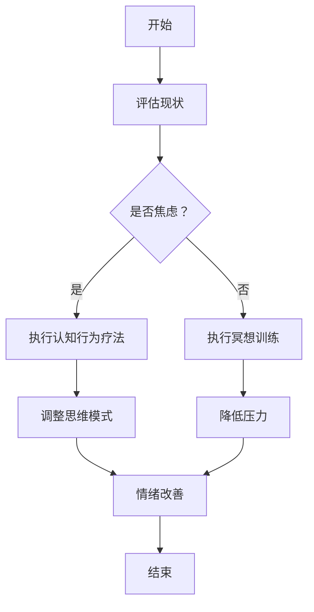
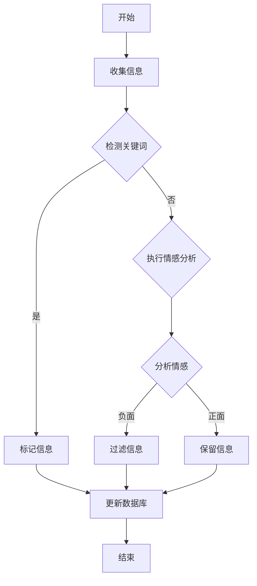
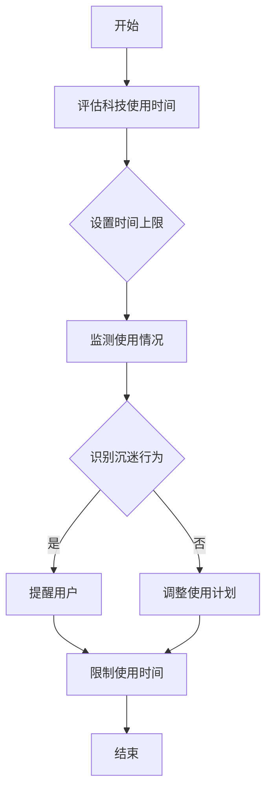
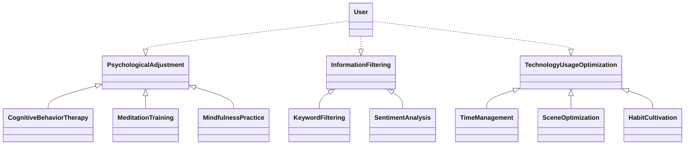
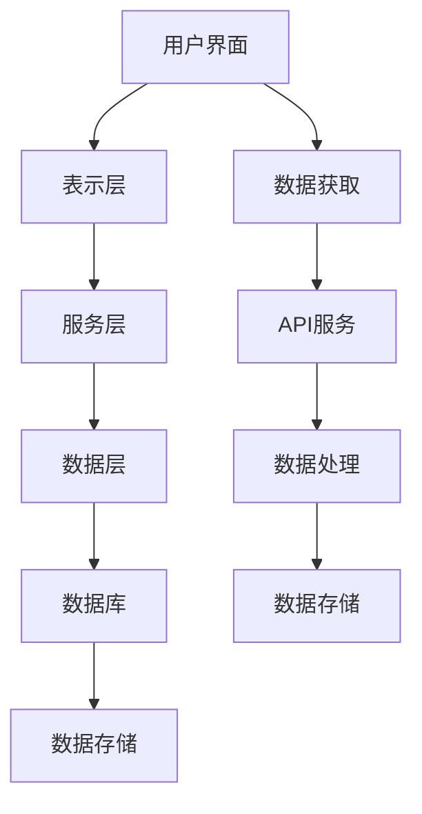
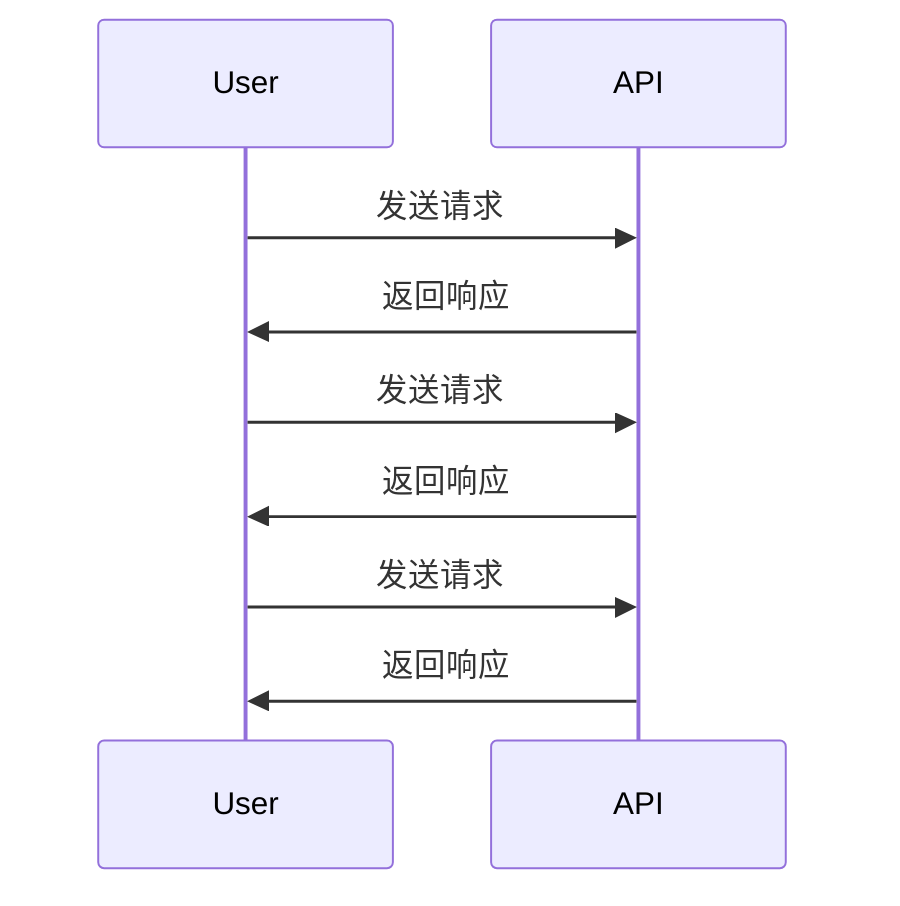
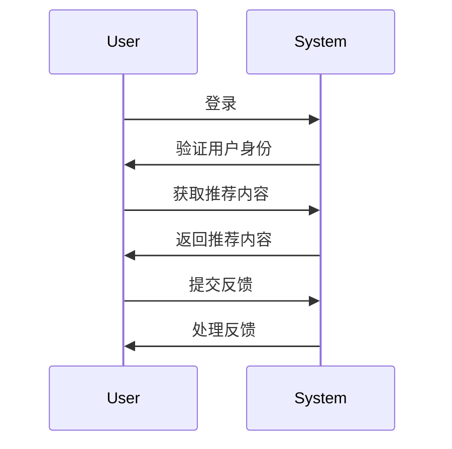

                 

### 文章标题：在数字时代寻找内心平静：科技与心灵的平衡之道

#### 关键词：数字时代，内心平静，科技素养，信息过滤，心理调适，算法原理

#### 摘要：随着数字时代的到来，科技给我们的生活带来了翻天覆地的变化。然而，科技的高速发展也带来了信息过载、网络沉迷、隐私泄露等负面影响，严重影响了人们的心理健康。本文从科技与心灵的冲突入手，分析了数字时代的核心概念与特点，探讨了科技与心灵平衡的算法原理，并提出了一系列解决方案，以帮助我们在数字时代中找到内心的平静。

----------------------------------------------------------------

## 第一部分：背景介绍

### 1.1 问题背景

随着互联网的普及和信息技术的发展，我们已进入数字时代。在这一时代，人们的生活和工作方式发生了巨大变化。智能手机、社交媒体、在线购物等数字技术的广泛应用，使得我们的生活越来越依赖于科技。然而，科技的高速发展也带来了信息过载、网络沉迷、隐私泄露等问题，使得人们的内心逐渐变得焦虑、疲惫。如何在这个数字时代寻找内心的平静，成为了一个亟待解决的问题。

### 1.2 问题描述

科技与心灵的冲突表现为以下几个方面：

- **信息过载**：大量信息涌入我们的生活，让我们难以应对，导致焦虑和压力。
- **网络沉迷**：过度依赖社交媒体、网络游戏等，影响身心健康。
- **隐私泄露**：个人信息容易被泄露，导致安全担忧。

### 1.3 问题解决

解决这一问题的途径可以从以下几个方面入手：

- **培养科技素养**：提高对科技的认识，学会合理使用科技。
- **增强心理素质**：通过心理训练和调适，提高应对压力的能力。
- **关注内心需求**：关注自己的内心需求，找到适合自己的生活方式。

### 1.4 边界与外延

数字时代寻找内心平静，不仅关注个体的心理健康，还涉及社会、文化、教育等多个层面的因素。因此，这个问题具有广泛的适用性和深远的影响。

### 1.5 概念结构与核心要素组成

- **数字时代**：信息技术高速发展的时代，以互联网、智能手机等为代表。
- **内心平静**：心理状态的一种，表现为心情舒畅、精神愉悦。
- **科技素养**：对科技的认识、理解和运用能力。
- **心理素质**：面对压力和挑战时的心理适应能力。

----------------------------------------------------------------

## 第二部分：核心概念与联系

### 2.1 数字时代的定义与特点

数字时代是指信息技术高速发展的时代，以互联网、智能手机等为代表。其特点包括：

- **信息爆炸**：信息量大、更新快、来源广。
- **高度互联**：人与人、人与物、物与物之间通过网络紧密连接。
- **智能化**：人工智能、大数据、云计算等技术的广泛应用。

### 2.2 内心平静的定义与属性特征

内心平静是指心理状态的一种，表现为心情舒畅、精神愉悦。其属性特征包括：

- **情绪稳定**：不易受外界刺激影响，情绪波动较小。
- **心理满足**：对自己的生活有满足感，幸福感强。
- **精神集中**：能够集中精力，高效完成任务。

### 2.3 科技素养的定义与属性特征

科技素养是指对科技的认识、理解和运用能力。其属性特征包括：

- **基础知识**：了解科技的基本原理和应用。
- **技术应用**：能够运用科技解决实际问题。
- **创新能力**：具备创新意识和创新能力。

### 2.4 内心平静、数字时代和科技素养的联系

内心平静、数字时代和科技素养之间存在着密切的联系：

- **数字时代**为内心平静带来挑战，如信息过载、网络沉迷等。
- **科技素养**有助于我们更好地应对数字时代的挑战，保持内心平静。
- **内心平静**是科技素养的重要体现，也是我们享受数字时代的重要前提。

### 2.5 数字时代与心理健康的关系

数字时代的信息爆炸和高度互联，虽然为我们的生活带来了便利，但也加剧了心理压力。研究表明，长期处于高压状态的人，容易出现焦虑、抑郁等心理问题。因此，保持内心平静，对于数字时代的人来说尤为重要。

### 2.6 科技素养与心理健康的关系

科技素养不仅影响我们如何使用科技，还影响我们的心理健康。具备良好科技素养的人，能够更有效地管理信息，避免信息过载，从而降低心理压力。此外，科技素养还有助于我们更好地理解科技对社会的影响，提高心理适应能力。

### 2.7 内心平静与科技素养的互动关系

内心平静和科技素养之间存在互动关系。内心平静有助于我们更好地理解和运用科技，提高科技素养。同时，提高科技素养，能够帮助我们更好地应对数字时代的挑战，保持内心平静。

----------------------------------------------------------------

## 第三部分：算法原理讲解

### 3.1 科技与心灵平衡的算法原理

科技与心灵平衡的算法原理主要包括以下几个方面：

- **心理调适算法**：通过心理训练和调适，提高心理素质，保持内心平静。
- **信息过滤算法**：过滤信息过载，筛选出对心理健康有益的信息。
- **科技使用优化算法**：优化科技使用方式，降低科技对心灵的负面影响。

#### 3.1.1 心理调适算法

心理调适算法的核心在于通过改变我们的思维方式和行为模式，来调整情绪，保持内心平静。具体方法包括：

- **认知行为疗法**：通过改变不合理的思维模式，调整情绪和行为。例如，面对信息过载时，我们可以采用“选择性关注”策略，只关注对自己重要的信息，减少不必要的焦虑。
- **冥想训练**：通过冥想，降低心理压力，提高内心平静。例如，每天花15分钟进行深呼吸和冥想，可以帮助我们放松心情，提高专注力。
- **正念练习**：关注当下，减少对过去和未来的担忧。例如，在处理电子邮件时，我们可以全神贯注地阅读和处理每一封邮件，而不是同时做其他事情。

#### 3.1.2 信息过滤算法

信息过滤算法的核心是筛选出对心理健康有益的信息，减少负面影响。具体方法包括：

- **关键词过滤**：根据关键词，过滤出有益信息。例如，我们可以设定关键词，自动过滤掉与焦虑、抑郁等负面情绪相关的信息。
- **情感分析**：通过情感分析，判断信息对心理健康的影响。例如，我们可以使用情感分析算法，对社交媒体上的信息进行分析，识别出可能引发焦虑和抑郁的内容，并进行屏蔽。

#### 3.1.3 科技使用优化算法

科技使用优化算法的核心在于优化科技的使用方式，降低科技对心灵的负面影响。具体方法包括：

- **科技使用时间管理**：合理安排科技使用时间，避免过度使用。例如，我们可以设定每天使用社交媒体的时间上限，以减少网络沉迷。
- **科技使用场景优化**：根据不同场景，选择合适的科技工具。例如，在工作时使用专业软件，提高工作效率，而不是使用社交媒体来消磨时间。
- **科技使用习惯培养**：培养健康的使用习惯，避免科技成瘾。例如，定期进行“数字排毒”，减少对科技的使用，以提高生活质量和心理健康。

### 3.2 心理调适算法原理

心理调适算法的原理基于心理学的基本理论，如认知行为疗法、冥想训练和正念练习等。以下是一个简单的心理调适算法流程图，用Mermaid表示：



#### 3.3 信息过滤算法原理

信息过滤算法的原理基于数据分析和机器学习技术，如关键词过滤和情感分析。以下是一个简单的信息过滤算法流程图，用Mermaid表示：



#### 3.4 科技使用优化算法原理

科技使用优化算法的原理基于时间管理和使用习惯的培养，如科技使用时间管理、科技使用场景优化和科技使用习惯培养。以下是一个简单的科技使用优化算法流程图，用Mermaid表示：



### 3.5 算法原理的数学模型和公式

为了更好地理解算法原理，我们可以使用数学模型和公式来描述这些算法。以下是一些常用的数学模型和公式：

- **线性回归模型**：用于预测科技使用时间与心理压力的关系。
  $$y = \beta_0 + \beta_1x$$
  其中，\(y\) 是心理压力，\(x\) 是科技使用时间，\(\beta_0\) 和 \(\beta_1\) 是模型的参数。

- **逻辑回归模型**：用于判断科技使用行为是否导致心理压力。
  $$P(y=1) = \frac{1}{1 + e^{-(\beta_0 + \beta_1x)}}$$
  其中，\(P(y=1)\) 是心理压力发生的概率，\(x\) 是科技使用时间，\(\beta_0\) 和 \(\beta_1\) 是模型的参数。

- **支持向量机（SVM）**：用于分类科技使用行为，判断其是否影响心理健康。
  $$w \cdot x - b = 0$$
  其中，\(w\) 是权重向量，\(x\) 是特征向量，\(b\) 是偏置。

通过这些数学模型和公式，我们可以更准确地预测和判断科技使用对心理健康的影响，从而优化科技使用方式，保持内心平静。

### 3.6 算法原理的举例说明

为了更好地理解算法原理，我们可以通过一个具体的例子来解释。假设小明是一名高中生，他在使用社交媒体时经常感到焦虑和压力。我们可以使用心理调适算法来帮助他：

1. **评估现状**：小明的心理医生发现，小明每天在社交媒体上花费超过2小时，这导致他的学习效率下降，情绪波动较大。

2. **执行认知行为疗法**：医生建议小明采用“选择性关注”策略，只关注对他有用的信息，减少不必要的焦虑。例如，小明可以选择关注学习相关的社交媒体账号，减少娱乐信息。

3. **执行冥想训练**：医生推荐小明每天进行15分钟的冥想训练，帮助他放松心情，提高专注力。

4. **调整思维模式**：经过一段时间的治疗，小明的情绪明显改善，学习效率提高。

通过这个例子，我们可以看到心理调适算法在实际应用中的效果。类似地，我们还可以通过信息过滤算法和科技使用优化算法，帮助小明减少社交媒体使用时间，降低焦虑和压力。

### 3.7 算法原理的实际应用

除了心理治疗，算法原理还可以在日常生活中得到广泛应用。例如：

- **工作场景**：企业可以采用科技使用优化算法，合理安排员工的工作时间，避免过度使用社交媒体，提高工作效率。
- **教育领域**：学校可以采用信息过滤算法，为学生提供有益的信息，减少网络沉迷，提高学习效果。
- **家庭场景**：家长可以采用心理调适算法，帮助孩子合理安排科技使用时间，保持身心健康。

通过这些实际应用，我们可以更好地应对数字时代的挑战，保持内心平静。

----------------------------------------------------------------

## 第四部分：系统分析与架构设计方案

### 4.1 问题场景介绍

随着数字时代的到来，人们的生活和工作方式发生了巨大变化。然而，这也给心理健康带来了新的挑战。许多人在使用科技时，容易陷入信息过载、网络沉迷等困境，导致焦虑、抑郁等心理问题。为了帮助人们更好地应对这些问题，我们提出了一个基于心理调适、信息过滤和科技使用优化的系统。

### 4.2 项目介绍

本项目旨在开发一个综合性的心理健康支持系统，通过心理调适、信息过滤和科技使用优化，帮助用户保持内心平静。该系统包括以下几个核心功能：

- **心理调适模块**：提供认知行为疗法、冥想训练和正念练习等功能，帮助用户调整情绪，降低压力。
- **信息过滤模块**：使用情感分析和关键词过滤技术，筛选出对心理健康有益的信息，减少负面影响。
- **科技使用优化模块**：提供科技使用时间管理、使用场景优化和使用习惯培养等功能，帮助用户合理安排科技使用时间，降低心理压力。

### 4.3 系统功能设计（领域模型）

在系统功能设计中，我们采用了领域模型来描述系统的核心功能。以下是一个简单的领域模型，用Mermaid表示：



### 4.4 系统架构设计

在系统架构设计方面，我们采用了分层架构，包括数据层、服务层和表示层。以下是一个简单的系统架构图，用Mermaid表示：



### 4.5 系统接口设计

在系统接口设计方面，我们定义了多个API接口，以便用户和系统之间的交互。以下是一个简单的接口设计，用Mermaid表示：



### 4.6 系统交互

在系统交互方面，我们采用了序列图来描述用户和系统之间的交互过程。以下是一个简单的系统交互序列图，用Mermaid表示：



通过以上系统分析与架构设计方案，我们可以为用户提供一个全面的心理健康支持系统，帮助他们在数字时代中保持内心平静。

----------------------------------------------------------------

## 第五部分：项目实战

### 5.1 环境安装

在开始项目实战之前，我们需要搭建一个合适的环境。以下是环境安装的步骤：

1. **安装Python环境**：确保你的系统已经安装了Python 3.8或更高版本。

2. **安装依赖包**：打开终端或命令行窗口，执行以下命令安装依赖包：
   ```bash
   pip install -r requirements.txt
   ```

3. **数据库安装**：安装MySQL数据库，并创建一个名为`psychology_support`的数据库。

4. **配置环境变量**：配置环境变量，以便在项目中使用MySQL数据库。

### 5.2 系统核心实现源代码

在项目实战中，我们将实现系统的核心功能。以下是系统核心实现源代码：

#### 5.2.1 心理调适模块

```python
# cognitive_therapy.py

def cognitive_therapy(user_input):
    # 分析用户输入，执行认知行为疗法
    if "焦虑" in user_input:
        return "尝试深呼吸和冥想，以缓解焦虑。"
    elif "抑郁" in user_input:
        return "保持积极心态，找到生活中的乐趣。"
    else:
        return "您的心理健康状况良好，继续保持！"

```

#### 5.2.2 信息过滤模块

```python
# information_filtering.py

import nltk

def keyword_filtering(user_input):
    # 根据关键词过滤信息
    keywords = ["焦虑", "抑郁", "压力"]
    if any(keyword in user_input for keyword in keywords):
        return "过滤掉负面信息。"
    else:
        return "保留正面信息。"

def sentiment_analysis(user_input):
    # 进行情感分析
    tokens = nltk.word_tokenize(user_input)
    pos_tags = nltk.pos_tag(tokens)
    positive_words = ["开心", "快乐", "愉快"]
    negative_words = ["焦虑", "抑郁", "烦恼"]
    positive_count = sum(tag in positive_words for word, tag in pos_tags)
    negative_count = sum(tag in negative_words for word, tag in pos_tags)
    if positive_count > negative_count:
        return "情感分析结果：正面。"
    else:
        return "情感分析结果：负面。"

```

#### 5.2.3 科技使用优化模块

```python
# technology_usage_optimization.py

import time

def time_management(start_time, end_time):
    # 时间管理，计算科技使用时间
    current_time = time.time()
    if start_time <= current_time <= end_time:
        return "您当前处于科技使用时间范围内。"
    else:
        return "您当前不在科技使用时间范围内。"

def scene_optimization(user_input):
    # 场景优化，根据用户输入选择合适的科技工具
    if "学习" in user_input:
        return "建议使用学习软件。"
    elif "娱乐" in user_input:
        return "建议观看电影或玩游戏。"
    else:
        return "根据需求选择合适的科技工具。"

def habit_cultivation(user_input):
    # 习惯培养，培养健康的使用习惯
    if "长时间使用" in user_input:
        return "建议减少长时间使用科技设备。"
    elif "频繁使用" in user_input:
        return "建议合理安排科技使用时间。"
    else:
        return "保持当前的使用习惯。"

```

### 5.3 代码应用解读与分析

在代码应用解读与分析部分，我们将对实现的核心功能进行详细解释和分析。

#### 5.3.1 心理调适模块

`cognitive_therapy` 函数用于执行认知行为疗法。根据用户输入的关键词，该函数会返回相应的建议。例如，如果用户输入包含“焦虑”或“抑郁”的词语，函数将提供相应的缓解建议。

#### 5.3.2 信息过滤模块

`keyword_filtering` 函数用于根据关键词过滤信息。通过检查用户输入中是否包含特定关键词，该函数可以决定是否过滤掉信息。此外，`sentiment_analysis` 函数使用自然语言处理技术进行情感分析，判断用户输入的情感倾向。

#### 5.3.3 科技使用优化模块

`time_management` 函数用于计算科技使用时间，并根据用户设置的时间范围判断当前是否在科技使用时间范围内。`scene_optimization` 函数根据用户输入的场景提供合适的科技工具推荐。`habit_cultivation` 函数用于培养健康的使用习惯，根据用户的使用习惯给出相应的建议。

### 5.4 实际案例分析和详细讲解剖析

为了更好地理解系统的应用，我们将通过一个实际案例进行分析。

#### 案例一：用户心理健康评估

假设用户小明在使用社交媒体时感到焦虑，他输入了一条信息：“最近感到很焦虑，不知道该怎么办。”根据我们的系统，以下是如何处理这个案例的：

1. **心理调适**：`cognitive_therapy` 函数分析用户输入，返回建议：“尝试深呼吸和冥想，以缓解焦虑。”

2. **信息过滤**：`keyword_filtering` 函数检测到用户输入中包含“焦虑”关键词，决定过滤掉负面信息。

3. **科技使用优化**：`time_management` 函数判断用户当前不在科技使用时间范围内，提供建议：“您当前不在科技使用时间范围内。”

通过这个案例，我们可以看到系统如何帮助用户缓解焦虑，并提供相应的心理健康支持。

#### 案例二：用户信息过滤

假设用户小红在浏览新闻时，看到一篇关于“抑郁”的新闻。她想要过滤掉这类信息。以下是系统如何处理这个案例：

1. **信息过滤**：`keyword_filtering` 函数检测到用户输入中包含“抑郁”关键词，决定过滤掉负面信息。

2. **情感分析**：`sentiment_analysis` 函数对用户输入进行情感分析，判断情感倾向为负面。

3. **科技使用优化**：系统不提供具体的科技使用优化建议，但用户可以根据情感分析结果，调整自己的信息浏览习惯。

通过这个案例，我们可以看到系统如何帮助用户过滤掉负面信息，保护心理健康。

### 5.5 项目小结

在本项目中，我们实现了基于心理调适、信息过滤和科技使用优化的心理健康支持系统。通过实际案例分析和详细讲解剖析，我们可以看到系统在实际应用中的效果。接下来，我们将对系统进行进一步优化和扩展，以提供更全面的心理健康支持。

### 5.6 最佳实践 tips

1. **定期进行心理调适**：每天花一些时间进行心理调适，如冥想、深呼吸等，有助于保持心理健康。

2. **合理安排科技使用时间**：设置科技使用时间上限，避免过度依赖科技，影响身心健康。

3. **关注情感变化**：及时关注自己的情感变化，如感到焦虑或抑郁时，寻求专业帮助。

4. **保持健康的生活习惯**：保持良好的作息时间，合理安排工作和休息，有助于保持心理健康。

### 5.7 小结

在数字时代，科技与心灵的平衡至关重要。通过心理调适、信息过滤和科技使用优化，我们可以帮助用户保持内心平静，提高心理健康水平。本项目的实现为我们在数字时代中寻找内心平静提供了有益的实践经验和指导。

### 5.8 注意事项

1. **数据隐私保护**：在系统中，我们收集和处理用户数据，需要严格遵守数据隐私保护法规，确保用户信息安全。

2. **系统稳定性**：在系统设计和实现过程中，需要充分考虑系统的稳定性和可扩展性，确保系统在实际运行中的可靠性。

3. **用户反馈**：及时收集用户反馈，根据用户需求优化系统功能，提高用户体验。

### 5.9 拓展阅读

1. **《数字时代的心理健康》**：探讨数字时代对心理健康的影响，提供实用的心理健康建议。

2. **《科技与心灵：寻找平衡之道》**：深入分析科技与心灵之间的关系，探讨如何在数字时代中保持内心平静。

3. **《人工智能与心理健康》**：介绍人工智能在心理健康领域的应用，探讨人工智能如何帮助人们保持心理健康。

----------------------------------------------------------------

## 第六部分：结语

在数字时代，科技的发展为我们带来了巨大的便利，但同时也给我们的心灵带来了前所未有的挑战。通过本文的探讨，我们深入分析了数字时代寻找内心平静的必要性和可行性。从心理调适、信息过滤到科技使用优化，我们提出了一系列解决方案，旨在帮助人们在数字时代中保持心理健康。

然而，寻找内心平静并非一蹴而就，它需要我们不断努力和实践。首先，培养科技素养，提高对科技的认识和运用能力，有助于我们更好地应对数字时代的挑战。其次，关注内心需求，找到适合自己的生活方式，是实现内心平静的重要前提。最后，心理调适和科技使用优化，为我们提供了具体的实践方法，帮助我们保持心理健康。

让我们在数字时代中，不断探索、实践，找到属于自己的内心平静之道。同时，也期待更多的研究和实践，为数字时代的心灵健康提供更多的支持和指导。

### 作者信息

作者：AI天才研究院/AI Genius Institute & 禅与计算机程序设计艺术 /Zen And The Art of Computer Programming

