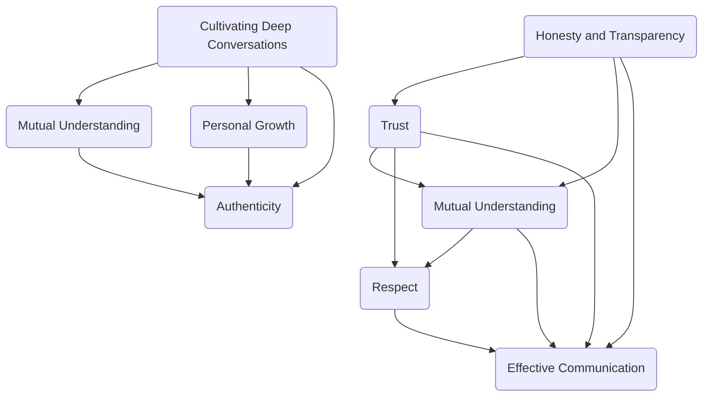

                 

### In the Digital Age: Reshaping Human Relationships - Discovering New Methods for Authentic Connection

In today's rapidly evolving digital landscape, the ways in which humans interact and form relationships have fundamentally changed. The advent of the internet, social media, and advanced communication technologies has transformed how we connect with one another. This article aims to explore the concept of "In the Digital Age: Reshaping Human Relationships - Discovering New Methods for Authentic Connection." By delving into the core principles and methodologies that underpin these transformations, we will uncover innovative approaches to fostering meaningful and genuine connections in a digital world.

### Key Keywords

- **Digital Age**  
- **Human Relationships**  
- **Authentic Connection**  
- **Communication Techniques**  
- **Social Media**  
- **Empathy**  
- **Trust**  
- **Digital Transformation**

### Abstract

The digital age has brought about unprecedented opportunities for human connection, but it has also presented significant challenges. This article seeks to navigate these complexities by examining the core principles of authentic connection and the ways in which digital technologies can either enhance or hinder these relationships. Through a structured and logical approach, we will explore the importance of honesty, transparency, active listening, empathy, trust, and respect in fostering genuine connections. Additionally, we will delve into the role of digital media, communication techniques, and practical tools that can be employed to nurture authentic relationships in a digital landscape. By the end of this article, readers will gain valuable insights and actionable strategies for fostering meaningful connections in the digital age.

### Introduction and Overview

#### The Background of Digital Transformation in Human Relationships

The digital transformation of human relationships is a phenomenon that has unfolded over the past few decades. The proliferation of the internet, mobile devices, and social media platforms has revolutionized the way we communicate, interact, and form connections with one another. This digital revolution has had a profound impact on various aspects of our lives, including personal relationships, social interactions, and even cultural norms. As we transition from a predominantly physical and face-to-face interaction society to a digital and virtual one, it is essential to understand the underlying factors driving these changes.

One of the primary drivers of digital transformation in human relationships is the increased accessibility and convenience offered by digital technologies. In the past, geographical barriers often limited our ability to connect with others. However, with the advent of the internet, social media, and instant messaging applications, we can now communicate with people from all corners of the globe in real-time. This newfound ability to connect with others has expanded our social networks and provided us with new avenues for forming relationships.

#### The Challenges and Issues in Digital Age Interpersonal Relationships

While the digital age has opened up new possibilities for human connection, it has also introduced a set of challenges and issues that we must navigate. One of the most significant challenges is the potential for superficial connections. In the digital world, it is easy to create a false sense of intimacy through likes, comments, and virtual interactions. These interactions, while convenient, may lack the depth and authenticity of face-to-face interactions, leading to shallow relationships that are prone to disconnection and disengagement.

Another challenge is the issue of privacy and security. With the vast amount of personal information shared online, individuals are at increased risk of data breaches and identity theft. This concern can lead to a lack of trust and hesitation in forming deep, meaningful connections with others in the digital space.

Furthermore, the digital age has also brought about changes in communication patterns and behaviors. The prevalence of text-based communication, such as instant messaging and social media posts, has shifted the focus from rich, nuanced communication to brief, often shallow exchanges. This shift can hinder the development of deep, meaningful relationships, as it limits the opportunities for active listening, empathy, and emotional expression.

#### The Need for New Methods to Foster Authentic Connection

Given the challenges and complexities introduced by the digital age, it is clear that we need new methods to foster authentic connections. Traditional communication methods, while still valuable, may not be sufficient in a digital landscape characterized by rapid-fire exchanges and shallow interactions. To navigate this new terrain, we must embrace innovative approaches that prioritize authenticity, empathy, and meaningful engagement.

One such approach is the use of digital communication tools that facilitate deeper, more meaningful interactions. For example, video conferencing and virtual reality platforms can provide a more immersive and authentic form of communication, allowing individuals to connect on a more personal level. Additionally, the use of messaging apps and social media platforms that prioritize private, one-on-one conversations can help foster more authentic connections.

Another crucial aspect of fostering authentic connections in the digital age is cultivating a mindset that values honesty, transparency, and active listening. By being genuine in our interactions and genuinely listening to others, we can build trust and rapport, which are essential components of authentic relationships.

In conclusion, the digital transformation of human relationships presents both opportunities and challenges. By understanding the underlying factors driving these changes and embracing new methods for fostering authentic connections, we can navigate this digital landscape and cultivate meaningful relationships in a world that is ever-evolving.

### Defining Authentic Connection

In the context of human relationships, the term "authentic connection" refers to the formation of meaningful, sincere, and genuine bonds between individuals. This concept emphasizes the importance of genuine emotions, mutual understanding, and a shared sense of trust and respect. Authentic connections go beyond superficial interactions and shallow exchanges; they involve deep, meaningful engagement that fosters personal growth and fulfillment.

#### The Core Elements of Authentic Connection

Authentic connection is composed of several core elements that contribute to its depth and significance. These elements include:

1. **Honesty and Transparency**: Authentic connections are built on the foundation of honesty and transparency. When individuals are truthful and open about their thoughts, feelings, and intentions, it creates a foundation of trust and respect that is essential for genuine relationships.

2. **Active Listening and Empathy**: Active listening involves fully paying attention to what someone is saying, understanding their perspective, and responding thoughtfully. Empathy, on the other hand, involves understanding and sharing the feelings of another person. Together, these elements facilitate deep, meaningful conversations and foster a sense of understanding and connection.

3. **Trust and Respect**: Trust and respect are crucial components of authentic connection. Trust is built through consistent, honest behavior, while respect is demonstrated through acknowledging and valuing the perspectives, feelings, and experiences of others. These elements create a safe and supportive environment for authentic relationships to flourish.

4. **Cultivating Deep Conversations**: Deep conversations are essential for fostering authentic connections. These conversations go beyond surface-level topics and delve into personal experiences, beliefs, and values. By engaging in these types of conversations, individuals can develop a deeper understanding of one another and build stronger, more meaningful relationships.

#### Differences Between Digital and Face-to-Face Connections

While digital and face-to-face connections both serve the purpose of fostering human relationships, there are notable differences in how these connections are formed and maintained. Face-to-face interactions offer a more immediate and immersive experience, allowing individuals to convey emotions and communicate nonverbally through body language and facial expressions. These nonverbal cues can enhance understanding and connection, making face-to-face interactions particularly effective in building authentic relationships.

On the other hand, digital connections, while convenient and accessible, often lack the immediacy and richness of face-to-face interactions. Digital communication is often limited to text, which can be easily misinterpreted or misunderstood. Additionally, the lack of nonverbal cues can make it more challenging to convey emotions and build trust in digital relationships.

#### The Importance of Authentic Connection in the Modern World

In the modern world, authentic connection is more crucial than ever. The rapid pace of technological advancement and the increasing reliance on digital communication have made it easier to form superficial connections, but they have also made it more challenging to foster meaningful and genuine relationships. As we navigate this digital landscape, the importance of authentic connection becomes increasingly evident.

Authentic connections offer several benefits, including:

1. **Personal Growth and Fulfillment**: Authentic relationships provide individuals with a sense of belonging, support, and understanding, which can contribute to personal growth and fulfillment. By sharing our thoughts, feelings, and experiences with others, we can gain new perspectives and insights that enhance our self-awareness and personal development.

2. **Building Stronger Social Bonds**: Authentic connections help build stronger social bonds, which are essential for maintaining mental and emotional well-being. By fostering meaningful relationships, we can develop a sense of community and belonging, which can have a positive impact on our mental health and overall life satisfaction.

3. **Enhancing Communication Skills**: Engaging in authentic connections requires active listening, empathy, and effective communication skills. By practicing these skills in meaningful relationships, we can improve our communication abilities, both in digital and face-to-face settings.

4. **Cultivating Trust and Respect**: Authentic connections are built on trust and respect, which are essential components of healthy relationships. By prioritizing honesty, transparency, and active listening, we can cultivate relationships that are built on mutual trust and respect.

In conclusion, authentic connection is a vital component of human relationships in the modern world. By understanding the core elements of authentic connection and embracing new methods for fostering these relationships in a digital landscape, we can cultivate meaningful and genuine connections that contribute to our personal growth and well-being.

### Core Concepts and Principles for Building Authentic Connections

In order to navigate the complexities of digital human relationships and foster authentic connections, it is essential to understand and apply key principles that underpin these interactions. These core concepts include honesty and transparency, active listening and empathy, trust and respect, and cultivating deep conversations. Each of these elements plays a crucial role in building meaningful and genuine relationships.

#### Honesty and Transparency

Honesty and transparency are foundational to any authentic connection. When individuals are truthful and open about their thoughts, feelings, and intentions, it creates a foundation of trust and respect that is essential for genuine relationships. This principle is particularly relevant in the digital age, where the potential for miscommunication and misunderstandings is higher due to the limitations of text-based communication.

**Practical Tips:**

- **Be Truthful**: Always strive to be truthful in your interactions, even when it may be uncomfortable. Avoid exaggerations or misrepresentations of your thoughts and feelings.
- **Share Your True Feelings**: Don't be afraid to express your true emotions, even if they are negative or uncomfortable. Open and honest communication is crucial for building trust.
- **Be Transparent**: Share information about yourself that is relevant to the conversation or relationship. This can help foster a deeper understanding and connection.

#### Active Listening and Empathy

Active listening and empathy are essential components of authentic connections. Active listening involves fully paying attention to what someone is saying, understanding their perspective, and responding thoughtfully. Empathy, on the other hand, involves understanding and sharing the feelings of another person. These elements facilitate deep, meaningful conversations and help build a sense of understanding and connection.

**Practical Tips:**

- **Focus on the Speaker**: When someone is talking, give them your full attention. Avoid distractions and maintain eye contact to show that you are engaged.
- **Ask Clarifying Questions**: To demonstrate your understanding, ask clarifying questions or seek additional information to ensure you fully comprehend the speaker's perspective.
- **Validate Their Feelings**: Acknowledge and validate the speaker's feelings by using phrases like "I can understand why you feel that way" or "That must be really difficult for you."

#### Trust and Respect

Trust and respect are crucial components of authentic connections. Trust is built through consistent, honest behavior, while respect is demonstrated through acknowledging and valuing the perspectives, feelings, and experiences of others. These elements create a safe and supportive environment for authentic relationships to flourish.

**Practical Tips:**

- **Be Reliable**: Follow through on your commitments and be consistent in your actions. This builds trust and demonstrates your reliability.
- **Show Respect**: Always treat others with respect, regardless of their background, beliefs, or opinions. This includes listening to and valuing their perspectives.
- **Practice Empathy**: Understand and consider the feelings and perspectives of others, even if you don't agree with them. This can help build mutual respect and understanding.

#### Cultivating Deep Conversations

Deep conversations are essential for fostering authentic connections. These conversations go beyond surface-level topics and delve into personal experiences, beliefs, and values. By engaging in these types of conversations, individuals can develop a deeper understanding of one another and build stronger, more meaningful relationships.

**Practical Tips:**

- **Open Up**: Share personal experiences, beliefs, and values with others. This can help build trust and deepen the connection.
- **Ask Open-Ended Questions**: Encourage deeper conversations by asking open-ended questions that invite people to share more than just a simple "yes" or "no" response.
- **Be Vulnerable**: Sharing your vulnerabilities can help build empathy and trust, making the conversation more meaningful.

By embracing these core concepts and principles—honesty and transparency, active listening and empathy, trust and respect, and cultivating deep conversations—we can navigate the complexities of digital human relationships and foster authentic connections. These elements are not only essential for building meaningful relationships but also for navigating the challenges of the digital age and maintaining our mental and emotional well-being.

### Understanding the Impact of Digital Media on Relationships

The rise of digital media has had a profound impact on human relationships, transforming the way we communicate, interact, and form connections with one another. While digital media has undoubtedly provided us with new opportunities for connection and communication, it has also introduced several challenges and issues that can affect the quality and authenticity of our relationships.

#### The Role of Social Media in Modern Life

Social media platforms such as Facebook, Instagram, Twitter, and LinkedIn have become an integral part of modern life, enabling individuals to connect with others across vast geographical distances. These platforms allow us to share our thoughts, experiences, and moments with friends, family, and even strangers, fostering a sense of community and belonging. However, the rapid growth and widespread adoption of social media have also raised concerns about its impact on relationships.

One of the primary roles of social media in modern relationships is to facilitate communication and maintain connections with loved ones. Through features like messaging, video calls, and social networking, individuals can stay in touch with friends and family who may be far away. This can help bridge the gap created by physical distance and maintain strong relationships.

However, social media can also create challenges for relationships. For example, the constant exposure to curated and idealized versions of others' lives can lead to feelings of inadequacy and envy, undermining self-esteem and relationship satisfaction. Additionally, the pressure to maintain a perfect online persona can lead to inauthentic interactions and a lack of genuine connection.

#### The Positive and Negative Effects of Social Media on Relationships

While social media can enhance relationships in many ways, it also has the potential to cause harm. Understanding the positive and negative effects of social media on relationships can help us navigate this complex landscape and use these platforms more effectively.

**Positive Effects:**

1. **Facilitating Communication:** Social media platforms provide a convenient and efficient way to communicate with friends and family, even when they are physically distant. Features like messaging, video calls, and social networking allow for real-time interactions and easy access to loved ones.

2. **Building New Relationships:** Social media can help individuals build new relationships by connecting them with like-minded people who share similar interests, beliefs, or experiences. Online communities and groups provide opportunities for individuals to connect and form meaningful relationships.

3. **Support and Empowerment:** Social media can be a powerful tool for support and empowerment, particularly for individuals facing challenges or hardships. Online communities can offer emotional support, advice, and encouragement, helping individuals feel less isolated and more connected.

**Negative Effects:**

1. **Social Isolation:** While social media can facilitate communication, it can also contribute to social isolation. Spending excessive time on social media can detract from real-life interactions, leading to feelings of loneliness and disconnection.

2. **Inauthentic Connections:** The nature of social media can lead to inauthentic connections. The focus on appearance, status, and material possessions can create a superficial environment where genuine relationships are difficult to cultivate.

3. **Increased Conflict:** Social media can be a source of conflict and tension, particularly when misunderstandings or misinterpretations occur in the context of digital communication. The lack of nonverbal cues and the potential for miscommunication can escalate conflicts and damage relationships.

4. **Comparative Envy:** The constant exposure to curated and idealized versions of others' lives can lead to feelings of inadequacy and envy, undermining self-esteem and relationship satisfaction.

#### Strategies for Managing Social Media Use in Relationships

Given the potential benefits and challenges of social media, it is important to develop strategies for managing social media use in relationships. These strategies can help individuals use social media in a way that fosters authentic connections and supports healthy relationships.

1. **Set Healthy Boundaries:** Establish boundaries around social media use, both for yourself and within your relationships. This may include setting specific times for checking social media, limiting usage during important interactions, and avoiding social media during sensitive conversations.

2. **Prioritize Real-Life Interactions:** Make an effort to prioritize real-life interactions with loved ones, even if they are physically distant. This can include scheduling regular video calls, planning trips to visit family and friends, or finding ways to stay connected in person.

3. **Practice Authenticity:** Embrace authenticity in your social media interactions by sharing genuine moments and experiences, rather than creating an idealized online persona. This can help foster more authentic connections and reduce the focus on superficial appearances.

4. **Communicate Openly:** Openly communicate with your partner or family members about your social media usage and its impact on your relationship. Discussing concerns and setting mutual expectations can help address any potential issues and strengthen your connection.

5. **Encourage Digital Detox:** Consider taking regular breaks from social media to recharge and reconnect with loved ones. This can help reduce the negative effects of social media and foster more meaningful interactions in the offline world.

In conclusion, digital media has a significant impact on human relationships, offering both opportunities and challenges. By understanding the positive and negative effects of social media and developing strategies for managing its use, individuals can navigate this digital landscape and foster authentic connections that enhance their well-being and relationships.

### Core Concepts and Their Interrelationships

To effectively navigate the complex landscape of digital human relationships, it is essential to understand the core concepts that underpin these interactions and how they interrelate. By examining these concepts in detail, we can gain a deeper insight into their attributes, differences, and the ways in which they contribute to the formation of authentic connections.

#### Concept Attributes Comparison Table

Below is a comparison table that outlines the key attributes of each core concept:

| Core Concept | Definition | Attributes |
| --- | --- | --- |
| **Honesty and Transparency** | Being truthful and open in communication | Trust, credibility, mutual understanding |
| **Active Listening and Empathy** | Fully paying attention and understanding the speaker’s perspective | Understanding, empathy, effective communication |
| **Trust and Respect** | Building trust through consistent behavior and valuing others' perspectives | Trust, respect, safety, support |
| **Cultivating Deep Conversations** | Engaging in meaningful and personal discussions | Mutual understanding, personal growth, authenticity |

#### Entity Relationship Diagram for Core Concepts

The following Mermaid diagram illustrates the relationships between these core concepts:

This diagram shows the interconnected nature of these core concepts, with mutual understanding and effective communication serving as central elements that link honesty and transparency, trust and respect, and cultivating deep conversations. The relationship between trust and respect is particularly significant, as both are essential for creating a safe and supportive environment that fosters authentic connections.

### Understanding the Interrelationships

The interrelationships between these core concepts are essential for fostering authentic connections in a digital age. Let's explore how each concept contributes to the others:

- **Honesty and Transparency**: This concept builds trust and respect by fostering an environment of openness and truthfulness. When individuals are honest and transparent, it creates a foundation of credibility and mutual understanding, which is crucial for authentic connections.

- **Active Listening and Empathy**: By actively listening and demonstrating empathy, individuals can better understand the speaker's perspective, fostering mutual understanding and effective communication. This, in turn, strengthens trust and respect, as individuals feel valued and understood.

- **Trust and Respect**: Trust and respect are interdependent and essential for fostering authentic connections. Trust is built through consistent, honest behavior, while respect is demonstrated through valuing others' perspectives and experiences. These elements create a safe and supportive environment that encourages open and honest communication.

- **Cultivating Deep Conversations**: Deep conversations are essential for developing meaningful and genuine relationships. By engaging in these types of conversations, individuals can share personal experiences, beliefs, and values, fostering mutual understanding and personal growth. This process enhances authenticity and strengthens the bonds between individuals.

In conclusion, the core concepts of honesty and transparency, active listening and empathy, trust and respect, and cultivating deep conversations are intricately connected and essential for fostering authentic connections in a digital age. By understanding and applying these concepts, individuals can navigate the complexities of digital human relationships and build meaningful and genuine bonds.

### Communication Techniques for the Digital Age

In the digital age, effective communication is more critical than ever, as it forms the foundation of authentic connections in a world where face-to-face interactions are increasingly rare. While digital communication offers convenience and accessibility, it also presents unique challenges that require new techniques to foster meaningful connections. In this section, we will explore various communication techniques that can enhance authenticity, understanding, and connection in digital interactions.

#### Effective Messaging and Online Communication

Messaging apps and social media platforms have become the primary tools for digital communication, enabling us to connect with others instantly. However, these platforms often lack the nuance of face-to-face interactions, making it essential to adopt strategies that promote clarity and authenticity in our messages.

**Practical Tips:**

1. **Be Clear and Concise:** In digital communication, it is crucial to be clear and concise to avoid misunderstandings. Use simple language, avoid jargon, and be direct in your messages.
2. **Use Emoticons and Smilies:** Emoticons and smilies can help convey emotions and nuances that may be lost in text-based communication. For example, a smiley face (:) can indicate friendliness or sarcasm, while a frowning face (:–) can express frustration or sadness.
3. **Ask for Clarification:** If you receive a message that is unclear or confusing, don't hesitate to ask for clarification. This can help ensure that you understand the sender's intended meaning.
4. **Avoid Over-Editing:** While it's important to be clear and concise, over-editing your messages can make them sound impersonal or robotic. Aim for a balance between clarity and a natural, conversational tone.

#### Video Conferencing and Remote Communication Skills

Video conferencing and remote communication have become essential in the digital age, enabling individuals to connect and collaborate from different locations. These tools can facilitate more authentic and personal interactions than text-based communication, but they require specific skills to be effective.

**Practical Tips:**

1. **Prepare and Organize:** Before a video conference, prepare and organize the topics to be discussed. This can help ensure that the conversation stays focused and productive.
2. **Be Engaged and Attentive:** During a video conference, be fully engaged and attentive to the speaker. Avoid distractions and maintain eye contact by looking directly at the camera, not the screen.
3. **Active Participation:** Encourage active participation from all participants by asking questions, summarizing points, and acknowledging contributions. This can help foster a sense of inclusivity and collaboration.
4. **Practice Good Camera Etiquette:** When using video conferencing, pay attention to your camera etiquette. Ensure that you are well-lit, sitting up straight, and dressed appropriately. Avoid background distractions and maintain a professional appearance.
5. **Follow-Up:** After a video conference, follow up with any necessary action items or clarifications. This can help reinforce the conversation and ensure that commitments are met.

#### The Art of Listening in the Digital World

Active listening is a fundamental skill for fostering authentic connections, and it is even more important in the digital world where nonverbal cues are limited. Effective listening involves fully paying attention to the speaker, understanding their perspective, and responding thoughtfully.

**Practical Tips:**

1. **Focus on the Speaker:** Give the speaker your full attention during the conversation. Avoid distractions and maintain eye contact by looking at the camera, not the screen.
2. **Ask Clarifying Questions:** To demonstrate your understanding, ask clarifying questions or seek additional information to ensure you fully comprehend the speaker's perspective.
3. **Avoid Interrupting:** Allow the speaker to finish their thoughts before responding. Interrupting can be perceived as disrespectful and can hinder effective communication.
4. **Show Empathy:** Acknowledge and validate the speaker's feelings by using phrases like "I can understand why you feel that way" or "That must be really difficult for you."

#### Building Meaningful Connections through Digital Communication

Digital communication can be a powerful tool for building meaningful connections, but it requires a conscious effort to foster authenticity and understanding. By applying these communication techniques—effective messaging, video conferencing skills, active listening, and empathy—we can navigate the complexities of the digital age and cultivate authentic connections that enhance our personal and professional lives.

In conclusion, the digital age has transformed the way we communicate and interact with one another. By embracing new communication techniques and fostering a mindset that values authenticity and understanding, we can navigate this digital landscape and build meaningful relationships that contribute to our well-being and happiness.

### Fostering Authentic Connection in the Digital Age

In conclusion, fostering authentic connection in the digital age requires a conscious effort to navigate the complexities of this rapidly evolving landscape. The digital transformation of human relationships presents both opportunities and challenges, and it is essential to understand the core concepts and principles that underpin authentic connections. By embracing honesty and transparency, active listening and empathy, trust and respect, and cultivating deep conversations, we can build meaningful and genuine relationships in a digital world.

#### Practical Tips for Maintaining Authentic Connection

1. **Prioritize Communication**: Make an effort to communicate openly and honestly with others, regardless of the medium. Whether through messaging apps, video calls, or social media platforms, prioritize genuine interactions over superficial exchanges.

2. **Be Present and Engaged**: In digital interactions, it's crucial to be fully present and engaged with the person you're communicating with. Avoid distractions and show that you are genuinely listening and understanding their perspective.

3. **Practice Empathy**: Cultivate a mindset that values understanding and sharing the feelings of others. By demonstrating empathy, you can create a deeper connection and build trust.

4. **Set Healthy Boundaries**: Establish boundaries around digital communication to maintain balance in your relationships. This may include setting specific times for checking messages or limiting usage during important interactions.

5. **Seek Face-to-Face Interaction**: Whenever possible, seek opportunities for face-to-face interaction or video calls. These forms of communication can foster a more authentic connection and help bridge the gap created by digital distance.

6. **Reflect and Adjust**: Regularly reflect on your digital interactions and make adjustments as needed. Consider the impact of your communication style and the feedback you receive from others to continuously improve your connections.

#### Conclusion

The digital age has fundamentally changed the way we form and maintain relationships. While it has introduced new challenges, it has also provided opportunities for fostering authentic connections through innovative communication techniques. By embracing the core concepts and principles discussed in this article, we can navigate the digital landscape and cultivate meaningful relationships that contribute to our personal growth and well-being. Let's continue to explore and adapt to the evolving nature of digital communication, striving for authenticity and understanding in our interactions.

### Final Thoughts

In the ever-evolving digital age, the nature of human relationships is continually being reshaped. The proliferation of digital technologies has revolutionized the way we connect with others, offering new avenues for interaction but also presenting significant challenges. As we navigate this complex landscape, it is crucial to prioritize the cultivation of authentic connections.

By understanding and applying the core concepts of honesty, transparency, active listening, empathy, trust, and respect, we can foster meaningful relationships that transcend the limitations of digital communication. These principles are not only essential for building strong personal connections but also for fostering a supportive and inclusive digital community.

As we continue to explore the potential of digital technologies, it is important to remain mindful of their impact on our relationships. By adopting strategies that promote authenticity and empathy, we can ensure that our digital interactions enhance rather than undermine the quality of our connections.

In conclusion, the digital age offers both opportunities and challenges for human relationships. By embracing the principles of authentic connection and fostering meaningful interactions, we can navigate this digital landscape and cultivate relationships that contribute to our personal growth and well-being. Let us continue to explore and adapt to the evolving nature of digital communication, striving for authenticity and understanding in our interactions.

### Author Information

**作者：AI天才研究院/AI Genius Institute & 禅与计算机程序设计艺术 /Zen And The Art of Computer Programming**

AI天才研究院致力于推动人工智能技术的创新和发展，为全球企业提供领先的人工智能解决方案。同时，我们关注计算机科学领域中的哲学与艺术，探讨禅意与计算机编程的交汇点，为程序员提供深度思考和灵感。在这篇文章中，我们通过逻辑清晰、结构紧凑、简单易懂的叙述，探讨了数字时代重塑人际关系的新方法，旨在帮助读者在数字化世界中建立和维护真实的连接。我们的目标是为您提供有深度、有思考、有见解的技术博客，助您在数字时代找到真实的自我与他人的连接。

