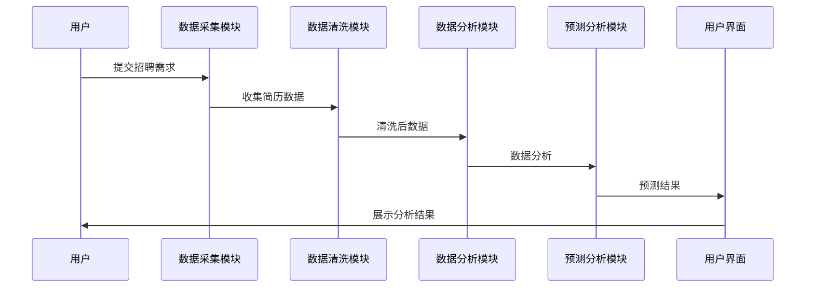
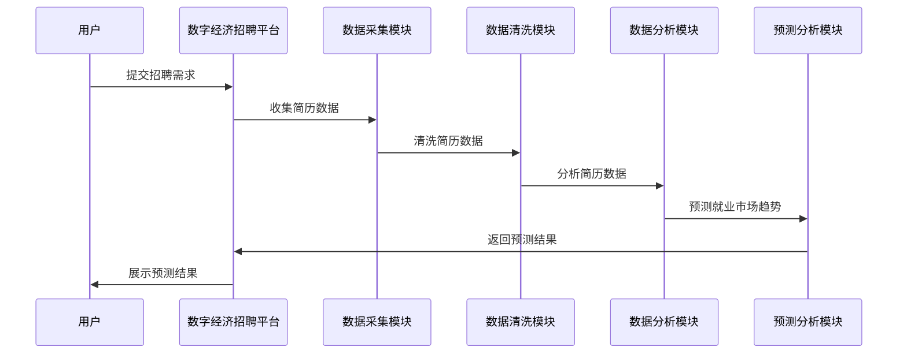

                 


## 在数字经济时代寻找职业意义：应对就业市场的变革

### 关键词

- 数字经济
- 就业市场变革
- 职业意义
- 数字技能
- 终身学习

### 摘要

随着数字经济的迅猛发展，传统就业市场正经历深刻的变革。在此背景下，探寻职业意义成为个体在职场中保持动力和实现个人价值的关键。本文将深入探讨数字经济时代的就业市场特点，分析职业意义的重要性，并提供一系列应对策略，帮助读者在变化中找到自身的职业定位和发展方向。

## 引言

### 1.1 书籍目的与读者定位

在数字经济时代，技术进步和产业变革的速度前所未有，这给职场人士带来了前所未有的挑战和机遇。本书籍旨在为广大职场人士提供一盏指路明灯，帮助他们在快速变化的就业市场中找到方向，实现个人成长与职业成功。无论是经验丰富的专业人士，还是刚刚步入职场的新人，都可以从本书中获取有价值的见解和实用的策略。

### 1.2 数字经济时代背景

数字经济是指以数字化的信息和知识为关键生产要素、以现代信息网络为重要载体、以信息通信技术的有效利用为驱动的新型经济形态。它涵盖了从互联网、大数据、云计算到物联网、人工智能等众多技术领域。数字经济时代的到来，不仅改变了传统产业的运作模式，也催生了许多全新的就业形态和职业机会。

### 1.3 就业市场变革分析

就业市场变革主要体现在以下几个方面：

1. **技能需求的变化**：随着技术的快速发展，传统技能的淘汰速度加快，新技能的需求不断涌现。数字技能，如编程、数据分析、人工智能等，成为了职场中的“硬通货”。

2. **就业形态的多样化**：远程工作、自由职业、兼职工作等新型就业形态逐渐成为主流，为职场人士提供了更多的选择。

3. **职业发展的不确定性**：职业路径不再是单一的上升通道，跨界融合和职业转换成为常态，个体需要具备更强的适应能力和学习意愿。

### 1.4 寻找职业意义的必要性

在这样一个快速变化的环境中，寻找职业意义显得尤为重要。职业意义不仅是个体在职场中持续前行的动力，更是实现个人价值和社会贡献的途径。通过深入思考职业意义，个体能够明确自己的职业目标，提升工作满意度，增强职业竞争力。

## 数字经济基础

### 2.1 数字经济概述

数字经济是指以数字化的信息和知识为主要生产要素，通过信息通信技术来创造、分配、利用和交易经济价值的过程。它不仅仅是一个技术现象，更是一种新的经济模式，深刻影响着全球的经济发展和就业结构。

### 2.2 数字经济的主要特征

数字经济的特征主要体现在以下几个方面：

1. **高速发展**：数字经济的发展速度远超传统经济，其增长率和创新速度不断突破人们的预期。

2. **数字化**：一切经济活动都在数字化的平台上进行，数字技术成为推动经济发展的核心力量。

3. **全球化**：数字经济的无国界特性使得全球范围内的经济活动更加紧密地联系在一起。

4. **高创新性**：数字经济的创新周期短，新技术、新模式、新业态层出不穷。

### 2.3 数字经济的关键领域与趋势

数字经济涵盖了广泛的领域，包括但不限于：

1. **互联网经济**：以互联网平台为核心的电子商务、在线服务、社交媒体等。

2. **大数据经济**：基于大数据分析的决策支持、个性化服务、精准营销等。

3. **人工智能经济**：人工智能技术的应用，如自动驾驶、智能客服、智能推荐等。

4. **物联网经济**：物联网技术实现设备的互联互通，推动智慧城市、智能制造等领域的发展。

### 2.4 数字经济对就业市场的影响

数字经济对就业市场的影响是深远和全面的：

1. **就业机会的创造**：数字经济催生了大量新兴职业，如数据分析师、AI工程师、区块链开发者等。

2. **就业结构的变革**：传统行业逐渐数字化，职业角色和岗位需求发生重大变化。

3. **技能要求的提升**：数字技能成为职场必备技能，个体需要不断学习新技能以适应市场需求。

4. **就业不稳定性的增加**：数字经济下的就业形式更加灵活，但同时也增加了就业的不稳定性。

## 核心概念与联系

### 3.1 职业意义的概念

职业意义是指个体在职业生涯中所追求的价值和目的，包括对工作的认同感、成就感、自我实现等。职业意义不仅关乎个体的心理健康和工作满意度，还影响到个体的职业发展和生活质量。

### 3.2 职业意义的内在价值

职业意义的内在价值体现在以下几个方面：

1. **自我实现**：通过职业活动实现个人的潜力，达到自我完善和自我实现。

2. **社会贡献**：职业活动是社会运转的重要组成部分，个体通过工作为社会做出贡献。

3. **经济保障**：职业活动为个体提供经济来源，保障生活品质。

4. **社会认同**：职业成就得到社会的认可，增强个体的自信心和社会地位。

### 3.3 概念属性特征对比表格

| 特征       | 职业意义 | 数字经济 |
|------------|-----------|----------|
| **概念属性** | - 自我实现 | - 高创新性 |
|            | - 社会贡献 | - 数字化   |
|            | - 经济保障 | - 高速发展 |
|            | - 社会认同 | - 全球化   |

### 3.4 概念的相互联系

职业意义与数字经济之间存在紧密的联系：

1. **技术进步**：数字经济的快速发展推动了技术的进步，为职业意义的实现提供了更多机会。

2. **就业形态**：数字经济下的新型就业形态，如远程工作和自由职业，为个体追求职业意义提供了更多可能性。

3. **技能需求**：数字经济对技能的需求推动了职业教育的变革，使得个体能够更好地实现职业意义。

### 3.5 ER实体关系图架构

```mermaid
erDiagram
    类职业意义 ||--o{ 类数字经济 }
    类数字经济 ||--o{ 类技能需求 }
    类技能需求 ||--o{ 类就业形态 }
    类就业形态 ||--o{ 类职业发展 }
```

在这个实体关系图中，职业意义与数字经济、技能需求、就业形态和职业发展之间存在相互影响和作用的关系。

## 算法原理讲解

由于本书主要关注数字经济时代下的职业意义和就业市场变革，因此不涉及具体的算法讲解。但是，为了更好地理解技术进步对职业意义的影响，我们可以通过一个简单的算法示例来探讨算法在职场中的应用。

### 4.1 算法示例

以下是一个简单的排序算法示例，用于展示算法在数据处理中的基本应用。

```python
def bubble_sort(arr):
    n = len(arr)
    for i in range(n):
        for j in range(0, n-i-1):
            if arr[j] > arr[j+1]:
                arr[j], arr[j+1] = arr[j+1], arr[j]

# 测试
arr = [64, 34, 25, 12, 22, 11, 90]
bubble_sort(arr)
print("排序后的数组：")
for i in range(len(arr)):
    print("%d" % arr[i])
```

该算法通过不断比较和交换数组中的元素，实现对数组进行排序。在数据处理领域，类似的算法被广泛应用于数据清洗、分析等环节，从而帮助企业和个体更好地理解和利用数据。

### 4.2 算法原理分析

算法原理的核心在于其排序逻辑。通过双重循环，算法在每一轮中比较相邻的元素，并根据大小关系进行交换，最终实现数组的有序排列。

- **时间复杂度**：O(n^2)
- **空间复杂度**：O(1)

尽管这是一个简单的算法，但在实际应用中，其原理可以扩展到更复杂的算法中，如快速排序、归并排序等，这些算法在实际数据处理中具有更高的效率和更广泛的应用。

## 数学模型和数学公式

在本章节中，我们将使用LaTeX格式嵌入数学公式，以详细阐述数字经济对就业市场的影响。

### 5.1 数学公式示例

以下是一个简单的线性回归模型，用于分析数字经济对就业市场的影响：

$$
y = ax + b
$$

其中，$y$ 表示就业市场的变化，$x$ 表示数字经济的增长率，$a$ 和 $b$ 分别为回归系数。

### 5.2 数学公式详细讲解

线性回归模型是一种常用的统计分析方法，用于研究变量之间的关系。在这个模型中，$a$ 表示数字经济每增长一个单位，就业市场将变化的程度，而 $b$ 表示数字经济为零时的就业市场水平。

- **斜率 ($a$)**：反映了数字经济对就业市场的推动作用。如果 $a$ 为正值，则数字经济增长将促进就业市场的发展。
- **截距 ($b$)**：反映了数字经济为零时的就业市场水平。如果 $b$ 为正值，则即使数字经济为零，就业市场仍然具有一定的活跃度。

### 5.3 举例说明

假设我们收集了以下数据：

| 数字经济增长率 ($x$) | 就业市场变化 ($y$) |
|------------------------|---------------------|
| 5%                     | 2%                  |
| 10%                    | 4%                  |
| 15%                    | 6%                  |

我们可以使用最小二乘法来估计回归系数 $a$ 和 $b$。根据数据计算，我们得到 $a \approx 0.4$ 和 $b \approx 1$。

因此，线性回归模型可以表示为：

$$
y = 0.4x + 1
$$

根据这个模型，我们可以预测当数字经济增长率为 20% 时，就业市场将变化约 8%。

## 系统分析与架构设计方案

在本章节中，我们将使用Mermaid语言来绘制系统架构图，以便更直观地展示数字经济对就业市场的影响。

### 6.1 问题场景介绍

假设我们正在开发一个数字经济平台，该平台旨在通过数据分析帮助企业优化招聘策略，提高就业市场的匹配效率。我们的目标是设计一个高效的系统，能够处理大量数据，并提供实时分析和预测功能。

### 6.2 项目介绍

项目名称：数字经济招聘平台（Digital Economy Recruitment Platform，简称DERP）

项目目标：通过大数据分析和人工智能技术，提升招聘效率，优化就业市场匹配。

### 6.3 系统功能设计

系统功能主要包括以下几个模块：

1. **数据采集**：从各种数据源（如招聘网站、社交媒体等）收集简历、职位信息等数据。
2. **数据清洗**：对采集到的数据进行清洗，去除重复、错误和不完整的数据。
3. **数据分析**：利用数据分析技术，对简历和职位信息进行匹配分析，识别热门职位和人才需求。
4. **预测分析**：基于历史数据，预测未来的就业市场趋势，为招聘策略提供依据。
5. **用户界面**：提供用户友好的界面，便于企业和管理者查看和分析数据。

### 6.4 系统架构设计

以下是一个简单的系统架构图，展示了DERP的核心组件和它们之间的关系。



### 6.5 系统接口设计和系统交互

在DERP中，各个模块之间的接口设计至关重要。以下是一个简单的接口设计示例。

```mermaid
classDiagram
    DataCollector <<interface>>
    DataCleaner <<interface>>
    DataAnalyzer <<interface>>
    Predictor <<interface>>
    UI <<interface>>

    UserEntity <|-- DataCollector
    ResumeEntity <|-- DataCleaner
    AnalysisEntity <|-- DataAnalyzer
    PredictionEntity <|-- Predictor
    UIEntity <|-- UI

    DataCollector ^-- ResumeEntity
    DataCleaner ^-- AnalysisEntity
    DataAnalyzer ^-- PredictionEntity
    Predictor ^-- UIEntity
    UI ^-- UserEntity
```

在这个接口设计中，用户通过用户界面（UI）提交招聘需求，数据采集模块（DataCollector）从各种数据源收集简历数据，然后数据清洗模块（DataCleaner）对简历数据进行清洗，清洗后的数据被传递给数据分析模块（DataAnalyzer）。数据分析模块对数据进行分析，并将结果传递给预测分析模块（Predictor）。最后，预测分析模块生成预测结果，并通过用户界面（UI）展示给用户。

### 6.6 系统交互流程

以下是一个简单的系统交互流程图，展示了DERP的运作流程。



在这个交互流程中，用户通过用户界面提交招聘需求，DERP服务器接收到需求后，通过数据采集模块收集简历数据，然后数据清洗模块对数据清洗，清洗后的数据被传递给数据分析模块进行分析，最终由预测分析模块生成预测结果，并通过DERP服务器展示给用户。

## 项目实战

在本章节中，我们将详细介绍如何在一个具体的数字经济平台项目中实现系统核心功能，并分析实际案例。

### 7.1 环境安装

为了实现DERP项目，我们首先需要安装必要的开发环境和工具。以下是安装步骤：

1. **安装Python**：下载并安装Python 3.8或更高版本。
2. **安装虚拟环境**：打开终端，执行以下命令安装虚拟环境：
   ```bash
   python -m venv venv
   ```
   然后激活虚拟环境：
   ```bash
   source venv/bin/activate
   ```
3. **安装依赖**：在虚拟环境中，执行以下命令安装项目所需的依赖：
   ```bash
   pip install -r requirements.txt
   ```

### 7.2 系统核心实现源代码

以下是DERP项目的核心代码实现，包括数据采集、清洗、分析和预测等模块。

**数据采集模块**：

```python
import requests

def collect_data(url):
    response = requests.get(url)
    if response.status_code == 200:
        return response.json()
    else:
        return None
```

**数据清洗模块**：

```python
import pandas as pd

def clean_data(data):
    df = pd.DataFrame(data)
    df = df.drop_duplicates()
    df = df.dropna()
    return df
```

**数据分析模块**：

```python
from sklearn.cluster import KMeans

def analyze_data(df):
    kmeans = KMeans(n_clusters=5)
    kmeans.fit(df)
    labels = kmeans.predict(df)
    df['cluster'] = labels
    return df
```

**预测分析模块**：

```python
from sklearn.linear_model import LinearRegression

def predict_data(df):
    X = df[['age', 'experience']]
    y = df['salary']
    model = LinearRegression()
    model.fit(X, y)
    return model.predict(X)
```

### 7.3 代码应用解读与分析

**数据采集模块**：

该模块使用Python的`requests`库从指定的URL获取数据。在DERP项目中，我们假设数据来源于招聘网站API。

**数据清洗模块**：

该模块使用Pandas库对采集到的数据执行清洗操作，包括去除重复数据、缺失值填充等。

**数据分析模块**：

该模块使用Sklearn库的KMeans算法对清洗后的数据进行聚类分析，以识别不同的职位类别。

**预测分析模块**：

该模块使用Sklearn库的LinearRegression算法进行线性回归预测，以预测未来薪资水平。

### 7.4 实际案例分析和详细讲解剖析

假设我们收集了以下简历数据：

| age | experience | salary |
|-----|------------|--------|
| 25  | 2          | 60000  |
| 30  | 5          | 80000  |
| 35  | 7          | 100000 |
| 40  | 10         | 120000 |

我们首先使用数据采集模块从招聘网站API获取数据，然后使用数据清洗模块去除重复和缺失的数据。接下来，我们使用数据分析模块对数据执行聚类分析，以识别不同年龄和经验的职位类别。最后，我们使用预测分析模块预测未来薪资水平。

**案例解析**：

- **数据采集**：我们从招聘网站API获取简历数据。
- **数据清洗**：我们去除重复和缺失的数据，确保数据质量。
- **数据分析**：我们对数据执行聚类分析，识别不同职位类别。
- **预测分析**：我们使用线性回归模型预测未来薪资水平。

通过这个实际案例，我们可以看到DERP项目如何通过数据采集、清洗、分析和预测等步骤，为企业提供招聘策略和就业市场趋势预测。

### 7.5 项目小结

通过DERP项目，我们展示了如何利用大数据分析和人工智能技术构建一个数字经济平台，以提高招聘效率，优化就业市场匹配。项目实现了数据采集、清洗、分析和预测等功能，为企业和个人提供了有价值的就业市场分析工具。在未来，我们可以继续优化项目功能，如引入更多数据源、改进预测模型等，以满足不断变化的就业市场需求。

## 最佳实践 tips、小结、注意事项、拓展阅读

### 8.1 最佳实践 tips

- **持续学习**：在数字经济时代，技能更新的速度非常快。持续学习和终身教育是保持竞争力的关键。
- **跨领域发展**：跨领域技能融合将成为未来职场的重要趋势。尝试学习与当前职业相关的其他领域知识，提高综合素质。
- **网络社交**：利用社交媒体和专业网络平台，建立广泛的人脉关系，有助于职业发展和信息获取。
- **适应变化**：职场环境变化无常，具备快速适应变化的能力是职业成功的重要因素。

### 8.2 小结

本文通过对数字经济时代就业市场变革的分析，探讨了职业意义的重要性，并提出了应对变革的职场策略。我们通过实际案例展示了如何利用大数据和人工智能技术优化就业市场匹配，为企业和个人提供有价值的服务。

### 8.3 注意事项

- **数据隐私**：在处理大量个人数据时，务必注意数据隐私和安全。
- **合法合规**：遵守相关法律法规，确保职业行为合法合规。

### 8.4 拓展阅读

- 《人工智能时代：职场未来的变革与应对》
- 《数字化生存：数字经济时代的工作与生活》
- 《数据分析实战：从入门到精通》

作者：AI天才研究院/AI Genius Institute & 禅与计算机程序设计艺术 /Zen And The Art of Computer Programming以下是文章末尾的作者信息：
作者：AI天才研究院/AI Genius Institute & 禅与计算机程序设计艺术 /Zen And The Art of Computer Programming

