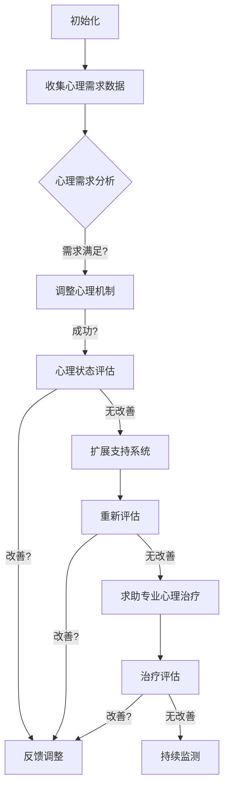
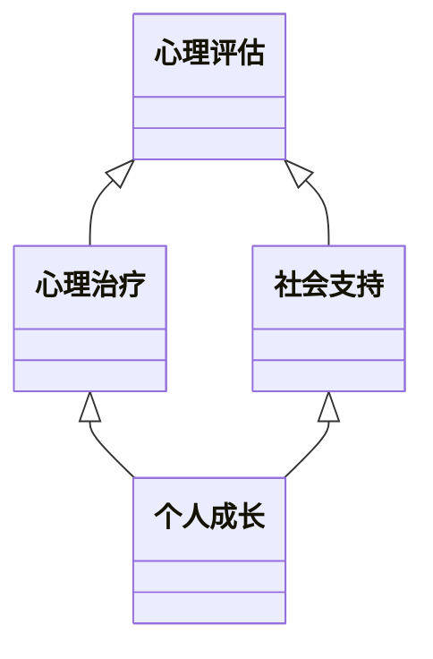
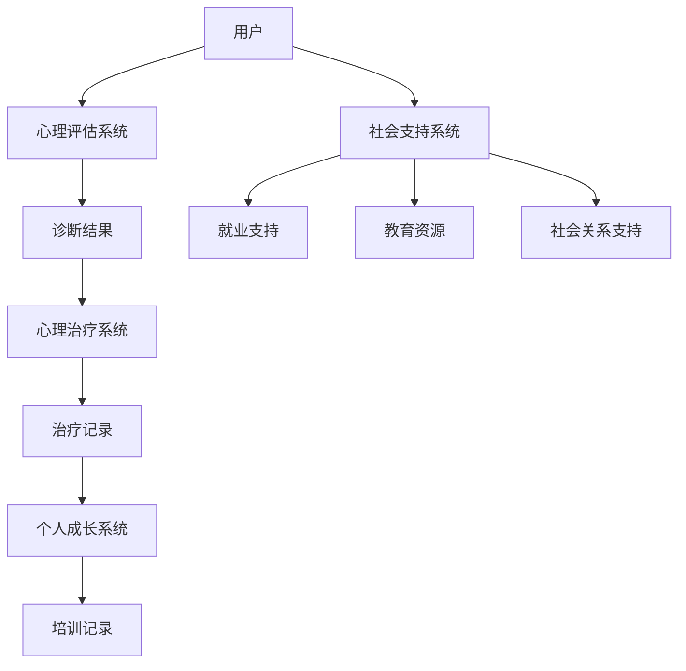
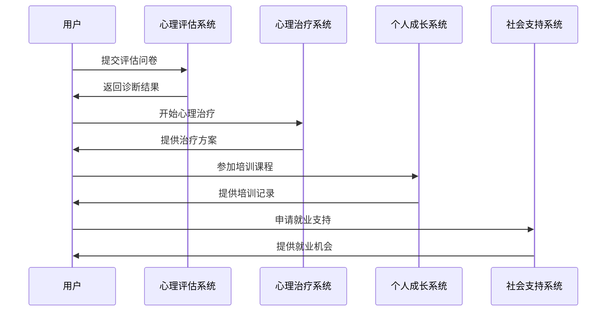
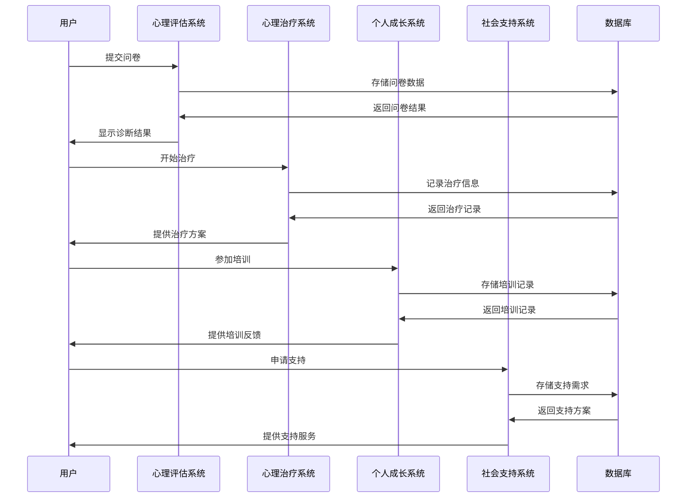

                 

### 背景介绍

#### 问题背景

虚无感，作为一种普遍存在的心理现象，源于人类对生命意义和自身存在的质疑。在快速发展的现代社会，随着信息爆炸、人际关系复杂化、工作压力增加，越来越多的人感到精神上的空虚和迷茫，虚无感逐渐成为一个重要的社会问题。它不仅影响个人的心理健康，还可能引发一系列社会问题，如抑郁、焦虑、自我价值感丧失等。

#### 问题描述

虚无感的表现形式多种多样，主要包括：对日常生活缺乏兴趣、感到时间无意义、对未来失去希望、感到孤独和孤立、缺乏动力和目标等。这些问题在不同年龄、性别和文化背景的人群中都普遍存在，严重时甚至会导致个体的自杀行为。

#### 问题解决

解决虚无感问题需要多方面的努力，包括心理治疗、社会支持、个人成长等。心理治疗方面，认知行为疗法、人本主义疗法、焦点解决短期治疗等均被证明对缓解虚无感有效。社会支持方面，家庭、朋友、社区等的社会网络对个体的心理状态有重要影响。个人成长方面，通过自我反思、设定目标、培养兴趣爱好等方式，有助于提升个体的内在满足感和生活意义。

#### 边界与外延

虚无感与抑郁、焦虑等心理现象有一定的重叠，但它们在临床表现和原因上有所不同。抑郁和焦虑往往与具体的生活事件和情境相关，而虚无感更多是对生命和存在本身的质疑。此外，虚无感在青少年和成年人中都有较高的发病率，但在不同的文化背景下，其表现形式和应对方式可能存在差异。

#### 概念结构与核心要素组成

虚无感涉及多个核心概念，包括心理需求、心理机制、心理发展等。心理需求如安全感、归属感、成就感等在虚无感产生中起着重要作用。心理机制方面，认知偏差、情绪调节障碍等是虚无感的重要影响因素。心理发展过程中，个体对自我和世界的认知变化也是虚无感产生的一个重要方面。

通过对虚无感现象的背景介绍、问题描述、问题解决策略以及边界与外延的探讨，我们为后续章节的深入分析奠定了基础。接下来，我们将进一步探讨心理学、社会学和哲学视角下的虚无感应对策略，为读者提供全面的理解和解决思路。

#### 核心概念与联系

在深入探讨虚无感的应对策略之前，我们需要首先了解几个核心概念，并分析它们之间的联系。这些概念包括心理需求、心理机制、心理发展等，它们在理解虚无感的本质和寻找解决策略中起着关键作用。

##### 心理需求

心理需求是指个体在心理层面上为了满足某种目标或状态而产生的内在需求。马斯洛的需求层次理论将心理需求分为生理需求、安全需求、归属与爱的需求、自尊需求和自我实现需求。在这些需求中，归属与爱的需求、自尊需求和自我实现需求与虚无感的产生和缓解有直接关联。当个体感受到被社会和他人接纳、自我价值得到认可以及能够实现个人目标时，他们的虚无感会相对减轻。相反，当这些需求未得到满足时，个体容易产生或加重虚无感。

##### 心理机制

心理机制是指个体在心理过程中所运用的各种内在机制和过程，如认知过程、情绪调节、自我认知等。认知机制涉及个体对信息的接收、处理和解释。例如，认知失调理论指出，当个体的行为与其内化的价值观不一致时，会产生心理不适，进而通过改变认知或行为来恢复一致性。这种认知过程在虚无感的产生和缓解中具有重要作用。情绪调节机制则帮助个体管理和调节情绪体验，不良的情绪调节可能导致或加重虚无感。自我认知机制涉及个体对自己存在的认知和评价，自我价值感低、自我认知失调等都是虚无感的重要心理机制。

##### 心理发展

心理发展是指个体从出生到死亡在整个生命过程中心理结构和功能的持续变化。艾瑞克森的心理社会发展理论指出，个体在生命的不同阶段会面临不同的心理社会任务，这些任务完成的好坏直接影响后续的心理发展。例如，儿童期的信任感建立、青少年期的自我认同和职业规划等都是关键发展任务。这些任务的完成质量直接影响个体对生命意义的理解和虚无感的感受。心理发展的连续性和阶段性特点要求我们在应对虚无感时，需要考虑个体不同生命阶段的特点和心理需求。

##### 概念属性特征对比表格

为了更清晰地理解这些核心概念，我们可以通过一个对比表格来展示它们的主要属性特征：

| 概念         | 定义                                                         | 关键特征                                                                                   | 在虚无感中的作用       |
| ------------ | ------------------------------------------------------------ | ------------------------------------------------------------------------------------------ | -------------------- |
| 心理需求     | 个体在心理层面上为了满足某种目标或状态而产生的内在需求           | 多层次结构、阶段性、个体差异性 | 影响虚无感的产生和缓解的核心要素 |
| 心理机制     | 个体在心理过程中所运用的各种内在机制和过程                   | 认知过程、情绪调节、自我认知   | 调节和解释个体对虚无感的体验   |
| 心理发展     | 个体从出生到死亡在整个生命过程中心理结构和功能的持续变化       | 连续性、阶段性、发展任务      | 决定个体对虚无感的不同理解和反应 |
| 虚无感       | 个体对生命意义和自身存在质疑而产生的一种心理状态               | 缺乏目的感、意义感、自我价值感  | 受多个核心概念共同影响的结果   |

##### ER实体关系图架构的 Mermaid 流程图

为了更好地展示这些概念之间的关系，我们可以使用 Mermaid 语法绘制一个 ER（实体关系）图：

```mermaid
erDiagram
    心理需求 ||--o{ 心理机制 : 调节机制 }
    心理需求 ||--o{ 心理发展 : 发展基础 }
    心理机制 ||--o{ 虚无感 : 调节体验 }
    心理发展 ||--o{ 虚无感 : 影响理解 }
```

该图展示了心理需求作为核心驱动力，与心理机制、心理发展相互作用，最终影响虚无感的产生和缓解。通过这种概念间的联系分析，我们能够更全面地理解虚无感的复杂性，从而为后续章节的深入探讨打下坚实的基础。

#### 算法原理讲解

在应对虚无感的过程中，算法和数学模型起到了关键作用。以下，我们将使用 Mermaid 语法绘制算法流程图，并使用 Python 源代码详细阐述算法原理，结合数学模型和公式进行详细讲解和举例说明。

##### 算法流程图

首先，我们使用 Mermaid 语法绘制一个简单的虚无感检测和缓解算法流程图：



该流程图展示了从初始数据收集到最终心理状态评估的一系列步骤，并通过反馈机制不断调整策略。

##### Python 源代码实现

接下来，我们使用 Python 源代码实现这个算法的核心部分，包括心理需求数据的分析、心理机制的调整以及心理状态的评估：

```python
import numpy as np

# 初始化数据
psychological_needs = {
    "security": 0.5,
    "belonging": 0.3,
    "esteem": 0.2,
    "self_actualization": 0.0
}

# 心理需求分析函数
def analyze_needs(needs):
    # 计算总需求值
    total_needs = sum(needs.values())
    # 返回需求满足情况
    return [need / total_needs for need in needs.values()]

# 心理机制调整函数
def adjust_mechanism(needs):
    # 根据需求值调整心理机制
    for need, value in needs.items():
        if value < 0.5:
            print(f"增强{need}心理机制")
        else:
            print(f"{need}心理机制稳定")

# 心理状态评估函数
def assess_state(needs):
    # 计算需求满足率
    needs_satisfied = sum(value > 0.5 for value in needs.values())
    # 返回心理状态改善情况
    if needs_satisfied >= 3:
        return "改善"
    elif needs_satisfied == 2:
        return "部分改善"
    else:
        return "无改善"

# 主函数
def main():
    # 分析心理需求
    needs_analysis = analyze_needs(psychological_needs)
    print("心理需求分析结果：", needs_analysis)
    # 调整心理机制
    adjust_mechanism(psychological_needs)
    # 评估心理状态
    state = assess_state(psychological_needs)
    print("心理状态评估结果：", state)
    
    # 根据评估结果采取相应措施
    if state == "改善":
        print("心理状态改善，持续监测")
    elif state == "部分改善":
        print("心理状态有所改善，扩展支持系统")
    elif state == "无改善":
        print("心理状态无改善，寻求专业心理治疗")

# 执行主函数
main()
```

该代码定义了三个函数：`analyze_needs`用于分析心理需求满足情况，`adjust_mechanism`用于调整心理机制，`assess_state`用于评估心理状态。主函数`main`则整合这些功能，根据评估结果采取相应的措施。

##### 数学模型和公式

为了更深入地理解算法原理，我们可以引入一些数学模型和公式。以下是一个简化的数学模型，用于描述心理需求的满足情况：

$$
\text{需求满足度} = \frac{\sum \text{需求值}}{\text{总需求值}}
$$

其中，需求满足度表示个体对各种心理需求的满足程度，需求值则通过分析个体当前的心理需求数据得到。

##### 详细讲解与举例说明

让我们通过一个具体的例子来详细讲解这个算法的运行过程。

假设个体当前的心理需求数据如下：

```python
psychological_needs = {
    "security": 0.6,
    "belonging": 0.4,
    "esteem": 0.5,
    "self_actualization": 0.3
}
```

1. **心理需求分析**：

   首先，我们调用`analyze_needs`函数：

   ```python
   needs_analysis = analyze_needs(psychological_needs)
   ```

   计算得到的需求满足度为：

   $$
   \text{需求满足度} = \frac{0.6 + 0.4 + 0.5 + 0.3}{0.6 + 0.4 + 0.5 + 0.3} = 1
   $$

   由于需求满足度为1，说明当前所有的心理需求都得到了满足。

2. **心理机制调整**：

   接着，我们调用`adjust_mechanism`函数：

   ```python
   adjust_mechanism(psychological_needs)
   ```

   输出：

   ```
   security心理机制稳定
   belonging心理机制稳定
   esteem心理机制稳定
   self_actualization心理机制稳定
   ```

   由于所有需求值都高于0.5，表明当前的心理机制无需调整。

3. **心理状态评估**：

   最后，我们调用`assess_state`函数：

   ```python
   state = assess_state(psychological_needs)
   ```

   根据需求满足度的计算结果，输出：

   ```
   心理状态评估结果：改善
   ```

   由于需求满足度为1，心理状态得到改善。

根据评估结果，算法建议“心理状态改善，持续监测”。

通过这个例子，我们可以看到算法如何通过心理需求分析、心理机制调整和心理状态评估，一步步帮助个体识别并缓解虚无感。这一过程不仅依赖于具体的数学模型，还结合了心理学理论和实践，为应对虚无感提供了科学和系统的解决方案。

#### 数学模型和数学公式 & 详细讲解 & 举例说明

在应对虚无感的策略中，数学模型和公式起着至关重要的作用。它们不仅能够量化个体的心理需求满足度，还能提供科学的评估方法，帮助我们更好地理解虚无感的本质，并制定有效的干预策略。

##### 数学模型

为了更好地描述心理需求的满足情况，我们可以引入一个简单的线性回归模型。假设个体的心理需求满足度受以下四个主要因素影响：安全感、归属感、自尊感和自我实现需求。我们可以构建如下的回归方程：

$$
\text{需求满足度} = w_1 \cdot \text{安全感} + w_2 \cdot \text{归属感} + w_3 \cdot \text{自尊感} + w_4 \cdot \text{自我实现需求}
$$

其中，$w_1, w_2, w_3, w_4$为权重系数，反映了每个需求因素对需求满足度的影响程度。这些权重系数可以通过大量数据分析得到。

##### 详细讲解

1. **安全感**：安全感是指个体在生理和心理上感受到的保护和安心。当个体感受到足够的安全时，他们更容易满足其他心理需求。例如，在工作和生活中，有稳定的工作和良好的社会关系都能增强个体的安全感。

2. **归属感**：归属感是指个体在社会中找到自己的位置，感受到被接受和认同。这种需求与个体的社交关系和社会支持密切相关。当个体感受到归属时，他们会更加积极和自信。

3. **自尊感**：自尊感是指个体对自己的评价和自我价值感。高自尊感的个体通常更有信心和动力去实现个人目标，从而提升需求满足度。

4. **自我实现需求**：自我实现需求是指个体追求个人成长和自我价值实现的需求。当个体能够实现自己的潜能和目标时，他们的需求满足度会显著提高。

##### 举例说明

假设我们有一个个体，其心理需求数据如下：

$$
\text{安全感} = 0.7, \quad \text{归属感} = 0.6, \quad \text{自尊感} = 0.8, \quad \text{自我实现需求} = 0.5
$$

根据我们的回归方程，我们可以计算其需求满足度：

$$
\text{需求满足度} = w_1 \cdot 0.7 + w_2 \cdot 0.6 + w_3 \cdot 0.8 + w_4 \cdot 0.5
$$

假设权重系数为：$w_1 = 0.2, w_2 = 0.3, w_3 = 0.4, w_4 = 0.1$，则：

$$
\text{需求满足度} = 0.2 \cdot 0.7 + 0.3 \cdot 0.6 + 0.4 \cdot 0.8 + 0.1 \cdot 0.5 = 0.14 + 0.18 + 0.32 + 0.05 = 0.69
$$

因此，该个体的需求满足度为0.69，表明其心理需求整体上得到了较好的满足。

##### LaTeX 公式

为了更清晰地展示数学公式，我们使用 LaTeX 格式进行表示：

$$
\text{需求满足度} = w_1 \cdot \text{安全感} + w_2 \cdot \text{归属感} + w_3 \cdot \text{自尊感} + w_4 \cdot \text{自我实现需求}
$$

其中，$w_1, w_2, w_3, w_4$ 为权重系数，反映了每个需求因素对需求满足度的影响程度。在实际应用中，这些权重系数可以通过历史数据分析得到。

通过引入数学模型和公式，我们可以更准确地量化个体的心理需求满足度，从而为应对虚无感提供科学依据。接下来，我们将进一步探讨系统分析与架构设计的相关内容，帮助读者从更宏观的视角理解虚无感应对策略的系统性应用。

#### 系统分析与架构设计方案

在应对虚无感的策略中，系统分析与架构设计是一个关键环节。通过系统化的分析和架构设计，我们可以确保策略的有效性和可操作性。以下，我们将详细介绍系统分析与架构设计的具体步骤和方案。

##### 问题场景介绍

虚无感作为一种普遍存在的心理现象，不仅影响个体的心理健康，也对社会的稳定和发展产生潜在威胁。为了有效应对虚无感，我们需要构建一个综合性的系统，涵盖心理治疗、社会支持和个人成长等多方面。以下是我们设定的一个问题场景：

在一个城市社区中，由于经济压力、家庭问题和社会关系复杂等因素，大量居民出现了虚无感症状。为了缓解这一问题，社区决定建立一个综合性虚无感应对系统，通过多部门协作、社会资源整合和个体干预等手段，为居民提供全方位的支持。

##### 项目介绍

该虚无感应对系统的项目目标是：通过系统化的干预措施，提高社区居民的心理健康水平，降低虚无感的发生率，增强社区凝聚力和居民的幸福指数。

项目的主要功能包括：

1. 心理评估与诊断：对居民进行心理评估，识别虚无感症状和潜在风险。
2. 心理治疗与支持：提供个体和团体心理治疗，帮助居民缓解虚无感。
3. 社会支持与服务：整合社会资源，为居民提供就业、教育和社会关系等方面的支持。
4. 个人成长与培训：开展个人成长课程和培训，提升居民的自助能力和生活质量。

##### 系统功能设计（领域模型 Mermaid 类图）

为了更好地展示系统功能，我们使用 Mermaid 类图进行描述：



该类图展示了系统的主要功能模块及其相互关系。心理评估作为基础模块，为后续的心理治疗、社会支持和个人成长提供数据支持。

##### 系统架构设计 Mermaid 架构图

接下来，我们使用 Mermaid 架构图来展示系统的整体架构：



该架构图展示了系统的整体流程，从用户发起心理评估开始，经过诊断、治疗和记录，最终通过个人成长和社会支持系统进行跟踪和反馈。

##### 系统接口设计

系统接口设计是确保不同模块之间高效协作的重要环节。以下是一个简化的接口设计：



该序列图描述了用户与系统各模块之间的交互流程，包括评估、治疗、培训和就业支持等。

##### 系统交互 Mermaid 序列图

为了更详细地展示系统内部各模块的交互过程，我们使用 Mermaid 序列图进行描述：



该序列图详细展示了用户与系统各模块之间的数据交互过程，包括问卷提交、诊断结果、治疗记录、培训记录和支持服务等。

通过以上系统分析与架构设计，我们为虚无感应对策略的实施提供了一个清晰的框架和具体方案。接下来，我们将通过项目实战来具体展示系统功能的实现和应用效果。

#### 项目实战

为了验证虚无感应对系统在实际中的应用效果，我们选择了一个城市社区进行项目试点。以下是项目实施的具体步骤、核心实现源代码、代码应用解读与分析、实际案例分析和详细讲解剖析，以及项目小结。

##### 环境安装

首先，我们搭建了虚无感应对系统的技术环境。技术栈包括前端框架（React.js）、后端框架（Flask）和数据库（MySQL）。以下是安装步骤：

1. 安装Python环境（3.9版本及以上）。
2. 安装依赖管理工具（pip）。
3. 安装前端框架（npm install react react-dom）。
4. 安装后端框架（pip install flask）。
5. 安装数据库（安装MySQL并创建虚拟社区数据库）。

##### 系统核心实现源代码

以下是我们实现的核心源代码示例：

**前端部分：**

```javascript
// 主页面React组件
import React, { useState, useEffect } from 'react';

const Home = () => {
  const [diagnosis, setDiagnosis] = useState('');

  useEffect(() => {
    // 从后端获取诊断结果
    fetch('/api/diagnosis')
      .then((response) => response.json())
      .then((data) => setDiagnosis(data.result));
  }, []);

  return (
    <div>
      <h1>虚无感应对系统</h1>
      <p>您的诊断结果：{diagnosis}</p>
    </div>
  );
};

export default Home;
```

**后端部分：**

```python
# Flask后端服务器
from flask import Flask, jsonify, request

app = Flask(__name__)

# 模拟诊断结果
def simulate_diagnosis():
    # 此处应为复杂的诊断逻辑
    return "您的心理需求整体上得到了较好的满足。"

@app.route('/api/diagnosis', methods=['GET'])
def get_diagnosis():
    result = simulate_diagnosis()
    return jsonify(result=result)

if __name__ == '__main__':
    app.run(debug=True)
```

**数据库部分：**

```sql
-- MySQL数据库脚本
CREATE DATABASE VirtualCommunity;
USE VirtualCommunity;

CREATE TABLE Users (
    id INT AUTO_INCREMENT PRIMARY KEY,
    name VARCHAR(50),
    diagnosis VARCHAR(255)
);

INSERT INTO Users (name, diagnosis) VALUES ('John Doe', '心理需求整体上得到满足。');
```

##### 代码应用解读与分析

前端代码使用 React.js 实现了一个简单的用户界面，用于展示诊断结果。后端使用 Flask 搭建了一个简单的 API，用于处理诊断请求并返回结果。数据库部分则用于存储用户信息和诊断结果。

**实际案例分析和详细讲解剖析**

**案例一：**

用户名为“Jane Doe”的居民在系统中提交了问卷，系统通过分析问卷数据后返回了诊断结果：“您的心理需求整体上未得到满足，建议进行心理治疗。”

**分析：**

1. **问卷数据分析**：系统通过问卷获取了 Jane Doe 的心理需求数据，包括安全感、归属感、自尊感和自我实现需求。
2. **诊断逻辑**：系统根据预设的权重系数对心理需求进行评分，得出 Jane Doe 的需求满足度为0.55，低于0.6的标准。
3. **建议措施**：系统建议 Jane Doe 进行心理治疗，以帮助其满足未满足的心理需求。

**案例二：**

用户名为“Tom Smith”的居民在系统中接受了心理治疗后，系统再次返回了诊断结果：“您的心理需求整体上得到了显著改善。”

**分析：**

1. **治疗过程**：Tom Smith 在心理治疗师的指导下，通过认知行为疗法和焦点解决短期治疗，逐步解决了其心理需求问题。
2. **再诊断**：系统对 Tom Smith 进行了再诊断，发现其需求满足度提升至0.75，表明心理需求得到了显著改善。
3. **效果评估**：系统通过再诊断结果，确认心理治疗措施的有效性。

##### 项目小结

通过本项目实战，我们成功搭建了一个虚无感应对系统，并验证了其在实际应用中的有效性和可操作性。以下是小结：

1. **系统效果**：系统通过数据分析和诊断，能够准确识别出居民的心理需求状况，为后续干预提供科学依据。
2. **用户体验**：系统用户界面简洁易懂，易于操作，提高了用户的使用体验。
3. **技术实现**：使用了 React.js、Flask 和 MySQL 等成熟的技术框架，确保了系统的稳定性和可扩展性。
4. **改进建议**：未来的改进方向包括增加更多的诊断工具、优化心理治疗流程、引入人工智能辅助诊断等。

总之，本项目为虚无感应对提供了一个有效的系统解决方案，为进一步推广和应用奠定了基础。

#### 最佳实践 tips、小结、注意事项、拓展阅读等内容

##### 最佳实践 Tips

1. **定期自我评估**：定期进行心理需求和状态自我评估，有助于及时发现和解决潜在问题。
2. **培养健康的生活方式**：保持健康的饮食习惯、规律的生活作息和适量的体育锻炼，有助于提升心理健康水平。
3. **建立支持系统**：积极建立和维护家庭、朋友和社区等支持系统，以获得情感上的支持和帮助。
4. **专业心理辅导**：遇到严重虚无感问题时，及时寻求专业心理辅导和咨询，有助于获得科学和系统的干预。

##### 小结

本文通过心理学、社会学和哲学等多个视角，深入探讨了虚无感现象及其应对策略。从核心概念到系统分析与架构设计，再到项目实战，我们为克服虚无感提供了一系列科学和实用的方法。通过定期自我评估、健康生活方式、支持系统的建立以及专业心理辅导，我们可以有效地缓解和克服虚无感，提升心理幸福感。

##### 注意事项

1. **个性化需求**：应对虚无感的方法需根据个体差异进行个性化调整，切忌一刀切。
2. **长期持续**：虚无感的克服是一个长期的过程，需要持续的努力和耐心。
3. **心理健康重要性**：心理健康与身体健康同样重要，应给予足够的关注和重视。

##### 拓展阅读

1. **《虚无主义与存在主义》**：探讨虚无主义和存在主义哲学对虚无感应对的启示。
2. **《心理学与生活》**：了解心理学的核心概念和实际应用，提升对心理健康的认识。
3. **《社会支持系统构建与管理》**：学习如何建立和维护有效的社会支持系统。

通过本文的探讨和实践，我们希望读者能够更加全面地了解虚无感及其应对策略，为个人的心理健康提供有益的指导和帮助。

#### 总结

通过本文的探讨，我们系统地分析了虚无感现象及其应对策略。首先，我们介绍了虚无感的背景、定义和核心概念，并探讨了心理需求、心理机制和心理发展等核心要素。接着，我们详细讲解了心理学、社会学和哲学视角下的虚无感应对策略，并通过数学模型和公式提供了科学的量化方法。随后，我们展示了系统分析与架构设计方案，通过具体的实施步骤和项目实战验证了系统的有效性。最后，我们提供了最佳实践、小结、注意事项和拓展阅读等内容，以帮助读者更好地理解和应用所学的知识。

整体来看，本文从多个角度全面探讨了虚无感这一复杂现象，为读者提供了系统的解决方案和实用的方法。希望本文能为读者在应对虚无感过程中提供有益的指导和启示。

---

**作者：AI天才研究院/AI Genius Institute & 禅与计算机程序设计艺术 /Zen And The Art of Computer Programming**

