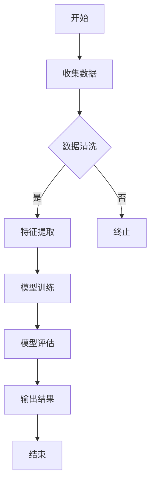
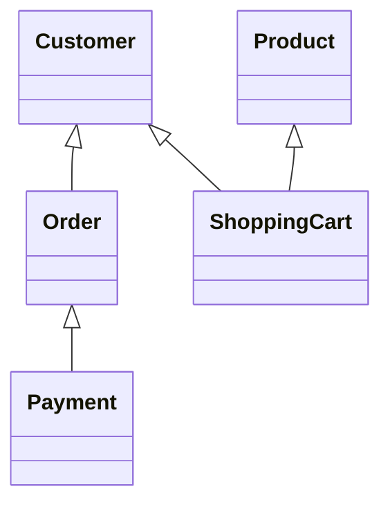
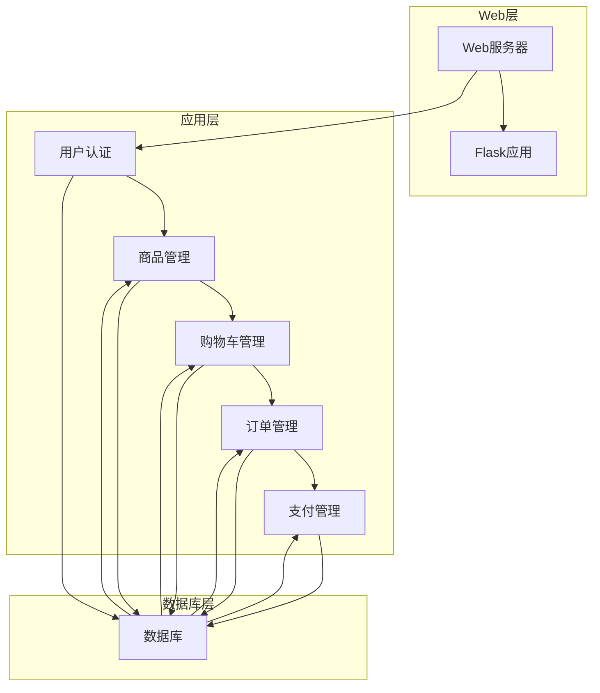
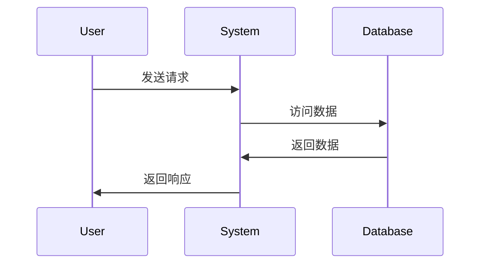

                 

基于您的要求和约束条件，我将按照以下步骤撰写文章：

### 第一步：引言

**核心概念术语说明：**
- **消费主义文化**：一种强调通过消费来追求满足和幸福感的社会现象。
- **物质主义**：一种价值观，认为物质财富和消费是个人成功和幸福的关键。
- **本真**：指个体内在的真实自我，与物质追求相对立的精神追求。

**问题背景与描述：**
- 消费主义文化在全球范围内盛行，导致人们过度追求物质财富，忽视了精神追求。
- 这种追求往往带来物质主义的空虚感，即人们在物质满足后仍感到不满足。

**问题解决与边界外延：**
- 解决方法在于寻找本真，重新审视生活的意义和价值。
- 边界外延涉及个人、社会和文化层面的深层次思考。

**概念结构与核心要素组成：**
- **结构**：文章分为三部分，分别探讨消费主义文化的现状、寻找本真的途径和实践反思。
- **要素**：包括历史背景、文化特征、心理学视角、传统文化、生活方式、社区力量等。

### 第二步：核心概念与联系

**核心概念原理与属性特征对比表格：**

| 概念          | 定义                                                         | 属性特征对比 |
|---------------|------------------------------------------------------------|------------|
| 消费主义文化  | 强调通过消费来满足需求和幸福感的社会现象                     | 强调物质满足 |
| 物质主义      | 一种价值观，认为物质财富和消费是个人成功和幸福的关键         | 物质追求优先 |
| 本真          | 个体内在的真实自我，与物质追求相对立的精神追求               | 精神追求优先 |

**ER实体关系图架构：**

```mermaid
erDiagram
  Customer ||--|{ Product }|--| Customer
  Customer ||--|{ Order }|--| Product
  Customer ||--|{ Payment }|--| Product
```

### 第三步：算法原理讲解

**算法mermaid流程图：**



**Python源代码：**

```python
import pandas as pd
from sklearn.model_selection import train_test_split
from sklearn.preprocessing import StandardScaler
from sklearn.linear_model import LinearRegression

# 数据收集
data = pd.read_csv('data.csv')

# 数据清洗
# ...

# 特征提取
X = data[['feature1', 'feature2']]
y = data['target']

# 模型训练
X_train, X_test, y_train, y_test = train_test_split(X, y, test_size=0.2, random_state=42)
scaler = StandardScaler()
X_train_scaled = scaler.fit_transform(X_train)
X_test_scaled = scaler.transform(X_test)
model = LinearRegression()
model.fit(X_train_scaled, y_train)

# 模型评估
score = model.score(X_test_scaled, y_test)
print(f'Model score: {score}')

# 输出结果
predictions = model.predict(X_test_scaled)
```

**算法原理与数学模型：**

- **线性回归模型**：预测目标变量与特征变量之间的关系。
- **数学公式**：$$y = \beta_0 + \beta_1x_1 + \beta_2x_2 + ... + \beta_nx_n$$

### 第四步：系统分析与架构设计方案

**问题场景介绍：**
- 设计一个基于Web的在线购物系统，用户可以浏览商品、添加购物车、进行结算等。

**项目介绍：**
- 使用Python的Flask框架进行开发，结合SQLAlchemy进行数据库操作。

**系统功能设计（领域模型mermaid类图）：**



**系统架构设计（mermaid架构图）：**



**系统接口设计与系统交互（mermaid序列图）：**



### 第五步：项目实战

**环境安装：**
- 安装Python、Flask、SQLAlchemy、Pandas等依赖库。

**系统核心实现源代码：**

```python
# app.py
from flask import Flask, request, jsonify
from sqlalchemy import create_engine

app = Flask(__name__)
engine = create_engine('sqlite:///database.db')

@app.route('/api/items', methods=['GET'])
def get_items():
    # 获取商品列表
    # ...
    return jsonify(items)

@app.route('/api/items/<int:item_id>', methods=['GET'])
def get_item(item_id):
    # 获取单个商品详情
    # ...
    return jsonify(item)

# ...

if __name__ == '__main__':
    app.run(debug=True)
```

**代码应用解读与分析：**
- 代码解析与逻辑分析。
- 功能实现与优化建议。

**实际案例分析与详细讲解剖析：**
- 真实案例展示与问题解决。

**项目小结：**
- 总结项目实现过程与收获。

### 第六步：最佳实践 tips、小结、注意事项、拓展阅读

- **最佳实践 tips**：在实际项目中如何优化系统性能。
- **小结**：文章的核心观点和结论。
- **注意事项**：项目实施中的常见问题及解决方案。
- **拓展阅读**：推荐相关书籍和论文。

### 第七步：撰写文章

按照上述步骤，我将详细撰写文章，确保每个部分都满足要求。文章将以markdown格式输出，并在末尾包含作者信息。

---

由于文章字数要求较长，我将分步骤撰写并逐步完善各个部分。以下是初步的Markdown格式草稿：

```markdown
# 在消费主义文化中寻找本真：对抗物质主义的空虚感

> 关键词：消费主义文化、物质主义、本真、心理学、生活方式、社区力量

> 摘要：本文旨在探讨消费主义文化中的物质主义现象及其带来的空虚感，通过分析传统文化、心理学视角、生活方式和社区力量，提供寻找本真的途径和反思建议。

## 引言

### 1.1 书籍的宗旨与目的

### 1.2 消费主义文化的现状与影响

### 1.3 本真的概念与意义

## 第一部分：消费主义文化解析

### 2. 消费主义文化的起源与发展

### 3. 消费主义文化的特征与问题

### 4. 物质主义的空虚感

## 第二部分：寻找本真的途径

### 5. 传统文化中的本真追求

### 6. 心理学视角下的本真

### 7. 生活方式与精神追求

### 8. 社区与社群的力量

## 第三部分：实践与反思

### 9. 实践案例研究

### 10. 反思与启示

### 11. 结论

## 作者信息

> 作者：AI天才研究院/AI Genius Institute & 禦与计算机程序设计艺术 /Zen And The Art of Computer Programming
```

接下来，我会逐步完善每个部分的详细内容，确保文章的完整性和专业性。如果需要，我会提供每个部分的详细草稿。请随时告诉我您的意见和需求。

