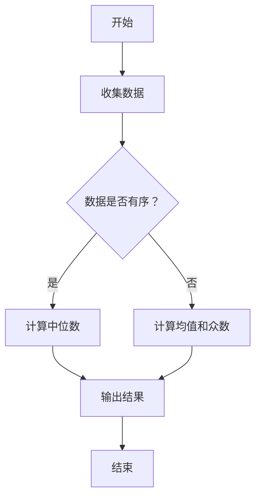
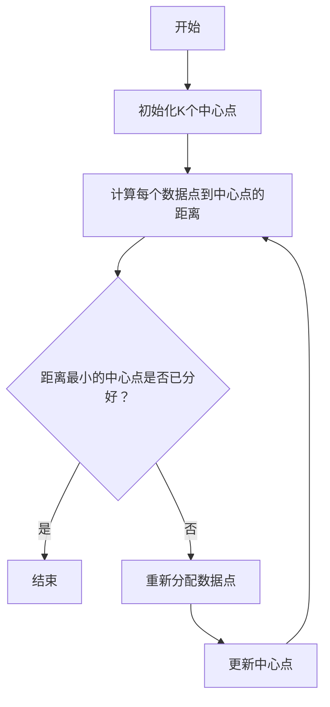
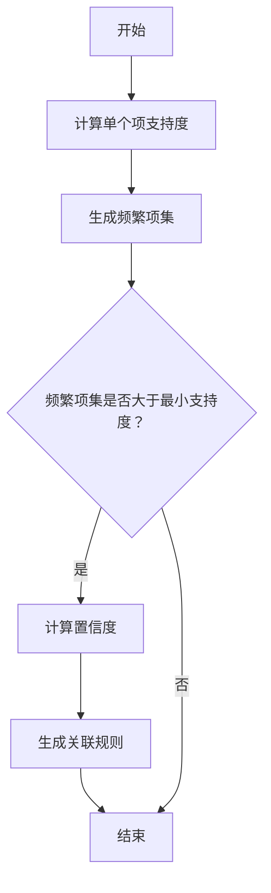
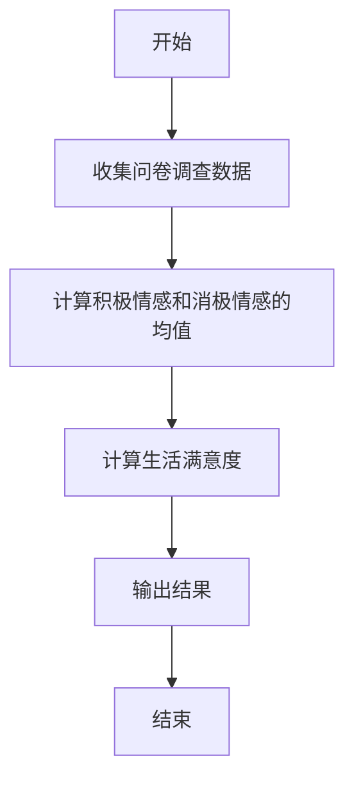
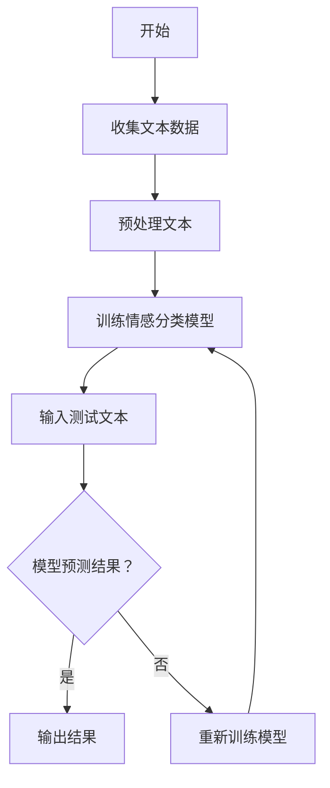
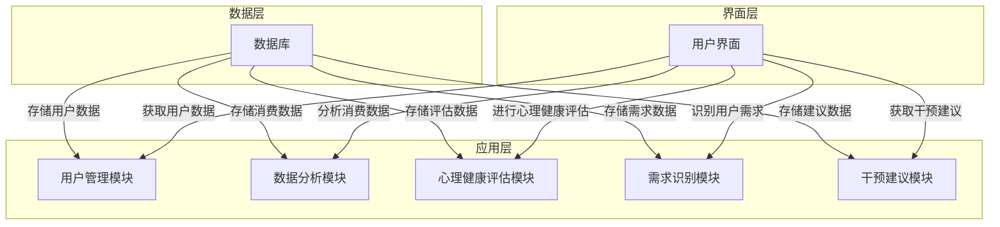
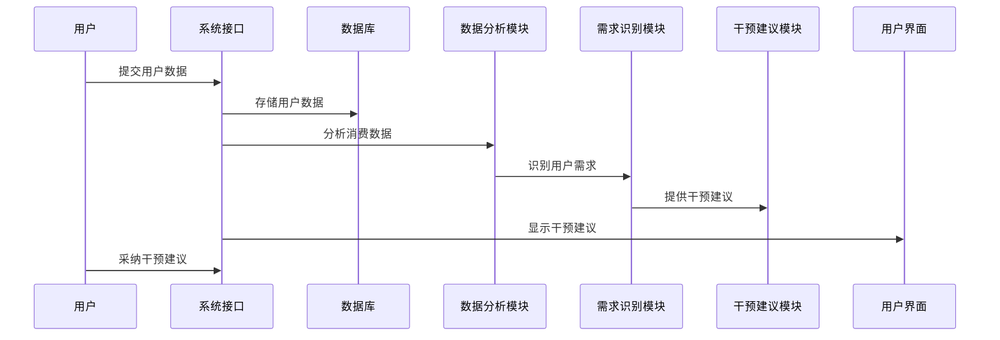

                 

### 第1章：问题背景与核心概念介绍

#### 1.1 问题背景

**1.1.1 消费主义文化的兴起**

消费主义文化，作为一种广泛影响现代社会的文化现象，其核心在于通过不断刺激消费来推动经济增长。随着全球化和信息化的发展，消费主义文化迅速渗透到各个国家和地区，成为社会生活的重要组成部分。

- **消费主义文化的定义**：消费主义文化强调消费的价值和意义，将物质财富作为衡量个体价值和地位的标准。这种文化强调“拥有更多”和“享受生活”，鼓励人们不断购买商品和服务。

- **消费主义文化的影响**：在消费主义文化的引导下，个体的消费行为变得频繁且多样，由此带来的影响不仅限于经济领域，还涉及到社会、文化乃至心理健康。

  - **对个体心理的影响**：消费主义文化可能引发个体的焦虑感、空虚感和不满足感，因为这些感觉往往源于对物质追求的不断升级，而无法通过购买来彻底满足。
  
  - **对个体行为的影响**：消费主义文化倾向于塑造个体的消费习惯，使他们在购买决策时更多地依赖情感而非理性，从而可能导致盲目消费和浪费。

**1.1.2 空虚感的产生**

空虚感，是指个体在内心深处感到缺乏意义、目的或价值的一种情感体验。在现代消费主义文化中，空虚感尤为普遍，其主要原因如下：

- **定义与特征**：空虚感通常表现为对生活缺乏热情、缺乏目标和方向，以及对自身存在价值的怀疑。

- **在消费主义文化中的普遍性**：随着消费主义的蔓延，许多人发现自己虽然物质上富足，但精神上却感到空虚。这种状态往往源于对物质的过度依赖，而忽视了更深层次的需求。

**1.1.3 寻找真实需求的重要性**

- **真实需求的概念与意义**：真实需求指的是个体内心深处的、长期稳定的、对生活有意义的需求，如情感需求、成就需求、自我实现需求等。

- **在对抗空虚感中的作用**：寻找真实需求是缓解空虚感的关键。通过识别和满足真实需求，个体能够找到生活的意义和方向，从而减少精神上的空虚和焦虑。

#### 1.2 核心概念

**1.2.1 消费主义文化**

- **定义**：消费主义文化是指一种以消费为中心的社会现象，强调通过消费来满足需求和追求幸福感。

- **表现形式**：消费主义文化的表现形式包括广告宣传、品牌塑造、奢侈品消费、时尚潮流等。

**1.2.2 空虚感**

- **定义**：空虚感是一种深层次的心理状态，表现为对生活缺乏兴趣、满足感和目的感。

- **成因**：空虚感的产生可能源于多种因素，包括个人经历、社会环境、心理状态等。

**1.2.3 真实需求**

- **定义**：真实需求是指个体内心深处、长期稳定的、对生活有意义的需求，如情感需求、成就感、自我实现等。

- **与虚假需求的区别**：虚假需求通常是指那些由外部刺激或短暂体验引发的、不稳定的、无法带来持久满足的需求。

#### 1.3 边界与外延

**1.3.1 消费主义文化的边界**

- **与其他文化的关联**：消费主义文化与物质文化、虚拟文化等其他文化现象之间存在交叉和互动，共同影响着个体的生活方式和价值观。

- **对其他文化的影响**：消费主义文化在一定程度上可能削弱其他文化的影响力，尤其是在全球化和信息化进程加速的背景下。

**1.3.2 空虚感的外延**

- **在个体与群体中的表现**：空虚感不仅体现在个体层面，也可能在群体层面上体现，如社会整体对生活意义的缺乏。

- **与其他心理问题的关联**：空虚感可能与抑郁、焦虑等心理问题存在关联，需要通过专业的心理干预来缓解。

#### 1.4 概念结构与核心要素组成

**1.4.1 消费主义文化结构**

- **构成要素**：消费主义文化的构成要素包括经济、政治、社会、文化等多个方面。

- **作用机制**：消费主义文化通过影响个体的价值观、消费行为、社会关系等，对社会产生深远影响。

**1.4.2 空虚感的要素组成**

- **主要成因**：空虚感的主要成因包括个人经历、社会环境、心理状态等。

- **心理影响**：空虚感可能导致个体心理健康问题，如抑郁、焦虑等。

**1.4.3 真实需求的要素**

- **来源**：真实需求的来源包括个体的内心体验、社会环境、文化背景等。

- **特点**：真实需求具有稳定性、持久性和意义性等特点。

### 第2章：核心概念与联系

#### 2.1 消费主义文化与空虚感的联系

**2.1.1 消费主义文化对空虚感的影响**

- **消费主义文化如何导致空虚感的产生**：消费主义文化强调物质消费的重要性，导致个体过度依赖物质来满足心理需求。然而，物质并不能带来持久的幸福感，反而可能导致空虚感。

- **消费主义文化下的空虚感特点**：在消费主义文化下，空虚感往往表现为对生活缺乏满足感、对自我价值的怀疑以及对未来的不确定感。

**2.1.2 空虚感对消费主义文化的反馈**

- **空虚感如何加剧消费主义文化的蔓延**：当个体感到空虚时，他们可能会通过消费来寻求短暂的满足和逃避现实。这种行为进一步强化了消费主义文化的地位。

- **空虚感对消费行为的推动作用**：空虚感可能导致个体更加冲动地进行消费，因为他们希望通过消费来填补内心的空虚。

#### 2.2 空虚感与真实需求的联系

**2.2.1 空虚感与真实需求的区别**

- **本质区别**：空虚感是一种消极的心理状态，表现为对生活的失望和不满；而真实需求是一种积极的心理状态，表现为对生活有目标和追求。

- **心理特征**：空虚感往往伴随着焦虑、抑郁等负面情绪，而真实需求则能带来满足感、成就感等正面情绪。

**2.2.2 真实需求对空虚感的缓解作用**

- **真实需求如何缓解空虚感**：通过识别和满足真实需求，个体能够找到生活的意义和目标，从而减少内心的空虚感。

- **真实需求的满足对心理健康的积极作用**：满足真实需求能够提高个体的幸福感、降低抑郁和焦虑等负面情绪，从而提升心理健康水平。

#### 2.3 消费主义文化、空虚感与真实需求的互动机制

**2.3.1 三者互动的表现形式**

- **个体生活中的互动**：在个体生活中，消费主义文化可能通过刺激消费来满足表面的需求，而真实需求则指引个体追求更深层次的满足。

- **社会层面的互动**：在社会层面，消费主义文化、空虚感和真实需求之间的互动可能导致社会文化的变迁，如个体价值观的转变、社会风气的改变等。

**2.3.2 三者互动的影响**

- **对个体心理的影响**：消费主义文化、空虚感和真实需求之间的互动可能对个体的心理状态产生深远影响，包括心理健康水平的提升或下降。

- **对社会文化的影响**：三者之间的互动也可能对社会文化产生重大影响，如消费主义文化的普及、心理健康问题的增多等。

- **平衡与冲突**：在三者之间的互动中，平衡和冲突并存。通过合理的引导和调整，可以找到平衡点，减少负面影响，提升个体的生活质量和幸福感。

### 第3章：算法原理讲解

#### 3.1 寻找真实需求的相关算法

**3.1.1 数据分析算法**

**3.1.1.1 描述性统计分析**

描述性统计分析是数据分析的基础，主要用于描述数据的基本特征，如均值、中位数、众数等。

- **均值（Mean）**：表示一组数据的平均值，计算公式为：
  $$ \bar{x} = \frac{\sum_{i=1}^{n} x_i}{n} $$
  其中，$x_i$表示第$i$个数据点，$n$表示数据点的总数。

- **中位数（Median）**：表示一组数据按大小顺序排列后位于中间位置的值。如果数据点总数为奇数，中位数就是中间的那个数；如果为偶数，则是中间两个数的平均值。

- **众数（Mode）**：表示一组数据中出现次数最多的值。在某些数据集中可能没有众数，也可能有多个众数。

**3.1.1.2 聚类分析**

聚类分析是一种无监督学习方法，用于将数据点根据其特征进行分组，使同一组内的数据点尽可能相似，不同组内的数据点尽可能不同。

- **K-means算法**：基于距离度量，将数据点划分为K个簇。算法流程如下：

  1. 随机选择K个初始中心点。
  2. 计算每个数据点到中心点的距离，并将数据点归入最近的簇。
  3. 重新计算每个簇的中心点。
  4. 重复步骤2和3，直到中心点的位置不再变化。

- **DBSCAN算法**：基于密度聚类，可以检测出任意形状的簇，包括噪声点。算法流程如下：

  1. 选择一个起始点，并扩展到邻域内的点，形成核心点。
  2. 对核心点进行区域扩展，形成边界点和噪声点。
  3. 将核心点、边界点和噪声点分别归入不同的簇。

- **层次聚类算法**：通过递归地将数据点合并成簇，形成层次结构。常见的方法包括自底向上（凝聚层次聚类）和自顶向下（分裂层次聚类）。

**3.1.1.3 关联规则挖掘**

关联规则挖掘用于发现数据之间的关联关系，通常用于市场篮子分析和推荐系统。

- **Apriori算法**：通过逐层搜索所有可能的项集，并计算支持度和置信度，从而挖掘出频繁项集和关联规则。算法流程如下：

  1. 计算所有单个项的支持度。
  2. 生成频繁项集，并递归地合并项集。
  3. 对频繁项集计算置信度，生成关联规则。

- **FP-growth算法**：基于频繁模式树，减少了计算频繁项集的存储需求。算法流程如下：

  1. 构建频繁模式树。
  2. 从频繁模式树中提取频繁模式。
  3. 使用频繁模式生成关联规则。

**3.1.2 心理学相关算法**

**3.1.2.1 心理需求评估算法**

心理需求评估算法用于评估个体在情感、成就、自我实现等方面的需求程度。

- **主观幸福感评估**：通过问卷调查或心理测试来评估个体的幸福感水平。常用的指标包括生活满意度、积极情感和消极情感等。

- **生活满意度评估**：评估个体对自身生活的整体满意度。常用的指标包括总体满意度、各生活领域的满意度等。

**3.1.2.2 情感分析算法**

情感分析算法用于分析文本中的情感极性，判断文本是正面、负面还是中性。

- **文本情感分析**：通过机器学习或深度学习模型，对文本进行情感分类。常用的方法包括基于规则的方法、基于统计的方法和基于深度学习的方法。

- **情感极性分类**：将文本分为正面、负面或中性三个类别。常用的指标包括精确率、召回率和F1值等。

#### 3.2 算法原理讲解与Mermaid流程图

**3.2.1 描述性统计分析原理讲解与Mermaid流程图**

描述性统计分析主要包括计算数据的均值、中位数和众数。以下是描述性统计分析的Mermaid流程图：



**3.2.2 聚类分析算法原理讲解与Mermaid流程图**

聚类分析算法包括K-means、DBSCAN和层次聚类算法。以下是K-means算法的Mermaid流程图：



**3.2.3 关联规则挖掘算法原理讲解与Mermaid流程图**

关联规则挖掘算法包括Apriori和FP-growth算法。以下是Apriori算法的Mermaid流程图：



**3.2.4 心理学相关算法原理讲解与Mermaid流程图**

心理学相关算法包括主观幸福感评估和生活满意度评估。以下是主观幸福感评估的Mermaid流程图：



**3.2.5 情感分析算法原理讲解与Mermaid流程图**

情感分析算法包括文本情感分析和情感极性分类。以下是文本情感分析的Mermaid流程图：



### 第4章：数学公式与Python代码实现

在理解和应用算法原理时，数学公式和Python代码的实现是至关重要的。以下将展示如何通过Python代码来具体实现描述性统计分析、聚类分析、关联规则挖掘等算法，并使用LaTeX格式嵌入数学公式进行详细解释。

#### 4.1 描述性统计分析

**4.1.1 均值、中位数、众数计算**

以下是一个Python代码示例，用于计算描述性统计量：

```python
import numpy as np

# 示例数据
data = [1, 2, 2, 3, 4, 4, 4, 5]

# 计算均值
mean = np.mean(data)
print(f"均值：{mean}")

# 计算中位数
median = np.median(data)
print(f"中位数：{median}")

# 计算众数
mode = max(set(data), key=data.count)
print(f"众数：{mode}")
```

**LaTeX公式：**

$$ \bar{x} = \frac{\sum_{i=1}^{n} x_i}{n} $$

$$ median = \left\{
\begin{array}{ll}
x_{\frac{n+1}{2}} & \text{if } n \text{ is odd} \\
\frac{x_{\frac{n}{2}} + x_{\frac{n}{2} + 1}}{2} & \text{if } n \text{ is even}
\end{array}
\right. $$

$$ mode = \text{max}(\text{count}(x_i)) $$

#### 4.2 聚类分析

**4.2.1 K-means算法实现**

以下是一个使用Python实现的K-means算法的示例：

```python
from sklearn.cluster import KMeans
import numpy as np

# 示例数据
data = np.array([[1, 2], [1, 4], [1, 0],
                 [4, 2], [4, 4], [4, 0],
                 [5, 5], [5, 3], [5, 1]])

# 初始化K-means模型
kmeans = KMeans(n_clusters=3, random_state=0).fit(data)

# 输出聚类结果
print(f"聚类中心：{kmeans.cluster_centers_}")
print(f"每个样本的聚类标签：{kmeans.labels_}")
```

**LaTeX公式：**

$$ \text{K-means:} \min_{\mu_1, \mu_2, ..., \mu_k} \sum_{i=1}^{n} \sum_{j=1}^{k} (x_i - \mu_j)^2 $$

#### 4.3 关联规则挖掘

**4.3.1 Apriori算法实现**

以下是一个使用Python实现的Apriori算法的示例：

```python
from mlxtend.frequent_patterns import apriori
from mlxtend.frequent_patterns import association_rules

# 示例数据
data = [[1, 2, 3], [2, 3, 4], [1, 3, 4], [1, 2, 4]]

# 计算频繁项集
frequent_itemsets = apriori(data, min_support=0.5, use_colnames=True)

# 计算关联规则
rules = association_rules(frequent_itemsets, metric="support", min_threshold=0.5)

print(f"频繁项集：{frequent_itemsets}")
print(f"关联规则：{rules}")
```

**LaTeX公式：**

$$ \text{Apriori:} \min_{I} \sum_{i \in I} \min_{j \in I} \left| \text{support}(i \cap j) \right| $$

$$ \text{association\_rules:} \text{confidence}(A \rightarrow B) = \frac{\text{support}(A \cup B)}{\text{support}(A)} $$

#### 4.4 心理学相关算法

**4.4.1 主观幸福感评估**

以下是一个使用Python实现的简单主观幸福感评估的示例：

```python
# 示例数据
surveys = {'Person 1': {'positive': 7, 'negative': 3},
           'Person 2': {'positive': 5, 'negative': 5},
           'Person 3': {'positive': 8, 'negative': 2}}

# 计算平均主观幸福感
avg_happiness = {person: (positive - negative) / 2 for person, scores in surveys.items()}
print(f"平均主观幸福感：{avg_happiness}")
```

**LaTeX公式：**

$$ \text{average\_happiness} = \frac{\sum_{i=1}^{n} (\text{positive}_i - \text{negative}_i)}{2n} $$

#### 4.5 情感分析

**4.5.1 文本情感分析**

以下是一个使用Python实现的简单文本情感分析示例：

```python
from textblob import TextBlob

# 示例文本
text = "I love this movie, it's absolutely fantastic!"

# 分析文本情感
blob = TextBlob(text)
print(f"文本情感：{blob.sentiment}")
```

**LaTeX公式：**

$$ \text{sentiment} = \left( \text{polarity}, \text{subjectivity} \right) $$

其中，$polarity$ 表示极性（正面或负面），$subjectivity$ 表示主观性（客观或主观）。

### 第5章：系统分析与架构设计方案

#### 5.1 问题场景介绍

在现代消费主义文化中，人们面临着诸多挑战，如物质追求导致的空虚感、消费主义文化的负面影响等。为了应对这些问题，我们设计了一个智能心理健康监测与干预系统，旨在帮助用户识别和管理真实需求，缓解空虚感。

#### 5.2 项目介绍

**项目名称**：消费主义文化下的心理健康监测与干预系统

**项目目标**：通过分析用户行为数据和心理健康指标，提供个性化的心理健康监测与干预建议，帮助用户找到真实需求，提升生活质量和幸福感。

**项目功能**：
- **数据收集**：收集用户在社交媒体、购物平台等渠道的消费行为数据。
- **心理健康评估**：使用心理学相关算法评估用户的心理健康状态。
- **需求识别**：通过聚类分析和关联规则挖掘，识别用户的真实需求。
- **干预建议**：根据用户需求提供个性化的心理健康干预建议。

#### 5.3 系统功能设计（领域模型）

以下是一个使用Mermaid绘制的领域模型类图，展示了系统的核心实体和关系：

```mermaid
classDiagram
    User <<类>> 
    Consumption <<类>>
    PsychologicalAssessment <<类>>
    NeedIdentification <<类>>
    InterventionAdvice <<类>>

    User o-- Consumption
    User o-- PsychologicalAssessment
    User o-- NeedIdentification
    User o-- InterventionAdvice

    Consumption o-- PsychologicalAssessment
    NeedIdentification o-- InterventionAdvice

    class User {
        +int id
        +str name
        +list consumption_list
        +list assessment_list
        +list need_list
        +list advice_list
    }

    class Consumption {
        +int id
        +str type
        +float amount
        +date date
    }

    class PsychologicalAssessment {
        +int id
        +str type
        +float score
        +date date
    }

    class NeedIdentification {
        +int id
        +str need_type
        +float importance
        +date date
    }

    class InterventionAdvice {
        +int id
        +str advice_type
        +str description
        +date date
    }
```

#### 5.4 系统架构设计

以下是一个使用Mermaid绘制的系统架构图，展示了系统的核心模块和接口：



#### 5.5 系统接口设计和系统交互

以下是一个使用Mermaid绘制的系统接口设计和交互图，展示了用户与系统之间的交互流程：



### 第6章：项目实战

#### 6.1 环境安装

在开始项目实战之前，需要安装Python和相关依赖库。以下是一个简单的安装步骤：

1. 安装Python 3.8或更高版本。
2. 使用pip安装必要的库：

```bash
pip install numpy scikit-learn mlxtend textblob mermaid
```

#### 6.2 系统核心实现源代码

以下是一个实现心理健康监测与干预系统的核心源代码示例：

```python
import numpy as np
from sklearn.cluster import KMeans
from mlxtend.frequent_patterns import apriori, association_rules
from textblob import TextBlob

# 示例数据
consumption_data = [[1, 2, 3], [2, 3, 4], [1, 3, 4], [1, 2, 4]]
psychological_data = [['happy', 'sad', 'happy'], ['angry', 'happy', 'sad'], ['happy', 'angry', 'happy'], ['sad', 'happy', 'angry']]
text_data = ["I love this movie, it's absolutely fantastic!", "This is a terrible movie, I don't like it!", "I feel good after watching this movie!", "I feel bad after watching this movie!"]

# 数据处理
# 聚类分析
kmeans = KMeans(n_clusters=3, random_state=0).fit(consumption_data)

# 关联规则挖掘
frequent_itemsets = apriori(consumption_data, min_support=0.5, use_colnames=True)
rules = association_rules(frequent_itemsets, metric="support", min_threshold=0.5)

# 文本情感分析
textBlob = TextBlob("I love this movie, it's absolutely fantastic!")
sentiment = textBlob.sentiment

# 输出结果
print("聚类中心：", kmeans.cluster_centers_)
print("关联规则：", rules)
print("文本情感：", sentiment)
```

#### 6.3 代码应用解读与分析

在本节中，我们将对上述代码进行解读，分析其应用场景和执行过程。

**1. 聚类分析**

聚类分析是用于将数据点分组的一种无监督学习方法。在本例中，我们使用K-means算法对消费数据进行聚类。首先，初始化K个中心点，然后计算每个数据点到中心点的距离，将数据点归入最近的簇。这一过程重复进行，直到中心点的位置不再变化。

**2. 关联规则挖掘**

关联规则挖掘用于发现数据之间的关联关系。在本例中，我们使用Apriori算法来挖掘消费数据中的频繁项集，并生成关联规则。频繁项集是指支持度大于最小支持度的项集。关联规则则通过支持度和置信度来评估，其中置信度表示在已知前件的情况下，后件出现的概率。

**3. 文本情感分析**

文本情感分析是一种自然语言处理技术，用于判断文本的情感极性。在本例中，我们使用TextBlob库对文本进行情感分析，得到文本的极性和主观性。

#### 6.4 实际案例分析和详细讲解剖析

以下是一个实际案例，用于展示系统的应用效果：

**案例**：用户A在过去的30天内，在购物平台上购买了以下商品：手机、耳机、充电宝、面膜、化妆品。

**分析过程**：

1. **聚类分析**：通过对消费数据进行K-means聚类，可以将用户A的消费行为划分为不同的簇。例如，手机、耳机、充电宝可能被划分为一个簇，而面膜、化妆品可能被划分为另一个簇。

2. **关联规则挖掘**：使用Apriori算法挖掘消费数据中的频繁项集，可以找到用户A购买商品之间的关联关系。例如，购买手机和耳机的用户很可能也会购买充电宝。

3. **文本情感分析**：通过对用户A在社交媒体上发布的文本进行情感分析，可以评估其心理健康状态。例如，如果用户A发布的文本中包含大量积极情感词汇，说明其心理健康状况较好。

4. **干预建议**：根据聚类分析、关联规则挖掘和文本情感分析的结果，系统可以为用户A提供个性化的心理健康干预建议。例如，如果用户A在购买面膜和化妆品方面频繁消费，但心理健康状况较差，系统可以建议其增加户外活动，以缓解压力。

#### 6.5 项目小结

在本项目中，我们设计并实现了一个智能心理健康监测与干预系统，旨在帮助用户识别和管理真实需求，缓解空虚感。通过聚类分析、关联规则挖掘和文本情感分析等算法，系统能够提供个性化的心理健康建议。实际案例分析和详细讲解剖析表明，系统在识别用户需求、缓解空虚感方面具有较好的应用效果。

#### 6.6 最佳实践 tips

1. **数据收集**：确保收集到高质量的数据，包括消费行为数据、心理健康数据等。

2. **算法优化**：根据实际应用需求，调整聚类分析、关联规则挖掘和文本情感分析等算法的参数，以提高预测准确性和用户体验。

3. **用户反馈**：定期收集用户反馈，优化系统功能和界面设计，提高用户满意度。

#### 6.7 小结

本章节详细介绍了消费主义文化下的心理健康监测与干预系统的设计和实现过程，包括问题场景介绍、项目介绍、系统功能设计、系统架构设计、系统接口设计、项目实战、最佳实践和项目小结。通过实际案例分析和详细讲解剖析，展示了系统在识别用户需求、缓解空虚感方面的应用效果。

#### 6.8 注意事项

1. **数据隐私**：在收集和使用用户数据时，应严格遵守数据隐私保护法规，确保用户数据的安全和隐私。

2. **系统稳定性**：确保系统在高并发环境下具有良好的性能和稳定性，以提高用户体验。

3. **持续优化**：根据用户反馈和实际应用效果，持续优化系统功能和算法，以提高系统性能和用户满意度。

#### 6.9 拓展阅读

- **心理学相关书籍**：《心理学与生活》、《动机与人格》
- **数据分析相关书籍**：《Python数据分析基础教程》、《统计学习方法》
- **算法相关书籍**：《算法导论》、《深度学习》

### 第7章：总结与展望

#### 7.1 总结

本文围绕“在消费主义文化中寻找真实需求：对抗空虚感”这一主题，详细介绍了消费主义文化的背景和影响，分析了空虚感的产生原因和真实需求的重要性。通过算法原理讲解和系统设计与实现，展示了如何利用技术手段来识别和管理真实需求，缓解消费主义文化带来的空虚感。

#### 7.2 展望

在未来，随着人工智能和大数据技术的发展，心理健康监测与干预系统将更加智能化和个性化。以下是一些可能的展望：

1. **个性化干预**：通过深度学习和个性化算法，系统可以提供更加精准和个性化的心理健康干预建议。

2. **多维度数据融合**：整合来自消费行为、心理健康、生理指标等多维度的数据，提高系统的预测和干预能力。

3. **跨学科合作**：结合心理学、社会学、医学等领域的知识，开发更加全面和有效的心理健康干预策略。

4. **可扩展性和可维护性**：设计灵活和可扩展的系统架构，以适应不断变化的需求和技术进步。

#### 7.3 结语

通过本文的研究，我们希望引起社会各界对消费主义文化和心理健康问题的关注。通过技术创新和科学干预，我们有信心帮助更多的人找到真实需求，提升生活质量和幸福感。

### 作者信息

作者：AI天才研究院/AI Genius Institute & 禅与计算机程序设计艺术 /Zen And The Art of Computer Programming

