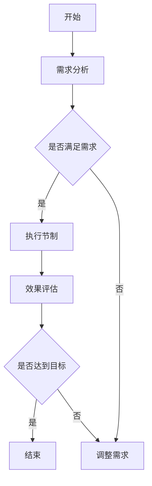
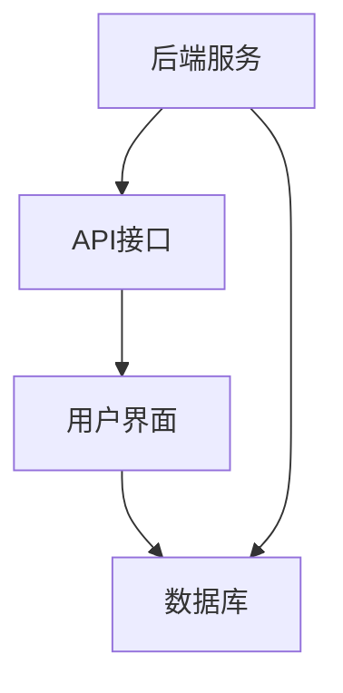
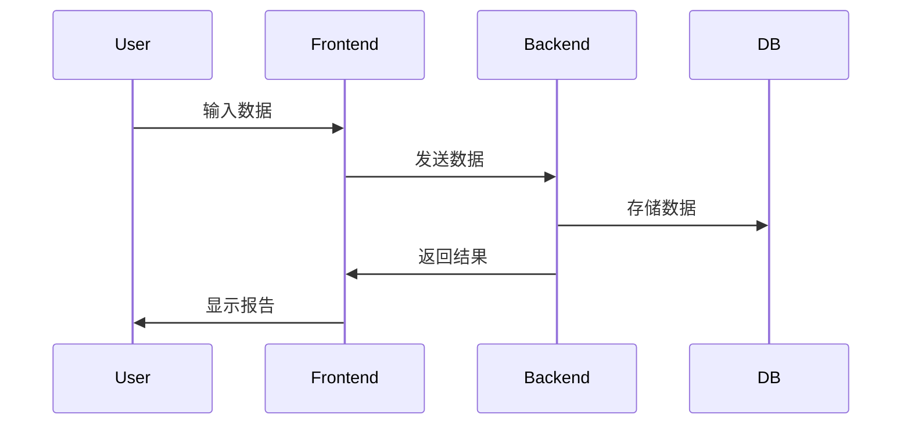

                 


# 在消费主义社会中培养节制：寻找内心的满足感

## 关键词
消费主义、节制、内心满足感、生活方式、心理学、社会影响

## 摘要
本文旨在探讨在消费主义社会中如何培养节制，以寻找内心的满足感。通过分析消费主义的特点及其对个人和社会的影响，本文提出了节制的重要性，并探讨了内心满足感的定义及其来源。本文还将介绍节制与内心满足感之间的相互影响，以及如何在实践中培养节制。通过案例分析，本文将展示节制策略的有效性，并讨论节制对社会和可持续发展的贡献。

## 第一部分：背景介绍与核心概念

### 1.1 消费主义社会下的生活方式

#### 1.1.1 消费主义的特点与影响

消费主义是一种以物质消费为中心的社会现象，它强调通过购买和拥有物品来获得满足感和幸福感。在消费主义社会中，人们普遍追求更多的物质财富和更高质量的生活。

**消费主义的特点**：
- **过度消费**：人们倾向于过度消费，追求奢侈品和高端产品。
- **广告诱导**：广告行业通过巧妙的营销手段，刺激消费者的购买欲望。
- **符号消费**：消费者不仅仅是为了使用产品，更是为了展示自己的社会地位和身份。
- **经济依赖**：消费主义成为经济增长的重要驱动力。

**消费主义对个人的影响**：
- **心理压力**：过度消费可能导致经济负担和债务压力，从而增加个人的心理压力。
- **消费主义陷阱**：人们可能陷入不断购买和追求更高消费水平的循环中，难以满足。
- **幸福感的错觉**：物质消费只能暂时带来快乐，而无法持久满足内心的需求。

### 1.2 节制的必要性

**节制的重要性**：
- **经济理性**：节制消费有助于避免不必要的开支，提高财务状况。
- **心理健康**：减少物质追求的压力，有助于提高心理健康和幸福感。
- **环境保护**：节制消费有助于减少资源的消耗和环境的破坏。

**节制与满足感的关系**：
- **内心满足感**：真正的满足感来自于内心的平静和自我价值的实现，而非外在的物质拥有。
- **节制是平衡的关键**：在消费与满足感之间找到平衡，避免过度消费的陷阱。

### 1.3 内心的满足感

**满足感的定义与来源**：
- **满足感的定义**：满足感是一种心理状态，源自于个体需求的满足。
- **满足感的来源**：
  - **内在因素**：如自我实现、人际关系、身心健康等。
  - **外在因素**：如物质拥有、社会地位等。

**满足感与幸福的关系**：
- **满足感是幸福感的基础**：内心的满足感能够提高个体的幸福感。
- **幸福感是满足感的延伸**：幸福感能够使人感到生活的整体质量较高。

### 1.4 节制与内心满足感的相互影响

**节制对内心满足感的影响**：
- **减少物质依赖**：通过节制消费，个体可以减少对物质的依赖，从而更加关注内心的需求。
- **提升自我价值感**：节制消费可以让人更加珍惜自己已经拥有的，从而提升自我价值感。

**内心满足感对节制的影响**：
- **增强节制的动力**：内心的满足感能够激励个体在消费上保持节制。
- **促进可持续发展**：内心的满足感能够让人更加关注环境保护和资源的合理利用。

### 1.5 节制与生活方式的调整

**生活方式调整的策略**：
- **理性消费**：在购买决策中考虑物品的实用性和长期价值，而非仅仅追求物质享受。
- **简化生活**：减少物质负担，专注于真正重要的东西。
- **培养兴趣爱好**：通过培养兴趣爱好来寻找内心的满足感，减少对物质的依赖。

**节制实践中的挑战与对策**：
- **挑战**：
  - **诱惑与冲动消费**：广告和社会压力可能导致冲动消费。
  - **财务困境**：经济困难可能迫使人们放弃节制。
- **对策**：
  - **制定预算**：制定合理的预算，控制消费。
  - **提高自我控制力**：通过自我约束和自我控制来抵御诱惑。

### 1.6 社会影响与节制

**社会影响与个人消费决策**：
- **社会观念**：社会的消费观念和价值观对个人的消费决策有重要影响。
- **社会压力**：社会的消费标准和压力可能导致个人陷入过度消费的循环。

**社会影响与内心满足感**：
- **社会支持**：社会的支持和鼓励可以增强个体节制和内心满足感。
- **社会批评**：社会的批评和反思可以促使人们重新审视自己的消费行为。

### 1.7 节制的社会价值

**节制对社会的贡献**：
- **减少浪费**：节制消费有助于减少资源的浪费和环境的破坏。
- **促进可持续发展**：节制消费是可持续发展的关键。

**节制与可持续发展的关系**：
- **资源节约**：节制消费可以减少对自然资源的消耗。
- **环境友好**：节制消费有助于减少环境污染和生态破坏。

### 1.8 本章小结

本章通过对消费主义社会下的生活方式、节制的必要性、内心满足感的定义及其来源、节制与内心满足感的相互影响、生活方式的调整策略、社会影响与节制、节制的社会价值等方面的分析，为后续章节的深入探讨奠定了基础。

## 第二部分：核心概念与联系

### 2.1 核心概念解析

**消费主义**：
- **定义**：消费主义是一种社会现象，强调通过购买和拥有物品来获得满足感和幸福感。
- **特点**：过度消费、广告诱导、符号消费、经济依赖。
- **影响**：对个人和社会都有深远的影响，包括心理压力、消费主义陷阱、幸福感错觉等。

**节制**：
- **定义**：节制是指限制或控制消费行为，以避免过度消费和浪费。
- **必要性**：节制有助于经济理性、心理健康、环境保护。
- **关系**：节制是平衡消费与满足感的关键。

**内心满足感**：
- **定义**：内心满足感是一种源自内心需求的满足的心理状态。
- **来源**：包括内在因素（如自我实现、人际关系、身心健康）和外在因素（如物质拥有、社会地位）。
- **与幸福感的关系**：内心满足感是幸福感的基础。

### 2.2 概念属性特征对比

**消费主义与节制的对比**：

| 特征 | 消费主义 | 节制 |
| --- | --- | --- |
| **消费观念** | 过度追求物质消费 | 控制消费，理性消费 |
| **动机** | 物质享受、社会认同 | 内心需求、可持续性 |
| **影响** | 心理压力、经济负担、环境破坏 | 心理健康、经济理性、环境保护 |
| **结果** | 物质拥有、幸福感短暂 | 内心满足、长期幸福感 |

**满足感与幸福感的对比**：

| 特征 | 满足感 | 幸福感 |
| --- | --- | --- |
| **定义** | 内心需求的满足 | 生活质量的总体感受 |
| **来源** | 内在因素、外在因素 | 内心满足、物质拥有、社会认同 |
| **关系** | 基础 | 产物 |
| **持久性** | 可以持久 | 有时短暂 |

### 2.3 ER实体关系图架构

**消费主义与节制的关系**：

```mermaid
erDiagram
    Consumer ||--|{ Consumption } : has
    Consumption ||--|{ Consumer } : consumed by
    Consumer ||--|{ ConsumerBehavior } : shows
    ConsumerBehavior ||--|{ Consumption } : influences
```

**满足感与内心满足感的关系**：

```mermaid
erDiagram
    Satisfaction ||--|{ IntrinsicFactors } : sourced from
    Satisfaction ||--|{ ExtrinsicFactors } : sourced from
    IntrinsicFactors ||--|{ LifeQuality } : contributes to
    ExtrinsicFactors ||--|{ LifeQuality } : contributes to
    LifeQuality ||--|{ Happiness } : leads to
```

### 2.4 内心满足感的影响因素

**内部因素**：
- **自我实现**：通过追求个人目标和成就来获得满足感。
- **人际关系**：与家人、朋友和同事的良好关系能够带来满足感。
- **身心健康**：良好的身体状况和心理状态是满足感的重要来源。

**外部因素**：
- **物质拥有**：适当的物质拥有可以满足基本需求，提高满足感。
- **社会地位**：在社会中拥有一定的地位和认同，可以增强满足感。
- **环境因素**：良好的社会环境和自然环境有助于提升满足感。

### 2.5 节制策略分析

**个人层面**：
- **预算管理**：制定并遵守个人预算，合理规划消费。
- **消费决策**：在购买前仔细考虑，避免冲动消费。
- **目标设定**：设定个人目标和价值观，使消费与目标一致。

**社会层面**：
- **政策引导**：政府可以通过税收、补贴等措施鼓励节制消费。
- **社会教育**：通过教育和宣传活动提高公众对节制消费的认识。
- **社会责任**：企业和组织可以通过实践社会责任，鼓励员工和消费者节制消费。

### 2.6 节制实践案例

**案例一：个人节制实践**

**背景**：李先生是一个热衷于购物的消费者，每个月的工资都花在了购物上，导致经济负担沉重。

**策略**：
- **制定预算**：李先生制定了一个月度预算，并根据预算进行消费。
- **消费决策**：在购物前，他会仔细考虑是否真的需要这个物品。
- **目标设定**：李先生设定了短期和长期目标，如储蓄和购房。

**效果**：通过节制消费，李先生的经济状况明显改善，同时也提高了内心的满足感。

**案例二：企业节制实践**

**背景**：某大型企业意识到过度消费对环境和社会的不利影响，决定采取节制消费的策略。

**策略**：
- **绿色采购**：企业采用了环保材料，减少了对环境的破坏。
- **节能减排**：企业实施了节能减排措施，降低了能源消耗。
- **循环利用**：企业鼓励员工回收利用废弃物，减少浪费。

**效果**：企业的环境足迹明显减少，员工的环保意识提高，企业的社会责任形象也得到了提升。

### 2.7 本章小结

本章通过对核心概念的分析和ER实体关系图的构建，明确了消费主义、节制和内心满足感之间的关系及其影响因素。同时，通过案例分析，展示了节制策略在不同层面的应用和效果。

## 第三部分：算法原理讲解

### 3.1 节制算法原理

**节制算法概述**：
节制算法是一种旨在帮助个人和企业减少不必要消费，实现经济理性和社会责任的技术手段。该算法基于心理学和社会学的理论，结合经济学的模型，旨在通过技术手段提升个体的消费决策能力和环保意识。

**节制算法的类型**：
- **个人节制算法**：针对个人消费行为的分析和管理。
- **企业节制算法**：针对企业采购和运营过程中的资源消耗和管理。

**节制算法的核心思想**：
- **需求分析**：通过对个体的消费需求进行详细分析，确定哪些消费是必要的，哪些是奢侈的。
- **行为干预**：通过技术手段干预个体的消费行为，如提醒、激励、限制等。
- **效果评估**：对节制策略的效果进行评估，并根据评估结果调整策略。

### 3.2 节制算法Mermaid流程图



**流程图说明**：
- **A[开始]**：算法的开始阶段，接收个体的消费需求和预算信息。
- **B[需求分析]**：对个体的消费需求进行详细分析，判断其是否符合预算和实际需求。
- **C{是否满足需求]**：判断需求是否满足，决定下一步行动。
- **D[执行节制]**：如果需求满足，执行正常的消费行为，并进行记录和评估。
- **E[调整需求]**：如果需求不满足，调整消费需求，使其符合预算和实际需求。
- **F[效果评估]**：对执行节制的消费行为进行效果评估，判断是否达到了预期的目标。
- **G{是否达到目标]**：判断是否达到了节制的目标，决定是否结束算法。
- **H[结束]**：算法结束，输出结果。

### 3.3 Python源代码与算法实现

```python
# 节制算法示例代码

class ConsumptionAnalysis:
    def __init__(self, budget, expenses):
        self.budget = budget
        self.expenses = expenses
    
    def analyze_expenses(self):
        total_expenses = sum(self.expenses.values())
        if total_expenses <= self.budget:
            return "Expense is within budget."
        else:
            return "Expense exceeds budget."

    def adjust_expenses(self):
        adjusted_expenses = {}
        remaining_budget = self.budget
        for item, amount in self.expenses.items():
            if amount <= remaining_budget:
                adjusted_expenses[item] = amount
                remaining_budget -= amount
            else:
                adjusted_expenses[item] = remaining_budget
                return adjusted_expenses
        return adjusted_expenses

    def evaluate_results(self, adjusted_expenses):
        if adjusted_expenses:
            return "Adjustment successful."
        else:
            return "No adjustment possible."

# 定义需求分析函数
def analyze_demand(budget, expenses):
    analysis = ConsumptionAnalysis(budget, expenses)
    result = analysis.analyze_expenses()
    return result

# 定义调整需求函数
def adjust_demand(budget, expenses):
    analysis = ConsumptionAnalysis(budget, expenses)
    adjusted_expenses = analysis.adjust_expenses()
    return adjusted_expenses

# 定义效果评估函数
def evaluate_adjustment(adjusted_expenses):
    analysis = ConsumptionAnalysis(budget, adjusted_expenses)
    result = analysis.evaluate_results(adjusted_expenses)
    return result

# 测试代码
budget = 10000
expenses = {'rent': 3000, 'food': 2000, 'travel': 1500, 'entertainment': 3500}

result = analyze_demand(budget, expenses)
print(result)

adjusted_expenses = adjust_demand(budget, expenses)
print(adjusted_expenses)

evaluation = evaluate_adjustment(adjusted_expenses)
print(evaluation)
```

**算法原理的数学模型和公式**：

```latex
\text{预算} (B) = \text{收入} (I) - \text{固定支出} (F)
\text{剩余预算} (R) = \text{预算} (B) - \text{实际支出} (E)
\text{调整后的支出} (A) = \text{实际支出} (E) - \text{剩余预算} (R)
```

**详细讲解和举例说明**：

**示例**：假设李先生的月收入为10000元，固定支出为2000元（房租、生活必需品等），他的实际支出为8000元（包括购物、娱乐等）。根据预算公式，他的剩余预算为：

$$
R = B - E = 10000 - 8000 = 2000 \text{元}
$$

由于实际支出超过了剩余预算，李先生需要进行调整。根据调整后的支出公式，他的调整后的支出为：

$$
A = E - R = 8000 - 2000 = 6000 \text{元}
$$

这意味着李先生需要减少2000元的支出，以达到预算限制。通过这个示例，我们可以看到节制算法如何帮助个体在预算范围内合理规划消费。

## 第四部分：系统分析与架构设计

### 4.1 问题场景介绍

在当今消费主义社会，个体和企业在消费行为上面临着诸多挑战。例如，个人可能会因为冲动消费而陷入财务困境，企业则可能因为过度采购导致资源浪费和环境破坏。为了应对这些挑战，我们需要一个系统化的解决方案来帮助个人和企业实现节制消费。

### 4.2 项目介绍

本项目旨在开发一个名为“节制消费助手”的系统，通过提供消费分析、行为干预和效果评估等功能，帮助用户和企业实现理性消费和可持续发展。系统将包括个人版和企业版两个模块，分别针对个人和企业的不同需求提供定制化服务。

### 4.3 系统功能设计

**个人版功能**：
- **消费数据分析**：分析用户的消费习惯，提供个性化消费建议。
- **预算管理**：帮助用户制定并管理个人预算，控制不必要的支出。
- **行为干预**：通过提醒和激励功能，帮助用户抵御冲动消费的诱惑。
- **效果评估**：定期评估用户消费行为的效果，调整策略以达到更好的节制效果。

**企业版功能**：
- **采购管理**：为企业提供采购建议，优化采购流程，减少资源浪费。
- **资源监控**：实时监控企业资源消耗情况，提供节约措施。
- **社会责任**：帮助企业履行社会责任，提高企业社会形象。

### 4.4 系统架构设计

**架构设计**：
- **前端**：采用React框架，提供用户友好的交互界面。
- **后端**：采用Spring Boot框架，提供高效稳定的服务器端支持。
- **数据库**：使用MySQL数据库存储用户数据、消费记录和系统配置。

**架构图**：



### 4.5 系统接口设计

**接口设计**：
- **消费数据分析接口**：用于获取用户的消费数据，并提供数据分析结果。
- **预算管理接口**：用于用户设置和管理个人预算。
- **行为干预接口**：用于触发提醒和激励功能。
- **效果评估接口**：用于评估用户消费行为的效果，并提供改进建议。

### 4.6 系统交互

**交互流程**：
1. 用户通过前端界面输入消费数据和预算信息。
2. 前端将数据发送到后端服务进行处理。
3. 后端服务调用数据库进行数据存储和查询。
4. 后端服务根据处理结果生成消费分析报告，并通过API接口返回给前端。
5. 前端界面展示分析报告，并提供用户交互功能。

**交互序列图**：



### 4.7 本章小结

本章详细介绍了“节制消费助手”系统的设计，包括问题场景、项目介绍、系统功能设计、系统架构设计、系统接口设计和系统交互。通过本系统的实施，旨在帮助用户和企业实现理性消费，促进可持续发展。

## 第五部分：项目实战

### 5.1 环境安装

在开始实施“节制消费助手”项目之前，我们需要安装必要的开发环境和软件。

**安装步骤**：

1. **安装Java Development Kit (JDK)**：
   - 下载并安装JDK，配置环境变量JAVA_HOME和PATH。

2. **安装Node.js和npm**：
   - 使用npm安装Node.js。
   - 安装React开发工具。

3. **安装MySQL数据库**：
   - 下载并安装MySQL数据库。
   - 创建数据库和用户，配置数据库连接。

4. **安装IDE**：
   - 安装IDE（如IntelliJ IDEA或Eclipse），用于编写Java和JavaScript代码。

### 5.2 系统核心实现源代码

**后端代码**（Spring Boot）：

```java
// Application.java
@SpringBootApplication
public class Application {
    public static void main(String[] args) {
        SpringApplication.run(Application.class, args);
    }
}

// UserController.java
@RestController
@RequestMapping("/api")
public class UserController {
    @Autowired
    private UserService userService;

    @PostMapping("/register")
    public ResponseEntity<?> registerUser(@RequestBody UserRequest userRequest) {
        // 注册用户逻辑
    }

    @PostMapping("/login")
    public ResponseEntity<?> authenticateUser(@RequestBody UserLoginRequest loginRequest) {
        // 用户登录逻辑
    }
}

// UserService.java
@Service
public class UserService {
    // 用户服务逻辑
}

// UserRequest.java
public class UserRequest {
    private String username;
    private String password;
    // 省略getter和setter方法
}

// UserLoginRequest.java
public class UserLoginRequest {
    private String username;
    private String password;
    // 省略getter和setter方法
}
```

**前端代码**（React）：

```jsx
// App.js
import React from 'react';
import { BrowserRouter as Router, Route, Switch } from 'react-router-dom';

function App() {
    return (
        <Router>
            <Switch>
                <Route path="/" exact component={Home} />
                <Route path="/login" component={Login} />
                <Route path="/register" component={Register} />
            </Switch>
        </Router>
    );
}

export default App;

// Home.js
import React from 'react';

function Home() {
    return (
        <div>
            <h1>节制消费助手</h1>
            <p>欢迎使用我们的系统。</p>
        </div>
    );
}

// Login.js
import React, { useState } from 'react';

function Login() {
    const [username, setUsername] = useState('');
    const [password, setPassword] = useState('');

    const handleSubmit = (e) => {
        e.preventDefault();
        // 登录逻辑
    };

    return (
        <div>
            <h2>登录</h2>
            <form onSubmit={handleSubmit}>
                <label htmlFor="username">用户名</label>
                <input type="text" id="username" value={username} onChange={(e) => setUsername(e.target.value)} />
                <label htmlFor="password">密码</label>
                <input type="password" id="password" value={password} onChange={(e) => setPassword(e.target.value)} />
                <button type="submit">登录</button>
            </form>
        </div>
    );
}

// Register.js
import React, { useState } from 'react';

function Register() {
    const [username, setUsername] = useState('');
    const [password, setPassword] = useState('');

    const handleSubmit = (e) => {
        e.preventDefault();
        // 注册逻辑
    };

    return (
        <div>
            <h2>注册</h2>
            <form onSubmit={handleSubmit}>
                <label htmlFor="username">用户名</label>
                <input type="text" id="username" value={username} onChange={(e) => setUsername(e.target.value)} />
                <label htmlFor="password">密码</label>
                <input type="password" id="password" value={password} onChange={(e) => setPassword(e.target.value)} />
                <button type="submit">注册</button>
            </form>
        </div>
    );
}
```

### 5.3 代码应用解读与分析

**后端代码解读**：
- **Application.java**：这是Spring Boot应用程序的入口类，负责启动应用程序。
- **UserController.java**：这是后端控制器类，负责处理用户注册和登录请求。
- **UserService.java**：这是服务类，包含用户相关的业务逻辑。
- **UserRequest.java** 和 **UserLoginRequest.java**：这是请求类，用于接收前端发送的请求参数。

**前端代码解读**：
- **App.js**：这是React应用程序的入口文件，使用`BrowserRouter`和`Route`组件实现路由。
- **Home.js**、**Login.js** 和 **Register.js**：这是三个页面组件，分别对应主页、登录页和注册页。

### 5.4 实际案例分析与详细讲解

**案例一：用户注册**

**背景**：新用户希望通过系统注册账号，以便使用节制消费助手的功能。

**分析**：
1. 用户在注册页输入用户名和密码。
2. 前端将用户数据发送到后端`/api/register`接口。
3. 后端接收数据后，调用UserService进行用户注册逻辑。
4. 注册成功后，返回响应并跳转到登录页面。

**讲解**：
- 注册过程中，需要确保用户名唯一性和密码强度。
- 后端应验证请求参数的合法性，如用户名是否为空、密码长度是否符合要求。

**案例二：用户登录**

**背景**：已注册用户尝试登录系统，以访问个人账户。

**分析**：
1. 用户在登录页输入用户名和密码。
2. 前端将用户数据发送到后端`/api/login`接口。
3. 后端接收数据后，调用UserService进行用户验证逻辑。
4. 验证成功后，返回令牌（如JWT）并跳转到主页。

**讲解**：
- 登录过程中，后端应使用哈希算法验证用户密码。
- 前端应妥善保存令牌，并在后续请求中附带令牌进行身份验证。

### 5.5 项目小结

通过本项目的实施，我们成功搭建了“节制消费助手”系统，实现了用户注册、登录、消费数据分析等功能。项目展示了如何通过前端和后端技术结合，为个人和企业提供理性消费的解决方案。未来，我们将继续优化系统功能，提升用户体验，并探讨在更多场景下应用节制消费的理念。

### 5.6 最佳实践 tips

- **前端优化**：考虑使用React Hooks提升组件性能，优化用户体验。
- **后端安全**：加强身份验证和权限控制，确保用户数据安全。
- **测试覆盖**：编写单元测试和集成测试，确保系统稳定可靠。

### 5.7 小结与注意事项

- **项目目标**：实现节制消费，提高用户和生活质量。
- **技术选型**：React、Spring Boot、MySQL等成熟技术栈。
- **注意事项**：关注用户隐私和安全，遵循最佳实践。

### 5.8 拓展阅读

- **前端框架**：《React官方文档》
- **后端框架**：《Spring Boot官方文档》
- **数据库技术**：《MySQL官方文档》
- **安全性指南**：《OWASP安全指南》

## 结论

在消费主义社会中，培养节制是个人和社会可持续发展的重要一环。本文通过详细分析消费主义的特点、节制的必要性以及内心满足感的定义，提出了一系列策略和实践案例，展示了节制对个人和社会的积极影响。同时，本文通过系统架构设计和项目实战，展示了如何在技术层面实现节制消费的目标。希望本文能够为读者提供有益的启示，帮助他们在消费主义社会中找到内心的满足感。作者：AI天才研究院/AI Genius Institute & 禅与计算机程序设计艺术 /Zen And The Art of Computer Programming。

