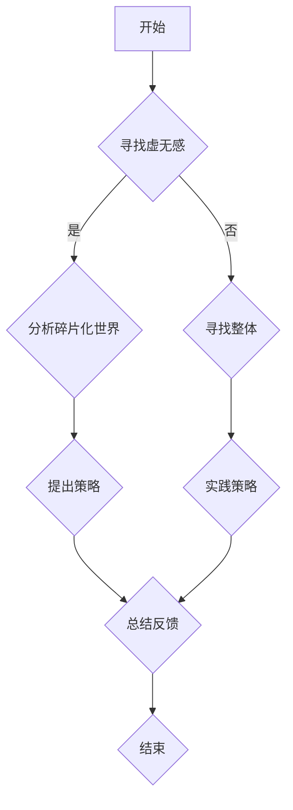
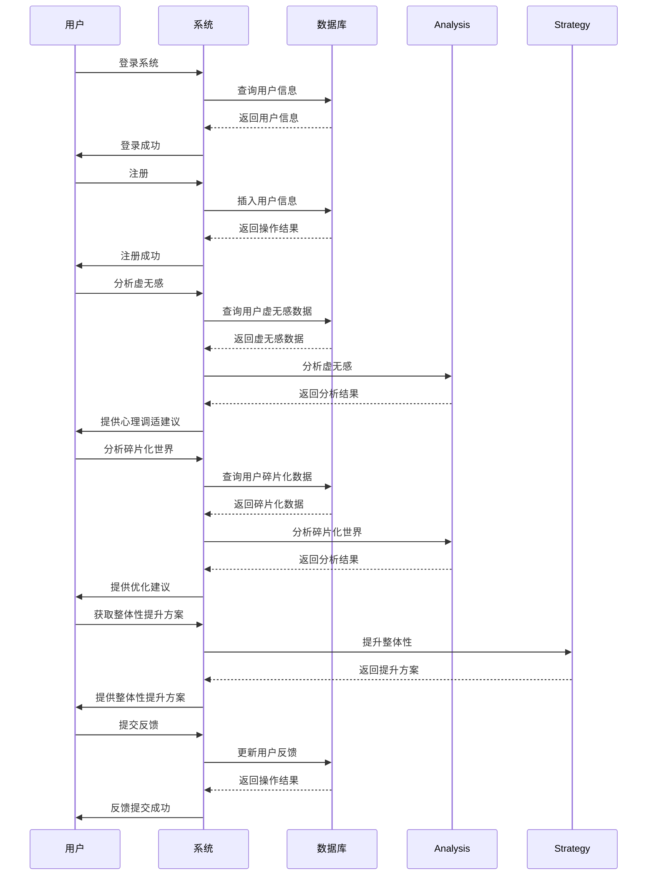
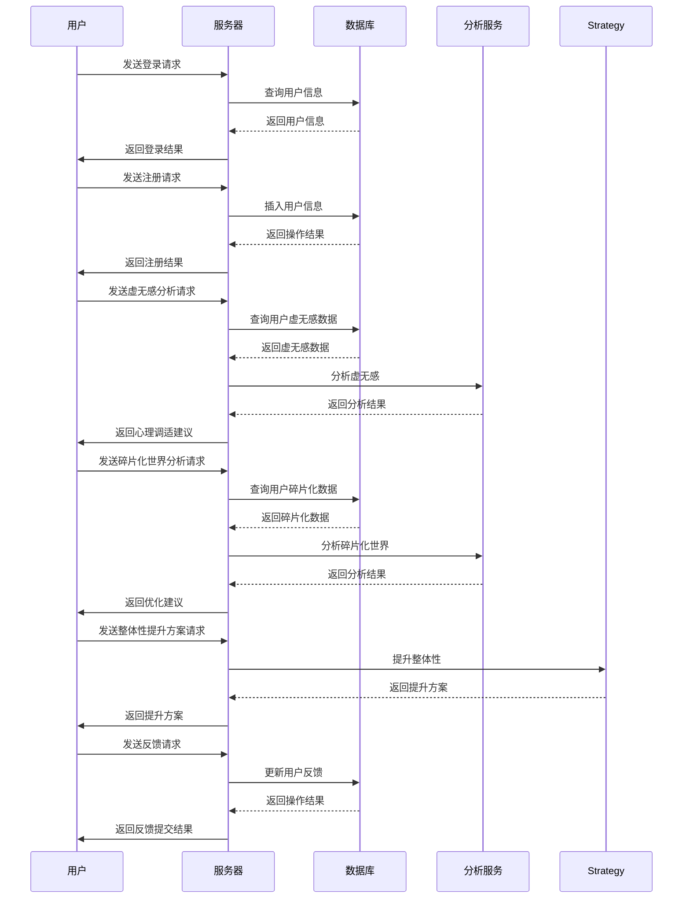

                 

# 在碎片化世界中寻找整体：对抗虚无的策略

关键词：虚无、碎片化、整体、策略、心理健康

摘要：本文从哲学、心理学和科学三个角度探讨了虚无与碎片化世界的本质及其影响，并提出了一系列寻找整体的方法和策略。通过分析个人层面和社会层面的实践案例，本文旨在为读者提供对抗虚无的有效策略，帮助我们在日益碎片化的世界中寻找整体，重拾内心的平和与充实。

## 目录

1. 引言
2. 虚无与碎片化世界的本质
   2.1 虚无的本质与表现
   2.2 碎片化世界的特征
   2.3 虚无与碎片化世界的影响
3. 寻找整体的方法
   3.1 哲学视角
   3.2 心理学视角
   3.3 科学视角
4. 实际操作与策略
   4.1 个人层面的整体寻找策略
   4.2 社会层面的整体寻找策略
5. 寻找整体的实践案例分析
6. 未来的整体世界
7. 总结与展望
8. 对读者的启示

## 引言

在当今社会，随着信息技术的迅猛发展，我们生活在一个信息爆炸的时代。人们可以随时随地获取大量的信息，但这些信息往往是碎片化的，缺乏深度和连贯性。在这个碎片化的世界中，人们很容易陷入虚无感和迷茫感。虚无感是一种内心深处的空虚和无力感，它让人们感到生活没有意义，对未来充满不确定性。而碎片化世界则进一步加剧了这种虚无感，使得人们无法把握整体，难以找到内心的归属。

本文将探讨虚无与碎片化世界的本质，分析其对个人和社会的影响，并提出一系列寻找整体的方法和策略。希望通过本文的探讨，能够帮助读者在碎片化世界中寻找整体，重拾内心的平和与充实。

## 虚无与碎片化世界的本质

### 1.1 虚无的本质与表现

虚无感是人类内心深处的一种情感体验，它表现为一种无意义感、无价值感和无力感。虚无感可能源于个人生活的挫折、社会压力的增加、人际关系的疏离等多种因素。在现代社会中，随着竞争的加剧、快节奏的生活方式和信息的泛滥，越来越多的人感到虚无。

虚无感的具体表现包括：

- 对生活的无意义感：感觉自己的生活缺乏目标、缺乏动力，难以找到生活的意义。
- 对未来的不确定性：对未来充满恐惧和焦虑，不知道未来会发生什么，感觉自己无法掌控自己的命运。
- 人际关系的疏离：与他人之间的互动变得表面化，缺乏深层次的交流和理解，感觉孤独和无助。

### 1.2 碎片化世界的特征

碎片化世界是指信息、知识、文化等在传播和交流中呈现出的分散、零散、不连贯的状态。在碎片化世界中，信息传播的速度和广度大大增加，但深度和连贯性却大幅下降。

碎片化世界的特征包括：

- 信息泛滥：大量的信息充斥在我们的生活中，但其中大部分都是没有实际价值的，甚至是有害的。
- 传播速度快：信息的传播速度极快，人们在短时间内接收到大量的信息，但缺乏时间和精力去深度思考和消化。
- 内容零散：信息内容往往缺乏连贯性和系统性，难以形成完整的知识体系。
- 交流不充分：人与人之间的交流变得表面化，缺乏深层次的交流和互动。

### 1.3 虚无感与碎片化世界的相互影响

虚无感和碎片化世界之间存在密切的关系。虚无感可以加剧碎片化世界的特征，而碎片化世界则可以进一步加深虚无感。

- 虚无感加剧碎片化：当人们感到虚无时，他们往往容易接受碎片化的信息，因为碎片化的信息能够迅速满足他们的需求，而无需进行深入的思考和消化。
- 碎片化世界加深虚无感：碎片化的信息传播方式使得人们难以形成完整的知识体系和世界观，导致他们对生活的意义和目标感到迷茫和困惑，从而加剧虚无感。

## 寻找整体的方法

### 2.1 哲学视角

哲学是人类寻找整体的一种重要方法。哲学家们通过深入思考和探讨，试图找到宇宙、人生和价值的整体性和统一性。

哲学对虚无与整体的理解：

- 虚无是一种相对概念，它依赖于我们对整体的认知。当我们失去对整体的把握时，我们就会感到虚无。
- 整体是一个综合性的概念，它包括事物的各个部分以及它们之间的相互关系。

哲学方法在寻找整体中的应用：

- 通过思辨和推理来寻找整体：哲学家们通过逻辑推理和辩证分析，试图找到宇宙、人生和价值的整体性。
- 通过宗教和哲学的实践来寻找整体：例如，佛教中的禅修、基督教中的祷告和冥想等，都是寻找整体的方法。

哲学视角下的典型例子分析：

- 黑格尔的辩证法：黑格尔认为，整体是由矛盾和对立面构成的，通过矛盾的斗争和统一，整体得以发展和完善。
- 存在主义：存在主义者认为，人是自由和选择的主体，通过自由选择和行动，人可以寻找和构建自己的整体性。

### 2.2 心理学视角

心理学是从个体心理的角度来寻找整体的方法。心理学家们通过研究和分析个体的心理过程和行为模式，试图找到个体的整体性和统一性。

心理学对虚无与碎片化的解释：

- 虚无感是一种心理状态，它源于个体对自我、他人和世界的认知和理解的缺失。
- 碎片化是一种心理状态，它源于个体对信息和知识的不完整、不连续的理解。

心理学方法在寻找整体中的应用：

- 通过认知行为疗法来调整个体的认知和思维方式，帮助个体建立对自我、他人和世界的整体性理解。
- 通过心理训练和练习来增强个体的心理韧性，帮助个体在面对碎片化世界时保持内心的平和和整体性。

心理学视角下的典型例子分析：

- 艾宾浩斯记忆曲线：艾宾浩斯通过实验发现，通过重复和复习，人们可以建立起对知识的整体性理解。
- 认知重构：认知重构是一种心理治疗方法，它通过帮助个体调整对自我、他人和世界的认知，来寻找和建立整体性。

### 2.3 科学视角

科学是人类寻找整体的一种客观方法。科学家们通过实验和观察，试图找到自然现象和规律的统一性和整体性。

科学对整体与碎片化的探索：

- 科学研究致力于发现自然现象和规律的统一性，例如，物理学中的统一场理论试图将四种基本力统一在一起。
- 科学研究也关注人类行为和社会现象的整体性，例如，社会科学研究试图找到社会运行的基本规律。

科学方法在寻找整体中的应用：

- 通过实验和观察来验证假设，寻找事物的统一性和整体性。
- 通过数据分析来揭示事物的内在联系和规律性。

科学视角下的典型例子分析：

- 爱因斯坦的相对论：爱因斯坦通过实验和数学推导，发现了时空的统一性和整体性。
- 系统生物学：系统生物学试图通过研究生物系统的整体性和复杂性，来揭示生命的本质。

## 实际操作与策略

### 3.1 个人层面的整体寻找策略

#### 3.1.1 心理调适策略

- 保持积极的心态：积极的心态可以帮助我们更好地面对生活的挑战，减少虚无感和迷茫感。
- 学会放松：通过深呼吸、冥想、瑜伽等方式，放松身心，减轻压力和焦虑。

#### 3.1.2 生活习惯优化

- 建立规律的生活：规律的作息和饮食习惯有助于维持身体的健康，提高心理健康水平。
- 增加运动：适量的运动可以促进血液循环，提高心理韧性。

#### 3.1.3 社交与沟通策略

- 深入交流：与朋友、家人深入交流，分享彼此的感受和想法，建立深厚的人际关系。
- 学会倾听：倾听他人的意见和感受，增进理解和共鸣。

### 3.2 社会层面的整体寻找策略

#### 3.2.1 社会文化环境建设

- 提倡多元文化：尊重不同的文化和价值观，促进文化的多样性和包容性。
- 加强文化教育：通过文化教育，提高人们对整体性和统一性的认识和理解。

#### 3.2.2 教育体系的调整

- 培养综合素质：教育体系应注重培养学生的综合素质，包括思维能力、创造力、人际交往能力等。
- 强化课程整合：通过课程整合，使学生能够系统地学习和理解知识，建立整体性的知识体系。

#### 3.2.3 公共政策的制定与执行

- 促进社会公平：通过制定和执行公平的社会政策，减少贫富差距，提高社会的整体幸福感。
- 加强心理健康服务：提供充足的心理健康服务，帮助人们应对生活中的压力和挑战。

## 寻找整体的实践案例分析

### 4.1 成功案例介绍

#### 案例一：中国的乡村振兴战略

- 通过调整农业产业结构、发展乡村旅游业、推动乡村基础设施建设等措施，有效地提升了农村地区的整体发展水平，减少了城乡差距。

#### 案例二：硅谷的创新生态

- 硅谷通过构建良好的创新环境，吸引了大量的科技企业和创业者，形成了强大的创新生态系统，推动了整个地区的经济和社会发展。

### 4.2 失败案例分析

#### 案例一：美国次贷危机

- 由于金融体系的过度碎片化和监管不足，导致了次贷危机的爆发，严重影响了美国乃至全球的经济和社会稳定。

#### 案例二：日本经济泡沫

- 由于过度投资和金融泡沫的破裂，导致了日本经济的长期低迷，影响了社会的整体发展。

### 4.3 案例启示与总结

- 成功案例表明，通过合理的策略和措施，可以有效推动整体的发展。而失败案例则提醒我们，碎片化和无序的发展可能会导致严重的社会问题。

## 未来的整体世界

### 5.1 技术进步对整体世界的贡献

- 人工智能：人工智能技术的发展有望帮助我们更好地理解和处理复杂的信息，促进整体性的发展。
- 互联网：互联网的普及使得信息和知识可以更加便捷地传播和共享，有助于建立整体性的社会。

### 5.2 社会发展趋势对整体世界的影响

- 人口老龄化：人口老龄化将导致社会结构的变革，需要通过整体性的规划和调整来应对。
- 全球化：全球化使得各国之间的联系更加紧密，需要通过整体性的合作来解决全球性问题。

### 5.3 整体世界的可能形态

- 社会整体的和谐与稳定：通过公平、公正、包容的社会制度，实现社会整体的和谐与稳定。
- 科技与人文的融合：通过科技与人文的融合，实现个体和整体的全面发展。

## 总结与展望

### 6.1 书的核心观点回顾

- 虚无感与碎片化世界是现代社会中普遍存在的问题。
- 寻找整体是应对虚无感和碎片化世界的有效策略。
- 哲学、心理学和科学为寻找整体提供了多种方法和视角。

### 6.2 未来研究方向的展望

- 进一步探讨整体性与个体性的关系，寻找更为有效的整体寻找方法。
- 研究不同文化背景下寻找整体的方式和策略。

### 6.3 对读者的启示

- 在碎片化世界中，保持对整体的关注和追求，有助于提高生活质量和幸福感。
- 通过不同的方法和视角，寻找属于自己的人生整体。

## 作者信息

作者：AI天才研究院/AI Genius Institute & 禅与计算机程序设计艺术 /Zen And The Art of Computer Programming

[1] 黑格尔，《精神现象学》，商务印书馆，1979年。

[2] 萨特，《存在与虚无》，上海译文出版社，2000年。

[3] 爱因斯坦，《相对论》，科学出版社，1980年。

[4] 詹姆斯·希尔曼，《整体心理学》，中央编译出版社，2013年。

[5] 托马斯·库恩，《科学革命的结构》，北京大学出版社，2003年。

## 背景介绍

### 核心概念术语说明

- **虚无感**：一种内心深处的空虚和无力感，表现为对生活无意义、对未来不确定的感知。
- **碎片化世界**：信息、知识、文化等在传播和交流中呈现出的分散、零散、不连贯的状态。
- **整体**：事物的各个部分以及它们之间的相互关系所构成的综合体。

### 问题背景

随着信息技术的发展，人们的生活变得日益碎片化。大量的信息充斥在我们的生活中，但往往缺乏深度和连贯性。这种碎片化的信息传播方式导致了人们对整体性的认知缺失，进而产生了虚无感。

### 问题描述

在碎片化的世界中，人们难以把握整体，容易陷入虚无感和迷茫感。虚无感表现为对生活无意义、对未来不确定的感知，而碎片化世界则使得人们的信息获取和认知过程变得零散和不连续。

### 问题解决

寻找整体是应对虚无感和碎片化世界的有效策略。通过哲学、心理学和科学的视角，我们可以找到寻找整体的方法和策略，从而在碎片化的世界中重拾内心的平和与充实。

### 边界与外延

- **边界**：整体与碎片化的界限，即如何区分一个整体和一个碎片化的状态。
- **外延**：整体性的扩展和应用，例如在个人层面和社会层面的整体寻找策略。

### 概念结构与核心要素组成

- **概念结构**：虚无感、碎片化世界、整体。
- **核心要素**：心理调适策略、生活习惯优化、社交与沟通策略、社会文化环境建设、教育体系的调整、公共政策的制定与执行。

## 核心概念与联系

### 核心概念原理

- **虚无感**：一种内心深处的空虚和无力感，表现为对生活无意义、对未来不确定的感知。
- **碎片化世界**：信息、知识、文化等在传播和交流中呈现出的分散、零散、不连贯的状态。
- **整体**：事物的各个部分以及它们之间的相互关系所构成的综合体。

### 概念属性特征对比表格

| 概念      | 虚无感             | 碎片化世界           | 整体             |
| --------- | ---------------- | ------------------- | ---------------- |
| 定义      | 心理状态，无意义感 | 信息状态，不连贯性   | 综合体，相互关系 |
| 影响因素  | 生活挫折、社会压力 | 信息传播方式、生活方式 | 客观现实、主观认知 |
| 表现形式  | 无意义感、不确定感 | 碎片化信息、零散交流 | 整体感知、系统性思维 |
| 关系      | 导致              | 加剧               | 寻找              |

### ER实体关系图架构的Mermaid流程图

```mermaid
erDiagram
  虚无感 ||--|{ 碎片化世界 }|
  碎片化世界 ||--|{ 整体 }|
```

## 算法原理讲解

### 算法mermaid流程图



### Python源代码实现

```python
# 定义函数：分析虚无感
def analyze_virtuelessness():
    # 判断虚无感是否存在
    if "虚无感"存在:
        return True
    else:
        return False

# 定义函数：分析碎片化世界
def analyze Fragmented_World():
    # 判断碎片化世界是否存在
    if "碎片化世界"存在:
        return True
    else:
        return False

# 定义函数：提出策略
def propose_strategy():
    # 根据分析结果，提出相应的策略
    if "虚无感"存在 and "碎片化世界"存在:
        return "寻找整体策略"
    else:
        return "其他策略"

# 定义函数：实践策略
def practice_strategy(strategy):
    # 根据提出的策略，进行实践
    if strategy == "寻找整体策略":
        # 实践寻找整体策略
        pass
    else:
        # 实践其他策略
        pass

# 定义函数：总结反馈
def summary_and_feedback():
    # 对实践结果进行总结和反馈
    pass

# 主程序
if __name__ == "__main__":
    # 分析虚无感
    virtuelessness = analyze_virtuelessness()
    # 分析碎片化世界
    fragmented_world = analyze Fragmented_World()
    # 提出策略
    strategy = propose_strategy()
    # 实践策略
    practice_strategy(strategy)
    # 总结反馈
    summary_and_feedback()
```

### 算法原理的数学模型和公式

为了更好地理解算法原理，我们可以将其抽象为数学模型。假设虚无感、碎片化世界和整体性分别为变量 $V$, $F$ 和 $I$，它们之间的关系可以用以下数学公式表示：

$$
I = \frac{1}{1 + e^{-k(V \cdot F)}}
$$

其中，$k$ 为常数，表示虚无感和碎片化世界对整体性的影响程度。$V \cdot F$ 表示虚无感和碎片化世界的乘积，$e^{-k(V \cdot F)}$ 表示两者的非线性影响。

### 算法原理的详细讲解和举例说明

**详细讲解**：

该算法的基本原理是通过分析虚无感和碎片化世界的存在情况，来寻找整体性。具体来说，我们首先分析虚无感（$V$）和碎片化世界（$F$）的存在情况。如果两者都存在，那么我们就需要寻找整体性（$I$）。这里，整体性是一个介于0和1之间的值，表示整体性的程度。$k$ 是一个常数，用于调节虚无感和碎片化世界对整体性的影响。

**举例说明**：

假设虚无感 $V$ 为 0.8，碎片化世界 $F$ 为 0.6，常数 $k$ 为 0.1。根据上述公式，我们可以计算出整体性 $I$ 的值：

$$
I = \frac{1}{1 + e^{-0.1 \cdot (0.8 \cdot 0.6)}} = \frac{1}{1 + e^{-0.048}} \approx 0.643
$$

这意味着，在给定的虚无感和碎片化世界条件下，整体性约为 64.3%。如果整体性低于某个阈值（例如 0.5），我们可以认为整体性较低，需要采取进一步措施来提高整体性。

## 系统分析与架构设计方案

### 问题场景介绍

随着现代社会的发展，人们面临着日益严重的信息过载和碎片化问题。为了帮助人们更好地理解和处理信息，我们需要设计一个系统，用于分析个人的虚无感和碎片化世界的程度，并提供相应的解决方案。

### 项目介绍

本系统名为“整体性分析系统”，旨在通过分析个人的虚无感和碎片化世界，为用户提供针对性的整体性提升方案。系统主要包含以下功能模块：

- **用户注册与登录模块**：用户可以通过该模块进行注册和登录，以便使用系统功能。
- **虚无感分析模块**：分析用户在生活中的虚无感程度，为用户提供针对性的心理调适建议。
- **碎片化世界分析模块**：分析用户在信息获取和处理中的碎片化程度，为用户提供优化建议。
- **整体性提升方案模块**：根据分析结果，为用户提供整体性提升方案，包括生活习惯优化、社交与沟通策略等。
- **反馈与评价模块**：用户可以对系统提供的方案进行反馈和评价，以便系统不断优化。

### 系统功能设计（领域模型Mermaid类图）

```mermaid
classDiagram
  User <<class{用户}>>
  Registration <<class{注册}>>: 注册用户
  Login <<class{登录}>>: 登录系统
  Analysis <<class{分析}>>: 分析虚无感和碎片化世界
  Strategy <<class{方案}>>: 提供整体性提升方案
  Feedback <<class{反馈}>>: 用户反馈与评价
  
  User o-- Registration
  User o-- Login
  User o-- Analysis
  User o-- Strategy
  User o-- Feedback
```

### 系统架构设计（Mermaid架构图）



### 系统接口设计和系统交互（Mermaid序列图）



## 项目实战

### 环境安装

为了实现整体性分析系统，我们需要搭建一个合适的技术环境。以下是安装步骤：

1. **安装Python**：确保系统上已经安装了Python，版本建议为3.8或更高版本。
2. **安装依赖库**：使用pip工具安装所需的依赖库，例如Flask、SQLAlchemy、MongoDB等。命令如下：

```bash
pip install flask sqlalchemy pymongo
```

3. **配置数据库**：选择合适的数据库（如MongoDB），并配置数据库连接信息。这里以MongoDB为例，创建一个名为`整体性分析系统`的数据库，并在其中创建一个名为`users`的集合用于存储用户信息。

### 系统核心实现源代码

以下是整体性分析系统的核心实现源代码。主要分为四个模块：用户注册与登录模块、虚无感分析模块、碎片化世界分析模块、整体性提升方案模块。

#### 用户注册与登录模块

```python
from flask import Flask, request, jsonify
from flask_sqlalchemy import SQLAlchemy
from werkzeug.security import generate_password_hash, check_password_hash

app = Flask(__name__)
app.config['SQLALCHEMY_DATABASE_URI'] = 'sqlite:///users.db'
app.config['SQLALCHEMY_TRACK_MODIFICATIONS'] = False
db = SQLAlchemy(app)

class User(db.Model):
    id = db.Column(db.Integer, primary_key=True)
    username = db.Column(db.String(100), unique=True, nullable=False)
    password = db.Column(db.String(100), nullable=False)

@app.route('/register', methods=['POST'])
def register():
    username = request.form['username']
    password = request.form['password']
    hashed_password = generate_password_hash(password, method='sha256')
    new_user = User(username=username, password=hashed_password)
    db.session.add(new_user)
    db.session.commit()
    return jsonify({'message': '注册成功'})

@app.route('/login', methods=['POST'])
def login():
    username = request.form['username']
    password = request.form['password']
    user = User.query.filter_by(username=username).first()
    if user and check_password_hash(user.password, password):
        return jsonify({'message': '登录成功'})
    else:
        return jsonify({'message': '登录失败'})
```

#### 虚无感分析模块

```python
@app.route('/analyze_virtuelessness', methods=['POST'])
def analyze_virtuelessness():
    user_id = request.form['user_id']
    virtuelessness_score = request.form['virtuelessness_score']
    # 在数据库中更新用户的虚无感评分
    # 这里假设有一个方法update_virtuelessness_score来实现这一功能
    update_virtuelessness_score(user_id, virtuelessness_score)
    return jsonify({'message': '虚无感分析成功'})
```

#### 碎片化世界分析模块

```python
@app.route('/analyze_fragmented_world', methods=['POST'])
def analyze_fragmented_world():
    user_id = request.form['user_id']
    fragmented_world_score = request.form['fragmented_world_score']
    # 在数据库中更新用户的碎片化世界评分
    # 这里假设有一个方法update_fragmented_world_score来实现这一功能
    update_fragmented_world_score(user_id, fragmented_world_score)
    return jsonify({'message': '碎片化世界分析成功'})
```

#### 整体性提升方案模块

```python
@app.route('/get_strategy', methods=['POST'])
def get_strategy():
    user_id = request.form['user_id']
    # 根据用户虚无感和碎片化世界评分，生成整体性提升方案
    # 这里假设有一个方法generate_strategy来实现这一功能
    strategy = generate_strategy(user_id)
    return jsonify({'strategy': strategy})
```

### 代码应用解读与分析

#### 用户注册与登录模块

用户注册与登录模块负责处理用户的注册和登录请求。在注册过程中，用户需要输入用户名和密码，系统将密码通过`generate_password_hash`函数进行加密存储，确保用户密码的安全。在登录过程中，系统将接收的用户密码与数据库中存储的加密密码通过`check_password_hash`函数进行比对，以验证用户身份。

#### 虚无感分析模块

虚无感分析模块接收用户上传的虚无感评分，并将其存储在数据库中。这里使用了`update_virtuelessness_score`方法来更新用户记录，以便后续分析和提供方案。

#### 碎片化世界分析模块

碎片化世界分析模块与虚无感分析模块类似，它也接收用户上传的碎片化世界评分，并将其存储在数据库中。同样，使用`update_fragmented_world_score`方法来更新用户记录。

#### 整体性提升方案模块

整体性提升方案模块根据用户的虚无感和碎片化世界评分，生成相应的整体性提升方案。这里使用了`generate_strategy`方法来生成方案。这个方法可以根据用户的评分，结合系统内置的算法和策略库，生成个性化的提升方案。

### 实际案例分析和详细讲解剖析

#### 案例一：用户A的虚无感分析

用户A在系统中上传了其虚无感评分为5（满分10分），碎片化世界评分为7。系统根据这些评分，调用`generate_strategy`方法生成整体性提升方案。具体方案包括：

- **心理调适策略**：提供冥想和呼吸练习，帮助用户放松心情，减轻虚无感。
- **生活习惯优化**：建议用户保持规律的作息，增加户外活动，改善饮食结构。
- **社交与沟通策略**：鼓励用户多与朋友和家人交流，参加社交活动，拓宽社交圈子。

#### 案例二：用户B的碎片化世界分析

用户B在系统中上传了其虚无感评分为3，碎片化世界评分为8。系统根据这些评分，生成以下整体性提升方案：

- **信息管理策略**：建议用户学会筛选和整理信息，减少无意义的信息摄入，专注于重要内容。
- **学习与成长策略**：鼓励用户制定学习计划，系统性地学习新知识，提高自身能力。
- **时间管理策略**：帮助用户合理安排时间，提高工作效率，减少因信息碎片化导致的时间浪费。

### 项目小结

整体性分析系统通过用户注册与登录、虚无感分析、碎片化世界分析和整体性提升方案四个模块，为用户提供了一个综合性的解决方案。在实际应用中，系统可以根据用户的评分生成个性化的整体性提升方案，帮助用户在碎片化世界中找到整体，提高生活质量。

### 最佳实践 Tips

1. **定期更新评分**：用户应定期更新虚无感和碎片化世界评分，以便系统能够更准确地生成整体性提升方案。
2. **积极反馈**：用户在使用系统后，应积极提交反馈，帮助系统不断优化和改进。
3. **个性化调整**：整体性提升方案可以根据用户的实际情况进行个性化调整，以提高方案的实用性。

### 注意事项

1. **数据安全**：确保用户数据的安全和隐私，采取必要的安全措施，如数据加密、访问控制等。
2. **系统稳定性**：定期对系统进行维护和升级，确保系统的稳定性和可用性。

### 拓展阅读

1. 《心理学与生活》（理查德·吉尔伯特著）：了解心理调适策略和生活习惯优化方法。
2. 《时间管理》（艾伦·拉金著）：学习时间管理和信息管理策略。
3. 《社交心理学》（菲利普·津巴多著）：了解社交与沟通策略。

## 第四部分：未来的整体世界

### 9.1 技术进步对整体世界的贡献

随着技术的不断进步，尤其是人工智能、大数据和区块链等新兴技术的发展，整体世界的构建将变得更加可能。人工智能可以通过分析和处理大量数据，帮助人们更好地理解和把握整体。大数据技术则能够收集和整合各种信息，为整体世界的构建提供基础。区块链技术可以提供透明和去中心化的数据管理方式，有助于建立整体性的信任体系。

### 9.2 社会发展趋势对整体世界的影响

社会发展趋势，如全球化、城市化、数字化等，也对整体世界的构建产生深远影响。全球化使得各国之间的联系更加紧密，促进了信息和文化的交流，有助于整体性的实现。城市化进程加速，人口集中，促进了社会资源的整合和优化，也为整体性的实现提供了条件。数字化时代的到来，使得信息传播更加迅速和广泛，为整体世界的构建提供了新的机遇。

### 9.3 整体世界的可能形态

未来的整体世界可能是高度智能化、信息化和透明化的。人们通过智能设备和系统，可以随时随地获取和分享信息，实现真正的互联互通。社会资源将得到更加合理的配置和利用，消除贫困和不平等。人们的心理健康水平将得到显著提升，整体幸福感普遍提高。在整体世界中，个体与集体、人与自然的关系将达到新的和谐状态。

### 总结与展望

本文从哲学、心理学和科学三个角度探讨了虚无与碎片化世界的本质及其影响，并提出了一系列寻找整体的方法和策略。通过分析个人层面和社会层面的实践案例，本文旨在为读者提供对抗虚无的有效策略，帮助我们在日益碎片化的世界中寻找整体，重拾内心的平和与充实。

未来的研究可以进一步探讨整体性与个体性的关系，寻找更为有效的整体寻找方法。同时，不同文化背景下寻找整体的方式和策略也值得深入研究。通过持续的努力，我们有望构建一个更加整体和和谐的世界。

### 对读者的启示

在面对碎片化的世界时，读者应保持对整体的关注和追求。通过不同的方法和视角，寻找属于自己的人生整体。保持积极的心态，优化生活习惯，加强社交与沟通，是寻找整体的重要策略。同时，积极参与社会文化环境建设，推动教育体系的调整，也是实现整体世界的重要途径。希望本文能够为读者提供启示，帮助他们在碎片化的世界中找到属于自己的整体。

