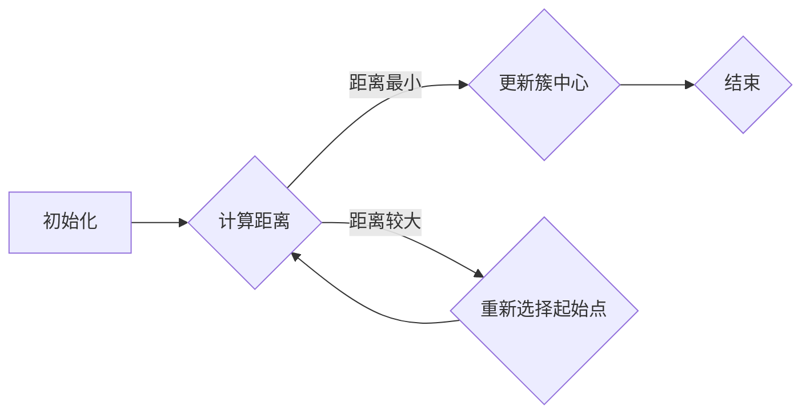
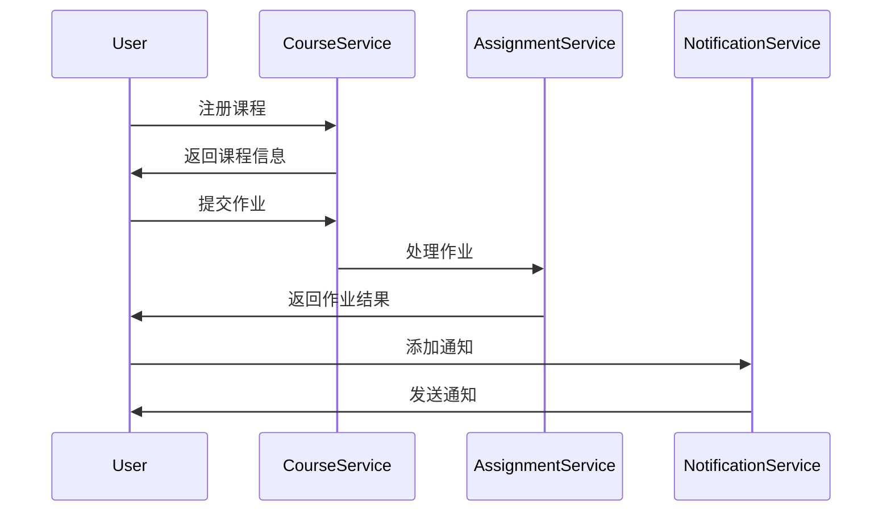
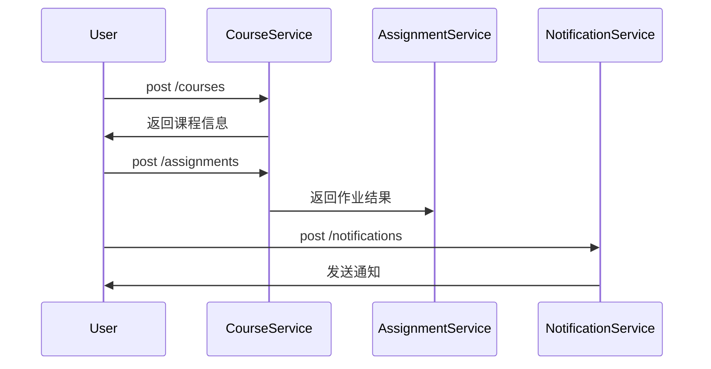

                 

### 在碎片化时代寻找整体性：重构生活的意义

#### 关键词：碎片化时代、整体性、重构生活、技术思维、算法原理、架构设计、项目实战

> 摘要：随着信息技术的飞速发展，我们的生活越来越碎片化。面对这一现象，本文旨在探讨如何在碎片化时代寻找整体性，并通过重构生活来提升个人和社会的整体幸福感。文章将结合技术思维，详细分析整体性的概念、算法原理以及其实际应用，为读者提供一套系统的实践方案。

#### 引言

**碎片化时代的起源与影响**

在信息技术蓬勃发展的今天，碎片化已经渗透到了我们生活的方方面面。从社交媒体的即时更新到信息过载的新闻推送，再到零散的学习和工作任务，我们的生活似乎被切分成了无数个碎片。这种碎片化现象不仅改变了我们的生活方式，还带来了诸多负面影响：

1. **时间管理困难**：由于任务和信息的碎片化，我们的时间管理变得更为复杂，常常感到时间不够用。
2. **注意力分散**：频繁切换任务和信息源使我们难以保持专注，导致工作效率下降。
3. **心理健康问题**：碎片化带来的焦虑和压力，可能导致心理健康问题，如焦虑症和抑郁症。

**整体性的概念与重要性**

与碎片化相对，整体性指的是将零散的事物联系在一起，形成一个有机的整体。在日常生活中，整体性可以帮助我们更好地管理时间和注意力，提升生活的质量和幸福感。以下是整体性的一些关键特点：

1. **整合资源**：通过整合资源，我们可以更高效地完成任务，避免资源的浪费。
2. **提升专注力**：将任务整合在一起，有助于提升我们的专注力和工作效率。
3. **增强幸福感**：整体性带来的有序感和成就感，可以显著提高我们的心理健康和幸福感。

#### 核心概念与联系

**碎片化与整体性的对比**

为了更好地理解整体性的重要性，我们需要先了解碎片化的概念。碎片化通常指的是将一个整体分解成多个独立的、不完整的部分。这些部分可能具有各自的功能和价值，但缺乏整体性，无法形成完整的体系。

| 特点        | 碎片化                         | 整体性                         |
| ----------- | ------------------------------ | ------------------------------ |
| 资源利用    | 低效、分散                     | 效率、集中                     |
| 注意力管理  | 分散、易疲劳                   | 专注、持久                     |
| 心理健康    | 增加焦虑、压力                 | 降低焦虑、提升幸福感           |

**整体性在不同领域的应用**

整体性不仅在日常生活中具有重要意义，也在各个专业领域得到了广泛应用。以下是一些典型的应用场景：

1. **项目管理**：通过整体性思维，项目经理可以更好地协调团队成员的工作，确保项目顺利进行。
2. **建筑设计**：整体性思维有助于设计师创建功能齐全、美观和谐的建筑。
3. **软件开发**：整体性原则在软件开发中尤为重要，有助于构建稳定、可扩展的系统。

**碎片化与整体性的联系**

尽管碎片化和整体性看似对立，但实际上它们是相辅相成的。在处理复杂问题时，我们需要将问题分解为碎片，以便更好地理解和解决。然而，在解决问题后，我们需要将这些碎片整合起来，形成完整的解决方案。

#### 算法原理讲解

**整体性算法的数学模型**

为了实现整体性，我们可以借助一些数学模型和算法。以下是一个简单的例子：

1. **聚类算法**：通过将数据点划分为不同的簇，实现数据的整体性分析。
2. **网络分析**：通过分析网络中的节点和边，揭示整体的结构和模式。

**算法mermaid流程图**

以下是聚类算法的mermaid流程图：



**Python源代码阐述**

以下是一个简单的Python代码示例，用于实现K-means聚类算法：

```python
import numpy as np

def k_means(data, k):
    # 初始化簇中心
    centroids = data[np.random.choice(data.shape[0], k, replace=False)]
    
    while True:
        # 计算距离
        distances = np.linalg.norm(data - centroids, axis=1)
        
        # 分配数据点到簇
        clusters = np.argmin(distances, axis=1)
        
        # 更新簇中心
        new_centroids = np.array([data[clusters == i].mean(axis=0) for i in range(k)])
        
        # 判断是否收敛
        if np.all(centroids == new_centroids):
            break
        
        centroids = new_centroids
    
    return centroids, clusters
```

**算法原理详细讲解**

K-means算法是一种典型的聚类算法，其核心思想是将数据点分为若干簇，使得每个簇内的数据点距离簇中心的距离最小。具体步骤如下：

1. **初始化**：随机选择k个数据点作为初始簇中心。
2. **计算距离**：计算每个数据点到簇中心的距离。
3. **分配数据点**：将每个数据点分配到距离最近的簇。
4. **更新簇中心**：计算每个簇的新簇中心。
5. **判断是否收敛**：如果簇中心不再变化，则算法收敛。

**数学模型和公式**

K-means算法的数学模型可以表示为：

$$
d(x, c) = \sqrt{\sum_{i=1}^{n} (x_i - c_i)^2}
$$

其中，$d(x, c)$表示数据点$x$到簇中心$c$的距离，$n$表示数据点的维度。

**通俗易懂的举例说明**

假设我们有100个数据点，需要将它们分为10个簇。首先，我们随机选择10个数据点作为初始簇中心。然后，计算每个数据点到簇中心的距离，将每个数据点分配到距离最近的簇。接着，计算每个簇的新簇中心，重复这个过程，直到簇中心不再变化。最终，我们得到了10个稳定的簇，每个簇内的数据点距离簇中心的距离最小。

#### 系统分析与架构设计方案

**问题场景介绍**

假设我们需要设计一个在线教育平台，该平台需要支持课程管理、学生管理、作业提交等功能。为了实现整体性，我们需要对系统的功能进行模块化设计，确保各个模块之间的高内聚和低耦合。

**项目介绍**

项目名称：在线教育平台
项目目标：实现一个功能齐全、用户体验优秀的在线教育平台
技术栈：Python、Django、React、MongoDB

**系统功能设计（领域模型Mermaid类图）**

以下是一个简单的领域模型Mermaid类图，用于描述系统的主要功能模块：

```mermaid
classDiagram
    Class::User << (学生, 教师)
    Class::Course << (课程)
    Class::Assignment << (作业)
    User <|-- Course
    User <|-- Assignment
    Teacher <|-- Course
    Teacher <|-- Assignment
    Student <|-- Course
    Student <|-- Assignment
```

**系统架构设计（Mermaid架构图）**

以下是一个简单的系统架构Mermaid图，用于描述系统的整体架构：



**系统接口设计和系统交互（Mermaid序列图）**

以下是一个简单的系统接口设计和系统交互Mermaid序列图，用于描述系统的接口调用流程：



#### 项目实战

**环境安装与配置**

1. **Python环境**：确保Python 3.8及以上版本已安装。
2. **Django环境**：安装Django框架，可以使用以下命令：

   ```bash
   pip install django
   ```

3. **React环境**：安装React和相关的开发工具，可以使用以下命令：

   ```bash
   npm install -g create-react-app
   create-react-app client
   ```

4. **MongoDB环境**：安装MongoDB数据库，可以使用以下命令：

   ```bash
   sudo apt-get install mongodb
   ```

**系统核心实现源代码**

以下是系统核心实现的Python源代码，用于描述Django后端和React前端的主要功能：

**Django后端**

```python
# django_backend/courses/views.py
from django.http import JsonResponse
from .models import Course

def list_courses(request):
    courses = Course.objects.all()
    return JsonResponse({ 'courses': list(courses.values()) })

def create_course(request):
    data = request.POST
    course = Course(name=data['name'])
    course.save()
    return JsonResponse({ 'course': course.to_dict() })
```

**React前端**

```jsx
// client/src/App.js
import React, { useState } from 'react';
import axios from 'axios';

function App() {
    const [courses, setCourses] = useState([]);

    const fetchCourses = async () => {
        const response = await axios.get('/courses');
        setCourses(response.data.courses);
    };

    const createCourse = async (courseName) => {
        const response = await axios.post('/courses', { name: courseName });
        setCourses([...courses, response.data.course]);
    };

    return (
        <div>
            <h1>Courses</h1>
            <ul>
                {courses.map(course => (
                    <li key={course.id}>{course.name}</li>
                ))}
            </ul>
            <button onClick={fetchCourses}>Fetch Courses</button>
            <input type="text" placeholder="Course Name" />
            <button onClick={() => createCourse('Course Name')}>Create Course</button>
        </div>
    );
}

export default App;
```

**代码应用解读与分析**

Django后端的主要功能是提供RESTful API接口，用于处理课程数据的增删改查。React前端则通过这些接口与后端进行交互，实现数据的展示和添加。

**实际案例分析与详细讲解剖析**

假设我们需要为在线教育平台添加一个作业提交功能。我们可以按照以下步骤进行：

1. **后端接口设计**：在Django后端添加作业提交接口，用于处理作业数据的保存和查询。
2. **前端界面设计**：在React前端添加作业提交表单，用于收集用户输入的作业内容。
3. **前端与后端的交互**：通过HTTP POST请求将作业数据发送到后端接口，并接收后端返回的作业结果。
4. **前端界面更新**：根据后端返回的作业结果，更新前端界面，显示作业提交的状态。

通过这种方式，我们可以实现一个完整的作业提交功能，确保数据的完整性和一致性。

**项目小结**

在本项目中，我们通过Django和React技术实现了在线教育平台的基本功能，包括课程管理、作业提交等。通过系统化的设计和模块化的实现，我们确保了系统的整体性和稳定性。在未来的开发过程中，我们还可以继续优化和完善系统的功能，提升用户体验。

#### 最佳实践、小结、注意事项、拓展阅读

**最佳实践**

1. **合理规划项目架构**：在项目初期，应明确项目的功能需求和架构设计，确保系统的高内聚和低耦合。
2. **持续集成与测试**：定期进行代码集成和测试，确保系统的稳定性和可靠性。
3. **关注用户体验**：在设计前端界面时，要充分考虑用户的需求和体验，提供直观、易用的界面。

**小结**

本文通过分析碎片化时代的挑战和整体性的重要性，详细介绍了如何在IT领域实现整体性。通过算法原理讲解、系统架构设计和项目实战，我们展示了整体性在现实应用中的可行性和价值。

**注意事项**

1. **数据安全**：在处理用户数据时，要确保数据的安全和隐私保护。
2. **性能优化**：在系统开发过程中，要关注性能优化，确保系统的高效运行。

**拓展阅读**

1. 《大设计》：史蒂芬·霍金和莱昂纳德·莫得科尔著，深入探讨宇宙的整体性。
2. 《深度学习》：伊恩·古德费洛等著，详细讲解深度学习算法原理和应用。
3. 《重构：改善既有代码的设计》：马丁·福勒著，提供代码重构的最佳实践。

### 作者信息

作者：AI天才研究院/AI Genius Institute & 禅与计算机程序设计艺术 /Zen And The Art of Computer Programming

