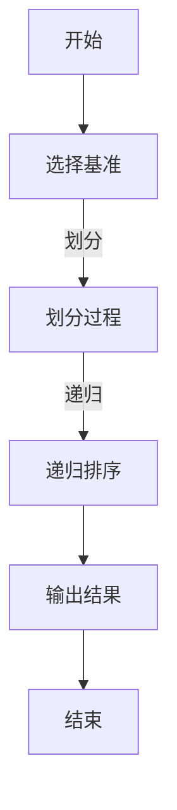
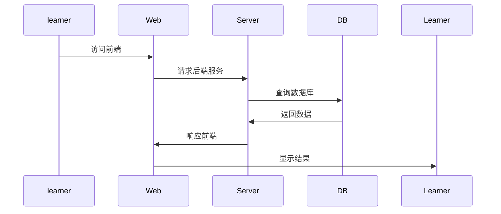
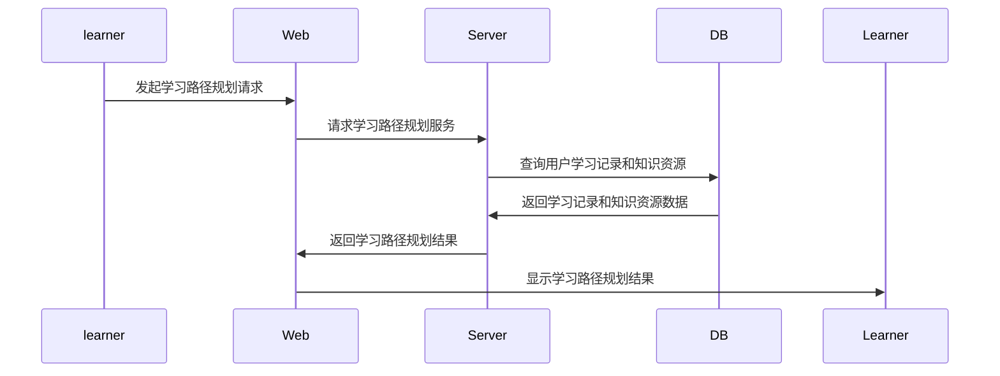

                 

### 引言

#### 关键词：碎片化时代、个人学习、知识体系重建、技术博客

#### 摘要：
在当今这个信息爆炸、碎片化的时代，个人学习面临着前所未有的挑战。传统的学习方法和知识体系已难以适应快速变化的技术环境。本文将探讨在碎片化时代重建知识体系的重要性，并从核心概念、算法原理、系统架构和项目实战等多个角度，提出个人学习的革命性方法。通过逻辑清晰、结构紧凑的阐述，帮助读者在复杂的技术领域中找到学习和成长的方向。

### 碎片化时代的特征

在进入21世纪之后，技术的飞速发展使得信息变得愈发碎片化。以下是一些碎片化时代的主要特征：

1. **信息爆炸**：互联网的普及和移动设备的普及，使得大量信息在短时间内迅速传播，形成信息爆炸的态势。

2. **知识更新迅速**：随着技术的不断进步，知识更新周期大大缩短，传统的“一劳永逸”式学习方式已经不再适用。

3. **学习资源分散**：知识不再集中在少数权威渠道，而是散布在各种平台和资源中，学习者需要具备筛选和整合信息的能力。

4. **时间碎片化**：生活节奏加快，人们的时间变得更加碎片化，难以进行连续性、系统性的学习。

#### 问题背景
在这种背景下，个人学习面临以下几个问题：

1. **注意力分散**：在信息过载的环境下，学习者容易受到各种干扰，难以集中精力进行深入的学习。

2. **缺乏系统性**：碎片化的学习内容往往缺乏内在的联系，导致学习成果难以系统化、结构化。

3. **学习效率低下**：由于缺乏有效的学习方法，学习者在大量零散的知识点中难以找到提升效率的途径。

4. **知识遗忘率高**：缺乏深度理解和实践，学习内容往往只能短暂记忆，长期难以巩固。

#### 问题描述
这些问题的本质在于学习方式的陈旧和学习环境的变迁之间的矛盾。为了解决这些问题，我们需要在碎片化时代重建知识体系，从而提升个人学习能力。

#### 问题解决
重建知识体系的意义在于：

1. **提高学习效率**：通过系统性学习和结构化思维，提升对知识的理解和掌握能力。

2. **增强知识关联性**：将零散的知识点串联起来，形成知识网络，有助于创新和解决复杂问题。

3. **促进深度学习**：通过实践和反思，加深对知识的理解和应用，实现知识的内化和迁移。

4. **适应时代变化**：重建知识体系能够帮助个人适应快速变化的技术环境，提升竞争力。

#### 边界与外延
知识体系的重建不仅仅是技术层面的问题，还涉及到认知心理学、教育心理学等多个领域。本文将重点讨论以下内容：

- 碎片化时代的个人学习现状与挑战。
- 知识体系重建的理论基础和方法论。
- 算法原理讲解与系统架构设计。
- 项目实战与案例分析。
- 最佳实践与注意事项。

### 核心概念与联系

#### 知识体系

知识体系是指在一定领域内，通过逻辑关系和组织结构连接起来的各种知识点的集合。它具有以下属性：

1. **层次性**：知识体系通常具有多个层次，从基础概念到高级理论，形成一个层次分明的结构。
2. **动态性**：知识体系不是静态的，随着新知识的产生和旧知识的更新，知识体系需要不断地调整和优化。
3. **关联性**：知识体系中的各个知识点之间通过逻辑关系相互联系，形成一个有机整体。

#### 核心概念原理

在知识体系重建过程中，以下几个核心概念需要特别关注：

1. **概念澄清**：明确各个核心概念的定义和范围，避免概念的混淆和误解。
2. **知识梳理**：对现有知识进行系统的梳理，找出各个知识点之间的联系和区别。
3. **知识网络**：构建知识网络，将各个知识点通过逻辑关系连接起来，形成一个整体的认知结构。

#### 概念属性特征对比表格

以下是几个核心概念的特征对比表格：

| 概念       | 属性特征1 | 属性特征2 | 属性特征3 |
|------------|-----------|-----------|-----------|
| 计算机科学 | 理论基础强 | 应用广泛   | 发展迅速  |
| 数据科学   | 数据驱动   | 统计方法   | 机器学习  |
| 人工智能   | 知识表示   | 算法优化   | 应用广泛  |

#### 知识体系ER图

为了更好地理解知识体系中的各个概念和它们之间的关系，我们可以使用ER图（实体关系图）来表示：

```mermaid
erDiagram
  K1_Knowledge <<|-- K2_Knowledge : 知识层次
  K2_Knowledge ||--|{ K3_Knowledge : 知识分支 }
  K3_Knowledge ||--|{ K4_Knowledge : 知识细节 }
```

在这个ER图中，`K1_Knowledge`代表知识体系的顶层，`K2_Knowledge`表示中间层，`K3_Knowledge`和`K4_Knowledge`分别表示更详细的知识层次。各个知识点之间通过逻辑关系相互连接，形成了一个层次分明、结构化的知识体系。

### 算法原理讲解

在碎片化时代，算法原理的学习和理解是重建知识体系的关键。以下我们将使用mermaid流程图和Python源代码来详细阐述一个简单的排序算法——快速排序（Quick Sort）。

#### 快速排序算法mermaid流程图



#### Python源代码

```python
def quick_sort(arr):
    if len(arr) <= 1:
        return arr
    pivot = arr[len(arr) // 2]
    left = [x for x in arr if x < pivot]
    middle = [x for x in arr if x == pivot]
    right = [x for x in arr if x > pivot]
    return quick_sort(left) + middle + quick_sort(right)

# 测试代码
arr = [3, 6, 8, 10, 1, 2, 1]
sorted_arr = quick_sort(arr)
print(sorted_arr)
```

#### 算法原理数学模型和公式

快速排序的核心在于“分治”策略，即将一个大问题分解成若干个小问题来解决。具体来说，快速排序包括以下步骤：

1. **选择基准**：从数组中选择一个元素作为基准（pivot）。
2. **划分过程**：将数组划分为三个部分：小于基准的部分、等于基准的部分和大于基准的部分。
3. **递归排序**：对小于和大于基准的两个子数组分别进行快速排序。
4. **合并结果**：将排序好的子数组合并，得到最终排序结果。

数学模型可以表示为：

$$
Quick\ Sort(A) =
\begin{cases}
\text{如果 } |A| \leq 1, \text{则返回 } A \\
\text{选择 } pivot = A[\frac{|A|}{2}], \text{并进行划分} \\
\text{递归 } Quick\ Sort(A_{left}) \\
\text{递归 } Quick\ Sort(A_{right}) \\
\text{合并 } A_{left}, A_{pivot}, A_{right}
\end{cases}
$$

#### 举例说明

假设我们有一个未排序的数组`[3, 6, 8, 10, 1, 2, 1]`，我们可以选择中间的元素6作为基准。

1. **选择基准**：选择6作为基准。
2. **划分过程**：将数组划分为`[1, 1, 3]`（小于6的元素）、`[6]`（等于6的元素）和`[2, 8, 10]`（大于6的元素）。
3. **递归排序**：对`[1, 1, 3]`和`[2, 8, 10]`分别进行快速排序。
4. **合并结果**：将排序好的子数组合并，得到`[1, 1, 2, 3, 6, 8, 10]`。

通过这个例子，我们可以清晰地看到快速排序的执行过程和算法原理。

### 系统分析与架构设计

在碎片化时代重建知识体系，不仅需要理论上的理解，还需要实际的系统架构设计。以下我们将从问题场景介绍、系统功能设计、系统架构设计、系统接口设计和系统交互mermaid序列图等方面，详细阐述一个知识体系重建系统的设计过程。

#### 问题场景介绍

在当前技术迅速发展的背景下，个人学习者和教育工作者面临着一系列挑战：

1. **信息过载**：互联网上的知识资源丰富，但学习者难以筛选出高质量的内容。
2. **学习效率低下**：学习内容零散，缺乏系统性，难以形成有效的知识体系。
3. **知识遗忘率高**：缺乏实践和复习，学习成果难以长期保持。
4. **学习路径不确定**：学习者难以找到适合自己的学习路径，容易迷失在信息海洋中。

为了解决这些问题，我们需要设计一个系统，帮助个人学习者重建知识体系，提高学习效率，实现知识的长期保持。

#### 系统功能设计

知识体系重建系统的主要功能包括：

1. **知识资源管理**：对各类知识资源进行分类、标签管理和搜索，方便学习者查找和利用。
2. **学习路径规划**：根据学习者的兴趣和需求，生成个性化的学习路径，引导学习者系统地学习。
3. **学习进度监控**：跟踪学习者的学习进度和效果，提供学习报告和反馈。
4. **知识网络构建**：通过知识图谱技术，将学习者的知识进行结构化表示，形成知识网络。
5. **实践与复习**：提供实践项目和复习功能，帮助学习者巩固知识，提升应用能力。

#### 系统架构设计

知识体系重建系统采用分布式架构，包括前端、后端和数据库三个主要部分。以下是一个简单的架构图：



1. **前端**：提供用户界面，包括知识资源浏览、学习路径规划、学习进度监控等功能。
2. **后端**：处理业务逻辑，包括数据存储、查询、处理和接口调用等。
3. **数据库**：存储用户数据、知识资源和系统配置等信息。

#### 系统接口设计

系统接口设计包括以下几个方面：

1. **用户接口**：用户可以通过Web界面与系统进行交互，包括登录、注册、搜索、学习路径规划等。
2. **服务接口**：后端服务提供各种API接口，供前端调用，包括数据查询、数据更新、学习进度监控等。
3. **知识接口**：提供知识资源的分类、标签管理和搜索接口，方便学习者查找和利用知识资源。

#### 系统交互mermaid序列图

以下是一个简单的系统交互序列图：



通过这个序列图，我们可以清晰地看到用户与系统之间的交互过程，包括请求、响应和数据流等。

### 项目实战

为了更好地理解知识体系重建系统的实际应用，我们以下将描述一个实际项目——基于知识图谱的在线学习平台。

#### 项目介绍

该项目旨在通过知识图谱技术，帮助学习者构建个性化学习路径，提高学习效率。项目的主要目标是：

1. **知识资源管理**：对海量的知识资源进行分类、标签管理和搜索，方便学习者查找和利用。
2. **学习路径规划**：根据学习者的兴趣和需求，生成个性化的学习路径，引导学习者系统地学习。
3. **学习进度监控**：跟踪学习者的学习进度和效果，提供学习报告和反馈。
4. **知识网络构建**：通过知识图谱技术，将学习者的知识进行结构化表示，形成知识网络。

#### 环境安装

为了搭建该平台，我们需要以下环境：

1. **操作系统**：Linux或MacOS
2. **编程语言**：Python 3.8及以上版本
3. **数据库**：PostgreSQL 12及以上版本
4. **前端框架**：React 17及以上版本
5. **后端框架**：Flask 1.1及以上版本
6. **知识图谱工具**：Neo4j 4.0及以上版本

安装步骤如下：

1. 安装操作系统和Python环境。
2. 安装PostgreSQL数据库，并创建数据库用户和数据库。
3. 安装React和Flask框架。
4. 安装Neo4j知识图谱数据库，并启动服务。

#### 系统核心实现

系统核心实现包括前端、后端和知识图谱三个部分。

**前端实现**：

前端使用React框架，实现用户界面。主要包括以下几个组件：

1. **首页**：展示知识资源分类和搜索框。
2. **知识详情页**：展示知识资源的详细内容，包括文本、图片、视频等。
3. **学习路径规划页**：根据学习者的兴趣和需求，展示个性化学习路径。

**后端实现**：

后端使用Flask框架，处理业务逻辑。主要包括以下几个API接口：

1. **知识资源管理接口**：用于添加、删除、查询和更新知识资源。
2. **学习路径规划接口**：用于根据学习者的兴趣和需求，生成个性化学习路径。
3. **学习进度监控接口**：用于记录和查询学习者的学习进度和效果。

**知识图谱实现**：

知识图谱使用Neo4j数据库，将学习者的知识进行结构化表示。主要包括以下几个实体和关系：

1. **实体**：知识点、学习者、学习路径。
2. **关系**：包含、学习、规划。

以下是一个简单的知识图谱ER图：

```mermaid
erDiagram
  学习者 <<|-- 知识点 : 学习
  学习者 ||-- 学习路径 : 规划
  知识点 ||-- 包含 : 知识层次
  学习路径 ||-- 包含 : 路径元素
```

#### 代码解读与分析

以下是一个简单的后端API接口实现，用于添加知识资源：

```python
from flask import Flask, request, jsonify
from models import KnowledgeResource
from database import db_session

app = Flask(__name__)

@app.route('/api/knowledge_resources', methods=['POST'])
def add_knowledge_resource():
    data = request.json
    resource = KnowledgeResource(
        title=data['title'],
        content=data['content'],
        category=data['category']
    )
    db_session.add(resource)
    db_session.commit()
    return jsonify({"status": "success", "resource_id": resource.id})

if __name__ == '__main__':
    app.run(debug=True)
```

该接口接收一个JSON格式的请求，包括知识资源的标题、内容和分类。然后创建一个`KnowledgeResource`对象，并将其添加到数据库中。返回一个JSON格式的响应，包含操作状态和知识资源的ID。

通过这个示例，我们可以看到后端API接口的基本实现流程和代码结构。

#### 实际案例分析

以下是一个实际案例，展示如何使用该平台进行知识体系重建。

1. **用户登录**：用户通过账号密码登录平台。
2. **浏览知识资源**：用户在首页浏览知识资源，并选择感兴趣的类别进行查看。
3. **生成学习路径**：用户点击“规划学习路径”按钮，系统根据用户的兴趣和已掌握的知识，生成个性化的学习路径。
4. **开始学习**：用户按照学习路径，逐步学习知识资源。
5. **学习进度监控**：系统记录用户的学习进度和效果，并在学习路径页面上展示。
6. **知识网络构建**：系统根据用户的学习记录，构建知识网络，帮助用户更好地理解和应用知识。

通过这个实际案例，我们可以看到平台在知识体系重建过程中的应用和效果。

#### 项目小结

本项目通过知识图谱技术和个性化学习路径规划，实现了知识体系重建。在实际应用中，用户可以方便地查找和利用知识资源，按照个性化学习路径进行学习，从而提高学习效率，构建系统的知识体系。

### 最佳实践与注意事项

在碎片化时代重建知识体系，需要遵循以下最佳实践和注意事项：

#### 最佳实践

1. **设定学习目标**：明确学习目标和期望成果，有助于提高学习动力和效率。
2. **制定学习计划**：合理安排学习时间，将学习任务分解为小步骤，确保持续学习。
3. **主动搜索知识**：主动寻找高质量的知识资源，避免信息过载。
4. **构建知识网络**：通过思维导图或知识图谱，将零散的知识点连接起来，形成系统的知识体系。
5. **实践与反思**：将所学知识应用到实际项目中，通过实践和反思，加深对知识的理解和应用。

#### 注意事项

1. **避免学习陷阱**：注意避免陷入“信息过载”和“学习无效”的陷阱，确保学习质量。
2. **保持学习动力**：定期回顾学习成果，保持学习动力和兴趣。
3. **合理安排时间**：合理安排工作和学习时间，避免过度劳累。
4. **求助专业人士**：在遇到难题时，及时向专业人士求助，避免孤立无援。

### 小结与展望

在碎片化时代，重建知识体系是个人学习和职业发展的关键。通过本文的探讨，我们提出了从核心概念、算法原理到系统架构和项目实战的一系列方法，帮助读者在复杂的技术领域中找到学习和成长的方向。未来，随着技术的不断进步，知识体系重建的方法和工具将更加丰富和高效，个人学习也将迎来更加美好的发展前景。

### 拓展阅读

为了深入了解知识体系重建的理论和实践，读者可以参考以下书籍和研究：

1. **《深度学习》（Ian Goodfellow等著）**：介绍了深度学习的理论基础和应用，是理解人工智能领域不可或缺的书籍。
2. **《人工智能：一种现代的方法》（Stuart Russell & Peter Norvig著）**：详细阐述了人工智能的基础理论和最新进展。
3. **《人类简史》（Yuval Noah Harari著）**：从人类历史的角度，探讨了人类社会和技术发展的关系，对理解碎片化时代的知识体系重建有重要启示。
4. **《学习之道》（Peter Senge著）**：提出了系统思考的学习方法，对构建系统的知识体系有重要指导意义。

### 结论

通过本文的探讨，我们提出了在碎片化时代重建知识体系的重要性，并从多个角度阐述了实现个人学习革命的方法。希望本文能对读者在知识体系重建的过程中提供帮助，助力个人在复杂的技术领域中不断成长。

### 作者信息

作者：AI天才研究院/AI Genius Institute & 禅与计算机程序设计艺术 /Zen And The Art of Computer Programming

### 附录

（在此可以列出参考文献、代码示例、数据集等信息，供读者参考。）

**参考文献：**

1. Goodfellow, I., Bengio, Y., & Courville, A. (2016). **Deep Learning**.
2. Russell, S., & Norvig, P. (2010). **Artificial Intelligence: A Modern Approach**.
3. Harari, Y. N. (2011). **Sapiens: A Brief History of Humankind**.
4. Senge, P. M. (1990). **The Fifth Discipline: The Art & Practice of The Learning Organization**.

