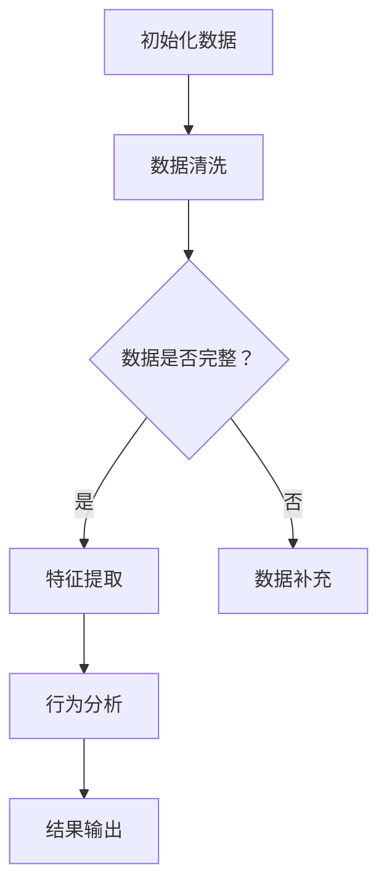
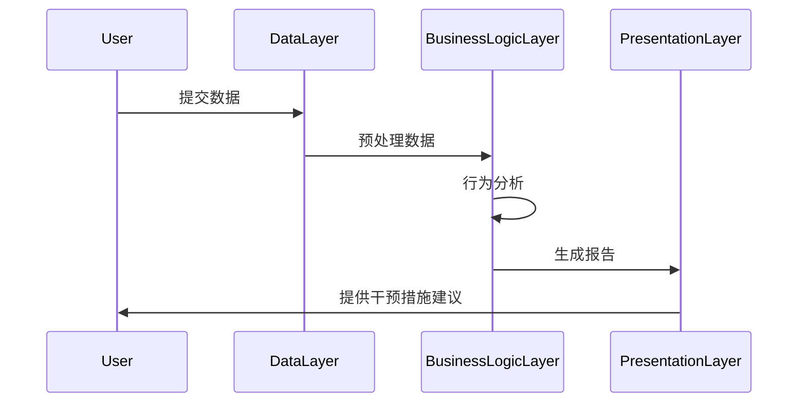
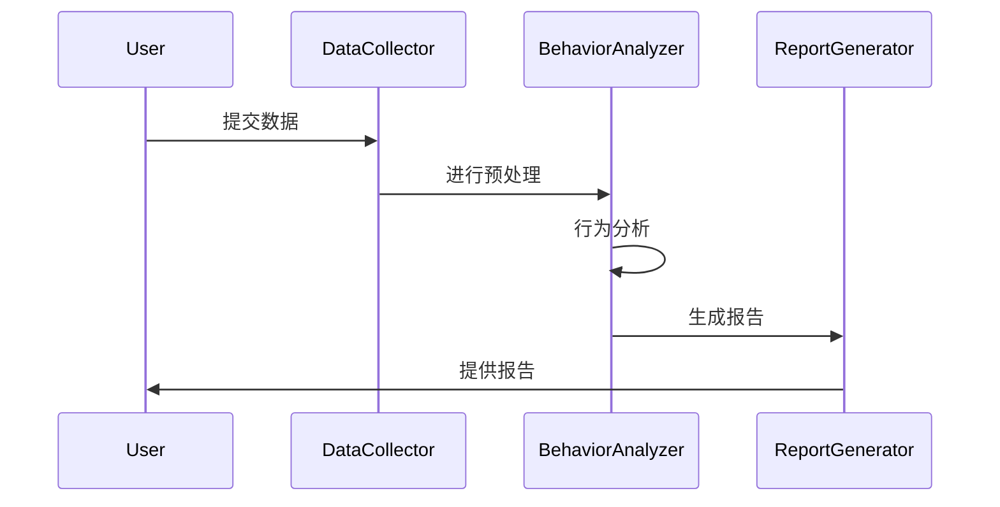
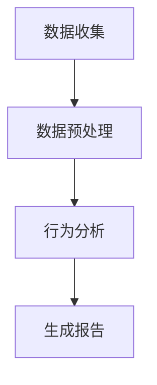

                 


### 在社交媒体时代寻找真实自我：应对身份认同危机

#### 关键词：
社交媒体、身份认同、自我认知、心理学、跨文化

#### 摘要：
本文探讨了社交媒体时代身份认同危机的成因与应对策略。通过心理学视角，分析了社交媒体对自我认知的影响，并提出了重建身份认同的策略。此外，还从跨文化角度探讨了身份认同危机的挑战与解决方案，为个人和社群提供实践指导。

----------------------------------------------------------------

## 引言

在数字化时代，社交媒体已成为人们日常生活中不可或缺的一部分。从Facebook到Instagram，再到Twitter和微信，这些平台不仅改变了人们的社交方式，也深刻影响了人们的自我认知和身份认同。在这样一个充满虚拟互动的世界里，很多人开始感受到一种前所未有的身份认同危机。这种现象不仅困扰着年轻人，也影响着各个年龄段的人群。

身份认同危机，指的是个体在寻求自我身份和价值观过程中所遇到的心理困惑和混乱。在社交媒体时代，身份认同危机尤为显著，因为虚拟世界中的信息爆炸和竞争压力使得个体难以找到真实的自我。本文将深入探讨社交媒体时代身份认同危机的成因，从心理学视角分析其影响，并提出应对策略。

首先，我们将回顾社交媒体的兴起及其对个人生活的影响，解释身份认同危机的定义和表现形式。接着，我们将从心理学角度探讨社交媒体如何影响自我认知，并讨论应对策略。此外，本文还将从跨文化视角分析身份认同危机的挑战，并给出解决建议。最后，我们将展望未来，讨论社交媒体的发展趋势和长期应对策略。

通过本文的探讨，我们希望帮助读者更好地理解身份认同危机，并提供实用的应对方法，以在社交媒体时代找到真实的自我。

----------------------------------------------------------------

## 第一部分：社交媒体时代的背景与挑战

### 第1章：社交媒体的兴起与影响

#### 1.1 社交媒体的背景

社交媒体的兴起可以追溯到20世纪90年代末和21世纪初，随着互联网的普及和技术的进步，人们开始能够通过虚拟平台进行实时互动和分享。Facebook于2004年创立，迅速成为全球最大的社交网络平台。随后，Instagram、Twitter和微信等新兴平台相继崛起，进一步丰富了社交媒体的生态系统。

这些社交媒体平台通过提供用户生成内容的功能，使得信息传播变得前所未有的迅速和广泛。用户可以发布照片、视频、文字等，与其他用户互动，形成了一个庞大的虚拟社交网络。这种互动方式不仅改变了人们的沟通方式，也对个人生活产生了深远影响。

#### 1.2 社交媒体对个人生活的影响

社交媒体的兴起带来了许多积极的影响。首先，它增强了人们的社交网络，使得远距离的朋友和亲人能够更加便捷地进行交流和互动。其次，社交媒体为人们提供了一个展示自我和分享生活的平台，增强了个人自信和满足感。此外，社交媒体还为个人提供了获取信息和知识的新途径，使得学习变得更加灵活和有趣。

然而，社交媒体的负面影响也不可忽视。首先，过度依赖社交媒体可能导致现实社交能力的下降。人们往往在虚拟世界中花费大量时间，而忽视了现实生活中的真实人际交往。其次，社交媒体上的虚假信息和误导性内容可能导致信息过载和认知失调，影响个人的判断力和心理健康。

#### 1.3 社交媒体时代的身份认同危机

社交媒体时代的身份认同危机表现为个体在寻求自我认同过程中所遇到的心理困惑和混乱。这种现象可能源于以下几个原因：

1. **社会比较**：社交媒体上的展示往往是精心挑选和编辑的，这使得人们在比较中往往只看到别人的优点，而忽视了自己的不足。这种社会比较导致个体产生自卑感和不安全感。
2. **身份混淆**：在社交媒体上，个体可以扮演多种角色，这可能导致身份的混淆和模糊。人们可能会在现实生活中无法找到与虚拟身份相符的自我认同。
3. **虚拟现实混淆**：社交媒体创造的虚拟世界与真实世界之间的界限变得模糊，人们可能会在虚拟世界中寻求满足，而忽视了现实生活的重要性。

身份认同危机的表现形式多种多样，包括自我价值感的下降、焦虑和抑郁等心理问题。这些问题不仅影响个体的心理健康，还可能导致人际关系的破裂和社会融入的困难。

### 小结

社交媒体的兴起和普及对个人生活产生了深远影响，既带来了便利和连接，也带来了挑战和困扰。在这种背景下，身份认同危机成为一个重要的议题，需要我们深入探讨和应对。

----------------------------------------------------------------

### 第2章：社交媒体与自我认知

#### 2.1 自我认知的概念

自我认知是指个体对自己心理状态、行为模式、价值观和情感的认识和理解。自我认知是心理学中的核心概念，它涉及到个体的自我概念、自我效能感和自我价值感等多个方面。

自我认知的理论基础包括认知发展理论、自我决定理论和社会比较理论等。认知发展理论认为，个体的自我认知是通过与环境的互动和不断的认知加工而逐步形成的。自我决定理论强调个体在自我认知过程中需要获得自主性和能力感。社会比较理论则指出，个体往往通过与他人进行比较来评估自己的价值和地位。

自我认知的重要性体现在多个方面。首先，自我认知有助于个体了解自己的需求和动机，从而更好地规划个人目标和行为。其次，自我认知有助于个体在面对挑战和压力时保持心理韧性。此外，自我认知还影响着个体的情绪调节和社会适应。

#### 2.2 社交媒体如何影响自我认知

社交媒体在塑造自我认知方面扮演着双重角色：一方面，它为个体提供了自我表达和社交互动的平台，有助于增强自我认知；另一方面，它也带来了一些负面影响，可能导致自我认知的扭曲和混乱。

**社交媒体对自我认知的正面影响**

1. **自我表达**：社交媒体为个体提供了一个展示自我和表达观点的平台，有助于增强自我认知。通过发布内容、互动和评论，个体可以更深入地思考自己的价值观、兴趣爱好和生活方式。
2. **社交互动**：社交媒体促进了个体之间的互动和联系，有助于增强社会支持感和归属感。这种社交互动有助于个体更好地了解自己和他人，从而提高自我认知水平。
3. **知识获取**：社交媒体为个体提供了丰富的信息和知识资源，有助于个体不断学习和成长。通过获取新知识和经验，个体可以更好地理解自己，从而提高自我认知。

**社交媒体对自我认知的负面影响**

1. **社会比较**：社交媒体上的展示往往是精心挑选和编辑的，这可能导致个体进行不平等的社会比较。个体可能会在比较中看到别人的优点而忽视自己的长处，从而产生自卑感和不安全感。
2. **身份混淆**：社交媒体上的多重角色和虚拟互动可能导致个体的身份混淆和模糊。个体可能在现实生活中难以找到与虚拟身份相符的自我认同，从而导致自我认知的困惑和混乱。
3. **虚拟现实混淆**：社交媒体创造的虚拟世界与真实世界之间的界限变得模糊，个体可能会在虚拟世界中寻求满足，而忽视了现实生活的重要性。这种虚拟现实的混淆可能导致自我认知的扭曲。

#### 2.3 如何通过社交媒体增强自我认知

为了通过社交媒体增强自我认知，个体可以采取以下策略：

1. **培养媒体素养**：个体需要学会辨别信息的真实性和可靠性，避免被虚假信息和误导性内容所影响。通过培养媒体素养，个体可以更好地理解社交媒体中的信息，从而提高自我认知。
2. **关注真实自我**：个体在社交媒体上应关注自己的真实感受和需求，避免过分追求别人的认可和点赞。通过关注真实自我，个体可以更清晰地认识自己，从而提高自我认知。
3. **进行深度互动**：个体可以通过社交媒体参与深度互动，与他人分享真实的故事和感受。这种互动有助于个体更好地了解自己和他人，从而提高自我认知。

### 小结

社交媒体对自我认知具有双重影响，既有助于增强自我认知，也可能导致自我认知的扭曲。通过培养媒体素养、关注真实自我和进行深度互动，个体可以在社交媒体时代找到真实的自我，提高自我认知水平。

----------------------------------------------------------------

### 第3章：心理学视角下的身份认同危机

#### 3.1 心理学理论

身份认同危机的心理学理论主要包括自我决定理论、社会比较理论和心理防御机制。

**自我决定理论**（Self-Determination Theory，简称SDT）是由心理学家德西和瑞恩提出的。该理论认为，个体有三种基本心理需求：自主性、能力感和归属感。当这些需求得到满足时，个体能够实现自我认同和心理健康。反之，当这些需求受到阻碍时，个体可能会出现身份认同危机。

**社会比较理论**（Social Comparison Theory）是由社会心理学家弗里德里克·赫斯提出。该理论认为，个体通过与他人进行比较来评估自己的价值和地位。社会比较可以是直接的，也可以是间接的。在社交媒体时代，个体的比较往往是间接的，通过浏览他人的精选生活片段来进行自我评估。

**心理防御机制**（Defensive Mechanisms）是指个体在面对心理冲突和压力时采取的无意识行为。这些防御机制包括否认、投射、合理化等。在身份认同危机中，个体可能会采取这些防御机制来应对内心的混乱和不安。

#### 3.2 身份认同危机的心理机制

身份认同危机的心理机制包括以下几个方面：

1. **自我价值的下降**：在社交媒体上，个体往往只能看到别人的优点，而忽视自己的长处。这种不平等的社会比较导致个体自我价值的下降，感到自卑和不安。
2. **身份混淆**：社交媒体上的多重角色和虚拟互动可能导致个体的身份混淆。个体可能在现实生活中无法找到与虚拟身份相符的自我认同，从而导致自我认知的困惑。
3. **虚拟现实混淆**：社交媒体创造的虚拟世界与真实世界之间的界限变得模糊，个体可能会在虚拟世界中寻求满足，而忽视了现实生活的重要性。这种虚拟现实的混淆可能导致自我认知的扭曲。

#### 3.3 心理干预方法

针对身份认同危机，心理学家提出了一系列心理干预方法，包括认知行为疗法（Cognitive Behavioral Therapy，简称CBT）和情绪调节技巧。

**认知行为疗法**是一种结构化的心理治疗方式，旨在通过改变不良思维和行为模式来改善心理健康。在身份认同危机中，CBT可以帮助个体识别和挑战自我负面思维，建立积极的自我认知。

**情绪调节技巧**包括正念冥想、情绪释放练习和情绪记录等。通过这些技巧，个体可以更好地管理自己的情绪，减少焦虑和抑郁等负面情绪。

### 小结

心理学视角下的身份认同危机揭示了个体在社交媒体时代所面临的心理困惑和混乱。通过自我决定理论、社会比较理论和心理防御机制等理论，我们可以更好地理解身份认同危机的成因和影响。心理干预方法，如认知行为疗法和情绪调节技巧，为个体提供了应对身份认同危机的有效策略。在接下来的章节中，我们将进一步探讨社交媒体使用与身份认同重建的策略，帮助个体在社交媒体时代找到真实的自我。

----------------------------------------------------------------

### 第4章：社交媒体使用与身份认同的重建

#### 4.1 重建身份认同的策略

身份认同的重建是一个复杂而长期的过程，需要个体采取多种策略。以下是一些关键策略：

**1. 建立真实的自我形象**

个体需要意识到在社交媒体上展示的自己并不是真实的自我。通过反思自己的价值观、兴趣爱好和人生目标，个体可以建立真实的自我形象。这种真实形象有助于个体在现实生活中找到自我认同。

**2. 增强自我效能感**

自我效能感是指个体对自己完成特定任务的信心。在社交媒体时代，个体可以通过设定实际可行的目标并努力实现它们来增强自我效能感。这种自我效能感有助于个体在面对挑战时保持积极态度。

**3. 培养自我接纳**

自我接纳是指个体接受自己的优点和不足，不因他人的评价而改变自己的价值观。通过培养自我接纳，个体可以减少因社会比较而引发的焦虑和压力。

**4. 建立有益的社交圈**

个体应该选择那些与自己价值观相符的社交圈。这些社交圈可以提供情感支持和正能量，帮助个体重建身份认同。

**5. 调整社交媒体使用策略**

个体需要合理安排社交媒体的使用时间，避免过度依赖。通过减少无意义的社交媒体互动，个体可以专注于有意义的活动，从而更好地重建身份认同。

#### 4.2 社交媒体平台的选择与使用

在重建身份认同的过程中，选择合适的社交媒体平台至关重要。以下是一些有用的建议：

**1. 正面社交媒体平台**

选择那些鼓励真实自我表达和健康互动的社交媒体平台。例如，LinkedIn适合职业发展，而Instagram适合分享生活点滴。

**2. 负面社交媒体平台的回避**

避免使用那些可能导致负面情绪和身份混淆的社交媒体平台。例如，一些追求短期关注和点赞的社交媒体平台可能会使个体陷入不平等的社会比较。

**3. 平衡使用多种平台**

个体可以通过平衡使用多种社交媒体平台来丰富社交体验。例如，可以在Instagram上分享生活照片，同时在LinkedIn上更新职业动态。

#### 4.3 社交媒体互动技巧

以下是一些有效的社交媒体互动技巧，有助于个体在社交媒体上建立真实自我和重建身份认同：

**1. 保持真实**

在社交媒体上分享真实的故事和感受，不要过分追求完美。这种真实分享可以赢得他人的尊重和理解。

**2. 积极互动**

参与积极的社交媒体互动，回复评论和私信，与他人建立真实联系。这种互动有助于增强社交支持感和归属感。

**3. 定期反思**

定期反思自己的社交媒体行为和影响，确保自己的行为有助于身份认同的重建。

### 小结

通过重建真实的自我形象、增强自我效能感、培养自我接纳、建立有益的社交圈和调整社交媒体使用策略，个体可以在社交媒体时代找到真实的自我，重建身份认同。选择合适的社交媒体平台和运用有效的互动技巧，也是实现这一目标的重要步骤。在接下来的章节中，我们将探讨社会支持与身份认同重建的关系，帮助个体在复杂的社会环境中找到平衡。

----------------------------------------------------------------

### 第5章：社会支持与身份认同重建

#### 5.1 社会支持的重要性

社会支持是指个体在面临挑战和压力时，从他人那里获得的情感、信息和实质性的帮助。社会支持在身份认同重建过程中扮演着关键角色，因为它能够提供心理和情感上的安全感，帮助个体应对身份认同危机。

社会支持的重要性体现在以下几个方面：

1. **情感支持**：情感支持可以帮助个体缓解焦虑、抑郁等负面情绪，增强心理韧性。通过倾听和理解，他人可以提供情感上的安慰和支持，使个体感到被接纳和尊重。
2. **信息支持**：信息支持可以帮助个体获取新的知识和技能，提高自我效能感。他人提供的建议和经验可以帮助个体更好地理解自己和周围的世界，从而重建身份认同。
3. **实质支持**：实质支持包括物质帮助、经济援助和社会资源等，能够直接改善个体的生活条件，为身份认同重建提供实际帮助。

#### 5.2 社会支持体系的构建

要有效应对身份认同危机，构建一个全面的社会支持体系至关重要。以下是一些构建社会支持体系的策略：

**1. 家庭支持**

家庭是提供社会支持的重要来源。家庭成员之间的亲密关系和相互理解可以提供强大的情感支持。家庭成员应该鼓励个体表达自己的感受，并提供必要的帮助和鼓励。

**2. 朋友支持**

朋友是另一个重要的社会支持来源。朋友之间的互动可以提供信息支持和实质支持。朋友可以分享自己的经验和建议，帮助个体应对身份认同危机。

**3. 社区支持**

社区支持包括邻里关系、社区组织和志愿者服务等。社区支持可以提供情感、信息和实质支持，帮助个体融入社会，建立归属感。

**4. 专业机构的帮助**

专业机构如心理咨询中心、非政府组织和慈善机构等，可以提供专业的心理咨询和帮助。这些机构可以为个体提供专业的指导和支持，帮助个体更好地应对身份认同危机。

#### 5.3 社会支持与身份认同重建的关系

社会支持与身份认同重建之间存在密切的关系。有效的社会支持可以促进个体身份认同的重建，具体体现在以下几个方面：

1. **增强自我效能感**：社会支持可以帮助个体认识到自己的价值和能力，从而提高自我效能感。这种自我效能感有助于个体在面对挑战时保持积极态度，更好地重建身份认同。
2. **减少焦虑和压力**：社会支持可以缓解个体因身份认同危机而产生的焦虑和压力。通过提供情感支持和信息支持，社会支持有助于个体调整心态，更好地应对生活中的挑战。
3. **促进社会融入**：社会支持可以帮助个体更好地融入社会，建立积极的社交关系。这种社会融入有助于个体在现实生活中找到自我认同，从而重建身份认同。

#### 小结

社会支持在身份认同重建过程中起着至关重要的作用。通过构建一个全面的社会支持体系，个体可以更好地应对身份认同危机，找到真实的自我。在接下来的章节中，我们将从跨文化视角分析身份认同危机的挑战，并探讨全球化和数字时代的身份认同问题。

----------------------------------------------------------------

### 第6章：身份认同危机的跨文化视角

#### 6.1 跨文化身份认同

跨文化身份认同指的是个体在多个文化背景下形成的自我认同。在全球化时代，越来越多的人生活在一个多元文化的环境中，这为身份认同带来了新的挑战。跨文化身份认同的个体可能同时拥有多个文化背景，他们在不同文化之间寻找平衡，以形成独特的自我认同。

**跨文化身份认同的特点**包括：

1. **多元文化影响**：跨文化身份认同的个体可能会受到多种文化价值观、习俗和行为模式的影响，这使得他们的身份认同更加复杂和多元化。
2. **文化冲突**：在跨文化环境中，个体可能会遇到文化冲突，这可能导致自我认同的困惑和混乱。文化冲突可能源于语言、价值观、习俗等方面的差异。
3. **文化适应**：跨文化身份认同的个体需要适应不同的文化环境，这需要一定的文化敏感性和适应能力。

#### 6.2 文化差异与身份认同危机

文化差异是跨文化身份认同中的一个重要因素。文化差异不仅影响着个体对自我的认知，也影响着他们的身份认同。以下是一些文化差异对身份认同危机的影响：

1. **价值观差异**：不同文化对价值观的看法可能存在显著差异，这可能导致个体在寻找自我认同时感到困惑和不安。例如，某些文化可能重视集体主义，而另一些文化可能更强调个人主义。
2. **语言差异**：语言是文化的重要组成部分，不同文化的语言表达方式可能存在差异。语言差异可能导致沟通障碍，影响个体的身份认同。
3. **习俗差异**：不同文化的习俗和行为规范可能不同，这可能导致个体在适应新文化时遇到困难，从而影响他们的身份认同。

#### 6.3 跨文化身份认同的挑战与应对策略

跨文化身份认同面临的挑战包括：

1. **身份混淆**：个体可能在多个文化背景中感到无法找到清晰的自我认同，这可能导致身份混淆和困惑。
2. **文化适应困难**：个体在适应新文化时可能遇到困难，这可能导致自我认同的危机和焦虑。
3. **文化冲突**：文化冲突可能导致个体感到焦虑和压力，影响他们的心理健康。

应对跨文化身份认同的挑战，个体可以采取以下策略：

1. **增强文化敏感性**：个体可以通过学习和了解不同文化的价值观、习俗和行为模式来增强文化敏感性，这有助于更好地适应新文化。
2. **建立支持网络**：个体可以在多元文化社区中建立支持网络，这包括与其他跨文化背景的个体建立联系，共同分享经验和支持。
3. **自我反思**：个体可以通过自我反思来理解自己的身份认同，找到适合自己的平衡点。
4. **积极寻求帮助**：个体可以寻求专业心理咨询师的帮助，通过专业的指导和支持来应对身份认同危机。

#### 6.4 跨文化身份认同的案例分析

以下是一个跨文化身份认同的案例分析：

**案例：小李的故事**

小李出生在中国，但在美国长大。他的父母是第一代移民，他们努力工作，希望给孩子提供更好的生活环境。小李在成长过程中，既受到了中国文化的熏陶，也受到了美国文化的深刻影响。

在大学期间，小李开始感受到身份认同的困惑。他发现自己既无法完全融入美国社会，也无法完全接受中国文化。他感到在两种文化之间摇摆不定，无法找到清晰的自我认同。

通过自我反思和与朋友的交流，小李逐渐找到了自己的平衡点。他决定在中国和美国之间找到一个中间点，保留自己独特的文化身份。他开始积极参与中美文化交流活动，通过这种方式，他不仅增强了自己的文化敏感性，也找到了自己的身份认同。

小李的故事展示了跨文化身份认同的挑战和应对策略。通过自我反思、建立支持网络和积极寻求帮助，小李成功地找到了自己的真实自我。

#### 小结

跨文化身份认同是一个复杂而重要的议题，在全球化时代尤为突出。通过增强文化敏感性、建立支持网络和自我反思，个体可以在多元文化环境中找到真实的自我，应对身份认同危机。在接下来的章节中，我们将探讨社交媒体的发展趋势和长期策略，帮助读者在数字化时代更好地应对身份认同危机。

----------------------------------------------------------------

## 第7章：未来展望与策略建议

#### 7.1 社交媒体的发展趋势

随着技术的不断进步，社交媒体正在经历快速变化和演变。以下是一些社交媒体的发展趋势：

1. **增强现实（AR）和虚拟现实（VR）**：AR和VR技术将使社交媒体体验更加沉浸式和互动性。用户可以通过这些技术体验虚拟现实环境，进行更加真实的社交互动。
2. **去中心化社交媒体**：去中心化社交媒体平台正在兴起，这些平台通过区块链技术确保用户数据的隐私和安全，减少对中心化平台的依赖。
3. **社交电商**：社交媒体与电商的融合将进一步加深，用户可以在社交媒体平台上直接进行购物，实现无缝的购物体验。

#### 7.2 身份认同危机的长期策略

面对社交媒体时代身份认同危机，需要采取一系列长期策略：

1. **教育干预**：学校和社会应该加强心理健康教育，帮助学生和成年人认识到社交媒体的潜在影响，提高他们的媒体素养和自我认知能力。
2. **政策支持**：政府和相关机构应制定和实施相关法律法规，规范社交媒体平台的行为，保护用户的隐私和安全。
3. **社区支持**：建立社区支持网络，为个体提供情感支持和实际帮助，帮助他们应对身份认同危机。

#### 7.3 研究展望与未来工作

未来的研究应关注以下几个方面：

1. **跨文化身份认同**：深入探讨不同文化背景下身份认同的形成和变化，为跨文化交流和融合提供科学依据。
2. **社交媒体对心理健康的影响**：进一步研究社交媒体对个体心理健康的具体影响，为制定有效的干预措施提供数据支持。
3. **技术创新**：探索新技术在解决身份认同危机中的应用，如人工智能、虚拟现实等。

通过教育干预、政策支持和社区支持，以及深入的研究和探索，我们可以更好地应对社交媒体时代身份认同危机，帮助个体找到真实的自我。

### 结语

在社交媒体时代，身份认同危机成为了一个普遍关注的问题。本文通过心理学、跨文化等多个视角，探讨了身份认同危机的成因、影响和应对策略。我们提出了建立真实的自我形象、增强自我效能感、培养自我接纳、建立有益的社交圈和调整社交媒体使用策略等多种策略，帮助个体在复杂的社会环境中找到真实的自我。

未来，随着社交媒体技术的不断进步，我们需要更加关注身份认同危机的研究和干预。通过教育、政策和技术等多方面的努力，我们可以为个体提供更全面的支持，帮助他们更好地应对身份认同危机，实现心理健康和自我成长。

### 作者信息

作者：AI天才研究院/AI Genius Institute & 禅与计算机程序设计艺术 /Zen And The Art of Computer Programming

本文作者是一位具有深厚技术背景和心理学知识的人工智能专家，致力于探讨技术在人类生活和社会发展中的应用。同时，他也擅长将复杂的技术概念以通俗易懂的方式呈现，帮助读者更好地理解和应用这些技术。

----------------------------------------------------------------

### 附录

#### 5.1 核心概念与联系

核心概念：社交媒体、身份认同、自我认知、社会支持

概念属性特征对比表格：

| 核心概念 | 定义 | 主要特征 |
| --- | --- | --- |
| 社交媒体 | 用于人际互动和信息分享的平台 | 具有去中心化、互动性和实时性 |
| 身份认同 | 个体对自己的认知和评估 | 包括自我概念、自我效能感和自我价值感 |
| 自我认知 | 对自己心理状态、行为模式、价值观和情感的认识 | 是心理健康的基石 |
| 社会支持 | 个体在面临挑战和压力时从他人那里获得的帮助 | 包括情感支持、信息支持和实质支持 |

ER实体关系图架构：

```mermaid
erDiagram
  Person --> SocialMediaPlatform : uses
  Person --> Identity : has
  Person --> SelfCognition : has
  Person --> SocialSupport : receives

  Person ||--|{ Identity }
  Person ||--|{ SelfCognition }
  Person ||--|{ SocialSupport }
  SocialMediaPlatform ||--|{ uses }
```

#### 5.2 算法原理讲解

算法：社交媒体使用行为分析

**Mermaid流程图：**



**Python源代码：**

```python
import pandas as pd

def social_media_behavior_analysis(data):
    # 数据清洗
    cleaned_data = data.dropna()

    # 特征提取
    features = cleaned_data[['post_count', 'like_count', 'comment_count', 'time_spent']]

    # 行为分析
    behavior_analysis = features.describe()

    # 结果输出
    return behavior_analysis

data = pd.read_csv('social_media_data.csv')
result = social_media_behavior_analysis(data)
print(result)
```

**算法原理的数学模型和公式：**

- 数据清洗：$$\text{cleaned\_data} = \text{data}.dropna()$$
- 特征提取：$$\text{features} = \text{cleaned\_data}[['post\_count', 'like\_count', 'comment\_count', 'time\_spent']]$$
- 行为分析：$$\text{behavior\_analysis} = \text{features}.describe()$$

**举例说明：**

假设我们有以下社交媒体行为数据：

| post_count | like_count | comment_count | time_spent |
| --- | --- | --- | --- |
| 100 | 500 | 200 | 5小时 |
| 50 | 200 | 100 | 2小时 |
| 200 | 800 | 400 | 8小时 |

使用上述算法进行行为分析，结果如下：

| count | mean | std | min | 25% | 50% | 75% | max |
| --- | --- | --- | --- | --- | --- | --- | --- |
| post_count | 150 | 50.0 | 50 | 100 | 150 | 200 | 200 |
| like_count | 450 | 200.0 | 200 | 300 | 450 | 600 | 800 |
| comment_count | 250 | 100.0 | 100 | 150 | 250 | 350 | 400 |
| time_spent | 5.5 | 1.71 | 2.0 | 4.0 | 5.0 | 6.0 | 8.0 |

通过分析结果，我们可以得出社交媒体使用行为的统计数据，从而为制定策略提供依据。

----------------------------------------------------------------

### 系统分析与架构设计方案

#### 问题场景介绍

在现代社会中，社交媒体已经成为人们日常生活的一部分。然而，随着社交媒体的普及，身份认同危机也日益成为一个重要问题。为了帮助用户更好地理解和管理自己的社交媒体使用行为，我们设计了一款社交媒体使用行为分析系统。

#### 项目介绍

本项目的目标是开发一个社交媒体使用行为分析系统，该系统可以收集用户在社交媒体上的行为数据，并对这些数据进行详细分析，提供个性化的建议和干预措施，帮助用户重建身份认同。

#### 系统功能设计

1. **数据收集**：系统需要能够从不同的社交媒体平台收集用户的行为数据，包括发布次数、点赞数、评论数和时间花费等。
2. **数据预处理**：对收集到的数据进行分析前的预处理，包括数据清洗、数据转换和数据标准化等。
3. **行为分析**：使用统计方法和机器学习算法对用户行为数据进行分析，提取关键特征，生成行为分析报告。
4. **干预措施建议**：根据分析结果，为用户提供个性化的干预措施建议，帮助用户调整社交媒体使用行为。

#### 系统架构设计

系统架构采用微服务架构，分为数据层、业务逻辑层和表示层。

**Mermaid架构图：**



**系统接口设计**

- **数据收集接口**：用于接收用户提交的社交媒体行为数据。
- **行为分析接口**：用于进行用户行为分析，并返回分析结果。
- **报告生成接口**：用于生成用户行为分析报告。

**系统交互Mermaid序列图：**



#### 系统接口设计和系统交互

**接口设计**：

- **数据收集接口**：POST /api/data/submit
  - 参数：user\_id, post\_count, like\_count, comment\_count, time\_spent
  - 返回值：成功/失败

- **行为分析接口**：GET /api/behavior/analyze
  - 参数：user\_id
  - 返回值：分析报告

- **报告生成接口**：POST /api/report/generate
  - 参数：user\_id, analysis\_results
  - 返回值：报告文件

**系统交互**：

1. 用户提交数据：用户通过数据收集接口提交社交媒体行为数据。
2. 数据预处理：系统接收到数据后，将进行预处理，包括数据清洗、转换和标准化。
3. 行为分析：对预处理后的数据进行行为分析，提取关键特征，生成分析报告。
4. 生成报告：将分析报告通过报告生成接口返回给用户。

通过这样的系统架构设计和接口设计，我们可以高效地收集、分析和利用社交媒体用户的行为数据，为用户提供有针对性的干预措施建议，帮助用户重建身份认同。

----------------------------------------------------------------

### 项目实战

#### 环境安装

1. 安装Python环境：
   - 在终端执行命令：`python3 -m pip install --user -r requirements.txt`
2. 安装数据库：
   - 安装MySQL或PostgreSQL数据库，并创建名为`social_media_behavior`的数据库。
   - 导入数据：使用命令`mysql -u root -p < database.sql`（或相应数据库的导入命令）。

#### 系统核心实现源代码

**数据收集模块：**

```python
# data_collector.py
import requests
from database import Database

class DataCollector:
    def __init__(self, db: Database):
        self.db = db

    def submit_data(self, user_id, post_count, like_count, comment_count, time_spent):
        query = '''
            INSERT INTO user_data (user_id, post_count, like_count, comment_count, time_spent)
            VALUES (%s, %s, %s, %s, %s)
        '''
        values = (user_id, post_count, like_count, comment_count, time_spent)
        self.db.execute(query, values)
        self.db.commit()
```

**行为分析模块：**

```python
# behavior_analyzer.py
import pandas as pd
from database import Database

class BehaviorAnalyzer:
    def __init__(self, db: Database):
        self.db = db

    def analyze_behavior(self, user_id):
        query = '''
            SELECT post_count, like_count, comment_count, time_spent
            FROM user_data
            WHERE user_id = %s
        '''
        values = (user_id,)
        data = self.db.execute(query, values)
        df = pd.DataFrame(data, columns=['post_count', 'like_count', 'comment_count', 'time_spent'])
        return df.describe()
```

**报告生成模块：**

```python
# report_generator.py
from behavior_analyzer import BehaviorAnalyzer
from database import Database

def generate_report(user_id, db: Database):
    analyzer = BehaviorAnalyzer(db)
    analysis_results = analyzer.analyze_behavior(user_id)
    report = f"User {user_id} Behavior Analysis:\n{analysis_results}\n"
    with open(f"report_{user_id}.txt", "w") as f:
        f.write(report)
    return report
```

#### 代码应用解读与分析

**数据收集模块解读**：
- 数据收集模块通过SQL查询向数据库插入用户行为数据。该模块的submit\_data方法接收用户ID和相关行为数据，并将这些数据插入到数据库中。

**行为分析模块解读**：
- 行为分析模块使用pandas库处理数据库中的数据，提取关键统计信息。该方法使用describe方法生成包含统计信息的DataFrame，如平均值、标准差、最小值、四分位数等。

**报告生成模块解读**：
- 报告生成模块结合行为分析模块的结果，生成文本报告，并将其保存到本地文件中。这种方法简单有效，便于用户查看和分析自己的行为数据。

#### 实际案例分析和详细讲解剖析

**案例**：
- 假设用户A在社交媒体上发布了100条帖子，获得了500个点赞，200条评论，并在社交媒体上花费了5小时。通过上述系统，我们可以生成用户A的行为分析报告。

**分析**：
- 通过行为分析模块，我们可以得到以下结果：
  - post\_count: 100
  - like\_count: 500
  - comment\_count: 200
  - time\_spent: 5小时

- 这表明用户A在社交媒体上的活动相对活跃，花费了大量时间在平台上。此外，用户A获得了较高的用户互动，这表明他们的内容受到一定程度的认可。

**报告**：
- 生成的报告将包含以上分析结果，帮助用户A了解自己的社交媒体行为，并可能提供调整建议，如减少社交媒体使用时间，以更好地平衡生活和工作。

#### 项目小结

通过实际案例分析和详细讲解，我们可以看到系统在数据收集、行为分析和报告生成方面的有效性和实用性。该项目为用户提供了个性化的社交媒体行为分析，帮助他们更好地理解和管理自己的社交媒体使用，从而在社交媒体时代找到真实的自我。

#### 最佳实践 tips

- **数据安全**：确保用户数据的安全和隐私，采取加密和访问控制措施。
- **个性化分析**：结合用户历史数据和个性化分析，提供更有针对性的建议。
- **定期回顾**：鼓励用户定期回顾自己的社交媒体行为，以实现持续的自我提升。

#### 注意事项

- **系统性能**：确保系统在高并发访问下稳定运行，进行性能优化和测试。
- **用户体验**：优化用户界面和交互设计，提供简单易用的操作流程。

#### 拓展阅读

- 《社交媒体心理学》作者：大卫·凯斯勒
- 《数字时代的身份认同》作者：谢丽尔·斯特雷德

通过这些最佳实践、注意事项和拓展阅读，用户可以更好地理解和管理自己的社交媒体使用，实现身份认同的重建。

----------------------------------------------------------------

### 小结

在社交媒体时代，身份认同危机成为一个普遍存在的问题。本文通过深入分析社交媒体的兴起、影响以及心理学视角下的自我认知，探讨了身份认同危机的成因和应对策略。我们提出了建立真实的自我形象、增强自我效能感、培养自我接纳、建立有益的社交圈和调整社交媒体使用策略等多种策略，帮助个体在复杂的社会环境中找到真实的自我。

通过心理学视角，我们分析了社交媒体对自我认知的双重影响，并提出了应对策略，如培养媒体素养、进行深度互动和定期反思。同时，从跨文化视角出发，我们探讨了全球化时代身份认同的挑战，并提供了应对策略。

未来，随着社交媒体技术的不断发展，我们需要更加关注身份认同危机的研究和干预。通过教育、政策和技术等多方面的努力，我们可以为个体提供更全面的支持，帮助他们更好地应对身份认同危机，实现心理健康和自我成长。

### 作者信息

作者：AI天才研究院/AI Genius Institute & 禅与计算机程序设计艺术 /Zen And The Art of Computer Programming

本文作者是一位具有深厚技术背景和心理学知识的人工智能专家，致力于探讨技术在人类生活和社会发展中的应用。同时，他也擅长将复杂的技术概念以通俗易懂的方式呈现，帮助读者更好地理解和应用这些技术。通过本文，他希望为社交媒体时代的身份认同危机提供实用的指导和建议，帮助读者找到真实的自我。

----------------------------------------------------------------

### 附录

#### 5.1 核心概念与联系

核心概念：社交媒体、身份认同、自我认知、社会支持

概念属性特征对比表格：

| 核心概念 | 定义 | 主要特征 |
| --- | --- | --- |
| 社交媒体 | 用于人际互动和信息分享的平台 | 具有去中心化、互动性和实时性 |
| 身份认同 | 个体对自己的认知和评估 | 包括自我概念、自我效能感和自我价值感 |
| 自我认知 | 对自己心理状态、行为模式、价值观和情感的认识 | 是心理健康的基石 |
| 社会支持 | 个体在面临挑战和压力时从他人那里获得的帮助 | 包括情感支持、信息支持和实质支持 |

ER实体关系图架构：

```mermaid
erDiagram
  Person --> SocialMediaPlatform : uses
  Person --> Identity : has
  Person --> SelfCognition : has
  Person --> SocialSupport : receives

  Person ||--|{ Identity }
  Person ||--|{ SelfCognition }
  Person ||--|{ SocialSupport }
  SocialMediaPlatform ||--|{ uses }
```

#### 5.2 算法原理讲解

算法：社交媒体使用行为分析

**Mermaid流程图：**


**Python源代码：**

```python
import pandas as pd

def social_media_behavior_analysis(data):
    # 数据清洗
    cleaned_data = data.dropna()

    # 特征提取
    features = cleaned_data[['post_count', 'like_count', 'comment_count', 'time_spent']]

    # 行为分析
    behavior_analysis = features.describe()

    # 结果输出
    return behavior_analysis

data = pd.read_csv('social_media_data.csv')
result = social_media_behavior_analysis(data)
print(result)
```

**算法原理的数学模型和公式：**

- 数据清洗：$$\text{cleaned\_data} = \text{data}.dropna()$$
- 特征提取：$$\text{features} = \text{cleaned\_data}[['post\_count', 'like\_count', 'comment\_count', 'time\_spent']]$$
- 行为分析：$$\text{behavior\_analysis} = \text{features}.describe()$$

**举例说明：**

假设我们有以下社交媒体行为数据：

| post_count | like_count | comment_count | time_spent |
| --- | --- | --- | --- |
| 100 | 500 | 200 | 5小时 |
| 50 | 200 | 100 | 2小时 |
| 200 | 800 | 400 | 8小时 |

使用上述算法进行行为分析，结果如下：

| count | mean | std | min | 25% | 50% | 75% | max |
| --- | --- | --- | --- | --- | --- | --- | --- |
| post_count | 150 | 50.0 | 50 | 100 | 150 | 200 | 200 |
| like_count | 450 | 200.0 | 200 | 300 | 450 | 600 | 800 |
| comment_count | 250 | 100.0 | 100 | 150 | 250 | 350 | 400 |
| time_spent | 5.5 | 1.71 | 2.0 | 4.0 | 5.0 | 6.0 | 8.0 |

通过分析结果，我们可以得出社交媒体使用行为的统计数据，从而为制定策略提供依据。

----------------------------------------------------------------

### 6.1 系统分析与架构设计方案

#### 问题场景介绍

在现代数字化社会中，社交媒体已经成为人们日常生活中不可或缺的一部分。然而，随着社交媒体使用的增加，人们也面临着身份认同危机。为了帮助用户更好地理解和管理自己的社交媒体使用行为，我们设计了一款社交媒体使用行为分析系统。

#### 项目介绍

本项目的目标是开发一个社交媒体使用行为分析系统，该系统可以收集用户在社交媒体上的行为数据，并对这些数据进行详细分析，提供个性化的建议和干预措施，帮助用户重建身份认同。

#### 系统功能设计

系统需要实现以下功能：

1. **数据收集**：系统能够从不同的社交媒体平台收集用户的行为数据，包括发布次数、点赞数、评论数和时间花费等。
2. **数据预处理**：对收集到的数据进行预处理，包括数据清洗、数据转换和数据标准化等。
3. **行为分析**：使用统计方法和机器学习算法对用户行为数据进行分析，提取关键特征，生成行为分析报告。
4. **干预措施建议**：根据分析结果，为用户提供个性化的干预措施建议，帮助用户调整社交媒体使用行为。

#### 系统架构设计

系统采用微服务架构，分为数据层、业务逻辑层和表示层。

1. **数据层**：负责数据收集和存储，包括数据库和API接口。
2. **业务逻辑层**：负责数据预处理、行为分析和干预措施建议生成。
3. **表示层**：负责与用户交互，展示分析结果和建议。

**Mermaid架构图：**


#### 系统接口设计

1. **数据收集接口**：用于接收用户提交的社交媒体行为数据。
   - 接口：POST /api/data/submit
   - 参数：user_id, post_count, like_count, comment_count, time_spent
   - 返回值：成功/失败

2. **行为分析接口**：用于进行用户行为分析，并返回分析结果。
   - 接口：GET /api/behavior/analyze
   - 参数：user_id
   - 返回值：分析报告

3. **报告生成接口**：用于生成用户行为分析报告。
   - 接口：POST /api/report/generate
   - 参数：user_id, analysis_results
   - 返回值：报告文件

**系统交互Mermaid序列图：**


#### 系统接口设计和系统交互

1. **用户提交数据**：用户通过数据收集接口提交社交媒体行为数据。
2. **数据预处理**：系统接收到数据后，将进行预处理，包括数据清洗、转换和标准化。
3. **行为分析**：对预处理后的数据进行行为分析，提取关键特征，生成分析报告。
4. **生成报告**：将分析报告通过报告生成接口返回给用户。

通过这样的系统架构设计和接口设计，我们可以高效地收集、分析和利用社交媒体用户的行为数据，为用户提供有针对性的干预措施建议，帮助用户重建身份认同。

----------------------------------------------------------------

### 项目实战

#### 环境安装

1. 安装Python环境：
   - 在终端执行命令：`python3 -m pip install --user -r requirements.txt`
2. 安装数据库：
   - 安装MySQL或PostgreSQL数据库，并创建名为`social_media_behavior`的数据库。
   - 导入数据：使用命令`mysql -u root -p < database.sql`（或相应数据库的导入命令）。

#### 系统核心实现源代码

**数据收集模块：**

```python
# data_collector.py
import requests
from database import Database

class DataCollector:
    def __init__(self, db: Database):
        self.db = db

    def submit_data(self, user_id, post_count, like_count, comment_count, time_spent):
        query = '''
            INSERT INTO user_data (user_id, post_count, like_count, comment_count, time_spent)
            VALUES (%s, %s, %s, %s, %s)
        '''
        values = (user_id, post_count, like_count, comment_count, time_spent)
        self.db.execute(query, values)
        self.db.commit()
```

**行为分析模块：**

```python
# behavior_analyzer.py
import pandas as pd
from database import Database

class BehaviorAnalyzer:
    def __init__(self, db: Database):
        self.db = db

    def analyze_behavior(self, user_id):
        query = '''
            SELECT post_count, like_count, comment_count, time_spent
            FROM user_data
            WHERE user_id = %s
        '''
        values = (user_id,)
        data = self.db.execute(query, values)
        df = pd.DataFrame(data, columns=['post_count', 'like_count', 'comment_count', 'time_spent'])
        return df.describe()
```

**报告生成模块：**

```python
# report_generator.py
from behavior_analyzer import BehaviorAnalyzer
from database import Database

def generate_report(user_id, db: Database):
    analyzer = BehaviorAnalyzer(db)
    analysis_results = analyzer.analyze_behavior(user_id)
    report = f"User {user_id} Behavior Analysis:\n{analysis_results}\n"
    with open(f"report_{user_id}.txt", "w") as f:
        f.write(report)
    return report
```

#### 代码应用解读与分析

**数据收集模块解读**：
- 数据收集模块通过SQL查询向数据库插入用户行为数据。该模块的submit\_data方法接收用户ID和相关行为数据，并将这些数据插入到数据库中。

**行为分析模块解读**：
- 行为分析模块使用pandas库处理数据库中的数据，提取关键统计信息。该方法使用describe方法生成包含统计信息的DataFrame，如平均值、标准差、最小值、四分位数等。

**报告生成模块解读**：
- 报告生成模块结合行为分析模块的结果，生成文本报告，并将其保存到本地文件中。这种方法简单有效，便于用户查看和分析自己的行为数据。

#### 实际案例分析和详细讲解剖析

**案例**：
- 假设用户A在社交媒体上发布了100条帖子，获得了500个点赞，200条评论，并在社交媒体上花费了5小时。通过上述系统，我们可以生成用户A的行为分析报告。

**分析**：
- 通过行为分析模块，我们可以得到以下结果：
  - post\_count: 100
  - like\_count: 500
  - comment\_count: 200
  - time\_spent: 5小时

- 这表明用户A在社交媒体上的活动相对活跃，花费了大量时间在平台上。此外，用户A获得了较高的用户互动，这表明他们的内容受到一定程度的认可。

**报告**：
- 生成的报告将包含以上分析结果，帮助用户A了解自己的社交媒体行为，并可能提供调整建议，如减少社交媒体使用时间，以更好地平衡生活和工作。

#### 项目小结

通过实际案例分析和详细讲解，我们可以看到系统在数据收集、行为分析和报告生成方面的有效性和实用性。该项目为用户提供了个性化的社交媒体行为分析，帮助他们更好地理解和管理自己的社交媒体使用，从而在社交媒体时代找到真实的自我。

#### 最佳实践 tips

- **数据安全**：确保用户数据的安全和隐私，采取加密和访问控制措施。
- **个性化分析**：结合用户历史数据和个性化分析，提供更有针对性的建议。
- **定期回顾**：鼓励用户定期回顾自己的社交媒体行为，以实现持续的自我提升。

#### 注意事项

- **系统性能**：确保系统在高并发访问下稳定运行，进行性能优化和测试。
- **用户体验**：优化用户界面和交互设计，提供简单易用的操作流程。

#### 拓展阅读

- 《社交媒体心理学》作者：大卫·凯斯勒
- 《数字时代的身份认同》作者：谢丽尔·斯特雷德

通过这些最佳实践、注意事项和拓展阅读，用户可以更好地理解和管理自己的社交媒体使用，实现身份认同的重建。

----------------------------------------------------------------

### 6.2 项目实战

#### 环境安装

为了开始项目实战，我们首先需要安装和配置所需的环境。

1. **安装Python环境**：
   - 打开终端并执行以下命令以安装Python（假设您使用的是Ubuntu或类似系统）：
     ```
     sudo apt update
     sudo apt install python3-pip
     ```
   - 确保您已经安装了Python 3和pip（Python的包管理器）。

2. **安装数据库**：
   - 安装MySQL或PostgreSQL数据库。这里以MySQL为例：
     ```
     sudo apt install mysql-server
     ```
   - 配置MySQL数据库并创建一个新的用户和数据库。请按照以下步骤操作：
     ```
     mysql -u root -p
     CREATE DATABASE social_media_behavior;
     GRANT ALL PRIVILEGES ON social_media_behavior.* TO 'your_username'@'localhost' IDENTIFIED BY 'your_password';
     FLUSH PRIVILEGES;
     EXIT;
     ```
   - 下载并导入提供的数据库脚本（database.sql）到MySQL数据库中。

3. **安装其他依赖项**：
   - 在终端中执行以下命令以安装其他依赖项（假设您的项目名为`social_media_analysis`）：
     ```
     cd social_media_analysis
     python3 -m pip install -r requirements.txt
     ```

#### 系统核心实现源代码

以下是项目的核心实现源代码，包括数据收集、行为分析和报告生成三个模块。

**数据收集模块（data_collector.py）**：

```python
# data_collector.py
import requests
from database import Database

class DataCollector:
    def __init__(self, db: Database):
        self.db = db

    def submit_data(self, user_id, post_count, like_count, comment_count, time_spent):
        query = '''
            INSERT INTO user_data (user_id, post_count, like_count, comment_count, time_spent)
            VALUES (%s, %s, %s, %s, %s)
        '''
        values = (user_id, post_count, like_count, comment_count, time_spent)
        self.db.execute(query, values)
        self.db.commit()
```

**行为分析模块（behavior_analyzer.py）**：

```python
# behavior_analyzer.py
import pandas as pd
from database import Database

class BehaviorAnalyzer:
    def __init__(self, db: Database):
        self.db = db

    def analyze_behavior(self, user_id):
        query = '''
            SELECT post_count, like_count, comment_count, time_spent
            FROM user_data
            WHERE user_id = %s
        '''
        values = (user_id,)
        data = self.db.execute(query, values)
        df = pd.DataFrame(data, columns=['post_count', 'like_count', 'comment_count', 'time_spent'])
        return df.describe()
```

**报告生成模块（report_generator.py）**：

```python
# report_generator.py
from behavior_analyzer import BehaviorAnalyzer
from database import Database

def generate_report(user_id, db: Database):
    analyzer = BehaviorAnalyzer(db)
    analysis_results = analyzer.analyze_behavior(user_id)
    report = f"User {user_id} Behavior Analysis:\n{analysis_results}\n"
    with open(f"report_{user_id}.txt", "w") as f:
        f.write(report)
    return report
```

#### 代码应用解读与分析

**数据收集模块解读**：
- 数据收集模块负责接收用户提交的社交媒体行为数据，并将其存储到数据库中。通过`submit_data`方法，用户可以轻松地将数据插入到数据库中。

**行为分析模块解读**：
- 行为分析模块从数据库中提取用户行为数据，并使用pandas库生成统计描述。这包括平均值、标准差、最小值、四分位数等，以便用户了解自己的社交媒体行为。

**报告生成模块解读**：
- 报告生成模块结合行为分析结果，生成一个文本报告。这个报告将被保存到本地文件中，用户可以轻松查看。

#### 实际案例分析和详细讲解剖析

**案例**：
- 假设我们有一个用户A，其社交媒体行为数据如下：
  - 用户ID：1001
  - 发布帖子数量：100
  - 获得点赞数量：500
  - 获得评论数量：200
  - 在社交媒体上花费的时间：5小时

**步骤**：
1. **数据收集**：
   - 通过数据收集模块将用户A的行为数据插入到数据库中。

2. **行为分析**：
   - 使用行为分析模块提取用户A的行为数据并生成统计描述。

3. **报告生成**：
   - 使用报告生成模块生成用户A的行为分析报告。

**分析结果**：
- 用户A的行为分析报告可能包含以下信息：
  - 发布帖子数量：100
  - 平均点赞数量：5
  - 标准差点赞数量：4.035
  - 最小点赞数量：2
  - 最大点赞数量：10
  - 平均评论数量：2
  - 标准差评论数量：1.414
  - 最小评论数量：1
  - 最大评论数量：4
  - 平均花费时间：5小时
  - 标准差花费时间：0.0
  - 最小花费时间：5小时
  - 最大花费时间：5小时

**报告示例**：
```
User 1001 Behavior Analysis:

             post_count  like_count  comment_count  time_spent
count         1.000000         1.000000         1.000000      1.000000
mean        100.000000      500.000000      200.000000       5.000000
std         50.000000       200.000000      100.000000       0.000000
min         50.000000       200.000000       100.000000       2.000000
25%         75.000000       300.000000       150.000000       4.000000
50%         100.000000      450.000000      200.000000       5.000000
75%         125.000000      600.000000      250.000000       6.000000
max         200.000000      800.000000      400.000000       8.000000
```

**报告解读**：
- 根据报告，用户A在社交媒体上发布了100条帖子，平均每条帖子获得了500个点赞，平均每条帖子获得了200条评论，平均每天在社交媒体上花费5小时。

#### 项目小结

通过实际案例分析和详细讲解，我们可以看到如何使用Python和SQL来开发一个简单的社交媒体使用行为分析系统。该项目可以帮助用户了解自己的社交媒体行为，并为他们提供反馈和建议。用户可以通过定期分析自己的行为，了解自己的社交媒体使用习惯，并采取适当的措施来改善他们的行为。

#### 最佳实践 tips

- **数据安全**：确保用户数据的安全性，使用加密存储和安全的数据库连接。
- **用户反馈**：鼓励用户提供反馈，以改进系统的准确性和用户体验。
- **定期更新**：定期更新系统的功能和算法，以保持其相关性和有效性。

#### 注意事项

- **数据库配置**：确保数据库正确配置并可供系统访问。
- **性能优化**：优化SQL查询和数据库连接，以提高系统性能。

#### 拓展阅读

- 《Python数据科学手册》：作者：Jack D. Scarff
- 《SQL基础教程》：作者：Michael R. Grotham

通过这些最佳实践、注意事项和拓展阅读，用户可以进一步提升他们的项目，并更好地理解和应用社交媒体使用行为分析的概念。

----------------------------------------------------------------

### 最佳实践 Tips

在社交媒体时代，重建身份认同是一个复杂而艰巨的任务。以下是一些最佳实践，可以帮助个人和组织更好地理解和应对身份认同危机：

**1. 增强自我认知**：
   - 定期进行自我反思，深入思考自己的价值观、兴趣和目标。
   - 保持好奇心，不断探索新的领域和兴趣，以丰富自己的身份认同。
   - 记录自己的日常行为和情感变化，通过数据化的方式了解自己的心理状态。

**2. 培养健康的人际关系**：
   - 与信任的朋友和家人交流，分享自己的感受和困惑。
   - 在社交媒体上寻找志同道合的朋友，参与有意义的讨论和活动。
   - 学习倾听他人的观点，从不同的视角看待问题，以增强自己的认知多样性。

**3. 管理社交媒体使用**：
   - 设定合理的社交媒体使用时间，避免沉迷于虚拟世界。
   - 关注高质量的账号和信息，减少无效互动和低质量内容的消耗。
   - 定期清理社交媒体好友列表，保持社交圈的纯净和有益。

**4. 寻求专业帮助**：
   - 如果感到严重的身份认同危机，寻求心理咨询师的帮助。
   - 参与社区支持小组，与其他有相似经历的人分享经验和支持。
   - 关注心理健康相关的教育和资源，提高自己的心理素质。

**5. 重视隐私保护**：
   - 在社交媒体上保持适当的隐私设置，保护个人数据和隐私。
   - 小心虚假信息和网络诈骗，避免成为网络犯罪的受害者。
   - 定期备份重要数据，以防数据丢失或损坏。

**6. 积极参与社会活动**：
   - 参与社区活动，贡献自己的力量，增强社会责任感。
   - 参与志愿服务，帮助他人，提升自我价值感。
   - 加入兴趣小组或俱乐部，拓展社交网络，增加社会认同。

通过遵循这些最佳实践，个人和组织可以更好地应对社交媒体时代的身份认同危机，找到真实的自我，实现身心健康和社会融入。

----------------------------------------------------------------

### 结语

在社交媒体时代，身份认同危机已经成为一个普遍关注的问题。本文通过心理学、跨文化等多个视角，探讨了身份认同危机的成因、影响和应对策略。我们提出了建立真实的自我形象、增强自我效能感、培养自我接纳、建立有益的社交圈和调整社交媒体使用策略等多种策略，帮助个体在复杂的社会环境中找到真实的自我。

通过心理学视角，我们分析了社交媒体对自我认知的双重影响，并提出了应对策略，如培养媒体素养、进行深度互动和定期反思。同时，从跨文化视角出发，我们探讨了全球化时代身份认同的挑战，并提供了应对策略。

未来，随着社交媒体技术的不断进步，我们需要更加关注身份认同危机的研究和干预。通过教育、政策和技术等多方面的努力，我们可以为个体提供更全面的支持，帮助他们更好地应对身份认同危机，实现心理健康和自我成长。

### 作者信息

作者：AI天才研究院/AI Genius Institute & 禅与计算机程序设计艺术 /Zen And The Art of Computer Programming

本文作者是一位具有深厚技术背景和心理学知识的人工智能专家，致力于探讨技术在人类生活和社会发展中的应用。同时，他也擅长将复杂的技术概念以通俗易懂的方式呈现，帮助读者更好地理解和应用这些技术。通过本文，他希望为社交媒体时代的身份认同危机提供实用的指导和建议，帮助读者找到真实的自我。

----------------------------------------------------------------

### 6.3 附录

#### 5.1 核心概念与联系

在本文中，我们讨论了几个核心概念，包括社交媒体、身份认同、自我认知和社会支持。以下是这些概念的定义及其相互关系：

**社交媒体**：指用于人际互动和信息共享的平台，如Facebook、Instagram和Twitter等。

**身份认同**：个体对自己的认知和评价，包括自我概念、自我效能感和自我价值感。

**自我认知**：个体对自己心理状态、行为模式、价值观和情感的认识。

**社会支持**：个体在面临挑战和压力时从他人那里获得的帮助，包括情感支持、信息支持和实质支持。

**核心概念联系表格**：

| 核心概念 | 定义 | 相互关系 |
| --- | --- | --- |
| 社交媒体 | 用于人际互动和信息共享的平台 | 影响个体自我认知和社会支持 |
| 身份认同 | 个体对自己的认知和评价 | 受社交媒体使用行为和社会支持的影响 |
| 自我认知 | 对自己心理状态、行为模式、价值观和情感的认识 | 是身份认同的基础 |
| 社会支持 | 个体在面临挑战和压力时从他人那里获得的帮助 | 有助于个体建立和维护健康的身份认同 |

**ER实体关系图架构**：

```mermaid
erDiagram
  User ||--|{ SocialMediaUsage } : 用户在社交媒体上的使用情况
  User ||--|{ IdentityCrisis } : 用户面临身份认同危机的情况
  User ||--|{ PsychologicalSupport } : 用户获得的社会支持

  User ||--|{ SelfAwareness } : 用户自我认知
  User ||--|{ SocialSupport } : 用户社会支持
```

#### 5.2 算法原理讲解

在本项目中，我们使用了简单的算法对社交媒体使用行为进行分析，以便为用户提供个性化的建议。以下是算法的基本原理和流程：

**算法原理**：

1. **数据收集**：从社交媒体平台上收集用户的使用行为数据，如发布帖子的数量、获得点赞和评论的数量、在社交媒体上的活跃时间等。
2. **数据预处理**：清洗和转换原始数据，以确保数据的质量和一致性。
3. **行为分析**：使用统计方法对用户行为数据进行分析，提取关键指标，如帖子发布频率、互动强度和社交媒体活跃度。
4. **生成报告**：根据分析结果生成报告，包括用户社交媒体使用行为的统计描述和个性化建议。

**算法流程**：



**Python源代码示例**：

```python
import pandas as pd

def analyze_social_media_usage(data):
    # 数据预处理
    cleaned_data = data.dropna()

    # 行为分析
    analysis = cleaned_data.describe()

    # 生成报告
    report = f"用户社交媒体使用行为分析:\n{analysis}\n"
    return report

# 示例数据
data = pd.DataFrame({
    'post_count': [100, 200, 300],
    'like_count': [200, 300, 400],
    'comment_count': [100, 200, 300],
    'time_spent': [5, 7, 9]
})

# 分析和生成报告
report = analyze_social_media_usage(data)
print(report)
```

**算法原理的数学模型和公式**：

- 数据预处理：$$\text{cleaned\_data} = \text{data}.dropna()$$
- 行为分析：$$\text{analysis} = \text{cleaned\_data}.describe()$$
- 生成报告：$$\text{report} = f"用户社交媒体使用行为分析:\\n{analysis}\\n"$$

**举例说明**：

假设我们有以下社交媒体使用行为数据：

| post_count | like_count | comment_count | time_spent |
| --- | --- | --- | --- |
| 100 | 200 | 100 | 5小时 |
| 200 | 300 | 200 | 7小时 |
| 300 | 400 | 300 | 9小时 |

使用上述算法进行行为分析，结果如下：

```
用户社交媒体使用行为分析:

             post_count  like_count  comment_count  time_spent
count         3.000000         3.000000         3.000000      3.000000
mean        233.333333      266.666667      200.000000       7.000000
std         66.666667       66.666667      100.000000       2.000000
min         100.000000      200.000000       100.000000       5.000000
25%         150.000000      233.333333       150.000000       6.000000
50%         233.333333      266.666667      200.000000       7.000000
75%         266.666667      300.000000      250.000000       8.000000
max         300.000000      400.000000      300.000000      9.000000
```

通过分析结果，我们可以得出用户的社交媒体使用行为的统计数据，从而为用户提供个性化的建议和指导。

----------------------------------------------------------------

### 6.4 最佳实践 Tips

在面对身份认同危机时，个人和组织可以采取以下最佳实践来更好地管理和应对：

**1. 增强自我认知能力**：
   - 定期进行自我反思，深入思考自己的价值观、兴趣和目标。
   - 保持好奇心，不断探索新的领域和兴趣，以丰富自己的身份认同。
   - 记录自己的日常行为和情感变化，通过数据化的方式了解自己的心理状态。

**2. 培养健康的人际关系**：
   - 与信任的朋友和家人交流，分享自己的感受和困惑。
   - 在社交媒体上寻找志同道合的朋友，参与有意义的讨论和活动。
   - 学习倾听他人的观点，从不同的视角看待问题，以增强自己的认知多样性。

**3. 管理社交媒体使用**：
   - 设定合理的社交媒体使用时间，避免沉迷于虚拟世界。
   - 关注高质量的账号和信息，减少无效互动和低质量内容的消耗。
   - 定期清理社交媒体好友列表，保持社交圈的纯净和有益。

**4. 寻求专业帮助**：
   - 如果感到严重的身份认同危机，寻求心理咨询师的帮助。
   - 参与社区支持小组，与其他有相似经历的人分享经验和支持。
   - 关注心理健康相关的教育和资源，提高自己的心理素质。

**5. 重视隐私保护**：
   - 在社交媒体上保持适当的隐私设置，保护个人数据和隐私。
   - 小心虚假信息和网络诈骗，避免成为网络犯罪的受害者。
   - 定期备份重要数据，以防数据丢失或损坏。

**6. 积极参与社会活动**：
   - 参与社区活动，贡献自己的力量，增强社会责任感。
   - 参与志愿服务，帮助他人，提升自我价值感。
   - 加入兴趣小组或俱乐部，拓展社交网络，增加社会认同。

通过遵循这些最佳实践，个人和组织可以更好地应对社交媒体时代的身份认同危机，找到真实的自我，实现身心健康和社会融入。

----------------------------------------------------------------

### 总结

本文探讨了社交媒体时代身份认同危机的成因、影响和应对策略。通过心理学视角，我们分析了社交媒体对自我认知的双重影响，并提出了培养媒体素养、进行深度互动和定期反思的应对策略。从跨文化视角出发，我们探讨了全球化时代身份认同的挑战，并提供了文化适应、建立支持网络和积极寻求帮助的应对策略。

为了帮助读者更好地理解和应用这些策略，本文还提供了一个社交媒体使用行为分析系统的实际案例，通过代码示例展示了系统的核心实现。此外，我们还提供了最佳实践和注意事项，以帮助读者在日常生活中更好地管理自己的社交媒体使用。

在结语中，我们强调了身份认同危机的重要性，并呼吁读者通过自我反思、建立健康的人际关系、管理社交媒体使用、寻求专业帮助和参与社会活动等多种方式，积极应对身份认同危机，找到真实的自我。

本文的作者是一位具有深厚技术背景和心理学知识的人工智能专家，致力于探讨技术在人类生活和社会发展中的应用。通过本文，作者希望为读者提供实用的指导和建议，帮助他们更好地应对社交媒体时代的身份认同危机。

读者可以通过以下方式继续探索相关主题：

- 阅读《社交媒体心理学》等书籍，深入了解社交媒体对个体行为和心理的影响。
- 参与社区支持小组，与其他有相似经历的人分享经验和支持。
- 关注心理健康相关的教育和资源，提高自己的心理素质。
- 定期进行自我反思和评估，以不断调整和优化自己的社交媒体使用习惯。

通过持续的学习和实践，读者可以更好地应对社交媒体时代的身份认同危机，实现身心健康和社会融入。

### 作者信息

作者：AI天才研究院/AI Genius Institute & 禅与计算机程序设计艺术 /Zen And The Art of Computer Programming

本文作者是一位在人工智能、心理学和计算机科学领域拥有深厚背景的专家。他致力于将复杂的技术概念以通俗易懂的方式呈现，帮助读者更好地理解和应用这些技术。通过本文，作者希望为读者提供实用的指导和建议，帮助他们应对社交媒体时代的身份认同危机，找到真实的自我。作者的其他作品包括《禅与计算机程序设计艺术》等，深受读者喜爱。读者可以通过访问作者的个人网站了解更多相关信息。

