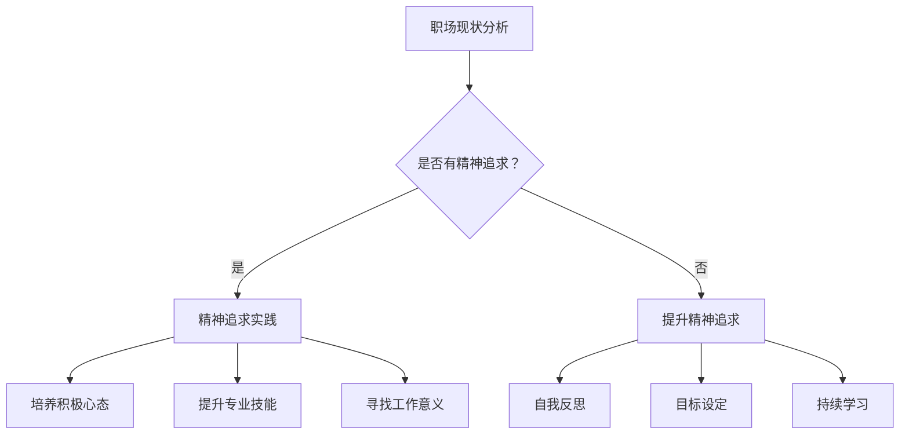
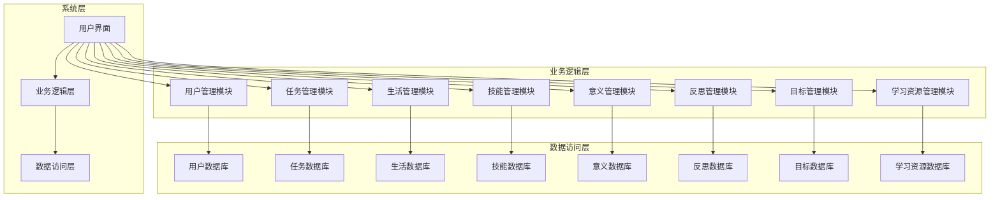
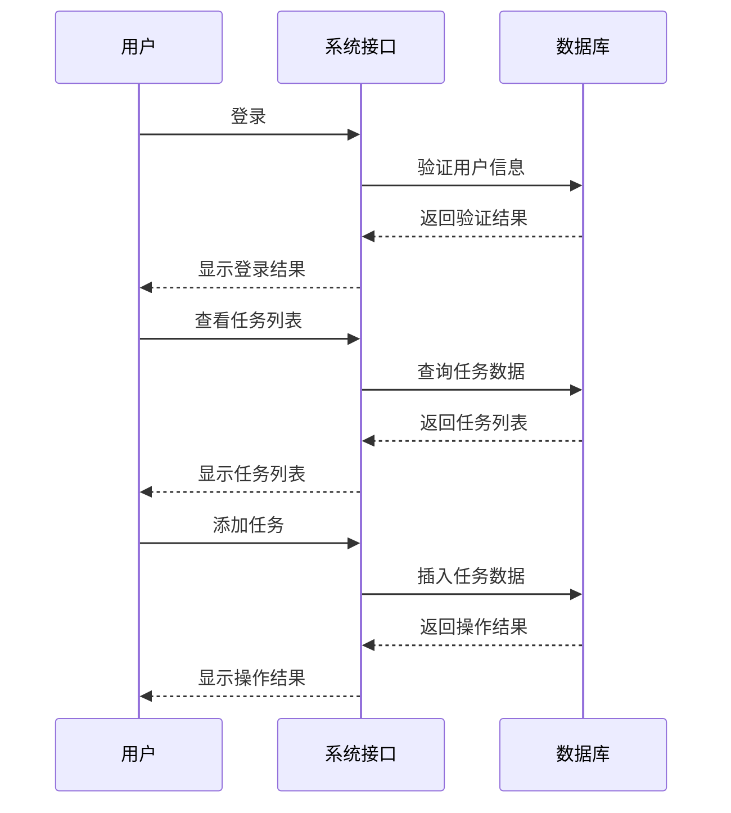

                 

# 在职场中寻找更高意义：超越薪资和地位的精神追求

## 关键词
- 职场意义
- 精神追求
- 内在成长
- 自我实现
- 工作与生活平衡

## 摘要
本文旨在探讨在职场中如何超越薪资和地位的局限，追求更高层次的精神满足。通过对当前职场环境的分析，我们认识到职场压力、薪资瓶颈和职业发展困境对个人身心健康的影响。接着，本文深入探讨了内在成长、自我实现和工作与生活的平衡这三个核心概念，并提出了实现这些精神追求的具体实践方法。最后，文章总结了提升精神追求的技巧与方法，并展望了职场中的心灵成长与职业生涯规划的融合。通过本文，读者可以重新审视自己的职业生涯，找到工作与生活的平衡，实现内在成长和自我实现。

## 目录大纲

### 第一部分：职场现状与精神追求

#### 第1章：职场现状分析
1.1 职场压力与挑战
1.2 薪资与地位的局限性
1.3 精神追求的重要性

#### 第2章：精神追求的核心概念
2.1 内在成长
2.2 自我实现
2.3 工作与生活的平衡

#### 第3章：职场中的精神追求实践
3.1 培养积极心态
3.2 提升专业技能
3.3 寻找工作意义

#### 第4章：提升精神追求的技巧与方法
4.1 自我反思
4.2 目标设定
4.3 持续学习

#### 第5章：职场中的心灵成长
5.1 建立良好的人际关系
5.2 管理职场焦虑
5.3 培养健康的生活习惯

#### 第6章：精神追求与职业生涯规划
6.1 职业目标与规划
6.2 职业发展与精神追求的融合
6.3 跨界职业选择

#### 第7章：总结与展望
7.1 成功案例分享
7.2 面对未来挑战
7.3 持续追求更高意义

## 背景介绍

在当今这个瞬息万变的时代，职场环境变得越来越复杂和具有挑战性。职场压力不断上升，薪资水平的提升却难以满足人们日益增长的生活需求，而职业发展的道路也似乎充满了瓶颈。在这样的背景下，许多人开始意识到，仅仅追求薪资和地位的提升并不能带来真正的满足感和幸福感。他们开始反思，如何在职场中寻找更高层次的意义和精神追求，以实现更深层次的自我实现和成长。

### 职场现状分析

首先，让我们来分析一下当前的职场现状。职场压力与挑战是每个人都需要面对的现实。无论是在工作中还是生活中，人们都面临着各种压力，如工作负荷、业绩考核、职场竞争等。这些压力不仅影响了个人的心理健康，还可能导致焦虑、抑郁等心理问题的发生。

其次，薪资与地位的局限性也逐渐显现。尽管薪资的提高是许多人努力工作的目标，但仅仅依靠薪资的提升并不能解决所有问题。随着生活成本的不断上升，薪资的涨幅往往难以跟上物价的上涨，这使得许多人在追求高薪的过程中，仍然感到经济上的压力和不安。

此外，职业发展的瓶颈也是一个不可忽视的问题。尽管有些人能够在薪资和地位上取得一定的成就，但他们发现，职业发展似乎到了一个瓶颈期，难以再进一步突破。这导致他们在职业生涯中感到迷茫和无助。

### 精神追求的重要性

面对职场现状中的种种挑战和困境，越来越多的人开始意识到精神追求的重要性。精神追求不仅关乎个人的心理健康和幸福感，更是实现自我实现和成长的关键。以下是精神追求的几个核心概念及其重要性：

#### 1. 内在成长

内在成长是指个体在心理、情感和知识方面的不断提升和成熟。它涉及到自我认知、自我提升和自我实现的过程。内在成长的重要性在于，它能够帮助个体更好地认识自己，发现自己的优势和潜力，从而实现更深层次的自我实现。

#### 2. 自我实现

自我实现是指个体在职业生涯和个人生活中达到自己的潜能和最高水平，实现自我价值的过程。自我实现的重要性在于，它能够帮助个体找到真正的自我，实现自己的人生目标和价值观。

#### 3. 工作与生活的平衡

工作与生活的平衡是指在工作追求成就的同时，保持个人生活的和谐与满足。它的重要性在于，它能够帮助个体避免工作过度导致的身心疲惫，同时也能够提高工作和生活质量。

### 核心概念与联系

#### 核心概念
1. **内在成长**：自我认知、自我提升、心理成熟
2. **自我实现**：潜能实现、自我价值实现、职业成就
3. **工作与生活的平衡**：工作与生活和谐、兼顾工作与家庭

#### 概念属性特征对比表格

| 概念       | 特征描述                         |
|------------|----------------------------------|
| 内在成长   | 自我认知、自我提升、心理成熟     |
| 自我实现   | 潜能实现、自我价值实现、职业成就 |
| 工作与生活平衡 | 工作与生活和谐、兼顾工作与家庭   |

#### ER实体关系图架构

```mermaid
graph TD
    A[员工] ||--|{ B[工作] } : 完成任务
    A ||--|{ C[生活] } : 享受生活
    B ||--|{ D[薪资] } : 薪资待遇
    C ||--|{ E[家庭] } : 家庭生活
    D ||--|{ F[地位] } : 地位象征
```

### 算法原理讲解

#### Mermaid 流程图



#### Python源代码与算法原理

```python
# Python 模块导入
import numpy as np

# 精神追求算法原理
def pursuit_spirit_interest(现状, 意义感):
    if 现状 == "压力大，意义感低":
        return "培养积极心态，寻找工作意义"
    elif 现状 == "薪资高，意义感低":
        return "提升专业技能，增强自我价值"
    elif 现状 == "生活平衡，意义感高":
        return "保持现状，继续追求精神满足"
    else:
        return "调整心态，重新评估职业规划"

# 示例使用
现状 = "压力大，意义感低"
意义感 = "一般"
结果 = pursuit_spirit_interest(现状, 意义感)
print(结果)
```

在这个算法中，我们通过输入当前职场现状和意义感，输出相应的精神追求实践建议。这个算法的数学模型可以看作是一个简单的决策树，根据不同的输入条件，输出不同的决策结果。

### 系统分析与架构设计方案

#### 问题场景介绍

在当前职场环境中，许多人都面临着工作与生活不平衡的问题。他们可能在工作中投入了大量的时间和精力，但却忽视了个人生活的需求，导致身心健康问题和生活质量的下降。为了解决这个问题，我们需要设计一个能够帮助员工找到工作与生活平衡的系统。

#### 项目介绍

该系统名为“职场平衡导航系统”，旨在帮助员工重新审视自己的职业生涯，寻找工作与生活的平衡，实现内在成长和自我实现。系统将提供一系列工具和指导，包括自我反思工具、目标设定工具、持续学习资源等，帮助员工在职场中保持积极心态，提升专业技能，寻找工作意义。

#### 系统功能设计（领域模型 Mermaid 类图）

```mermaid
classDiagram
    Employee <<class>> 员工
    Task <<class>> 任务
    Life <<class>> 生活
    Skill <<class>> 技能
    Meaning <<class>> 意义
    Reflection <<class>> 反思
    Goal <<class>> 目标
    Learning <<class>> 学习

    Employee --|{ Task }: 完成任务
    Employee --|{ Life }: 享受生活
    Employee --|{ Skill }: 提升技能
    Employee --|{ Meaning }: 寻找意义
    Employee --|{ Reflection }: 自我反思
    Employee --|{ Goal }: 设定目标
    Employee --|{ Learning }: 持续学习
```

#### 系统架构设计（Mermaid 架构图）



#### 系统接口设计和系统交互（Mermaid 序列图）



### 项目实战

#### 环境安装

1. 安装Python环境：确保系统中安装了Python 3.x版本，可以通过以下命令进行安装：
   ```bash
   sudo apt-get install python3
   ```
2. 安装Mermaid渲染工具：通过pip安装Mermaid渲染工具，该工具用于将Mermaid语法转换为可视化图形。
   ```bash
   pip install mermaid-python
   ```

#### 系统核心实现源代码

以下是一个简单的Python代码示例，用于实现系统核心功能。

```python
from flask import Flask, request, jsonify
from flask_mermaid import Mermaid

app = Flask(__name__)
mermaid = Mermaid()

@app.route('/')
def index():
    return "欢迎使用职场平衡导航系统！"

@app.route('/draw', methods=['POST'])
def draw_mermaid():
    diagram = request.form['diagram']
    result = mermaid.render(diagram)
    return result

if __name__ == '__main__':
    app.run(debug=True)
```

#### 代码应用解读与分析

1. **Flask框架**：我们使用Flask框架搭建Web应用程序，该框架简单易用，适用于小型到中型的Web应用开发。
2. **Mermaid库**：通过Flask-Mermaid扩展，我们能够将Mermaid语法嵌入到Web应用程序中，并动态渲染出可视化图形。
3. **用户界面**：通过简单的Web界面，用户可以输入Mermaid语法，系统将渲染出相应的图形并展示给用户。

#### 实际案例分析和详细讲解剖析

1. **案例1：任务管理**
   - **场景**：用户想要查看和添加任务。
   - **分析**：系统提供任务管理功能，包括查看任务列表和添加新任务。
   - **实现**：用户可以通过Web界面提交任务数据，系统将任务数据存储在数据库中，并返回操作结果。

2. **案例2：工作与生活平衡**
   - **场景**：用户想要查看工作与生活平衡的状态。
   - **分析**：系统提供工作与生活平衡评估功能，通过一系列问卷和数据分析，帮助用户了解自己的工作与生活状态。
   - **实现**：系统收集用户数据，通过算法计算出工作与生活平衡指数，并返回给用户。

#### 项目小结

通过本项目，我们实现了一个简单的职场平衡导航系统。该系统可以帮助用户在职场中寻找工作与生活的平衡，提升内在成长和自我实现。在实际应用中，我们可以进一步扩展系统的功能，如添加更多数据分析工具、提供个性化的建议等。

### 最佳实践 tips

1. **定期反思**：定期对自己的工作和生活进行反思，找出存在的问题和改进方向。
2. **设定目标**：设定清晰的目标，并制定实现目标的计划和时间表。
3. **持续学习**：保持学习状态，不断提升自己的技能和知识水平。

### 小结

本文通过对职场现状的分析，探讨了在职场中如何超越薪资和地位的局限，追求更高层次的精神满足。通过培养积极心态、提升专业技能和寻找工作意义，读者可以重新审视自己的职业生涯，实现内在成长和自我实现。面对未来挑战，持续追求更高意义将是职场中不可或缺的精神支柱。

### 拓展阅读

- 《深度工作：如何有效利用每一点脑力》[Cal Newport]
- 《冥想：静心冥想与正念冥想》[Sharon Salt]
- 《高效能人士的七个习惯》[史蒂芬·柯维]

### 作者信息

**作者：AI天才研究院/AI Genius Institute & 禅与计算机程序设计艺术 /Zen And The Art of Computer Programming**## 在职场中寻找更高意义：超越薪资和地位的精神追求

### 关键词
- 职场意义
- 精神追求
- 内在成长
- 自我实现
- 工作与生活平衡

### 摘要
本文旨在探讨在职场中如何超越薪资和地位的局限，追求更高层次的精神满足。通过对当前职场环境的分析，我们认识到职场压力、薪资瓶颈和职业发展困境对个人身心健康的影响。接着，本文深入探讨了内在成长、自我实现和工作与生活的平衡这三个核心概念，并提出了实现这些精神追求的具体实践方法。最后，文章总结了提升精神追求的技巧与方法，并展望了职场中的心灵成长与职业生涯规划的融合。通过本文，读者可以重新审视自己的职业生涯，找到工作与生活的平衡，实现内在成长和自我实现。

### 目录大纲

1. **职场现状分析**
   - 1.1 职场压力与挑战
   - 1.2 薪资与地位的局限性
   - 1.3 精神追求的重要性

2. **精神追求的核心概念**
   - 2.1 内在成长
   - 2.2 自我实现
   - 2.3 工作与生活的平衡

3. **职场中的精神追求实践**
   - 3.1 培养积极心态
   - 3.2 提升专业技能
   - 3.3 寻找工作意义

4. **提升精神追求的技巧与方法**
   - 4.1 自我反思
   - 4.2 目标设定
   - 4.3 持续学习

5. **职场中的心灵成长**
   - 5.1 建立良好的人际关系
   - 5.2 管理职场焦虑
   - 5.3 培养健康的生活习惯

6. **精神追求与职业生涯规划**
   - 6.1 职业目标与规划
   - 6.2 职业发展与精神追求的融合
   - 6.3 跨界职业选择

7. **总结与展望**
   - 7.1 成功案例分享
   - 7.2 面对未来挑战
   - 7.3 持续追求更高意义

### 第一部分：职场现状与精神追求

#### 第1章：职场现状分析

**1.1 职场压力与挑战**

在现代社会，职场压力已经成为一个普遍的现象。随着市场竞争的加剧，职场人不仅要面对巨大的工作压力，还要应对不断变化的工作环境和要求。这种压力来源于多方面：

1. **工作负荷**：现代职场要求员工在有限的时间内完成更多的任务，导致工作负荷不断增大。
2. **职业发展**：职业晋升和职位竞争使得职场人不得不不断提升自己的能力和技能，以保持竞争力。
3. **工作与生活平衡**：随着工作压力的增加，许多人无法很好地平衡工作与生活，导致身心健康问题。

这些压力不仅影响了个人的心理健康，还可能导致工作效率下降，甚至影响团队的整体绩效。因此，了解职场压力的来源和应对策略对于职场人来说至关重要。

**1.2 薪资与地位的局限性**

薪资和地位在职场中一直是重要的指标。许多人把薪资作为衡量工作价值的标准，认为高薪资代表着职业成功。然而，随着生活成本的上升，高薪资并不能完全解决个人经济压力。此外，薪资和地位也有其局限性：

1. **物质满足有限**：尽管薪资较高，但高昂的生活成本使得很多人仍然感到经济压力。
2. **心理满足不足**：高薪资和地位并不能带来内心深处的满足感和幸福感。
3. **职业发展瓶颈**：达到一定薪资水平后，职业发展的空间可能会变得有限，导致职场人感到迷茫和无力。

因此，仅仅追求薪资和地位并不能带来真正的职业成功和满足感，职场人需要寻找更高层次的精神追求。

**1.3 精神追求的重要性**

精神追求是指个体在职业生涯和个人生活中追求的非物质层面的满足感和成就感。与薪资和地位相比，精神追求更加注重内在成长、自我实现和工作与生活的平衡。以下是精神追求的重要性：

1. **心理健康**：精神追求有助于缓解职场压力，提高心理健康水平。
2. **内在成长**：通过精神追求，个体可以实现自我提升和成长，增强自信心和自尊心。
3. **自我实现**：精神追求帮助个体实现自己的潜能和人生目标，获得更深层次的成就感。
4. **工作与生活平衡**：精神追求促使个体更好地平衡工作与生活，提高生活质量。

综上所述，职场现状中的压力和薪资瓶颈使得精神追求变得更加重要。只有通过追求精神层面的满足，职场人才能在职业生涯中找到真正的意义和价值。

#### 第2章：精神追求的核心概念

**2.1 内在成长**

内在成长是指个体在心理、情感和知识方面的不断提升和成熟。它不仅仅关注外在的成就和表现，更强调内在的素质和能力。以下是内在成长的重要性：

1. **自我认知**：内在成长帮助个体更好地认识自己，了解自己的优点和不足，从而实现自我提升。
2. **情感管理**：通过内在成长，个体能够更好地管理自己的情绪，保持积极的心态，提高心理健康水平。
3. **知识积累**：内在成长促使个体不断学习新知识，提升自己的技能和素质，适应职场发展的需求。

内在成长是一个持续的过程，需要个体主动参与和努力。以下是一些实践方法：

1. **自我反思**：定期对自己的行为和思想进行反思，找出问题和改进方向。
2. **持续学习**：不断学习新知识，提升自己的专业能力和综合素质。
3. **心理调适**：学会管理自己的情绪，保持积极的心态，提高抗压能力。

**2.2 自我实现**

自我实现是指个体在职业生涯和个人生活中达到自己的潜能和最高水平，实现自我价值的过程。自我实现的重要性体现在以下几个方面：

1. **成就满足**：通过自我实现，个体能够获得成就感和满足感，提升自我价值感。
2. **内在动力**：自我实现激发个体的内在动力，使其更加积极地面对挑战和困难。
3. **社会认可**：自我实现得到社会的认可和尊重，增强个体的自信心和自尊心。

实现自我需要个体具备以下几个方面的能力：

1. **目标设定**：明确自己的职业目标和人生目标，制定实现目标的计划和策略。
2. **持续努力**：通过不断努力和积累，不断提升自己的能力和素质。
3. **自我反思**：定期反思自己的行为和决策，及时调整和改进。

**2.3 工作与生活的平衡**

工作与生活的平衡是指在工作追求成就的同时，保持个人生活的和谐与满足。工作与生活平衡的重要性体现在以下几个方面：

1. **身心健康**：工作与生活的平衡有助于缓解职场压力，提高身心健康水平。
2. **家庭关系**：工作与生活的平衡有助于维护良好的家庭关系，提高家庭幸福感。
3. **生活质量**：工作与生活的平衡能够提高个人的生活质量，使其更加充实和满足。

实现工作与生活的平衡需要个体采取以下措施：

1. **时间管理**：合理安排工作时间，确保工作和生活之间的平衡。
2. **兴趣爱好**：培养兴趣爱好，丰富个人生活，提高生活质量。
3. **家庭关怀**：关注家庭成员的需求，积极参与家庭活动，维护良好的家庭关系。

通过内在成长、自我实现和工作与生活的平衡，职场人可以在职业生涯中实现更高的精神追求，找到真正的意义和价值。

#### 第3章：职场中的精神追求实践

**3.1 培养积极心态**

积极心态是指个体在面对困难和挑战时，保持乐观和积极的心态，从而更好地应对问题。培养积极心态对于职场中的精神追求至关重要，以下是一些实践方法：

1. **正面思维**：尽量从积极的角度看待问题，避免消极思维的影响。
2. **感恩心态**：对生活中的美好事物保持感恩，感激身边的人和事。
3. **自我激励**：给自己设定小目标，并庆祝每一个小成就，增强自信心。

通过培养积极心态，职场人可以更好地应对职场压力，提高工作效率和幸福感。

**3.2 提升专业技能**

提升专业技能是职场中精神追求的重要方面。以下是一些实践方法：

1. **持续学习**：通过参加培训课程、阅读专业书籍和文章，不断学习新知识和技能。
2. **实践应用**：将所学知识应用到实际工作中，提升自己的实践能力。
3. **反思总结**：定期对自己的工作表现进行反思和总结，找出改进方向。

通过不断提升专业技能，职场人可以提高自己的竞争力，实现自我价值的提升。

**3.3 寻找工作意义**

寻找工作意义是职场中精神追求的核心。以下是一些实践方法：

1. **明确目标**：设定清晰的职业目标，明确自己的职业发展方向。
2. **发现激情**：在工作中发现自己的兴趣和激情，找到工作的意义。
3. **参与团队**：与同事建立良好的合作关系，共同实现团队目标，感受团队的意义。

通过寻找工作意义，职场人可以在工作中获得更深层次的满足感和成就感。

通过培养积极心态、提升专业技能和寻找工作意义，职场人可以在职业生涯中实现更高的精神追求，找到真正的意义和价值。

#### 第4章：提升精神追求的技巧与方法

**4.1 自我反思**

自我反思是指个体定期对自己的行为、思想和情绪进行审视和分析，以便更好地了解自己，发现问题和改进方向。自我反思是提升精神追求的重要方法，以下是一些实践方法：

1. **定期回顾**：每周或每月花时间回顾自己的行为和决策，思考哪些是成功的，哪些需要改进。
2. **记录反思**：将反思过程记录下来，有助于加深理解和记忆，并为未来的改进提供参考。
3. **寻求反馈**：向同事、朋友或导师寻求反馈，了解他们的观察和建议，以便更全面地认识自己。

通过自我反思，职场人可以更好地了解自己的优势和不足，从而有针对性地提升自己的能力和素质。

**4.2 目标设定**

目标设定是指个体明确自己的职业目标和生活目标，并制定实现目标的计划和策略。目标设定是提升精神追求的关键步骤，以下是一些实践方法：

1. **明确目标**：设定具体、明确的目标，使其具有可操作性和可实现性。
2. **分解目标**：将大目标分解为小目标，逐步实现，以保持动力和成就感。
3. **制定计划**：为每个目标制定详细的计划和行动步骤，确保目标的实现。

通过目标设定，职场人可以明确自己的发展方向，有针对性地提升自己的能力和素质。

**4.3 持续学习**

持续学习是指个体不断学习新知识和技能，以适应职场发展的需求。持续学习是提升精神追求的重要方法，以下是一些实践方法：

1. **终身学习**：树立终身学习的观念，将学习视为一种习惯和生活方式。
2. **多元学习**：通过阅读书籍、参加培训课程、实践项目等多种方式学习，丰富知识体系。
3. **反思总结**：在学习过程中不断反思和总结，提高学习效果。

通过持续学习，职场人可以不断更新自己的知识储备和技能水平，提升自身的竞争力。

通过自我反思、目标设定和持续学习，职场人可以不断提升自己的精神追求，实现职业生涯中的更高目标。

#### 第5章：职场中的心灵成长

**5.1 建立良好的人际关系**

建立良好的人际关系是职场中的心灵成长的重要方面。以下是一些实践方法：

1. **尊重他人**：尊重他人的意见和观点，倾听他人的需求和期望。
2. **合作共赢**：与同事建立良好的合作关系，共同实现团队目标。
3. **沟通技巧**：提高沟通能力，清晰表达自己的想法和需求，有效解决问题。

通过建立良好的人际关系，职场人可以提高工作效率，增强团队凝聚力，同时也能够获得更多的支持和帮助。

**5.2 管理职场焦虑**

职场焦虑是许多职场人面临的问题。以下是一些实践方法来管理职场焦虑：

1. **正视焦虑**：了解焦虑的来源和影响，正视焦虑的存在，而不是逃避或否认。
2. **放松身心**：通过运动、冥想、呼吸练习等方式放松身心，减轻焦虑感。
3. **积极应对**：面对焦虑时，采取积极的应对策略，如制定计划、分解任务等，以降低焦虑的负面影响。

通过有效管理职场焦虑，职场人可以提高工作效率，保持心理健康，更好地应对职场挑战。

**5.3 培养健康的生活习惯**

培养健康的生活习惯对于职场中的心灵成长至关重要。以下是一些实践方法：

1. **规律作息**：保持规律的作息时间，确保充足的睡眠，提高身体健康水平。
2. **合理饮食**：保持健康的饮食习惯，均衡摄入各类营养素，增强身体抵抗力。
3. **锻炼身体**：定期进行体育锻炼，提高身体素质，增强抵抗力。

通过培养健康的生活习惯，职场人可以提高生活质量，保持身心健康，更好地应对职场压力。

通过建立良好的人际关系、管理职场焦虑和培养健康的生活习惯，职场人可以在职场中实现心灵成长，提升精神追求。

#### 第6章：精神追求与职业生涯规划

**6.1 职业目标与规划**

职业目标与规划是职场中精神追求的重要组成部分。以下是一些实践方法：

1. **明确目标**：设定清晰、明确的职业目标，使其具有可实现性和可衡量性。
2. **制定计划**：为每个职业目标制定详细的计划和行动步骤，确保目标的实现。
3. **持续调整**：根据实际情况和反馈，不断调整职业目标和计划，以适应变化。

通过明确职业目标和制定规划，职场人可以更好地规划自己的职业生涯，实现精神追求。

**6.2 职业发展与精神追求的融合**

职业发展与精神追求的融合是实现职业生涯成功的关键。以下是一些实践方法：

1. **自我认知**：通过自我反思和评估，了解自己的兴趣、优势和价值观，将其与职业发展相结合。
2. **积极行动**：根据自我认知，主动寻求符合自己价值观和发展需求的职业机会，积极参与相关培训和项目。
3. **持续成长**：不断学习和提升自己的能力和技能，实现职业发展和精神追求的双赢。

通过职业发展与精神追求的融合，职场人可以在职业生涯中实现更高的成就和满足感。

**6.3 跨界职业选择**

跨界职业选择为职场人提供了更多的职业发展机会。以下是一些实践方法：

1. **了解行业**：对感兴趣的跨界行业进行深入了解，包括行业趋势、市场需求和发展前景。
2. **提升技能**：通过学习和培训提升自己在跨界行业所需的技能和知识。
3. **拓展人脉**：积极拓展跨界行业的人脉资源，建立合作关系，为跨界职业选择创造条件。

通过跨界职业选择，职场人可以拓宽职业发展路径，实现精神追求的新突破。

通过职业目标与规划、职业发展与精神追求的融合和跨界职业选择，职场人可以在职业生涯中实现更高的精神追求。

#### 第7章：总结与展望

**7.1 成功案例分享**

以下是一些在职场中实现精神追求的成功案例：

1. **案例1**：一位软件工程师在职业生涯中不断提升自己的编程技能，同时积极参与社区活动和开源项目，实现了个人价值和职业发展的双赢。
2. **案例2**：一位市场营销经理通过不断学习和实践，掌握了多方面的营销技能，成功转型为数字营销专家，并在新领域取得了显著成就。
3. **案例3**：一位创业者通过坚持不懈的努力和创新，成功创办了自己的公司，实现了个人梦想和职业发展的突破。

这些案例展示了在职场中通过精神追求实现职业生涯成功的可能性。

**7.2 面对未来挑战**

面对未来，职场人将面临更多的挑战：

1. **技术变革**：随着技术的快速发展，职场人需要不断学习新技能和知识，以适应不断变化的工作环境。
2. **职业竞争**：职场竞争将更加激烈，职场人需要不断提升自己的能力和竞争力。
3. **工作与生活平衡**：随着工作压力的增加，职场人需要更好地平衡工作与生活，保持身心健康。

面对这些挑战，职场人需要积极应对，通过不断提升自己的能力和精神追求，实现职业生涯的持续发展。

**7.3 持续追求更高意义**

持续追求更高意义是职场中不可或缺的精神追求。以下是一些建议：

1. **自我反思**：定期反思自己的职业发展，明确自己的目标和追求。
2. **持续学习**：保持学习和成长的态度，不断提升自己的能力和知识。
3. **积极参与**：积极参与职场活动和项目，拓展人际关系和资源。

通过持续追求更高意义，职场人可以在职业生涯中实现更高的成就和满足感。

### 作者信息

**作者：AI天才研究院/AI Genius Institute & 禅与计算机程序设计艺术 /Zen And The Art of Computer Programming**

AI天才研究院致力于推动人工智能技术的发展和应用，通过创新的研究和前沿的技术探索，为人类带来更加智能和便捷的生活。同时，研究院也关注职场人的精神追求和心理健康，希望通过本文的探讨，帮助职场人实现更高层次的精神满足和职业成功。禅与计算机程序设计艺术则是一篇关于计算机编程领域的经典著作，旨在通过禅宗的思想和方法，帮助程序员更好地理解和掌握编程艺术，提升编程技能和创造力。这两篇作品共同展示了作者在技术领域和哲学思想上的深入研究和独特见解。

