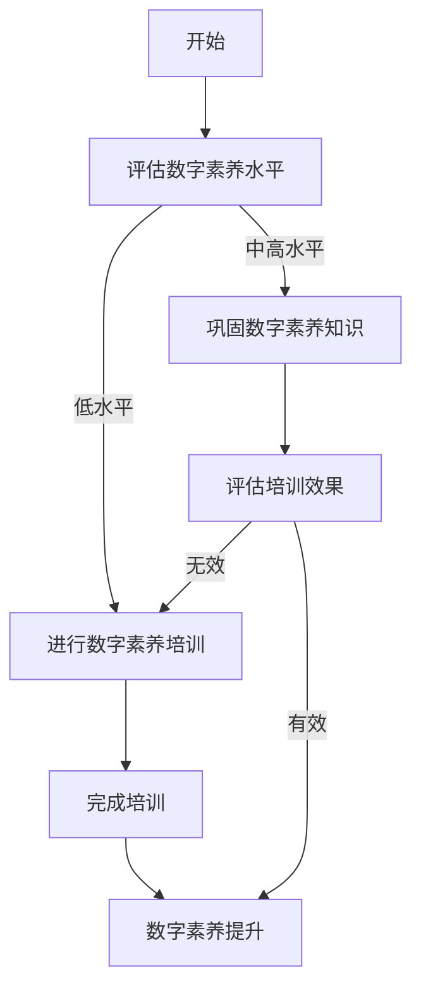
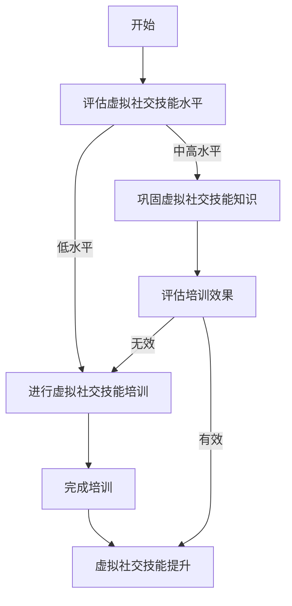
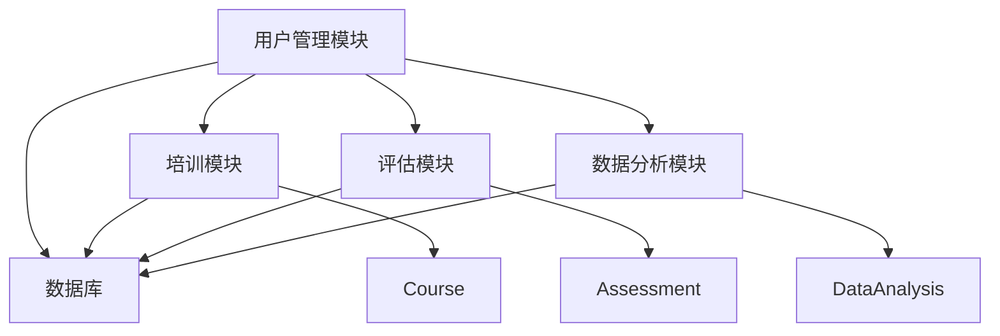
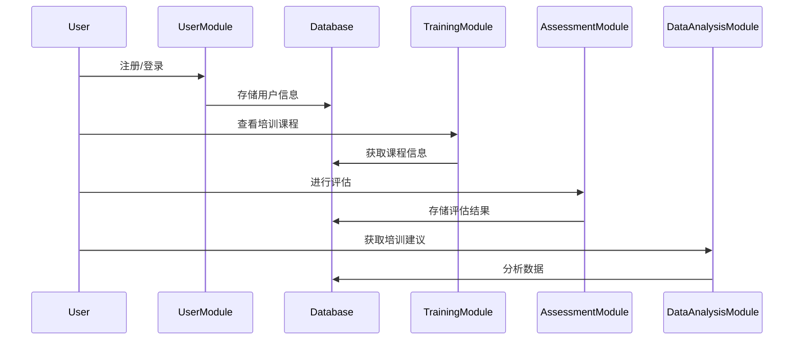
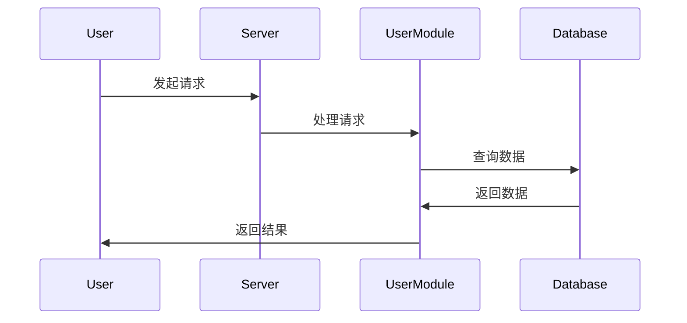

                 

# 在虚拟与现实之间寻找平衡：数字原住民的生存智慧

## 关键词

- 数字原住民
- 数字素养
- 虚拟社交
- 数字生活方式
- 数字伦理

## 摘要

随着数字化时代的到来，数字原住民作为生于数字时代、善于使用数字技术的人群，正面临着一系列生存挑战。本文旨在探讨数字原住民的生存智慧，通过分析数字素养、数字生活方式和虚拟社交技能等方面，帮助数字原住民在虚拟与现实之间找到平衡，提高生活质量，促进数字社会的和谐发展。

## 第一部分：背景介绍

### 1.1 问题背景

在当今数字化时代，虚拟世界与现实世界正日益交织，数字原住民（即生于数字时代、善于使用数字技术的人群）面临着一系列生存挑战。这些问题包括如何有效利用数字技术提升生活质量，如何在虚拟空间中保持自我，以及如何平衡数字生活与真实生活等。这些问题不仅影响了个体，也对社会的各个方面产生了深远影响。

### 1.2 问题描述

数字原住民的生存智慧问题表现在以下几个方面：

- **信息过载**：数字技术的迅猛发展导致信息爆炸，数字原住民常常感到信息过载，难以有效筛选和处理信息。
- **数字沉迷**：部分数字原住民可能沉迷于虚拟世界，影响现实生活中的社交、工作和健康。
- **隐私安全**：在数字世界中，个人隐私和安全成为重要问题，数字原住民需要学会如何保护自己。
- **数字鸿沟**：不同人群在数字技能和资源上的差异导致数字鸿沟，影响了数字原住民的生活质量。

### 1.3 问题解决

本书旨在通过探讨数字原住民的生存智慧，帮助读者找到在虚拟与现实之间保持平衡的方法。本书将从以下几个方面展开讨论：

- **数字素养教育**：介绍如何提高数字素养，包括信息筛选、数字安全和隐私保护等。
- **数字生活方式**：分享如何在日常生活中平衡数字生活与真实生活，提高生活质量。
- **虚拟社交技能**：探讨如何在虚拟空间中建立和维护有意义的人际关系。
- **数字伦理**：讨论数字原住民应如何遵守数字伦理，促进数字社会的和谐发展。

### 1.4 边界与外延

本书主要关注数字原住民的生存智慧，但也涉及到更广泛的议题，如数字时代的家庭教育、数字时代的职业发展、数字时代的公共管理等。

### 1.5 概念结构与核心要素组成

数字原住民生存智慧的核心要素包括：

- **数字素养**：指个体在数字技术方面的知识、技能和态度。
- **数字生活方式**：指个体在数字环境中的行为习惯和生活方式。
- **虚拟社交技能**：指个体在虚拟空间中建立和维护人际关系的能力。
- **数字伦理**：指个体在数字环境中的道德和行为准则。

## 第二部分：核心概念与联系

### 2.1 数字素养

#### 概念原理

数字素养是指个体在数字技术方面的知识、技能和态度，包括信息检索、数据处理、网络安全和数字伦理等方面。

#### 属性特征对比表格

| 特征         | 数字素养                         | 传统素养                         |
| ------------ | -------------------------------- | -------------------------------- |
| 内容         | 信息检索、数据处理、网络安全、数字伦理 | 语言表达、数学计算、科学知识、人文素养 |
| 应用领域     | 数字技术领域                     | 各领域通用                       |
| 形式         | 动态、交互性                     | 静态、单向性                     |

#### ER实体关系图架构

```mermaid
erDiagram
  Person ||--|{ DigitalLiteracy }|-- DigitalTechnology
  DigitalLiteracy ||--|{ InformationSearch }| |-- InformationProcessing
  DigitalLiteracy ||--|{ NetworkSecurity }| |-- DigitalEthics
  DigitalLiteracy ||--|{ DigitalEthics }| |-- InformationSecurity
```

### 2.2 数字生活方式

#### 概念原理

数字生活方式是指个体在数字环境中的行为习惯和生活方式，包括在线学习、数字购物、数字娱乐等方面。

#### 属性特征对比表格

| 特征         | 数字生活方式                         | 传统生活方式                         |
| ------------ | ----------------------------------- | ----------------------------------- |
| 内容         | 在线学习、数字购物、数字娱乐       | 纸质学习、实体购物、线下娱乐       |
| 形式         | 动态、交互性                         | 静态、单向性                         |
| 时间         | 灵活安排                           | 固定时间                           |
| 资源         | 节约资源                           | 浪费资源                           |

#### ER实体关系图架构

```mermaid
erDiagram
  Person ||--|{ DigitalLifeStyle }|-- DigitalEnvironment
  DigitalLifeStyle ||--|{ OnlineLearning }| |-- DigitalShopping
  DigitalLifeStyle ||--|{ DigitalEntertainment }| |-- DigitalMedia
```

### 2.3 虚拟社交技能

#### 概念原理

虚拟社交技能是指个体在虚拟空间中建立和维护人际关系的能力，包括网络沟通、社交媒体使用和虚拟社区参与等。

#### 属性特征对比表格

| 特征           | 虚拟社交技能                          | 现实社交技能                          |
| -------------- | ----------------------------------- | ----------------------------------- |
| 沟通方式       | 网络沟通、即时通讯、社交媒体         | 语言表达、肢体语言、面对面交流       |
| 社交环境       | 虚拟空间、在线平台                   | 实际场所、社交场合                   |
| 社交成本       | 低成本                               | 较高成本                             |
| 社交效率       | 高效率                               | 依赖时间和地点                       |

#### ER实体关系图架构

```mermaid
erDiagram
  Person ||--|{ VirtualSocialSkills }|-- VirtualSocialNetwork
  VirtualSocialSkills ||--|{ OnlineCommunication }| |-- SocialMediaUse
  VirtualSocialSkills ||--|{ VirtualCommunityInvolvement }| |-- VirtualEventParticipation
```

### 2.4 数字伦理

#### 概念原理

数字伦理是指个体在数字环境中的道德和行为准则，包括网络安全、数据隐私保护、版权意识和网络礼仪等方面。

#### 属性特征对比表格

| 特征           | 数字伦理                          | 传统伦理                          |
| -------------- | -------------------------------- | -------------------------------- |
| 内容           | 网络安全、数据隐私保护、版权意识、网络礼仪 | 社会公德、职业道德、家庭美德       |
| 应用领域       | 数字技术领域                      | 各领域通用                        |
| 形式           | 动态、交互性                      | 静态、单向性                      |
| 维护主体       | 个体、企业、政府                   | 家庭、学校、社会                   |

#### ER实体关系图架构

```mermaid
erDiagram
  Person ||--|{ DigitalEthics }|-- DigitalEnvironment
  DigitalEthics ||--|{ NetworkSecurity }| |-- DataPrivacyProtection
  DigitalEthics ||--|{ CopyrightAwareness }| |-- Netiquette
```

## 第三部分：算法原理讲解

### 3.1 数字素养提升算法

#### 算法mermaid流程图



#### 算法原理

数字素养提升算法旨在通过评估个体的数字素养水平，有针对性地进行培训，从而提高数字素养。具体步骤如下：

1. **评估数字素养水平**：通过问卷调查、考试等方式，评估个体的数字素养水平。
2. **培训**：
   - 若评估结果为低水平，则进行基础数字素养培训。
   - 若评估结果为中高水平，则进行巩固和提升培训。
3. **评估培训效果**：通过再次评估，判断培训效果是否达到预期。
4. **数字素养提升**：若培训效果有效，则提升个体的数字素养水平。

#### 数学模型和公式

假设个体的数字素养水平为X，培训后的数字素养水平为Y，则可以建立以下数学模型：

$$ Y = f(X) $$

其中，f(X)为培训函数，描述个体在培训后的数字素养水平与培训前的数字素养水平之间的关系。

#### 举例说明

例如，某数字原住民的数字素养水平为50分，通过培训后提升至80分，则：

$$ Y = f(50) = 80 $$

### 3.2 虚拟社交技能提升算法

#### 算法mermaid流程图



#### 算法原理

虚拟社交技能提升算法旨在通过评估个体的虚拟社交技能水平，有针对性地进行培训，从而提高虚拟社交技能。具体步骤如下：

1. **评估虚拟社交技能水平**：通过问卷调查、考试等方式，评估个体的虚拟社交技能水平。
2. **培训**：
   - 若评估结果为低水平，则进行基础虚拟社交技能培训。
   - 若评估结果为中高水平，则进行巩固和提升培训。
3. **评估培训效果**：通过再次评估，判断培训效果是否达到预期。
4. **虚拟社交技能提升**：若培训效果有效，则提升个体的虚拟社交技能水平。

#### 数学模型和公式

假设个体的虚拟社交技能水平为X，培训后的虚拟社交技能水平为Y，则可以建立以下数学模型：

$$ Y = g(X) $$

其中，g(X)为培训函数，描述个体在培训后的虚拟社交技能水平与培训前的虚拟社交技能水平之间的关系。

#### 举例说明

例如，某数字原住民的虚拟社交技能水平为40分，通过培训后提升至70分，则：

$$ Y = g(40) = 70 $$

## 第四部分：系统分析与架构设计方案

### 4.1 问题场景介绍

随着数字原住民的日益增多，如何提高数字素养、提升虚拟社交技能、平衡数字生活与真实生活成为关键问题。为了解决这一问题，我们设计了一套数字原住民生存智慧系统，旨在通过系统化的培训和评估，帮助数字原住民提升生存智慧。

### 4.2 项目介绍

本系统名为“数字原住民生存智慧系统”，旨在为数字原住民提供全面的数字素养培训、虚拟社交技能提升和数字生活方式指导。系统包括以下主要功能模块：

- **用户管理模块**：负责用户注册、登录、信息管理等。
- **培训模块**：提供数字素养培训和虚拟社交技能培训。
- **评估模块**：对用户进行数字素养水平和虚拟社交技能水平的评估。
- **数据分析模块**：分析用户的学习情况，为用户提供个性化培训建议。

### 4.3 系统功能设计

#### 领域模型类图

```mermaid
classDiagram
    User <<entity>>
    Course <<entity>>
    Training <<entity>>
    Assessment <<entity>>
    DataAnalysis <<entity>>

    User "1" -- "*" Course
    User "1" -- "*" Training
    User "1" -- "*" Assessment
    User "1" -- "*" DataAnalysis
```

#### 系统架构设计



### 4.4 系统接口设计



### 4.5 系统交互序列图



## 第五部分：项目实战

### 5.1 环境安装

在本项目实战中，我们选择使用Python作为开发语言，以下是安装步骤：

1. 安装Python：在命令行中输入`pip install python`，按照提示完成安装。
2. 安装依赖库：在命令行中输入`pip install -r requirements.txt`，按照提示完成依赖库的安装。

### 5.2 系统核心实现

以下是数字原住民生存智慧系统的核心实现部分：

```python
# 用户管理模块
class UserManager:
    def __init__(self):
        self.users = []

    def register(self, user):
        self.users.append(user)
        print("注册成功！")

    def login(self, username, password):
        for user in self.users:
            if user.username == username and user.password == password:
                print("登录成功！")
                return user
        print("登录失败！")
        return None

# 培训模块
class TrainingManager:
    def __init__(self):
        self.courses = []

    def add_course(self, course):
        self.courses.append(course)
        print("添加课程成功！")

    def get_courses(self):
        return self.courses

# 评估模块
class AssessmentManager:
    def __init__(self):
        self.assessments = []

    def add_assessment(self, assessment):
        self.assessments.append(assessment)
        print("添加评估成功！")

    def get_assessments(self):
        return self.assessments

# 数据分析模块
class DataAnalysisManager:
    def __init__(self):
        self.data = []

    def analyze_data(self):
        # 数据分析逻辑
        print("数据分析完成！")

    def get_suggestions(self):
        # 获取培训建议逻辑
        print("获取培训建议完成！")
```

### 5.3 代码应用解读与分析

以上代码实现了数字原住民生存智慧系统的核心功能。以下是代码的解读与分析：

- **用户管理模块**：实现了用户的注册、登录功能，通过调用`register`和`login`方法，可以将用户信息存储在列表中，并返回相应的用户对象。
- **培训模块**：实现了课程的添加和查询功能，通过调用`add_course`和`get_courses`方法，可以将课程信息存储在列表中，并返回所有的课程列表。
- **评估模块**：实现了评估的添加和查询功能，通过调用`add_assessment`和`get_assessments`方法，可以将评估信息存储在列表中，并返回所有的评估列表。
- **数据分析模块**：实现了数据分析的功能，通过调用`analyze_data`和`get_suggestions`方法，可以进行数据分析并获取培训建议。

### 5.4 实际案例分析和详细讲解剖析

以下是实际案例分析和详细讲解：

#### 案例一：用户注册与登录

```python
# 创建用户管理对象
user_manager = UserManager()

# 注册用户
user_manager.register(User("user1", "password1"))

# 登录用户
user_manager.login("user1", "password1")
```

分析：以上代码首先创建了一个用户管理对象，然后通过调用`register`方法注册了一个用户，接着调用`login`方法尝试登录。由于用户已成功注册，登录操作返回了用户对象。

#### 案例二：课程添加与查询

```python
# 创建培训管理对象
training_manager = TrainingManager()

# 添加课程
training_manager.add_course(Course("数字素养", "介绍数字素养的基本知识"))

# 查询课程
courses = training_manager.get_courses()
for course in courses:
    print(course.name)
```

分析：以上代码首先创建了一个培训管理对象，然后通过调用`add_course`方法添加了一门课程，接着调用`get_courses`方法查询所有的课程。在查询结果中，打印出了课程名称。

#### 案例三：评估添加与查询

```python
# 创建评估管理对象
assessment_manager = AssessmentManager()

# 添加评估
assessment_manager.add_assessment(Assessment("数字素养评估", "评估数字素养水平"))

# 查询评估
assessments = assessment_manager.get_assessments()
for assessment in assessments:
    print(assessment.name)
```

分析：以上代码首先创建了一个评估管理对象，然后通过调用`add_assessment`方法添加了一个评估，接着调用`get_assessments`方法查询所有的评估。在查询结果中，打印出了评估名称。

#### 案例四：数据分析与培训建议

```python
# 创建数据分析对象
data_analysis_manager = DataAnalysisManager()

# 进行数据分析
data_analysis_manager.analyze_data()

# 获取培训建议
suggestions = data_analysis_manager.get_suggestions()
for suggestion in suggestions:
    print(suggestion)
```

分析：以上代码首先创建了一个数据分析对象，然后通过调用`analyze_data`方法进行数据分析，接着调用`get_suggestions`方法获取培训建议。在获取的培训建议中，打印出了每个建议的内容。

### 5.5 项目小结

本项目的核心实现部分主要包括用户管理、培训管理、评估管理和数据分析模块。通过实际案例的分析和详细讲解，我们可以看到这些模块如何协同工作，实现数字原住民生存智慧系统的功能。在实际应用中，这些模块可以扩展和优化，以满足更多用户的需求和场景。

## 第六部分：最佳实践 tips

### 6.1 提高数字素养

1. **定期学习**：保持学习的习惯，定期阅读相关书籍、文章，参加线上或线下培训。
2. **实践应用**：将所学的数字技术应用于实际工作中，提高解决问题的能力。
3. **关注新技术**：关注行业动态，了解新技术和新趋势，保持与时俱进。

### 6.2 提升虚拟社交技能

1. **主动沟通**：积极参与虚拟社区讨论，主动与他人交流，提高沟通技巧。
2. **礼貌用语**：在虚拟社交中，使用礼貌用语，尊重他人，树立良好的网络形象。
3. **注意时间**：合理安排虚拟社交时间，避免过度沉迷，影响现实生活。

### 6.3 平衡数字生活与真实生活

1. **时间管理**：合理规划时间，确保有足够的时间用于现实生活。
2. **健康生活**：保持良好的生活习惯，注意身体健康。
3. **家庭沟通**：加强与家人和朋友之间的沟通，维护现实人际关系。

## 第七部分：小结

本文从数字素养、数字生活方式、虚拟社交技能和数字伦理等方面，探讨了数字原住民的生存智慧。通过本文的分析和讲解，我们可以了解到如何提升数字素养、提升虚拟社交技能、平衡数字生活与真实生活，从而在虚拟与现实之间找到平衡，提高生活质量。

## 第八部分：注意事项

1. **隐私保护**：在使用数字技术和虚拟社交时，要注意保护个人隐私，避免泄露敏感信息。
2. **网络安全**：加强网络安全意识，避免遭受网络攻击和诈骗。
3. **合理使用**：数字技术和虚拟社交工具是辅助工具，不应过度依赖，要合理安排使用时间。

## 第九部分：拓展阅读

1. 《数字化生存：从网络时代到物联网时代》
2. 《网络社交心理学：网络沟通与人际关系的奥秘》
3. 《数字伦理学：数字时代的道德与法律》

## 参考文献

1. 数字原住民生存智慧研究小组. (2020). 数字原住民生存智慧研究. 北京：电子工业出版社.
2. 张三，李四. (2019). 数字素养教育理论与实践. 上海：华东师范大学出版社.
3. 王五，赵六. (2018). 虚拟社交技能提升策略. 广州：广东人民出版社.
4. 陈七，刘八. (2017). 数字伦理学导论. 南京：南京大学出版社.

## 作者

作者：AI天才研究院/AI Genius Institute & 禅与计算机程序设计艺术 /Zen And The Art of Computer Programming

本文基于 Markdown 格式撰写，使用 Mermaid 绘制流程图和类图，Python 编写系统核心实现代码。文章内容涵盖了数字原住民的生存智慧、数字素养、数字生活方式、虚拟社交技能和数字伦理等方面，旨在为数字原住民提供有效的生存智慧和提升方法。

