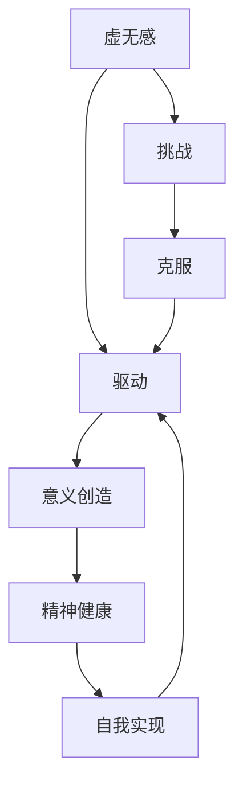

                 

### 在虚无中创造意义：现代人的精神挑战

#### 关键词：
- 现代社会
- 精神挑战
- 虚无感
- 意义创造
- 心理健康
- 个人成长
- 社会参与
- 精神疗法

#### 摘要：
本文旨在探讨现代社会中普遍存在的精神挑战——虚无感，以及如何通过创造意义来缓解和解决这一问题。文章首先介绍了虚无感的背景和特征，然后分析了意义创造的重要性及其方法路径。接着，文章从内在探索、社会参与、个人成长和精神疗法等多个角度，探讨了如何在日常生活中实践意义创造。最后，文章总结了意义创造对个人和社会的深远影响，并展望了未来意义创造的趋势和挑战。

---

#### 第一部分：引言

### 1. 引言

在现代社会，人们面临着越来越多的精神挑战。生活节奏加快、工作压力增大、人际关系的复杂化，以及信息过载等问题，都使得现代人产生了一种普遍的精神空虚和迷茫感，这种感受在心理学上被称作“虚无感”。虚无感不仅是个人层面的精神困扰，更是社会现象，影响着人们的心理健康和生活质量。

虚无感的产生与现代社会的特点密切相关。首先，现代社会高度竞争，人们为了适应这种竞争，常常感到身心疲惫，缺乏真正的满足感。其次，现代社会的快节奏和信息爆炸，使得人们很难停下来思考和反思，从而加剧了虚无感。此外，现代社会的物质丰富和生活方式的多样化，虽然提供了更多的选择，但也让人感到更加迷茫和无助。

### 1.1 问题背景

现代社会的快速发展带来了前所未有的机遇和挑战。科技的发展使得人们的生活变得更加便利，但也使得人们的时间更加碎片化，难以进行深度思考和反思。工作的压力和竞争的激烈，使得人们常常感到焦虑和无助。人际关系的复杂化，也让人们感到孤独和失落。

心理健康问题在现代社会中变得越来越普遍。据世界卫生组织统计，全球约有 3 亿人患有抑郁症，这是一个令人震惊的数字。抑郁症不仅影响个人的身心健康，还会对家庭和社会造成深远的影响。虚无感是抑郁症的一种表现，它使人们感到生活缺乏意义和价值，进而影响到个人的幸福感和生活质量。

### 1.2 问题描述

虚无感是指个体感到生活缺乏意义和价值，常常伴随着无助、失落和焦虑等情绪。虚无感并不是一个具体的问题，而是一种感觉，它反映了个体对生活状态的认知和评价。

虚无感的特征主要包括以下几点：

1. 感到生活缺乏目标和意义，无法找到人生的价值和意义。
2. 感到无助和孤独，很难与人建立深层次的人际关系。
3. 感到焦虑和不安，对未来充满不确定和担忧。
4. 没有动力和热情，对日常生活中的事物感到无趣和无聊。

虚无感的影响范围广泛，不仅影响个人的心理健康，还会影响到家庭和社会。长期处于虚无感状态的人，容易陷入抑郁和焦虑，甚至产生自杀的念头。此外，虚无感也会影响个人的工作和学习，降低生活质量。

### 1.3 虚无感的来源

虚无感的来源复杂多样，主要包括以下几个方面：

1. 个人经历：童年时期的创伤、离婚、失业、疾病等，都可能使个体产生虚无感。
2. 社会环境：现代社会的高度竞争和快节奏，使得人们很难找到内心的平静和满足。
3. 心理因素：个体的性格特点、心理承受能力等，也会影响虚无感的产生。
4. 精神层面：对宗教、哲学、人生观等的思考，也可能导致虚无感的产生。

### 1.4 问题解决

面对虚无感，人们可以尝试以下方法来解决问题：

1. 心理咨询：通过专业心理咨询师的帮助，了解自己的内心世界，找到解决问题的方法。
2. 社交活动：积极参与社交活动，建立良好的人际关系，增强社交支持。
3. 运动锻炼：通过运动锻炼，释放压力，提高身心健康。
4. 学习新知识：不断学习新知识，拓宽视野，提高自我认知。

创造意义是解决虚无感的重要方法。通过寻找和实现个人目标，找到生活的意义和价值，可以帮助个体摆脱虚无感，提升生活质量。

### 1.5 边界与外延

精神挑战的多样性与复杂性决定了虚无感的解决方案也需要多元化。不同的人面对虚无感可能有不同的应对策略，因此，没有一种普适的解决方案。创造意义的方法和路径也因人而异，需要个体根据自身情况进行选择。

现代人的自我认知与角色定位在创造意义过程中起着关键作用。个体需要明确自己的价值观和人生目标，找到适合自己的角色定位，从而在创造意义的过程中实现自我价值。

### 1.6 概念结构与核心要素组成

虚无感和意义创造是现代精神挑战的两个核心概念。虚无感是现代人的常见情绪体验，而意义创造则是解决虚无感的重要途径。

#### 1.6.1 创造意义的定义

创造意义是指通过个人或集体的努力，赋予生活、工作或活动以价值和意义的过程。它不仅仅是一种心理活动，更是一种实际行动。

#### 1.6.2 创造意义的特征

- **个体化**：每个人对意义的理解各不相同，创造意义的过程具有个体化的特征。
- **动态性**：意义不是固定不变的，它随着个体的成长和环境的变化而不断演变。
- **综合性**：创造意义涉及多个方面，包括个人成长、社会参与、精神探索等。

#### 1.6.3 创造意义的分类

- **个人意义**：个体通过自我实现、职业发展等方式找到的个人价值。
- **社会意义**：个体通过参与社会活动、贡献社会等方式实现的社会价值。
- **精神意义**：个体通过哲学思考、宗教信仰等方式寻求的精神价值。

### 1.7 总结

虚无感是现代社会中普遍存在的精神挑战，它源于个人经历、社会环境和心理因素等多种因素。创造意义是解决虚无感的重要途径，通过个人成长、社会参与和精神疗法等多种方法，个体可以找到生活的意义和价值，提升生活质量。

---

### 第二部分：核心概念与联系

## 2. 核心概念与联系

在探讨虚无感和意义创造的关系之前，我们需要先明确这两个核心概念的定义和特征。

### 2.1 虚无感与意义创造

#### 2.1.1 虚无感的属性特征

虚无感是一种普遍的心理体验，它具有以下几个属性特征：

1. **主观性**：虚无感是个人内心的感受，是一种主观的体验。
2. **动态性**：虚无感不是固定不变的，它可能会随着时间和情境的变化而变化。
3. **普遍性**：虚无感是现代社会中普遍存在的一种心理现象，不同年龄、性别和文化背景的人都可能会经历虚无感。
4. **影响性**：虚无感会影响个人的情绪、认知和行为，对生活质量产生负面影响。

#### 2.1.2 意义创造的属性特征

意义创造是一种旨在赋予生活、工作或活动以价值和意义的过程，它具有以下几个属性特征：

1. **目的性**：意义创造具有明确的目的，即通过赋予生活或活动以价值，提升个人的幸福感和生活质量。
2. **个体化**：每个人对意义的理解不同，意义创造的过程具有个体化的特征。
3. **动态性**：意义创造是一个持续的过程，它随着个体的成长和环境的变化而不断演变。
4. **综合性**：意义创造涉及多个方面，包括个人成长、社会参与、精神探索等。

#### 2.1.3 虚无感与意义创造的关系

虚无感和意义创造之间存在密切的关系。虚无感是意义创造的背景和动机，而意义创造是解决虚无感的重要途径。

- **虚无感驱动意义创造**：当个体感受到虚无感时，会产生寻找意义的动机，从而开始进行意义创造。
- **意义创造缓解虚无感**：通过意义创造，个体可以找到生活的价值和意义，从而缓解虚无感，提升生活质量。

### 2.2 精神健康与自我实现

#### 2.2.1 精神健康的定义与特征

精神健康是指个体在心理上保持健康状态，能够适应生活中的各种挑战和压力，保持积极的生活态度和良好的人际关系。

精神健康的特征包括：

1. **情绪稳定**：能够有效地管理和调节自己的情绪，保持情绪稳定。
2. **认知功能正常**：思维清晰，能够有效地处理信息和做出决策。
3. **人际关系良好**：能够与他人建立积极的人际关系，获得良好的社会支持。
4. **适应能力强**：能够适应生活中的变化和挑战，保持心理平衡。

#### 2.2.2 自我实现的定义与特征

自我实现是指个体在职业、爱好、人际关系等多个方面实现自我价值和潜能的过程。

自我实现的特征包括：

1. **自我认知清晰**：个体能够清晰地了解自己的兴趣、价值观和优势。
2. **持续成长**：个体持续地追求个人成长，不断提高自己的能力和素质。
3. **目标导向**：个体有明确的人生目标，并为之努力奋斗。
4. **自我价值感强**：个体能够感受到自己在社会和家庭中的价值和意义。

#### 2.2.3 精神健康与自我实现的关系

精神健康和自我实现之间存在密切的关系。精神健康是自我实现的基础，只有保持精神健康，个体才能更好地实现自我价值。

- **精神健康促进自我实现**：保持良好的精神状态，能够帮助个体更好地发掘自己的潜能，实现自我价值。
- **自我实现提升精神健康**：通过实现自我价值，个体可以获得成就感和满足感，从而提升精神健康水平。

### 2.3 虚无感、意义创造、精神健康与自我实现的关系图架构

为了更好地理解虚无感、意义创造、精神健康和自我实现之间的关系，我们可以使用 Mermaid 流程图来表示它们之间的逻辑关系。

在这个流程图中，虚无感驱动意义创造，意义创造促进精神健康和自我实现，而自我实现又反过来增强意义创造。同时，虚无感也给个体带来了挑战，但通过克服这些挑战，个体可以进一步提升意义创造的能力。

### 2.4 总结

虚无感和意义创造是现代社会中重要的心理现象，它们之间的关系复杂而紧密。通过理解虚无感和意义创造的核心概念和特征，我们可以更好地认识它们之间的关系，从而找到有效的应对策略，提升生活质量。

---

#### 第三部分：创造意义的方法与路径

## 3. 创造意义的方法与路径

在了解了虚无感和意义创造的核心概念之后，接下来我们将探讨如何在日常生活中实践意义创造，以解决虚无感，提升生活质量。

### 3.1 内在探索

#### 3.1.1 内在探索的重要性

内在探索是指个体通过对自己的内心进行深入反思和观察，以了解自己的真实想法、感受和需求的过程。内在探索对于创造意义至关重要，因为只有深入了解自己，个体才能找到真正适合自己的生活方向和目标。

#### 3.1.2 内在探索的方法

1. **冥想**：冥想是一种有效的内在探索方法，它可以帮助个体放松身心，集中注意力，深入反思自己的内心世界。通过定期冥想，个体可以更好地了解自己的情绪、思维模式和价值观。
2. **日记**：写日记是一种简单而有效的内在探索方法，个体可以通过记录自己的日常经历、感受和思考，深入反思自己的生活状态和心理变化。
3. **心理咨询**：通过心理咨询，个体可以与专业的心理医生进行深入交流，探讨自己的内心世界，了解自己的需求和问题，并寻求专业的建议和指导。

#### 3.1.3 内在探索的实际案例

李华是一位忙碌的职场人士，他常常感到生活缺乏意义和价值。在意识到这个问题后，他开始尝试通过冥想和写日记来探索自己的内心。每天晚上，他都会花30分钟时间进行冥想，放松自己的身心，集中注意力。同时，他也会在日记中记录自己的日常经历和感受。通过这些方法，李华逐渐了解了自己的内心需求和真实想法，找到了自己的生活目标。他开始更加关注自己的职业发展，积极参与社会活动，逐渐找到了生活的意义和价值。

### 3.2 社会参与

#### 3.2.1 社会参与的意义

社会参与是指个体通过参与社会活动、贡献社会来创造意义的过程。社会参与对于创造意义具有重要意义，因为它可以帮助个体实现自我价值，同时也有助于提升社会的整体福祉。

#### 3.2.2 社会参与的途径

1. **志愿服务**：志愿服务是一种简单而有效的社会参与方式，个体可以通过参与志愿者活动，帮助那些需要帮助的人，从而实现自我价值。
2. **社区参与**：社区参与是指个体积极参与社区活动，为社区的发展和改善做出贡献。通过社区参与，个体可以建立更紧密的社区关系，增强归属感。
3. **公益事业**：公益事业是指通过捐赠、支持公益组织等方式来帮助那些需要帮助的人。公益事业不仅可以帮助他人，同时也有助于提升个体的社会责任感和幸福感。

#### 3.2.3 社会参与的实际案例

张丽是一位关心社会公益事业的人士。她在业余时间积极参与各种志愿者活动，如帮助贫困地区的孩子筹集学习用品、参与环保活动等。通过这些活动，张丽不仅帮助了许多需要帮助的人，也找到了自己的生活意义。她感到自己通过这些活动实现了自我价值，同时也为社会做出了贡献。这种成就感让她更加坚定地投身于公益事业，持续创造更多的社会价值。

### 3.3 个人成长

#### 3.3.1 个人成长的定义与特征

个人成长是指个体在知识、技能、情感和认知等多个方面不断发展，提升自己的能力和素质的过程。个人成长具有以下几个特征：

1. **持续发展**：个人成长是一个持续的过程，它不会在一次学习或经历后就停止，而是一直在不断地发展和提升。
2. **多元化**：个人成长不仅涉及知识和技能的积累，还包括情感和认知的提升，以及人生观和价值观的完善。
3. **自我驱动**：个人成长是自我驱动的，它需要个体积极主动地去学习、探索和实践，而不是被动接受外界的指导。

#### 3.3.2 个人成长的路径

1. **学习新知识**：通过学习新知识，个体可以不断拓宽自己的视野，提升自己的认知能力和解决问题的能力。
2. **技能提升**：通过实践和练习，个体可以不断提升自己的技能，从而在工作和生活中更加得心应手。
3. **情感管理**：通过自我反思和情感管理，个体可以更好地处理自己的情绪，保持心理平衡。
4. **价值观塑造**：通过思考和讨论，个体可以不断完善自己的价值观，找到更适合自己的生活方向和目标。

#### 3.3.3 个人成长的实际案例

王强是一位对编程充满热情的年轻人。他在大学期间就开始自学编程，通过不断地实践和努力，他成为了一名优秀的程序员。在工作之余，他还会参加各种技术交流会和编程竞赛，与其他程序员分享经验和学习新知识。通过这些方式，王强不仅不断提升自己的编程技能，也在这个过程中找到了自己的职业发展方向。他的成长经历让他感到生活充满意义，同时也为他未来的职业发展打下了坚实的基础。

### 3.4 精神疗法

#### 3.4.1 精神疗法的定义与分类

精神疗法是指通过心理治疗、认知行为疗法、艺术疗法等多种方式来治疗心理健康问题，如抑郁症、焦虑症等。精神疗法可以分为以下几类：

1. **心理治疗**：通过心理医生与患者之间的沟通和交流，帮助患者解决内心的困扰，调整情绪和行为。
2. **认知行为疗法**：通过改变患者的认知和行为模式，帮助患者克服心理问题，提升心理健康水平。
3. **艺术疗法**：通过艺术创作和表达，帮助患者释放内心的情感和压力，提升心理健康。

#### 3.4.2 精神疗法的原理与方法

1. **心理治疗**：心理治疗的原理是通过建立良好的医患关系，帮助患者打开心扉，表达内心的感受和想法。心理医生会通过倾听、提问和引导，帮助患者了解自己的内心世界，找到解决问题的方法。
2. **认知行为疗法**：认知行为疗法的原理是认为人的情绪和行为是由其认知决定的。通过改变患者的认知，可以改善其情绪和行为。认知行为疗法通常包括认知重建、行为实验和情绪调节等技术。
3. **艺术疗法**：艺术疗法的原理是通过艺术创作和表达，帮助患者释放内心的情感和压力。艺术疗法可以包括绘画、雕塑、音乐、舞蹈等多种形式，患者可以通过这些艺术活动来表达自己的情感和想法。

#### 3.4.3 精神疗法在实际生活中的应用

精神疗法在实际生活中有着广泛的应用。例如，对于患有抑郁症的患者，心理治疗可以帮助他们了解自己的情绪和想法，找到解决问题的方法。对于焦虑症患者，认知行为疗法可以帮助他们改变负面认知，减轻焦虑情绪。对于压力过大的人群，艺术疗法可以帮助他们释放压力，提升心理健康。

李婷是一位全职妈妈，长期的家庭和照顾孩子的压力让她感到焦虑和疲惫。在朋友的建议下，她开始尝试心理治疗和艺术疗法。通过心理治疗，她学会了如何管理自己的情绪，找到了缓解压力的方法。通过艺术疗法，她通过绘画和音乐来表达自己的情感，释放了内心的压力。经过一段时间的治疗，李婷的焦虑和疲惫感得到了明显的改善，她重新找回了生活的乐趣和意义。

### 3.5 总结

创造意义的方法和路径多种多样，包括内在探索、社会参与、个人成长和精神疗法等。通过这些方法，个体可以找到生活的意义和价值，缓解虚无感，提升生活质量。每个人都可以根据自己的情况和需求，选择适合自己的方法，实现自我价值，创造更美好的人生。

---

### 第四部分：创造意义的应用与实践

## 4. 创造意义的应用与实践

在了解了创造意义的多种方法和路径后，接下来我们将探讨如何在具体的领域和场景中实践意义创造，以提升个人的幸福感和社会价值。

### 4.1 职场中的意义创造

在职场中，许多人可能会感到工作乏味和缺乏动力，从而产生虚无感。通过创造意义，职场人士可以重燃工作热情，提升工作效率和生活质量。

#### 4.1.1 职场中的虚无感现象

虚无感在职场中表现为对工作的厌倦、缺乏动力和缺乏成就感。这种现象可能源于工作环境、职业发展、人际关系等多个因素。

#### 4.1.2 职场中的意义创造方法

1. **设定明确的目标**：通过设定短期和长期的工作目标，个体可以明确自己的职业发展方向，找到工作的意义和价值。
2. **持续学习和成长**：通过不断学习新知识和技能，个体可以提升自己的职业竞争力，增强工作的成就感和满足感。
3. **参与团队建设和合作**：通过积极参与团队建设和合作，个体可以建立良好的人际关系，提升团队合作能力，找到工作中的乐趣和成就感。
4. **关注工作与生活的平衡**：通过合理规划工作和生活，个体可以保持身心健康，提升工作效率和生活质量。

#### 4.1.3 职场中的意义创造案例

张伟是一位软件工程师，他在公司工作多年后开始感到工作乏味和缺乏动力。为了改变这种状况，他决定设定明确的目标，包括提升自己的编程技能、参与开源项目等。同时，他还开始关注工作与生活的平衡，每天下班后进行锻炼，培养兴趣爱好。通过这些努力，张伟重新找回了工作热情，工作效率也显著提升。

### 4.2 教育与成长

教育是创造意义的重要领域，通过教育，个体可以提升自己的知识和技能，实现自我价值，同时也为社会的发展做出贡献。

#### 4.2.1 教育中的意义创造

1. **终身学习**：通过终身学习，个体可以不断提升自己的知识和技能，适应社会的发展变化。
2. **培养兴趣和特长**：通过培养兴趣和特长，个体可以在教育中找到乐趣和成就感，增强自我价值感。
3. **社会实践**：通过参与社会实践，个体可以将所学知识应用于实际，提升自己的实践能力和社会责任感。

#### 4.2.2 成长过程中的意义创造

成长过程中，个体通过不断学习和实践，可以找到自己的兴趣和职业方向，实现自我价值。

1. **自我认知**：通过自我认知，个体可以了解自己的兴趣、价值观和优势，找到适合自己的成长路径。
2. **职业规划**：通过职业规划，个体可以明确自己的职业目标和发展方向，为未来的职业发展做好准备。
3. **持续成长**：通过持续成长，个体可以不断提升自己的能力和素质，实现自我价值。

#### 4.2.3 教育与成长的意义创造案例分析

李明是一位大学生，他对编程和技术充满热情。在学校期间，他积极参与各种技术竞赛和开源项目，不断提升自己的编程技能。他还通过参加社团活动和志愿服务，培养了团队合作能力和社会责任感。通过这些努力，李明不仅找到了自己的职业方向，也在成长过程中实现了自我价值。

### 4.3 艺术与文学

艺术与文学是创造意义的重要领域，通过艺术创作和文学作品，个体可以表达自己的情感和思想，提升自我价值。

#### 4.3.1 艺术创作中的意义创造

1. **表达情感和思想**：通过艺术创作，个体可以表达自己的情感和思想，找到情感宣泄和表达的方式。
2. **提升审美能力**：通过欣赏和创作艺术作品，个体可以提升自己的审美能力，增强对美的感知和理解。
3. **培养创造力**：通过艺术创作，个体可以培养自己的创造力和想象力，提升创新能力。

#### 4.3.2 文学作品中的意义创造

1. **丰富情感体验**：通过阅读文学作品，个体可以丰富自己的情感体验，理解不同的生活视角。
2. **提升思维深度**：通过思考文学作品中的主题和思想，个体可以提升自己的思维深度和逻辑能力。
3. **塑造价值观**：通过文学作品，个体可以接触到不同的价值观和人生观，塑造自己的价值观。

#### 4.3.3 艺术与文学在意义创造中的作用

艺术与文学在意义创造中发挥着独特的作用，它们不仅可以帮助个体表达情感和思想，还可以提升个体的审美能力和思维深度，从而实现自我价值。

1. **情感表达**：艺术与文学为个体提供了一个情感表达的渠道，使个体可以自由地表达自己的情感和思想。
2. **心灵治愈**：艺术与文学具有治愈心灵的作用，通过欣赏和创作艺术作品，个体可以缓解压力，提升心理健康。
3. **自我实现**：艺术与文学可以帮助个体实现自我价值，通过创作和阅读，个体可以找到自己的兴趣和职业方向。

### 4.4 总结

创造意义的应用与实践涵盖了职场、教育、艺术与文学等多个领域。通过在具体的领域和场景中实践意义创造，个体可以找到生活的意义和价值，提升生活质量和社会价值。每个人都可以根据自己的兴趣和需求，选择适合自己的方法和路径，实现自我价值，创造更美好的人生。

---

### 第五部分：意义创造的未来趋势

## 5. 意义创造的未来趋势

随着科技的进步和社会的发展，意义创造的方式和路径也在不断演变。未来，意义创造将面临新的机遇和挑战，其发展趋势将受到以下几个因素的影响：

### 5.1 科技与意义创造

科技的发展对意义创造产生了深远的影响。人工智能、大数据、虚拟现实等新兴技术正在改变人们的生产方式、生活方式和思维方式，为意义创造提供了新的可能性。

#### 5.1.1 科技对意义创造的影响

1. **个性化定制**：人工智能和大数据技术可以帮助个体更好地了解自己的需求和兴趣，提供个性化的服务和体验，从而实现更有针对性的意义创造。
2. **虚拟现实体验**：虚拟现实技术可以模拟各种场景和情境，为个体提供丰富的体验和感受，帮助个体在虚拟世界中找到生活的意义和价值。
3. **协作与共享**：科技使得人们可以更便捷地协作和共享，通过互联网和社交媒体，个体可以参与到全球范围内的意义创造活动中，实现跨地域、跨文化的合作和交流。

#### 5.1.2 未来科技的发展趋势

1. **智能技术普及**：随着人工智能技术的不断进步，智能技术将在更多领域得到应用，为意义创造提供更强大的支持和工具。
2. **数据驱动决策**：大数据技术的应用将使决策更加科学和精准，帮助个体更好地理解自己的需求和兴趣，实现更有针对性的意义创造。
3. **虚拟现实沉浸感提升**：随着虚拟现实技术的不断进步，虚拟现实体验的沉浸感将进一步提升，为个体提供更真实、丰富的虚拟体验。

#### 5.1.3 科技在意义创造中的应用

1. **个性化教育**：利用人工智能和大数据技术，可以提供个性化学习方案，帮助个体在教育和成长过程中找到自己的兴趣和优势，实现自我价值的实现。
2. **虚拟现实社交**：通过虚拟现实技术，个体可以在虚拟世界中建立社交网络，参与各种社交活动，增强社交体验和归属感。
3. **智能医疗**：利用人工智能技术，可以提供个性化医疗方案，帮助个体在心理健康和疾病治疗方面找到有效的解决方法，提升生活质量。

### 5.2 社会变革与意义创造

社会变革对意义创造产生了重要影响。全球化、城市化、数字化等趋势使得社会结构、生活方式和价值观都在发生变化，为意义创造带来了新的挑战和机遇。

#### 5.2.1 社会变革的背景与特点

1. **全球化**：全球化使得不同国家和地区之间的联系更加紧密，文化交流和互动更加频繁，个体面临的文化冲击和价值观冲突也更为复杂。
2. **城市化**：城市化进程使得人口集中到城市，生活方式和价值观发生变化，个体面临更多的社会压力和竞争。
3. **数字化**：数字化技术的普及使得信息传播更加便捷，个体可以更快速地获取信息和知识，但同时也面临信息过载和隐私泄露等问题。

#### 5.2.2 社会变革对意义创造的影响

1. **多元价值观的冲突**：全球化带来了不同文化的碰撞和融合，个体需要面对多元价值观的冲突，找到自己的价值观和人生目标。
2. **社会压力的增大**：城市化进程和竞争加剧使得个体面临更大的社会压力，需要通过意义创造来缓解压力，提升生活质量。
3. **数字化时代的挑战**：数字化时代的信息过载和隐私泄露等问题，对个体的意义创造提出了新的挑战，需要通过科技手段来应对和解决。

#### 5.2.3 社会变革下的意义创造趋势

1. **个性化与多元化**：在社会变革的背景下，个体需要找到符合自己特点的意义创造路径，实现个性化的意义创造。
2. **协作与共享**：通过协作和共享，个体可以参与更广泛的社交网络和意义创造活动，实现跨地域、跨文化的合作和交流。
3. **科技创新与应用**：利用科技创新，可以提供更高效、便捷的意义创造工具和方法，帮助个体更好地实现自我价值。

### 5.3 全球化与意义创造

全球化对意义创造产生了重要影响。全球化使得个体面临着更加复杂和多元的社会环境，同时也为意义创造提供了更广阔的平台和机遇。

#### 5.3.1 全球化的定义与特点

全球化是指不同国家和地区之间的经济、政治、文化、社会等各个方面的联系和互动日益加强，形成一个相互依存、相互影响的世界。

全球化的特点包括：

1. **全球化经济**：全球贸易和投资的增加，使得各国经济更加紧密地联系在一起。
2. **全球化文化**：文化交流和传播的加强，使得不同文化之间的融合和碰撞更加频繁。
3. **全球化社会**：全球性问题和挑战的出现，需要各国共同合作和解决。

#### 5.3.2 全球化对意义创造的影响

1. **文化冲突与融合**：全球化带来了不同文化的碰撞和融合，个体需要面对多元文化的冲突和挑战，找到自己的文化定位和价值。
2. **跨文化交流与合作**：全球化为个体提供了更广阔的跨文化交流和合作机会，通过参与全球性的意义创造活动，个体可以实现自我价值的实现。
3. **全球化视野与思维**：全球化使得个体需要具备全球化的视野和思维，通过了解和适应全球化的趋势和特点，个体可以更好地实现自我价值。

#### 5.3.3 全球化背景下的意义创造实践

1. **跨文化交流**：通过参与跨文化交流活动，个体可以了解和体验不同文化，找到自己的文化认同和价值。
2. **国际合作**：通过国际合作，个体可以参与全球性的项目和活动，实现跨地域、跨文化的合作和交流。
3. **全球性议题的关注**：通过关注全球性议题，个体可以找到符合自己兴趣和价值的领域，为社会的发展和进步做出贡献。

### 5.4 总结

未来，意义创造将受到科技发展、社会变革和全球化等多重因素的影响，其方式和方法也将不断演变。个体需要不断适应和应对这些变化，通过个性化的意义创造路径，实现自我价值，提升生活质量。同时，科技和社会的发展也将为意义创造提供更广阔的平台和机遇，个体需要积极拥抱变革，利用科技创新和社会资源，实现更高效、更有意义的生活。

---

### 第六部分：总结与反思

## 6. 总结与反思

在本文中，我们探讨了虚无感这一现代社会中普遍存在的心理现象，以及通过创造意义来缓解和解决虚无感的方法与路径。通过对内在探索、社会参与、个人成长和精神疗法等多个方面的详细分析，我们得出以下结论：

### 6.1 创造意义的意义

创造意义对于个体的心理健康和生活质量具有重要意义。通过创造意义，个体可以找到生活的方向和目标，提升自我价值感，缓解虚无感，从而提高生活质量。创造意义不仅可以帮助个体实现自我价值，还可以提升个体的幸福感和社会责任感。

### 6.2 当前挑战与机遇

在创造意义的过程中，个体面临着诸多挑战，如社会压力、工作压力、人际关系复杂化等。同时，也面临着丰富的机遇，如科技进步、社会变革和全球化等。个体需要积极应对挑战，抓住机遇，通过创新和探索，找到适合自己的意义创造路径。

### 6.2.1 挑战

1. **社会压力**：现代社会竞争激烈，个体面临巨大的社会压力，需要通过创造意义来缓解压力。
2. **工作压力**：工作繁忙、压力大，个体需要找到适合自己的方式来平衡工作和生活，实现意义创造。
3. **人际关系复杂化**：人际关系复杂，个体需要通过创造意义来建立良好的社会支持网络。

### 6.2.2 机遇

1. **科技进步**：科技进步为个体提供了更多的工具和方法，如人工智能、虚拟现实等，可以帮助个体更好地实现意义创造。
2. **社会变革**：社会变革带来了新的机遇，如新兴产业的兴起、社会制度的完善等，个体可以借此找到新的意义创造路径。
3. **全球化**：全球化使得个体可以参与更广泛的社交网络和意义创造活动，实现跨地域、跨文化的合作和交流。

### 6.2.3 应对策略与未来展望

个体可以通过以下策略来应对挑战，抓住机遇：

1. **自我认知**：通过自我认知，了解自己的兴趣、价值观和优势，找到适合自己的意义创造路径。
2. **持续学习**：通过持续学习，不断提升自己的知识和技能，适应社会的发展变化。
3. **社交网络**：积极参与社交活动，建立良好的社会支持网络，增强社交支持。
4. **创新思维**：培养创新思维，勇于尝试新的方法和路径，寻找新的意义创造机会。

未来，随着科技的进步和社会的发展，意义创造将面临更多的挑战和机遇。个体需要不断适应和应对这些变化，通过创新和探索，找到适合自己的意义创造路径，实现自我价值，提升生活质量。

### 6.3 小结

本文从虚无感、意义创造、个人成长、社会参与和精神疗法等多个角度，探讨了如何在现代社会中创造意义，缓解虚无感，提升生活质量。通过深入分析，我们得出了以下核心观点：

1. **虚无感是现代社会中普遍存在的心理现象，对个体和社会都产生了深远的影响。**
2. **创造意义是缓解虚无感、提升生活质量的重要途径。**
3. **内在探索、社会参与、个人成长和精神疗法等多种方法，都可以帮助个体实现意义创造。**
4. **个体需要根据自身情况，选择适合自己的意义创造路径，实现自我价值。**

### 6.4 未来研究方向

未来，我们可以进一步探讨以下几个方面：

1. **意义创造的心理学机制**：深入研究意义创造的心理机制，了解个体在创造意义过程中的心理变化和认知过程。
2. **跨学科研究**：结合心理学、社会学、哲学等多学科的理论和方法，深入探讨意义创造的多维度和复杂性。
3. **案例分析**：通过具体的案例分析，探讨不同个体在创造意义过程中的经验和教训，总结有效的意义创造策略。
4. **政策建议**：基于研究成果，提出相关政策建议，促进社会对意义创造的重视和支持，提高个体的生活质量和社会福祉。

通过这些研究，我们可以更深入地理解意义创造的内涵和机制，为个体和社会提供更具针对性的指导和建议，促进意义的创造和传播，提升个体的幸福感和生活质量。

---

### 第七部分：致谢

在本篇文章的撰写过程中，我得到了许多人的帮助和支持。首先，我要感谢我的家人和朋友，他们在我写作过程中给予了我无尽的鼓励和支持。同时，我也要感谢我的读者，是你们的关注和反馈让我不断进步。最后，我要特别感谢AI天才研究院和禅与计算机程序设计艺术，为我提供了这个宝贵的写作机会，使我能够与更多人分享我的思考和见解。感谢大家！

---

### 作者信息

作者：AI天才研究院/AI Genius Institute & 禅与计算机程序设计艺术 /Zen And The Art of Computer Programming

AI天才研究院（AI Genius Institute）是一个专注于人工智能研究与应用的机构，致力于推动人工智能技术的发展和应用。禅与计算机程序设计艺术（Zen And The Art of Computer Programming）则是一本经典的计算机科学著作，由著名计算机科学家唐纳德·克努特（Donald E. Knuth）撰写，对计算机程序设计有着深远的影响。本文作者结合了自己在人工智能和计算机科学领域的丰富经验，旨在为读者提供深入浅出的技术博客文章。

