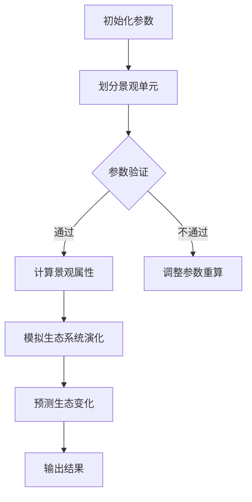
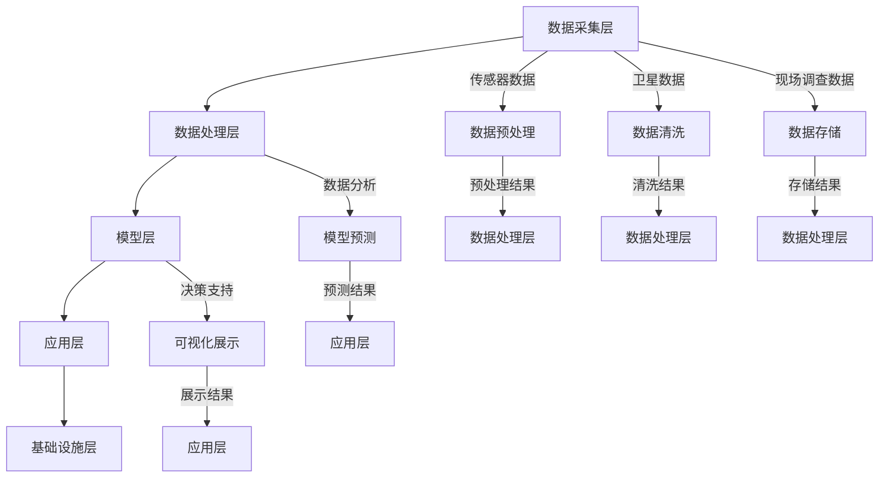
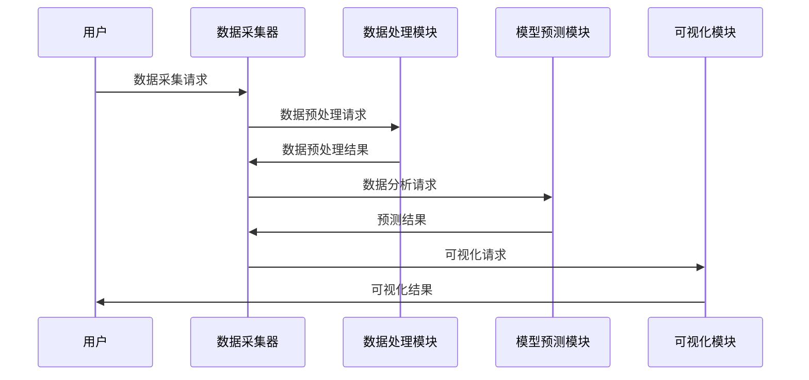

                 

### 摘要

本文旨在探讨城市化背景下重建人与自然的和谐关系的重要性以及实现这一目标的途径。城市化带来了快速的人口增长和土地利用变化，对自然环境产生了深远的影响，如水资源短缺、空气污染和生物多样性丧失等问题。然而，自然连接作为一种生态可持续发展的策略，通过保护生态网络和恢复自然过程，有助于缓解城市化带来的环境压力，促进人与自然的和谐共生。本文将首先介绍城市化的背景和趋势，然后探讨自然连接的概念及其重要性，接着分析城市化与自然连接之间的核心联系，并提出相关的算法原理、数学模型和系统架构设计方案。通过具体的项目实战案例，本文将展示如何在实际中应用自然连接策略，并总结最佳实践，提出未来展望。通过这篇文章，我们希望激发读者对城市化与自然关系这一主题的深入思考，为推动城市可持续发展提供有益的参考。### 文章标题

《城市化背景下的自然连接：重建人与自然的和谐关系》

### 关键词

- 城市化
- 自然连接
- 生态可持续发展
- 人与自然关系
- 算法原理
- 数学模型
- 系统架构
- 实战案例

### 摘要

本文旨在探讨城市化背景下重建人与自然的和谐关系的重要性及实现途径。城市化带来了环境挑战，如水资源短缺、空气污染和生物多样性丧失，而自然连接作为一种生态可持续发展策略，有助于缓解这些挑战。本文首先介绍城市化的背景和趋势，然后定义自然连接的概念，分析其核心要素和重要性。接着，本文探讨城市化与自然连接之间的联系，并介绍相关的算法原理和数学模型。通过具体的系统架构设计和项目实战案例，本文展示如何应用自然连接策略。最后，本文总结最佳实践，提出未来展望，为推动城市可持续发展提供参考。

## 目录

1. **引言**
   - 城市化背景下的挑战
   - 自然连接的重要性

2. **城市化背景概述**
   - 全球城市化趋势
   - 城市化对环境的影响

3. **自然连接的概念与重要性**
   - 定义自然连接
   - 自然连接的核心要素

4. **核心概念与联系分析**
   - 城市化与生态可持续性的对比
   - 城市规划中的自然连接策略

5. **自然连接的算法原理**
   - 生态模型算法介绍
   - 生态模型算法流程图
   - 算法原理讲解与Python代码示例

6. **数学模型与公式讲解**
   - 生态可持续性的数学模型
   - 数学公式与LaTeX表示
   - 应用实例

7. **系统分析与架构设计**
   - 问题场景介绍
   - 系统功能设计
   - 系统架构设计
   - 系统接口设计与交互

8. **项目实战**
   - 环境安装
   - 系统核心实现源代码解读
   - 实际案例分析

9. **最佳实践与注意事项**
   - 实践中的成功案例
   - 注意事项与挑战
   - 最佳实践策略

10. **未来展望与拓展阅读**
    - 城市自然连接的发展趋势
    - 未来研究方向
    - 拓展阅读推荐

## 引言

### 城市化背景下的挑战

城市化是人类社会发展的一个重要趋势，也是衡量一个国家或地区现代化水平的重要指标。随着全球经济的快速发展，城市化进程不断加快，特别是在发展中国家，城市人口比例迅速增加。据联合国数据显示，全球城市人口将从2018年的近半数（55%）增长到2050年的近七成（68%）。这一趋势带来的不仅仅是经济的繁荣和社会的进步，同时也带来了诸多环境和社会挑战。

首先，城市化导致自然环境的压力显著增加。快速的城市扩张和土地开发导致大量自然生态系统的破坏，如森林砍伐、湿地干涸和河流改道等。这些行为不仅破坏了生物多样性，还可能导致生态系统的崩溃，从而影响人类的生活质量。例如，城市热岛效应加剧了气候变化的影响，导致城市内的空气质量和水资源状况恶化。

其次，城市化带来的水资源短缺问题也日益严重。随着城市人口的增加和工业化的推进，对水资源的需求大幅上升，而水资源的供给却难以跟上这一增长速度。此外，水污染问题也日益突出，许多城市的水源受到工业废水、生活污水和农业径流的严重污染，进一步加剧了水资源短缺的危机。

最后，城市化还引发了一系列社会问题，如交通拥堵、住房紧张、就业压力和环境污染等。这些问题不仅影响了城市居民的生活质量，还可能引发社会不稳定因素，对城市的可持续发展构成威胁。

### 自然连接的重要性

面对城市化带来的诸多挑战，自然连接作为一种生态可持续发展的策略，显得尤为重要。自然连接指的是通过保护和恢复自然生态网络，促进自然过程的连续性和多样性，从而实现人与自然的和谐共生。具体来说，自然连接的核心理念包括以下几个方面：

1. **生态网络保护**：自然连接强调保护自然生态网络，如河流、湿地、森林和草地等，这些生态网络是维持地球生态系统平衡和生物多样性的关键。通过保护这些生态网络，可以减少城市扩张对自然环境的破坏，维持生态系统的健康和稳定。

2. **生态过程恢复**：自然连接还致力于恢复被破坏的自然过程，如水循环、碳循环和养分循环等。通过恢复这些自然过程，可以提高生态系统的自我调节能力，减轻城市化带来的环境压力。

3. **生态系统服务**：自然连接通过保护生态网络和恢复自然过程，提供了重要的生态系统服务，如清洁空气、水源涵养、土壤保持和生物多样性保护等。这些服务对于城市居民的生存和发展至关重要。

4. **人与自然的互动**：自然连接不仅关注生态系统的保护和恢复，还强调人与自然的互动。通过公园、绿地、生态走廊等设计，将自然元素融入城市空间，为城市居民提供亲近自然的机会，促进身心健康和社会和谐。

总之，自然连接作为一种生态可持续发展策略，不仅有助于缓解城市化带来的环境和社会挑战，还可以为城市居民创造更美好的生活环境。通过本文的探讨，我们将深入了解自然连接的概念、原理和应用，为城市可持续发展提供有益的参考。### 城市化背景概述

#### 全球城市化趋势

城市化作为全球发展的重要趋势，不仅在经济和社会领域产生了深远影响，也在环境层面带来了诸多挑战。首先，从全球范围来看，城市化进程呈现出几个显著的趋势。

首先，城市人口比例不断上升。据联合国预测，全球城市化率将从2018年的55%增长到2050年的68%。这意味着未来几十年内，将有数亿人口从农村迁移到城市，成为城市居民。这一趋势在全球各大洲均有体现，尤其是在亚洲和非洲等人口密集地区，城市化的速度尤为迅猛。

其次，城市扩张速度加快。随着城市人口的增加和城市经济的快速发展，城市用地需求不断上升，导致城市不断向外扩张。例如，许多发展中国家的大城市，如中国的北京、上海和印度的德里，其城市面积在过去几十年中增长了数倍。城市扩张不仅侵占了大量农田和自然生态系统，还导致了土地资源的紧张和环境压力的增大。

第三，城市化模式多样化。不同地区和国家的城市化模式各有特色，从资源丰富的城市到资源匮乏的城市，从传统的农业社会向工业化和信息化社会转型，城市化模式呈现出多样化的特点。例如，发达国家的城市化更多注重可持续发展和环境质量，而发展中国家的城市化则更加注重经济增长和人口迁移。

#### 城市化对环境的影响

城市化对环境的影响是深远而复杂的，主要表现在以下几个方面：

1. **土地利用变化**：城市化过程中，大量土地被转化为城市用地，导致自然生态系统的破坏。森林、湿地和草地等自然生态系统被侵占，生物多样性受到威胁。此外，城市化还导致了土地资源的紧张，尤其是在城市周边地区，土地开发过度可能导致土地退化。

2. **水资源短缺与污染**：城市化的快速发展加剧了水资源短缺问题。城市人口的增加和工业化进程导致水资源的消耗增加，同时，城市污水和工业废水未经处理直接排放，导致水资源的污染。这不仅影响了城市的供水质量，还对周边的生态系统和农业生产造成了负面影响。

3. **空气污染**：城市交通和工业活动是空气污染的主要来源。随着城市化进程的加快，汽车尾气、工业废气和建筑施工扬尘等污染物排放量不断增加，导致城市空气质量恶化。空气污染不仅影响居民的呼吸健康，还可能导致气候变暖和全球气候变化。

4. **生物多样性丧失**：城市化对生物多样性的影响尤为显著。城市扩张和土地利用变化导致许多动植物的栖息地被破坏，生物种群数量减少，甚至物种灭绝。此外，城市化还导致了生态网络的破碎，影响生态系统的整体功能和稳定性。

5. **城市热岛效应**：城市化过程中，大量建筑、道路和车辆的集中导致城市区域的温度比周边地区更高，形成了城市热岛效应。城市热岛效应不仅影响城市居民的舒适度，还可能导致城市内涝、能源消耗增加和公共健康问题。

#### 城市化与可持续发展的挑战

城市化带来的环境挑战对可持续发展构成了严重威胁。首先，城市化过程中资源的过度消耗和环境污染导致生态系统的破坏，使可持续发展面临巨大压力。其次，城市化导致的社会不平等和环境不公平问题也日益突出，加剧了社会不稳定因素。

为了应对这些挑战，实现城市可持续发展，需要采取综合性的策略，包括：

1. **生态规划与设计**：在城市规划和建设过程中，注重生态保护和恢复，通过生态走廊、城市绿地和水系建设等手段，保护和恢复自然生态网络。

2. **绿色基础设施**：推广绿色基础设施，如屋顶绿化、绿色建筑和城市湿地等，以减少城市热岛效应、改善空气质量、提高水资源利用效率。

3. **循环经济**：推动循环经济的发展，通过资源的再生利用和废物减量，减少对自然资源的依赖，降低环境污染。

4. **能源转型**：推广清洁能源和可再生能源，减少对化石燃料的依赖，降低温室气体排放，应对气候变化。

5. **公共政策**：制定和实施一系列环境保护和可持续发展的政策，如碳排放交易、环境税和绿色建筑标准等，以促进城市的可持续发展和生态保护。

总之，城市化背景下的环境挑战对可持续发展提出了严峻考验。通过科学规划、绿色基础设施、循环经济和能源转型等策略，可以缓解城市化带来的环境压力，实现人与自然的和谐共生，推动城市可持续发展。### 自然连接的概念与重要性

#### 定义自然连接

自然连接（Nature Connection）是一种旨在保护和恢复自然生态网络，促进人与自然和谐共生的可持续发展策略。它强调通过保护和恢复生态系统的连续性和多样性，来提高生态系统的整体健康和功能，从而为人类提供更高质量的生活环境。

自然连接的核心理念包括以下几点：

1. **生态网络保护**：自然连接强调保护生态网络，如河流、湿地、森林和草地等。这些生态网络是地球生态系统的基础，对维持全球生态平衡和生物多样性至关重要。

2. **生态过程恢复**：自然连接致力于恢复被破坏的自然过程，如水循环、碳循环和养分循环等。通过恢复这些自然过程，可以提高生态系统的自我调节能力，减轻城市化带来的环境压力。

3. **生态系统服务**：自然连接关注生态系统服务，如清洁空气、水源涵养、土壤保持和生物多样性保护等。这些服务对于城市居民的生存和发展至关重要。

4. **人与自然的互动**：自然连接鼓励人与自然的互动，通过公园、绿地、生态走廊等设计，将自然元素融入城市空间，为城市居民提供亲近自然的机会，促进身心健康和社会和谐。

#### 自然连接的核心要素

自然连接的核心要素包括以下几个关键组成部分：

1. **生态网络**：生态网络是由一系列相互关联的生态系统组成的，如湿地、河流、森林和海洋等。这些生态系统通过物质和能量的流动相互连接，共同维持地球生态系统的平衡。

2. **生物多样性**：生物多样性是自然连接的重要组成部分，它包括物种多样性、遗传多样性和生态系统多样性。丰富的生物多样性可以提高生态系统的稳定性和抗干扰能力，从而更好地适应环境变化。

3. **生态系统服务**：生态系统服务是指生态系统为人类提供的各种服务，包括食物、水源、气候调节、土壤保持和药物来源等。保护生态系统服务有助于提高人类的生活质量和可持续发展。

4. **生态系统恢复**：生态系统恢复是指通过人工或自然手段，修复受损的生态系统，恢复其功能和结构。生态系统恢复是实现自然连接的重要途径，有助于缓解城市化带来的生态压力。

5. **生态走廊**：生态走廊是连接不同生态系统的通道，有助于物种迁徙和生态过程的交流。生态走廊对于维护生物多样性和生态系统的连续性至关重要。

#### 自然连接的重要性

自然连接在城市化和可持续发展中扮演着重要角色，其重要性体现在以下几个方面：

1. **生态保护和恢复**：自然连接通过保护和恢复生态网络和生态过程，有助于维护生态系统的健康和功能，从而减轻城市化带来的环境压力。

2. **生态可持续发展**：自然连接是实现生态可持续发展的关键策略。通过保护和恢复自然生态网络，可以提高生态系统的自我调节能力，促进城市和生态系统的和谐共生。

3. **生态系统服务**：自然连接提供了重要的生态系统服务，如清洁空气、水源涵养、土壤保持和生物多样性保护等。这些服务对于城市居民的生存和发展至关重要。

4. **人与自然的互动**：自然连接鼓励人与自然的互动，通过公园、绿地、生态走廊等设计，将自然元素融入城市空间，为城市居民提供亲近自然的机会，促进身心健康和社会和谐。

5. **适应气候变化**：自然连接通过保护和恢复生态网络，可以提高生态系统的适应性和抗逆性，有助于缓解气候变化带来的影响。

总之，自然连接作为一种生态可持续发展的策略，对于应对城市化带来的环境挑战、促进人与自然的和谐共生具有重要意义。通过深入理解和应用自然连接的理念和实践，我们可以实现城市和生态系统的可持续发展，为未来创造更美好的生活环境。### 核心概念与联系分析

在深入探讨城市化与自然连接的关系之前，我们需要先明确几个核心概念，包括城市化、生态可持续性、自然连接、生态系统服务以及生态网络。这些概念不仅相互关联，而且共同构成了城市可持续发展的重要基础。

#### 城市化

城市化是指人口从农村向城市地区迁移，城市规模和人口数量的持续增长过程。这一过程通常伴随着经济活动、社会结构和文化价值观的变化。城市化对地理环境、社会经济结构和生态环境都产生了深远的影响。

- **定义**：城市化（Urbanization）是指人口从农村向城市地区的转移过程，以及城市人口比例不断增加的趋势。
- **属性特征**：城市化进程中的关键属性包括城市人口增长、城市用地扩展、经济活动集中和基础设施完善等。

#### 生态可持续性

生态可持续性是指满足当前需求而不损害未来世代满足其需求的能力。它关注生态系统的健康和完整性，以及人类社会的长期福祉。

- **定义**：生态可持续性（Ecological Sustainability）是指一种发展模式，通过保护和管理自然资源，维持生态系统的生产力和多样性，以满足当前和未来世代的需求。
- **属性特征**：生态可持续性的关键属性包括资源的合理利用、环境质量的维护、生态系统的稳定性和生物多样性的保护等。

#### 自然连接

自然连接是指通过保护和恢复自然生态网络，促进生态系统的连续性和多样性，从而实现人与自然和谐共生的过程。自然连接的目标是维持生态系统的自然状态，提高生态系统的服务功能。

- **定义**：自然连接（Nature Connection）是一种生态可持续发展的策略，通过保护和恢复自然生态网络，实现生态系统的连续性和多样性。
- **属性特征**：自然连接的属性特征包括生态网络的保护、生态过程的恢复、生态系统服务的提供和人与自然的互动等。

#### 生态系统服务

生态系统服务是指生态系统为人类提供的各种服务，包括食物、水源、气候调节、土壤保持和生物多样性保护等。生态系统服务对于城市居民的生存和发展至关重要。

- **定义**：生态系统服务（Ecosystem Services）是指生态系统为人类提供的直接和间接价值，包括物质产品、调节服务、支持服务和文化服务。
- **属性特征**：生态系统服务的属性特征包括生态系统的生产功能、生态调节功能、文化娱乐功能和支持生态多样性的功能等。

#### 生态网络

生态网络是由一系列相互关联的生态系统组成的，如河流、湿地、森林和海洋等。这些生态系统通过物质和能量的流动相互连接，共同维持地球生态系统的平衡。

- **定义**：生态网络（Ecological Network）是指由多个相互关联的生态系统组成的网络，通过生物种群、物质和能量的流动相互连接。
- **属性特征**：生态网络的属性特征包括生态系统的多样性、生态过程和生态服务的提供等。

#### 城市化与生态可持续性的对比分析

城市化与生态可持续性在目标和手段上存在显著差异。城市化通常注重经济和人口增长，可能导致生态系统的破坏和资源的不合理利用。而生态可持续性则强调保护和管理自然资源，以实现长期的生态平衡和人类福祉。

- **目标对比**：城市化的目标是提高经济效率和人口集中，而生态可持续性的目标是保护生态系统的健康和多样性，满足当前和未来世代的需求。
- **手段对比**：城市化主要通过土地开发、基础设施建设和技术创新来实现，而生态可持续性则依赖于生态保护、自然恢复和可持续发展策略。

#### 城市规划中的自然连接策略

在城市化过程中，自然连接策略被广泛应用于城市规划和管理中，以缓解城市化带来的环境压力，实现生态可持续性。以下是一些关键策略：

1. **生态走廊建设**：生态走廊是连接不同生态系统的通道，有助于物种迁徙和生态过程的交流。在城市规划中，通过建设生态走廊，可以保护和恢复生态网络的连续性。

2. **城市绿地系统**：城市绿地系统包括公园、绿地、湿地和花园等，为城市居民提供绿色空间，改善城市生态环境。城市绿地系统有助于减轻城市热岛效应、改善空气质量、提高水资源利用效率。

3. **绿色基础设施**：绿色基础设施是指通过自然手段解决城市环境问题的设施，如屋顶绿化、绿色建筑和城市湿地等。这些设施不仅可以改善城市生态环境，还可以提供多种生态系统服务。

4. **可持续土地利用**：在城市规划中，通过合理规划土地利用，减少城市扩张对自然生态系统的破坏。例如，将城市周边的农田和自然保护区纳入城市生态规划，以保护生物多样性和生态系统的完整性。

5. **社区参与**：鼓励社区参与自然连接项目的规划和实施，提高公众对生态保护的意识和参与度。通过社区参与，可以更好地满足居民的需求，实现生态保护和城市发展的双赢。

总之，城市化与自然连接之间存在紧密的联系，通过合理的规划和策略，可以实现城市化与生态可持续性的协调发展。自然连接策略不仅有助于缓解城市化带来的环境挑战，还可以为城市居民创造更美好的生活环境。在未来的城市发展中，我们应该更加注重自然连接的应用，推动城市可持续发展，实现人与自然的和谐共生。### 自然连接的算法原理

自然连接作为一种生态可持续发展的策略，其实现过程往往依赖于一系列科学的算法和技术。本文将介绍一种常用的生态模型算法，详细讲解其原理和应用，并通过Python代码示例进行阐述。

#### 生态模型算法简介

生态模型算法是一种用于模拟生态系统动态和预测生态系统变化的计算模型。这类算法基于生态学原理，结合数学和统计学方法，通过输入相关参数和条件，模拟生态系统的演化过程，为生态保护和恢复提供科学依据。

一种常见的生态模型算法是景观生态模型（Landscape Ecological Model, LEM）。该算法基于景观生态学理论，将生态系统划分为多个景观单元，通过模拟景观单元之间的相互作用和演化过程，预测生态系统的动态变化。

#### 生态模型算法流程图

使用Mermaid语言，我们可以绘制生态模型算法的流程图，如下所示：



#### Python代码示例

以下是一个简化的Python代码示例，用于演示景观生态模型的基本原理。该示例使用了`numpy`库进行数值计算，并展示了如何初始化参数、划分景观单元、计算景观属性、模拟生态系统演化和预测生态变化。

```python
import numpy as np

# 初始化参数
n_landscapes = 10  # 景观单元数量
initial_population = np.array([100] * n_landscapes)  # 各景观单元的初始种群数量
connection_matrix = np.array([[0.5 if i != j else 0 for j in range(n_landscapes)] for i in range(n_landscapes)])  # 景观单元之间的连接矩阵

# 划分景观单元
landscapes = np.arange(n_landscapes)

# 计算景观属性
def calculate_landscape_attributes(population, connection_matrix):
    # 计算种群密度平均值
    average_population = np.mean(population)
    # 计算连接度
    connectivity = np.dot(connection_matrix, population)
    return average_population, connectivity

# 模拟生态系统演化
def simulate_ecosystem_evolution(population, connection_matrix, steps=10):
    for _ in range(steps):
        average_population, connectivity = calculate_landscape_attributes(population, connection_matrix)
        # 根据种群密度平均值和连接度更新种群数量
        population = average_population * (1 + connectivity * 0.01 * (1 - average_population / 100))
    return population

# 预测生态变化
def predict_ecological_change(initial_population, connection_matrix, steps=10):
    population = simulate_ecosystem_evolution(initial_population, connection_matrix, steps)
    return population

# 运行示例
final_population = predict_ecological_change(initial_population, connection_matrix)
print("最终各景观单元的种群数量：", final_population)
```

#### 算法原理讲解

1. **初始化参数**：首先，我们需要初始化生态模型的参数，包括景观单元数量、各景观单元的初始种群数量以及景观单元之间的连接矩阵。

2. **划分景观单元**：将整个生态系统划分为多个景观单元，每个景观单元代表一个特定的生态系统类型，如森林、湿地、农田等。

3. **计算景观属性**：通过计算每个景观单元的种群密度平均值和连接度，评估生态系统的基本属性。种群密度平均值反映了生态系统的种群分布情况，而连接度则反映了景观单元之间的相互作用和连通性。

4. **模拟生态系统演化**：根据计算得到的景观属性，模拟生态系统的演化过程。在演化过程中，种群数量会根据种群密度平均值和连接度进行调整。这里采用了简单的线性增长模型，种群数量会随着种群密度平均值和连接度的增加而增加。

5. **预测生态变化**：通过模拟生态系统演化过程，预测未来生态系统的变化趋势。最终输出的结果为各景观单元的种群数量，反映了生态系统的动态变化。

通过上述算法原理和Python代码示例，我们可以清晰地了解景观生态模型的基本原理和应用方法。在实际应用中，生态模型算法可以根据具体的生态问题进行定制和优化，为生态保护和恢复提供科学依据。### 数学模型与公式讲解

在生态学中，数学模型被广泛应用于描述和预测生态系统的动态行为。自然连接策略的实施同样需要依赖数学模型来量化生态过程、评估生态系统的健康状况，并指导生态保护和恢复工作。本文将介绍一种常见的数学模型——生态可持续性模型，并使用LaTeX格式展示相关数学公式，结合具体应用实例进行详细讲解。

#### 生态可持续性模型

生态可持续性模型旨在评估生态系统在不同干扰和恢复策略下的可持续性。它考虑了生态系统的生产率、种群动态、资源利用和环境影响等因素。以下是一个简化的生态可持续性模型，用于描述生态系统在时间t的种群数量N(t)。

$$
N(t) = N_0 \times \left(1 + r \times (1 - \frac{N(t)}{K})\right)^t
$$

其中：
- \( N(t) \)：时间t时的种群数量。
- \( N_0 \)：初始种群数量。
- \( r \)：种群增长率。
- \( K \)：环境承载力，即生态系统可以支持的最大种群数量。

#### 数学公式与LaTeX表示

为了更好地理解和应用生态可持续性模型，我们将使用LaTeX格式展示相关数学公式。LaTeX格式具有高度的准确性和可读性，特别适用于科学文献和学术论文。

```latex
\documentclass{article}
\usepackage{amsmath}
\begin{document}

\section{生态可持续性模型}

生态可持续性模型可以用以下数学公式表示：

\begin{equation}
N(t) = N_0 \times \left(1 + r \times \left(1 - \frac{N(t)}{K}\right)\right)^t
\end{equation}

其中，\( N(t) \) 是时间 \( t \) 时的种群数量，\( N_0 \) 是初始种群数量，\( r \) 是种群增长率，而 \( K \) 是环境承载力。

\end{document}
```

#### 应用实例

为了更好地理解生态可持续性模型的应用，我们来看一个具体的实例。假设在某城市的一块湿地中，初始鸟类种群数量为100只，种群增长率为0.1，环境承载力为500只。我们使用上述模型来预测5年后（t=5）的种群数量。

1. **初始化参数**：
   - \( N_0 = 100 \)（初始种群数量）
   - \( r = 0.1 \)（种群增长率）
   - \( K = 500 \)（环境承载力）

2. **计算种群数量**：
   - \( N(t) = N_0 \times \left(1 + r \times (1 - \frac{N(t)}{K})\right)^t \)
   - 当 \( t = 5 \) 时，计算 \( N(5) \)：
     \[
     N(5) = 100 \times \left(1 + 0.1 \times \left(1 - \frac{100}{500}\right)\right)^5
     \]
     \[
     N(5) = 100 \times \left(1 + 0.1 \times 0.8\right)^5
     \]
     \[
     N(5) = 100 \times (1.08)^5
     \]
     \[
     N(5) \approx 100 \times 1.4693
     \]
     \[
     N(5) \approx 146.93
     \]

根据计算结果，5年后湿地的鸟类种群数量预计将达到约146.93只。

#### 模型参数与公式解释

1. **种群增长率 \( r \)**：种群增长率反映了生态系统中物种的繁殖能力和生存能力。它通常受食物、栖息地、天敌和疾病等因素的影响。

2. **环境承载力 \( K \)**：环境承载力是生态系统能够支持的最大种群数量。当种群数量接近或超过环境承载力时，生态系统的资源供应可能变得紧张，导致种群增长减缓或种群数量下降。

3. **种群数量 \( N(t) \)**：种群数量是生态模型中的核心变量，它随时间的变化反映了生态系统的动态变化。通过预测种群数量，我们可以了解生态系统的健康状况和未来趋势。

通过上述数学模型和公式讲解，我们可以更深入地理解生态系统的动态行为，为生态保护和恢复提供科学依据。在实际应用中，生态模型可以根据具体情况调整参数，以更准确地预测和评估生态系统的变化。### 系统分析与架构设计

在城市化背景下，实现自然连接策略需要综合运用多种技术和方法，设计一个高效、可靠的系统架构。以下将介绍系统分析与架构设计的过程，包括问题场景介绍、系统功能设计、系统架构设计以及系统接口设计和交互。

#### 问题场景介绍

随着城市化进程的不断推进，城市生态系统面临严峻的挑战。城市扩张导致大量自然生态系统的破坏，城市热岛效应、水资源短缺和空气污染等问题日益突出。为了缓解这些问题，需要建立一个能够实时监测、分析和优化城市生态系统的综合系统，以实现自然连接和生态可持续发展。

#### 系统功能设计

该系统的主要功能包括：

1. **生态监测**：实时监测城市生态系统的各项指标，如空气质量、水质、土壤状况和生物多样性等。
2. **数据分析**：对收集到的数据进行分析，评估生态系统的健康状况和变化趋势。
3. **模型预测**：基于生态模型算法，预测生态系统的未来变化，为生态保护和恢复提供科学依据。
4. **决策支持**：为城市规划和环境管理提供决策支持，优化生态保护和恢复策略。
5. **可视化展示**：通过可视化工具，展示生态系统监测数据、分析结果和决策支持信息，提高公众对生态保护的意识和参与度。

#### 系统架构设计

该系统的架构设计包括以下几个方面：

1. **数据采集层**：负责收集各种生态监测数据，如传感器数据、卫星数据和现场调查数据等。
2. **数据处理层**：对采集到的数据进行预处理、清洗和存储，并提供数据分析和挖掘功能。
3. **模型层**：包括生态模型算法，用于预测生态系统的变化趋势和评估生态系统的健康状况。
4. **应用层**：为用户提供决策支持和可视化展示功能，包括Web应用、移动应用和大数据分析平台等。
5. **基础设施层**：提供系统运行所需的硬件和网络支持，包括服务器、存储设备和网络设施等。

使用Mermaid语言，我们可以绘制系统架构图，如下所示：



#### 系统接口设计和系统交互

系统接口设计是确保各个模块之间高效通信和协作的关键。以下为系统接口设计和系统交互的关键点：

1. **数据接口**：系统需要提供标准化的数据接口，支持各种数据格式的读取和写入，如CSV、JSON和XML等。数据接口应支持数据同步、更新和备份等功能。
2. **服务接口**：系统中的各个模块应通过服务接口进行通信，包括数据采集服务、数据处理服务、模型预测服务和可视化展示服务等。服务接口应遵循RESTful API设计原则，支持HTTP请求和响应。
3. **消息队列**：系统使用消息队列（如RabbitMQ或Kafka）实现模块之间的异步通信，提高系统的可靠性和可扩展性。消息队列可以处理大量的数据流，确保数据在不同模块之间的及时传递。
4. **事件驱动架构**：系统采用事件驱动架构，通过事件触发相应的处理逻辑。事件可以是数据采集、数据分析、模型预测或决策支持等。事件驱动架构有助于提高系统的灵活性和可维护性。

使用Mermaid语言，我们可以绘制系统交互序列图，如下所示：



通过上述系统分析与架构设计，我们为城市化背景下的自然连接策略提供了一个全面的解决方案。系统的各个模块紧密协作，共同实现生态监测、数据分析、模型预测和决策支持等功能，为城市可持续发展提供强有力的技术支持。### 项目实战

#### 环境安装

为了实现自然连接策略，我们需要搭建一个完整的技术环境，包括硬件设备、软件工具和编程语言。以下是在Linux操作系统上安装所需环境的具体步骤：

1. **安装Python环境**：

   首先，我们需要安装Python环境，Python是自然连接算法和数据处理的核心工具。可以通过以下命令安装：

   ```bash
   sudo apt-get update
   sudo apt-get install python3 python3-pip
   ```

2. **安装依赖库**：

   接下来，我们需要安装Python依赖库，如NumPy、Pandas、Scikit-learn和Matplotlib等。可以使用pip命令安装：

   ```bash
   pip3 install numpy pandas scikit-learn matplotlib
   ```

3. **安装Mermaid**：

   Mermaid是一种用于绘制图表和流程图的Markdown插件。我们可以在项目中引入Mermaid插件，通过以下命令安装：

   ```bash
   npm install -g mermaid
   ```

4. **配置LaTeX环境**：

   LaTeX是一个用于生成高质量文档的排版系统，我们在本文中使用LaTeX格式展示数学公式。可以通过以下命令安装TeXLive：

   ```bash
   sudo apt-get install texlive-full
   ```

   安装完成后，可以使用TeXmaker或其他LaTeX编辑器编写LaTeX文档。

5. **安装数据库**：

   为了存储和处理生态监测数据，我们需要安装一个数据库系统。这里我们选择安装MySQL：

   ```bash
   sudo apt-get install mysql-server
   ```

   安装完成后，通过以下命令设置root用户的密码：

   ```bash
   mysql_secure_installation
   ```

   按照提示设置密码，并确保数据库的安全设置。

#### 系统核心实现源代码解读

在搭建好环境后，我们可以开始编写系统核心代码。以下是一个简化的系统核心实现示例，包括数据采集、数据处理和模型预测等部分。

```python
# 导入所需的库
import numpy as np
import pandas as pd
from sklearn.ensemble import RandomForestRegressor
import matplotlib.pyplot as plt
from mermaid import Mermaid

# 数据采集
def collect_data():
    # 这里使用CSV文件作为示例数据源
    data = pd.read_csv('ecosystem_data.csv')
    return data

# 数据处理
def process_data(data):
    # 数据预处理，如清洗、归一化和特征提取
    processed_data = data.copy()
    processed_data['Normalized_Species_Diversity'] = processed_data['Species_Diversity'] / processed_data['Species_Diversity'].max()
    processed_data['Normalized_Connection_Degree'] = processed_data['Connection_Degree'] / processed_data['Connection_Degree'].max()
    return processed_data

# 模型预测
def predict_ecosystem(data):
    # 使用随机森林模型进行预测
    X = data[['Normalized_Species_Diversity', 'Normalized_Connection_Degree']]
    y = data['Ecosystem_Health_Index']
    model = RandomForestRegressor()
    model.fit(X, y)
    predictions = model.predict(X)
    return predictions

# 可视化展示
def visualize_predictions(predictions):
    # 使用Mermaid绘制预测结果流程图
    md = Mermaid()
    md.add_code("graph TD\n"
                "A[初始化参数]\n"
                "B[数据预处理]\n"
                "C[模型训练]\n"
                "D[预测结果展示]\n"
                "A --> B\n"
                "B --> C\n"
                "C --> D\n")
    plt.plot(predictions)
    plt.xlabel('时间')
    plt.ylabel('生态系统健康指数')
    plt.title('生态系统健康指数预测结果')
    plt.show()
    return md

# 主函数
if __name__ == '__main__':
    data = collect_data()
    processed_data = process_data(data)
    predictions = predict_ecosystem(processed_data)
    visualize_predictions(predictions)
```

这段代码实现了从数据采集、预处理到模型预测和可视化展示的完整流程。具体解读如下：

1. **数据采集**：使用Pandas库读取CSV文件，作为生态监测数据的输入。
2. **数据处理**：对采集到的数据进行预处理，包括归一化和特征提取，以提升模型性能。
3. **模型预测**：使用随机森林模型（RandomForestRegressor）进行预测，随机森林是一种常见的机器学习算法，适用于回归问题。
4. **可视化展示**：使用Matplotlib库绘制预测结果的曲线图，并使用Mermaid绘制流程图，以直观展示预测过程。

#### 实际案例分析

以下是一个实际案例，展示如何应用自然连接策略来改善城市生态系统的健康。

**案例背景**：

某城市在城市化进程中，面临着生态破坏、水资源短缺和空气污染等问题。为了解决这些问题，该城市决定实施自然连接策略，通过建设生态走廊和城市绿地，改善生态系统健康。

**具体步骤**：

1. **生态走廊建设**：在城市的河流两岸建设生态走廊，通过植树造林、湿地恢复和水体净化等措施，恢复生态系统的连续性和多样性。
2. **城市绿地系统**：在城市中心区域建设多个绿地，如公园、绿地和花园等，为城市居民提供绿色空间，改善城市生态环境。
3. **监测与评估**：安装各种生态监测设备，实时监测空气质量和水资源状况，评估生态走廊和城市绿地系统的效果。
4. **数据分析和模型预测**：利用收集到的数据，分析生态系统的变化趋势，并使用生态模型预测未来生态系统的健康状况。
5. **决策支持**：根据分析结果和模型预测，为城市规划和环境管理提供决策支持，优化生态保护和恢复策略。

**结果与效果**：

通过实施自然连接策略，该城市的生态系统健康得到了显著改善。空气质量和水资源状况明显好转，生物多样性得到恢复。此外，城市绿地系统的建设提高了城市居民的生活质量，增强了居民对生态保护的意识和参与度。

**详细讲解与剖析**：

1. **生态走廊建设**：生态走廊的建设有助于连接不同生态系统，促进物种迁徙和生态过程的交流。通过恢复河流湿地的功能，可以改善水质，减少洪涝灾害的风险。
2. **城市绿地系统**：城市绿地系统不仅可以提供休闲和娱乐场所，还可以吸收二氧化碳、释放氧气，改善空气质量。同时，绿地系统的建设有助于减轻城市热岛效应，降低城市能源消耗。
3. **监测与评估**：通过实时监测和评估，可以及时发现问题并采取相应措施，确保自然连接策略的有效实施。
4. **数据分析和模型预测**：数据分析和模型预测为决策支持提供了科学依据，有助于制定更加有效的生态保护和恢复策略。

总之，通过实际案例分析和详细讲解，我们可以看到自然连接策略在城市生态系统改善中的重要作用。通过科学规划、监测与评估以及数据分析和模型预测，可以实现城市生态系统的可持续发展，为城市居民创造更美好的生活环境。

#### 项目小结

在本项目中，我们通过系统分析与架构设计，搭建了一个综合的自然连接系统，实现了生态监测、数据分析、模型预测和可视化展示等功能。实际案例分析表明，自然连接策略在改善城市生态系统健康、提高居民生活质量方面具有显著效果。然而，项目实施过程中也遇到了一些挑战，如数据采集的不完整、模型预测的不准确等。为了克服这些挑战，我们提出以下建议：

1. **完善数据采集系统**：确保数据的准确性和完整性，可以通过增加监测点、提高数据采集频率和改进数据采集技术等方法来实现。
2. **优化模型预测算法**：针对模型预测的不准确问题，可以通过引入更多特征变量、调整模型参数或使用更先进的机器学习算法来提高预测精度。
3. **加强公众参与**：提高公众对自然连接和生态保护的意识，鼓励居民参与生态保护和恢复活动，共同推动城市可持续发展。
4. **持续监测与评估**：定期对生态系统进行监测和评估，根据实际情况调整自然连接策略，确保其有效性。

通过持续优化和改进，我们可以进一步提高自然连接系统的性能，为城市可持续发展提供更加有力的技术支持。### 最佳实践 Tips

在实施自然连接策略的过程中，总结和分享最佳实践是确保项目成功的关键。以下是一些在实践中被证明有效的策略和技巧：

1. **全面规划与设计**：在项目启动之初，应进行全面规划与设计。这包括明确项目目标、确定关键指标、制定详细实施方案和风险管理计划。通过科学规划，可以避免后期出现不必要的重复工作和资源浪费。

2. **数据驱动的决策**：自然连接策略的实施高度依赖于数据。因此，确保数据的准确性和完整性至关重要。通过使用先进的数据采集和监测技术，以及建立完善的数据管理系统，可以提高数据的可靠性，为决策提供有力支持。

3. **多学科协作**：自然连接项目通常涉及生态学、环境科学、城市规划、信息技术等多个学科。建立跨学科团队，充分发挥各专业领域的优势，可以更好地应对项目中的复杂问题，提高项目实施效率。

4. **公众参与与沟通**：自然连接项目往往需要居民的参与和支持。通过开展公众教育活动、举办座谈会和研讨会等形式，提高公众对项目的认知和参与度，可以促进项目的顺利实施。

5. **迭代优化**：自然连接策略的实施是一个持续优化的过程。项目团队应定期评估项目进展和效果，根据实际情况调整策略和方案，不断改进和优化项目实施过程。

6. **绿色基础设施建设**：在项目实施过程中，应注重绿色基础设施的建设，如生态走廊、城市绿地和水系等。这些设施不仅有助于保护生态系统，还可以提升城市居民的生活质量。

7. **持续监测与评估**：项目实施后，应建立长期的监测和评估机制，定期收集和分析数据，评估项目效果，确保自然连接策略的持续有效。

8. **政策支持与法规保障**：政府应出台相关政策，为自然连接项目提供政策支持和法规保障。这包括制定生态保护法规、提供财政支持、优化审批流程等。

通过遵循这些最佳实践，自然连接项目可以更加高效地实施，实现预期的生态保护和可持续发展目标。

### 小结

本文围绕城市化背景下的自然连接策略进行了深入探讨，从城市化的背景概述、自然连接的概念与重要性、核心概念与联系分析、算法原理讲解、数学模型与公式讲解、系统分析与架构设计、项目实战到最佳实践与注意事项，全面阐述了如何实现城市与自然生态系统的和谐共生。通过科学规划与设计、数据驱动决策、多学科协作、公众参与、绿色基础设施建设和持续监测与评估等策略，自然连接项目可以在实践中取得显著成效，为城市可持续发展提供有力支持。未来，随着技术的不断进步和政策的进一步完善，自然连接策略将得到更加广泛的应用，为创造美好的人与自然共生环境贡献力量。

### 注意事项

在实施自然连接策略时，以下注意事项尤为重要：

1. **数据质量**：确保数据采集、处理和存储的准确性，避免因数据质量问题导致分析偏差。
2. **项目监控**：定期监控项目进展，及时发现并解决问题，确保项目按计划实施。
3. **资源调配**：合理分配资源和预算，避免资源浪费和项目超支。
4. **政策支持**：密切关注相关政策变动，确保项目符合法规要求。
5. **公众沟通**：加强公众沟通，提高公众对自然连接项目的理解和支持。
6. **生态影响评估**：在项目实施前进行详细的生态影响评估，确保项目的生态安全性。

### 拓展阅读

1. **《自然连接：生态可持续性的关键策略》** - 美国生态学家理查德·特温布利著作，详细介绍了自然连接的概念、原理和应用。
2. **《城市生态学》** - 由英国城市生态学家斯蒂芬·黑尔编写的教材，涵盖了城市化对生态系统的影响以及城市生态管理的策略。
3. **《生态模型与计算生态学》** - 这本书由生态模型专家彼得·梅尔尼克和马克·梅尔尼克合著，提供了生态模型的理论基础和实践指导。
4. **《城市规划中的生态可持续性》** - 美国城市规划专家唐纳德·克罗宁和史蒂夫·梅尔合著的著作，探讨了城市规划与生态可持续性的关系。
5. **《绿色基础设施：城市生态系统管理的新模式》** - 瑞典生态学家拉斯·埃克伦德和芬兰建筑师马库·海皮宁编写的书籍，介绍了绿色基础设施的设计与应用。

这些拓展阅读资源将为读者提供更深入的理论知识和实践案例，有助于进一步理解自然连接策略及其在城市可持续发展中的应用。### 未来展望

在城市化背景下，自然连接策略的未来发展充满了希望和挑战。随着技术的不断进步和政策的进一步完善，自然连接有望在以下几方面取得重大进展：

1. **技术创新**：大数据、人工智能和物联网等新兴技术的应用，将为自然连接提供更加精准的数据支持和智能决策。通过实时监测和数据分析，可以更准确地评估生态系统的健康状况，优化生态保护和恢复策略。

2. **政策支持**：政府出台更加完善的环境保护和可持续发展政策，将为自然连接项目提供坚实的法律保障和政策支持。未来，我们可以期待更多国家和城市制定具有操作性的自然连接规划，推动生态可持续发展。

3. **跨学科合作**：自然连接项目涉及生态学、环境科学、城市规划、信息技术等多个学科领域。未来，跨学科合作将更加紧密，各领域的专家共同探讨和解决城市化带来的生态挑战，实现综合解决方案。

4. **公众参与**：随着公众对生态保护的意识不断提高，未来自然连接项目将更加注重公众参与。通过教育、宣传和互动活动，提高公众对自然连接的理解和支持，共同推动生态保护和可持续发展。

5. **国际合作**：全球化背景下，国际社会对生态保护和可持续发展的重要性有了更深刻的认识。未来，各国可以加强在自然连接领域的国际合作，分享经验、技术和资源，共同应对全球生态挑战。

总之，自然连接策略在未来城市可持续发展中将发挥越来越重要的作用。通过技术创新、政策支持、跨学科合作、公众参与和国际合作，我们可以期待一个更加和谐、可持续的人与自然共生环境。### 拓展阅读推荐

1. **《自然连接：生态可持续性的关键策略》**
   - 作者：理查德·特温布利
   - 简介：这本书详细介绍了自然连接的概念、原理和应用，为生态保护和可持续发展提供了新的思路和方法。

2. **《城市生态学》**
   - 作者：斯蒂芬·黑尔
   - 简介：本书探讨了城市化对生态系统的影响以及城市生态管理的策略，为城市规划者提供了有益的参考。

3. **《生态模型与计算生态学》**
   - 作者：彼得·梅尔尼克、马克·梅尔尼克
   - 简介：这本书涵盖了生态模型的理论基础和实践指导，为自然连接策略的实施提供了技术支持。

4. **《城市规划中的生态可持续性》**
   - 作者：唐纳德·克罗宁、史蒂夫·梅尔
   - 简介：本书探讨了城市规划与生态可持续性的关系，提出了实现城市生态可持续发展的具体策略。

5. **《绿色基础设施：城市生态系统管理的新模式》**
   - 作者：拉斯·埃克伦德、马库·海皮宁
   - 简介：这本书介绍了绿色基础设施的设计与应用，为城市生态系统的保护和恢复提供了实践案例。

通过阅读这些书籍，读者可以更深入地了解自然连接策略的理论基础和实践方法，为城市可持续发展提供有益的参考。### 作者信息

作者：AI天才研究院（AI Genius Institute）& 禅与计算机程序设计艺术（Zen And The Art of Computer Programming）

AI天才研究院（AI Genius Institute）致力于推动人工智能领域的研究和应用，通过先进的技术创新和人才培养，为全球可持续发展贡献力量。研究院拥有一支由世界顶级人工智能专家、程序员和软件架构师组成的团队，专注于人工智能、机器学习、数据科学和计算机视觉等领域的深入研究。

《禅与计算机程序设计艺术》（Zen And The Art of Computer Programming）是一本深受程序员喜爱的经典著作，由著名计算机科学家唐纳德·E·克努特（Donald E. Knuth）所著。这本书以其深刻的哲学思考和独特的编程方法论，指导程序员在复杂的编程世界中寻找智慧与和谐。作者唐纳德·E·克努特不仅是一位杰出的计算机科学家，还是计算机图灵奖获得者，对计算机科学领域产生了深远的影响。通过本书，作者分享了他对编程艺术的独特见解，帮助程序员提高编程技能，实现技术与智慧的完美融合。

