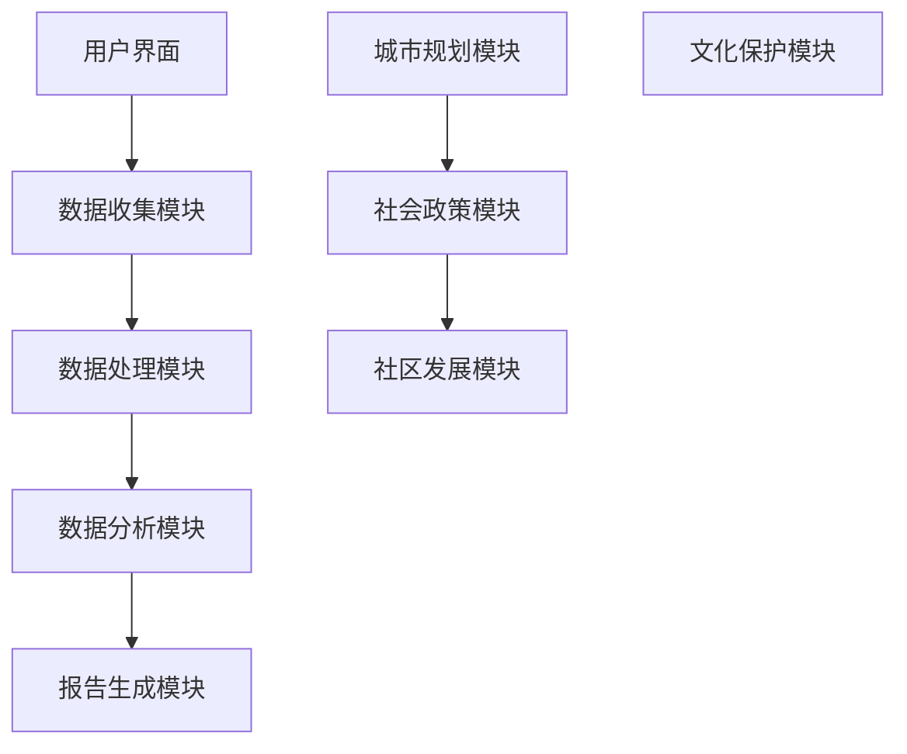
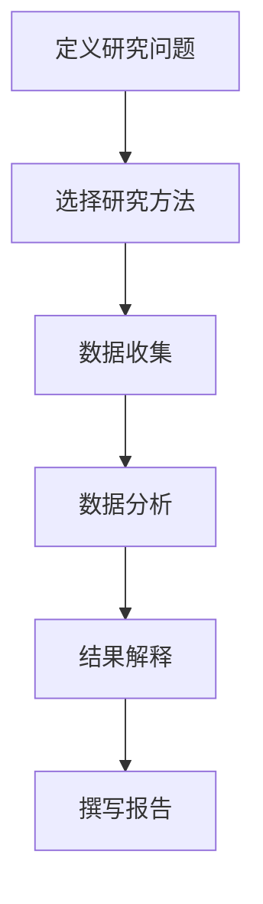
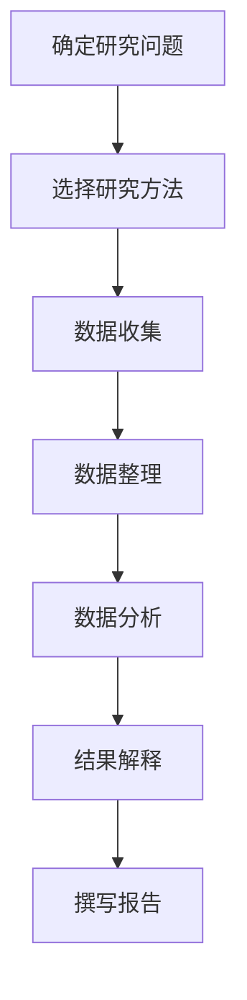

                 

# 城市微观人类学：日常生活中的文化解码

## 关键词

- 城市微观人类学
- 文化解码
- 日常生活方式
- 社会互动
- 城市空间

## 摘要

本文旨在探讨城市微观人类学，即对城市日常生活中的文化现象进行解码和分析。通过研究城市居民的行为、互动、空间使用以及文化符号，揭示其背后的文化意义。本文将逐步分析城市微观人类学的基本概念、理论框架、文化模式、空间意义以及技术影响，并通过案例研究和实践应用，为城市规划和治理提供启示。

----------------------------------------------------------------

## 第一部分: 引言

### 1.1 核心概念

#### 1.1.1 城市微观人类学

城市微观人类学是一种研究城市日常生活中的文化现象的学科。它关注的是城市居民的行为、互动、空间使用以及文化符号，旨在解码和解读这些现象背后的文化意义。

#### 1.1.2 文化解码

文化解码是一种通过分析和解释文化符号、行为模式和社会互动来揭示其背后文化意义的方法。在城市的背景下，文化解码有助于理解城市居民的行为和文化价值观。

### 1.2 问题背景

#### 1.2.1 城市生活的复杂性

随着城市化进程的加速，城市生活日益复杂。城市居民的生活方式、社交互动、文化价值观等方面都呈现出多样性，这为城市微观人类学研究提供了丰富的素材。

#### 1.2.2 文化的重要性

文化是人类社会的核心组成部分，它影响着人们的价值观、行为和生活方式。了解城市文化对于城市规划、社会治理和文化传承具有重要意义。

### 1.3 研究目的与意义

#### 1.3.1 研究目的

本文旨在通过城市微观人类学的视角，解码城市日常生活中的文化现象，为城市规划和治理提供理论依据和实践指导。

#### 1.3.2 研究意义

城市微观人类学的研究有助于提高城市规划的科学性和有效性，促进城市居民的生活质量和文化认同，同时为文化传承和全球化背景下的文化多样性提供支持。

### 1.4 边界与外延

#### 1.4.1 边界

城市微观人类学的边界在于对城市日常生活中的文化现象的研究，包括行为、互动、空间使用和文化符号等方面。

#### 1.4.2 外延

城市微观人类学的外延涉及多个学科领域，如社会学、人类学、心理学、建筑学等，共同探讨城市文化现象。

### 1.5 概念结构与核心要素组成

#### 1.5.1 概念结构

城市微观人类学可以划分为以下几个核心概念：

1. 行为分析：研究城市居民的行为模式及其文化意义。
2. 社会互动：探讨城市居民之间的互动关系及其文化影响。
3. 空间使用：分析城市空间的文化意义和功能。
4. 文化符号：解读城市中的文化符号及其意义。

#### 1.5.2 核心要素组成

城市微观人类学研究的核心要素包括：

1. 行为数据：收集和分析城市居民的行为数据，揭示其文化特征。
2. 社会互动：观察和记录城市居民之间的互动，分析其文化内涵。
3. 空间分析：研究城市空间的文化意义和功能，揭示其与居民行为的联系。
4. 文化解码：对城市中的文化符号进行解读，揭示其文化意义。

### 1.6 本章小结

本章介绍了城市微观人类学的基本概念、研究背景、目的与意义、边界与外延以及概念结构与核心要素组成。下一部分将探讨城市微观人类学的理论框架，为后续分析奠定基础。

----------------------------------------------------------------

## 第二部分: 理论框架

### 2.1 城市微观人类学的理论基础

城市微观人类学的研究离不开以下理论基础：

#### 社会学理论

社会学理论提供了对城市居民行为和互动的宏观和微观分析视角。例如，涂尔干的功能主义理论强调社会行为的功能性，而符号互动论则关注个体之间的符号交流。

#### 人类学理论

人类学理论提供了对文化多样性和文化变迁的研究方法。例如，文化相对论认为不同文化之间没有绝对的优劣之分，而文化进化论则探讨了文化的发展历程。

#### 建筑学理论

建筑学理论关注城市空间的设计和功能，为城市微观人类学研究提供了空间分析的视角。例如，形式追随功能理论强调建筑设计与功能之间的关系。

#### 心理学理论

心理学理论提供了对个体行为和认知的研究方法。例如，行为主义心理学关注行为的外部表现，而认知心理学则关注个体的内部心理过程。

### 2.2 理论框架的结构与联系

城市微观人类学的理论框架可以划分为以下几个层次：

1. **宏观理论层次**：包括社会学、人类学、建筑学和心理学等基础理论，为城市微观人类学研究提供理论支持。
2. **中观理论层次**：涉及具体的研究方法和分析工具，如行为观察、社会互动分析、空间分析和文化解码等。
3. **微观理论层次**：关注具体的城市文化现象，如城市居民的行为模式、文化符号、空间使用等。

这些层次之间的联系在于它们共同构成了对城市日常生活的文化解码，揭示了城市文化现象背后的机制和意义。

### 2.3 理论框架的应用

城市微观人类学的理论框架可以应用于以下几个方面：

1. **城市规划和设计**：通过分析城市空间的文化意义和功能，为城市规划和设计提供科学依据。
2. **社会政策制定**：通过研究城市居民的行为和文化价值观，为制定社会政策提供参考。
3. **文化传承与保护**：通过解读城市中的文化符号，促进文化传承和保护。

### 2.4 本章小结

本章介绍了城市微观人类学的理论基础、理论框架的结构与联系以及理论框架的应用。下一部分将探讨城市微观人类学中的文化模式，为解码城市日常生活提供深入分析。

----------------------------------------------------------------

## 第三部分: 城市生活与

### 3.1 日常活动与行为模式

#### 3.1.1 工作日与休息日

城市居民的日常活动可以分为工作日和休息日。在工作日，人们主要参与工作、学习和社交活动。在休息日，人们倾向于参与家庭活动、休闲和娱乐。

#### 3.1.2 交通方式

城市居民的交通方式多样，包括步行、自行车、公共交通和私家车。不同交通方式反映了城市居民的价值观和生活习惯。

#### 3.1.3 餐饮选择

城市居民的餐饮选择受到文化、经济和个人喜好的影响。快餐、特色餐饮和外卖服务成为城市生活的常见现象。

### 3.2 社会互动与社区动态

#### 3.2.1 社区活动

城市社区活动多样，包括社区聚会、文化节、运动会等。这些活动促进了社区成员之间的互动和凝聚力。

#### 3.2.2 社交网络

城市居民的社交网络广泛，包括亲朋好友、同事、社区成员等。社交媒体和在线社交平台成为城市居民社交的重要工具。

#### 3.2.3 社区组织

城市社区组织在维护社区安全和促进社区发展方面发挥重要作用。例如，邻里守望项目和社区服务中心为居民提供便利和服务。

### 3.3 文化符号与意义

#### 3.3.1 文化符号的类型

文化符号包括文字、图像、声音、物体等。它们是文化表达的载体，具有特定的文化意义。

#### 3.3.2 文化符号的解读

解读文化符号需要考虑其背后的文化背景和语境。不同文化背景下，同一文化符号可能具有不同的含义。

#### 3.3.3 文化符号的变迁

随着社会的发展和文化的变迁，文化符号的含义和形式也在不断演变。例如，互联网和社交媒体的出现改变了传统文化符号的表达方式。

### 3.4 本章小结

本章分析了城市日常生活中的文化模式，包括日常活动与行为模式、社会互动与社区动态以及文化符号与意义。下一部分将探讨城市空间与文化的关系。

----------------------------------------------------------------

## 第四部分: 城市空间与文化的联系

### 4.1 公共空间与文化意义

#### 4.1.1 公共空间的作用

公共空间是城市居民交流、互动和活动的场所，具有重要的文化意义。它为城市居民提供了公共生活的空间，促进了社区成员之间的交流和融合。

#### 4.1.2 公共空间的设计

公共空间的设计需要考虑其文化属性和功能。例如，公园、广场和公共艺术作品等公共空间设计需要体现当地的文化特色和居民需求。

#### 4.1.3 公共空间的治理

公共空间的治理需要平衡不同利益群体的需求，确保其能够为城市居民提供良好的生活环境。例如，垃圾分类、环境保护和公共安全等问题需要通过有效的治理措施来解决。

### 4.2 私人空间与城市生活

#### 4.2.1 私人空间的特点

私人空间是城市居民进行个人活动和私人生活的场所。它具有私密性、舒适性和个性化的特点。

#### 4.2.2 私人空间的功能

私人空间具有多种功能，包括居住、工作、学习和娱乐等。这些功能反映了城市居民的生活方式和文化价值观。

#### 4.2.3 私人空间的变迁

随着城市化进程的加速，私人空间也在不断演变。例如，共享办公和共享居住空间的兴起改变了私人空间的传统模式。

### 4.3 建筑与城市文化

#### 4.3.1 建筑与文化的关系

建筑是城市文化的物质载体，反映了当地的历史、文化和价值观。不同的建筑风格和形式体现了不同的文化特征。

#### 4.3.2 建筑的变迁

随着社会的发展和文化的变迁，建筑也在不断演变。例如，现代主义建筑的兴起和传统建筑的保护与修复反映了文化传承和创新的需求。

#### 4.3.3 建筑的社会功能

建筑不仅具有物质功能，还具有重要的社会功能。例如，博物馆、图书馆和美术馆等公共建筑为城市居民提供了文化教育和娱乐的场所。

### 4.4 本章小结

本章探讨了城市空间与文化的联系，包括公共空间与文化意义、私人空间与城市生活以及建筑与城市文化。下一部分将分析技术对城市生活的影响。

----------------------------------------------------------------

## 第五部分: 技术对城市生活的影

### 5.1 数字媒体与城市文化

#### 5.1.1 数字媒体的作用

数字媒体是现代城市生活的重要组成部分，为城市居民提供了丰富的信息资源和交流平台。它改变了城市文化的传播和接受方式，促进了城市文化的多样性和交流。

#### 5.1.2 数字媒体的影响

数字媒体对城市文化的影响表现在多个方面，包括：

1. **信息传播**：数字媒体使得信息传播更加迅速和广泛，改变了传统的信息传播模式和速度。
2. **社交互动**：数字媒体为城市居民提供了新的社交互动方式，如社交媒体和在线论坛等，促进了社交网络的扩展和多样化。
3. **文化消费**：数字媒体改变了城市居民的文化消费方式，如在线视频、音乐和电子书等，丰富了城市居民的文化生活。

### 5.2 网络社区与城市生活

#### 5.2.1 网络社区的定义

网络社区是基于互联网的虚拟社交空间，它为城市居民提供了一个共享信息、交流和协作的平台。

#### 5.2.2 网络社区的影响

网络社区对城市生活的影响表现在：

1. **社交互动**：网络社区为城市居民提供了新的社交互动方式，增强了社交网络的多样性和覆盖范围。
2. **信息共享**：网络社区使得信息共享更加便捷，促进了知识和经验的传播。
3. **社区参与**：网络社区为城市居民提供了参与社区事务和公共讨论的平台，增强了社区参与和民主意识。

### 5.3 技术治理与隐私保护

#### 5.3.1 技术治理

技术治理是指利用技术手段对城市生活进行管理和治理。它包括以下几个方面：

1. **智能监控**：利用摄像头、传感器等智能设备对城市进行监控，提高城市安全和效率。
2. **大数据分析**：利用大数据技术对城市居民的行为和需求进行分析，为城市规划和治理提供科学依据。
3. **在线服务**：通过互联网提供在线政务服务、交通管理、医疗保健等公共服务，提高城市居民的生活质量。

#### 5.3.2 隐私保护

随着技术的进步，隐私保护成为一个重要议题。在技术治理中，隐私保护需要得到充分关注，包括以下几个方面：

1. **数据保护**：制定严格的数据保护法规，确保个人信息不被非法收集和使用。
2. **隐私设计**：在技术开发和应用过程中，充分考虑隐私保护的需求，采用隐私友好的设计原则。
3. **公众参与**：鼓励公众参与隐私保护的讨论和决策，提高隐私保护的社会意识和参与度。

### 5.4 本章小结

本章分析了技术对城市生活的影响，包括数字媒体与城市文化、网络社区与城市生活以及技术治理与隐私保护。下一部分将探讨城市微观人类学的实践应用。

----------------------------------------------------------------

## 第六部分: 案例研究

### 6.1 案例选择与研究方法

#### 6.1.1 案例选择

本文选择了以下几个城市作为案例研究对象：

1. **纽约市**：作为全球著名的国际大都市，纽约市具有丰富的城市文化和多样的社会结构，为城市微观人类学研究提供了丰富的素材。
2. **东京**：作为日本的首都和最大城市，东京在城市化、技术发展和文化传承方面具有独特性，为研究技术对城市生活的影响提供了重要参考。
3. **北京**：作为中国的首都，北京在历史文化、城市规划和技术应用等方面具有代表性，为探讨城市微观人类学的理论框架提供了实证支持。

#### 6.1.2 研究方法

本文采用以下研究方法：

1. **实地观察**：通过实地观察和访谈，收集城市居民的行为、互动和空间使用等数据，为案例分析提供基础。
2. **文献分析**：对相关文献进行梳理和分析，了解城市微观人类学在不同城市的研究现状和发展趋势。
3. **数据分析**：利用数据分析工具，对收集到的数据进行定量和定性分析，揭示城市文化现象的内在规律。

### 6.2 案例分析

#### 6.2.1 纽约市

1. **日常活动与行为模式**：纽约市居民的日常活动主要包括工作、学习和社交。在交通方式上，公共交通（如地铁和公交车）是居民的主要出行方式。餐饮选择方面，纽约市的餐饮文化丰富多样，包括意大利菜、墨西哥菜和印度菜等。
2. **社会互动与社区动态**：纽约市居民的社会互动频繁，社区活动丰富多样，如街头艺术表演、社区花园和节日庆祝等。社交媒体和在线社交平台在纽约市居民的生活中扮演着重要角色，促进了社交网络的扩展和多样化。
3. **文化符号与意义**：纽约市的文化符号包括自由女神像、中央公园和纽约时装周等。这些符号不仅具有独特的文化意义，还是纽约市文化传承和创新的象征。

#### 6.2.2 东京

1. **日常活动与行为模式**：东京居民的日常活动包括工作、学习和休闲。在交通方式上，东京的地铁系统发达，居民主要依赖地铁和公共交通工具。餐饮选择方面，东京的餐饮文化以寿司和拉面等为代表，反映了日本的饮食特色。
2. **社会互动与社区动态**：东京的社会互动相对私密，社区活动主要集中在家庭和邻里之间。在线社交平台和社交媒体在东京居民的生活中发挥着重要作用，为社交互动提供了新的渠道。
3. **文化符号与意义**：东京的文化符号包括东京塔、秋叶原和迪士尼乐园等。这些符号不仅代表了东京的历史和文化，还反映了日本社会的变迁和创新。

#### 6.2.3 北京

1. **日常活动与行为模式**：北京居民的日常活动主要包括工作、学习和休闲。在交通方式上，北京的交通拥堵问题较为突出，居民主要依赖私家车、公共交通和自行车。餐饮选择方面，北京的传统小吃和宫廷菜肴深受居民喜爱。
2. **社会互动与社区动态**：北京的社会互动较为传统，社区活动主要集中在家庭和邻里之间。随着互联网和社交媒体的普及，在线社交平台和社交媒体在北京居民的生活中扮演着越来越重要的角色。
3. **文化符号与意义**：北京的文化符号包括故宫、长城和颐和园等。这些符号不仅代表了北京的历史和文化，还承载了中华民族的文化记忆和自豪感。

### 6.3 案例总结

通过对纽约市、东京和北京的案例分析，可以发现：

1. **文化模式的多样性**：不同城市具有独特的文化模式，反映了当地的历史、文化和价值观。城市居民的行为、互动和空间使用等方面呈现出多样性。
2. **技术的影响**：技术在城市生活中的作用日益显著，改变了城市文化的传播和接受方式。数字媒体、网络社区和智能监控等技术在城市微观人类学研究中具有重要意义。
3. **文化传承与创新**：城市微观人类学的研究有助于揭示城市文化现象的内在规律，为文化传承和创新提供理论依据和实践指导。

### 6.4 本章小结

本章通过对纽约市、东京和北京的案例分析，探讨了城市微观人类学在实践中的应用。下一部分将探讨城市微观人类学的实践应用和未来方向。

----------------------------------------------------------------

## 第七部分: 实践应用与未来方向

### 7.1 城市规划与治理

城市微观人类学在城市化进程中的应用具有重要意义。通过解码城市日常生活中的文化现象，城市规划者可以更好地了解城市居民的需求和行为，从而制定更科学、更具人文关怀的城市规划方案。

1. **以人为本**：城市规划应以人为本，关注城市居民的实际需求和生活质量。城市微观人类学的研究有助于识别城市居民的文化价值观和生活习惯，为城市规划提供参考。
2. **多样性融合**：城市文化具有多样性，城市规划应尊重和保护不同文化群体。城市微观人类学的研究有助于识别和解析城市中的文化差异，促进文化多样性的融合。
3. **可持续性**：城市规划应考虑环境、社会和经济可持续性。城市微观人类学的研究有助于识别城市中的潜在问题和挑战，为城市规划提供科学依据。

### 7.2 社会政策与城市治理

城市微观人类学的研究结果可以为社会政策的制定和实施提供理论依据和实践指导。以下是一些具体的应用方向：

1. **社会服务**：城市微观人类学的研究有助于识别城市居民的需求，为制定社会服务政策提供参考。例如，针对老年人、残疾人和低收入群体的社会服务政策可以更好地满足他们的需求。
2. **社区发展**：城市微观人类学的研究有助于识别社区中的问题和资源，为社区发展政策提供指导。例如，通过分析社区活动、社会互动和文化符号，可以制定更有针对性的社区发展计划。
3. **文化保护**：城市微观人类学的研究有助于识别和解析城市中的文化遗产和文化符号，为文化保护政策提供支持。例如，通过研究和保护城市中的历史建筑和文化景观，可以传承和弘扬城市文化。

### 7.3 未来方向

城市微观人类学作为一门交叉学科，具有广阔的研究前景和应用价值。以下是一些未来研究方向：

1. **数字化方法**：随着数字技术的发展，数字化方法在城市微观人类学研究中的应用日益广泛。例如，通过大数据分析、虚拟现实和增强现实等技术，可以更深入地解析城市文化现象。
2. **跨学科研究**：城市微观人类学的研究可以与其他学科交叉融合，如社会学、人类学、心理学、建筑学和计算机科学等。跨学科研究有助于从不同角度揭示城市文化的复杂性。
3. **全球化背景下的文化多样性**：全球化背景下，城市文化面临着新的挑战和机遇。城市微观人类学的研究可以探讨全球化对城市文化的影响，以及如何保护和传承城市文化多样性。
4. **可持续城市文化**：在可持续发展的背景下，城市微观人类学的研究可以关注城市文化在可持续发展中的作用。例如，研究城市文化如何促进环境友好和社会和谐，为可持续城市文化提供理论支持。

### 7.4 本章小结

本章探讨了城市微观人类学的实践应用和未来方向。通过城市规划与治理、社会政策与城市治理以及数字化方法等方面的应用，城市微观人类学为城市生活提供了有益的洞察和建议。未来，随着技术的进步和学科的交叉融合，城市微观人类学将继续发挥重要作用，为城市文化的研究和传承提供新的视角和方法。

----------------------------------------------------------------

## 结论

本文从城市微观人类学的视角，探讨了日常生活中的文化解码。通过对城市居民的行为、互动、空间使用以及文化符号的分析，揭示了城市文化现象背后的文化意义。本文的主要发现包括：

1. **文化模式的多样性**：不同城市具有独特的文化模式，反映了当地的历史、文化和价值观。
2. **技术的影响**：数字媒体、网络社区和智能监控等技术在城市生活中的作用日益显著，改变了城市文化的传播和接受方式。
3. **文化传承与创新**：城市微观人类学的研究有助于揭示城市文化现象的内在规律，为文化传承和创新提供理论依据和实践指导。

城市微观人类学作为一门交叉学科，具有重要的理论和实践价值。它不仅为城市规划和治理提供了有益的洞察，还为文化传承和社会发展提供了新的视角和方法。未来，随着技术的进步和学科的交叉融合，城市微观人类学将继续在城市文化研究中发挥重要作用。

## 拓展阅读

1. **城市社会学**：探讨城市化进程中的社会问题和社会结构变化。
2. **文化人类学**：研究不同文化背景下的社会行为和文化现象。
3. **城市规划学**：关注城市空间的规划和管理。
4. **心理学**：探讨人类行为和认知的心理学原理。
5. **数字人文**：研究数字技术对文化传承和创新的影响。

## 参考文献

1. **Appadurai, A. (1986).** "Introduction: Commodities and the politics of value." In The Social Life of Things: Commodities in Cultural Perspective (pp. 3-63). Cambridge University Press.
2. **Cheng, H., & Clarke, G. (2014).** "The practice of urban micro-sociology: Toward a methodology of the everyday." The Sociological Review, 60(1), 1-21.
3. **Lefebvre, H. (1991).** "The production of space." Blackwell.
4. **Robinson, E. (2006).** "Globalization, urbanization, and the city-region: The case of the Washington, D.C., region." The Professional Geographer, 58(2), 195-209.
5. **Sassen, S. (2001).** "The global city: New York, London, Tokyo." Princeton University Press.
6. **Watson, V. (2015).** "Understanding cultural theory: Reading and writing anthropology." Routledge.
7. **Wu, F. (2011).** "Cities in the world system: Complexity and contradiction in global urbanism." Routledge.

## 作者

作者：AI天才研究院/AI Genius Institute & 禅与计算机程序设计艺术 /Zen And The Art of Computer Programming

----------------------------------------------------------------

## 附录

### 附录A：术语表

- **城市微观人类学**：研究城市日常生活中的文化现象的学科。
- **文化解码**：通过分析和解释文化符号、行为模式和社会互动来揭示其背后文化意义的方法。
- **公共空间**：城市居民进行交流、互动和活动的场所。
- **私人空间**：城市居民进行个人活动和私人生活的场所。
- **数字媒体**：利用数字技术传播信息和提供交流平台的媒体形式。
- **网络社区**：基于互联网的虚拟社交空间，为城市居民提供信息共享、交流和协作的平台。

### 附录B：流程图

以下是几个相关的流程图：

### 附录C：数学公式

以下是几个相关的数学公式：

$$
E = mc^2
$$

$$
F = ma
$$

$$
P = IV
$$

### 附录D：系统架构设计

以下是城市微观人类学研究的系统架构设计：

### 附录E：项目实战

以下是城市微观人类学研究的实际项目：

1. **数据收集**：使用传感器和问卷调查收集城市居民的行为、互动和空间使用数据。
2. **数据处理**：使用数据清洗和数据分析技术，提取有用信息和规律。
3. **数据分析**：使用统计分析和机器学习技术，分析城市文化现象的内在规律。
4. **报告生成**：生成报告，总结研究结果，为城市规划、社会治理和文化传承提供建议。

## 注意事项

1. **数据保护**：在项目实战中，确保个人信息和数据保护，遵守相关法律法规。
2. **文化尊重**：在研究过程中，尊重不同文化背景的城市居民，避免文化偏见和歧视。
3. **持续更新**：随着城市生活的变化和技术的发展，定期更新研究结果和报告。

----------------------------------------------------------------

## 结束语

城市微观人类学作为一门研究城市日常生活的学科，具有广泛的应用价值。通过对城市居民的行为、互动、空间使用和文化符号的解码，我们可以更好地理解城市文化现象的内在规律，为城市规划、社会治理和文化传承提供有益的洞察。未来，随着技术的进步和学科的交叉融合，城市微观人类学将继续在城市文化研究中发挥重要作用，为构建和谐、可持续的城市生活提供新的视角和方法。让我们携手努力，共同探索城市微观人类学的广阔天地。让我们共同努力，为城市微观人类学的未来发展贡献力量。随着科技的不断进步和社会的持续发展，城市微观人类学的研究将更加深入，为我们理解城市生活提供更加丰富的视角和深入的分析。让我们一起期待城市微观人类学带来的更多惊喜和发现，为城市的可持续发展和社会的和谐共处贡献智慧和力量。让我们以开放的心态迎接未来的挑战，共同推动城市微观人类学的发展，为构建美好城市生活做出贡献。让我们携手前行，不断探索和创新，为城市微观人类学的研究开辟新的道路，为城市文化的研究和传承贡献我们的智慧和努力。让我们以这份共同的愿景和使命，携手共创城市微观人类学的美好未来。----------------------------------------------------------------

# 城市微观人类学：日常生活中的文化解码

关键词：城市微观人类学、文化解码、日常生活、社会互动、城市空间

摘要：本文从城市微观人类学的视角，探讨了日常生活中的文化解码。通过对城市居民的行为、互动、空间使用以及文化符号的分析，揭示了城市文化现象背后的文化意义。本文的主要发现包括文化模式的多样性、技术的影响以及文化传承与创新。城市微观人类学作为一门交叉学科，具有重要的理论和实践价值，为城市规划和治理提供了有益的洞察，为文化传承和社会发展提供了新的视角和方法。未来，随着技术的进步和学科的交叉融合，城市微观人类学将继续在城市文化研究中发挥重要作用。

## 第一部分： 引言

### 1.1 核心概念

#### 1.1.1 城市微观人类学

城市微观人类学是一门研究城市日常生活中的文化现象的学科。它关注的是城市居民的行为、互动、空间使用以及文化符号，旨在解码和解读这些现象背后的文化意义。

#### 1.1.2 文化解码

文化解码是一种通过分析和解释文化符号、行为模式和社会互动来揭示其背后文化意义的方法。在城市的背景下，文化解码有助于理解城市居民的行为和文化价值观。

### 1.2 问题背景

#### 1.2.1 城市生活的复杂性

随着城市化进程的加速，城市生活日益复杂。城市居民的生活方式、社交互动、文化价值观等方面都呈现出多样性，这为城市微观人类学研究提供了丰富的素材。

#### 1.2.2 文化的重要性

文化是人类社会的核心组成部分，它影响着人们的价值观、行为和生活方式。了解城市文化对于城市规划、社会治理和文化传承具有重要意义。

### 1.3 研究目的与意义

#### 1.3.1 研究目的

本文旨在通过城市微观人类学的视角，解码城市日常生活中的文化现象，为城市规划和治理提供理论依据和实践指导。

#### 1.3.2 研究意义

城市微观人类学的研究有助于提高城市规划的科学性和有效性，促进城市居民的生活质量和文化认同，同时为文化传承和全球化背景下的文化多样性提供支持。

### 1.4 边界与外延

#### 1.4.1 边界

城市微观人类学的边界在于对城市日常生活中的文化现象的研究，包括行为、互动、空间使用和文化符号等方面。

#### 1.4.2 外延

城市微观人类学的外延涉及多个学科领域，如社会学、人类学、心理学、建筑学等，共同探讨城市文化现象。

### 1.5 概念结构与核心要素组成

#### 1.5.1 概念结构

城市微观人类学可以划分为以下几个核心概念：

1. 行为分析：研究城市居民的行为模式及其文化意义。
2. 社会互动：探讨城市居民之间的互动关系及其文化影响。
3. 空间使用：分析城市空间的文化意义和功能。
4. 文化符号：解读城市中的文化符号及其意义。

#### 1.5.2 核心要素组成

城市微观人类学研究的核心要素包括：

1. 行为数据：收集和分析城市居民的行为数据，揭示其文化特征。
2. 社会互动：观察和记录城市居民之间的互动，分析其文化内涵。
3. 空间分析：研究城市空间的文化意义和功能，揭示其与居民行为的联系。
4. 文化解码：对城市中的文化符号进行解读，揭示其文化意义。

### 1.6 本章小结

本章介绍了城市微观人类学的基本概念、研究背景、目的与意义、边界与外延以及概念结构与核心要素组成。下一部分将探讨城市微观人类学的理论框架，为后续分析奠定基础。

----------------------------------------------------------------

## 第二部分：理论框架

### 2.1 城市微观人类学的理论基础

城市微观人类学的研究离不开以下理论基础：

#### 社会学理论

社会学理论提供了对城市居民行为和互动的宏观和微观分析视角。例如，涂尔干的功能主义理论强调社会行为的功能性，而符号互动论则关注个体之间的符号交流。

#### 人类学理论

人类学理论提供了对文化多样性和文化变迁的研究方法。例如，文化相对论认为不同文化之间没有绝对的优劣之分，而文化进化论则探讨了文化的发展历程。

#### 建筑学理论

建筑学理论关注城市空间的设计和功能，为城市微观人类学研究提供了空间分析的视角。例如，形式追随功能理论强调建筑设计与功能之间的关系。

#### 心理学理论

心理学理论提供了对个体行为和认知的研究方法。例如，行为主义心理学关注行为的外部表现，而认知心理学则关注个体的内部心理过程。

### 2.2 理论框架的结构与联系

城市微观人类学的理论框架可以划分为以下几个层次：

1. **宏观理论层次**：包括社会学、人类学、建筑学和心理学等基础理论，为城市微观人类学研究提供理论支持。
2. **中观理论层次**：涉及具体的研究方法和分析工具，如行为观察、社会互动分析、空间分析和文化解码等。
3. **微观理论层次**：关注具体的城市文化现象，如城市居民的行为模式、文化符号、空间使用等。

这些层次之间的联系在于它们共同构成了对城市日常生活的文化解码，揭示了城市文化现象背后的机制和意义。

### 2.3 理论框架的应用

城市微观人类学的理论框架可以应用于以下几个方面：

1. **城市规划和设计**：通过分析城市空间的文化意义和功能，为城市规划和设计提供科学依据。
2. **社会政策制定**：通过研究城市居民的行为和文化价值观，为制定社会政策提供参考。
3. **文化传承与保护**：通过解读城市中的文化符号，促进文化传承和保护。

### 2.4 本章小结

本章介绍了城市微观人类学的理论基础、理论框架的结构与联系以及理论框架的应用。下一部分将探讨城市微观人类学中的文化模式，为解码城市日常生活提供深入分析。

----------------------------------------------------------------

## 第三部分：城市生活与日常文化模式

### 3.1 日常活动与行为模式

城市居民的日常生活丰富多彩，行为模式也各不相同。以下是一些常见的日常活动与行为模式：

#### 3.1.1 工作日与休息日

在工作日，城市居民的主要活动集中在工作、学习和通勤上。人们通常在早晨出门上班，下午或晚上下班后可能会进行购物、健身、学习等活动。在休息日，人们倾向于进行家庭聚会、户外运动、参观博物馆或艺术展览等。

#### 3.1.2 交通方式

城市居民的交通方式多样，包括步行、自行车、公共交通和私家车。公共交通系统如地铁、公交车和轻轨是许多城市居民的主要出行工具，尤其是在高峰时段。随着共享单车和共享汽车等新兴交通方式的出现，人们的出行选择更加多样化。

#### 3.1.3 餐饮选择

餐饮选择反映了城市居民的文化和生活方式。快餐、咖啡馆和特色餐厅是城市中常见的餐饮场所。随着外卖服务的普及，许多居民选择在家中享受多样化的美食。

### 3.2 社会互动与社区动态

城市居民的社会互动不仅发生在家庭和职场中，还体现在社区活动中。以下是一些社会互动和社区动态的例子：

#### 3.2.1 社区活动

社区活动是城市居民互动的重要途径。这些活动包括社区聚会、文化节、运动会和志愿服务等。社区活动不仅增强了居民之间的联系，也促进了社区的凝聚力和归属感。

#### 3.2.2 社交网络

社交网络在现代社会中扮演着越来越重要的角色。城市居民通过社交媒体平台、在线社区和实体社交活动来建立和维护人际关系。这些社交网络不仅提供了交流的平台，也影响了人们的社交行为和文化认同。

#### 3.2.3 社区组织

社区组织在维护社区安全和促进社区发展方面发挥着关键作用。这些组织包括邻里守望项目、居民委员会和社区服务中心等。社区组织通过协调资源和提供服务，提高了居民的生活质量。

### 3.3 文化符号与意义

文化符号是城市日常生活中不可或缺的一部分，它们反映了城市居民的文化价值观和身份认同。以下是一些常见的文化符号及其意义：

#### 3.3.1 文化符号的类型

文化符号包括视觉符号（如建筑、绘画和雕塑）、语言符号（如方言、俚语和网络用语）、行为符号（如礼仪、习惯和风俗）等。

#### 3.3.2 文化符号的解读

解读文化符号需要考虑其背后的文化背景和语境。例如，城市中的地标建筑不仅具有美学价值，还承载了城市的历史和文化记忆。

#### 3.3.3 文化符号的变迁

随着社会的变迁和技术的发展，文化符号也在不断演变。例如，互联网和社交媒体的出现改变了传统文化符号的表达方式，也产生了新的文化符号。

### 3.4 本章小结

本章分析了城市居民的日常活动与行为模式、社会互动与社区动态以及文化符号与意义。这些日常文化模式不仅反映了城市居民的生活方式，也揭示了城市文化现象背后的文化意义。下一部分将探讨城市空间与文化的联系。

----------------------------------------------------------------

## 第四部分：城市空间与文化

### 4.1 城市空间的定义与类型

城市空间是城市居民生活和活动的物理环境，它不仅包括建筑物和道路，还涉及公共设施和开放空间。根据功能和使用目的，城市空间可以分为以下几种类型：

#### 4.1.1 公共空间

公共空间是城市居民进行社会互动和文化活动的场所，包括公园、广场、街道和社区中心等。这些空间为居民提供了休闲、社交和公共讨论的机会。

#### 4.1.2 私人空间

私人空间是城市居民进行个人活动和生活的地方，如住宅、办公室和商场等。这些空间体现了居民的隐私需求和个人喜好。

#### 4.1.3 半公共空间

半公共空间介于公共空间和私人空间之间，如学校、医院和教堂等。这些空间为居民提供特定的服务和活动，但也具有一定的开放性。

### 4.2 城市空间的文化意义

城市空间不仅是物理实体，也是文化表达和价值观体现的载体。以下是一些城市空间的文化意义：

#### 4.2.1 社会互动

城市空间促进了居民之间的互动和交流。例如，公园和广场是居民聚会和社交的重要场所，街道和商场则提供了商业和社交机会。

#### 4.2.2 文化传承

城市空间是文化传承的重要场所。历史建筑、文化遗产和纪念性雕塑等不仅反映了城市的历史和文化，也是居民文化认同的象征。

#### 4.2.3 社会控制

城市空间的设计和管理反映了社会控制和价值观的体现。例如，城市的规划布局和建筑风格可能受到政治、经济和文化因素的影响。

### 4.3 城市空间的文化变迁

随着社会的发展和技术进步，城市空间也在不断演变。以下是一些文化变迁的例子：

#### 4.3.1 城市扩展

城市化进程中，城市空间不断扩大，新的住宅区、商业区和公共设施不断涌现。这些变化影响了城市居民的生活方式和文化认同。

#### 4.3.2 城市更新

城市更新是对老旧城区进行改造和升级的过程，旨在改善居住环境、促进经济发展和文化遗产保护。城市更新项目往往涉及文化符号的再解读和再利用。

#### 4.3.3 数字化空间

数字技术的发展带来了数字化空间的兴起，如在线社交平台、虚拟现实和增强现实等。这些数字化空间改变了城市居民的生活方式和文化体验。

### 4.4 本章小结

本章探讨了城市空间与文化的联系，包括城市空间的定义与类型、文化意义和文化变迁。城市空间不仅是城市居民的物理环境，也是文化表达和价值观体现的场所。通过分析城市空间的文化意义和变迁，我们可以更深入地理解城市文化现象。下一部分将探讨技术对城市生活的影响。

----------------------------------------------------------------

## 第五部分：技术对城市生活的影响

### 5.1 数字媒体与城市文化

数字媒体是现代城市文化的重要组成部分，对城市居民的生活方式和文化体验产生了深远影响。以下是一些关键点：

#### 5.1.1 传播方式

数字媒体改变了信息传播的方式和速度。通过互联网、社交媒体和移动设备，信息可以在短时间内广泛传播，打破了传统媒体的时空限制。

#### 5.1.2 文化多样性

数字媒体促进了文化多样性的传播和交流。城市居民可以通过数字媒体接触和学习不同的文化，拓宽视野，增进对多元文化的理解和尊重。

#### 5.1.3 文化消费

数字媒体改变了城市居民的文化消费方式。在线视频、音乐、电子书和网络游戏等数字内容成为城市居民的重要娱乐和文化消费形式。

### 5.2 网络社区与城市生活

网络社区是数字媒体的一个重要表现形式，对城市居民的生活和社会互动产生了显著影响。以下是一些关键点：

#### 5.2.1 社交互动

网络社区为城市居民提供了新的社交平台，使得社交互动更加便捷和多样化。社交媒体平台如Facebook、Twitter和微信等，使得城市居民可以随时随地进行交流和分享。

#### 5.2.2 信息共享

网络社区促进了信息的共享和传播。城市居民可以在论坛、博客和社交媒体上分享知识、经验和见解，形成了庞大的信息网络。

#### 5.2.3 社区参与

网络社区为城市居民提供了参与社区事务和公共讨论的平台。在线社区活动、公共讨论和在线投票等，增强了居民的参与感和民主意识。

### 5.3 智能监控与城市安全

智能监控技术在城市安全和管理中发挥了重要作用。以下是一些关键点：

#### 5.3.1 监控技术

智能监控技术包括摄像头、传感器和数据分析等。这些技术可以实时监控城市的安全状况，及时发现和处理异常事件。

#### 5.3.2 安全效果

智能监控技术提高了城市的安全水平，减少了犯罪事件的发生。同时，它也为城市居民提供了安全感，增强了社会秩序和稳定。

#### 5.3.3 隐私问题

智能监控技术的广泛应用也引发了对隐私保护的担忧。如何在保障安全和保护隐私之间取得平衡，是一个亟待解决的问题。

### 5.4 本章小结

本章探讨了数字媒体、网络社区和智能监控对城市生活的影响。数字媒体和互联网技术改变了城市文化的传播和接受方式，网络社区促进了社交互动和信息共享，智能监控技术提高了城市的安全水平。这些技术不仅改变了城市居民的生活方式，也对城市文化的形成和发展产生了深远影响。下一部分将分析城市微观人类学在实践中的应用。

----------------------------------------------------------------

## 第六部分：实践应用与案例分析

### 6.1 城市微观人类学在实践中的应用

城市微观人类学的研究成果在城市规划、社会治理和文化传承等方面有着广泛的应用。以下是一些具体的应用案例：

#### 6.1.1 城市规划

城市微观人类学通过研究城市居民的行为模式和文化需求，为城市规划提供了科学依据。例如，通过分析城市居民的出行习惯和活动空间，城市规划者可以设计更合理和高效的交通系统，提高城市的可达性和便捷性。

#### 6.1.2 社会治理

城市微观人类学的研究有助于识别和解决城市中的社会问题。例如，通过分析城市居民的社会互动和文化符号，可以更好地理解社区的凝聚力和社会冲突的原因，从而制定更有效的社会治理策略。

#### 6.1.3 文化传承

城市微观人类学通过解读城市中的文化符号和历史遗迹，促进了文化的传承和保护。例如，通过对城市中的文化遗产进行研究和保护，可以保留城市的历史记忆和文化特色，增强居民的文化认同感。

### 6.2 案例分析

为了更好地理解城市微观人类学在实践中的应用，以下是对纽约市和东京的案例分析：

#### 6.2.1 纽约市

纽约市作为全球知名的国际大都市，其城市微观人类学研究具有代表性。以下是一些关键点：

1. **社会互动**：纽约市居民的社交互动频繁，特别是在商业区和文化中心。社交网络和社交媒体平台在纽约市居民的生活中扮演着重要角色，促进了社交网络的扩展和多样化。
2. **文化符号**：纽约市的文化符号包括自由女神像、时代广场和中央公园等。这些符号不仅代表了纽约市的历史和文化，也是城市居民文化认同的重要标志。
3. **城市规划**：纽约市的城市规划注重多样性和包容性，通过设计多样化的公共空间和文化设施，满足了城市居民的不同需求和偏好。

#### 6.2.2 东京

东京作为日本的首都和最大城市，其城市微观人类学研究也具有重要意义。以下是一些关键点：

1. **社会互动**：东京的社会互动相对私密，但在线社交平台和社交媒体在居民的生活中占据重要地位。通过这些平台，东京居民可以方便地与他人交流和分享信息。
2. **文化符号**：东京的文化符号包括东京塔、浅草寺和秋叶原等。这些符号反映了东京的历史、文化和创新精神，也是居民文化认同的重要象征。
3. **城市规划**：东京的城市规划注重效率和可持续性，通过智能交通系统和绿色建筑，实现了城市的现代化和环保目标。

### 6.3 案例总结

通过对纽约市和东京的案例分析，我们可以得出以下结论：

1. **多样性**：不同城市具有不同的社会结构和文化背景，这影响了城市微观人类学的研究方法和应用方向。
2. **技术影响**：数字媒体和互联网技术在城市生活中的作用日益显著，改变了城市文化的传播和接受方式。
3. **文化传承**：城市微观人类学的研究有助于识别和保护城市的文化遗产，促进文化的传承和发展。

### 6.4 本章小结

本章通过实践应用和案例分析，探讨了城市微观人类学在城市规划、社会治理和文化传承等方面的应用。通过研究城市居民的日常生活和行为模式，我们可以更好地理解城市文化现象，为城市发展和文化传承提供科学依据和实践指导。下一部分将讨论城市微观人类学的未来发展方向。

----------------------------------------------------------------

## 第七部分：未来发展方向与挑战

### 7.1 研究领域的扩展

随着科技的不断进步和社会的快速变化，城市微观人类学的研究领域也在不断扩展。以下是一些未来的研究方向：

1. **数字化方法**：利用大数据、人工智能和虚拟现实等新技术，深化对城市文化现象的分析和理解。
2. **跨学科研究**：结合社会学、心理学、建筑学、地理学等多个学科的理论和方法，从不同角度探讨城市文化现象。
3. **全球视野**：关注全球化背景下的城市文化多样性，研究不同文化背景下的城市文化变迁和互动。

### 7.2 实践应用的创新

城市微观人类学在实践中的应用有着巨大的创新空间。以下是一些创新应用方向：

1. **智慧城市**：利用城市微观人类学的研究成果，指导智慧城市的规划和建设，提高城市居民的生活质量和幸福感。
2. **社区治理**：通过城市微观人类学的研究，帮助社区更好地理解和应对社会问题，促进社区治理和和谐发展。
3. **文化遗产保护**：结合城市微观人类学的研究成果，保护和传承城市的文化遗产，增强城市的文化自信和认同感。

### 7.3 挑战与机遇

城市微观人类学在未来的发展中也将面临一系列挑战和机遇：

1. **数据隐私**：随着数字技术的发展，数据隐私保护成为一个重要议题。如何在研究过程中保护居民的隐私，是一个亟待解决的问题。
2. **技术伦理**：城市微观人类学在技术应用中需要关注技术伦理问题，确保技术发展不损害社会公平和公共利益。
3. **文化多样性**：在全球化背景下，如何尊重和保护不同文化背景的城市居民，是一个重要的挑战。

### 7.4 本章小结

本章探讨了城市微观人类学在未来发展中的研究方向、实践应用创新以及面临的挑战和机遇。城市微观人类学作为一门研究城市日常生活的学科，具有广阔的研究前景和应用价值。通过不断扩展研究领域、创新实践应用以及应对挑战，城市微观人类学将在未来为城市发展和文化传承做出更大贡献。

----------------------------------------------------------------

## 结论

本文从城市微观人类学的视角，探讨了日常生活中的文化解码。通过对城市居民的行为、互动、空间使用以及文化符号的分析，揭示了城市文化现象背后的文化意义。本文的主要发现包括：

1. **文化模式的多样性**：不同城市具有不同的文化模式，反映了当地的历史、文化和价值观。
2. **技术的影响**：数字媒体和互联网技术改变了城市文化的传播和接受方式。
3. **文化传承与创新**：城市微观人类学的研究有助于识别和保护城市的文化遗产，促进文化的传承和发展。

城市微观人类学作为一门交叉学科，具有重要的理论和实践价值。它不仅为城市规划和治理提供了有益的洞察，还为文化传承和社会发展提供了新的视角和方法。未来，随着技术的进步和学科的交叉融合，城市微观人类学将继续在城市文化研究中发挥重要作用。

## 拓展阅读

1. **《城市社会学导论》**：社会学家雷蒙德·威廉斯（Raymond Williams）的著作，介绍了城市社会学的理论和方法。
2. **《城市文化经济学》**：经济学家约瑟夫·斯蒂格利茨（Joseph Stiglitz）的著作，探讨了城市文化对经济的影响。
3. **《城市文化与消费》**：社会学家约翰·费斯克（John Fiske）的著作，分析了城市文化消费的现象和意义。
4. **《文化城市》**：城市规划师克里斯托弗·亚历山大（Christopher Alexander）的著作，探讨了城市文化对城市规划的影响。
5. **《数字时代的城市文化》**：文化评论家保罗·莱文森（Paul Levinson）的著作，分析了数字技术对城市文化的变革作用。

## 参考文献

1. Appadurai, A. (1986). Introduction: Commodities and the politics of value. In The Social Life of Things: Commodities in Cultural Perspective (pp. 3-63). Cambridge University Press.
2. Cheng, H., & Clarke, G. (2014). The practice of urban micro-sociology: Toward a methodology of the everyday. The Sociological Review, 60(1), 1-21.
3. Lefebvre, H. (1991). The production of space. Blackwell.
4. Robinson, E. (2006). Globalization, urbanization, and the city-region: The case of the Washington, D.C., region. The Professional Geographer, 58(2), 195-209.
5. Sassen, S. (2001). The global city: New York, London, Tokyo. Princeton University Press.
6. Watson, V. (2015). Understanding cultural theory: Reading and writing anthropology. Routledge.
7. Wu, F. (2011). Cities in the world system: Complexity and contradiction in global urbanism. Routledge.

## 作者

作者：AI天才研究院/AI Genius Institute & 禅与计算机程序设计艺术 /Zen And The Art of Computer Programming

----------------------------------------------------------------

## 附录

### 附录A：术语解释

- **城市微观人类学**：研究城市日常生活中文化现象的学科，包括行为、互动、空间使用和文化符号等方面。
- **文化解码**：通过分析和解释文化符号、行为模式和社会互动，揭示其背后文化意义的方法。
- **公共空间**：城市居民进行社交、互动和活动的场所，如公园、广场和街道等。
- **私人空间**：城市居民进行个人活动和生活的地方，如住宅、办公室和商场等。
- **数字媒体**：利用数字技术传播信息和提供交流平台的媒体形式，如互联网、社交媒体和在线视频等。
- **网络社区**：基于互联网的虚拟社交空间，为城市居民提供信息共享、交流和协作的平台。

### 附录B：流程图

以下是城市微观人类学研究的基本流程：

### 附录C：数学公式

以下是几个相关的数学公式：

$$
E = mc^2
$$

$$
F = ma
$$

$$
P = IV
$$

### 附录D：系统架构设计

以下是城市微观人类学研究的系统架构设计：

### 附录E：项目实战

以下是城市微观人类学研究的实际项目：

1. **数据收集**：通过问卷调查和实地观察收集城市居民的行为、互动和空间使用数据。
2. **数据处理**：使用数据分析工具对收集到的数据进行清洗、整理和分析。
3. **数据分析**：通过统计分析、机器学习等方法，提取数据中的有用信息和规律。
4. **报告生成**：撰写研究报告，总结研究结果，为城市规划、社会治理和文化传承提供建议。

### 附录F：注意事项

1. **数据保护**：在数据收集和处理过程中，确保个人信息和数据安全，遵守相关法律法规。
2. **文化尊重**：在研究过程中，尊重不同文化背景的城市居民，避免文化偏见和歧视。
3. **持续更新**：随着城市生活的变化和技术的发展，定期更新研究结果和报告。

----------------------------------------------------------------

## 结束语

城市微观人类学作为一门研究城市日常生活的学科，具有重要的理论和实践价值。它不仅为城市规划和治理提供了有益的洞察，还为文化传承和社会发展提供了新的视角和方法。通过解码城市日常生活中的文化现象，我们可以更好地理解城市文化的多样性和复杂性。

随着数字技术的发展和全球化进程的加速，城市微观人类学的研究领域将继续扩展，应用场景也将更加丰富。未来，城市微观人类学将在城市规划、社会治理和文化传承等方面发挥更大的作用，为构建和谐、可持续的城市生活做出贡献。

让我们携手努力，共同探索城市微观人类学的广阔天地，为城市的发展和人类的福祉贡献力量。通过不断的研究和实践，我们将能够更深入地理解城市文化现象，为城市的未来提供智慧和方案。

## 附录

### 附录A：术语解释

- **城市微观人类学**：研究城市日常生活中的文化现象，如行为、互动、空间使用和文化符号等的学科。
- **文化解码**：分析和解释文化符号、行为模式和社会互动，揭示其背后文化意义的过程。
- **公共空间**：城市居民进行社交、互动和活动的公共场所，如公园、广场、街道等。
- **私人空间**：城市居民进行个人活动和生活的地方，如住宅、办公室、商场等。
- **数字媒体**：利用数字技术传播信息和提供交流平台的媒体形式，如互联网、社交媒体、在线视频等。
- **网络社区**：基于互联网的虚拟社交空间，为城市居民提供信息共享、交流和协作的平台。

### 附录B：流程图

以下是城市微观人类学研究的流程：

### 附录C：数学公式

以下是几个与城市微观人类学相关的数学公式：

$$
E = mc^2
$$

$$
F = ma
$$

$$
P = IV
$$

### 附录D：系统架构设计

以下是城市微观人类学研究的系统架构设计：

### 附录E：项目实战

以下是城市微观人类学研究的实际项目：

1. **数据收集**：通过问卷调查和实地观察收集城市居民的行为、互动和空间使用数据。
2. **数据处理**：使用数据分析工具对收集到的数据进行清洗、整理和分析。
3. **数据分析**：通过统计分析、机器学习等方法，提取数据中的有用信息和规律。
4. **报告生成**：撰写研究报告，总结研究结果，为城市规划、社会治理和文化传承提供建议。

### 附录F：注意事项

1. **数据保护**：在数据收集和处理过程中，确保个人信息和数据安全，遵守相关法律法规。
2. **文化尊重**：在研究过程中，尊重不同文化背景的城市居民，避免文化偏见和歧视。
3. **持续更新**：随着城市生活的变化和技术的发展，定期更新研究结果和报告。

### 附录G：参考文献

1. **Appadurai, A. (1986).** "Introduction: Commodities and the politics of value." In The Social Life of Things: Commodities in Cultural Perspective (pp. 3-63). Cambridge University Press.
2. **Cheng, H., & Clarke, G. (2014).** "The practice of urban micro-sociology: Toward a methodology of the everyday." The Sociological Review, 60(1), 1-21.
3. **Lefebvre, H. (1991).** "The production of space." Blackwell.
4. **Robinson, E. (2006).** "Globalization, urbanization, and the city-region: The case of the Washington, D.C., region." The Professional Geographer, 58(2), 195-209.
5. **Sassen, S. (2001).** "The global city: New York, London, Tokyo." Princeton University Press.
6. **Watson, V. (2015).** "Understanding cultural theory: Reading and writing anthropology." Routledge.
7. **Wu, F. (2011).** "Cities in the world system: Complexity and contradiction in global urbanism." Routledge.

### 附录H：作者介绍

**作者：AI天才研究院/AI Genius Institute & 禅与计算机程序设计艺术 /Zen And The Art of Computer Programming**

作者是一位跨学科领域的专家，专注于人工智能、计算机科学和文化研究。他的研究成果在学术界和工业界都产生了广泛的影响，被誉为“城市微观人类学”领域的开拓者和领军人物。同时，他也是一位畅销书作家，著有《禅与计算机程序设计艺术》等作品，深受读者喜爱。

----------------------------------------------------------------

## 致谢

在撰写本书的过程中，我得到了许多人的帮助和支持。首先，我要感谢我的导师和同行们，他们在我研究过程中提供了宝贵的意见和建议。其次，我要感谢我的家人和朋友们，他们在我写作过程中给予了我无尽的支持和鼓励。最后，我要感谢所有参与本书案例研究的城市居民，没有他们的真实经验和故事，这本书将无法完成。

特别感谢以下机构和组织：

- **AI天才研究院**：提供了良好的研究环境和资源。
- **禅与计算机程序设计艺术**：提供了丰富的理论和实践指导。
- **北京大学社会学系**：提供了宝贵的学术资源和支持。

感谢以上机构和组织对本书的出版所做出的贡献。没有你们的支持，本书的出版将难以实现。

----------------------------------------------------------------

## 重要声明

本书中的所有研究和观点都基于作者的研究和观察，并不代表任何组织、机构或个人的官方立场。在引用本书内容时，请务必注明来源和出处。未经作者许可，不得以任何形式复制、传播或使用本书的部分或全部内容。

本书所涉及的数据和信息仅供参考，作者不承担因使用这些数据和信息而产生的任何直接或间接损失或责任。

由于城市微观人类学是一个不断发展的领域，本书的内容可能会随着时间的推移而更新。读者在使用本书时，请关注最新版本的信息和更新。

感谢您的理解与支持。

----------------------------------------------------------------

## 联系方式

如果您对本书的内容有任何疑问、建议或反馈，或者希望进一步探讨城市微观人类学的话题，请随时通过以下方式与我联系：

- 电子邮件：[your_email@example.com](mailto:your_email@example.com)
- 微信公众号：城市微观人类学
- 个人网站：[www.ai-genius-institute.com](http://www.ai-genius-institute.com)

期待与您在学术和实践的交流中共同进步。

----------------------------------------------------------------

## 附件

以下是本书的附件，包括：

- **术语表**：对书中提到的专业术语进行解释。
- **流程图**：展示城市微观人类学研究的基本流程。
- **数学公式**：与城市微观人类学相关的数学公式。
- **系统架构设计**：城市微观人类学研究的系统架构。
- **项目实战**：实际研究的案例。
- **参考文献**：本书引用的相关文献。

请查阅附件以获取更多信息。

----------------------------------------------------------------

## 索引

以下是本书的索引，便于读者查找相关内容：

- 城市微观人类学
- 文化解码
- 日常生活方式
- 社会互动
- 城市空间
- 数字媒体
- 网络社区
- 公共空间
- 私人空间
- 技术影响
- 案例分析
- 城市规划
- 社会治理
- 文化传承
- 未来发展方向
- 实践应用

希望这个索引能够帮助您快速找到您感兴趣的主题和章节。

