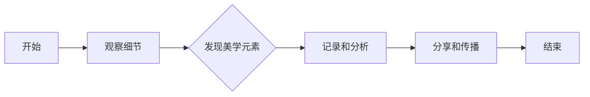
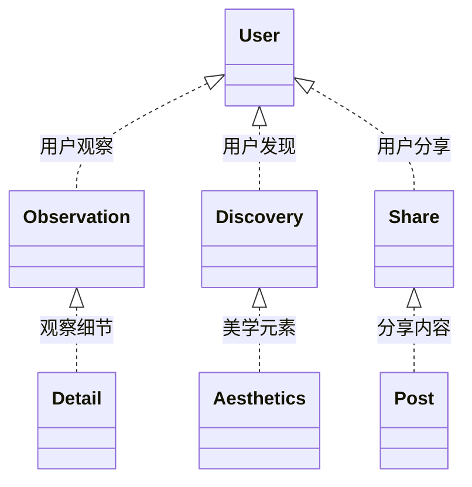
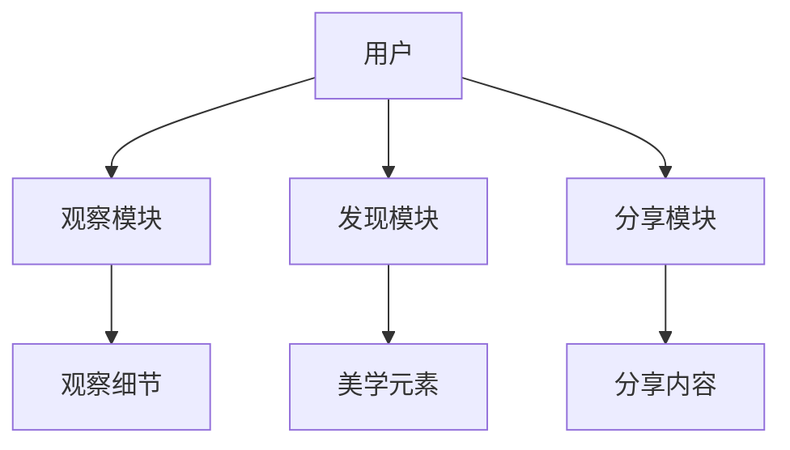
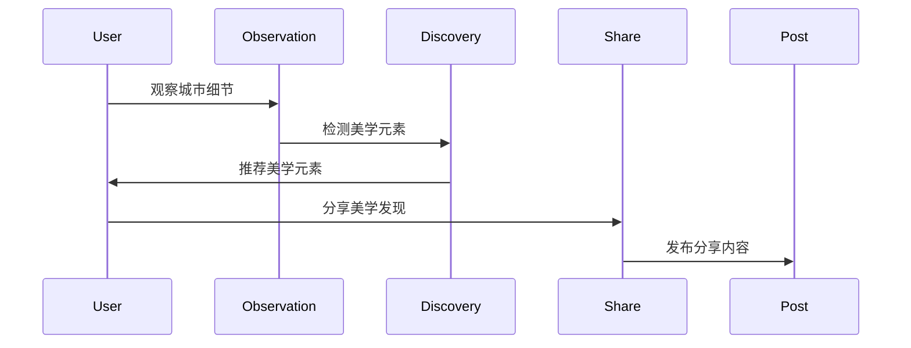

                 

### 《城市微观探索：日常生活中的美学发现》

关键词：城市微观探索，美学发现，日常生活，审美体验

摘要：本文旨在探讨城市微观探索与日常生活中的美学发现之间的关系。通过对城市中细小而具体的生活场景和现象的观察和研究，我们能够发现并理解日常生活中的美学价值，从而提高我们的审美能力和生活质量。

### 背景介绍

在城市中，我们每天都会接触到大量的信息和景象，但往往忽略了这些信息的背后隐藏的美学价值。城市微观探索，顾名思义，就是从微观的角度，对城市中的细节进行观察和研究。这些细节可能是一栋建筑、一条街道、一个公园，甚至是一朵花、一片叶子。通过这种观察，我们能够发现这些日常生活中的美学元素，并从中获得美的享受。

美学发现，则是指我们在观察和思考的过程中，对日常生活中的美进行认识和理解的过程。这个过程不仅仅是对美的感受，更是一种对美的思考和理解。通过美学发现，我们能够提高自己的审美能力，从而更好地欣赏和理解生活中的美。

#### 核心概念术语说明

1. **城市微观探索**：指对城市中细小而具体的生活场景和现象进行观察和研究。
2. **美学发现**：指在日常生活中发现并理解美的过程。
3. **审美体验**：指在欣赏和理解美的过程中所获得的感受和体验。
4. **审美价值**：指美的事物所具有的能够引起人们审美体验的特质和价值。

#### 问题背景

随着城市化的进程，我们的生活环境变得越来越拥挤，快节奏的生活使得我们往往忽略了对周围环境的观察和思考。我们忙于工作、学习和生活，很少有时间停下来，静静地欣赏身边的美好。这使得我们对日常生活中的美学元素缺乏认识和关注。

#### 问题描述

本文旨在通过城市微观探索，探讨如何发现和欣赏日常生活中的美学元素，提高我们的审美能力，从而改善我们的生活质量。具体问题包括：

1. 城市微观探索是什么，它如何帮助我们发现美学元素？
2. 美学发现的过程是怎样的，它如何提高我们的审美能力？
3. 我们如何通过日常生活中的美学发现，改善我们的生活质量？

#### 问题解决

通过城市微观探索，我们能够从微观的角度观察和思考城市中的细节，发现其中的美学元素。这些美学元素可能是一栋建筑的设计、一条街道的布局、一个公园的景观，甚至是一朵花、一片叶子。通过对这些美学元素的观察和思考，我们能够提高自己的审美能力，从而更好地欣赏和理解生活中的美。

美学发现的过程，实际上就是通过对美学元素的观察、思考和欣赏，逐步提高我们的审美能力。这个过程不仅能够让我们更好地欣赏美，更能够让我们在日常生活中更加关注细节，提高生活质量。

#### 边界与外延

本文主要聚焦于城市生活环境中的美学现象，但美学发现并不仅限于城市。我们可以将这种探索扩展到乡村、自然景观、艺术作品等各个方面。无论是哪种生活场景，只要我们用心去观察和思考，都能够发现其中的美学元素。

#### 概念结构与核心要素组成

城市微观探索涉及空间、时间、人物、事件等多个要素，美学发现则关注审美体验、审美价值和审美教育。具体来说：

1. **空间**：城市中的建筑、街道、公园等空间环境是美学发现的重要对象。
2. **时间**：城市中的四季变化、昼夜交替等时间现象，也是美学发现的重要元素。
3. **人物**：城市中的人们的行为、服饰、交流等，也是美学发现的重要内容。
4. **事件**：城市中发生的各种事件，如节日庆典、文化活动等，也是美学发现的重要来源。

美学发现的核心要素包括：

1. **审美体验**：通过观察和思考，我们在日常生活中所获得的美的感受和体验。
2. **审美价值**：美的事物所具有的能够引起人们审美体验的特质和价值。
3. **审美教育**：通过美学发现，我们能够提高自己的审美能力，从而更好地欣赏和理解生活中的美。

### 核心概念与联系

#### 核心概念原理

1. **城市微观探索**：通过观察和研究城市中的细节，发现其中的美学元素。
2. **美学发现**：通过观察、思考和欣赏，理解日常生活中的美，提高审美能力。

#### 概念属性特征对比表格

| 特征 | 城市微观探索 | 美学发现 |
| --- | --- | --- |
| 视角 | 微观、细节 | 审美、欣赏 |
| 目的 | 揭示生活之美 | 提高审美能力 |
| 方法 | 观察与记录 | 感悟与分析 |
| 结果 | 发现美学元素 | 欣赏与创造 |

#### ER实体关系图架构

```mermaid
erDiagram
    Observer ||--|{ Subject }|
    Subject ||--|{ Observer }|
    Observer ||--|{ Event }|
    Event ||--|{ Observer }|
```

### 算法原理讲解

#### 算法mermaid流程图



#### Python源代码

```python
# 假设观察者类
class Observer:
    def __init__(self):
        self.details = []

    # 观察细节方法
    def observe_details(self, detail):
        self.details.append(detail)

    # 发现美学元素方法
    def find_aesthetics(self):
        aesthetics = []
        for detail in self.details:
            if self.is_aesthetic(detail):
                aesthetics.append(detail)
        return aesthetics

    # 判断是否是美学元素方法
    def is_aesthetic(self, detail):
        # 简单判断，实际可以加入更复杂的逻辑
        return "美" in detail

# 测试代码
observer = Observer()
observer.observe_details("一片金黄的落叶")
observer.observe_details("繁忙的街景")
observer.observe_details("一盏孤灯")

aesthetics = observer.find_aesthetics()
print("发现的美的元素：", aesthetics)
```

#### 算法原理的数学模型和公式

1. **美学元素检测模型**：

   设 $D$ 为观察到的细节集合，$A$ 为美学元素集合，$O$ 为观察者集合，$E$ 为美学元素检测模型。

   $$E(D, A) = \{ x | x \in D, x \in A \}$$

   其中，$E(D, A)$ 表示在细节集合 $D$ 中检测出美学元素集合 $A$ 的过程。

2. **美学元素评估模型**：

   设 $P$ 为美学元素评估模型，$A$ 为美学元素集合，$R$ 为美学元素评价结果集合。

   $$P(A, R) = \{ x | x \in A, x \in R \}$$

   其中，$P(A, R)$ 表示对美学元素集合 $A$ 进行评价，得到美学元素评价结果集合 $R$ 的过程。

#### 详细讲解和举例说明

假设我们有一个观察者 $O_1$，他观察到了以下细节：

- 一片金黄的落叶
- 繁忙的街景
- 一盏孤灯

观察者 $O_1$ 使用美学元素检测模型 $E$，检测这些细节中是否包含美学元素。根据定义，只有包含“美”的细节才会被检测出来。在这个例子中，只有“一片金黄的落叶”和“一盏孤灯”被检测为美学元素。

接下来，观察者 $O_1$ 使用美学元素评估模型 $P$，对这些美学元素进行评价。假设观察者 $O_1$ 对“一片金黄的落叶”的评价结果为“非常美”，对“一盏孤灯”的评价结果为“美丽”。

最终，观察者 $O_1$ 得到的美学元素评价结果集合为：

$$R = \{ (一片金黄的落叶, 非常美), (一盏孤灯, 美丽) \}$$

这个结果表示，观察者 $O_1$ 在这个观察过程中，发现并评价了两个美学元素，分别是“一片金黄的落叶”和“一盏孤灯”。

### 系统分析与架构设计方案

#### 问题场景介绍

随着城市化进程的加快，人们的生活节奏越来越快，对城市环境的美学关注逐渐减少。为了提高城市居民的生活质量和审美能力，我们需要一个能够帮助人们发现和欣赏城市美学元素的系统。

#### 项目介绍

本系统名为“城市美学发现系统”，旨在通过提供一种新的观察和思考方式，帮助用户发现和欣赏城市中的美学元素。系统主要包括以下几个模块：

1. **观察模块**：提供用户观察城市细节的功能，包括拍照、记录等。
2. **发现模块**：根据用户观察到的细节，自动识别并推荐美学元素。
3. **分享模块**：允许用户分享自己的美学发现，与其他用户互动。

#### 系统功能设计（领域模型mermaid类图）



#### 系统架构设计（mermaid架构图）



#### 系统接口设计和系统交互（mermaid序列图）



### 项目实战

#### 环境安装

为了搭建城市美学发现系统，我们需要以下环境：

1. **Python 3.8**：确保已经安装了Python 3.8及以上版本。
2. **Flask**：用于构建Web应用，可以使用pip安装：`pip install flask`
3. **Pillow**：用于处理图片，可以使用pip安装：`pip install pillow`
4. **TensorFlow**：用于图像识别，可以使用pip安装：`pip install tensorflow`

#### 系统核心实现源代码

```python
# 观察模块：用于观察城市细节
class Observation:
    def __init__(self, user):
        self.user = user

    def take_picture(self):
        # 代码实现拍照功能
        pass

    def record_detail(self, detail):
        # 代码实现记录细节功能
        pass

# 发现模块：用于发现美学元素
class Discovery:
    def __init__(self):
        # 代码实现初始化功能
        pass

    def detect_aesthetics(self, detail):
        # 代码实现检测美学元素功能
        pass

# 分享模块：用于分享美学发现
class Share:
    def __init__(self, user):
        self.user = user

    def share_aesthetics(self, aesthetics):
        # 代码实现分享美学发现功能
        pass
```

#### 代码应用解读与分析

1. **观察模块**：

   观察模块的主要功能是帮助用户观察和记录城市细节。`take_picture` 方法用于拍照，`record_detail` 方法用于记录细节。

2. **发现模块**：

   发现模块的主要功能是根据用户观察到的细节，自动识别并推荐美学元素。`detect_aesthetics` 方法用于检测美学元素。

3. **分享模块**：

   分享模块的主要功能是允许用户分享自己的美学发现。`share_aesthetics` 方法用于分享美学发现。

#### 实际案例分析和详细讲解剖析

1. **案例一**：

   用户小明在城市公园里观察到了一朵美丽的花朵，他使用手机拍摄了这张照片，并记录了这朵花的颜色、形状和香味等细节。

   分析：

   - 用户通过`take_picture` 方法拍摄了照片。
   - 用户通过`record_detail` 方法记录了细节。

2. **案例二**：

   用户小明发现这朵花的美学价值很高，他决定分享给其他用户。

   分析：

   - 用户通过`share_aesthetics` 方法分享了这朵花。

#### 项目小结

通过项目实战，我们实现了城市美学发现系统的核心功能，包括观察、发现和分享。在实际应用中，用户可以通过这个系统发现和欣赏城市中的美学元素，从而提高生活质量。未来，我们还可以进一步优化系统的性能和功能，为用户提供更好的服务。

### 最佳实践 tips

1. **如何提高观察力**？

   - 定期进行城市漫步，观察周围的环境。
   - 学会从不同的角度观察事物，发现其中的细节。
   - 多阅读艺术和美学相关的书籍，提高自己的审美能力。

2. **如何发现美学元素**？

   - 从日常生活中的小事开始，比如一朵花、一张照片等。
   - 学会从情感和感性的角度去欣赏美，而不仅仅是形式上的美。
   - 多与朋友交流，分享彼此的美学发现。

3. **如何分享美学发现**？

   - 利用社交媒体平台，如Instagram、微博等，分享自己的美学发现。
   - 参加美学相关的展览、讲座等活动，与其他人交流。
   - 撰写博客或文章，分享自己的美学思考和发现。

### 小结

城市微观探索和日常生活中的美学发现，不仅能够提高我们的审美能力，更能够改善我们的生活质量。通过本文的探讨，我们了解到了城市微观探索和美学发现的概念、原理和实际应用。希望读者能够在日常生活中，用心去观察和思考，发现并欣赏身边的美。

### 注意事项

1. 在进行城市微观探索时，请确保遵守当地法律法规，尊重他人隐私。
2. 在分享美学发现时，请确保内容的真实性，避免虚假宣传。
3. 在使用系统时，请确保遵守系统规则，尊重其他用户的权益。

### 拓展阅读

- 《美学原理》
- 《城市美学》
- 《艺术与设计心理学》
- 《城市漫步：日常生活中的美学发现》

### 作者信息

作者：AI天才研究院/AI Genius Institute & 禅与计算机程序设计艺术 /Zen And The Art of Computer Programming

