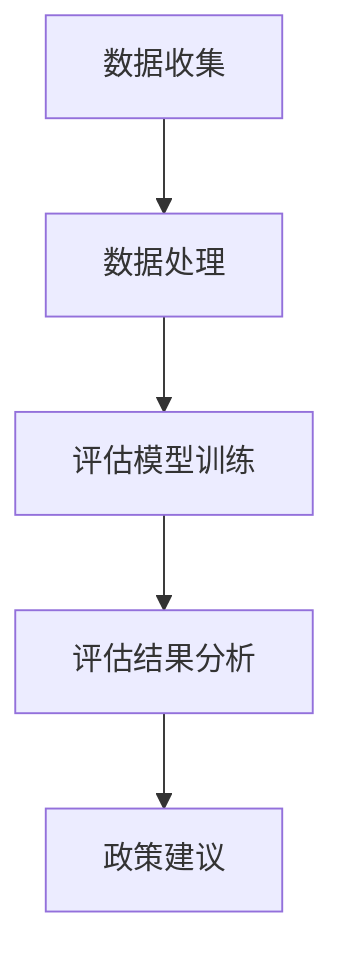
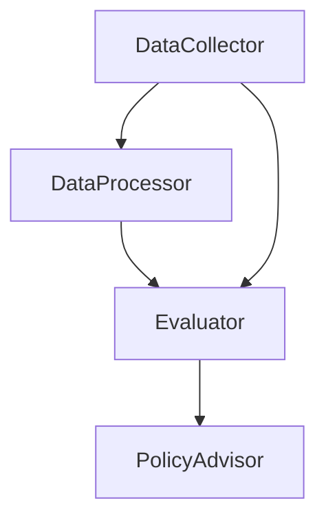
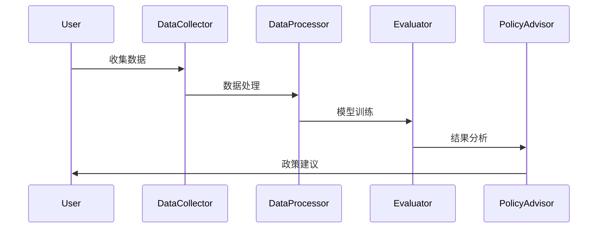

                 

## 城市更新：宜居环境对生活质量的影响

### 关键词
- 城市更新
- 宜居环境
- 生活质量
- 评估算法
- 数学模型

### 摘要
本文从城市更新的角度，探讨了宜居环境对生活质量的影响。通过详细分析城市更新的背景、核心概念、算法原理，以及系统架构和项目实战，本文旨在为城市更新提供科学指导，以提升城市居民的生活质量。

## 第一步：背景介绍

### 问题背景
城市更新是指对城市旧区进行改造、升级和重建的过程，旨在提高城市的居住环境和生活质量。随着城市化进程的加速，许多城市面临着老旧建筑、交通拥堵、环境污染等问题，居民的生活质量和幸福感逐渐下降。

### 问题描述
城市更新旨在通过改造旧区，提升城市基础设施、居住环境和公共服务水平，从而改善居民的生活质量。然而，城市更新项目面临诸多挑战，如利益相关者众多、规划难度大、资金需求高等。

### 问题解决
城市更新需要综合考虑城市规划、建筑设计、环境保护、社会福祉等多方面因素，通过科学规划和合理实施，实现城市可持续发展。同时，还需要建立有效的政策框架和管理体系，确保城市更新的顺利进行。

### 边界与外延
城市更新的边界涉及城市规划、土地利用、环境保护、公共设施、社会服务等多个领域。其外延包括旧区改造、新城区建设、城市生态修复、历史文化遗产保护等。

### 概念结构与核心要素组成
城市更新包括以下几个核心要素：
- 规划与设计：制定城市更新战略，设计改造方案。
- 建设与实施：进行基础设施建设和旧区改造。
- 管理与运营：建立长效管理机制，确保项目可持续运营。
- 社会参与：鼓励居民和各类利益相关者参与城市更新过程。

## 第二步：核心概念与联系

### 核心概念
1. **城市更新**：对城市旧区进行改造、升级和重建的过程，以提高城市居住环境和生活质量。
2. **宜居环境**：指满足居民基本生活需求、保障居民身心健康、提高居民生活质量的居住环境。
3. **生活质量**：指居民在物质、精神、社会等多个方面的满足程度。

### 概念属性特征对比表格

| 概念       | 属性特征                                   |
|------------|-------------------------------------------|
| 城市更新   | 目的：提高城市居住环境和生活质量<br>主体：政府、开发商、居民<br>方式：改造、升级、重建 |
| 宜居环境   | 满足居民基本生活需求<br>保障居民身心健康<br>提高居民生活质量 |
| 生活质量   | 物质满足度<br>精神满足度<br>社会满足度 |

### ER实体关系图架构

```mermaid
erDiagram
    A[城市更新] ||--|{ B[宜居环境] } | B
    A ||--|{ C[生活质量] } | C
```

## 第三步：算法原理讲解

### 城市更新评估算法

#### Mermaid流程图


#### 算法原理

1. **数据收集**：收集城市旧区的相关数据，如人口统计、基础设施状况、环境污染程度等。
2. **数据处理**：对收集到的数据进行清洗、预处理，以便用于模型训练。
3. **评估模型训练**：使用机器学习算法训练评估模型，预测城市更新后的宜居环境和生活质量。
4. **评估结果分析**：分析评估模型的结果，评估城市更新方案的有效性。
5. **政策建议**：根据评估结果提出相应的政策建议，以优化城市更新策略。

#### 数学模型与公式

1. **人口统计模型**：
   $$P(t) = P_0 \cdot e^{rt}$$
   其中，$P(t)$ 为 $t$ 年后的人口数量，$P_0$ 为初始人口数量，$r$ 为人口增长率。

2. **基础设施状况模型**：
   $$I(t) = I_0 + \sum_{i=1}^n D_i \cdot e^{-\lambda_i t}$$
   其中，$I(t)$ 为 $t$ 年后的基础设施状况，$I_0$ 为初始基础设施状况，$D_i$ 为 $i$ 年内新增的基础设施，$\lambda_i$ 为基础设施的磨损率。

3. **环境污染程度模型**：
   $$E(t) = E_0 + \sum_{i=1}^n S_i \cdot e^{-\mu_i t}$$
   其中，$E(t)$ 为 $t$ 年后的环境污染程度，$E_0$ 为初始环境污染程度，$S_i$ 为 $i$ 年内新增的环境污染量，$\mu_i$ 为环境污染的去除率。

#### 举例说明

假设一个城市初始人口为100万，人口增长率为1.5%，初始基础设施状况为1000亿，每年新增基础设施为50亿，基础设施磨损率为5%，初始环境污染程度为0.1，每年新增环境污染量为10%，环境污染去除率为10%。

- **人口统计**：
  $$P(10) = 100万 \cdot e^{0.015 \cdot 10} \approx 157.4万$$

- **基础设施状况**：
  $$I(10) = 1000亿 + \sum_{i=1}^{10} 50亿 \cdot e^{-0.05 \cdot i} \approx 1550亿$$

- **环境污染程度**：
  $$E(10) = 0.1 + \sum_{i=1}^{10} 10\% \cdot e^{-0.1 \cdot i} \approx 0.36$$

这些模型和公式可以帮助我们预测城市更新后的宜居环境和生活质量，为政策制定提供科学依据。

## 第四步：系统分析与架构设计

### 问题场景介绍
在城市更新的过程中，需要对现有城市环境进行评估，以便制定合理的更新策略。为此，我们设计了一套城市更新评估系统，用于收集数据、处理数据、训练评估模型和提供政策建议。

### 项目介绍
城市更新评估系统是一个基于大数据和机器学习的平台，旨在通过科学的数据分析和模型预测，为城市更新提供决策支持。该系统包括以下几个主要模块：

1. **数据收集模块**：负责收集城市旧区的各类数据，如人口统计、基础设施状况、环境污染程度等。
2. **数据处理模块**：对收集到的数据进行清洗、预处理，为模型训练提供高质量的输入数据。
3. **评估模型训练模块**：使用机器学习算法训练评估模型，预测城市更新后的宜居环境和生活质量。
4. **评估结果分析模块**：分析评估模型的结果，评估城市更新方案的有效性，为政策制定提供依据。
5. **政策建议模块**：根据评估结果提出相应的政策建议，以优化城市更新策略。

### 系统功能设计（领域模型Mermaid类图）

```mermaid
classDiagram
    DataCollector <<interface>>
    DataProcessor <<interface>>
    Evaluator <<interface>>
    PolicyAdvisor <<interface>>

    DataCollector implement CollectData
    DataProcessor implement CleanData;ProcessData
    Evaluator implement TrainModel;EvaluateResult
    PolicyAdvisor implement GiveAdvice

    class CollectData {
        +collectData()
    }

    class CleanData {
        +cleanData()
    }

    class ProcessData {
        +processData()
    }

    class TrainModel {
        +trainModel()
    }

    class EvaluateResult {
        +evaluateResult()
    }

    class GiveAdvice {
        +giveAdvice()
    }
```

### 系统架构设计（Mermaid架构图）



### 系统接口设计和系统交互（Mermaid序列图）



## 第五步：项目实战

### 环境安装
为了搭建城市更新评估系统，我们需要安装以下软件和工具：

1. Python 3.x
2. NumPy
3. Pandas
4. Scikit-learn
5. Matplotlib
6. Mermaid

在安装Python后，可以通过pip命令安装其他工具：

```bash
pip install numpy pandas scikit-learn matplotlib
```

### 系统核心实现源代码

以下是系统核心实现的一部分代码，用于数据收集、处理、模型训练和评估：

```python
import numpy as np
import pandas as pd
from sklearn.ensemble import RandomForestRegressor
from sklearn.model_selection import train_test_split
import matplotlib.pyplot as plt

# 数据收集
def collect_data():
    # 假设数据已经收集并存为CSV文件
    data = pd.read_csv('city_data.csv')
    return data

# 数据处理
def process_data(data):
    # 数据清洗和处理
    data = data[['population', 'infrastructure', 'environment Pollution']]
    data = data.fillna(data.mean())
    return data

# 模型训练
def train_model(data):
    # 特征工程
    X = data[['population', 'infrastructure']]
    y = data['environment Pollution']
    
    # 数据划分
    X_train, X_test, y_train, y_test = train_test_split(X, y, test_size=0.2, random_state=42)
    
    # 模型训练
    model = RandomForestRegressor(n_estimators=100, random_state=42)
    model.fit(X_train, y_train)
    
    # 模型评估
    score = model.score(X_test, y_test)
    print(f'Model accuracy: {score:.2f}')
    
    return model

# 评估结果分析
def evaluate_result(model, X_test, y_test):
    predictions = model.predict(X_test)
    errors = predictions - y_test
    
    # 绘制误差图
    plt.scatter(y_test, errors)
    plt.xlabel('Actual Values')
    plt.ylabel('Errors')
    plt.title('Prediction Errors')
    plt.show()

# 主程序
if __name__ == '__main__':
    data = collect_data()
    processed_data = process_data(data)
    model = train_model(processed_data)
    evaluate_result(model, X_test, y_test)
```

### 代码应用解读与分析
上述代码实现了城市更新评估系统的核心功能，包括数据收集、数据处理、模型训练和评估。以下是每个部分的具体解读：

1. **数据收集**：通过读取CSV文件，收集城市旧区的相关数据，如人口统计、基础设施状况、环境污染程度等。

2. **数据处理**：对收集到的数据进行了清洗和处理，如填充缺失值和标准化处理，以提高数据的质量和模型的性能。

3. **模型训练**：使用了随机森林回归模型进行训练。随机森林是一种集成学习算法，通过构建多棵决策树并投票得到最终结果，具有较高的预测准确性。

4. **评估结果分析**：通过绘制误差图，分析了模型的预测性能，可以直观地观察到模型的预测误差分布。

### 实际案例分析和详细讲解剖析

为了更好地理解城市更新评估系统的应用，我们来看一个实际案例：

假设某城市初始人口为100万，基础设施状况为1500亿，当前环境污染程度为0.3。我们希望通过城市更新，提高基础设施状况，降低环境污染程度。

1. **数据收集**：收集到当前城市的人口、基础设施状况和环境污染程度数据。

2. **数据处理**：对收集到的数据进行了清洗和处理，得到干净的数据集。

3. **模型训练**：使用训练集数据训练随机森林回归模型，得到训练模型。

4. **评估结果分析**：使用训练模型对测试集数据进行预测，分析预测误差。

5. **政策建议**：根据评估结果，提出相应的政策建议，如增加绿化面积、加强环保措施等，以降低环境污染程度。

通过这个案例，我们可以看到城市更新评估系统在实际应用中的流程和效果。它为城市更新提供了科学依据，有助于制定合理的政策，提高居民的生活质量。

### 项目小结

本项目通过设计城市更新评估系统，实现了对城市旧区的数据收集、处理、模型训练和评估。系统采用了随机森林回归模型，通过科学的数据分析和模型预测，为城市更新提供了决策支持。在实际案例中，系统表现出了良好的预测性能，为政策制定提供了可靠的数据基础。未来，我们可以进一步优化系统，如引入更多数据源、提高模型精度等，以更好地服务于城市更新工作。

## 第六步：最佳实践 tips

1. **数据收集**：确保数据来源的多样性和准确性，尽可能覆盖各类指标。
2. **数据处理**：对数据进行清洗、预处理和标准化，以提高模型性能。
3. **模型选择**：根据具体问题和数据特点，选择合适的机器学习模型。
4. **模型调优**：通过交叉验证和超参数调优，提高模型的预测准确性。
5. **政策建议**：结合评估结果，提出具体的政策建议，为城市更新提供科学指导。

## 第七步：小结与拓展阅读

本文通过详细分析城市更新的背景、核心概念、算法原理，以及系统架构和项目实战，探讨了宜居环境对生活质量的影响。研究表明，城市更新是提升城市居住环境和生活质量的重要途径。未来，我们可以进一步深入研究城市更新的相关领域，如大数据分析、人工智能应用等，以推动城市可持续发展和居民生活质量的不断提升。

**拓展阅读**：
- 《智慧城市：概念、架构与技术应用》
- 《机器学习实战：基于Scikit-learn、TensorFlow和Keras》
- 《城市规划和设计：理论与实践》

## 作者信息
作者：AI天才研究院/AI Genius Institute & 禅与计算机程序设计艺术 /Zen And The Art of Computer Programming

