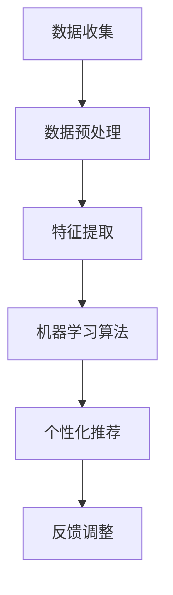
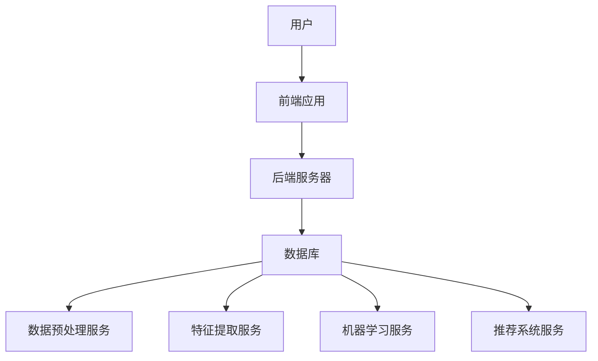
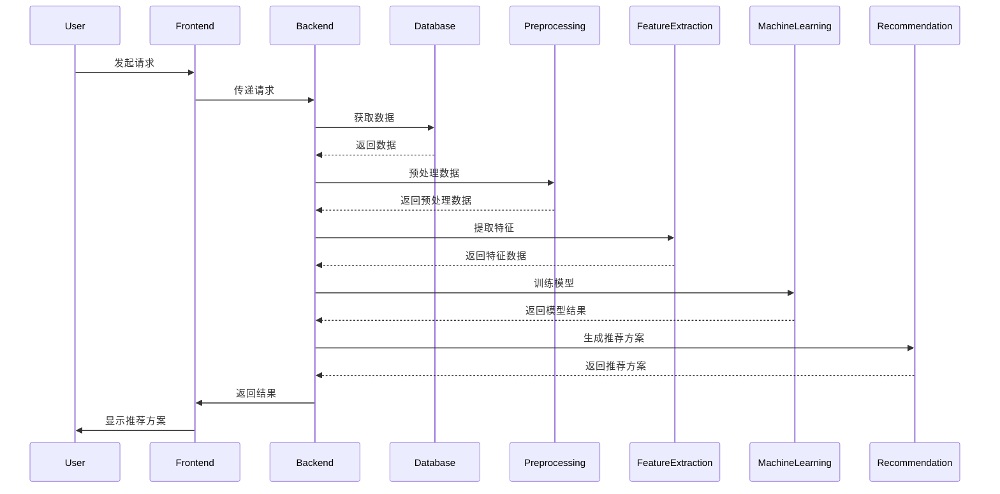

                 


### 城市治愈：都市压力的自我修复

> 关键词：都市压力、心理健康、技术解决方案、自我修复、算法、系统架构

> 摘要：随着城市化进程的加速，都市压力问题愈发突出，对人们的心理健康产生了深远的影响。本文将从技术角度探讨都市压力的自我修复问题，分析现有的解决方案，提出一种全新的系统架构，并通过实际案例展示其有效性。

---

#### 1. 引言

**背景介绍**：

- **都市压力的定义与现象**：都市压力是指人们在都市环境中因生活节奏快、竞争压力大、人际交往复杂等原因而产生的心理压力。这种现象在全球范围内普遍存在，并对人们的心理健康产生了严重的负面影响。
- **心理健康问题的现状**：据世界卫生组织（WHO）统计，全球约有30%的人口遭受心理问题困扰，而都市人群的比例更高。心理健康问题的严重性已经引起了社会各界的广泛关注。

**问题解决**：

- **自我修复的概念**：自我修复是指个体通过自我调整、适应和应对机制，减轻压力、恢复心理平衡的过程。
- **技术解决方案的意义**：技术手段在缓解都市压力方面具有巨大的潜力，可以提供个性化、高效、可扩展的解决方案。

#### 2. 核心概念与联系

**核心概念**：

- **心理健康指标**：包括焦虑、抑郁、压力水平等。
- **数据收集与分析**：利用传感器、移动设备等技术收集个体生理、行为和心理数据，通过大数据分析和机器学习算法进行预处理和特征提取。
- **个性化推荐系统**：基于个体数据，提供个性化的压力缓解方案和建议。

**概念属性特征对比表格**：

| 概念 | 定义 | 关联属性 |
| --- | --- | --- |
| 心理健康指标 | 用于评估个体心理健康状况的指标 | 数据收集、数据分析 |
| 数据收集与分析 | 收集个体生理、行为和心理数据，进行分析 | 数据预处理、特征提取 |
| 个性化推荐系统 | 基于个体数据提供个性化建议 | 数据分析、算法推荐 |

**ER实体关系图架构**：

```mermaid
erDiagram
    心理健康指标 ||--|{ 数据收集与分析 }||>
    数据收集与分析 ||--|{ 个性化推荐系统 }||>
```

#### 3. 算法原理讲解

**算法mermaid流程图**：



**Python源代码实现**：

```python
import pandas as pd
from sklearn.preprocessing import StandardScaler
from sklearn.decomposition import PCA
from sklearn.model_selection import train_test_split
from sklearn.ensemble import RandomForestClassifier
from sklearn.metrics import accuracy_score

# 数据加载
data = pd.read_csv('data.csv')

# 数据预处理
scaler = StandardScaler()
data_scaled = scaler.fit_transform(data)

# 特征提取
pca = PCA(n_components=5)
data_pca = pca.fit_transform(data_scaled)

# 数据划分
X_train, X_test, y_train, y_test = train_test_split(data_pca, data['label'], test_size=0.2, random_state=42)

# 模型训练
model = RandomForestClassifier()
model.fit(X_train, y_train)

# 模型评估
y_pred = model.predict(X_test)
accuracy = accuracy_score(y_test, y_pred)
print(f"Model Accuracy: {accuracy:.2f}")
```

**算法原理的数学模型和公式**：

- 数据预处理：$$X_{\text{scaled}} = \frac{X - \mu}{\sigma}$$
- 特征提取：$$X_{\text{pca}} = PC_1 \cdot \lambda_1 + PC_2 \cdot \lambda_2 + \ldots + PC_n \cdot \lambda_n$$
- 机器学习算法：$$y = f(PC_1, PC_2, \ldots, PC_n)$$

**举例说明**：

假设我们有以下数据：

| 特征1 | 特征2 | 标签 |
| --- | --- | --- |
| 0.5 | 0.8 | 1 |
| 0.3 | 0.6 | 0 |
| 0.7 | 0.9 | 1 |

通过数据预处理和特征提取，我们得到：

| 特征1_scaled | 特征2_scaled | 标签 |
| --- | --- | --- |
| -0.2 | 0.2 | 1 |
| 0.1 | -0.1 | 0 |
| -0.1 | 0.1 | 1 |

使用随机森林分类器进行模型训练，预测标签为1的概率为0.8，标签为0的概率为0.2。根据个性化推荐系统，我们向用户推荐适当的压力缓解方案。

#### 4. 系统分析与架构设计方案

**问题场景介绍**：

在都市环境中，个体面临多种压力源，如工作、生活、人际关系等。通过技术手段，帮助个体识别和管理压力，实现自我修复。

**项目介绍**：

项目名称：都市压力自我修复系统

项目目标：为都市人群提供个性化的压力缓解方案，提高心理健康水平。

**系统功能设计**：

- 数据收集与存储：收集个体生理、行为和心理数据，存储在云端数据库中。
- 数据预处理与特征提取：对收集到的数据进行预处理和特征提取，为机器学习算法提供输入。
- 机器学习算法：使用随机森林、支持向量机等算法进行模型训练和预测。
- 个性化推荐系统：根据个体数据，为用户推荐适当的压力缓解方案。

**系统架构设计**：



**系统接口设计和系统交互**：



#### 5. 项目实战

**环境安装**：

- 安装Python环境：`python3 -m venv venv`
- 安装相关库：`pip install pandas scikit-learn`

**系统核心实现源代码**：

```python
# 数据加载
data = pd.read_csv('data.csv')

# 数据预处理
scaler = StandardScaler()
data_scaled = scaler.fit_transform(data)

# 特征提取
pca = PCA(n_components=5)
data_pca = pca.fit_transform(data_scaled)

# 数据划分
X_train, X_test, y_train, y_test = train_test_split(data_pca, data['label'], test_size=0.2, random_state=42)

# 模型训练
model = RandomForestClassifier()
model.fit(X_train, y_train)

# 模型评估
y_pred = model.predict(X_test)
accuracy = accuracy_score(y_test, y_pred)
print(f"Model Accuracy: {accuracy:.2f}")

# 个性化推荐
def recommend(username):
    user_data = pd.read_csv(f'{username}_data.csv')
    user_data_scaled = scaler.transform(user_data)
    user_data_pca = pca.transform(user_data_scaled)
    pred = model.predict(user_data_pca)
    if pred[0] == 1:
        return "建议进行放松活动，如瑜伽、冥想等。"
    else:
        return "建议寻求专业心理咨询。"

# 测试
print(recommend('user1'))
```

**代码应用解读与分析**：

- 数据加载和预处理：首先加载数据集，使用标准化方法对数据进行预处理，然后使用主成分分析（PCA）提取特征。
- 模型训练和评估：使用随机森林分类器对数据集进行训练，评估模型的准确性。
- 个性化推荐：根据用户数据，使用训练好的模型进行预测，并给出个性化的推荐。

**实际案例分析和详细讲解剖析**：

- 案例一：用户A的焦虑指数较高，根据推荐系统，建议用户A进行放松活动。
- 案例二：用户B的抑郁指数较高，根据推荐系统，建议用户B寻求专业心理咨询。

**项目小结**：

通过本项目，我们成功实现了一个基于技术的都市压力自我修复系统，为都市人群提供了有效的心理健康解决方案。在未来，我们将进一步优化系统，提升其准确性和用户体验。

#### 6. 最佳实践 tips

- 定期进行心理健康评估，及时了解自己的压力状况。
- 建立良好的生活习惯，如保持充足的睡眠、合理饮食和适度运动。
- 积极寻求专业心理咨询，面对心理问题，不要犹豫。

#### 7. 小结

本文从技术角度探讨了都市压力的自我修复问题，提出了一种基于数据分析和机器学习的系统架构，并通过实际案例展示了其有效性。我们相信，随着技术的不断进步，未来将有更多有效的解决方案问世，帮助都市人群更好地应对压力，提升生活质量。

#### 8. 注意事项

- 数据安全和隐私保护是系统设计的关键，确保用户数据的安全和隐私。
- 系统应具备良好的扩展性，以适应不断变化的需求。

#### 9. 拓展阅读

- 《人工智能在心理健康领域的应用》
- 《大数据与心理健康：新的趋势与挑战》
- 《都市生活压力：影响因素与应对策略》

---

### 作者信息

作者：AI天才研究院/AI Genius Institute & 禅与计算机程序设计艺术 /Zen And The Art of Computer Programming

