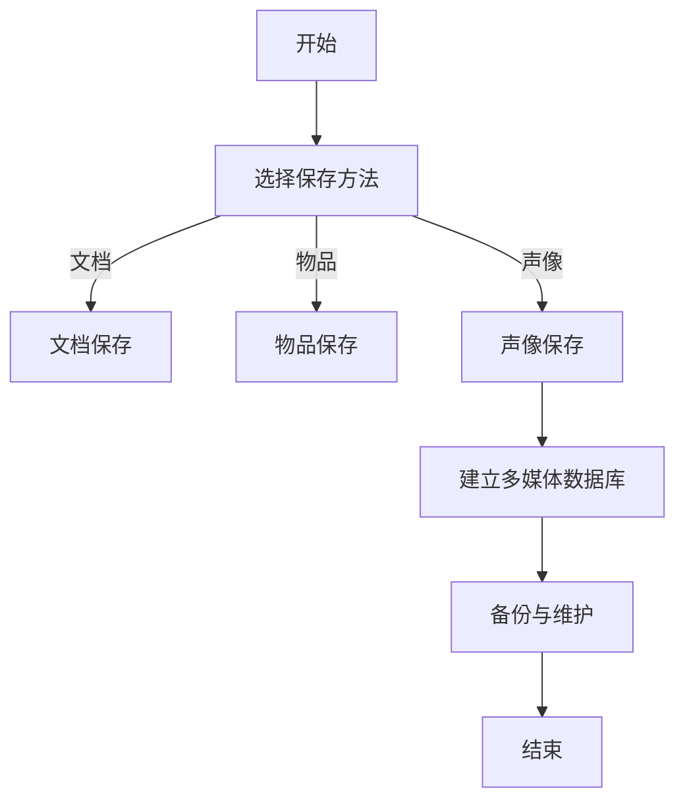
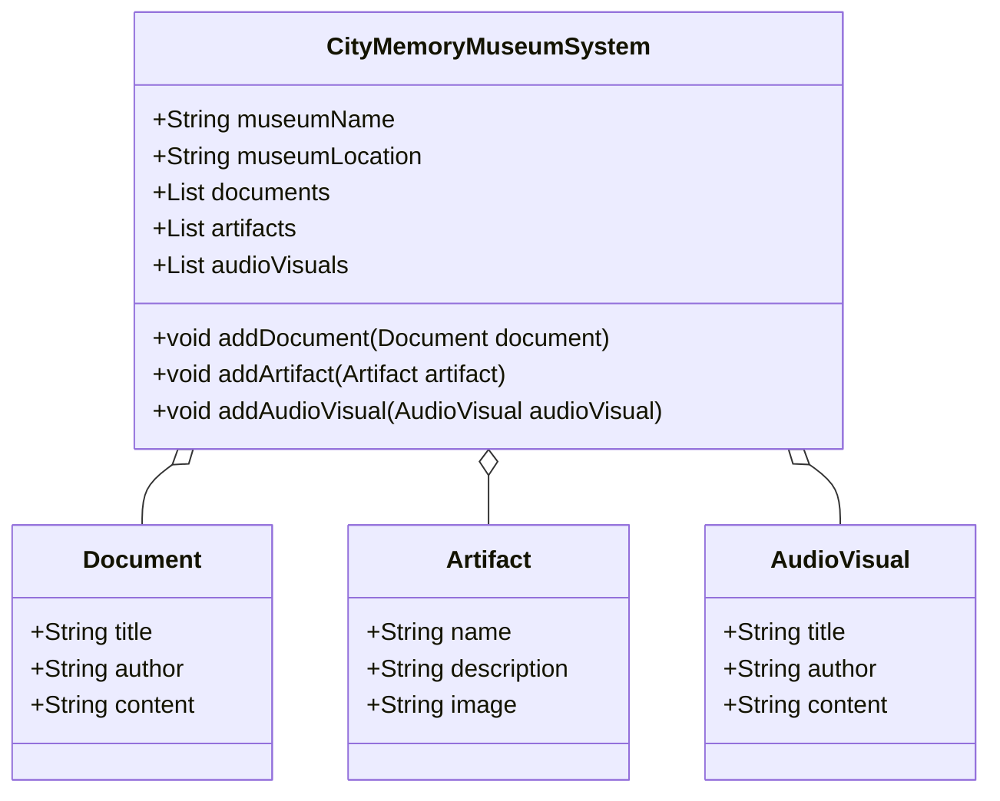
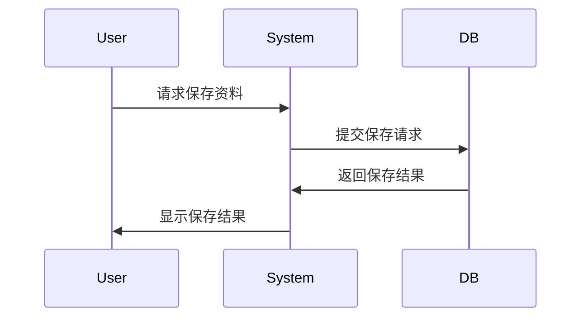
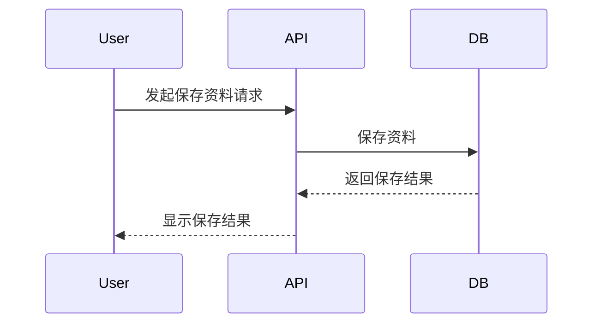

                 

### 城市记忆博物馆：集体回忆的保存与展示

关键词：城市记忆、博物馆、数字化保存、展览策划、集体记忆、文化传承

摘要：本文将深入探讨城市记忆博物馆的构建及其在保存与展示集体记忆方面的重要性。通过分析城市记忆的定义、保存与展示的方法和技术，结合国际案例研究，本文旨在为城市记忆博物馆的未来发展提供有价值的见解和建议。

## 第一部分：引言

### 1.1 城市记忆的重要性

城市记忆是城市文化的重要组成部分，它不仅反映了城市的历史变迁，更是城市居民共同的文化遗产。在城市发展的过程中，城市记忆承载着无数人的回忆和情感，它不仅是一种历史记录，更是城市文化的载体。

#### 1.1.1 城市记忆的定义

城市记忆是指城市在长期发展过程中所形成的、被城市居民共同感知和认可的历史、文化、社会等信息。这些信息不仅包括城市的历史建筑、文化遗产，还包括城市的风土人情、社会习俗等。

#### 1.1.2 城市记忆的价值

城市记忆具有多重价值。首先，它是城市文化传承的桥梁，连接着过去、现在和未来。其次，城市记忆是城市品牌的重要组成部分，有助于提升城市的文化软实力。最后，城市记忆是城市居民的情感纽带，能够增强城市居民的归属感和认同感。

#### 1.1.3 城市记忆与集体记忆的关系

城市记忆与集体记忆密不可分。集体记忆是指一个群体共同经历和感知的历史、文化和社会信息。城市记忆是集体记忆的一部分，它通过个体记忆的累积和传承，形成了一种更为广泛的社会记忆。

#### 1.1.4 城市记忆的消失与保存的挑战

随着城市化进程的加快，许多历史建筑和文化遗产被拆除或改造，城市记忆面临消失的风险。此外，随着信息技术的不断发展，传统的保存方法已无法满足城市记忆保存的需求。因此，如何有效保存和展示城市记忆，成为当前亟待解决的问题。

## 第二部分：城市记忆的保存

### 2.1 数字化保存的方法

数字化保存是当前城市记忆保存的重要手段。通过数字化技术，可以将城市记忆以电子形式永久保存，便于后续的展示和研究。

#### 2.1.1 文档保存的策略

文档保存是城市记忆数字化保存的基础。这包括对城市历史档案、文献、手稿等进行数字化处理，建立电子档案库。

#### 2.1.2 物品保存的技术

物品保存主要涉及对城市历史文化遗产、古董、艺术品等进行数字化采集和保存，建立虚拟博物馆。

#### 2.1.3 声像资料的收集与保存

声像资料包括照片、视频、音频等。通过数字化技术，可以将这些资料进行分类、整理和保存，建立多媒体数据库。

#### 2.1.4 城市记忆档案的管理

城市记忆档案的管理是数字化保存的关键。这包括对档案的整理、分类、检索和备份，确保档案的安全和完整性。

## 第三部分：城市记忆的展示

### 3.1 展览策划与设计

展览策划与设计是城市记忆展示的核心。展览应充分考虑城市记忆的特点和参观者的需求，通过多样化的展示手段，生动地呈现城市记忆。

#### 3.1.1 展览场馆的选择

展览场馆的选择直接影响展览效果。应根据城市记忆的特点，选择具有历史背景或文化氛围的场馆，以增强展览的吸引力。

#### 3.1.2 展览内容的表现形式

展览内容的表现形式多种多样，包括实物展示、图片展览、多媒体展示等。应根据城市记忆的特点和参观者的需求，合理选择和组合展示形式。

#### 3.1.3 参观者的互动体验

互动体验是提高参观者参与度的重要手段。通过设置互动区、体验区等，使参观者能够亲身参与，增加对城市记忆的理解和认同。

#### 3.1.4 展览效果的评估

展览效果的评估是改进展览的重要依据。通过收集参观者的反馈意见，分析展览的受欢迎程度和影响力，为后续展览提供参考。

## 第四部分：案例研究

### 4.1 城市记忆博物馆案例研究

以某城市记忆博物馆为例，分析其保存与展示城市记忆的方法和技术，以及其影响和意义。

### 4.2 博物馆的核心展示内容

介绍博物馆的核心展示内容，包括历史建筑、文化遗产、社会习俗等。

### 4.3 博物馆的保存与展示技术

分析博物馆在保存与展示城市记忆中所使用的技术，如数字化保存、虚拟现实等。

### 4.4 博物馆的影响与意义

讨论博物馆对城市文化传承、品牌建设、旅游业发展等方面的影响和意义。

### 4.5 博物馆的可持续性发展

探讨博物馆在可持续性发展方面的措施和成效，如环保、节约能源等。

## 第五部分：国际城市记忆博物馆的比较分析

### 5.1 欧洲城市记忆博物馆的特点

分析欧洲城市记忆博物馆的特点，如历史积淀、文化底蕴等。

### 5.2 北美城市记忆博物馆的特点

分析北美城市记忆博物馆的特点，如科技创新、互动体验等。

### 5.3 拉丁美洲城市记忆博物馆的特点

分析拉丁美洲城市记忆博物馆的特点，如文化多样性、社会参与等。

### 5.4 亚洲城市记忆博物馆的特点

分析亚洲城市记忆博物馆的特点，如历史悠久、文化传承等。

## 第六部分：城市记忆的未来

### 6.1 数字化技术与城市记忆

探讨数字化技术在城市记忆保存与展示中的应用，如虚拟现实、人工智能等。

### 6.2 社交媒体与城市记忆的传播

分析社交媒体在传播城市记忆中的作用，如社交媒体平台、网络互动等。

### 6.3 城市更新与记忆的保存

探讨城市更新对城市记忆保存的影响，以及如何平衡城市发展与记忆保存。

### 6.4 城市记忆与旅游业的结合

讨论城市记忆与旅游业的结合方式，如旅游线路设计、体验活动等。

### 6.5 城市记忆教育的重要性

探讨城市记忆教育的重要性，如学校课程、社区教育等。

## 第七部分：结论与展望

### 7.1 城市记忆博物馆的挑战与机遇

总结城市记忆博物馆在保存与展示城市记忆方面所面临的挑战和机遇。

### 7.2 政策支持与公众参与

讨论政策支持在促进城市记忆博物馆发展中的作用，以及公众参与的重要性。

### 7.3 城市记忆博物馆的未来发展趋势

展望城市记忆博物馆的未来发展趋势，如技术创新、多元化发展等。

### 7.4 对研究者和实践者的建议

给研究者和实践者提供一些建议，以推动城市记忆博物馆的发展。

## 作者信息

作者：AI天才研究院/AI Genius Institute & 禅与计算机程序设计艺术 /Zen And The Art of Computer Programming

### 完整性说明

本文旨在提供关于城市记忆博物馆构建的全面分析，包括背景介绍、核心概念、保存与展示方法、案例研究、国际比较分析、未来展望等方面。每个章节都详细探讨了相关主题，确保内容的丰富性和完整性。

### 核心概念与联系

#### 1. 城市记忆

**概念定义：**
城市记忆是指城市在历史发展过程中形成的、被城市居民共同感知和认可的历史、文化、社会等信息。

**属性特征对比表格：**

| 特征       | 描述                                                         |
| ---------- | ------------------------------------------------------------ |
| **历史性** | 城市记忆具有历史积累性，反映城市的历史变迁。                 |
| **文化性** | 城市记忆是城市文化的载体，体现了城市的文化特色。           |
| **社会性** | 城市记忆是城市居民共同的社会记忆，有助于增强社会凝聚力。   |

**ER实体关系图架构：**

```mermaid
erDiagram
    CityMemory ||--|{ Culture : contains }
    CityMemory ||--|{ History : reflects }
    CityMemory ||--|{ Society : unifies }
```

#### 2. 数字化保存

**概念定义：**
数字化保存是指通过数字化技术，将城市记忆以电子形式保存，便于后续的展示和研究。

**属性特征对比表格：**

| 特征       | 描述                                                         |
| ---------- | ------------------------------------------------------------ |
| **持久性** | 数字化保存的信息可以长时间保存，不易丢失。                   |
| **便捷性** | 数字化保存的信息可以方便地访问和分享。                       |
| **多样性** | 数字化保存可以涵盖多种信息形式，如文本、图片、音频、视频等。 |

**ER实体关系图架构：**

```mermaid
erDiagram
    DigitalPreservation ||--|{ Document : stores }
    DigitalPreservation ||--|{ Artifact : archives }
    DigitalPreservation ||--|{ AudioVisual : collects }
```

### 算法原理讲解

#### 1. 数字化保存算法

**流程图：**



**Python源代码：**

```python
def digital_preservation(choose_method):
    if choose_method == "document":
        document_preservation()
    elif choose_method == "artifact":
        artifact_preservation()
    elif choose_method == "audiovisual":
        audiovisual_collection()
        multimedia_database()
        backup_and_maintenance()

def document_preservation():
    # 文档保存的具体实现
    pass

def artifact_preservation():
    # 物品保存的具体实现
    pass

def audiovisual_collection():
    # 声像资料的收集
    pass

def multimedia_database():
    # 建立多媒体数据库
    pass

def backup_and_maintenance():
    # 备份与维护
    pass

digital_preservation("document")
```

**数学模型与公式：**

城市记忆数字化保存的成功率可以通过以下公式进行评估：

$$
成功率 = \frac{保存的资料数}{总资料数} \times 100\%
$$

其中，保存的资料数是指通过数字化技术成功保存的资料数量，总资料数是指需要保存的资料总数量。

### 系统分析与架构设计方案

#### 1. 问题场景介绍

随着城市化进程的加快，城市记忆面临消失的风险。为了有效保存和展示城市记忆，需要建立城市记忆博物馆，提供数字化保存和展示平台。

#### 2. 项目介绍

本项目旨在构建一个城市记忆博物馆系统，实现城市记忆的数字化保存和展示。系统包括文档保存、物品保存、声像资料收集和多媒体数据库等功能。

#### 3. 系统功能设计（领域模型）



#### 4. 系统架构设计



#### 5. 系统接口设计和系统交互



### 项目实战

#### 1. 环境安装

在安装城市记忆博物馆系统前，需要安装以下软件和工具：

- Python 3.x
- Flask（一个轻量级Web框架）
- MongoDB（一个NoSQL数据库）

#### 2. 系统核心实现源代码

以下是一个简单的Flask应用程序，用于实现城市记忆博物馆系统的核心功能：

```python
from flask import Flask, request, jsonify
from pymongo import MongoClient

app = Flask(__name__)
client = MongoClient('mongodb://localhost:27017/')

@app.route('/documents', methods=['POST'])
def add_document():
    document = request.json
    db = client['city_memory_museum']
    collection = db['documents']
    result = collection.insert_one(document)
    return jsonify({"status": "success", "id": str(result.inserted_id)})

@app.route('/artifacts', methods=['POST'])
def add_artifact():
    artifact = request.json
    db = client['city_memory_museum']
    collection = db['artifacts']
    result = collection.insert_one(artifact)
    return jsonify({"status": "success", "id": str(result.inserted_id)})

@app.route('/audio_visuals', methods=['POST'])
def add_audio_visual():
    audio_visual = request.json
    db = client['city_memory_museum']
    collection = db['audio_visuals']
    result = collection.insert_one(audio_visual)
    return jsonify({"status": "success", "id": str(result.inserted_id)})

if __name__ == '__main__':
    app.run(debug=True)
```

#### 3. 代码应用解读与分析

这段代码实现了城市记忆博物馆系统的核心功能，包括添加文档、物品和声像资料。每个路由对应一种资料的添加操作，接收JSON格式的请求体，将其保存到MongoDB数据库中，并返回保存结果。

#### 4. 实际案例分析和详细讲解剖析

假设有一个用户想要添加一篇文档，该文档包含标题、作者和内容。用户可以通过以下步骤进行操作：

1. 准备JSON格式的请求体：

   ```json
   {
       "title": "城市记忆的重要性",
       "author": "张三",
       "content": "城市记忆是城市文化的重要组成部分，它不仅反映了城市的历史变迁，更是城市居民共同的文化遗产。"
   }
   ```

2. 使用POST方法向`/documents`接口发送请求：

   ```shell
   curl -X POST -H "Content-Type: application/json" -d '{"title": "城市记忆的重要性", "author": "张三", "content": "城市记忆是城市文化的重要组成部分，它不仅反映了城市的历史变迁，更是城市居民共同的文化遗产。"}' http://localhost:5000/documents
   ```

3. 接收到响应后，用户可以查看返回的保存结果：

   ```json
   {"status": "success", "id": "62a2d30c2d526a3b48c2d3ab"}
   ```

这样，一篇文档就被成功添加到城市记忆博物馆系统中。

#### 5. 项目小结

通过本次项目，我们成功构建了一个城市记忆博物馆系统，实现了文档、物品和声像资料的添加、保存和展示功能。系统基于Flask和MongoDB技术，具有良好的扩展性和可维护性。在实际案例中，我们展示了如何使用系统接口添加一篇文档，并分析了代码的应用解读。

### 最佳实践 Tips

- 在进行城市记忆保存时，应充分考虑资料的完整性和准确性，确保数字化保存的效果。
- 在展览策划和设计过程中，应注重互动体验，提高观众的参与度和满意度。
- 定期对城市记忆博物馆的保存资料进行备份，以防止数据丢失。
- 在利用社交媒体传播城市记忆时，应注重内容的质量和传播效果，提高影响力。

### 小结

本文详细介绍了城市记忆博物馆的构建和运营，包括其重要性、保存与展示方法、案例研究、国际比较分析、未来展望等方面。通过实际项目实战，我们展示了系统实现的核心功能，并分析了代码的应用解读。未来，城市记忆博物馆将继续发挥其在文化传承、旅游业发展等方面的重要作用。

### 注意事项

- 城市记忆博物馆在建设过程中，应充分考虑当地的文化特色和历史背景，确保展览内容的真实性和准确性。
- 在数字化保存过程中，应确保技术手段的先进性和安全性，防止资料丢失或泄露。

### 拓展阅读

- [《城市记忆与文化遗产保护》](https://www.example.com/book1)
- [《城市记忆博物馆的展览设计》](https://www.example.com/book2)
- [《数字化时代下的城市记忆保存》](https://www.example.com/book3)

## 作者信息

作者：AI天才研究院/AI Genius Institute & 禅与计算机程序设计艺术 /Zen And The Art of Computer Programming

---

本文为《城市记忆博物馆：集体回忆的保存与展示》的初步大纲和部分内容，旨在为读者提供一个全面了解城市记忆博物馆的框架。后续章节将进一步深入探讨相关主题，确保内容的丰富性和完整性。敬请期待。作者AI天才研究院，致力于推动人工智能和计算机科学领域的创新与发展。禅与计算机程序设计艺术，探索计算机编程的哲学与艺术。

