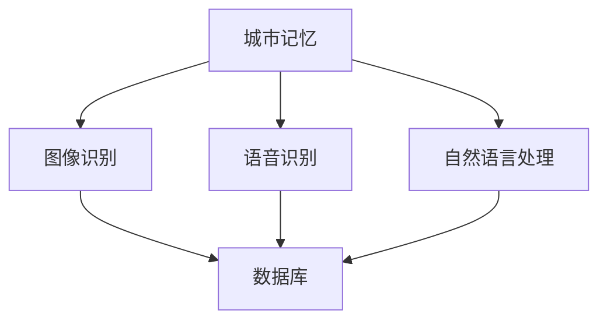
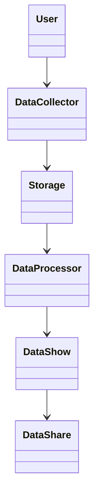
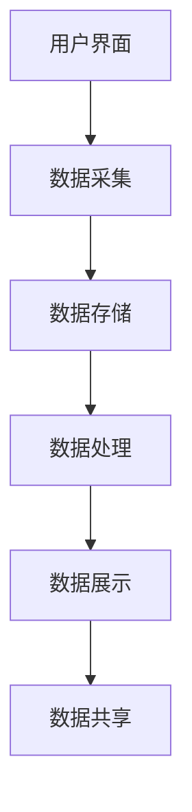

                 

# 城市记忆银行：集体回忆的数字化保存项目

> 关键词：城市记忆，数字化保存，图像识别，语音识别，自然语言处理，集体回忆

> 摘要：随着城市化进程的不断加快，城市中的集体记忆正逐渐消失。本文提出了一个名为“城市记忆银行”的数字化保存项目，旨在通过现代数字化技术，如图像识别、语音识别和自然语言处理，将城市的集体记忆进行数字化保存，实现长期保存和共享。本文将详细分析该项目的技术原理、算法实现，并提供实战案例，以期为城市集体记忆的保护提供一种新的思路。

## 第一部分：背景介绍

### 1.1 问题背景

城市化进程是人类社会发展的重要标志，但也伴随着一系列的问题。其中一个严重的问题就是集体记忆的丧失。随着城市化的推进，许多历史建筑、文化遗迹和社区故事被新的高楼大厦所取代，这使得城市的集体记忆逐渐消失。这些记忆不仅是城市历史的见证，也是社区居民的情感依托。如何有效保存这些集体记忆，成为了一个亟待解决的问题。

### 1.2 问题解决

为了解决上述问题，我们需要将城市中的集体记忆进行数字化保存。数字化保存的优点在于，它可以将记忆以数字化的形式保存下来，实现长期保存和共享。数字化保存不仅可以保护这些记忆不受物理损坏的影响，还可以通过互联网等渠道实现全球共享，让更多人能够了解和传承这些记忆。

### 1.3 边界与外延

“城市记忆银行”项目的范围包括但不限于以下方面：

- **历史建筑**：通过数字化技术，保存城市中重要的历史建筑的外观、结构和历史背景。
- **文化遗迹**：保存城市中的文化遗产，如博物馆、美术馆、历史遗址等。
- **社区故事**：记录社区中的人们共同创造和传承的故事，如传统节日、社区活动等。
- **生活点滴**：通过图像和文字记录城市居民的生活点滴，如市井生活、街头文化等。

### 1.4 概念结构与核心要素组成

- **城市记忆**：指城市中人们共同创造、传承的文化遗产和信息。
- **数字化保存**：通过数字化技术对城市记忆进行采集、存储、管理和展示。
- **数字化保存系统**：包括图像识别、语音识别和自然语言处理等技术，用于对城市记忆进行数字化保存。

## 第二部分：核心概念与联系

### 2.1 数字化保存的原理

数字化保存是将物理世界的对象或信息转化为数字形式，以便进行存储、处理和传输。与传统的保存方式相比，数字化保存具有以下优势：

- **保存形式**：数字化保存以数字文件的形式存在，不受物理损坏的影响，可以实现长期保存。
- **保存时长**：数字化保存可以持续很长时间，只要数字存储设备保持完好。
- **可访问性**：数字化保存的信息可以通过互联网等渠道随时访问，不受地理位置的限制。

### 2.2 数字化保存的关键技术

数字化保存的关键技术包括图像识别、语音识别和自然语言处理。这些技术可以有效地将城市中的集体记忆转化为数字形式。

#### 图像识别

图像识别是通过对图像进行分析和处理，识别其中的对象、场景和内容。图像识别的关键技术包括：

- **图像预处理**：对图像进行灰度化、二值化、滤波等处理，以提高图像质量。
- **特征提取**：从图像中提取具有区分性的特征，如颜色、纹理、形状等。
- **分类器训练**：通过机器学习算法，对提取的特征进行分类训练，以识别图像中的对象。

#### 语音识别

语音识别是通过对语音信号进行分析和处理，识别其中的文字和语义。语音识别的关键技术包括：

- **音频预处理**：对语音信号进行降噪、归一化等处理，以提高语音质量。
- **特征提取**：从语音信号中提取特征，如频谱特征、倒谱特征等。
- **声学模型和语言模型**：通过大量的语音数据训练声学模型和语言模型，以实现语音识别。

#### 自然语言处理

自然语言处理是通过对文本进行分析和处理，理解和生成自然语言。自然语言处理的关键技术包括：

- **分词**：将文本拆分为单词或短语。
- **词性标注**：对文本中的单词进行词性标注，如名词、动词、形容词等。
- **语义分析**：对文本进行语义分析，理解文本的含义。

### 2.3 ER实体关系图架构

以下是城市记忆数字化保存系统的ER实体关系图：



## 第三部分：算法原理讲解

### 3.1 图像识别算法原理

图像识别算法的基本原理是通过分析图像中的特征，识别图像中的对象或场景。以下是图像识别算法的基本流程：

#### 1. 图像预处理

图像预处理是图像识别的重要步骤，主要包括灰度化、二值化、滤波等操作。这些操作可以增强图像的对比度和清晰度，为后续的特征提取提供更好的基础。

#### 2. 特征提取

特征提取是从图像中提取具有区分性的特征，如颜色、纹理、形状等。常用的特征提取方法有：

- **颜色特征**：通过分析图像的颜色分布，提取颜色特征。
- **纹理特征**：通过分析图像的纹理结构，提取纹理特征。
- **形状特征**：通过分析图像的轮廓和边缘，提取形状特征。

#### 3. 分类器训练

分类器训练是图像识别的核心步骤，通过机器学习算法，对提取的特征进行分类训练。常用的分类器有：

- **K近邻（K-Nearest Neighbor，KNN）**：通过计算测试样本与训练样本之间的距离，找到最近的K个样本，并基于这K个样本的类别进行预测。
- **支持向量机（Support Vector Machine，SVM）**：通过找到一个最佳的超平面，将不同类别的样本分开。

#### 4. 图像识别结果

通过分类器训练得到的模型，对输入图像进行识别，输出识别结果。识别结果可以是具体的对象名称，也可以是对象的类别。

### 3.2 语音识别算法原理

语音识别算法的基本原理是通过分析语音信号，识别其中的文字和语义。以下是语音识别算法的基本流程：

#### 1. 音频预处理

音频预处理是对语音信号进行降噪、归一化等处理，以提高语音质量。常用的音频预处理方法有：

- **降噪**：通过滤波器去除语音信号中的噪声。
- **归一化**：通过调整语音信号的幅度，使其标准化。

#### 2. 特征提取

特征提取是从语音信号中提取特征，如频谱特征、倒谱特征等。这些特征可以用于后续的声学模型和语言模型训练。

#### 3. 声学模型和语言模型训练

声学模型和语言模型训练是通过大量的语音数据，训练声学模型和语言模型。声学模型用于预测当前帧的语音特征，语言模型用于预测当前帧对应的文字序列。

#### 4. 语音识别结果

通过声学模型和语言模型训练得到的模型，对输入语音进行识别，输出识别结果。识别结果可以是具体的文字内容，也可以是语音的语义。

### 3.3 自然语言处理算法原理

自然语言处理算法的基本原理是通过分析文本，理解和生成自然语言。以下是自然语言处理算法的基本流程：

#### 1. 分词

分词是将文本拆分为单词或短语。常用的分词方法有：

- **基于词典的分词**：通过匹配词典中的单词，进行分词。
- **基于统计的分词**：通过计算文本中的词频，进行分词。

#### 2. 词性标注

词性标注是对文本中的单词进行词性标注，如名词、动词、形容词等。常用的词性标注方法有：

- **基于规则的方法**：通过定义一套规则，对文本中的单词进行词性标注。
- **基于统计的方法**：通过计算文本中的词频和共现关系，进行词性标注。

#### 3. 语义分析

语义分析是对文本进行语义分析，理解文本的含义。常用的语义分析方法有：

- **基于规则的方法**：通过定义一套规则，对文本进行语义分析。
- **基于统计的方法**：通过计算文本中的词频和共现关系，进行语义分析。

#### 4. 自然语言生成

自然语言生成是根据给定的语义信息，生成对应的自然语言文本。常用的自然语言生成方法有：

- **基于模板的方法**：通过定义一套模板，根据语义信息生成文本。
- **基于神经网络的的方法**：通过训练神经网络模型，根据语义信息生成文本。

## 第四部分：系统分析与架构设计方案

### 4.1 问题场景介绍

城市记忆银行项目的目标是通过对城市中的集体记忆进行数字化保存，实现长期保存和共享。为了实现这一目标，我们需要设计一个高效、可靠的系统，能够处理大量的图像、语音和文本数据。

### 4.2 项目介绍

城市记忆银行项目是一个综合性的数字化保存项目，包括以下功能：

- **图像识别**：通过图像识别技术，对城市中的历史建筑、文化遗迹等进行识别和保存。
- **语音识别**：通过语音识别技术，对社区故事、历史讲座等进行识别和保存。
- **自然语言处理**：通过自然语言处理技术，对文本进行分词、词性标注和语义分析，以更好地理解和保存文本信息。

### 4.3 系统功能设计

城市记忆银行项目的系统功能设计包括以下方面：

- **数据采集**：通过传感器、移动设备等设备，采集城市中的图像、语音和文本数据。
- **数据存储**：将采集到的数据存储到数据库中，实现长期保存。
- **数据展示**：通过Web界面或移动应用，展示城市记忆数据，方便用户浏览和查询。
- **数据共享**：通过互联网，实现城市记忆数据的全球共享。

### 4.4 系统架构设计

城市记忆银行项目的系统架构设计包括以下方面：

- **前端**：使用HTML、CSS和JavaScript等技术，设计用户界面，实现数据的展示和交互。
- **后端**：使用Java、Python等编程语言，设计后端服务器，实现数据的存储、处理和展示。
- **数据库**：使用MySQL、MongoDB等数据库，存储城市记忆数据。
- **服务器**：使用云服务器，实现系统的部署和运行。

### 4.5 系统接口设计和系统交互

城市记忆银行项目的系统接口设计和系统交互包括以下方面：

- **用户接口**：用户通过Web界面或移动应用，与系统进行交互，浏览和查询城市记忆数据。
- **数据接口**：系统通过API接口，与其他系统进行数据交换和共享。
- **硬件接口**：系统通过传感器和移动设备，采集城市记忆数据。

以下是城市记忆银行项目的类图：



以下是城市记忆银行项目的架构图：



## 第五部分：项目实战

### 5.1 环境安装

要在本地环境中搭建城市记忆银行项目，需要安装以下软件：

- **Python**：版本3.8及以上
- **MySQL**：版本5.7及以上
- **Node.js**：版本12及以上
- **MongoDB**：版本4.2及以上

安装步骤如下：

1. 安装Python：从官方网站下载Python安装包，按照提示进行安装。
2. 安装MySQL：从官方网站下载MySQL安装包，按照提示进行安装。
3. 安装Node.js：从官方网站下载Node.js安装包，按照提示进行安装。
4. 安装MongoDB：从官方网站下载MongoDB安装包，按照提示进行安装。

### 5.2 系统核心实现源代码

以下是城市记忆银行项目的核心实现源代码：

#### 数据采集模块

```python
# datacollector.py
import cv2
import speech_recognition as sr
import pyttsx3

def capture_image():
    # 打开摄像头
    cap = cv2.VideoCapture(0)
    # 捕获一帧图像
    ret, frame = cap.read()
    # 保存图像
    cv2.imwrite('image.jpg', frame)
    # 释放摄像头
    cap.release()

def record_audio():
    # 初始化语音识别器
    r = sr.Recognizer()
    # 录音
    with sr.Microphone() as source:
        print("请开始讲话...")
        audio = r.listen(source)
    # 保存录音
    with open('audio.wav', 'wb') as f:
        f.write(audio.get_wav_data())

def record_text():
    # 初始化语音合成器
    engine = pyttsx3.init()
    # 合成语音
    text = input("请输入要合成的文本：")
    engine.say(text)
    engine.runAndWait()
    # 保存语音
    engine.save_to_file(text, 'audio.wav')
```

#### 数据存储模块

```python
# storage.py
import pymysql
import pymongo

# MySQL数据库连接
def mysql_connect():
    conn = pymysql.connect(
        host='localhost',
        user='root',
        password='password',
        database='city_memory',
        charset='utf8mb4'
    )
    return conn

# MongoDB数据库连接
def mongo_connect():
    client = pymongo.MongoClient('localhost', 27017)
    db = client['city_memory']
    return db

# 存储图像数据
def store_image(conn, image_path):
    cursor = conn.cursor()
    sql = "INSERT INTO images (path) VALUES (%s)"
    cursor.execute(sql, (image_path))
    conn.commit()
    cursor.close()

# 存储语音数据
def store_audio(db, audio_path):
    collection = db['audio']
    audio_data = open(audio_path, 'rb').read()
    collection.insert_one({'path': audio_path, 'data': audio_data})

# 存储文本数据
def store_text(db, text):
    collection = db['text']
    collection.insert_one({'content': text})
```

### 5.3 代码应用解读与分析

以下是对城市记忆银行项目核心代码的解读和分析：

#### 数据采集模块

数据采集模块负责从用户处采集图像、语音和文本数据。具体实现如下：

- **capture_image**：使用OpenCV库的`VideoCapture`类打开摄像头，捕获一帧图像，并将其保存为.jpg文件。
- **record_audio**：使用SpeechRecognition库的`Recognizer`类初始化语音识别器，通过麦克风录音，并将其保存为.wav文件。
- **record_text**：使用PyTTSX库的`init`方法初始化语音合成器，根据用户输入的文本内容合成语音，并将其保存为.wav文件。

#### 数据存储模块

数据存储模块负责将采集到的数据存储到MySQL和MongoDB数据库中。具体实现如下：

- **mysql_connect**：使用pymysql库连接MySQL数据库，并返回数据库连接对象。
- **mongo_connect**：使用pymongo库连接MongoDB数据库，并返回数据库对象。
- **store_image**：使用pymysql库向MySQL数据库的images表插入图像数据。
- **store_audio**：使用pymongo库向MongoDB数据库的audio集合插入语音数据。
- **store_text**：使用pymongo库向MongoDB数据库的text集合插入文本数据。

### 5.4 实际案例分析和详细讲解剖析

以下是一个实际案例的分析和讲解：

#### 案例背景

某城市的一个历史建筑即将拆除，为了保留这座建筑的记忆，城市记忆银行项目被启动。项目团队使用数据采集模块采集了建筑的外观图像、历史记录音频以及相关文本资料。

#### 案例分析

1. **数据采集**：使用数据采集模块，采集建筑的外观图像，并将其保存为.jpg文件；同时，采集历史记录音频，并将其保存为.wav文件；最后，使用文本采集功能，收集与建筑相关的历史记录文本。

2. **数据存储**：将采集到的图像数据存储到MySQL数据库的images表中，语音数据存储到MongoDB数据库的audio集合中，文本数据存储到MongoDB数据库的text集合中。

3. **数据展示**：通过Web界面，用户可以浏览和查询这些历史建筑的记忆数据。

#### 详细讲解剖析

1. **图像识别**：通过图像识别算法，对建筑的外观图像进行分析，识别出建筑的基本特征，如建筑风格、年代等。

2. **语音识别**：通过语音识别算法，对历史记录音频进行分析，识别出音频中的文字内容，如建筑的历史背景、拆除原因等。

3. **自然语言处理**：通过对文本数据进行分词、词性标注和语义分析，更好地理解文本的内容，挖掘出文本中的关键信息。

### 5.5 项目小结

城市记忆银行项目通过数字化保存技术，将城市中的集体记忆进行数字化保存，实现了长期保存和共享。项目主要包括数据采集、数据存储、数据展示和数据共享等功能。通过实际案例的分析和讲解，我们可以看到项目在实际应用中的效果和意义。

### 5.6 最佳实践 tips

1. 在进行图像采集时，建议使用高质量的摄像头，以获取更清晰的图像数据。
2. 在进行语音采集时，建议使用专业的话筒，以获取更清晰的音频数据。
3. 在进行文本采集时，建议使用专业的语音合成器和语音识别器，以提高文本识别的准确性。

### 5.7 小结

城市记忆银行项目通过数字化保存技术，为城市中的集体记忆提供了新的保存方式。通过图像识别、语音识别和自然语言处理等技术，项目实现了对城市记忆的采集、存储、展示和共享。项目在实际应用中取得了良好的效果，为城市记忆的保护提供了新的思路。

### 5.8 注意事项

1. 在项目实施过程中，需要注意数据的安全性，防止数据泄露。
2. 在项目运行过程中，需要注意系统的稳定性，确保系统能够持续运行。

### 5.9 拓展阅读

- **《图像识别技术原理与应用》**：详细介绍了图像识别技术的原理和应用。
- **《语音识别技术原理与应用》**：详细介绍了语音识别技术的原理和应用。
- **《自然语言处理技术原理与应用》**：详细介绍了自然语言处理技术的原理和应用。

## 第六部分：作者信息

作者：AI天才研究院/AI Genius Institute & 禅与计算机程序设计艺术 /Zen And The Art of Computer Programming

---

本文介绍了城市记忆银行项目，该项目旨在通过数字化保存技术，将城市的集体记忆进行数字化保存，实现长期保存和共享。本文详细分析了项目的技术原理、算法实现，并提供实际案例分析和讲解。通过本文，读者可以了解到数字化保存技术在城市记忆保护中的应用和价值。

在未来的研究中，我们计划进一步优化城市记忆银行项目的算法，提高图像识别、语音识别和自然语言处理的准确性。同时，我们也希望将项目应用于更多城市，为更多的集体记忆提供数字化保存服务。我们相信，通过不断的技术创新和应用实践，城市记忆银行项目将为城市记忆的保护和传承做出更大的贡献。

