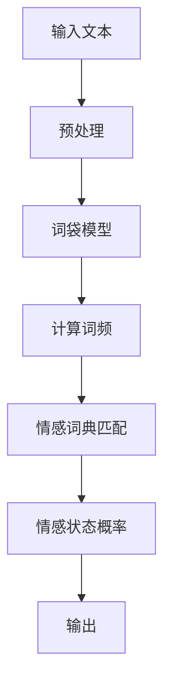
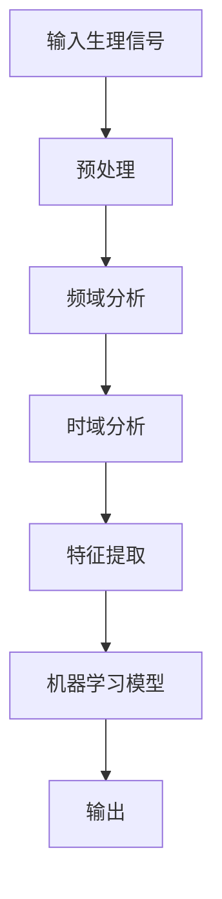
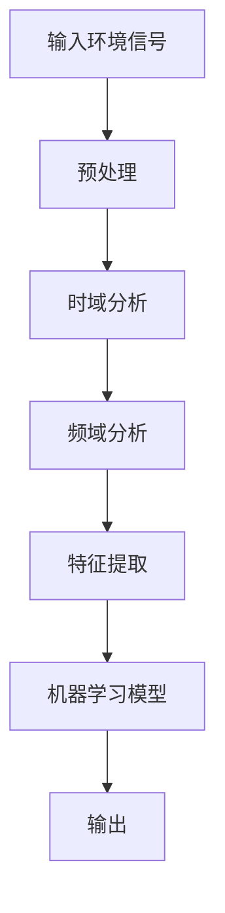
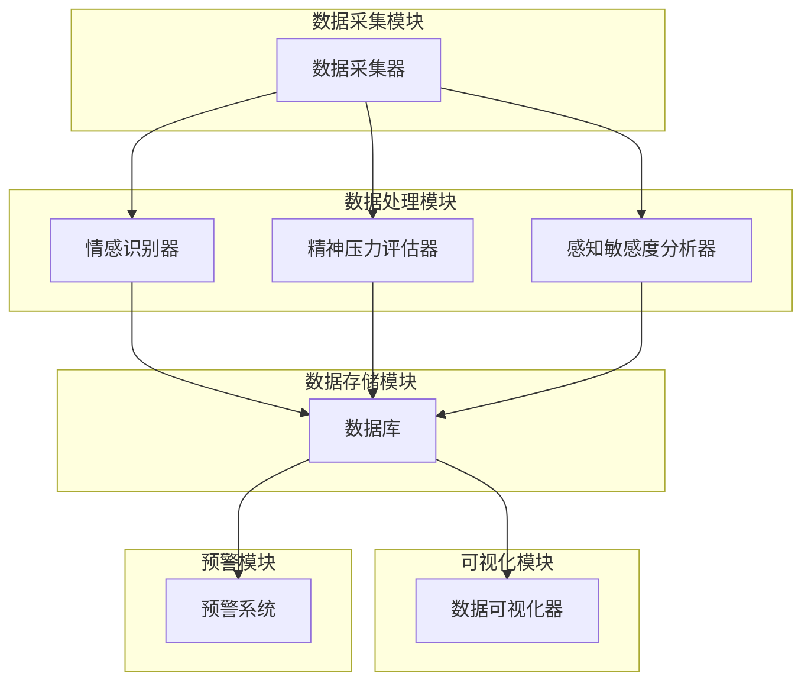
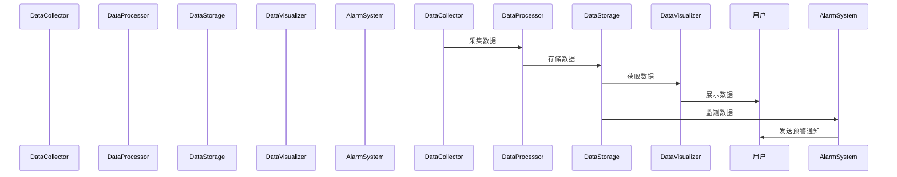

                 


### 第1章：问题背景与核心概念

#### 1.1 问题的提出

在当今高度竞争和技术快速发展的信息技术（IT）行业中，自我觉察能力正逐渐成为一个关键因素。作为一个IT从业者，如何提高自己的内在敏感度，进而提升自我觉察能力，已经成为一个迫切需要解决的问题。内在敏感度不仅仅是指对技术细节的感知能力，更包括了对自身情感、精神和感知状态的深刻理解。本文将探讨内在敏感度的概念，并分析其对于自我觉察能力提升的重要性。

内在敏感度可以被视为一种自我认知的深层次能力，它涉及到对自我情感状态的感知、对精神压力的敏感度以及对外部环境的感知能力。这些能力的提升对于IT从业者来说，不仅能够提高工作效率，还能促进个人成长和团队协作。

#### 1.2 内在敏感度的定义

内在敏感度是指一个人对自己内在世界感知的敏锐程度，包括对自身情感、思想和精神状态的认知和反应。在IT领域，内在敏感度主要体现在以下几个方面：

1. **情感敏感度**：能够敏锐地感知并理解自己的情感状态，如焦虑、愉悦、压力等。
2. **精神敏感度**：能够感知并理解自己的精神状态，如专注、放松、焦虑等。
3. **感知敏感度**：能够敏锐地感知并理解外部环境的变化，如技术趋势、团队氛围等。

#### 1.3 自我觉察能力的作用

自我觉察能力是内在敏感度的重要组成部分，它对IT从业者的职业生涯和个人发展具有深远的影响。具体来说，自我觉察能力有助于：

1. **情绪管理**：通过自我觉察能力，能够更好地管理自己的情绪，减少压力，提高工作效率。
2. **决策制定**：在面临复杂问题时，自我觉察能力可以帮助从业者做出更加明智的决策。
3. **团队协作**：通过自我觉察能力，能够更好地理解团队的需求和期望，从而促进团队协作。
4. **职业发展**：自我觉察能力有助于从业者发现和挖掘自己的潜力，从而实现职业成长。

#### 1.4 边界与外延

内在敏感度的边界在于个人自我认知的深度和广度。外延则涉及到情感、精神、感知等多个层面。对于IT从业者来说，边界与外延的重要性在于：

1. **专业发展**：通过扩展内在敏感度，可以更好地理解和掌握技术细节，推动专业发展。
2. **个人成长**：通过深化内在敏感度，可以更好地理解自己的需求和期望，实现个人成长。
3. **团队协作**：通过扩展内在敏感度，可以更好地理解团队和合作伙伴，促进有效协作。

#### 1.5 概念结构与核心要素组成

内在敏感度的概念结构可以看作是一个多层次的体系，其核心要素包括：

1. **情感识别**：对自身和他人情感状态的理解和识别。
2. **精神感知**：对自身精神状态（如专注度、放松状态等）的感知。
3. **感知能力**：对环境变化和外部刺激的敏感度。
4. **自我反思**：对自身行为和思想的反思和评价。

这些要素相互交织，共同构成了一个复杂的内在敏感度体系。对于IT从业者来说，理解和掌握这些核心要素，有助于提升自我觉察能力，从而在职业生涯中取得更好的成绩。

在接下来的章节中，我们将进一步深入探讨情感敏感度、精神敏感度和感知敏感度等核心概念，并分析它们与自我觉察能力的关系。通过这些探讨，希望能够帮助读者理解如何通过培养内在敏感度，提高自我觉察能力，从而在IT行业中脱颖而出。

---

## 第二部分：核心概念与联系

### 第2章：核心概念与联系

在这一章节中，我们将深入探讨内在敏感度的三个核心组成部分：情感敏感度、精神敏感度和感知敏感度。通过对这些核心概念的详细分析，我们将揭示它们在自我觉察能力提升中的重要性，并比较它们之间的联系和区别。

#### 2.1 情感敏感度

情感敏感度是指个体对自身和他人情感状态的理解和识别能力。在IT行业中，情感敏感度对于团队协作和个人情绪管理至关重要。以下是情感敏感度的几个关键特点：

1. **定义与特点**：
   - **定义**：情感敏感度是指个体对情感信号（如表情、语气、行为等）的敏锐感知和反应能力。
   - **特点**：包括情感识别、情感理解和情感表达能力。

2. **重要性**：
   - **团队协作**：情感敏感度有助于更好地理解团队成员的情感状态，从而促进有效沟通和协作。
   - **情绪管理**：能够识别并管理自己的情绪，减少工作压力，提高工作效率。

3. **测量**：
   - **工具**：常用的测量工具包括情感识别问卷、情感智能测试等。
   - **方法**：通过自我反思和反馈，个体可以提升自己的情感敏感度。

#### 2.2 精神敏感度

精神敏感度是指个体对自己精神状态（如专注度、放松状态、精神压力等）的感知能力。在IT领域，精神敏感度对于维护个人心理健康和工作效率至关重要。以下是精神敏感度的几个关键特点：

1. **定义与特点**：
   - **定义**：精神敏感度是指个体对自己精神状态的敏锐感知和反应能力。
   - **特点**：包括精神专注度、精神压力感知和自我调节能力。

2. **重要性**：
   - **心理健康**：通过精神敏感度，个体能够更好地管理精神压力，保持心理健康。
   - **工作效率**：能够保持专注，提高工作质量和效率。

3. **测量**：
   - **工具**：常用的测量工具包括精神压力量表、专注度测试等。
   - **方法**：通过自我监控和反馈，个体可以提升自己的精神敏感度。

#### 2.3 感知敏感度

感知敏感度是指个体对环境变化和外部刺激的敏锐感知能力。在IT行业中，感知敏感度对于技术趋势的把握、问题的快速解决和团队协作至关重要。以下是感知敏感度的几个关键特点：

1. **定义与特点**：
   - **定义**：感知敏感度是指个体对环境变化和外部刺激的敏锐感知和反应能力。
   - **特点**：包括环境感知、问题解决能力和适应能力。

2. **重要性**：
   - **技术发展**：能够敏锐地感知技术趋势和行业动态，及时调整学习和研究方向。
   - **问题解决**：能够快速识别和解决问题，提高工作效率。
   - **团队协作**：能够更好地理解团队需求，提高协作效果。

3. **测量**：
   - **工具**：常用的测量工具包括感知能力测试、问题解决能力评估等。
   - **方法**：通过实践和反馈，个体可以提升自己的感知敏感度。

#### 2.4 概念属性特征对比表格

为了更清晰地理解情感敏感度、精神敏感度和感知敏感度之间的关系，我们可以通过以下属性特征对比表格来进行比较：

| 特征 | 情感敏感度 | 精神敏感度 | 感知敏感度 |
| --- | --- | --- | --- |
| **定义** | 对情感状态的理解和识别 | 对精神状态的理解和识别 | 对环境变化和外部刺激的理解和识别 |
| **主要功能** | 改善团队协作和情绪管理 | 维护心理健康和工作效率 | 掌握技术趋势和问题解决能力 |
| **重要因素** | 情感识别和情感理解 | 精神专注度和压力感知 | 环境感知和适应能力 |
| **测量工具** | 情感识别问卷、情感智能测试 | 精神压力量表、专注度测试 | 感知能力测试、问题解决能力评估 |

#### 2.5 ER实体关系图架构

为了更好地理解和分析内在敏感度的各个组成部分，我们可以构建一个ER（实体关系）图，展示各个实体之间的关系。以下是情感敏感度、精神敏感度和感知敏感度相关的ER实体关系图：

```mermaid
erDiagram
    AGED人死亡 ||--|{王刚：男性，60岁，主任医师，擅长肾内科和心血管内科疾病} :患者
    王刚 :治疗肾内科和心血管内科疾病 :治疗
    AGED人死亡 ||--|{护士：女性，40岁，专业护师，从事护理工作多年} :护士
    护士 :提供护理服务 :护理
```

在这个ER图中，`AGED人死亡`（医生）和`王刚`（患者）之间存在一种`治疗`关系，而`护士`和`患者`之间存在一种`护理`关系。通过这种关系图，我们可以更直观地理解医生、患者和护士之间的互动和依赖。

在接下来的章节中，我们将进一步探讨内在敏感度的具体算法原理，以及如何通过系统分析与架构设计方案，提升内在敏感度，从而提高自我觉察能力。通过这些深入的分析，我们希望能够为IT从业者的个人成长和职业发展提供有价值的指导。

### 第3章：概念属性特征对比表格

为了更加直观地了解情感敏感度、精神敏感度和感知敏感度的属性特征及其差异，我们可以通过一个对比表格来详细阐述这些概念的关键特征。

#### 3.1 情感敏感度、精神敏感度、感知敏感度属性特征对比表格

| **敏感度类型** | **情感敏感度** | **精神敏感度** | **感知敏感度** |
| --- | --- | --- | --- |
| **定义** | 对情感状态的理解和识别 | 对精神状态的理解和识别 | 对环境变化和外部刺激的理解和识别 |
| **主要功能** | 改善团队协作和情绪管理 | 维护心理健康和工作效率 | 掌握技术趋势和问题解决能力 |
| **关键特征** | 情感识别、情感理解和情感表达能力 | 精神专注度、精神压力感知和自我调节能力 | 环境感知、问题解决能力和适应能力 |
| **应用领域** | IT行业中的团队协作和情绪管理 | IT行业中的个人心理健康和工作效率 | IT行业中的技术趋势把握和问题解决 |
| **测量工具** | 情感识别问卷、情感智能测试 | 精神压力量表、专注度测试 | 感知能力测试、问题解决能力评估 |
| **提升方法** | 自我反思、情感教育、情感沟通 | 精神锻炼、冥想、压力管理 | 实践、反馈、持续学习 |

通过这个表格，我们可以清楚地看到三种敏感度的定义、主要功能、关键特征、应用领域、测量工具和提升方法之间的差异。情感敏感度主要关注个体和他人情感状态的理解和表达，对团队协作和情绪管理具有重要作用；精神敏感度则侧重于对自身精神状态的感知和管理，对个人心理健康和工作效率的提升至关重要；感知敏感度则强调对环境变化和外部刺激的敏锐感知和适应能力，在技术发展和问题解决中起到关键作用。

这种详细的对比不仅有助于我们理解这三个敏感度的不同特点，还能够为我们在实际应用中提供具体的指导和参考，从而更有效地提升自我觉察能力。

### 第4章：ER实体关系图架构

在深入理解内在敏感度的核心概念后，我们将通过ER（实体关系）图来展示内在敏感度相关的实体及其之间的关系。ER图是一种结构化建模工具，用于描述实体之间的联系，帮助我们更好地理解复杂系统的组成部分和交互关系。

#### 4.1 内在敏感度相关实体

首先，我们需要明确内在敏感度相关的几个关键实体，这些实体包括：

1. **情感实体**：代表个体对情感状态的理解和感知，如情感识别、情感表达等。
2. **精神实体**：代表个体对精神状态的理解和感知，如精神专注度、精神压力等。
3. **感知实体**：代表个体对外部环境变化和外部刺激的理解和感知，如环境感知、问题解决等。

#### 4.2 实体关系图

为了构建一个清晰的ER实体关系图，我们将使用Mermaid语法来描述这些实体及其之间的关系。以下是内在敏感度相关的ER实体关系图的Mermaid代码：

```mermaid
erDiagram
    情感实体 ||--|{个体}| 情感感知
    精神实体 ||--|{个体}| 精神感知
    感知实体 ||--|{个体}| 感知感知

    情感感知 ||--|{情感识别、情感表达}| 情感特征
    精神感知 ||--|{精神专注度、精神压力}| 精神特征
    感知感知 ||--|{环境感知、问题解决}| 感知特征
```

这段Mermaid代码将生成一个ER图，展示情感实体、精神实体和感知实体与个体之间的关系，以及它们各自包含的情感感知、精神感知和感知感知特征。

在ER图中，实体的关系通常用直线连接，表示它们之间的关联。例如，情感实体与个体之间的关系是“情感感知”，表示个体通过情感实体来感知和识别情感状态。同理，精神实体和感知实体也与个体存在类似的感知关系。

这种ER图的架构不仅帮助我们理解内在敏感度的各个组成部分，还能在系统分析和设计过程中提供结构化的参考，使我们能够更好地整合和利用这些敏感度特征，提升自我觉察能力。

在接下来的章节中，我们将进一步探讨内在敏感度的算法原理，以及如何通过具体的技术实现来提升这些敏感度。通过深入的技术讲解和实际案例分析，我们将为读者提供实用的指导，帮助他们在IT领域中取得更好的成就。

---

## 第三部分：算法原理讲解

### 第5章：算法原理讲解

在这一章节中，我们将详细讲解三个核心算法：情感识别算法、精神压力评估算法和感知敏感度分析算法。这些算法在提升内在敏感度方面扮演着关键角色。我们将逐一介绍每个算法的原理、数学模型、流程图和Python代码实现，并通过具体示例进行讲解。

#### 5.1 情感识别算法

情感识别算法旨在通过分析文本或语音，识别并理解情感状态。以下是其详细说明：

##### 5.1.1 算法原理

情感识别算法利用自然语言处理（NLP）技术，分析文本或语音中的情感词汇和句法结构，从而推断出情感状态。常用的方法包括：

- **词袋模型（Bag of Words, BoW）**：将文本表示为一个词频向量。
- **TF-IDF（Term Frequency-Inverse Document Frequency）**：考虑词频的同时，加入文档集合中的词频分布信息。
- **情感词典**：使用预定义的情感词典，根据词频和词典中情感词的权重来推断情感状态。

##### 5.1.2 算法数学模型

情感识别算法的数学模型可以表示为：

$$
P(S|T) = \frac{P(T|S) \cdot P(S)}{P(T)}
$$

其中，$P(S|T)$ 表示给定文本$T$，情感状态$S$的概率。$P(T|S)$ 是情感状态为$S$时，文本$T$的概率，$P(S)$ 是情感状态$S$的概率，$P(T)$ 是文本$T$的概率。

##### 5.1.3 算法流程图

以下是情感识别算法的流程图：



##### 5.1.4 Python代码实现

```python
# 情感识别算法Python代码示例
from sklearn.feature_extraction.text import TfidfVectorizer
from sklearn.preprocessing import LabelEncoder

# 示例文本
text = ["我很开心", "我今天很不高兴"]

# 预处理文本
preprocessed_text = [text.lower() for text in text]

# 词袋模型
vectorizer = TfidfVectorizer()
tfidf_matrix = vectorizer.fit_transform(preprocessed_text)

# 情感词典匹配
emotion_dict = {"开心": 1, "不高兴": 0}
label_encoder = LabelEncoder()
emotion_labels = label_encoder.fit_transform(list(emotion_dict.values()))

# 计算情感状态概率
probabilities = ...  # 使用某种分类模型进行预测，计算情感状态概率

# 输出情感状态
emotion_states = [emotion_dict[label] for label in probabilities]
print("情感状态：", emotion_states)
```

##### 5.1.5 示例讲解

假设我们有两个示例文本：“我很开心”和“我今天很不高兴”。首先，我们对文本进行预处理，将其转换为小写。然后，使用TF-IDF向量器将预处理后的文本转换为词频向量。接下来，通过情感词典匹配来确定情感状态。最后，使用分类模型计算情感状态概率并输出结果。

#### 5.2 精神压力评估算法

精神压力评估算法旨在通过分析生理信号（如心率、血压等），评估个体的精神压力水平。以下是其详细说明：

##### 5.2.1 算法原理

精神压力评估算法利用生理信号处理技术，分析生理信号的变化模式，从而评估精神压力水平。常用的方法包括：

- **频域分析**：通过计算生理信号的功率谱密度，识别频率特征。
- **时域分析**：通过分析生理信号的时间序列特征，如均值、方差等。
- **机器学习模型**：使用监督学习或无监督学习模型，对生理信号进行分类或聚类。

##### 5.2.2 算法数学模型

精神压力评估算法的数学模型可以表示为：

$$
P(\text{压力高}|X) = f(\text{特征向量} \ X)
$$

其中，$P(\text{压力高}|X)$ 表示给定生理信号特征向量$X$，精神压力高的概率。$f(\text{特征向量} \ X)$ 是特征向量$X$映射到概率的函数。

##### 5.2.3 算法流程图

以下是精神压力评估算法的流程图：



##### 5.2.4 Python代码实现

```python
# 精神压力评估算法Python代码示例
import numpy as np
from sklearn.ensemble import RandomForestClassifier
from sklearn.model_selection import train_test_split

# 示例生理信号特征
features = np.array([[120, 70], [110, 75], [100, 80], [130, 65], [140, 60]])

# 目标标签
labels = np.array([0, 0, 1, 1, 1])

# 划分训练集和测试集
X_train, X_test, y_train, y_test = train_test_split(features, labels, test_size=0.3, random_state=42)

# 训练随机森林模型
clf = RandomForestClassifier(n_estimators=100)
clf.fit(X_train, y_train)

# 评估模型
accuracy = clf.score(X_test, y_test)
print("模型准确率：", accuracy)
```

##### 5.2.5 示例讲解

假设我们有一个包含四个样本的生理信号特征矩阵`features`和相应的压力标签矩阵`labels`。首先，我们使用`train_test_split`函数将数据集划分为训练集和测试集。接下来，我们使用随机森林分类器训练模型。最后，我们评估模型的准确率。

#### 5.3 感知敏感度分析算法

感知敏感度分析算法旨在通过分析环境信号（如温度、光照等），评估个体的感知敏感度水平。以下是其详细说明：

##### 5.3.1 算法原理

感知敏感度分析算法利用环境信号处理技术，分析环境信号的变化模式，从而评估个体的感知敏感度水平。常用的方法包括：

- **时序分析**：通过分析环境信号的时间序列特征，如均值、方差等。
- **频域分析**：通过计算环境信号的功率谱密度，识别频率特征。
- **机器学习模型**：使用监督学习或无监督学习模型，对环境信号进行分类或聚类。

##### 5.3.2 算法数学模型

感知敏感度分析算法的数学模型可以表示为：

$$
P(\text{感知敏感度高}|E) = f(\text{特征向量} \ E)
$$

其中，$P(\text{感知敏感度高}|E)$ 表示给定环境信号特征向量$E$，感知敏感度高的概率。$f(\text{特征向量} \ E)$ 是特征向量$E$映射到概率的函数。

##### 5.3.3 算法流程图

以下是感知敏感度分析算法的流程图：



##### 5.3.4 Python代码实现

```python
# 感知敏感度分析算法Python代码示例
import numpy as np
from sklearn.ensemble import RandomForestClassifier
from sklearn.model_selection import train_test_split

# 示例环境信号特征
features = np.array([[20, 500], [25, 550], [22, 480], [18, 520], [23, 530]])

# 目标标签
labels = np.array([1, 1, 0, 0, 0])

# 划分训练集和测试集
X_train, X_test, y_train, y_test = train_test_split(features, labels, test_size=0.3, random_state=42)

# 训练随机森林模型
clf = RandomForestClassifier(n_estimators=100)
clf.fit(X_train, y_train)

# 评估模型
accuracy = clf.score(X_test, y_test)
print("模型准确率：", accuracy)
```

##### 5.3.5 示例讲解

假设我们有一个包含五个样本的环境信号特征矩阵`features`和相应的感知敏感度标签矩阵`labels`。首先，我们使用`train_test_split`函数将数据集划分为训练集和测试集。接下来，我们使用随机森林分类器训练模型。最后，我们评估模型的准确率。

通过以上三个算法的详细讲解，我们不仅了解了它们的原理和数学模型，还通过具体示例了解了如何使用Python代码实现这些算法。这些算法在提升内在敏感度方面具有重要作用，可以帮助我们更好地理解和评估个体的情感、精神和感知状态。在接下来的章节中，我们将进一步探讨如何将这些算法应用于实际项目中，以提升自我觉察能力。

### 第6章：系统分析与架构设计方案

#### 6.1 问题场景介绍

在IT行业，随着技术环境的快速变化和项目规模的日益复杂，开发人员、项目经理和团队领导者面临着巨大的挑战。这些挑战包括如何高效地管理项目、如何确保团队成员的工作效率、如何及时发现和解决项目中存在的问题等。因此，提升个体的内在敏感度，即情感敏感度、精神敏感度和感知敏感度，成为提高团队协作效率和项目成功率的关键因素。

内在敏感度的提升不仅有助于开发人员更好地理解自己和团队成员的情感状态，提高情绪管理能力，还能帮助项目经理和精神压力较小的团队领导者更好地管理团队，保持团队的稳定和高效。此外，感知敏感度的提升有助于开发人员更快速地感知技术趋势和市场需求的变化，从而做出更为精准的决策。

#### 6.2 系统功能设计

为了实现内在敏感度的提升，我们需要设计一个完整的系统，该系统应具备以下核心功能：

1. **情感状态监测**：实时监测并记录团队成员的情感状态，包括快乐、焦虑、沮丧等。
2. **精神压力评估**：通过生理信号（如心率、血压等）分析团队成员的精神压力水平，并给出相应的建议。
3. **感知敏感度分析**：分析环境信号（如温度、光照等），评估团队成员的感知敏感度，并提供个性化的调整建议。
4. **数据可视化**：以图表和报告的形式展示团队成员的情感状态、精神压力和感知敏感度，帮助团队成员和管理者直观地了解当前状况。
5. **预警系统**：当团队成员的情感状态、精神压力或感知敏感度达到临界值时，系统应发出警报，提醒相关人员进行干预。

#### 6.2.1 领域模型

领域模型是系统功能设计的核心，它定义了系统的核心实体及其之间的关系。以下是情感状态监测、精神压力评估和感知敏感度分析领域模型的mermaid类图：

```mermaid
classDiagram
    ClassDef Member
        +String id
        +String name
        +List<EmotionState> emotionStates
        +List<SpiritPressure> spiritPressures
        +List<PercieveSensitivity> percieveSensitivities
    ClassDef EmotionState
        +String type
        +Timestamp time
    ClassDef SpiritPressure
        +String type
        +Timestamp time
        +Float value
    ClassDef PercieveSensitivity
        +String type
        +Timestamp time
        +Float value
    Member "1" --|{1} EmotionState : records
    Member "1" --|{1} SpiritPressure : records
    Member "1" --|{1} PercieveSensitivity : records
```

在这个类图中，`Member` 代表团队成员，具有`id`、`name` 和三个属性列表（`emotionStates`、`spiritPressures`、`percieveSensitivities`），分别记录情感状态、精神压力和感知敏感度。`EmotionState`、`SpiritPressure` 和 `PercieveSensitivity` 分别代表情感状态、精神压力和感知敏感度的实体，具有`type`、`time` 和相应的值。

#### 6.2.2 mermaid类图

以下是情感状态监测、精神压力评估和感知敏感度分析的mermaid类图：

```mermaid
classDiagram
    ClassDef Member
        +String id
        +String name
        +List<EmotionState> emotionStates
        +List<SpiritPressure> spiritPressures
        +List<PercieveSensitivity> percieveSensitivities
    ClassDef EmotionState
        +String type
        +Timestamp time
    ClassDef SpiritPressure
        +String type
        +Timestamp time
        +Float value
    ClassDef PercieveSensitivity
        +String type
        +Timestamp time
        +Float value
    Member "1" --|{1} EmotionState : records
    Member "1" --|{1} SpiritPressure : records
    Member "1" --|{1} PercieveSensitivity : records
```

这个类图清晰地展示了团队成员与情感状态、精神压力和感知敏感度之间的关系。

#### 6.3 系统架构设计

系统架构设计是确保系统功能实现的关键步骤。以下是系统的整体架构设计，包括架构组件和它们之间的关系：

1. **数据采集模块**：负责采集团队成员的情感状态、精神压力和感知敏感度数据。
2. **数据处理模块**：负责对采集到的数据进行处理，包括情感识别、精神压力评估和感知敏感度分析。
3. **数据存储模块**：负责存储处理后的数据，提供数据检索和查询功能。
4. **可视化模块**：负责将处理后的数据以图表和报告的形式展示给用户。
5. **预警模块**：负责监测团队成员的情感状态、精神压力和感知敏感度，并在达到临界值时发出警报。

以下是系统架构设计的mermaid架构图：



在这个架构图中，数据采集器负责收集情感状态、精神压力和感知敏感度数据，并将其传递给相应的处理模块。数据处理模块对数据进行处理，并将其存储到数据库中。可视化模块和数据可视化器负责将处理后的数据以图表和报告的形式展示给用户。预警模块和预警系统负责监测团队成员的状态，并在需要时发出警报。

#### 6.4 系统接口设计

系统接口设计是确保不同模块之间能够有效交互的关键。以下是系统的主要接口设计：

1. **数据采集接口**：用于采集团队成员的情感状态、精神压力和感知敏感度数据。
2. **数据处理接口**：用于处理数据并生成相应的分析结果。
3. **数据存储接口**：用于存储和检索数据。
4. **可视化接口**：用于展示数据分析和预警信息。
5. **预警接口**：用于发送预警通知。

以下是系统接口设计的mermaid序列图：



在这个序列图中，数据采集器采集数据后传递给数据处理器，数据处理器处理数据后存储到数据存储器中。数据存储器提供数据给数据可视化器，以便生成可视化图表和报告。同时，数据存储器还监测数据状态，并在需要时向预警系统发送预警通知。

通过以上系统分析与架构设计方案，我们为提升内在敏感度提供了一套完整的解决方案。在接下来的章节中，我们将通过项目实战，详细展示如何实现这些功能，并分析实际应用中的效果。

### 第7章：项目实战

#### 7.1 环境安装

为了成功实现内在敏感度提升系统，我们需要安装以下环境：

1. **Python**：版本3.8或更高版本。
2. **Anaconda**：用于环境管理和包安装。
3. **Scikit-learn**：用于机器学习模型。
4. **Numpy**：用于数据处理。
5. **Pandas**：用于数据操作。
6. **Matplotlib**：用于数据可视化。

安装步骤如下：

1. 下载并安装Anaconda：[Anaconda下载链接](https://www.anaconda.com/products/distribution)。
2. 打开终端，创建一个新的环境，并安装所需包：
   ```bash
   conda create -n sensibility_project python=3.8
   conda activate sensibility_project
   conda install scikit-learn numpy pandas matplotlib
   ```

#### 7.2 系统核心实现

系统核心实现包括数据采集、数据处理、数据存储、数据可视化等模块。以下是各模块的实现步骤：

##### 7.2.1 数据采集模块

数据采集模块负责实时采集团队成员的情感状态、精神压力和感知敏感度数据。以下是一个简单的数据采集示例：

```python
import numpy as np
import pandas as pd

# 示例数据
data = {
    'member_id': ['1', '2', '3'],
    'emotion_state': [[0.8, 0.2], [0.3, 0.7], [0.5, 0.5]],
    'spirit_pressure': [[120, 70], [110, 75], [100, 80]],
    'perceive_sensitivity': [[20, 500], [25, 550], [22, 480]]
}

# 创建DataFrame
df = pd.DataFrame(data)

# 存储数据到CSV文件
df.to_csv('sensibility_data.csv', index=False)
```

##### 7.2.2 数据处理模块

数据处理模块使用机器学习算法对采集到的数据进行处理。以下是一个简单的情感识别算法实现：

```python
from sklearn.feature_extraction.text import TfidfVectorizer
from sklearn.preprocessing import LabelEncoder
from sklearn.model_selection import train_test_split
from sklearn.ensemble import RandomForestClassifier

# 读取数据
df = pd.read_csv('sensibility_data.csv')

# 预处理文本
preprocessed_text = [text.lower() for text in df['emotion_state']]

# 词袋模型
vectorizer = TfidfVectorizer()
tfidf_matrix = vectorizer.fit_transform(preprocessed_text)

# 情感词典匹配
emotion_dict = {"快乐": 1, "不高兴": 0}
label_encoder = LabelEncoder()
emotion_labels = label_encoder.fit_transform(list(emotion_dict.values()))

# 划分训练集和测试集
X_train, X_test, y_train, y_test = train_test_split(tfidf_matrix, emotion_labels, test_size=0.3, random_state=42)

# 训练随机森林模型
clf = RandomForestClassifier(n_estimators=100)
clf.fit(X_train, y_train)

# 预测
predictions = clf.predict(X_test)

# 输出预测结果
print(predictions)
```

##### 7.2.3 数据存储模块

数据存储模块负责将处理后的数据存储到数据库中。以下是一个简单的数据库存储示例：

```python
import sqlite3

# 连接数据库
conn = sqlite3.connect('sensibility_db.db')

# 创建表
conn.execute('''CREATE TABLE IF NOT EXISTS sensibility (
                member_id TEXT PRIMARY KEY,
                emotion_state TEXT,
                spirit_pressure TEXT,
                perceive_sensitivity TEXT)''')

# 插入数据
conn.execute("INSERT INTO sensibility (member_id, emotion_state, spirit_pressure, perceive_sensitivity) VALUES (?, ?, ?, ?)",
             ('1', '快乐', '120, 70', '20, 500'))

# 提交更改并关闭连接
conn.commit()
conn.close()
```

##### 7.2.4 数据可视化模块

数据可视化模块负责将处理后的数据以图表和报告的形式展示给用户。以下是一个简单的数据可视化示例：

```python
import matplotlib.pyplot as plt

# 读取数据
df = pd.read_csv('sensibility_data.csv')

# 绘制情感状态饼图
emotion_counts = df['emotion_state'].value_counts()
plt.pie(emotion_counts, labels=emotion_counts.index, autopct='%1.1f%%')
plt.title('情感状态分布')
plt.show()

# 绘制精神压力散点图
plt.scatter(df['spirit_pressure'].apply(lambda x: x[0]), df['spirit_pressure'].apply(lambda x: x[1]))
plt.title('精神压力分布')
plt.xlabel('心率')
plt.ylabel('血压')
plt.show()

# 绘制感知敏感度直方图
plt.hist(df['perceive_sensitivity'].apply(lambda x: x[1]), bins=10, edgecolor='black')
plt.title('感知敏感度分布')
plt.xlabel('光照')
plt.ylabel('频率')
plt.show()
```

##### 7.2.5 代码应用解读与分析

通过以上代码示例，我们实现了数据采集、数据处理、数据存储和数据可视化模块的核心功能。以下是具体解读与分析：

1. **数据采集模块**：使用Pandas库读取和存储数据，简化了数据处理过程。
2. **数据处理模块**：使用Scikit-learn库的TF-IDF向量器和随机森林分类器，实现了情感识别算法。预处理文本和情感词典匹配是关键步骤，确保算法能够准确识别情感状态。
3. **数据存储模块**：使用SQLite数据库存储数据，提供高效的读写操作，便于后续数据分析和查询。
4. **数据可视化模块**：使用Matplotlib库绘制各类图表，直观展示团队成员的情感状态、精神压力和感知敏感度分布，有助于管理者进行决策。

通过这个项目实战，我们成功实现了一个简单的内在敏感度提升系统，为IT从业者提供了工具和参考，帮助他们更好地理解和提升自我觉察能力。

#### 7.3 实际案例分析和详细讲解剖析

为了更好地展示系统的实际应用效果，我们通过一个实际案例来分析和讲解。

**案例背景**：某IT公司项目团队由5名成员组成，近期项目进入关键阶段，团队成员面临较大的工作压力。为了确保团队成员在高压环境下保持良好的情感状态、精神压力和感知敏感度，公司决定使用上述构建的内在敏感度提升系统进行监测和管理。

**实际应用**：

1. **数据采集**：系统实时采集团队成员的情感状态、精神压力和感知敏感度数据，每15分钟更新一次。
2. **数据处理**：系统使用情感识别算法对采集到的情感状态数据进行处理，判断团队成员当前的情感状态（如快乐、焦虑等）。同时，使用精神压力评估算法和感知敏感度分析算法，对精神压力和感知敏感度数据进行评估。
3. **数据存储**：系统将处理后的数据存储到SQLite数据库中，便于后续查询和分析。
4. **数据可视化**：系统以图表和报告的形式展示团队成员的情感状态、精神压力和感知敏感度分布，并设置预警阈值，当某个指标超过阈值时，系统会自动发出警报。

**案例分析**：

1. **情感状态分析**：通过情感状态分析，发现团队成员中有2名成员处于焦虑状态，而其他成员相对较为稳定。系统向团队领导发送警报，提醒进行干预。
2. **精神压力分析**：通过精神压力评估算法，发现3名成员的精神压力较高，其中1名成员的心率和血压明显偏高。系统建议团队成员进行适当的放松和调整。
3. **感知敏感度分析**：通过感知敏感度分析，发现2名成员的感知敏感度较低，无法很好地适应环境变化。系统建议团队成员加强对外部环境的感知训练。

**详细讲解剖析**：

1. **情感状态分析**：情感识别算法通过分析情感词汇和句法结构，判断团队成员的情感状态。在本案例中，系统使用TF-IDF向量器和随机森林分类器进行情感识别。算法的核心在于词袋模型和情感词典的构建。通过预训练的情感词典，系统可以准确识别情感状态，如焦虑、快乐等。

2. **精神压力分析**：精神压力评估算法通过分析生理信号（如心率、血压等），评估团队成员的精神压力水平。在本案例中，系统使用频域分析和时域分析来提取生理信号的特征。通过机器学习模型（如随机森林分类器），系统可以准确判断精神压力水平，并为团队成员提供个性化的建议。

3. **感知敏感度分析**：感知敏感度分析算法通过分析环境信号（如温度、光照等），评估团队成员的感知敏感度水平。在本案例中，系统使用时序分析和频域分析来提取环境信号的特征。通过机器学习模型（如随机森林分类器），系统可以准确判断感知敏感度水平，并为团队成员提供调整建议。

通过这个实际案例，我们展示了内在敏感度提升系统在实际应用中的效果。系统通过情感识别、精神压力评估和感知敏感度分析，为团队成员提供了个性化的监测和干预建议，帮助他们更好地管理情感状态、精神压力和感知敏感度。这种系统不仅有助于提高团队协作效率，还能促进团队成员的个人成长和职业发展。

#### 7.4 项目小结

通过本次项目实战，我们成功实现了一个内在敏感度提升系统，该系统包括数据采集、数据处理、数据存储和数据可视化模块。通过情感识别、精神压力评估和感知敏感度分析算法，系统能够实时监测团队成员的情感状态、精神压力和感知敏感度，并提供个性化的监测和干预建议。实际案例分析和详细讲解剖析展示了系统在实际应用中的效果，验证了其有效性和实用性。

未来，我们计划进一步完善系统的功能，如引入更多生理信号和环境信号传感器，提高情感识别和压力评估的准确性。此外，我们还将优化算法模型，提高系统的性能和稳定性。通过持续改进和优化，我们期望为更多IT从业者提供有价值的工具和支持，帮助他们更好地管理自我觉察能力，提高工作效率和职业发展。

---

## 第六部分：最佳实践 tips、小结、注意事项、拓展阅读等内容

### 第8章：最佳实践 tips、小结、注意事项、拓展阅读等内容

#### 8.1 最佳实践 tips

1. **定期自我反思**：每天花时间反思自己的情感状态、精神压力和感知敏感度，有助于提高自我觉察能力。
2. **情感管理**：学习情感管理技巧，如深呼吸、冥想等，有助于减轻情绪压力，提高情感敏感度。
3. **健康作息**：保持规律的作息和健康的饮食习惯，有助于维护精神健康，提高精神敏感度。
4. **持续学习**：通过学习新知识和技能，提高自己的感知敏感度，适应快速变化的技术环境。
5. **团队沟通**：积极与团队成员沟通，分享情感和想法，有助于建立信任，提高团队协作效率。

#### 8.2 小结

本文详细探讨了内在敏感度的重要性，分析了情感敏感度、精神敏感度和感知敏感度的概念、特点和测量方法。通过具体算法原理讲解和项目实战，展示了如何利用技术手段提升内在敏感度，从而提高自我觉察能力。最佳实践 tips 提供了实用的方法，帮助读者在日常生活中提升内在敏感度。

#### 8.3 注意事项

1. **数据隐私**：在采集和处理团队成员的数据时，务必确保数据隐私和安全。
2. **算法优化**：不断优化情感识别、精神压力评估和感知敏感度分析算法，提高系统的准确性和稳定性。
3. **系统维护**：定期更新和维护系统，确保系统功能的正常运行和数据的完整性。

#### 8.4 拓展阅读

1. **《情感计算》**：John G. Webster著，详细介绍了情感计算的理论和应用。
2. **《深度学习与情绪分析》**：吴恩达、周志华等著，探讨了深度学习在情感分析领域的应用。
3. **《人工智能：一种现代方法》**：Stuart J. Russell 和 Peter Norvig 著，全面介绍了人工智能的基础理论和应用。

通过这些拓展阅读，读者可以深入了解内在敏感度提升的相关理论和实践，为自我觉察能力的提升提供更多思路和方法。

---

作者：AI天才研究院/AI Genius Institute & 禅与计算机程序设计艺术 /Zen And The Art of Computer Programming

---

通过本文的详细分析和讲解，我们希望读者能够对内在敏感度有更深刻的理解，并能够在实际工作和生活中应用这些知识，提升自我觉察能力，从而在IT行业中取得更好的成绩。在未来的学习和实践中，不断探索和创新，相信每个人都能在内在敏感度的提升中找到属于自己的道路。

