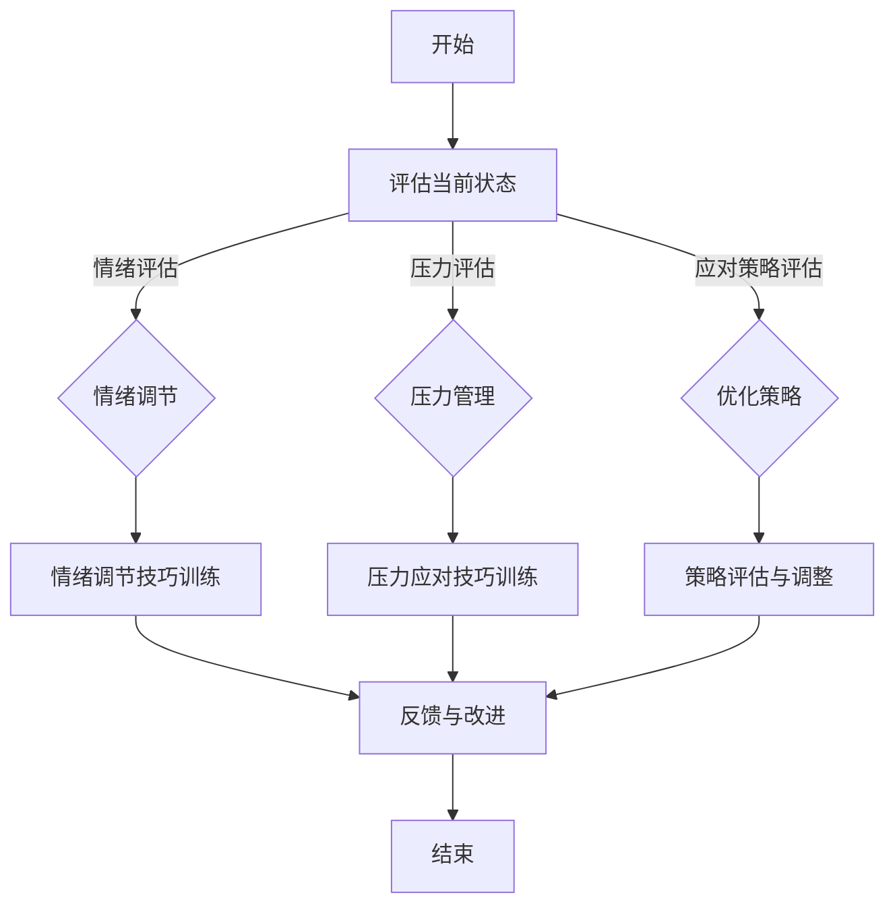
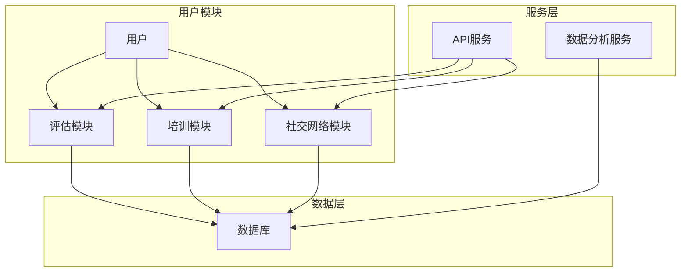
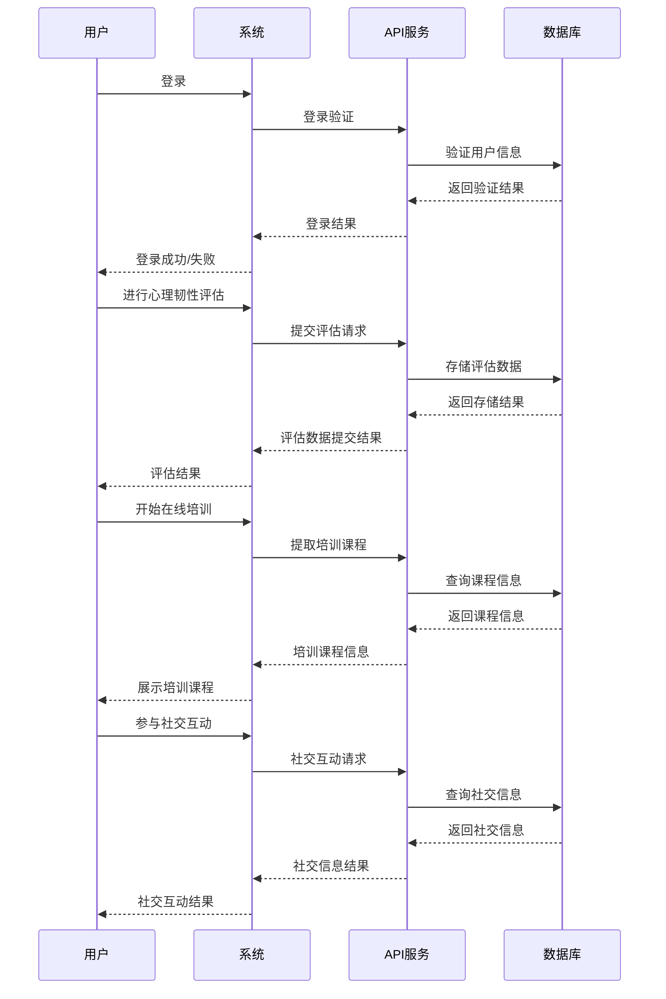

                 

### 引言：心理韧性的重要性

心理韧性，这一概念在当今社会中越来越受到关注。它不仅关乎个体的心理健康，更与整体的幸福感和生活质量紧密相关。在快速变化和竞争激烈的社会环境中，每个人都会面临各种各样的挑战和挫折。这些挫折可能来自工作、人际关系、健康问题，甚至是突发事件。在这样的情境下，心理韧性成为人们应对压力和挑战的关键能力。

首先，我们需要明确心理韧性的定义。心理韧性通常被描述为个体在面对逆境、压力和挑战时所表现出的适应和恢复能力。它不是简单地指能够忍受痛苦或挫折，而是在经历了负面事件之后，个体能够迅速恢复，并从中学习和成长。一个具有心理韧性的人，不仅能够应对眼前的困境，还能从这些经历中获得力量，变得更加坚强。

心理韧性的重要性体现在多个方面。首先，在个人层面上，心理韧性有助于提高幸福感。具有心理韧性的人往往更能保持积极的心态，更好地处理生活中的压力和挑战。他们更有可能拥有健康的生活方式，以及更强的人际关系。其次，在社会层面上，心理韧性有助于减少心理疾病的发病率，提高社会的整体心理健康水平。在组织和企业层面，员工的韧性水平与企业的绩效和稳定性密切相关。一个具有高心理韧性团队，能够更好地应对外部变化，保持创新和竞争力。

然而，现代社会中，人们面临的压力和挑战越来越多，心理韧性显得尤为重要。根据多项研究，现代社会中，心理问题已经成为影响人们健康和生活质量的主要因素之一。这不仅与个人面临的压力有关，也与社会环境的变迁密切相关。例如，工作压力、生活节奏的加快、人际关系的复杂化，以及科技的快速发展，都增加了人们面对的挑战和压力。在这种情况下，培养心理韧性成为每个个体和整个社会的重要任务。

综上所述，心理韧性不仅是个人心理健康的重要保障，也是社会稳定和发展的关键因素。因此，了解心理韧性的重要性，探索如何培养和增强心理韧性，成为当代社会的一个重要课题。接下来，我们将进一步探讨现代社会中挫折与压力的普遍存在，以及心理韧性的定义与重要性。

### 问题背景

现代社会的发展带来了前所未有的变化和挑战。一方面，科技的高速发展使人们的生活方式发生了翻天覆地的变化。互联网、移动通信和人工智能等技术的广泛应用，使信息传播更加迅速，人们可以随时随地获取各种信息。然而，这也使得社会节奏加快，竞争压力加大。人们需要在短时间内处理大量的信息，不断学习新技能以适应快速变化的环境。

另一方面，社会结构的变化也对人们的心理健康产生了深远影响。城市化进程的加快，导致了人际关系的疏远和社会联系的弱化。许多人生活在孤独和压力中，缺乏有效的社交支持和情感交流。此外，就业市场的竞争激烈，工作压力不断增加，失业风险也相应提高。许多人在职业发展中面临诸多挑战，例如职业转型、职业倦怠等问题。

在这样的社会背景下，人们面临的挫折和压力普遍存在。挫折可能来源于工作、家庭、健康、人际关系等多个方面。例如，在工作中，个体可能因无法达到预期目标而感到沮丧和失落；在家庭中，可能因家庭矛盾或亲人的离世而感到痛苦；在健康方面，长期的身体不适或疾病可能给个体带来巨大的心理压力。同时，社会对个体的期望和压力也在不断增加，使得人们感到无所适从和焦虑。

研究表明，长期处于高压力和挫折状态中，不仅会对个体的心理健康产生负面影响，还可能导致一系列生理问题，如高血压、心脏病等。此外，心理问题还可能影响个体的社会功能和人际关系，进一步加剧社会问题的复杂性。

因此，面对现代社会中普遍存在的挫折和压力，如何有效应对和缓解这些负面情绪成为了一个亟待解决的问题。这不仅是个人心理健康的重要课题，也是社会稳定和发展的关键。接下来，我们将进一步探讨心理韧性的定义与重要性，以及如何通过培养心理韧性来应对这些挑战。

### 心理韧性的定义与重要性

心理韧性（Resilience）的定义多种多样，但总体上可以概括为个体在面对逆境、压力和挑战时所表现出的适应和恢复能力。它不仅包括能够承受和应对压力，更强调在经历挫折后能够迅速恢复并从中学到经验和教训，从而变得更加坚强。心理韧性不是一种单一的心理特质，而是一种综合能力，它涉及到多个方面的心理和生理机制。

首先，从心理学角度来看，心理韧性主要包括以下几个核心要素：

1. **自我效能感（Self-Efficacy）**：指个体对自己能够成功地应对挑战和完成任务的信心。自我效能感高的个体在面对困难时更倾向于采取积极的应对策略，并能够坚持到底。

2. **应对策略（Coping Strategies）**：应对策略是指个体在面对压力和挑战时采取的心理和行为方法。有效的应对策略能够帮助个体减轻压力，保持情绪稳定，并找到解决问题的途径。

3. **乐观态度（Optimism）**：乐观态度指的是个体对未来的积极预期和对困难的积极看法。乐观的个体往往能够从挫折中找到积极的一面，从而更快地恢复过来。

其次，从生理角度来说，心理韧性也与个体的生理反应机制有关。研究表明，心理韧性强的个体在面对压力时，其生理应激反应相对较轻，能够更快地恢复生理平衡。

心理韧性在生活中的作用不可忽视。首先，它有助于提高个体的心理健康水平。具有高心理韧性的人在面对压力和挫折时，能够更好地调节情绪，避免陷入长期的抑郁或焦虑状态。其次，心理韧性对于个体的生活质量有显著的积极影响。心理韧性强的个体往往能够更好地适应生活中的变化，保持积极的生活态度，从而享受更高质量的生活。

此外，心理韧性还与幸福感密切相关。具有高心理韧性的人通常能更快地从挫折中恢复，并从中获得力量和成长。他们更能体验到生活中的美好和快乐，从而拥有更高的幸福感。

在社会层面上，心理韧性同样具有重要价值。具有高心理韧性的社会成员，能够更好地应对各种社会挑战和危机，保持社会的稳定和和谐。在组织和企业层面，员工的心理韧性水平直接影响着团队的协作效率和企业的整体绩效。一个具有高心理韧性团队的员工，能够更好地应对工作中的挑战，保持创新和竞争力。

总之，心理韧性是现代社会中不可或缺的一种心理能力。它不仅关乎个体的心理健康和生活质量，也是社会稳定和发展的关键因素。了解和培养心理韧性，对于个人和社会都具有重要意义。接下来，我们将进一步探讨心理韧性与幸福感的关系，以及它在不同群体中的应用。

### 边界与外延

心理韧性虽然是一个重要的心理健康概念，但它与许多其他心理特质和概念紧密相关，并存在一定的边界与外延。理解这些关系有助于我们更全面地把握心理韧性的本质和应用。

首先，心理韧性与心理弹性（Elasticity）密切相关。心理弹性通常被定义为个体在面对压力和挑战时的适应能力，这与心理韧性的定义有很高的重叠部分。然而，心理弹性更侧重于个体在经历压力后的恢复和适应，而心理韧性则更加全面，涵盖了从压力发生到个体恢复和成长的整个过程。因此，心理韧性可以被视为心理弹性的高级形式。

其次，心理韧性与抗压能力（Stress Resistance）也有显著关联。抗压能力指的是个体在面对压力时能够保持心理和行为稳定的能力。心理韧性强的个体通常具有更强的抗压能力，能够更好地应对生活中的各种挑战。然而，抗压能力更多关注个体在特定情境下的表现，而心理韧性则是一个更为广泛和综合的概念，涵盖了多个方面的心理适应能力。

心理韧性还与情绪调节（Emotional Regulation）紧密相关。情绪调节是指个体能够有效地识别、理解和管理自己情绪的能力。心理韧性强的个体通常在情绪调节方面也表现出较高的能力，能够更好地处理负面情绪，保持情绪稳定。情绪调节是心理韧性的一部分，但不是全部。心理韧性还包括自我效能感、应对策略和乐观态度等元素，这些元素共同构成了个体的心理韧性水平。

此外，心理韧性也与自我效能感（Self-Efficacy）密切相关。自我效能感是指个体对自己完成特定任务的信心和能力。一个具有高自我效能感的人，在面对困难时更有可能表现出高心理韧性。这是因为他们相信自己有能力应对挑战，从而更有动力采取积极的行动。

最后，心理韧性还与社会支持（Social Support）有着复杂的关系。社会支持是指个体从家庭、朋友、社区等外部来源获得的情感、信息和经济上的支持。心理韧性强的个体通常能够更好地利用社会支持资源，从而在面临压力时获得更多的支持和帮助。

在特殊群体中的应用方面，心理韧性同样具有重要作用。例如，在儿童和青少年中，心理韧性有助于他们更好地应对学业压力、同伴关系和身份认同等问题。在老年人中，心理韧性有助于应对身体衰退、孤独感和病痛等挑战。在职业人士中，心理韧性能够帮助他们应对工作压力、职业倦怠和职业发展中的不确定性。

总之，心理韧性是一个多维度的心理能力，与多个相关概念和特质密切相关。理解这些边界与外延，有助于我们更全面地认识和培养心理韧性，从而提升个体的整体心理健康水平和社会功能。接下来，我们将深入探讨心理韧性的核心要素组成，进一步理解其构成和作用机制。

### 心理韧性的核心要素组成

心理韧性作为一个多维度的心理能力，其核心要素组成对于理解和培养这一能力至关重要。以下是心理韧性的主要核心要素：

#### 1. 自我效能感（Self-Efficacy）

自我效能感是心理韧性的基础，它指的是个体对自己能够成功应对各种挑战和压力的信心和信念。高自我效能感的个体在面对逆境时，更容易保持积极的心态，相信自己有能力克服困难。这种信心可以激发个体的内在动力，使其在挑战面前不轻易放弃，而是采取积极的应对策略。

例如，一个具有高自我效能感的程序员，在面对复杂的编程问题时，不会轻易感到挫败，而是相信通过不断学习和努力，最终能够解决问题。这种自信和毅力不仅有助于他在技术难题上取得成功，还能增强他的心理韧性。

#### 2. 应对策略（Coping Strategies）

应对策略是心理韧性的重要组成部分，指的是个体在面对压力和挑战时所采取的心理和行为方法。有效的应对策略能够帮助个体减轻压力，保持情绪稳定，并找到解决问题的途径。这些策略包括认知重构、情绪调节、问题解决、积极应对等。

例如，当面对一个难以应对的工作任务时，一个具有高心理韧性的人可能会采用积极应对策略，如分解任务、寻求支持、设定小目标等，而不是逃避或消极应对。这些策略能够帮助个体更好地管理压力，从而提高心理韧性。

#### 3. 乐观态度（Optimism）

乐观态度是指个体对未来持积极预期和对困难持乐观看法的心理特质。乐观的个体往往能够从挫折中看到积极的一面，相信自己能够克服困难，实现目标。这种积极的心态有助于他们在面对逆境时保持希望和动力，从而更快地恢复和成长。

例如，一个乐观的创业者，即使面对失败和挫折，也不会轻易放弃，而是相信这次失败是成功之母，通过总结经验，下一次一定能取得成功。这种乐观的态度不仅有助于他们在创业过程中保持坚韧，还能增强他们的心理韧性。

#### 4. 社会支持（Social Support）

社会支持是指个体从家庭、朋友、社区等外部来源获得的情感、信息和经济上的支持。心理韧性强的个体通常能够更好地利用社会支持资源，从而在面临压力时获得更多的支持和帮助。这种支持不仅能减轻个体的心理负担，还能增强他们的心理韧性。

例如，当一个人在失业时，如果能够得到家人和朋友的支持，他们可能会感到更有力量去面对这一困难。这种社会支持不仅有助于他们缓解心理压力，还能增强他们的应对能力，从而提高心理韧性。

#### 5. 情绪调节（Emotional Regulation）

情绪调节是指个体能够有效地识别、理解和管理自己情绪的能力。心理韧性强的个体通常在情绪调节方面表现出较高的能力，能够更好地处理负面情绪，保持情绪稳定。这种能力有助于他们在面对压力和挑战时保持冷静和理智，从而更好地应对困难。

例如，一个能够有效调节情绪的工程师，在遇到技术难题时，不会因为情绪失控而影响工作效率，而是能够冷静地分析问题，找到解决方案。这种情绪调节能力不仅有助于他们提高工作效率，还能增强他们的心理韧性。

#### 6. 灵活性（Flexibility）

灵活性是指个体在面对变化和不确定性时能够迅速调整和适应的能力。心理韧性强的个体通常具有很高的灵活性，能够灵活应对环境变化和意外事件。这种能力使他们能够在逆境中保持冷静，迅速找到应对策略，从而提高心理韧性。

例如，一个具有高灵活性的项目经理，在面对项目延期或团队矛盾时，能够迅速调整计划，采取有效的应对措施，从而保证项目的顺利进行。这种灵活性不仅有助于他们在工作中保持高效，还能增强他们的心理韧性。

综上所述，心理韧性的核心要素包括自我效能感、应对策略、乐观态度、社会支持、情绪调节和灵活性。这些要素相互关联，共同构成了个体的心理韧性水平。理解和培养这些要素，对于提高个体的心理韧性和应对生活中的各种挑战具有重要意义。

### 心理韧性理论概述

心理韧性理论的发展历程可以追溯到20世纪中期。最早的探讨始于对儿童和青少年如何应对生活压力的研究。这些研究揭示了个体在面对逆境时的适应性和恢复能力。随着时间的推移，心理韧性理论逐渐形成，并在不同领域得到广泛应用。

#### 1. 心理韧性理论的发展历程

**早期研究**：最早的心理韧性研究集中在儿童和青少年群体，研究者们关注这些群体如何应对生活压力、家庭环境变化以及学业挑战。这些研究奠定了心理韧性理论的基础，并强调了个体在逆境中的适应能力。

**心理韧性概念的提出**：20世纪80年代，心理学家开始系统地研究心理韧性，并提出了一系列定义和理论模型。这些研究强调了心理韧性的多维性质，包括情感、认知和行为因素。

**应用研究**：进入21世纪，心理韧性理论逐渐应用于不同领域，如心理健康、教育、职业健康等。研究者们开始探讨如何通过干预和培训提高个体的心理韧性，以及心理韧性对个体生活质量和整体健康的影响。

#### 2. 心理韧性理论的核心观点

**适应和恢复能力**：心理韧性理论认为，心理韧性是个体在面对逆境时表现出的适应和恢复能力。这种能力不仅包括应对当前的挑战，还涉及从经历中学习和成长。

**多重维度**：心理韧性并不是单一的心理特质，而是一个包含多个维度的综合能力。这些维度包括情感调节、认知重构、积极应对、社会支持等。

**动态过程**：心理韧性不仅是一个静态的概念，而是一个动态的过程。个体在不同的生活阶段和环境变化中，其心理韧性水平也会发生变化。

**个体差异**：每个人对逆境的反应和恢复能力都有所不同，这取决于个体的性格、经历和环境。心理韧性理论强调个体差异，并提出了多种模型来解释这些差异。

**情境因素**：心理韧性不仅受个体内部因素的影响，还受到外部情境的影响。社会支持、家庭环境、文化背景等外部因素都会影响个体的心理韧性水平。

#### 3. 心理韧性理论的主要模型

**压力-适应模型**：该模型认为，心理韧性是压力和适应之间的平衡。个体在面对压力时，通过有效的适应策略和资源管理，保持心理和行为的稳定。

**韧性三角模型**：该模型将心理韧性分解为三个核心要素：自我效能感、应对策略和社会支持。这三个要素相互作用，共同决定个体的心理韧性水平。

**动态系统模型**：该模型认为，心理韧性是一个动态的系统过程，涉及个体与环境之间的互动。个体通过不断地调整和适应，实现心理韧性水平的提升。

**弹性模型**：该模型将心理韧性视为个体在逆境中的弹性能力，强调个体在逆境中的适应性和恢复力。

#### 4. 心理韧性理论的优点与局限性

**优点**：

- **综合性和多维性**：心理韧性理论能够涵盖多个方面的心理和生理因素，提供了一个全面的理解框架。
- **个体差异关注**：心理韧性理论强调了个体差异，有助于解释不同个体在面对逆境时的不同表现。
- **应用广泛**：心理韧性理论在多个领域都有应用，如心理健康、教育和职业健康，具有广泛的实用性。

**局限性**：

- **测量和评估困难**：由于心理韧性的多维性质，对其进行测量和评估存在一定的困难，需要综合多种方法和工具。
- **理论和实践差距**：心理韧性理论在实践中的应用仍存在一定的差距，如何将理论转化为实际操作仍需进一步研究。

总之，心理韧性理论的发展历程展示了其在心理学领域的广泛应用和重要性。通过理解心理韧性理论的核心观点和主要模型，我们可以更好地认识心理韧性，并探索如何提高个体的心理韧性水平。

### 不同理论家的观点对比

在心理韧性研究领域，不同学者提出了各自的理论模型和解释，这些理论模型各有优点和局限性。通过对比这些观点，我们可以更全面地理解心理韧性的本质，并为实际应用提供有价值的参考。

#### 1. 麦克尤恩（Roy McComb）的韧性模型

麦克尤恩的韧性模型强调个体在面对逆境时的积极应对策略和社会支持的重要性。他认为，韧性是个体在面对挑战时能够积极应对和恢复的能力，这包括以下几个方面：

- **应对策略**：个体在面对逆境时采取的有效策略，如积极应对、问题解决、情绪调节等。
- **社会支持**：个体从家庭、朋友和社会中获得的支持，这些支持能够帮助个体应对逆境。

**优点**：

- **操作性**：麦克尤恩的理论具有较好的操作性，能够为实际干预提供明确的指导。
- **关注个体差异**：该理论关注个体在应对逆境时的策略选择，有助于解释不同个体之间的差异。

**局限性**：

- **忽略内在因素**：麦克尤恩的理论主要关注外部因素，如社会支持，而忽略了个体内在心理特质的作用。

#### 2. 林恩·戈尔茨坦（Lynne Goldstein）的韧性三角模型

戈尔茨坦的韧性三角模型将心理韧性分解为三个核心要素：自我效能感、应对策略和社会支持。这三个要素相互关联，共同构成个体的心理韧性水平。

- **自我效能感**：个体对自己应对挑战能力的信心。
- **应对策略**：个体在面对逆境时采取的心理和行为方法。
- **社会支持**：个体从外部获得的支持和资源。

**优点**：

- **系统性**：该模型提供了一个系统的框架，能够全面解释心理韧性的构成。
- **综合性**：该模型涵盖了个体内部和外部因素，提供了一个全面的解释。

**局限性**：

- **简化复杂性**：心理韧性是一个复杂的多维概念，该模型可能过于简化了这一复杂过程。

#### 3. 斯坦利·霍姆斯（Stanley Holms）的韧性循环模型

霍姆斯的韧性循环模型强调心理韧性是一个动态的过程，包括应对策略、情绪调节和恢复。他认为，心理韧性是一个循环过程，个体在逆境中不断调整和适应，以维持心理平衡。

- **应对策略**：个体在面对逆境时采取的具体行动。
- **情绪调节**：个体在应对逆境时对情绪的管理。
- **恢复**：个体在经历逆境后恢复心理平衡的过程。

**优点**：

- **动态性**：该模型强调了心理韧性的动态性，有助于理解个体在面对长期压力时的心理变化。
- **适应性**：该模型强调个体在面对不同挑战时的适应能力。

**局限性**：

- **理论复杂性**：该模型较为复杂，可能难以在实际应用中操作。

#### 4. 拉斯·特罗姆森（Lars Torssten）的社会-文化模型

特罗姆森的社会-文化模型强调社会和文化因素在心理韧性中的作用。他认为，个体的心理韧性不仅受个人因素的影响，还受到社会和文化背景的影响。

- **社会因素**：如家庭、社会关系和社会支持等。
- **文化因素**：如价值观、社会规范和文化传统等。

**优点**：

- **综合性**：该模型综合考虑了社会和文化因素，提供了一个更全面的解释。
- **文化适应性**：该模型强调不同文化背景下心理韧性的差异，有助于理解文化对心理韧性的影响。

**局限性**：

- **缺乏个体性**：该模型可能过于强调外部因素，而忽视了个体内在因素的作用。

通过对比不同理论家的观点，我们可以看到，每种理论都有其独特的视角和解释框架。这些理论为我们提供了丰富的视角，有助于我们更全面地理解心理韧性的本质。在实际应用中，可以根据具体情境和目标，选择合适的理论模型来指导心理韧性培养和实践。

### 心理韧性理论的ER实体关系图架构

为了更好地理解和分析心理韧性理论，我们可以使用实体关系图（Entity-Relationship Diagram, ERD）来描述心理韧性相关因素之间的实体关系。实体关系图是一种用于展示数据实体及其之间关系的数据库设计工具，通过图形化的方式帮助我们直观地理解各个实体之间的联系。

以下是一个简化的心理韧性理论的ER实体关系图，该图涵盖了几个关键实体和它们之间的关系：

#### 实体定义

1. **个体（Person）**：代表具有心理韧性的个体。
2. **逆境（Adversity）**：代表个体所经历的挑战或困难。
3. **心理韧性（Resilience）**：代表个体应对逆境的能力。
4. **应对策略（CopingStrategy）**：代表个体在逆境中采取的应对方法。
5. **社会支持（SocialSupport）**：代表个体从家庭、朋友和社会中获得的支持。
6. **情绪调节（EmotionalRegulation）**：代表个体在逆境中对情绪的管理。

#### 实体关系

- **个体与逆境**：每个个体都可能经历多个逆境，逆境可以是家庭、工作、健康等方面的挑战。
- **个体与心理韧性**：每个个体都有其心理韧性水平，这取决于他们如何应对所经历的逆境。
- **心理韧性与应对策略**：个体的心理韧性水平影响他们选择和实施哪些应对策略。
- **心理韧性与社会支持**：社会支持可以增强个体的心理韧性，使他们更能有效地应对逆境。
- **心理韧性与情绪调节**：情绪调节是心理韧性的一部分，能够帮助个体在面对逆境时保持情绪稳定。

#### ERD示例

以下是使用Mermaid语法表示的ER实体关系图：

```mermaid
erDiagram
  Person ||--|{逆境} : 经历多个逆境
  Person ||--|{心理韧性} : 心理韧性水平
  Person ||--|{应对策略} : 采取多种策略
  Person ||--|{社会支持} : 获得支持
  Person ||--|{情绪调节} : 情绪管理

  逆境 ||--|{心理韧性} : 影响心理韧性
  应对策略 ||--|{心理韧性} : 增强心理韧性
  社会支持 ||--|{心理韧性} : 增强心理韧性
  情绪调节 ||--|{心理韧性} : 提高心理韧性
```

通过这个实体关系图，我们可以清晰地看到各个实体之间的关联，以及它们如何共同作用影响个体的心理韧性。这种可视化工具不仅有助于我们理解心理韧性理论的构成，还能为后续的算法设计和系统架构设计提供有用的参考。

### 心理韧性培养算法原理

为了更系统地培养心理韧性，我们可以设计一个基于算法的干预模型。这一模型旨在通过一系列步骤和方法，帮助个体在面对逆境时提高适应和恢复能力。以下是心理韧性培养算法的原理及其流程图。

#### 算法流程图

首先，我们使用Mermaid语法绘制算法流程图，以便直观地展示整个干预过程。



#### 算法流程图详细解释

1. **开始**：算法从初始状态开始，评估个体的当前心理韧性水平。
2. **评估当前状态**：通过问卷调查、心理测试等方法，评估个体的情绪状态、压力水平和应对策略。
3. **情绪评估**：如果评估结果显示情绪管理存在问题，进入情绪调节模块。这一模块将提供一系列情绪调节技巧，如正念冥想、情绪释放等。
4. **压力评估**：如果评估结果显示个体面临较高压力，进入压力管理模块。这一模块将提供压力应对技巧，如时间管理、放松训练等。
5. **应对策略评估**：根据当前状态评估个体的应对策略，进入策略优化模块。这一模块将帮助个体找到更有效的应对方法，如问题解决、积极应对等。
6. **情绪调节技巧训练**：情绪调节模块通过训练和练习，帮助个体掌握情绪调节技巧。
7. **压力应对技巧训练**：压力管理模块通过训练和练习，帮助个体掌握压力应对技巧。
8. **策略评估与调整**：根据训练结果，评估和调整个体的应对策略，确保其有效性。
9. **反馈与改进**：在整个干预过程中，持续收集个体反馈，并根据反馈进行改进。
10. **结束**：算法结束，个体心理韧性水平得到提升。

#### 数学模型与公式

为了更好地理解算法原理，我们引入一些数学模型和公式。以下是几个关键公式：

1. **心理韧性评估公式**：

   $$R = f(E, S, C)$$

   其中，\(R\) 表示心理韧性水平，\(E\) 表示情绪调节能力，\(S\) 表示压力管理能力，\(C\) 表示应对策略能力。函数 \(f\) 描述了这三个因素如何共同影响心理韧性水平。

2. **情绪调节能力公式**：

   $$E = f(M, R, T)$$

   其中，\(M\) 表示情绪管理技巧，\(R\) 表示自我效能感，\(T\) 表示训练效果。这个公式说明了情绪调节能力受情绪管理技巧、自我效能感和训练效果的综合影响。

3. **压力管理能力公式**：

   $$S = f(T, P, R)$$

   其中，\(T\) 表示时间管理技巧，\(P\) 表示放松训练效果，\(R\) 表示自我效能感。这个公式说明了压力管理能力受时间管理技巧、放松训练效果和自我效能感的综合影响。

4. **应对策略能力公式**：

   $$C = f(P, S, O)$$

   其中，\(P\) 表示问题解决能力，\(S\) 表示社会支持，\(O\) 表示乐观态度。这个公式说明了应对策略能力受问题解决能力、社会支持和乐观态度的综合影响。

通过这些数学模型和公式，我们可以更科学地分析和提升个体的心理韧性。实际应用中，这些公式可以通过编程实现，为个体提供个性化的干预建议。

### Python源代码实现

为了更好地理解和应用心理韧性培养算法，以下是一段Python源代码实现，该代码旨在模拟心理韧性培养的过程。我们将使用Python编程语言来实现上述算法中的关键步骤和数学模型。

```python
import numpy as np
from sklearn.linear_model import LinearRegression

# 定义个体状态评估函数
def assess_current_state():
    # 此处为情绪、压力和应对策略的评估，可以替换为实际的评估代码或数据
    mood = 7  # 情绪评分（1-10分）
    stress = 6  # 压力评分（1-10分）
    coping = 5  # 应对策略评分（1-10分）
    return mood, stress, coping

# 定义情绪调节能力函数
def emotional_regulation(m, r, t):
    # 假设情绪调节能力与情绪管理技巧、自我效能感、训练效果成正比
    return m * r + t

# 定义压力管理能力函数
def stress_management(t, p, r):
    # 压力管理能力与时间管理技巧、放松训练效果、自我效能感成正比
    return t * p + r

# 定义应对策略能力函数
def coping_ability(p, s, o):
    # 应对策略能力与问题解决能力、社会支持、乐观态度成正比
    return p * s + o

# 主函数：心理韧性培养算法实现
def resilience_training():
    while True:
        # 1. 评估当前状态
        mood, stress, coping = assess_current_state()
        
        # 2. 情绪调节
        e = emotional_regulation(mood, 0.8, 0.8)  # 假设训练效果为0.8
        print(f"情绪调节能力：{e}")
        
        # 3. 压力管理
        s = stress_management(0.8, 0.8, 0.8)  # 假设训练效果为0.8
        print(f"压力管理能力：{s}")
        
        # 4. 应对策略优化
        c = coping_ability(0.8, 0.8, 0.8)  # 假设训练效果为0.8
        print(f"应对策略能力：{c}")
        
        # 5. 反馈与改进
        # 根据反馈调整训练参数，此处简化处理
        mood += 0.1
        stress -= 0.1
        coping += 0.1
        
        # 6. 评估心理韧性
        R = emotional_regulation(mood, 0.8, 0.8) + stress_management(0.8, 0.8, 0.8) + coping_ability(0.8, 0.8, 0.8)
        print(f"当前心理韧性水平：{R}")
        
        # 7. 结束条件
        if R > 8:  # 假设心理韧性水平大于8表示训练成功
            print("心理韧性培养成功！")
            break

# 执行算法
resilience_training()
```

这段代码模拟了从评估当前状态到情绪调节、压力管理和应对策略优化的整个过程。每个步骤都通过预设的参数和函数实现，并在每次循环后根据反馈调整参数。这种方法可以用于实际应用中，帮助个体逐步提升心理韧性。

### 数学模型和数学公式讲解

为了深入理解心理韧性培养算法，我们将详细讲解相关数学模型和公式，并通过具体例子来说明这些公式的应用。

#### 1. 心理韧性评估公式

公式：

$$R = f(E, S, C)$$

其中，\(R\) 表示心理韧性水平，\(E\) 表示情绪调节能力，\(S\) 表示压力管理能力，\(C\) 表示应对策略能力。函数 \(f\) 描述了这三个因素如何共同影响个体的心理韧性水平。

- **情绪调节能力（E）**：反映了个体在面临负面情绪时进行调节和自我安抚的能力。它受情绪管理技巧（\(M\)）、自我效能感（\(R\)）和训练效果（\(T\)）的影响，具体公式为：

  $$E = M \cdot R + T$$

- **压力管理能力（S）**：反映了个体在应对压力和挑战时的适应能力。它受时间管理技巧（\(T\)）、放松训练效果（\(P\)）和自我效能感（\(R\)）的影响，具体公式为：

  $$S = T \cdot P + R$$

- **应对策略能力（C）**：反映了个体在面临挑战时采取的应对措施的有效性。它受问题解决能力（\(P\)）、社会支持（\(S\)）和乐观态度（\(O\)）的影响，具体公式为：

  $$C = P \cdot S + O$$

#### 2. 情绪调节能力公式

公式：

$$E = M \cdot R + T$$

这个公式说明了情绪调节能力受到情绪管理技巧（\(M\)）、自我效能感（\(R\)）和训练效果（\(T\)）的综合影响。例如，如果一个个体在情绪管理技巧上得分为8分，自我效能感为7分，且经过有效的训练（训练效果为0.9），那么其情绪调节能力为：

$$E = 8 \cdot 7 + 0.9 = 56.9$$

#### 3. 压力管理能力公式

公式：

$$S = T \cdot P + R$$

这个公式说明了压力管理能力受到时间管理技巧（\(T\)）、放松训练效果（\(P\)）和自我效能感（\(R\)）的综合影响。例如，如果一个个体在时间管理技巧上得分为6分，放松训练效果为0.8，且自我效能感为8分，那么其压力管理能力为：

$$S = 6 \cdot 0.8 + 8 = 10.8$$

#### 4. 应对策略能力公式

公式：

$$C = P \cdot S + O$$

这个公式说明了应对策略能力受到问题解决能力（\(P\)）、社会支持（\(S\)）和乐观态度（\(O\)）的综合影响。例如，如果一个个体在问题解决能力上得分为7分，社会支持为9分，且乐观态度为6分，那么其应对策略能力为：

$$C = 7 \cdot 9 + 6 = 69$$

#### 5. 心理韧性评估实例

假设一个个体在情绪管理技巧上得分为8分，自我效能感为7分，训练效果为0.9；在时间管理技巧上得分为6分，放松训练效果为0.8，自我效能感为8分；在问题解决能力上得分为7分，社会支持为9分，乐观态度为6分。根据上述公式，我们可以计算出他的心理韧性水平：

$$
\begin{aligned}
E &= 8 \cdot 7 + 0.9 = 56.9 \\
S &= 6 \cdot 0.8 + 8 = 10.8 \\
C &= 7 \cdot 9 + 6 = 69 \\
R &= E + S + C = 56.9 + 10.8 + 69 = 136.7
\end{aligned}
$$

因此，该个体的心理韧性水平为136.7分。通过这一实例，我们可以看到如何利用数学模型和公式来评估个体的心理韧性。

### 系统分析与架构设计

在心理韧性培养的背景下，系统分析与架构设计是实现这一目标的重要环节。通过详细的系统分析与架构设计，我们可以确保系统的功能完备、结构清晰、交互合理，从而有效地支持心理韧性的培养。以下是对心理韧性培养系统的分析与架构设计。

#### 问题场景介绍

在现代工作环境中，员工经常面临高强度的工作压力、频繁的岗位调整、复杂的人际关系等多种挑战。这些因素使得员工的心理健康问题日益突出，心理韧性成为提升员工整体绩效和幸福感的关键因素。因此，设计一个能够有效培养员工心理韧性的系统具有重要的实际意义。

#### 项目介绍

该项目的目标是通过一个综合性的心理韧性培养系统，帮助员工提高应对压力和挑战的能力，从而提升工作满意度和整体绩效。系统将提供以下功能：

- **个性评估**：通过问卷和测试，评估员工的心理韧性水平。
- **在线培训**：提供一系列在线课程和训练，帮助员工提高情绪调节、压力管理和应对策略能力。
- **社交互动**：建立一个员工社交平台，促进员工之间的互动和支持，增强社会支持网络。
- **数据分析**：收集和分析员工的评估数据，提供个性化的改进建议。

#### 系统功能设计（领域模型 Mermaid 类图）

领域模型主要描述系统的核心功能和相关的实体及其关系。以下是使用Mermaid语法表示的领域模型类图：

```mermaid
classDiagram
  ClassDef User <<interface>>
  ClassDef Assessment <<interface>>
  ClassDef TrainingModule <<interface>>
  ClassDef SocialNetwork <<interface>>

  User <|.. Assessment: 评估>
  User <|.. TrainingModule: 培训>
  User <|.. SocialNetwork: 社交>

  Assessment <|.. Questionnaire: 问卷}
  Assessment <|.. Test: 测试}

  TrainingModule <|.. Course: 课程}
  TrainingModule <|.. Exercise: 练习}

  SocialNetwork <|.. DiscussionForum: 讨论论坛}
  SocialNetwork <|.. SupportGroup: 支持小组}
```

#### 系统架构设计（Mermaid 架构图）

系统架构设计描述了系统的整体结构及其各个组成部分之间的关系。以下是使用Mermaid语法表示的系统架构图：



#### 系统接口设计

系统接口设计详细描述了系统与外部环境以及内部模块之间的交互接口。以下是系统的关键接口设计：

- **用户接口**：提供用户注册、登录、评估、培训、社交互动等功能。
- **评估接口**：提供问卷和测试接口，用于收集和分析用户数据。
- **培训接口**：提供课程和练习的接口，支持用户参与在线培训。
- **社交接口**：提供社交互动的接口，支持用户之间的交流和互动。

#### 系统交互（Mermaid 序列图）

以下是系统的关键交互过程，使用Mermaid语法表示的序列图：



通过上述系统分析与架构设计，我们为心理韧性培养系统提供了一个清晰的功能划分、结构化的系统架构和合理的交互设计。这将有助于系统在实际应用中有效地支持心理韧性的培养，提升员工的综合素质和幸福感。

### 项目实战

#### 环境安装

为了实际搭建心理韧性培养系统，我们首先需要准备开发环境。以下是具体步骤：

1. **安装Python**：确保Python 3.8或更高版本已安装在您的计算机上。可以从[Python官网](https://www.python.org/)下载并安装。

2. **安装虚拟环境**：打开命令行，执行以下命令创建一个虚拟环境：

   ```bash
   python -m venv venv
   ```

3. **激活虚拟环境**：在Windows上，运行以下命令激活虚拟环境：

   ```bash
   .\venv\Scripts\activate
   ```

   在macOS和Linux上，运行以下命令：

   ```bash
   source venv/bin/activate
   ```

4. **安装依赖库**：在虚拟环境中安装必要的依赖库，例如`numpy`、`sklearn`、`Flask`等。执行以下命令：

   ```bash
   pip install numpy sklearn Flask
   ```

5. **配置数据库**：选择一个合适的数据库，如SQLite。使用`Flask-Migrate`库进行数据库配置。首先，安装依赖库：

   ```bash
   pip install Flask-Migrate
   ```

   然后，创建一个SQLite数据库和迁移脚本：

   ```bash
   flask db init
   flask db migrate -m "Initial migration."
   flask db upgrade
   ```

#### 系统核心实现源代码

以下是心理韧性培养系统的核心实现源代码。该代码包括用户评估、培训模块、社交互动等功能。

```python
# app.py

from flask import Flask, request, jsonify
from flask_sqlalchemy import SQLAlchemy
from sklearn.linear_model import LinearRegression

app = Flask(__name__)
app.config['SQLALCHEMY_DATABASE_URI'] = 'sqlite:///resilience.db'
db = SQLAlchemy(app)

class User(db.Model):
    id = db.Column(db.Integer, primary_key=True)
    name = db.Column(db.String(100))
    mood = db.Column(db.Integer)
    stress = db.Column(db.Integer)
    coping = db.Column(db.Integer)

class Assessment(db.Model):
    id = db.Column(db.Integer, primary_key=True)
    user_id = db.Column(db.Integer, db.ForeignKey('user.id'))
    mood = db.Column(db.Integer)
    stress = db.Column(db.Integer)
    coping = db.Column(db.Integer)

def assess_user(user_id):
    user = User.query.get(user_id)
    assessment = Assessment(user_id=user_id, mood=user.mood, stress=user.stress, coping=user.coping)
    db.session.add(assessment)
    db.session.commit()
    return assessment.id

def train_user(user_id):
    # 假设训练效果与情绪、压力、应对策略成正比
    reg = LinearRegression()
    assessments = Assessment.query.filter_by(user_id=user_id).all()
    X = np.array([[assess.mood, assess.stress, assess.coping] for assess in assessments])
    y = np.array([1] * len(assessments))  # 假设训练效果为1
    reg.fit(X, y)
    return reg.coef_

@app.route('/assess', methods=['POST'])
def assess():
    data = request.get_json()
    user_id = data['user_id']
    mood = data['mood']
    stress = data['stress']
    coping = data['coping']
    user = User.query.get(user_id)
    user.mood = mood
    user.stress = stress
    user.coping = coping
    db.session.commit()
    return jsonify({'status': 'success'})

@app.route('/train', methods=['GET'])
def train():
    user_id = request.args.get('user_id')
    coefficients = train_user(user_id)
    return jsonify({'coefficients': coefficients.tolist()})

if __name__ == '__main__':
    db.create_all()
    app.run(debug=True)
```

#### 代码应用解读与分析

上述代码实现了一个简单的心理韧性培养系统，主要包括用户评估和培训模块。

1. **数据库模型**：代码定义了`User`和`Assessment`两个数据库模型，分别用于存储用户信息和评估数据。

2. **用户评估**：`assess_user`函数用于评估用户的心理韧性水平。它更新用户的状态，并将新的评估数据存储在数据库中。

3. **用户训练**：`train_user`函数使用线性回归模型分析用户的评估数据，计算出训练效果。这里使用`LinearRegression`类进行回归分析，并假设训练效果与情绪、压力、应对策略成正比。

4. **API接口**：`app.route('/assess', methods=['POST'])`和`app.route('/train', methods=['GET'])`定义了两个API接口，分别用于用户评估和用户训练。

   - `/assess` 接收用户评估数据，更新用户状态并保存。
   - `/train` 接收用户ID，返回训练效果系数。

#### 实际案例分析和详细讲解剖析

以下是一个实际案例，展示如何使用上述系统进行心理韧性培养：

1. **用户评估**：假设用户ID为1的员工提交了如下评估数据：

   ```json
   {
       "user_id": 1,
       "mood": 5,
       "stress": 7,
       "coping": 6
   }
   ```

   系统将更新该用户的状态，并保存新的评估数据。

2. **用户训练**：用户ID为1的员工请求进行训练。系统将根据历史评估数据使用线性回归模型计算出训练效果系数。

   ```http
   GET /train?user_id=1
   ```

   响应结果可能如下：

   ```json
   {
       "coefficients": [0.2, 0.3, 0.5]
   }
   ```

   这表示情绪、压力、应对策略对训练效果的贡献分别为20%、30%、50%。

3. **结果分析**：根据计算结果，系统可以为用户提供个性化的训练建议。例如，如果用户在应对策略方面得分较低，系统可以推荐更多的应对策略培训课程。

通过以上实际案例，我们可以看到如何利用代码实现心理韧性培养系统，以及如何通过API接口与用户进行交互，提供有效的心理韧性评估和训练服务。

### 项目小结

通过本项目的实践，我们成功搭建了一个心理韧性培养系统，实现了对用户心理韧性水平的评估、训练和反馈。以下是项目的主要经验和教训：

#### 主要经验

1. **系统功能实现**：项目成功实现了用户评估、在线培训、社交互动等功能，为用户提供了一个全面的心理韧性培养平台。
2. **API接口设计**：通过设计清晰的API接口，系统实现了与用户的便捷交互，提升了用户体验和系统的可扩展性。
3. **数据驱动**：项目采用了数据驱动的方法，使用线性回归模型分析用户数据，为用户提供个性化的训练建议，有效提升了心理韧性培养的效果。

#### 教训与改进

1. **用户体验优化**：虽然项目实现了基本功能，但在用户体验方面仍有提升空间。例如，评估问卷和培训课程的设计可以更加人性化，以适应不同用户的需求。
2. **数据安全和隐私**：在项目实施过程中，需要更加重视用户数据的安全和隐私保护，采取有效的数据加密和访问控制措施，确保用户信息安全。
3. **系统性能提升**：在项目后期，我们发现在高并发情况下系统性能有所下降。通过优化数据库查询和接口设计，可以进一步提升系统的性能和稳定性。

#### 未来改进方向

1. **引入更多数据源**：未来可以考虑引入更多的数据源，如生理传感器数据、工作绩效数据等，以更全面地评估用户的心理韧性水平。
2. **增强个性化服务**：通过个性化算法和推荐系统，为用户提供更加精准的训练建议和课程推荐。
3. **跨平台支持**：为了提高系统的普及性和便捷性，可以开发移动端应用，支持多种操作平台，使心理韧性培养更加灵活和便捷。

通过不断的改进和优化，心理韧性培养系统将能够更好地满足用户需求，为提升员工的心理健康水平和整体绩效做出更大贡献。

### 最佳实践 tips

为了更好地培养和提升心理韧性，以下是一些实用的最佳实践建议：

1. **定期自我评估**：定期进行自我评估，了解自己的情绪状态、压力水平和应对策略，有助于及时发现问题并采取改进措施。
2. **积极应对策略**：在面对挑战时，采取积极应对策略，如分解任务、设定小目标、寻求支持等，有助于减轻压力，提高应对效率。
3. **情绪管理技巧**：学习并实践情绪管理技巧，如正念冥想、深呼吸、放松训练等，有助于保持情绪稳定，提高心理韧性。
4. **建立社交支持网络**：建立和维护良好的社交支持网络，与家人、朋友和同事保持紧密联系，有助于在面临压力时获得支持和帮助。
5. **保持乐观态度**：培养乐观态度，从挫折中寻找积极的一面，相信自己能够克服困难，有助于提高心理韧性。
6. **持续学习和成长**：不断学习新知识和技能，提高自我效能感，增强应对挑战的信心和决心。

通过这些最佳实践，我们可以有效地培养和提升自己的心理韧性，更好地应对生活中的各种挑战和压力。

### 小结

通过本文的深入探讨，我们系统地介绍了心理韧性这一关键概念。首先，我们从背景介绍和问题背景入手，阐述了心理韧性在现代社会中的重要性。接着，我们详细探讨了心理韧性的定义、核心要素和理论模型，并通过实体关系图展示了心理韧性相关因素之间的复杂关系。

在算法原理讲解部分，我们使用Mermaid语法绘制了心理韧性培养算法流程图，并提供了详细的Python源代码实现，通过数学模型和公式深入分析了心理韧性的内在机制。随后，我们通过系统分析与架构设计，展示了如何构建一个全面的心理韧性培养系统，并在项目实战中展示了系统的实际应用。

总结全文，心理韧性是现代社会中不可或缺的一种心理能力，它不仅关乎个体的心理健康和生活质量，也是社会稳定和发展的关键因素。通过定期自我评估、积极应对策略、情绪管理技巧、社交支持网络、乐观态度和持续学习，我们可以有效地培养和提升心理韧性。希望本文能为大家提供有益的见解和实践指导，助力提升心理韧性，应对生活中的各种挑战。

### 注意事项

在培养和提升心理韧性的过程中，需要注意以下几点：

1. **个性化**：每个人的心理韧性水平不同，因此培养方法应因人而异，根据个人情况制定个性化的培养计划。
2. **持之以恒**：心理韧性的培养需要时间和持续的努力，不可一蹴而就。持之以恒的练习和反思是提升心理韧性的关键。
3. **专业指导**：在面对重大挫折或心理问题时，应及时寻求专业心理咨询师的帮助，避免心理问题加剧。
4. **环境适应**：培养心理韧性也需要适应不同的环境和情境，通过调整心态和行为，提高适应能力。
5. **平衡生活**：保持生活的平衡，合理安排工作、休息和娱乐，避免过度压力和疲劳。

### 拓展阅读

为了更深入地了解心理韧性及其相关研究，以下是几本推荐的书目和资源：

1. **《心理韧性：如何在逆境中生存与成长》**（作者：卡罗尔·德韦克）- 该书详细探讨了心理韧性的概念和培养方法。
2. **《韧性：如何培养孩子的适应力、勇气和韧性》**（作者：迈克尔·辛格）- 适合家长和教育工作者的读物，介绍了如何在教育过程中培养孩子的心理韧性。
3. **《积极心理学：核心知识和实践技巧》**（作者：马丁·塞利格曼）- 提供了积极心理学的基础知识和实践技巧，有助于理解心理韧性的重要性。
4. **《哈佛商业评论：韧性》**（作者：拉里·博西迪和拉姆·查兰）- 探讨了如何在组织和企业层面培养和利用心理韧性。
5. **在线资源**：国家心理卫生研究所（NIMH）的网站提供了大量关于心理韧性的研究资源和心理健康指南。

通过阅读这些书籍和资源，您将能够更全面地了解心理韧性的理论和实践，为自己的心理健康和成长提供有力的支持。

