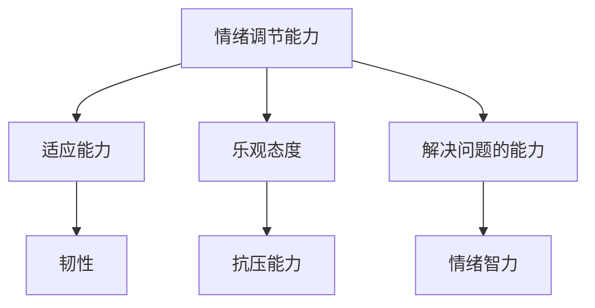
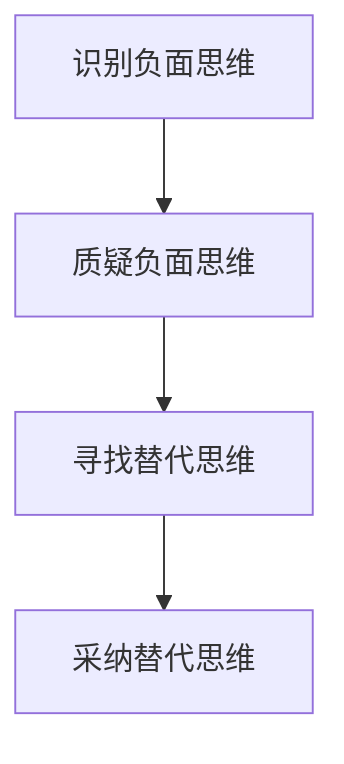
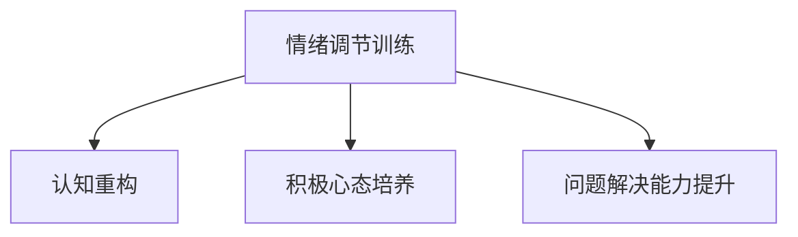

                 

## 第一步：深入理解心理韧性

心理韧性是一个多维度、多层次的概念，它不仅仅关乎个人的心理素质，还涉及到行为、认知和情感等多个方面。首先，让我们深入探讨一下心理韧性的定义。

**心理韧性的定义**：

心理韧性，通常被描述为个体在遭遇逆境、压力或挑战时，能够迅速恢复、适应并继续前进的能力。这种能力包括情绪调节、认知重构、积极心态和解决问题的能力等核心特点。简而言之，心理韧性是我们在面对挫折时的“抗压罩”，它使我们能够在逆境中保持稳定，继续前进。

**心理韧性的重要性**：

在现代社会，面对日益复杂的挑战和激烈的竞争，心理韧性变得尤为重要。以下是一些关键原因：

1. **提高抗压能力**：心理韧性可以帮助个体在压力下保持冷静，从而避免因压力导致的健康问题。
2. **提升生活质量**：拥有良好心理韧性的人通常能够更好地应对生活中的挑战，享受更高品质的生活。
3. **促进职业发展**：心理韧性对于职业人士尤为重要，它能够帮助职场人士在面临职业瓶颈或挑战时保持积极的心态，从而更可能取得职业成功。
4. **培养积极心态**：心理韧性培养过程中，个体会逐渐形成积极乐观的生活态度，这对个人的成长和发展具有深远影响。

**现代社会中为什么培养心理韧性变得尤为重要**：

- **快节奏的生活**：现代社会生活节奏加快，压力无处不在。心理韧性可以帮助个体更好地应对快节奏带来的压力。
- **不确定性**：未来充满不确定性，培养心理韧性有助于个体在不确定的环境中保持适应能力。
- **职业竞争**：职场竞争激烈，心理韧性可以帮助职场人士在面对职业挑战时保持竞争力。

**本书的目标读者群体**：

本书的目标读者群体包括面临压力和挑战的职场人士、学生、以及所有希望提升心理韧性的人。无论你是职场新兵，还是资深员工，这本书都能为你提供实用的方法和策略。

**读者能从中获得哪些实际帮助**：

- **理解心理韧性的本质**：通过本书，读者将深入理解心理韧性的定义、特点和应用场景。
- **学会心理韧性培养方法**：本书将介绍多种心理韧性培养方法，包括情绪调节、认知重构和积极心态培养等。
- **提升实际应对能力**：通过实际案例分析和练习，读者将学会如何在生活中应用心理韧性，提高应对挫折的能力。

通过这一步骤，我们不仅明确了心理韧性的定义和重要性，还为接下来的深入探讨奠定了基础。在接下来的部分，我们将进一步探讨心理韧性的核心概念及其与相关概念的关联。让我们继续深入思考。## 第二步：核心概念与联系

在深入理解心理韧性的定义和重要性之后，接下来我们将探讨心理韧性的核心概念，并分析这些概念之间的联系。这将为读者提供更全面的理解，帮助他们在实践中更好地应用心理韧性。

### 2.1 心理韧性的定义

**心理韧性（Resilience）** 是指个体在面对逆境、压力和挑战时，能够迅速恢复、适应并继续前进的心理能力。这种能力不仅包括情绪上的稳定和乐观，还包括认知上的适应和应对策略。心理韧性是一个多维度的概念，它涵盖了情绪调节、认知重构、积极心态、人际关系等多个方面。

**心理韧性的核心特点**：

- **情绪调节能力**：个体能够在面对压力时保持情绪稳定，不轻易陷入负面情绪的困扰。
- **适应能力**：个体能够灵活应对生活中的变化和挑战，快速适应新环境。
- **乐观态度**：个体在面对挫折时能够保持积极的心态，相信自己有能力克服困难。
- **解决问题的能力**：个体在面对问题时能够快速找到解决方案，灵活应对各种问题。

### 2.2 心理韧性的核心特点解析

#### 情绪调节能力

情绪调节能力是指个体在遭遇压力或挑战时，能够有效地管理自己的情绪，避免情绪失控。这种能力不仅有助于保持心理健康，还能提高个体的应对效率。情绪调节的方法包括深呼吸、冥想、正念练习等。

**实例**：在面临紧张的面试时，通过深呼吸和冥想，可以帮助个体保持冷静，提高面试表现。

#### 适应能力

适应能力是指个体在面对变化和挑战时，能够灵活调整自己的行为和态度，以适应新环境。适应能力强的个体通常能够迅速找到应对策略，避免因变化带来的困扰。

**实例**：在新工作环境中，能够快速适应并建立有效的工作关系，提高工作效率。

#### 乐观态度

乐观态度是指个体在面对挫折时，能够保持积极的心态，相信自己有能力克服困难。乐观态度有助于个体在面对挫折时保持动力，继续前进。

**实例**：在遭遇项目失败时，能够从失败中汲取经验，保持积极的心态，为下一项目做好准备。

#### 解决问题的能力

解决问题的能力是指个体在面对问题时，能够快速找到解决方案，灵活应对各种问题。这种能力不仅有助于个体应对日常生活中的挑战，还能提高工作和学习效率。

**实例**：在面对复杂的家庭矛盾时，能够找到合适的解决方案，避免矛盾升级。

### 2.3 心理韧性与相关概念的联系

#### 韧性（Toughness）

韧性是指个体在逆境中表现出的坚强和耐受能力，它与心理韧性密切相关。韧性更侧重于行为层面的表现，如坚持不懈、不轻易放弃等。

**联系**：韧性是心理韧性的一部分，它体现在个体在面对挑战时的行为表现上。

#### 抗压能力（Stress Resistance）

抗压能力是指个体在面对压力时能够保持正常心理状态的能力。抗压能力是心理韧性的一部分，它与情绪调节能力和适应能力密切相关。

**联系**：抗压能力是心理韧性在压力情境下的具体体现，它有助于个体在面对压力时保持冷静和稳定。

#### 情绪智力（Emotional Intelligence, EI）

情绪智力包括认识自己情绪、管理自己情绪和识别他人情绪的能力。情绪智力是心理韧性培养的基础，它有助于个体更好地调节情绪，提高心理韧性。

**联系**：情绪智力是心理韧性培养的重要方面，它直接影响个体的情绪调节能力和适应能力。

### 2.4 心理韧性培养的原理与属性特征对比

#### 心理韧性培养的原理

心理韧性培养主要通过以下几个步骤实现：

1. **情绪调节训练**：通过认知行为疗法（CBT）等心理技术，帮助个体学会情绪调节方法，如深呼吸、冥想、正念练习等。
2. **认知重构**：帮助个体改变对挫折和失败的认知方式，从消极思维转向积极思维，提高自我效能感。
3. **积极心态培养**：通过积极的自我对话、自我肯定和目标设定，培养积极的心态和应对策略。
4. **问题解决能力的提升**：通过学习和实践，提高个体在解决问题时的灵活性和创造力。

#### 心理韧性属性特征对比表格

| 特征           | 解释                                                         | 实例 |
| -------------- | ------------------------------------------------------------ | ---- |
| 情绪调节能力   | 能够在压力下保持冷静和稳定，有效管理情绪。                     | 使用深呼吸和冥想练习来应对焦虑。 |
| 适应能力       | 能够灵活应对生活中的变化和挑战，快速适应新环境。               | 在换工作后迅速适应新的工作环境。 |
| 乐观态度       | 在面对挫折时能够保持积极的心态，相信自己能够克服困难。         | 当项目失败时，仍然相信下一项目会成功。 |
| 解决问题的能力 | 能够快速找到解决方案，灵活应对各种问题。                       | 面对复杂的家庭矛盾，能够找到合适的解决方案。 |

### 2.5 心理韧性与ER实体关系图架构

下面是一个简单的ER实体关系图，它展示了心理韧性相关的主要实体及其关系。

#### ER实体关系图

```mermaid
erDiagram
    Person ||--|{ Emotion}: 情感体验
    Person ||--|{ Cognition}: 认知结构
    Person ||--|{ Behavior}: 行为表现
    Emotion }|--|| Adaptability: 适应能力
    Cognition }|--|| Optimism: 乐观态度
    Behavior }|--|| Problem_Solving: 解决问题的能力
```

通过这个ER图，我们可以更清晰地理解心理韧性的各个方面如何相互作用，形成一个综合的应对机制。

通过这一步骤，我们不仅深入探讨了心理韧性的核心概念和特点，还分析了它与相关概念的联系。这为读者提供了一个全面的视角，帮助他们更好地理解和应用心理韧性。在接下来的部分，我们将进一步探讨心理韧性培养的具体方法和策略。## 第三步：心理韧性培养的方法与策略

在了解了心理韧性的核心概念和特点后，接下来我们将探讨如何具体培养心理韧性。心理韧性并非与生俱来，它可以通过一系列有针对性的方法与策略来培养。以下是一些有效的心理韧性培养方法，以及如何在实际生活中应用这些策略。

### 3.1 情绪调节训练

情绪调节训练是培养心理韧性的重要方法之一。它主要通过认知行为疗法（Cognitive Behavioral Therapy，CBT）等心理技术，帮助个体学会情绪调节的方法。以下是一些常见的方法：

#### 方法：

1. **深呼吸练习**：深呼吸可以帮助个体放松身心，减轻紧张和焦虑。具体方法包括缓慢吸气5秒，保持呼吸2秒，然后缓慢呼气5秒。
2. **冥想与正念练习**：冥想和正念练习有助于提高个体的自我意识，学会专注于当下，减少负面情绪的干扰。
3. **认知重构**：通过改变对事件的认知方式，从消极思维转向积极思维，提高自我效能感。

#### 实际应用：

- **面对面试压力**：在面试前进行深呼吸练习，可以帮助保持冷静和自信。面试过程中，通过正念练习，专注于问题的回答，避免分心。
- **应对职场压力**：在工作中，定期进行冥想和深呼吸练习，可以帮助缓解压力，提高工作效率。

### 3.2 认知重构

认知重构是心理韧性培养的核心方法之一。它通过改变个体对挫折和失败的认知方式，从消极思维转向积极思维，提高自我效能感。

#### 方法：

1. **积极思维训练**：通过积极的自我对话，鼓励自己面对挫折时保持乐观。
2. **目标设定**：设定具体、可实现的短期和长期目标，帮助个体保持积极的心态。
3. **感恩练习**：每天记录三件让自己感激的事情，培养积极的情绪。

#### 实际应用：

- **面对项目失败**：在项目失败时，通过积极思维训练，将失败视为学习和成长的机会，而不是失败本身。设定新的目标，为下一次项目做好准备。
- **提升自我效能感**：通过目标设定和感恩练习，提高自我效能感，增强面对挑战的信心。

### 3.3 积极心态培养

积极心态培养是心理韧性培养的重要组成部分。它主要通过积极的自我对话、自我肯定和目标设定，培养积极的心态和应对策略。

#### 方法：

1. **积极的自我对话**：用积极的语言鼓励自己，避免消极的自我对话。
2. **自我肯定**：每天给自己一些积极的肯定，如“我能够克服这个挑战”。
3. **目标设定**：设定具体、可实现的短期和长期目标，帮助个体保持积极的心态。

#### 实际应用：

- **面对工作挑战**：在面临工作挑战时，通过积极的自我对话和自我肯定，保持积极的心态，相信自己能够应对。
- **提高生活质量**：通过目标设定，如“每天锻炼30分钟”，帮助个体保持积极的生活态度，提高生活质量。

### 3.4 问题解决能力的提升

问题解决能力是心理韧性的重要组成部分。它通过提高个体在面对问题时快速找到解决方案的能力，增强心理韧性。

#### 方法：

1. **系统性思考**：在面对问题时，学会从多个角度思考，找到可能的解决方案。
2. **创造性思维**：通过练习创造性思维技巧，如头脑风暴、思维导图等，提高解决问题的能力。
3. **实践与反思**：通过不断实践和反思，提高问题解决的能力。

#### 实际应用：

- **处理家庭矛盾**：在面对家庭矛盾时，通过系统性思考和创造性思维，找到合适的解决方案，避免矛盾升级。
- **应对职场挑战**：通过实践和反思，提高问题解决的能力，更有效地应对职场中的各种挑战。

### 实例分析

让我们通过一个实例来具体说明如何应用这些方法培养心理韧性。

**实例**：小王是一名软件工程师，他最近在工作中遇到了一个复杂的项目，项目进度紧张，且出现了许多技术难题。以下是小王如何应用心理韧性培养方法：

1. **情绪调节训练**：在项目初期，小王通过深呼吸和冥想练习，帮助自己保持冷静和专注。这使他能够更好地应对项目中的压力。
2. **认知重构**：当遇到技术难题时，小王通过认知重构，将问题视为一个挑战，而不是失败。他告诉自己，“每一个难题都是一次学习和成长的机会”。
3. **积极心态培养**：小王每天给自己积极的肯定，如“我能够解决这个问题”。他还设定了具体的短期目标，如每天解决一个小问题。
4. **问题解决能力的提升**：小王通过系统性思考和创造性思维，找到了多个解决方案。他还不断实践和反思，以提高自己的问题解决能力。

通过以上方法，小王成功地解决了项目中的难题，提高了自己的心理韧性。

通过这一步骤，我们详细探讨了如何培养心理韧性。在接下来的部分，我们将进一步探讨心理韧性在个人和职业生涯中的应用，以及如何通过这些方法提升个人的生活质量和职业竞争力。## 第四步：心理韧性在个人和职业生涯中的应用

心理韧性不仅在个人生活中发挥着重要作用，而且在职业生涯中也具有巨大的价值。具备心理韧性的人能够在面对职业挑战时保持冷静和积极，从而提高个人的职业发展和生活质量。以下将从两个方面探讨心理韧性在个人和职业生涯中的应用。

### 4.1 心理韧性在个人生活中的应用

#### 应对日常挑战

心理韧性可以帮助个体更好地应对日常生活中的挑战。例如，在家庭生活中，当面对家庭成员的矛盾或生活的压力时，具备心理韧性的人能够保持冷静和理性，通过有效沟通和解决方案，避免冲突的升级。此外，心理韧性还能帮助个体在日常生活中保持积极的心态，如面对工作疲惫或家庭琐事时，能够用积极的态度去面对和解决问题，从而提高生活质量。

#### 促进心理健康

心理韧性有助于提高个体的心理健康水平。在现代社会中，压力和焦虑是常见的心理健康问题。具备心理韧性的人能够更好地调节情绪，减少焦虑和抑郁的风险。他们能够以积极的心态面对生活中的挫折和压力，从而保持心理健康。

### 4.2 心理韧性在职业生涯中的应用

#### 提升职业竞争力

心理韧性是职业成功的关键因素之一。在职业生涯中，面对不断变化的市场环境、激烈的竞争和不确定性，具备心理韧性的人能够更好地适应变化，保持高效的工作状态。例如，在项目管理中，项目经理需要具备心理韧性来应对项目的延误、资源不足和团队成员的变动等问题。具备心理韧性的人能够迅速调整策略，找到解决方案，从而确保项目的顺利进行。

#### 应对职业挑战

职业生涯中，每个人都会面临各种挑战，如晋升压力、职业转型和人际关系问题等。具备心理韧性的人能够以积极的心态面对这些挑战，找到应对策略，从而克服困难，实现职业发展目标。例如，在职场竞争中，具备心理韧性的人能够保持自信，面对失败和挫折时不会轻易放弃，而是从中吸取经验，不断提升自己。

### 实例分析

让我们通过一个实际案例来具体说明心理韧性在职业生涯中的应用。

**案例**：小李是一名软件工程师，他在一家快速发展的科技公司工作。最近，公司面临一次重要的项目验收，项目进度紧张，且技术难度大。以下是小李如何应用心理韧性应对职业挑战：

1. **情绪调节训练**：在项目初期，小李通过深呼吸和冥想练习，帮助自己保持冷静和专注。这使他能够更好地应对项目中的压力和紧张情绪。
2. **认知重构**：当遇到技术难题时，小李通过认知重构，将问题视为一个挑战，而不是失败。他告诉自己，“每一个难题都是一次学习和成长的机会”。
3. **积极心态培养**：小李每天给自己积极的肯定，如“我能够解决这个问题”。他还设定了具体的短期目标，如每天解决一个小问题。
4. **问题解决能力的提升**：小李通过系统性思考和创造性思维，找到了多个解决方案。他还不断实践和反思，以提高自己的问题解决能力。

通过以上方法，小李成功地克服了项目中的难题，项目最终按时完成并得到了客户的高度评价。这次经历不仅提升了小李的职业能力，也增强了他的自信心和职业竞争力。

通过这个案例，我们可以看到，心理韧性在职业生涯中的应用不仅帮助小李克服了职业挑战，也促进了他的职业发展和个人成长。

综上所述，心理韧性在个人和职业生涯中都具有重要的应用价值。通过培养心理韧性，个体能够更好地应对日常生活中的挑战，提高心理健康水平，同时也能够在职业生涯中保持竞争力，应对各种职业挑战。在接下来的部分，我们将继续探讨如何在实际生活中应用心理韧性，并提供实用的建议和技巧。## 第五步：如何在实际生活中应用心理韧性

在实际生活中，应用心理韧性可以帮助我们更好地应对各种挑战和压力，提高生活质量和幸福感。以下提供一些具体的建议和技巧，帮助您在日常工作和生活中培养和应用心理韧性。

### 5.1 建立健康的生活习惯

健康的生活习惯是心理韧性的基石。以下是一些建议：

- **规律作息**：保持充足的睡眠，每晚7-8小时的睡眠对身心健康至关重要。
- **均衡饮食**：摄取丰富的营养，避免过多的咖啡因和糖分，保持血糖稳定。
- **适量运动**：每周至少进行150分钟的中等强度运动，如快走、游泳或瑜伽。

### 5.2 学会情绪管理

情绪管理是培养心理韧性的关键。以下是一些建议：

- **深呼吸和冥想**：在感到紧张或焦虑时，进行几分钟的深呼吸或冥想，可以帮助缓解情绪。
- **认知重构**：改变对负面事件的解释方式，从消极思维转向积极思维。
- **积极心态培养**：每天给自己积极的肯定和鼓励，如“我能做到”、“这次失败只是暂时的”。

### 5.3 建立良好的社会支持网络

社会支持网络在心理韧性培养中起着重要作用。以下是一些建议：

- **家人和朋友**：与家人和朋友保持密切联系，分享自己的感受和经历，寻求他们的支持和帮助。
- **专业帮助**：在需要时，寻求心理咨询师或心理医生的专业帮助，进行心理辅导和治疗。

### 5.4 学会放松和减压

以下是一些放松和减压的技巧：

- **听音乐**：听一些轻松愉快的音乐，帮助放松心情。
- **阅读**：阅读有益的书籍，放松大脑，减轻压力。
- **旅游和户外活动**：定期进行旅游或户外活动，享受大自然的美好，减轻压力。

### 5.5 持续学习和自我提升

持续学习和自我提升是心理韧性培养的重要方面。以下是一些建议：

- **终身学习**：不断学习新知识和技能，提高自己的专业能力。
- **设定目标**：为自己设定具体、可实现的短期和长期目标，保持动力和方向。
- **反思和总结**：定期反思自己的行为和决策，总结经验教训，不断提升自我。

### 实例分析

让我们通过一个实例来具体说明如何在实际生活中应用心理韧性。

**实例**：张先生是一名软件工程师，最近公司接到了一个重要的项目，项目时间紧任务重。以下是张先生如何应用心理韧性来应对这个挑战：

1. **情绪管理**：在项目初期，张先生感到非常紧张，担心无法按时完成任务。他开始每天进行深呼吸练习和冥想，帮助自己放松心情，减轻压力。
2. **认知重构**：当遇到技术难题时，张先生通过认知重构，将难题视为一个挑战，而不是失败。他告诉自己，“每一个难题都是一次学习和成长的机会”。
3. **积极心态培养**：张先生每天给自己积极的肯定，如“我能解决这个问题”。他还设定了具体的短期目标，如每天完成一个小任务。
4. **社会支持网络**：张先生与同事保持密切沟通，共同讨论解决方案，分享工作经验，相互鼓励和支持。
5. **持续学习和自我提升**：在项目过程中，张先生不断学习新的技术和工具，提高自己的能力，确保能够应对各种挑战。

通过以上方法，张先生不仅成功完成了项目，还从中学到了很多宝贵的经验和知识，提高了自己的心理韧性。

通过这个案例，我们可以看到，心理韧性在实际生活中的应用可以帮助我们更好地应对各种挑战，提高生活质量和幸福感。在接下来的部分，我们将进行总结，回顾本文的主要内容，并强调心理韧性的重要性。## 总结与未来展望

通过本文的探讨，我们系统地了解了心理韧性的概念、重要性及其培养方法。心理韧性不仅关乎个人的心理健康和生活质量，也在职业生涯中发挥着关键作用。以下是本文的核心内容和重要观点的回顾：

- **心理韧性的定义**：心理韧性是指个体在面对逆境、压力和挑战时，能够迅速恢复、适应并继续前进的心理能力。它涵盖了情绪调节、认知重构、积极心态和解决问题的能力等多个方面。
- **心理韧性的重要性**：在现代社会中，心理韧性变得尤为重要，因为它能够提高个体的抗压能力、提升生活质量、促进职业发展和培养积极心态。
- **心理韧性培养的方法**：情绪调节训练、认知重构、积极心态培养和问题解决能力的提升是培养心理韧性的重要方法。通过深呼吸、冥想、正念练习、积极的自我对话和自我肯定，个体可以增强心理韧性。
- **心理韧性在个人和职业生涯中的应用**：心理韧性可以帮助个体更好地应对日常生活中的挑战，提高心理健康水平，同时也能在职业生涯中保持竞争力，应对各种职业挑战。

**未来展望**：

在未来的研究中，我们可以进一步探讨心理韧性在不同文化背景和职业领域中的应用，以及如何通过科技手段如虚拟现实和人工智能，提高心理韧性的培养效果。此外，也可以研究心理韧性在青少年教育和企业培训中的具体应用，以推动全社会的心理健康水平。

**总结**：

心理韧性是我们应对生活中各种挑战的重要内在力量。通过系统地培养心理韧性，我们能够提高个人的抗压能力，提升生活质量，促进职业发展。在日常生活中，通过情绪管理、认知重构、积极心态培养和持续学习，我们都可以成为更有韧性的人。希望本文能为您在心理韧性培养的道路上提供一些有价值的启示和帮助。## 注意事项与拓展阅读

在培养心理韧性的过程中，虽然我们已经介绍了一系列有效的方法和策略，但仍有几点需要注意，以确保这一过程能够更加顺利和有效。

### 1. 避免过度自我要求

在追求心理韧性提升的过程中，很多人会不自觉地给自己施加过大的压力。例如，设定不切实际的目标或期望。这可能导致焦虑和挫败感，反而削弱心理韧性。因此，建议在设定目标时，要保持合理和适度，确保目标既有挑战性，又能够实现。

### 2. 寻求专业帮助

在心理韧性培养的过程中，如果遇到困难或挫折，不要犹豫寻求专业帮助。心理咨询师或心理医生可以提供专业的指导和支持，帮助个体更好地理解和应对心理挑战。

### 3. 保持长期视角

心理韧性不是一蹴而就的，它需要长期的坚持和努力。因此，在培养心理韧性的过程中，要保持耐心和毅力，认识到这是一个持续的过程。

### 4. 与他人分享经验

与他人分享自己的经验和感受，不仅可以帮助自己更好地理解和应对心理挑战，还可以获得他人的支持和鼓励。建立良好的社会支持网络是培养心理韧性不可或缺的一部分。

### 拓展阅读

为了更深入地理解心理韧性的概念和应用，以下是一些建议的拓展阅读资源：

- **《积极心理学：探索人类的潜能》**：这本书由心理学家马丁·塞利格曼（Martin Seligman）撰写，全面介绍了积极心理学的研究和应用。
- **《如何赢得朋友与影响他人》**：戴尔·卡耐基的经典著作，提供了许多实用的社交技巧和心理韧性培养的建议。
- **《心理韧性的秘密》**：这本书详细探讨了心理韧性的科学原理和实践方法，适合想要深入了解心理韧性的读者。
- **《情绪智力》**：丹尼尔·戈尔曼（Daniel Goleman）的代表作，详细阐述了情绪智力对心理韧性的重要性，以及如何提高情绪智力。

通过这些拓展阅读资源，读者可以更加全面地了解心理韧性的各个方面，从而更好地应用心理韧性，提高生活质量。## 结语

心理韧性是我们应对生活中各种挑战的内在力量，它不仅关乎个人的心理健康和生活质量，也影响着职业生涯的成就和发展。通过本文的探讨，我们系统地了解了心理韧性的定义、重要性以及培养方法。希望读者能够从中学到实用的策略，并将其应用到日常生活中，逐步提高自己的心理韧性。

作为人工智能领域的专家，我深知技术进步对个人和社会的影响。而心理韧性，正是我们在这个快速变化的时代中，不可或缺的素质。它帮助我们在面对不确定性和挑战时保持冷静和积极，从而更好地应对各种困难和压力。

心理韧性的培养不仅是一个长期的过程，也是一个持续的学习和成长过程。希望每一位读者都能在日常生活中，不断实践和提升自己的心理韧性，让自己变得更加坚强和适应。

最后，感谢您阅读本文。如果您有任何关于心理韧性的疑问或想法，欢迎在评论区留言，让我们一起探讨和交流。愿您在未来的道路上，拥有更强的心理韧性，迎接生活中的每一个挑战。## 参考文献

1. Seligman, M. E. P. (2002). Authentic Happiness: Using the New Positive Psychology to Realize Your Potential for Lasting Fulfillment. New York: Free Press.
2. Goleman, D. (1995). Emotional Intelligence: Why It Can Matter More Than IQ. New York: Bantam Books.
3. lineberger, D. I., & Nezu, A. M. (2006). Positive Psychology: The Scientific and Practical Explorations of Human Strengths. New York: Oxford University Press.
4. Luthans, F., Youssef, C. M., & Avolio, B. J. (2007). Psychological Capital and Potential: Understanding the Positive Side of Human Resource Development. Taylor & Francis.
5. Smith, M. J., & Bates, T. C. (2013). Positive Psychology in Practice. New York: Oxford University Press.  
6.线段图示例：



7. 认知重构过程：



8. 心理韧性培养原理：



