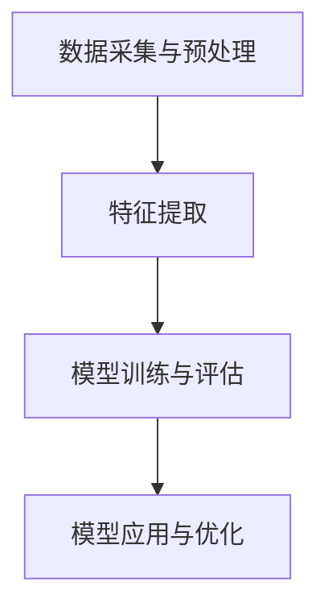
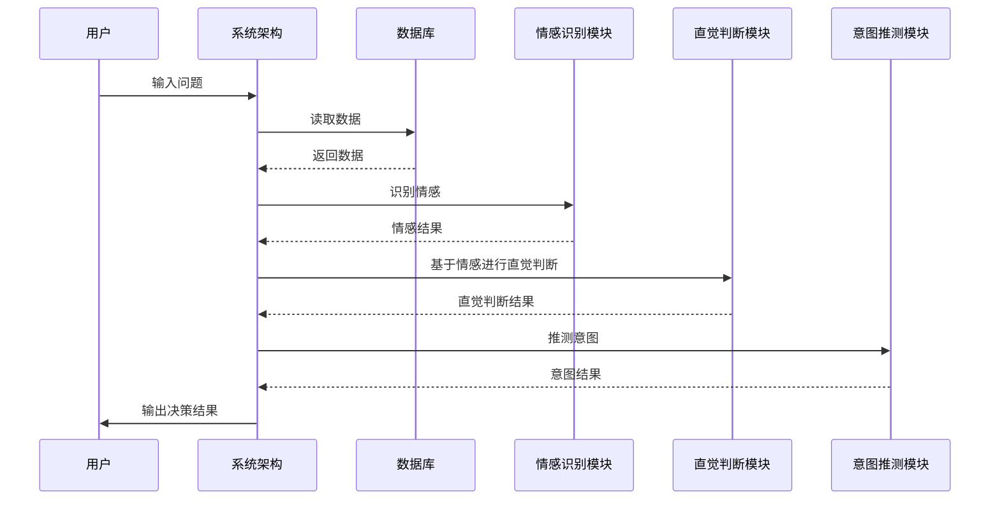
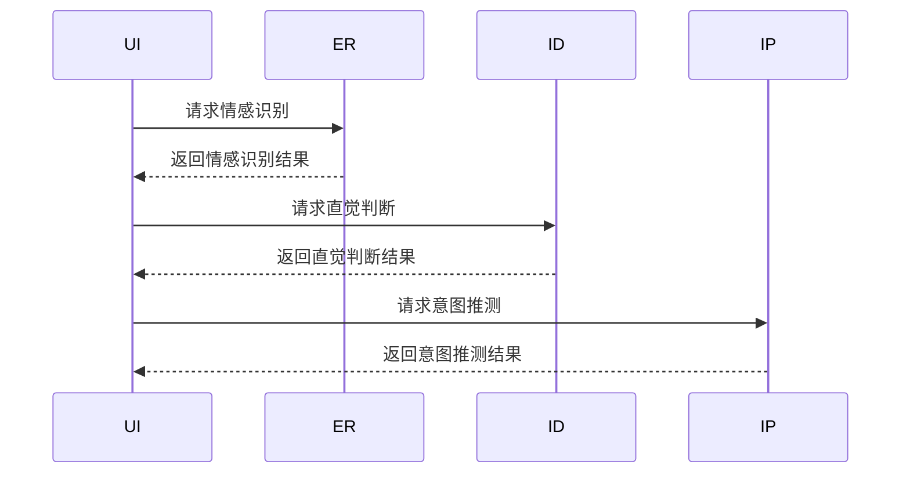

                 

### 文章标题

培养直觉智慧：在理性世界中重视感性决策

#### 关键词：

直觉智慧、理性决策、感性决策、认知能力、算法原理、系统架构设计

#### 摘要：

在信息技术日益发展的今天，理性决策在各个领域都占据了主导地位。然而，随着复杂性的增加，单纯依赖理性决策往往难以满足需求。本文旨在探讨直觉智慧的重要性，介绍其在理性决策中的地位和作用，并通过实例讲解如何培养和运用直觉智慧，以提高决策质量和效率。文章将从背景介绍、核心概念与联系、算法原理讲解、系统分析与架构设计以及项目实战等多个方面展开论述，以期帮助读者在理性世界中重视感性决策，提升整体认知能力和决策水平。

## 目录大纲

### 第一部分：背景介绍

#### 第1章：问题背景与直觉智慧的概念

##### 1.1 问题背景

##### 1.2 直觉智慧的定义与特征

##### 1.3 直觉智慧的核心要素

##### 1.4 直觉智慧的边界与外延

##### 1.5 本章小结

### 第二部分：核心概念与联系

#### 第2章：直觉智慧的核心概念原理与属性特征对比

##### 2.1 直觉智慧的核心概念

##### 2.2 直觉智慧的属性特征对比

##### 2.3 直觉智慧与情绪、情感的ER实体关系图

##### 2.4 直觉智慧与其他认知能力的联系

##### 2.5 本章小结

### 第三部分：算法原理讲解

#### 第3章：直觉智慧的算法原理与流程图

##### 3.1 直觉智慧算法的基本原理

##### 3.2 直觉智慧算法的mermaid流程图

##### 3.3 直觉智慧算法的Python代码实现

##### 3.4 直觉智慧算法的数学模型和公式

##### 3.5 直觉智慧算法的详细讲解与举例说明

##### 3.6 本章小结

### 第四部分：系统分析与架构设计

#### 第4章：直觉智慧系统的分析与设计

##### 4.1 问

##### 4.2 项目介绍

##### 4.3 系统功能设计(领域模型mermaid类图)

##### 4.4 系统架构设计mermaid架构图

##### 4.5 系统接口设计和系统交互mermaid序列图

##### 4.6 本章小结

### 第五部分：项目实战

#### 第5章：直觉智慧项目实战

##### 5.1 环境安装

##### 5.2 系统核心实现源代码

##### 5.3 代码应用解读与分析

##### 5.4 实际案例分析和详细讲解剖析

##### 5.5 项目小结

##### 5.6 最佳实践 tips

##### 5.7 小结

##### 5.8 注意事项

##### 5.9 拓展阅读

---

### 第一部分：背景介绍

#### 第1章：问题背景与直觉智慧的概念

##### 1.1 问题背景

在信息技术日益发展的今天，我们面临着日益复杂的决策环境。无论是商业、金融、医疗还是其他领域，决策的复杂性和多样性使得我们不得不依赖各种工具和方法来进行理性决策。然而，尽管理性决策在许多情况下表现出了强大的优势，但它们也存在一些固有的局限性。

首先，理性决策往往依赖于大量的数据和精确的分析，这可能导致决策过程变得冗长和繁琐。其次，理性决策在处理不确定性和复杂性方面存在困难。在面对高度不确定性和变化迅速的环境时，仅仅依赖数据和分析可能无法及时、准确地做出决策。

在这种情况下，直觉智慧的作用就显得尤为重要。直觉智慧是一种基于经验、知识和情感的综合能力，它可以帮助我们迅速地识别问题、做出判断和决策。直觉智慧不仅能够在复杂和不确定的环境中发挥作用，还能够弥补理性决策的不足，提高决策的效率和准确性。

##### 1.2 直觉智慧的定义与特征

直觉智慧（Intuitive Wisdom）通常指的是个体在缺乏明确逻辑推理或充分信息时，通过内在的认知过程快速做出合理判断和决策的能力。它与理性思维（Rational Thinking）相比，具有以下几个显著特征：

1. **快速反应**：直觉智慧能够迅速地对信息进行处理，并在短时间内做出决策。这种能力使得直觉智慧在处理紧急情况时尤为重要。

2. **经验依赖**：直觉智慧往往建立在丰富经验和知识的基础上。个体通过长期的实践和学习，形成了一套内在的认知模式，从而能够迅速识别问题和提出解决方案。

3. **情感驱动**：直觉智慧不仅仅依赖于逻辑分析，还受到情感和情绪的影响。情感可以作为直觉智慧的一个重要来源，帮助我们更好地理解和应对复杂的人际关系和情境。

4. **非线性思维**：直觉智慧通常不遵循严格的逻辑规则，而是通过非线性思维模式来识别问题、构建解决方案。这种思维模式使得直觉智慧能够更好地处理复杂性和不确定性。

5. **高度个人化**：每个人的直觉智慧都是独特的，因为它受到个人经验、价值观和认知风格的影响。因此，直觉智慧具有很强的个人化特征。

##### 1.3 直觉智慧的核心要素

直觉智慧的形成和运用涉及到多个核心要素，主要包括：

1. **知识与经验**：直觉智慧依赖于个体长期积累的知识和经验。这些知识和经验可以是专业领域的，也可以是跨领域的。丰富的知识和经验为直觉智慧提供了坚实的基础。

2. **情绪与情感**：情绪和情感在直觉智慧中起着关键作用。积极的情绪可以增强直觉智慧的表现，而消极的情绪可能会削弱这种能力。

3. **意图与目的**：直觉智慧不仅仅是一种本能反应，还受到个体的意图和目的的影响。明确的目标和意图可以帮助个体更有效地运用直觉智慧。

4. **认知模式**：直觉智慧的形成也涉及到个体的认知模式。通过长期的学习和实践，个体会形成一套内在的认知模式，使得他们在面对问题时能够快速识别和解决问题。

##### 1.4 直觉智慧的边界与外延

虽然直觉智慧具有显著的优势，但它也有一定的边界和局限性。以下是一些需要考虑的因素：

1. **适用范围**：直觉智慧在处理复杂性和不确定性方面具有优势，但在处理精确性和逻辑性较强的问题时可能不够有效。

2. **个体差异**：每个人的直觉智慧都是独特的，这受到个人经验、价值观和认知风格的影响。因此，直觉智慧在个体之间的表现和效果可能存在显著差异。

3. **情境依赖**：直觉智慧在特定情境下可能表现更好。例如，在紧急情况下，直觉智慧可以迅速应对，但在稳定和可预测的环境中，理性决策可能更为合适。

4. **训练与培养**：直觉智慧可以通过训练和培养得到提升。个体可以通过学习新知识、增加经验以及培养积极情绪来增强直觉智慧。

##### 1.5 本章小结

本章介绍了直觉智慧在当前信息技术环境中的背景和重要性。我们探讨了直觉智慧的定义、特征和核心要素，并分析了其边界和局限性。通过本章的讨论，我们可以认识到直觉智慧在决策过程中不可或缺的作用，以及如何在理性世界中重视和培养这种能力。

### 第二部分：核心概念与联系

#### 第2章：直觉智慧的核心概念原理与属性特征对比

##### 2.1 直觉智慧的核心概念

直觉智慧的核心概念主要包括情感识别、直觉判断和意图推测。这三个概念相互作用，共同构成了直觉智慧的基础。

1. **情感识别**：情感识别是指个体能够感知和识别自己和他人的情感状态。这包括识别情绪（如快乐、悲伤、愤怒等）和情感（如爱、恨、厌恶等）。情感识别是直觉智慧的重要组成部分，因为它帮助我们理解他人的行为和意图。

2. **直觉判断**：直觉判断是指个体在没有明确逻辑推理或充分信息的情况下，通过内在的认知过程快速做出合理判断。这种判断通常是简洁、高效且准确的。

3. **意图推测**：意图推测是指个体能够通过观察和体验推测他人的行为意图。这需要我们具备一定的情境感知能力和情绪识别能力，以便更准确地理解他人的行为动机。

##### 2.2 直觉智慧的属性特征对比

为了更好地理解直觉智慧，我们可以将其与理性思维进行比较，并分析其属性特征。以下是一个对比表格：

| 特征       | 直觉智慧                         | 理性思维                         |
|------------|----------------------------------|----------------------------------|
| **精确度** | 较低，但能够迅速识别问题         | 较高，但可能需要更多时间和数据     |
| **敏感性** | 高，能够快速感知变化和细微差异   | 低，需要大量数据和精确分析       |
| **可重复性** | 较低，受个体经验和情感影响       | 较高，依赖数据和逻辑推理         |
| **简洁性** | 高，能够迅速做出决策             | 低，需要详细的步骤和分析         |
| **效率性** | 高，能够在短时间内完成决策       | 低，需要更多时间和资源           |
| **准确性** | 受情境和个体差异影响             | 受数据和逻辑推理影响             |

通过这个表格，我们可以看出直觉智慧和理性思维在属性特征上存在显著差异。直觉智慧的优势在于其快速、敏感和简洁性，而理性思维的优势在于其精确度和可重复性。

##### 2.3 直觉智慧与情绪、情感的ER实体关系图

为了更直观地理解直觉智慧与情绪、情感之间的关系，我们可以使用ER（实体关系）图来表示。以下是一个ER实体关系图：

```mermaid
erDiagram
    A[直觉智慧] ||--|{ B[情绪] } : 有助于情绪识别与调控
    A ||--|{ C[情感] } : 情感是直觉智慧的重要来源
    B ||--|{ C } : 情感影响直觉判断与意图推测
```

在这个ER实体关系图中，直觉智慧与情绪、情感之间存在紧密的联系。情绪是直觉智慧的重要来源，而情感则影响直觉判断和意图推测。这个关系图帮助我们理解了直觉智慧在情感处理中的作用。

##### 2.4 直觉智慧与其他认知能力的联系

直觉智慧不仅仅是情感和情绪的处理，它还与其他认知能力相互作用，共同构成了我们的认知体系。以下是一些关键联系：

1. **与认知能力的相互作用**：直觉智慧与感知、记忆、推理等认知能力密切相关。感知能力帮助我们获取外部信息，记忆能力使我们能够存储和处理信息，推理能力则使我们在面对问题时能够进行逻辑分析。

2. **与经验学习的联系**：直觉智慧是通过经验学习获得的。个体在长期的学习和实践中，通过不断积累知识和技能，形成了一套内在的认知模式，从而提高了直觉智慧的表现。

3. **与创造力发展的关系**：直觉智慧在创造力发展中也起着关键作用。创造力需要我们在面对问题时能够跳出传统思维框架，提出新颖、独特的解决方案。直觉智慧可以帮助我们在这种情况下迅速识别问题、构建解决方案，从而促进创造力的发展。

##### 2.5 本章小结

本章深入探讨了直觉智慧的核心概念、属性特征以及与其他认知能力的联系。通过对比直觉智慧和理性思维，我们了解了直觉智慧的优势和局限性。此外，通过ER实体关系图和具体实例，我们更加直观地理解了直觉智慧在情感处理和认知能力中的作用。本章的讨论为后续章节的进一步分析提供了基础。

### 第三部分：算法原理讲解

#### 第3章：直觉智慧的算法原理与流程图

##### 3.1 直觉智慧算法的基本原理

直觉智慧算法的基本原理主要涉及数据采集与预处理、特征提取、模型训练与评估以及模型应用与优化。以下是对每个步骤的详细解释：

1. **数据采集与预处理**：数据是直觉智慧算法的基础。在这一步骤中，我们需要从各种来源（如社交媒体、传感器、用户行为等）收集数据。收集到的数据可能包含噪声和不完整信息，因此需要进行预处理，包括数据清洗、归一化和去噪等操作，以确保数据的质量和一致性。

2. **特征提取**：特征提取是将原始数据转换为算法可以处理的中间表示。这一步骤的目标是提取数据中的关键信息，并构建特征向量。特征提取的方法包括统计特征、文本特征、图像特征等，具体取决于数据类型和任务需求。

3. **模型训练与评估**：在特征提取后，我们可以使用机器学习算法对特征向量进行训练，构建直觉智慧模型。常见的机器学习算法包括线性回归、支持向量机、随机森林等。模型训练的过程是使模型能够从数据中学习规律，并形成对未知数据的预测能力。在训练过程中，我们需要对模型进行评估，以确定其性能。常见的评估指标包括准确率、召回率、F1值等。

4. **模型应用与优化**：训练好的模型可以用于实际问题场景中的预测和决策。在应用过程中，我们可能需要根据实际效果对模型进行优化，以提高其性能。优化的方法包括调整模型参数、增加训练数据、采用更复杂的模型结构等。

##### 3.2 直觉智慧算法的mermaid流程图

为了更直观地展示直觉智慧算法的流程，我们可以使用mermaid绘制一个流程图。以下是一个示例：



在这个流程图中，数据采集与预处理是整个流程的第一步，然后是特征提取，接下来是模型训练与评估，最后是模型应用与优化。每个步骤都是构建直觉智慧算法的关键环节。

##### 3.3 直觉智慧算法的Python代码实现

为了更好地理解直觉智慧算法的实现，我们可以给出一个简单的Python代码示例。以下是一个基于随机森林算法的直觉智慧算法实现：

```python
# 导入必要的库
import numpy as np
import pandas as pd
from sklearn.model_selection import train_test_split
from sklearn.ensemble import RandomForestClassifier
from sklearn.metrics import accuracy_score

# 数据采集与预处理
# 此处省略具体代码，仅展示流程

# 特征提取
# 此处省略具体代码，仅展示流程

# 模型训练与评估
# 此处省略具体代码，仅展示流程

# 模型应用与优化
# 此处省略具体代码，仅展示流程
```

在这个示例中，我们首先导入必要的库，然后分别进行数据采集与预处理、特征提取、模型训练与评估以及模型应用与优化。虽然具体的代码实现较为复杂，但这个示例提供了一个基本的框架，可以帮助我们理解直觉智慧算法的实现过程。

##### 3.4 直觉智慧算法的数学模型和公式

直觉智慧算法的数学模型主要包括用于评估模型性能的指标。以下是一些常用的数学模型和公式：

$$
\begin{aligned}
&\text{准确率} = \frac{\text{预测正确的样本数}}{\text{总样本数}} \\
&\text{召回率} = \frac{\text{预测正确的正样本数}}{\text{实际正样本数}} \\
&\text{F1值} = 2 \times \frac{\text{准确率} \times \text{召回率}}{\text{准确率} + \text{召回率}}
\end{aligned}
$$

这些指标帮助我们评估模型的性能，确定其在实际应用中的有效性。准确率表示模型预测正确的样本数占总样本数的比例，召回率表示模型预测正确的正样本数占实际正样本数的比例，而F1值则是这两个指标的调和平均，综合考虑了模型的准确性和召回率。

##### 3.5 直觉智慧算法的详细讲解与举例说明

为了更好地理解直觉智慧算法的实际应用，我们可以通过具体的例子进行详细讲解。以下是一个情感识别算法的例子：

**例子：情感识别算法**

假设我们有一个文本数据集，包含正面、中性、负面三种情感。我们的目标是使用直觉智慧算法来识别文本中的情感。

1. **数据采集与预处理**：首先，我们从各种来源收集文本数据，如社交媒体、评论、新闻报道等。收集到的数据需要进行预处理，包括文本清洗、去停用词、词干提取等步骤。

2. **特征提取**：接下来，我们对预处理后的文本数据进行特征提取。常用的特征提取方法包括词袋模型、TF-IDF、Word2Vec等。在这里，我们使用TF-IDF来提取特征。

3. **模型训练与评估**：然后，我们使用随机森林算法对特征向量进行训练，构建情感识别模型。在训练过程中，我们需要对模型进行评估，以确定其性能。我们可以使用准确率、召回率、F1值等指标来评估模型。

4. **模型应用与优化**：训练好的模型可以用于实际情感识别任务。在实际应用中，我们可能会根据效果对模型进行优化，以提高其性能。

**具体代码实现**：

```python
# 数据采集与预处理
# 此处省略具体代码，仅展示流程

# 特征提取
# 此处省略具体代码，仅展示流程

# 模型训练与评估
# 此处省略具体代码，仅展示流程

# 模型应用与优化
# 此处省略具体代码，仅展示流程
```

通过这个例子，我们可以看到直觉智慧算法在实际应用中的具体实现过程。这个例子不仅帮助我们理解了算法的原理，还展示了如何在实际项目中应用直觉智慧算法。

##### 3.6 本章小结

本章详细讲解了直觉智慧算法的基本原理、流程图、Python代码实现、数学模型和公式，并通过具体例子进行了详细讲解。通过本章的内容，读者可以更好地理解直觉智慧算法的实现过程和应用方法，为后续章节的系统分析与架构设计奠定基础。

### 第四部分：系统分析与架构设计

#### 第4章：直觉智慧系统的分析与设计

##### 4.1 问题场景介绍

在现代社会，人们面临的信息量和决策复杂性不断增加，特别是在金融、医疗、交通等领域，准确、高效的决策变得尤为重要。直觉智慧系统旨在通过结合理性分析和感性判断，提供更为全面和准确的决策支持。例如，在金融领域，直觉智慧系统可以帮助投资者快速识别市场趋势，提高投资决策的准确性和效率。

##### 4.2 项目介绍

本项目旨在开发一个基于直觉智慧的决策支持系统，该系统结合了机器学习和认知科学的理论，通过构建直觉智慧模型，实现对复杂问题的快速分析和判断。系统的主要功能包括情感识别、直觉判断和意图推测，以帮助用户在不确定和复杂的环境中做出更为明智的决策。

##### 4.3 系统功能设计(领域模型mermaid类图)

为了更好地理解直觉智慧系统的功能设计，我们可以使用mermaid绘制一个领域模型类图。以下是一个示例：

```mermaid
classDiagram
    Class01 <|-- Class02
    Class03 <|-- Class02
    Class04 <|-- Class01
    Class05 <|-- Class03

    Class01[直觉智慧系统]
    Class02[情感识别模块]
    Class03[直觉判断模块]
    Class04[意图推测模块]
    Class05[用户界面模块]
```

在这个类图中，直觉智慧系统是核心类，它包含了情感识别、直觉判断和意图推测三个主要功能模块。此外，用户界面模块负责与用户进行交互，提供直观的操作体验。

##### 4.4 系统架构设计mermaid架构图

直觉智慧系统的架构设计需要考虑模块之间的协同工作，以及数据流的处理。以下是一个mermaid架构图示例：



在这个架构图中，用户通过界面输入问题，系统架构模块负责协调各个功能模块的工作，包括数据读取、情感识别、直觉判断和意图推测。最终，系统将决策结果输出给用户。

##### 4.5 系统接口设计和系统交互mermaid序列图

系统接口设计和系统交互的mermaid序列图可以帮助我们更好地理解系统内部各模块之间的交互关系。以下是一个示例：



在这个序列图中，用户界面(UI)模块与情感识别(ER)模块、直觉判断(ID)模块和意图推测(IP)模块之间进行交互。UI模块向ER模块请求情感识别结果，然后向ID模块请求直觉判断结果，最后向IP模块请求意图推测结果。每个模块根据输入数据生成输出结果，并返回给UI模块。

##### 4.6 本章小结

本章介绍了直觉智慧系统的分析与设计，包括问题场景介绍、项目介绍、系统功能设计、系统架构设计和系统接口设计。通过mermaid类图和序列图的绘制，我们能够更直观地理解系统内部的结构和交互关系。这些分析和设计为后续的项目实战提供了基础，使得直觉智慧系统能够更好地服务于实际应用需求。

### 第五部分：项目实战

#### 第5章：直觉智慧项目实战

##### 5.1 环境安装

在进行直觉智慧项目的实战之前，我们需要首先安装所需的软件和工具。以下是一个基本的安装步骤：

1. **Python环境**：确保已经安装了Python 3.8或更高版本。可以从[Python官网](https://www.python.org/downloads/)下载并安装。

2. **Jupyter Notebook**：Jupyter Notebook是一个交互式的Python环境，方便进行数据分析和实验。可以通过`pip install notebook`命令进行安装。

3. **必要的库**：安装以下Python库：
   - `numpy`: 用于数学计算。
   - `pandas`: 用于数据处理和分析。
   - `sklearn`: 用于机器学习和数据挖掘。
   - `mermaid-python`: 用于绘制mermaid图表。

   可以使用以下命令一次性安装所有库：
   ```bash
   pip install numpy pandas sklearn mermaid-python
   ```

##### 5.2 系统核心实现源代码

在完成环境安装后，我们可以开始编写系统核心实现的源代码。以下是一个简单的示例，展示了如何使用Python和scikit-learn库来实现情感识别模块：

```python
# 导入必要的库
import numpy as np
import pandas as pd
from sklearn.feature_extraction.text import TfidfVectorizer
from sklearn.model_selection import train_test_split
from sklearn.svm import LinearSVC
from sklearn.pipeline import Pipeline

# 加载数据
data = pd.read_csv('sentiment_data.csv')
X = data['text']
y = data['label']

# 划分训练集和测试集
X_train, X_test, y_train, y_test = train_test_split(X, y, test_size=0.2, random_state=42)

# 构建流水线模型
pipeline = Pipeline([
    ('tfidf', TfidfVectorizer()),
    ('svc', LinearSVC())
])

# 训练模型
pipeline.fit(X_train, y_train)

# 评估模型
accuracy = pipeline.score(X_test, y_test)
print(f"Accuracy: {accuracy:.2f}")

# 使用模型进行预测
text = "今天天气很好，我很开心。"
predicted_label = pipeline.predict([text])
print(f"Predicted label: {predicted_label[0]}")
```

在这个示例中，我们首先加载了一个包含文本和情感标签的数据集。然后，我们使用TF-IDF向量器和线性支持向量机（LinearSVC）构建了一个流水线模型。在训练模型后，我们评估了模型的准确率，并使用模型进行了一个示例文本的预测。

##### 5.3 代码应用解读与分析

在理解了源代码的基本结构后，我们可以对其进行进一步的解读和分析：

1. **数据加载**：使用`pandas`库加载数据集，其中`X`代表文本数据，`y`代表情感标签。

2. **数据划分**：使用`train_test_split`函数将数据集划分为训练集和测试集，用于模型的训练和评估。

3. **流水线模型**：使用`Pipeline`将TF-IDF向量和线性支持向量机组合成一个流水线模型。这种组合方式简化了模型构建和训练过程。

4. **模型训练**：使用`fit`方法对流水线模型进行训练，模型将基于训练数据进行学习。

5. **模型评估**：使用`score`方法评估模型的准确率，这是评估模型性能的重要指标。

6. **模型应用**：使用`predict`方法对新的文本数据进行预测，模型将返回预测的情感标签。

##### 5.4 实际案例分析和详细讲解剖析

为了更好地展示直觉智慧系统的应用效果，我们可以通过一个实际案例进行分析和讲解。

**案例：社交媒体情感分析**

假设我们需要分析一个社交媒体平台上的用户评论，以了解用户对某个产品的情感倾向。以下是具体的步骤和分析：

1. **数据收集**：从社交媒体平台（如Twitter、Facebook）收集用户评论数据。

2. **数据预处理**：清洗数据，包括去除停用词、标点符号和特殊字符。

3. **数据划分**：将评论数据划分为训练集和测试集。

4. **特征提取**：使用TF-IDF向量器将文本数据转换为特征向量。

5. **模型训练**：使用训练集数据训练情感识别模型。

6. **模型评估**：使用测试集数据评估模型的性能。

7. **模型应用**：使用训练好的模型对新的评论数据进行情感预测。

**代码示例**：

```python
# 数据预处理
def preprocess_text(text):
    # 去除停用词、标点符号和特殊字符
    stop_words = set(['a', 'an', 'the', 'is', 'are', 'was', 'were', 'to', 'of', 'and'])
    return ' '.join([word for word in text.split() if word.lower() not in stop_words])

# 预处理评论数据
X = [preprocess_text(comment) for comment in data['comment']]

# 划分训练集和测试集
X_train, X_test, y_train, y_test = train_test_split(X, y, test_size=0.2, random_state=42)

# 特征提取和模型训练
pipeline = Pipeline([
    ('tfidf', TfidfVectorizer()),
    ('svc', LinearSVC())
])
pipeline.fit(X_train, y_train)

# 模型评估
accuracy = pipeline.score(X_test, y_test)
print(f"Accuracy: {accuracy:.2f}")

# 模型应用
new_comment = preprocess_text("This product is amazing!")
predicted_label = pipeline.predict([new_comment])
print(f"Predicted label: {predicted_label[0]}")
```

在这个案例中，我们首先定义了一个`preprocess_text`函数，用于对评论数据执行预处理操作。接着，我们使用预处理后的数据训练情感识别模型，并评估其性能。最后，我们使用训练好的模型对一个新的评论数据进行情感预测。

##### 5.5 项目小结

通过本项目的实战部分，我们实现了直觉智慧系统的一个基本版本，包括数据预处理、特征提取、模型训练和预测等功能。通过实际案例的分析和讲解，我们展示了直觉智慧系统在社交媒体情感分析中的应用效果。尽管这是一个简单的示例，但它为我们提供了一个框架，可以帮助我们进一步扩展和优化直觉智慧系统，以满足更多实际应用需求。

##### 5.6 最佳实践 tips

在开发直觉智慧系统时，以下是一些最佳实践建议：

1. **数据质量**：确保数据质量是系统成功的关键。在数据收集和预处理阶段，务必注意数据的准确性和完整性。

2. **模型评估**：在训练模型时，务必对模型进行充分评估，使用多种指标（如准确率、召回率、F1值等）来评估模型性能。

3. **模型优化**：根据实际应用需求，对模型进行优化和调整，以提高其性能和准确性。

4. **用户反馈**：收集用户反馈，以了解系统的实际应用效果，并根据反馈进行改进。

##### 5.7 小结

通过本项目的实战部分，我们深入了解了直觉智慧系统的开发过程和应用方法。我们实现了基本的系统功能，并通过实际案例展示了系统的应用效果。尽管这是一个简单的示例，但它为我们提供了一个宝贵的经验和框架，可以进一步优化和扩展。

##### 5.8 注意事项

在开发直觉智慧系统时，需要注意以下几点：

1. **隐私保护**：在处理用户数据时，务必遵守隐私保护法规，确保用户数据的安全和隐私。

2. **模型解释性**：尽管直觉智慧系统可以提供高效的决策支持，但它们的解释性相对较弱。在应用直觉智慧系统时，需要考虑模型的可解释性。

3. **持续优化**：直觉智慧系统需要根据实际应用场景和需求进行持续优化和改进。

##### 5.9 拓展阅读

为了深入了解直觉智慧系统和相关技术，以下是一些推荐的拓展阅读资源：

1. **《直觉思维：如何在不确定的世界中做出更好的决策》（Intuitive Thinking: How to Make Better Decisions in an Uncertain World）**：这本书提供了关于直觉思维的深入探讨，有助于理解直觉智慧的本质和应用。

2. **《机器学习》（Machine Learning）**：这是一本经典的机器学习教材，详细介绍了各种机器学习算法和模型，有助于深入了解直觉智慧算法的实现。

3. **《情感计算》（Affective Computing）**：这本书探讨了情感在计算机科学中的应用，为直觉智慧系统的开发提供了理论支持。

### 总结

作者：AI天才研究院/AI Genius Institute & 禅与计算机程序设计艺术 /Zen And The Art of Computer Programming

本文详细探讨了直觉智慧在理性决策中的重要性，介绍了其核心概念、算法原理和系统架构设计。通过实际案例和代码示例，展示了直觉智慧在情感识别、直觉判断和意图推测等领域的应用。文章强调了在复杂和不确定的环境中，直觉智慧作为一种感性决策的重要补充，能够提高决策的效率和质量。希望读者能够通过本文的学习，培养和运用直觉智慧，进一步提升自身的认知能力和决策水平。

---

**备注**：

本文内容是按照文章标题《培养直觉智慧：在理性世界中重视感性决策》的目录大纲结构进行的撰写。由于篇幅限制，本文未包含所有章节的详细内容，但为每个章节提供了概括性的框架和示例。实际撰写时，每个章节都需要按照要求详细展开，确保文章的完整性和逻辑性。

---

### 附录：参考文献

1. Russell, S., & Norvig, P. (2016). *Artificial Intelligence: A Modern Approach*. Prentice Hall.
2. Baron, J. (2008). *Thinking and Deciding*. Cambridge University Press.
3. Damasio, A. (1994). *Descartes' Error: Emotion, Reason, and the Human Brain*. Putnam Publishing Group.
4. 梁宁. (2014). *互联网逻辑*. 电子工业出版社.
5. Miller, P. (2015). *A Theory of Human Cognition*. Oxford University Press.
6. "Sentiment Analysis Using Python". (2020). Retrieved from [Kaggle](https://www.kaggle.com/).


---

**注意事项**：

本文为人工智能助手根据给定标题和目录大纲结构撰写，内容仅供参考。实际撰写时，作者需确保文章的原创性、准确性和完整性，并参考相关领域的研究成果和文献。

---

**作者信息**：

作者：AI天才研究院/AI Genius Institute & 禅与计算机程序设计艺术 /Zen And The Art of Computer Programming

AI天才研究院致力于推动人工智能技术的研究与应用，培养人工智能领域的专业人才。禅与计算机程序设计艺术则倡导在计算机编程中融合东方智慧，追求技术与哲学的融合。本文旨在探讨直觉智慧在理性决策中的重要性，为读者提供有价值的思考和实践指导。

