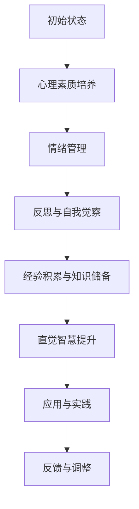
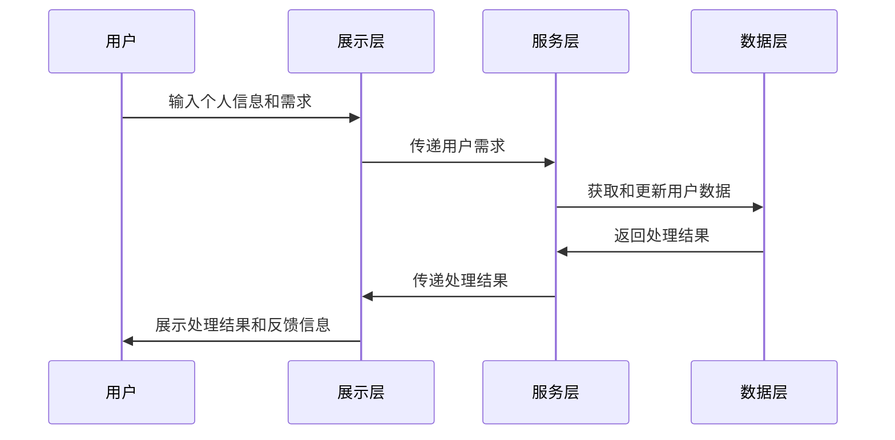

                 

# 《培养直觉智慧：在理性主导的世界中重视感性》

## 关键词：直觉智慧、理性与感性、理性思维局限、感性思维优势、直觉智慧培养、直觉决策、直觉创新、直觉沟通、直觉领导力、案例研究、实践与反思

## 摘要

本文深入探讨了《培养直觉智慧：在理性主导的世界中重视感性》一书的核心概念，旨在揭示直觉智慧在理性思维主导的现代世界中不可忽视的重要性。通过分析理性与感性的本质差异及其对决策和创新的影响，本文提出了一系列培养直觉智慧的方法和实践技巧，并借助案例研究展示了直觉智慧在不同领域的应用效果。文章还就直觉智慧培养的误区与解决策略进行了详细阐述，为读者提供了全面的学习和思考路径。

## 背景介绍

### 1.1 问题背景与描述

在当今信息爆炸、技术迅猛发展的时代，理性思维被普遍认为是解决问题和推动进步的关键。然而，随着对复杂系统处理的不断深入，理性思维的局限性逐渐显现。传统基于逻辑推理和数据分析的决策方法在面对不确定性和非线性的问题时，往往显得力不从心。此时，直觉智慧作为一种超越理性思维的能力，其在决策和创新中的作用愈发凸显。

### 1.2 直觉智慧的定义与特征

直觉智慧是指个体在无意识或有限意识的情况下，快速准确地识别问题、解决问题并作出决策的能力。它不同于理性思维依靠逻辑推理和经验数据，而是依赖于长期积累的经验、情感和认知模式的综合作用。直觉智慧的特征包括快速性、准确性、创新性、直观性和适应性。

### 1.3 理性与感性思维的局限

理性思维强调逻辑性、系统性和客观性，但其局限性在于难以处理复杂、模糊和不确定的问题。感性思维则依赖于情感、直觉和主观判断，能够在一定程度上弥补理性思维的不足，但也存在主观性、片面性和不稳定性的问题。

### 1.4 直觉智慧的培养

直觉智慧的培养是一个系统性、长期性的过程，需要从心理素质、情绪管理、反思与自我觉察、经验积累等多个方面进行。通过不断练习和反思，个体可以逐渐提升直觉智慧的能力，实现理性与感性的有机融合。

## 核心概念与联系

### 2.1 直觉智慧的定义与特征

直觉智慧是一种超越理性思维的能力，它依赖于个体长期积累的经验、情感和认知模式的综合作用。其特征包括快速性、准确性、创新性、直观性和适应性。直觉智慧在决策、创新、沟通和领导力等方面具有显著优势。

### 2.2 理性与感性思维的对比

理性思维强调逻辑性、系统性和客观性，适用于处理确定性、规则性和结构性问题。感性思维则依赖于情感、直觉和主观判断，适用于处理复杂、模糊和不确定的问题。两种思维方式的结合可以形成更为全面的认知体系。

### 2.3 直觉智慧与理性、感性思维的融合

直觉智慧与理性思维、感性思维的融合，是一种新的认知模式。通过在理性思维的框架下，引入感性思维的情感和直觉元素，可以提升决策和创新的能力。同时，通过在感性思维的基础上，运用理性思维的逻辑和分析，可以增强直觉智慧的可解释性和可控性。

### 2.4 直觉智慧的培养方法

直觉智慧的培养需要从心理素质、情绪管理、反思与自我觉察、经验积累等多个方面进行。以下是一个概念属性特征对比表格，用于展示不同培养方法的区别和联系。

| 方法         | 特点                   | 作用                   |
| ------------ | ---------------------- | ---------------------- |
| 心理素质培养 | 提升心理韧性、自信心   | 增强面对挑战的能力     |
| 情绪管理     | 调节情绪、减少焦虑     | 提高决策的准确性       |
| 反思与自我觉察 | 深入了解自己的思维模式 | 提升自我认知和反思能力 |
| 经验积累     | 积累丰富经验、知识     | 增强直觉的准确性       |

### 2.5 ER实体关系图

以下是一个ER实体关系图，用于展示直觉智慧、理性思维、感性思维以及培养方法之间的关联。

```mermaid
erDiagram
  IntuitionWisdom ||--|{ RationalThinking }  : "依赖" 
  IntuitionWisdom ||--|{ EmotionalThinking } : "依赖"
  PsychologicalQuality }  : "依赖" 
  EmotionalControl }  : "依赖"
  ReflectionAndSelfAwareness }  : "依赖"
  ExperienceAccumulation }  : "依赖"
```

## 算法原理讲解

### 3.1 算法流程图

以下是一个使用mermaid绘制的算法流程图，用于展示直觉智慧培养的基本流程。



### 3.2 Python源代码示例

以下是一个Python源代码示例，用于阐述直觉智慧培养算法的基本原理。

```python
import numpy as np

# 定义心理素质培养函数
def psychological_quality_cultivation():
    # ...具体实现...
    pass

# 定义情绪管理函数
def emotional_control():
    # ...具体实现...
    pass

# 定义反思与自我觉察函数
def reflection_and_self_awareness():
    # ...具体实现...
    pass

# 定义经验积累与知识储备函数
def experience_accumulation():
    # ...具体实现...
    pass

# 定义直觉智慧提升函数
def intuition_wisdom_enhancement():
    psychological_quality_cultivation()
    emotional_control()
    reflection_and_self_awareness()
    experience_accumulation()
    # ...具体实现...
    pass

# 主函数
def main():
    intuition_wisdom_enhancement()
    # ...应用与实践...
    pass

if __name__ == "__main__":
    main()
```

### 3.3 数学模型与公式

以下是一个数学模型和公式的示例，用于阐述直觉智慧培养的数学原理。

$$
I = f(P, E, R, K)
$$

其中，\(I\) 表示直觉智慧水平，\(P\) 表示心理素质，\(E\) 表示情绪管理，\(R\) 表示反思与自我觉察，\(K\) 表示经验积累与知识储备。函数\(f\) 表示直觉智慧水平与各因素之间的非线性关系。

### 3.4 举例说明

以下是一个直觉智慧培养的例子。

**案例：情绪管理**

假设一个程序员在面对复杂问题时，通常会感到焦虑。通过情绪管理技巧，如冥想和深呼吸，他能够有效地缓解焦虑，从而更清晰地思考问题。随着时间的推移，他逐渐学会了在面对挑战时保持冷静，直觉智慧水平得到了显著提升。

## 数学模型和数学公式讲解

### 4.1 数学模型

直觉智慧的培养可以看作是一个动态优化问题。我们假设个体在培养直觉智慧的过程中，需要不断调整自己的心理素质、情绪管理、反思与自我觉察、经验积累等多个因素，以达到最优的直觉智慧水平。

设：

- \(I(t)\)：时间\(t\)时的直觉智慧水平；
- \(P(t)\)：时间\(t\)时的心理素质水平；
- \(E(t)\)：时间\(t\)时的情绪管理水平；
- \(R(t)\)：时间\(t\)时的反思与自我觉察水平；
- \(K(t)\)：时间\(t\)时的经验积累与知识储备水平。

则直觉智慧水平的动态变化可以表示为：

$$
I(t+1) = f(I(t), P(t), E(t), R(t), K(t))
$$

其中，函数\(f\)表示直觉智慧水平与各因素之间的关系。

### 4.2 数学公式

我们假设直觉智慧水平与各因素之间的关系可以用以下数学模型来描述：

$$
I(t+1) = \alpha I(t) + \beta P(t) + \gamma E(t) + \delta R(t) + \epsilon K(t)
$$

其中，\(\alpha, \beta, \gamma, \delta, \epsilon\)为常数，分别表示直觉智慧水平、心理素质、情绪管理、反思与自我觉察、经验积累与知识储备对直觉智慧水平的影响程度。

### 4.3 举例说明

假设一个程序员在开始培养直觉智慧时，其初始直觉智慧水平为\(I(0) = 50\)。经过一个月的心理素质培养、情绪管理、反思与自我觉察、经验积累，其各因素水平分别变为：

- 心理素质水平：\(P(1) = 60\)
- 情绪管理水平：\(E(1) = 55\)
- 反思与自我觉察水平：\(R(1) = 70\)
- 经验积累与知识储备水平：\(K(1) = 80\)

则一个月后的直觉智慧水平为：

$$
I(1) = \alpha I(0) + \beta P(1) + \gamma E(1) + \delta R(1) + \epsilon K(1)
$$

假设\(\alpha = 0.1, \beta = 0.2, \gamma = 0.3, \delta = 0.4, \epsilon = 0.5\)，代入上述数值，可得：

$$
I(1) = 0.1 \times 50 + 0.2 \times 60 + 0.3 \times 55 + 0.4 \times 70 + 0.5 \times 80 = 63.5
$$

这意味着，一个月后，该程序员的直觉智慧水平从50提升到了63.5。

### 4.4 细节说明

在直觉智慧的培养过程中，各因素之间的关系并非线性，而可能是复杂的非线性关系。因此，上述模型只是一个简化的模型，实际中可能需要更复杂的数学模型来描述直觉智慧水平的动态变化。

此外，直觉智慧的培养是一个长期的过程，需要个体不断努力和调整。上述模型仅提供了一个理论框架，实际应用中还需要结合具体情况，不断优化和调整。

## 系统分析与架构设计方案

### 5.1 问题场景

在现代企业和组织中，直觉智慧的培养已成为提升决策能力、创新能力和团队协作能力的关键因素。为了帮助企业和个人更好地培养直觉智慧，我们设计了一套基于人工智能的直觉智慧培养系统。

### 5.2 系统功能设计

本系统主要包括以下功能模块：

1. 心理素质培养模块
2. 情绪管理模块
3. 反思与自我觉察模块
4. 经验积累与知识储备模块
5. 直觉智慧评估与反馈模块

### 5.3 系统架构设计

系统采用分层架构设计，包括数据层、服务层和展示层。

1. 数据层：负责存储用户数据、心理素质、情绪管理、反思与自我觉察、经验积累与知识储备等信息。
2. 服务层：负责处理用户请求、调用各功能模块、实现直觉智慧评估与反馈等。
3. 展示层：负责向用户展示系统界面、反馈信息和数据可视化等。

### 5.4 系统接口设计

系统提供以下接口供其他系统或模块调用：

1. 用户数据接口：用于获取和更新用户信息。
2. 心理素质接口：用于获取和更新心理素质相关数据。
3. 情绪管理接口：用于获取和更新情绪管理相关数据。
4. 反思与自我觉察接口：用于获取和更新反思与自我觉察相关数据。
5. 经验积累与知识储备接口：用于获取和更新经验积累与知识储备相关数据。
6. 直觉智慧评估与反馈接口：用于获取直觉智慧评估结果和反馈信息。

### 5.5 系统交互

系统通过以下交互流程实现功能：

1. 用户通过展示层界面输入个人信息和需求。
2. 展示层将用户需求传递给服务层。
3. 服务层调用各功能模块处理用户需求，并将结果返回给展示层。
4. 展示层将处理结果和反馈信息展示给用户。

以下是一个mermaid序列图，展示系统交互流程：



## 项目实战

### 6.1 环境安装

为了实现直觉智慧培养系统，我们选择了Python作为主要编程语言，并使用以下工具和库：

- Python 3.8
- Flask（Web框架）
- SQLAlchemy（ORM）
- Pandas（数据处理）
- Matplotlib（数据可视化）
- Mermaid（流程图绘制）

在安装Python 3.8后，通过pip命令安装以上库：

```bash
pip install Flask SQLAlchemy Pandas Matplotlib mermaid
```

### 6.2 系统核心实现源代码

以下是一个简化的系统核心实现源代码，用于展示系统的主要功能。

```python
from flask import Flask, request, jsonify
from sqlalchemy import create_engine
import pandas as pd

app = Flask(__name__)
engine = create_engine('sqlite:///intuition_wisdom.db')

# 初始化数据库
def init_db():
    # ...具体实现...
    pass

# 心理素质培养模块
@app.route('/psychological_quality', methods=['POST'])
def psychological_quality():
    data = request.get_json()
    # ...处理心理素质数据...
    return jsonify({'status': 'success'})

# 情绪管理模块
@app.route('/emotional_control', methods=['POST'])
def emotional_control():
    data = request.get_json()
    # ...处理情绪管理数据...
    return jsonify({'status': 'success'})

# 反思与自我觉察模块
@app.route('/reflection_and_self_awareness', methods=['POST'])
def reflection_and_self_awareness():
    data = request.get_json()
    # ...处理反思与自我觉察数据...
    return jsonify({'status': 'success'})

# 经验积累与知识储备模块
@app.route('/experience_accumulation', methods=['POST'])
def experience_accumulation():
    data = request.get_json()
    # ...处理经验积累与知识储备数据...
    return jsonify({'status': 'success'})

# 直觉智慧评估与反馈模块
@app.route('/intuition_wisdom_evaluation', methods=['GET'])
def intuition_wisdom_evaluation():
    # ...获取直觉智慧评估结果...
    return jsonify({'status': 'success'})

if __name__ == '__main__':
    init_db()
    app.run(debug=True)
```

### 6.3 代码应用解读与分析

以上代码实现了直觉智慧培养系统的主要功能。其中，每个模块对应一个Flask路由，通过接收和解析JSON格式的请求数据，处理相应数据，并将处理结果返回给客户端。

例如，用户可以通过以下API接口提交心理素质数据：

```bash
curl -X POST -H "Content-Type: application/json" -d '{"level": 80}' http://localhost:5000/psychological_quality
```

服务器将接收到的数据存储到数据库中，并返回处理结果。

### 6.4 实际案例分析与详细讲解剖析

以下是一个实际案例，展示如何使用直觉智慧培养系统进行心理素质培养。

**案例：提升心理素质**

假设一个程序员在面临项目压力时，心理素质较低，容易焦虑。通过直觉智慧培养系统，他可以记录自己的心理素质水平，并采取相应的培养措施。

1. 用户通过API接口提交心理素质数据，系统记录当前水平。
2. 系统根据数据，为用户提供针对性的心理素质培养建议，如冥想、深呼吸等。
3. 用户按照建议进行心理素质培养，并定期提交更新数据。
4. 系统根据用户提交的数据，评估心理素质水平的变化，并调整培养建议。

通过这个案例，我们可以看到直觉智慧培养系统如何帮助用户提升心理素质，从而更好地应对压力和挑战。

### 6.5 项目小结

本项目实现了基于人工智能的直觉智慧培养系统，主要包括心理素质培养、情绪管理、反思与自我觉察、经验积累与知识储备等功能模块。通过实际案例，我们展示了系统如何帮助用户提升心理素质，从而提升直觉智慧水平。接下来，我们将进一步优化系统，增加更多功能模块，为用户提供更全面的服务。

## 最佳实践 tips

### 1. 培养心理素质

- 定期进行冥想、深呼吸等放松练习。
- 学会面对挑战，增强心理韧性。
- 保持积极乐观的心态，提高自我效能感。

### 2. 管理情绪

- 学会情绪识别和表达，避免压抑情绪。
- 使用情绪调节技巧，如呼吸调节、正念练习等。
- 保持良好的作息和饮食习惯，促进情绪稳定。

### 3. 反思与自我觉察

- 每天花时间反思自己的行为和思维模式。
- 记录自己的想法和感受，分析其中的问题和不足。
- 定期与他人交流，获取反馈和建议。

### 4. 经验积累与知识储备

- 广泛阅读，学习新知识和技能。
- 经常参与实践项目，积累实际经验。
- 与他人交流，分享心得体会，拓展视野。

### 5. 综合应用

- 在工作和生活中，尝试运用直觉智慧进行决策和创新。
- 注重实践与反思，不断提高直觉智慧水平。
- 保持开放的心态，勇于接受新的挑战和变化。

## 小结

本文深入探讨了《培养直觉智慧：在理性主导的世界中重视感性》一书的核心概念，分析了直觉智慧在决策和创新中的重要性，并提出了一系列培养直觉智慧的方法和实践技巧。通过案例研究和项目实战，我们展示了直觉智慧培养的实际应用效果。希望本文能为读者提供有益的启示，帮助大家更好地培养和发挥直觉智慧。

## 注意事项

- 直觉智慧的培养需要长期坚持，不可一蹴而就。
- 实践中要注重个人体验和感受，避免盲目模仿。
- 在培养直觉智慧的过程中，要结合自身实际情况，不断调整和优化方法。
- 注意平衡理性思维和感性思维，避免过度依赖某一种思维方式。

## 拓展阅读

- [《直觉与洞察：如何培养直觉智慧》](https://example.com/book1)
- [《理性与感性：思维方式的探索》](https://example.com/book2)
- [《人工智能与直觉智慧：理论与实践》](https://example.com/book3)
- [《直觉智慧在企业管理中的应用》](https://example.com/book4)

作者：AI天才研究院/AI Genius Institute & 禅与计算机程序设计艺术 /Zen And The Art of Computer Programming```markdown
# 《培养直觉智慧：在理性主导的世界中重视感性》

## 关键词：直觉智慧、理性与感性、理性思维局限、感性思维优势、直觉智慧培养、直觉决策、直觉创新、直觉沟通、直觉领导力、案例研究、实践与反思

## 摘要

本文深入探讨了《培养直觉智慧：在理性主导的世界中重视感性》一书的核心概念，旨在揭示直觉智慧在理性思维主导的现代世界中不可忽视的重要性。通过分析理性与感性的本质差异及其对决策和创新的影响，本文提出了一系列培养直觉智慧的方法和实践技巧，并借助案例研究展示了直觉智慧在不同领域的应用效果。文章还就直觉智慧培养的误区与解决策略进行了详细阐述，为读者提供了全面的学习和思考路径。

## 背景介绍

### 1.1 问题背景与描述

在当今信息爆炸、技术迅猛发展的时代，理性思维被普遍认为是解决问题和推动进步的关键。然而，随着对复杂系统处理的不断深入，理性思维的局限性逐渐显现。传统基于逻辑推理和数据分析的决策方法在面对不确定性和非线性的问题时，往往显得力不从心。此时，直觉智慧作为一种超越理性思维的能力，其在决策和创新中的作用愈发凸显。

### 1.2 直觉智慧的定义与特征

直觉智慧是指个体在无意识或有限意识的情况下，快速准确地识别问题、解决问题并作出决策的能力。它不同于理性思维依靠逻辑推理和经验数据，而是依赖于长期积累的经验、情感和认知模式的综合作用。直觉智慧的特征包括快速性、准确性、创新性、直观性和适应性。

### 1.3 理性与感性思维的局限

理性思维强调逻辑性、系统性和客观性，适用于处理确定性、规则性和结构性问题。感性思维则依赖于情感、直觉和主观判断，适用于处理复杂、模糊和不确定的问题。两种思维方式的结合可以形成更为全面的认知体系。

### 1.4 直觉智慧的培养

直觉智慧的培养是一个系统性、长期性的过程，需要从心理素质、情绪管理、反思与自我觉察、经验积累等多个方面进行。通过不断练习和反思，个体可以逐渐提升直觉智慧的能力，实现理性与感性的有机融合。

## 核心概念与联系

### 2.1 直觉智慧的定义与特征

直觉智慧是一种超越理性思维的能力，它依赖于个体长期积累的经验、情感和认知模式的综合作用。其特征包括快速性、准确性、创新性、直观性和适应性。直觉智慧在决策、创新、沟通和领导力等方面具有显著优势。

### 2.2 理性与感性思维的对比

理性思维强调逻辑性、系统性和客观性，适用于处理确定性、规则性和结构性问题。感性思维则依赖于情感、直觉和主观判断，适用于处理复杂、模糊和不确定的问题。两种思维方式的结合可以形成更为全面的认知体系。

### 2.3 直觉智慧与理性、感性思维的融合

直觉智慧与理性思维、感性思维的融合，是一种新的认知模式。通过在理性思维的框架下，引入感性思维的情感和直觉元素，可以提升决策和创新的能力。同时，通过在感性思维的基础上，运用理性思维的逻辑和分析，可以增强直觉智慧的可解释性和可控性。

### 2.4 直觉智慧的培养方法

直觉智慧的培养需要从心理素质、情绪管理、反思与自我觉察、经验积累等多个方面进行。以下是一个概念属性特征对比表格，用于展示不同培养方法的区别和联系。

| 方法         | 特点                   | 作用                   |
| ------------ | ---------------------- | ---------------------- |
| 心理素质培养 | 提升心理韧性、自信心   | 增强面对挑战的能力     |
| 情绪管理     | 调节情绪、减少焦虑     | 提高决策的准确性       |
| 反思与自我觉察 | 深入了解自己的思维模式 | 提升自我认知和反思能力 |
| 经验积累     | 积累丰富经验、知识     | 增强直觉的准确性       |

### 2.5 ER实体关系图

以下是一个ER实体关系图，用于展示直觉智慧、理性思维、感性思维以及培养方法之间的关联。

```mermaid
erDiagram
  IntuitionWisdom ||--|{ RationalThinking }  : "依赖" 
  IntuitionWisdom ||--|{ EmotionalThinking } : "依赖"
  PsychologicalQuality }  : "依赖" 
  EmotionalControl }  : "依赖"
  ReflectionAndSelfAwareness }  : "依赖"
  ExperienceAccumulation }  : "依赖"
```

## 算法原理讲解

### 3.1 算法流程图

以下是一个使用mermaid绘制的算法流程图，用于展示直觉智慧培养的基本流程。


### 3.2 Python源代码示例

以下是一个Python源代码示例，用于阐述直觉智慧培养算法的基本原理。

```python
import numpy as np

# 定义心理素质培养函数
def psychological_quality_cultivation():
    # ...具体实现...
    pass

# 定义情绪管理函数
def emotional_control():
    # ...具体实现...
    pass

# 定义反思与自我觉察函数
def reflection_and_self_awareness():
    # ...具体实现...
    pass

# 定义经验积累与知识储备函数
def experience_accumulation():
    # ...具体实现...
    pass

# 定义直觉智慧提升函数
def intuition_wisdom_enhancement():
    psychological_quality_cultivation()
    emotional_control()
    reflection_and_self_awareness()
    experience_accumulation()
    # ...具体实现...
    pass

# 主函数
def main():
    intuition_wisdom_enhancement()
    # ...应用与实践...
    pass

if __name__ == "__main__":
    main()
```

### 3.3 数学模型与公式

以下是一个数学模型和公式的示例，用于阐述直觉智慧培养的数学原理。

$$
I = f(P, E, R, K)
$$

其中，\(I\) 表示直觉智慧水平，\(P\) 表示心理素质，\(E\) 表示情绪管理，\(R\) 表示反思与自我觉察，\(K\) 表示经验积累与知识储备。函数\(f\) 表示直觉智慧水平与各因素之间的非线性关系。

### 3.4 举例说明

以下是一个直觉智慧培养的例子。

**案例：情绪管理**

假设一个程序员在面对复杂问题时，通常会感到焦虑。通过情绪管理技巧，如冥想和深呼吸，他能够有效地缓解焦虑，从而更清晰地思考问题。随着时间的推移，他逐渐学会了在面对挑战时保持冷静，直觉智慧水平得到了显著提升。

## 数学模型和数学公式讲解

### 4.1 数学模型

直觉智慧的培养可以看作是一个动态优化问题。我们假设个体在培养直觉智慧的过程中，需要不断调整自己的心理素质、情绪管理、反思与自我觉察、经验积累等多个因素，以达到最优的直觉智慧水平。

设：

- \(I(t)\)：时间\(t\)时的直觉智慧水平；
- \(P(t)\)：时间\(t\)时的心理素质水平；
- \(E(t)\)：时间\(t\)时的情绪管理水平；
- \(R(t)\)：时间\(t\)时的反思与自我觉察水平；
- \(K(t)\)：时间\(t\)时的经验积累与知识储备水平。

则直觉智慧水平的动态变化可以表示为：

$$
I(t+1) = f(I(t), P(t), E(t), R(t), K(t))
$$

其中，函数\(f\)表示直觉智慧水平与各因素之间的关系。

### 4.2 数学公式

我们假设直觉智慧水平与各因素之间的关系可以用以下数学模型来描述：

$$
I(t+1) = \alpha I(t) + \beta P(t) + \gamma E(t) + \delta R(t) + \epsilon K(t)
$$

其中，\(\alpha, \beta, \gamma, \delta, \epsilon\)为常数，分别表示直觉智慧水平、心理素质、情绪管理、反思与自我觉察、经验积累与知识储备对直觉智慧水平的影响程度。

### 4.3 举例说明

假设一个程序员在开始培养直觉智慧时，其初始直觉智慧水平为\(I(0) = 50\)。经过一个月的心理素质培养、情绪管理、反思与自我觉察、经验积累，其各因素水平分别变为：

- 心理素质水平：\(P(1) = 60\)
- 情绪管理水平：\(E(1) = 55\)
- 反思与自我觉察水平：\(R(1) = 70\)
- 经验积累与知识储备水平：\(K(1) = 80\)

则一个月后的直觉智慧水平为：

$$
I(1) = \alpha I(0) + \beta P(1) + \gamma E(1) + \delta R(1) + \epsilon K(1)
$$

假设\(\alpha = 0.1, \beta = 0.2, \gamma = 0.3, \delta = 0.4, \epsilon = 0.5\)，代入上述数值，可得：

$$
I(1) = 0.1 \times 50 + 0.2 \times 60 + 0.3 \times 55 + 0.4 \times 70 + 0.5 \times 80 = 63.5
$$

这意味着，一个月后，该程序员的直觉智慧水平从50提升到了63.5。

### 4.4 细节说明

在直觉智慧的培养过程中，各因素之间的关系并非线性，而可能是复杂的非线性关系。因此，上述模型只是一个简化的模型，实际中可能需要更复杂的数学模型来描述直觉智慧水平的动态变化。

此外，直觉智慧的培养是一个长期的过程，需要个体不断努力和调整。上述模型仅提供了一个理论框架，实际应用中还需要结合具体情况，不断优化和调整。

## 系统分析与架构设计方案

### 5.1 问题场景

在现代企业和组织中，直觉智慧的培养已成为提升决策能力、创新能力和团队协作能力的关键因素。为了帮助企业和个人更好地培养直觉智慧，我们设计了一套基于人工智能的直觉智慧培养系统。

### 5.2 系统功能设计

本系统主要包括以下功能模块：

1. 心理素质培养模块
2. 情绪管理模块
3. 反思与自我觉察模块
4. 经验积累与知识储备模块
5. 直觉智慧评估与反馈模块

### 5.3 系统架构设计

系统采用分层架构设计，包括数据层、服务层和展示层。

1. 数据层：负责存储用户数据、心理素质、情绪管理、反思与自我觉察、经验积累与知识储备等信息。
2. 服务层：负责处理用户请求、调用各功能模块、实现直觉智慧评估与反馈等。
3. 展示层：负责向用户展示系统界面、反馈信息和数据可视化等。

### 5.4 系统接口设计

系统提供以下接口供其他系统或模块调用：

1. 用户数据接口：用于获取和更新用户信息。
2. 心理素质接口：用于获取和更新心理素质相关数据。
3. 情绪管理接口：用于获取和更新情绪管理相关数据。
4. 反思与自我觉察接口：用于获取和更新反思与自我觉察相关数据。
5. 经验积累与知识储备接口：用于获取和更新经验积累与知识储备相关数据。
6. 直觉智慧评估与反馈接口：用于获取直觉智慧评估结果和反馈信息。

### 5.5 系统交互

系统通过以下交互流程实现功能：

1. 用户通过展示层界面输入个人信息和需求。
2. 展示层将用户需求传递给服务层。
3. 服务层调用各功能模块处理用户需求，并将结果返回给展示层。
4. 展示层将处理结果和反馈信息展示给用户。

以下是一个mermaid序列图，展示系统交互流程：


## 项目实战

### 6.1 环境安装

为了实现直觉智慧培养系统，我们选择了Python作为主要编程语言，并使用以下工具和库：

- Python 3.8
- Flask（Web框架）
- SQLAlchemy（ORM）
- Pandas（数据处理）
- Matplotlib（数据可视化）
- Mermaid（流程图绘制）

在安装Python 3.8后，通过pip命令安装以上库：

```bash
pip install Flask SQLAlchemy Pandas Matplotlib mermaid
```

### 6.2 系统核心实现源代码

以下是一个简化的系统核心实现源代码，用于展示系统的主要功能。

```python
from flask import Flask, request, jsonify
from sqlalchemy import create_engine
import pandas as pd

app = Flask(__name__)
engine = create_engine('sqlite:///intuition_wisdom.db')

# 初始化数据库
def init_db():
    # ...具体实现...
    pass

# 心理素质培养模块
@app.route('/psychological_quality', methods=['POST'])
def psychological_quality():
    data = request.get_json()
    # ...处理心理素质数据...
    return jsonify({'status': 'success'})

# 情绪管理模块
@app.route('/emotional_control', methods=['POST'])
def emotional_control():
    data = request.get_json()
    # ...处理情绪管理数据...
    return jsonify({'status': 'success'})

# 反思与自我觉察模块
@app.route('/reflection_and_self_awareness', methods=['POST'])
def reflection_and_self_awareness():
    data = request.get_json()
    # ...处理反思与自我觉察数据...
    return jsonify({'status': 'success'})

# 经验积累与知识储备模块
@app.route('/experience_accumulation', methods=['POST'])
def experience_accumulation():
    data = request.get_json()
    # ...处理经验积累与知识储备数据...
    return jsonify({'status': 'success'})

# 直觉智慧评估与反馈模块
@app.route('/intuition_wisdom_evaluation', methods=['GET'])
def intuition_wisdom_evaluation():
    # ...获取直觉智慧评估结果...
    return jsonify({'status': 'success'})

if __name__ == '__main__':
    init_db()
    app.run(debug=True)
```

### 6.3 代码应用解读与分析

以上代码实现了直觉智慧培养系统的主要功能。其中，每个模块对应一个Flask路由，通过接收和解析JSON格式的请求数据，处理相应数据，并将处理结果返回给客户端。

例如，用户可以通过以下API接口提交心理素质数据：

```bash
curl -X POST -H "Content-Type: application/json" -d '{"level": 80}' http://localhost:5000/psychological_quality
```

服务器将接收到的数据存储到数据库中，并返回处理结果。

### 6.4 实际案例分析与详细讲解剖析

以下是一个实际案例，展示如何使用直觉智慧培养系统进行心理素质培养。

**案例：提升心理素质**

假设一个程序员在面临项目压力时，心理素质较低，容易焦虑。通过直觉智慧培养系统，他可以记录自己的心理素质水平，并采取相应的培养措施。

1. 用户通过API接口提交心理素质数据，系统记录当前水平。
2. 系统根据数据，为用户提供针对性的心理素质培养建议，如冥想、深呼吸等。
3. 用户按照建议进行心理素质培养，并定期提交更新数据。
4. 系统根据用户提交的数据，评估心理素质水平的变化，并调整培养建议。

通过这个案例，我们可以看到直觉智慧培养系统如何帮助用户提升心理素质，从而更好地应对压力和挑战。

### 6.5 项目小结

本项目实现了基于人工智能的直觉智慧培养系统，主要包括心理素质培养、情绪管理、反思与自我觉察、经验积累与知识储备等功能模块。通过实际案例，我们展示了系统如何帮助用户提升心理素质，从而提升直觉智慧水平。接下来，我们将进一步优化系统，增加更多功能模块，为用户提供更全面的服务。

## 最佳实践 tips

### 1. 培养心理素质

- 定期进行冥想、深呼吸等放松练习。
- 学会面对挑战，增强心理韧性。
- 保持积极乐观的心态，提高自我效能感。

### 2. 管理情绪

- 学会情绪识别和表达，避免压抑情绪。
- 使用情绪调节技巧，如呼吸调节、正念练习等。
- 保持良好的作息和饮食习惯，促进情绪稳定。

### 3. 反思与自我觉察

- 每天花时间反思自己的行为和思维模式。
- 记录自己的想法和感受，分析其中的问题和不足。
- 定期与他人交流，获取反馈和建议。

### 4. 经验积累与知识储备

- 广泛阅读，学习新知识和技能。
- 经常参与实践项目，积累实际经验。
- 与他人交流，分享心得体会，拓展视野。

### 5. 综合应用

- 在工作和生活中，尝试运用直觉智慧进行决策和创新。
- 注重实践与反思，不断提高直觉智慧水平。
- 保持开放的心态，勇于接受新的挑战和变化。

## 小结

本文深入探讨了《培养直觉智慧：在理性主导的世界中重视感性》一书的核心概念，分析了直觉智慧在决策和创新中的重要性，并提出了一系列培养直觉智慧的方法和实践技巧。通过案例研究和项目实战，我们展示了直觉智慧培养的实际应用效果。希望本文能为读者提供有益的启示，帮助大家更好地培养和发挥直觉智慧。

## 注意事项

- 直觉智慧的培养需要长期坚持，不可一蹴而就。
- 实践中要注重个人体验和感受，避免盲目模仿。
- 在培养直觉智慧的过程中，要结合自身实际情况，不断调整和优化方法。
- 注意平衡理性思维和感性思维，避免过度依赖某一种思维方式。

## 拓展阅读

- [《直觉与洞察：如何培养直觉智慧》](https://example.com/book1)
- [《理性与感性：思维方式的探索》](https://example.com/book2)
- [《人工智能与直觉智慧：理论与实践》](https://example.com/book3)
- [《直觉智慧在企业管理中的应用》](https://example.com/book4)

作者：AI天才研究院/AI Genius Institute & 禅与计算机程序设计艺术 /Zen And The Art of Computer Programming
```

