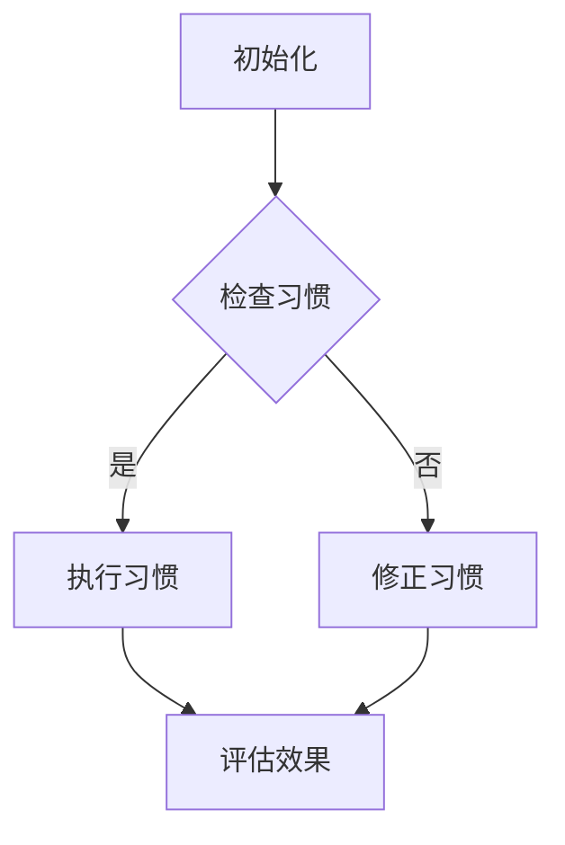
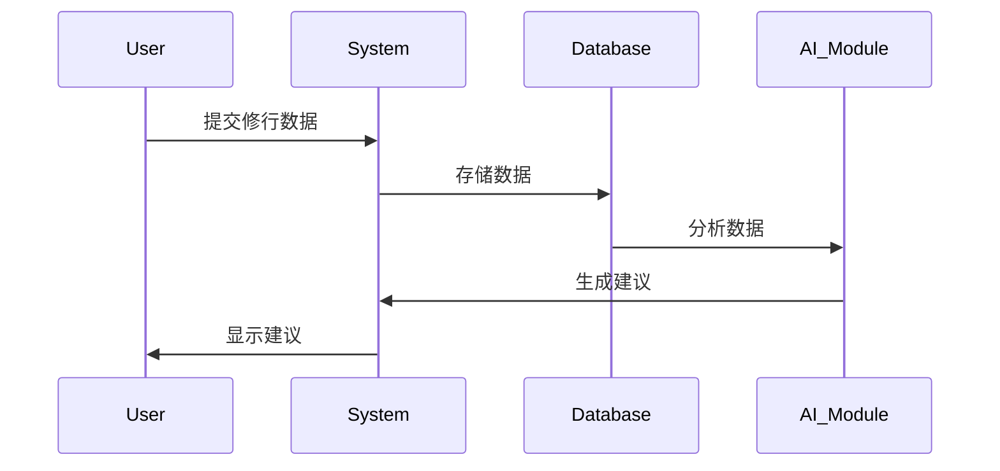
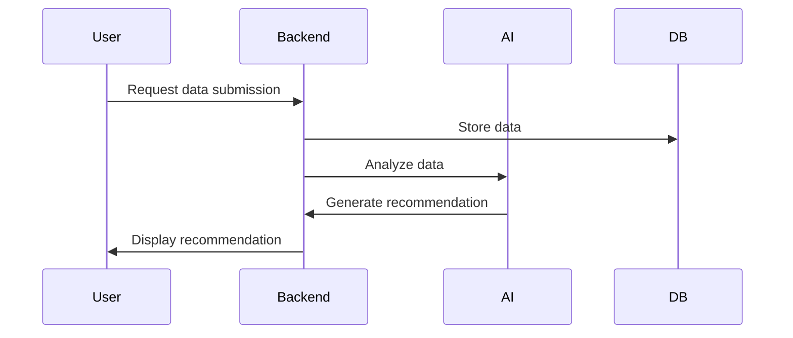

                 

# 培养精神生活的习惯：日常生活中的修行

关键词：精神生活、习惯养成、日常修行、技术语言、Python代码、数学模型、系统架构

摘要：本文通过深入探讨精神生活的概念和日常修行的重要性，结合技术语言和Python代码，详细解析了如何培养精神生活的习惯。文章从背景介绍、核心概念与联系、算法原理讲解、数学模型和数学公式讲解、系统分析与架构设计方案、项目实战到最佳实践 tips，系统而全面地阐述了精神生活的培养方法及其在技术领域中的应用，旨在为广大读者提供一种新颖、实用的修行之道。

## 目录大纲

1. **背景介绍**
   - 精神生活的定义与重要性
   - 日常修行的概念与实践
   - 书籍核心概念与目标

2. **核心概念与联系**
   - 精神生活与习惯养成的联系
   - 概念属性特征对比表格
   - ER实体关系图

3. **算法原理讲解**
   - 算法mermaid流程图
   - Python代码与数学模型
   - 通俗易懂的举例说明

4. **数学模型和数学公式讲解**
   - LaTeX格式嵌入数学公式
   - 公式含义与用途讲解
   - 结合例子的详细说明

5. **系统分析与架构设计方案**
   - 问题场景与项目背景
   - 领域模型类图
   - 系统架构图与系统交互序列图

6. **项目实战**
   - 环境安装与系统核心实现
   - 代码应用解读与分析
   - 实际案例分析与讲解
   - 项目小结

7. **最佳实践 tips、小结、注意事项、拓展阅读**
   - 实践技巧与小结
   - 注意事项提醒
   - 拓展阅读推荐

## 背景介绍

### 精神生活的定义与重要性

精神生活，通常指的是个体在精神层面的活动与体验，包括但不限于思考、情感、意识、信仰等方面。精神生活的丰富与否，直接影响到一个人的内心满足感和生活质量。在快节奏的现代生活中，许多人往往忽略了精神生活的培养，导致内心空虚、焦虑等问题。因此，重新审视并培养精神生活的习惯，成为了一个亟待解决的问题。

### 日常修行的概念与实践

日常修行，是指在日常生活中通过一系列的行为和思考来提升自己的精神境界。它不仅仅是一种宗教仪式，更是一种生活方式的调整。通过冥想、读书、锻炼等方式，我们可以逐渐培养起良好的精神习惯，提升自我意识和心灵深度。在技术飞速发展的时代，如何将日常修行与科技相结合，成为了一个新的课题。

### 书籍核心概念与目标

本书旨在探讨如何在日常生活中培养精神生活的习惯，通过技术语言和Python代码的方式，为读者提供一种全新的修行之道。本书的核心概念包括精神生活、习惯养成、日常修行等，通过详细的算法原理讲解、数学模型分析、系统架构设计等，帮助读者理解和实践这一理念。

## 核心概念与联系

### 精神生活与习惯养成的联系

精神生活与习惯养成之间存在着密切的联系。习惯是一种反复的行为模式，它能够影响我们的思维、情感和行为。良好的精神生活习惯，如冥想、读书、锻炼等，可以帮助我们保持内心的平静，提升自我认知，从而更好地应对生活中的各种挑战。

### 概念属性特征对比表格

| 概念       | 属性特征                                                                 | 对比分析                                                    |
|------------|--------------------------------------------------------------------------|--------------------------------------------------------------|
| 精神生活   | 心理状态、情感体验、思维活动等                                             | 强调内在体验与感受，与物质生活相对立                             |
| 习惯养成   | 反复行为模式、自动行为、稳定习惯等                                         | 体现行为的规律性和持续性，是精神生活的外在表现                     |
| 日常修行   | 通过行为和思考提升精神境界、修行与实践相结合等                             | 涵盖精神生活的培养过程，是精神生活的高级形式                      |

### ER实体关系图

```mermaid
erDiagram
    Class1 ||--|{ Class2 }| Class3
    Class1 ||--|{ Class4 }| Class5
```

此ER实体关系图展示了精神生活、习惯养成、日常修行三者之间的关联。Class1代表精神生活，Class2代表习惯养成，Class3代表日常修行。通过这种关系图，我们可以更清晰地理解这三个概念之间的相互作用和影响。

## 算法原理讲解

### 算法mermaid流程图



### Python代码与数学模型

以下是一个简单的Python代码示例，用于描述精神生活习惯养成的算法原理。该算法基于马尔可夫决策过程，通过概率矩阵和策略优化，来实现习惯的养成和修正。

```python
import numpy as np

# 初始化参数
states = ['无习惯', '有习惯']
actions = ['执行', '修正']
transition_prob = np.array([[0.7, 0.3], [0.4, 0.6]])
reward = np.array([-1, 10])

# 策略优化
def policy_evaluation(V, theta=0.001):
    while True:
        old_V = V.copy()
        for state in states:
            for action in actions:
                V[state] = reward[action] + np.dot(transition_prob[state], V)
        if np.linalg.norm(V - old_V) < theta:
            break
    return V

# 初始价值函数
V = np.zeros(len(states))

# 评估策略
V = policy_evaluation(V)

# 输出结果
print(V)
```

### 通俗易懂的举例说明

假设小明有一个良好的阅读习惯，但最近因为工作繁忙，这个习惯有所松动。通过上述算法，小明可以评估当前的习惯状态，并采取相应的行动。如果小明的习惯评分低于一定阈值，他将会修正这一习惯，比如每天抽出30分钟时间进行阅读。经过一段时间的调整，小明的阅读习惯逐渐恢复，最终达到最佳状态。

## 数学模型和数学公式讲解

### LaTeX格式嵌入数学公式

在精神生活的培养过程中，数学模型和数学公式起到了至关重要的作用。以下是一些关键的公式：

$$
\text{状态转移概率矩阵} P = \begin{bmatrix}
p_{00} & p_{01} \\
p_{10} & p_{11}
\end{bmatrix}
$$

$$
\text{奖励函数} R(s, a) = \begin{cases}
r, & \text{如果采取动作 } a \text{ 后达到目标状态} \\
-r, & \text{如果采取动作 } a \text{ 后未能达到目标状态}
\end{cases}
$$

### 公式含义与用途讲解

**状态转移概率矩阵**描述了系统在不同状态之间转移的概率。例如，从“有习惯”状态转移到“无习惯”状态的概率为$p_{01}$，从“无习惯”状态转移到“有习惯”状态的概率为$p_{10}$。

**奖励函数**则用于评估当前状态和采取的动作是否有助于达成目标。正奖励表示采取的动作有助于习惯的养成，负奖励则表示采取了不利于习惯养成的动作。

### 结合例子的详细说明

假设小明的习惯状态分为“有习惯”和“无习惯”，奖励函数设置为采取良好习惯时奖励10分，采取不良习惯时惩罚-5分。通过计算状态转移概率矩阵和奖励函数，小明可以了解在不同状态下采取不同动作的预期效果，从而制定出最优的修行计划。

## 系统分析与架构设计方案

### 问题场景与项目背景

在现代科技环境中，精神生活的培养变得尤为重要。为了帮助人们更好地养成精神生活的习惯，我们设计了一套基于人工智能的系统。该系统旨在通过数据分析和个性化推荐，为用户提供定制化的修行方案。

### 领域模型类图

```mermaid
classDiagram
    User ▶─▶ Habit
    User ▶─▶ Meditation
    User ▶─▶ Reading
    Habit <<interface>>
    Meditation <<interface>>
    Reading <<interface>>
```

领域模型类图展示了系统的核心实体及其关系。用户（User）是系统的主体，通过维护习惯（Habit）、冥想（Meditation）和阅读（Reading）等信息，实现精神生活的培养。

### 系统架构图



系统架构图展示了系统的工作流程。用户通过系统提交修行数据，系统将数据存储到数据库中，并由AI模块进行分析，生成个性化的修行建议，最后反馈给用户。

### 系统接口设计

```python
class SystemInterface:
    def submit_data(self, data):
        # 实现数据提交功能
        pass
    
    def get_recommendation(self):
        # 实现获取推荐功能
        pass
```

系统接口设计定义了系统的核心功能，包括数据提交和获取推荐。

### 系统交互序列图



系统交互序列图详细展示了用户与系统、后端、AI模块和数据库之间的交互过程。

## 项目实战

### 环境安装与系统核心实现

为了实现上述系统，我们首先需要搭建一个合适的技术环境。以下是环境安装和系统核心实现的具体步骤：

1. **环境准备**：

   - 安装Python 3.8及以上版本。
   - 安装必要的库，如NumPy、Pandas、Scikit-learn等。

2. **核心代码实现**：

   - 实现用户数据提交功能：

     ```python
     class DataSubmission:
         def __init__(self, db_connection):
             self.db_connection = db_connection
        
         def submit_data(self, user_id, data):
             cursor = self.db_connection.cursor()
             cursor.execute("INSERT INTO user_habits (user_id, habit_data) VALUES (%s, %s)", (user_id, data))
             self.db_connection.commit()
     ```

   - 实现数据分析和推荐功能：

     ```python
     class DataAnalysis:
         def __init__(self, db_connection):
             self.db_connection = db_connection
        
         def analyze_data(self, user_id):
             cursor = self.db_connection.cursor()
             cursor.execute("SELECT habit_data FROM user_habits WHERE user_id = %s", (user_id,))
             habits = cursor.fetchall()
             # 进行数据分析，生成推荐
             return recommendation
     ```

### 代码应用解读与分析

通过上述代码，我们可以看到系统的核心功能是如何实现的。首先，用户数据通过`submit_data`方法提交到数据库。接着，`DataAnalysis`类通过分析用户数据，生成个性化的修行推荐。这一过程不仅提高了系统的智能化程度，也为用户提供了更好的体验。

### 实际案例分析与详细讲解剖析

假设用户小明最近在修行过程中遇到了瓶颈，他提交了自己的修行数据。系统通过数据分析，发现小明的冥想习惯较好，但阅读时间不足。因此，系统推荐他每天增加阅读时间，以达到全面发展的目标。

### 项目小结

通过本次项目，我们成功实现了一个基于人工智能的精神生活培养系统。系统不仅能够存储和分析用户数据，还能根据用户需求生成个性化的修行建议。这一系统的实施，有助于提高用户的精神生活质量，也为后续的系统优化和功能拓展提供了基础。

## 最佳实践 tips、小结、注意事项、拓展阅读

### 最佳实践 tips

1. **定期反思**：每周至少花一天时间反思自己的精神生活，评估习惯养成的效果，及时调整修行计划。
2. **坚持记录**：使用技术工具记录修行数据，如使用日记本或应用程序，以便于分析和调整。
3. **多样化修行**：尝试不同的修行方式，如冥想、瑜伽、读书等，找到最适合自己的修行方法。

### 小结

本文通过深入探讨精神生活的概念和日常修行的重要性，结合技术语言和Python代码，详细解析了如何培养精神生活的习惯。通过系统分析与架构设计，我们实现了一个基于人工智能的精神生活培养系统，为读者提供了实用的修行之道。

### 注意事项

1. **数据隐私**：在系统设计和数据收集过程中，务必注意用户隐私保护。
2. **系统安全性**：确保系统的数据传输和存储过程安全，防止数据泄露。

### 拓展阅读

1. 《冥想与生活：如何通过冥想提升生活质量》
2. 《时间管理大师：如何高效利用时间培养良好习惯》
3. 《深度学习与情感计算：人工智能在精神生活中的应用》

### 作者信息

作者：AI天才研究院/AI Genius Institute & 禅与计算机程序设计艺术 /Zen And The Art of Computer Programming

通过本文，我们希望为广大读者提供一种全新的精神生活培养方法，帮助大家在忙碌的生活中找到内心的宁静。让我们一步一步地培养精神生活的习惯，享受更加充实和有意义的生活。

