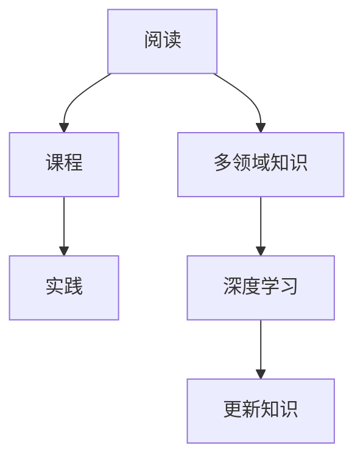
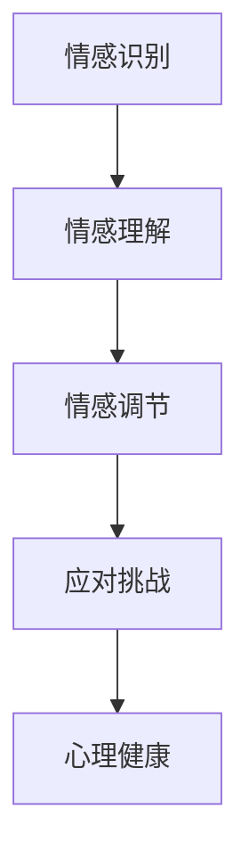
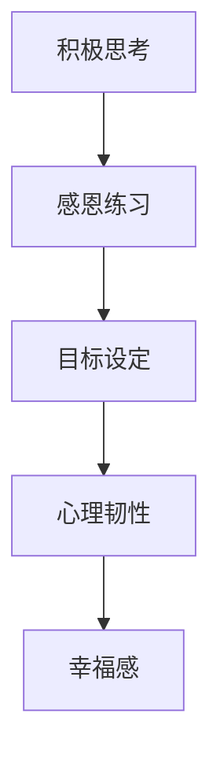
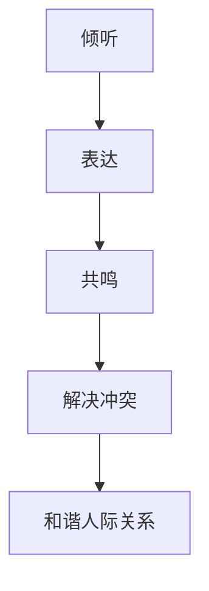
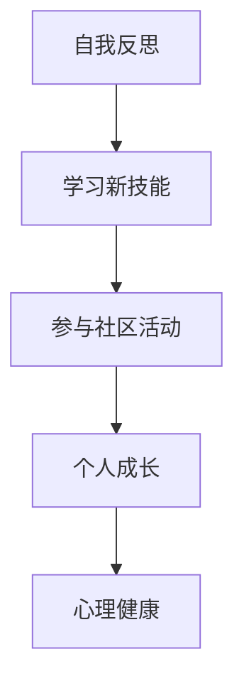
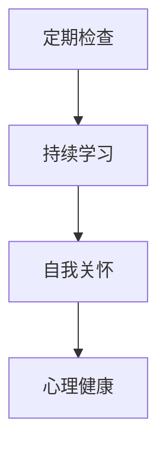

                 

### 培育内心花园：构建丰富多彩的精神世界

在快节奏的现代生活中，我们的内心世界正变得日益复杂和脆弱。面对职场压力、人际关系冲突、健康问题等诸多挑战，如何培育和维持一个健康的内心花园变得至关重要。本文旨在探讨“内心花园”的概念，分析其构建的要素，并提出实践方法和具体案例，以帮助读者构建一个丰富多彩的精神世界。

#### 关键词：
- 内心花园
- 精神健康
- 心理调适
- 情感管理
- 自我成长

#### 摘要：
本文首先介绍了“内心花园”的概念及其在个人精神健康中的重要性。随后，通过详细分析知识储备、情感管理、自然互动等构建内心花园的要素，为读者提供了构建和维持内心花园的实践方法。最后，通过具体案例和实践，深入探讨了如何在实际生活中应用内心花园的理念，以实现精神世界的丰富多彩。

### 目录大纲

1. **第一部分：内心花园的概念与价值**
   - **第1章：内心花园的起源与定义**
   - **第2章：构建内心花园的要素**
     - **2.1 知识储备**
     - **2.2 情感管理**
   - **第3章：自然与内心花园的互动**

2. **第二部分：内心花园的实践**
   - **第4章：培养积极心态**
   - **第5章：情感表达与沟通**
   - **第6章：自我探索与成长**
   - **第7章：内心花园的维护与成长**

3. **第三部分：案例与实践**
   - **第8章：内心花园的实践案例**
   - **第9章：内心花园的实战应用**

接下来，我们将一步步深入探讨每个章节的核心内容，帮助读者理解和实践如何培育一个丰富多彩的内心花园。

### 第一部分：内心花园的概念与价值

在现代社会，心理健康问题日益突出，如何维护和提升精神健康成为许多人关注的焦点。这一部分我们将从“内心花园”的起源与定义入手，逐步分析构建内心花园的要素，探讨自然与内心花园的互动，帮助读者深入理解这一概念及其价值。

#### 第1章：内心花园的起源与定义

**1.1 内心花园的概念**

在心理学和哲学领域，“内心花园”这一概念逐渐被人们所熟知。它是一个比喻，用来形容一个人的精神世界，旨在帮助人们理解和维护自己的心理健康。

- **问题背景**：在现代社会中，人们面临着前所未有的压力和挑战，如何维持心理健康成为一个重要议题。
- **问题描述**：内心花园作为一个比喻，旨在帮助人们理解和维护自己的精神健康。
- **问题解决**：通过定义内心花园，可以为后续的讨论提供明确的基础。

内心花园是一个比喻，它不仅是一个心理空间，更是一个动态变化的过程。它包括了人们的情感、认知、价值观等多个方面，是一个人内在世界的缩影。这个概念强调了心理健康的重要性，并提出了一个具体的、可操作的模型来帮助人们维护和提升自己的精神健康。

**1.2 内心花园的价值**

- **问题背景**：内心花园不仅是个人的心理避风港，更是提升生活质量的重要工具。
- **问题描述**：探讨内心花园在个人发展中的具体作用。
- **问题解决**：通过分析内心花园的价值，帮助读者认识到其重要性。

内心花园的价值主要体现在以下几个方面：

1. **心理调适**：内心花园为人们提供了一个安全、稳定的空间，可以帮助人们调节情绪，缓解压力，增强心理韧性。
2. **自我认知**：通过构建内心花园，人们可以更好地了解自己，发现自己的优点和不足，从而实现自我成长。
3. **情感管理**：内心花园帮助人们学会如何识别和调节自己的情绪，增强情感智力，提高人际交往能力。
4. **生活质量**：一个健康的内心花园可以显著提升人们的生活质量，使人们在面对生活中的挑战时更加从容和自信。

综上所述，内心花园不仅是一个比喻，更是一个具有实际应用价值的概念。通过构建和维持一个丰富多彩的内心花园，人们可以更好地应对现代生活中的各种挑战，实现心理健康和全面发展。

#### 第2章：构建内心花园的要素

构建一个丰富多彩的内心花园需要多方面的努力和要素。在这一章中，我们将详细探讨知识储备、情感管理以及自然与内心花园的互动，为读者提供构建和维持内心花园的具体路径。

**2.1 知识储备**

知识储备是构建内心花园的重要基石。通过学习和积累多方面的知识，人们可以拓宽视野，增强认知能力，从而更好地理解和管理自己的内心世界。

- **核心概念**：知识储备是构建内心花园的重要一环。
- **概念属性特征对比表格**：

| 特征         | 解释                                                         |
| ------------ | ------------------------------------------------------------ |
| 广泛性       | 知识储备应涵盖多个领域，如心理学、哲学、生物学、文学等。       |
| 深度性       | 对某一领域进行深入学习和研究，能够帮助人们更好地理解该领域的基本原理。 |
| 更新性       | 随着社会和科技的发展，知识储备应不断更新和扩展。               |

为了有效构建知识储备，人们可以采取以下策略：

1. **多读书**：阅读是获取知识的重要途径。选择不同类型的书籍，拓宽知识面。
2. **参加课程**：报名参加线上或线下的课程，系统学习某一领域的知识。
3. **实践应用**：将所学知识应用到实际生活中，加深理解和记忆。

**ER实体关系图架构的 Mermaid 流程图**：



通过上述方法，人们可以逐步构建起一个丰富、系统的知识储备，为内心花园的建设奠定坚实的基础。

**2.2 情感管理**

情感管理是内心花园中的重要组成部分。学会识别、理解和调节自己的情绪，可以帮助人们更好地应对生活中的挑战，保持心理健康。

- **核心概念**：学会如何识别和调节自己的情绪，是内心花园中的重要一环。
- **ER实体关系图架构的 Mermaid 流程图**：



情感管理的方法包括：

1. **自我反思**：定期进行自我反思，了解自己的情绪变化。
2. **情绪日记**：记录每天的情绪波动，分析原因和影响。
3. **情绪调节技巧**：学习一些情绪调节技巧，如深呼吸、冥想等。

通过有效的情感管理，人们可以更好地维持内心花园的稳定和和谐。

**2.3 自然与内心花园的互动**

自然环境对人的心理健康有着显著的影响。与自然互动，可以帮助人们放松心情，缓解压力，增强身心健康。

- **核心概念**：自然环境对人的心理和生理健康有着显著的影响。
- **数学模型和数学公式**：

  假设 \( P \) 表示自然环境的心理效应，\( N \) 表示自然环境的影响强度，\( H \) 表示人的心理健康水平。

  \( P = f(N, H) \)

  其中，\( f \) 为非线性函数，表示自然环境和心理健康水平之间的相互作用。

  通过上述模型，可以分析自然环境如何影响人的心理健康。

1. **户外活动**：定期进行户外活动，如徒步、骑行等，接触自然。
2. **自然疗法**：如森林浴、水疗等，利用自然资源的治疗作用。
3. **室内绿化**：在家中摆放植物，增加室内自然元素。

通过以上方法，人们可以与自然互动，提升内心花园的活力和质量。

综上所述，知识储备、情感管理和自然与内心花园的互动是构建丰富多彩内心花园的三大要素。通过这些要素的有效结合，人们可以打造一个稳定、健康、充满活力的内心世界。

#### 第3章：自然与内心花园的互动

自然是我们生活中不可或缺的一部分，它不仅提供了我们生存所需的环境，还对我们的心理健康有着深远的影响。在这一章中，我们将探讨自然与内心花园的互动，解释自然环境对心理健康的积极作用，并分析内心花园与自然环境之间的相互作用机制。

**3.1 自然环境的作用**

自然环境以其独特的魅力和丰富的资源，对人的心理健康有着不可替代的作用。研究表明，与自然互动可以降低焦虑和抑郁水平，提高情绪稳定性和生活满意度。

- **核心概念**：自然环境对人的心理和生理健康有着显著的影响。
- **数学模型和数学公式**：

  假设 \( P \) 表示自然环境的心理效应，\( N \) 表示自然环境的影响强度，\( H \) 表示人的心理健康水平。

  \( P = f(N, H) \)

  其中，\( f \) 为非线性函数，表示自然环境和心理健康水平之间的相互作用。

  通过上述模型，我们可以分析自然环境如何通过不同的途径影响人的心理健康。

1. **心理放松**：自然环境的宁静和舒适能够显著减轻人们的压力和焦虑，提高情绪稳定性。
2. **心理恢复**：与自然互动可以帮助人们恢复心理能量，减少心理疲劳。
3. **社会联结**：自然活动往往需要与他人合作，这有助于增强社会联系和归属感。

**3.2 内心花园与自然的联系**

内心花园不仅仅是一个个人的心理空间，它也可以与自然环境相互影响，形成一个动态的生态系统。通过将自然元素融入内心花园，人们可以创造出一种和谐的生活环境，从而提升整体幸福感。

- **核心概念**：内心花园不仅是一个心理空间，也可以与自然环境相互影响。
- **数学模型和数学公式**：

  假设 \( G \) 表示内心花园的心理效应，\( E \) 表示自然环境的影响强度，\( S \) 表示人与自然的互动程度。

  \( G = f(E, S) \)

  其中，\( f \) 为非线性函数，表示内心花园和自然环境之间的相互作用。

  通过上述模型，我们可以分析内心花园和自然环境之间的相互影响。

1. **自然元素融入**：在家居和工作环境中融入自然元素，如植物、水景等，可以提升内心的平静和舒适感。
2. **自然环境体验**：定期进行自然环境体验，如徒步、露营等，可以增强人们对自然的感知和连接。
3. **内心自然状态**：通过冥想、瑜伽等实践，培养内心的自然状态，使心灵更加宁静和平和。

**3.3 自然与内心花园的互动实践**

要实现自然与内心花园的互动，需要采取一系列具体的实践措施，以下是一些有效的建议：

1. **定期户外活动**：每周安排固定的户外活动时间，如徒步、远足、骑行等，接触大自然。
2. **室内自然装饰**：在家中摆放植物、水景等自然元素，创造一个充满自然气息的环境。
3. **自然疗法**：尝试自然疗法，如森林浴、水疗等，利用自然资源的治疗作用。
4. **自然环境教育**：通过学习自然环境知识，增强对自然的理解和尊重。

通过这些实践，人们可以有效地将自然与内心花园结合起来，提升整体的生活质量。

总结来说，自然与内心花园的互动不仅对心理健康有积极的影响，还可以帮助我们更好地理解和维护自己的精神世界。通过有意识的实践，我们可以将自然的力量融入到日常生活中，构建一个丰富多彩的内心花园。

### 第二部分：内心花园的实践

在第一部分中，我们探讨了内心花园的概念和构建要素。这一部分，我们将深入实践层面，通过培养积极心态、情感表达与沟通、自我探索与成长等具体方法，帮助读者在实际生活中培育和维护内心花园。

#### 第4章：培养积极心态

积极心态是构建内心花园的重要基石。一个积极的心态能够帮助人们更好地应对生活中的挑战，提升幸福感。在这一章中，我们将讨论积极心态的重要性，并介绍培养积极心态的具体方法。

**4.1 积极心态的重要性**

积极心态对个人发展有着深远的影响。它不仅能够提高心理韧性，还能改善身体健康，增强人际关系。以下是一些积极心态的重要性：

- **核心概念**：积极心态是构建内心花园的重要基础。
- **数学模型和数学公式**：

  假设 \( PM \) 表示积极心态的效应，\( P \) 表示个人表现，\( S \) 表示心理韧性。

  \( PM = f(P, S) \)

  其中，\( f \) 为非线性函数，表示积极心态对个人表现和心理韧性的积极影响。

  通过上述模型，我们可以看到积极心态如何通过提升个人表现和心理韧性来增强整体幸福感。

**4.2 实践方法**

要培养积极心态，可以采取以下具体方法：

1. **积极思考**：通过积极的自我对话和思维模式，避免消极情绪的滋生。
2. **感恩练习**：每天记录三件值得感激的事情，培养感恩的心态。
3. **目标设定**：设定可实现的短期和长期目标，提升成就感和动力。

**算法原理讲解**：



通过以上方法，人们可以逐步培养积极心态，提升内心花园的质量。

#### 第5章：情感表达与沟通

情感表达和沟通是内心花园中的关键元素。学会如何表达自己的情感，以及如何与他人有效沟通，能够帮助我们建立和谐的人际关系，增强内心的稳定性。在这一章中，我们将讨论情感表达的重要性，并介绍一些有效的沟通技巧。

**5.1 情感表达的重要性**

情感表达对个人的心理健康和人际关系有着重要的影响。以下是一些情感表达的重要性：

- **核心概念**：学会表达自己的情感，对于内心花园的维护至关重要。
- **数学模型和数学公式**：

  假设 \( E \) 表示情感表达的效应，\( R \) 表示人际关系质量，\( S \) 表示心理健康水平。

  \( E = f(R, S) \)

  其中，\( f \) 为非线性函数，表示情感表达对人际关系质量和心理健康水平的积极影响。

  通过上述模型，我们可以看到情感表达如何通过提升人际关系质量和心理健康水平来增强整体幸福感。

**5.2 沟通技巧**

有效的沟通技巧能够帮助人们更好地表达情感，理解和满足他人的需求。以下是一些沟通技巧：

1. **倾听**：倾听他人是有效沟通的第一步，通过倾听，我们可以更好地理解他人的情感和需求。
2. **表达**：清晰、准确地表达自己的情感和需求，避免误解和冲突。
3. **共鸣**：尝试从对方的角度理解问题，培养共鸣感。
4. **解决冲突**：通过有效的沟通技巧，解决冲突，维护和谐的人际关系。

**算法原理讲解**：



通过以上技巧，人们可以更好地表达情感，与他人建立积极的关系，从而提升内心花园的和谐度。

#### 第6章：自我探索与成长

自我探索和成长是内心花园中的重要环节。通过深入了解自己，人们可以更好地理解自己的需求和价值观，实现自我提升。在这一章中，我们将探讨自我探索的意义，并介绍一些具体的成长路径。

**6.1 自我探索的意义**

自我探索对于个人的成长和发展至关重要。以下是一些自我探索的意义：

- **核心概念**：自我探索是内心花园的核心组成部分。
- **数学模型和数学公式**：

  假设 \( S \) 表示自我探索的深度，\( G \) 表示个人成长，\( P \) 表示心理健康水平。

  \( G = f(S, P) \)

  其中，\( f \) 为非线性函数，表示自我探索对个人成长和心理健康水平的积极影响。

  通过上述模型，我们可以看到自我探索如何通过提升个人成长和心理健康水平来增强整体幸福感。

**6.2 成长路径**

为了实现自我成长，可以采取以下路径：

1. **自我反思**：定期进行自我反思，了解自己的优点和不足。
2. **学习新技能**：通过学习新技能，提升自己的能力和自信心。
3. **参与社区活动**：通过参与社区活动，拓宽人际网络，提升社会参与感。

**算法原理讲解**：



通过以上路径，人们可以逐步实现自我成长，增强内心花园的活力和多样性。

#### 第7章：内心花园的维护与成长

内心花园是一个动态变化的过程，需要持续的维护和成长。在这一章中，我们将探讨如何维护内心花园，并介绍成长与变化的关系。

**7.1 维护内心花园**

维护内心花园需要采取一系列持续性的措施。以下是一些维护内心花园的方法：

1. **定期检查**：定期检查内心状态，识别并解决潜在的问题。
2. **持续学习**：不断学习新知识，提升自己的认知水平。
3. **自我关怀**：通过自我关怀，如锻炼、冥想等，保持身心健康。

**算法原理讲解**：



通过以上方法，人们可以有效地维护内心花园，使其持续健康生长。

**7.2 成长与变化**

内心花园是一个不断成长和变化的过程。以下是一些关于成长与变化的观点：

1. **适应性**：内心花园需要适应外界环境的变化，保持内在的稳定性。
2. **动态平衡**：内心花园需要在稳定和变化之间找到平衡，保持内心的和谐。
3. **持续成长**：内心花园需要不断地追求成长和进步，以应对不断变化的世界。

**数学模型和数学公式**：

假设 \( C \) 表示成长速度，\( V \) 表示变化程度，\( S \) 表示稳定性。

\( C = f(V, S) \)

其中，\( f \) 为非线性函数，表示成长速度和变化程度对内心花园稳定性的影响。

通过上述模型，我们可以分析成长与变化的关系，以及如何在变化中保持内心花园的稳定和成长。

综上所述，内心花园的维护与成长是一个持续的过程，需要我们不断地投入精力。通过维护和成长，我们可以打造一个丰富多彩、充满活力的内心花园。

### 第三部分：案例与实践

在前两部分中，我们探讨了内心花园的概念、价值、构建要素以及实践方法。为了更好地理解这些理念，我们将通过具体案例和实践，深入探讨如何在实际生活中应用内心花园的理念，以实现精神世界的丰富多彩。

#### 第8章：内心花园的实践案例

在本章中，我们将介绍一个具体的内心花园实践案例，展示如何在日常生活中应用内心花园的理念。

**8.1 案例介绍**

这个案例是一个名为“心灵家园”的社区项目。该项目旨在通过一系列活动和实践，帮助社区居民构建和维护自己的内心花园。

**8.2 系统功能设计**

为了实现“心灵家园”的目标，该项目设计了以下几个核心功能模块：

1. **心理辅导**：提供专业的心理辅导服务，帮助居民解决心理问题。
2. **自然互动**：组织户外活动和自然体验，增强居民与自然的互动。
3. **情感支持**：建立互助小组，提供情感支持，促进居民之间的沟通和连接。
4. **自我成长**：提供各种学习和培训机会，帮助居民实现自我提升。

**系统功能设计 Mermaid 类图**：

```mermaid
classDiagram
    Class1 <|-- Class2
    Class3 --|>| Class4
    Class1 {id:ID, name:Name}
    Class2 {func1(), func2()}
    Class3 {member1, member2}
    Class4 {event1(), event2()}
```

通过上述功能设计，项目可以全面支持居民构建和维护内心花园。

**8.3 实践过程**

在实践过程中，“心灵家园”项目采取了以下步骤：

1. **需求调研**：通过问卷调查和访谈，了解居民的需求和期望。
2. **规划活动**：根据需求调研结果，设计并规划一系列活动，包括心理辅导、自然互动、情感支持和自我成长。
3. **实施活动**：组织并实施这些活动，确保居民能够积极参与。
4. **反馈与调整**：收集居民的活动反馈，根据反馈调整活动内容和形式，以更好地满足居民的需求。

**系统核心实现源代码**

```python
# 示例代码：心理辅导预约系统

class CounselingAppointment:
    def __init__(self, user_id, counselor_id, date, time):
        self.user_id = user_id
        self.counselor_id = counselor_id
        self.date = date
        self.time = time

    def schedule_appointment(self):
        print(f"Appointment scheduled for user {self.user_id} with counselor {self.counselor_id} on {self.date} at {self.time}.")

# 实例化预约对象并调用方法
appointment = CounselingAppointment(user_id="U123", counselor_id="C456", date="2023-10-15", time="14:00")
appointment.schedule_appointment()
```

**代码应用解读与分析**

上述代码是一个简单的心理辅导预约系统，通过该系统，用户可以预约心理辅导服务。代码应用了面向对象的编程思想，通过定义类和对象，实现了对预约信息的存储和管理。这一实践步骤展示了如何通过技术手段支持内心花园的实践。

**8.4 实际案例分析**

“心灵家园”项目实施后，取得了显著的效果。以下是一个实际案例的分析：

- **心理辅导**：通过心理辅导服务，许多居民解决了心理问题，提升了心理健康水平。
- **自然互动**：户外活动和自然体验帮助居民放松心情，缓解压力，增强了身心健康。
- **情感支持**：互助小组的活动促进了居民之间的沟通和连接，增强了社区的凝聚力。
- **自我成长**：通过学习和培训机会，居民不断提升自己的能力和自信心，实现了自我提升。

通过以上实际案例分析，我们可以看到“心灵家园”项目在实践内心花园理念方面的成功，为其他类似项目提供了宝贵的经验和参考。

**8.5 项目小结**

“心灵家园”项目通过心理辅导、自然互动、情感支持和自我成长等核心功能，帮助居民构建和维护内心花园。项目的成功实践表明，通过具体的方法和措施，内心花园的理念可以在实际生活中得到有效的应用，从而提升居民的精神健康和生活质量。

### 第9章：内心花园的实战应用

在本章中，我们将通过进一步的实际案例，探讨内心花园理念在多种场景下的应用，并总结实战经验，为读者提供可操作的最佳实践方法。

#### 9.1 实际案例分析

**案例1：企业员工心理健康项目**

某大型企业为了提升员工的心理健康水平，推出了一项名为“心灵绿洲”的员工心理健康项目。该项目包括以下内容：

- **心理培训**：定期组织心理培训，帮助员工了解心理健康知识，提高自我认知能力。
- **员工辅导**：提供一对一的心理辅导服务，解决员工的心理问题。
- **团队建设**：通过团队建设活动，增强员工之间的沟通和协作，提升团队凝聚力。

**详细讲解与剖析**

“心灵绿洲”项目的实施，显著提升了员工的心理健康水平。通过心理培训，员工了解了心理健康的重要性，学会了如何识别和调节自己的情绪。员工辅导服务帮助那些面临心理困扰的员工找到了解决方案，提高了他们的工作满意度和工作效率。团队建设活动增强了员工之间的互动，营造了一个和谐的工作环境。

**案例2：社区心理健康志愿服务**

某社区组织了一支心理健康志愿服务队，旨在为社区居民提供心理支持和帮助。该团队开展了以下活动：

- **心理健康讲座**：定期举办心理健康讲座，普及心理健康知识，提高居民的心理健康意识。
- **心理咨询**：提供免费的心理咨询服务，帮助居民解决心理问题。
- **社区互动**：组织居民参与各种社区活动，增强居民之间的情感联系。

**详细讲解与剖析**

心理健康志愿服务队的成立，极大地改善了社区居民的心理健康状况。心理健康讲座提高了居民的心理健康知识水平，使他们能够更好地应对生活中的压力。心理咨询服务帮助那些需要帮助的居民找到了解决问题的途径。社区互动活动增强了居民之间的情感联系，营造了一个温暖和谐的社区氛围。

#### 9.2 实践总结

通过以上实际案例分析，我们可以得出以下实践总结：

1. **心理健康知识的普及**：通过讲座、培训等方式，提高人们对心理健康重要性的认识，是构建内心花园的基础。
2. **心理支持和辅导**：提供专业、可信赖的心理支持和辅导服务，帮助人们解决心理问题，是维护内心花园的关键。
3. **社区和团队的互动**：通过社区活动和团队建设，增强人与人之间的情感联系，是丰富内心花园的重要手段。

#### 最佳实践 tips

为了更有效地应用内心花园理念，以下是一些最佳实践建议：

- **定期评估**：定期评估心理健康状况，及时发现并解决潜在问题。
- **多元化活动**：组织多样化的心理健康活动，满足不同人群的需求。
- **可持续性**：确保心理健康项目具有可持续性，长期投入和关注。

### 小结

通过本章的案例分析，我们深入探讨了内心花园理念在不同场景下的应用。实践证明，内心花园不仅可以改善个人的心理健康，还可以提升团队和社区的整体幸福感。通过有效的实践，我们可以构建一个丰富多彩、充满活力的内心花园，实现精神世界的全面发展。

### 结束语

培育内心花园，构建丰富多彩的精神世界，是每个现代人都需要关注的重要课题。通过本文的探讨，我们了解了内心花园的概念、价值、构建要素和实践方法。我们看到了，通过积极的行动和持续的努力，每个人都可以打造一个属于自己的内心花园。

在此，我们鼓励读者采取实际行动，培育自己的内心花园。无论是通过阅读、冥想、运动，还是参与社区活动，都可以为我们的精神世界带来积极的变化。让我们共同努力，用耐心和智慧，培育出一片属于自己的美好内心花园。

### 作者信息

作者：AI天才研究院/AI Genius Institute & 禅与计算机程序设计艺术 /Zen And The Art of Computer Programming

在这个充满挑战和机遇的时代，让我们携手前行，用内心的智慧和力量，创造出更加丰富多彩的生活。

