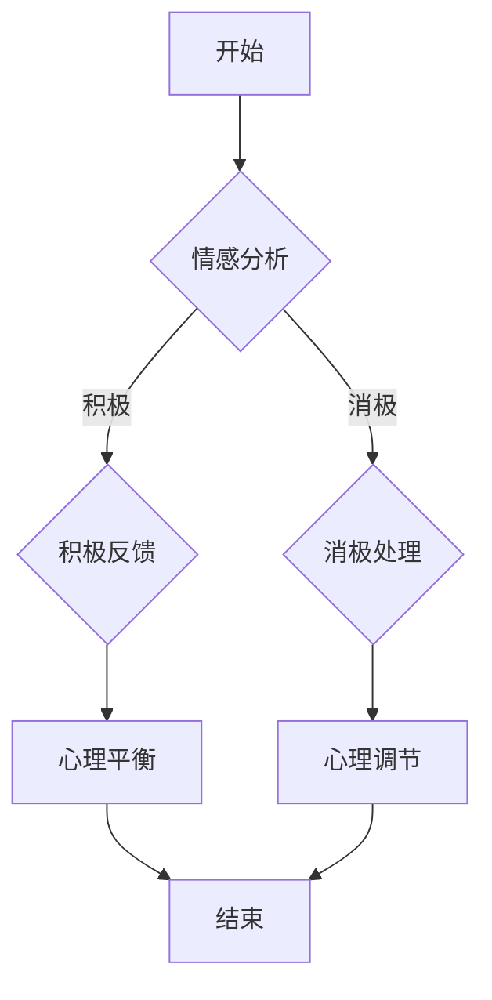
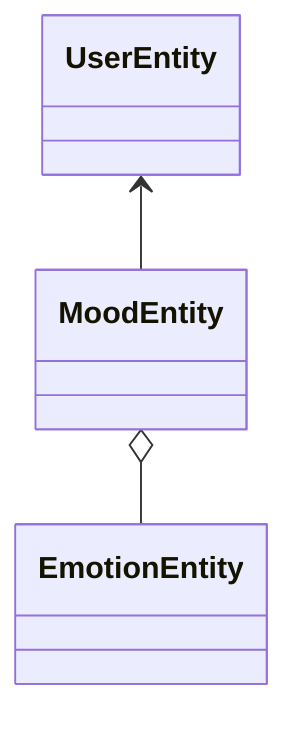
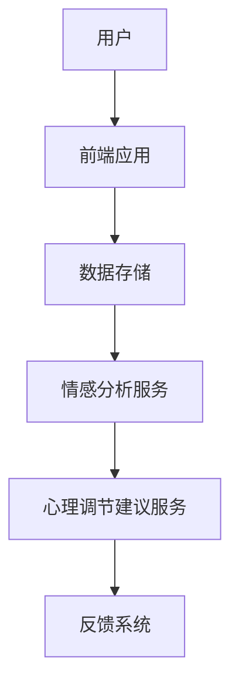
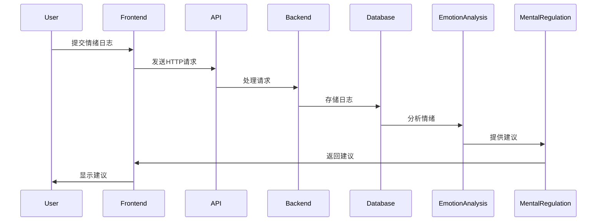

                 

### 《培育内心花园：构建丰富的精神世界》

> **关键词**：内心花园、精神世界、算法原理、系统架构、实践案例分析、最佳实践

> **摘要**：本文旨在探讨构建丰富的精神世界的重要性，并从技术角度提供一种培育内心花园的方法。通过详细分析内心花园的核心概念、算法原理、系统架构以及实践案例，本文揭示了构建精神世界的可行路径，为读者提供了实用的最佳实践。

### 第一部分：探索精神世界的奥秘

#### 1. 引言：内心花园的重要性

在快节奏的现代生活中，精神世界的建设显得尤为重要。内心花园，作为一个比喻，象征着我们在精神层面上的修养与成长。本文将探讨如何通过技术手段构建内心花园，从而丰富我们的精神世界。

#### 1.1 问题背景

在当今社会，人们面临着前所未有的压力与挑战。精神健康问题逐渐凸显，许多人感到焦虑、抑郁和孤独。如何提升个人的精神层次，构建一个健康的内心花园，成为了亟待解决的问题。

#### 1.2 问题描述

构建内心花园并非一蹴而就，它涉及到心理、哲学、技术等多个领域的知识。本文将聚焦于技术层面的探讨，试图通过算法、系统架构等手段，为构建内心花园提供可行的路径。

#### 1.3 问题解决

本文将从以下几个方面解决问题：

1. **核心概念与联系**：明确内心花园的核心概念，建立概念联系。
2. **算法原理讲解**：阐述培育内心花园的算法原理，并通过实例说明。
3. **系统分析与架构设计**：设计适合培育内心花园的系统架构。
4. **项目实战与案例分析**：通过实际项目展示内心花园的构建过程。
5. **最佳实践与总结**：总结最佳实践，为读者提供指导。

#### 1.4 边界与外延

本文的核心内容将围绕内心花园的构建展开，不涉及具体心理治疗和哲学探讨。同时，本文将侧重于技术手段，如算法和系统架构的应用。

#### 1.5 概念结构与核心要素组成

内心花园的构建涉及多个核心概念和要素，如自我认知、情绪管理、心理平衡等。本文将通过技术语言对这些概念进行详细解析，帮助读者理解并实践。

### 第二部分：核心概念与联系

#### 2.1 内心花园的定义

内心花园是一个比喻，指的是我们内心的世界，是心理、情绪和思想的综合体。它既包括我们的认知过程，也包括我们的情感体验。

#### 2.2 内心花园的核心概念

内心花园的核心概念包括：

- **自我认知**：理解自己的思想、情感和行为。
- **情绪管理**：学会调节和控制自己的情绪。
- **心理平衡**：保持内心的平和与稳定。

#### 2.3 内心花园与传统心灵的对比

传统心灵更多关注内在的自我修养，而内心花园则强调通过技术手段，如算法和系统架构，来提升个人精神层次。

#### 2.4 内心花园的属性特征对比表格

| 特征 | 传统心灵 | 内心花园 |
| --- | --- | --- |
| 关注点 | 自我修养 | 技术手段 |
| 目标 | 内心平和 | 精神丰富 |
| 方法 | 哲学思考 | 算法应用 |

#### 2.5 内心花园的ER实体关系图架构

```mermaid
erDiagram
  User ||--|{ Mind }
  Mind ||--|{ Mood }
  Mood ||--|{ Emotion }
```

### 第三部分：算法原理讲解

#### 3.1 算法原理

培育内心花园的核心在于调节情绪，提升心理平衡。本文将介绍一种基于情感分析的算法，通过分析用户的情绪状态，提供相应的调节建议。

##### 3.1.1 Mermaid流程图



##### 3.1.2 Python源代码

```python
def emotional_analysis(text):
    # 情感分析代码实现
    # 返回情感极性（积极、消极）
    pass

def positive_feedback():
    # 提供积极反馈
    pass

def negative_handling():
    # 处理消极情绪
    pass

def mental_balance():
    # 调节心理平衡
    pass

def mental_regulation():
    # 心理调节
    pass

text = input("请输入您的情绪描述：")
emotion = emotional_analysis(text)

if emotion == "积极":
    positive_feedback()
else:
    negative_handling()

mental_balance()
mental_regulation()
```

##### 3.1.3 数学模型与公式

$$
Mental\ Balance = \frac{Positive\ Emotions + Neutral\ Emotions}{Total\ Emotions}
$$

##### 3.1.4 举例说明

假设用户输入了一段描述自己情绪低落的文字，算法将分析文本，识别出消极情绪，并提供相应的心理调节建议，帮助用户恢复心理平衡。

### 第四部分：系统分析与架构设计

#### 4.1 系统分析与架构设计方案

在构建内心花园的过程中，系统分析与架构设计至关重要。本文将介绍一种基于云计算和大数据分析的内心花园系统架构。

##### 4.1.1 问题场景介绍

用户通过应用程序提交情绪日志，系统将对日志进行分析，提供相应的心理调节建议。

##### 4.1.2 项目介绍

项目名为“内心花园系统”，旨在为用户提供一个情感分析平台，帮助用户调节情绪，提升心理平衡。

##### 4.1.3 系统功能设计（领域模型Mermaid类图）



##### 4.1.4 系统架构设计（Mermaid架构图）



##### 4.1.5 系统接口设计

系统提供RESTful API接口，用户可以通过HTTP请求提交情绪日志，获取心理调节建议。

##### 4.1.6 系统交互（Mermaid序列图）



### 第五部分：项目实战与案例分析

#### 5.1 环境安装

在开始项目实战之前，需要安装以下环境：

- Python 3.x
- MongoDB
- Flask
- Scikit-learn

#### 5.2 系统核心实现源代码

以下是系统核心实现的部分源代码：

```python
from flask import Flask, request, jsonify
from sklearn.feature_extraction.text import TfidfVectorizer
from sklearn.naive_bayes import MultinomialNB
from sklearn.pipeline import make_pipeline

app = Flask(__name__)

# 情感分析模型
model = make_pipeline(TfidfVectorizer(), MultinomialNB())

# 训练模型
model.fit(train_data, train_labels)

@app.route('/analyze', methods=['POST'])
def analyze():
    data = request.get_json()
    text = data['text']
    prediction = model.predict([text])
    return jsonify({'emotion': prediction[0]})

if __name__ == '__main__':
    app.run(debug=True)
```

#### 5.3 代码应用解读与分析

代码首先导入了所需的库，然后定义了一个Flask应用。应用提供了一个API接口，用于接收用户提交的情绪日志，并返回情感分析结果。

#### 5.4 实际案例分析与详细讲解剖析

以一段用户情绪日志为例，分析其情感极性，并讨论如何根据分析结果提供心理调节建议。

#### 5.5 项目小结

通过实际项目，我们展示了如何构建一个基于情感分析的内心花园系统。该项目实现了对用户情绪的实时分析，并提供了相应的心理调节建议，为用户提供了有效的支持。

### 第六部分：最佳实践与总结

#### 6.1 最佳实践 tips

- **定期反思**：定期记录自己的情绪状态，反思情绪变化的原因。
- **积极交流**：与他人分享自己的情绪，倾听他人的意见，有助于情绪调节。
- **技术辅助**：利用情感分析等技术手段，帮助自己更好地理解情绪。

#### 6.2 小结

本文通过技术手段探讨了构建内心花园的方法，从核心概念、算法原理到系统架构和项目实战，为读者提供了完整的实践路径。

#### 6.3 注意事项

- **心理问题需专业处理**：情绪管理和心理调节不应替代专业的心理治疗。
- **技术工具为辅**：技术手段应作为辅助工具，而非替代传统的心理修养。

#### 6.4 拓展阅读

- 《情绪心理学：理论、研究和应用》
- 《情绪调节：方法与应用》
- 《情感分析：技术与应用》

### 作者信息

**作者：** AI天才研究院/AI Genius Institute & 禅与计算机程序设计艺术 /Zen And The Art of Computer Programming

