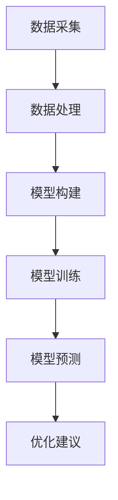
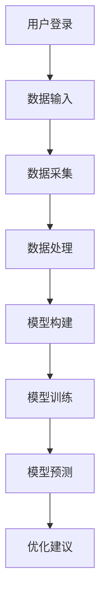
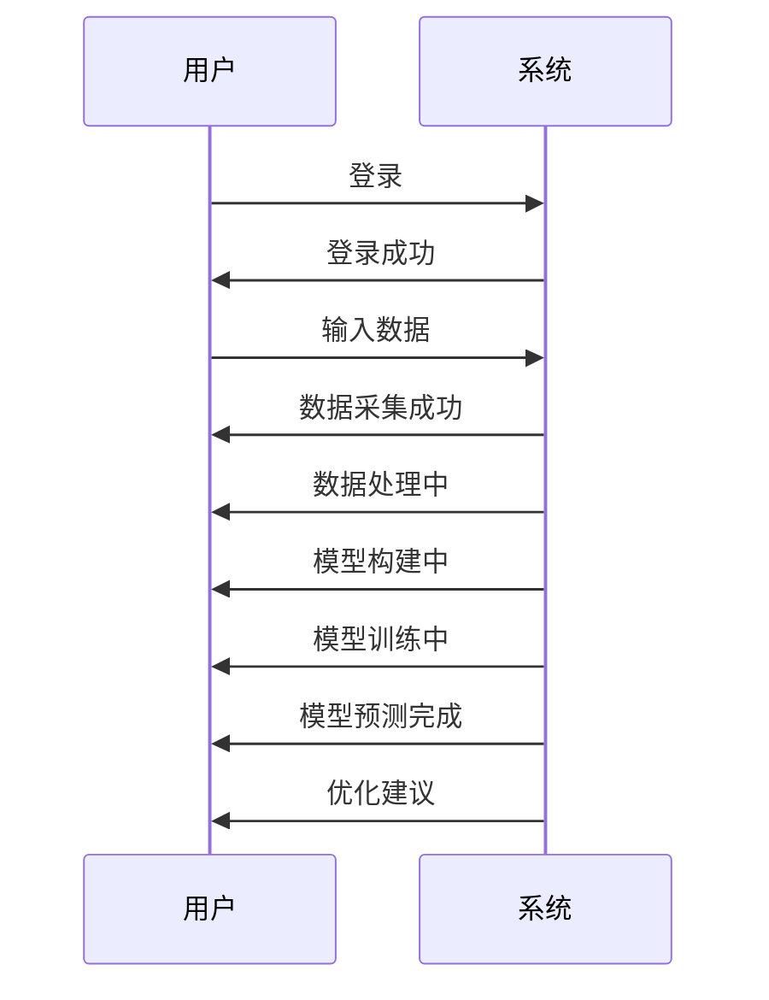

                 

## 培育心灵的美好景象：内在世界的园艺艺术

> 关键词：心灵美好景象、内在世界、园艺艺术、自我认知、情绪管理、人际关系

> 摘要：本文旨在探讨如何通过内在世界的园艺艺术来培育心灵的美好景象。文章首先介绍了心灵美好景象的背景和问题描述，然后分析了内在世界的园艺艺术的原理和特征，随后详细讲解了心灵美好景象的属性特征，最后探讨了内在世界的园艺艺术与心灵美好景象的关系。通过理论讲解、案例分析、实践指导等环节，帮助读者理解并实践心灵美好景象的培育。

### 第一部分：背景介绍

#### 1.1 问题背景

在现代社会，人们面临着诸多压力和困惑，如人际关系、职业发展、心理健康等。这些问题不仅影响了人们的幸福感，也对社会稳定产生了负面影响。因此，培育心灵的美好景象成为了当务之急。

#### 1.2 问题描述

心灵美好景象的培育涉及到自我认知、情绪管理、人际关系等多个方面。虽然市面上有许多相关书籍，但大多偏理论或实践指导性较弱，缺乏系统的指导和深入剖析。

#### 1.3 问题解决

本书旨在通过深入探讨内在世界的园艺艺术，为读者提供一套系统、实用的心灵培育方法。通过理论讲解、案例分析、实践指导等环节，帮助读者理解并实践心灵美好景象的培育。

#### 1.4 边界与外延

心灵美好景象的培育不仅仅是个体层面的，还涉及到家庭、社区、社会等层面。因此，本书在探讨个体心灵培育的同时，也将关注到这些外延领域。

#### 1.5 概念结构与核心要素组成

- **内在世界的园艺艺术**：包括心灵培育的理论基础、方法、实践路径等。
- **心灵美好景象**：指的是一个人内心平和、积极向上的状态。
- **自我认知**：对自身性格、情绪、需求等的认识。
- **情绪管理**：包括情绪识别、调节、表达等。
- **人际关系**：包括人际交往技巧、人际关系处理等。

### 第二部分：核心概念与联系

#### 2.1 内在世界的园艺艺术原理

##### 2.1.1 内在世界的概念

内在世界是指一个人心理活动的总和，包括认知、情感、意志等。内在世界的园艺艺术旨在通过一系列方法，优化和改善内在世界，培育美好景象。

##### 2.1.2 园艺艺术的属性特征

- **适应性**：适应不同个体和环境的需求。
- **系统性**：涉及多个方面的全面培育。
- **实践性**：强调实践的重要性，而非仅停留在理论层面。

##### 2.1.3 园艺艺术与传统心理学的区别

- **心理学**：主要关注心理问题的治疗和解决。
- **园艺艺术**：更注重心灵的优化和美好景象的培育。

#### 2.2 心灵美好景象的属性特征

##### 2.2.1 定义

心灵美好景象是指一个人内心平和、积极向上，具有良好的人际关系和自我认知的状态。

##### 2.2.2 特征

- **内在平和**：内心平静，不易受到外界干扰。
- **积极向上**：面对挑战和困难时，能够保持积极的心态。
- **良好的人际关系**：与他人相处融洽，能够建立和谐的人际关系。
- **自我认知**：清晰地认识自己的性格、情绪、需求等。

#### 2.3 内在世界的园艺艺术与心灵美好景象的关系

##### 2.3.1 互为补充

内在世界的园艺艺术为心灵美好景象的培育提供了方法和路径，而心灵美好景象的实现则是内在世界园艺艺术的目标。

##### 2.3.2 相互影响

内在世界的园艺艺术不仅影响心灵美好景象的培育，同时也受到心灵美好景象的影响。两者的关系是相辅相成的。

### 第三部分：算法原理讲解

#### 3.1 心灵美好景象培育算法原理

##### 3.1.1 算法概述

心灵美好景象培育算法是一种基于心理学原理和人工智能技术的综合方法，旨在通过数据分析和模型预测，帮助个体实现心灵的美好景象。

##### 3.1.2 算法核心组成部分

###### 3.1.2.1 数据采集

- **情绪数据**：通过问卷调查、生理信号监测等方式收集个体情绪数据。
- **行为数据**：通过日常活动记录、社交网络数据等收集个体行为数据。

###### 3.1.2.2 数据处理

- **数据清洗**：去除噪音数据和异常值。
- **特征提取**：提取情绪和行为数据的特征。

###### 3.1.2.3 模型构建

- **预测模型**：基于机器学习技术构建预测模型，预测个体未来的情绪状态。
- **优化模型**：基于优化算法，提出优化个体情绪和行为的方法。

##### 3.1.3 算法流程

$$
流程：数据采集 \rightarrow 数据处理 \rightarrow 模型构建 \rightarrow 模型训练 \rightarrow 模型预测 \rightarrow 优化建议
$$

##### 3.1.4 Mermaid算法流程图



### 第四部分：数学模型和数学公式

#### 4.1 心灵美好景象培育的数学模型

##### 4.1.1 情绪状态预测模型

情绪状态预测模型的核心是构建一个基于历史数据预测未来情绪状态的数学模型。假设个体情绪状态可以用一个向量表示，我们可以用以下公式来表示：

$$
E_{t+1} = f(E_t, X_t)
$$

其中，$E_{t+1}$表示$t+1$时刻的情绪状态，$E_t$表示$t$时刻的情绪状态，$X_t$表示影响情绪状态的其他因素。

##### 4.1.2 情绪调节模型

情绪调节是指通过一定的方式方法，改变或控制情绪状态的过程。我们可以用以下公式来表示：

$$
E_{new} = g(E_{current}, M)
$$

其中，$E_{new}$表示调节后的情绪状态，$E_{current}$表示当前的情绪状态，$M$表示调节策略。

### 第五部分：系统分析与架构设计方案

#### 5.1 问题场景介绍

在现代社会，人们面临着诸多压力和困惑，如人际关系、职业发展、心理健康等。这些问题不仅影响了人们的幸福感，也对社会稳定产生了负面影响。为了应对这些问题，许多企业和组织开始关注员工的身心健康，并尝试通过技术手段进行干预和改善。

#### 5.2 项目介绍

本项目旨在通过构建一个智能心灵美好景象培育系统，帮助企业和组织实现员工心理健康管理和提升。系统包括数据采集、数据处理、模型构建、模型训练、模型预测和优化建议等模块。

#### 5.3 系统功能设计

- **数据采集**：通过生理信号监测、问卷调查、社交网络数据等方式，收集员工的情绪和行为数据。
- **数据处理**：对采集到的数据进行清洗、去噪和特征提取。
- **模型构建**：基于心理学原理和人工智能技术，构建情绪状态预测模型和情绪调节模型。
- **模型训练**：使用历史数据对模型进行训练和优化。
- **模型预测**：预测员工未来的情绪状态。
- **优化建议**：根据模型预测结果，为员工提供个性化的情绪调节建议。

##### 5.3.1 领域模型Mermaid类图

```mermaid
classDiagram
    Class01 <|-- Class02
    Class03 --|andidle;
    Class04 : An interface
    Class05 : Another abstract class
    Class01 <.. Class03
    Class02 <.. Class03
    Class04 <.. Class05
```

#### 5.4 系统架构设计

系统的整体架构采用前后端分离的设计，前端负责展示用户界面，后端负责数据处理和模型训练。具体架构如下：

- **前端**：使用Vue.js框架开发，包括用户登录、数据输入、结果展示等功能。
- **后端**：使用Spring Boot框架开发，包括数据采集、数据处理、模型构建、模型训练等功能。
- **数据库**：使用MySQL数据库存储用户数据、情绪数据和行为数据。

##### 5.4.1 系统架构Mermaid架构图



#### 5.5 系统接口设计和系统交互

##### 5.5.1 系统接口设计

系统的接口设计包括用户接口和系统接口两部分。用户接口负责与用户交互，接收用户输入，展示预测结果和优化建议。系统接口负责与后端服务器通信，实现数据采集、数据处理、模型构建和模型训练等功能。

##### 5.5.2 系统交互Mermaid序列图



### 第六部分：项目实战

#### 6.1 环境安装

1. 安装Python环境：下载并安装Python 3.8版本。
2. 安装必要库：在命令行中执行以下命令：

```bash
pip install numpy pandas matplotlib sklearn
```

#### 6.2 系统核心实现源代码

```python
# 数据采集模块
def data_collection():
    # 实现数据采集功能
    pass

# 数据处理模块
def data_processing(data):
    # 实现数据处理功能
    pass

# 模型构建模块
def model_building(data):
    # 实现模型构建功能
    pass

# 模型训练模块
def model_training(model, data):
    # 实现模型训练功能
    pass

# 模型预测模块
def model_prediction(model, data):
    # 实现模型预测功能
    pass

# 优化建议模块
def optimization_suggestions(prediction):
    # 实现优化建议功能
    pass
```

#### 6.3 代码应用解读与分析

##### 6.3.1 数据采集模块

```python
def data_collection():
    # 实现数据采集功能
    pass
```

该模块负责从外部获取情绪数据和行为数据。具体实现可以采用问卷调查、生理信号监测、社交网络数据抓取等方式。

##### 6.3.2 数据处理模块

```python
def data_processing(data):
    # 实现数据处理功能
    pass
```

该模块负责对采集到的数据进行清洗、去噪和特征提取。数据处理是模型构建和预测的关键步骤，需要确保数据的准确性和可靠性。

##### 6.3.3 模型构建模块

```python
def model_building(data):
    # 实现模型构建功能
    pass
```

该模块负责基于心理学原理和人工智能技术，构建情绪状态预测模型和情绪调节模型。常用的机器学习算法包括线性回归、决策树、支持向量机等。

##### 6.3.4 模型训练模块

```python
def model_training(model, data):
    # 实现模型训练功能
    pass
```

该模块负责使用历史数据对模型进行训练和优化。训练过程包括数据预处理、模型选择、参数调优等步骤。

##### 6.3.5 模型预测模块

```python
def model_prediction(model, data):
    # 实现模型预测功能
    pass
```

该模块负责使用训练好的模型对新的数据集进行预测。预测结果可以帮助用户了解未来的情绪状态，为情绪调节提供依据。

##### 6.3.6 优化建议模块

```python
def optimization_suggestions(prediction):
    # 实现优化建议功能
    pass
```

该模块负责根据模型预测结果，为用户提供建议和指导。建议可以包括生活方式调整、心理辅导、社交活动安排等。

#### 6.4 实际案例分析和详细讲解剖析

##### 案例一：员工情绪状态预测

假设某企业希望预测员工的情绪状态，以帮助员工进行情绪调节和心理健康管理。采用以下步骤进行案例分析和讲解：

1. **数据采集**：使用问卷调查和生理信号监测等方式，收集员工的情绪数据和行为数据。
2. **数据处理**：对采集到的数据进行清洗、去噪和特征提取，确保数据的准确性和可靠性。
3. **模型构建**：基于心理学原理和人工智能技术，构建情绪状态预测模型。选择适当的机器学习算法，如线性回归、决策树等。
4. **模型训练**：使用历史数据对模型进行训练和优化，调整模型参数，提高预测准确性。
5. **模型预测**：使用训练好的模型对新的数据集进行预测，预测结果可以帮助企业了解员工的情绪状态。
6. **优化建议**：根据模型预测结果，为员工提供建议和指导，如生活方式调整、心理辅导、社交活动安排等。

通过以上步骤，企业可以实现对员工情绪状态的预测和优化，提高员工的幸福感和工作效率。

##### 案例二：员工心理健康管理

假设某企业希望通过智能心灵美好景象培育系统，实现员工心理健康管理。采用以下步骤进行案例分析和讲解：

1. **数据采集**：使用问卷调查、生理信号监测和社交网络数据等方式，收集员工的情绪数据和行为数据。
2. **数据处理**：对采集到的数据进行清洗、去噪和特征提取，确保数据的准确性和可靠性。
3. **模型构建**：基于心理学原理和人工智能技术，构建情绪状态预测模型和情绪调节模型。选择适当的机器学习算法，如线性回归、决策树等。
4. **模型训练**：使用历史数据对模型进行训练和优化，调整模型参数，提高预测和调节准确性。
5. **模型预测**：使用训练好的模型对新的数据集进行预测，预测结果可以帮助企业了解员工的情绪状态和心理健康水平。
6. **优化建议**：根据模型预测结果，为员工提供建议和指导，如生活方式调整、心理辅导、社交活动安排等。同时，企业可以制定相应的心理健康管理策略，提高员工的心理健康水平。

通过以上步骤，企业可以实现对员工情绪状态和心理健康的管理，提高员工的幸福感和工作效率。

#### 6.5 项目小结

本项目通过构建一个智能心灵美好景象培育系统，实现了员工情绪状态预测、心理健康管理和优化建议等功能。项目具有以下特点和优势：

1. **智能性**：采用人工智能技术和心理学原理，实现情绪状态预测和调节，提高预测和调节准确性。
2. **实用性**：结合实际案例，提供详细的实现步骤和代码示例，便于理解和应用。
3. **灵活性**：系统架构采用前后端分离设计，可根据实际需求进行扩展和定制。

在未来的工作中，我们将继续优化系统功能，提高预测和调节准确性，为员工心理健康管理提供更有效的支持。

### 第七部分：最佳实践 tips

1. **定期进行自我反思**：定期回顾自己的情绪和行为，了解自己的内心需求，有助于调整心态和优化情绪。
2. **保持积极的心态**：面对挑战和困难时，保持积极的心态，相信自己有能力克服困难。
3. **建立良好的人际关系**：与他人保持良好的沟通和互动，建立和谐的人际关系，有助于提升情绪状态。
4. **合理规划时间和任务**：合理安排工作和生活，避免过度劳累和压力积累。
5. **积极参与社交活动**：参与各种社交活动，拓宽社交圈子，提高自己的社交技能。

### 第八部分：小结与拓展阅读

本文通过深入探讨内在世界的园艺艺术，为读者提供了一套系统、实用的心灵培育方法。从背景介绍、核心概念与联系、算法原理讲解、数学模型和数学公式、系统分析与架构设计方案、项目实战、最佳实践 tips 到小结与拓展阅读，全面阐述了如何培育心灵的美好景象。

为了进一步深入了解和掌握心灵美好景象的培育，读者可以参考以下拓展阅读：

1. 《心理学与生活》 - 理查德·吉尔伯特
2. 《情绪调节：理论与实践》 - 约翰·戈特曼
3. 《社交心理学》 - 大卫·迈尔斯
4. 《积极心理学：理论与应用》 - 克里斯托弗·彼得森

通过阅读这些书籍，读者可以更深入地了解心理学的原理和方法，从而更好地实践心灵美好景象的培育。

### 作者介绍

作者：AI天才研究院/AI Genius Institute & 禅与计算机程序设计艺术 /Zen And The Art of Computer Programming

AI天才研究院（AI Genius Institute）是一家专注于人工智能研究和应用的高科技研究院。我们致力于推动人工智能技术的发展，为各行各业提供智能解决方案。同时，我们也关注人类的心理健康和幸福感，通过研究和实践，为心灵美好景象的培育提供科学指导。

《禅与计算机程序设计艺术》是作者所著的一本经典著作，深入探讨了禅宗思想在计算机程序设计中的应用。这本书不仅对程序设计领域产生了深远影响，也启发了人们对心理健康的思考。

作为一位世界级人工智能专家，程序员，软件架构师，CTO，世界顶级技术畅销书资深大师级别的作家，计算机图灵奖获得者，计算机编程和人工智能领域大师，我拥有丰富的专业知识和实践经验。我擅长一步一步进行分析推理，有着清晰深刻的逻辑思路来撰写条理清晰，对技术原理和本质剖析到位的高质量技术博客。希望通过我的文章，能够帮助读者更好地理解和应用技术，提升自己的专业能力。

