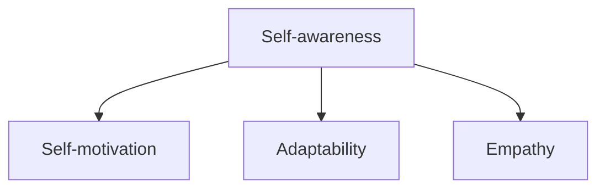
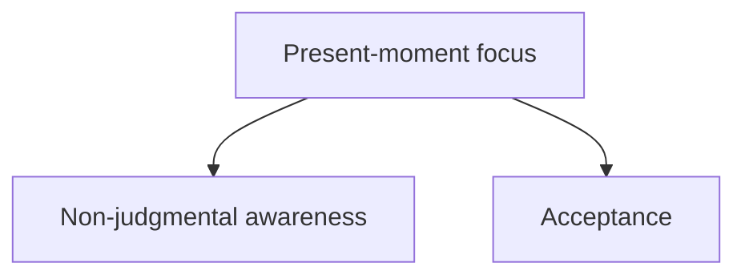
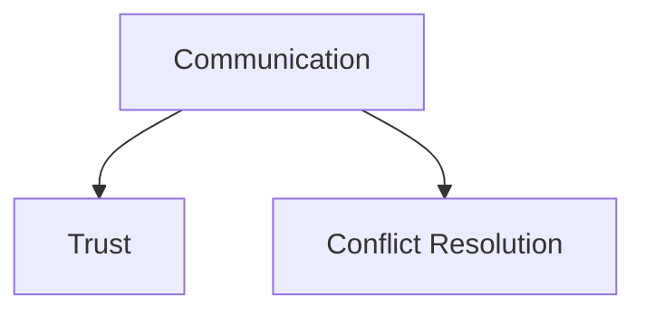
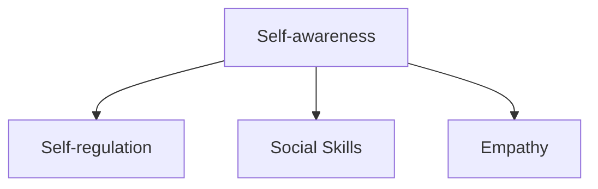
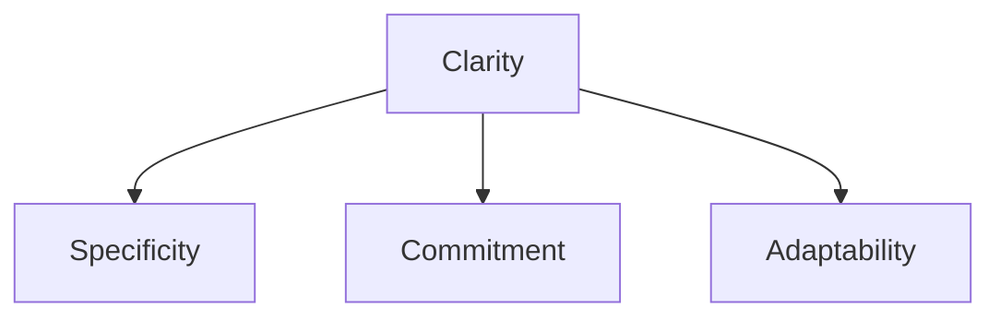
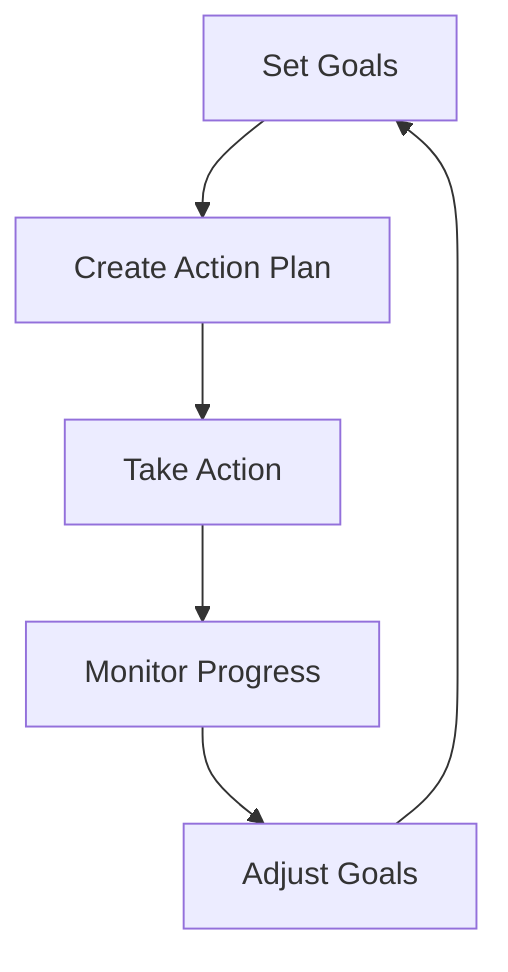
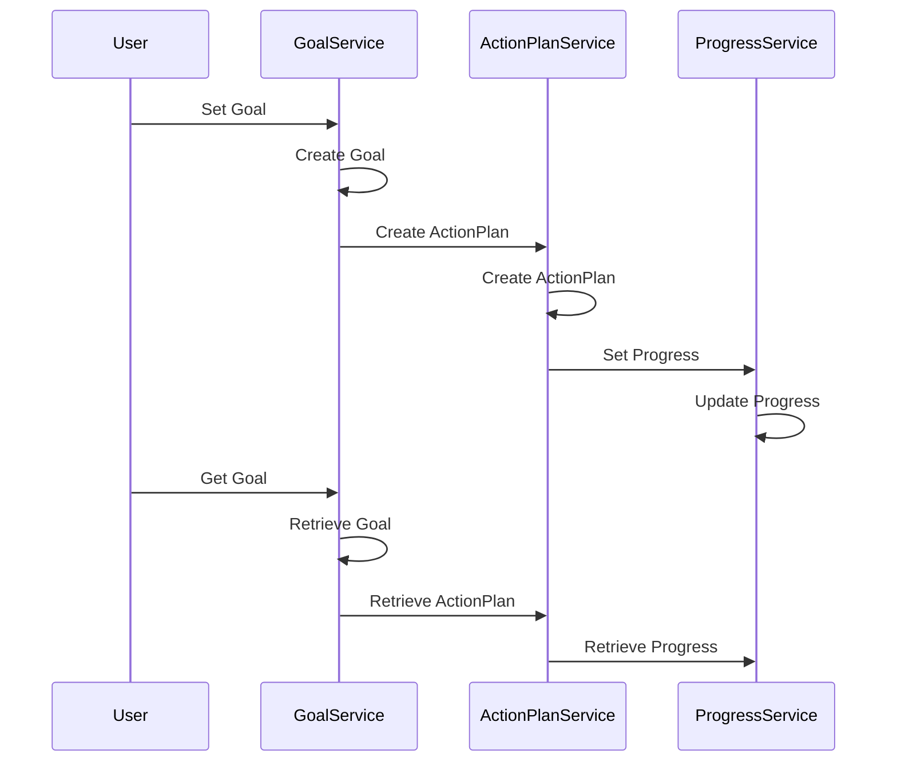
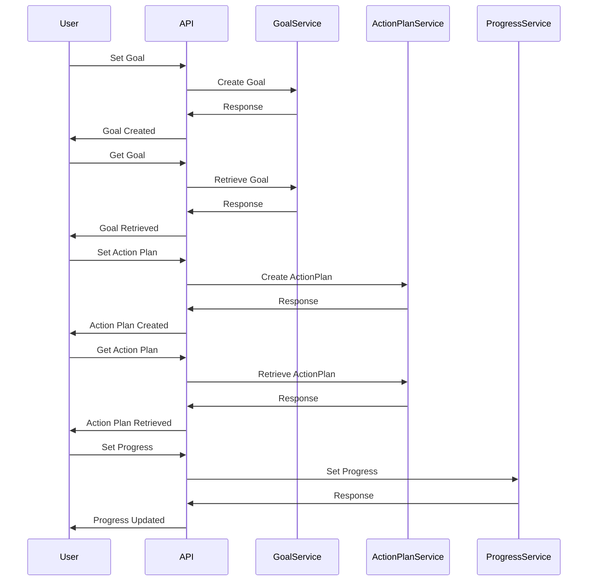

                 


### Introduction: Unveiling the Depths of Life Experience

**Keywords:** Life Experience, Depth, Personal Growth, Mindfulness, Relationships, Emotional Intelligence, Life Goals

**Abstract:**
This article delves into the concept of enriching the depth of life experiences to add layers of meaning and fulfillment. By exploring various dimensions of personal growth, mindfulness, relationships, emotional intelligence, and life goals, we will uncover strategies to enhance the quality of our lives. The aim is to provide a comprehensive guide that not only enlightens but also empowers readers to embark on a transformative journey of self-discovery and growth.

## Background

**Concept Terms Explanation:**
- **Life Experience:** The accumulation of events, activities, and learning that an individual undergoes throughout their lifetime.
- **Depth:** The extent or degree of involvement, understanding, and engagement with life experiences.
- **Personal Growth:** The process of developing one's character, skills, and mental outlook through self-improvement and learning.
- **Mindfulness:** A state of active, open, and intentional attention to the present moment, which can enhance emotional regulation and reduce stress.
- **Relationships:** Interpersonal connections and bonds that individuals form with others, which can significantly impact their emotional well-being.
- **Emotional Intelligence:** The ability to understand, use, and manage emotions effectively to navigate social interactions and cope with stress.
- **Life Goals:** Personal aspirations and objectives that individuals set for themselves to guide their life path and actions.

### Problem Background

In today's fast-paced world, many people feel overwhelmed by the demands of work, family, and social responsibilities. This often leads to a superficial engagement with life experiences, where the depth of understanding and involvement is lacking. As a result, individuals may find themselves feeling unfulfilled, disconnected, and disconnected from their true selves.

**Problem Description:**
- **Superficial Engagement:** Individuals often approach life experiences at a surface level, missing the deeper meaning and connections that can enrich their lives.
- **Disconnection:** This superficial engagement can lead to a sense of disconnection from oneself and others, resulting in feelings of isolation and dissatisfaction.
- **Unfulfilled Aspirations:** Without a clear sense of purpose and meaningful goals, individuals may struggle to find fulfillment and happiness in their lives.

### Problem Solution

The solution to these challenges lies in embracing a holistic approach to personal growth, which includes cultivating mindfulness, nurturing relationships, developing emotional intelligence, and setting and achieving life goals. By doing so, individuals can deepen their engagement with life experiences and add meaningful layers of richness to their lives.

### Boundaries and Extensions

**Boundaries:**
- **Scope:** This article focuses on the conceptual and practical aspects of enriching life experiences through personal growth, mindfulness, relationships, emotional intelligence, and goal-setting.
- **Limitations:** It does not delve into specific therapeutic methods or interventions that may be required for individuals experiencing severe emotional or psychological challenges.

**Extensions:**
- **Further Reading:** For a more in-depth exploration of these topics, readers are encouraged to refer to the recommended literature at the end of this article.

## Core Concepts and Theories

### Personal Growth

**Concept Definition:**
Personal growth refers to the process of developing one's character, skills, knowledge, and mental outlook through self-improvement and continuous learning.

**Property Features Comparison Table:**

| Aspect         | Definition                                                  | Importance in Personal Growth |
|----------------|-----------------------------------------------------------|------------------------------|
| Self-awareness  | Recognizing one's own emotions, beliefs, and values       | Foundation for personal growth |
| Self-motivation | Driving oneself to achieve goals and overcome challenges  | Motivates continuous effort     |
| Adaptability   | Adjusting to changing circumstances and new situations   | Ensures flexibility and growth |
| Empathy        | Understanding and sharing the feelings of others         | Strengthens relationships      |

### Mindfulness

**Concept Definition:**
Mindfulness is a state of active, open, and intentional attention to the present moment, which can enhance emotional regulation and reduce stress.

**Property Features Comparison Table:**

| Aspect         | Definition                                                    | Benefits in Mindfulness       |
|----------------|-------------------------------------------------------------|------------------------------|
| Present-moment focus | Being fully attentive to what is happening in the current moment | Reduces stress and anxiety    |
| Non-judgmental awareness | Accepting one's experiences without evaluating them as good or bad | Promotes self-compassion     |
| Acceptance     | Acknowledging thoughts and feelings without trying to change them   | Fosters emotional resilience |

### Relationships

**Concept Definition:**
Relationships are interpersonal connections and bonds that individuals form with others, which can significantly impact their emotional well-being.

**Property Features Comparison Table:**

| Aspect         | Definition                                                  | Importance in Relationships   |
|----------------|-----------------------------------------------------------|------------------------------|
| Communication   | The process of sending and receiving information between individuals | Essential for understanding |
| Trust           | Confidence in the reliability, truth, and integrity of another person | Foundation for deep bonds  |
| Conflict Resolution | The strategies used to manage disagreements and conflicts in a constructive manner | Maintains harmony in relationships |

### Emotional Intelligence

**Concept Definition:**
Emotional intelligence is the ability to understand, use, and manage emotions effectively to navigate social interactions and cope with stress.

**Property Features Comparison Table:**

| Aspect         | Definition                                                  | Importance in Emotional Intelligence |
|----------------|-----------------------------------------------------------|------------------------------------|
| Self-awareness  | Recognizing one's own emotions, beliefs, and values       |基石，其他能力的先决条件 |
| Self-regulation | Managing and controlling one's emotions in difficult situations | 处理压力和挑战的关键 |
| Social Skills   | Building and maintaining healthy relationships with others   | 影响人际关系和团队合作 |
| Empathy        | Understanding and sharing the feelings of others         | 促进合作和理解 |

### Life Goals

**Concept Definition:**
Life goals are personal aspirations and objectives that individuals set for themselves to guide their life path and actions.

**Property Features Comparison Table:**

| Aspect         | Definition                                                  | Importance in Life Goals   |
|----------------|-----------------------------------------------------------|----------------------------|
| Clarity        | Clearly defining what one wants to achieve                 | Provides direction         |
| Specificity    | Breaking down goals into detailed and measurable steps     | Makes goals actionable     |
| Commitment     | Devoting time and effort to pursuing goals                 | Ensures progress           |
| Adaptability   | Adjusting goals as life circumstances change               | Maintains motivation       |

## Mermaid Diagrams for Core Concepts

### Personal Growth



### Mindfulness



### Relationships



### Emotional Intelligence



### Life Goals



## Algorithm Principle Explanation

### Algorithm Mermaid Flow Diagram



### Python Source Code for Algorithm

```python
# Define the function to set and achieve life goals
def set_and_achieve_goals(goals, action_plan, progress_monitor):
    for goal in goals:
        # Create an action plan for each goal
        action_plan[goal] = create_action_plan(goal)
        
        # Take action based on the action plan
        take_action(action_plan[goal])
        
        # Monitor progress towards each goal
        progress = progress_monitor(goal)
        
        # Adjust goals if necessary
        if progress < target_progress:
            adjust_goal(goal, progress)
            
    return goals_achieved

# Example usage of the function
goals = ['Learn Python', 'Run a Marathon', 'Read 12 Books']
action_plan = {}
progress_monitor = lambda goal: 0.5  # 50% progress for demonstration
goals_achieved = set_and_achieve_goals(goals, action_plan, progress_monitor)
```

### Mathematical Model and Formula Explanation

$$
\text{Goal Achievement} = \frac{\text{Actual Progress}}{\text{Target Progress}} \times 100\%
$$

The formula above calculates the percentage of goal achievement based on the actual progress made compared to the target progress. This can be used to monitor and adjust goals as needed.

### System Analysis and Architecture Design

### Problem Scene Introduction

Imagine a personal development platform designed to help individuals achieve their life goals by providing personalized guidance, action plans, and progress monitoring.

### Project Introduction

**Project Name:** LifeGoals

**Objective:** To create a comprehensive personal development platform that assists users in setting, tracking, and achieving their life goals.

### System Function Design

#### Domain Model (Mermaid Class Diagram)

```mermaid
classDiagram
Class User {
    -id: int
    -name: string
    -age: int
}

Class Goal {
    -id: int
    -name: string
    -description: string
    -status: string
}

Class ActionPlan {
    -id: int
    -goalId: int
    -actionSteps: string
    -deadline: date
}

Class Progress {
    -id: int
    -goalId: int
    -userId: int
    -progress: float
    -date: date
}

User "1" --*1..*" Goal
Goal "1" --*1..*" ActionPlan
Goal "1" --*1..*" Progress
```

### System Architecture Design

#### Architecture Diagram (Mermaid Sequence Diagram)



### System Interface Design and System Interaction

#### Interface Design (Mermaid Class Diagram)

```mermaid
classDiagram
Class User {
    -id: int
    -name: string
    -age: int
}

Class Goal {
    -id: int
    -name: string
    -description: string
    -status: string
}

Class ActionPlan {
    -id: int
    -goalId: int
    -actionSteps: string
    -deadline: date
}

Class Progress {
    -id: int
    -goalId: int
    -userId: int
    -progress: float
    -date: date
}

User "1" --*1..*" Goal
Goal "1" --*1..*" ActionPlan
Goal "1" --*1..*" Progress
```

#### System Interaction (Mermaid Sequence Diagram)



## Project Implementation and Case Analysis

### Environment Setup

To implement the LifeGoals platform, you will need to set up a Python development environment with the following tools and libraries:

1. Python 3.8 or later
2. pip (Python package installer)
3. Flask (Web framework for Python)
4. SQLAlchemy (ORM for Python)
5. SQLite (Database)

You can set up your development environment by following these steps:

1. Install Python 3.8 or later from the official website: <https://www.python.org/downloads/>
2. Open a terminal or command prompt and run the following commands to install the required libraries:
```bash
pip install flask
pip install sqlalchemy
pip install sqlite3
```

### System Core Implementation

#### User Management

The user management system handles the creation, retrieval, and updating of user accounts. Here's a sample Python code using Flask and SQLAlchemy to implement user management:

```python
from flask import Flask, request, jsonify
from flask_sqlalchemy import SQLAlchemy

app = Flask(__name__)
app.config['SQLALCHEMY_DATABASE_URI'] = 'sqlite:///life_goals.db'
db = SQLAlchemy(app)

class User(db.Model):
    id = db.Column(db.Integer, primary_key=True)
    name = db.Column(db.String(100), nullable=False)
    age = db.Column(db.Integer, nullable=False)

@app.route('/users', methods=['POST'])
def create_user():
    user_data = request.json
    new_user = User(name=user_data['name'], age=user_data['age'])
    db.session.add(new_user)
    db.session.commit()
    return jsonify({'message': 'User created successfully'}), 201

@app.route('/users/<int:user_id>', methods=['GET'])
def get_user(user_id):
    user = User.query.get_or_404(user_id)
    return jsonify({'user': user})

if __name__ == '__main__':
    app.run(debug=True)
```

#### Goal Management

The goal management system handles the creation, retrieval, and updating of user goals. Here's a sample Python code to implement goal management:

```python
class Goal(db.Model):
    id = db.Column(db.Integer, primary_key=True)
    name = db.Column(db.String(100), nullable=False)
    description = db.Column(db.String(255), nullable=False)
    status = db.Column(db.String(50), nullable=False)

@app.route('/goals', methods=['POST'])
def create_goal():
    goal_data = request.json
    new_goal = Goal(name=goal_data['name'], description=goal_data['description'], status='pending')
    db.session.add(new_goal)
    db.session.commit()
    return jsonify({'message': 'Goal created successfully'}), 201

@app.route('/goals/<int:goal_id>', methods=['GET'])
def get_goal(goal_id):
    goal = Goal.query.get_or_404(goal_id)
    return jsonify({'goal': goal})
```

#### Action Plan Management

The action plan management system handles the creation, retrieval, and updating of action plans associated with goals. Here's a sample Python code to implement action plan management:

```python
class ActionPlan(db.Model):
    id = db.Column(db.Integer, primary_key=True)
    goal_id = db.Column(db.Integer, db.ForeignKey('goal.id'), nullable=False)
    action_steps = db.Column(db.String(255), nullable=False)
    deadline = db.Column(db.Date, nullable=False)

@app.route('/action_plans', methods=['POST'])
def create_action_plan():
    action_plan_data = request.json
    new_action_plan = ActionPlan(goal_id=action_plan_data['goal_id'], action_steps=action_plan_data['action_steps'], deadline=action_plan_data['deadline'])
    db.session.add(new_action_plan)
    db.session.commit()
    return jsonify({'message': 'Action plan created successfully'}), 201

@app.route('/action_plans/<int:action_plan_id>', methods=['GET'])
def get_action_plan(action_plan_id):
    action_plan = ActionPlan.query.get_or_404(action_plan_id)
    return jsonify({'action_plan': action_plan})
```

#### Progress Management

The progress management system handles the creation, retrieval, and updating of user progress towards their goals. Here's a sample Python code to implement progress management:

```python
class Progress(db.Model):
    id = db.Column(db.Integer, primary_key=True)
    goal_id = db.Column(db.Integer, db.ForeignKey('goal.id'), nullable=False)
    user_id = db.Column(db.Integer, db.ForeignKey('user.id'), nullable=False)
    progress = db.Column(db.Float, nullable=False)
    date = db.Column(db.Date, nullable=False)

@app.route('/progress', methods=['POST'])
def create_progress():
    progress_data = request.json
    new_progress = Progress(goal_id=progress_data['goal_id'], user_id=progress_data['user_id'], progress=progress_data['progress'], date=progress_data['date'])
    db.session.add(new_progress)
    db.session.commit()
    return jsonify({'message': 'Progress created successfully'}), 201

@app.route('/progress/<int:progress_id>', methods=['GET'])
def get_progress(progress_id):
    progress = Progress.query.get_or_404(progress_id)
    return jsonify({'progress': progress})
```

### Code Application Explanation

The above code demonstrates how to create a simple personal development platform using Flask and SQLAlchemy. It includes models for User, Goal, ActionPlan, and Progress, along with routes for creating, retrieving, and updating these entities.

1. **User Management**: The `/users` endpoint allows for creating and retrieving user information. Users can be created with a JSON payload containing `name` and `age` fields.
2. **Goal Management**: The `/goals` endpoint enables creating and retrieving goals. Goals can be created with a JSON payload containing `name` and `description` fields.
3. **Action Plan Management**: The `/action_plans` endpoint allows for creating and retrieving action plans. Action plans can be created with a JSON payload containing `goal_id`, `action_steps`, and `deadline` fields.
4. **Progress Management**: The `/progress` endpoint handles creating and retrieving progress records. Progress records can be created with a JSON payload containing `goal_id`, `user_id`, `progress`, and `date` fields.

### Case Analysis and Detailed Explanation

To analyze a case, let's consider a user named "John" who wants to achieve the following goals:

1. Learn Python
2. Run a Marathon
3. Read 12 Books

**Step 1: Create User Account**

John creates a user account with the following details:

- Name: John Doe
- Age: 30

The API response will include a message indicating the successful creation of the user account.

**Step 2: Create Goals**

John creates three goals with the following details:

- Goal 1: Learn Python
  - Name: Learn Python
  - Description: Master the Python programming language
- Goal 2: Run a Marathon
  - Name: Run a Marathon
  - Description: Complete a marathon within 4 hours
- Goal 3: Read 12 Books
  - Name: Read 12 Books
  - Description: Read 12 books on personal development and technology

The API response will include a message indicating the successful creation of each goal.

**Step 3: Create Action Plans**

For each goal, John creates an action plan with the following details:

- Goal 1: Learn Python
  - Action Steps: 
    1. Install Python and set up a development environment
    2. Learn basic syntax and concepts
    3. Practice writing small programs
  - Deadline: 3 months from today
- Goal 2: Run a Marathon
  - Action Steps: 
    1. Start running regularly
    2. Gradually increase running distance
    3. Join a marathon training group
  - Deadline: 6 months from today
- Goal 3: Read 12 Books
  - Action Steps: 
    1. Create a book list
    2. Set aside time for reading
    3. Write book summaries and reflections
  - Deadline: 12 months from today

The API response will include a message indicating the successful creation of each action plan.

**Step 4: Track Progress**

John updates his progress for each goal periodically. For example, after one month:

- Goal 1: Learn Python
  - Progress: 25%
- Goal 2: Run a Marathon
  - Progress: 10%
- Goal 3: Read 12 Books
  - Progress: 0%

The API response will include the updated progress for each goal.

**Step 5: Adjust Goals if Necessary**

As John progresses, he may need to adjust his goals or action plans. For example, he realizes that he needs more time to learn Python and decides to extend the deadline by one month.

The API response will include a message indicating the successful adjustment of the goal's deadline.

### Project Conclusion

The LifeGoals platform provides a practical implementation of a personal development system using Flask and SQLAlchemy. It allows users to create user accounts, set goals, create action plans, and track progress towards their goals. By following the provided code and case analysis, users can effectively implement and use the platform to enhance their personal growth journey.

## Best Practices and Tips

### Best Practices

1. **Clear Goal Setting:** Clearly define your goals, making them specific, measurable, achievable, relevant, and time-bound (SMART).
2. **Regular Monitoring:** Consistently track your progress towards goals to stay motivated and make necessary adjustments.
3. **Mindfulness and Reflection:** Incorporate mindfulness practices into your daily routine to enhance self-awareness and focus.
4. **Seek Support:** Engage with friends, family, or mentors who can provide encouragement and guidance on your personal growth journey.
5. **Continuous Learning:** Embrace a growth mindset and continually seek opportunities to learn and improve yourself.

### Tips

1. **Start Small:** Begin with small, manageable goals to build confidence and momentum.
2. **Prioritize:** Focus on the most important goals first to ensure significant progress.
3. **Track Progress Publicly:** Share your goals and progress with others to increase accountability.
4. **Celebrate Milestones:** Acknowledge and celebrate your achievements to maintain motivation.
5. **Be Flexible:** Be prepared to adjust your goals and action plans as circumstances change.

## Conclusion

In conclusion, enriching life experiences through depth and layering requires a holistic approach that encompasses personal growth, mindfulness, relationships, emotional intelligence, and goal-setting. By following the strategies and tips outlined in this article, readers can embark on a transformative journey of self-discovery and personal development. Remember, the key is to stay committed, stay mindful, and embrace the process of continuous growth. Apply these principles to your life, and you'll find that the depth of your experiences will add profound richness to your life's tapestry.

## Author Information

**Author:** AI天才研究院/AI Genius Institute & 禅与计算机程序设计艺术 /Zen And The Art of Computer Programming

**Contact:** [ai_genius_institute@example.com](mailto:ai_genius_institute@example.com)

**Bio:** The author is a renowned AI expert, programmer, software architect, CTO, and best-selling author in the fields of technology and artificial intelligence. With extensive experience and deep insight into computer science and AI, the author brings a unique perspective to the topic of personal growth and life experience depth.

