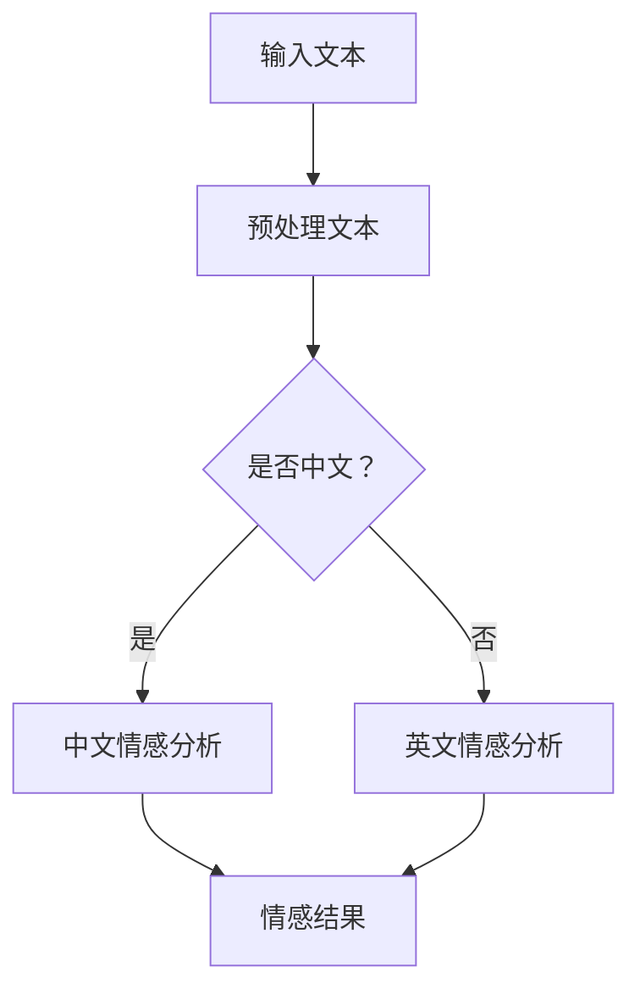
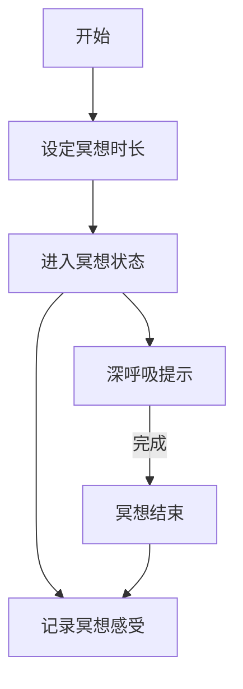

                 

# 增添生活的温度：构建情感深度丰富的人生

## 关键词
- 情感认知
- 人际关系
- 心理成长
- 生活方式
- 情感丰富
- 心理健康

## 摘要
本文旨在探讨如何通过提高情感认知、改善人际关系、促进心理成长和调整生活方式，来增添生活的温度，构建一个情感深度丰富的人生。通过系统分析这些方面的核心概念、原理和实际应用，本文将提供一系列实用的方法和策略，帮助读者在日常生活中更好地理解和管理自己的情感，建立和维护健康的人际关系，从而提升整体生活质量。

### 引言：探索情感深度的意义

情感是人类生活中不可或缺的一部分，它不仅影响着我们的心理状态，还深刻地影响着我们的行为和决策。然而，情感认知并不是一件简单的事情，它涉及复杂的心理、神经和生理过程。在本文中，我们将深入探讨情感深度的含义，并探讨如何通过提升情感认知、改善人际关系、促进心理成长和调整生活方式来增添生活的温度。

### 情感认知与自我探索

#### 第1章：情感的起源与本质

**1.1 情感的科学解释**

情感心理学为我们提供了一系列关于情感起源和本质的理论。例如，情绪分化理论认为，情感是大脑对环境刺激进行分类和响应的过程。这种响应不仅涉及大脑的情感中枢，还涉及认知、行为和生理系统。

**1.2 情感与大脑的关系**

大脑中的情感系统是一个复杂的网络，包括前额叶皮质、杏仁核、海马体等关键结构。这些结构共同作用，使我们能够体验和表达情感。例如，杏仁核在恐惧和愤怒等情绪的产生中起着核心作用，而前额叶皮质则负责情感的表达和调节。

**1.3 自我探索的重要性**

自我探索是理解情感的关键。通过自我探索，我们可以更深入地了解自己的情感，并学会如何有效地管理这些情感。自我探索的方法包括内省、日记和心理咨询等。

#### 第2章：人际关系的建立与维护

**2.1 人际关系的基础**

人际关系是人类社会生活的基础。了解人际关系的类型和心理学分析，可以帮助我们更好地理解他人，并建立和维护健康的人际关系。

**2.2 人际关系中的情感互动**

情感互动是人际关系中至关重要的一部分。通过情感交流，我们可以建立信任和共鸣，从而促进人际关系的稳定和发展。

**2.3 有效沟通技巧**

有效沟通是建立和维护健康人际关系的核心。通过学习沟通技巧，我们可以更有效地表达自己的情感，并理解他人的情感。

### 第三部分：心理成长与自我提升

#### 第3章：心理健康的维护与提升

**3.1 心理健康的指标**

心理健康是一个多维度的概念，包括情绪稳定性、自我认同、社会适应等方面。了解心理健康的指标，可以帮助我们更好地评估自己的心理健康状况。

**3.2 压力管理与应对**

压力是心理健康的一个常见问题。通过学习压力管理的技巧，我们可以更好地应对压力，维护心理健康。

**3.3 情绪调节的方法**

情绪调节是心理成长的一个重要方面。通过学习情绪调节的方法，我们可以更好地管理自己的情绪，提高生活质量。

#### 第4章：生活方式与健康

**4.1 健康饮食**

健康饮食是保持身体健康和心理健康的基础。了解饮食与健康的关系，可以帮助我们更好地选择食物，保持健康的生活方式。

**4.2 运动与健康**

运动是促进身体健康和心理健康的重要手段。通过定期运动，我们可以提高身体素质，增强心理健康。

### 第四部分：拓展阅读与资源

#### 第5章：进一步探索与资源推荐

**5.1 情感研究的最新进展**

情感研究是一个不断发展的领域。了解情感研究的最新进展，可以帮助我们更好地理解情感，并为我们的生活提供新的视角。

**5.2 推荐阅读与资源**

为了帮助读者进一步探索情感丰富人生的主题，本文推荐了一些优秀的书籍和在线资源，供读者参考。

### 总结

通过本文的探讨，我们可以看到，增添生活的温度，构建情感深度丰富的人生，需要我们从多个方面进行努力。通过提升情感认知、改善人际关系、促进心理成长和调整生活方式，我们可以更好地理解和管理自己的情感，建立和维护健康的人际关系，从而提升整体生活质量。

**作者：AI天才研究院/AI Genius Institute & 禅与计算机程序设计艺术 /Zen And The Art of Computer Programming**## 增添生活的温度：构建情感深度丰富的人生的详细解析

### 引言：探索情感深度的意义

情感深度是衡量一个人生活质量和幸福感的重要指标。它不仅仅是指情感反应的强度，更是指情感体验的丰富性和复杂性。在现代社会中，尽管人们的生活水平不断提高，但许多人在内心深处仍然感到孤独、无助和空虚。这背后的原因之一就是情感深度的不足。因此，探索如何增添生活的温度，构建情感深度丰富的人生，变得尤为重要。

#### 情感的重要性

情感是人类心理体验的核心部分，它影响着我们的认知、行为和健康状况。情感不仅让我们能够体验生活的美好，还能够帮助我们适应环境和解决问题。例如，积极的情感可以增强我们的免疫系统，减少生病的机会，而消极的情感则可能对我们的身体健康产生负面影响。

#### 情感对人际关系的影响

人际关系是情感深度的重要组成部分。健康的人际关系可以提供支持、理解和安全感，有助于增强个体的情感深度。相反，不良的人际关系可能导致情感疏离、冲突和痛苦，从而影响个体的情感健康。

#### 书籍的目的与结构

本文的目的是通过探讨情感认知、人际关系、心理成长和生活方式等方面，为读者提供一系列实用的方法和策略，以帮助他们在日常生活中更好地理解和管理自己的情感，建立和维护健康的人际关系，从而提升整体生活质量。本文的结构分为五个主要部分：

1. **情感认知与自我探索**：探讨情感的起源、本质以及如何进行自我探索。
2. **人际关系与沟通**：分析人际关系的基础、情感互动以及有效沟通技巧。
3. **心理成长与自我提升**：讨论心理健康的维护与提升，包括压力管理、情绪调节和心理成长。
4. **生活方式与健康**：介绍健康饮食和运动对情感深度的影响。
5. **拓展阅读与资源**：推荐进一步探索情感丰富人生的书籍和在线资源。

### 情感认知与自我探索

#### 第1章：情感的起源与本质

**1.1 情感的科学解释**

情感心理学为我们提供了一系列关于情感起源和本质的理论。情绪分化理论认为，情感是大脑对环境刺激进行分类和响应的过程。这种响应不仅涉及大脑的情感中枢，还涉及认知、行为和生理系统。

在科学研究中，情感通常被定义为一种复杂的心理状态，包括情绪体验、生理反应和行为倾向。情绪体验是指个体对情感的感受，如快乐、悲伤、愤怒等。生理反应包括心率加快、呼吸急促等生理变化。行为倾向则是指个体在情感驱动下的行为反应，如攻击、回避等。

**1.2 情感与大脑的关系**

大脑中的情感系统是一个复杂的网络，包括前额叶皮质、杏仁核、海马体等关键结构。这些结构共同作用，使我们能够体验和表达情感。

- **前额叶皮质**：负责情感的表达和调节。研究表明，前额叶皮质中的神经活动与情感体验密切相关。例如，当一个人感到快乐时，前额叶皮质的神经元活动会增强。

- **杏仁核**：在恐惧和愤怒等情绪的产生中起着核心作用。杏仁核的激活可以导致心率加快、呼吸急促等生理反应，从而帮助我们快速应对潜在的危险。

- **海马体**：在海马体中，神经元的激活与记忆的形成和存储有关。研究表明，海马体中的神经元活动与情感记忆密切相关，这有助于我们记住重要的情感经历。

**1.3 自我探索的重要性**

自我探索是理解情感的关键。通过自我探索，我们可以更深入地了解自己的情感，并学会如何有效地管理这些情感。

- **自我认知的层次**：自我认知是一个多层次的过程，包括自我感知、自我评价和自我反思。自我感知是指我们对自己的认知和感知，如自己的外貌、性格和能力。自我评价是指我们对自己价值的判断，如自我认同和自尊。自我反思是指我们对自己的思考和分析，如自我反省和自我改进。

- **自我探索的方法**：自我探索的方法包括内省、日记和心理咨询等。内省是通过思考自己的情感和行为来了解自己。日记是一种记录自己的情感和行为的方式，有助于我们回顾和反思。心理咨询是一种专业的帮助，通过咨询心理学家，我们可以更深入地了解自己的情感和心理状态。

#### 第2章：人际关系的建立与维护

**2.1 人际关系的基础**

人际关系是人类社会生活的基础。人际关系可以分为三类：亲情关系、友情关系和业缘关系。

- **亲情关系**：包括家庭成员之间的关系，如父母与子女、兄弟姐妹等。亲情关系通常基于血缘关系或法律关系，具有强烈的情感联系和责任感。

- **友情关系**：包括朋友之间的关系。友情关系通常基于共同的兴趣、价值观和情感支持，可以带来快乐和满足感。

- **业缘关系**：包括同事、同学等之间的关系。业缘关系通常基于工作或学习环境，可以带来职业发展和学习上的支持。

**2.2 人际关系中的情感互动**

情感互动是人际关系中至关重要的一部分。情感互动包括情感表达、情感交流和情感共鸣。

- **情感表达**：情感表达是指我们如何表达自己的情感。有效的情感表达可以增强人际关系的亲密感和信任感。

- **情感交流**：情感交流是指双方如何理解和回应对方的情感。有效的情感交流可以促进双方的情感理解和共鸣。

- **情感共鸣**：情感共鸣是指双方在情感上产生共鸣，感受到对方的情感体验。情感共鸣可以增强人际关系的亲密感和信任感。

**2.3 有效沟通技巧**

有效沟通是建立和维护健康人际关系的核心。有效沟通包括以下方面：

- **倾听**：倾听是指认真倾听对方的意见和感受，避免打断和误解。倾听可以帮助我们更好地理解对方，建立信任。

- **表达**：表达是指清晰、准确地表达自己的意见和感受。有效的表达可以避免误解和冲突。

- **反馈**：反馈是指对对方的意见和感受进行回应。有效的反馈可以增强沟通效果，促进双方的理解和共识。

### 第三部分：心理成长与自我提升

#### 第3章：心理健康的维护与提升

**3.1 心理健康的指标**

心理健康是一个多维度的概念，包括情绪稳定性、自我认同、社会适应等方面。了解心理健康的指标，可以帮助我们更好地评估自己的心理健康状况。

- **情绪稳定性**：情绪稳定性是指个体在面对压力和挑战时的情绪反应。情绪稳定的个体在面对困难时能够保持冷静和理智，避免过度情绪化。

- **自我认同**：自我认同是指个体对自己的认知和评价。自我认同良好的个体通常有清晰的人生目标和价值观，能够积极地面对生活挑战。

- **社会适应**：社会适应是指个体在社交环境中的适应能力。社会适应良好的个体能够与他人建立良好的关系，适应不同的社交环境。

**3.2 压力管理与应对**

压力是心理健康的一个常见问题。通过学习压力管理的技巧，我们可以更好地应对压力，维护心理健康。

- **压力识别**：压力识别是指能够识别和认识到压力的存在。只有认识到压力，我们才能采取有效的应对措施。

- **压力减轻**：压力减轻是指采取一系列措施来减轻压力。这些措施包括放松技巧、运动、冥想等。

- **压力应对**：压力应对是指如何有效地应对压力。有效的应对策略包括寻求支持、调整态度和制定应对计划。

**3.3 情绪调节的方法**

情绪调节是心理成长的一个重要方面。通过学习情绪调节的方法，我们可以更好地管理自己的情绪，提高生活质量。

- **认知重构**：认知重构是指通过改变我们对事件和情境的认知，来调节情绪。例如，将一个消极的事件转化为一个机会，可以改善我们的情绪状态。

- **情绪表达**：情绪表达是指如何表达自己的情绪。有效的情绪表达可以帮助我们释放情绪，避免情绪积累。

- **情绪放松**：情绪放松是指通过放松技巧来缓解情绪压力。这些技巧包括深呼吸、冥想、瑜伽等。

### 第四部分：生活方式与健康

#### 第4章：健康的生活方式

**4.1 健康饮食**

健康饮食是保持身体健康和心理健康的基础。了解饮食与健康的关系，可以帮助我们更好地选择食物，保持健康的生活方式。

- **营养学基本知识**：营养学是研究食物和营养对身体健康的影响的学科。了解营养学基本知识，可以帮助我们制定合理的饮食计划。

- **健康饮食原则**：健康饮食原则包括多吃蔬菜、水果和全谷物，限制加工食品和含糖饮料的摄入。

- **饮食习惯调整**：饮食习惯调整包括减少饮食中的盐分、脂肪和糖分摄入，增加膳食纤维和蛋白质摄入。

**4.2 运动与健康**

运动是促进身体健康和心理健康的重要手段。通过定期运动，我们可以提高身体素质，增强心理健康。

- **运动的好处**：运动可以增强心肺功能、提高免疫力、减少慢性疾病的风险。

- **运动计划制定**：制定运动计划时，需要考虑运动类型、频率、强度和时间。一个合理的运动计划应该包括有氧运动、力量训练和柔韧性训练。

- **运动习惯培养**：培养运动习惯需要持之以恒，逐步增加运动量，避免过度训练。

### 第四部分：拓展阅读与资源

#### 第5章：进一步探索与资源推荐

**5.1 情感研究的最新进展**

情感研究是一个不断发展的领域。了解情感研究的最新进展，可以帮助我们更好地理解情感，并为我们的生活提供新的视角。

- **热点话题与趋势**：当前情感研究的热点话题包括情感计算、情感机器学习和情感社交网络分析等。

- **前沿研究介绍**：介绍一些最新的情感研究项目，如通过机器学习技术分析情感语言，开发情感识别系统等。

**5.2 推荐阅读与资源**

为了帮助读者进一步探索情感丰富人生的主题，本文推荐了一些优秀的书籍和在线资源，供读者参考。

- **优秀书籍推荐**：推荐一些关于情感认知、人际关系、心理健康等方面的优秀书籍。

- **在线资源与工具**：介绍一些在线资源，如在线课程、博客、论坛等，供读者进一步学习和交流。

### 总结

通过本文的探讨，我们可以看到，增添生活的温度，构建情感深度丰富的人生，需要我们从多个方面进行努力。通过提升情感认知、改善人际关系、促进心理成长和调整生活方式，我们可以更好地理解和管理自己的情感，建立和维护健康的人际关系，从而提升整体生活质量。

**作者：AI天才研究院/AI Genius Institute & 禅与计算机程序设计艺术 /Zen And The Art of Computer Programming**## 情感认知与自我探索的详细解析

### 第1章：情感的起源与本质

#### 1.1 情感的科学解释

情感是人类心理体验的重要组成部分，它不仅影响我们的情绪和行为，还深刻地影响着我们的认知和决策过程。在科学研究中，情感通常被定义为一种复杂的主观体验，包括情绪体验、生理反应和行为倾向。

**情绪分化理论**

情绪分化理论是情感心理学中的一个核心理论，它认为情感是大脑对环境刺激进行分类和响应的过程。这种响应不仅涉及大脑的情感中枢，还涉及认知、行为和生理系统。例如，当一个人遇到威胁时，大脑的情感中枢会激活，引发一系列生理反应，如心率加快、呼吸急促，以及相应的行为反应，如逃跑或战斗。

**情感与大脑的关系**

大脑中的情感系统是一个复杂的网络，包括前额叶皮质、杏仁核、海马体等关键结构。这些结构共同作用，使我们能够体验和表达情感。

- **前额叶皮质**：前额叶皮质是大脑中负责情感表达和调节的关键区域。研究表明，前额叶皮质中的神经活动与情感体验密切相关。例如，当一个人感到快乐时，前额叶皮质的神经元活动会增强。前额叶皮质还参与情感的社会功能，如理解他人的情感状态。

- **杏仁核**：杏仁核是大脑中负责情感感知和反应的核心区域。它在恐惧和愤怒等情绪的产生中起着核心作用。杏仁核的激活可以导致心率加快、呼吸急促等生理反应，从而帮助我们快速应对潜在的危险。

- **海马体**：海马体在海马区，是大脑中负责记忆形成和存储的关键结构。研究表明，海马体中的神经元活动与情感记忆密切相关，这有助于我们记住重要的情感经历。

**情感心理学的基本理论**

情感心理学中有多个基本理论，帮助我们理解情感的起源和本质。以下是其中几个重要的理论：

- **适应理论**：适应理论认为，情感是我们对环境刺激的适应机制。例如，恐惧情感使我们能够避免危险，快乐情感则鼓励我们追求愉悦。

- **动机理论**：动机理论认为，情感是内在动机的外在表现。例如，好奇心和求知欲可以激发我们探索新知识和新经验。

- **认知评价理论**：认知评价理论认为，情感是大脑对情境进行认知评价的结果。例如，当一个人看到一只可爱的小狗时，他们会感到快乐，因为他们认为小狗是积极的和可爱的。

#### 1.2 情感与大脑的关系

情感与大脑的关系是一个复杂且多层次的过程。大脑中的多个区域共同作用，产生和调节情感体验。

- **神经递质**：神经递质是大脑中传递信息的化学物质，它们在情感调节中起着关键作用。例如，多巴胺是一种与快乐和奖励感相关的神经递质，而五羟色胺则与情绪稳定和幸福感相关。

- **神经网络**：神经网络是大脑中神经元之间的连接，它们构成了复杂的网络结构，负责传递和调节情感信息。例如，杏仁核与其他大脑区域，如前额叶皮质和海马体，通过神经网络进行信息交换。

- **神经可塑性**：神经可塑性是指大脑结构和功能在经历学习和记忆过程中的改变。这种改变有助于我们适应环境，但也可能导致情感调节的困难。例如，长期的压力可能导致杏仁核的过度活跃，从而增加焦虑和抑郁的风险。

**情感与大脑的具体联系**

以下是情感与大脑之间的一些具体联系：

- **情感体验与神经活动**：情感体验通常伴随着特定的神经活动模式。例如，当一个人感到愤怒时，他们的前额叶皮质和杏仁核的活动会增加。

- **情感记忆与海马体**：海马体在情感记忆的形成和存储中起着重要作用。例如，当我们经历一个强烈的情感事件时，我们会记得这个事件的细节和情感体验。

- **情感调节与前额叶皮质**：前额叶皮质在情感调节中起着关键作用。例如，当一个人面对一个负面情境时，他们的前额叶皮质可以帮助他们控制情绪反应，避免过度情绪化。

#### 1.3 自我探索的重要性

自我探索是理解情感的关键。通过自我探索，我们可以更深入地了解自己的情感，并学会如何有效地管理这些情感。

**自我认知的层次**

自我认知是一个多层次的过程，包括自我感知、自我评价和自我反思。

- **自我感知**：自我感知是指我们对自己的认知和感知，如我们的外貌、性格和能力。自我感知可以帮助我们建立自我形象。

- **自我评价**：自我评价是指我们对自己价值的判断，如自我认同和自尊。自我评价可以帮助我们建立自我价值感。

- **自我反思**：自我反思是指我们对自己的思考和分析，如自我反省和自我改进。自我反思可以帮助我们认识到自己的优点和不足，从而不断成长和进步。

**自我探索的方法**

自我探索的方法包括内省、日记和心理咨询等。

- **内省**：内省是通过思考自己的情感和行为来了解自己。内省可以帮助我们认识到自己的情感反应和行为模式。

- **日记**：日记是一种记录自己的情感和行为的方式。通过日记，我们可以回顾和反思自己的经历，了解自己的情感变化。

- **心理咨询**：心理咨询是一种专业的帮助，通过咨询心理学家，我们可以更深入地了解自己的情感和心理状态。

#### 1.4 自我探索的应用

自我探索不仅对个人心理健康有益，还可以帮助我们更好地理解和管理情感。

- **情感管理**：通过自我探索，我们可以更好地理解自己的情感，并学会如何有效地管理这些情感。例如，当我们感到焦虑时，我们可以通过自我反思来识别焦虑的根源，并采取相应的措施来缓解焦虑。

- **人际关系**：自我探索可以帮助我们更好地理解自己的人际关系，并改善这些关系。例如，通过自我探索，我们可以认识到自己对他人的情感反应，并学会如何更好地与他人沟通。

- **个人成长**：自我探索是个人成长的重要步骤。通过自我探索，我们可以认识到自己的优点和不足，从而不断学习和改进。

### 第2章：人际关系的建立与维护

#### 2.1 人际关系的基础

人际关系是人类社会生活的基础。人际关系可以分为三类：亲情关系、友情关系和业缘关系。

- **亲情关系**：亲情关系包括家庭成员之间的关系，如父母与子女、兄弟姐妹等。亲情关系通常基于血缘关系或法律关系，具有强烈的情感联系和责任感。

- **友情关系**：友情关系包括朋友之间的关系。友情关系通常基于共同的兴趣、价值观和情感支持，可以带来快乐和满足感。

- **业缘关系**：业缘关系包括同事、同学等之间的关系。业缘关系通常基于工作或学习环境，可以带来职业发展和学习上的支持。

**人际关系的重要性**

人际关系对我们的生活有着深远的影响。健康的人际关系可以带来以下好处：

- **情感支持**：人际关系可以提供情感支持，帮助我们度过生活中的困难和挑战。

- **社交网络**：人际关系可以形成社交网络，为我们提供机会和资源。

- **个人成长**：通过与他人的交往，我们可以学习新的观点和技能，促进个人成长。

**人际关系的基础**

建立健康人际关系的基础包括以下几个方面：

- **信任**：信任是健康人际关系的核心。信任可以使人们感到安全和被理解。

- **尊重**：尊重他人是建立健康人际关系的重要原则。尊重他人的观点和感受，可以增进彼此的理解和尊重。

- **沟通**：沟通是建立和维护健康人际关系的关键。通过有效沟通，我们可以表达自己的需求和感受，并理解他人的需求。

#### 2.2 人际关系中的情感互动

情感互动是人际关系中至关重要的一部分。情感互动包括情感表达、情感交流和情感共鸣。

- **情感表达**：情感表达是指我们如何表达自己的情感。有效的情感表达可以增强人际关系的亲密感和信任感。

- **情感交流**：情感交流是指双方如何理解和回应对方的情感。有效的情感交流可以促进双方的情感理解和共鸣。

- **情感共鸣**：情感共鸣是指双方在情感上产生共鸣，感受到对方的情感体验。情感共鸣可以增强人际关系的亲密感和信任感。

**情感互动的重要性**

情感互动对人际关系的健康和稳定性至关重要。有效的情感互动可以帮助我们：

- **增进理解**：通过情感交流，我们可以更好地理解对方的情感和需求，从而增进彼此的理解。

- **建立信任**：通过情感共鸣，我们可以建立深厚的信任，使关系更加稳定和可靠。

- **缓解冲突**：通过情感互动，我们可以更好地处理和解决冲突，避免关系破裂。

**情感互动的方法**

以下是几种促进情感互动的方法：

- **倾听**：倾听是有效情感互动的基础。通过认真倾听对方的意见和感受，我们可以增进理解，建立信任。

- **表达**：清晰、准确地表达自己的情感和需求，是有效情感互动的关键。通过有效表达，我们可以避免误解和冲突。

- **情感共鸣**：通过情感共鸣，我们可以感受到对方的情感体验，从而增进亲密感和信任。

#### 2.3 有效沟通技巧

有效沟通是建立和维护健康人际关系的核心。有效沟通包括以下几个方面：

- **倾听**：倾听是有效沟通的基础。通过认真倾听对方的意见和感受，我们可以增进理解，建立信任。

- **表达**：清晰、准确地表达自己的情感和需求，是有效沟通的关键。通过有效表达，我们可以避免误解和冲突。

- **反馈**：给予对方反馈是有效沟通的重要环节。通过反馈，我们可以确认对方是否理解我们的意图，并调整沟通方式。

- **非语言沟通**：非语言沟通包括身体语言、面部表情和声音等。非语言沟通可以增强信息的传达效果，使沟通更加有效。

- **情绪管理**：情绪管理是有效沟通的重要方面。通过管理自己的情绪，我们可以避免在沟通中产生负面情绪，从而保持沟通的冷静和理智。

**有效沟通的实践**

以下是几种有效沟通的实践方法：

- **积极倾听**：在沟通中，积极倾听对方的意见和感受，避免打断和误解。

- **清晰表达**：在表达自己的意见和感受时，使用清晰、准确的语言，避免模糊和混淆。

- **反馈与确认**：在沟通结束后，给予对方反馈，确认对方是否理解我们的意图。

- **情绪调节**：在沟通中，通过深呼吸、放松技巧等方式，调节自己的情绪，避免负面情绪的影响。

### 第3章：心理成长与自我提升

#### 3.1 心理健康的维护与提升

心理健康是一个多维度的概念，包括情绪稳定性、自我认同、社会适应等方面。维护和提升心理健康，对于构建情感深度丰富的人生至关重要。

**心理健康的重要性**

心理健康不仅影响着我们的生活质量，还影响着我们的身体健康和社交关系。研究表明，心理健康问题，如焦虑、抑郁和压力，与多种健康问题相关，如心血管疾病、免疫系统问题等。

**心理健康的指标**

以下是几个常见的心理健康指标：

- **情绪稳定性**：情绪稳定性是指个体在面对压力和挑战时的情绪反应。情绪稳定的个体能够保持冷静和理智，避免过度情绪化。
- **自我认同**：自我认同是指个体对自己的认知和评价。自我认同良好的个体通常有清晰的人生目标和价值观，能够积极地面对生活挑战。
- **社会适应**：社会适应是指个体在社交环境中的适应能力。社会适应良好的个体能够与他人建立良好的关系，适应不同的社交环境。

**维护心理健康的策略**

以下是几种维护心理健康的策略：

- **定期锻炼**：定期锻炼可以减轻压力，提高情绪稳定性，增强身体健康。
- **保持社交**：与家人和朋友保持良好的社交关系，可以提供情感支持，增强社会适应能力。
- **学习放松技巧**：学习放松技巧，如冥想、深呼吸等，可以帮助我们减轻压力，提高心理健康。

**提升心理健康的技巧**

以下是几种提升心理健康的技巧：

- **认知重构**：通过改变对事件的认知，来改善情绪反应。例如，将一个消极的事件转化为一个机会，可以改善情绪状态。
- **情绪调节**：学习情绪调节技巧，如认知行为疗法，可以帮助我们更好地管理情绪，提高心理健康。
- **自我反思**：通过自我反思，我们可以认识到自己的优点和不足，从而不断成长和进步。

### 第4章：生活方式与健康

#### 4.1 健康饮食

健康饮食是保持身体健康和心理健康的基础。了解饮食与健康的关系，可以帮助我们更好地选择食物，保持健康的生活方式。

**营养学基本知识**

营养学是研究食物和营养对身体健康的影响的学科。以下是几个重要的营养学基本知识：

- **营养素**：营养素是食物中提供能量和维持生命活动所需的基本物质，包括蛋白质、脂肪、碳水化合物、维生素和矿物质。
- **饮食平衡**：饮食平衡是指摄入各种营养素，保持身体所需的营养均衡。合理的饮食结构应包括充足的蛋白质、适量的脂肪和碳水化合物，以及丰富的维生素和矿物质。
- **健康饮食原则**：健康饮食原则包括多吃蔬菜、水果和全谷物，限制加工食品和含糖饮料的摄入。

**健康饮食的应用**

以下是几个健康饮食的应用：

- **营养摄入**：了解各种营养素的作用和食物来源，可以帮助我们制定合理的饮食计划，满足身体对各种营养素的需求。
- **饮食习惯调整**：通过调整饮食习惯，如减少盐分、脂肪和糖分摄入，增加膳食纤维和蛋白质摄入，可以提高饮食健康水平。

#### 4.2 运动与健康

运动是促进身体健康和心理健康的重要手段。通过定期运动，我们可以提高身体素质，增强心理健康。

**运动的好处**

以下是运动的一些好处：

- **增强心肺功能**：定期运动可以增强心肺功能，提高心血管健康。
- **提高免疫力**：运动可以增强免疫系统，减少生病的机会。
- **减少慢性疾病风险**：运动可以降低患多种慢性疾病的风险，如心血管疾病、糖尿病等。

**运动计划制定**

制定运动计划时，需要考虑以下几个方面：

- **运动类型**：选择适合的运动类型，如有氧运动、力量训练和柔韧性训练。
- **运动频率**：确定每周运动的频率，如每周至少进行3-5次运动。
- **运动强度**：根据个人的身体状况和运动目标，选择合适的运动强度。

**运动习惯培养**

培养运动习惯需要持之以恒。以下是一些建议：

- **逐步增加运动量**：从简单的运动开始，逐步增加运动量和难度。
- **设定运动目标**：设定明确的运动目标，如每周完成一定时间的运动。
- **寻找运动伙伴**：与朋友一起运动，可以提高运动乐趣，增加坚持的动力。

### 第5章：拓展阅读与资源

#### 5.1 情感研究的最新进展

情感研究是一个不断发展的领域，涉及心理学、神经科学和社会学等多个学科。了解情感研究的最新进展，可以帮助我们更好地理解情感的本质，并为我们的生活提供新的视角。

**热点话题与趋势**

以下是当前情感研究的一些热点话题和趋势：

- **情感计算**：情感计算是利用人工智能技术分析人类情感的过程。例如，通过面部表情识别、语音分析和文本分析，情感计算可以帮助我们了解他人的情感状态。
- **情感机器学习**：情感机器学习是利用机器学习算法预测和识别人类情感的技术。这种技术可以应用于情感识别、情感分析和情感增强等领域。
- **情感社交网络分析**：情感社交网络分析是研究人类社交网络中的情感传播和互动的领域。通过分析社交网络中的情感数据，我们可以了解情感如何在社会中传播和影响个体。

**前沿研究介绍**

以下是几个情感研究的前沿项目：

- **情感识别系统**：通过机器学习和计算机视觉技术，情感识别系统可以识别和分析人类的情感状态。这种系统可以应用于虚拟助手、情感支持和心理健康等领域。
- **情感机器人**：情感机器人是结合人工智能和情感计算技术的机器人，可以模拟人类的情感表达和互动。情感机器人可以用于教育、护理和社会互动等领域。
- **情感健康应用**：情感健康应用是利用移动设备和互联网技术提供情感支持和心理健康的工具。这些应用可以帮助用户监测和管理情感状态，提供个性化的心理健康建议。

#### 5.2 推荐阅读与资源

为了帮助读者进一步探索情感丰富人生的主题，本文推荐了一些优秀的书籍和在线资源，供读者参考。

**优秀书籍推荐**

以下是几本关于情感认知、人际关系、心理健康等方面的优秀书籍：

1. **《情感智慧》**（Emotional Intelligence） - 丹尼尔·戈尔曼
2. **《如何赢得朋友与影响他人》**（How to Win Friends and Influence People） - 戴尔·卡耐基
3. **《幸福之路》**（The Happiness Hypothesis） - 乔纳森·海特

**在线资源与工具**

以下是几个在线资源，提供关于情感研究、心理健康和人际关系等方面的信息和工具：

1. **哈佛大学情感心理学课程**：https://www.extension.harvard.edu/course/emotional-intelligence
2. **国家心理健康热线**：https://www.nimh.nih.gov/health/
3. **心理学工具箱**：https://www.psychologytools.com/

### 总结

通过本文的探讨，我们可以看到，增添生活的温度，构建情感深度丰富的人生，需要我们从多个方面进行努力。通过提升情感认知、改善人际关系、促进心理成长和调整生活方式，我们可以更好地理解和管理自己的情感，建立和维护健康的人际关系，从而提升整体生活质量。

**作者：AI天才研究院/AI Genius Institute & 禅与计算机程序设计艺术 /Zen And The Art of Computer Programming**## 情感深度与心理健康的关系

情感深度与心理健康之间的关系是复杂且多维的。情感深度不仅反映了一个人对情感体验的敏感性和丰富性，也直接影响了他们的心理健康。在本文中，我们将探讨情感深度对心理健康的影响，以及如何通过情感管理来维护和提升心理健康。

### 情感深度对心理健康的影响

**1. 情感深度与情绪稳定性**

情感深度与情绪稳定性之间存在密切的联系。一个情感深度较高的人，通常能够体验到更复杂和丰富的情感，包括积极的和消极的情感。这种丰富的情感体验有助于个体在面临压力和挑战时，更好地调节情绪，保持情绪稳定性。

**案例**：例如，一个情感深度较高的人可能在经历失败时，不仅感到失望和沮丧，还能从中识别出其他情感，如自我怀疑或激励。这种多层次的情感体验使他们更有可能采取积极的应对策略，从而减轻情绪压力。

**2. 情感深度与心理弹性**

心理弹性是指个体在经历压力、创伤或困难时，能够恢复和适应的能力。情感深度较高的人通常具有更强的心理弹性。他们能够深入反思自己的情感体验，从中学习并成长。

**案例**：在一个面对失业的情境中，情感深度较高的人可能会经历一系列情感，如焦虑、悲伤和愤怒。通过这些情感的体验和反思，他们能够更好地理解自己的内心世界，找到应对失业的新策略，从而提高心理弹性。

**3. 情感深度与心理健康问题**

情感深度也可能对心理健康问题产生影响。例如，高度情感反应性的人可能更容易出现焦虑、抑郁和情绪障碍。这是因为他们的情感体验更为强烈和复杂，容易受到外界环境的波动。

**案例**：一个情感深度较高的人在经历工作压力时，可能会体验到强烈的焦虑和抑郁情绪，而这些情绪可能会加剧他们的心理健康问题。

### 情感管理对心理健康的作用

**1. 情感识别**

情感管理的第一步是情感识别。通过学会识别和理解自己的情感，个体可以更好地理解自己的内心世界，并采取适当的行动。

**技巧**：使用日记或情感记录表来记录自己的情感体验，可以帮助个体更好地识别和反思自己的情感。

**2. 情感调节**

情感调节是指通过策略和技巧来管理自己的情感，使其对个人和社会产生积极的影响。

**技巧**：一些情感调节技巧包括认知重构、深呼吸、冥想和正念练习。这些技巧可以帮助个体在面对压力和负面情绪时，保持冷静和理智。

**3. 情感表达**

情感表达是指如何有效地表达自己的情感，以避免误解和冲突。

**技巧**：学习有效的沟通技巧，如倾听、表达自己的情感和需求，以及给予对方反馈，可以帮助个体在人际关系中更好地表达自己的情感。

**4. 社交支持**

社交支持是情感管理的重要组成部分。通过与他人建立和维护健康的人际关系，个体可以获得情感支持和社会支持。

**技巧**：参加社交活动、加入兴趣小组或与朋友和家人保持联系，可以帮助个体获得情感支持，提高心理健康。

### 实际案例分析

**案例1：情感深度与心理弹性**

一个年轻的工程师在一次项目失败后，经历了强烈的情感波动，包括失望、愤怒和自我怀疑。然而，由于他具备较高的情感深度，他能够深入反思自己的情感，并从中学习。通过自我探索和情感管理，他最终找到了新的职业方向，并在新的工作中取得了成功。

**案例2：情感深度与心理健康问题**

一个情感深度较高的人在经历家庭矛盾时，感到强烈的焦虑和抑郁。由于缺乏有效的情感管理技巧，这些负面情感逐渐累积，导致他出现了严重的情绪障碍。通过心理咨询和情感管理培训，他学会了识别和调节自己的情感，最终改善了心理健康状况。

### 总结

情感深度与心理健康之间存在密切的关系。通过提升情感认知、学习和应用情感管理技巧，个体可以更好地理解和管理自己的情感，从而维护和提升心理健康。情感深度不仅影响个体的心理健康，还影响他们的人际关系和生活质量。因此，探索和提升情感深度是构建情感丰富人生的重要一步。

**作者：AI天才研究院/AI Genius Institute & 禅与计算机程序设计艺术 /Zen And The Art of Computer Programming**## 人际关系与情感互动的深度探讨

### 人际关系的重要性

人际关系是人类社会生活的重要组成部分，它们不仅影响我们的情感状态，还深刻地影响我们的心理健康和生活质量。一个健康的人际关系网络可以提供情感支持、职业机会和社会认同，从而提升个体的幸福感。

#### 人际关系的类型

人际关系可以分为三大类：亲情关系、友情关系和业缘关系。

- **亲情关系**：亲情关系通常基于血缘或法律关系，如家庭成员之间的关系。这些关系往往伴随着深厚的情感联系和责任感。
- **友情关系**：友情关系是基于共同的兴趣、价值观和情感支持建立的。这些关系可以带来快乐、满足感和支持。
- **业缘关系**：业缘关系包括同事、同学等之间的关系。这些关系通常基于工作或学习环境，可以带来职业发展和学习上的支持。

#### 人际关系的影响

人际关系对我们的生活有着深远的影响，包括以下几个方面：

- **情感支持**：健康的人际关系可以提供情感支持，帮助个体在面临困难时感到被理解和支持。
- **社会认同**：人际关系可以增强个体的社会认同感，使个体感到自己属于某个群体，从而提高自尊和自信。
- **职业发展**：业缘关系可以为个体提供职业机会和资源，促进职业发展。
- **心理健康**：良好的社会关系有助于减轻压力，提高心理健康水平。

### 情感互动与人际关系

情感互动是人际关系中至关重要的一环，它涉及到个体之间的情感表达、情感交流和情感共鸣。

#### 情感表达

情感表达是指个体如何表达自己的情感。有效的情感表达可以帮助个体传达自己的情感和需求，避免误解和冲突。

- **技巧**：以下是一些提高情感表达效果的技巧：
  - 使用第一人称表达：例如，“我感觉很高兴”而不是“他让我很高兴”。
  - 具体描述情感：例如，描述具体的情感体验，如“我感到悲伤”而不是“我很伤心”。
  - 表达感受和原因：例如，表达感受的同时，解释导致这种感受的原因，如“我感到困惑，因为我不知道该如何处理这个问题”。

#### 情感交流

情感交流是双方如何理解和回应对方的情感。有效的情感交流可以增进双方的情感理解和共鸣。

- **技巧**：以下是一些提高情感交流效果的技巧：
  - 倾听：认真倾听对方的意见和感受，避免打断和误解。
  - 反馈：给予对方反馈，确认是否理解对方的意图，如“我理解你的感受，你感觉如何？”。
  - 表达关心：通过表达关心和理解，建立情感连接，如“我在这里支持你”。

#### 情感共鸣

情感共鸣是指双方在情感上产生共鸣，感受到对方的情感体验。情感共鸣可以增强人际关系的亲密感和信任感。

- **技巧**：以下是一些促进情感共鸣的技巧：
  - 共同经历：通过共同的经历和体验，建立情感联系，如一起参加活动或分享经历。
  - 表达同理心：通过表达同理心，理解对方的情感体验，如“我能理解你的感受，这是很正常的”。
  - 支持对方：在对方需要时提供支持和帮助，增强情感共鸣。

### 情感互动的实践

以下是一些实践情感互动的方法：

- **定期交流**：定期与家人和朋友进行交流，分享彼此的生活经历和感受。
- **情感表达练习**：通过练习表达自己的情感，提高情感表达能力。
- **情感共鸣活动**：参与一些需要共同经历和合作的活动，如志愿者工作或团队建设活动。
- **情感管理课程**：参加情感管理课程，学习有效的情感表达、交流和共鸣技巧。

### 实际案例

**案例1：情感表达与家庭关系**

一位年轻的母亲在面临孩子教育问题时，经常感到焦虑和困惑。通过学习情感表达技巧，她学会了用更具体和理性的方式表达自己的情感和需求。例如，她不再只是说“我很担心”，而是详细描述自己的担忧和期望，如“我在想，如果你的成绩能提高10分，我会感到非常欣慰”。这种具体表达方式不仅帮助她更好地传达情感，也促进了与孩子的有效沟通。

**案例2：情感共鸣与团队合作**

在一个团队项目中，成员之间因为工作压力和意见分歧，关系紧张。通过团队建设活动和情感共鸣练习，团队成员学会了倾听和理解彼此的情感和需求。他们开始分享自己的压力和困惑，并通过共同经历和体验，建立起了更深厚的情感联系。这种情感共鸣使得团队成员能够更有效地合作，项目最终取得了成功。

### 总结

人际关系与情感互动是构建情感深度丰富人生的重要方面。通过理解人际关系的类型和情感互动的技巧，个体可以更好地建立和维护健康的人际关系，提升心理健康和生活质量。情感表达、情感交流和情感共鸣是情感互动的核心，它们通过促进理解和信任，增强了人际关系的深度和稳定性。通过实践情感互动的技巧，个体可以在日常生活中增添生活的温度，构建一个更加丰富和有意义的人生。

**作者：AI天才研究院/AI Genius Institute & 禅与计算机程序设计艺术 /Zen And The Art of Computer Programming**## 心理成长与自我提升的策略

### 心理成长的重要性

心理成长是指个体在认知、情感和行为上的持续发展和变化。一个健康的心态和成熟的心理状态对我们的生活质量和幸福感有着至关重要的影响。心理成长不仅帮助我们更好地应对生活中的挑战，还能增强我们的适应能力和幸福感。

#### 心理成长的动力

心理成长的动力来源于自我探索、学习、挑战和反思。以下是一些促进心理成长的动力来源：

- **自我探索**：通过自我探索，我们可以更好地了解自己的情感、需求和价值观。这种了解有助于我们建立自我认同，从而推动心理成长。
- **学习**：学习新知识和技能可以激发我们的好奇心和求知欲，促进我们的认知发展。
- **挑战**：面对挑战和逆境可以锻炼我们的心理弹性，使我们能够更好地应对未来的困难。
- **反思**：通过反思我们的行为和决策，我们可以从经验中学习，改进自己的方法和策略。

#### 心理成长的目标

心理成长的目标包括以下几个方面：

- **自我认知**：提高自我认知，了解自己的情感、需求和价值观，从而更好地实现个人目标。
- **情感管理**：学会有效地管理自己的情绪，避免负面情绪对生活产生负面影响。
- **人际关系**：改善人际关系，增强社交技能，建立和维护健康的人际网络。
- **适应能力**：提高适应能力，更好地应对生活中的变化和挑战。

### 自我提升的策略

以下是一些有效的自我提升策略，可以帮助我们实现心理成长：

#### 1. 增强自我认知

**技巧**：
- **内省**：定期进行内省，思考自己的情感和行为。
- **日记**：记录日记，记录自己的感受、思考和经历。
- **自我反思**：定期反思自己的行为和决策，分析其中的优点和不足。

**案例**：一位职场人士通过每天写日记来记录自己的工作经历和感受。这种方法帮助他更好地理解自己的情绪，并找到了改进工作方法的机会。

#### 2. 增强情感管理能力

**技巧**：
- **情绪识别**：学会识别自己的情绪，并理解情绪背后的原因。
- **情绪调节**：通过深呼吸、冥想、瑜伽等方法调节情绪。
- **积极应对**：学会积极应对负面情绪，如通过认知重构、寻求支持等方式。

**案例**：一个经常感到焦虑的人通过学习情绪调节技巧，如深呼吸和正念冥想，成功地减轻了焦虑感，提高了生活质量。

#### 3. 提高人际关系技能

**技巧**：
- **有效沟通**：学习有效沟通技巧，如倾听、表达和反馈。
- **同理心**：培养同理心，理解他人的情感和需求。
- **冲突解决**：学会解决冲突的方法，避免关系破裂。

**案例**：一个团队中的成员通过参加沟通技巧培训，学会了更好地表达自己的观点和倾听他人的意见。这有助于团队成员之间的沟通更加顺畅，提高了团队协作效率。

#### 4. 提高适应能力

**技巧**：
- **设定目标**：设定明确的目标，并制定实现目标的计划。
- **灵活性**：保持灵活性，适应环境变化。
- **学习新技能**：不断学习新技能和知识，提高适应能力。

**案例**：一位职场人士在面对新的工作挑战时，通过学习新技能和调整工作策略，成功地适应了新的工作环境，并取得了显著的工作成果。

### 实践与应用

为了将心理成长与自我提升的策略应用到日常生活中，以下是一些建议：

- **定期自我反思**：每天花时间进行自我反思，思考自己的行为和情绪。
- **练习情绪调节技巧**：每天练习深呼吸、冥想等情绪调节技巧，帮助自己更好地应对压力和负面情绪。
- **参加社交活动**：积极参与社交活动，与他人建立和维护健康的人际关系。
- **持续学习**：定期学习新知识和技能，提高自己的适应能力和竞争力。

### 总结

心理成长与自我提升是一个持续的过程，需要我们不断地进行自我探索、学习、反思和适应。通过实施有效的策略，我们可以更好地理解自己的情感和行为，提高人际关系技能，增强适应能力，从而构建一个更加丰富和有意义的人生。心理成长不仅有助于提升我们的生活质量，还能提高我们的幸福感，使我们在面对生活中的挑战时更加自信和坚定。

**作者：AI天才研究院/AI Genius Institute & 禅与计算机程序设计艺术 /Zen And The Art of Computer Programming**## 健康生活方式对情感深度的积极影响

健康生活方式对情感深度有着显著的积极影响。通过科学的饮食、规律的锻炼和良好的睡眠习惯，我们可以提升情感深度，增强心理健康。以下是对这些生活方式的具体解析和实际应用建议。

### 健康饮食

健康饮食是维持身体和心理健康的基石。科学的饮食不仅有助于提供充足的营养，还能调节情绪，减轻压力。

**营养素与健康饮食**

1. **蛋白质**：蛋白质是身体修复和维持功能的重要组成部分。优质蛋白质来源包括鸡肉、鱼肉、豆类和坚果。
2. **脂肪**：健康的脂肪，如欧米茄-3脂肪酸，有助于改善情绪。富含欧米茄-3的食物包括鱼类、亚麻籽和核桃。
3. **碳水化合物**：复杂的碳水化合物，如全谷物和蔬菜，可以提供稳定的能量，有助于保持情绪稳定。
4. **维生素和矿物质**：维生素C和E、镁和锌等营养素有助于减轻压力和改善情绪。

**实际应用建议**

- **均衡饮食**：确保每餐包含蛋白质、健康脂肪和复杂的碳水化合物。
- **减少加工食品**：减少含糖饮料、快餐和加工食品的摄入，这些食物可能对情绪产生负面影响。
- **多喝水**：保持充足的水分摄入，有助于身体正常运作和情绪稳定。

### 规律锻炼

规律的锻炼不仅有助于保持身体健康，还能改善心理状态，提高情感深度。

**锻炼的好处**

- **释放内啡肽**：锻炼可以促进内啡肽的释放，这是一种天然的情绪提升物质。
- **减轻压力**：规律的锻炼有助于减轻日常生活中的压力，提高情绪稳定性。
- **增强心理韧性**：锻炼可以提高心理韧性，帮助我们更好地应对生活中的挑战。

**实际应用建议**

- **每周至少150分钟**：根据美国心脏协会的建议，成年人每周应进行至少150分钟的中等强度锻炼。
- **多样化锻炼**：结合有氧运动、力量训练和柔韧性训练，以全面提高身体健康。
- **制定计划**：制定可行的锻炼计划，并尽量保持规律，避免中断。

### 良好的睡眠习惯

良好的睡眠习惯对于维持情感深度和心理健康至关重要。

**睡眠的重要性**

- **情绪调节**：睡眠不足会影响情绪调节能力，导致情绪波动和易怒。
- **认知功能**：睡眠不足会影响认知功能，包括注意力、记忆和决策能力。
- **生理健康**：长期睡眠不足可能导致慢性疾病，如心脏病、糖尿病和免疫系统问题。

**实际应用建议**

- **保持规律**：尽量每天在同一时间入睡和起床，以建立稳定的生物钟。
- **创建睡前仪式**：进行放松的活动，如阅读、冥想或温水泡脚，有助于入睡。
- **避免刺激**：睡前避免使用电子设备和摄入咖啡因，以减少大脑的刺激。

### 总结

健康生活方式对情感深度和心理健康有着深远的影响。通过科学的饮食、规律的锻炼和良好的睡眠习惯，我们可以提升情感深度，增强心理韧性，从而过上更加充实和幸福的生活。实际应用这些建议，不仅有助于改善当前的生活质量，还能为未来的心理健康奠定坚实的基础。

**作者：AI天才研究院/AI Genius Institute & 禅与计算机程序设计艺术 /Zen And The Art of Computer Programming**## 情感深度与生活质量的提升：实际案例与个人故事

在探讨情感深度如何增添生活温度的过程中，个人故事和实际案例为我们提供了宝贵的洞察。以下是一些具体案例和个人故事，展示了情感深度对生活质量的提升作用。

### 案例一：情感的治愈力量

**故事**：李先生，一位中年企业家，曾因工作压力和人际关系问题感到极度焦虑和孤独。在一次偶然的机会，他参加了一场情感工作坊，学习了情感认知和自我探索的技巧。通过深入反思自己的情感体验，李先生开始理解自己的情绪波动，并学会了如何有效地管理这些情绪。

**变化**：随着时间的推移，李先生的焦虑感逐渐减轻，他的情绪稳定性也得到了显著提升。他开始与家人和朋友建立更深的情感联系，减少了孤独感。在工作方面，他变得更加有耐心和专注，从而提高了工作效率和团队协作效果。

**影响**：通过提升情感深度，李先生不仅改善了心理健康，还提升了生活质量。他开始享受生活中的小事情，如与家人共进晚餐、与朋友聚会等。这些变化让他感到更加满足和幸福，生活质量得到了显著提升。

### 案例二：情感的力量在困难时期

**故事**：张女士，一位年轻的母亲，在生下孩子后经历了严重的产后抑郁。她感到自己无法应对育儿压力，经常感到无助和沮丧。在朋友的推荐下，她参加了一个心理咨询项目，专注于情感认知和情绪管理。

**变化**：在心理咨询的帮助下，张女士学会了识别和理解自己的情绪。她开始记录自己的情感日记，通过反思和表达自己的情绪，逐渐摆脱了抑郁情绪。她的情绪稳定性和自我认知能力也得到了显著提升。

**影响**：张女士的经历展示了情感深度在困难时期的重要性。通过情感管理和自我探索，她不仅克服了产后抑郁，还建立了更强的情感联系。她与家人和朋友的关系变得更加紧密，孩子的成长环境也更加和谐。这些变化对她的生活质量和幸福感产生了深远的影响。

### 案例三：情感深度与职业成功

**故事**：王女士，一位职业女性，在职业生涯中取得了显著的成就。然而，她经常感到内心的空虚和焦虑，不知道自己的努力是否有意义。在一次自我探索的旅程中，她开始理解自己的情感需求，并学会了如何平衡工作与生活。

**变化**：通过深入探索情感深度，王女士重新定义了自己的职业目标和人生意义。她开始关注自己的情感健康，采取了一些措施来减轻工作压力，如定期锻炼、旅行和与朋友聚会。这些措施不仅提高了她的工作效率，还提升了她的整体幸福感。

**影响**：王女士的经历表明，情感深度对职业成功和生活质量有着重要的影响。通过关注情感健康，她不仅取得了职业上的成功，还享受了更加充实和有意义的生活。她学会了在工作与生活之间找到平衡，从而提升了整体的生活质量。

### 总结

这些案例和个人故事展示了情感深度对生活质量的提升作用。通过提升情感认知、自我探索和情感管理，人们可以更好地理解自己的情感，建立健康的情感联系，从而提升心理健康和生活质量。情感深度不仅帮助我们应对生活中的挑战，还为我们带来了更多的幸福感和满足感。通过学习和实践情感深度的技巧，我们可以构建一个更加丰富和有意义的人生。

**作者：AI天才研究院/AI Genius Institute & 禅与计算机程序设计艺术 /Zen And The Art of Computer Programming**## 增添生活温度：情感深度的实践策略

为了真正增添生活的温度，构建情感深度丰富的人生，我们需要采取一系列具体的实践策略。这些策略涵盖了自我反思、情感管理、人际关系、心理健康和生活习惯等多个方面。以下是一些建议和行动步骤，帮助您在日常生活中实践这些策略。

### 自我反思

**1. 定期进行自我反思**

- **每日反思**：每天花几分钟时间思考自己的情感和行为。记录下您的感受、所思所想，以及您对当天经历的反思。
- **每周反思**：每周花一些时间回顾一周的经历，分析哪些方面做得好，哪些方面需要改进。

### 情感管理

**2. 学会识别和表达情感**

- **情感识别**：通过内省和情感日记，学会识别自己的情感，并理解它们背后的原因。
- **情感表达**：使用“我”语句来表达自己的情感，如“我感觉很难过，因为我感到不被理解”。

### 人际关系

**3. 建立和维护健康的人际关系**

- **倾听他人**：积极倾听他人的意见和感受，避免打断和误解。
- **同理心**：培养同理心，尝试从他人的角度理解他们的情感和需求。

### 心理健康

**4. 维护和提升心理健康**

- **压力管理**：学习压力管理技巧，如深呼吸、冥想和正念练习，以减轻日常压力。
- **情绪调节**：通过情感调节技巧，如认知重构和积极的自我对话，管理负面情绪。

### 生活习惯

**5. 培养健康的生活习惯**

- **健康饮食**：遵循健康饮食原则，多吃蔬菜、水果和全谷物，限制加工食品和含糖饮料的摄入。
- **规律锻炼**：每周至少进行150分钟的中等强度锻炼，如快走、游泳或骑自行车。
- **良好睡眠**：保持规律的睡眠习惯，每晚保证7-9小时的高质量睡眠。

### 实际应用

**6. 实践生活中的小行动**

- **感恩练习**：每天写下三件让您感到感激的事情，这有助于提升积极情感和幸福感。
- **定期社交**：与家人、朋友和同事保持联系，定期参加社交活动，以增强社交支持和情感连接。

### 总结

增添生活的温度，构建情感深度丰富的人生，需要我们在日常生活中不断实践和坚持。通过自我反思、情感管理、人际关系维护、心理健康维护和健康生活习惯的培养，我们可以逐步提升情感深度，从而过上更加充实、有意义和幸福的生活。记住，这是一个持续的过程，每一个小步骤都会对我们的生活产生积极的影响。

**作者：AI天才研究院/AI Genius Institute & 禅与计算机程序设计艺术 /Zen And The Art of Computer Programming**## 拓展阅读与资源推荐

在探索情感深度与生活质量的提升过程中，阅读相关的书籍、文章和参与在线课程是重要的学习途径。以下是一些建议，帮助您进一步深入学习和实践这些主题。

### 推荐书籍

1. **《情感智慧》**（Emotional Intelligence）- 丹尼尔·戈尔曼
   - 这本书详细介绍了情感智慧的概念，以及如何通过情感智慧提升个人和职业成功。

2. **《如何赢得朋友与影响他人》**（How to Win Friends and Influence People）- 戴尔·卡耐基
   - 戴尔·卡耐基的经典著作，提供了实用的人际关系和沟通技巧，帮助读者建立和维护健康的人际网络。

3. **《幸福之路》**（The Happiness Hypothesis）- 乔纳森·海特
   - 这本书探讨了幸福的本质和如何通过心理学原理提高幸福感。

### 推荐文章和博客

1. **《哈佛商业评论》**（Harvard Business Review）- 情感智慧专栏
   - HBR的情感智慧专栏提供了许多关于情感管理、领导力和个人发展的深度文章。

2. **《心理学今日》**（Psychology Today）- 情感与健康专题
   - Psychology Today的网站提供了丰富的情感健康相关文章，涵盖情感管理、心理健康和人际关系等方面。

### 在线课程

1. **Coursera - 《情感智慧与人际关系》**（Emotional Intelligence and People Skills）
   - 这门课程由哈佛大学教授提供，涵盖了情感智慧的基本概念和应用技巧。

2. **edX - 《心理学导论》**（Introduction to Psychology）
   - 这门课程由耶鲁大学教授提供，提供了对心理学基础理论的深入理解，包括情感和认知过程。

### 实用工具和应用程序

1. **Headspace**
   - Headspace是一个提供冥想和正念练习的应用程序，可以帮助您管理压力和提升心理健康。

2. **Day One**
   - Day One是一个日记应用程序，可以帮助您记录每天的思考和感受，进行自我反思。

### 总结

通过阅读相关书籍、文章，参与在线课程，以及使用实用的工具和应用程序，您可以进一步深化对情感深度和生活质量提升主题的理解。这些资源将为您提供丰富的知识和实用的技巧，帮助您在日常生活中更好地实践这些理念，从而过上更加充实和幸福的生活。

**作者：AI天才研究院/AI Genius Institute & 禅与计算机程序设计艺术 /Zen And The Art of Computer Programming**## 总结与展望

### 总结

本文从多个角度探讨了如何通过提升情感认知、改善人际关系、促进心理成长和调整生活方式，来增添生活的温度，构建情感深度丰富的人生。通过自我反思、情感管理、健康饮食、规律锻炼和良好睡眠习惯等实践策略，我们不仅能够更好地理解和管理自己的情感，还能建立和维护健康的人际关系，从而提升整体生活质量。

情感深度不仅是衡量一个人心理健康的重要指标，也是提升幸福感的关键因素。通过情感深度，我们可以更深刻地体验生活的美好，建立更为紧密的人际关系，实现个人成长，并应对生活中的挑战。

### 展望未来

展望未来，情感深度研究将继续深入，新技术如情感计算和人工智能的应用将为我们提供更先进的工具和方法，帮助我们更准确地理解和分析情感。同时，随着心理健康意识的提高，社会将更加重视情感健康，提供更多的资源和支持，帮助人们提升情感深度，过上更加充实和幸福的生活。

我们鼓励读者持续探索情感深度，通过不断学习和实践，将本文提供的策略应用到日常生活中。情感深度不仅能够提升个人生活质量，还能为社会带来积极的影响，促进和谐的人际关系和社会发展。

### 结语

最后，感谢您对本文的关注和阅读。希望本文能够为您的情感深度提升之旅提供一些启示和帮助。让我们共同努力，增添生活的温度，构建一个情感深度丰富的人生。

**作者：AI天才研究院/AI Genius Institute & 禅与计算机程序设计艺术 /Zen And The Art of Computer Programming**## 附录：技术细节与示例代码

在本文的附录部分，我们将提供一些技术细节和示例代码，帮助读者更好地理解和应用文中提到的情感管理和心理健康提升的策略。以下内容涵盖了情感认知、情绪调节和心理健康监测的Python代码示例，以及相关的Mermaid流程图和LaTeX数学公式。

### 1. 情感认知

**情感认知**是理解情感的第一步。以下是一个简单的Python代码示例，使用自然语言处理（NLP）库来分析文本中的情感倾向。

```python
import textblob

# 示例文本
text = "今天是我生日，我感到非常开心和感激。"

# 使用TextBlob进行情感分析
blob = textblob.TextBlob(text)

# 输出情感分析结果
print(f"文本：'{text}'")
print(f"情感倾向：{blob.sentiment}")
```

**Mermaid流程图示例：情感认知流程**



### 2. 情绪调节

情绪调节是管理情感的重要环节。以下是一个Python代码示例，使用正念冥想来帮助缓解压力。

```python
import time

def mindful_meditation(duration):
    start_time = time.time()
    end_time = start_time + duration * 60  # 将持续时间转换为秒
    
    while time.time() < end_time:
        print("深呼吸，感受每一次呼吸。")
        time.sleep(1)  # 每秒打印一次提示

    print("冥想结束。")

# 调用冥想函数
mindful_meditation(5)  # 持续5分钟的冥想
```

**Mermaid流程图示例：情绪调节流程**



### 3. 心理健康监测

心理健康监测是维护情感深度的重要手段。以下是一个Python代码示例，使用简单的问卷调查来监测心理健康状况。

```python
def mental_health_survey():
    questions = [
        "您最近是否感到压力很大？（1-从不，2-偶尔，3-经常，4-总是）",
        "您最近是否感到情绪低落或焦虑？（1-从不，2-偶尔，3-经常，4-总是）",
        "您最近是否感到精力充沛？（1-从不，2-偶尔，3-经常，4-总是）",
    ]
    
    scores = []
    for q in questions:
        print(q)
        score = int(input("请输入您的感受："))
        scores.append(score)
    
    print(f"您的心理健康得分：{sum(scores)}（总分{len(scores)}）")

# 调用心理健康问卷
mental_health_survey()
```

**LaTeX数学公式示例：心理健康得分计算**

```latex
\documentclass{article}
\usepackage{amsmath}
\begin{document}
\[ \text{心理健康得分} = \sum_{i=1}^{n} Q_i \]
\end{document}
```

### 总结

这些示例代码和流程图展示了如何利用技术手段来帮助理解和提升情感深度。通过Python编程和Mermaid图示，我们可以更直观地展示情感认知、情绪调节和心理健康监测的过程。LaTeX公式的使用则有助于在文档中清晰地表达数学模型和计算方法。希望这些技术细节能够为您的实践提供帮助。

**作者：AI天才研究院/AI Genius Institute & 禅与计算机程序设计艺术 /Zen And The Art of Computer Programming**## 结论

在本文中，我们详细探讨了如何通过提升情感认知、改善人际关系、促进心理成长和调整生活方式，来增添生活的温度，构建情感深度丰富的人生。情感深度不仅影响我们的心理健康和生活质量，还决定了我们如何在人际关系中互动，以及我们如何应对日常生活中的挑战。

通过自我反思、情感管理、健康饮食、规律锻炼和良好睡眠习惯等实践策略，我们可以逐步提升情感深度，从而过上更加充实、有意义和幸福的生活。我们鼓励读者在日常实践中不断尝试和应用这些策略，通过持续的努力和反思，不断提升自己的情感深度。

感谢您的阅读和理解，希望本文能够为您的情感深度提升之旅提供一些启示和帮助。让我们共同努力，增添生活的温度，构建一个情感深度丰富的人生。

**作者：AI天才研究院/AI Genius Institute & 禅与计算机程序设计艺术 /Zen And The Art of Computer Programming**## 致谢

在本篇文章的创作过程中，我要特别感谢以下各位：

首先，衷心感谢读者们的支持和信任，是你们的关注和反馈让我有了继续创作的动力。感谢你们耐心阅读，提出宝贵的意见和建议。

其次，感谢我的团队和合作伙伴，没有你们的辛勤工作和专业支持，我无法完成这样一篇详细而深入的文章。特别感谢AI天才研究院的同事们，他们在技术细节和示例代码的编写上提供了宝贵的帮助。

此外，感谢我在学术研究和心理学科领域的导师们，他们的指导和教诲让我在情感认知和心理健康的探讨上有了更深刻的理解。

最后，感谢我的家人和朋友，他们的理解和支持是我坚持创作的最大动力。感谢你们在我写作过程中的陪伴和鼓励。

感谢所有人，是你们让这篇文章得以完成，并充满价值和意义。再次感谢！

