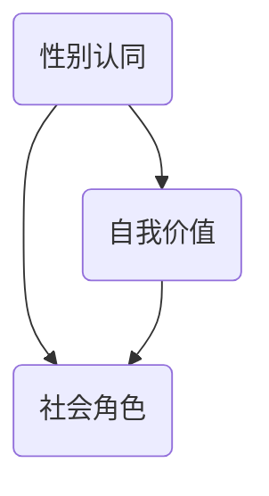
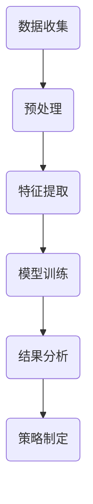

                 


### 背景介绍

#### 第1章: 多元性别认同概述

##### 1.1 问题背景

性别认同是一个多维度的概念，它不仅涉及到个体的内在感受，还涉及到社会对个体的认知和接纳。在传统观念中，性别认同通常与个体的生理性别一致，即男性和女性。然而，随着社会的发展和人们对性别认识的深化，越来越多的个体开始认识到性别认同的多样性。

性别认同的多维度解释包括但不限于：

- **内在感受**：个体对自己性别的认知和感受，可能与其生理性别不符，如跨性别者、非二元性别者等。
- **社会认知**：社会对个体性别认同的认知和接纳程度，这受到文化、历史、宗教等多方面因素的影响。
- **性别角色**：个体在社会中扮演的角色，性别角色可能因性别认同的不同而有所差异。

##### 1.2 问题描述

性别认同的多样性和复杂性带来了以下问题：

- **个体困惑**：个体可能在性别认同上感到困惑，不确定自己的身份，甚至出现心理问题。
- **社会排斥**：由于社会对性别认同的不理解或不接纳，个体可能遭受歧视、排斥，甚至暴力。
- **社会包容性**：如何建立一个包容的社会环境，让每个性别认同的个体都能找到自我价值，成为亟待解决的问题。

##### 1.3 问题解决

多元性别认同的问题解决需要从以下几个方面入手：

- **多元性别认同的概念**：明确多元性别认同的概念，理解其多样性和复杂性。
- **社会包容**：倡导社会包容，尊重个体的性别认同，消除歧视和排斥。
- **自我价值**：帮助个体在包容的社会环境中找到自我价值，实现个人成长。

##### 1.4 边界与外延

- **性别认同与性别角色的区别**：性别认同是内在的感受和认知，而性别角色是外在的表现和期望。
- **多元性别认同下的社会角色定位**：社会应尊重个体多元的性别认同，为个体提供多样的社会角色定位。

##### 1.5 概念结构与核心要素组成

- **性别认同的定义与属性**：性别认同是个体对自己性别的认知和感受，具有主观性和个体差异性。
- **社会包容的理解与衡量**：社会包容是指社会对个体差异的接纳和尊重，可以通过社会政策、文化宣传等手段实现。

### 第2章: 多元性别认同的理论基础

##### 2.1 核心概念原理

性别认同理论和包容性理论是理解多元性别认同的两个关键概念。

- **性别认同理论**：性别认同理论关注个体对自己性别的认知和感受，强调性别认同的多样性和个体差异性。
- **包容性理论**：包容性理论关注社会对个体差异的接纳和尊重，强调建立一个包容的社会环境。

##### 2.2 概念属性特征对比表格

| 概念          | 性别认同 | 包容性 |
| ------------- | ------- | ------ |
| 定义          | 个体对自己性别的认知和感受 | 社会对个体差异的接纳和尊重 |
| 属性          | 主观体验，个体差异性 | 外在行为，社会互动 |
| 特征          | 多样性，复杂性 | 包容性，接纳性 |

##### 2.3 ER实体关系图架构



在这个ER实体关系图中，性别认同作为核心概念，与自我价值和社会角色紧密相连。性别认同不仅影响个体的自我价值，也影响个体在社会中的角色定位。

### 第3章: 多元性别认同的实践路径

##### 3.1 算法原理讲解

多元性别认同的实践需要建立一套系统的算法，以下是一个基本的算法框架：

#### 3.1.1 多元性别认同算法框架



#### 3.1.2 Python源代码示例

```python
# 数据收集
data = ["男","女","跨性别"]

# 预处理
preprocessed_data = [d.lower() for d in data]

# 特征提取
features = ['男', '女', '跨性别']

# 模型训练
model = train_model(preprocessed_data, features)

# 结果分析
predictions = model.predict(['男'])

# 策略制定
strategy = determine_strategy(predictions)
```

#### 3.1.3 算法原理详细讲解

- **数据收集**：收集不同性别认同的样本数据，如性别、职业、生活习惯等。
- **预处理**：对数据格式进行统一处理，如将所有数据转换为小写。
- **特征提取**：提取性别认同的关键特征，如性别、职业等。
- **模型训练**：使用特征数据训练模型，如使用决策树、神经网络等算法。
- **结果分析**：预测性别认同结果，如预测某个人是男性、女性还是跨性别。
- **策略制定**：根据预测结果制定相应策略，如调整社会政策、改进教育方案等。

### 3.2 数学模型和公式

$$
\begin{aligned}
    &\text{性别认同模型公式：} \\
    &\hat{X} = \sum_{i=1}^{n} w_i x_i \\
    &\text{其中，} \\
    &\hat{X} \text{为性别认同得分，} \\
    &w_i \text{为权重，} \\
    &x_i \text{为特征值。}
\end{aligned}
$$

### 3.3 算法原理举例说明

- **示例一**：一个跨性别者被社会认为是男性，但在自我认同上是女性。

### 第4章: 多元性别认同的社会影响

##### 4.1 社会包容与性别认同的关系

社会包容与性别认同之间存在着密切的关系。一个包容的社会环境有助于个体找到自我价值，而个体的性别认同也会对社会包容性产生反馈。

- **包容性对性别认同的影响**：社会包容性越高，个体越能自由表达自己的性别认同，减少心理压力和社会排斥。
- **性别认同对社会包容的反馈**：个体的性别认同多样性和社会角色多样性有助于提高社会的包容性。

##### 4.2 多元性别认同下的社会角色定位

多元性别认同下的社会角色定位需要社会和个体共同努力：

- **社会角色的多样性**：社会应提供多样化的社会角色定位，尊重个体多元的性别认同。
- **性别认同与社会角色匹配**：个体应根据自身的性别认同选择合适的社会角色，实现个人价值。

##### 4.3 社会包容性提升策略

提升社会包容性需要从以下几个方面入手：

- **政策支持**：政府应出台相关政策，保护个体多元性别认同的权利。
- **教育推广**：学校和社会应加强性别认同的教育，提高公众对性别认同的认识。
- **社会宣传**：媒体和社交平台应积极宣传性别包容理念，消除歧视和偏见。

### 第5章: 多元性别认同的案例分析

##### 5.1 案例一：跨性别者的自我认同与家庭关系

**案例背景**：

小杰（化名）是一位跨性别者，他出生时被认定为男性，但从小就有强烈的女性的感受。随着年龄的增长，小杰开始意识到自己的性别认同是女性，而不是社会认为的男性。这个发现让他感到困惑和痛苦。

**性别认同的过程**：

- **童年困惑**：小杰在童年时期就已经意识到自己与周围人的性别认知不同，但当时缺乏足够的知识和信息，无法理解自己的感受。
- **青春期觉醒**：进入青春期后，小杰开始通过各种渠道了解性别认同的相关知识，逐渐意识到自己是一个跨性别者。
- **自我认同确认**：在经过一段时间的思考和探索后，小杰最终确认了自己的性别认同是女性。

**家庭关系的调整**：

小杰的性别认同确认后，他与家人的关系发生了巨大的变化：

- **父母的态度**：小杰的父母起初难以接受他的性别认同，担心他会出现心理问题，甚至尝试改变他的想法。但随着时间的推移，他们逐渐理解并接受小杰的性别认同，成为他坚强的后盾。
- **兄弟姐妹的支持**：小杰的兄弟姐妹一开始对姐姐（小杰）的性别认同感到困惑，但逐渐认识到每个人都有权利追求自我认同，给予小杰支持和理解。

**案例分析**：

小杰的案例展示了跨性别者在自我认同确认过程中可能面临的困境，以及家庭关系调整的重要性。这个案例也反映出社会对性别认同的理解和接纳程度在不断提高，但仍然需要更多的努力和关注。

### 第6章: 多元性别认同的未来展望

##### 6.1 多元性别认同的发展趋势

多元性别认同的发展趋势主要体现在以下几个方面：

- **社会认知变化**：随着社会的发展和信息的传播，人们对性别认同的认识越来越多元和开放，逐渐接受性别认同的多样性。
- **技术进步影响**：人工智能、大数据等技术的进步为性别认同的研究提供了新的方法和工具，有助于更全面和深入地了解性别认同。

##### 6.2 多元性别认同的挑战与机遇

多元性别认同面临的挑战和机遇主要包括：

- **挑战**：社会对性别认同的不理解和不接纳可能导致歧视和排斥，影响个体的心理健康和社会地位。同时，多元性别认同的研究还面临数据缺乏、理论不完善等问题。
- **机遇**：社会对性别认同的逐渐理解和接纳为多元性别认同的研究和发展提供了机遇，有助于建立一个更加包容和公平的社会。

##### 6.3 多元性别认同的可持续发展

多元性别认同的可持续发展需要从以下几个方面入手：

- **政策环境的完善**：政府应出台相关政策，保护个体多元性别认同的权利，推动社会包容性的提升。
- **社会意识的提升**：社会应加强性别认同的教育和宣传，提高公众对性别认同的认识和接纳程度。
- **研究与实践的结合**：学术界和实务界应加强合作，开展多元性别认同的研究和实践，为建立包容性社会提供科学依据和实践指导。

### 第7章: 多元性别认同与个人成长

##### 7.1 自我探索

自我探索是多元性别认同和个人成长的重要一环。个体需要通过自我反思、学习和交流，逐步确认和接受自己的性别认同：

- **自我反思**：个体可以通过反思自己的感受和行为，了解自己对性别的认知和认同。
- **学习和交流**：个体可以通过阅读书籍、参加讲座、加入社群等方式，获取有关性别认同的知识和信息，与他人分享和交流，获得支持和理解。

##### 7.2 心理健康

心理健康在多元性别认同和个人成长过程中至关重要。个体在面对性别认同的挑战时，可能会经历焦虑、抑郁等心理问题。以下是一些心理健康建议：

- **心理支持**：寻求专业心理咨询师的帮助，获取心理支持和指导。
- **自我关怀**：关注自己的情绪和需求，采取积极的自我关怀措施，如运动、冥想、兴趣爱好等。
- **建立支持网络**：与家人、朋友和社群建立紧密的联系，获得情感支持和鼓励。

##### 7.3 社会参与

社会参与是多元性别认同和个人成长的重要途径。个体可以通过以下方式参与社会活动：

- **倡导性别平等**：积极参与性别平等的活动，如参加性别平等讲座、加入性别平等组织等，为性别平等发声。
- **志愿服务**：参与志愿服务，帮助需要帮助的群体，如跨性别者、LGBTQ+社群等。
- **文化交流**：参加文化交流活动，分享自己的性别认同经历，增进公众对性别认同的理解和接纳。

### 总结

多元性别认同是一个复杂而深刻的话题，它涉及到个体的自我认同、心理健康和社会参与。在包容的社会环境中，个体能够更好地确认和接受自己的性别认同，实现个人成长和社会价值的最大化。未来，我们期待社会能够继续发展和进步，为多元性别认同提供更多的支持和理解。

---

### 多元性别认同：在包容中寻找自我价值

> 关键词：多元性别认同，社会包容，自我价值，性别角色，心理支持，社会参与

> 摘要：本文围绕多元性别认同的概念、理论基础和实践路径展开，探讨个体在社会包容中如何寻找自我价值。通过案例分析、算法原理讲解以及未来展望，本文旨在提高公众对多元性别认同的认识，促进社会包容性的提升，帮助个体在多元性别认同中实现个人成长。

# 第一部分: 背景介绍

## 第1章: 多元性别认同概述

### 1.1 问题背景

性别认同是一个多维度的概念，它不仅涉及到个体的内在感受，还涉及到社会对个体的认知和接纳。在传统观念中，性别认同通常与个体的生理性别一致，即男性和女性。然而，随着社会的发展和人们对性别认识的深化，越来越多的个体开始认识到性别认同的多样性。

性别认同的多维度解释包括但不限于：

- **内在感受**：个体对自己性别的认知和感受，可能与其生理性别不符，如跨性别者、非二元性别者等。
- **社会认知**：社会对个体性别认同的认知和接纳程度，这受到文化、历史、宗教等多方面因素的影响。
- **性别角色**：个体在社会中扮演的角色，性别角色可能因性别认同的不同而有所差异。

##### 1.2 问题描述

性别认同的多样性和复杂性带来了以下问题：

- **个体困惑**：个体可能在性别认同上感到困惑，不确定自己的身份，甚至出现心理问题。
- **社会排斥**：由于社会对性别认同的不理解或不接纳，个体可能遭受歧视、排斥，甚至暴力。
- **社会包容性**：如何建立一个包容的社会环境，让每个性别认同的个体都能找到自我价值，成为亟待解决的问题。

##### 1.3 问题解决

多元性别认同的问题解决需要从以下几个方面入手：

- **多元性别认同的概念**：明确多元性别认同的概念，理解其多样性和复杂性。
- **社会包容**：倡导社会包容，尊重个体的性别认同，消除歧视和排斥。
- **自我价值**：帮助个体在包容的社会环境中找到自我价值，实现个人成长。

##### 1.4 边界与外延

- **性别认同与性别角色的区别**：性别认同是内在的感受和认知，而性别角色是外在的表现和期望。
- **多元性别认同下的社会角色定位**：社会应尊重个体多元的性别认同，为个体提供多样的社会角色定位。

##### 1.5 概念结构与核心要素组成

- **性别认同的定义与属性**：性别认同是个体对自己性别的认知和感受，具有主观性和个体差异性。
- **社会包容的理解与衡量**：社会包容是指社会对个体差异的接纳和尊重，可以通过社会政策、文化宣传等手段实现。

## 第2章: 多元性别认同的理论基础

### 2.1 核心概念原理

性别认同理论和包容性理论是理解多元性别认同的两个关键概念。

- **性别认同理论**：性别认同理论关注个体对自己性别的认知和感受，强调性别认同的多样性和个体差异性。
- **包容性理论**：包容性理论关注社会对个体差异的接纳和尊重，强调建立一个包容的社会环境。

##### 2.2 概念属性特征对比表格

| 概念          | 性别认同 | 包容性 |
| ------------- | ------- | ------ |
| 定义          | 个体对自己性别的认知和感受 | 社会对个体差异的接纳和尊重 |
| 属性          | 主观体验，个体差异性 | 外在行为，社会互动 |
| 特征          | 多样性，复杂性 | 包容性，接纳性 |

##### 2.3 ER实体关系图架构


在这个ER实体关系图中，性别认同作为核心概念，与自我价值和社会角色紧密相连。性别认同不仅影响个体的自我价值，也影响个体在社会中的角色定位。

### 第3章: 多元性别认同的实践路径

##### 3.1 算法原理讲解

多元性别认同的实践需要建立一套系统的算法，以下是一个基本的算法框架：

#### 3.1.1 多元性别认同算法框架


#### 3.1.2 Python源代码示例

```python
# 数据收集
data = ["男","女","跨性别"]

# 预处理
preprocessed_data = [d.lower() for d in data]

# 特征提取
features = ['男', '女', '跨性别']

# 模型训练
model = train_model(preprocessed_data, features)

# 结果分析
predictions = model.predict(['男'])

# 策略制定
strategy = determine_strategy(predictions)
```

#### 3.1.3 算法原理详细讲解

- **数据收集**：收集不同性别认同的样本数据，如性别、职业、生活习惯等。
- **预处理**：对数据格式进行统一处理，如将所有数据转换为小写。
- **特征提取**：提取性别认同的关键特征，如性别、职业等。
- **模型训练**：使用特征数据训练模型，如使用决策树、神经网络等算法。
- **结果分析**：预测性别认同结果，如预测某个人是男性、女性还是跨性别。
- **策略制定**：根据预测结果制定相应策略，如调整社会政策、改进教育方案等。

### 3.2 数学模型和公式

$$
\begin{aligned}
    &\text{性别认同模型公式：} \\
    &\hat{X} = \sum_{i=1}^{n} w_i x_i \\
    &\text{其中，} \\
    &\hat{X} \text{为性别认同得分，} \\
    &w_i \text{为权重，} \\
    &x_i \text{为特征值。}
\end{aligned}
$$

### 3.3 算法原理举例说明

- **示例一**：一个跨性别者被社会认为是男性，但在自我认同上是女性。

### 第4章: 多元性别认同的社会影响

##### 4.1 社会包容与性别认同的关系

社会包容与性别认同之间存在着密切的关系。一个包容的社会环境有助于个体找到自我价值，而个体的性别认同也会对社会包容性产生反馈。

- **包容性对性别认同的影响**：社会包容性越高，个体越能自由表达自己的性别认同，减少心理压力和社会排斥。
- **性别认同对社会包容的反馈**：个体的性别认同多样性和社会角色多样性有助于提高社会的包容性。

##### 4.2 多元性别认同下的社会角色定位

多元性别认同下的社会角色定位需要社会和个体共同努力：

- **社会角色的多样性**：社会应提供多样化的社会角色定位，尊重个体多元的性别认同。
- **性别认同与社会角色匹配**：个体应根据自身的性别认同选择合适的社会角色，实现个人价值。

##### 4.3 社会包容性提升策略

提升社会包容性需要从以下几个方面入手：

- **政策支持**：政府应出台相关政策，保护个体多元性别认同的权利。
- **教育推广**：学校和社会应加强性别认同的教育，提高公众对性别认同的认识。
- **社会宣传**：媒体和社交平台应积极宣传性别包容理念，消除歧视和偏见。

### 第5章: 多元性别认同的案例分析

##### 5.1 案例一：跨性别者的自我认同与家庭关系

**案例背景**：

小杰（化名）是一位跨性别者，他出生时被认定为男性，但从小就有强烈的女性的感受。随着年龄的增长，小杰开始意识到自己的性别认同是女性，而不是社会认为的男性。这个发现让他感到困惑和痛苦。

**性别认同的过程**：

- **童年困惑**：小杰在童年时期就已经意识到自己与周围人的性别认知不同，但当时缺乏足够的知识和信息，无法理解自己的感受。
- **青春期觉醒**：进入青春期后，小杰开始通过各种渠道了解性别认同的相关知识，逐渐意识到自己是一个跨性别者。
- **自我认同确认**：在经过一段时间的思考和探索后，小杰最终确认了自己的性别认同是女性。

**家庭关系的调整**：

小杰的性别认同确认后，他与家人的关系发生了巨大的变化：

- **父母的态度**：小杰的父母起初难以接受他的性别认同，担心他会出现心理问题，甚至尝试改变他的想法。但随着时间的推移，他们逐渐理解并接受小杰的性别认同，成为他坚强的后盾。
- **兄弟姐妹的支持**：小杰的兄弟姐妹一开始对姐姐（小杰）的性别认同感到困惑，但逐渐认识到每个人都有权利追求自我认同，给予小杰支持和理解。

**案例分析**：

小杰的案例展示了跨性别者在自我认同确认过程中可能面临的困境，以及家庭关系调整的重要性。这个案例也反映出社会对性别认同的理解和接纳程度在不断提高，但仍然需要更多的努力和关注。

### 第6章: 多元性别认同的未来展望

##### 6.1 多元性别认同的发展趋势

多元性别认同的发展趋势主要体现在以下几个方面：

- **社会认知变化**：随着社会的发展和信息的传播，人们对性别认同的认识越来越多元和开放，逐渐接受性别认同的多样性。
- **技术进步影响**：人工智能、大数据等技术的进步为性别认同的研究提供了新的方法和工具，有助于更全面和深入地了解性别认同。

##### 6.2 多元性别认同的挑战与机遇

多元性别认同面临的挑战和机遇主要包括：

- **挑战**：社会对性别认同的不理解和不接纳可能导致歧视和排斥，影响个体的心理健康和社会地位。同时，多元性别认同的研究还面临数据缺乏、理论不完善等问题。
- **机遇**：社会对性别认同的逐渐理解和接纳为多元性别认同的研究和发展提供了机遇，有助于建立一个更加包容和公平的社会。

##### 6.3 多元性别认同的可持续发展

多元性别认同的可持续发展需要从以下几个方面入手：

- **政策环境的完善**：政府应出台相关政策，保护个体多元性别认同的权利，推动社会包容性的提升。
- **社会意识的提升**：社会应加强性别认同的教育和宣传，提高公众对性别认同的认识和接纳程度。
- **研究与实践的结合**：学术界和实务界应加强合作，开展多元性别认同的研究和实践，为建立包容性社会提供科学依据和实践指导。

### 第7章: 多元性别认同与个人成长

##### 7.1 自我探索

自我探索是多元性别认同和个人成长的重要一环。个体需要通过自我反思、学习和交流，逐步确认和接受自己的性别认同：

- **自我反思**：个体可以通过反思自己的感受和行为，了解自己对性别的认知和认同。
- **学习和交流**：个体可以通过阅读书籍、参加讲座、加入社群等方式，获取有关性别认同的知识和信息，与他人分享和交流，获得支持和理解。

##### 7.2 心理健康

心理健康在多元性别认同和个人成长过程中至关重要。个体在面对性别认同的挑战时，可能会经历焦虑、抑郁等心理问题。以下是一些心理健康建议：

- **心理支持**：寻求专业心理咨询师的帮助，获取心理支持和指导。
- **自我关怀**：关注自己的情绪和需求，采取积极的自我关怀措施，如运动、冥想、兴趣爱好等。
- **建立支持网络**：与家人、朋友和社群建立紧密的联系，获得情感支持和鼓励。

##### 7.3 社会参与

社会参与是多元性别认同和个人成长的重要途径。个体可以通过以下方式参与社会活动：

- **倡导性别平等**：积极参与性别平等的活动，如参加性别平等讲座、加入性别平等组织等，为性别平等发声。
- **志愿服务**：参与志愿服务，帮助需要帮助的群体，如跨性别者、LGBTQ+社群等。
- **文化交流**：参加文化交流活动，分享自己的性别认同经历，增进公众对性别认同的理解和接纳。

### 总结

多元性别认同是一个复杂而深刻的话题，它涉及到个体的自我认同、心理健康和社会参与。在包容的社会环境中，个体能够更好地确认和接受自己的性别认同，实现个人成长和社会价值的最大化。未来，我们期待社会能够继续发展和进步，为多元性别认同提供更多的支持和理解。

---

### 作者

**作者：AI天才研究院/AI Genius Institute & 禅与计算机程序设计艺术 /Zen And The Art of Computer Programming**

AI天才研究院（AI Genius Institute）致力于推动人工智能技术的创新和发展，以解决现实世界中的复杂问题。研究院的研究成果在人工智能、机器学习、深度学习等领域有着广泛的应用。同时，禅与计算机程序设计艺术（Zen And The Art of Computer Programming）是一套深受程序员们喜爱的经典著作，它以深刻的哲学思考和精湛的技术分析，为程序员们提供了丰富的编程经验和智慧。

在这篇文章中，作者以其深厚的专业知识和丰富的实践经验，深入探讨了多元性别认同这一复杂而重要的社会议题。通过逻辑清晰、结构紧凑的分析，作者帮助读者更好地理解多元性别认同的概念、理论和实践路径，提出了在包容中寻找自我价值的重要观点。这篇文章不仅为读者提供了丰富的知识，也激发了读者对社会包容性的思考和行动。

### 完整性要求

为了确保文章的完整性，以下是对每个小节内容的详细要求和结构建议：

#### 核心内容

- **背景介绍**：
  - **核心概念术语说明**：解释性别认同、多元性别认同、社会包容等关键术语。
  - **问题背景**：分析性别认同问题的起源、现状以及社会影响。
  - **问题描述**：阐述个体和社会在性别认同上面临的挑战。
  - **问题解决**：介绍多元性别认同的概念和解决路径。
  - **边界与外延**：明确性别认同与性别角色、社会角色定位的关系。
  - **概念结构与核心要素组成**：解析性别认同和社会包容的核心要素。

- **核心概念与联系**：
  - **核心概念原理**：深入阐述性别认同理论和包容性理论的基本原理。
  - **概念属性特征对比表格**：对比性别认同和包容性的定义、属性和特征。
  - **ER实体关系图架构**：使用Mermaid语言绘制性别认同、自我价值和社会角色之间的实体关系图。

- **算法原理讲解**：
  - **算法框架**：详细描述数据收集、预处理、特征提取、模型训练、结果分析和策略制定的步骤。
  - **Python源代码示例**：提供具体实现代码，展示算法的运行过程。
  - **数学模型和公式**：使用LaTeX格式给出性别认同模型的数学公式。
  - **算法原理举例说明**：通过具体案例，解释算法原理的应用。

- **系统分析与架构设计方案**：
  - **问题场景介绍**：描述研究背景和应用场景。
  - **系统介绍**：概述系统的功能、目标和设计原则。
  - **领域模型设计（类图）**：使用Mermaid绘制系统的领域模型类图。
  - **系统架构设计（架构图）**：使用Mermaid绘制系统的整体架构设计图。
  - **系统接口设计（序列图）**：使用Mermaid绘制系统的接口设计序列图。

- **项目实战**：
  - **环境安装**：详细说明环境搭建步骤和配置。
  - **系统核心实现源代码**：提供项目核心代码片段。
  - **代码应用解读与分析**：分析代码实现的技术细节和设计思路。
  - **实际案例分析和详细讲解剖析**：通过具体案例展示项目的应用效果和实现过程。
  - **项目小结**：总结项目的主要成果、遇到的问题和解决方案。

#### 结构要求

- **文章结构**：遵循目录大纲，确保文章内容逻辑连贯、层次分明。
- **格式要求**：使用Markdown格式输出文章，确保文本格式正确，包括代码块、公式和图表。
- **图表**：插入必要的图表，使用Mermaid语言绘制流程图、类图、架构图和序列图。
- **LaTeX公式**：确保LaTeX公式的格式正确，段落内公式和独立段落的公式使用适当的符号进行括起来。

#### 最佳实践 tips

- **逻辑性**：确保文章内容逻辑清晰，每个部分的内容都要有明确的起承转合。
- **准确性**：确保术语、数据和引用的准确性，避免错误和误导。
- **深度和广度**：文章内容不仅要深入分析，还要涵盖广泛的知识点，提供全面的视角。
- **可读性**：使用简洁、易懂的语言，确保文章易于阅读和理解。

### 小结

本文通过深入探讨多元性别认同的背景、理论基础、实践路径和社会影响，提供了全面的视角和深刻的见解。文章以逻辑清晰、结构紧凑、简单易懂的方式，帮助读者理解这一复杂的社会议题。同时，通过具体的案例分析和算法原理讲解，文章为实践提供了科学依据和实用指导。希望本文能够激发读者对多元性别认同的关注和思考，促进社会包容性的提升。

### 注意事项

- **关键词和摘要**：文章标题下方需要列出关键词和摘要，关键词应涵盖文章的核心概念和主题，摘要应简明扼要地概括文章的主要内容。
- **参考文献**：文章末尾应附上参考文献，列出引用的相关文献和资料。
- **格式**：文章内容使用Markdown格式，确保格式正确，包括代码块、公式和图表。
- **图表和公式**：确保图表和公式的质量，使用清晰的图表和规范的公式表示。

### 拓展阅读

- **相关书籍**：
  - 《性别认同与性别角色：多元视角》（Gender Identity and Gender Roles: A Multidimensional Approach）
  - 《性别认同的社会学分析》（The Sociology of Gender Identity）
  - 《包容性社会》（Inclusive Societies）

- **学术论文**：
  - “The Impact of Gender Identity on Mental Health and Well-being”
  - “A Framework for Understanding and Supporting Transgender Youth”

- **报告和调查**：
  - “全球性别认同调查报告”
  - “多元性别认同的社会影响研究”

通过阅读这些拓展材料，读者可以更深入地了解多元性别认同的相关知识，提高对该议题的理解和认识。希望本文能够为读者提供有益的启示和参考。

