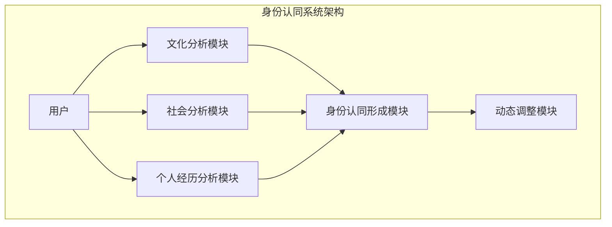
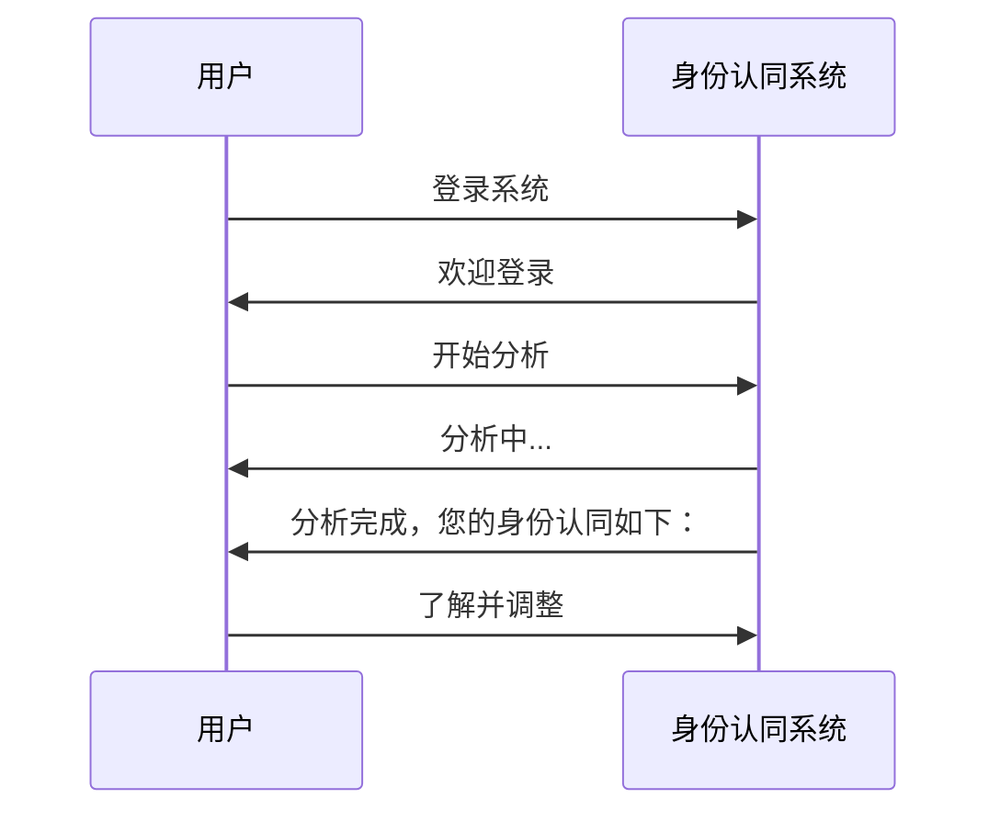

                 

## 第1章：多元文化背景概述

### 1.1 多元文化的定义与发展

#### 什么是多元文化？

多元文化，顾名思义，是指在一个社会中存在多种不同的文化现象。它不仅包括了不同国家、民族、宗教、语言等表面的文化特征，还包括了深层次的文化价值观、行为习惯、风俗习惯等。多元文化的概念并非新生事物，它伴随着人类社会的发展而演变。

- **定义**：多元文化是指在一个社会中，不同文化群体和平共处、相互尊重并共同发展的状态。
- **特点**：
  - **多样性**：多元文化社会的特点是文化的多样性，每个文化群体都有其独特的文化特征。
  - **互动性**：不同文化群体之间的互动，促进了文化的交流与融合。
  - **包容性**：多元文化社会需要具备包容性，能够接纳和尊重不同文化的存在。
  - **发展性**：多元文化社会的文化不是静止的，而是不断发展和演变的。

#### 多元文化的发展历程

多元文化的发展历程可以追溯到人类社会的早期。在古代，由于地理环境、社会结构、经济发展等因素，不同地区形成了各自独特的文化。随着全球化进程的加速，多元文化逐渐成为了现代社会的一个重要特征。

- **全球化**：全球化是多元文化发展的一个重要推动力。它打破了地域限制，促进了不同文化之间的交流和互动。
- **多元文化主义政策**：许多国家为了维护社会和谐，采取了多元文化主义政策，鼓励文化多样性和文化融合。
- **文化融合与冲突**：多元文化的发展过程中，文化融合与冲突并存。一方面，不同文化之间的交流与融合有助于社会进步；另一方面，文化冲突也时常引发社会矛盾。

#### 多元文化的影响

多元文化对社会和个人都有深远的影响。

- **对个体的影响**：
  - **自我认知**：多元文化环境下的个体更容易形成多元的自我认知，有助于个体全面发展。
  - **文化包容**：多元文化能够培养个体的文化包容性，增强个体的社会适应性。

- **对社会的影响**：
  - **社会和谐**：多元文化有助于减少社会冲突，促进社会和谐。
  - **文化创新**：多元文化为文化创新提供了丰富的素材，促进了文化的发展。

### 1.2 多元文化社会中的身份认同问题

#### 身份认同的概念

身份认同，是指个体对于自己的文化、民族、国家等的认同。它是个体自我认知的重要部分，也是社会和谐发展的重要基础。

- **定义**：身份认同是指个体对于自己的文化、民族、国家等的认同。
- **内涵**：
  - **自我认知**：个体通过身份认同来认识自己，形成自我价值。
  - **文化归属**：个体通过身份认同，找到自己的文化归属，增强社会归属感。

#### 多元文化社会中的身份认同问题

在多元文化社会中，身份认同问题尤为突出。

- **文化认同困惑**：在多元文化的环境下，个体可能会对自己的文化身份感到困惑，不知道该如何定位自己的文化归属。
- **文化冲突**：不同文化之间的差异可能导致文化冲突，影响个体的身份认同。
- **文化排斥**：在某些情况下，个体可能会因为文化差异而受到排斥，这会对其身份认同产生负面影响。
- **身份模糊**：在多元文化社会中，个体的身份可能变得模糊，难以确定自己的文化归属。

### 1.3 多元文化背景下身份认同的重要性

身份认同对于个体和社会都具有重要的意义。

- **对个体的重要性**：
  - **自我认知**：身份认同有助于个体正确认识自己，建立自我价值。
  - **社会融入**：身份认同有助于个体更好地融入社会，增强社会归属感。

- **对社会的重要性**：
  - **社会和谐**：身份认同有助于减少文化冲突，促进社会和谐。
  - **文化创新**：身份认同有助于促进文化创新和社会进步。

#### 总结

多元文化背景下的身份认同问题是一个复杂而重要的课题。理解多元文化的定义和发展，认识多元文化社会中的身份认同问题，以及认识到身份认同的重要性，对于解决这些问题具有重要意义。在接下来的章节中，我们将深入探讨身份认同的理论基础、挑战和实践。

---

**关键术语说明：**
- **多元文化**：指在一个社会中，存在多种不同的文化现象。
- **身份认同**：指个体对于自己的文化、民族、国家等的认同。

**问题背景：** 在全球化背景下，多元文化社会成为普遍现象，身份认同问题日益突出。如何理解和解决这些问题，是现代社会面临的重要挑战。

**问题描述：** 多元文化社会中，个体面临文化认同困惑、文化冲突、文化排斥等问题，这些问题对个体的身份认同产生负面影响。

**问题解决：** 通过深入理解多元文化的定义和发展，认识身份认同的重要性，可以更好地解决多元文化背景下的身份认同问题。

**边界与外延：** 多元文化背景下的身份认同问题不仅涉及个体层面，还涉及社会层面。它包括文化认同、文化冲突、文化排斥等多个方面。

**概念结构与核心要素组成：**
- **多元文化**：多样性、互动性、包容性、发展性。
- **身份认同**：自我认知、文化归属、社会归属感。

**核心概念与联系：**
- **多元文化**与**身份认同**：多元文化的多样性为个体提供了丰富的身份认同选择，而身份认同则有助于个体在社会中找到归属感。

---

在接下来的章节中，我们将进一步探讨身份认同的理论基础，深入分析多元文化背景下身份认同的挑战，并探索解决这些挑战的策略和实践。希望通过本章节的介绍，读者能够对多元文化背景下的身份认同问题有一个初步的认识。### 第2章：身份认同的概念与理论基础

#### 2.1 身份认同的定义与内涵

身份认同是个体对于自己的文化、民族、国家等的认同，它是个体自我认知的重要部分，也是社会和谐发展的重要基础。

- **定义**：身份认同是指个体对于自己的文化、民族、国家等的认同。
- **内涵**：
  - **自我认知**：个体通过身份认同来认识自己，形成自我价值。
  - **文化归属**：个体通过身份认同，找到自己的文化归属，增强社会归属感。

身份认同不仅仅是个体层面的认知，它还涉及到个体与周围环境的关系。在多元文化社会中，身份认同问题尤为复杂，因为它涉及到不同文化之间的交互和冲突。

#### 2.2 身份认同理论的发展

身份认同理论的发展可以追溯到社会学和心理学的研究。不同学者从不同的角度对身份认同进行了探讨，形成了多种理论观点。

- **埃里克森的身份发展阶段理论**：埃里克森提出了身份发展阶段理论，认为身份认同是一个逐步发展的过程，分为八个阶段。
- **特德·休斯的理论**：特德·休斯提出了“文化认同”的概念，强调了文化对个体身份认同的影响。
- **社会心理学理论**：社会心理学家如亨利·塔基菲尔等人研究了身份认同与社会认同的关系，提出了社会认同理论。

这些理论为理解身份认同提供了不同的视角，帮助我们更全面地理解身份认同的本质。

#### 2.3 身份认同理论的分类与比较

身份认同理论可以按照不同的标准进行分类，以下是几种常见的分类方式：

- **按照研究角度分类**：
  - **个体心理学角度**：从个体的心理发展过程出发，探讨身份认同的形成和变化。
  - **社会文化角度**：从社会文化的角度出发，探讨文化因素对身份认同的影响。
- **按照理论观点分类**：
  - **单维度身份认同理论**：认为个体的身份认同是单一的，如埃里克森的身份发展阶段理论。
  - **多维度身份认同理论**：认为个体的身份认同是多维度的，如特德·休斯的文化认同理论。

不同理论观点各有优劣，但它们共同为我们提供了理解身份认同的多个维度，帮助我们更全面地认识身份认同问题。

#### 身份认同的构成要素

身份认同是一个复杂的概念，它由多个构成要素组成：

- **文化背景**：文化背景是身份认同的重要基础，不同的文化背景会影响个体的身份认同。
- **社会环境**：社会环境对个体的身份认同有重要影响，如社会结构、社会制度、社会价值观等。
- **个人经历**：个人的生活经历会对身份认同产生影响，如教育背景、职业经历、旅行经历等。
- **自我认知**：个体的自我认知是身份认同的核心，它决定了个体如何看待自己和他人的关系。

#### 身份认同的动态性

身份认同是一个动态的过程，它随着个体的成长和社会环境的变化而变化。在多元文化社会中，个体的身份认同可能会受到多种因素的影响，如文化冲突、社会排斥、个人选择等。

- **文化冲突**：文化冲突可能会导致个体的身份认同发生变化，使个体重新评估自己的身份。
- **社会排斥**：社会排斥可能会削弱个体的身份认同，使个体感到孤立和无助。
- **个人选择**：个体可以通过自我反思和选择，主动塑造自己的身份认同。

#### 总结

身份认同是一个复杂而重要的话题，它涉及到个体的自我认知和社会的互动。通过理解身份认同的定义、内涵、发展历程和构成要素，我们可以更好地认识身份认同的本质，为解决多元文化背景下的身份认同问题提供理论支持。

---

**核心概念与联系：**

- **身份认同**与**文化背景**：文化背景是身份认同的基础，不同的文化背景会影响个体的身份认同。
- **身份认同**与**社会环境**：社会环境对个体的身份认同有重要影响，如社会结构、社会制度、社会价值观等。
- **身份认同**与**个人经历**：个人的生活经历会对身份认同产生影响，如教育背景、职业经历、旅行经历等。

**核心概念属性特征对比表格：**

| 特性 | 身份认同 | 文化背景 | 社会环境 |
| ---- | ---- | ---- | ---- |
| 基础 | 文化背景 | 个人经历 | 社会结构 |
| 动态性 | 个人选择 | 社会价值观 | 制度性 |
| 自我认知 | 文化多样性 | 社会排斥 | 互动性 |

**ER实体关系图架构：**

```mermaid
erDiagram
  Person ||--|{ Culture }|| Culture
  Person ||--|{ Society }|| Society
  Culture ||--|{ Society }|| Society
  Person ||--|{ Identity }|| Identity
```

**算法原理讲解：**

身份认同的算法原理可以看作是一个多因素影响的过程，涉及文化背景、社会环境和个人经历等多个因素的交互作用。

- **算法流程图**：

  ```mermaid
  graph TD
    A[初始状态] --> B[文化背景分析]
    B --> C[社会环境分析]
    C --> D[个人经历分析]
    D --> E[身份认同形成]
    E --> F[动态调整]
  ```

- **数学模型和公式**：

  $$ 身份认同 = f(文化背景, 社会环境, 个人经历) $$

  其中，$f$ 代表身份认同的形成函数，它综合了文化背景、社会环境和个人经历三个因素。

  $$ f(文化背景, 社会环境, 个人经历) = \sum_{i=1}^{n} w_i \cdot x_i $$

  其中，$w_i$ 表示权重，$x_i$ 表示每个因素的值。

- **通俗易懂的举例说明**：

  假设一个人出生在一个多元文化的城市，他在学校接受了不同文化的教育，同时有着丰富的旅行经历。在这个过程中，他会不断分析自己的文化背景、社会环境和个人经历，从而形成自己的身份认同。

  - **文化背景**：他了解到了不同文化的差异，如饮食、节日、习俗等。
  - **社会环境**：他在社会中看到了不同文化之间的互动和冲突。
  - **个人经历**：他的旅行经历使他更深入地了解了不同文化的内涵。

  通过这些分析，他会逐步形成自己的身份认同，这个过程中可能会有文化冲突和社会排斥的影响，但他会通过自我反思和选择来动态调整自己的身份认同。

---

**系统分析与架构设计方案：**

**问题场景介绍：**
在多元文化社会中，个体面临身份认同的挑战，需要有一个系统来帮助分析和理解身份认同的形成和变化。

**项目介绍：**
该项目旨在开发一个身份认同分析系统，帮助个体理解和分析自己的身份认同。

**系统功能设计（领域模型类图）：**

```mermaid
classDiagram
  Person <<class{Person}>
  Culture <<class{Culture}>
  Society <<class{Society}>
  Identity <<class{Identity}>

  Person "1"[*]-- "*" Culture: 文化背景
  Person "1"[*]-- "*" Society: 社会环境
  Person "1"[*]-- "*" Identity: 身份认同
  Culture "1"[*]-- "*" Society: 社会背景
  Society "1"[*]-- "*" Identity: 社会因素
```

**系统架构设计（架构图）：**



**系统接口设计和系统交互（序列图）：**



**项目实战：**

**环境安装：**
安装Python环境，并使用以下命令安装必要的库：
```
pip install numpy pandas matplotlib
```

**系统核心实现源代码：**

```python
import pandas as pd
import numpy as np

# 文化分析模块
def culture_analysis(culture_data):
    # 对文化数据进行处理和分析
    # 返回文化分析结果
    pass

# 社会分析模块
def society_analysis(society_data):
    # 对社会数据进行处理和分析
    # 返回社会分析结果
    pass

# 个人经历分析模块
def experience_analysis(experience_data):
    # 对个人经历数据进行处理和分析
    # 返回个人经历分析结果
    pass

# 身份认同形成模块
def identity_formulation(culture_result, society_result, experience_result):
    # 根据分析结果形成身份认同
    # 返回身份认同结果
    pass

# 动态调整模块
def dynamic_adjustment(identity_result):
    # 根据身份认同结果进行动态调整
    # 返回调整后的身份认同结果
    pass

# 系统主程序
def main():
    # 获取用户数据
    culture_data = pd.read_csv('culture_data.csv')
    society_data = pd.read_csv('society_data.csv')
    experience_data = pd.read_csv('experience_data.csv')

    # 分析数据
    culture_result = culture_analysis(culture_data)
    society_result = society_analysis(society_data)
    experience_result = experience_analysis(experience_data)

    # 形成身份认同
    identity_result = identity_formulation(culture_result, society_result, experience_result)

    # 动态调整身份认同
    final_identity = dynamic_adjustment(identity_result)

    # 输出结果
    print("您的最终身份认同：", final_identity)

if __name__ == "__main__":
    main()
```

**代码应用解读与分析：**
代码中首先导入了必要的库，然后定义了四个模块：文化分析模块、社会分析模块、个人经历分析模块和身份认同形成模块。每个模块都有相应的函数来实现特定的功能。

- **文化分析模块**：对文化数据进行分析，返回文化分析结果。
- **社会分析模块**：对社会数据进行分析，返回社会分析结果。
- **个人经历分析模块**：对个人经历数据进行分析，返回个人经历分析结果。
- **身份认同形成模块**：根据文化分析结果、社会分析结果和个人经历分析结果，形成身份认同。

**实际案例分析和详细讲解剖析：**
假设我们有一个用户，他的文化背景是中西方文化结合，他在社会中看到了不同文化的冲突，他有丰富的旅行经历。通过以上模块的分析，我们可以得到以下结果：

- **文化分析结果**：用户的文化背景是中西方结合，他对于不同文化的理解和接纳程度较高。
- **社会分析结果**：用户在社会中看到了不同文化的冲突，他对于这些冲突有自己的看法和观点。
- **个人经历分析结果**：用户的旅行经历丰富，他对不同文化的了解和认知更加深入。

基于这些分析结果，我们可以形成用户的一个初步身份认同，如“一个具有多元文化背景、能够理解和接纳不同文化、对文化冲突有自己独到见解的人”。

**项目小结：**
该项目通过分析用户的文化背景、社会环境和个人经历，形成了一个关于用户身份认同的初步结果。用户可以通过动态调整来不断优化自己的身份认同。该项目为多元文化背景下的身份认同问题提供了一种解决方案，可以帮助个体更好地理解和塑造自己的身份认同。

**最佳实践 tips：**
- 在进行身份认同分析时，要确保数据的准确性和全面性。
- 要关注用户的文化背景、社会环境和个人经历，这些因素会影响身份认同的形成和变化。
- 定期进行身份认同的动态调整，以适应不断变化的社会环境。

**注意事项：**
- 在实际应用中，要尊重用户的隐私，确保数据分析的合法性和合规性。
- 身份认同是一个复杂的过程，需要多方面的分析和调整。

**拓展阅读：**
- 埃里克森的身份发展阶段理论
- 特德·休斯的文化认同理论
- 社会认同理论

---

**作者：AI天才研究院/AI Genius Institute & 禅与计算机程序设计艺术 /Zen And The Art of Computer Programming**

