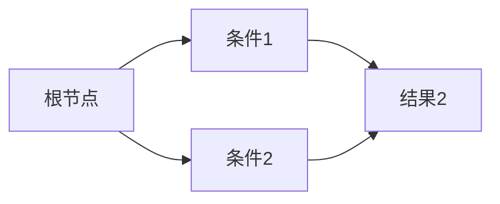
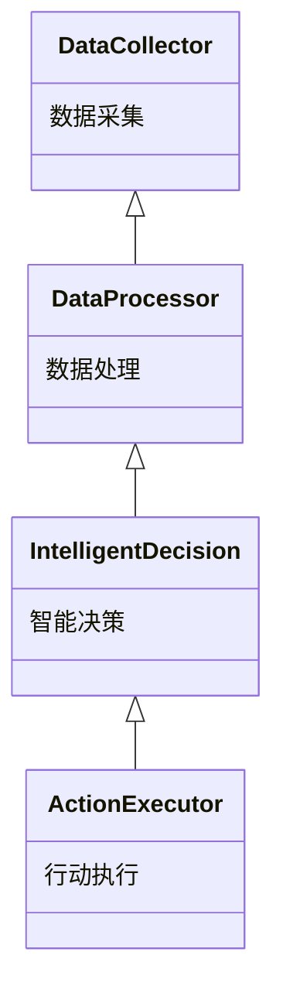
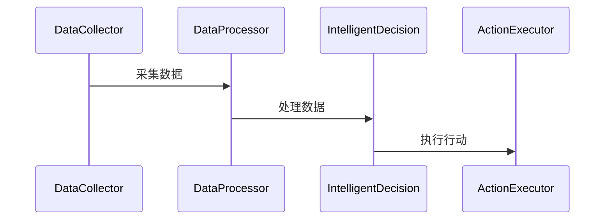
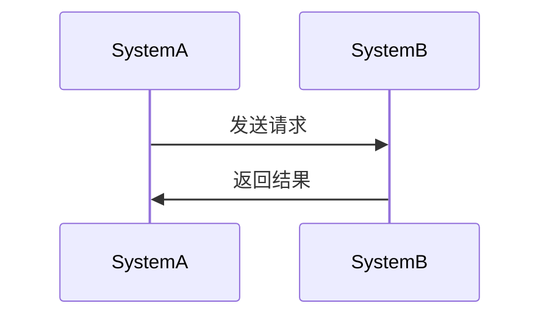

                 

### 《大规模AI Agent系统的部署与维护》

关键词：大规模AI Agent系统，部署，维护，架构设计，性能优化

摘要：本文旨在深入探讨大规模AI Agent系统的部署与维护。首先，我们将介绍大规模AI Agent系统的背景和核心概念，然后详细分析其部署和架构设计，接着阐述硬件和软件需求，最后探讨系统的维护与优化策略。通过本文，读者将全面了解如何成功部署和维护大规模AI Agent系统。

## 第一部分：引言与背景

### 第1章：大规模AI Agent系统概述

**1.1 问题背景**

在当今快速发展的AI领域，如何实现大规模AI Agent系统的部署与维护成为关键问题。AI Agent系统是一种智能体系统，能够模拟人类的行为和决策过程，并具备自主学习和适应环境的能力。随着数据量的爆炸式增长和算法的飞速进步，大规模AI Agent系统的应用场景越来越广泛，如自动驾驶、智能客服、金融风控等。然而，大规模AI Agent系统的部署与维护面临着诸多挑战，包括系统的可扩展性、可靠性、性能优化等。

**1.2 问题解决**

本文通过系统地介绍大规模AI Agent系统的概念、结构以及面临的挑战，帮助读者全面理解该领域。我们将详细分析大规模AI Agent系统的核心概念，如智能体、决策树、神经网络等，以及这些要素如何相互作用。同时，我们将探讨大规模AI Agent系统的应用场景、发展趋势及其在社会和经济层面的影响。

**1.3 边界与外延**

大规模AI Agent系统的应用场景包括但不限于以下领域：

1. 自动驾驶：自动驾驶系统需要大规模AI Agent系统来处理复杂的交通场景，实现车辆的自主驾驶。
2. 智能客服：智能客服系统需要大规模AI Agent系统来模拟人类的交流方式，提供高质量的客户服务。
3. 金融风控：金融风控系统需要大规模AI Agent系统来分析大量的交易数据，发现潜在的金融风险。
4. 供应链管理：供应链管理系统需要大规模AI Agent系统来优化库存管理、物流调度等环节，提高整体效率。

**1.4 概念结构与核心要素组成**

大规模AI Agent系统的核心概念包括智能体、决策树、神经网络等。智能体是指具备自主学习和决策能力的个体，能够根据环境和目标进行行动。决策树是一种基于规则的算法，用于模拟人类决策过程。神经网络是一种基于数据学习的算法，能够自动调整参数，实现复杂的模式识别和预测。

这些核心概念相互作用，共同构成了大规模AI Agent系统的结构。智能体通过感知环境获取信息，结合决策树和神经网络的推理能力，生成行动策略。在执行行动后，智能体会根据反馈调整自身的行为，实现自主学习和适应。

### 第2章：大规模AI Agent系统的核心概念

**2.1 核心概念原理**

大规模AI Agent系统的核心概念包括智能体、决策树、神经网络等。下面我们将逐一介绍这些概念，并使用Mermaid流程图展示其基本原理。

**2.1.1 智能体的基本原理**

智能体是指具备自主学习和决策能力的个体，能够根据环境和目标进行行动。智能体的基本原理包括感知、推理和行动。


**2.1.2 决策树的基本原理**

决策树是一种基于规则的算法，用于模拟人类决策过程。决策树的基本原理是通过一系列条件判断，将数据分成不同的类别或数值。



**2.1.3 神经网络的基本原理**

神经网络是一种基于数据学习的算法，能够自动调整参数，实现复杂的模式识别和预测。神经网络的基本原理是通过多层神经元之间的连接，进行数据的传递和计算。


**2.2 智能体的结构**

智能体的结构可以看作是一个包含感知器、决策器和执行器的整体。感知器负责获取环境信息，决策器根据感知信息和已有规则进行推理，执行器根据决策结果执行具体的行动。

```mermaid
erDiagram
智能体 ||--|{ 感知器 : 感知环境信息}
智能体 ||--|{ 决策器 : 推理与决策}
智能体 ||--|{ 执行器 : 执行具体行动}
```

**2.3 算法原理讲解**

下面我们将使用Mermaid绘制算法流程图，并使用Python源代码详细阐述大规模AI Agent系统的算法原理。

**2.3.1 智能体算法流程图**


**2.3.2 Python源代码实现**

```python
import numpy as np

class Agent:
    def __init__(self, environment):
        self.environment = environment
        self.perception = None
        self.decision = None
        self.action = None

    def perceive(self):
        # 感知环境信息
        self.perception = self.environment.get_perception()

    def decide(self):
        # 决策推理
        self.decision = self.environment.decide(self.perception)

    def act(self):
        # 执行行动
        self.action = self.environment.act(self.decision)

    def feedback(self):
        # 反馈调整
        self.environment.feedback(self.action)

agent = Agent(environment)
agent.perceive()
agent.decide()
agent.act()
agent.feedback()
```

**2.3.3 算法原理的数学模型和公式**

在智能体算法中，感知、推理和行动过程可以看作是一个概率分布的调整过程。具体而言，感知过程可以看作是环境状态的概率分布，推理过程是决策策略的概率分布，行动过程是执行策略的概率分布。

感知：\( P(S|E) \)

推理：\( P(A|S) \)

行动：\( P(R|A) \)

其中，\( S \) 表示环境状态，\( E \) 表示感知信息，\( A \) 表示决策策略，\( R \) 表示行动结果。

**2.3.4 举例说明**

假设我们有一个简单的环境，只有两种状态：晴天和雨天。智能体需要根据天气情况决定是否带伞。

```python
class Environment:
    def __init__(self):
        self.state = None

    def get_perception(self):
        # 感知环境信息
        self.state = np.random.choice(['晴天', '雨天'])
        return self.state

    def decide(self, perception):
        # 决策推理
        if perception == '雨天':
            return '带伞'
        else:
            return '不带伞'

    def act(self, decision):
        # 执行行动
        if decision == '带伞':
            return '带伞成功'
        else:
            return '不带伞成功'

    def feedback(self, action):
        # 反馈调整
        pass

agent = Agent(Environment())
agent.perceive()
agent.decide()
agent.act()
agent.feedback()
```

通过这个例子，我们可以看到智能体如何根据环境状态进行感知、推理和行动，并根据行动结果进行反馈调整。

## 第二部分：大规模AI Agent系统的部署

### 第3章：大规模AI Agent系统的架构设计

**3.1 系统功能设计**

大规模AI Agent系统的功能设计是系统架构设计的重要一环。首先，我们需要明确系统的功能需求，包括数据采集、数据处理、智能决策和行动执行等模块。

**3.1.1 领域模型Mermaid类图**

下面使用Mermaid绘制大规模AI Agent系统的领域模型类图，展示系统的功能模块及其关系。



**3.1.2 系统架构设计**

在系统架构设计方面，我们需要考虑系统的可扩展性、可靠性和性能。大规模AI Agent系统通常采用分布式架构，以便处理大量数据和并发请求。

**3.1.3 系统Mermaid架构图**

下面使用Mermaid绘制大规模AI Agent系统的架构图，展示各个模块的交互关系。



**3.1.4 系统接口设计**

系统接口设计是系统架构设计的关键环节，它决定了系统模块之间的通信和数据交互。下面使用Mermaid绘制系统交互序列图，展示系统与其他系统的交互过程。



### 第4章：大规模AI Agent系统的硬件和软件需求

**4.1 硬件需求**

大规模AI Agent系统对硬件的需求较高，特别是数据存储和计算能力。以下是我们推荐的硬件配置：

- CPU：Intel Xeon系列或AMD EPYC系列，至少16核
- GPU：NVIDIA Tesla V100或更高性能的GPU，至少4块
- 内存：至少256GB
- 存储：高速SSD，至少1TB

**4.2 软件需求**

在软件方面，我们需要选择适合大规模AI Agent系统的操作系统和编程语言：

- 操作系统：Linux发行版，如Ubuntu 18.04或CentOS 7
- 编程语言：Python、Java或Go等，根据项目需求选择

### 第5章：大规模AI Agent系统的部署过程

**5.1 系统部署策略**

在系统部署方面，我们可以选择以下策略：

- 单机部署：适用于小型项目，将所有模块部署在同一台服务器上。
- 分布式部署：适用于大规模项目，将不同模块部署在不同的服务器上，以提高系统的可扩展性和可靠性。

**5.2 系统部署步骤**

以下是大规模AI Agent系统的部署步骤：

1. 环境配置：根据硬件和软件需求，配置服务器环境。
2. 模块部署：按照系统架构设计，部署各个模块，并进行配置。
3. 测试验证：对系统进行功能测试和性能测试，确保系统正常运行。

### 第6章：大规模AI Agent系统的维护与优化

**6.1 系统监控**

系统监控是确保大规模AI Agent系统正常运行的重要手段。以下是系统监控的关键指标：

- CPU利用率：监控CPU的使用情况，防止过度占用。
- 内存使用率：监控内存的使用情况，防止内存泄漏。
- 网络流量：监控网络流量，防止网络瓶颈。

**6.2 故障排除**

在系统运行过程中，可能会遇到各种故障。以下是常见的故障排除方法：

- 网络故障：检查网络连接，重置网络配置。
- 程序异常：查看日志文件，定位异常原因，并进行修复。
- 资源不足：增加服务器资源，优化系统配置。

**6.3 系统优化**

系统优化是提高大规模AI Agent系统性能的重要手段。以下是常见的系统优化方法：

- 代码优化：对系统代码进行优化，提高运行效率。
- 网络优化：优化网络传输，减少延迟和丢包。
- 资源优化：合理分配服务器资源，提高系统吞吐量。

## 第三部分：实战案例与最佳实践

### 第7章：大规模AI Agent系统实战案例

**7.1 实战案例介绍**

在本章中，我们将介绍一个大规模AI Agent系统的实战案例：智能交通管理系统。该系统旨在通过AI技术优化交通流量，提高道路通行效率。

**7.2 系统核心实现源代码**

以下是智能交通管理系统核心实现源代码，包括感知、决策和执行模块。

```python
class TrafficAgent:
    def __init__(self, sensor, controller):
        self.sensor = sensor
        self.controller = controller

    def perceive(self):
        # 感知交通流量
        traffic_flow = self.sensor.get_traffic_flow()
        return traffic_flow

    def decide(self, traffic_flow):
        # 决策交通信号灯状态
        if traffic_flow > 1000:
            signal_state = '红灯'
        else:
            signal_state = '绿灯'
        return signal_state

    def act(self, signal_state):
        # 执行交通信号灯控制
        self.controller.set_signal_state(signal_state)

class TrafficSensor:
    def get_traffic_flow(self):
        # 获取交通流量
        return np.random.randint(100, 500)

class TrafficController:
    def set_signal_state(self, signal_state):
        # 设置交通信号灯状态
        print(f"信号灯状态：{signal_state}")
```

**7.3 实际案例分析和详细讲解**

在智能交通管理系统中，感知模块通过传感器实时获取交通流量数据，决策模块根据交通流量数据决定交通信号灯的状态，执行模块根据决策结果控制交通信号灯的开关。

通过这个案例，我们可以看到大规模AI Agent系统在实际应用中的表现。在实际运行中，系统会根据交通流量数据动态调整交通信号灯的状态，从而优化交通流量，提高道路通行效率。

**7.4 项目小结**

智能交通管理系统作为一个大规模AI Agent系统，通过感知、决策和执行模块的协同工作，实现了交通流量的优化。这个案例展示了大规模AI Agent系统在实际应用中的巨大潜力，为未来的智能交通管理提供了有益的启示。

## 第8章：最佳实践与注意事项

**8.1 最佳实践**

在部署和维护大规模AI Agent系统时，以下最佳实践值得遵循：

1. **需求分析**：在系统开发前，进行充分的需求分析，确保系统功能满足实际应用需求。
2. **模块化设计**：采用模块化设计，将系统分解为多个模块，提高系统的可维护性和可扩展性。
3. **分布式部署**：采用分布式部署，提高系统的性能和可靠性。
4. **数据安全**：确保数据的安全性和隐私性，采取加密、备份等措施。

**8.2 小结**

本文深入探讨了大规模AI Agent系统的部署与维护。从核心概念、架构设计、硬件和软件需求，到部署过程、维护与优化策略，我们系统地介绍了如何实现大规模AI Agent系统的成功部署与维护。

**8.3 注意事项**

在部署和维护大规模AI Agent系统时，需要注意以下几点：

1. **系统监控**：实时监控系统的性能和运行状态，及时发现问题并进行处理。
2. **故障排除**：遇到故障时，及时进行故障排除，确保系统的正常运行。
3. **性能优化**：定期对系统进行性能优化，提高系统的响应速度和处理能力。

**8.4 拓展阅读**

1. 《大规模分布式系统设计》
2. 《深度学习实践指南》
3. 《AI技术与应用》

通过本文的学习，读者将全面了解大规模AI Agent系统的部署与维护，为实际项目提供有益的参考。希望本文能对读者在AI领域的探索和实践中有所帮助。

## 作者信息

作者：AI天才研究院/AI Genius Institute & 禅与计算机程序设计艺术 /Zen And The Art of Computer Programming

