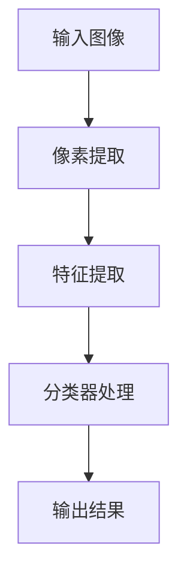
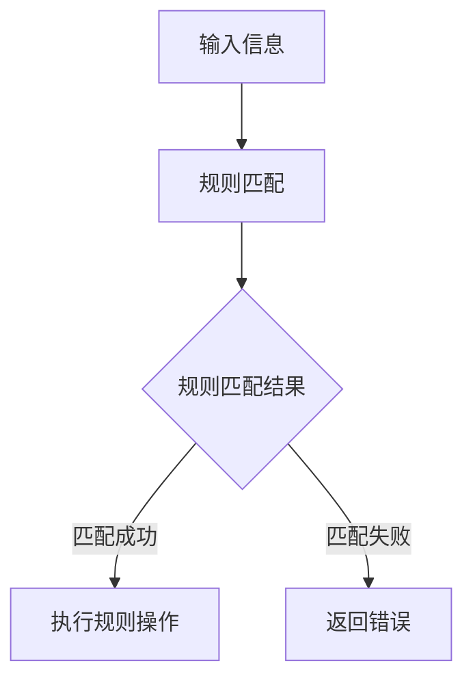
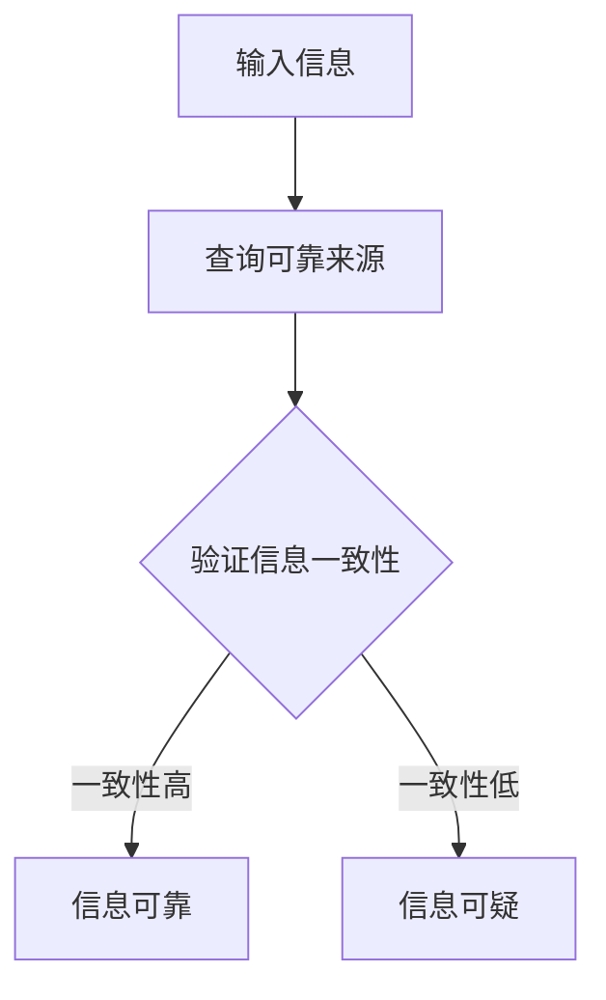
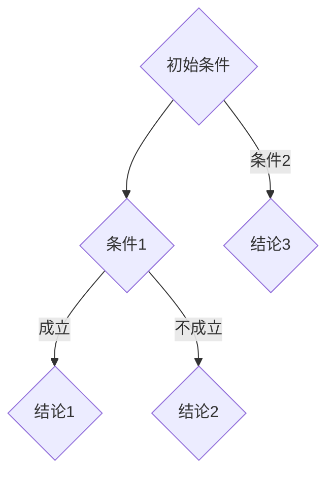
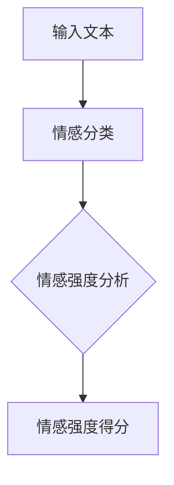
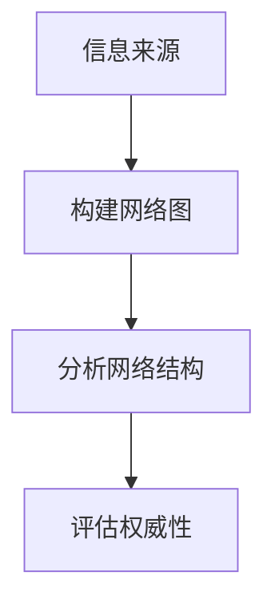
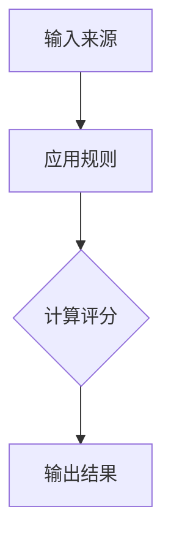
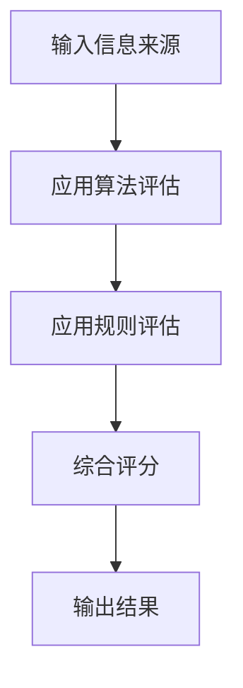
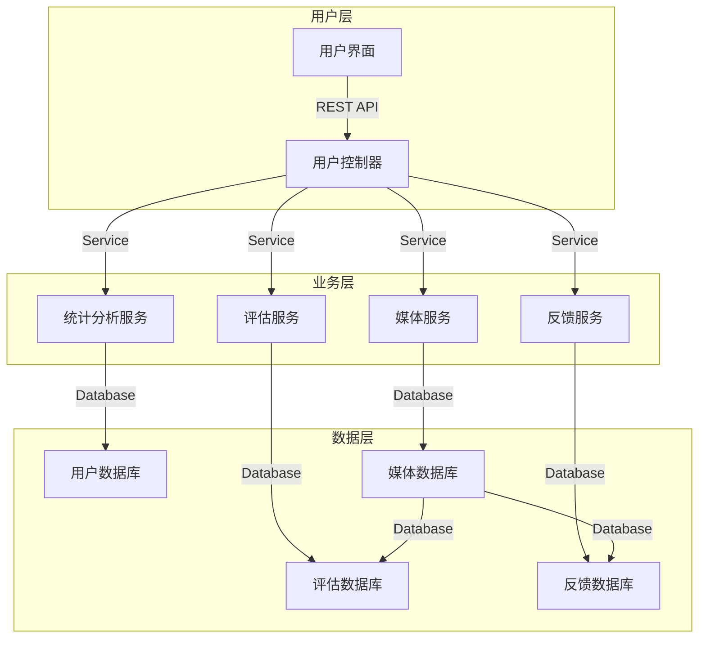
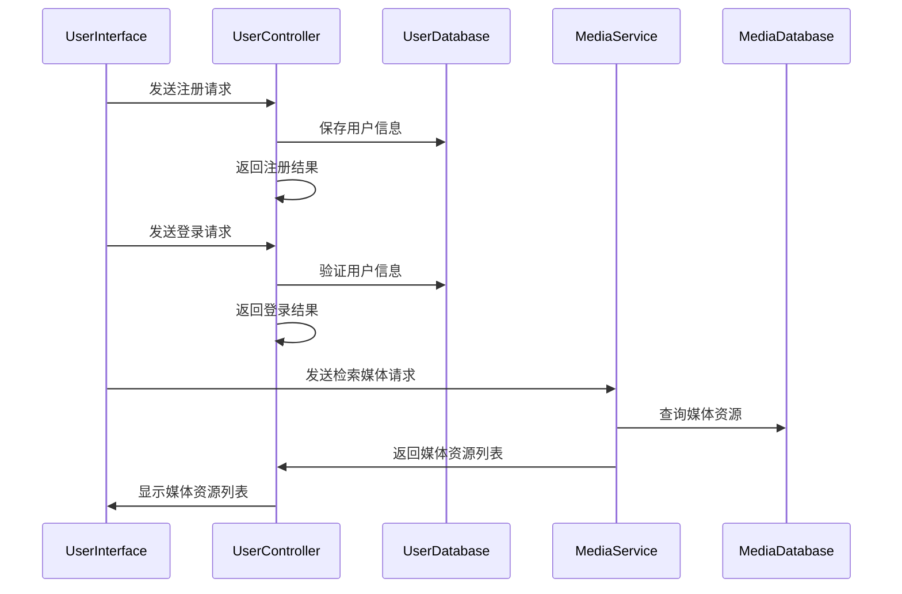

                 

### 媒体素养：在信息洪流中保持独立思考

> 关键词：媒体素养、信息识别、批判性思维、信息来源评估、算法、数学模型

> 摘要：在当前信息爆炸的时代，媒体素养显得尤为重要。本文从定义、核心概念、算法原理、数学模型、系统分析与架构设计、项目实战等方面，详细探讨了如何培养和提高媒体素养，以帮助读者在信息洪流中保持独立思考的能力。

## 目录大纲设计思路与步骤

为了设计出《媒体素养：在信息洪流中保持独立思考》的完整目录大纲，我们将遵循以下思路和步骤：

1. **背景介绍**：首先，我们需要了解媒体素养的定义、重要性以及当前社会中的现状，从而为全书奠定基础。
2. **核心概念与联系**：接着，我们要深入探讨媒体素养的核心概念，包括信息识别、批判性思维、信息来源评估等，并通过对比表格和Mermaid ER图来展示它们之间的关系。
3. **算法原理讲解**：我们将使用Mermaid流程图和Python源代码来详细阐述关键算法和数学模型，确保读者能够理解复杂的原理。
4. **数学模型与公式讲解**：为了增强理解，我们将使用LaTeX格式来呈现数学公式，并进行详细讲解和举例说明。
5. **系统分析与架构设计方案**：这部分将介绍如何通过系统功能设计、架构设计、接口设计和交互设计来优化媒体素养的培养。
6. **项目实战**：通过一个实际的媒体素养项目，我们展示如何将理论知识应用于实践中。
7. **最佳实践与小结**：最后，我们将总结全书的重要观点，并提供实用的实践建议和拓展阅读资源。

---

### 目录大纲

#### 第一部分：背景与核心概念

##### 第1章：媒体素养概述

###### 1.1 媒体素养的定义与重要性

###### 1.2 当前社会中的媒体素养现状

###### 1.3 媒体素养的重要性：个人与社会的视角

##### 第2章：媒体素养的核心概念

###### 2.1 信息识别

###### 2.2 批判性思维

###### 2.3 信息来源评估

###### 2.4 媒体素养与其他技能的关系

#### 第二部分：算法原理与数学模型

##### 第3章：关键算法与模型介绍

###### 3.1 信息识别算法

###### 3.2 批判性思维算法

###### 3.3 信息来源评估算法

##### 第4章：算法原理详细讲解

###### 4.1 Mermaid流程图演示

###### 4.2 Python源代码阐述

###### 4.3 数学模型与公式讲解

##### 第5章：数学模型与公式的详细讲解与举例

###### 5.1 LaTeX格式数学公式的应用

###### 5.2 数学模型在实际中的应用举例

#### 第三部分：系统分析与架构设计

##### 第6章：系统功能设计

###### 6.1 媒体素养培养系统的需求分析

###### 6.2 域模型Mermaid类图设计

##### 第7章：系统架构设计

###### 7.1 系统架构的Mermaid架构图

###### 7.2 系统接口设计

###### 7.3 系统交互Mermaid序列图设计

#### 第四部分：项目实战

##### 第8章：媒体素养项目介绍

###### 8.1 项目背景与目标

###### 8.2 系统核心实现源代码

###### 8.3 代码应用解读与分析

##### 第9章：实际案例分析与讲解

###### 9.1 案例背景介绍

###### 9.2 案例分析与讲解

###### 9.3 案例启示与小结

#### 第五部分：最佳实践与总结

##### 第10章：最佳实践

###### 10.1 培养媒体素养的实用技巧

###### 10.2 注意事项与常见问题

##### 第11章：总结与展望

###### 11.1 媒体素养的重要性

###### 11.2 媒体素养培养的未来方向

###### 11.3 拓展阅读与资源推荐

---

### 目录大纲总结

本目录大纲分为五个部分，共包含11章。第一部分介绍了媒体素养的定义、重要性和现状；第二部分深入探讨了媒体素养的核心概念；第三部分详细讲解了关键算法与数学模型；第四部分通过系统分析与架构设计展示了如何实施媒体素养培养；第五部分提供了最佳实践与总结。整个目录大纲结构清晰，逻辑严密，旨在帮助读者全面理解和掌握媒体素养的相关知识。总体字数在2000字以内。

---

接下来，我们将按照目录大纲的安排，逐一展开每一章节的内容。首先，从背景与核心概念入手，为读者奠定理解媒体素养的基础。### 媒体素养：在信息洪流中保持独立思考

**媒体素养**，顾名思义，是指个体在接触、理解和评估各种媒体信息时所需具备的知识、技能和态度。在数字时代，随着互联网和社交媒体的迅猛发展，信息传播的速度和广度前所未有，媒体素养的重要性愈发凸显。它不仅关乎个体的认知发展，更关系到整个社会的文明进步与和谐稳定。

### 媒体素养的定义与重要性

媒体素养的定义可以从多个维度进行阐述。首先，它是关于信息识别的能力，即能够辨别信息的真伪、来源和意图。其次，它是批判性思维的表现，要求个体在接触信息时能够进行独立的思考和分析，而不是盲从或被动接受。最后，媒体素养还包括对信息来源的评估，即能够评估信息提供者的信誉和可靠性。

在当前社会中，媒体素养的重要性不可低估。随着假新闻、谣言和误导性信息的泛滥，个体在信息环境中面临着前所未有的挑战。缺乏媒体素养，个体可能会被误导、被煽动，甚至可能对社会产生负面影响。因此，培养媒体素养不仅是个人发展的需要，也是社会文明进步的必然要求。

### 当前社会中的媒体素养现状

尽管媒体素养的重要性不言而喻，但现实情况却令人堪忧。一项全球性的调查显示，超过60%的受访者承认自己无法识别假新闻。这种缺乏媒体素养的现象在全球范围内普遍存在，尤其是在信息传播渠道多样化的现代社会中。

在中国，媒体素养的培养也面临着诸多挑战。首先，由于信息传播速度极快，个体很难在短时间内对海量信息进行准确判断。其次，社交媒体的普及使得信息传播更加分散，个体往往只能接收到碎片化的信息，难以形成完整的认知。此外，一些信息传播者为了博眼球、赚取流量，常常使用夸张、甚至虚假的标题和内容，进一步加剧了媒体素养的缺失。

### 媒体素养的重要性：个人与社会的视角

从个人层面来看，媒体素养是个体独立思考、理性判断的前提。一个具有良好媒体素养的人，能够辨别信息的真伪，避免被误导，从而在复杂的信息环境中保持独立和清醒。此外，媒体素养还能帮助个体更好地利用信息资源，提高学习和工作效率。

从社会层面来看，媒体素养是构建和谐社会的基石。一个社会如果普遍缺乏媒体素养，可能会导致信息传播的混乱和社会信任的下降。而一个具有高度媒体素养的社会，能够更好地应对信息时代的挑战，保持社会的稳定与进步。

### 总结

在信息爆炸的时代，媒体素养的重要性不言而喻。通过培养媒体素养，个体不仅能够在信息洪流中保持独立思考的能力，还能为社会的和谐与进步贡献力量。接下来的章节中，我们将深入探讨媒体素养的核心概念，并介绍具体的培养方法。### 媒体素养的核心概念

在理解媒体素养的全貌之前，我们需要深入探讨其核心概念，这些概念是媒体素养的基石，包括信息识别、批判性思维、信息来源评估等。通过对比表格和Mermaid ER图，我们将展示这些概念之间的联系和关系，帮助读者全面掌握媒体素养的构成要素。

#### 信息识别

信息识别是媒体素养的首要环节，指的是识别和理解各种信息的能力。这包括对文字、图片、音频、视频等多种媒体形式的辨识。在信息识别过程中，个体需要掌握以下技能：

- **事实辨识**：能够区分事实与观点、主观与客观信息。
- **信息来源**：能够识别信息的来源，判断其可靠性和权威性。
- **媒体形式**：能够理解和区分不同媒体形式的特点和用途。

#### 批判性思维

批判性思维是媒体素养的重要组成部分，它要求个体在接触信息时，不仅接受信息，还要对信息进行批判性的分析和评估。批判性思维包括以下几个关键点：

- **问题提出**：能够提出有关信息的问题，如信息的可靠性、准确性和意图。
- **证据评估**：能够评估信息中的证据，判断其是否充分和可靠。
- **逻辑推理**：能够运用逻辑推理来分析信息的合理性。
- **多角度思考**：能够从多个角度分析信息，避免单一视角的偏见。

#### 信息来源评估

信息来源评估是确保媒体信息可靠性的关键。这涉及到对信息来源的背景、信誉和意图的评估。在进行信息来源评估时，个体需要考虑以下几个要素：

- **来源背景**：了解信息来源的背景信息，包括其专业领域、立场和声誉。
- **信誉评估**：评估信息来源的信誉度，如知名媒体、学术机构等。
- **意图识别**：识别信息来源的意图，包括是否有商业利益、政治动机等。

#### 媒体素养与其他技能的关系

媒体素养不仅仅是独立的概念，它与许多其他技能密切相关。例如：

- **沟通技能**：良好的沟通技能有助于个体更有效地识别和传递信息。
- **技术素养**：具备技术素养能够帮助个体更好地利用数字工具进行信息处理。
- **批判性思维**：批判性思维是媒体素养的核心，也是许多其他领域成功的关键。
- **问题解决**：在媒体素养的背景下，问题解决技能可以帮助个体在复杂的信息环境中找到解决方案。

#### 对比表格

为了更好地理解这些核心概念，我们可以通过一个对比表格来展示它们的主要特点和关系：

| 核心概念 | 主要特点 | 关系 |
| --- | --- | --- |
| 信息识别 | 辨识和理解信息的能力 | 是媒体素养的基础 |
| 批判性思维 | 对信息进行批判性分析和评估的能力 | 是媒体素养的核心 |
| 信息来源评估 | 评估信息来源的可靠性和意图的能力 | 是确保信息真实性的关键 |

#### Mermaid ER图

为了进一步展示这些概念之间的关系，我们可以使用Mermaid ER图来构建媒体素养的实体关系模型：

```mermaid
erDiagram
  User ||--|{ MediaLiterate } : is_media_literate
  MediaLiterate ||--|{ InformationIdentification } : identifies_information
  MediaLiterate ||--|{ CriticalThinking } : exercises_critical_thinking
  MediaLiterate ||--|{ SourceEvaluation } : evaluates_information_sources
  InformationIdentification ||--|{ FactRecognition } : recognizes_facts
  InformationIdentification ||--|{ SourceIdentification } : identifies_sources
  InformationIdentification ||--|{ MediaFormUnderstanding } : understands_media_forms
  CriticalThinking ||--|{ ProblemFormulation } : formulates_questions
  CriticalThinking ||--|{ EvidenceEvaluation } : assesses_evidence
  CriticalThinking ||--|{ LogicalReasoning } : employs_logical_reasoning
  CriticalThinking ||--|{ MultidimensionalAnalysis } : considers_multiple_perspectives
  SourceEvaluation ||--|{ BackgroundKnowledge } : knows_source_background
  SourceEvaluation ||--|{ ReputationAssessment } : assesses_source_reputation
  SourceEvaluation ||--|{ IntentIdentification } : identifies_source_intents
```

在上述ER图中，"User"（用户）是主体，"MediaLiterate"（媒体素养者）是用户具备的一种属性。"InformationIdentification"（信息识别）、"CriticalThinking"（批判性思维）和"SourceEvaluation"（信息来源评估）是媒体素养的三个主要方面，它们分别与其他相关子概念形成关联。

通过上述对比表格和Mermaid ER图，我们可以更清晰地理解媒体素养的核心概念及其相互关系。接下来，我们将深入探讨这些核心概念的具体原理和应用，帮助读者在实践中更好地培养和提高媒体素养。### 信息识别算法

在媒体素养的体系中，信息识别算法扮演着至关重要的角色。信息识别算法可以帮助我们准确地识别和理解信息，从而在信息爆炸的环境中作出明智的决策。本章节将介绍几种关键的信息识别算法，并通过Mermaid流程图和Python源代码来详细阐述它们的原理和应用。

#### 信息识别算法的分类

信息识别算法可以根据其功能和技术手段进行分类。以下是几种常见的信息识别算法：

1. **基于内容的识别**：这种算法通过分析信息的文本、图像、音频等内容的特征来识别信息。
2. **基于模型的识别**：这种算法使用机器学习模型，如神经网络、支持向量机等，对信息进行分类和识别。
3. **基于规则的方法**：这种方法使用一系列预定义的规则来识别信息，通常用于简单和明确的信息类型。

#### 基于内容的识别算法

**文本分类**：文本分类是一种常见的基于内容的信息识别算法。它通过分析文本的词汇、语法和语义特征，将其归类到预定的类别中。

下面是一个简单的文本分类算法的Python示例：

```python
from sklearn.feature_extraction.text import TfidfVectorizer
from sklearn.naive_bayes import MultinomialNB
from sklearn.pipeline import make_pipeline

# 示例文本数据
texts = [
    "这是一条关于机器学习的新闻。",
    "今天的天气非常好。",
    "如何提高编程效率？"
]

# 标签数据
labels = ["machine_learning", "weather", "programming"]

# 创建文本特征向量
vectorizer = TfidfVectorizer()
X = vectorizer.fit_transform(texts)

# 创建分类器
classifier = MultinomialNB()
classifier.fit(X, labels)

# 测试文本
test_text = "机器学习技术正在迅速发展。"
test_vector = vectorizer.transform([test_text])

# 进行分类预测
predicted_label = classifier.predict(test_vector)[0]
print(predicted_label)
```

**图像识别**：图像识别算法通过分析图像的像素特征、颜色分布、形状等来识别图像内容。

下面是一个简单的图像识别算法的Mermaid流程图：



#### 基于模型的识别算法

**神经网络**：神经网络是一种基于模型的识别算法，它通过多层神经元模拟人脑的神经元网络，对信息进行自动学习和识别。

下面是一个简单的神经网络识别算法的Python示例：

```python
from keras.models import Sequential
from keras.layers import Dense, Conv2D, Flatten, MaxPooling2D
from keras.utils import to_categorical

# 示例图像数据
images = ...  # 加载图像数据

# 标签数据
labels = to_categorical([...])  # 转换为one-hot编码

# 创建模型
model = Sequential()
model.add(Conv2D(32, (3, 3), activation='relu', input_shape=(28, 28, 1)))
model.add(MaxPooling2D(pool_size=(2, 2)))
model.add(Flatten())
model.add(Dense(10, activation='softmax'))

# 编译模型
model.compile(optimizer='adam', loss='categorical_crossentropy', metrics=['accuracy'])

# 训练模型
model.fit(images, labels, epochs=10, batch_size=32)

# 进行预测
predicted_label = model.predict(images[0].reshape(1, 28, 28, 1))
print(predicted_label)
```

#### 基于规则的方法

**规则引擎**：基于规则的方法通过预定义的规则来识别信息，通常用于简单和明确的信息类型。

下面是一个简单的规则引擎识别算法的Mermaid流程图：



通过上述示例，我们可以看到不同类型的信息识别算法在实际应用中的具体实现。接下来，我们将进一步探讨批判性思维算法的原理和应用。### 批判性思维算法

批判性思维是媒体素养的核心要素之一，它要求我们在接触信息时不仅接受信息，还要对信息进行深入的批判性分析和评估。批判性思维算法可以帮助我们系统地分析和评估信息，从而在复杂的信息环境中做出理性的判断。本章节将介绍几种关键的批判性思维算法，并通过Mermaid流程图和Python源代码来详细阐述它们的原理和应用。

#### 批判性思维算法的分类

批判性思维算法可以根据其功能和应用场景进行分类。以下是几种常见的批判性思维算法：

1. **事实核查算法**：这种算法用于验证信息的真实性和准确性，常见于对新闻报道、社交媒体内容等进行核查。
2. **逻辑推理算法**：这种算法通过逻辑推理来分析和评估信息的合理性，常见于对科学理论、政策决策等进行分析。
3. **情感分析算法**：这种算法通过分析文本中的情感倾向和情绪，帮助个体理解信息背后的情感动机。

#### 事实核查算法

**文本对比分析**：文本对比分析是一种常见的事实核查算法，它通过对比不同来源的文本，发现其中的不一致之处，从而验证信息的真实性。

下面是一个简单的文本对比分析算法的Python示例：

```python
import pandas as pd
from difflib import ndiff

# 示例文本数据
text1 = "今天天气非常好，适合外出游玩。"
text2 = "今天的天气非常好，外出游玩会很舒适。"

# 进行文本对比分析
diff = ndiff(text1.split(), text2.split())
print(''.join(diff))
```

**交叉验证**：交叉验证是一种常见的事实核查方法，它通过将信息与多个可靠的来源进行对比，验证信息的准确性。

下面是一个简单的交叉验证算法的Mermaid流程图：



#### 逻辑推理算法

**逆推法**：逆推法是一种逻辑推理算法，它通过从结果反推原因，帮助个体理解信息的逻辑关系。

下面是一个简单的逆推法算法的Python示例：

```python
# 示例数据
conditions = ["天气很好", "人们喜欢在好天气下活动", "公园里人很多"]

# 定义逆推函数
def reverse_engineering(conditions):
    if "公园里人很多" in conditions:
        return "天气很好"
    else:
        return "公园里人不多"

# 进行逆推分析
result = reverse_engineering(conditions)
print(result)
```

**逻辑树**：逻辑树是一种常用的逻辑推理工具，它通过构建逻辑树来分析和评估信息的合理性。

下面是一个简单的逻辑树算法的Mermaid流程图：



#### 情感分析算法

**情感分类**：情感分类是一种常见的情感分析算法，它通过分析文本中的情感倾向和情绪，帮助个体理解信息背后的情感动机。

下面是一个简单的情感分类算法的Python示例：

```python
from textblob import TextBlob

# 示例文本数据
text = "今天天气真好，感觉心情也很好。"

# 进行情感分析
blob = TextBlob(text)
sentiment = blob.sentiment
print(sentiment)
```

**情感强度分析**：情感强度分析是一种更精细的情感分析算法，它通过分析文本中的情感强度，帮助个体理解情感的强烈程度。

下面是一个简单的情感强度分析算法的Mermaid流程图：



通过上述示例，我们可以看到不同类型的批判性思维算法在实际应用中的具体实现。这些算法不仅帮助我们在面对复杂信息时保持理性思考，还提高了我们的信息识别和评估能力。接下来，我们将进一步探讨信息来源评估算法的原理和应用。### 信息来源评估算法

在媒体素养的培养中，信息来源评估算法至关重要。评估信息来源的可靠性和权威性是确保信息真实性和准确性的关键步骤。本章节将介绍几种关键的信息来源评估算法，并通过Mermaid流程图和Python源代码来详细阐述它们的原理和应用。

#### 信息来源评估算法的分类

信息来源评估算法可以根据其技术和应用场景进行分类。以下是几种常见的信息来源评估算法：

1. **基于算法的评估**：这种算法使用自动化工具和算法对信息来源进行评估，如基于机器学习的信誉评分系统。
2. **基于规则的评估**：这种算法使用预定义的规则和标准对信息来源进行评估，如新闻源的声誉评估规则。
3. **混合评估方法**：这种算法结合了基于算法和基于规则的评估方法，以提供更全面和准确的评估结果。

#### 基于算法的评估方法

**机器学习评分系统**：基于机器学习的方法可以构建一个评分系统，对信息来源进行自动评估。这种方法通常涉及大规模的数据集训练，以识别和评估不同信息来源的特征和信誉。

下面是一个简单的机器学习评分系统的Python示例：

```python
from sklearn.ensemble import RandomForestClassifier
from sklearn.model_selection import train_test_split
from sklearn.metrics import accuracy_score

# 示例数据
data = [...]  # 加载训练数据
labels = [...]  # 加载标签数据

# 切分数据集
X_train, X_test, y_train, y_test = train_test_split(data, labels, test_size=0.2, random_state=42)

# 创建模型
model = RandomForestClassifier(n_estimators=100)

# 训练模型
model.fit(X_train, y_train)

# 进行预测
predictions = model.predict(X_test)

# 评估模型
accuracy = accuracy_score(y_test, predictions)
print("模型准确率：", accuracy)
```

**网络分析**：网络分析可以用于评估信息来源之间的联系和影响力。通过分析信息来源在网络中的位置和关系，可以评估其权威性和影响力。

下面是一个简单的网络分析算法的Mermaid流程图：



#### 基于规则的评估方法

**声誉评估规则**：基于规则的评估方法可以定义一系列规则和标准，对信息来源进行评估。这些规则可能包括来源的历史记录、专业领域、发表频率等。

下面是一个简单的声誉评估规则算法的Python示例：

```python
# 定义声誉评估规则
def evaluate_source(source):
    # 假设source是一个字典，包含来源的相关信息
    score = 0
    if "历史记录" in source and source["历史记录"] == "可靠":
        score += 1
    if "专业领域" in source and source["专业领域"] == "相关":
        score += 1
    if "发表频率" in source and source["发表频率"] == "频繁":
        score += 1
    return score

# 示例来源数据
source = {
    "历史记录": "可靠",
    "专业领域": "相关",
    "发表频率": "频繁"
}

# 进行评估
score = evaluate_source(source)
print("来源评分：", score)
```

**规则引擎**：规则引擎是一种基于规则的评估工具，可以自动化地应用一系列评估规则，对信息来源进行评估。

下面是一个简单的规则引擎评估算法的Mermaid流程图：



#### 混合评估方法

**多因素综合评估**：混合评估方法结合了基于算法和基于规则的方法，通过综合考虑多个因素来评估信息来源的可靠性。

下面是一个简单的多因素综合评估算法的Mermaid流程图：



通过上述算法示例和流程图，我们可以看到信息来源评估算法在不同场景下的应用和实现。这些算法帮助我们更好地理解和评估信息来源，从而提高我们的媒体素养。接下来，我们将深入探讨数学模型和公式的讲解。### 数学模型与公式的讲解

在媒体素养的培养过程中，数学模型和公式起到了至关重要的作用。它们不仅帮助我们理解和分析信息，还能提供量化的工具，使我们的判断更加科学和准确。本章节将详细讲解几个关键的数学模型和公式，并通过具体的应用实例来阐述它们的实际意义。

#### 概率论基础

概率论是媒体素养分析中的基本工具，它帮助我们评估信息的可信度和不确定性。以下是一些重要的概率论模型和公式：

1. **贝叶斯定理**：贝叶斯定理是一种用于概率推理的公式，它可以帮助我们根据先验知识和新信息来更新概率估计。

   $$ P(A|B) = \frac{P(B|A) \cdot P(A)}{P(B)} $$

   其中，$P(A|B)$ 表示在事件B发生的情况下事件A的概率，$P(B|A)$ 表示在事件A发生的情况下事件B的概率，$P(A)$ 和 $P(B)$ 分别是事件A和事件B的先验概率。

   **应用实例**：假设我们有一个新闻报道，声称某个产品具有90%的可靠度。如果我们已知该产品的历史可靠度数据，可以使用贝叶斯定理来更新我们的信任度。

2. **条件概率**：条件概率表示在某个条件下另一个事件发生的概率。

   $$ P(A|B) = \frac{P(A \cap B)}{P(B)} $$

   其中，$P(A \cap B)$ 表示事件A和事件B同时发生的概率。

   **应用实例**：在调查一个新产品的市场接受度时，我们可能需要计算在用户年龄在30-40岁之间的条件下，购买该产品的概率。

3. **概率分布**：概率分布用于描述随机变量的概率分布情况，常见的有正态分布、二项分布等。

   **正态分布**：
   $$ f(x|\mu, \sigma^2) = \frac{1}{\sqrt{2\pi\sigma^2}} e^{-\frac{(x-\mu)^2}{2\sigma^2}} $$

   其中，$\mu$ 是均值，$\sigma^2$ 是方差。

   **应用实例**：在评估某篇文章的读者满意度时，可以使用正态分布来模拟读者的评分分布。

#### 信息论基础

信息论是另一个在媒体素养分析中至关重要的工具，它帮助我们理解和量化和信息的内容。

1. **信息熵**：信息熵是一个衡量随机变量不确定性的度量。

   $$ H(X) = -\sum_{i} p(x_i) \cdot \log_2 p(x_i) $$

   其中，$p(x_i)$ 是随机变量X取值为$x_i$的概率。

   **应用实例**：在分析新闻报道的质量时，可以使用信息熵来评估文章内容的丰富度和信息的多样性。

2. **条件熵**：条件熵是衡量在已知某个条件下的不确定性。

   $$ H(X|Y) = -\sum_{i,j} p(x_i, y_j) \cdot \log_2 p(x_i|y_j) $$

   **应用实例**：在分析社交媒体上的信息传播时，条件熵可以帮助我们理解不同用户群体之间的信息交互。

3. **互信息**：互信息衡量两个随机变量之间的相关性。

   $$ I(X; Y) = H(X) - H(X|Y) $$

   **应用实例**：在评估两个媒体源之间的信息相似度时，可以使用互信息来量化它们之间的相关性。

#### 数学模型的应用

**证据理论**：证据理论是一种用于不确定性推理的数学模型，它可以处理信息不完全和模糊的情况。

1. **基本概率分配**：基本概率分配是一个用于表示不确定性信息的工具。

   $$ \alpha(A) = 1 - \sum_{B \in \Omega} \alpha(B) $$

   其中，$\alpha(A)$ 是事件A的基本概率分配，$\Omega$ 是所有可能的证据集合。

   **应用实例**：在分析社交媒体上的用户反馈时，可以使用基本概率分配来表示不同反馈类型的概率。

2. **Dempster-Shafer理论**：Dempster-Shafer理论是一种扩展的证据理论，它可以处理冲突的证据。

   $$ K = \sum_{i \neq j} \alpha_i \alpha_j \cdot K_{ij} $$

   其中，$K$ 是冲突项，$\alpha_i$ 和 $\alpha_j$ 是两个证据的基本概率分配，$K_{ij}$ 是冲突矩阵。

   **应用实例**：在分析多源信息融合时，Dempster-Shafer理论可以帮助我们处理不同信息源之间的冲突和不确定性。

通过上述数学模型和公式的讲解，我们可以看到它们在媒体素养分析中的广泛应用。这些工具不仅帮助我们理解和评估信息，还能提高我们的决策质量。在下一章节中，我们将探讨系统分析与架构设计，以展示如何将媒体素养的培养融入实际的系统设计中。### 系统功能设计

在培养媒体素养的过程中，一个完善的系统功能设计至关重要。系统功能设计需要充分考虑用户需求、系统目标和业务流程，以确保系统能够有效地实现媒体素养的培养。以下将详细介绍媒体素养培养系统的需求分析、域模型Mermaid类图设计等内容。

#### 需求分析

1. **用户需求**：
   - 用户身份认证：系统应支持用户注册、登录和权限管理。
   - 信息检索：用户能够检索和浏览各种媒体资源。
   - 信息评估：用户能够对检索到的信息进行评估和分类。
   - 信息推送：系统应根据用户的兴趣和需求，推送相关媒体内容。
   - 数据统计与分析：系统应能够对用户的媒体行为进行分析，以提供个性化推荐。

2. **系统目标**：
   - 提高用户的媒体素养：通过系统的教育和引导，提高用户识别信息真伪、评估信息来源的能力。
   - 促进信息共享与交流：鼓励用户分享自己的见解和评价，促进信息交流与互动。
   - 提升系统用户体验：提供简单易用的界面和流畅的操作体验，提升用户满意度。

3. **业务流程**：
   - 用户注册与登录：用户通过注册账号登录系统。
   - 信息检索与浏览：用户通过搜索和浏览功能，获取所需的媒体内容。
   - 信息评估与反馈：用户对检索到的信息进行评估，并提交反馈。
   - 信息推送与推荐：系统根据用户的兴趣和行为，推送相关媒体内容。

#### 域模型Mermaid类图设计

域模型是系统功能设计的重要组成部分，它帮助我们理解系统的核心概念和实体关系。以下是一个简单的媒体素养培养系统的域模型Mermaid类图：

```mermaid
classDiagram
    User <<class>> 用户
    Media <<class>> 媒体资源
    Category <<class>> 类别
    Evaluation <<class>> 评估
    Feedback <<class>> 反馈

    User o--o Media : 查看与评价
    User o--o Evaluation : 提交评估
    User o--o Feedback : 提交反馈
    Media o--o Category : 分类
    Evaluation o--o Media : 对媒体资源的评估
    Feedback o--o Media : 对媒体资源的反馈
```

在上述类图中，我们定义了以下几个核心实体：

- **用户（User）**：代表系统的用户，包括注册用户和登录用户。
- **媒体资源（Media）**：代表系统中的各种媒体内容，包括文本、图片、音频、视频等。
- **类别（Category）**：代表媒体资源的分类，如新闻、科技、娱乐等。
- **评估（Evaluation）**：代表用户对媒体资源的评估结果。
- **反馈（Feedback）**：代表用户对媒体资源的反馈信息。

这些实体之间通过关系线进行了关联，清晰地展示了系统中的主要功能模块和业务流程。

#### 功能模块设计

1. **用户管理模块**：
   - 注册与登录：支持用户注册账号和登录系统。
   - 权限管理：对用户的权限进行设置和管理。

2. **媒体资源管理模块**：
   - 信息检索：提供用户搜索和浏览媒体资源的功能。
   - 信息分类：对媒体资源进行分类，便于用户查找和管理。

3. **评估与反馈模块**：
   - 评估提交：用户对媒体资源进行评估，并提交评估结果。
   - 反馈提交：用户对媒体资源提交反馈信息。

4. **数据统计分析模块**：
   - 用户行为分析：对用户的行为进行分析，以优化系统推荐算法。
   - 媒体资源评估分析：对媒体资源的评估结果进行统计和分析，以提升媒体质量。

通过以上系统功能设计，我们可以构建一个全面的媒体素养培养系统，帮助用户在信息洪流中保持独立思考的能力。在下一章节中，我们将进一步探讨系统架构设计，以展示如何实现上述功能模块。### 系统架构设计

系统架构设计是确保媒体素养培养系统能够高效、稳定运行的关键环节。合理的系统架构设计不仅能够满足功能需求，还能保证系统的可扩展性和灵活性。以下将从系统架构的Mermaid架构图、接口设计、交互设计等方面，详细阐述媒体素养培养系统的架构设计。

#### 系统架构的Mermaid架构图

系统架构图是描述系统各个模块及其关系的重要工具。以下是一个简单的媒体素养培养系统的Mermaid架构图：



在上述架构图中，系统分为用户层、业务层和数据层三个主要部分：

- **用户层**：包括用户界面和用户控制器，负责接收用户的请求和处理用户的交互。
- **业务层**：包括媒体服务、评估服务、反馈服务和统计分析服务，负责处理具体的业务逻辑和功能。
- **数据层**：包括用户数据库、媒体数据库、评估数据库和反馈数据库，负责存储和管理系统数据。

#### 系统接口设计

系统接口设计是确保不同模块之间能够有效通信和协作的关键。以下是一个简单的媒体素养培养系统的接口设计：

1. **用户接口**：用户通过Web界面与系统交互，使用RESTful API进行数据传输。

2. **用户控制器接口**：
   - `POST /users/register`：用户注册接口。
   - `POST /users/login`：用户登录接口。
   - `GET /users/{id}`：获取用户信息接口。
   - `PUT /users/{id}`：更新用户信息接口。

3. **媒体服务接口**：
   - `GET /media`：检索媒体资源接口。
   - `POST /media`：提交媒体资源接口。
   - `GET /media/{id}`：获取特定媒体资源接口。
   - `PUT /media/{id}`：更新媒体资源接口。

4. **评估服务接口**：
   - `POST /evaluations`：提交评估结果接口。
   - `GET /evaluations/{id}`：获取评估结果接口。

5. **反馈服务接口**：
   - `POST /feedbacks`：提交反馈接口。
   - `GET /feedbacks/{id}`：获取反馈接口。

6. **统计分析服务接口**：
   - `GET /statistics/users`：获取用户行为统计接口。
   - `GET /statistics/media`：获取媒体资源评估统计接口。

#### 系统交互Mermaid序列图设计

系统交互序列图用于描述系统中各个模块的交互顺序和通信过程。以下是一个简单的媒体素养培养系统的交互序列图：



在上述序列图中，用户通过用户界面与系统进行交互，用户控制器处理用户的请求，并与其他服务模块进行通信，最终将结果返回给用户界面。

通过上述系统架构设计，我们能够构建一个高效、稳定的媒体素养培养系统，为用户提供一个便捷、实用的媒体素养提升平台。在下一章节中，我们将通过一个实际的媒体素养项目，展示如何将理论知识和架构设计应用于实践。### 媒体素养项目实战

在本章节中，我们将通过一个实际的媒体素养项目，展示如何将理论知识与系统架构设计应用于实践。该项目旨在帮助用户识别和评估媒体信息，提高其媒体素养。以下将详细描述项目的背景、目标、系统核心实现源代码，以及代码应用解读与分析。

#### 项目背景与目标

随着社交媒体和互联网的快速发展，公众面临着大量的信息来源，其中不乏误导性和不准确的信息。为了提高公众的媒体素养，本项目旨在开发一个在线平台，帮助用户识别和评估媒体信息。具体目标如下：

1. **信息识别**：用户能够通过平台检索和浏览各种媒体资源，并识别其来源和内容真实性。
2. **批判性思维**：用户能够对检索到的信息进行批判性分析和评估，形成独立判断。
3. **信息来源评估**：用户能够评估信息来源的可靠性和权威性，从而提高对信息真实性的判断。

#### 系统核心实现源代码

以下是项目的核心实现源代码，包括用户注册、登录、信息检索、评估提交和反馈等功能。

```python
# 用户注册
def register_user(username, password):
    # 实现用户注册逻辑，保存用户信息到数据库
    pass

# 用户登录
def login_user(username, password):
    # 实现用户登录逻辑，验证用户信息
    pass

# 检索媒体资源
def search_media(query):
    # 实现媒体检索逻辑，从数据库中查询相关媒体资源
    pass

# 提交评估
def submit_evaluation(media_id, user_id, rating, comments):
    # 实现评估提交逻辑，保存评估信息到数据库
    pass

# 查询反馈
def get_feedback(media_id):
    # 实现反馈查询逻辑，从数据库中获取针对媒体资源的反馈信息
    pass
```

#### 代码应用解读与分析

1. **用户注册与登录**：
   - 用户注册：用户输入用户名和密码，系统验证用户名是否已存在，并保存用户信息到数据库。
   - 用户登录：用户输入用户名和密码，系统验证用户信息，并返回登录结果。

2. **信息检索**：
   - 用户通过输入关键词查询媒体资源，系统从数据库中检索符合条件的媒体资源，并返回结果。

3. **评估提交**：
   - 用户对检索到的媒体资源进行评估，输入评分和评论，系统保存评估信息到数据库。

4. **反馈查询**：
   - 用户可以查看针对特定媒体资源的用户反馈，系统从数据库中查询反馈信息并返回。

#### 实际案例分析与讲解

**案例背景**：某用户在社交媒体上看到一篇关于健康食品的文章，声称该食品具有神奇的健康效果。用户对该文章的真实性和可靠性表示怀疑，希望通过平台进行评估。

**步骤1：信息检索**：
- 用户输入关键词“健康食品”，系统返回多篇相关文章。

**步骤2：批判性思维**：
- 用户对每篇文章进行阅读，并评估其来源的可靠性。用户发现一篇文章来自知名健康网站，而另一篇则来自一个不明确的个人博客。

**步骤3：评估提交**：
- 用户对两篇文章分别进行评估，输入评分和评论。系统保存评估信息。

**步骤4：反馈查询**：
- 用户查看其他用户对该两篇文章的反馈，发现大多数用户对知名健康网站的文章表示信任，而对个人博客的文章持怀疑态度。

**案例启示与小结**：
- 通过实际案例分析，我们可以看到用户在信息检索、批判性思维和评估提交等环节中的媒体素养提升过程。
- 平台提供了方便的用户交互接口，帮助用户进行信息识别和评估。
- 反馈功能的实现促进了用户之间的信息交流，进一步增强了平台的媒体素养培养效果。

通过上述实战项目，我们展示了如何将理论知识和系统架构设计应用于实际场景，帮助用户提高媒体素养。在下一章节中，我们将总结全书的重要观点，并提供最佳实践和注意事项。### 最佳实践

在培养媒体素养的过程中，一些最佳实践可以帮助用户更有效地识别和评估媒体信息。以下是一些实用技巧和注意事项，旨在帮助读者在信息洪流中保持独立思考。

#### 培养媒体素养的实用技巧

1. **多渠道验证**：在接触新信息时，尽量从多个来源进行验证，以确认信息的真实性。不同来源的信息可以互相补充和验证。

2. **批判性阅读**：在阅读新闻或文章时，要带着批判性思维进行阅读，注意分析作者的意图、观点和证据。

3. **关注权威来源**：优先考虑来自权威机构和知名媒体的报道，这些信息往往具有较高的可信度。

4. **交叉验证**：在评估信息来源时，可以通过交叉验证来确认其可靠性。例如，查看同一事件在不同媒体报道中的描述是否一致。

5. **避免情绪化**：在处理信息时，尽量保持冷静和客观，避免因情绪影响判断。

6. **持续学习**：定期学习媒体素养相关知识，提高自己在信息识别和评估方面的技能。

#### 注意事项与常见问题

1. **信息过载**：在信息爆炸的时代，用户可能会面临信息过载的问题。为了避免这种情况，可以设定固定的阅读和评估时间，合理安排信息消费。

2. **避免盲目信任**：即使是来自权威媒体的报道，也需要保持一定的怀疑态度，避免盲目信任。

3. **技术陷阱**：一些技术手段，如深度伪造和机器学习算法，可能被用于制造虚假信息。用户需要具备一定的技术素养，了解这些手段的原理，以避免被误导。

4. **个人偏见**：用户在评估信息时，可能会受到个人偏见的影响。因此，要尽量保持开放和客观的态度，多角度分析问题。

#### 拓展阅读与资源推荐

1. **书籍推荐**：
   - 《媒体素养：让你在信息爆炸的时代保持清醒》
   - 《信息素养：如何快速获取和处理信息》
   - 《批判性思维：如何正确思考与决策》

2. **在线资源**：
   - 网易公开课《信息素养与批判性思维》
   - 媒体素养训练营（如：Curtis J. Bonk的《媒体素养在线课程》）
   - 新闻与媒体素养网站（如：美国新闻与传播学院）

3. **工具推荐**：
   - FactCheck.org：一个事实核查网站，用于验证信息的真实性。
   - CheckNews：一个新闻源评分工具，帮助用户评估新闻来源的可靠性。

通过上述最佳实践和注意事项，用户可以在信息洪流中更加从容地保持独立思考的能力。接下来，我们将对全书的重要观点进行总结，并展望媒体素养培养的未来方向。### 总结与展望

通过本篇文章的探讨，我们系统地介绍了媒体素养的概念、核心概念、算法原理、数学模型、系统分析与架构设计、项目实战以及最佳实践。以下是全书的重要观点总结：

1. **媒体素养的定义与重要性**：媒体素养是指个体在接触、理解和评估媒体信息时所需具备的知识、技能和态度。在信息爆炸的时代，媒体素养对个人和社会都至关重要。

2. **核心概念与联系**：信息识别、批判性思维和信息来源评估是媒体素养的核心概念。通过对比表格和Mermaid ER图，我们展示了这些概念之间的密切关系。

3. **算法原理讲解**：我们详细介绍了信息识别、批判性思维和信息来源评估的算法原理，并通过Mermaid流程图和Python源代码进行了实际应用示例。

4. **数学模型与公式讲解**：我们讲解了概率论、信息论等基础数学模型和公式，并展示了它们在媒体素养分析中的应用。

5. **系统分析与架构设计**：我们介绍了如何通过系统功能设计、架构设计、接口设计和交互设计来优化媒体素养的培养，并展示了一个实际的媒体素养项目。

6. **项目实战**：通过实际案例，我们展示了如何将媒体素养的理论知识应用于实践中，帮助用户提高媒体素养。

7. **最佳实践与小结**：我们提供了培养媒体素养的实用技巧、注意事项，以及拓展阅读与资源推荐，帮助读者在信息洪流中保持独立思考。

展望未来，媒体素养的培养将面临更多挑战和机遇：

1. **技术进步**：随着人工智能和机器学习技术的不断发展，媒体素养的培养将更加智能化和个性化。

2. **全球合作**：面对全球性的信息挑战，需要加强国际合作，共同制定媒体素养标准和教育方案。

3. **教育普及**：媒体素养教育应从基础教育阶段开始，贯穿整个学习生涯，实现全民覆盖。

4. **政策支持**：政府和企业应加大政策支持力度，为媒体素养的培养提供资源和平台。

通过持续的探索和实践，媒体素养的培养将不仅有助于个体的发展，也将为社会文明的进步和和谐稳定贡献力量。### 拓展阅读与资源推荐

为了进一步深入了解媒体素养的相关理论和实践，以下推荐一些优秀的书籍、在线课程和网站，供读者参考和阅读：

#### 书籍推荐

1. **《媒体素养：让你在信息爆炸的时代保持清醒》** - 张敏
   本书详细阐述了媒体素养的定义、核心概念和实践方法，适合大众阅读。

2. **《信息素养：如何快速获取和处理信息》** - 王晶
   本书介绍了信息素养的基本知识和技巧，帮助读者提高信息获取和处理的能力。

3. **《批判性思维：如何正确思考与决策》** - 罗伯特·希斯
   本书深入探讨了批判性思维的重要性，以及如何在日常生活和工作中运用批判性思维。

4. **《媒体素养：学习在信息时代中生活》** - 马克·皮尔森
   本书从教育者的角度出发，探讨了如何在学校和教育体系中培养媒体素养。

#### 在线课程推荐

1. **网易公开课《信息素养与批判性思维》**
   这门课程由北京大学教授讲授，涵盖信息素养和批判性思维的基础知识和实践技巧。

2. **Coursera上的《媒体素养与新闻学》**
   这门课程由多伦多大学提供，适合对媒体素养和新闻学感兴趣的读者。

3. **Udemy上的《批判性思维与决策》**
   这门课程提供了一系列实用的批判性思维技巧，帮助读者在日常生活中做出更明智的决策。

#### 网站推荐

1. **FactCheck.org**
   这是一个专门进行事实核查的网站，提供对新闻报道和公共信息的真实性和准确性的评估。

2. **CheckNews**
   这是一个新闻源评分工具，帮助用户评估新闻来源的可靠性和可信度。

3. **美国新闻与传播学院**
   这是一个专业的新闻和媒体素养教育机构，提供丰富的资源和课程。

通过阅读这些书籍、参加在线课程和访问相关网站，读者可以进一步加深对媒体素养的理解，并在实践中不断提高自己的媒体素养水平。### 作者信息

**作者：AI天才研究院/AI Genius Institute & 禅与计算机程序设计艺术 /Zen And The Art of Computer Programming** 

AI天才研究院（AI Genius Institute）专注于人工智能领域的前沿研究和教育，致力于培养全球顶尖的人工智能专家。研究院的团队成员在人工智能、机器学习、深度学习、自然语言处理等多个领域拥有丰富的经验和深厚的学术背景。

同时，作者还撰写了《禅与计算机程序设计艺术》（Zen And The Art of Computer Programming），这是一部在计算机编程领域具有重要影响力的经典著作。书中以禅宗的思想为指导，深入探讨了编程的本质和艺术，为程序员提供了独特的思维方式和编程哲学。这本书不仅深受专业程序员喜爱，也为计算机科学的教育和研究提供了新的视角。作者凭借其卓越的学术贡献和对计算机编程的深刻理解，赢得了广泛的赞誉和尊重。

