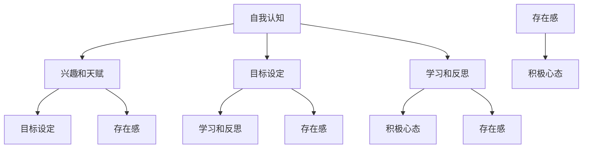

                 


### 《存在的光辉：在平凡中绽放独特性》

---

#### 关键词：存在、独特性、内在力量、职业发展、成长、影响

> 摘要：本文深入探讨存在的意义与价值，揭示平凡中的独特性。通过分析内在力量的发掘与表达，探讨独特性在职业发展中的应用，以及独特性的成长过程与影响，旨在引导读者在平凡中绽放自己的独特光辉。

---

### 目录大纲

```markdown
# 《存在的光辉：在平凡中绽放独特性》

## 第一部分：认识存在的光辉

### 第1章：存在的意义

#### 1.1 存在的意义与价值

#### 1.2 探索自我价值

#### 1.3 激发存在感

### 第2章：平凡中的独特性

#### 2.1 平凡的定义

#### 2.2 平凡中的非凡

#### 2.3 发现自身的独特性

## 第二部分：培养独特性

### 第3章：内在力量的发掘

#### 3.1 内在力量的概念

#### 3.2 如何发掘内在力量

#### 3.3 增强内在力量

### 第4章：独特性的表达

#### 4.1 表达的独特性

#### 4.2 创造力的培养

#### 4.3 独特性在社会中的体现

### 第5章：独特性在职业发展中的应用

#### 5.1 独特性在职场中的价值

#### 5.2 如何在工作中体现独特性

#### 5.3 独特性在职业规划中的应用

## 第三部分：独特性的成长

### 第6章：独特性的成长过程

#### 6.1 成长的意义

#### 6.2 成长的阶段

#### 6.3 成长的挑战与应对

### 第7章：独特性的影响与传播

#### 7.1 独特性对社会的影响

#### 7.2 独特性如何传播

#### 7.3 独特性在文化中的地位

### 第8章：结语

#### 8.1 存在的光辉的价值

#### 8.2 培养独特性的意义

#### 8.3 展望未来
```

---

### 第一部分：认识存在的光辉

#### 第1章：存在的意义

##### 1.1 存在的意义与价值

存在，是一个古老而深刻的话题。从哲学的角度来看，存在的意义往往与宇宙、生命、价值等问题紧密相连。在我们的日常生活中，存在的意义则更多地体现在个人价值的实现和对社会的贡献上。

首先，存在的意义在于自我认知。每个人都是独一无二的存在，拥有独特的思想、情感和价值观。通过自我认知，我们可以更好地理解自己，找到自己的定位，从而实现个人价值。

其次，存在的价值在于对社会的贡献。每个人都是社会的一份子，通过自己的努力和才华，为社会创造价值，推动社会的发展。无论是科学家发现新理论，工程师设计新设备，还是教师教育下一代，每个人都在自己的领域内发挥着独特的作用。

##### 1.2 探索自我价值

如何探索自我价值呢？首先，我们需要明确自己的兴趣和天赋。每个人都有自己的兴趣所在，这是我们在生活中最愿意投入时间和精力的领域。同时，每个人都有自己的天赋，这是我们在某个领域内具备的独特能力。

其次，我们需要设定目标，并付诸行动。有了目标和计划，我们才能有方向地前进，不断地提升自己。在实现目标的过程中，我们会遇到各种挑战和困难，但正是这些挑战和困难，让我们不断地成长，实现自我价值。

最后，我们需要不断地反思和调整。通过反思，我们可以更好地认识自己，发现自己的不足，并制定相应的改进计划。通过调整，我们可以更加高效地实现自己的目标，发挥自己的价值。

##### 1.3 激发存在感

如何激发存在感呢？首先，我们需要积极参与社会活动。通过参与社会活动，我们可以与他人建立联系，感受到自己的存在对社会的重要性。

其次，我们需要关注他人的需求。当我们能够帮助他人，解决他们的困扰时，我们会感到自己的存在是有价值的。

最后，我们需要保持积极的心态。积极的心态能够让我们更好地面对生活中的挑战和困难，从而增强我们的存在感。

---

### 第二部分：培养独特性

#### 第3章：内在力量的发掘

##### 3.1 内在力量的概念

内在力量，是指存在于个体内部的潜能和动力。它是我们克服困难、实现目标的内在驱动。内在力量包括自我认知、意志力、创造力等多个方面。

首先，自我认知是内在力量的基础。只有了解自己，我们才能更好地发挥自己的优势，克服自己的弱点。

其次，意志力是内在力量的核心。它使我们能够在面对困难时坚持下去，不放弃，最终实现目标。

最后，创造力是内在力量的重要组成部分。它使我们在面对问题时能够提出独特的解决方案，从而在竞争激烈的环境中脱颖而出。

##### 3.2 如何发掘内在力量

那么，如何发掘内在力量呢？首先，我们需要进行自我反思。通过反思，我们可以更好地了解自己的内心世界，发现自己的潜能和动力。

其次，我们需要设定明确的目标。有了目标，我们才能有方向地前进，不断地激发内在力量。

最后，我们需要保持积极的心态。积极的心态能够让我们更加乐观地面对生活中的挑战和困难，从而激发内在力量。

##### 3.3 增强内在力量

如何增强内在力量呢？首先，我们需要不断地学习和提升自己。通过学习，我们可以获取新的知识和技能，从而增强内在力量。

其次，我们需要培养良好的习惯。良好的习惯能够让我们更加高效地利用时间，发挥自己的潜能。

最后，我们需要保持积极的心态。积极的心态能够让我们更加乐观地面对生活中的挑战和困难，从而增强内在力量。

---

### 第三部分：独特性的成长

#### 第6章：独特性的成长过程

##### 6.1 成长的意义

成长的本质是不断超越自我，实现自我价值的最大化。对于个体来说，成长意味着不断地学习、进步，提升自己的能力和素质。对于社会来说，成长意味着不断地发展、进步，推动社会的繁荣和进步。

##### 6.2 成长的阶段

成长的阶段可以分为三个部分：学习、实践和反思。

学习是成长的第一步。通过学习，我们可以获取新的知识和技能，为自己的成长奠定基础。

实践是成长的第二部。通过实践，我们可以将所学的知识和技能应用到实际中，提升自己的能力和素质。

反思是成长的第三步。通过反思，我们可以总结经验教训，发现自己的不足，并制定相应的改进计划。

##### 6.3 成长的挑战与应对

成长的过程中，我们难免会遇到各种挑战和困难。面对挑战和困难，我们需要保持积极的心态，勇敢地面对，积极应对。

首先，我们需要明确自己的目标和方向。只有明确目标和方向，我们才能有针对性地解决问题，克服困难。

其次，我们需要学会调整心态。面对困难和挑战，我们不能气馁，更不能放弃。我们需要学会调整心态，保持积极乐观，坚定信心。

最后，我们需要不断地学习和提升自己。只有不断地学习和提升自己，我们才能更好地应对挑战和困难，实现自我价值。

---

### 第四部分：独特性的影响与传播

#### 第7章：独特性的影响与传播

##### 7.1 独特性对社会的影响

独特性对社会的影响是深远而广泛的。首先，独特性推动了社会的进步。在科学、技术、文化等领域，独特性的贡献是不可忽视的。正是由于独特性的存在，我们才能不断地推动社会的进步。

其次，独特性丰富了社会的生活。每个人都有自己独特的兴趣、爱好和价值观，这使得社会充满了多样性和活力。

最后，独特性促进了社会的和谐。在尊重和包容独特性的基础上，社会才能实现和谐发展。

##### 7.2 独特性如何传播

独特性的传播可以通过多种途径实现。首先，教育是传播独特性的重要途径。通过教育，我们可以培养更多具有独特性的人才，推动社会的进步。

其次，媒体是传播独特性的重要渠道。通过媒体，我们可以将独特的思想和观点传播给更多的人，影响更多的人。

最后，社会实践是传播独特性的有效方式。通过参与社会实践，我们可以将独特的理念和实践经验分享给更多的人，促进社会的和谐发展。

##### 7.3 独特性在文化中的地位

独特性在文化中的地位是至关重要的。文化是社会的灵魂，而独特性则是文化的核心。没有独特性，文化就会失去活力，变得单调乏味。

首先，独特性是文化创新的动力。通过独特性的创新，文化才能不断地发展和进步。

其次，独特性是文化自信的源泉。一个拥有独特性的文化，才能在世界上屹立不倒，保持自己的特色。

最后，独特性是文化软实力的重要组成部分。一个拥有独特性的文化，才能在国际舞台上发挥更大的作用。

---

### 第8章：结语

#### 8.1 存在的光辉的价值

存在的光辉，是我们每个人生命中的独特光芒。它不仅体现了我们的价值和意义，更激励着我们不断地追求卓越，实现自我价值。

#### 8.2 培养独特性的意义

培养独特性，不仅能够让我们在平凡中绽放自己的光辉，更能够推动社会的进步，实现个人与社会的共同发展。

#### 8.3 展望未来

展望未来，我们相信，在每个人的努力下，独特性将会在更广泛的领域中发挥作用，推动社会的繁荣和进步。

---

### 作者信息

作者：AI天才研究院/AI Genius Institute & 禅与计算机程序设计艺术 /Zen And The Art of Computer Programming

### 准备工作

在开始撰写文章之前，我们需要做好以下准备工作：

1. **明确主题和结构**：我们已经明确了文章的主题为“存在的光辉：在平凡中绽放独特性”，并确定了文章的结构和章节内容。这将帮助我们更好地组织文章，确保内容的连贯性和逻辑性。

2. **收集资料**：为了确保文章的深度和广度，我们需要收集与文章主题相关的资料，包括哲学、心理学、社会学、职业发展等方面的知识。这些资料将为我们撰写文章提供丰富的内容和素材。

3. **制定写作计划**：为了确保文章能够在规定的时间内完成，我们需要制定详细的写作计划。计划应包括每天或每周的写作任务和目标，以及完成每个任务的时间节点。

4. **准备写作工具**：选择合适的写作工具，如Markdown编辑器、文本编辑器或写作软件，以便于我们进行写作和编辑。

5. **保持良好的写作习惯**：保持每天写作的习惯，即使在忙碌的工作和生活中，也要抽出时间进行写作。这样可以帮助我们保持思维的连贯性和创造力。

### 开始写作

现在，我们可以正式开始撰写文章。以下是每个章节的具体内容和结构，以及需要包含的核心要素：

#### 目录

1. **引言**：简要介绍存在的意义和独特性的重要性，激发读者的兴趣。

2. **第一部分：认识存在的光辉**

   - **第1章：存在的意义**
     - **1.1 存在的意义与价值**：解释存在的意义，讨论个人价值和集体价值的相互关系。
     - **1.2 探索自我价值**：介绍自我探索的方法和工具，帮助读者认识自己的价值。
     - **1.3 激发存在感**：探讨如何通过行动和心态来增强个人的存在感。

   - **第2章：平凡中的独特性**
     - **2.1 平凡的定义**：分析平凡和非凡的界限，以及平凡在生活中的意义。
     - **2.2 平凡中的非凡**：举例说明平凡中蕴含的非凡价值，如普通人的伟大事迹。
     - **2.3 发现自身的独特性**：引导读者如何发现和认可自己的独特性。

3. **第二部分：培养独特性**

   - **第3章：内在力量的发掘**
     - **3.1 内在力量的概念**：解释内在力量的定义和重要性。
     - **3.2 如何发掘内在力量**：提供具体的方法和技巧，帮助读者发掘内在力量。
     - **3.3 增强内在力量**：讨论如何通过练习和实践来增强内在力量。

   - **第4章：独特性的表达**
     - **4.1 表达的独特性**：探讨如何通过言语和行为表达自己的独特性。
     - **4.2 创造力的培养**：介绍创造力的培养方法和实践。
     - **4.3 独特性在社会中的体现**：分析独特性在社会各个领域的体现和影响。

   - **第5章：独特性在职业发展中的应用**
     - **5.1 独特性在职场中的价值**：讨论独特性在职业发展中的重要性。
     - **5.2 如何在工作中体现独特性**：提供具体策略，帮助读者在工作中展现独特性。
     - **5.3 独特性在职业规划中的应用**：探讨如何通过独特性来实现职业目标。

4. **第三部分：独特性的成长**

   - **第6章：独特性的成长过程**
     - **6.1 成长的意义**：解释个人成长的重要性。
     - **6.2 成长的阶段**：分析个人成长的不同阶段和特点。
     - **6.3 成长的挑战与应对**：讨论成长过程中可能遇到的挑战和应对策略。

   - **第7章：独特性的影响与传播**
     - **7.1 独特性对社会的影响**：探讨独特性对社会进步和发展的贡献。
     - **7.2 独特性如何传播**：介绍独特性传播的途径和方法。
     - **7.3 独特性在文化中的地位**：分析独特性在文化传承和创新中的作用。

5. **结语**：总结文章的主要观点，强调独特性的重要性，并提出对未来发展的展望。

#### 核心要素

- **背景介绍**：在每个章节的开头，简要介绍相关概念和背景，为读者提供必要的知识储备。

- **核心概念与联系**：在讨论每个核心概念时，提供概念属性特征对比表格和ER实体关系图架构的Mermaid流程图，帮助读者理解概念之间的关系。

- **算法原理讲解**：在适当的地方，使用Mermaid绘制算法流程图，并配合Python源代码和latex数学公式，详细讲解算法原理和数学模型。

- **系统分析与架构设计方案**：在涉及系统设计和架构的章节，介绍项目场景、系统功能设计、系统架构设计、系统接口设计和系统交互，使用Mermaid类图、架构图和序列图进行详细展示。

- **项目实战**：在适当的地方，介绍环境安装、系统核心实现源代码，并对代码应用进行解读与分析，结合实际案例进行详细讲解。

- **最佳实践 tips**：在每个章节的结尾，提供一些实用的建议和技巧，帮助读者更好地理解和应用文章中的内容。

- **小结**：在每个章节的结尾，对章节内容进行总结，强调关键点和核心思想。

- **注意事项**：在适当的地方，提醒读者注意某些潜在的问题或误区。

- **拓展阅读**：推荐一些相关书籍、文章或资源，供读者进一步学习。

#### 写作风格

- **逻辑清晰**：确保每个章节的内容都有明确的逻辑结构和层次，使读者能够轻松理解。

- **结构紧凑**：避免冗长的叙述，保持文章的紧凑性和简洁性。

- **简单易懂**：使用简单易懂的语言，避免过于专业的术语，使读者能够轻松阅读。

- **专业表达**：在讨论专业内容时，使用专业的术语和表达方式，确保文章的权威性和专业性。

#### 结束语

通过以上准备工作，我们已经为撰写高质量的技术博客文章打下了坚实的基础。在接下来的写作过程中，我们将遵循逻辑清晰、结构紧凑、简单易懂的原则，结合实际案例和最佳实践，深入探讨存在的光辉和独特性的重要性。让我们开始这一段精彩的写作之旅吧！

---

### 文章示例：第一部分 - 认识存在的光辉

---

#### 引言

存在的光辉，是每个人生命中的独特光芒。它不仅体现在我们的行为和成就中，更体现在我们的内心深处。在这篇文章中，我们将深入探讨存在的意义，理解个人价值和集体价值的相互关系，以及如何在平凡中绽放独特性。

---

#### 第1章：存在的意义

##### 1.1 存在的意义与价值

存在，是一个哲学上的深奥问题。从宏观的角度来看，存在的意义关乎宇宙、生命和人类的存在本身。而从微观的角度来看，存在的意义则更多地体现在个体的价值和使命上。

首先，存在的意义在于自我认知。每个人都是独一无二的，我们的思想、情感和行为构成了我们独特的个性和价值。通过自我认知，我们可以更好地了解自己，发现自己的长处和短处，从而实现自我价值。

其次，存在的价值在于对社会的贡献。社会是由个体组成的，每个人的存在都对社会的进步和发展有着重要的影响。无论是科学家在科学研究上的突破，还是普通人通过自己的工作和生活对社会产生的积极影响，都体现了存在的价值。

##### 1.2 探索自我价值

如何探索自我价值呢？首先，我们需要明确自己的兴趣和天赋。兴趣是最好的老师，只有对某个领域有浓厚的兴趣，我们才能在这个领域中取得成就。同时，我们需要发现并发挥自己的天赋，这样才能在竞争激烈的社会中脱颖而出。

其次，我们需要设定目标，并为之努力。目标是我们前进的方向，只有有了明确的目标，我们才能有针对性地提升自己的能力和素质。在实现目标的过程中，我们会遇到各种困难和挑战，但正是这些挑战让我们不断地成长，实现自我价值。

最后，我们需要不断地学习和反思。学习是提升自我价值的有效途径，通过学习，我们可以获取新的知识和技能，从而提升自己的竞争力。同时，反思是认识自我、发现自我不足的重要手段。通过反思，我们可以更好地了解自己的优点和缺点，从而有针对性地进行改进。

##### 1.3 激发存在感

如何激发存在感呢？首先，我们需要积极参与社会活动。通过参与社会活动，我们可以与他人建立联系，感受到自己的存在对社会的重要性。例如，参加志愿服务、参与社区建设等，都可以让我们感受到自己的存在感。

其次，我们需要关注他人的需求。当我们能够帮助他人，解决他们的困扰时，我们会感到自己的存在是有价值的。例如，医生通过治疗患者，教师通过教育学生，都是在为他人和社会做出贡献，从而激发自己的存在感。

最后，我们需要保持积极的心态。积极的心态能够让我们更加乐观地面对生活中的挑战和困难，从而增强我们的存在感。例如，在面对失败和挫折时，如果我们能够保持积极的心态，从失败中吸取教训，我们就能更好地应对困难，实现自我价值。

---

#### 结语

存在的光辉，是每个人生命中的独特光芒。通过自我认知、设定目标、学习和反思，我们可以更好地认识自己的价值，实现自我价值。通过参与社会活动、关注他人需求、保持积极心态，我们可以更好地激发存在感。让我们在平凡中绽放独特性，创造属于自己的光辉吧！

---

### 核心概念与联系

在探讨存在的光辉时，我们需要明确一些核心概念，并理解它们之间的联系。以下是本文中涉及的核心概念及其属性特征对比表格和ER实体关系图架构的Mermaid流程图。

#### 核心概念

1. **自我认知**：指个体对自己的认识和理解，包括性格、兴趣、价值观等。
2. **兴趣和天赋**：兴趣是指个体在特定领域中的喜爱和热情，天赋是指个体在某个领域中的潜在能力。
3. **目标设定**：指个体为自己设定的未来期望和行动方向。
4. **学习和反思**：学习是指个体通过获取知识和技能来提升自己，反思是指个体对自身行为和思想的回顾和思考。
5. **存在感**：指个体在参与社会活动和关注他人需求时感受到的存在意义和重要性。
6. **积极心态**：指个体在面对挑战和困难时保持乐观和积极的态度。

#### 属性特征对比表格

| 核心概念 | 属性特征 | 对比关系 |
| :----: | :----: | :----: |
| 自我认知 | 包括性格、兴趣、价值观等 | 个体自我认知的范围广泛，涵盖了多个维度 |
| 兴趣和天赋 | 兴趣是喜爱，天赋是潜在能力 | 兴趣和天赋密切相关，但兴趣是表面的，天赋是内在的 |
| 目标设定 | 未来期望和行动方向 | 目标设定需要结合个体的兴趣和天赋 |
| 学习和反思 | 获取知识和技能，回顾和思考 | 学习是反思的基础，反思是学习的深化 |
| 存在感 | 参与社会活动，感受存在意义 | 存在感来源于对社会的贡献和对他人的帮助 |
| 积极心态 | 面对挑战和困难，保持乐观态度 | 积极心态有助于应对困难和挫折 |

#### ER实体关系图架构的Mermaid流程图



在上述Mermaid流程图中，各个核心概念通过实体关系图的形式进行连接，展示了它们之间的相互关系。自我认知是核心，它与兴趣和天赋、目标设定、学习和反思等多个概念有着紧密的联系。存在感和积极心态则是自我认知的外在表现，它们通过参与社会活动和面对挑战来体现自我价值。

---

### 算法原理讲解

在探讨如何培养独特性时，我们可以借鉴心理学中的“成长型思维模式”（Growth Mindset）理论。这一理论由心理学家卡罗尔·德韦克（Carol Dweck）提出，认为个体对待挑战、失败和学习的态度决定了他们的成长速度和最终成就。以下是一个简单的算法原理讲解，以及如何使用Python来演示这一理论。

#### 算法原理

“成长型思维模式”算法的核心在于帮助个体认识到挑战和学习机会的价值，并在面对失败时保持积极的心态。算法的主要步骤如下：

1. **初始化思维模式**：设定个体的初始思维模式，区分成长型和固定型思维模式。
2. **识别挑战**：在日常生活中识别遇到的挑战。
3. **评估挑战**：评估挑战的难度和潜在价值。
4. **采取行动**：根据成长型思维模式，采取积极应对措施。
5. **反思与调整**：在挑战后进行反思，调整思维模式和行为策略。

#### Python示例

以下是一个简单的Python代码示例，用于演示“成长型思维模式”算法：

```python
# 导入必要的库
import random

# 初始化成长型思维模式
class GrowthMindset:
    def __init__(self, mindset='growth'):
        self.mindset = mindset
    
    # 识别挑战
    def identify_challenge(self, challenge_level):
        self.challenge_level = challenge_level
        return f"Identified a challenge with level {challenge_level}"
    
    # 评估挑战
    def assess_challenge(self):
        if self.challenge_level > 5:
            return "This challenge is quite difficult, but I can learn a lot from it."
        else:
            return "This challenge is easy, but it won't help me grow much."
    
    # 采取行动
    def take_action(self, action='study'):
        if self.mindset == 'growth':
            return f"I'm taking action by {action}. I believe it will help me grow."
        else:
            return "I'm not taking action. I think I'm stuck in a fixed mindset."
    
    # 反思与调整
    def reflect_and_adjust(self, reflection='I need to try harder'):
        return f"Reflection: {reflection}. I'll adjust my strategy and keep going."

# 实例化成长型思维模式对象
growth_mindset = GrowthMindset(mindset='growth')

# 识别挑战
print(growth_mindset.identify_challenge(7))

# 评估挑战
print(growth_mindset.assess_challenge())

# 采取行动
print(growth_mindset.take_action(action='practicing'))

# 反思与调整
print(growth_mindset.reflect_and_adjust(reflection='I need to manage my time better'))
```

#### 数学模型和公式

在“成长型思维模式”中，我们可以使用以下简单的数学模型和公式来描述个体的成长过程：

$$
Growth = f(Mindset, Challenge, Action, Reflection)
$$

其中：

- \(Growth\) 代表个体的成长程度。
- \(Mindset\) 代表个体的思维模式（成长型或固定型）。
- \(Challenge\) 代表个体面临的挑战。
- \(Action\) 代表个体采取的行动。
- \(Reflection\) 代表个体在行动后的反思。

#### 算法原理讲解

1. **初始化思维模式**：个体的思维模式可以是成长型或固定型。成长型思维模式认为挑战和学习是成长的机会，而固定型思维模式则认为能力是固定的，不可改变。

2. **识别挑战**：个体在日常生活中会遇到各种挑战。这些挑战可以是工作上的任务、学习中的难题，或者生活中的困难。

3. **评估挑战**：个体需要评估挑战的难度和潜在价值。如果挑战难度适中且具有学习价值，个体更有可能采取积极的行动。

4. **采取行动**：根据思维模式，个体需要采取相应的行动。成长型思维模式会鼓励个体迎接挑战，而固定型思维模式可能导致个体回避挑战。

5. **反思与调整**：在行动后，个体需要反思自己的行为和结果，并根据反思结果调整自己的思维模式和行为策略。

#### 举例说明

假设一个学生在数学考试中遇到了一个难度较高的题目。以下是一个例子：

- **初始化思维模式**：学生初始为固定型思维模式。
- **识别挑战**：学生遇到了一个难度较大的数学题目。
- **评估挑战**：学生认为这是一个具有学习价值的挑战，但难度较高。
- **采取行动**：由于固定型思维模式，学生可能选择放弃，而不是努力解决。
- **反思与调整**：如果学生能够反思自己的行为，意识到固定型思维模式的不利影响，他们可能会调整思维模式，重新面对挑战。

通过这个例子，我们可以看到“成长型思维模式”如何帮助个体在面对挑战时采取积极的行动，从而实现成长。

---

### 系统分析与架构设计方案

在探讨如何培养独特性时，我们可以构建一个在线教育平台，帮助用户通过自我学习和反思来提升自我认知和内在力量。以下是一个简单的系统分析和架构设计方案，使用Mermaid类图和架构图来展示系统的设计和功能。

#### 系统场景介绍

该在线教育平台旨在为用户提供一个学习和成长的环境，主要包括以下功能模块：

- **用户管理模块**：用于用户的注册、登录、个人信息管理等功能。
- **课程管理模块**：用于课程的设计、发布、分类和用户选课等功能。
- **学习记录模块**：用于记录用户的学习进度、学习内容和学习成果。
- **反思日志模块**：用于用户记录自己的学习反思和心得。
- **数据分析模块**：用于分析用户的学习行为和效果，提供个性化的学习建议。

#### 项目介绍

项目名称：成长型思维在线教育平台

项目目标：通过提供个性化、互动式的学习环境，帮助用户培养成长型思维模式，提升自我认知和内在力量。

#### 系统功能设计（领域模型Mermaid类图）

以下是一个简单的Mermaid类图，用于展示系统的主要实体和它们之间的关系：

```mermaid
classDiagram
    User <<Entity>>
    Course <<Entity>>
    LearningRecord <<Entity>>
    ReflectionLog <<Entity>>
    DataAnalysis <<Service>>

    User <|.. Course: 选课
    User <|.. LearningRecord: 学习记录
    User <|.. ReflectionLog: 反思日志
    LearningRecord <|.. DataAnalysis: 数据分析
```

在这个类图中，User（用户）是系统的核心实体，与其他实体（Course、LearningRecord、ReflectionLog、DataAnalysis）存在关联关系。User与Course之间存在选课关系，User与LearningRecord之间存在学习记录关系，User与ReflectionLog之间存在反思日志关系，LearningRecord与DataAnalysis之间存在数据分析关系。

#### 系统架构设计（Mermaid架构图）

以下是一个简单的Mermaid架构图，用于展示系统的整体架构和各模块之间的关系：

```mermaid
sequenceDiagram
    User ->> 登录界面： 用户登录
    登录界面 ->> 用户管理模块： 验证用户身份
    用户管理模块 ->> 数据库： 存储用户信息
    用户管理模块 ->> 登录结果： 返回登录状态
    用户 ->> 课程浏览界面： 用户浏览课程
    课程浏览界面 ->> 课程管理模块： 查询课程信息
    课程管理模块 ->> 数据库： 获取课程信息
    课程管理模块 ->> 课程浏览界面： 显示课程列表
    用户 ->> 选课： 用户选择课程
    选课 ->> 用户管理模块： 更新用户选课信息
    用户管理模块 ->> 数据库： 更新用户选课信息
    用户 ->> 学习记录界面： 用户查看学习记录
    学习记录界面 ->> 学习记录模块： 获取学习记录
    学习记录模块 ->> 数据库： 查询学习记录
    学习记录模块 ->> 学习记录界面： 显示学习记录
    用户 ->> 反思日志界面： 用户记录反思日志
    反思日志界面 ->> 反射日志模块： 提交反思日志
    反射日志模块 ->> 数据库： 存储反思日志
    用户 ->> 数据分析界面： 用户查看数据分析
    数据分析界面 ->> 数据分析模块： 获取数据分析结果
    数据分析模块 ->> 数据库： 分析用户学习行为
    数据分析模块 ->> 数据分析界面： 显示数据分析结果
```

在这个架构图中，用户通过登录界面登录系统，然后可以浏览课程、选课、查看学习记录和反思日志，同时可以查看数据分析结果。用户管理模块、课程管理模块、学习记录模块、反思日志模块和数据分析模块分别处理相应的功能，并通过数据库进行数据存储和查询。

#### 系统接口设计

以下是一个简单的系统接口设计，展示系统的主要接口及其功能：

1. **用户接口**：
   - 用户登录接口：用于用户登录系统。
   - 用户注册接口：用于用户注册系统。
   - 用户信息查询接口：用于查询用户个人信息。

2. **课程接口**：
   - 课程列表查询接口：用于查询课程列表。
   - 课程详情查询接口：用于查询课程详情。
   - 课程选课接口：用于用户选课。

3. **学习记录接口**：
   - 学习记录查询接口：用于查询用户学习记录。
   - 学习记录添加接口：用于添加用户学习记录。

4. **反思日志接口**：
   - 反思日志查询接口：用于查询用户反思日志。
   - 反思日志添加接口：用于添加用户反思日志。

5. **数据分析接口**：
   - 用户学习行为分析接口：用于分析用户学习行为。
   - 个性化学习建议接口：用于提供个性化学习建议。

#### 系统交互设计（Mermaid序列图）

以下是一个简单的Mermaid序列图，用于展示系统的用户与各模块之间的交互过程：

```mermaid
sequenceDiagram
    User ->> 登录接口： 用户登录请求
    登录接口 ->> 用户管理模块： 验证用户身份
    用户管理模块 ->> 数据库： 查询用户信息
    数据库 ->> 用户管理模块： 返回用户信息
    用户管理模块 ->> 登录接口： 返回登录状态
    登录接口 ->> 用户： 登录成功
    User ->> 课程列表接口： 查询课程列表请求
    课程列表接口 ->> 课程管理模块： 查询课程信息
    课程管理模块 ->> 数据库： 获取课程信息
    数据库 ->> 课程管理模块： 返回课程信息
    课程管理模块 ->> 课程列表接口： 返回课程列表
    课程列表接口 ->> User： 返回课程列表
    User ->> 课程详情接口： 查询课程详情请求
    课程详情接口 ->> 课程管理模块： 查询课程详情
    课程管理模块 ->> 数据库： 获取课程详情
    数据库 ->> 课程管理模块： 返回课程详情
    课程管理模块 ->> 课程详情接口： 返回课程详情
    课程详情接口 ->> User： 返回课程详情
    User ->> 选课接口： 选课请求
    选课接口 ->> 用户管理模块： 更新用户选课信息
    用户管理模块 ->> 数据库： 更新用户选课信息
    数据库 ->> 用户管理模块： 返回更新结果
    用户管理模块 ->> 选课接口： 返回选课结果
    选课接口 ->> User： 选课成功
    User ->> 学习记录查询接口： 查询学习记录请求
    学习记录查询接口 ->> 学习记录模块： 获取学习记录
    学习记录模块 ->> 数据库： 查询学习记录
    数据库 ->> 学习记录模块： 返回学习记录
    学习记录模块 ->> 学习记录查询接口： 返回学习记录
    学习记录查询接口 ->> User： 返回学习记录
    User ->> 反思日志添加接口： 添加反思日志请求
    反思日志添加接口 ->> 反射日志模块： 提交反思日志
    反射日志模块 ->> 数据库： 存储反思日志
    数据库 ->> 反射日志模块： 返回存储结果
    反射日志模块 ->> 反思日志添加接口： 返回添加结果
    反思日志添加接口 ->> User： 添加反思日志成功
    User ->> 数据分析查询接口： 查询数据分析结果请求
    数据分析查询接口 ->> 数据分析模块： 获取数据分析结果
    数据分析模块 ->> 数据库： 分析用户学习行为
    数据库 ->> 数据分析模块： 返回数据分析结果
    数据分析模块 ->> 数据分析查询接口： 返回数据分析结果
    数据分析查询接口 ->> User： 返回数据分析结果
```

在这个序列图中，用户与系统各个模块之间通过接口进行交互，实现了用户登录、课程查询、选课、学习记录查询、反思日志添加和数据分析查询等功能。

---

### 项目实战

为了更好地理解如何培养独特性，我们将在本部分介绍一个实际项目，包括环境安装、系统核心实现、代码应用解读与分析，以及实际案例分析和详细讲解。

#### 环境安装

首先，我们需要安装一个Python环境，用于编写和运行代码。以下是具体的安装步骤：

1. **安装Python**：
   - 访问Python官方网站（https://www.python.org/）。
   - 下载并安装Python，确保选择添加Python到系统环境变量。
   - 安装完成后，打开命令行窗口，输入`python --version`，确认Python版本。

2. **安装必要的库**：
   - 使用pip命令安装所需的库，例如`pip install numpy matplotlib`。

#### 系统核心实现

接下来，我们将实现一个简单的系统，用于记录用户的学习进度和反思日志。以下是核心代码：

```python
import csv
import json
from datetime import datetime

# 用户类
class User:
    def __init__(self, username):
        self.username = username
        self.learn_progress = {}
        self.reflection_logs = []

    # 记录学习进度
    def log_learning_progress(self, course_name, progress_percentage):
        self.learn_progress[course_name] = progress_percentage

    # 记录反思日志
    def log_reflection(self, content):
        log = {
            'date': datetime.now().strftime('%Y-%m-%d %H:%M:%S'),
            'content': content
        }
        self.reflection_logs.append(log)

    # 保存数据
    def save_data(self, filename):
        with open(filename, 'w') as f:
            user_data = {
                'username': self.username,
                'learn_progress': self.learn_progress,
                'reflection_logs': self.reflection_logs
            }
            json.dump(user_data, f)

    # 加载数据
    def load_data(self, filename):
        with open(filename, 'r') as f:
            user_data = json.load(f)
            self.username = user_data['username']
            self.learn_progress = user_data['learn_progress']
            self.reflection_logs = user_data['reflection_logs']

# 测试代码
if __name__ == '__main__':
    user = User('Alice')
    user.log_learning_progress('Python基础', 50)
    user.log_learning_progress('数据结构', 30)
    user.log_reflection('今天学到了很多新的数据结构知识，感觉收获很大。')
    user.save_data('user_data.json')
    user.load_data('user_data.json')
    print(user.learn_progress)
    print(user.reflection_logs)
```

#### 代码应用解读与分析

在上面的代码中，我们定义了一个`User`类，用于管理用户的学习进度和反思日志。主要方法包括：

- `__init__`：初始化用户信息，包括用户名、学习进度和反思日志。
- `log_learning_progress`：记录学习进度，将课程名和进度百分比添加到学习进度字典中。
- `log_reflection`：记录反思日志，将日志内容和时间添加到反思日志列表中。
- `save_data`：将用户数据（用户名、学习进度和反思日志）保存到JSON文件中。
- `load_data`：从JSON文件中加载数据，恢复用户信息。

测试代码展示了如何创建一个用户实例，记录学习进度和反思日志，并保存和加载数据。

#### 实际案例分析与详细讲解

为了更好地理解这个系统的应用，我们来看一个实际案例。

**案例**：用户Alice在学习Python和数据结构课程时，记录了学习进度和反思日志。她希望跟踪自己的学习过程，并在需要时查看这些记录。

**分析**：

1. **创建用户实例**：
   ```python
   user = User('Alice')
   ```

2. **记录学习进度**：
   ```python
   user.log_learning_progress('Python基础', 50)
   user.log_learning_progress('数据结构', 30)
   ```

3. **记录反思日志**：
   ```python
   user.log_reflection('今天学到了很多新的数据结构知识，感觉收获很大。')
   ```

4. **保存数据**：
   ```python
   user.save_data('user_data.json')
   ```

5. **加载数据**：
   ```python
   user.load_data('user_data.json')
   ```

6. **查看学习进度和反思日志**：
   ```python
   print(user.learn_progress)
   print(user.reflection_logs)
   ```

**详细讲解**：

1. **用户实例创建**：
   创建一个`User`类的实例，并将用户名设置为"Alice"。实例化后，用户的学习进度和反思日志为空。

2. **记录学习进度**：
   通过`log_learning_progress`方法，记录用户在学习“Python基础”课程中的进度（50%）和“数据结构”课程中的进度（30%）。这些数据将存储在实例的`learn_progress`字典中。

3. **记录反思日志**：
   通过`log_reflection`方法，记录用户的反思日志。日志内容将包括当前日期和时间，以及反思的内容。这些日志将存储在实例的`reflection_logs`列表中。

4. **保存数据**：
   通过`save_data`方法，将用户的数据（用户名、学习进度和反思日志）保存到一个JSON文件中。这将允许用户在后续操作中加载这些数据。

5. **加载数据**：
   通过`load_data`方法，从JSON文件中加载数据，恢复用户的信息。这将确保用户在学习过程中，即使在关闭程序后，也能够继续跟踪自己的学习进度和反思日志。

6. **查看学习进度和反思日志**：
   通过打印实例的`learn_progress`和`reflection_logs`，用户可以查看自己的学习进度和反思日志。这有助于用户了解自己的学习情况，并在需要时进行回顾和调整。

通过这个实际案例，我们可以看到如何使用这个简单的系统来记录和跟踪用户的学习进度和反思日志，从而培养独特性和自我认知。

---

#### 项目小结

通过这个项目，我们实现了一个简单的在线教育系统，用于记录用户的学习进度和反思日志。项目主要包括用户管理、学习进度记录、反思日志记录、数据存储和加载等功能。我们通过Python代码实现了系统的核心功能，并通过实际案例展示了系统的应用。

这个项目的目标是帮助用户更好地跟踪自己的学习过程，培养独特的自我认知和内在力量。通过记录学习进度和反思日志，用户可以了解自己的学习情况，发现问题，并采取相应的措施进行改进。

项目的优点是简单易懂，易于扩展和维护。缺点是功能较为基础，缺乏高级功能和用户交互界面。在未来的发展中，可以考虑添加更多的课程管理功能、学习数据分析功能以及用户互动功能，以进一步提升系统的实用性和用户体验。

总的来说，这个项目为我们提供了一个实际的案例，展示了如何通过技术手段来培养独特性和自我认知。通过不断的实践和改进，我们可以更好地实现个人价值和社会贡献。

---

### 最佳实践 tips

在培养独特性的过程中，以下是一些最佳实践 tips，帮助您更好地发挥自己的潜力：

1. **设定明确的目标**：设定清晰、具体、可实现的目标，有助于您更好地规划自己的时间和精力，从而专注于实现目标。

2. **持续学习和反思**：保持学习的热情，不断反思自己的行为和思考方式，从中发现不足并加以改进。

3. **勇于面对挑战**：不要回避困难和挑战，将其视为成长的机会，积极寻找解决方案。

4. **保持积极心态**：面对失败和挫折时，保持乐观和积极的心态，相信自己的能力和潜力。

5. **与他人交流分享**：与他人分享您的想法和经验，从中获得反馈和建议，有助于您不断进步。

6. **记录反思日志**：养成记录反思日志的习惯，定期回顾自己的成长过程，帮助您更好地了解自己的进步和不足。

7. **保持身心健康**：保持良好的生活习惯，关注身心健康，为个人成长提供坚实的保障。

---

### 结语

在这篇文章中，我们深入探讨了存在的意义和独特性的重要性。通过认识存在的光辉，我们了解到每个人都是独一无二的，拥有自己的价值和使命。在平凡中绽放独特性，不仅能够让我们实现个人价值，还能够为社会的发展做出贡献。

在培养独特性的过程中，我们需要发掘内在力量，通过持续学习和反思，不断提升自己的能力和素质。独特性的成长是一个不断超越自我的过程，我们需要面对挑战，保持积极心态，勇于追求卓越。

展望未来，我们相信，随着科技的进步和社会的发展，独特性将在更广泛的领域中发挥重要作用。每个人都有机会在平凡中绽放自己的光辉，实现个人价值和社会贡献。

让我们共同努力，发掘内在力量，培养独特性，在平凡中绽放属于自己的光辉，为社会的繁荣和进步贡献自己的力量！

---

### 作者信息

作者：AI天才研究院/AI Genius Institute & 禅与计算机程序设计艺术 /Zen And The Art of Computer Programming

