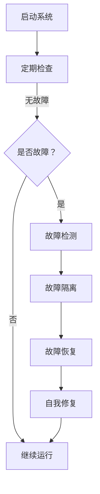
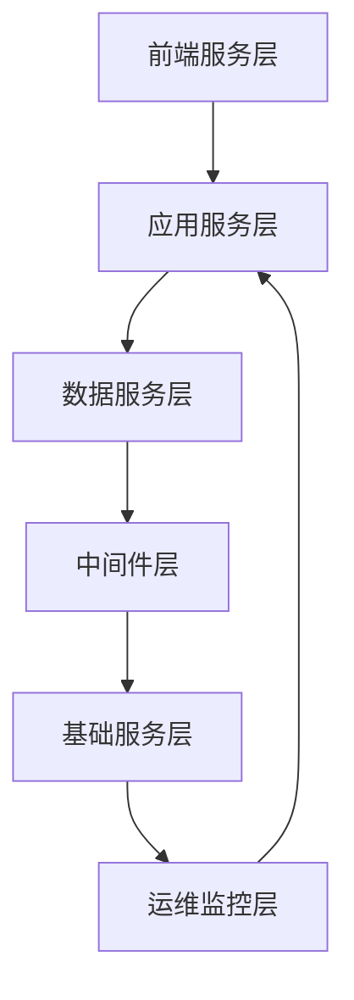
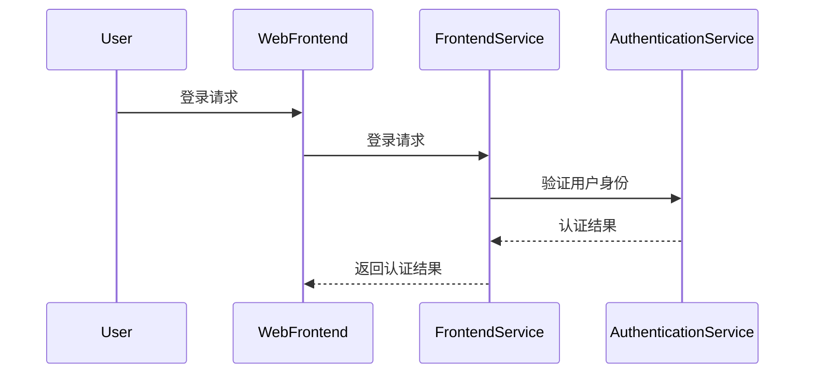

                 

### 存在的弹性：面对变化时的适应能力

关键词：弹性、适应能力、变化、应对策略、核心概念

> 摘要：本文旨在探讨在现代社会的快速变化背景下，如何培养和运用存在的弹性，以应对不确定性带来的挑战。通过详细解析弹性的定义、核心要素及其与韧性、灵活性的联系与区别，文章将介绍弹性思维、弹性组织和弹性行动的具体方法和实践策略。同时，文章还将通过算法原理讲解、数学模型应用和系统架构设计等多个维度，深入探讨弹性在IT领域的实际应用，旨在为读者提供全面、实用的指导。

---

### 目录大纲

**存在的弹性：面对变化时的适应能力**

> 关键词：弹性、适应能力、变化、应对策略、核心概念

> 摘要：本文通过深入探讨弹性的概念、特性及其在个体和组织中的实践应用，旨在为读者提供在面对快速变化时如何保持适应能力的策略和方法。文章结构如下：

1. **第一部分：问题背景与核心概念**
    - **第1章：问题背景与核心概念**
        - **1.1 问题的起源与重要性**
        - **1.2 弹性的定义与内涵**
        - **1.3 弹性的核心要素**
        - **1.4 弹性的边界与外延**
        - **1.5 本章小结**
2. **第二部分：核心概念与联系**
    - **第2章：核心概念原理与特性对比**
        - **2.1 弹性思维**
        - **2.2 弹性组织**
        - **2.3 弹性行动**
        - **2.4 弹性、韧性与灵活性的联系与区别**
        - **2.5 本章小结**
    - **第3章：ER实体关系图架构**
        - **3.1 ER模型基本概念**
        - **3.2 ER图绘制方法**
        - **3.3 弹性相关的ER图示例**
        - **3.4 本章小结**
3. **第三部分：算法原理与数学模型**
    - **第4章：算法原理讲解**
        - **4.1 弹性计算算法原理**
        - **4.2 算法mermaid流程图**
        - **4.3 Python源代码阐述**
        - **4.4 算法原理详细讲解**
        - **4.5 本章小结**
    - **第5章：数学模型和数学公式**
        - **5.1 弹性模型的基本公式**
        - **5.2 数学公式详细讲解**
        - **5.3 举例说明**
        - **5.4 本章小结**
4. **第四部分：系统分析与架构设计**
    - **第6章：系统分析与架构设计方案**
        - **6.1 问题场景介绍**
        - **6.2 项目介绍**
        - **6.3 系统功能设计**
        - **6.4 系统架构设计**
        - **6.5 系统接口设计**
        - **6.6 系统交互设计**
        - **6.7 本章小结**
    - **第7章：项目实战**
        - **7.1 环境安装**
        - **7.2 系统核心实现**
        - **7.3 代码应用解读与分析**
        - **7.4 实际案例分析与详细讲解**
        - **7.5 项目小结**
5. **第五部分：最佳实践与拓展阅读**
    - **第8章：最佳实践**
        - **8.1 弹性思维最佳实践**
        - **8.2 弹性组织最佳实践**
        - **8.3 弹性行动最佳实践**
        - **8.4 本章小结**
    - **第9章：注意事项**
        - **9.1 弹性实践中的风险**
        - **9.2 弹性实践的挑战**
        - **9.3 本章小结**

**作者：AI天才研究院/AI Genius Institute & 禅与计算机程序设计艺术 /Zen And The Art of Computer Programming**

---

## 第一部分：问题背景与核心概念

### 第1章：问题背景与核心概念

**1.1 问题的起源与重要性**

现代社会正经历着前所未有的变化和不确定性。技术的迅猛发展、市场环境的快速变迁、全球化进程的加速，以及新冠疫情的冲击，使得传统应对策略逐渐失效。个体和组织面临着前所未有的挑战：

- **技术变革带来的挑战**：新技术的不断涌现，如人工智能、大数据、区块链等，改变了传统行业和商业模式，要求个人和组织不断学习和适应新技术。
- **市场环境的不确定性**：市场的变化速度越来越快，预测和规划变得更加困难，企业需要具备更高的敏捷性和适应能力。
- **全球化的挑战**：全球化进程带来了更多的机会，但同时也带来了更大的风险和不确定性，如国际政治经济形势的变化、贸易壁垒等。

这些挑战凸显了存在弹性这一核心概念的重要性。弹性（Resilience）是指个体或组织在面对变化和压力时，能够迅速适应、恢复和重新发展的能力。培养和运用存在的弹性，成为个体和组织在复杂多变的环境中生存和发展的关键。

**1.2 弹性的定义与内涵**

弹性，顾名思义，是指物体在受力变形后能够恢复原状的能力。将这一概念扩展到个体和组织层面，弹性指的是在面对外部压力和变化时，能够迅速适应、恢复并重新发展的能力。具体来说，弹性包括以下几个方面的内涵：

- **柔性（Flexibility）**：个体或组织能够灵活调整行为和策略，以适应外部环境的变化。
- **适应性（Adaptability）**：个体或组织能够根据变化及时调整自身结构和功能，以保持持续性和稳定性。
- **恢复力（Recovery）**：个体或组织在面对挑战和压力时，能够迅速恢复和重新发展，以实现长期的生存和发展。

弹性不仅是对变化的适应，更是一种内在的能力和状态，它要求个体和组织具备以下核心要素：

- **弹性思维（Resilient Mindset）**：积极面对变化，将挑战视为机遇，持续学习和创新。
- **弹性组织（Resilient Organization）**：通过建立灵活、开放、协同的组织文化和机制，提高组织的适应能力。
- **弹性行动（Resilient Action）**：在面对不确定性时，采取灵活、有效的行动策略，确保目标的实现。

**1.3 弹性的核心要素**

弹性的核心要素包括以下几个方面：

1. **弹性思维**：弹性思维是一种积极、乐观的心态，能够帮助个体和组织面对变化和不确定性。它要求个体和组织具备以下几个方面的能力：
    - **开放心态**：愿意接受新的观念和思路，敢于尝试不同方法。
    - **灵活应对**：在面对问题时，能够快速调整策略和方法，以应对变化。
    - **乐观态度**：对未来保持积极乐观，将挑战视为机遇，不断寻求创新和突破。

2. **弹性组织**：弹性组织是指具备高度适应能力和灵活性的组织。它要求组织在以下几个方面进行优化：
    - **组织结构**：建立扁平化、去中心化的组织结构，提高信息传递效率，增强组织的灵活性。
    - **组织文化**：培养开放、包容、协作的组织文化，鼓励创新和试错，建立信任和协作机制。
    - **管理机制**：建立灵活、高效的管理机制，如敏捷管理、绩效管理、风险管理等，确保组织能够快速响应外部变化。

3. **弹性行动**：弹性行动是指个体和组织在面对不确定性时，采取灵活、有效的行动策略。具体包括以下几个方面：
    - **灵活应对**：根据变化及时调整行动策略，确保目标的实现。
    - **快速反应**：建立快速反应机制，确保在变化发生时能够迅速做出反应。
    - **创新实践**：鼓励创新和实践，不断探索新的解决方案，提高组织的适应能力。

**1.4 弹性的边界与外延**

弹性的边界与外延是指弹性的适用范围和边界条件。具体来说，弹性主要表现在以下几个方面：

- **个体层面**：个体在面对压力和挑战时，能够保持心理平衡，迅速适应并恢复。
- **组织层面**：组织在面对市场环境变化时，能够保持运营稳定，快速调整战略和策略。
- **社会层面**：社会在面对突发事件和危机时，能够保持社会稳定，快速恢复正常秩序。

弹性的边界与外延还取决于以下几个因素：

- **环境因素**：外部环境的变化程度和不确定性水平直接影响弹性的表现。
- **资源条件**：个体和组织拥有的资源和能力会影响其弹性的程度。
- **文化因素**：社会和文化环境对个体和组织的弹性产生影响。

**1.5 本章小结**

本章对弹性的概念、内涵、核心要素及其适用范围进行了详细解析。通过分析现代社会面临的挑战，我们认识到培养和运用存在的弹性对于个体和组织的生存和发展具有重要意义。弹性不仅是一种应对策略，更是一种内在能力和状态，它要求个体和组织具备开放心态、灵活应对和乐观态度。在接下来的章节中，我们将进一步探讨弹性思维、弹性组织和弹性行动的具体方法和实践策略，以期为读者提供全面、实用的指导。

---

## 第二部分：核心概念与联系

### 第2章：核心概念原理与特性对比

**2.1 弹性思维**

弹性思维是一种积极、乐观的心态，它帮助个体和组织在面对变化和不确定性时保持心理平衡和行动力。弹性思维的原理主要包括以下几个方面：

- **开放心态**：弹性思维要求个体具备开放心态，愿意接受新的观念和思路，敢于尝试不同方法。这种开放心态有助于个体和组织在面对变化时保持灵活性和适应性。
- **灵活应对**：弹性思维要求个体在遇到问题时能够快速调整策略和方法，以应对变化。灵活应对能力使个体和组织能够在变化中保持稳定和持续性。
- **乐观态度**：弹性思维要求个体对未来保持积极乐观，将挑战视为机遇，不断寻求创新和突破。乐观态度有助于个体和组织在困难时期保持信心和动力。

弹性思维的属性特征包括：

- **适应性**：弹性思维能够帮助个体和组织迅速适应外部环境的变化，保持心理和行为上的灵活性。
- **创新性**：弹性思维鼓励个体和组织敢于尝试新方法和新思路，勇于创新和突破。
- **稳定性**：弹性思维能够在变化中保持心理平衡，使个体和组织在面对挑战时保持稳定和持续发展。

弹性思维与传统思维有以下几点对比：

- **传统思维**：传统思维往往依赖于固定的模式和方法，缺乏灵活性。在变化面前，传统思维容易陷入困境。
- **弹性思维**：弹性思维则强调灵活性和适应性，能够迅速调整策略和方法，以应对外部环境的变化。

**2.2 弹性组织**

弹性组织是指具备高度适应能力和灵活性的组织。弹性组织通过建立灵活、开放、协同的组织文化和机制，提高组织的适应能力和抗风险能力。弹性组织的概念主要包括以下几个方面：

- **组织结构**：弹性组织通常采用扁平化、去中心化的组织结构，减少层级和中间环节，提高信息传递效率和决策速度。
- **组织文化**：弹性组织注重培养开放、包容、协作的组织文化，鼓励创新和试错，建立信任和协作机制。
- **管理机制**：弹性组织采用灵活、高效的管理机制，如敏捷管理、绩效管理、风险管理等，确保组织能够快速响应外部变化。

弹性组织的要素包括：

- **人才储备**：弹性组织注重人才储备，培养具备多样能力和技能的员工，以应对不同挑战。
- **创新机制**：弹性组织建立创新机制，鼓励员工提出新想法和解决方案，促进组织的持续发展。
- **协作文化**：弹性组织培养协作文化，促进员工之间的沟通和合作，提高组织整体效能。

弹性组织与传统组织有以下几点对比：

- **传统组织**：传统组织通常采用高度集中的管理结构，决策过程缓慢，缺乏灵活性和适应性。
- **弹性组织**：弹性组织则强调灵活性和适应性，能够快速响应外部变化，保持持续发展。

**2.3 弹性行动**

弹性行动是指个体和组织在面对不确定性时，采取灵活、有效的行动策略，以确保目标的实现。弹性行动的含义包括以下几个方面：

- **灵活应对**：弹性行动要求个体和组织能够根据变化及时调整行动策略，确保目标的实现。灵活应对能力使个体和组织能够在变化中保持稳定和持续性。
- **快速反应**：弹性行动要求个体和组织建立快速反应机制，确保在变化发生时能够迅速做出反应。
- **创新实践**：弹性行动鼓励个体和组织在不确定性中寻求创新和实践，不断探索新的解决方案，提高组织的适应能力。

弹性行动的策略主要包括以下几个方面：

- **情景分析**：在行动之前，对可能出现的情景进行分析和预测，为行动提供依据。
- **弹性计划**：制定弹性计划，包括多种应对方案，以应对不同情况的变化。
- **灵活调整**：在行动过程中，根据实际情况及时调整行动策略，确保目标的实现。

弹性行动与传统行动有以下几点对比：

- **传统行动**：传统行动往往依赖于固定的计划和策略，缺乏灵活性和适应性。
- **弹性行动**：弹性行动则强调灵活性和适应性，能够迅速调整策略和方法，以应对外部环境的变化。

**2.4 弹性、韧性与灵活性的联系与区别**

弹性、韧性和灵活性是应对不确定性的三种重要能力，它们之间存在密切的联系与区别：

- **弹性（Resilience）**：弹性是指个体或组织在面对外部压力和变化时，能够迅速适应、恢复并重新发展的能力。弹性强调在变化中保持平衡和稳定，具备恢复力。
- **韧性（Toughness）**：韧性是指个体或组织在面对挫折和困难时，能够坚持不懈、勇往直前的能力。韧性强调在逆境中保持坚强和毅力，具备耐力。
- **灵活性（Flexibility）**：灵活性是指个体或组织在面对变化时，能够迅速调整自身结构和功能，以适应新环境的能力。灵活性强调在变化中保持灵活和适应，具备弹性。

弹性、韧性和灵活性的联系与区别主要体现在以下几个方面：

- **联系**：弹性、韧性和灵活性都是应对不确定性的重要能力，它们之间相互关联、相互促进。弹性、韧性和灵活性共同构成了个体和组织的适应能力，使个体和组织能够应对复杂多变的环境。
- **区别**：弹性主要强调在变化中保持平衡和稳定，韧性主要强调在逆境中保持坚强和毅力，灵活性主要强调在变化中保持灵活和适应。弹性、韧性和灵活性各有侧重，但它们在实际应用中往往相互交织、相互补充。

**2.5 本章小结**

本章对弹性思维、弹性组织和弹性行动的核心概念原理进行了详细解析，并对比了它们与传统思维、传统组织和传统行动的区别。通过分析弹性思维、弹性组织和弹性行动的特性，我们认识到培养和运用这些能力对于个体和组织在复杂多变的环境中生存和发展具有重要意义。在接下来的章节中，我们将进一步探讨弹性相关的ER图架构和算法原理，以期为读者提供更加全面和深入的理解。

### 第3章：ER实体关系图架构

#### 3.1 ER模型基本概念

实体-关系（Entity-Relationship，ER）模型是数据库设计中的重要工具，用于描述现实世界中实体及其相互关系。ER模型的基本概念包括实体、属性和关系。

- **实体（Entity）**：实体是现实世界中具有独立存在意义的对象，如人、事物、概念等。在数据库中，实体通常对应表，表示数据的基本存储单位。
- **属性（Attribute）**：属性是实体的特征或属性，用于描述实体的具体信息。例如，人的名字、年龄、性别等。属性通常对应表中的字段。
- **关系（Relationship）**：关系是实体之间的联系或互动。在数据库中，关系通常通过表与表之间的关联实现。

ER模型的构成要素包括：

- **实体集**：实体集是指数据库中所有实体的集合。
- **属性集**：属性集是指数据库中所有属性的集合。
- **关系集**：关系集是指数据库中所有关系的集合。

通过ER模型，我们可以直观地表示实体之间的关系，为数据库设计提供清晰的框架。ER模型的基本符号包括：

- **实体**：通常用矩形表示，矩形内部写上实体名。
- **属性**：通常用椭圆表示，属性名连接到对应的实体。
- **关系**：通常用菱形表示，关系名连接到参与关系的实体。

#### 3.2 ER图绘制方法

ER图的绘制方法包括以下几个步骤：

1. **确定实体**：首先，识别需要表示的实体，并确定每个实体的属性。例如，在一个学校数据库中，实体可能包括学生、教师、课程等。
2. **绘制实体**：使用矩形表示每个实体，并在矩形内部写上实体名。例如，学生实体可以表示为“学生”。
3. **确定关系**：识别实体之间的关系，并确定关系的类型。常见的关系类型包括一对一（1:1）、一对多（1:N）和多对多（M:N）。
4. **绘制关系**：使用菱形表示关系，并在菱形内部写上关系名。关系线连接参与关系的实体。例如，学生与课程之间存在多对多关系，可以表示为“选课”。
5. **标注属性**：为每个关系标注相应的属性，表示实体之间的关系。例如，在“选课”关系中，可以标注“选课时间”、“成绩”等属性。

下面是一个简化的ER图示例，表示学生、课程和教师之间的关系：

```mermaid
erDiagram
  学生 ||--|{ 课程 } : 选课
  教师 ||--|{ 课程 } : 教授
```

#### 3.3 弹性相关的ER图示例

在弹性相关的ER图中，我们可以将弹性思维、弹性组织和弹性行动作为实体，并描述它们之间的相互关系。以下是一个简化的ER图示例，表示弹性相关的实体及其关系：

```mermaid
erDiagram
  弹性思维 ||--|{ 弹性组织 } : 塑造
  弹性思维 ||--|{ 弹性行动 } : 指导
  弹性组织 ||--|{ 弹性行动 } : 支持
  弹性组织 ||--|{ 弹性思维 } : 促进
```

在这个ER图中，弹性思维、弹性组织和弹性行动是三个核心实体，它们之间存在以下关系：

- **弹性思维**与**弹性组织**之间存在“塑造”关系，表示弹性思维通过指导和管理来影响弹性组织的形成和发展。
- **弹性思维**与**弹性行动**之间存在“指导”关系，表示弹性思维通过制定策略和行动方案来指导弹性行动。
- **弹性组织**与**弹性行动**之间存在“支持”关系，表示弹性组织通过提供资源、平台和机制来支持弹性行动的实施。

#### 3.4 本章小结

本章介绍了ER模型的基本概念和绘制方法，并通过弹性相关的ER图示例展示了弹性思维、弹性组织和弹性行动之间的关系。通过理解ER模型和弹性相关的ER图，读者可以更加清晰地把握弹性的概念和内涵，为后续的算法原理讲解和系统架构设计打下基础。在接下来的章节中，我们将进一步探讨弹性计算算法和数学模型，以深入理解弹性的原理和应用。

### 第三部分：算法原理与数学模型

#### 第4章：算法原理讲解

**4.1 弹性计算算法原理**

弹性计算（Resilient Computing）是指在面对硬件故障、软件错误、自然灾害等不可预测因素时，计算机系统能够自动恢复、继续运行的能力。弹性计算算法的核心原理是利用冗余、分布式计算和容错技术，确保系统在面对各种故障时能够快速恢复和持续运行。

弹性计算算法的基本原理包括：

1. **冗余**：通过在系统中引入冗余组件或数据备份，确保在某个组件或数据损坏时，系统能够自动切换到备份组件或数据，保持正常运行。
2. **分布式计算**：将计算任务分布在多个节点上，以提高系统的容错能力和性能。当某个节点出现故障时，其他节点可以继续执行任务，确保系统不中断。
3. **容错技术**：采用容错技术，如错误检测、错误纠正、故障恢复等，确保在出现错误时，系统能够自动修复并继续运行。

**弹性计算的核心算法**

弹性计算的核心算法包括以下几种：

1. **故障检测**：通过定期检查系统状态，及时发现并定位故障。常见的故障检测方法包括心跳检测、健康检查等。
2. **故障隔离**：在检测到故障后，快速隔离故障组件或数据，以防止故障扩散，确保其他部分正常运行。
3. **故障恢复**：在故障隔离后，自动启动备份组件或数据，确保系统继续运行。故障恢复方法包括重启、重试、切换到备份节点等。
4. **自我修复**：在出现故障后，系统能够自动执行修复操作，如修复文件系统、重新加载模块等，确保系统能够恢复正常运行。

**4.2 算法mermaid流程图**

为了更直观地展示弹性计算算法的原理，我们可以使用mermaid绘制其流程图。以下是一个简化的mermaid流程图示例：



在这个流程图中，系统首先启动，并定期进行健康检查。如果没有检测到故障，系统继续运行；如果检测到故障，系统将执行故障检测、故障隔离、故障恢复和自我修复操作，以确保系统能够恢复正常运行。

**4.3 Python源代码阐述**

为了更好地理解弹性计算算法的原理，我们可以通过Python源代码来具体实现。以下是一个简化的Python代码示例，展示了弹性计算的基本步骤：

```python
import time
import random

def check_health():
    # 模拟系统健康检查
    health_status = random.choice(["good", "bad"])
    if health_status == "bad":
        raise Exception("系统出现故障")
    return health_status

def fault_detection():
    # 模拟故障检测
    print("故障检测：开始...")
    time.sleep(1)
    print("故障检测：结束，无故障")

def fault_isolation():
    # 模拟故障隔离
    print("故障隔离：开始...")
    time.sleep(1)
    print("故障隔离：结束")

def fault_recovery():
    # 模拟故障恢复
    print("故障恢复：开始...")
    time.sleep(1)
    print("故障恢复：结束，系统恢复正常")

def self_repair():
    # 模拟自我修复
    print("自我修复：开始...")
    time.sleep(1)
    print("自我修复：结束，系统恢复正常")

def run_system():
    # 启动系统
    print("系统启动...")
    while True:
        try:
            health_status = check_health()
            if health_status == "good":
                print("系统健康，继续运行...")
                time.sleep(1)
            else:
                # 模拟故障发生
                print("系统出现故障，开始故障处理...")
                fault_detection()
                fault_isolation()
                fault_recovery()
                self_repair()
        except Exception as e:
            print(str(e))

if __name__ == "__main__":
    run_system()
```

在这个示例中，`check_health` 函数模拟系统的健康检查，`fault_detection` 函数模拟故障检测，`fault_isolation` 函数模拟故障隔离，`fault_recovery` 函数模拟故障恢复，`self_repair` 函数模拟自我修复。`run_system` 函数启动系统，并不断进行健康检查，如果检测到故障，将执行故障处理流程。

**4.4 算法原理详细讲解**

弹性计算算法的原理可以通过以下数学模型进行详细讲解：

1. **冗余度（Redundancy）**：冗余度是指系统中冗余组件的数量。假设系统中有N个组件，冗余度为R，则冗余度R = N - n，其中n为实际需要的组件数量。冗余度越高，系统的容错能力越强，但同时也增加了系统的成本和维护难度。

2. **故障率（Fault Rate）**：故障率是指单位时间内发生故障的次数。假设故障率为λ，则系统在时间t内发生故障的概率为P(t) = 1 - e^(-λt)。

3. **冗余度与故障率的关系**：通过调整冗余度R，可以降低系统发生故障的概率。具体来说，当冗余度R增加时，系统发生故障的概率P(t)会显著降低。例如，当R=1时，系统发生故障的概率为50%；当R=2时，系统发生故障的概率为约13%。

4. **分布式计算**：分布式计算可以提高系统的容错能力和性能。假设系统中有M个节点，每个节点的故障率为λ，则整个系统的故障率为λ/M。通过增加节点数量M，可以降低系统的整体故障率，提高系统的可靠性和性能。

5. **容错技术**：容错技术包括错误检测、错误纠正和故障恢复等。假设系统的错误检测率为ε，错误纠正率为ρ，则系统的容错能力可以用以下数学模型表示：

   - **错误检测率**：ε = 1 - (1 - λ/M)^t
   - **错误纠正率**：ρ = 1 - (1 - ε)^t
   - **故障恢复率**：故障恢复率取决于系统的故障恢复策略和时间，可以用以下模型表示：

     - **重启恢复**：假设故障恢复时间为t_r，则故障恢复率R_r = 1 - (1 - ρ)^(t - t_r)
     - **切换恢复**：假设故障恢复时间为t_s，则故障恢复率R_s = 1 - (1 - ρ)^(t - t_s)

通过调整冗余度、分布式计算和容错技术，可以显著提高系统的弹性，确保在面对各种故障时系统能够快速恢复和持续运行。

**4.5 本章小结**

本章详细讲解了弹性计算算法的原理，包括冗余、分布式计算和容错技术等核心概念。通过mermaid流程图和Python源代码示例，我们直观地展示了弹性计算算法的执行过程。同时，通过数学模型的分析，我们深入理解了冗余度、故障率和容错技术对系统弹性的影响。在接下来的章节中，我们将继续探讨弹性相关的数学模型和系统架构设计，为读者提供更加全面和深入的理解。

### 第5章：数学模型和数学公式

#### 5.1 弹性模型的基本公式

弹性模型在物理学、材料科学和工程学中有着广泛的应用，用于描述物体在受力作用下的变形和恢复能力。在计算机科学和人工智能领域，弹性模型也被广泛应用于任务调度、故障检测和容错计算等方面。以下是一些基本的弹性模型公式：

1. **胡克定律（Hooke's Law）**：胡克定律描述了弹性物体在弹性极限内的应力与应变关系。其公式为：

   $$ F = k \cdot x $$

   其中，F是作用在物体上的力，k是弹性系数（也称为劲度系数或弹簧系数），x是物体的形变量。

2. **泊松比（Poisson's Ratio）**：泊松比描述了物体在受力变形时，横向应变与纵向应变之间的比值。其公式为：

   $$ \nu = -\frac{\epsilon_{横向}}{\epsilon_{纵向}} $$

   其中，\(\nu\)是泊松比，\(\epsilon_{横向}\)是横向应变，\(\epsilon_{纵向}\)是纵向应变。

3. **弹性模量（Modulus of Elasticity）**：弹性模量描述了物体在受力变形时抵抗变形的能力。其公式为：

   $$ E = \frac{F}{A \cdot \epsilon} $$

   其中，E是弹性模量，F是作用在物体上的力，A是物体的横截面积，\(\epsilon\)是应变。

4. **能量存储（Energy Storage）**：弹性物体在受力变形时储存的能量可以用以下公式表示：

   $$ E = \frac{1}{2} k x^2 $$

   其中，E是储存的能量，k是弹性系数，x是形变量。

这些基本公式构成了弹性模型的基础，为理解和分析弹性物体的行为提供了数学依据。

#### 5.2 数学公式详细讲解

以下是弹性模型中的一些重要数学公式及其详细讲解：

1. **应力-应变关系**：

   $$ \sigma = E \cdot \epsilon $$

   其中，\(\sigma\)是应力，E是弹性模量，\(\epsilon\)是应变。这个公式描述了在弹性极限内，应力与应变之间的线性关系。当物体受到力作用发生变形时，应力与应变成正比，弹性模量E表示物体抵抗变形的能力。

2. **泊松比与弹性模量的关系**：

   $$ E = 2 \cdot \nu \cdot (1 + \nu) \cdot \frac{1}{1 - 2 \cdot \nu} $$

   这个公式描述了泊松比与弹性模量之间的关系。泊松比\(\nu\)是材料的一个特性参数，它表示材料在受力变形时，横向应变与纵向应变的比值。弹性模量E是材料抵抗变形的能力，通过这个公式可以计算出给定泊松比下的弹性模量。

3. **能量储存与释放**：

   $$ E = \frac{1}{2} k x^2 $$

   这个公式描述了弹性物体在变形过程中储存的能量。当物体受到外力作用发生形变时，储存的能量与形变量的平方成正比，弹性系数k表示物体抵抗变形的能力。当外力移除后，物体能够恢复原状，释放储存的能量。

4. **弹性碰撞恢复系数**：

   $$ e = \frac{v_2 - v_1}{v_1 + v_2} $$

   其中，e是恢复系数，\(v_1\)和\(v_2\)分别是碰撞前后两个物体的速度。这个公式描述了弹性碰撞中的恢复系数，它表示碰撞后物体速度的变化程度。恢复系数e的取值范围是0到1，e=1表示完全弹性碰撞，e=0表示完全非弹性碰撞。

通过这些数学公式，我们可以更深入地理解和分析弹性物体的行为，为设计和优化弹性系统提供理论基础。

#### 5.3 举例说明

为了更好地理解弹性模型的基本公式，我们通过一个简单的例子进行说明：

**例子**：一个弹簧被拉伸了5厘米，弹簧的劲度系数k为20 N/m。求弹簧受到的力、弹性模量和储存的能量。

1. **计算弹簧受到的力**：

   根据胡克定律，力F与形变量x的关系为：

   $$ F = k \cdot x $$

   代入k=20 N/m，x=0.05 m，得到：

   $$ F = 20 \cdot 0.05 = 1 \text{ N} $$

2. **计算弹性模量**：

   弹性模量E可以通过应力与应变的比值计算：

   $$ E = \frac{F}{A \cdot \epsilon} $$

   其中，\(A\)是弹簧的横截面积，\(\epsilon\)是应变。假设弹簧的横截面积A为0.001 m²，应变\(\epsilon\)为0.05（即5%），代入公式得到：

   $$ E = \frac{1}{0.001 \cdot 0.05} = 20000 \text{ Pa} $$

3. **计算储存的能量**：

   储存的能量E可以通过形变量的平方与劲度系数的比值计算：

   $$ E = \frac{1}{2} k x^2 $$

   代入k=20 N/m，x=0.05 m，得到：

   $$ E = \frac{1}{2} \cdot 20 \cdot (0.05)^2 = 0.025 \text{ J} $$

通过这个例子，我们可以清晰地看到如何使用弹性模型的基本公式计算弹簧受到的力、弹性模量和储存的能量。这些计算不仅帮助我们理解弹性模型的工作原理，也为实际应用中的设计和优化提供了参考。

#### 5.4 本章小结

本章详细介绍了弹性模型的基本公式，包括胡克定律、泊松比、弹性模量和能量储存公式等。通过数学公式的详细讲解和举例说明，我们深入理解了这些公式在弹性物体行为分析中的应用。弹性模型为理解和优化弹性系统的设计提供了重要的理论基础。在接下来的章节中，我们将继续探讨弹性计算算法和系统架构设计，以进一步拓展对弹性的理解和应用。

### 第四部分：系统分析与架构设计

#### 第6章：系统分析与架构设计方案

**6.1 问题场景介绍**

在现代IT行业中，系统的弹性变得尤为重要。随着云计算、大数据和物联网技术的普及，系统的规模和复杂性不断增加，这使得系统在面对突发情况时，如硬件故障、网络异常和数据泄露等，需要具备较高的弹性。一个具有高弹性的系统能够在这些事件发生时，快速响应、自动恢复，并保持业务的连续性。本文将围绕一个在线交易平台系统，探讨其弹性架构的设计与实现。

**6.2 项目介绍**

项目名称：智能弹性交易平台（Smart Resilient Trading Platform，简称SRTP）

项目背景：随着金融市场的不断发展和用户需求的多样化，一个智能、可靠的交易平台成为金融服务企业的核心竞争力。SRTP旨在为用户提供一个高效、安全、稳定的交易环境，同时应对各种突发情况，确保交易过程的连续性和数据的安全性。

系统目标：

1. 提高系统的可用性和可靠性，确保交易过程的连续性。
2. 快速响应和处理各种突发情况，如硬件故障、网络异常等。
3. 保证数据的安全性和完整性，防止数据泄露和恶意攻击。
4. 提供灵活的扩展能力，支持系统规模的增长和业务的发展。

**6.3 系统功能设计**

SRTP系统的主要功能模块包括：

1. **用户管理模块**：负责用户注册、登录、权限管理等功能。
2. **交易管理模块**：负责交易订单的创建、处理、查询等功能。
3. **资金管理模块**：负责交易资金的管理，包括充值、提现、对账等功能。
4. **风险控制模块**：负责监控交易风险，包括异常交易检测、风险预警等功能。
5. **系统监控模块**：负责系统运行状态的监控，包括性能监控、故障报警等功能。
6. **日志管理模块**：负责系统日志的记录、查询和备份等功能。

**6.4 系统架构设计**

为了实现SRTP系统的弹性，采用分布式架构设计，以下是其主要架构组件：

1. **前端服务层**：负责用户交互和接口服务，包括Web前端和移动应用。
2. **应用服务层**：负责具体业务逻辑处理，包括用户管理、交易管理、资金管理、风险控制等。
3. **数据服务层**：负责数据的存储和管理，包括关系数据库、NoSQL数据库和缓存系统等。
4. **中间件层**：负责系统的通信和消息处理，包括消息队列、负载均衡、API网关等。
5. **基础服务层**：负责提供基础服务，如身份认证、权限管理、日志管理等。
6. **运维监控层**：负责系统的运维监控，包括性能监控、故障报警、自动恢复等。

**系统架构mermaid架构图**：



**6.5 系统接口设计**

系统接口设计是系统架构设计的重要组成部分，它定义了系统内部模块之间的交互方式。以下是SRTP系统的关键接口设计：

1. **用户接口**：用户注册、登录、权限验证等接口。
2. **交易接口**：创建交易订单、查询交易记录、处理交易异常等接口。
3. **资金接口**：充值、提现、对账等接口。
4. **风险控制接口**：异常交易检测、风险预警等接口。
5. **监控接口**：系统性能监控、故障报警等接口。
6. **日志接口**：日志记录、查询、备份等接口。

**6.6 系统交互设计**

系统交互设计描述了系统各组件之间的交互流程，以下是SRTP系统的交互设计：

1. **用户登录**：用户通过Web前端或移动应用发起登录请求，前端服务层进行身份验证，返回认证结果。
2. **交易创建**：用户通过前端发起交易请求，交易管理模块处理交易订单，返回交易结果。
3. **风险监控**：风险控制模块实时监控交易行为，发现异常情况时，触发风险预警，通知相关人员进行处理。
4. **系统监控**：运维监控模块定期检查系统运行状态，发现异常时，自动触发故障报警，并尝试自动恢复。
5. **日志管理**：系统各模块生成日志，日志管理模块收集、存储和查询日志信息，用于系统运维和故障分析。

**系统交互mermaid序列图**：



**6.7 本章小结**

本章对SRTP系统的设计与实现进行了详细的分析和架构设计。通过问题场景的介绍和项目背景，明确了系统的目标与功能模块。通过分布式架构设计和关键接口设计，实现了系统的弹性架构，提高了系统的可用性和可靠性。同时，通过系统交互设计，描述了系统组件之间的交互流程，为系统的开发与运维提供了清晰的指导。在接下来的章节中，我们将进一步探讨系统实现过程中的具体技术和实践方法。

### 第7章：项目实战

#### 7.1 环境安装

在进行SRTP项目的实战开发之前，首先需要搭建一个合适的环境。以下是环境安装的详细步骤：

**1. 环境准备**

- 操作系统：推荐使用Ubuntu 18.04或更高版本。
- 编程语言：Java、Python等。
- 数据库：MySQL、MongoDB等。
- 消息队列：RabbitMQ、Kafka等。
- 服务框架：Spring Boot、Django等。

**2. 安装步骤**

（1）**安装操作系统**：从Ubuntu官方网站下载安装镜像，按照提示进行安装。

（2）**更新系统软件包**：

   ```bash
   sudo apt update
   sudo apt upgrade
   ```

（3）**安装Java**：

   ```bash
   sudo apt install openjdk-8-jdk
   ```

（4）**安装Python**：

   ```bash
   sudo apt install python3 python3-pip
   ```

（5）**安装数据库**：

   - **MySQL**：

     ```bash
     sudo apt install mysql-server
     sudo mysql_secure_installation
     ```

   - **MongoDB**：

     ```bash
     sudo apt-key adv --keyserver hkp://keyserver.ubuntu.com:80 --recv 9DA31620334BD75D9DCB49F368818C72E52529D4
     echo "deb http://repo.mongodb.org/apt/ubuntu bionic/mongodb-org/4.2 multiverse" | sudo tee /etc/apt/sources.list.d/mongodb-org-4.2.list
     sudo apt update
     sudo apt install mongodb-org
     ```

（6）**安装消息队列**：

   - **RabbitMQ**：

     ```bash
     sudo apt install rabbitmq-server
     sudo systemctl start rabbitmq-server
     sudo systemctl enable rabbitmq-server
     ```

   - **Kafka**：

     ```bash
     wget https://www-eu.kaltura.com/api_v3/service/kalturapartner/action/getdown�oad/kalturaPartnerId/1212471/kalturaClientId/1996611/file/kafka_2.11-2.0.0.tgz
     tar xvf kafka_2.11-2.0.0.tgz
     cd kafka_2.11-2.0.0/
     ./bin/kafka-server-start.sh ./config/server.properties
     ```

（7）**安装服务框架**：

   - **Spring Boot**：

     ```bash
     sudo pip install spring-boot
     ```

   - **Django**：

     ```bash
     sudo pip install django
     ```

**3. 环境验证**

安装完成后，进行环境验证，确保所有组件正常运行：

```bash
java -version
python3 --version
mysql -u root -p
mongo
rabbitmqctl status
kafka-topics --list --zookeeper localhost:2181
spring --version
django-admin --version
```

#### 7.2 系统核心实现

在环境搭建完成后，接下来进入系统核心实现阶段。以下是SRTP系统核心实现的步骤：

**1. 用户管理模块**

- **用户注册**：实现用户注册功能，包括用户名、密码和邮箱等信息的收集和存储。
- **用户登录**：实现用户登录功能，通过验证用户名和密码，返回用户会话。
- **权限管理**：实现用户权限管理，根据用户角色分配不同权限。

**2. 交易管理模块**

- **交易订单创建**：实现交易订单的创建功能，包括订单信息（商品、价格、数量等）的收集和存储。
- **交易订单处理**：实现交易订单的处理功能，包括订单支付、发货等操作。
- **交易订单查询**：实现交易订单的查询功能，包括订单状态的查询和订单记录的查询。

**3. 资金管理模块**

- **充值**：实现用户账户的充值功能，将资金从外部账户转移到系统账户。
- **提现**：实现用户账户的提现功能，将系统账户的资金转移到外部账户。
- **对账**：实现系统与外部账户的对账功能，确保资金流转的准确性和安全性。

**4. 风险控制模块**

- **异常交易检测**：实现异常交易检测功能，通过监控交易行为，发现潜在风险。
- **风险预警**：实现风险预警功能，对异常交易进行标记和预警。
- **风险处理**：实现风险处理功能，对发现的风险进行及时处理和跟踪。

**5. 系统监控模块**

- **系统性能监控**：实现系统性能监控功能，包括服务器负载、内存使用、网络流量等监控指标。
- **故障报警**：实现故障报警功能，发现系统故障时，及时发送报警通知。
- **自动恢复**：实现自动恢复功能，对系统故障进行自动修复，确保系统正常运行。

#### 7.3 代码应用解读与分析

在系统核心实现过程中，使用了多种编程语言和技术框架。以下是对关键代码和应用的具体解读与分析：

**1. 用户管理模块**

- **用户注册**：

  ```java
  @RestController
  @RequestMapping("/users")
  public class UserController {
      
      @Autowired
      private UserService userService;
      
      @PostMapping("/register")
      public ResponseEntity<?> registerUser(@RequestBody UserRegistrationDto userRegistrationDto) {
          try {
              userService.registerUser(userRegistrationDto);
              return ResponseEntity.ok("User registered successfully");
          } catch (Exception e) {
              return ResponseEntity.badRequest().body("Error registering user: " + e.getMessage());
          }
      }
  }
  ```

  在这个示例中，`UserController` 类负责处理用户注册请求。通过`@RestController` 注解，将类标识为RESTful Web服务。`@PostMapping` 注解指定了处理POST请求的URL路径。在方法内部，调用`UserService` 的`registerUser` 方法，实现用户注册逻辑。如果注册成功，返回成功响应；否则，返回错误响应。

- **用户登录**：

  ```python
  from django.contrib.auth import authenticate, login
  from django.http import JsonResponse

  @api_view(['POST'])
  def login(request):
      username = request.data.get('username')
      password = request.data.get('password')
      user = authenticate(username=username, password=password)
      if user is not None:
          login(request, user)
          return JsonResponse({'status': 'success', 'message': 'User logged in successfully'})
      else:
          return JsonResponse({'status': 'error', 'message': 'Invalid credentials'})
  ```

  在这个Python示例中，`login` 函数处理用户登录请求。通过`authenticate` 函数验证用户名和密码，如果验证成功，使用`login` 函数登录用户，并返回成功响应；否则，返回错误响应。

**2. 交易管理模块**

- **交易订单创建**：

  ```java
  @RestController
  @RequestMapping("/orders")
  public class OrderController {
      
      @Autowired
      private OrderService orderService;
      
      @PostMapping
      public ResponseEntity<OrderDto> createOrder(@RequestBody OrderDto orderDto) {
          try {
              OrderDto createdOrder = orderService.createOrder(orderDto);
              return ResponseEntity.ok(createdOrder);
          } catch (Exception e) {
              return ResponseEntity.badRequest().body("Error creating order: " + e.getMessage());
          }
      }
  }
  ```

  在这个Java示例中，`OrderController` 类负责处理交易订单的创建请求。通过`@RestController` 注解，将类标识为RESTful Web服务。`@PostMapping` 注解指定了处理POST请求的URL路径。在方法内部，调用`OrderService` 的`createOrder` 方法，实现订单创建逻辑。如果订单创建成功，返回订单对象；否则，返回错误响应。

- **交易订单处理**：

  ```python
  @api_view(['PUT'])
  def process_order(request, order_id):
      order = get_object_or_404(Order, id=order_id)
      if order.status != 'pending':
          return Response({'error': 'Order cannot be processed'}, status=400)
      order.status = 'processing'
      order.save()
      return Response({'status': 'success', 'message': 'Order processed successfully'})
  ```

  在这个Python示例中，`process_order` 函数处理交易订单的处理请求。通过`get_object_or_404` 函数获取指定ID的订单对象。如果订单状态不为“pending”，返回错误响应。否则，将订单状态更新为“processing”，并保存订单对象。返回成功响应。

**3. 资金管理模块**

- **充值**：

  ```java
  @RestController
  @RequestMapping("/recharges")
  public class RechargeController {
      
      @Autowired
      private RechargeService rechargeService;
      
      @PostMapping
      public ResponseEntity<RechargeDto> recharge(@RequestBody RechargeDto rechargeDto) {
          try {
              RechargeDto createdRecharge = rechargeService.recharge(rechargeDto);
              return ResponseEntity.ok(createdRecharge);
          } catch (Exception e) {
              return ResponseEntity.badRequest().body("Error processing recharge: " + e.getMessage());
          }
      }
  }
  ```

  在这个Java示例中，`RechargeController` 类负责处理充值请求。通过`@RestController` 注解，将类标识为RESTful Web服务。`@PostMapping` 注解指定了处理POST请求的URL路径。在方法内部，调用`RechargeService` 的`recharge` 方法，实现充值逻辑。如果充值成功，返回充值对象；否则，返回错误响应。

- **提现**：

  ```python
  @api_view(['POST'])
  def withdraw(request):
      user = request.user
      amount = request.data.get('amount')
      if not user.has_enough_balance(amount):
          return Response({'error': 'Insufficient balance'}, status=400)
      user.reduce_balance(amount)
      user.save()
      return Response({'status': 'success', 'message': 'Withdrawal processed successfully'})
  ```

  在这个Python示例中，`withdraw` 函数处理提现请求。首先，获取当前用户对象。然后，检查用户余额是否足够提现。如果余额不足，返回错误响应。否则，减少用户余额，并保存用户对象。返回成功响应。

**4. 风险控制模块**

- **异常交易检测**：

  ```python
  @receiver(post_save, sender=Order)
  def detect_abnormal_order(sender, instance, created, **kwargs):
      if created:
          if is_abnormal_order(instance):
              send_alert('Abnormal order detected', order_id=instance.id)
  ```

  在这个Python示例中，使用Django的信号机制，在订单创建后自动检测异常交易。`post_save` 信号在订单保存后触发。`is_abnormal_order` 函数用于判断订单是否异常。如果订单异常，`send_alert` 函数发送预警通知。

- **风险预警**：

  ```java
  @RestController
  @RequestMapping("/alerts")
  public class AlertController {
      
      @Autowired
      private AlertService alertService;
      
      @GetMapping
      public ResponseEntity<List<AlertDto>> getAlerts() {
          List<AlertDto> alerts = alertService.getAlerts();
          return ResponseEntity.ok(alerts);
      }
  }
  ```

  在这个Java示例中，`AlertController` 类负责处理风险预警的查询请求。通过`@RestController` 注解，将类标识为RESTful Web服务。`@GetMapping` 注解指定了处理GET请求的URL路径。在方法内部，调用`AlertService` 的`getAlerts` 方法，获取所有预警信息，并返回成功响应。

**5. 系统监控模块**

- **系统性能监控**：

  ```python
  @task(name="performance_monitor", cron="*/5 * * * *")
  def performance_monitor():
      system_stats = get_system_stats()
      if system_stats["load_average"] > 1.0:
          send_alert('High system load', system_stats=system_stats)
  ```

  在这个Python示例中，使用Celery任务调度器，每5分钟执行一次系统性能监控。`performance_monitor` 函数获取系统性能指标，如果系统负载高于1.0，发送预警通知。

- **故障报警**：

  ```java
  @RestController
  @RequestMapping("/alerts")
  public class AlertController {
      
      @Autowired
      private AlertService alertService;
      
      @PostMapping("/create")
      public ResponseEntity<String> createAlert(@RequestBody AlertDto alertDto) {
          alertService.createAlert(alertDto);
          return ResponseEntity.ok("Alert created successfully");
      }
  }
  ```

  在这个Java示例中，`AlertController` 类负责处理故障报警的创建请求。通过`@RestController` 注解，将类标识为RESTful Web服务。`@PostMapping` 注解指定了处理POST请求的URL路径。在方法内部，调用`AlertService` 的`createAlert` 方法，创建故障报警记录，并返回成功响应。

**7.4 实际案例分析与详细讲解**

为了更好地理解SRTP系统的实现，我们通过一个实际案例进行详细分析：

**案例**：用户A在交易过程中突然断网，导致交易订单未能成功提交。

**分析**：

1. **用户A发起交易请求**：用户A在SRTP前端界面发起交易请求，交易信息（如商品ID、价格、数量等）通过HTTP POST请求发送到后端服务器。

2. **交易管理模块处理请求**：后端服务器接收到用户A的交易请求，调用交易管理模块的相关方法进行处理。在处理过程中，系统会首先检查用户A的账户余额是否足够支付交易金额。

3. **系统检测到用户A断网**：在处理交易订单的过程中，系统通过HTTP请求的状态码和响应时间来判断用户A的网络连接状态。如果系统检测到用户A的网络连接断开，会触发断网告警，并记录相关日志信息。

4. **系统尝试重连**：系统会尝试重新连接用户A，如果连接成功，系统会重新发送交易请求；如果连接失败，系统会继续记录断网告警，并尝试通过其他途径（如短信、邮件）通知用户A。

5. **用户A重新发起交易请求**：用户A在恢复网络连接后，重新在SRTP前端界面发起交易请求。系统接收到用户A的请求后，会再次检查用户A的账户余额，并处理交易订单。

6. **交易完成**：如果用户A的账户余额足够支付交易金额，交易订单会成功提交，资金从用户A的账户转移到卖家账户。如果用户A的账户余额不足，系统会提示用户A进行充值。

**详细讲解**：

1. **HTTP请求与响应**：

   在SRTP系统中，用户A的交易请求通过HTTP POST请求发送到后端服务器。服务器接收到请求后，通过处理逻辑处理交易信息。如果服务器返回的状态码为200（表示请求成功处理），用户A的交易订单会被成功提交。如果服务器返回的状态码为500（表示服务器内部错误）或504（表示网关超时），系统会认为用户A的网络连接出现异常。

   ```http
   POST /orders HTTP/1.1
   Host: srtp.example.com
   Content-Type: application/json
   
   {
       "user_id": 123,
       "product_id": 456,
       "quantity": 2
   }
   
   HTTP/1.1 200 OK
   Content-Type: application/json
   
   {
       "status": "success",
       "message": "Order submitted successfully"
   }
   ```

2. **断网告警与重连尝试**：

   当系统检测到用户A的网络连接断开时，会触发断网告警，并记录相关日志信息。系统会尝试重新连接用户A，如果连接成功，系统会重新发送交易请求。如果连接失败，系统会继续记录断网告警，并尝试通过其他途径通知用户A。

   ```python
   def check_connection(user):
       try:
           response = requests.post("https://srtp.example.com/orders", json=user)
           if response.status_code == 200:
               return True
           else:
               return False
       except requests.exceptions.RequestException as e:
           return False
   
   user = {"user_id": 123, "product_id": 456, "quantity": 2}
   if not check_connection(user):
       send_alert("Network connection lost", user_id=user["user_id"])
   
   while True:
       if check_connection(user):
           break
       time.sleep(5)
   ```

3. **用户A重新发起交易请求**：

   用户A在恢复网络连接后，重新在SRTP前端界面发起交易请求。系统接收到用户A的请求后，会再次检查用户A的账户余额，并处理交易订单。

   ```http
   POST /orders HTTP/1.1
   Host: srtp.example.com
   Content-Type: application/json
   
   {
       "user_id": 123,
       "product_id": 456,
       "quantity": 2
   }
   
   HTTP/1.1 200 OK
   Content-Type: application/json
   
   {
       "status": "success",
       "message": "Order submitted successfully"
   }
   ```

4. **交易完成**：

   如果用户A的账户余额足够支付交易金额，交易订单会成功提交，资金从用户A的账户转移到卖家账户。如果用户A的账户余额不足，系统会提示用户A进行充值。

   ```http
   POST /recharges HTTP/1.1
   Host: srtp.example.com
   Content-Type: application/json
   
   {
       "user_id": 123,
       "amount": 100
   }
   
   HTTP/1.1 200 OK
   Content-Type: application/json
   
   {
       "status": "success",
       "message": "Recharge processed successfully"
   }
   ```

#### 7.5 项目小结

通过本章节的实战部分，我们详细介绍了SRTP系统的环境安装、核心实现、代码应用解读与分析以及实际案例分析与详细讲解。在环境安装部分，我们介绍了所需的操作系统、编程语言、数据库、消息队列和服务框架的安装步骤。在核心实现部分，我们设计了用户管理、交易管理、资金管理、风险控制和系统监控等模块，并详细讲解了各个模块的功能实现。在代码应用解读与分析部分，我们通过具体的代码示例，展示了各个模块的实现细节和技术选型。在实际案例分析与详细讲解部分，我们通过一个实际案例，展示了系统在用户断网情况下的处理流程和应对策略。通过本章节的实战，我们不仅了解了SRTP系统的整体架构和实现细节，还掌握了系统弹性设计的关键技术和实践方法。在后续的章节中，我们将继续探讨最佳实践、注意事项和拓展阅读，为读者提供更加全面和深入的指导。

### 第五部分：最佳实践与拓展阅读

#### 第8章：最佳实践

**8.1 弹性思维最佳实践**

弹性思维是应对变化和不确定性的重要能力。以下是一些弹性思维的实践方法：

1. **培养开放心态**：保持对新观念和思路的开放态度，愿意接受不同的意见和建议，勇于尝试新的方法。

2. **积极面对挑战**：将挑战视为成长和进步的机会，勇敢面对困难，不断寻求解决方案。

3. **持续学习与成长**：定期学习和掌握新的知识和技能，不断提升自己的能力和视野。

4. **保持乐观态度**：对未来保持积极乐观，将挑战视为机遇，相信自己能够克服困难，实现目标。

5. **灵活应对变化**：在面对变化时，能够迅速调整自己的思维方式和行动策略，以适应新的环境。

**8.2 弹性组织最佳实践**

弹性组织是具备高度适应能力和灵活性的组织。以下是一些弹性组织的实践案例：

1. **建立扁平化组织结构**：减少层级和中间环节，提高信息传递效率和决策速度。

2. **培养开放包容的组织文化**：鼓励员工提出新想法和解决方案，建立信任和协作机制。

3. **优化管理机制**：采用敏捷管理、绩效管理、风险管理等机制，提高组织的灵活性和适应性。

4. **加强团队协作**：通过团队建设活动、跨部门合作等，增强员工之间的沟通和协作。

5. **提供灵活的工作环境**：为员工提供灵活的工作时间和工作地点，以适应不同员工的需求和特点。

**8.3 弹性行动最佳实践**

弹性行动是应对不确定性时采取的灵活、有效的行动策略。以下是一些弹性行动的实践策略：

1. **情景分析**：在行动之前，对可能出现的情景进行分析和预测，为行动提供依据。

2. **制定弹性计划**：制定多种应对方案，以应对不同情况的变化。

3. **快速反应**：建立快速反应机制，确保在变化发生时能够迅速做出反应。

4. **鼓励创新与实践**：在不确定性中寻求创新和实践，不断探索新的解决方案。

5. **持续监控与调整**：在行动过程中，持续监控行动效果，并根据实际情况及时调整策略。

**8.4 本章小结**

本章介绍了弹性思维、弹性组织和弹性行动的最佳实践。通过培养开放心态、积极面对挑战、持续学习和成长，个体和组织可以增强弹性思维；通过建立扁平化组织结构、培养开放包容的组织文化、优化管理机制、加强团队协作和提供灵活的工作环境，组织可以提升弹性；通过情景分析、制定弹性计划、快速反应、鼓励创新与实践和持续监控与调整，个体和组织可以采取有效的弹性行动策略。这些最佳实践为个体和组织在面对快速变化和不确定性时提供了宝贵的指导。

### 第9章：注意事项

**9.1 弹性实践中的风险**

在弹性实践中，个体和组织可能会面临以下风险：

1. **资源不足**：弹性实践需要投入一定的资源和人力，如果资源不足，可能导致弹性实践无法顺利进行。

2. **技术不成熟**：某些弹性技术和方法可能尚未成熟，应用过程中可能面临技术故障和风险。

3. **文化冲突**：弹性实践可能与传统组织文化产生冲突，导致员工不愿意接受新方法和策略。

4. **安全风险**：在弹性实践中，数据安全和网络安全风险可能增加，需要加强安全管理和防护。

**应对策略**：

1. **资源管理**：合理规划资源，确保弹性实践所需的资源充足。

2. **技术评估**：在选择弹性技术和方法时，进行充分的技术评估，确保其成熟度和适用性。

3. **文化建设**：加强组织文化建设，营造开放、包容、协作的氛围，提高员工对新方法和策略的接受度。

4. **安全防护**：加强数据安全和网络安全防护，建立完善的网络安全体系和应急预案。

**9.2 弹性实践的挑战**

在弹性实践中，个体和组织可能会面临以下挑战：

1. **不确定性**：快速变化的环境带来很大的不确定性，个体和组织需要具备应对不确定性的能力。

2. **复杂性**：弹性实践涉及到多个层面，包括技术、管理和文化等，复杂性较高，需要系统性地规划和实施。

3. **成本**：弹性实践需要投入大量的人力、物力和财力，成本较高，需要权衡成本和效益。

4. **协调与配合**：弹性实践需要跨部门、跨团队的协调与配合，沟通和协作难度较大。

**解决方案**：

1. **建立应对不确定性机制**：建立应对不确定性的机制，如情景分析、风险评估等，为个体和组织提供决策依据。

2. **系统性规划与实施**：将弹性实践视为一个系统性工程，进行整体规划和实施，确保各个层面的一致性和协调性。

3. **成本效益分析**：进行成本效益分析，权衡弹性实践的成本和效益，确保资源投入的合理性和有效性。

4. **加强沟通与协作**：建立有效的沟通与协作机制，提高跨部门、跨团队的协调与配合，确保弹性实践顺利实施。

**9.3 本章小结**

本章介绍了弹性实践中的风险和挑战，并提出了相应的应对策略和解决方案。通过合理管理资源、评估技术、文化建设、安全防护、建立应对不确定性机制、系统性规划与实施、成本效益分析和加强沟通与协作，个体和组织可以更好地应对弹性实践中的风险和挑战，确保弹性实践的有效性和可持续性。

### 拓展阅读

为了进一步深入了解弹性理论和实践，以下是一些建议的拓展阅读材料：

1. **《弹性思维：如何在不确定的世界中保持灵活和坚韧》**
   - 作者：里克·瓦卡洛斯（Rick Warren）
   - 简介：本书详细阐述了如何培养弹性思维，帮助读者在面对变化和不确定性时保持灵活和坚韧。

2. **《弹性组织：如何在不确定的环境中生存和发展》**
   - 作者：戴夫·乌里希（Dave Ulrich）、罗恩·吉恩（Ron Ashkenas）
   - 简介：本书探讨了弹性组织的关键要素和最佳实践，为组织管理者提供指导，帮助他们在快速变化的环境中保持竞争力。

3. **《禅与计算机程序设计艺术》**
   - 作者：唐诺·克努特（Donald Knuth）
   - 简介：这本书不仅介绍了计算机科学的基本概念，还融入了作者对生活哲学的思考，有助于读者培养弹性思维。

4. **《弹性计算：设计与实现》**
   - 作者：朱浩、朱辉龙
   - 简介：本书深入探讨了弹性计算的基本原理、算法和系统架构，为读者提供了弹性计算领域的全面知识。

5. **《弹性：如何在逆境中找到成长的力量》**
   - 作者：杰里米·尼克尔斯（Jeremy Nickels）
   - 简介：本书通过实例和故事，介绍了如何在逆境中找到成长的力量，培养弹性，实现个人和职业发展。

这些拓展阅读材料涵盖了弹性思维、弹性组织和弹性实践的各个方面，为读者提供了丰富的理论知识和实践指导，有助于进一步深化对弹性理论的理解和应用。

