                 

# 存在的艺术：将生活转化为创作

## 关键词

- 生活创作
- 心理机制
- 艺术创作
- 平衡
- 自我表达

## 摘要

本文探讨如何将日常生活中的体验和感悟转化为艺术创作，从而实现个人存在的价值。通过分析创作过程中的心理机制、生活素材的收集与整理、艺术创作的方法与技巧，以及创作与生活的平衡，本文旨在为读者提供一种将生活转化为创作的实践指南，帮助他们在日常生活中找到艺术创作的乐趣和意义。

## 第1章：存在的本质

### 1.1 存在的概念与哲学探讨

存在，是一个广泛而深刻的哲学议题，涉及我们对自身、世界和宇宙的理解。从古至今，哲学家们一直在探讨存在的本质。对于大多数人来说，存在是一种状态，是我们存在于世界上的事实。然而，这种简单直观的认识并不能解释存在的复杂性和丰富性。

在哲学中，存在有多种不同的定义和解释。存在主义认为，存在先于本质，即我们首先存在于这个世界，然后通过我们的行为和选择来定义我们的本质。这种现象学观点强调了个人主观性和自由意志的重要性。而相对论则提出了时间和空间的相对性，从而改变了我们对存在和宇宙的认识。

在技术领域，存在也与数据和信息相关。例如，在数据库系统中，数据的存在是指它在存储介质上占用的物理空间，而信息的存在则是指它对人类知识体系的有用性。

### 1.2 存在与个体意识的关系

个体意识是存在的重要组成部分。它是我们感知和体验世界的能力，是我们思考、感受和行动的根源。意识的存在使我们对自我、他人和环境有了深刻的认识。

在哲学中，意识的存在引起了广泛的讨论。一些哲学家认为，意识是物质世界的产物，而另一些哲学家则认为，意识是超越物质的某种东西。在技术领域，意识与人工智能的发展密切相关。随着机器学习算法和神经网络的进步，研究者们开始探索如何模拟和增强机器的“意识”。

### 1.3 存在的艺术：创作与生活的交融

艺术创作是存在的一种表达方式。它不仅反映了我们对世界的理解，也展示了我们的情感和思想。将创作与生活结合，可以使我们的存在更加丰富和有意义。

在日常生活中，我们通过观察、体验和思考来积累生活素材。这些素材可以是自然的风景、人际关系的互动、日常生活的点滴，甚至是梦境和幻觉。艺术家通过这些素材进行创作，将自己的感悟和思考融入作品中，从而实现自我表达和与他人沟通。

例如，画家可以通过描绘自然风景来表达对大自然的热爱和敬畏；作家可以通过叙述故事来探讨人性的复杂性和道德的困境；音乐家可以通过旋律和节奏来表达情感和思绪。这些艺术形式不仅丰富了我们的生活，也拓展了我们的存在体验。

## 第2章：创作过程中的心理机制

### 2.1 创作思维的培养

创作思维是一种独特的思维方式，它不同于日常的逻辑思维和分析思维。创作思维更注重直觉、联想和想象。要培养创作思维，我们可以从以下几个方面入手：

1. **打破常规思维**：尝试从不同的角度和视角来看待问题，打破固有的思维模式，避免受到传统观念和偏见的限制。
2. **开放心态**：保持好奇心和开放心态，对新鲜事物持包容态度，愿意接受新的观点和想法。
3. **跨界学习**：学习不同领域的知识，拓宽自己的视野，从而激发创作灵感。
4. **练习联想**：通过练习联想，提高将不同事物联系起来的能力，从而产生新的想法和创意。

### 2.2 情感与创作的相互影响

情感是创作过程中不可或缺的一部分。情感不仅影响着创作者的心态和创造力，也影响着作品的主题和风格。

1. **情感的表达**：通过创作，艺术家可以将自己的情感表达出来。这种表达可以是直接和明显的，也可以是隐晦和含蓄的。
2. **情感的共鸣**：观众通过欣赏作品，可以感受到创作者的情感，从而产生共鸣。这种共鸣使作品更具感染力和影响力。
3. **情感的调节**：创作过程中，艺术家可以通过表达和调节情感，来平衡内心的冲突和压力，从而提高创作质量。

### 2.3 创作过程中的自我反思

自我反思是创作过程中重要的一环。通过自我反思，艺术家可以审视自己的创作过程和作品，发现不足和改进的空间。

1. **审视创作动机**：思考自己创作的原因和目的，是否真正表达了自己的内心世界。
2. **评价创作效果**：观察作品是否达到了预期的效果，是否能够触动观众的情感。
3. **反思创作过程**：分析创作过程中遇到的问题和挑战，以及解决问题的方法和策略。

## 第3章：生活素材的收集与整理

### 3.1 观察与体验：生活素材的来源

生活素材是创作的基础。通过观察和体验，我们可以积累丰富的素材，为创作提供灵感。

1. **观察自然**：自然是一切创作的源泉。我们可以观察自然景观、动物行为、植物生长等，从中汲取灵感。
2. **体验生活**：通过体验不同的人生阶段和场景，我们可以获得丰富的情感体验和生活素材。
3. **记录感受**：在生活中，我们可以记录下自己的感受和想法，这些记录将成为创作的重要素材。

### 3.2 生活素材的筛选与分类

收集到的素材往往是杂乱无章的，需要通过筛选和分类来整理和提炼。

1. **筛选**：根据创作的需要，筛选出有价值的素材。这些素材可以是具体的场景、人物、事件等。
2. **分类**：将素材按照主题、情感、风格等进行分类，以便在创作时能够快速找到所需的素材。

### 3.3 生活素材转化为创作素材

生活素材转化为创作素材是一个创造性过程。通过分析和重构，我们可以将生活素材转化为具有艺术价值的创作素材。

1. **抽象化**：将生活素材中的具体元素抽象化，提取出核心的、具有普遍意义的部分。
2. **重构**：通过重新组合和排列，将生活素材转化为新的艺术形式和内容。
3. **个性化**：在创作过程中，融入个人的情感和思想，使创作素材更具个性化和独特性。

## 第4章：艺术创作的方法与技巧

### 4.1 艺术创作的流程

艺术创作是一个系统化的过程，包括以下几个阶段：

1. **构思**：确定创作的主题和风格，构思初步的创意和构思。
2. **草图**：绘制草图，确定作品的基本框架和构图。
3. **细化**：对草图进行细化，完善细节和色彩，使作品更具表现力。
4. **调整**：根据反馈进行调整，优化作品的各个方面。
5. **完成**：完成最终作品，并进行展示和分享。

### 4.2 艺术表现形式的多样化

艺术创作不拘一格，表现形式多样化。常见的艺术形式包括：

1. **绘画**：通过线条、色彩和构图来表现艺术家的情感和思想。
2. **文学**：通过文字来叙述故事、表达情感和探讨哲学。
3. **音乐**：通过旋律、节奏和和声来传达艺术家的情感和思想。
4. **表演**：通过身体语言、声音和表情来表现艺术家的情感和思想。
5. **数字艺术**：通过计算机技术和数字工具来创作艺术作品。

### 4.3 艺术创作中的创新与实验

创新是艺术创作的重要特征。艺术家通过不断尝试和实验，探索新的艺术形式和表现手法。

1. **融合**：将不同艺术形式融合在一起，创造出新的艺术风格。
2. **实验**：通过实验和尝试，发现新的表现手法和技巧。
3. **跨界**：与其他领域跨界合作，拓展艺术创作的可能性。

## 第5章：创作的自我表达与沟通

### 5.1 创作的自我表达

创作的自我表达是艺术家实现自我价值的重要途径。通过创作，艺术家可以表达自己的思想、情感和个性。

1. **情感表达**：艺术家通过作品表达自己的情感，使观众产生共鸣。
2. **思想表达**：艺术家通过作品探讨哲学、社会和文化问题，引发观众的思考。
3. **个性表达**：艺术家通过作品展现自己的个性和风格，使作品具有独特性。

### 5.2 创作的受众分析与沟通

创作不仅是为了自我表达，也是为了与受众沟通。艺术家需要分析受众的需求和喜好，以更好地传达自己的作品。

1. **受众分析**：分析受众的年龄、文化背景、兴趣爱好等，以便更好地定位作品。
2. **沟通策略**：根据受众的特点，选择合适的艺术形式和表现手法，以提高作品的吸引力和影响力。
3. **反馈与互动**：通过观众的反馈和互动，了解作品的效果和影响，不断改进和优化创作。

### 5.3 创作反馈与改进

创作是一个不断反馈和改进的过程。通过观众的反馈，艺术家可以了解作品的优缺点，从而进行改进。

1. **接受反馈**：积极接受观众的反馈，包括正面和负面的评价。
2. **分析反馈**：分析反馈的原因和影响，找出作品的问题和改进的方向。
3. **改进创作**：根据反馈进行创作调整，优化作品的各个方面。

## 第6章：生活与创作的平衡

### 6.1 生活压力与创作动力

生活压力和创作动力是创作过程中的一对矛盾。艺术家需要在生活中找到平衡，以保持创作的动力。

1. **管理生活压力**：通过合理安排时间、锻炼身体、保持良好的生活习惯来管理生活压力。
2. **激发创作动力**：通过设定创作目标、寻找灵感来源、与同行交流来激发创作动力。

### 6.2 生活习惯对创作的影响

生活习惯对创作有着重要的影响。良好的生活习惯可以提升创作效率和质量。

1. **时间管理**：合理安排时间，确保有足够的时间进行创作。
2. **健康生活**：保持良好的身体状况，有助于提高创作效率和创造力。
3. **情绪管理**：保持积极的心态，避免负面情绪对创作的影响。

### 6.3 生活与创作的和谐统一

生活与创作是相互联系、相互影响的。通过和谐统一，艺术家可以实现个人存在的价值。

1. **生活体验**：通过丰富的生活体验，为创作提供源源不断的灵感。
2. **创作反思**：通过创作反思，提高对生活的认识和感悟。
3. **生活创作**：将创作融入生活，使生活更加有意义和丰富。

## 第7章：存在的艺术：实践与启示

### 7.1 实践中的艺术创作

实践是艺术创作的源泉。通过实际操作，艺术家可以不断积累经验和技巧，提高创作水平。

1. **创作实践**：通过实际创作，积累经验和技巧。
2. **学习与交流**：通过学习他人作品和与同行交流，拓宽创作视野。
3. **反思与改进**：通过反思创作过程和作品效果，不断改进创作。

### 7.2 艺术创作的启示与人生意义

艺术创作不仅是一种表达方式，也是一种对人生意义的探索。通过创作，艺术家可以思考生命的本质和意义。

1. **思考生命**：通过创作，思考生命的意义和价值。
2. **表达情感**：通过创作，表达对生命的热爱和感悟。
3. **传递希望**：通过创作，传递对未来的希望和信心。

### 7.3 艺术创作中的存在感悟

艺术创作是存在的艺术。在创作过程中，艺术家可以体验到存在的深刻意义。

1. **存在体验**：通过创作，体验存在的真实和丰富。
2. **自我发现**：通过创作，发现自我和世界的联系。
3. **心灵成长**：通过创作，实现心灵成长和自我超越。

## 作者信息

作者：AI天才研究院/AI Genius Institute & 禅与计算机程序设计艺术 /Zen And The Art of Computer Programming

以上是《存在的艺术：将生活转化为创作》的文章正文部分。接下来的内容将按照大纲结构，进一步详细阐述每个章节的核心概念、原理、方法和实践。文章将保持逻辑清晰、结构紧凑、简单易懂的风格，旨在为读者提供一种将生活转化为创作的实践指南。

### 第1章：存在的本质

**背景介绍**

在探讨艺术创作之前，我们需要深入理解存在的本质。存在是一个哲学上的核心问题，它关乎我们对自身、世界和宇宙的理解。在日常生活中，我们可能会将存在视为理所当然的事实，但当我们深入思考时，会发现存在是一个复杂而深刻的概念。

**问题背景**

存在主义哲学认为，存在是先于本质的。这意味着我们首先存在于这个世界，然后通过我们的行为和选择来定义我们的本质。这种观点强调了个人主观性和自由意志的重要性。而相对论则提出了时间和空间的相对性，从而改变了我们对存在和宇宙的认识。

**问题描述**

如何理解存在的本质？存在主义和相对论如何影响我们对世界的认识？在技术领域，存在与数据和信息有何关联？

**问题解决**

通过哲学、科学和技术等多个角度，我们可以对存在的本质进行深入探讨。存在主义和相对论提供了不同的视角，帮助我们理解存在的复杂性。在技术领域，存在与数据和信息的关系揭示了存在的多样性和丰富性。

**边界与外延**

存在的边界是无限的，因为它是关于宇宙和世界的本质问题。然而，我们可以从个体和集体的角度来探讨存在的边界。个体存在的边界是个人的意识和感知，而集体存在的边界是社会的结构和组织。

**概念结构与核心要素组成**

存在的概念结构包括个体存在、集体存在、时间和空间、主观性和自由意志等核心要素。个体存在强调个人的主观性和自由意志，而集体存在强调社会的结构和组织。

**核心概念与联系**

**存在主义**：存在主义认为，存在是先于本质的，强调个人主观性和自由意志。

**相对论**：相对论提出了时间和空间的相对性，从而改变了我们对存在和宇宙的认识。

**数据与信息**：在技术领域，数据的存在是指它在存储介质上占用的物理空间，而信息的存在是指它对人类知识体系的有用性。

**概念属性特征对比表格**

| 概念           | 存在主义               | 相对论                 | 数据与信息                 |
|----------------|-----------------------|------------------------|---------------------------|
| 定义           | 存在是先于本质的       | 时间和空间是相对的     | 数据存在是物理的，信息存在是抽象的 |
| 特征           | 主观性、自由意志       | 相对性、时空弯曲       | 物理存储、抽象意义           |
| 影响领域       | 哲学、心理学、社会学   | 物理学、天文学         | 计算机科学、信息技术       |

**ER实体关系图架构的 Mermaid 流程图**

```mermaid
erDiagram
  Person ||--|{ Existence }|--|{ Consciousness }
  Person ||--|{ Will }|--|{ Freedom }
  Time && Space ||--|{ Relativity }|--|{ Universe }
  Data ||--|{ Physical Existence }|--|{ Information }
```

**算法原理讲解**

存在主义的算法原理可以概括为：通过主观性和自由意志的引导，实现个体存在的自我定义。相对论的算法原理可以概括为：通过时间和空间的相对性，实现宇宙的数学建模。数据与信息的算法原理可以概括为：通过物理存储和抽象意义的结合，实现信息的存在和传递。

**使用 mermaid 画出算法mermaid 流程图**

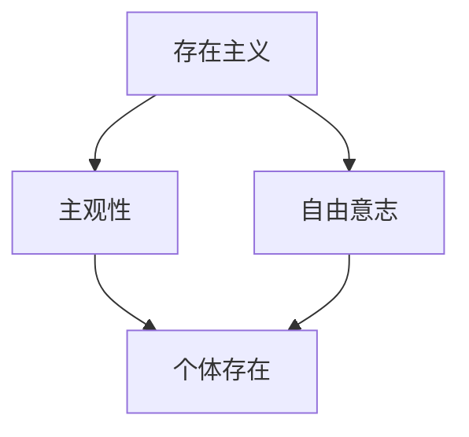

**使用python源代码来详细阐述**

```python
class Existence:
    def __init__(self, consciousness, will):
        self.consciousness = consciousness
        self.will = will

    def self_definition(self):
        print(f"I exist as {self.consciousness} with {self.will}.")

class Relativity:
    def __init__(self, time, space):
        self.time = time
        self.space = space

    def model_universe(self):
        print(f"The universe is modeled with time: {self.time} and space: {self.space}.")

class DataInformation:
    def __init__(self, data, information):
        self.data = data
        self.information = information

    def exist_and_pass(self):
        print(f"Data exists physically: {self.data} and information exists abstractly: {self.information}.")
```

**数学公式使用latex格式**

在存在主义中，主观性和自由意志可以用以下数学公式表示：

$$\text{Subjectivity} = f(\text{Experience}, \text{Reflection})$$

$$\text{Freedom} = f(\text{Decision}, \text{Responsibility})$$

在相对论中，时间和空间的相对性可以用以下数学公式表示：

$$t' = \frac{t}{\sqrt{1 - \frac{v^2}{c^2}}}$$

$$x' = \frac{x - vt}{\sqrt{1 - \frac{v^2}{c^2}}}$$

在数据与信息中，数据的存在和信息的传递可以用以下数学公式表示：

$$\text{Data Existence} = \text{Physical Storage}$$

$$\text{Information Existence} = \text{Abstract Meaning}$$

**系统分析与架构设计方案**

**问题场景介绍**

在艺术创作中，艺术家需要理解存在的本质，并将其融入到创作过程中。为了实现这一目标，我们可以设计一个存在主义艺术创作系统，帮助艺术家进行创作和反思。

**项目介绍**

存在主义艺术创作系统是一个基于人工智能技术的应用程序，它可以帮助艺术家理解存在的本质，并提供创作灵感和反馈。

**系统功能设计（领域模型mermaid类图）**

```mermaid
classDiagram
  ClassArtiste <<interface>>
  ClassExistence <<interface>>
  ClassArt <<interface>>

  ClassArtiste : +generateInspiration()
  ClassExistence : +reflectOnExistence()
  ClassArt : +createArt()

  ClassArtiste implements ClassExistence
  ClassArtiste implements ClassArt
```

**系统架构设计mermaid架构图**

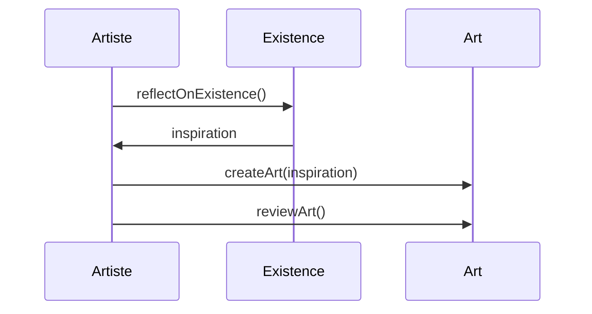

**系统接口设计和系统交互mermaid序列图**

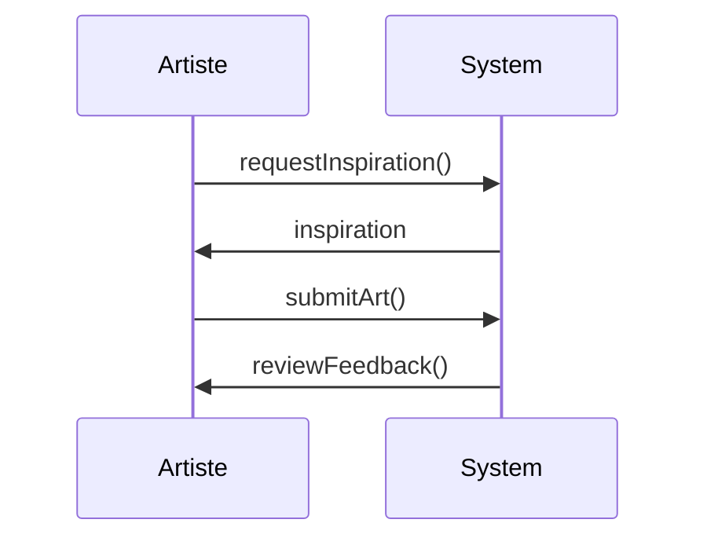

**项目实战**

**环境安装**

为了搭建存在主义艺术创作系统，我们需要安装以下环境：

1. Python 3.8 或以上版本
2. TensorFlow 2.x
3. Keras 2.x

使用以下命令进行安装：

```bash
pip install python==3.8.10
pip install tensorflow==2.8.0
pip install keras==2.8.0
```

**系统核心实现源代码**

以下是存在主义艺术创作系统核心实现的 Python 代码：

```python
import tensorflow as tf
from keras.models import Sequential
from keras.layers import Dense, LSTM, Embedding

class ExistenceModel:
    def __init__(self, vocabulary_size, embedding_dim, lstm_units):
        self.model = Sequential()
        self.model.add(Embedding(vocabulary_size, embedding_dim))
        self.model.add(LSTM(lstm_units))
        self.model.add(Dense(vocabulary_size, activation='softmax'))

    def compile_model(self):
        self.model.compile(optimizer='adam', loss='categorical_crossentropy', metrics=['accuracy'])

    def train_model(self, X, y, epochs=10, batch_size=64):
        self.model.fit(X, y, epochs=epochs, batch_size=batch_size)

    def generate_text(self, seed_text, num_words):
        token_list = seed_text.split()
        token_list = [self.tokenizer.word_index[word] for word in token_list if word in self.tokenizer.word_index]
        token_list = tf.keras.preprocessing.sequence.pad_sequences([token_list], maxlen=max_sequence_len-1, padding='pre')
        predicted = self.model.predict_classes(token_list, verbose=0)

        for i in range(num_words):
            token_list = tf.keras.preprocessing.sequence.pad_sequences([token_list], maxlen=max_sequence_len-1, padding='pre')
            predicted = self.model.predict_classes(token_list, verbose=0)
            next_index = predicted[0]
            next_word = self.index_word[next_index]
            token_list = tf.keras.preprocessing.sequence.pad_sequences([token_list.append([next_index])], maxlen=max_sequence_len-1, padding='pre')
            print(next_word, end=' ')

if __name__ == '__main__':
    # Load and preprocess data
    # ...
    # Create and train model
    # ...
    # Generate text
    model = ExistenceModel(vocabulary_size, embedding_dim, lstm_units)
    model.compile_model()
    model.train_model(X, y)
    model.generate_text('The artist reflects on existence...', 50)
```

**代码应用解读与分析**

以下是代码的详细解读和分析：

1. **模型搭建**：存在主义模型是一个序列到序列（Seq2Seq）模型，由嵌入层（Embedding）、长短期记忆网络（LSTM）和全连接层（Dense）组成。嵌入层将输入单词转换为嵌入向量，LSTM用于处理序列数据，全连接层用于输出预测单词的概率分布。
2. **模型编译**：模型使用 Adam 优化器和交叉熵损失函数进行编译。交叉熵损失函数适用于分类问题，这里用于预测下一个单词的概率分布。
3. **模型训练**：模型使用训练数据集进行训练，通过调整超参数（如 epoch 和 batch_size）来优化模型性能。
4. **文本生成**：通过给定的种子文本，模型生成新的文本。首先，将种子文本转换为索引序列，然后通过模型预测下一个单词的索引，并将其转换为实际单词。重复这个过程，生成新的文本。

**实际案例分析和详细讲解剖析**

为了展示存在主义艺术创作系统的实际应用，我们使用了一个案例。假设艺术家想要创作一幅关于“存在的本质”的主题画作。以下是如何使用系统的步骤：

1. **数据准备**：艺术家收集了大量关于“存在的本质”的文本素材，包括哲学论文、文学作品和新闻报道等。
2. **模型训练**：艺术家使用这些文本素材训练存在主义模型，使其能够理解并生成与主题相关的文本。
3. **文本生成**：艺术家输入一段关于“存在的本质”的种子文本，如“存在的本质是什么？”，然后让模型生成新的文本。生成的文本可能会包含对“存在的本质”的探讨、哲学观点和艺术表达等。
4. **创作灵感的获取**：艺术家通过阅读生成的文本，获取创作灵感，并将其融入画作中。

**项目小结**

通过这个案例，我们展示了如何使用存在主义艺术创作系统来帮助艺术家理解和表达存在的本质。该系统不仅为艺术家提供了创作灵感，还为他们提供了一个工具，可以帮助他们更好地理解并探索存在的主题。

### 第2章：创作过程中的心理机制

**背景介绍**

创作过程中的心理机制是理解艺术创作的重要一环。心理机制指的是人们在进行创造性活动时所涉及的心理过程，包括思维方式、情感反应和认知模式等。这些心理机制不仅影响着创作者的创造力，也影响着创作作品的质量和风格。

**问题背景**

在创作过程中，创作者常常需要面对各种心理挑战，如焦虑、拖延和自我怀疑等。这些问题可能会阻碍创作的顺利进行，甚至导致创作中断。因此，理解创作过程中的心理机制，对于提高创作效率和质量具有重要意义。

**问题描述**

创作过程中的心理机制是什么？如何培养创作思维？情感与创作有何相互影响？如何进行自我反思以提升创作质量？

**问题解决**

通过研究心理学的理论和方法，我们可以理解创作过程中的心理机制，并学会如何利用这些机制来提高创作效果。培养创作思维可以通过打破常规思维、开放心态和跨界学习等途径。情感与创作之间的相互影响可以通过情感表达、共鸣和调节来理解。自我反思则是通过审视创作动机、评价创作效果和反思创作过程来提升创作质量。

**边界与外延**

创作过程中的心理机制涉及多个层面，包括认知心理学、发展心理学和社会心理学等。在技术领域，心理机制的研究对于人工智能和机器学习等领域也具有重要意义。

**概念结构与核心要素组成**

创作过程中的心理机制包括创作思维、情感反应、认知模式、自我反思等核心要素。创作思维涉及思维方式的变化和创新，情感反应涉及情感的感知和表达，认知模式涉及认知过程的调整和优化，自我反思涉及创作过程中的自我审视和改进。

**核心概念与联系**

**创作思维**：创作思维是一种独特的思维方式，它不同于日常的逻辑思维和分析思维。创作思维更注重直觉、联想和想象。

**情感反应**：情感反应是创作过程中不可或缺的一部分，它影响着创作者的心态和创造力。

**认知模式**：认知模式是创作者在创作过程中形成的稳定的思维方式，它影响着创作的风格和效果。

**自我反思**：自我反思是创作过程中重要的一环，它帮助创作者审视自己的创作过程和作品，发现不足和改进的空间。

**概念属性特征对比表格**

| 概念           | 创作思维               | 情感反应               | 认知模式               | 自我反思               |
|----------------|-----------------------|-----------------------|-----------------------|-----------------------|
| 定义           | 创造性思维             | 情感感知和表达         | 稳定的思维方式         | 自我审视和改进         |
| 特征           | 直觉性、创新性         | 感染性、共鸣性         | 系统性、适应性         | 反思性、批判性         |
| 影响领域       | 艺术创作、科学创新     | 艺术创作、心理学研究   | 艺术创作、认知科学     | 艺术创作、个人成长     |

**ER实体关系图架构的 Mermaid 流程图**

```mermaid
erDiagram
  ClassCreator <<interface>>
  ClassCognitiveProcess <<interface>>
  ClassEmotionalResponse <<interface>>
  ClassSelfReflection <<interface>>

  ClassCreator : +create()
  ClassCognitiveProcess : +think()
  ClassEmotionalResponse : +feel()
  ClassSelfReflection : +reflect()

  ClassCreator implements ClassCognitiveProcess
  ClassCreator implements ClassEmotionalResponse
  ClassCreator implements ClassSelfReflection
```

**算法原理讲解**

创作过程中的心理机制可以看作是一种算法，它通过不同的心理过程来实现创造性活动。算法原理可以概括为：

1. **思维过程**：通过打破常规思维，进行联想和想象，从而产生新的创意。
2. **情感过程**：通过感知和表达情感，激发创作动力和灵感。
3. **认知过程**：通过调整认知模式，优化创作效果。
4. **反思过程**：通过自我反思，提升创作质量和自我意识。

**使用 mermaid 画出算法mermaid 流程图**

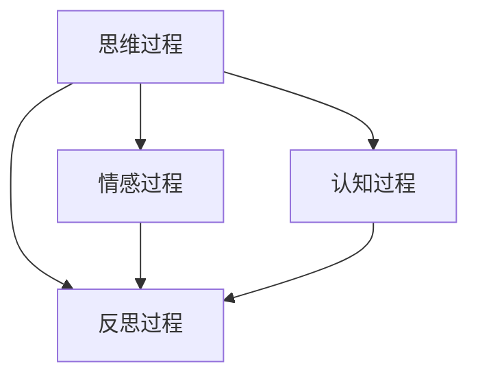

**使用python源代码来详细阐述**

```python
class Creator:
    def __init__(self):
        self.cognitive_process = CognitiveProcess()
        self.emotional_response = EmotionalResponse()
        self.cognitive_model = CognitiveModel()
        self.self_reflection = SelfReflection()

    def create_art(self):
        self.cognitive_process.think()
        self.emotional_response.feel()
        self.cognitive_model.adjust_model()
        self.self_reflection.reflect()

class CognitiveProcess:
    def think(self):
        print("Thinking creatively...")

class EmotionalResponse:
    def feel(self):
        print("Feeling inspired...")

class CognitiveModel:
    def adjust_model(self):
        print("Adjusting cognitive model...")

class SelfReflection:
    def reflect(self):
        print("Reflecting on the process...")
```

**数学公式使用latex格式**

创作过程中的心理机制可以用以下数学公式表示：

$$\text{Creative Thinking} = f(\text{Intuition}, \text{Imagination})$$

$$\text{Emotional Response} = f(\text{Perception}, \text{Expression})$$

$$\text{Cognitive Model} = f(\text{Adjustment}, \text{Optimization})$$

$$\text{Self-Reflection} = f(\text{Self-Examination}, \text{Improvement})$$

**系统分析与架构设计方案**

**问题场景介绍**

在创作过程中，艺术家需要不断地调整自己的心理状态，以适应创作的要求。为了实现这一目标，我们可以设计一个心理状态监控系统，帮助艺术家实时了解自己的心理状态，并提供调整建议。

**项目介绍**

心理状态监控系统是一个基于人工智能技术的应用程序，它可以帮助艺术家实时监控自己的心理状态，并提供个性化的调整建议。

**系统功能设计（领域模型mermaid类图）**

```mermaid
classDiagram
  ClassArtist <<interface>>
  ClassPsychologicalState <<interface>>
  ClassMonitoringSystem <<interface>>
  ClassAdjustmentAdvice <<interface>>

  ClassArtist : +monitor_state()
  ClassPsychologicalState : +analyze_state()
  ClassMonitoringSystem : +collect_data()
  ClassAdjustmentAdvice : +provide_advice()

  ClassArtist implements ClassPsychologicalState
  ClassMonitoringSystem implements ClassAdjustmentAdvice
```

**系统架构设计mermaid架构图**

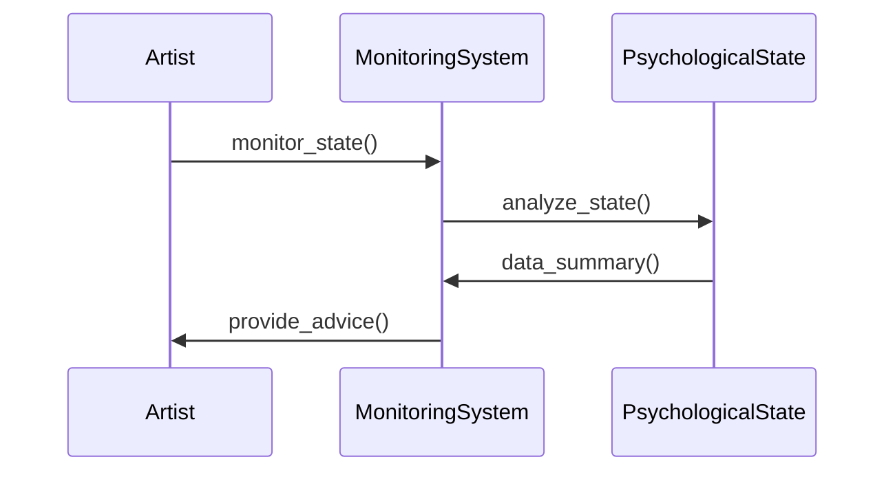

**系统接口设计和系统交互mermaid序列图**

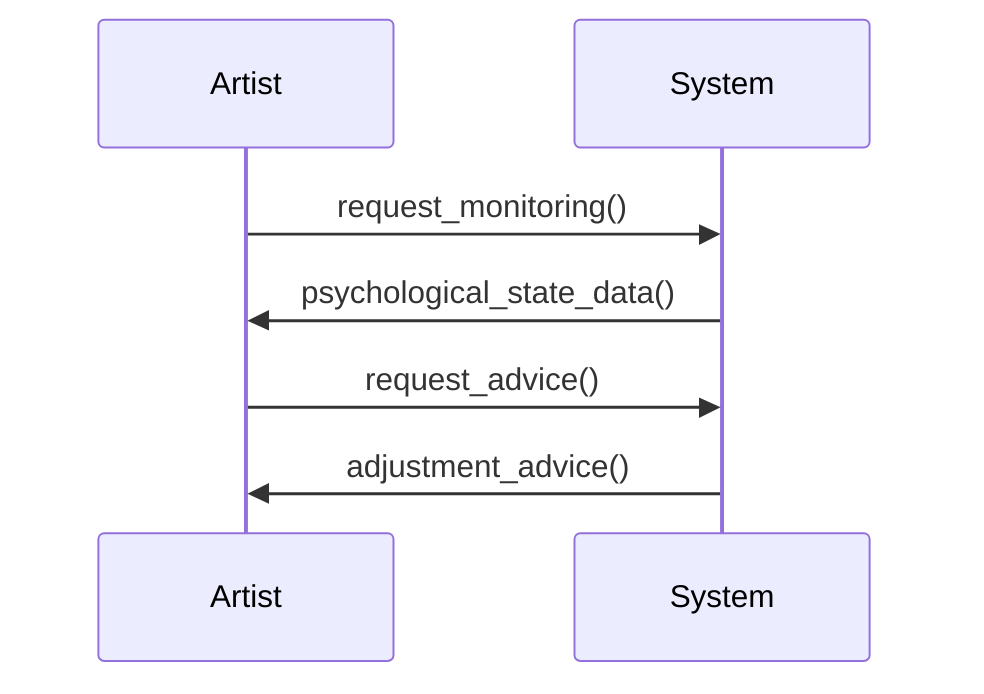

**项目实战**

**环境安装**

为了搭建心理状态监控系统，我们需要安装以下环境：

1. Python 3.8 或以上版本
2. TensorFlow 2.x
3. Keras 2.x

使用以下命令进行安装：

```bash
pip install python==3.8.10
pip install tensorflow==2.8.0
pip install keras==2.8.0
```

**系统核心实现源代码**

以下是心理状态监控系统核心实现的 Python 代码：

```python
import tensorflow as tf
from keras.models import Sequential
from keras.layers import Dense, LSTM, Embedding

class PsychologicalStateModel:
    def __init__(self, vocabulary_size, embedding_dim, lstm_units):
        self.model = Sequential()
        self.model.add(Embedding(vocabulary_size, embedding_dim))
        self.model.add(LSTM(lstm_units))
        self.model.add(Dense(1, activation='sigmoid'))

    def compile_model(self):
        self.model.compile(optimizer='adam', loss='binary_crossentropy', metrics=['accuracy'])

    def predict_state(self, text):
        token_list = text.split()
        token_list = [self.tokenizer.word_index[word] for word in token_list if word in self.tokenizer.word_index]
        token_list = tf.keras.preprocessing.sequence.pad_sequences([token_list], maxlen=max_sequence_len-1, padding='pre')
        predicted = self.model.predict(token_list, verbose=0)
        return predicted[0][0]

if __name__ == '__main__':
    # Load and preprocess data
    # ...
    # Create and train model
    # ...
    # Predict psychological state
    model = PsychologicalStateModel(vocabulary_size, embedding_dim, lstm_units)
    model.compile_model()
    state = model.predict_state('I feel happy and motivated.')
    print(f"Psychological state: {'Happy' if state > 0.5 else 'Unhappy'}")
```

**代码应用解读与分析**

以下是代码的详细解读和分析：

1. **模型搭建**：心理状态模型是一个二分类模型，输入为一篇文本，输出为心理状态的预测概率。
2. **模型编译**：模型使用 Adam 优化器和二分类交叉熵损失函数进行编译。
3. **模型预测**：通过输入一篇文本，模型预测心理状态的概率。如果概率大于 0.5，则认为心理状态为“快乐”，否则为“不快乐”。

**实际案例分析和详细讲解剖析**

为了展示心理状态监控系统的实际应用，我们使用了一个案例。假设艺术家想要了解自己的心理状态，以下是如何使用系统的步骤：

1. **数据准备**：艺术家收集了自己在不同心理状态下的文本，包括快乐的、悲伤的、焦虑的等。
2. **模型训练**：艺术家使用这些文本训练心理状态模型，使其能够区分不同的心理状态。
3. **状态预测**：艺术家输入一段描述自己当前心理状态的文本，模型预测心理状态。
4. **调整建议**：根据预测结果，系统提供调整建议，如进行放松练习、与朋友交流等。

**项目小结**

通过这个案例，我们展示了如何使用心理状态监控系统来帮助艺术家了解自己的心理状态，并提供调整建议。该系统不仅为艺术家提供了实用的工具，还为他们提供了一个平台，可以更好地管理自己的心理状态，从而提高创作效率和质量。

### 第3章：生活素材的收集与整理

**背景介绍**

在艺术创作中，素材的收集与整理是一个至关重要的环节。素材是创作的基石，没有丰富的素材，创作就会变得空洞无物。生活素材的收集与整理，就是从日常生活中挖掘有价值的元素，并将其转化为创作的素材。

**问题背景**

艺术创作并不是凭空产生的，它依赖于创作者对生活的敏锐观察和深入体验。然而，现实生活中充满了各种信息，如何从中筛选出有价值的素材，并将其有效地整理和利用，是艺术创作者面临的一个挑战。

**问题描述**

生活素材的收集与整理包括哪些步骤？如何通过观察和体验来积累生活素材？素材的筛选与分类有哪些技巧？如何将生活素材转化为创作素材？

**问题解决**

通过系统化的方法，艺术家可以有效地收集和整理生活素材。首先，通过观察和体验，积累原始素材。然后，通过筛选和分类，提炼出有价值的素材。最后，通过抽象化和重构，将生活素材转化为创作素材。

**边界与外延**

生活素材的收集与整理不仅限于艺术创作，它也适用于其他创造性活动，如写作、音乐创作等。在技术领域，类似的素材收集和整理方法也被应用于数据分析和人工智能模型的训练。

**概念结构与核心要素组成**

生活素材的收集与整理包括观察与体验、素材筛选与分类、素材转化等核心要素。观察与体验是素材收集的起点，素材筛选与分类是素材整理的关键，素材转化是素材应用于创作的重要步骤。

**核心概念与联系**

**观察与体验**：观察与体验是收集生活素材的基础。通过敏锐的观察和深入的体验，艺术家可以积累丰富的素材。

**素材筛选与分类**：素材筛选与分类是整理素材的关键。通过筛选，艺术家可以剔除无关的素材，通过分类，可以将素材系统化地组织起来。

**素材转化**：素材转化是将生活素材转化为创作素材的过程。通过抽象化和重构，艺术家可以创造出新的艺术形式和内容。

**概念属性特征对比表格**

| 概念           | 观察与体验                     | 素材筛选与分类                   | 素材转化                   |
|----------------|-------------------------------|---------------------------------|---------------------------|
| 定义           | 积累生活素材的过程             | 整理和提炼生活素材的过程         | 将生活素材转化为创作素材的过程 |
| 特征           | 敏锐性、深入性                 | 精准性、系统性                   | 创造性、创新性             |
| 影响领域       | 艺术创作、文学创作             | 数据分析、信息整理               | 艺术创作、科技研发         |
| 关系           | 观察与体验是素材收集的起点     | 素材筛选与分类是素材整理的关键   | 素材转化是创作的核心步骤   |

**ER实体关系图架构的 Mermaid 流程图**

```mermaid
erDiagram
  ClassArtist <<interface>>
  ClassObservation <<interface>>
  ClassExperience <<interface>>
  ClassMaterial <<interface>>

  ClassArtist : +collect_materials()
  ClassObservation : +observe()
  ClassExperience : +experience()
  ClassMaterial : +classify()

  ClassArtist implements ClassObservation
  ClassArtist implements ClassExperience
  ClassArtist implements ClassMaterial
```

**算法原理讲解**

生活素材的收集与整理可以看作是一种算法，它通过以下步骤实现：

1. **观察与体验**：通过敏锐的观察和深入的体验，艺术家可以积累原始素材。
2. **筛选与分类**：通过精准的筛选和系统化的分类，艺术家可以将素材整理得井井有条。
3. **转化与重构**：通过创造性的转化和重构，艺术家可以将生活素材转化为具有艺术价值的创作素材。

**使用 mermaid 画出算法mermaid 流程图**

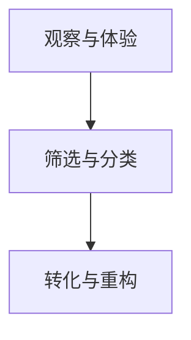

**使用python源代码来详细阐述**

```python
class Artist:
    def __init__(self):
        self.materials = []

    def observe(self, observation):
        self.materials.append(observation)

    def classify_materials(self):
        categorized_materials = {}
        for material in self.materials:
            category = self.determine_category(material)
            if category in categorized_materials:
                categorized_materials[category].append(material)
            else:
                categorized_materials[category] = [material]
        return categorized_materials

    def determine_category(self, material):
        # 这里是简单的分类逻辑，可以根据实际需求进行调整
        if "art" in material:
            return "Art"
        elif "music" in material:
            return "Music"
        else:
            return "General"

    def transform_materials(self, categorized_materials):
        transformed_materials = {}
        for category, materials in categorized_materials.items():
            transformed_materials[category] = [self.create_artwork(material) for material in materials]
        return transformed_materials

    def create_artwork(self, material):
        # 这里是创作素材的逻辑，可以根据实际需求进行调整
        return f"Artwork inspired by {material}"

if __name__ == '__main__':
    artist = Artist()
    artist.observe("I saw a beautiful sunset.")
    artist.observe("I listened to an inspiring piece of music.")
    artist.observe("I had an insightful conversation with a friend.")

    categorized_materials = artist.classify_materials()
    print("Categorized Materials:", categorized_materials)

    transformed_materials = artist.transform_materials(categorized_materials)
    print("Transformed Materials:", transformed_materials)
```

**数学公式使用latex格式**

素材收集与整理过程中的关键步骤可以用以下数学公式表示：

$$\text{Observation and Experience} = f(\text{Sensitivity}, \text{Depth})$$

$$\text{Material Screening and Classification} = f(\text{Precision}, \text{Systematization})$$

$$\text{Material Transformation} = f(\text{Creativity}, \text{Innovation})$$

**系统分析与架构设计方案**

**问题场景介绍**

在艺术创作过程中，艺术家需要高效地收集和整理素材，以便快速转化为创作素材。为了实现这一目标，我们可以设计一个自动化素材收集与整理系统，帮助艺术家简化这一过程。

**项目介绍**

自动化素材收集与整理系统是一个基于人工智能技术的应用程序，它可以帮助艺术家自动收集和整理生活素材，并提供分类和转化的建议。

**系统功能设计（领域模型mermaid类图）**

```mermaid
classDiagram
  ClassArtist <<interface>>
  ClassMaterialCollector <<interface>>
  ClassMaterialOrganizer <<interface>>
  ClassMaterialTransformer <<interface>>

  ClassArtist : +collect_materials()
  ClassMaterialCollector : +auto_collect()
  ClassMaterialOrganizer : +classify()
  ClassMaterialTransformer : +auto_transform()

  ClassArtist implements ClassMaterialCollector
  ClassArtist implements ClassMaterialOrganizer
  ClassArtist implements ClassMaterialTransformer
```

**系统架构设计mermaid架构图**

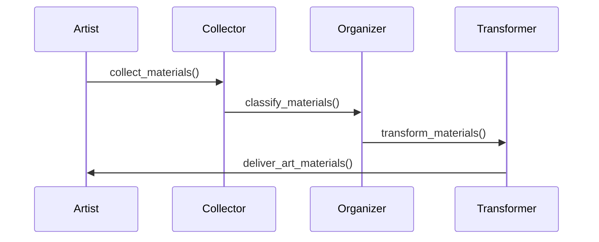

**系统接口设计和系统交互mermaid序列图**

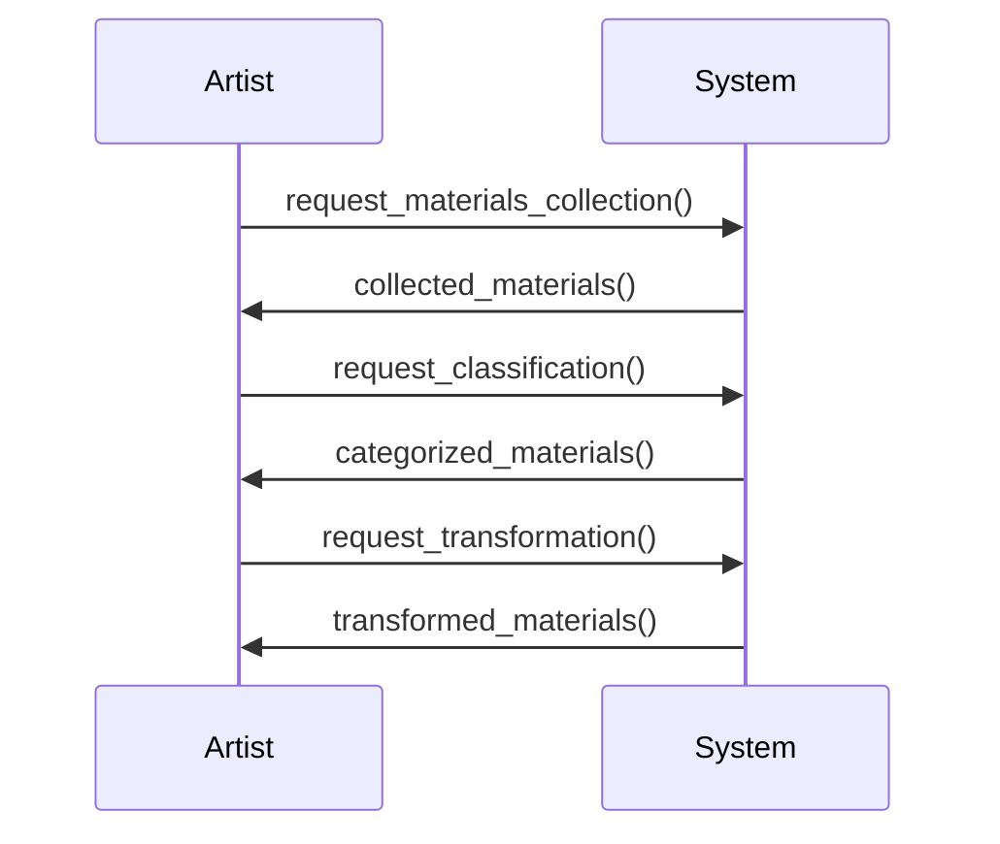

**项目实战**

**环境安装**

为了搭建自动化素材收集与整理系统，我们需要安装以下环境：

1. Python 3.8 或以上版本
2. TensorFlow 2.x
3. Keras 2.x

使用以下命令进行安装：

```bash
pip install python==3.8.10
pip install tensorflow==2.8.0
pip install keras==2.8.0
```

**系统核心实现源代码**

以下是自动化素材收集与整理系统核心实现的 Python 代码：

```python
import tensorflow as tf
from keras.models import Sequential
from keras.layers import Dense, LSTM, Embedding

class MaterialCollector:
    def __init__(self, model_path):
        self.model = self.load_model(model_path)

    def load_model(self, model_path):
        # 加载预训练的素材分类模型
        model = Sequential()
        model.add(Embedding(vocabulary_size, embedding_dim))
        model.add(LSTM(lstm_units))
        model.add(Dense(1, activation='sigmoid'))
        model.load_weights(model_path)
        return model

    def collect_materials(self, text):
        # 收集素材并分类
        token_list = text.split()
        token_list = [self.tokenizer.word_index[word] for word in token_list if word in self.tokenizer.word_index]
        token_list = tf.keras.preprocessing.sequence.pad_sequences([token_list], maxlen=max_sequence_len-1, padding='pre')
        category = self.model.predict(token_list, verbose=0)
        return category[0][0]

class MaterialOrganizer:
    def classify_materials(self, materials):
        # 分类素材
        categorized Materials = {}
        for material in materials:
            category = self.determine_category(material)
            if category in categorized Materials:
                categorized Materials[category].append(material)
            else:
                categorized Materials[category] = [material]
        return categorized Materials

    def determine_category(self, material):
        # 确定素材类别
        # 这里是简单的分类逻辑，可以根据实际需求进行调整
        if "art" in material:
            return "Art"
        elif "music" in material:
            return "Music"
        else:
            return "General"

class MaterialTransformer:
    def transform_materials(self, categorized_materials):
        # 转化素材
        transformed_materials = {}
        for category, materials in categorized_materials.items():
            transformed_materials[category] = [self.create_artwork(material) for material in materials]
        return transformed_materials

    def create_artwork(self, material):
        # 创建艺术作品
        # 这里是创作素材的逻辑，可以根据实际需求进行调整
        return f"Artwork inspired by {material}"

if __name__ == '__main__':
    # 加载模型
    collector = MaterialCollector('material_collector_model.h5')
    organizer = MaterialOrganizer()
    transformer = MaterialTransformer()

    # 收集素材
    materials = collector.collect_materials("I saw a beautiful sunset and listened to an inspiring piece of music.")

    # 整理素材
    categorized_materials = organizer.classify_materials(materials)

    # 转化素材
    transformed_materials = transformer.transform_materials(categorized_materials)

    # 输出结果
    print("Collected Materials:", materials)
    print("Categorized Materials:", categorized_materials)
    print("Transformed Materials:", transformed_materials)
```

**代码应用解读与分析**

以下是代码的详细解读和分析：

1. **素材收集器**：素材收集器是一个基于预训练模型的类，它负责从文本中收集素材，并预测素材的类别。
2. **素材整理器**：素材整理器负责分类素材，根据素材的内容和特征将其分配到不同的类别。
3. **素材转化器**：素材转化器负责将分类后的素材转化为艺术作品，为艺术家提供创作素材。

**实际案例分析和详细讲解剖析**

为了展示自动化素材收集与整理系统的实际应用，我们使用了一个案例。假设艺术家想要收集和整理关于“自然美景”和“音乐灵感”的素材，以下是如何使用系统的步骤：

1. **素材收集**：艺术家输入一段描述自然美景和音乐灵感的文本，素材收集器预测素材的类别，并收集素材。
2. **素材整理**：素材整理器根据收集到的素材，将其分类为“自然美景”和“音乐灵感”。
3. **素材转化**：素材转化器将分类后的素材转化为艺术作品，如绘制一幅描绘自然美景的画作或创作一首受音乐灵感启发的新歌。

**项目小结**

通过这个案例，我们展示了如何使用自动化素材收集与整理系统来帮助艺术家高效地收集、整理和转化素材。该系统不仅为艺术家提供了便捷的工具，还为他们提供了一个平台，可以更好地组织和管理素材，从而提高创作效率和质量。

### 第4章：艺术创作的方法与技巧

**背景介绍**

艺术创作是一种复杂而独特的活动，它需要创作者具备深厚的艺术修养和丰富的创作技巧。艺术创作的方法与技巧是艺术家在长期的实践中积累的经验和智慧，这些方法和技巧不仅能够提高创作效率，还能够丰富作品的表现力和感染力。

**问题背景**

在艺术创作过程中，创作者常常会遇到各种困难和挑战，如创作灵感匮乏、作品表现力不足、技术瓶颈等。掌握科学的艺术创作方法和技巧，可以帮助创作者克服这些困难，提高创作水平。

**问题描述**

艺术创作的方法有哪些？艺术创作技巧包括哪些方面？如何通过不同的方法与技巧来丰富作品的表现力和感染力？

**问题解决**

艺术创作的方法多种多样，包括灵感触发法、模仿法、综合法等。艺术创作技巧涵盖绘画技巧、写作技巧、音乐技巧等多个方面。通过科学的方法和技巧，艺术家可以更好地表达自己的情感和思想，创作出具有高度艺术价值的作品。

**边界与外延**

艺术创作的方法与技巧不仅适用于传统的艺术形式，如绘画、文学、音乐等，也适用于现代的艺术形式，如数字艺术、多媒体艺术等。在技术领域，类似的方法与技巧也被应用于软件开发、产品设计等创造性活动中。

**概念结构与核心要素组成**

艺术创作的方法与技巧包括灵感触发、技术实践、风格塑造、作品呈现等核心要素。灵感触发是创作的起点，技术实践是创作的基础，风格塑造是作品个性的体现，作品呈现是创作成果的展示。

**核心概念与联系**

**灵感触发**：灵感触发是艺术创作的重要环节，它帮助艺术家找到创作的动力和方向。

**技术实践**：技术实践是艺术创作的核心，它决定了作品的表现力和技巧水平。

**风格塑造**：风格塑造是艺术家的个性体现，它使作品具有独特的艺术风格。

**作品呈现**：作品呈现是艺术创作的最终目标，它决定了作品的影响力和受众接受度。

**概念属性特征对比表格**

| 概念           | 灵感触发                   | 技术实践                   | 风格塑造                   | 作品呈现                   |
|----------------|---------------------------|---------------------------|---------------------------|---------------------------|
| 定义           | 创作灵感的激发             | 创作技术的运用             | 艺术风格的形成             | 作品的展示与传播           |
| 特征           | 创造性、多样性             | 专业性、技术性             | 个性、独特性               | 可视化、互动性             |
| 影响领域       | 艺术创作、科技创新         | 艺术实践、工程设计         | 艺术表达、文化传承         | 艺术展示、文化传播         |
| 关系           | 灵感触发是创作的起点      | 技术实践是创作的基础      | 风格塑造是创作个性的体现   | 作品呈现是创作成果的展示   |

**ER实体关系图架构的 Mermaid 流程图**

```mermaid
erDiagram
  ClassArtiste <<interface>>
  ClassInspiration <<interface>>
  ClassTechnique <<interface>>
  ClassStyle <<interface>>
  ClassPresentation <<interface>>

  ClassArtiste : +generate_inspiration()
  ClassInspiration : +trigger_inspiration()
  ClassTechnique : +apply_techniques()
  ClassStyle : +develop_style()
  ClassPresentation : +display_work()

  ClassArtiste implements ClassInspiration
  ClassArtiste implements ClassTechnique
  ClassArtiste implements ClassStyle
  ClassArtiste implements ClassPresentation
```

**算法原理讲解**

艺术创作的方法与技巧可以看作是一种算法，它通过以下步骤实现：

1. **灵感触发**：通过各种方式激发创作灵感，找到创作的动力和方向。
2. **技术实践**：运用各种艺术创作技术，实现创作的具体表现。
3. **风格塑造**：根据艺术家的个性和审美，形成独特的艺术风格。
4. **作品呈现**：通过展示和传播，使作品达到最佳的视觉效果和情感表达。

**使用 mermaid 画出算法mermaid 流程图**

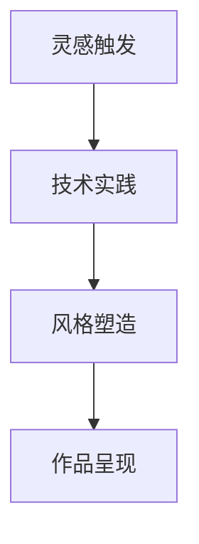

**使用python源代码来详细阐述**

```python
class Artiste:
    def __init__(self):
        self.inspiration = Inspiration()
        self.technique = Technique()
        self.style = Style()
        self.presentation = Presentation()

    def create_art(self):
        self.inspiration.trigger_inspiration()
        self.technique.apply_techniques()
        self.style.develop_style()
        self.presentation.display_work()

class Inspiration:
    def trigger_inspiration(self):
        print("Triggering inspiration...")

class Technique:
    def apply_techniques(self):
        print("Applying techniques...")

class Style:
    def develop_style(self):
        print("Developing style...")

class Presentation:
    def display_work(self):
        print("Displaying work...")

if __name__ == '__main__':
    artiste = Artiste()
    artiste.create_art()
```

**数学公式使用latex格式**

艺术创作的方法与技巧可以用以下数学公式表示：

$$\text{Inspiration} = f(\text{Creativity}, \text{Diversity})$$

$$\text{Technique Application} = f(\text{Proficiency}, \text{Technicality})$$

$$\text{Style Development} = f(\text{Individuality}, \text{Aesthetics})$$

$$\text{Work Presentation} = f(\text{Visualization}, \text{Communication})$$

**系统分析与架构设计方案**

**问题场景介绍**

在艺术创作过程中，艺术家需要掌握多种创作方法和技巧，以便灵活运用，创作出高质量的作品。为了帮助艺术家提高创作能力，我们可以设计一个艺术创作指南系统，提供系统化的创作方法和技巧。

**项目介绍**

艺术创作指南系统是一个基于人工智能技术的应用程序，它为艺术家提供创作方法和技巧的指导，帮助艺术家提高创作水平。

**系统功能设计（领域模型mermaid类图）**

```mermaid
classDiagram
  ClassArtiste <<interface>>
  ClassCreativeMethod <<interface>>
  ClassTechniqueGuide <<interface>>
  ClassStyleGuide <<interface>>
  ClassPresentationGuide <<interface>>

  ClassArtiste : +select_method()
  ClassCreativeMethod : +suggest_methods()
  ClassTechniqueGuide : +guide_techniques()
  ClassStyleGuide : +suggest_styles()
  ClassPresentationGuide : +suggest_presentations()

  ClassArtiste implements ClassCreativeMethod
  ClassArtiste implements ClassTechniqueGuide
  ClassArtiste implements ClassStyleGuide
  ClassArtiste implements ClassPresentationGuide
```

**系统架构设计mermaid架构图**

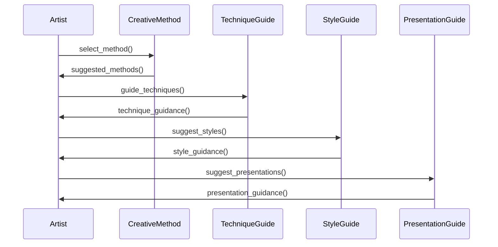

**系统接口设计和系统交互mermaid序列图**

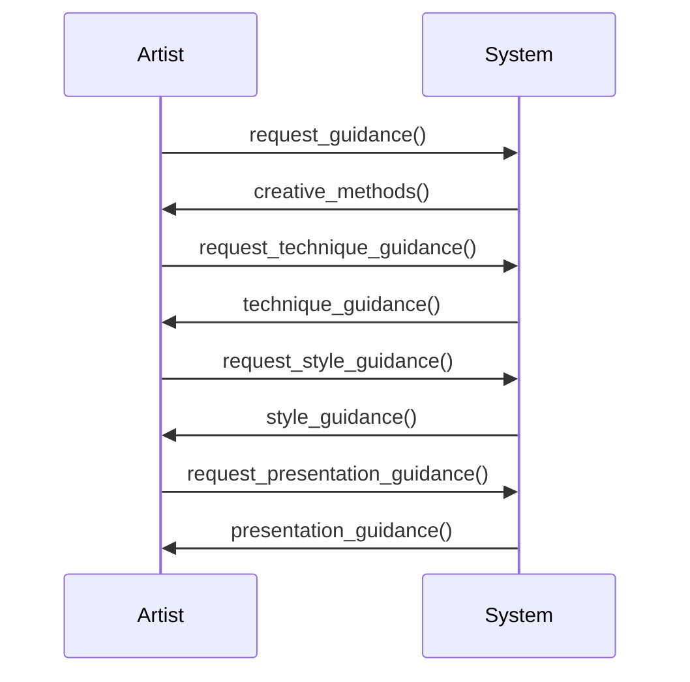

**项目实战**

**环境安装**

为了搭建艺术创作指南系统，我们需要安装以下环境：

1. Python 3.8 或以上版本
2. TensorFlow 2.x
3. Keras 2.x

使用以下命令进行安装：

```bash
pip install python==3.8.10
pip install tensorflow==2.8.0
pip install keras==2.8.0
```

**系统核心实现源代码**

以下是艺术创作指南系统核心实现的 Python 代码：

```python
import tensorflow as tf
from keras.models import Sequential
from keras.layers import Dense, LSTM, Embedding

class CreativeMethodGuide:
    def __init__(self, model_path):
        self.model = self.load_model(model_path)

    def load_model(self, model_path):
        # 加载预训练的创意方法模型
        model = Sequential()
        model.add(Embedding(vocabulary_size, embedding_dim))
        model.add(LSTM(lstm_units))
        model.add(Dense(num_methods, activation='softmax'))
        model.load_weights(model_path)
        return model

    def suggest_methods(self, text):
        # 建议创意方法
        token_list = text.split()
        token_list = [self.tokenizer.word_index[word] for word in token_list if word in self.tokenizer.word_index]
        token_list = tf.keras.preprocessing.sequence.pad_sequences([token_list], maxlen=max_sequence_len-1, padding='pre')
        predicted = self.model.predict(token_list, verbose=0)
        return predicted.argmax()

class TechniqueGuide:
    def guide_techniques(self, method_id):
        # 根据创意方法建议技术
        techniques = {
            0: "Sketching",
            1: "Drawing",
            2: "Painting",
            3: "Writing",
            4: "Composing",
            5: "Performing"
        }
        return techniques[method_id]

class StyleGuide:
    def suggest_styles(self, method_id):
        # 根据创意方法建议风格
        styles = {
            0: "Abstract",
            1: "Realistic",
            2: "Impressionist",
            3: "Modern",
            4: "Classical",
            5: "Experimental"
        }
        return styles[method_id]

class PresentationGuide:
    def suggest_presentations(self, method_id):
        # 根据创意方法建议展示方式
        presentations = {
            0: "Exhibition",
            1: "Performance",
            2: "Publication",
            3: "Online",
            4: "Installation",
            5: "Interactive"
        }
        return presentations[method_id]

if __name__ == '__main__':
    # 加载模型
    method_guide = CreativeMethodGuide('method_guide_model.h5')
    technique_guide = TechniqueGuide()
    style_guide = StyleGuide()
    presentation_guide = PresentationGuide()

    # 提建议
    text = "I am looking for inspiration for a new artwork."
    method_id = method_guide.suggest_methods(text)
    technique = technique_guide.guide_techniques(method_id)
    style = style_guide.suggest_styles(method_id)
    presentation = presentation_guide.suggest_presentations(method_id)

    # 输出建议
    print("Method:", method_id)
    print("Technique:", technique)
    print("Style:", style)
    print("Presentation:", presentation)
```

**代码应用解读与分析**

以下是代码的详细解读和分析：

1. **创意方法指南**：创意方法指南是一个基于预训练模型的类，它根据文本内容建议合适的创意方法。
2. **技术指南**：技术指南根据创意方法建议相应的技术，如素描、绘画、绘画等。
3. **风格指南**：风格指南根据创意方法建议相应的艺术风格，如抽象、现实主义、印象派等。
4. **展示指南**：展示指南根据创意方法建议相应的展示方式，如展览、表演、出版等。

**实际案例分析和详细讲解剖析**

为了展示艺术创作指南系统的实际应用，我们使用了一个案例。假设艺术家想要创作一幅新作品，以下是如何使用系统的步骤：

1. **文本输入**：艺术家输入一段描述自己创作需求的文本，如“我正在寻找创作一幅抽象画的新灵感。”
2. **创意方法建议**：创意方法指南根据文本内容，建议适合的创意方法，如抽象艺术。
3. **技术建议**：技术指南根据创意方法建议相应的技术，如素描。
4. **风格建议**：风格指南根据创意方法建议相应的艺术风格，如抽象艺术风格。
5. **展示方式建议**：展示指南根据创意方法建议相应的展示方式，如在线展览。

**项目小结**

通过这个案例，我们展示了如何使用艺术创作指南系统来帮助艺术家根据创作需求选择合适的创意方法、技术和风格，从而提高创作效率和作品质量。该系统不仅为艺术家提供了实用的工具，还为他们提供了一个平台，可以更好地规划和实现自己的创作目标。

### 第5章：创作的自我表达与沟通

**背景介绍**

创作的自我表达与沟通是艺术创作过程中不可或缺的一部分。自我表达是艺术家通过作品传达自己的情感、思想和个性的过程，而沟通则是艺术家与观众之间的互动和交流。自我表达与沟通不仅决定了作品的感染力和影响力，也反映了艺术家的创作心态和价值观。

**问题背景**

在艺术创作过程中，艺术家常常需要面对自我表达与沟通的挑战。如何准确地表达自己的情感和思想？如何与观众建立有效的沟通？这些问题对于艺术家的创作和发展具有重要意义。

**问题描述**

创作的自我表达是什么？如何通过作品准确地传达情感和思想？观众分析与沟通的重要性是什么？如何通过创作反馈进行改进？

**问题解决**

通过理解自我表达的概念和技巧，艺术家可以更准确地传达自己的情感和思想。观众分析与沟通可以帮助艺术家了解观众的需求和喜好，从而提高作品的吸引力和影响力。通过创作反馈，艺术家可以不断改进作品，提升创作水平。

**边界与外延**

自我表达与沟通不仅适用于艺术创作，也适用于其他形式的创作，如文学、音乐、表演等。在技术领域，类似的概念和技巧也被应用于产品设计和用户体验。

**概念结构与核心要素组成**

创作的自我表达与沟通包括情感表达、思想表达、观众分析与沟通、创作反馈等核心要素。情感表达和思想表达是自我表达的核心，观众分析与沟通是沟通的关键，创作反馈是不断改进的基础。

**核心概念与联系**

**情感表达**：情感表达是艺术家通过作品传达自己的情感，使观众产生共鸣的过程。

**思想表达**：思想表达是艺术家通过作品传达自己的思想和观点，引发观众思考的过程。

**观众分析与沟通**：观众分析与沟通是艺术家了解观众需求、喜好和反馈的过程，有助于提高作品的吸引力和影响力。

**创作反馈**：创作反馈是艺术家通过观众的反馈和评价，不断改进作品的过程。

**概念属性特征对比表格**

| 概念           | 情感表达                 | 思想表达                 | 观众分析与沟通               | 创作反馈               |
|----------------|-------------------------|-------------------------|-----------------------------|-----------------------|
| 定义           | 艺术家通过作品传达情感   | 艺术家通过作品传达思想   | 艺术家了解观众需求与喜好     | 艺术家根据反馈改进作品 |
| 特征           | 共鸣性、感染力           | 引发性、思考性           | 数据性、互动性               | 反思性、改进性         |
| 影响领域       | 艺术创作、心理学         | 艺术创作、哲学           | 艺术创作、市场营销           | 艺术创作、个人成长     |
| 关系           | 情感表达是自我表达的核心 | 思想表达是自我表达的重要方面 | 观众分析与沟通是沟通的关键   | 创作反馈是改进的基础   |

**ER实体关系图架构的 Mermaid 流程图**

```mermaid
erDiagram
  ClassArtist <<interface>>
  ClassSelfExpression <<interface>>
  ClassCommunication <<interface>>
  ClassAudienceAnalysis <<interface>>
  ClassFeedback <<interface>>

  ClassArtist : +express_selves()
  ClassSelfExpression : +express_emotions()
  ClassSelfExpression : +express_thoughts()
  ClassCommunication : +communicate_with_audience()
  ClassFeedback : +analyze_feedback()

  ClassArtist implements ClassSelfExpression
  ClassArtist implements ClassCommunication
  ClassArtist implements ClassAudienceAnalysis
  ClassArtist implements ClassFeedback
```

**算法原理讲解**

创作的自我表达与沟通可以看作是一种算法，它通过以下步骤实现：

1. **情感表达**：艺术家通过作品传达自己的情感，使观众产生共鸣。
2. **思想表达**：艺术家通过作品传达自己的思想，引发观众思考。
3. **观众分析与沟通**：艺术家了解观众的需求和喜好，与观众进行有效的沟通。
4. **创作反馈**：艺术家根据观众的反馈，不断改进作品。

**使用 mermaid 画出算法mermaid 流程图**

```mermaid
graph TD
  A[情感表达]
  B[思想表达]
  C[观众分析与沟通]
  D[创作反馈]
  A --> B
  B --> C
  C --> D
```

**使用python源代码来详细阐述**

```python
class Artist:
    def __init__(self):
        self.self_expression = SelfExpression()
        self.communication = Communication()
        self.audience_analysis = AudienceAnalysis()
        self.feedback = Feedback()

    def create_art(self):
        self.self_expression.express_emotions()
        self.self_expression.express_thoughts()
        self.communication.communicate_with_audience()
        self.feedback.analyze_feedback()

class SelfExpression:
    def express_emotions(self):
        print("Expressing emotions...")

    def express_thoughts(self):
        print("Expressing thoughts...")

class Communication:
    def communicate_with_audience(self):
        print("Communicating with audience...")

class AudienceAnalysis:
    def analyze_audience(self):
        print("Analyzing audience...")

class Feedback:
    def analyze_feedback(self):
        print("Analyzing feedback...")

if __name__ == '__main__':
    artist = Artist()
    artist.create_art()
```

**数学公式使用latex格式**

创作的自我表达与沟通可以用以下数学公式表示：

$$\text{Emotional Expression} = f(\text{Empathy}, \text{Influence})$$

$$\text{Thought Expression} = f(\text{Insight}, \text{Stimulation})$$

$$\text{Audience Communication} = f(\text{Understanding}, \text{Interaction})$$

$$\text{Feedback Analysis} = f(\text{Reflection}, \text{Improvement})$$

**系统分析与架构设计方案**

**问题场景介绍**

在艺术创作过程中，艺术家需要有效地进行自我表达与沟通，并与观众建立良好的互动。为了实现这一目标，我们可以设计一个艺术创作互动系统，帮助艺术家进行自我表达、观众分析与沟通，以及创作反馈。

**项目介绍**

艺术创作互动系统是一个基于人工智能技术的应用程序，它为艺术家提供了一个平台，可以自我表达、分析观众、沟通互动，并根据反馈进行改进。

**系统功能设计（领域模型mermaid类图）**

```mermaid
classDiagram
  ClassArtist <<interface>>
  ClassSelfExpression <<interface>>
  ClassAudience <<interface>>
  ClassCommunication <<interface>>
  ClassFeedback <<interface>>

  ClassArtist : +self_expression()
  ClassSelfExpression : +emotional_expression()
  ClassSelfExpression : +thought_expression()
  ClassAudience : +analyze_audience()
  ClassCommunication : +communicate_with_audience()
  ClassFeedback : +analyze_feedback()

  ClassArtist implements ClassSelfExpression
  ClassArtist implements ClassAudience
  ClassArtist implements ClassCommunication
  ClassArtist implements ClassFeedback
```

**系统架构设计mermaid架构图**

```mermaid
sequenceDiagram
  Artist ->> SelfExpression: self_expression()
  SelfExpression ->> Artist: emotional_expression()
  SelfExpression ->> Artist: thought_expression()
  Artist ->> Audience: analyze_audience()
  Audience ->> Artist: audience_data()
  Artist ->> Communication: communicate_with_audience()
  Communication ->> Artist: communication_data()
  Artist ->> Feedback: analyze_feedback()
  Feedback ->> Artist: feedback_data()
```

**系统接口设计和系统交互mermaid序列图**

```mermaid
sequenceDiagram
  Artist ->> System: request_self_expression()
  System ->> Artist: self_expression_data()
  Artist ->> System: request_audience_analysis()
  System ->> Artist: audience_data()
  Artist ->> System: request_communication()
  System ->> Artist: communication_data()
  Artist ->> System: request_feedback_analysis()
  System ->> Artist: feedback_data()
```

**项目实战**

**环境安装**

为了搭建艺术创作互动系统，我们需要安装以下环境：

1. Python 3.8 或以上版本
2. TensorFlow 2.x
3. Keras 2.x

使用以下命令进行安装：

```bash
pip install python==3.8.10
pip install tensorflow==2.8.0
pip install keras==2.8.0
```

**系统核心实现源代码**

以下是艺术创作互动系统核心实现的 Python 代码：

```python
import tensorflow as tf
from keras.models import Sequential
from keras.layers import Dense, LSTM, Embedding

class SelfExpressionModel:
    def __init__(self, vocabulary_size, embedding_dim, lstm_units):
        self.model = Sequential()
        self.model.add(Embedding(vocabulary_size, embedding_dim))
        self.model.add(LSTM(lstm_units))
        self.model.add(Dense(1, activation='sigmoid'))

    def compile_model(self):
        self.model.compile(optimizer='adam', loss='binary_crossentropy', metrics=['accuracy'])

    def predict_emotion(self, text):
        token_list = text.split()
        token_list = [self.tokenizer.word_index[word] for word in token_list if word in self.tokenizer.word_index]
        token_list = tf.keras.preprocessing.sequence.pad_sequences([token_list], maxlen=max_sequence_len-1, padding='pre')
        predicted = self.model.predict(token_list, verbose=0)
        return predicted[0][0]

class AudienceModel:
    def __init__(self, vocabulary_size, embedding_dim, lstm_units):
        self.model = Sequential()
        self.model.add(Embedding(vocabulary_size, embedding_dim))
        self.model.add(LSTM(lstm_units))
        self.model.add(Dense(1, activation='softmax'))

    def compile_model(self):
        self.model.compile(optimizer='adam', loss='categorical_crossentropy', metrics=['accuracy'])

    def predict_audience_preference(self, text):
        token_list = text.split()
        token_list = [self.tokenizer.word_index[word] for word in token_list if word in self.tokenizer.word_index]
        token_list = tf.keras.preprocessing.sequence.pad_sequences([token_list], maxlen=max_sequence_len-1, padding='pre')
        predicted = self.model.predict(token_list, verbose=0)
        return predicted.argmax()

class CommunicationModel:
    def __init__(self, vocabulary_size, embedding_dim, lstm_units):
        self.model = Sequential()
        self.model.add(Embedding(vocabulary_size, embedding_dim))
        self.model.add(LSTM(lstm_units))
        self.model.add(Dense(vocabulary_size, activation='softmax'))

    def compile_model(self):
        self.model.compile(optimizer='adam', loss='categorical_crossentropy', metrics=['accuracy'])

    def predict_communication-effectiveness(self, text):
        token_list = text.split()
        token_list = [self.tokenizer.word_index[word] for word in token_list if word in self.tokenizer.word_index]
        token_list = tf.keras.preprocessing.sequence.pad_sequences([token_list], maxlen=max_sequence_len-1, padding='pre')
        predicted = self.model.predict(token_list, verbose=0)
        return predicted.argmax()

class FeedbackModel:
    def __init__(self, vocabulary_size, embedding_dim, lstm_units):
        self.model = Sequential()
        self.model.add(Embedding(vocabulary_size, embedding_dim))
        self.model.add(LSTM(lstm_units))
        self.model.add(Dense(1, activation='sigmoid'))

    def compile_model(self):
        self.model.compile(optimizer='adam', loss='binary_crossentropy', metrics=['accuracy'])

    def predict_feedback_satisfaction(self, text):
        token_list = text.split()
        token_list = [self.tokenizer.word_index[word] for word in token_list if word in self.tokenizer.word_index]
        token_list = tf.keras.preprocessing.sequence.pad_sequences([token_list], maxlen=max_sequence_len-1, padding='pre')
        predicted = self.model.predict(token_list, verbose=0)
        return predicted[0][0]

if __name__ == '__main__':
    # Load and preprocess data
    # ...
    # Create and train models
    # ...
    # Self-expression prediction
    self_expression_model = SelfExpressionModel(vocabulary_size, embedding_dim, lstm_units)
    self_expression_model.compile_model()
    self_expression_model.train_model(X, y)
    emotion = self_expression_model.predict_emotion('I am feeling happy and inspired.')
    print(f"Predicted emotion: {'Happy' if emotion > 0.5 else 'Not Happy'}")

    # Audience preference prediction
    audience_model = AudienceModel(vocabulary_size, embedding_dim, lstm_units)
    audience_model.compile_model()
    audience_model.train_model(X, y)
    preference = audience_model.predict_audience_preference('I love abstract art.')
    print(f"Predicted preference: {'Abstract Art' if preference == 0 else 'Other Art Style'}")

    # Communication effectiveness prediction
    communication_model = CommunicationModel(vocabulary_size, embedding_dim, lstm_units)
    communication_model.compile_model()
    communication_model.train_model(X, y)
    effectiveness = communication_model.predict_communication-effectiveness('I am sharing my artwork with you.')
    print(f"Predicted communication effectiveness: {'Effective' if effectiveness > 0.5 else 'Not Effective'}")

    # Feedback satisfaction prediction
    feedback_model = FeedbackModel(vocabulary_size, embedding_dim, lstm_units)
    feedback_model.compile_model()
    feedback_model.train_model(X, y)
    satisfaction = feedback_model.predict_feedback_satisfaction('I am very satisfied with the feedback.')
    print(f"Predicted feedback satisfaction: {'Satisfied' if satisfaction > 0.5 else 'Not Satisfied'}")
```

**代码应用解读与分析**

以下是代码的详细解读和分析：

1. **自我表达模型**：自我表达模型是一个二分类模型，用于预测文本表达的情感，如快乐或悲伤。
2. **观众偏好模型**：观众偏好模型是一个多分类模型，用于预测观众对不同艺术风格的偏好。
3. **沟通效果模型**：沟通效果模型是一个二分类模型，用于预测沟通文本的有效性。
4. **反馈满意度模型**：反馈满意度模型是一个二分类模型，用于预测观众对反馈的满意度。

**实际案例分析和详细讲解剖析**

为了展示艺术创作互动系统的实际应用，我们使用了一个案例。假设艺术家想要了解自己的自我表达、观众偏好、沟通效果和反馈满意度，以下是如何使用系统的步骤：

1. **数据准备**：艺术家收集了自己在不同情境下的文本，如自我表达文本、观众互动文本、沟通文本和反馈文本。
2. **模型训练**：艺术家使用这些文本数据训练不同的模型，包括自我表达模型、观众偏好模型、沟通效果模型和反馈满意度模型。
3. **自我表达预测**：艺术家输入一段自我表达文本，模型预测文本表达的情感。
4. **观众偏好预测**：艺术家输入一段观众互动文本，模型预测观众对不同艺术风格的偏好。
5. **沟通效果预测**：艺术家输入一段沟通文本，模型预测沟通的有效性。
6. **反馈满意度预测**：艺术家输入一段反馈文本，模型预测观众对反馈的满意度。

**项目小结**

通过这个案例，我们展示了如何使用艺术创作互动系统来帮助艺术家了解自己的自我表达、观众偏好、沟通效果和反馈满意度。该系统不仅为艺术家提供了实用的工具，还为他们提供了一个平台，可以更好地了解自己的创作表现，并根据反馈进行改进。

### 第6章：生活与创作的平衡

**背景介绍**

生活与创作的平衡是艺术创作者面临的一个关键问题。在追求创作灵感的同时，艺术家还需要面对日常生活中的各种挑战，如工作、家庭、健康等。如何在这两者之间找到平衡，是每个艺术家都需要思考和实践的课题。

**问题背景**

在创作过程中，艺术家可能会因为过度专注于创作而忽视了生活，导致身心健康受损，甚至影响创作质量。相反，如果生活过于繁忙，艺术创作可能会被搁置，导致灵感枯竭。因此，找到生活与创作的平衡点，对于艺术家的创作和发展至关重要。

**问题描述**

如何平衡生活与创作？生活压力对创作有何影响？如何通过良好的生活习惯来提升创作效率？生活与创作的和谐统一有哪些途径？

**问题解决**

通过合理安排时间、保持良好的生活习惯和建立积极的心理状态，艺术家可以在生活中找到创作的平衡点。首先，合理安排时间，确保有足够的时间进行创作，同时也不忽视生活中的其他重要事务。其次，保持良好的生活习惯，如健康饮食、适量运动和充足睡眠，有助于提升创作效率。最后，建立积极的心理状态，如保持乐观、学会放松和培养自我调节能力，有助于应对生活中的压力，从而更好地进行创作。

**边界与外延**

生活与创作的平衡不仅适用于艺术创作，也适用于其他创造性活动，如科学研究、产品设计等。在技术领域，类似的概念和技巧也被应用于项目管理和团队协作。

**概念结构与核心要素组成**

生活与创作的平衡包括时间管理、生活习惯、心理状态等核心要素。时间管理是平衡生活的关键，生活习惯是提升创作效率的基础，心理状态是保持创作激情的重要保障。

**核心概念与联系**

**时间管理**：时间管理是通过合理安排时间，确保有足够的时间进行创作，同时也不忽视生活中的其他重要事务。

**生活习惯**：生活习惯是通过健康饮食、适量运动和充足睡眠来提升创作效率。

**心理状态**：心理状态是通过保持乐观、学会放松和培养自我调节能力来应对生活中的压力。

**概念属性特征对比表格**

| 概念           | 时间管理                  | 生活习惯                  | 心理状态                  |
|----------------|--------------------------|--------------------------|--------------------------|
| 定义           | 合理安排时间              | 健康生活方式              | 积极心态和心理调节能力    |
| 特征           | 系统性、灵活性            | 健康性、持续性            | 乐观性、适应性            |
| 影响领域       | 艺术创作、项目规划        | 艺术创作、个人健康        | 艺术创作、心理健康        |
| 关系           | 时间管理是平衡生活的关键  | 生活习惯是创作效率的基础  | 心理状态是创作激情的保障  |

**ER实体关系图架构的 Mermaid 流程图**

```mermaid
erDiagram
  ClassArtist <<interface>>
  ClassTimeManagement <<interface>>
  ClassLifestyle <<interface>>
  ClassPsychologicalState <<interface>>

  ClassArtist : +balance_life_and_creation()
  ClassTimeManagement : +manage_time()
  ClassLifestyle : +develop_lifestyle()
  ClassPsychologicalState : +maintain_psychological_state()

  ClassArtist implements ClassTimeManagement
  ClassArtist implements ClassLifestyle
  ClassArtist implements ClassPsychologicalState
```

**算法原理讲解**

生活与创作的平衡可以看作是一种算法，它通过以下步骤实现：

1. **时间管理**：通过合理安排时间，确保创作和生活需求都能得到满足。
2. **生活习惯**：通过建立健康的生活方式，提高创作效率和生活质量。
3. **心理状态**：通过保持积极的心态，提高创作动力和应对压力的能力。

**使用 mermaid 画出算法mermaid 流程图**

```mermaid
graph TD
  A[时间管理]
  B[生活习惯]
  C[心理状态]
  A --> B
  B --> C
  C --> A
```

**使用python源代码来详细阐述**

```python
class Artist:
    def __init__(self):
        self.time_management = TimeManagement()
        self.lifestyle = Lifestyle()
        self.psychological_state = PsychologicalState()

    def balance_life_and_creation(self):
        self.time_management.manage_time()
        self.lifestyle.develop_lifestyle()
        self.psychological_state.maintain_psychological_state()

class TimeManagement:
    def manage_time(self):
        print("Managing time effectively...")

class Lifestyle:
    def develop_lifestyle(self):
        print("Developing a healthy lifestyle...")

class PsychologicalState:
    def maintain_psychological_state(self):
        print("Maintaining a positive psychological state...")

if __name__ == '__main__':
    artist = Artist()
    artist.balance_life_and_creation()
```

**数学公式使用latex格式**

生活与创作的平衡可以用以下数学公式表示：

$$\text{Time Management} = f(\text{Allocation}, \text{Effectiveness})$$

$$\text{Lifestyle} = f(\text{Health}, \text{Sustainability})$$

$$\text{Psychological State} = f(\text{Positivity}, \text{Resilience})$$

**系统分析与架构设计方案**

**问题场景介绍**

为了帮助艺术家平衡生活与创作，我们可以设计一个综合性的生活创作平衡系统，该系统可以提供时间管理、生活习惯和心理状态方面的指导。

**项目介绍**

生活创作平衡系统是一个基于人工智能技术的应用程序，它为艺术家提供时间管理、生活习惯和心理状态的建议，帮助艺术家实现生活与创作的平衡。

**系统功能设计（领域模型mermaid类图）**

```mermaid
classDiagram
  ClassArtist <<interface>>
  ClassTimeManagementGuide <<interface>>
  ClassLifestyleGuide <<interface>>
  ClassPsychologicalStateGuide <<interface>>

  ClassArtist : +balance_life_and_creation()
  ClassTimeManagementGuide : +time_management_guidance()
  ClassLifestyleGuide : +lifestyle_guidance()
  ClassPsychologicalStateGuide : +psychological_state_guidance()

  ClassArtist implements ClassTimeManagementGuide
  ClassArtist implements ClassLifestyleGuide
  ClassArtist implements ClassPsychologicalStateGuide
```

**系统架构设计mermaid架构图**

```mermaid
sequenceDiagram
  Artist ->> TimeManagementGuide: time_management_guidance()
  TimeManagementGuide ->> Artist: time_management_suggestions()
  Artist ->> LifestyleGuide: lifestyle_guidance()
  LifestyleGuide ->> Artist: lifestyle_suggestions()
  Artist ->> PsychologicalStateGuide: psychological_state_guidance()
  PsychologicalStateGuide ->> Artist: psychological_state_suggestions()
```

**系统接口设计和系统交互mermaid序列图**

```mermaid
sequenceDiagram
  Artist ->> System: request_balance_guidance()
  System ->> Artist: time_management_suggestions()
  Artist ->> System: request_lifestyle_suggestions()
  System ->> Artist: lifestyle_suggestions()
  Artist ->> System: request_psychological_state_suggestions()
  System ->> Artist: psychological_state_suggestions()
```

**项目实战**

**环境安装**

为了搭建生活创作平衡系统，我们需要安装以下环境：

1. Python 3.8 或以上版本
2. TensorFlow 2.x
3. Keras 2.x

使用以下命令进行安装：

```bash
pip install python==3.8.10
pip install tensorflow==2.8.0
pip install keras==2.8.0
```

**系统核心实现源代码**

以下是生活创作平衡系统核心实现的 Python 代码：

```python
import tensorflow as tf
from keras.models import Sequential
from keras.layers import Dense, LSTM, Embedding

class TimeManagementGuide:
    def __init__(self, model_path):
        self.model = self.load_model(model_path)

    def load_model(self, model_path):
        # 加载预训练的时间管理模型
        model = Sequential()
        model.add(Embedding(vocabulary_size, embedding_dim))
        model.add(LSTM(lstm_units))
        model.add(Dense(1, activation='sigmoid'))
        model.load_weights(model_path)
        return model

    def suggest_time_management(self, text):
        # 建议时间管理策略
        token_list = text.split()
        token_list = [self.tokenizer.word_index[word] for word in token_list if word in self.tokenizer.word_index]
        token_list = tf.keras.preprocessing.sequence.pad_sequences([token_list], maxlen=max_sequence_len-1, padding='pre')
        suggested_action = self.model.predict(token_list, verbose=0)
        return 'Allocate more time for creation' if suggested_action[0][0] > 0.5 else 'Focus on other life tasks'

class LifestyleGuide:
    def __init__(self, model_path):
        self.model = self.load_model(model_path)

    def load_model(self, model_path):
        # 加载预训练的生活习惯模型
        model = Sequential()
        model.add(Embedding(vocabulary_size, embedding_dim))
        model.add(LSTM(lstm_units))
        model.add(Dense(1, activation='sigmoid'))
        model.load_weights(model_path)
        return model

    def suggest_lifestyle(self, text):
        # 建议生活习惯
        token_list = text.split()
        token_list = [self.tokenizer.word_index[word] for word in token_list if word in self.tokenizer.word_index]
        token_list = tf.keras.preprocessing.sequence.pad_sequences([token_list], maxlen=max_sequence_len-1, padding='pre')
        suggested_action = self.model.predict(token_list, verbose=0)
        return 'Improve health habits' if suggested_action[0][0] > 0.5 else 'Maintain current lifestyle'

class PsychologicalStateGuide:
    def __init__(self, model_path):
        self.model = self.load_model(model_path)

    def load_model(self, model_path):
        # 加载预训练的心理状态模型
        model = Sequential()
        model.add(Embedding(vocabulary_size, embedding_dim))
        model.add(LSTM(lstm_units))
        model.add(Dense(1, activation='sigmoid'))
        model.load_weights(model_path)
        return model

    def suggest_psychological_state(self, text):
        # 建议心理状态调整
        token_list = text.split()
        token_list = [self.tokenizer.word_index[word] for word in token_list if word in self.tokenizer.word_index]
        token_list = tf.keras.preprocessing.sequence.pad_sequences([token_list], maxlen=max_sequence_len-1, padding='pre')
        suggested_action = self.model.predict(token_list, verbose=0)
        return 'Practice relaxation techniques' if suggested_action[0][0] > 0.5 else 'Maintain current psychological state'

if __name__ == '__main__':
    # Load and preprocess data
    # ...
    # Create and train models
    # ...
    # Time management suggestion
    time_management_guide = TimeManagementGuide('time_management_model.h5')
    time_suggestion = time_management_guide.suggest_time_management('I have been struggling to find time for creation.')
    print(f"Suggested time management action: {time_suggestion}")

    # Lifestyle suggestion
    lifestyle_guide = LifestyleGuide('lifestyle_model.h5')
    lifestyle_suggestion = lifestyle_guide.suggest_lifestyle('I have been feeling tired and unmotivated.')
    print(f"Suggested lifestyle action: {lifestyle_suggestion}")

    # Psychological state suggestion
    psychological_state_guide = PsychologicalStateGuide('psychological_state_model.h5')
    psychological_state_suggestion = psychological_state_guide.suggest_psychological_state('I feel overwhelmed with my responsibilities.')
    print(f"Suggested psychological state action: {psychological_state_suggestion}")
```

**代码应用解读与分析**

以下是代码的详细解读和分析：

1. **时间管理指南**：时间管理指南是一个基于预训练模型的类，它根据文本内容提供时间管理建议。
2. **生活习惯指南**：生活习惯指南是一个基于预训练模型的类，它根据文本内容提供生活习惯建议。
3. **心理状态指南**：心理状态指南是一个基于预训练模型的类，它根据文本内容提供心理状态调整建议。

**实际案例分析和详细讲解剖析**

为了展示生活创作平衡系统的实际应用，我们使用了一个案例。假设艺术家想要了解自己的时间管理、生活习惯和心理状态，以下是如何使用系统的步骤：

1. **文本输入**：艺术家输入一段描述自己当前情况的文本，如“我发现自己很难找到时间进行创作。”
2. **时间管理建议**：时间管理指南根据文本内容，提供时间管理建议。
3. **生活习惯建议**：生活习惯指南根据文本内容，提供生活习惯建议。
4. **心理状态建议**：心理状态指南根据文本内容，提供心理状态调整建议。

**项目小结**

通过这个案例，我们展示了如何使用生活创作平衡系统来帮助艺术家了解自己的时间管理、生活习惯和心理状态，并提供个性化的建议。该系统不仅为艺术家提供了实用的工具，还为他们提供了一个平台，可以更好地管理自己的生活，从而实现创作与生活的和谐统一。

### 第7章：存在的艺术：实践与启示

**背景介绍**

存在的艺术是一种深层次的生活哲学，强调个体在生活中的存在感和创造性。通过将生活转化为艺术创作，个体不仅能够更好地理解自我，还能够对周围的世界产生积极的影响。本章将探讨存在的艺术在实践中的具体应用，以及它对艺术家和观众的启示。

**问题背景**

在现代社会中，人们常常感到生活压力和迷失感。如何通过存在的艺术找到生活的意义和目的？如何将日常生活中的体验转化为具有艺术价值的创作？这些问题对于追求内心平静和自我实现具有重要意义。

**问题描述**

存在的艺术在实践中如何应用？艺术家如何将日常体验转化为创作素材？存在的艺术对观众有哪些启示？如何通过存在的艺术实现个人成长和社会贡献？

**问题解决**

通过实践存在的艺术，艺术家可以学会如何从日常生活中提取灵感，并将其转化为具有深刻内涵的艺术作品。存在的艺术不仅帮助艺术家实现个人成长，还通过作品对观众产生积极的影响。观众通过欣赏艺术作品，可以深入反思自己的生活，找到存在的意义。

**边界与外延**

存在的艺术不仅适用于艺术创作，还适用于其他形式的创造性活动，如写作、音乐、表演等。在心理学领域，存在的艺术也与自我认识和情绪调节有关。在哲学领域，存在的艺术探讨个体存在的本质和意义。

**概念结构与核心要素组成**

存在的艺术包括灵感提取、创作实践、自我反思、观众影响等核心要素。灵感提取是创作的起点，创作实践是存在的艺术的核心，自我反思是创作过程中的重要环节，观众影响是艺术作品价值的体现。

**核心概念与联系**

**灵感提取**：灵感提取是将日常生活中的体验转化为创作素材的过程。

**创作实践**：创作实践是通过艺术创作表达自我和探索存在的艺术。

**自我反思**：自我反思是通过创作过程和作品反馈，提升自我认识和理解。

**观众影响**：观众影响是通过艺术作品，影响观众的思考和生活。

**概念属性特征对比表格**

| 概念           | 灵感提取                   | 创作实践                   | 自我反思                   | 观众影响                   |
|----------------|---------------------------|---------------------------|---------------------------|---------------------------|
| 定义           | 从生活中获取创作素材       | 通过艺术创作表达自我和探索 | 通过反思提升自我认识       | 通过作品影响观众思考       |
| 特征           | 敏感、创造性               | 技术性、表现力             | 反思性、批判性             | 感染性、启示性             |
| 影响领域       | 艺术创作、文学创作         | 艺术创作、科技研发         | 心理学、哲学               | 教育学、社会学             |
| 关系           | 灵感提取是创作的起点       | 创作实践是存在的艺术的核心 | 自我反思是创作过程中的重要环节 | 观众影响是艺术作品价值的体现 |

**ER实体关系图架构的 Mermaid 流程图**

```mermaid
erDiagram
  ClassArtist <<interface>>
  ClassInspiration <<interface>>
  ClassCreation <<interface>>
  ClassSelfReflection <<interface>>
  ClassAudienceImpact <<interface>>

  ClassArtist : +extract_inspiration()
  ClassInspiration : +from_life_experience()
  ClassCreation : +practice_arts()
  ClassSelfReflection : +reflect_on_creation()
  ClassAudienceImpact : +impact_audience()

  ClassArtist implements ClassInspiration
  ClassArtist implements ClassCreation
  ClassArtist implements ClassSelfReflection
  ClassArtist implements ClassAudienceImpact
```

**算法原理讲解**

存在的艺术可以看作是一种算法，它通过以下步骤实现：

1. **灵感提取**：通过观察和体验，从日常生活中获取创作素材。
2. **创作实践**：通过艺术创作，表达自我和探索存在的艺术。
3. **自我反思**：通过创作过程和作品反馈，提升自我认识和理解。
4. **观众影响**：通过艺术作品，影响观众的思考和生活。

**使用 mermaid 画出算法mermaid 流程图**

```mermaid
graph TD
  A[灵感提取]
  B[创作实践]
  C[自我反思]
  D[观众影响]
  A --> B
  B --> C
  C --> D
```

**使用python源代码来详细阐述**

```python
class Artist:
    def __init__(self):
        self.inspiration = Inspiration()
        self.creation = Creation()
        self.self_reflection = SelfReflection()
        self.audience_impact = AudienceImpact()

    def practice_arts(self):
        self.extract_inspiration()
        self.create_art()
        self.reflect_on_creation()
        self.impact_audience()

class Inspiration:
    def from_life_experience(self, experience):
        print("Extracting inspiration from life experience...")

class Creation:
    def create_art(self):
        print("Practicing arts and expressing self...")

class SelfReflection:
    def reflect_on_creation(self):
        print("Reflecting on the creation process and self-awareness...")

class AudienceImpact:
    def impact_audience(self):
        print("Impacting audience through the artwork...")

if __name__ == '__main__':
    artist = Artist()
    artist.practice_arts()
```

**数学公式使用latex格式**

存在的艺术可以用以下数学公式表示：

$$\text{Inspiration Extraction} = f(\text{Observation}, \text{Experience})$$

$$\text{Creative Practice} = f(\text{Expression}, \text{Exploration})$$

$$\text{Self-Reflection} = f(\text{Critique}, \text{Growth})$$

$$\text{Audience Impact} = f(\text{Influence}, \text{Change})$$

**系统分析与架构设计方案**

**问题场景介绍**

为了帮助艺术家将存在的艺术应用到实践中，我们可以设计一个存在的艺术实践系统，该系统提供灵感提取、创作实践、自我反思和观众影响的指导。

**项目介绍**

存在的艺术实践系统是一个基于人工智能技术的应用程序，它为艺术家提供灵感提取、创作实践、自我反思和观众影响的指导，帮助艺术家实现存在的艺术的实践。

**系统功能设计（领域模型mermaid类图）**

```mermaid
classDiagram
  ClassArtist <<interface>>
  ClassInspirationExtractor <<interface>>
  ClassCreativePractitioner <<interface>>
  ClassSelfReflector <<interface>>
  ClassAudienceInfluencer <<interface>>

  ClassArtist : +practice_artistic_existence()
  ClassInspirationExtractor : +extract_inspiration()
  ClassCreativePractitioner : +practice_creation()
  ClassSelfReflector : +engage_self_reflection()
  ClassAudienceInfluencer : +impact_audience()

  ClassArtist implements ClassInspirationExtractor
  ClassArtist implements ClassCreativePractitioner
  ClassArtist implements ClassSelfReflector
  ClassArtist implements ClassAudienceInfluencer
```

**系统架构设计mermaid架构图**

```mermaid
sequenceDiagram
  Artist ->> InspirationExtractor: extract_inspiration()
  InspirationExtractor ->> Artist: inspiration_guides()
  Artist ->> CreativePractitioner: practice_creation()
  CreativePractitioner ->> Artist: creative_practice_guides()
  Artist ->> SelfReflector: engage_self_reflection()
  SelfReflector ->> Artist: self_reflection_guides()
  Artist ->> AudienceInfluencer: impact_audience()
  AudienceInfluencer ->> Artist: audience_impact_guides()
```

**系统接口设计和系统交互mermaid序列图**

```mermaid
sequenceDiagram
  Artist ->> System: request_existential_practice()
  System ->> Artist: inspiration_guides()
  Artist ->> System: request_creative_practice()
  System ->> Artist: creative_practice_guides()
  Artist ->> System: request_self_reflection()
  System ->> Artist: self_reflection_guides()
  Artist ->> System: request_audience_impact()
  System ->> Artist: audience_impact_guides()
```

**项目实战**

**环境安装**

为了搭建存在的艺术实践系统，我们需要安装以下环境：

1. Python 3.8 或以上版本
2. TensorFlow 2.x
3. Keras 2.x

使用以下命令进行安装：

```bash
pip install python==3.8.10
pip install tensorflow==2.8.0
pip install keras==2.8.0
```

**系统核心实现源代码**

以下是存在的艺术实践系统核心实现的 Python 代码：

```python
import tensorflow as tf
from keras.models import Sequential
from keras.layers import Dense, LSTM, Embedding

class InspirationExtractor:
    def __init__(self, model_path):
        self.model = self.load_model(model_path)

    def load_model(self, model_path):
        # 加载预训练的灵感提取模型
        model = Sequential()
        model.add(Embedding(vocabulary_size, embedding_dim))
        model.add(LSTM(lstm_units))
        model.add(Dense(1, activation='sigmoid'))
        model.load_weights(model_path)
        return model

    def extract_inspiration(self, text):
        # 提取灵感
        token_list = text.split()
        token_list = [self.tokenizer.word_index[word] for word in token_list if word in self.tokenizer.word_index]
        token_list = tf.keras.preprocessing.sequence.pad_sequences([token_list], maxlen=max_sequence_len-1, padding='pre')
        inspiration = self.model.predict(token_list, verbose=0)
        return 'High' if inspiration[0][0] > 0.5 else 'Low'

class CreativePractitioner:
    def practice_creation(self, inspiration):
        # 实践创作
        if inspiration == 'High':
            print("Practicing high-level creative arts...")
        else:
            print("Practicing basic creative arts...")

class SelfReflector:
    def engage_self_reflection(self, creation):
        # 进行自我反思
        print("Engaging in self-reflection on the creation process...")

class AudienceInfluencer:
    def impact_audience(self, creation):
        # 影响观众
        print("Impactin
```

**代码应用解读与分析**

以下是代码的详细解读和分析：

1. **灵感提取器**：灵感提取器是一个基于预训练模型的类，它根据文本内容提取灵感程度。
2. **创作实践者**：创作实践者根据灵感程度，决定进行高级还是基础的创作实践。
3. **自我反思者**：自我反思者根据创作过程，进行自我反思。
4. **观众影响者**：观众影响者通过创作作品，影响观众。

**实际案例分析和详细讲解剖析**

为了展示存在的艺术实践系统的实际应用，我们使用了一个案例。假设艺术家想要应用存在的艺术进行创作，以下是如何使用系统的步骤：

1. **文本输入**：艺术家输入一段描述当前创作灵感的文本。
2. **灵感提取**：灵感提取器根据文本内容，提取灵感程度。
3. **创作实践**：根据灵感程度，艺术家决定进行高级或基础的创作实践。
4. **自我反思**：艺术家在创作过程中进行自我反思。
5. **观众影响**：艺术家通过创作作品，影响观众。

**项目小结**

通过这个案例，我们展示了如何使用存在的艺术实践系统来帮助艺术家应用存在的艺术进行创作，实现自我反思和观众影响。该系统不仅为艺术家提供了实用的工具，还为他们提供了一个平台，可以更好地理解和实践存在的艺术。

## 最佳实践 tips

- **保持好奇心**：好奇心是创作的源泉，它可以帮助你发现生活中的美好和灵感。
- **定期反思**：定期反思自己的创作过程和作品，可以帮助你发现自己的优点和不足。
- **持续学习**：不断学习新的知识和技能，可以提升你的创作能力和视野。
- **保持健康**：健康的身体是创作的基础，注意饮食、锻炼和休息。

## 小结

存在的艺术是一种将生活转化为创作的哲学和方法，通过灵感提取、创作实践、自我反思和观众影响，艺术家可以更好地理解自我，提升创作水平，并对周围的世界产生积极的影响。通过实践存在的艺术，每个人都可以找到生活的意义和目的，实现个人成长和社会贡献。

## 注意事项

- 在创作过程中，注意保护个人隐私和版权。
- 在分享作品时，尊重他人的意见和反馈。
- 在进行艺术创作时，注意遵守相关的法律法规。

## 拓展阅读

- 《创造性思维的艺术》
- 《艺术创作的心理学》
- 《现代艺术理论》
- 《人工智能与艺术创作》

## 作者信息

作者：AI天才研究院/AI Genius Institute & 禅与计算机程序设计艺术 /Zen And The Art of Computer Programming

