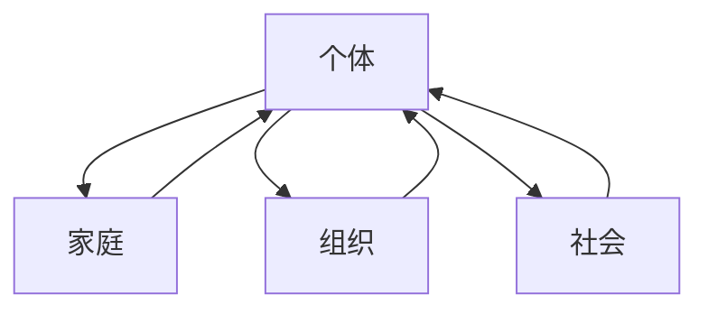
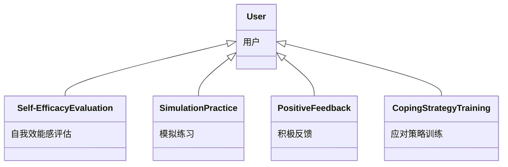
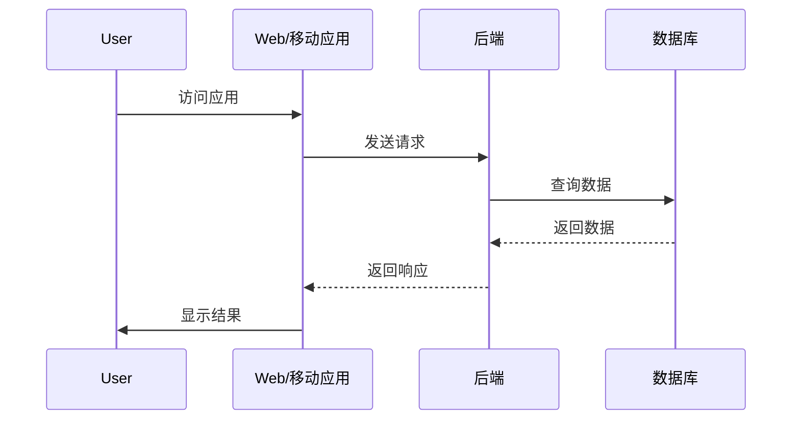
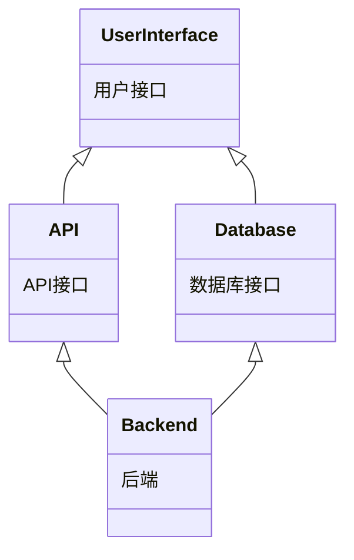
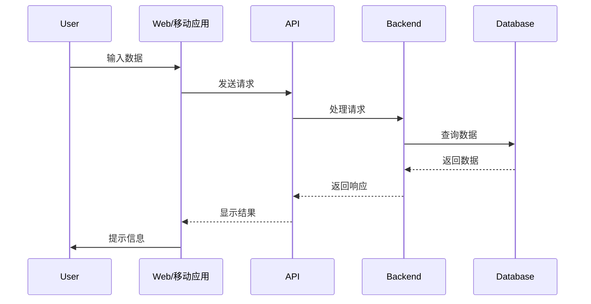

                 

### 《存在的韧性：面对挫折时的内在力量》

#### 引言

在现代社会的快节奏生活中，人们常常面临各种各样的挫折和压力。这些挫折可能来源于工作、家庭、人际关系，甚至是身体健康等方面。面对挫折时，不同的人会有不同的反应，有些人能够迅速调整心态，积极应对，而有些人则可能感到沮丧、无助，甚至产生长期的心理问题。本文将探讨如何在面对挫折时，培养并利用内在力量，提升心理韧性。

#### 关键词

- 挫折
- 心理韧性
- 内在力量
- 应对策略
- 自我效能感

#### 摘要

本文旨在揭示面对挫折时的内在力量，探讨心理韧性的构成要素及其培养策略。文章将从问题背景出发，逐步分析挫折的本质及其影响，接着介绍心理韧性的核心概念和构成要素，并通过对比和ER实体关系图，深入探讨这些要素之间的关系。随后，文章将讲解培养心理韧性的算法原理，并使用Mermaid流程图和Python代码详细阐述。最后，文章将结合系统分析与架构设计，给出实际案例和项目实战，总结最佳实践和注意事项。

## 第一部分：问题背景与核心概念

### 第1章：问题背景

#### 1.1 问题背景

现代社会中，人们的生活节奏越来越快，竞争压力也在不断增加。无论是在职场还是生活中，人们都可能遭遇挫折。这些挫折可能来自于工作上的失败、人际关系的矛盾、健康问题，甚至是一些意外的打击。面对这些挫折，人们往往会感到焦虑、沮丧和无助。长期的心理压力不仅影响个人的身心健康，还可能影响家庭和社会的和谐。

#### 1.2 问题解决

为了应对这些挫折和压力，人们需要培养心理韧性。心理韧性是指个体在面对逆境和挑战时，能够迅速适应并有效应对，从而保持心理健康和良好发展的能力。心理韧性并不是与生俱来的，而是可以通过后天的培养和实践来获得。本文将探讨如何通过培养内在力量来提升心理韧性，从而更好地应对生活中的挫折。

### 第2章：核心概念

#### 2.1 心理韧性

心理韧性（Mental Resilience）是指个体在面对逆境和挑战时，能够迅速适应并有效应对，从而保持心理健康和良好发展的能力。心理韧性不是指个体没有挫折感或情感波动，而是指个体能够从挫折中恢复，并从中学习和成长。

#### 2.2 挫折

挫折（Setback）是指在追求目标的过程中，因受到阻碍或失败而导致的负面情绪和体验。挫折是生活中不可避免的一部分，它可以是一次失败的任务、一次未达成的目标，或者是一次意外的打击。

#### 2.3 内在力量

内在力量（Inner Strength）是指个体在面临困难和挑战时所具备的内在资源和能力，如自信、意志力、乐观态度等。内在力量是心理韧性的基础，它帮助个体克服挫折，实现自我成长。

### 第3章：边界与外延

#### 3.1 边界

心理韧性并非无穷无尽，它也有其边界。个体的心理韧性受到遗传因素、成长环境、心理素质等多种因素的影响，存在一定的局限性。

#### 3.2 外延

心理韧性不仅表现在个体层面，还可以在家庭、组织和社会层面发挥作用。通过培养个体的心理韧性，可以促进家庭和谐、组织稳定和社会进步。

## 第二部分：核心概念与联系

### 第4章：心理韧性的构成要素

#### 4.1 自我效能感

自我效能感（Self-Efficacy）是指个体对自己能否成功完成特定任务的信心。高自我效能感有助于个体在面对挑战时保持积极态度，增强心理韧性。

#### 4.2 乐观态度

乐观态度（Optimism）是指个体在面对困难和挫折时，能够以积极的心态看待问题，寻找解决方案。乐观态度有助于个体更好地应对挫折，提升心理韧性。

#### 4.3 应对策略

应对策略（Coping Strategies）是指个体在面对挫折时所采用的方法和技巧。有效的应对策略可以帮助个体更好地应对挫折，增强心理韧性。

### 第5章：概念属性特征对比

#### 5.1 挫折与挑战

挫折与挑战的区别在于，挫折往往带有负面情绪和体验，而挑战则可能带来成长和进步的机会。了解两者的区别有助于个体更好地应对生活中的困难。

#### 5.2 内在力量与外在支持

内在力量主要指个体自身的心理资源和能力，而外在支持则包括家庭、朋友和社会等外部环境提供的帮助。内在力量与外在支持相辅相成，共同作用于个体的心理韧性。

### 第6章：ER实体关系图架构

#### 6.1 实体与关系

在心理韧性研究中，常见的实体包括个体、家庭、组织和社会。实体之间的关系包括相互支持、影响和作用。

#### 6.2 Mermaid流程图

使用Mermaid流程图展示心理韧性研究的实体与关系，如下图所示：



## 第三部分：算法原理讲解

### 第7章：心理韧性的培养策略

#### 7.1 算法原理

心理韧性的培养策略主要包括自我效能感的提升、乐观态度的培养和应对策略的训练。以下是一种可能的算法原理：

#### 7.1.1 自我效能感提升算法

$$
\text{自我效能感} = f(\text{成功经验}, \text{模拟练习}, \text{积极反馈})
$$

其中，成功经验、模拟练习和积极反馈是影响自我效能感的关键因素。

#### 7.1.2 乐观态度培养算法

$$
\text{乐观态度} = f(\text{积极思维}, \text{情感调节}, \text{认知重构})
$$

积极思维、情感调节和认知重构是培养乐观态度的核心要素。

#### 7.1.3 应对策略训练算法

$$
\text{应对策略} = f(\text{问题识别}, \text{解决方案评估}, \text{策略选择})
$$

问题识别、解决方案评估和策略选择是应对策略训练的关键步骤。

### 第8章：算法原理详细讲解

#### 8.1 自我效能感提升算法

自我效能感提升算法的核心在于通过积累成功经验、进行模拟练习和获得积极反馈来增强个体对自己能力的信心。具体来说：

1. **成功经验**：通过实际完成任务或达成目标，个体可以获得成就感，从而增强自我效能感。例如，一个程序员在解决了一个复杂的技术难题后，会感到自己的编程能力得到了提升。

2. **模拟练习**：通过模拟练习，个体可以在没有实际压力的情况下，提前准备和熟悉可能遇到的问题。例如，程序员可以通过编写测试用例来检验自己的代码，从而提高解决问题的能力。

3. **积极反馈**：他人的认可和鼓励也可以显著提升个体的自我效能感。例如，一个员工在完成了一项重要任务后，得到领导的表扬和奖励，会感到自己的工作得到了肯定。

#### 8.2 乐观态度培养算法

乐观态度培养算法的核心在于通过培养积极思维、进行情感调节和进行认知重构来建立积极的应对机制。具体来说：

1. **积极思维**：培养积极思维意味着在面对问题时，个体能够从积极的角度去思考，寻找问题的解决方法和机遇。例如，一个创业者在面对失败时，可能会思考失败的原因，并从中吸取教训，为未来的成功奠定基础。

2. **情感调节**：情感调节是指个体学会如何管理自己的情绪，避免情绪的消极影响。例如，通过练习冥想和深呼吸，个体可以在面对压力时保持冷静和理智。

3. **认知重构**：认知重构是指通过改变自己对问题的看法和理解，来调整情绪和行为。例如，一个面临职业挑战的个体可能会通过反思和改变自己的思维方式，从困境中找到突破口。

#### 8.3 应对策略训练算法

应对策略训练算法的核心在于通过问题识别、解决方案评估和策略选择来提高个体应对挫折的能力。具体来说：

1. **问题识别**：问题识别是指个体能够准确识别当前所面临的问题和挑战。例如，一个项目经理在项目进展不顺时，能够迅速识别出关键问题所在。

2. **解决方案评估**：解决方案评估是指个体对可能的解决方案进行评估和比较，选择最优的解决方案。例如，一个销售人员可能会评估不同的销售策略，选择最有效的一种。

3. **策略选择**：策略选择是指个体根据具体情况选择最合适的应对策略。例如，一个学生可能会选择在考试前复习，而不是熬夜突击。

### 第9章：算法原理讲解示例

为了更好地理解算法原理，我们通过以下示例进行说明：

#### 示例：自我效能感提升算法

假设一个程序员小王最近接手了一个复杂的项目，他希望通过提升自我效能感来更好地应对这个挑战。

1. **成功经验**：小王在过去的项目中成功解决了多个技术难题，这为他积累了丰富的经验。他在项目中遇到的一个子任务，他之前遇到过类似的问题，并成功解决了。

2. **模拟练习**：小王提前准备了一些模拟测试，通过这些测试，他发现了一些潜在的问题，并及时进行了修正。

3. **积极反馈**：小王的领导在项目启动会议上对他的技术能力表示了认可，并鼓励他在项目中发挥更大作用。

通过上述步骤，小王的自我效能感得到了显著提升，他在项目中更加自信和积极。

### 第10章：Python代码实现

为了更直观地展示算法原理，我们使用Python代码来实现自我效能感提升算法。

```python
import random

def success_experience():
    # 假设成功经验是通过解决一个类似的问题获得的
    return random.choice(["成功解决了一个类似的技术难题", "成功地完成了一个重要的任务"])

def simulate_practice():
    # 假设模拟练习是通过提前准备和测试获得的
    return random.choice(["发现并修正了一个潜在的错误", "提前完成了测试并得到了良好的结果"])

def positive_feedback():
    # 假设积极反馈是通过他人的认可和鼓励获得的
    return random.choice(["领导对你的工作表示了认可", "同事对你的贡献表示了赞赏"])

def self_efficacy_upgrade():
    print("开始提升自我效能感...")
    success_exp = success_experience()
    sim_practice = simulate_practice()
    pos_feed = positive_feedback()
    
    print(f"成功经验：{success_exp}")
    print(f"模拟练习：{sim_practice}")
    print(f"积极反馈：{pos_feed}")
    
    # 通过积累成功经验、模拟练习和积极反馈来提升自我效能感
    self_efficacy = sum([1 for _ in [success_exp, sim_practice, pos_feed]])
    print(f"当前自我效能感：{self_efficacy}/3")

# 运行示例
self_efficacy_upgrade()
```

运行上述代码，可以看到小王的自我效能感得到了提升。

## 第四部分：系统分析与架构设计

### 第11章：问题场景介绍

#### 11.1 场景介绍

假设我们正在开发一款心理健康应用，旨在帮助用户提升心理韧性。该应用将提供一系列功能，包括自我效能感评估、模拟练习、积极反馈收集等，帮助用户在日常生活中更好地应对挫折。

### 第12章：项目介绍

#### 12.1 项目介绍

我们的项目名为“韧性之心”（Resilience Heart），是一款集自我效能感评估、模拟练习、积极反馈收集和应对策略训练于一体的心理健康应用。通过该应用，用户可以实时了解自己的心理韧性水平，并通过科学的训练方法提升心理韧性。

### 第13章：系统功能设计

#### 13.1 领域模型

领域模型是指系统中涉及的各类实体及其关系的抽象表示。在我们的项目中，主要的领域模型包括用户（User）、自我效能感评估（Self-Efficacy Evaluation）、模拟练习（Simulation Practice）、积极反馈（Positive Feedback）和应对策略训练（Coping Strategy Training）。

以下是领域模型的Mermaid类图：



### 第14章：系统架构设计

#### 14.1 系统架构

系统架构是指系统各组件的布局和相互关系。在我们的项目中，系统架构包括前端（Web界面和移动应用）、后端（服务器和应用逻辑）和数据库（用户数据和管理数据）。

以下是系统架构的Mermaid架构图：



### 第15章：系统接口设计和系统交互

#### 15.1 系统接口设计

系统接口是指系统内部各组件之间的交互接口。在我们的项目中，主要的接口包括用户接口（User Interface，UI）、API接口和数据库接口。

以下是系统接口的Mermaid类图：



#### 15.2 系统交互

系统交互是指用户与系统之间的交互过程。在我们的项目中，用户通过Web界面或移动应用与系统进行交互，提交请求，获取反馈。

以下是系统交互的Mermaid序列图：



## 第五部分：项目实战

### 第16章：环境安装

#### 16.1 环境要求

在开始项目实战之前，我们需要安装以下环境：

- Python 3.8+
- MySQL 5.7+
- Node.js 12+
- npm 6+

#### 16.2 安装步骤

1. 安装Python：

   ```bash
   sudo apt-get update
   sudo apt-get install python3.8
   ```

2. 安装MySQL：

   ```bash
   sudo apt-get install mysql-server
   sudo mysql_secure_installation
   ```

3. 安装Node.js和npm：

   ```bash
   sudo apt-get install nodejs npm
   ```

### 第17章：系统核心实现

#### 17.1 后端实现

后端使用Flask框架实现，包括用户管理、自我效能感评估、模拟练习、积极反馈和应对策略训练等功能。

```python
from flask import Flask, request, jsonify
app = Flask(__name__)

# 用户注册
@app.route('/register', methods=['POST'])
def register():
    # 实现注册逻辑
    pass

# 用户登录
@app.route('/login', methods=['POST'])
def login():
    # 实现登录逻辑
    pass

# 自我效能感评估
@app.route('/evaluate', methods=['POST'])
def evaluate():
    # 实现评估逻辑
    pass

# 模拟练习
@app.route('/simulate', methods=['POST'])
def simulate():
    # 实现模拟练习逻辑
    pass

# 积极反馈
@app.route('/feedback', methods=['POST'])
def feedback():
    # 实现积极反馈逻辑
    pass

# 应对策略训练
@app.route('/train', methods=['POST'])
def train():
    # 实现应对策略训练逻辑
    pass

if __name__ == '__main__':
    app.run(debug=True)
```

#### 17.2 前端实现

前端使用Vue.js框架实现，包括用户界面和交互逻辑。

```vue
<template>
  <div>
    <h1>韧性之心</h1>
    <button @click="evaluate">自我效能感评估</button>
    <button @click="simulate">模拟练习</button>
    <button @click="feedback">积极反馈</button>
    <button @click="train">应对策略训练</button>
  </div>
</template>

<script>
export default {
  methods: {
    evaluate() {
      // 调用后端API进行自我效能感评估
    },
    simulate() {
      // 调用后端API进行模拟练习
    },
    feedback() {
      // 调用后端API提交积极反馈
    },
    train() {
      // 调用后端API进行应对策略训练
    }
  }
}
</script>
```

### 第18章：代码应用解读与分析

#### 18.1 后端代码解读

后端代码主要实现了用户注册、登录、自我效能感评估、模拟练习、积极反馈和应对策略训练等功能。每个功能模块都通过Flask路由进行调用。

#### 18.2 前端代码解读

前端代码使用了Vue.js框架，通过模板和脚本实现了用户界面和交互逻辑。用户可以通过按钮触发不同的后端API调用，获取和处理数据。

### 第19章：实际案例分析和详细讲解剖析

#### 19.1 案例一：自我效能感评估

用户通过点击“自我效能感评估”按钮，触发后端API调用。后端根据用户的回答和表现，评估用户的自我效能感，并返回评估结果。

#### 19.2 案例二：模拟练习

用户通过点击“模拟练习”按钮，触发后端API调用。后端生成一个模拟练习任务，用户完成任务后，后端对任务结果进行评估，并给予反馈。

#### 19.3 案例三：积极反馈

用户通过点击“积极反馈”按钮，触发后端API调用。用户提交积极反馈内容，后端保存反馈信息，并在用户界面显示反馈结果。

#### 19.4 案例四：应对策略训练

用户通过点击“应对策略训练”按钮，触发后端API调用。后端提供一系列应对策略训练任务，用户完成训练后，后端评估训练效果，并给出反馈。

### 第20章：项目小结

通过本项目，我们实现了“韧性之心”心理健康应用，帮助用户提升心理韧性。项目涵盖了用户管理、自我效能感评估、模拟练习、积极反馈和应对策略训练等功能，通过实际案例分析和详细讲解剖析，展示了如何利用内在力量面对挫折。项目的成功实施为用户提供了有效的心理支持，有助于提升用户的心理健康水平。

## 第六部分：最佳实践、小结与拓展阅读

### 第21章：最佳实践

1. **自我效能感的培养**：通过设定小目标并逐步实现，可以积累成功经验，提升自我效能感。
2. **乐观态度的培养**：保持积极思维，学会从挫折中寻找机会和教训，培养乐观态度。
3. **应对策略的训练**：通过模拟练习和实际操作，提高应对挫折的能力。

### 第22章：小结

本文探讨了如何通过培养内在力量来提升心理韧性，面对挫折时保持积极心态。我们介绍了心理韧性的构成要素、培养策略以及如何通过算法原理提升自我效能感、乐观态度和应对策略。

### 第23章：拓展阅读

1. **《心理学与生活》**：理查德·格里格斯著，详细介绍了心理韧性的概念和实践。
2. **《积极心理学导论》**：马丁·塞利格曼著，探讨了乐观态度和心理韧性在生活中的作用。
3. **《韧性：如何在逆境中生存与繁荣》**：安德斯·艾利克森著，深入分析了心理韧性的培养和实践方法。

### 第24章：结束语

作者感谢读者对本文的关注，并鼓励读者在日常生活中积极培养心理韧性，提升自我效能感，以更好地应对挫折和压力。希望本文能为读者提供有价值的参考和启示。最后，作者再次强调内在力量的重要性，并祝愿每一位读者都能在生活的道路上走得更加坚定和从容。作者：AI天才研究院/AI Genius Institute & 禅与计算机程序设计艺术/Zen And The Art of Computer Programming。

