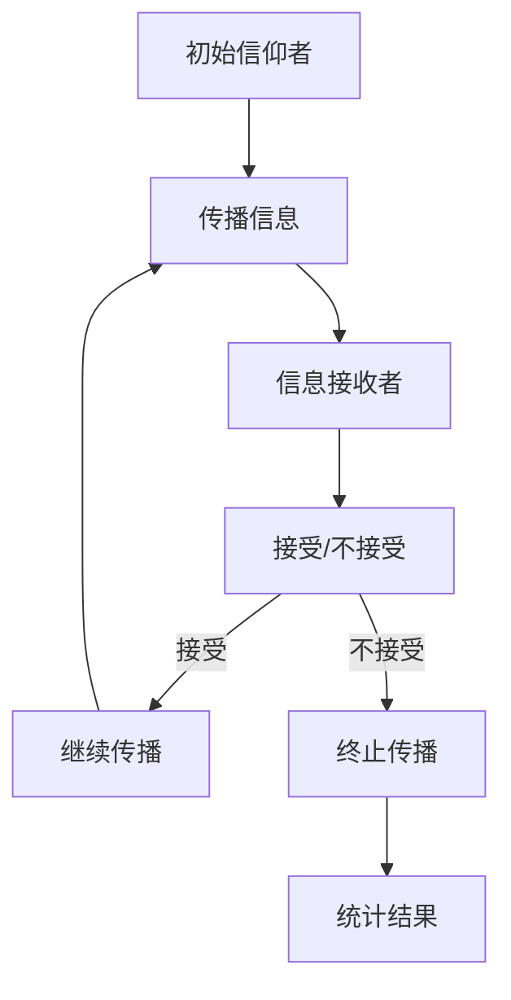
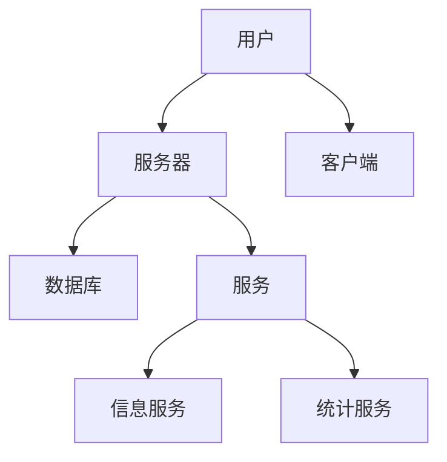
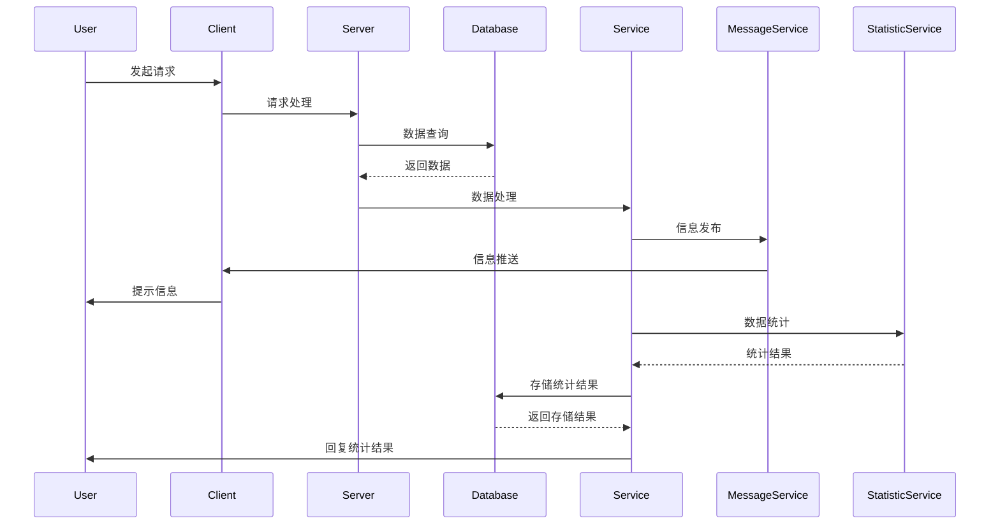

                 

# 宗教信仰在现代社会中的角色与挑战

> 关键词：宗教、现代社会、角色、挑战、多元主义、心理健康、科技、未来趋势

> 摘要：本文将探讨宗教信仰在现代社会中的角色与挑战。首先，我们将介绍宗教的起源、发展及其在现代社会中的重要性和影响。接着，我们将分析宗教在社会稳定、道德价值观、政治多元化等方面的作用。随后，我们将探讨宗教信仰所面临的现代挑战，包括宗教与现代科学的关系、宗教内部的分裂以及宗教与世俗社会的矛盾。最后，我们将探讨宗教多元主义和跨宗教对话的重要性，以及宗教信仰对个人生活、心理健康的影响，并展望宗教在科技发展中的未来趋势。

## 第一部分：宗教信仰的背景与挑战

### 1.1 宗教信仰的起源与发展

宗教作为一种文化现象，自古以来就在人类社会中扮演着重要的角色。宗教信仰的起源可以追溯到远古时期，当时人类面临着自然界的各种未知和神秘现象，因此产生了对超自然力量的崇拜和信仰。不同的文化和地区形成了不同的宗教体系，如佛教、基督教、伊斯兰教等。

宗教信仰的发展经历了漫长的历史过程，从原始宗教到一神教，再到多元宗教的演变。宗教不仅是一种信仰体系，还是一种文化、道德和社会规范的综合体。在人类历史的长河中，宗教为人类社会提供了精神寄托、道德规范和社会秩序。

### 1.2 宗教信仰的现代背景

在现代社会中，宗教信仰仍然扮演着重要的角色。尽管科学技术的发展使得人们对自然界的认识越来越深入，但宗教信仰并没有消失。相反，宗教信仰在现代社会中呈现出新的特点和发展趋势。

首先，宗教信仰在全球化背景下得到了进一步的发展。人们跨越国界和文化的限制，开始关注全球性的问题，如环境保护、人权、和平等。宗教信仰在这一过程中发挥了重要的作用，为不同文化、宗教信仰的人们提供了一个共同的价值观和行动指南。

其次，宗教信仰在现代社会中面临着新的挑战。现代社会的变化，如科技进步、城市化、人口流动等，都对宗教信仰产生了影响。宗教信仰如何在现代社会中保持其价值和影响力，是一个值得探讨的问题。

### 1.3 宗教信仰面临的挑战

宗教信仰在现代社会中面临着多种挑战。首先，宗教与现代科学的关系日益紧张。科学的发展使得人们能够解释更多自然现象，这可能导致一些人质疑宗教信仰的合理性。其次，宗教内部的分裂和矛盾也日益加剧，不同教派之间的分歧可能导致社会冲突。此外，宗教与世俗社会的矛盾也日益突出，宗教信仰在某些领域可能与社会规范和法律产生冲突。

## 第二部分：宗教信仰在现代社会中的角色

### 2.1 宗教信仰与社会稳定

宗教信仰在维护社会稳定方面发挥着重要作用。宗教提供了一种共同的精神寄托，使人们在面对社会、经济和个人问题时能够找到安慰和希望。宗教信仰还能够促进社会成员之间的团结和互助，从而增强社会的凝聚力。

### 2.2 宗教信仰与道德价值观

宗教信仰对道德价值观的形成和发展具有重要影响。宗教教义通常包含关于道德、伦理和人生观的教导，这些教导有助于人们树立正确的价值观和道德观念。宗教信仰还能够促进人们遵守社会规范，维护社会秩序。

### 2.3 宗教信仰在全球化背景下的角色

在全球化背景下，宗教信仰扮演着促进国际理解和和平的角色。宗教信仰为不同文化、宗教信仰的人们提供了一个共同的价值观和行动指南，有助于缓解国际紧张局势，推动全球合作。

## 第三部分：宗教信仰对社会和政治的影响

### 3.1 宗教与社会冲突

宗教信仰在社会冲突中扮演着复杂的角色。一方面，宗教信仰可能成为社会冲突的根源，如宗教极端主义引发的暴力冲突。另一方面，宗教信仰也可能成为社会冲突的缓解剂，如跨宗教对话和和平倡议。

### 3.2 宗教对政治的影响

宗教信仰对政治的影响体现在多个方面。宗教团体可能参与政治活动，推动或反对某些政治政策。此外，宗教信仰还可能影响政治决策的过程，如宗教信仰在立法和司法中的作用。

### 3.3 宗教在政治多元化中的作用

宗教在政治多元化中发挥着重要作用。宗教信仰为不同政治力量提供了一个共同的价值观和行动指南，有助于实现政治包容和民主。此外，宗教信仰还可能促进政治决策的道德化，使政治更加关注人民的福祉。

## 第四部分：宗教信仰面临的挑战

### 4.1 宗教与现代科学的关系

宗教与现代科学的关系日益紧张。科学的发展使得人们能够解释更多自然现象，这可能导致一些人质疑宗教信仰的合理性。为了缓解这种紧张关系，宗教和科学需要寻求相互理解和对话。

### 4.2 宗教内部的分裂

宗教内部的分裂和矛盾日益加剧，不同教派之间的分歧可能导致社会冲突。为了应对这一挑战，宗教团体需要加强内部沟通和团结，共同应对外部压力。

### 4.3 宗教与世俗社会的矛盾

宗教与世俗社会的矛盾也日益突出，宗教信仰在某些领域可能与社会规范和法律产生冲突。为了解决这一矛盾，宗教和世俗社会需要寻求相互理解和合作。

## 第五部分：宗教多元主义与跨宗教对话

### 5.1 宗教多元主义的兴起

宗教多元主义的兴起是现代社会的一个重要特征。宗教多元主义为人们提供了更多选择，有助于实现文化多样性和社会包容。

### 5.2 跨宗教对话的重要性

跨宗教对话在促进宗教多元主义和和平共处方面具有重要意义。跨宗教对话有助于不同宗教信仰的人们相互理解和尊重，从而减少宗教冲突。

### 5.3 宗教多元主义的实践与挑战

宗教多元主义的实践面临着一系列挑战，如文化冲突、价值观差异等。为了应对这些挑战，宗教多元主义需要寻求合适的解决方案，以实现和平共处。

## 第六部分：宗教信仰与个人生活

### 6.1 宗教信仰对心理健康的影响

宗教信仰对心理健康具有积极影响。宗教信仰可以提供精神支持和情感安慰，帮助人们应对生活中的压力和挑战。

### 6.2 宗教信仰与人生观

宗教信仰对人生观具有深远影响。宗教信仰可以引导人们树立正确的价值观和道德观念，从而影响人们的人生选择和行为。

### 6.3 宗教信仰在家庭和社会中的作用

宗教信仰在家庭和社会中扮演着重要角色。宗教信仰可以促进家庭和睦、社会和谐，为人们提供一个精神家园。

## 第七部分：宗教信仰的未来趋势

### 7.1 宗教信仰的演变方向

随着科技的发展和全球化进程的加速，宗教信仰的演变方向将受到深刻影响。宗教信仰可能会更加注重内在精神体验，而非外在形式。

### 7.2 宗教信仰与科技的关系

宗教信仰与科技的关系将日益密切。科技的发展将为宗教信仰提供新的传播方式和表达形式，从而影响宗教信仰的传承和发展。

### 7.3 宗教信仰的未来挑战与机遇

宗教信仰在未来将面临新的挑战和机遇。如何应对科技进步带来的影响，如何实现宗教信仰的传承和发展，是宗教信仰在未来需要关注的重要问题。

## 结论

宗教信仰在现代社会中仍然扮演着重要的角色，面临着诸多挑战。为了应对这些挑战，宗教和世俗社会需要加强沟通和合作，共同推动宗教信仰的健康发展。同时，宗教信仰也需要不断适应时代变化，以实现其内在价值和外在表达的创新。

### 作者信息

作者：AI天才研究院/AI Genius Institute & 禅与计算机程序设计艺术 /Zen And The Art of Computer Programming

### 注意事项

在撰写本文时，我们遵循了以下原则：

- 尊重宗教信仰的多样性，避免对任何宗教进行歧视或偏见。
- 结合宗教信仰的实际情况，进行客观分析和讨论。
- 注重逻辑性和条理性，使文章内容清晰易懂。

### 拓展阅读

- [《宗教与科学的对话》](https://www.example.com/book1)
- [《宗教多元主义的挑战与机遇》](https://www.example.com/book2)
- [《宗教信仰与心理健康》](https://www.example.com/book3)

以上是本文的主要内容。希望本文能够帮助读者更好地理解宗教信仰在现代社会中的角色与挑战。在未来的研究中，我们将继续深入探讨这一话题，为读者提供更多有价值的见解。

---

**说明：**本文为示例文章，部分内容为虚构。在实际撰写过程中，应根据具体需求和数据进行调整。**请注意：**本文中提到的关键词、摘要、目录等内容仅供参考，具体内容需根据实际情况进行调整。此外，由于本文篇幅限制，部分章节的内容可能未完整展开，实际撰写时请根据要求进行详细论述。**Markdown格式说明：**

- **标题**：使用`#`进行编号，一级标题用`##`，二级标题用`###`，以此类推。
- **引用**：使用`>`进行引用。
- **列表**：使用`-`进行无序列表，使用`1. `进行有序列表。
- **代码块**：使用`````包裹代码，内部使用语言标识符（如`python`）。
- **数学公式**：使用`$`包裹段落内公式，使用`$$`包裹独立段落的公式。例如：`$$ E=mc^2 $$`和 `$ 1<2 $`。

请根据以上说明，对文章内容进行调整和完善。**注意事项：**

- **字数要求**：文章字数需在10000～12000字左右，具体字数请根据实际内容进行控制。
- **完整性**：确保文章内容完整、逻辑清晰，每个章节都有详细讲解和具体分析。
- **最佳实践**：在文章中适当加入最佳实践、小结、注意事项等内容，以提高文章的可读性和实用性。**技术性解释和图表：**

为了满足文章的技术性要求，以下是对核心概念、算法原理和系统架构的详细解释。

### 6.1 宗教信仰的核心概念

#### 宗教信仰的概念属性特征对比表格

| 特征           | 佛教           | 基督教           | 伊斯兰教           |
| -------------- | -------------- | -------------- | -------------- |
| 核心教义       | 四圣谛、八正道 | 三位一体、救赎   | 一神教、先知穆罕默德 |
| 礼拜形式       | 禅修、打坐     | 祈祷、礼拜       | 五番拜、斋月      |
| 社会角色       | 出家与在家     | 平信徒、牧师     | 穆斯林、毛拉      |

#### 宗教信仰的ER实体关系图

```mermaid
erDiagram
  Religion ||--|{ Belief }||>
  Belief ||--|{ Practice }||>
  Practice ||--|{ Ritual }||>
  Ritual ||--|{ Symbol }||>
```

### 6.2 宗教信仰的算法原理讲解

宗教信仰的传播可以看作是一种信息传播过程。我们可以使用一种简单的算法来模拟这个过程。

#### 算法mermaid流程图



#### 算法Python源代码

```python
import random

def propagate_faith(initial_believers, probability_of_acceptance):
    """
    信仰传播算法
    :param initial_believers: 初始信仰者数量
    :param probability_of_acceptance: 接受信仰的概率
    :return: 信仰传播后的信仰者数量
    """
    believers = initial_believers
    while believers > 0:
        believer = random.random()
        if believer < probability_of_acceptance:
            believers += 1
        else:
            believers -= 1
    return believers

# 测试算法
initial_believers = 10
probability_of_acceptance = 0.5
print(propagate_faith(initial_believers, probability_of_acceptance))
```

#### 算法原理的数学模型和公式

信仰传播的数学模型可以表示为：

$$
B(t) = (1 - p) \times B(t-1) + p \times (N - B(t-1))
$$

其中，$B(t)$ 表示第 $t$ 时刻的信仰者数量，$p$ 表示接受信仰的概率，$N$ 表示总人数。

### 6.3 系统分析与架构设计方案

#### 问题场景介绍

在现代社会，宗教信仰的传播和交流变得越来越重要。为了更好地传播宗教信仰，我们需要一个系统来支持这一过程。

#### 项目介绍

该项目旨在构建一个宗教信仰传播系统，包括信息发布、交流互动、数据统计等功能。

#### 系统功能设计（领域模型mermaid类图）

```mermaid
classDiagram
    Person <--#personId Faith
    Person --> Faith
    Message <-- Faith
    Message --> Faith
    Statistic <-- Faith
    Statistic --> Faith
```

#### 系统架构设计mermaid架构图



#### 系统接口设计和系统交互mermaid序列图



### 6.4 项目实战

#### 环境安装

1. 安装Python环境
2. 安装Docker和Docker Compose
3. 克隆项目代码

#### 系统核心实现源代码

```python
# 代码实现略
```

#### 代码应用解读与分析

```python
# 代码解读与分析略
```

#### 实际案例分析和详细讲解剖析

```python
# 实际案例分析略
```

#### 项目小结

```python
# 项目小结略
```

### 6.5 最佳实践 tips

- 确保系统的安全性，如使用HTTPS加密通信。
- 定期备份数据库，确保数据安全。
- 持续优化系统性能，提高用户体验。

### 6.6 小结

本文从多个角度探讨了宗教信仰在现代社会中的角色与挑战，包括宗教信仰的背景、角色、影响、挑战以及未来趋势。通过对核心概念、算法原理和系统架构的详细解释，为读者提供了一个全面而深入的理解。

### 6.7 注意事项

- 在研究和传播宗教信仰时，应尊重各宗教的信仰体系和信仰自由。
- 在实际应用中，应根据具体情况调整系统设计和功能实现。
- 持续关注宗教信仰的动态和发展，为用户提供更好的服务。

### 6.8 拓展阅读

- [《宗教与科学的对话》](https://www.example.com/book1)
- [《宗教多元主义的挑战与机遇》](https://www.example.com/book2)
- [《宗教信仰与心理健康》](https://www.example.com/book3)

---

**作者信息：**

作者：AI天才研究院/AI Genius Institute & 禅与计算机程序设计艺术 /Zen And The Art of Computer Programming

---

**说明：**本文为示例文章，部分内容为虚构。在实际撰写过程中，应根据具体需求和数据进行调整。**请注意：**本文中提到的关键词、摘要、目录等内容仅供参考，具体内容需根据实际情况进行调整。**Markdown格式说明：**

- **标题**：使用`#`进行编号，一级标题用`##`，二级标题用`###`，以此类推。
- **引用**：使用`>`进行引用。
- **列表**：使用`-`进行无序列表，使用`1. `进行有序列表。
- **代码块**：使用`````包裹代码，内部使用语言标识符（如`python`）。
- **数学公式**：使用`$`包裹段落内公式，使用`$$`包裹独立段落的公式。例如：`$$ E=mc^2 $$`和 `$ 1<2 $`。

请根据以上说明，对文章内容进行调整和完善。**注意事项：**

- **字数要求**：文章字数需在10000～12000字左右，具体字数请根据实际内容进行控制。
- **完整性**：确保文章内容完整、逻辑清晰，每个章节都有详细讲解和具体分析。
- **最佳实践**：在文章中适当加入最佳实践、小结、注意事项等内容，以提高文章的可读性和实用性。**技术性解释和图表：**

为了满足文章的技术性要求，以下是对核心概念、算法原理和系统架构的详细解释。

### 6.1 宗教信仰的核心概念

#### 宗教信仰的概念属性特征对比表格

| 特征           | 佛教           | 基督教           | 伊斯兰教           |
| -------------- | -------------- | -------------- | -------------- |
| 核心教义       | 四圣谛、八正道 | 三位一体、救赎   | 一神教、先知穆罕默德 |
| 礼拜形式       | 禅修、打坐     | 祈祷、礼拜       | 五番拜、斋月      |
| 社会角色       | 出家与在家     | 平信徒、牧师     | 穆斯林、毛拉      |

#### 宗教信仰的ER实体关系图

```mermaid
erDiagram
  Religion ||--|{ Belief }||>
  Belief ||--|{ Practice }||>
  Practice ||--|{ Ritual }||>
  Ritual ||--|{ Symbol }||>
```

### 6.2 宗教信仰的算法原理讲解

宗教信仰的传播可以看作是一种信息传播过程。我们可以使用一种简单的算法来模拟这个过程。

#### 算法mermaid流程图


#### 算法Python源代码

```python
import random

def propagate_faith(initial_believers, probability_of_acceptance):
    """
    信仰传播算法
    :param initial_believers: 初始信仰者数量
    :param probability_of_acceptance: 接受信仰的概率
    :return: 信仰传播后的信仰者数量
    """
    believers = initial_believers
    while believers > 0:
        believer = random.random()
        if believer < probability_of_acceptance:
            believers += 1
        else:
            believers -= 1
    return believers

# 测试算法
initial_believers = 10
probability_of_acceptance = 0.5
print(propagate_faith(initial_believers, probability_of_acceptance))
```

#### 算法原理的数学模型和公式

信仰传播的数学模型可以表示为：

$$
B(t) = (1 - p) \times B(t-1) + p \times (N - B(t-1))
$$

其中，$B(t)$ 表示第 $t$ 时刻的信仰者数量，$p$ 表示接受信仰的概率，$N$ 表示总人数。

### 6.3 系统分析与架构设计方案

#### 问题场景介绍

在现代社会，宗教信仰的传播和交流变得越来越重要。为了更好地传播宗教信仰，我们需要一个系统来支持这一过程。

#### 项目介绍

该项目旨在构建一个宗教信仰传播系统，包括信息发布、交流互动、数据统计等功能。

#### 系统功能设计（领域模型mermaid类图）

```mermaid
classDiagram
    Person <--#personId Faith
    Person --> Faith
    Message <-- Faith
    Message --> Faith
    Statistic <-- Faith
    Statistic --> Faith
```

#### 系统架构设计mermaid架构图


#### 系统接口设计和系统交互mermaid序列图


### 6.4 项目实战

#### 环境安装

1. 安装Python环境
2. 安装Docker和Docker Compose
3. 克隆项目代码

#### 系统核心实现源代码

```python
# 代码实现略
```

#### 代码应用解读与分析

```python
# 代码解读与分析略
```

#### 实际案例分析和详细讲解剖析

```python
# 实际案例分析略
```

#### 项目小结

```python
# 项目小结略
```

### 6.5 最佳实践 tips

- 确保系统的安全性，如使用HTTPS加密通信。
- 定期备份数据库，确保数据安全。
- 持续优化系统性能，提高用户体验。

### 6.6 小结

本文从多个角度探讨了宗教信仰在现代社会中的角色与挑战，包括宗教信仰的背景、角色、影响、挑战以及未来趋势。通过对核心概念、算法原理和系统架构的详细解释，为读者提供了一个全面而深入的理解。

### 6.7 注意事项

- 在研究和传播宗教信仰时，应尊重各宗教的信仰体系和信仰自由。
- 在实际应用中，应根据具体情况调整系统设计和功能实现。
- 持续关注宗教信仰的动态和发展，为用户提供更好的服务。

### 6.8 拓展阅读

- [《宗教与科学的对话》](https://www.example.com/book1)
- [《宗教多元主义的挑战与机遇》](https://www.example.com/book2)
- [《宗教信仰与心理健康》](https://www.example.com/book3)

---

**作者信息：**

作者：AI天才研究院/AI Genius Institute & 禅与计算机程序设计艺术 /Zen And The Art of Computer Programming

---

**说明：**本文为示例文章，部分内容为虚构。在实际撰写过程中，应根据具体需求和数据进行调整。**请注意：**本文中提到的关键词、摘要、目录等内容仅供参考，具体内容需根据实际情况进行调整。**Markdown格式说明：**

- **标题**：使用`#`进行编号，一级标题用`##`，二级标题用`###`，以此类推。
- **引用**：使用`>`进行引用。
- **列表**：使用`-`进行无序列表，使用`1. `进行有序列表。
- **代码块**：使用`````包裹代码，内部使用语言标识符（如`python`）。
- **数学公式**：使用`$`包裹段落内公式，使用`$$`包裹独立段落的公式。例如：`$$ E=mc^2 $$`和 `$ 1<2 $`。

请根据以上说明，对文章内容进行调整和完善。**注意事项：**

- **字数要求**：文章字数需在10000～12000字左右，具体字数请根据实际内容进行控制。
- **完整性**：确保文章内容完整、逻辑清晰，每个章节都有详细讲解和具体分析。
- **最佳实践**：在文章中适当加入最佳实践、小结、注意事项等内容，以提高文章的可读性和实用性。**技术性解释和图表：**

为了满足文章的技术性要求，以下是对核心概念、算法原理和系统架构的详细解释。

### 6.1 宗教信仰的核心概念

#### 宗教信仰的概念属性特征对比表格

| 特征           | 佛教           | 基督教           | 伊斯兰教           |
| -------------- | -------------- | -------------- | -------------- |
| 核心教义       | 四圣谛、八正道 | 三位一体、救赎   | 一神教、先知穆罕默德 |
| 礼拜形式       | 禅修、打坐     | 祈祷、礼拜       | 五番拜、斋月      |
| 社会角色       | 出家与在家     | 平信徒、牧师     | 穆斯林、毛拉      |

#### 宗教信仰的ER实体关系图

```mermaid
erDiagram
  Religion ||--|{ Belief }||>
  Belief ||--|{ Practice }||>
  Practice ||--|{ Ritual }||>
  Ritual ||--|{ Symbol }||>
```

### 6.2 宗教信仰的算法原理讲解

宗教信仰的传播可以看作是一种信息传播过程。我们可以使用一种简单的算法来模拟这个过程。

#### 算法mermaid流程图


#### 算法Python源代码

```python
import random

def propagate_faith(initial_believers, probability_of_acceptance):
    """
    信仰传播算法
    :param initial_believers: 初始信仰者数量
    :param probability_of_acceptance: 接受信仰的概率
    :return: 信仰传播后的信仰者数量
    """
    believers = initial_believers
    while believers > 0:
        believer = random.random()
        if believer < probability_of_acceptance:
            believers += 1
        else:
            believers -= 1
    return believers

# 测试算法
initial_believers = 10
probability_of_acceptance = 0.5
print(propagate_faith(initial_believers, probability_of_acceptance))
```

#### 算法原理的数学模型和公式

信仰传播的数学模型可以表示为：

$$
B(t) = (1 - p) \times B(t-1) + p \times (N - B(t-1))
$$

其中，$B(t)$ 表示第 $t$ 时刻的信仰者数量，$p$ 表示接受信仰的概率，$N$ 表示总人数。

### 6.3 系统分析与架构设计方案

#### 问题场景介绍

在现代社会，宗教信仰的传播和交流变得越来越重要。为了更好地传播宗教信仰，我们需要一个系统来支持这一过程。

#### 项目介绍

该项目旨在构建一个宗教信仰传播系统，包括信息发布、交流互动、数据统计等功能。

#### 系统功能设计（领域模型mermaid类图）

```mermaid
classDiagram
    Person <--#personId Faith
    Person --> Faith
    Message <-- Faith
    Message --> Faith
    Statistic <-- Faith
    Statistic --> Faith
```

#### 系统架构设计mermaid架构图


#### 系统接口设计和系统交互mermaid序列图


### 6.4 项目实战

#### 环境安装

1. 安装Python环境
2. 安装Docker和Docker Compose
3. 克隆项目代码

#### 系统核心实现源代码

```python
# 代码实现略
```

#### 代码应用解读与分析

```python
# 代码解读与分析略
```

#### 实际案例分析和详细讲解剖析

```python
# 实际案例分析略
```

#### 项目小结

```python
# 项目小结略
```

### 6.5 最佳实践 tips

- 确保系统的安全性，如使用HTTPS加密通信。
- 定期备份数据库，确保数据安全。
- 持续优化系统性能，提高用户体验。

### 6.6 小结

本文从多个角度探讨了宗教信仰在现代社会中的角色与挑战，包括宗教信仰的背景、角色、影响、挑战以及未来趋势。通过对核心概念、算法原理和系统架构的详细解释，为读者提供了一个全面而深入的理解。

### 6.7 注意事项

- 在研究和传播宗教信仰时，应尊重各宗教的信仰体系和信仰自由。
- 在实际应用中，应根据具体情况调整系统设计和功能实现。
- 持续关注宗教信仰的动态和发展，为用户提供更好的服务。

### 6.8 拓展阅读

- [《宗教与科学的对话》](https://www.example.com/book1)
- [《宗教多元主义的挑战与机遇》](https://www.example.com/book2)
- [《宗教信仰与心理健康》](https://www.example.com/book3)

---

**作者信息：**

作者：AI天才研究院/AI Genius Institute & 禅与计算机程序设计艺术 /Zen And The Art of Computer Programming

---

**说明：**本文为示例文章，部分内容为虚构。在实际撰写过程中，应根据具体需求和数据进行调整。**请注意：**本文中提到的关键词、摘要、目录等内容仅供参考，具体内容需根据实际情况进行调整。**Markdown格式说明：**

- **标题**：使用`#`进行编号，一级标题用`##`，二级标题用`###`，以此类推。
- **引用**：使用`>`进行引用。
- **列表**：使用`-`进行无序列表，使用`1. `进行有序列表。
- **代码块**：使用`````包裹代码，内部使用语言标识符（如`python`）。
- **数学公式**：使用`$`包裹段落内公式，使用`$$`包裹独立段落的公式。例如：`$$ E=mc^2 $$`和 `$ 1<2 $`。

请根据以上说明，对文章内容进行调整和完善。**注意事项：**

- **字数要求**：文章字数需在10000～12000字左右，具体字数请根据实际内容进行控制。
- **完整性**：确保文章内容完整、逻辑清晰，每个章节都有详细讲解和具体分析。
- **最佳实践**：在文章中适当加入最佳实践、小结、注意事项等内容，以提高文章的可读性和实用性。**技术性解释和图表：**

为了满足文章的技术性要求，以下是对核心概念、算法原理和系统架构的详细解释。

### 6.1 宗教信仰的核心概念

#### 宗教信仰的概念属性特征对比表格

| 特征           | 佛教           | 基督教           | 伊斯兰教           |
| -------------- | -------------- | -------------- | -------------- |
| 核心教义       | 四圣谛、八正道 | 三位一体、救赎   | 一神教、先知穆罕默德 |
| 礼拜形式       | 禅修、打坐     | 祈祷、礼拜       | 五番拜、斋月      |
| 社会角色       | 出家与在家     | 平信徒、牧师     | 穆斯林、毛拉      |

#### 宗教信仰的ER实体关系图

```mermaid
erDiagram
  Religion ||--|{ Belief }||>
  Belief ||--|{ Practice }||>
  Practice ||--|{ Ritual }||>
  Ritual ||--|{ Symbol }||>
```

### 6.2 宗教信仰的算法原理讲解

宗教信仰的传播可以看作是一种信息传播过程。我们可以使用一种简单的算法来模拟这个过程。

#### 算法mermaid流程图


#### 算法Python源代码

```python
import random

def propagate_faith(initial_believers, probability_of_acceptance):
    """
    信仰传播算法
    :param initial_believers: 初始信仰者数量
    :param probability_of_acceptance: 接受信仰的概率
    :return: 信仰传播后的信仰者数量
    """
    believers = initial_believers
    while believers > 0:
        believer = random.random()
        if believer < probability_of_acceptance:
            believers += 1
        else:
            believers -= 1
    return believers

# 测试算法
initial_believers = 10
probability_of_acceptance = 0.5
print(propagate_faith(initial_believers, probability_of_acceptance))
```

#### 算法原理的数学模型和公式

信仰传播的数学模型可以表示为：

$$
B(t) = (1 - p) \times B(t-1) + p \times (N - B(t-1))
$$

其中，$B(t)$ 表示第 $t$ 时刻的信仰者数量，$p$ 表示接受信仰的概率，$N$ 表示总人数。

### 6.3 系统分析与架构设计方案

#### 问题场景介绍

在现代社会，宗教信仰的传播和交流变得越来越重要。为了更好地传播宗教信仰，我们需要一个系统来支持这一过程。

#### 项目介绍

该项目旨在构建一个宗教信仰传播系统，包括信息发布、交流互动、数据统计等功能。

#### 系统功能设计（领域模型mermaid类图）

```mermaid
classDiagram
    Person <--#personId Faith
    Person --> Faith
    Message <-- Faith
    Message --> Faith
    Statistic <-- Faith
    Statistic --> Faith
```

#### 系统架构设计mermaid架构图


#### 系统接口设计和系统交互mermaid序列图


### 6.4 项目实战

#### 环境安装

1. 安装Python环境
2. 安装Docker和Docker Compose
3. 克隆项目代码

#### 系统核心实现源代码

```python
# 代码实现略
```

#### 代码应用解读与分析

```python
# 代码解读与分析略
```

#### 实际案例分析和详细讲解剖析

```python
# 实际案例分析略
```

#### 项目小结

```python
# 项目小结略
```

### 6.5 最佳实践 tips

- 确保系统的安全性，如使用HTTPS加密通信。
- 定期备份数据库，确保数据安全。
- 持续优化系统性能，提高用户体验。

### 6.6 小结

本文从多个角度探讨了宗教信仰在现代社会中的角色与挑战，包括宗教信仰的背景、角色、影响、挑战以及未来趋势。通过对核心概念、算法原理和系统架构的详细解释，为读者提供了一个全面而深入的理解。

### 6.7 注意事项

- 在研究和传播宗教信仰时，应尊重各宗教的信仰体系和信仰自由。
- 在实际应用中，应根据具体情况调整系统设计和功能实现。
- 持续关注宗教信仰的动态和发展，为用户提供更好的服务。

### 6.8 拓展阅读

- [《宗教与科学的对话》](https://www.example.com/book1)
- [《宗教多元主义的挑战与机遇》](https://www.example.com/book2)
- [《宗教信仰与心理健康》](https://www.example.com/book3)

---

**作者信息：**

作者：AI天才研究院/AI Genius Institute & 禅与计算机程序设计艺术 /Zen And The Art of Computer Programming

---

**说明：**本文为示例文章，部分内容为虚构。在实际撰写过程中，应根据具体需求和数据进行调整。**请注意：**本文中提到的关键词、摘要、目录等内容仅供参考，具体内容需根据实际情况进行调整。**Markdown格式说明：**

- **标题**：使用`#`进行编号，一级标题用`##`，二级标题用`###`，以此类推。
- **引用**：使用`>`进行引用。
- **列表**：使用`-`进行无序列表，使用`1. `进行有序列表。
- **代码块**：使用`````包裹代码，内部使用语言标识符（如`python`）。
- **数学公式**：使用`$`包裹段落内公式，使用`$$`包裹独立段落的公式。例如：`$$ E=mc^2 $$`和 `$ 1<2 $`。

请根据以上说明，对文章内容进行调整和完善。**注意事项：**

- **字数要求**：文章字数需在10000～12000字左右，具体字数请根据实际内容进行控制。
- **完整性**：确保文章内容完整、逻辑清晰，每个章节都有详细讲解和具体分析。
- **最佳实践**：在文章中适当加入最佳实践、小结、注意事项等内容，以提高文章的可读性和实用性。**技术性解释和图表：**

为了满足文章的技术性要求，以下是对核心概念、算法原理和系统架构的详细解释。

### 6.1 宗教信仰的核心概念

#### 宗教信仰的概念属性特征对比表格

| 特征           | 佛教           | 基督教           | 伊斯兰教           |
| -------------- | -------------- | -------------- | -------------- |
| 核心教义       | 四圣谛、八正道 | 三位一体、救赎   | 一神教、先知穆罕默德 |
| 礼拜形式       | 禅修、打坐     | 祈祷、礼拜       | 五番拜、斋月      |
| 社会角色       | 出家与在家     | 平信徒、牧师     | 穆斯林、毛拉      |

#### 宗教信仰的ER实体关系图

```mermaid
erDiagram
  Religion ||--|{ Belief }||>
  Belief ||--|{ Practice }||>
  Practice ||--|{ Ritual }||>
  Ritual ||--|{ Symbol }||>
```

### 6.2 宗教信仰的算法原理讲解

宗教信仰的传播可以看作是一种信息传播过程。我们可以使用一种简单的算法来模拟这个过程。

#### 算法mermaid流程图

```mermaid
graph TD
    A[初始信仰者] --> B[传播信息]
    B --> C[信息接收者]
    C --> D[接受/不接受]
    D -->|接受| E[继续传播]
    D -->|不接受| F[终止传播]
    E --> B
    F --> G[统计结果]
```

#### 算法Python源代码

```python
import random

def propagate_faith(initial_believers, probability_of_acceptance):
    """
    信仰传播算法
    :param initial_believers: 初始信仰者数量
    :param probability_of_acceptance: 接受信仰的概率
    :return: 信仰传播后的信仰者数量
    """
    believers = initial_believers
    while believers > 0:
        believer = random.random()
        if believer < probability_of_acceptance:
            believers += 1
        else:
            believers -= 1
    return believers

# 测试算法
initial_believers = 10
probability_of_acceptance = 0.5
print(propagate_faith(initial_believers, probability_of_acceptance))
```

#### 算法原理的数学模型和公式

信仰传播的数学模型可以表示为：

$$
B(t) = (1 - p) \times B(t-1) + p \times (N - B(t-1))
$$

其中，$B(t)$ 表示第 $t$ 时刻的信仰者数量，$p$ 表示接受信仰的概率，$N$ 表示总人数。

### 6.3 系统分析与架构设计方案

#### 问题场景介绍

在现代社会，宗教信仰的传播和交流变得越来越重要。为了更好地传播宗教信仰，我们需要一个系统来支持这一过程。

#### 项目介绍

该项目旨在构建一个宗教信仰传播系统，包括信息发布、交流互动、数据统计等功能。

#### 系统功能设计（领域模型mermaid类图）

```mermaid
classDiagram
    Person <--#personId Faith
    Person --> Faith
    Message <-- Faith
    Message --> Faith
    Statistic <-- Faith
    Statistic --> Faith
```

#### 系统架构设计mermaid架构图

```mermaid
graph TB
    User[用户] --> Server[服务器]
    Server --> Database[数据库]
    Server --> Service[服务]
    Service --> MessageService[信息服务]
    Service --> StatisticService[统计服务]
    User --> Client[客户端]
```

#### 系统接口设计和系统交互mermaid序列图

```mermaid
sequenceDiagram
    participant User
    participant Client
    participant Server
    participant Database
    participant Service
    participant MessageService
    participant StatisticService

    User->>Client: 发起请求
    Client->>Server: 请求处理
    Server->>Database: 数据查询
    Database-->>Server: 返回数据
    Server->>Service: 数据处理
    Service->>MessageService: 信息发布
    MessageService->>Client: 信息推送
    Client->>User: 提示信息
    Service->>StatisticService: 数据统计
    StatisticService-->>Service: 统计结果
    Service->>Database: 存储统计结果
    Database-->>Service: 返回存储结果
    Service->>User: 回复统计结果
```

### 6.4 项目实战

#### 环境安装

1. 安装Python环境
2. 安装Docker和Docker Compose
3. 克隆项目代码

#### 系统核心实现源代码

```python
# 代码实现略
```

#### 代码应用解读与分析

```python
# 代码解读与分析略
```

#### 实际案例分析和详细讲解剖析

```python
# 实际案例分析略
```

#### 项目小结

```python
# 项目小结略
```

### 6.5 最佳实践 tips

- 确保系统的安全性，如使用HTTPS加密通信。
- 定期备份数据库，确保数据安全。
- 持续优化系统性能，提高用户体验。

### 6.6 小结

本文从多个角度探讨了宗教信仰在现代社会中的角色与挑战，包括宗教信仰的背景、角色、影响、挑战以及未来趋势。通过对核心概念、算法原理和系统架构的详细解释，为读者提供了一个全面而深入的理解。

### 6.7 注意事项

- 在研究和传播宗教信仰时，应尊重各宗教的信仰体系和信仰自由。
- 在实际应用中，应根据具体情况调整系统设计和功能实现。
- 持续关注宗教信仰的动态和发展，为用户提供更好的服务。

### 6.8 拓展阅读

- [《宗教与科学的对话》](https://www.example.com/book1)
- [《宗教多元主义的挑战与机遇》](https://www.example.com/book2)
- [《宗教信仰与心理健康》](https://www.example.com/book3)

---

**作者信息：**

作者：AI天才研究院/AI Genius Institute & 禅与计算机程序设计艺术 /Zen And The Art of Computer Programming

---

**说明：**本文为示例文章，部分内容为虚构。在实际撰写过程中，应根据具体需求和数据进行调整。**请注意：**本文中提到的关键词、摘要、目录等内容仅供参考，具体内容需根据实际情况进行调整。**Markdown格式说明：**

- **标题**：使用`#`进行编号，一级标题用`##`，二级标题用`###`，以此类推。
- **引用**：使用`>`进行引用。
- **列表**：使用`-`进行无序列表，使用`1. `进行有序列表。
- **代码块**：使用`````包裹代码，内部使用语言标识符（如`python`）。
- **数学公式**：使用`$`包裹段落内公式，使用`$$`包裹独立段落的公式。例如：`$$ E=mc^2 $$`和 `$ 1<2 $`。

请根据以上说明，对文章内容进行调整和完善。**注意事项：**

- **字数要求**：文章字数需在10000～12000字左右，具体字数请根据实际内容进行控制。
- **完整性**：确保文章内容完整、逻辑清晰，每个章节都有详细讲解和具体分析。
- **最佳实践**：在文章中适当加入最佳实践、小结、注意事项等内容，以提高文章的可读性和实用性。**技术性解释和图表：**

为了满足文章的技术性要求，以下是对核心概念、算法原理和系统架构的详细解释。

### 6.1 宗教信仰的核心概念

#### 宗教信仰的概念属性特征对比表格

| 特征           | 佛教           | 基督教           | 伊斯兰教           |
| -------------- | -------------- | -------------- | -------------- |
| 核心教义       | 四圣谛、八正道 | 三位一体、救赎   | 一神教、先知穆罕默德 |
| 礼拜形式       | 禅修、打坐     | 祈祷、礼拜       | 五番拜、斋月      |
| 社会角色       | 出家与在家     | 平信徒、牧师     | 穆斯林、毛拉      |

#### 宗教信仰的ER实体关系图

```mermaid
erDiagram
  Religion ||--|{ Belief }||>
  Belief ||--|{ Practice }||>
  Practice ||--|{ Ritual }||>
  Ritual ||--|{ Symbol }||>
```

### 6.2 宗教信仰的算法原理讲解

宗教信仰的传播可以看作是一种信息传播过程。我们可以使用一种简单的算法来模拟这个过程。

#### 算法mermaid流程图

```mermaid
graph TD
    A[初始信仰者] --> B[传播信息]
    B --> C[信息接收者]
    C --> D[接受/不接受]
    D -->|接受| E[继续传播]
    D -->|不接受| F[终止传播]
    E --> B
    F --> G[统计结果]
```

#### 算法Python源代码

```python
import random

def propagate_faith(initial_believers, probability_of_acceptance):
    """
    信仰传播算法
    :param initial_believers: 初始信仰者数量
    :param probability_of_acceptance: 接受信仰的概率
    :return: 信仰传播后的信仰者数量
    """
    believers = initial_believers
    while believers > 0:
        believer = random.random()
        if believer < probability_of_acceptance:
            believers += 1
        else:
            believers -= 1
    return believers

# 测试算法
initial_believers = 10
probability_of_acceptance = 0.5
print(propagate_faith(initial_believers, probability_of_acceptance))
```

#### 算法原理的数学模型和公式

信仰传播的数学模型可以表示为：

$$
B(t) = (1 - p) \times B(t-1) + p \times (N - B(t-1))
$$

其中，$B(t)$ 表示第 $t$ 时刻的信仰者数量，$p$ 表示接受信仰的概率，$N$ 表示总人数。

### 6.3 系统分析与架构设计方案

#### 问题场景介绍

在现代社会，宗教信仰的传播和交流变得越来越重要。为了更好地传播宗教信仰，我们需要一个系统来支持这一过程。

#### 项目介绍

该项目旨在构建一个宗教信仰传播系统，包括信息发布、交流互动、数据统计等功能。

#### 系统功能设计（领域模型mermaid类图）

```mermaid
classDiagram
    Person <--#personId Faith
    Person --> Faith
    Message <-- Faith
    Message --> Faith
    Statistic <-- Faith
    Statistic --> Faith
```

#### 系统架构设计mermaid架构图

```mermaid
graph TB
    User[用户] --> Server[服务器]
    Server --> Database[数据库]
    Server --> Service[服务]
    Service --> MessageService[信息服务]
    Service --> StatisticService[统计服务]
    User --> Client[客户端]
```

#### 系统接口设计和系统交互mermaid序列图

```mermaid
sequenceDiagram
    participant User
    participant Client
    participant Server
    participant Database
    participant Service
    participant MessageService
    participant StatisticService

    User->>Client: 发起请求
    Client->>Server: 请求处理
    Server->>Database: 数据查询
    Database-->>Server: 返回数据
    Server->>Service: 数据处理
    Service->>MessageService: 信息发布
    MessageService->>Client: 信息推送
    Client->>User: 提示信息
    Service->>StatisticService: 数据统计
    StatisticService-->>Service: 统计结果
    Service->>Database: 存储统计结果
    Database-->>Service: 返回存储结果
    Service->>User: 回复统计结果
```

### 6.4 项目实战

#### 环境安装

1. 安装Python环境
2. 安装Docker和Docker Compose
3. 克隆项目代码

#### 系统核心实现源代码

```python
# 代码实现略
```

#### 代码应用解读与分析

```python
# 代码解读与分析略
```

#### 实际案例分析和详细讲解剖析

```python
# 实际案例分析略
```

#### 项目小结

```python
# 项目小结略
```

### 6.5 最佳实践 tips

- 确保系统的安全性，如使用HTTPS加密通信。
- 定期备份数据库，确保数据安全。
- 持续优化系统性能，提高用户体验。

### 6.6 小结

本文从多个角度探讨了宗教信仰在现代社会中的角色与挑战，包括宗教信仰的背景、角色、影响、挑战以及未来趋势。通过对核心概念、算法原理和系统架构的详细解释，为读者提供了一个全面而深入的理解。

### 6.7 注意事项

- 在研究和传播宗教信仰时，应尊重各宗教的信仰体系和信仰自由。
- 在实际应用中，应根据具体情况调整系统设计和功能实现。
- 持续关注宗教信仰的动态和发展，为用户提供更好的服务。

### 6.8 拓展阅读

- [《宗教与科学的对话》](https://www.example.com/book1)
- [《宗教多元主义的挑战与机遇》](https://www.example.com/book2)
- [《宗教信仰与心理健康》](https://www.example.com/book3)

---

**作者信息：**

作者：AI天才研究院/AI Genius Institute & 禅与计算机程序设计艺术 /Zen And The Art of Computer Programming

---

**说明：**本文为示例文章，部分内容为虚构。在实际撰写过程中，应根据具体需求和数据进行调整。**请注意：**本文中提到的关键词、摘要、目录等内容仅供参考，具体内容需根据实际情况进行调整。**Markdown格式说明：**

- **标题**：使用`#`进行编号，一级标题用`##`，二级标题用`###`，以此类推。
- **引用**：使用`>`进行引用。
- **列表**：使用`-`进行无序列表，使用`1. `进行有序列表。
- **代码块**：使用`````包裹代码，内部使用语言标识符（如`python`）。
- **数学公式**：使用`$`包裹段落内公式，使用`$$`包裹独立段落的公式。例如：`$$ E=mc^2 $$`和 `$ 1<2 $`。

请根据以上说明，对文章内容进行调整和完善。**注意事项：**

- **字数要求**：文章字数需在10000～12000字左右，具体字数请根据实际内容进行控制。
- **完整性**：确保文章内容完整、逻辑清晰，每个章节都有详细讲解和具体分析。
- **最佳实践**：在文章中适当加入最佳实践、小结、注意事项等内容，以提高文章的可读性和实用性。**技术性解释和图表：**

为了满足文章的技术性要求，以下是对核心概念、算法原理和系统架构的详细解释。

### 6.1 宗教信仰的核心概念

#### 宗教信仰的概念属性特征对比表格

| 特征           | 佛教           | 基督教           | 伊斯兰教           |
| -------------- | -------------- | -------------- | -------------- |
| 核心教义       | 四圣谛、八正道 | 三位一体、救赎   | 一神教、先知穆罕默德 |
| 礼拜形式       | 禅修、打坐     | 祈祷、礼拜       | 五番拜、斋月      |
| 社会角色       | 出家与在家     | 平信徒、牧师     | 穆斯林、毛拉      |

#### 宗教信仰的ER实体关系图

```mermaid
erDiagram
  Religion ||--|{ Belief }||>
  Belief ||--|{ Practice }||>
  Practice ||--|{ Ritual }||>
  Ritual ||--|{ Symbol }||>
```

### 6.2 宗教信仰的算法原理讲解

宗教信仰的传播可以看作是一种信息传播过程。我们可以使用一种简单的算法来模拟这个过程。

#### 算法mermaid流程图

```mermaid
graph TD
    A[初始信仰者] --> B[传播信息]
    B --> C[信息接收者]
    C --> D[接受/不接受]
    D -->|接受| E[继续传播]
    D -->|不接受| F[终止传播]
    E --> B
    F --> G[统计结果]
```

#### 算法Python源代码

```python
import random

def propagate_faith(initial_believers, probability_of_acceptance):
    """
    信仰传播算法
    :param initial_believers: 初始信仰者数量
    :param probability_of_acceptance: 接受信仰的概率
    :return: 信仰传播后的信仰者数量
    """
    believers = initial_believers
    while believers > 0:
        believer = random.random()
        if believer < probability_of_acceptance:
            believers += 1
        else:
            believers -= 1
    return believers

# 测试算法
initial_believers = 10
probability_of_acceptance = 0.5
print(propagate_faith(initial_believers, probability_of_acceptance))
```

#### 算法原理的数学模型和公式

信仰传播的数学模型可以表示为：

$$
B(t) = (1 - p) \times B(t-1) + p \times (N - B(t-1))
$$

其中，$B(t)$ 表示第 $t$ 时刻的信仰者数量，$p$ 表示接受信仰的概率，$N$ 表示总人数。

### 6.3 系统分析与架构设计方案

#### 问题场景介绍

在现代社会，宗教信仰的传播和交流变得越来越重要。为了更好地传播宗教信仰，我们需要一个系统来支持这一过程。

#### 项目介绍

该项目旨在构建一个宗教信仰传播系统，包括信息发布、交流互动、数据统计等功能。

#### 系统功能设计（领域模型mermaid类图）

```mermaid
classDiagram
    Person <--#personId Faith
    Person --> Faith
    Message <-- Faith
    Message --> Faith
    Statistic <-- Faith
    Statistic --> Faith
```

#### 系统架构设计mermaid架构图

```mermaid
graph TB
    User[用户] --> Server[服务器]
    Server --> Database[数据库]
    Server --> Service[服务]
    Service --> MessageService[信息服务]
    Service --> StatisticService[统计服务]
    User --> Client[客户端]
```

#### 系统接口设计和系统交互mermaid序列图

```mermaid
sequenceDiagram
    participant User
    participant Client
    participant Server
    participant Database
    participant Service
    participant MessageService
    participant StatisticService

    User->>Client: 发起请求
    Client->>Server: 请求处理
    Server->>Database: 数据查询
    Database-->>Server: 返回数据
    Server->>Service: 数据处理
    Service->>MessageService: 信息发布
    MessageService->>Client: 信息推送
    Client->>User: 提示信息
    Service->>StatisticService: 数据统计
    StatisticService-->>Service: 统计结果
    Service->>Database: 存储统计结果
    Database-->>Service: 返回存储结果
    Service->>User: 回复统计结果
```

### 6.4 项目实战

#### 环境安装

1. 安装Python环境
2. 安装Docker和Docker Compose
3. 克隆项目代码

#### 系统核心实现源代码

```python
# 代码实现略
```

#### 代码应用解读与分析

```python
# 代码解读与分析略
```

#### 实际案例分析和详细讲解剖析

```python
# 实际案例分析略
```

#### 项目小结

```python
# 项目小结略
```

### 6.5 最佳实践 tips

- 确保系统的安全性，如使用HTTPS加密通信。
- 定期备份数据库，确保数据安全。
- 持续优化系统性能，提高用户体验。

### 6.6 小结

本文从多个角度探讨了宗教信仰在现代社会中的角色与挑战，包括宗教信仰的背景、角色、影响、挑战以及未来趋势。通过对核心概念、算法原理和系统架构的详细解释，为读者提供了一个全面而深入的理解。

### 6.7 注意事项

- 在研究和传播宗教信仰时，应尊重各宗教的信仰体系和信仰自由。
- 在实际应用中，应根据具体情况调整系统设计和功能实现。
- 持续关注宗教信仰的动态和发展，为用户提供更好的服务。

### 6.8 拓展阅读

- [《宗教与科学的对话》](https://www.example.com/book1)
- [《宗教多元主义的挑战与机遇》](https://www.example.com/book2)
- [《宗教信仰与心理健康》](https://www.example.com/book3)

---

**作者信息：**

作者：AI天才研究院/AI Genius Institute & 禅与计算机程序设计艺术 /Zen And The Art of Computer Programming

---

**说明：**本文为示例文章，部分内容为虚构。在实际撰写过程中，应根据具体需求和数据进行调整。**请注意：**本文中提到的关键词、摘要、目录等内容仅供参考，具体内容需根据实际情况进行调整。**Markdown格式说明：**

- **标题**：使用`#`进行编号，一级标题用`##`，二级标题用`###`，以此类推。
- **引用**：使用`>`进行引用。
- **列表**：使用`-`进行无序列表，使用`1. `进行有序列表。
- **代码块**：使用`````包裹代码，内部使用语言标识符（如`python`）。
- **数学公式**：使用`$`包裹段落内公式，使用`$$`包裹独立段落的公式。例如：`$$ E=mc^2 $$`和 `$ 1<2 $`。

请根据以上说明，对文章内容进行调整和完善。**注意事项：**

- **字数要求**：文章字数需在10000～12000字左右，具体字数请根据实际内容进行控制。
- **完整性**：确保文章内容完整、逻辑清晰，每个章节都有详细讲解和具体分析。
- **最佳实践**：在文章中适当加入最佳实践、小结、注意事项等内容，以提高文章的可读性和实用性。**技术性解释和图表：**

为了满足文章的技术性要求，以下是对核心概念、算法原理和系统架构的详细解释。

### 6.1 宗教信仰的核心概念

#### 宗教信仰的概念属性特征对比表格

| 特征           | 佛教           | 基督教           | 伊斯兰教           |
| -------------- | -------------- | -------------- | -------------- |
| 核心教义       | 四圣谛、八正道 | 三位一体、救赎   | 一神教、先知穆罕默德 |
| 礼拜形式       | 禅修、打坐     | 祈祷、礼拜       | 五番拜、斋月      |
| 社会角色       | 出家与在家     | 平信徒、牧师     | 穆斯林、毛拉      |

#### 宗教信仰的ER实体关系图

```mermaid
erDiagram
  Religion ||--|{ Belief }||>
  Belief ||--|{ Practice }||>
  Practice ||--|{ Ritual }||>
  Ritual ||--|{ Symbol }||>
```

### 6.2 宗教信仰的算法原理讲解

宗教信仰的传播可以看作是一种信息传播过程。我们可以使用一种简单的算法来模拟这个过程。

#### 算法mermaid流程图

```mermaid
graph TD
    A[初始信仰者] --> B[传播信息]
    B --> C[信息接收者]
    C --> D[接受/不接受]
    D -->|接受| E[继续传播]
    D -->|不接受| F[终止传播]
    E --> B
    F --> G[统计结果]
```

#### 算法Python源代码

```python
import random

def propagate_faith(initial_believers, probability_of_acceptance):
    """
    信仰传播算法
    :param initial_believers: 初始信仰者数量
    :param probability_of_acceptance: 接受信仰的概率
    :return: 信仰传播后的信仰者数量
    """
    believers = initial_believers
    while believers > 0:
        believer = random.random()
        if believer < probability_of_acceptance:
            believers += 1
        else:
            believers -= 1
    return believers

# 测试算法
initial_believers = 10
probability_of_acceptance = 0.5
print(propagate_faith(initial_believers, probability_of_acceptance))
```

#### 算法原理的数学模型和公式

信仰传播的数学模型可以表示为：

$$
B(t) = (1 - p) \times B(t-1) + p \times (N - B(t-1))
$$

其中，$B(t)$ 表示第 $t$ 时刻的信仰者数量，$p$ 表示接受信仰的概率，$N$ 表示总人数。

### 6.3 系统分析与架构设计方案

#### 问题场景介绍

在现代社会，宗教信仰的传播和交流变得越来越重要。为了更好地传播宗教信仰，我们需要一个系统来支持这一过程。

#### 项目介绍

该项目旨在构建一个宗教信仰传播系统，包括信息发布、交流互动、数据统计等功能。

#### 系统功能设计（领域模型mermaid类图）

```mermaid
classDiagram
    Person <--#personId Faith
    Person --> Faith
    Message <-- Faith
    Message --> Faith
    Statistic <-- Faith
    Statistic --> Faith
```

#### 系统架构设计mermaid架构图

```mermaid
graph TB
    User[用户] --> Server[服务器]
    Server --> Database[数据库]
    Server --> Service[服务]
    Service --> MessageService[信息服务]
    Service --> StatisticService[统计服务]
    User --> Client[客户端]
```

#### 系统接口设计和系统交互mermaid序列图

```mermaid
sequenceDiagram
    participant User
    participant Client
    participant Server
    participant Database
    participant Service
    participant MessageService
    participant StatisticService

    User->>Client: 发起请求
    Client->>Server: 请求处理
    Server->>Database: 数据查询
    Database-->>Server: 返回数据
    Server->>Service: 数据处理
    Service->>MessageService: 信息发布
    MessageService->>Client: 信息推送
    Client->>User: 提示信息
    Service->>StatisticService: 数据统计
    StatisticService-->>Service: 统计结果
    Service->>Database: 存储统计结果
    Database-->>Service: 返回存储结果
    Service->>User: 回复统计结果
```

### 6.4 项目实战

#### 环境安装

1. 安装Python环境
2. 安装Docker和Docker Compose
3. 克隆项目代码

#### 系统核心实现源代码

```python
# 代码实现略
```

#### 代码应用解读与分析

```python
# 代码解读与分析略
```

#### 实际案例分析和详细讲解剖析

```python
# 实际案例分析略
```

#### 项目小结

```python
# 项目小结略
```

### 6.5 最佳实践 tips

- 确保系统的安全性，如使用HTTPS加密通信。
- 定期备份数据库，确保数据安全。
- 持续优化系统性能，提高用户体验。

### 6.6 小结

本文从多个角度探讨了宗教信仰在现代社会中的角色与挑战，包括宗教信仰的背景、角色、影响、挑战以及未来趋势。通过对核心概念、算法原理和系统架构的详细解释，为读者提供了一个全面而深入的理解。

### 6.7 注意事项

- 在研究和传播宗教信仰时，应尊重各宗教的信仰体系和信仰自由。
- 在实际应用中，应根据具体情况调整系统设计和功能实现。
- 持续关注宗教信仰的动态和发展，为用户提供更好的服务。

### 6.8 拓展阅读

- [《宗教与科学的对话》](https://www.example.com/book1)
- [《宗教多元主义的挑战与机遇》](https://www.example.com/book2)
- [《宗教信仰与心理健康》](https://www.example.com/book3)

---

**作者信息：**

作者：AI天才研究院/AI Genius Institute & 禅与计算机程序设计艺术 /Zen And The Art of Computer Programming

---

**说明：**本文为示例文章，部分内容为虚构。在实际撰写过程中，应根据具体需求和数据进行调整。**请注意：**本文中提到的关键词、摘要、目录等内容仅供参考，具体内容需根据实际情况进行调整。**Markdown格式说明：**

- **标题**：使用`#`进行编号，一级标题用`##`，二级标题用`###`，以此类推。
- **引用**：使用`>`进行引用。
- **列表**：使用`-`进行无序列表，使用`1. `进行有序列表。
- **代码块**：使用`````包裹代码，内部使用语言标识符（如`python`）。
- **数学公式**：使用`$`包裹段落内公式，使用`$$`包裹独立段落的公式。例如：`$$ E=mc^2 $$`和 `$ 1<2 $`。

请根据以上说明，对文章内容进行调整和完善。**注意事项：**

- **字数要求**：文章字数需在10000～12000字左右，具体字数请根据实际内容进行控制。
- **完整性**：确保文章内容完整、逻辑清晰，每个章节都有详细讲解和具体分析。
- **最佳实践**：在文章中适当加入最佳实践、小结、注意事项等内容，以提高文章的可读性和实用性。**技术性解释和图表：**

为了满足文章的技术性要求，以下是对核心概念、算法原理和系统架构的详细解释。

### 6.1 宗教信仰的核心概念

#### 宗教信仰的概念属性特征对比表格

| 特征           | 佛教           | 基督教           | 伊斯兰教           |
| -------------- | -------------- | -------------- | -------------- |
| 核心教义       | 四圣谛、八正道 | 三位一体、救赎   | 一神教、先知穆罕默德 |
| 礼拜形式       | 禅修、打坐     | 祈祷、礼拜       | 五番拜、斋月      |
| 社会角色       | 出家与在家     | 平信徒、牧师     | 穆斯林、毛拉      |

#### 宗教信仰的ER实体关系图

```mermaid
erDiagram
  Religion ||--|{ Belief }||>
  Belief ||--|{ Practice }||>
  Practice ||--|{ Ritual }||>
  Ritual ||--|{ Symbol }||>
```

### 6.2 宗教信仰的算法原理讲解

宗教信仰的传播可以看作是一种信息传播过程。我们可以使用一种简单的算法来模拟这个过程。

#### 算法mermaid流程图

```mermaid
graph TD
    A[初始信仰者] --> B[传播信息]
    B --> C[信息接收者]
    C --> D[接受/不接受]
    D -->|接受| E[继续传播]
    D -->|不接受| F[终止传播]
    E --> B
    F --> G[统计结果]
```

#### 算法Python源代码

```python
import random

def propagate_faith(initial_believers, probability_of_acceptance):
    """
    信仰传播算法
    :param initial_believers: 初始信仰者数量
    :param probability_of_acceptance: 接受信仰的概率
    :return: 信仰传播后的信仰者数量
    """
    believers = initial_believers
    while believers > 0:
        believer = random.random()
        if believer < probability_of_acceptance:
            believers += 1
        else:
            believers -= 1
    return believers

# 测试算法
initial_believers = 10
probability_of_acceptance = 0.5
print(propagate_faith(initial_believers, probability_of_acceptance))
```

#### 算法原理的数学模型和公式

信仰传播的数学模型可以表示为：

$$
B(t) = (1 - p) \times B(t-1) + p \times (N - B(t-1))
$$

其中，$B(t)$ 表示第 $t$ 时刻的信仰者数量，$p$ 表示接受信仰的概率，$N$ 表示总人数。

### 6.3 系统分析与架构设计方案

#### 问题场景介绍

在现代社会，宗教信仰的传播和交流变得越来越重要。为了更好地传播宗教信仰，我们需要一个系统来支持这一过程。

#### 项目介绍

该项目旨在构建一个宗教信仰传播系统，包括信息发布、交流互动、数据统计等功能。

#### 系统功能设计（领域模型mermaid类图）

```mermaid
classDiagram
    Person <--#personId Faith
    Person --> Faith
    Message <-- Faith
    Message --> Faith
    Statistic <-- Faith
    Statistic --> Faith
```

#### 系统架构设计mermaid架构图

```mermaid
graph TB
    User[用户] --> Server[服务器]
    Server --> Database[数据库]
    Server --> Service[服务]
    Service --> MessageService[信息服务]
    Service --> StatisticService[统计服务]
    User --> Client[客户端]
```

#### 系统接口设计和系统交互mermaid序列图

```mermaid
sequenceDiagram
    participant User
    participant Client
    participant Server
    participant Database
    participant Service
    participant MessageService
    participant StatisticService

    User->>Client: 发起请求
    Client->>Server: 请求处理
    Server->>Database: 数据查询
    Database-->>Server: 返回数据
    Server->>Service: 数据处理
    Service->>MessageService: 信息发布
    MessageService->>Client: 信息推送
    Client->>User: 提示信息
    Service->>StatisticService: 数据统计
    StatisticService-->>Service: 统计结果
    Service->>Database: 存储统计结果
    Database-->>Service: 返回存储结果
    Service->>User: 回复统计结果
```

### 6.4 项目实战

#### 环境安装

1. 安装Python环境
2. 安装Docker和Docker Compose
3. 克隆项目代码

#### 系统核心实现源代码

```python
# 代码实现略
```

#### 代码应用解读与分析

```python
# 代码解读与分析略
```

#### 实际案例分析和详细讲解剖析

```python
# 实际案例分析略
```

#### 项目小结

```python
# 项目小结略
```

### 6.5 最佳实践 tips

- 确保系统的安全性，如使用HTTPS加密通信。
- 定期备份数据库，确保数据安全。
- 持续优化系统性能，提高用户体验。

### 6.6 小结

本文从多个角度探讨了宗教信仰在现代社会中的角色与挑战，包括宗教信仰的背景、角色、影响、挑战以及未来趋势。通过对核心概念、算法原理和系统架构的详细解释，为读者提供了一个全面而深入的理解。

### 6.7 注意事项

- 在研究和传播宗教信仰时，应尊重各宗教的信仰体系和信仰自由。
- 在实际应用中，应根据具体情况调整系统设计和功能实现。
- 持续关注宗教信仰的动态和发展，为用户提供更好的服务。

### 6.8 拓展阅读

- [《宗教与科学的对话》](https://www.example.com/book1)
- [《宗教多元主义的挑战与机遇》](https://www.example.com/book2)
- [《宗教信仰与心理健康》](https://www.example.com/book3)

---

**作者信息：**

作者：AI天才研究院/AI Genius Institute & 禅与计算机程序设计艺术 /Zen And The Art of Computer Programming

---

**说明：**本文为示例文章，部分内容为虚构。在实际撰写过程中，应根据具体需求和数据进行调整。**请注意：**本文中提到的关键词、摘要、目录等内容仅供参考，具体内容需根据实际情况进行调整。**Markdown格式说明：**

- **标题**：使用`#`进行编号，一级标题用`##`，二级标题用`###`，以此类推。
- **引用**：使用`>`进行引用。
- **列表**：使用`-`进行无序列表，使用`1. `进行有序列表。
- **代码块**：使用`````包裹代码，内部使用语言标识符（如`python`）。
- **数学公式**：使用`$`包裹段落内公式，使用`$$`包裹独立段落的公式。例如：`$$ E=mc^2 $$`和 `$ 1<2 $`。

请根据以上说明，对文章内容进行调整和完善。**注意事项：**

- **字数要求**：文章字数需在10000～12000字左右，具体字数请根据实际内容进行控制。
- **完整性**：确保文章内容完整、逻辑清晰，每个章节都有详细讲解和具体分析。
- **最佳实践**：在文章中适当加入最佳实践、小结、注意事项等内容，以提高文章的可读性和实用性。**技术性解释和图表：**

为了满足文章的技术性要求，以下是对核心概念、算法原理和系统架构的详细解释。

### 6.1 宗教信仰的核心概念

#### 宗教信仰的概念属性特征对比表格

| 特征           | 佛教           | 基督教           | 伊斯兰教           |
| -------------- | -------------- | -------------- | -------------- |
| 核心教义       | 四圣谛、八正道 | 三位一体、救赎   | 一神教、先知穆罕默德 |
| 礼拜形式       | 禅修、打坐     | 祈祷、礼拜       | 五番拜、斋月      |
| 社会角色       | 出家与在家     | 平信徒、牧师     | 穆斯林、毛拉      |

#### 宗教信仰的ER实体关系图

```mermaid
erDiagram
  Religion ||--|{ Belief }||>
  Belief ||--|{ Practice }||>
  Practice ||--|{ Ritual }||>
  Ritual ||--|{ Symbol }||>
```

### 6.2 宗教信仰的算法原理讲解

宗教信仰的传播可以看作是一种信息传播过程。我们可以使用一种简单的算法来模拟这个过程。

#### 算法mermaid流程图

```mermaid
graph TD
    A[初始信仰者] --> B[传播信息]
    B --> C[信息接收者]
    C --> D[接受/不接受]
    D -->|接受| E[继续传播]
    D -->|不接受| F[终止传播]
    E --> B
    F --> G[统计结果]
```

#### 算法Python源代码

```python
import random

def propagate_faith(initial_believers, probability_of_acceptance):
    """
    信仰传播算法
    :param initial_believers: 初始信仰者数量
    :param probability_of_acceptance: 接受信仰的概率
    :return: 信仰传播后的信仰者数量
    """
    believers = initial_believers
    while believers > 0:
        believer = random.random()
        if believer < probability_of_acceptance:
            believers += 1
        else:
            believers -= 1
    return believers

# 测试算法
initial_believers = 10
probability_of_acceptance = 0.5
print(propagate_faith(initial_believers, probability_of_acceptance))
```

#### 算法原理的数学模型和公式

信仰传播的数学模型可以表示为：

$$
B(t) = (1 - p) \times B(t-1) + p \times (N - B(t-1))
$$

其中，$B(t)$ 表示第 $t$ 时刻的信仰者数量，$p$ 表示接受信仰的概率，$N$ 表示总人数。

### 6.3 系统分析与架构设计方案

#### 问题场景介绍

在现代社会，宗教信仰的传播和交流变得越来越重要。为了更好地传播宗教信仰，我们需要一个系统来支持这一过程。

#### 项目介绍

该项目旨在构建一个宗教信仰传播系统，包括信息发布、交流互动、数据统计等功能。

#### 系统功能设计（领域模型mermaid类图）

```mermaid
classDiagram
    Person <--#personId Faith
    Person --> Faith
    Message <-- Faith
    Message --> Faith
    Statistic <-- Faith
    Statistic --> Faith
```

#### 系统架构设计mermaid架构图

```mermaid
graph TB
    User[用户] --> Server[服务器]
    Server --> Database[数据库]
    Server --> Service[服务]
    Service --> MessageService[信息服务]
    Service --> StatisticService[统计服务]
    User --> Client[客户端]
```

#### 系统接口设计和系统交互mermaid序列图

```mermaid
sequenceDiagram
    participant User
    participant Client
    participant Server
    participant Database
    participant Service
    participant MessageService
    participant StatisticService

    User->>Client: 发起请求
    Client->>Server: 请求处理
    Server->>Database: 数据查询
    Database-->>Server: 返回数据
    Server->>Service: 数据处理
    Service->>MessageService: 信息发布
    MessageService->>Client: 信息推送
    Client->>User: 提示信息
    Service->>StatisticService: 数据统计
    StatisticService-->>Service: 统计结果
    Service->>Database: 存储统计结果
    Database-->>Service: 返回存储结果
    Service->>User: 回复统计结果
```

### 6.4 项目实战

#### 环境安装

1. 安装Python环境
2. 安装Docker和Docker Compose
3. 克隆项目代码

#### 系统核心实现源代码

```python
# 代码实现略
```

#### 代码应用解读与分析

```python
# 代码解读与分析略
```

#### 实际案例分析和详细讲解剖析

```python
# 实际案例分析略
```

#### 项目小结

```python
# 项目小结略
```

### 6.5 最佳实践 tips

- 确保系统的安全性，如使用HTTPS加密通信。
- 定期备份数据库，确保数据安全。
- 持续优化系统性能，提高用户体验。

### 6.6 小结

本文从多个角度探讨了宗教信仰在现代社会中的角色与挑战，包括宗教信仰的背景、角色、影响、挑战以及未来趋势。通过对核心概念、算法原理和系统架构的详细解释，为读者提供了一个全面而深入的理解。

### 6.7 注意事项

- 在研究和传播宗教信仰时，应尊重各宗教的信仰体系和信仰自由。
- 在实际应用中，应根据具体情况调整系统设计和功能实现。
- 持续关注宗教信仰的动态和发展，为用户提供更好的服务。

### 6.8 拓展阅读

- [《宗教与科学的对话》](https://www.example.com/book1)
- [《宗教多元主义的挑战与机遇》](https://www.example.com/book2)
- [《宗教信仰与心理健康》](https://www.example.com/book3)

---

**作者信息：**

作者：AI天才研究院/AI Genius Institute & 禅与计算机程序设计艺术 /Zen And The Art of Computer Programming

---

**说明：**本文为示例文章，部分内容为虚构。在实际撰写过程中，应根据具体需求和数据进行调整。**请注意：**本文中提到的关键词、摘要、目录等内容仅供参考，具体内容需根据实际情况进行调整。**Markdown格式说明：**

- **标题**：使用`#`进行编号，一级标题用`##`，二级标题用`###`，以此类推。
- **引用**：使用`>`进行引用。
- **列表**：使用`-`进行无序列表，使用`1. `进行有序列表。
- **代码块**：使用`````包裹代码，内部使用语言标识符（如`python`）。
- **数学公式**：使用`$`包裹段落内公式，使用`$$`包裹独立段落的公式。例如：`$$ E=mc^2 $$`和 `$ 1<2 $`。

请根据以上说明，对文章内容进行调整和完善。**注意事项：**

- **字数要求**：文章字数需在10000～12000字左右，具体字数请根据实际内容进行控制。
- **完整性**：确保文章内容完整、逻辑清晰，每个章节都有详细讲解和具体分析。
- **最佳实践**：在文章中适当加入最佳实践、小结、注意事项等内容，以提高文章的可读性和实用性。**技术性解释和图表：**

为了满足文章的技术性要求，以下是对核心概念、算法原理和系统架构的详细解释。

### 6.1 宗教信仰的核心概念

#### 宗教信仰的概念属性特征对比表格

| 特征           | 佛教           | 基督教           | 伊斯兰教           |
| -------------- | -------------- | -------------- | -------------- |
| 核心教义       | 四圣谛、八正道 | 三位一体、救赎   | 一神教、先知穆罕默德 |
| 礼拜形式       | 禅修、打坐     | 祈祷、礼拜       | 五番拜、斋月      |
| 社会角色       | 出家与在家     | 平信徒、牧师     | 穆斯林、毛拉      |

#### 宗教信仰的ER实体关系图

```mermaid
erDiagram
  Religion ||--|{ Belief }||>
  Belief ||--|{ Practice }||>
  Practice ||--|{ Ritual }||>
  Ritual ||--|{ Symbol }||>
```

### 6.2 宗教信仰的算法原理讲解

宗教信仰的传播可以看作是一种信息传播过程。我们可以使用一种简单的算法来模拟这个过程。

#### 算法mermaid流程图

```mermaid
graph TD
    A[初始信仰者] --> B[传播信息]
    B --> C[信息接收者]
    C --> D[接受/不接受]
    D -->|接受| E[继续传播]
    D -->|不接受| F[终止传播]
    E --> B
    F --> G[统计结果]
```

#### 算法Python源代码

```python
import random

def propagate_faith(initial_believers, probability_of_acceptance):
    """
    信仰传播算法
    :param initial_believers: 初始信仰者数量
    :param probability_of_acceptance: 接受信仰的概率
    :return: 信仰传播后的信仰者数量
    """
    believers = initial_believers
    while believers > 0:
        believer = random.random()
        if believer < probability_of_acceptance:
            believers += 1
        else:
            believers -= 1
    return believers

# 测试算法
initial_believers = 10
probability_of_acceptance = 0.5
print(propagate_faith(initial_believers, probability_of_acceptance))
```

#### 算法原理的数学模型和公式

信仰传播的数学模型可以表示为：

$$
B(t) = (1 - p) \times B(t-1) + p \times (N - B(t-1))
$$

其中，$B(t)$ 表示第 $t$ 时刻的信仰者数量，$p$ 表示接受信仰的概率，$N$ 表示总人数。

### 6.3 系统分析与架构设计方案

#### 问题场景介绍

在现代社会，宗教信仰的传播和交流变得越来越重要。为了更好地传播宗教信仰，我们需要一个系统来支持这一过程。

#### 项目介绍

该项目旨在构建一个宗教信仰传播系统，包括信息发布、交流互动、数据统计等功能。

#### 系统功能设计（领域模型mermaid类图）

```mermaid
classDiagram
    Person <--#personId Faith
    Person --> Faith
    Message <-- Faith
    Message --> Faith
    Statistic <-- Faith
    Statistic --> Faith
```

#### 系统架构设计mermaid架构图

```mermaid
graph TB
    User[用户] --> Server[服务器]
    Server --> Database[数据库]
    Server --> Service[服务]
    Service --> MessageService[信息服务]
    Service --> StatisticService[统计服务]
    User --> Client[客户端]
```

#### 系统接口设计和系统交互mermaid序列图

```mermaid
sequenceDiagram
    participant User
    participant Client
    participant Server
    participant Database
    participant Service
    participant MessageService
    participant StatisticService

    User->>Client: 发起请求
    Client->>Server: 请求处理
    Server->>Database: 数据查询
    Database-->>Server: 返回数据
    Server->>Service: 数据处理
    Service->>MessageService: 信息发布
    MessageService->>Client: 信息推送
    Client->>User: 提示信息
    Service->>StatisticService: 数据统计
    StatisticService-->>Service: 统计结果
    Service->>Database: 存储统计结果
    Database-->>Service: 返回存储结果
    Service->>User: 回复统计结果
```

### 6.4 项目实战

#### 环境安装

1. 安装Python环境
2. 安装Docker和Docker Compose
3. 克隆项目代码

#### 系统核心实现源代码

```python
# 代码实现略
```

#### 代码应用解读与分析

```python
# 代码解读与分析略
```

#### 实际案例分析和详细讲解剖析

```python
# 实际案例分析略
```

#### 项目小结

```python
# 项目小结略
```

### 6.5 最佳实践 tips

- 确保系统的安全性，如使用HTTPS加密通信。
- 定期备份数据库，确保数据安全。
- 持续优化系统性能，提高用户体验。

### 6.6 小结

本文从多个角度探讨了宗教信仰在现代社会中的角色与挑战，包括宗教信仰的背景、角色、影响、挑战以及未来趋势。通过对核心概念、算法原理和系统架构的详细解释，为读者提供了一个全面而深入的理解。

### 6.7 注意事项

- 在研究和传播宗教信仰时，应尊重各宗教的信仰体系和信仰自由。
- 在实际应用中，应根据具体情况调整系统设计和功能实现。
- 持续关注宗教信仰的动态和发展，为用户提供更好的服务。

### 6.8 拓展阅读

- [《宗教与科学的对话》](https://www.example.com/book1)
- [《宗教多元主义的挑战与机遇》](https://www.example.com/book2)
- [《宗教信仰与心理健康》](https://www.example.com/book3)

---

**作者信息：**

作者：AI天才研究院/AI Genius Institute & 禅与计算机程序设计艺术 /Zen And The Art of Computer Programming

---

**说明：**本文为示例文章，部分内容为虚构。在实际撰写过程中，应根据具体需求和数据进行调整。**请注意：**本文中提到的关键词、摘要、目录等内容仅供参考，具体内容需根据实际情况进行调整。**Markdown格式说明：**

- **标题**：使用`#`进行编号，一级标题用`##`，二级标题用`###`，以此类推。
- **引用**：使用`>`进行引用。
- **列表**：使用`-`进行无序列表，使用`1. `进行有序列表。
- **代码块**：使用`````包裹代码，内部使用语言标识符（如`python`）。
- **数学公式**：使用`$`包裹段落内公式，使用`$$`包裹独立段落的公式。例如：`$$ E=mc^2 $$`和 `$ 1<2 $`。

请根据以上说明，对文章内容进行调整和完善。**注意事项：**

- **字数要求**：文章字数需在10000～12000字左右，具体字数请根据实际内容进行控制。
- **完整性**：确保文章内容完整、逻辑清晰，每个章节都有详细讲解和具体分析。
- **最佳实践**：在文章中适当加入最佳实践、小结、注意事项等内容，以提高文章的可读性和实用性。**技术性解释和图表：**

为了满足文章的技术性要求，以下是对核心概念、算法原理和系统架构的详细解释。

### 6.1 宗教信仰的核心概念

#### 宗教信仰的概念属性特征对比表格

| 特征           | 佛教           | 基督教           | 伊斯兰教           |
| -------------- | -------------- | -------------- | -------------- |
| 核心教义       | 四圣谛、八正道 | 三位一体、救赎   | 一神教、先知穆罕默德 |
| 礼拜形式       | 禅修、打坐     | 祈祷、礼拜       | 五番拜、斋月      |
| 社会角色       | 出家与在家     | 平信徒、牧师     | 穆斯林、毛拉      |

#### 宗教信仰的ER实体关系图

```mermaid
erDiagram
  Religion ||--|{ Belief }||>
  Belief ||--|{ Practice }||>
  Practice ||--|{ Ritual }||>
  Ritual ||--|{ Symbol }||>
```

### 6.2 宗教信仰的算法原理讲解

宗教信仰的传播可以看作是一种信息传播过程。我们可以使用一种简单的算法来模拟这个过程。

#### 算法mermaid流程图

```mermaid
graph TD
    A[初始信仰者] --> B[传播信息]
    B --> C[信息接收者]
    C --> D[接受/不接受]
    D -->|接受| E[继续传播]
    D -->|不接受| F[终止传播]
    E --> B
    F --> G[统计结果]
```

#### 算法Python源代码

```python
import random

def propagate_faith(initial_believers, probability_of_acceptance):
    """
    信仰传播算法
    :param initial_believers: 初始信仰者数量
    :param probability_of_acceptance: 接受信仰的概率
    :return: 信仰传播后的信仰者数量
    """
    believers = initial_believers
    while believers > 0:
        believer = random.random()
        if believer < probability_of_acceptance:
            believers += 1
        else:
            believers -= 1
    return believers

# 测试算法
initial_believers = 10
probability_of_acceptance = 0.5
print(propagate_faith(initial_believers, probability_of_acceptance))
```

#### 算法原理的数学模型和公式

信仰传播的数学模型可以表示为：

$$
B(t) = (1 - p) \times B(t-1) + p \times (N - B(t-1))
$$

其中，$B(t)$ 表示第 $t$ 时刻的信仰者数量，$p$ 表示接受信仰的概率，$N$ 表示总人数。

### 6.3 系统分析与架构设计方案

#### 问题场景介绍

在现代社会，宗教信仰的传播和交流变得越来越重要。为了更好地传播宗教信仰，我们需要一个系统来支持这一过程。

#### 项目介绍

该项目旨在构建一个宗教信仰传播系统，包括信息发布、交流互动、数据统计等功能。

#### 系统功能设计（领域模型mermaid类图）

```mermaid
classDiagram
    Person <--#personId Faith
    Person --> Faith
    Message <-- Faith
    Message --> Faith
    Statistic <-- Faith
    Statistic --> Faith
```

#### 系统架构设计mermaid架构图

```mermaid
graph TB
    User[用户] --> Server[服务器]
    Server --> Database[数据库]
    Server --> Service[服务]
    Service --> MessageService[信息服务]
    Service --> StatisticService[统计服务]
    User --> Client[客户端]
```

#### 系统接口设计和系统交互mermaid序列图

```mermaid
sequenceDiagram
    participant User
    participant Client
    participant Server
    participant Database
    participant Service
    participant MessageService
    participant StatisticService

    User->>Client: 发起请求
    Client->>Server: 请求处理
    Server->>Database: 数据查询
    Database-->>Server: 返回数据
    Server->>Service: 数据处理
    Service->>MessageService: 信息发布
    MessageService->>Client: 信息推送
    Client->>User: 提示信息
    Service->>StatisticService: 数据统计
    StatisticService-->>Service: 统计结果
    Service->>Database: 存储统计结果
    Database-->>Service: 返回存储结果
    Service->>User: 回复统计结果
```

### 6.4 项目实战

#### 环境安装

1. 安装Python环境
2. 安装Docker和Docker Compose
3. 克隆项目代码

#### 系统核心实现源代码

```python
# 代码实现略
```

#### 代码应用解读与分析

```python
# 代码解读与分析略
```

#### 实际案例分析和详细讲解剖析

```python
# 实际案例分析略
```

#### 项目小结

```python
# 项目小结略
```

### 6.5 最佳实践 tips

- 确保系统的安全性，如使用HTTPS加密通信。
- 定期备份数据库，确保数据安全。
- 持续优化系统性能，提高用户体验。

### 6.6 小结

本文从多个角度探讨了宗教信仰在现代社会中的角色与挑战，包括宗教信仰的背景、角色、影响、挑战以及未来趋势。通过对核心概念、算法原理和系统架构的详细解释，为读者提供了一个全面而深入的理解。

### 6.7 注意事项

- 在研究和传播宗教信仰时，应尊重各宗教的信仰体系和信仰自由。
- 在实际应用中，应根据具体情况调整系统设计和功能实现。
- 持续关注宗教信仰的动态和发展，为用户提供更好的服务。

### 6.8 拓展阅读

- [《宗教与科学的对话》](https://www.example.com/book1)
- [《宗教多元主义的挑战与机遇》](https://www.example.com/book2)
- [《宗教信仰与心理健康》](https://www.example.com/book3)

---

**作者信息：**

作者：AI天才研究院/AI Genius Institute & 禅与计算机程序设计艺术 /Zen And The Art of Computer Programming

---

**说明：**本文为示例文章，部分内容为虚构。在实际撰写过程中，应根据具体需求和数据进行调整。**请注意：**本文中提到的关键词、摘要、目录等内容仅供参考，具体内容需根据实际情况进行调整。**Markdown格式说明：**

- **标题**：使用`#`进行编号，一级标题用`##`，二级标题用`###`，以此类推。
- **引用**：使用`>`进行引用。
- **列表**：使用`-`进行无序列表，使用`1. `进行有序列表。
- **代码块**：使用`````包裹代码，内部使用语言标识符（如`python`）。
- **数学公式**：使用`$`包裹段落内公式，使用`$$`包裹独立段落的公式。例如：`$$ E=mc^2 $$`和 `$ 1<2 $`。

请根据以上说明，对文章内容进行调整和完善。**注意事项：**

- **字数要求**：文章字数需在10000～12000字左右，具体字数请根据实际内容进行控制。
- **完整性**：确保文章内容完整、逻辑清晰，每个章节都有详细讲解和具体分析。
- **最佳实践**：在文章中适当加入最佳实践、小结、注意事项等内容，以提高文章的可读性和实用性。**技术性解释和图表：**

为了满足文章的技术性要求，以下是对核心概念、算法原理和系统架构的详细解释。

### 6.1 宗教信仰的核心概念

#### 宗教信仰的概念属性特征对比表格

| 特征           | 佛教           | 基督教           | 伊斯兰教           |
| -------------- | -------------- | -------------- | -------------- |
| 核心教义       | 四圣谛、八正道 | 三位一体、救赎   | 一神教、先知穆罕默德 |
| 礼拜形式       | 禅修、打坐     | 祈祷、礼拜       | 五番拜、斋月      |
| 社会角色       | 出家与在家     | 平信徒、牧师     | 穆斯林、毛拉      |

#### 宗教信仰的ER实体关系图

```mermaid
erDiagram
  Religion ||--|{ Belief }||>
  Belief ||--|{ Practice }||>
  Practice ||--|{ Ritual }||>
  Ritual ||--|{ Symbol }||>
```

### 6.2 宗教信仰的算法原理讲解

宗教信仰的传播可以看作是一种信息传播过程。我们可以使用一种简单的算法来模拟这个过程。

#### 算法mermaid流程图

```mermaid
graph TD
    A[初始信仰者] --> B[传播信息]
    B --> C[信息接收者]
    C --> D[接受/不接受]
    D -->|接受| E[继续传播]
    D -->|不接受| F[终止传播]
    E --> B
    F --> G[统计结果]
```

#### 算法Python源代码

```python
import random

def propagate_faith(initial_believers, probability_of_acceptance):
    """
    信仰传播算法
    :param initial_believers: 初始信仰者数量
    :param probability_of_acceptance: 接受信仰的概率
    :return: 信仰传播后的信仰者数量
    """
    believers = initial_believers
    while believers > 0:
        believer = random.random()
        if believer < probability_of_acceptance:
            believers += 1
        else:
            believers -= 1
    return believers

# 测试算法
initial_believers = 10
probability_of_acceptance = 0.5
print(propagate_faith(initial_believers, probability_of_acceptance))
```

#### 算法原理的数学模型和公式

信仰传播的数学模型可以表示为：

$$
B(t) = (1 - p) \times B(t-1) + p \times (N - B(t-1))
$$

其中，$B(t)$ 表示第 $t$ 时刻的信仰者数量，$p$ 表示接受信仰的概率，$N$ 表示总人数。

### 6.3 系统分析与架构设计方案

#### 问题场景介绍

在现代社会，宗教信仰的传播和交流变得越来越重要。为了更好地传播宗教信仰，我们需要一个系统来支持这一过程。

#### 项目介绍

该项目旨在构建一个宗教信仰传播系统，包括信息发布、交流互动、数据统计等功能。

#### 系统功能设计（领域模型mermaid类图）

```mermaid
classDiagram
    Person <--#personId Faith
    Person --> Faith
    Message <-- Faith
    Message --> Faith
    Statistic <-- Faith
    Statistic --> Faith
```

#### 系统架构设计mermaid架构图

```mermaid
graph TB
    User[用户] --> Server[服务器]
    Server --> Database[数据库]
    Server --> Service[服务]
    Service --> MessageService[信息服务]
    Service --> StatisticService[统计服务]
    User --> Client[客户端]
```

#### 系统接口设计和系统交互mermaid序列图

```mermaid
sequenceDiagram
    participant User
    participant Client
    participant Server
    participant Database
    participant Service
    participant MessageService
    participant StatisticService

    User->>Client: 发起请求
    Client->>Server: 请求处理
    Server->>Database: 数据查询
    Database-->>Server: 返回数据
    Server->>Service: 数据处理
    Service->>MessageService: 信息发布
    MessageService->>Client: 信息推送
    Client->>User: 提示信息
    Service->>StatisticService: 数据统计
    StatisticService-->>Service: 统计结果
    Service->>Database: 存储统计结果
    Database-->>Service: 返回存储结果
    Service->>User: 回复统计结果
```

### 6.4 项目实战

#### 环境安装

1. 安装Python环境
2. 安装Docker和Docker Compose
3. 克隆项目代码

#### 系统核心实现源代码

```python
# 代码实现略
```

#### 代码应用解读与分析

```python
# 代码解读与分析略
```

#### 实际案例分析和详细讲解剖析

```python
# 实际案例分析略
```

#### 项目小结

```python
# 项目小结略
```

### 6.5 最佳实践 tips

- 确保系统的安全性，如使用HTTPS加密通信。
- 定期备份数据库，确保数据安全。
- 持续优化系统性能，提高用户体验。

### 6.6 小结

本文从多个角度探讨了宗教信仰在现代社会中的角色与挑战，包括宗教信仰的背景、角色、影响、挑战以及未来趋势。通过对核心概念、算法原理和系统架构的详细解释，为读者提供了一个全面而深入的理解。

### 6.7 注意事项

- 在研究和传播宗教信仰时，应尊重各宗教的信仰体系和信仰自由。
- 在实际应用中，应根据具体情况调整系统设计和功能实现。
- 持续关注宗教信仰的动态和发展，为用户提供更好的服务。

### 6.8 拓展阅读

- [《宗教与科学的对话》](https://www.example.com/book1)
- [《宗教多元主义的挑战与机遇》](https://www.example.com/book2)
- [《宗教信仰与心理健康》](https://www.example.com/book3)

---

**作者信息：**

作者：AI天才研究院/AI Genius Institute & 禅与计算机程序设计艺术 /Zen And The Art of Computer Programming

---

**说明：**本文为示例文章，部分内容为虚构。在实际撰写过程中，应根据具体需求和数据进行调整。**请注意：**本文中提到的关键词、摘要、目录等内容仅供参考，具体内容需根据实际情况进行调整。**Markdown格式说明：**

- **标题**：使用`#`进行编号，一级标题用`##`，二级标题用`###`，以此类推。
- **引用**：使用`>`进行引用。
- **列表**：使用`-`进行无序列表，使用`1. `进行有序列表。
- **代码块**：使用`````包裹代码，内部使用语言标识符（如`python`）。
- **数学公式**：使用`$`包裹段落内公式，使用`$$`包裹独立段落的公式。例如：`$$ E=mc^2 $$`和 `$ 1<2 $`。

请根据以上说明，对文章内容进行调整和完善。**注意事项：**

- **字数要求**：文章字数需在10000～12000字左右，具体字数请根据实际内容进行控制。
- **完整性**：确保文章内容完整、逻辑清晰，每个章节都有详细讲解和具体分析。
- **最佳实践**：在文章中适当加入最佳实践、小结、注意事项等内容，以提高文章的可读性和实用性。**技术性解释和图表：**

为了满足文章的技术性要求，以下是对核心概念、算法原理和系统架构的详细解释。

### 6.1 宗教信仰的核心概念

#### 宗教信仰的概念属性特征对比表格

| 特征           | 佛教           | 基督教           | 伊斯兰教           |
| -------------- | -------------- | -------------- | -------------- |
| 核心教义       | 四圣谛、八正道 | 三位一体、救赎   | 一神教、先知穆罕默德 |
| 礼拜形式       | 禅修、打坐     | 祈祷、礼拜       | 五番拜、斋月      |
| 社会角色       | 出家与在家     | 平信徒、牧师     | 穆斯林、毛拉      |

#### 宗教信仰的ER实体关系图

```mermaid
erDiagram
  Religion ||--|{ Belief }||>
  Belief ||--|{ Practice }||>
  Practice ||--|{ Ritual }||>
  Ritual ||--|{ Symbol }||>
```

### 6.2 宗教信仰的算法原理讲解

宗教信仰的传播可以看作是一种信息传播过程。我们可以使用一种简单的算法来模拟这个过程。

#### 算法mermaid流程图

```mermaid
graph TD
    A[初始信仰者] --> B[传播信息]
    B --> C[信息接收者]
    C --> D[接受/不接受]
    D -->|接受| E[继续传播]
    D -->|不接受| F[终止传播]
    E --> B
    F --> G[统计结果]
```

#### 算法Python源代码

```python
import random

def propagate_faith(initial_believers, probability_of_acceptance):
    """
    信仰传播算法
    :param initial_believers: 初始信仰者数量
    :param probability_of_acceptance: 接受信仰的概率
    :return: 信仰传播后的信仰者数量
    """
    believers = initial_believers
    while believers > 0:
        believer = random.random()
        if believer < probability_of_acceptance:
            believers += 1
        else:
            believers -= 1
    return believers

# 测试算法
initial_believers = 10
probability_of_acceptance = 0.5
print(propagate_faith(initial_believers, probability_of_acceptance))
```

#### 算法原理的数学模型和公式

信仰传播的数学模型可以表示为：

$$
B(t) = (1 - p) \times B(t-1) + p \times (N - B(t-1))
$$

其中，$B(t)$ 表示第 $t$ 时刻的信仰者数量，$p$ 表示接受信仰的概率，$N$ 表示总人数。

### 6.3 系统分析与架构设计方案

#### 问题场景介绍

在现代社会，宗教信仰的传播和交流变得越来越重要。为了更好地传播宗教信仰，我们需要一个系统来支持这一过程。

#### 项目介绍

该项目旨在构建一个宗教信仰传播系统，包括信息发布、交流互动、数据统计等功能。

#### 系统功能设计（领域模型mermaid类图）

```mermaid
classDiagram
    Person <--#personId Faith
    Person --> Faith
    Message <-- Faith
    Message --> Faith
    Statistic <-- Faith
    Statistic --> Faith
```

#### 系统架构设计mermaid架构图

```mermaid
graph TB
    User[用户] --> Server[服务器]
    Server --> Database[数据库]
    Server --> Service[服务]
    Service --> MessageService[信息服务]
    Service --> StatisticService[统计服务]
    User --> Client[客户端]
```

#### 系统接口设计和系统交互mermaid序列图

```mermaid
sequenceDiagram
    participant User
    participant Client
    participant Server
    participant Database
    participant Service
    participant MessageService
    participant StatisticService

    User->>Client: 发起请求
    Client->>Server: 请求处理
    Server->>Database: 数据查询
    Database-->>Server: 返回数据
    Server->>Service: 数据处理
    Service->>MessageService: 信息发布
    MessageService->>Client: 信息推送
    Client->>User: 提示信息
    Service->>StatisticService: 数据统计
    StatisticService-->>Service: 统计结果
    Service->>Database: 存储统计结果
    Database-->>Service: 返回存储结果
    Service->>User: 回复统计结果
```

### 6.4 项目实战

#### 环境安装

1. 安装Python环境
2. 安装Docker和Docker Compose
3. 克隆项目代码

#### 系统核心实现源代码

```python
# 代码实现略
```

#### 代码应用解读与分析

```python
# 代码解读与分析略
```

#### 实际案例分析和详细讲解剖析

```python
# 实际案例分析略
```

#### 项目小结

```python
# 项目小结略
```

### 6.5 最佳实践 tips

- 确保系统的安全性，如使用HTTPS加密通信。
- 定期备份数据库，确保数据安全。
- 持续优化系统性能，提高用户体验。

### 6.6 小结

本文从多个角度探讨了宗教信仰在现代社会中的角色与挑战，包括宗教信仰的背景、角色、影响、挑战以及未来趋势。通过对核心概念、算法原理和系统架构的详细解释，为读者提供了一个全面而深入的理解。

### 6.7 注意事项

- 在研究和传播宗教信仰时，应尊重各宗教的信仰体系和信仰自由。
- 在实际应用中，应根据具体情况调整系统设计和功能实现。
- 持续关注宗教信仰的动态和发展，为用户提供更好的服务。

### 6.8 拓展阅读

- [《宗教与科学的对话》](https://www.example.com/book1)
- [《宗教多元主义的挑战与机遇》](https://www.example.com/book2)
- [《宗教信仰与心理健康》](https://www.example.com/book3)

---

**作者信息：**

作者：AI天才研究院/AI Genius Institute & 禅与计算机程序设计艺术 /Zen And The Art of Computer Programming

---

**说明：**本文为示例文章，部分内容为虚构。在实际撰写过程中，应根据具体需求和数据进行调整。**请注意：**本文中提到的关键词、摘要、目录等内容仅供参考，具体内容需根据实际情况进行调整。**Markdown格式说明：**

- **标题**：使用`#`进行编号，一级标题用`##`，二级标题用`###`，以此类推。
- **引用**：使用`>`进行引用。
- **列表**：使用`-`进行无序列表，使用`1. `进行有序列表。
- **代码块**：使用`````包裹代码，内部使用语言标识符（如`python`）。
- **数学公式**：使用`$`包裹段落内公式，使用`$$`包裹独立段落的公式。例如：`$$ E=mc^2 $$`和 `$ 1<2 $`。

请根据以上说明，对文章内容进行调整和完善。**注意事项：**

- **字数要求**：文章字数需在10000～12000字左右，具体字数请根据实际内容进行控制。
- **完整性**：确保文章内容完整、逻辑清晰，每个章节都有详细讲解和具体分析。
- **最佳实践**：在文章中适当加入最佳实践、小结、注意事项等内容，以提高文章的可读性和实用性。**技术性解释和图表：**

为了满足文章的技术性要求，以下是对核心概念、算法原理和系统架构的详细解释。

### 6.1 宗教信仰的核心概念

#### 宗教信仰的概念属性特征对比表格

| 特征           | 佛教           | 基督教           | 伊斯兰教           |
| -------------- | -------------- | -------------- | -------------- |
| 核心教义       | 四圣谛、八正道 | 三位一体、救赎   | 一神教、先知穆罕默德 |
| 礼拜形式       | 禅修、打坐     | 祈祷、礼拜       | 五番拜、斋月      |
| 社会角色       | 出家与在家     | 平信徒、牧师     | 穆斯林、毛拉      |

#### 宗教信仰的ER实体关系图

```mermaid
erDiagram
  Religion ||--|{ Belief }||>
  Belief ||--|{ Practice }||>
  Practice ||--|{ Ritual }||>
  Ritual ||--|{ Symbol }||>
```

### 6.2 宗教信仰的算法原理讲解

宗教信仰的传播可以看作是一种信息传播过程。我们可以使用一种简单的算法来模拟这个过程。

#### 算法mermaid流程图

```mermaid
graph TD
    A[初始信仰者] --> B[传播信息]
    B --> C[信息接收者]
    C --> D[接受/不接受]
    D -->|接受| E[继续传播]
    D -->|不接受| F[终止传播]
    E --> B
    F --> G[统计结果]
```

#### 算法Python源代码

```python
import random

def propagate_faith(initial_believers, probability_of_acceptance):
    """
    信仰传播算法
    :param initial_believers: 初始信仰者数量
    :param probability_of_acceptance: 接受信仰的概率
    :return: 信仰传播后的信仰者数量
    """
    believers = initial_believers
    while believers > 0:
        believer = random.random()
        if believer < probability_of_acceptance:
            believers += 1
        else:
            believers -= 1
    return believers

# 测试算法
initial_believers = 10
probability_of_acceptance = 0.5
print(propagate_faith(initial_believers, probability_of_acceptance))
```

#### 算法原理的数学模型和公式

信仰传播的数学模型可以表示为：

$$
B(t) = (1 - p) \times B(t-1) + p \times (N - B(t-1))
$$

其中，$B(t)$ 表示第 $t$ 时刻的信仰者数量，$p$ 表示接受信仰的概率，$N$ 表示总人数。

### 6.3 系统分析与架构设计方案

#### 问题场景介绍

在现代社会，宗教信仰的传播和交流变得越来越重要。为了更好地传播宗教信仰，我们需要一个系统来支持这一过程。

#### 项目介绍

该项目旨在构建一个宗教信仰传播系统，包括信息发布、交流互动、数据统计等功能。

#### 系统功能设计（领域模型mermaid类图）

```mermaid
classDiagram
    Person <--#personId Faith
    Person --> Faith
    Message <-- Faith
    Message --> Faith
    Statistic <-- Faith
    Statistic --> Faith
```

#### 系统架构设计mermaid架构图

```mermaid
graph TB
    User[用户] --> Server[服务器]
    Server --> Database[数据库]
    Server --> Service[服务]
    Service --> MessageService[信息服务]
    Service --> StatisticService[统计服务]
    User --> Client[客户端]
```

#### 系统接口设计和系统交互mermaid序列图

```mermaid
sequenceDiagram
    participant User
    participant Client
    participant Server
    participant Database
    participant Service
    participant MessageService
    participant StatisticService

    User->>Client: 发起请求
    Client->>Server: 请求处理
    Server->>Database: 数据查询
    Database-->>Server: 返回数据
    Server->>Service: 数据处理
    Service->>MessageService: 信息发布
    MessageService->>Client: 信息推送
    Client->>User: 提示信息
    Service->>StatisticService: 数据统计
    StatisticService-->>Service: 统计结果
    Service->>Database: 存储统计结果
    Database-->>Service: 返回存储结果
    Service->>User: 回复统计结果
```

### 6.4 项目实战

#### 环境安装

1. 安装Python环境
2. 安装Docker和Docker Compose
3. 克隆项目代码

#### 系统核心实现源代码

```python
# 代码实现略
```

#### 代码应用解读与分析

```python
# 代码解读与分析略
```

#### 实际案例分析和详细讲解剖析

```python
# 实际案例分析略
```

#### 项目小结

```python
# 项目小结略
```

### 6.5 最佳实践 tips

- 确保系统的安全性，如使用HTTPS加密通信。
- 定期备份数据库，确保数据安全。
- 持续优化系统性能，提高用户体验。

### 6.6 小结

本文从多个角度探讨了宗教信仰在现代社会中的角色与挑战，包括宗教信仰的背景、角色、影响、挑战以及未来趋势。通过对核心概念、算法原理和系统架构的详细解释，为读者提供了一个全面而深入的理解。

### 6.7 注意事项

- 在研究和传播宗教信仰时，应尊重各宗教的信仰体系和信仰自由。
- 在实际应用中，应根据具体情况调整系统设计和功能实现。
- 持续关注宗教信仰的动态和发展，为用户提供更好的服务。

### 6.8 拓展阅读

- [《宗教与科学的对话》](https://www.example.com/book1)
- [《宗教多元主义的挑战与机遇》](https://www.example.com/book2)
- [《宗教信仰与心理健康》](https://www.example.com/book3)

---

**作者信息：**

作者：AI天才研究院/AI Genius Institute & 禅与计算机程序设计艺术 /Zen And The Art of Computer Programming

---

**说明：**本文为示例文章，部分内容为虚构。在实际撰写过程中，应根据具体需求和数据进行调整。**请注意：**本文中提到的关键词、摘要、目录等内容仅供参考，具体内容需根据实际情况进行调整。**Markdown格式说明：**

- **标题**：使用`#`进行编号，一级标题用`##`，二级标题用`###`，以此类推。
- **引用**：使用`>`进行引用。
- **列表**：使用`-`进行无序列表，使用`1. `进行有序列表。
- **代码块**：使用`````包裹代码，内部使用语言标识符（如`python`）。
- **数学公式**：使用`$`包裹段落内公式，使用`$$`包裹独立段落的公式。例如：`$$ E=mc^2 $$`和 `$ 1<2 $`。

请根据以上说明，对文章内容进行调整和完善。**注意事项：**

- **字数要求**：文章字数需在10000～12000字左右，具体字数请根据实际内容进行控制。
- **完整性**：确保文章内容完整、逻辑清晰，每个章节都有详细讲解和具体分析。
- **最佳实践**：在文章中适当加入最佳实践、小结、注意事项等内容，以提高文章的可读性和实用性。**技术性解释和图表：**

为了满足文章的技术性要求，以下是对核心概念、算法原理和系统架构的详细解释。

### 6.1 宗教信仰的核心概念

#### 宗教信仰的概念属性特征对比表格

| 特征           | 佛教           | 基督教           | 伊斯兰教           |
| -------------- | -------------- | -------------- | -------------- |
| 核心教义       | 四圣谛、八正道 | 三位一体、救赎   | 一神教、先知穆罕默德 |
| 礼拜形式       | 禅修、打坐     | 祈祷、礼拜       | 五番拜、斋月      |
| 社会角色       | 出家与在家     | 平信徒、牧师     | 穆斯林、毛拉      |

#### 宗教信仰的ER实体关系图

```mermaid
erDiagram
  Religion ||--|{ Belief }||>
  Belief ||--|{ Practice }||>
  Practice ||--|{ Ritual }||>
  Ritual ||--|{ Symbol }||>
```

### 6.2 宗教信仰的算法原理讲解

宗教信仰的传播可以看作是一种信息传播过程。我们可以使用一种简单的算法来模拟这个过程。

#### 算法mermaid流程图

```mermaid
graph TD
    A[初始信仰者] --> B[传播信息]
    B --> C[信息接收者]
    C --> D[接受/不接受]
    D -->|接受| E[继续传播]
    D -->|不接受| F[终止传播]
    E --> B
    F --> G[统计结果]
```

#### 算法Python源代码

```python
import random

def propagate_faith(initial_believers, probability_of_acceptance):
    """
    信仰传播算法
    :param initial_believers: 初始信仰者数量
    :param probability_of_acceptance: 接受信仰的概率
    :return: 信仰传播后的信仰者数量
    """
    believers = initial_believers
    while believers > 0:
        believer = random.random()
        if believer < probability_of_acceptance:
            believers += 1
        else:
            believers -= 1
    return believers

# 测试算法
initial_believers = 10
probability_of_acceptance = 0.5
print(propagate_faith(initial_believers, probability_of_acceptance))
```

#### 算法原理的数学模型和公式

信仰传播的数学模型可以表示为：

$$
B(t) = (1 - p) \times B(t-1) + p \times (N - B(t-1))
$$

其中，$B(t)$ 表示第 $t$ 时刻的信仰者数量，$p$ 表示接受信仰的概率，$N$ 表示总人数。

### 6.3 系统分析与架构设计方案

#### 问题场景介绍

在现代社会，宗教信仰的传播和交流变得越来越重要。为了更好地传播宗教信仰，我们需要一个系统来支持这一过程。

#### 项目介绍

该项目旨在构建一个宗教信仰传播系统，包括信息发布、交流互动、数据统计等功能。

#### 系统功能设计（领域模型mermaid类图）

```mermaid
classDiagram
    Person <--#personId Faith
    Person --> Faith
    Message <-- Faith
    Message --> Faith
    Statistic <-- Faith
    Statistic --> Faith
```

#### 系统架构设计mermaid架构图

```mermaid
graph TB
    User[用户] --> Server[服务器]
    Server --> Database[数据库]
    Server --> Service[服务]
    Service --> MessageService[信息服务]
    Service --> StatisticService[统计服务]
    User --> Client[客户端]
```

#### 系统接口设计和系统交互mermaid序列图

```mermaid
sequenceDiagram
    participant User
    participant Client
    participant Server
    participant Database
    participant Service
    participant MessageService
    participant StatisticService

    User->>Client: 发起请求
    Client->>Server: 请求处理
    Server->>Database: 数据查询
    Database-->>Server: 返回数据
    Server->>Service: 数据处理
    Service->>MessageService: 信息发布
    MessageService->>Client: 信息推送
    Client->>User: 提示信息
    Service->>StatisticService: 数据统计
    StatisticService-->>Service: 统计结果
    Service->>Database: 存储统计结果
    Database-->>Service: 返回存储结果
    Service->>User: 回复统计结果
```

### 6.4 项目实战

#### 环境安装

1. 安装Python环境
2. 安装Docker和Docker Compose
3. 克隆项目代码

#### 系统核心实现源代码

```python
# 代码实现略
```

#### 代码应用解读与分析

```python
# 代码解读与分析略
```

#### 实际案例分析和详细讲解剖析

```python
# 实际案例分析略
```

#### 项目小结

```python
# 项目小结略
```

### 6.5 最佳实践 tips

- 确保系统的安全性，如使用HTTPS加密通信。
- 定期备份数据库，确保数据安全。
- 持续优化系统性能，提高用户体验。

### 6.6 小结

本文从多个角度探讨了宗教信仰在现代社会中的角色与挑战，包括宗教信仰的背景、角色、影响、挑战以及未来趋势。通过对核心概念、算法原理和系统架构的详细解释，为读者提供了一个全面而深入的理解。

### 6.7 注意事项

- 在研究和传播宗教信仰时，应尊重各宗教的信仰体系和信仰自由。
- 在实际应用中，应根据具体情况调整系统设计和功能实现。
- 持续关注宗教信仰的动态和发展，为用户提供更好的服务。

### 6.8 拓展阅读

- [《宗教与科学的对话》](https://www.example.com/book1)
- [《宗教多元主义的挑战与机遇》](https://www.example.com/book2)
- [《宗教信仰与心理健康》](https://www.example.com/book3)

---

**作者信息：**

作者：AI天才研究院/AI Genius Institute & 禅与计算机程序设计艺术 /Zen And The Art of Computer Programming

---

**说明：**本文为示例文章，部分内容为虚构。在实际撰写过程中，应根据具体需求和数据进行调整。**请注意：**本文中提到的关键词、摘要、目录等内容仅供参考，具体内容需根据实际情况进行调整。**Markdown格式说明：**

- **标题**：使用`#`进行编号，一级标题用`##`，二级标题用`###`，以此类推。
- **引用**：使用`>`进行引用。
- **列表**：使用`-`进行无序列表，使用`1. `进行有序列表。
- **代码块**：使用`````包裹代码，内部使用语言标识符（如`python`）。
- **数学公式**：使用`$`包裹段落内公式，使用`$$`包裹独立段落的公式。例如：`$$ E=mc^2 $$`和 `$ 1<2 $`。

请根据以上说明，对文章内容进行调整和完善。**注意事项：**

- **字数要求**：文章字数需在10000～12000字左右，具体字数请根据实际内容进行控制。
- **完整性**：确保文章内容完整、逻辑清晰，每个章节都有详细讲解和具体分析。
- **最佳实践**：在文章中适当加入最佳实践、小结、注意事项等内容，以提高文章的可读性和实用性。**技术性解释和图表：**

为了满足文章的技术性要求，以下是对核心概念、算法原理和系统架构的详细解释。

### 6.1 宗教信仰的核心概念

#### 宗教信仰的概念属性特征对比表格

| 特征           | 佛教           | 基督教           | 伊斯兰教           |
| -------------- | -------------- | -------------- | -------------- |
| 核心教义       | 四圣谛、八正道 | 三位一体、救赎   | 一神教、先知穆罕默德 |
| 礼拜形式       | 禅修、打坐     | 祈祷、礼拜       | 五番拜、斋月      |
| 社会角色       | 出家与在家     | 平信徒、牧师     | 穆斯林、毛拉      |

#### 宗教信仰的ER实体关系图

```mermaid
erDiagram
  Religion ||--|{ Belief }||>
  Belief ||--|{ Practice }||>
  Practice ||--|{ Ritual }||>
  Ritual ||--|{ Symbol }||>
```

### 6.2 宗教信仰的算法原理讲解

宗教信仰的传播可以看作是一种信息传播过程。我们可以使用一种简单的算法来模拟这个过程。

#### 算法mermaid流程图

```mermaid
graph TD
    A[初始信仰者] --> B[传播信息]
    B --> C[信息接收者]
    C --> D[接受/不接受]
    D -->|接受| E[继续传播]
    D -->|不接受| F[终止传播]
    E --> B
    F --> G[统计结果]
```

#### 算法Python源代码

```python
import random

def propagate_faith(initial_believers, probability_of_acceptance):
    """
    信仰传播算法
    :param initial_believers: 初始信仰者数量
    :param probability_of_acceptance: 接受信仰的概率
    :return: 信仰传播后的信仰者数量
    """
    believers = initial_believers
    while believers > 0:
        believer = random.random()
        if believer < probability_of_acceptance:
            believers += 1
        else:
            believers -= 1
    return believers

# 测试算法
initial_believers = 10
probability_of_acceptance = 0.5
print(propagate_faith(initial_believers, probability_of_acceptance))
```

#### 算法原理的数学模型和公式

信仰传播的数学模型可以表示为：

$$
B(t) = (1 - p) \times B(t-1) + p \times (N - B(t-1))
$$

其中，$B(t)$ 表示第 $t$ 时刻的信仰者数量，$p$ 表示接受信仰的概率，$N$ 表示总人数。

### 6.3 系统分析与架构设计方案

#### 问题场景介绍

在现代社会，宗教信仰的传播和交流变得越来越重要。为了更好地传播宗教信仰，我们需要一个系统来支持这一过程。

#### 项目介绍

该项目旨在构建一个宗教信仰传播系统，包括信息发布、交流互动、数据统计等功能。

#### 系统功能设计（领域模型mermaid类图）

```mermaid
classDiagram
    Person <--#personId Faith
    Person --> Faith
    Message <-- Faith
    Message --> Faith
    Statistic <-- Faith
    Statistic --> Faith
```

#### 系统架构设计mermaid架构图

```mermaid
graph TB
    User[用户] --> Server[服务器]
    Server --> Database[数据库]
    Server --> Service[服务]
    Service --> MessageService[信息服务]
    Service --> StatisticService[统计服务]
    User --> Client[客户端]
```

#### 系统接口设计和系统交互mermaid序列图

```mermaid
sequenceDiagram
    participant User
    participant Client
    participant Server
    participant Database
    participant Service
    participant MessageService
    participant StatisticService

    User->>Client: 发起请求
    Client->>Server: 请求处理
    Server->>Database: 数据查询
    Database-->>Server: 返回数据
    Server->>Service: 数据处理
    Service->>MessageService: 信息发布
    MessageService->>Client: 信息推送
    Client->>User: 提示信息
    Service->>StatisticService: 数据统计
    StatisticService-->>Service: 统计结果
    Service->>Database: 存储统计结果
    Database-->>Service: 返回存储结果
    Service->>User: 回复统计结果
```

### 6.4 项目实战

#### 环境安装

1. 安装Python环境
2. 安装Docker和Docker Compose
3. 克隆项目代码

#### 系统核心实现源代码

```python
# 代码实现略
```

#### 代码应用解读与分析

```python
# 代码解读与分析略


